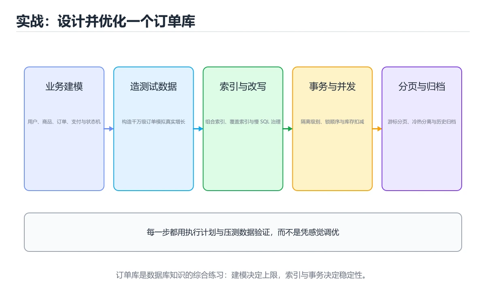
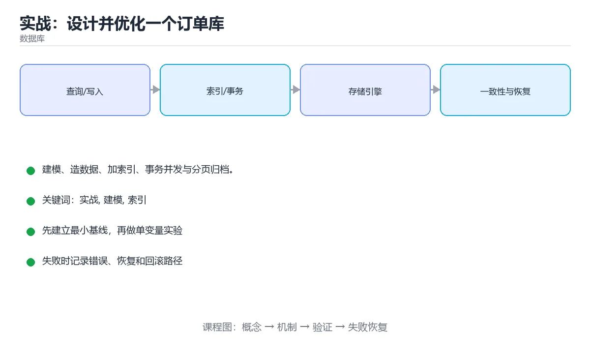

# 实战：设计并优化一个订单库





> 内容更新时间：2026-10-06 · 学习阶段：进阶 · 预计用时：60 分钟

## 学习目标

- 能用自己的话解释实战：设计并优化一个订单库解决了什么问题，而不是只背术语。
- 能说清 「实战」、「建模」、「索引」、「EXPLAIN」 之间的关系，并分别举出一个例子。
- 能把 实战 放回「实战：设计并优化一个订单库」的知识体系，说明它和 建模 的边界。
- 能完成本课练习，并用验收标准检查自己的结果。

> 一句话摘要：建模、造数据、加索引、事务并发与分页归档。

## 前置知识

- 先完成上一课《倒排索引与搜索》；如果已经掌握，可以直接用本课练习自测。
- 开始前先复习：实战、建模、索引。
- 如果 目标 这一步看不懂，先记录具体卡点，再用 CURRENT_TIMESTAMP 复现一遍。

## 目标

从零设计一个电商订单库，制造真实的性能问题再用索引与 SQL 优化解决，完整体验「建模 → 索引 → 慢查询 → 事务」闭环。

## 第一步：建模

表：`users`、`products`、`orders`、`order_items`（多对多中间表，冗余下单时的价格快照）。字段设计遵循：主键用自增或雪花 ID、金额用 DECIMAL、时间统一 UTC、布尔用明确命名（is_paid）、加 created_at/updated_at。满足 3NF，必要时为查询性能做有意识的反范式。

## 第二步：造数据与制造慢查询

插入百万级订单后，执行「查某用户最近 20 笔订单」「统计某商品月销量」「按城市分组统计 GMV」。此时没有索引，观察全表扫描耗时。

## 第三步：加索引并验证

| 查询 | 索引 |
| --- | --- |
| 用户最近订单 | `(user_id, created_at DESC)` 复合索引 |
| 商品月销量 | `(product_id, created_at)` |
| 状态筛选 | 高选择性列优先，注意最左前缀 |

每次加索引后用 `EXPLAIN`/`EXPLAIN ANALYZE` 对比：是否从 SCAN 变成 SEARCH，预估行数与实际是否接近。

## 第四步：事务与并发

实现下单：扣库存 + 创建订单 + 写明细，放在同一事务中；用 `SELECT ... FOR UPDATE` 或原子更新避免超卖。然后开两个会话模拟并发，观察锁等待与死锁日志。

## 第五步：分页与归档

把深分页 `LIMIT 20 OFFSET 100000` 改成游标分页 `WHERE id < last_id`；把超过一年的订单归档到历史表，验证主表体积下降后的查询提升。

## 验收标准

1. 每个慢查询都有优化前后耗时与执行计划对比。
2. 能解释为什么索引能生效，以及哪种写法会让它失效。
3. 事务能正确处理并发扣减，且有回滚验证。

## 交付物与评分标准

**交付物**：建表与索引 SQL 脚本、造数脚本、五组慢查询的「优化前/优化后」执行计划与耗时对比表、并发下单的验证记录（含一次锁等待或死锁日志）。

**评分标准**：建模合理 25%（范式与必要冗余的取舍有说明）、索引有效 30%（能用 EXPLAIN 证明从扫描变为索引查找）、事务正确 25%（并发下无超卖且能回滚）、分页与归档 20%（深分页优化有数据支撑）。

**常见失败案例**：① 给每个字段都建索引导致写入变慢；② 用 `SELECT *` 使覆盖索引失效；③ 事务里调用外部接口造成长时间持锁；④ 只在小数据量上测，看不出全表扫描的代价。

## 本课小结

这个实战把**建模、索引、执行计划、事务、分页**串成一条线；实际工作中 90% 的数据库问题都能用这套方法定位。

## 订单库设计速查

| 表 | 关键字段 | 关键索引 |
| --- | --- | --- |
| `orders` | id、user_id、status、amount、created_at | `(user_id, created_at)`、`(status, created_at)` |
| `order_items` | order_id、product_id、快照字段、quantity | `(order_id)` |
| `payments` | order_id、channel、status、paid_at | `(order_id)`、`(status, created_at)` |
| `inventory` | product_id、available、reserved、version | 主键 + 版本号 |
| `order_events` | order_id、event_type、payload、created_at | `(order_id, created_at)` |

设计要点：

- 金额用 `DECIMAL(12,2)` 或整数分，禁止浮点
- 状态用受限字符串或字典表，迁移必须走状态机
- 订单项保存商品快照（名称、单价），避免历史订单随商品变更
- 关键查询都要能命中索引，禁止线上出现全表扫描
- 追加事件表记录状态流转，便于排查与对账

```sql
-- 防超卖：条件更新，不依赖先读后写
UPDATE inventory
SET available = available - 1,
    reserved  = reserved + 1,
    version   = version + 1
WHERE product_id = 1001
  AND available >= 1;
-- 影响行数为 0 说明库存不足，业务层据此返回失败

-- 幂等下单：唯一索引兜底防重复提交
CREATE TABLE idempotency_keys (
    key_id VARCHAR(64) PRIMARY KEY,
    user_id BIGINT NOT NULL,
    created_at DATETIME(3) NOT NULL DEFAULT CURRENT_TIMESTAMP(3),
    response_body JSON NULL
);

-- 每组取最新一条（用户最近订单）：窗口函数
SELECT *
FROM (
    SELECT o.*,
           ROW_NUMBER() OVER (PARTITION BY user_id ORDER BY created_at DESC, id DESC) AS rn
    FROM orders o
) t
WHERE rn = 1;

-- 订单状态流转审计
INSERT INTO order_events (order_id, event_type, payload)
VALUES (1001, 'paid', JSON_OBJECT('channel', 'alipay', 'amount', 59.70));
```

## 压测与验收速查

| 项 | 目标示例 |
| --- | --- |
| 下单 P95 | < 200 ms |
| 查询订单 P95 | < 100 ms |
| 库存扣减压测 | 并发 500 无超卖、无死锁堆积 |
| 慢查询 | 上线后 0 条全表扫描 |
| 数据一致性 | 对账任务零差异 |
| 备份恢复 | RTO < 30 分钟，演练通过 |

## 常见错误与排查

| 容易踩的做法 | 实际现象 | 原因与正确做法 |
| --- | --- | --- |
| 先查库存再更新 | 并发下超卖 | 用条件更新或加锁 |
| 金额用浮点 | 对账出现分位偏差 | 用 `DECIMAL` 或整数分 |
| 没有幂等键 | 重复提交产生多单 | 幂等键 + 唯一索引 |
| 订单项不存快照 | 历史订单金额被改 | 保存下单时的名称与单价 |
| 状态随意更新 | 出现非法状态 | 状态机校验 + 事件表审计 |
| 查询不带分片键 | 跨全部分片 | 设计查询时带上分片键 |
| 无对账任务 | 差异无人发现 | 定时与支付渠道对账 |
| 只压测查询不压测写入 | 上线写入瓶颈 | 写入路径同样压测 |
| 忽略死锁重试 | 偶发下单失败 | 捕获死锁错误并有限重试 |
| 上线后不看慢查询 | 性能逐渐劣化 | 持续监控并定期优化 |

## 复习与自测

- [ ] 订单库核心表与索引覆盖主要查询。
- [ ] 扣库存用条件更新，且有幂等保护。
- [ ] 金额、时间、状态字段类型与约束正确。
- [ ] 有状态流转审计与对账机制。
- [ ] 关键路径都有压测数据与监控指标。

## 动手练习

> 本课练习重点：围绕「实战、建模、索引」完成复述、实验和交付，每个结果都要能被别人检查。

先确定 建模 的约束，再决定索引与事务边界。

### 练习 1：建立心智模型（10 分钟）

合上教程，用 3～5 句话回答：

1. 实战：设计并优化一个订单库解决了什么问题？
2. 如果没有它，会出现什么具体后果？
3. 它和「建模」是什么关系？

验收标准：回答里必须出现 实战，并写出一个让结论失效的边界条件。

### 练习 2：做一次可控实验（20 分钟）

从正文中选一个最小示例，完成以下操作：

1. 先预测修改一个参数、输入或步骤后的结果。
2. 再实际执行或逐步推演，记录真实结果。
3. 如果结果与预测不同，写出差异原因。

**验收标准**：围绕「目标」小节做一次五步记录，原例取自 CURRENT_TIMESTAMP，改动只允许动一处实战，原因要能指回正文的判断依据。

### 练习 3：交付一个小结果（30 分钟）

先用最小表结构验证 CURRENT_TIMESTAMP，确认结果正确后再迁移到主库。

任务要求：

- 结果必须能被别人检查，不能只写“我已经理解了”。
- 至少覆盖「实战」和「建模」两个关键词。
- 写出 1 个仍然不确定的问题，以及下一步如何验证。

> 提示：时间有限时优先做练习 1 和练习 2；练习 3 可以拆成两次完成。

## 深入补充：实战：设计并优化一个订单库

前面已经建立了基本概念。这一节换一个角度，把实战：设计并优化一个订单库放进真实工程里，
重点回答三件事：CURRENT_TIMESTAMP 解决什么问题、依赖哪些前提、在什么条件下失效。

### 一、核心模型

订单库项目把表设计、索引、事务、锁、查询优化和容量规划串起来；目标不是写几条 SQL，而是让系统在并发、异常和数据增长下保持正确与可运维。

```text
需求与访问模式 → 表结构与约束 → 索引设计 → 事务边界 → 压测与执行计划 → 容量与备份 → 上线与监控
```

### 二、关键机制拆解

1. 订单主表保存订单号、用户、状态、金额和时间，明细表保存商品快照、数量和单价。
2. 金额使用整数分或高精度类型，状态字段加约束，所有关键查询都有对应索引。
3. 创建订单涉及扣库存、写订单和写明细，必须明确事务边界与失败补偿。
4. 热点查询包括用户订单列表、订单详情、商家对账和超时订单扫描，各自需要不同索引。
5. 分页使用游标或时间范围，避免大偏移量导致扫描大量无效行。
6. 备份、慢查询日志、连接数、锁等待和复制延迟都要监控。
7. 数据增长后考虑归档、分区或分库分表，但必须先做容量预测和迁移演练。

### 三、对照表：抓住容易混淆的边界

| 维度 | 一侧 | 另一侧 |
| --- | --- | --- |
| 订单主表 | 一行一个订单 | 保存汇总状态和金额 |
| 订单明细 | 一行一个商品快照 | 保存数量、单价和优惠 |
| 事务 | 保证原子写入 | 跨服务时改用补偿和幂等 |
| 归档 | 把历史数据移出主库 | 降低在线库容量和扫描成本 |

### 四、工作示例

用户订单列表查询 `WHERE user_id=? ORDER BY created_at DESC LIMIT 20` 使用联合索引 `(user_id, created_at)`；下一页使用上一页最后一条的时间和 ID 作为游标，避免 OFFSET 越来越大。

### 五、常见误区与失效边界

| 错误做法或假设 | 后果 | 正确做法 |
| --- | --- | --- |
| 金额用浮点数 | 对账出现精度误差 | 使用整数分或 DECIMAL |
| 订单和明细不在同一事务 | 出现半条订单 | 本地事务保证原子性，跨服务用补偿 |
| 分页用大 OFFSET | 越翻越慢 | 使用游标分页 |
| 上线前不做容量压测 | 大促时连接池和磁盘先崩 | 预估 QPS、数据量和增长曲线 |

### 六、场景推演

订单库在促销期间写入延迟升高。排查发现明细表索引过多导致写放大，同时慢查询扫描历史数据。删除低效索引、归档历史订单并优化分页后，写入延迟恢复。

### 七、自测问答

**Q1：订单金额为什么不用浮点数？**

浮点数存在精度误差，金额应使用整数分或 DECIMAL。

**Q2：游标分页相比 OFFSET 的优势是什么？**

它从上一页位置继续扫描，不需要跳过大量行。

**Q3：跨服务下单如何保证一致性？**

使用本地事务、Outbox、幂等和补偿实现最终一致。

**Q4：订单库容量规划要看什么？**

QPS、数据增长、索引大小、连接数、磁盘和备份恢复时间。

### 八、小项目：把知识变成可检查的产出

完整设计一个订单库：建表、约束、索引、事务、典型查询和压测脚本；模拟 100 万订单和 500 万明细，输出执行计划、慢查询和一次容量预测。

### 九、适用边界

单库优化解决不了所有规模问题。分库分表会引入分布式事务、跨片查询和运维复杂度，只有在容量和延迟数据支持时才值得做。

### 十、完成检查清单

- [ ] 能设计订单与明细表结构
- [ ] 能围绕查询建立索引
- [ ] 能定义事务与补偿边界
- [ ] 能进行容量和慢查询分析
- [ ] 能设计归档与分片方案

### 十一、复习顺序

1. 合上教程复述 实战，确认能说出它解决的三个问题。
2. 再对照表逐行解释容易混淆的概念，每个概念补一个反例。
3. 跟着工作示例做一遍，改变一个条件并预测结果。
4. 用自测问答检查理解，错题回到对应小节重新阅读。
5. 最后完成 实战 的小项目，把结果、失败记录和复查清单整理成可提交产物。

> 复习不是重读一遍，而是离开原文重新产出：复述、改写、验证、复盘。

## 验证命令与预期输出

「实战：设计并优化一个订单库」不能只看「能编译」，还要能按固定命令复现结果。下表给出最低验证集：

| 阶段 | 命令 | 预期输出 |
| --- | --- | --- |
| 安装依赖 | `python -m pip install -r requirements.txt` | 依赖安装完成，没有版本冲突 |
| 语法检查 | `python -m compileall .` | 所有模块编译通过 |
| 运行测试 | `python -m pytest -q` | 测试全部通过，失败用例数为 0 |
| 启动示例 | `python main.py` | 服务启动并输出监听地址 |

### 验收证据

- [ ] 保存依赖安装和启动命令的完整输出。
- [ ] 为 CURRENT_TIMESTAMP 补三条测试：正常、边界、失败各一条。
- [ ] 重复执行 实战 的操作两次，确认没有重复写入或副作用。
- [ ] 记录一次失败状态码、错误日志和恢复步骤。
- [ ] 交付说明包含版本、启动、验证与回滚四部分。

### 回归与回滚

1. 用临时环境验证 CURRENT_TIMESTAMP，确认无误后再对真实数据执行。
2. 修改一处逻辑后重跑全部验证命令，确认没有回归。
3. 若失败，回滚到上一个可运行版本并保留失败日志。
4. 定位原因后补一条自动化测试，再重新执行发布流程。
5. 把教训写入项目复盘或本课笔记，形成下一次的检查项。

## 可运行练习

### 任务 1：先跑通，再解释

```sql
-- 防超卖：条件更新，不依赖先读后写
UPDATE inventory
SET available = available - 1,
    reserved  = reserved + 1,
    version   = version + 1
WHERE product_id = 1001
  AND available >= 1;
-- 影响行数为 0 说明库存不足，业务层据此返回失败

-- 幂等下单：唯一索引兜底防重复提交
CREATE TABLE idempotency_keys (
    key_id VARCHAR(64) PRIMARY KEY,
    user_id BIGINT NOT NULL,
    created_at DATETIME(3) NOT NULL DEFAULT CURRENT_TIMESTAMP(3),
    response_body JSON NULL
);

-- 每组取最新一条（用户最近订单）：窗口函数
SELECT *
FROM (
    SELECT o.*,
           ROW_NUMBER() OVER (PARTITION BY user_id ORDER BY created_at DESC, id DESC) AS rn
    FROM orders o
) t
WHERE rn = 1;

-- 订单状态流转审计
INSERT INTO order_events (order_id, event_type, payload)
VALUES (1001, 'paid', JSON_OBJECT('channel', 'alipay', 'amount', 59.70));
```

### 任务 2：只改一个条件

把「实战：设计并优化一个订单库」的最小示例复制一份，只改一个条件再跑一次：

- 改动点：只调整 CURRENT_TIMESTAMP 的一个参数，其余条件一律不动。
- 预测：先写下「实战：设计并优化一个订单库」在改动后的输出或错误信息，再运行。
- 记录：对照改动前后的结果，指出差异出在哪一步。
- 验收：换回原条件能复现原结果，改动只影响实战。

### 任务 3：迁移到自己的数据

把 CURRENT_TIMESTAMP 换成你自己的输入，先保持步骤不变，再比较输出差异。

## 故障现场

### 现场 1：订单项不存快照

**症状**：在《实战：设计并优化一个订单库》的复现场景中，历史订单金额被改。

**根因**：“历史订单金额被改”只是表层结果。向上追溯会落到“订单项不存快照”这一步，因为它省略了《实战：设计并优化一个订单库》的约束，使实现行为和预期模型发生了偏离。

**修复**：针对《实战：设计并优化一个订单库》的问题，保存下单时的名称与单价。

**验证**：保留《实战：设计并优化一个订单库》里触发“历史订单金额被改”的输入、版本和日志，按“保存下单时的名称与单价”完成修改后原样重放；只有失败现象消失且相邻场景仍可解释，才保留改动。

### 现场 2：状态随意更新

**症状**：在《实战：设计并优化一个订单库》的复现场景中，出现非法状态。

**根因**：触发点是把“状态随意更新”当成安全做法。它没有满足《实战：设计并优化一个订单库》要求的前提，因此先表现为“出现非法状态”；排查时先完整复现这一段，再核对输入、配置与依赖。

**修复**：针对《实战：设计并优化一个订单库》的问题，状态机校验 + 事件表审计。

**验证**：保留《实战：设计并优化一个订单库》里触发“出现非法状态”的输入、版本和日志，按“状态机校验 + 事件表审计”完成修改后原样重放；只有失败现象消失且相邻场景仍可解释，才保留改动。

### 现场 3：只压测查询不压测写入

**症状**：在《实战：设计并优化一个订单库》的复现场景中，上线写入瓶颈。

**根因**：当出现“只压测查询不压测写入”时，执行路径已经绕过了《实战：设计并优化一个订单库》的关键约束，最终以“上线写入瓶颈”暴露出来；修复前必须先确认约束在哪里失效。

**修复**：针对《实战：设计并优化一个订单库》的问题，写入路径同样压测。

**验证**：保留《实战：设计并优化一个订单库》里触发“上线写入瓶颈”的输入、版本和日志，按“写入路径同样压测”完成修改后原样重放；只有失败现象消失且相邻场景仍可解释，才保留改动。

## 本课复习清单

离开本课前，逐项确认：

- [ ] 不看解析，能说出「验证索引是否生效最直接的手段是？」的判断依据。
- [ ] 不看解析，能说出「深分页性能问题应改用？」的判断依据。
- [ ] 不看解析，能说出「下单扣库存防止超卖的常用做法是？」的判断依据。
- [ ] 不看解析，能说出「订单表按用户 ID 分片后，按创建时间做全局排序查询的难点是？」的判断依据。
- [ ] 不看解析，能说出「用条件更新（乐观锁）扣库存失败后，正确的处理是？」的判断依据。
- [ ] 用 实战 构造一个正常输入和一个边界输入，分别记录输出与判断依据。
- [ ] 把本课最容易混淆的两个概念写成一句话对照。

| 复盘项 | 记录 |
| --- | --- |
| 已经能独立解释的考点 |  |
| 仍然说不清的概念 |  |
| 下一步验证动作 |  |

## 术语速查

把「实战：设计并优化一个订单库」里反复出现的术语集中放在一起。复习时先遮住右列，尝试用自己的话解释，再回到正文核对。

| 术语 | 一句话说明 |
| --- | --- |
| `实战` | 实战：设计并优化一个订单库解决了什么问题，而不是只背术语。 |
| `索引` | 完整设计一个订单库：建表、约束、索引、事务、典型查询和压测脚本；模拟 100 万订单和 500 万明细，输出执行计划、慢查询和一次容量预测。 |
| `EXPLAIN` | 评分标准：建模合理 25%（范式与必要冗余的取舍有说明）、索引有效 30%（能用 EXPLAIN 证明从扫描变为索引查找）、事务正确 25%（并发下无超卖且能回滚）、分页与归档 20%（深分页优化有数据支撑）。 |
| `慢查询日志` | 数据库记录超过阈值语句的日志，是定位全表扫描与缺失索引的入口。 |

## 考点精讲

### 考点 1：概念判断·实战

- **题目**：验证索引是否生效最直接的手段是？
- **判断依据**：在「实战：设计并优化一个订单库」里，其他选项：验证索引是否生效最直接的是 EXPLAIN 或 EXPLAIN ANALYZE。在「实战：设计并优化一个订单库」里判断这道题，要把实战、建模、索引的条件、过程与失败路径逐项对齐，换成“验证索引是否生效最直接的手段是”这个场景，只有满足前提的结论才成立。

### 考点 2：多选辨析·实战

- **题目**：围绕“实战：设计并优化一个订单库”中的 实战、建模、索引，下列哪两项是本课强调的实践判断？
- **判断依据**：在「实战：设计并优化一个订单库」里，学习 实战 时要同时说明输入、输出和失败路径，不能只看正常流程。在实战：设计并优化一个订单库里，判断 建模 时要固定版本与边界输入，所以“验证 建模 时要固定版本并覆盖边界输入，结论才可复现”才可复现。「实战：设计并优化一个订单库」要求先交代实战、建模、索引的前提再下结论，所以“学习 实战 时要同时说明输入”只在题干“围绕实战”给定的条件下成立。

### 考点 3：代码补全·实战

- **题目**：下面这段 SQL 代码摘自「实战：设计并优化一个订单库」的正文示例。关于这段代码，下面哪一项说法与实际内容相符？
- **判断依据**：题干的正确项是这段代码只做静态声明，没有循环、分支或可观察输出，在「实战：设计并优化一个订单库」里它只能证明实战相关约束存在，不能替代真实运行证据。这段代码出自「实战：设计并优化一个订单库」的正文示例，围绕实战、建模、索引展开；把输入或边界换成空值、极值或失败情况后，结论要以「实战：设计并优化一个订单库」的实际运行结果为准。这道题的关键在「实战：设计并优化一个订单库」的实战、建模、索引：先确认题干“下面这段 SQL 代码摘自实战”问的是哪一步，再排除偷换前提的选项。

### 考点 4：概念判断·实战

- **题目**：订单表按用户 ID 分片后，按创建时间做全局排序查询的难点是？
- **判断依据**：在「实战：设计并优化一个订单库」里，结论应落在「需要跨分片聚合与排序」。这是「按 A 分片、按 B 查询」的经典问题，需要冗余一份面向查询的数据。在「实战：设计并优化一个订单库」里，这道题要求区分概念与边界，「需要跨分片聚合与排序」只有在题干给出的前提下才成立，而「不能用时间字段」、「必须改为字符串主键」缺少同一组条件。

### 考点 5：概念判断·实战

- **题目**：用条件更新（乐观锁）扣库存失败后，正确的处理是？
- **判断依据**：UPDATE ... WHERE stock >= n 的返回值就是影响行数，必须检查。在「实战：设计并优化一个订单库」里，其他选项：条件更新失败说明库存不足或版本冲突，应有限次重试或直接返回失败，绝不能无视返回值继续下单。「实战：设计并优化一个订单库」要求先交代实战、建模、索引的前提再下结论，所以“有限次重试或直接返回失败”只在题干“用条件更新（乐观锁）扣库存失败后”给定的条件下成立。

### 考点 6：填空·"project": "____",

- **题目**：补全代码：「实战：设计并优化一个订单库」示例中，下面这行代码缺少哪个关键字或函数名？请填入 ____。 `"project": "____",`
- **判断依据**：空格应填写「database_project」。回到「实战：设计并优化一个订单库」的正文示例，用“补全代码”走一遍实战、建模、索引的完整流程，能复现的结论才可以保留。回到实战、建模、索引本身再看一遍：只有“databaseproject”与题干“设计并优化一个订单库示例中”的前提一致，结论才成立。

## English Overview

**Title:** Project: Orders Schema and Tuning

**Summary:** Schema, indexes, transactions and pagination.

**Category:** Database
**Level:** 高级
**Key terms:** 实战, 建模, 索引, EXPLAIN, 事务

## 内容元数据

- 内容版本：v2.0
- 最后更新：2026-10-06
- 学习阶段：进阶
- 适用环境：PostgreSQL / MySQL / SQLite 等主流数据库；本课聚焦其中的 实战。
- 内容来源：内置结构化课程与工程实践整理
- 相关主题：实战、建模、索引、EXPLAIN、事务
- 质量版本：P0 测验标准 + P1 覆盖扩展 + P2 体验补全

## 项目专属规格：实战：设计并优化一个订单库

### 核心场景

建模、造数据、加索引、事务并发与分页归档。 项目目标是把「实战、建模、索引、EXPLAIN、事务」落实为可运行、可测试、可回滚的交付物。

### 架构与数据流

```text
用户/输入 → 接口或命令 → 领域逻辑 → 存储/外部依赖 → 输出与监控
                         ↘ 失败分类 → 重试/补偿 → 回滚
```

### 最小数据模型

| 对象 | 关键字段 | 约束 |
| --- | --- | --- |
| 输入实体 | 实战、时间、来源 | 必填校验、长度限制、幂等键 |
| 任务实体 | 状态、优先级、创建时间 | 状态迁移合法、不可重复执行 |
| 结果实体 | 输出、错误码、耗时 | 可序列化、错误可解释 |
| 审计记录 | 操作者、动作、结果、时间 | 不可篡改、可查询、脱敏 |

### 验收场景

1. 正常路径：最小输入得到预期输出，并留下日志与指标。
2. 边界路径：建模 在重复提交与超长输入下不产生额外副作用。
3. 失败路径：依赖超时或不可用时能快速失败、重试或降级。
4. 幂等路径：同一请求执行两次不会产生重复副作用。
5. 回滚路径：撤掉 CURRENT_TIMESTAMP 的变更后，数据与资源都回到变更前的状态。

## 项目交付物

### 建议仓库结构

```text
src/
tests/
docs/
README.md
```

### 测试矩阵

| 层级 | 覆盖内容 | 最低数量 | 通过标准 |
| --- | --- | ---: | --- |
| 单元测试 | 领域规则、边界和错误分类 | 8 | 正常、边界、失败路径全部通过 |
| 集成测试 | 数据库、网络、文件或平台边界 | 3 | 使用真实边界且可重复运行 |
| 端到端测试 | 核心用户路径 | 1 | 从输入到输出完整跑通 |
| 手动验收 | 文档中列出的 5 个场景 | 5 | 有命令、输出和结论记录 |

### 验收数据

```json
{
  "project": "database_project",
  "scenario": "实战的正常路径",
  "input": {"case": "normal", "value": "CURRENT_TIMESTAMP"},
  "expected": {"ok": true, "checks": ["实战可复现", "建模有记录"]},
  "failure_case": {"case": "建模越界或缺失", "error": "validation_error"},
  "idempotency_key": "database_project-001"
}
```

### 复盘模板

| 问题 | 记录 |
| --- | --- |
| 原目标是什么？ | 用一句话描述可验收目标 |
| 实际发生了什么？ | 时间线、指标和关键日志 |
| 哪个假设被推翻？ | 根因与促成因素 |
| 如何回滚？ | 步骤、耗时和数据校验 |
| 下一步做什么？ | 负责人、期限和验证方式 |

> 项目验收围绕「实战、建模、索引」：至少完成一次正常路径、一次边界输入、一次失败恢复和一次幂等检查。

## 参考资料与复核

- 最后复核：2026-10-04
- 下次复核：2027-06-10
- 复核范围：版本兼容、API 行为、安全建议与工程实践
- 来源性质：官方文档、标准或权威教材；正文为离线教学重组

| 参考资料 | 本课用途 |
| --- | --- |
| [MySQL 文档](https://dev.mysql.com/doc/) | 关系数据库与 InnoDB |
| [JDBC 事务](https://docs.oracle.com/javase/tutorial/jdbc/basics/transactions.html) | 连接事务与回滚 |
| [SQLite 文档](https://sqlite.org/docs.html) | 嵌入式 SQL 与事务 |

> 「实战：设计并优化一个订单库」的链接用于离线阅读后的延伸核对；App 不会自动联网。

<!-- p1-project-review:start -->
## 交付评审：评分表、决策记录与证据链

「实战：设计并优化一个订单库」的验收不能只看功能能不能跑通。下面把正文里的交付物、验证命令和关键设计点整理成一张评审表，按表逐项留下证据即可。

### 一、「实战：设计并优化一个订单库」的交付物评分表

| 交付物 | 权重 | 合格线 | 需要的证据 |
| --- | ---: | --- | --- |
| 建表与索引 SQL 脚本 | 25% | 能在干净环境复现，且失败路径有明确处理 | 命令与输出、对应测试、一次失败与恢复记录 |
| 造数脚本 | 25% | 能在干净环境复现，且失败路径有明确处理 | 命令与输出、对应测试、一次失败与恢复记录 |
| 五组慢查询的「优化前/优化后」执行计划与耗时对比表 | 25% | 能在干净环境复现，且失败路径有明确处理 | 命令与输出、对应测试、一次失败与恢复记录 |
| 并发下单的验证记录（含一次锁等待或死锁日志）。 | 25% | 能在干净环境复现，且失败路径有明确处理 | 命令与输出、对应测试、一次失败与恢复记录 |

「实战：设计并优化一个订单库」的评分先看证据再打分：任意一项只要拿不出可复现的命令或测试，该项按 0 分计，不允许用「基本完成」代替。

### 二、需要写下来的决策（ADR）

| 决策点 | 本课给出的做法 | 备选方案 | 代价与回滚 |
| --- | --- | --- | --- |
| 一、核心模型 | 订单库项目把表设计、索引、事务、锁、查询优化和容量规划串起来；目标不是写几条 SQL，而是让系统在并发、异常和数据增长下保持正确与可运维。 | 不做「一、核心模型」，沿用最朴素的实现（需要额外补一次对照实验） | 若「一、核心模型」出问题，回到上一版本并按本课验收场景重跑 |
| 九、适用边界 | 单库优化解决不了所有规模问题。 | 不做「九、适用边界」，沿用最朴素的实现（需要额外补一次对照实验） | 若「九、适用边界」出问题，回到上一版本并按本课验收场景重跑 |
| 架构与数据流 | 用户/输入 → 接口或命令 → 领域逻辑 → 存储/外部依赖 → 输出与监控 | 不做「架构与数据流」，沿用最朴素的实现（需要额外补一次对照实验） | 若「架构与数据流」出问题，回到上一版本并按本课验收场景重跑 |

ADR 不需要长：每个决策三行就够——选了什么、放弃了什么、出问题怎么退。评审时只检查这三行是否和「实战：设计并优化一个订单库」的实际代码一致。

### 三、「实战：设计并优化一个订单库」的交付证据链

本课未给出可执行命令，用下面的最小证据集代替：

1. 一条从零开始的环境准备命令。
2. 一条跑通核心链路的命令及其完整输出。
3. 一条触发失败的命令，以及恢复后的验证结果。

把「实战：设计并优化一个订单库」的上表整理成一个 evidence/ 目录：每条命令一个文件，文件名带日期，内容包含版本、命令与输出。评审时直接按目录核对，不再口头确认。

### 四、「实战：设计并优化一个订单库」的验收指标

| 指标 | 目标值 | 测量方式 | 不达标时的动作 |
| --- | --- | --- | --- |
| 插入百万级订单后，执行「查某用户最近 20 笔订单」「统计某商品月销量」「按城市分组统计 GMV」。此时没有索引，观察全表扫描耗时。 | 用本课正文给出的阈值，没有就写实测基线 | 固定环境重复三次取中位数 | 回到对应小节定位，先修原因再重测 |

指标必须能用一条命令或一次操作测出来；写不出测量方式的指标，在「实战：设计并优化一个订单库」的评审里一律视为未定义。

### 五、评审记录模板

| 记录项 | 填写要求 |
| --- | --- |
| 项目标识 | `database_project` |
| 本次范围 | 说明这一轮交付了「实战：设计并优化一个订单库」的哪些部分 |
| 未完成项 | 列出与 实战 相关但本轮未做的内容 |
| 证据位置 | 指向 evidence/ 目录下的具体文件 |
| 风险与回滚 | 写清剩余风险、回滚步骤和验证方式 |
| 结论 | 通过 / 有条件通过 / 不通过，三者选一 |

「实战：设计并优化一个订单库」评审结束后把这张表填完并归档；下一轮迭代直接读上一次的「未完成项」与「风险与回滚」，避免重复讨论同一个问题。
<!-- p1-project-review:end -->
