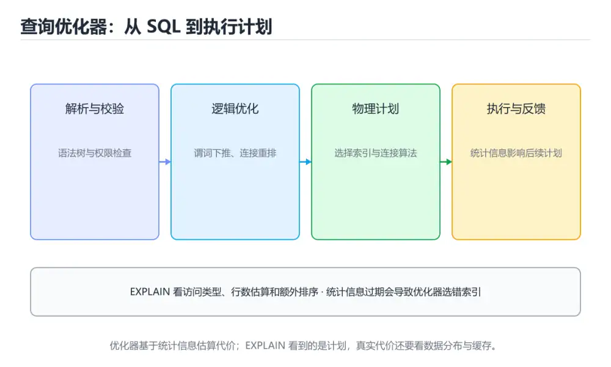
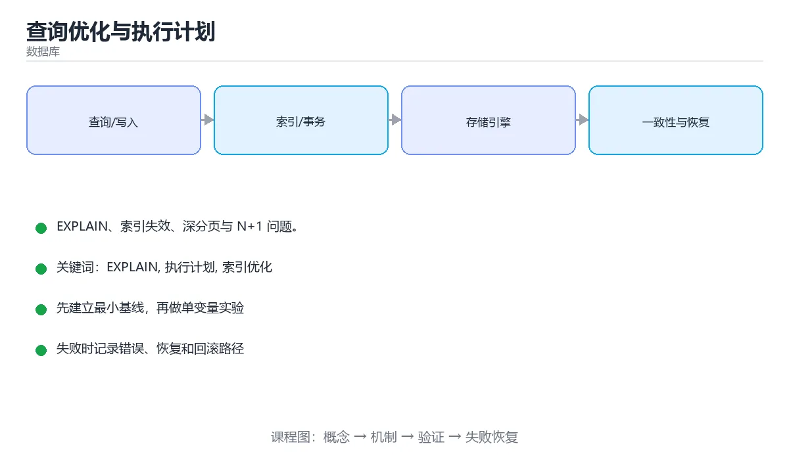

# 查询优化与执行计划

> 内容更新时间：2026-10-06 · 学习阶段：进阶 · 预计用时：40 分钟





## 本节知识框架

**课程定位**：所属分类 `database`（数据库），课程主题 `查询优化与执行计划`，学习阶段 进阶，建议用时 40 分钟。

本课主线：EXPLAIN、索引失效、深分页与 N+1 问题。

**学完本课应当能够**
- 说清 `SCAN` 与 `ANALYZE` 的含义与区别，并各举一个正例和一个反例。
- 用本课示例验证 `执行计划` 的行为，记录输入、输出与失败条件。
- 遇到「只看 `type` 忽略 `rows`」这类问题时，能说出触发条件与修复顺序。

### 从概念到验证的学习链条

1. `SCAN`：先掌握 关注点：是 `SCAN`（全表扫描）还是 `SEARCH ... USING INDEX`；预估行数与实际行数差异大不大；有没有额外的排序与临时表，再用它解释 `ANALYZE` 为什么会出现。
2. `ANALYZE`：先掌握 统计信息过期会导致优化器选错索引，定期 `ANALYZE`，再用它解释 `执行计划` 为什么会出现。
3. `执行计划`：先掌握 数据库优化器为查询选出的访问路径、连接顺序和算子组合，再用它解释 `覆盖索引` 为什么会出现。
4. `覆盖索引`：先掌握 索引里已经包含查询需要的全部列，不必回表，能显著减少随机 I/O，再用它解释 本课示例的观察结果 为什么会出现。

**先修与衔接**：本课是「数据库」分类的第 7 课。先修内容：《数据库设计与范式》。《数据库设计与范式》里的 `DECIMAL`、`is_active` 是本课的前提。相关或后续课程：《NoSQL 数据库》。

### 完成判据

- **定义关**：不看正文也能说明 `SCAN` 是 关注点：是 `SCAN`（全表扫描）还是 `SEARCH ... USING INDEX`，预估行数与实际行数差异大不大，有没有额外的排序与临时表，并指出一个反例。
- **机制关**：能按“输入 → 转换 → 输出 → 验证”复述 `查询优化与执行计划`，而不是只背结论。
- **示例关**：能运行或推演 `查询优化与执行计划` 的 `sql` 示例，并说明一个真实出现的标识符或字面量。
- **证据关**：能指出 `查询优化与执行计划` 示例里的 调用了 `EXPLAIN()`，并说明它支持或反驳了本课的哪一条结论。
- **排错关**：能复现 只看 `type` 忽略 `rows`，记录现象并按 两者结合看 修复。
- **迁移关**：能把 `EXPLAIN`、`执行计划`、`索引优化`、`分页` 放进一个与 `查询优化与执行计划` 不同的项目场景，并保持输入与验证条件可追踪。
- **复盘关**：学完 `查询优化与执行计划` 后，用一句话写下仍然不确定的结论，并列出下一次验证需要的输入、环境和成功判据。

### 复习清单

- [ ] 能不看正文复述本课核心术语，并指出一个边界或反例。
- [ ] 能运行或推演本课示例，记录输入、输出与失败现象。
- [ ] 能完成一次自测，并把错题对照错误表定位原因。

## 核心概念定义

| 术语 | 操作性定义 | 常见边界与风险 |
| --- | --- | --- |
| SCAN | 关注点：是 SCAN（全表扫描）还是 SEARCH ... USING INDEX；预估行数与实际行数差异大不大；有没有额外的排序与临时表。 | 索引命中与数据分布决定实际开销，判断前先看执行计划而不是只看结果是否正确。 |
| ANALYZE | 统计信息过期会导致优化器选错索引，定期 ANALYZE。 | 易错：判断偏差；正确做法是用 `EXPLAIN ANALYZE` 看真实行数。 |
| 执行计划 | 数据库优化器为查询选出的访问路径、连接顺序和算子组合。 | 索引命中与数据分布决定实际开销，判断前先看执行计划而不是只看结果是否正确。 |
| 覆盖索引 | 索引里已经包含查询需要的全部列，不必回表，能显著减少随机 I/O。 | 易错：问题依旧；正确做法是改游标分页或覆盖索引 + 延迟关联。 |

## 原理与运行机制

### 机制总览

**教材衔接：其他要点**

1. 统计信息过期会导致优化器选错索引，定期 `ANALYZE`。
2. 事务要短，避免长事务持有锁导致连锁阻塞。
3. 批量插入用一条多值 INSERT 或事务包裹。
4. 连接池大小要匹配数据库承载能力，不是越大越好。

**教材衔接：改写清单速查**

| 原写法 | 问题 | 改写 |
| --- | --- | --- |
| `WHERE YEAR(created_at) = 2025` | 列上函数导致索引失效 | `created_at >= '2025-01-01' AND created_at < '2026-01-01'` |
| `WHERE id + 1 = 100` | 列参与运算 | `id = 99` |
| `LIKE '%abc'` | 左模糊无法用索引 | 前缀搜索或全文索引 |
| `LIMIT 20 OFFSET 100000` | 深分页扫描大量行 | 基于游标：`WHERE id > last_id ORDER BY id LIMIT 20` |
| `OR` 连接不同列 | 可能全表扫描 | 拆成 `UNION ALL` 或建联合索引 |
| `SELECT *` | 无法覆盖索引 | 只选需要的列 |
| 子查询返回大量行 | 物化开销大 | 改 `JOIN` 或 `EXISTS` |
| `ORDER BY` 与索引顺序不一致 | 需要额外排序 | 调整索引顺序匹配排序 |
| `JOIN` 大表无索引 | 全表扫描 | 关联列必须建索引 |
| 统计信息过期 | 选错执行计划 | `ANALYZE TABLE` 更新统计 |

### 机制拆解：每一步的输入、动作与输出

#### 1. `SCAN`
- 输入：`EXPLAIN`；本步把 关注点：是 `SCAN`（全表扫描）还是 `SEARCH ... USING INDEX`；预估行数与实际行数差异大不大；有没有额外的排序与临时表 当作判断规则。
- 动作：围绕 `SCAN` 保留中间状态，并记录它与 `ANALYZE` 的对应关系。
- 输出：`ANALYZE`，它可以被下一段代码、测试或记录继续使用。
- `SCAN` 的失败条件：索引命中与数据分布决定实际开销，判断前先看执行计划而不是只看结果是否正确。

#### 2. `ANALYZE`
- 输入：`SCAN`；本步把 统计信息过期会导致优化器选错索引，定期 `ANALYZE` 当作判断规则。
- 动作：围绕 `ANALYZE` 保留中间状态，并记录它与 `执行计划` 的对应关系。
- 输出：`执行计划`，它可以被下一段代码、测试或记录继续使用。
- `ANALYZE` 的失败条件：当用 `EXPLAIN` 估算值当真实值时，会出现判断偏差。

#### 3. `执行计划`
- 输入：`ANALYZE`；本步把 数据库优化器为查询选出的访问路径、连接顺序和算子组合 当作判断规则。
- 动作：围绕 `执行计划` 保留中间状态，并记录它与 `覆盖索引` 的对应关系。
- 输出：`覆盖索引`，它可以被下一段代码、测试或记录继续使用。
- `执行计划` 的失败条件：索引命中与数据分布决定实际开销，判断前先看执行计划而不是只看结果是否正确。

#### 4. `覆盖索引`
- 输入：`执行计划`；本步把 索引里已经包含查询需要的全部列，不必回表，能显著减少随机 I/O 当作判断规则。
- 动作：围绕 `覆盖索引` 保留中间状态，并记录它与 `EXPLAIN` 的对应关系。
- 输出：`EXPLAIN`，它可以被下一段代码、测试或记录继续使用。
- `覆盖索引` 的失败条件：当深分页只调大 `LIMIT` 缓存时，会出现问题依旧。

### 示例中的可观察事实

1. 调用了 `EXPLAIN()`；它对应的课程主题是 `查询优化与执行计划`。

### 复现实验记录

- 环境：`查询优化与执行计划` 使用 `sql` 示例，固定 `EXPLAIN`、`执行计划`、`索引优化`、`分页` 作为第一组条件。
- 首轮输入：先确认 调用了 `EXPLAIN()`，预测 `SCAN` 会怎样变化。
- 基线观察：记录命令、输入、输出和错误原文，不用截图代替可复制的文本。
- 单变量修改：只改变 `EXPLAIN`，观察 `覆盖索引` 是否仍满足定义。
- 失败注入：复现 只看 `type` 忽略 `rows`，确认现象是 低估扫描量。
- 记录结论：把“修改前、修改后、预期变化、实际变化”写成四列表，这样复盘 `查询优化与执行计划` 时才能区分概念错误与实现错误。

## 典型应用场景

- **只看 `type` 忽略 `rows`**：典型现象是低估扫描量；正确做法是两者结合看。
- **认为加了索引就一定用**：典型现象是优化器可能不选；正确做法是看 `key` 与代价估计，必要时强制验证。
- **索引列上加函数**：典型现象是索引失效；正确做法是改写条件让列保持「裸」状态。
- **联合索引列顺序随意**：典型现象是部分查询用不上；正确做法是按等值在前、范围在后、排序匹配设计。

### 最小验证场景

- 准备：保留 `sql` 示例的原始输入，先记录 `查询优化与执行计划` 的基线输出和完整运行命令。
- 观察：先核对 调用了 `EXPLAIN()`，再改变一个与 `SCAN` 相关的条件。
- 判定：新结果与 `查询优化与执行计划` 的基线不同不等于错误；只有当差异破坏了 `SCAN` 的定义或错误表中的约束，才判定为失败。

### 选择与边界

- 使用 `SCAN` 时，先满足它的定义：关注点：是 `SCAN`（全表扫描）还是 `SEARCH ... USING INDEX`；预估行数与实际行数差异大不大；有没有额外的排序与临时表；索引命中与数据分布决定实际开销，判断前先看执行计划而不是只看结果是否正确。
- 使用 `ANALYZE` 时，先满足它的定义：统计信息过期会导致优化器选错索引，定期 `ANALYZE`；易错：判断偏差；正确做法是用 `EXPLAIN ANALYZE` 看真实行数。
- 使用 `执行计划` 时，先满足它的定义：数据库优化器为查询选出的访问路径、连接顺序和算子组合；索引命中与数据分布决定实际开销，判断前先看执行计划而不是只看结果是否正确。
- 使用 `覆盖索引` 时，先满足它的定义：索引里已经包含查询需要的全部列，不必回表，能显著减少随机 I/O；易错：问题依旧；正确做法是改游标分页或覆盖索引 + 延迟关联。

## 代码/协议/SQL 示例

### 最小可验证示例

```sql
-- SQLite
EXPLAIN QUERY PLAN SELECT * FROM orders WHERE user_id = 42;

-- MySQL
EXPLAIN ANALYZE SELECT * FROM orders WHERE user_id = 42;

-- PostgreSQL
EXPLAIN (ANALYZE, BUFFERS) SELECT * FROM orders WHERE user_id = 42;
```

**教材衔接：先看执行计划**

优化查询第一步不是改 SQL，而是看数据库**怎么执行**它。

关注点：是 `SCAN`（全表扫描）还是 `SEARCH ... USING INDEX`；预估行数与实际行数差异大不大；有没有额外的排序与临时表。

**教材衔接：只取需要的列**

```sql
-- 不推荐：传输多余数据，还妨碍覆盖索引
SELECT * FROM users WHERE city = '上海';

-- 推荐
SELECT id, name FROM users WHERE city = '上海';
```

**教材衔接：JOIN 与子查询**

```sql
-- 相关子查询：外层每一行都要执行一次
SELECT name FROM users u
WHERE EXISTS (SELECT 1 FROM orders o WHERE o.user_id = u.id);

-- JOIN 通常更容易被优化器处理
SELECT DISTINCT u.name
FROM users u JOIN orders o ON o.user_id = u.id;
```

具体哪种更快取决于数据分布与优化器，**必须用执行计划验证**，不要凭直觉。

**教材衔接：EXPLAIN 字段速查**

| 字段 | 关注值 | 含义 |
| --- | --- | --- |
| `type` | const、eq_ref、ref、range、index、ALL | 访问方式，从好到差；`ALL` 是全表扫描 |
| `key` | 实际使用的索引 | 为 `NULL` 表示没用索引 |
| `key_len` | 使用到的索引字节数 | 判断联合索引用了几列 |
| `rows` | 预估扫描行数 | 越小越好 |
| `filtered` | 过滤后剩余百分比 | 越低说明扫描效率越差 |
| `Extra` | Using index / filesort / temporary | `index` 表示覆盖索引；`filesort`、`temporary` 需警惕 |

```sql
-- 1. 估算（不改数据）
EXPLAIN SELECT id, amount FROM orders WHERE user_id = 42 ORDER BY created_at DESC LIMIT 20;

-- 2. 看真实耗时与行数（MySQL 8.0.18+）
EXPLAIN ANALYZE SELECT id, amount FROM orders WHERE user_id = 42;

-- 3. 建立覆盖查询与排序的联合索引
ALTER TABLE orders ADD INDEX idx_user_created_amount (user_id, created_at, amount);

-- 4. 需要看优化器代价与候选索引
EXPLAIN FORMAT = JSON SELECT ...;
-- 运行期统计（MySQL 8）
SELECT * FROM sys.statements_with_full_table_scans LIMIT 10;
```

**运行方式**：运行 `查询优化与执行计划` 的示例时，在本地数据库或用 SQLite 命令行执行；先在测试库上跑，确认影响行数。

### 示例精读：先找证据，再改一个条件

1. 调用了 `EXPLAIN()`；它出现在 `查询优化与执行计划` 的示例中，阅读时先确认它前后各发生了什么。
- 在 `查询优化与执行计划` 中与 `SCAN` 对照：示例必须能支持 关注点：是 `SCAN`（全表扫描）还是 `SEARCH ... USING INDEX`；预估行数与实际行数差异大不大；有没有额外的排序与临时表，否则说明这一段还缺少实现或验证步骤。
- 在 `查询优化与执行计划` 中与 `ANALYZE` 对照：示例必须能支持 统计信息过期会导致优化器选错索引，定期 `ANALYZE`，否则说明这一段还缺少实现或验证步骤。
- 在 `查询优化与执行计划` 中与 `执行计划` 对照：示例必须能支持 数据库优化器为查询选出的访问路径、连接顺序和算子组合，否则说明这一段还缺少实现或验证步骤。
- 在 `查询优化与执行计划` 中与 `覆盖索引` 对照：示例必须能支持 索引里已经包含查询需要的全部列，不必回表，能显著减少随机 I/O，否则说明这一段还缺少实现或验证步骤。

## 时间/空间复杂度或性能分析

**性能关注点（查询优化与执行计划）**：扫描行数与索引命中决定开销：记录查询耗时、执行计划与锁等待。

**本课特有开销（查询优化与执行计划 · EXPLAIN）**：索引能减少扫描行数，但会增加写入与存储开销，需要同时记录读、写两侧代价。

**测量方法**：以 `查询优化与执行计划` 的 `EXPLAIN` 场景为对象，固定输入跑一遍记录基线，再把规模或并发度提高一个数量级复测；两次结果的差值与波动范围才是结论依据。

### 需要控制的变量与记录项

- `查询优化与执行计划` 的 `EXPLAIN`：固定它的版本、输入范围和资源上限，分别记录速度、内存与失败率的变化。
- `查询优化与执行计划` 的 `执行计划`：固定它的版本、输入范围和资源上限，分别记录速度、内存与失败率的变化。
- `查询优化与执行计划` 的 `索引优化`：固定它的版本、输入范围和资源上限，分别记录速度、内存与失败率的变化。
- `查询优化与执行计划` 的 `分页`：固定它的版本、输入范围和资源上限，分别记录速度、内存与失败率的变化。
- `查询优化与执行计划` 的 `N+1`：固定它的版本、输入范围和资源上限，分别记录速度、内存与失败率的变化。
- `查询优化与执行计划` 中 `SCAN` 的边界：索引命中与数据分布决定实际开销，判断前先看执行计划而不是只看结果是否正确。达到边界时不要外推，必须重新测量。
- `查询优化与执行计划` 中 `ANALYZE` 的边界：易错：判断偏差；正确做法是用 `EXPLAIN ANALYZE` 看真实行数。达到边界时不要外推，必须重新测量。
- `查询优化与执行计划` 中 `执行计划` 的边界：索引命中与数据分布决定实际开销，判断前先看执行计划而不是只看结果是否正确。达到边界时不要外推，必须重新测量。
- `查询优化与执行计划` 中 `覆盖索引` 的边界：易错：问题依旧；正确做法是改游标分页或覆盖索引 + 延迟关联。达到边界时不要外推，必须重新测量。
- `查询优化与执行计划` 的代码证据：先验证 调用了 `EXPLAIN()`，再记录该路径的输入规模与耗时；只看代码行数不能推出复杂度。

## 常见误区与易错点

| 容易写错的做法 | 实际现象 | 原因与正确做法 |
| --- | --- | --- |
| 只看 `type` 忽略 `rows` | 低估扫描量 | 两者结合看 |
| 认为加了索引就一定用 | 优化器可能不选 | 看 `key` 与代价估计，必要时强制验证 |
| 索引列上加函数 | 索引失效 | 改写条件让列保持「裸」状态 |
| 联合索引列顺序随意 | 部分查询用不上 | 按等值在前、范围在后、排序匹配设计 |
| 索引建太多 | 写入变慢、空间膨胀 | 只保留被真实查询使用的索引 |
| 用 `EXPLAIN` 估算值当真实值 | 判断偏差 | 用 `EXPLAIN ANALYZE` 看真实行数 |
| 深分页只调大 `LIMIT` 缓存 | 问题依旧 | 改游标分页或覆盖索引 + 延迟关联 |
| 排序字段方向不一致 | 无法利用索引排序 | 索引与排序方向保持一致 |
| 忽略数据分布 | 优化效果不稳定 | 用真实数据量与分布验证 |
| 改完不上监控 | 回归无人发现 | 加慢查询与执行时间监控 |

### 现场 1：只看 `type` 忽略 `rows`

**症状**：低估扫描量。

**根因与修复**：两者结合看。

**自检**：在本课示例里复现「只看 `type` 忽略 `rows`」，改成两者结合看后重跑；如果症状消失且失败路径按预期变化，说明定位正确。

### 现场 2：认为加了索引就一定用

**症状**：优化器可能不选。

**根因与修复**：看 `key` 与代价估计，必要时强制验证。

**自检**：在本课示例里复现「认为加了索引就一定用」，改成看 `key` 与代价估计，必要时强制验证后重跑；如果症状消失且失败路径按预期变化，说明定位正确。

### 现场 3：索引列上加函数

**症状**：索引失效。

**根因与修复**：改写条件让列保持「裸」状态。

**自检**：在本课示例里复现「索引列上加函数」，改成改写条件让列保持「裸」状态后重跑；如果症状消失且失败路径按预期变化，说明定位正确。

### 现场 4：联合索引列顺序随意

**症状**：部分查询用不上。

**根因与修复**：按等值在前、范围在后、排序匹配设计。

**自检**：在本课示例里复现「联合索引列顺序随意」，改成按等值在前、范围在后、排序匹配设计后重跑；如果症状消失且失败路径按预期变化，说明定位正确。

### 现场 5：索引建太多

**症状**：写入变慢、空间膨胀。

**根因与修复**：只保留被真实查询使用的索引。

**自检**：在本课示例里复现「索引建太多」，改成只保留被真实查询使用的索引后重跑；如果症状消失且失败路径按预期变化，说明定位正确。

### 现场 6：用 `EXPLAIN` 估算值当真实值

**症状**：判断偏差。

**根因与修复**：用 `EXPLAIN ANALYZE` 看真实行数。

**自检**：在本课示例里复现「用 `EXPLAIN` 估算值当真实值」，改成用 `EXPLAIN ANALYZE` 看真实行数后重跑；如果症状消失且失败路径按预期变化，说明定位正确。

### 现场 7：深分页只调大 `LIMIT` 缓存

**症状**：问题依旧。

**根因与修复**：改游标分页或覆盖索引 + 延迟关联。

**自检**：在本课示例里复现「深分页只调大 `LIMIT` 缓存」，改成改游标分页或覆盖索引 + 延迟关联后重跑；如果症状消失且失败路径按预期变化，说明定位正确。

### 现场 8：排序字段方向不一致

**症状**：无法利用索引排序。

**根因与修复**：索引与排序方向保持一致。

**自检**：在本课示例里复现「排序字段方向不一致」，改成索引与排序方向保持一致后重跑；如果症状消失且失败路径按预期变化，说明定位正确。

### 现场 9：忽略数据分布

**症状**：优化效果不稳定。

**根因与修复**：用真实数据量与分布验证。

**自检**：在本课示例里复现「忽略数据分布」，改成用真实数据量与分布验证后重跑；如果症状消失且失败路径按预期变化，说明定位正确。

## 与其他知识点的关系

**教材衔接：复习与迁移**

### 概念复述

- 用一句话说明「查询优化与执行计划」解决什么问题：EXPLAIN、索引失效、深分页与 N+1 问题。
- 写出EXPLAIN、执行计划、索引优化之间的关系，并各举一个例子。
- 说出本课最容易混淆的两个概念，以及区分它们的判据。

### 正文逐节复核

- **JOIN 与子查询**：具体哪种更快取决于数据分布与优化器，**必须用执行计划验证**，不要凭直觉。


### 迁移练习

把「查询优化与执行计划」的结论迁移到相邻主题，每次迁移都写清预测与证据：

- **先修**：`数据库设计与范式`。本课默认这些内容已经掌握。
- **相关或后续**：`NoSQL 数据库`。本课术语会在这些课程里继续使用。
- **术语归属**：`SCAN`、`ANALYZE`、`执行计划` 的定义以本课「核心概念定义」为准，换到其他课程时先确认定义是否被改写。
- 同一分类的《索引》也涉及 `EXPLAIN`；两课衔接时先确认这个术语的定义是否一致。
- 同一分类的《实战：设计并优化一个订单库》也涉及 `EXPLAIN`；两课衔接时先确认这个术语的定义是否一致。

### 先修与后续术语接口

- `数据库设计与范式`：两者通过本分类的学习顺序衔接，阅读时重点比较各自的输入与失败条件。
- `NoSQL 数据库`：两者通过本分类的学习顺序衔接，阅读时重点比较各自的输入与失败条件。

### 容易混淆的相邻概念

- `SCAN` 与 `ANALYZE`：前者强调 关注点：是 `SCAN`（全表扫描）还是 `SEARCH ... USING INDEX`；预估行数与实际行数差异大不大；有没有额外的排序与临时表；后者强调 统计信息过期会导致优化器选错索引，定期 `ANALYZE`。判断时分别检查两条定义的适用范围，不要只看名称相似就互换。
- `ANALYZE` 与 `执行计划`：前者强调 统计信息过期会导致优化器选错索引，定期 `ANALYZE`；后者强调 数据库优化器为查询选出的访问路径、连接顺序和算子组合。判断时分别检查两条定义的适用范围，不要只看名称相似就互换。
- `执行计划` 与 `覆盖索引`：前者强调 数据库优化器为查询选出的访问路径、连接顺序和算子组合；后者强调 索引里已经包含查询需要的全部列，不必回表，能显著减少随机 I/O。判断时分别检查两条定义的适用范围，不要只看名称相似就互换。

## 自测题与参考答案

> 先独立作答，再对照参考答案；答案都能在本课正文、术语表或错误表里找到依据。

### 自测 1（概念复述）

不看正文，写出 `SCAN` 的操作性定义，并说明它与 `ANALYZE` 的区别。

**参考答案**：关注点：是 `SCAN`（全表扫描）还是 `SEARCH ... USING INDEX`；预估行数与实际行数差异大不大；有没有额外的排序与临时表。

`ANALYZE` 的定位是：统计信息过期会导致优化器选错索引，定期 `ANALYZE`；两者的差别要从适用对象与失败模式上说明。

### 自测 2（排错）

本课错误表记录了「只看 `type` 忽略 `rows`」这类做法。请写出它会出现的现象、根因，以及修复顺序。

**参考答案**：现象是低估扫描量；正确做法是两者结合看。修复时先复现现象并保留证据，再改动一处假设重跑，确认现象消失。

### 自测 3（动手验证）

运行本课的 `sql` 示例，把其中的 `42` 换成一个边界值后重新运行，记录输出与错误信息。

**参考答案**：正常输入下 `sql` 示例应当复现正文给出的结果；把 `42` 换成边界值后，如果结果改变或报错，先核对它是否满足 `查询优化与执行计划` 中`SCAN` 的适用范围，再检查错误表里是否有同类现象。

### 自测 4（代码阅读）

阅读本课开头的 `sql` 示例，说明它体现了`SCAN` 的哪一条性质，并指出改动哪个输入会让这条性质不再成立。

**参考答案**：`SCAN` 的定义是 关注点：是 `SCAN`（全表扫描）还是 `SEARCH ... USING INDEX`，预估行数与实际行数差异大不大，有没有额外的排序与临时表，示例正是在实现这条定义。改动与 `SCAN` 有关的一个输入后，如果结果不再符合 `查询优化与执行计划` 的正文描述，就说明该性质只在当前前提成立。

### 自测 5（迁移）

把 `查询优化与执行计划` 的方法迁移到自己的项目：围绕 `SCAN` 写出一个与错误表同类的风险点，并说明触发条件和检验方式。

**参考答案**：例如「改完不上监控」，它会导致回归无人发现；检验方式是按加慢查询与执行时间监控改一处再复现，确认现象消失且没有引入新的失败分支。

### 自测 6（对比）

用一个表格对比 `SCAN` 与 `ANALYZE`：各写一行适用场景、一行失败表现。

**参考答案**：`SCAN` 的定义是关注点：是 `SCAN`（全表扫描）还是 `SEARCH ... USING INDEX`；预估行数与实际行数差异大不大；有没有额外的排序与临时表；`ANALYZE` 的定义是统计信息过期会导致优化器选错索引，定期 `ANALYZE`。两者的失败表现分别对应本课错误表里与本术语相关的行。

### 自测 7（排错顺序）

面对「只看 `type` 忽略 `rows`」引发的问题，请把“复现 低估扫描量 → 保留证据 → 两者结合看 → 回归验证”四步写成可执行的检查清单。

**参考答案**：第一步按低估扫描量复现；第二步记录输入、版本与完整报错；第三步按两者结合看只改一处；第四步重跑并确认失败路径也按预期变化。

### 自测 8（边界判断）

针对 `覆盖索引`，分别写出“可以使用”的条件和“结论不再成立”的条件。

**参考答案**：易错：问题依旧；正确做法是改游标分页或覆盖索引 + 延迟关联。 同时要把 `覆盖索引` 的定义 索引里已经包含查询需要的全部列，不必回表，能显著减少随机 I/O 与实际输入逐项对照。

### 自测 9（机制重建）

不看正文，按输入、转换、输出、验证四段重建 `SCAN` → `ANALYZE` → `执行计划` → `覆盖索引` 的作用链。

**参考答案**：起点是 `SCAN` 的定义 关注点：是 `SCAN`（全表扫描）还是 `SEARCH ... USING INDEX`；预估行数与实际行数差异大不大；有没有额外的排序与临时表；中间每一步都保留可观察状态；终点由 `覆盖索引` 检查，失败时回到错误表定位第一个偏离定义的步骤。

### 自测 10（综合排错）

在 `查询优化与执行计划` 中，现象是 回归无人发现。请围绕 改完不上监控 写出最小复现、关键证据、修复动作和回归验证，并说明为什么不能只凭一次运行下结论。

**参考答案**：先复现 改完不上监控，记录输入与完整错误；再按 加慢查询与执行时间监控 只改一处。回归时同时跑正常路径和边界路径，只有两次结果都可解释，才把修复视为完成。

### 自测 11（一分钟复述）

用每分钟约 200 字的速度复述 `查询优化与执行计划`：先给主问题，再按顺序说出 `SCAN`、`ANALYZE`、`执行计划`、`覆盖索引`，最后给一个失败案例。

**自评标准**：主问题必须对应 EXPLAIN、索引失效、深分页与 N+1 问题；每个术语都要能接上一句定义或边界；失败案例必须写成可观察现象，不能用“可能有风险”代替证据。

## 术语速查

| 术语 | 一句话说明 |
| --- | --- |
| `SCAN` | 关注点：是 `SCAN`（全表扫描）还是 `SEARCH ... USING INDEX`；预估行数与实际行数差异大不大；有没有额外的排序与临时表。 |
| `ANALYZE` | 统计信息过期会导致优化器选错索引，定期 `ANALYZE`。 |
| `执行计划` | 数据库优化器为查询选出的访问路径、连接顺序和算子组合。 |
| `覆盖索引` | 索引里已经包含查询需要的全部列，不必回表，能显著减少随机 I/O。 |

**术语关系**：`SCAN`（关注点：是 `SCAN`（全表扫描）还是 `SEARCH ... USING INDEX`） → `ANALYZE`（统计信息过期会导致优化器选错索引） → `执行计划`（数据库优化器为查询选出的访问路径、连接顺序和算子组合） → `覆盖索引`（索引里已经包含查询需要的全部列）。

## 考点精讲

`查询优化与执行计划` 的题库有 6 道题，下面逐题给出题干、正确项与判断依据：先自己作答，再核对正确项，最后回到正文对应小节复核。

### 考点 1：第 1 题

- **题目**：优化 SQL 的第一步应该是？
- **正确项**：查看执行计划
- **判断依据**：这道题落在术语 `执行计划` 上：数据库优化器为查询选出的访问路径、连接顺序和算子组合。复习时把 `执行计划` 的定义、适用边界和一个反例一起说清楚，再回到「核心概念定义」核对原文。

### 考点 2：第 2 题

- **题目**：围绕“查询优化与执行计划”中的 EXPLAIN、执行计划、索引优化，下列哪两项是本课强调的实践判断？
- **正确项**：学习 EXPLAIN 时要同时说明输入、输出和失败路径，不能只看正常流程；验证 执行计划 时要固定版本并覆盖边界输入，结论才可复现
- **判断依据**：这道题落在术语 `执行计划` 上：数据库优化器为查询选出的访问路径、连接顺序和算子组合。复习时把 `执行计划` 的定义、适用边界和一个反例一起说清楚，再回到「核心概念定义」核对原文。

### 考点 3：第 3 题

- **题目**：代码语言为 `sql`，选自 `查询优化与执行计划` 的 `SCAN` 部分。课程问题为EXPLAIN、索引失效、深分页与 N+1 问题。哪一项描述与代码一致？
- **正确项**：调用了 `EXPLAIN()`
- **判断依据**：这道题落在术语 `SCAN` 上：关注点：是 `SCAN`（全表扫描）还是 `SEARCH ... USING INDEX`，预估行数与实际行数差异大不大，有没有额外的排序与临时表。复习时把 `SCAN` 的定义、适用边界和一个反例一起说清楚，再回到「核心概念定义」核对原文。

### 考点 4：第 4 题

- **题目**：EXPLAIN 结果中 type=ALL 表示？
- **正确项**：全表扫描
- **判断依据**：这道题检验本课主问题：EXPLAIN、索引失效、深分页与 N+1 问题。复习时先复述本课主问题，再举一个会让结论失效的输入。

### 考点 5：第 5 题

- **题目**：统计信息过期会带来什么后果？
- **正确项**：优化器估算行数失真
- **判断依据**：这道题检验本课主问题：EXPLAIN、索引失效、深分页与 N+1 问题。复习时先复述本课主问题，再举一个会让结论失效的输入。

### 考点 6：第 6 题

- **题目**：填空：补齐下面这段术语说明中的空缺。课程 `EXPLAIN、索引失效、深分页与 N+1 问题。`，这段说明是：关注点：是 ``____``（全表扫描）还是 `SEARCH ... USING INDEX`；预估行数与实际行数差异大不大；有没有额外的排序与临时表。空缺处应填哪个术语？
- **正确项**：SCAN
- **判断依据**：这道题落在术语 `SCAN` 上：关注点：是 `SCAN`（全表扫描）还是 `SEARCH ... USING INDEX`，预估行数与实际行数差异大不大，有没有额外的排序与临时表。复习时把 `SCAN` 的定义、适用边界和一个反例一起说清楚，再回到「核心概念定义」核对原文。

### 考点 7：`SCAN`

- **要点**：关注点：是 `SCAN`（全表扫描）还是 `SEARCH ... USING INDEX`；预估行数与实际行数差异大不大；有没有额外的排序与临时表。
- **SCAN 的边界**：索引命中与数据分布决定实际开销，判断前先看执行计划而不是只看结果是否正确。

### 考点 8：`ANALYZE`

- **要点**：统计信息过期会导致优化器选错索引，定期 `ANALYZE`。
- **ANALYZE 的边界**：易错：判断偏差；正确做法是用 `EXPLAIN ANALYZE` 看真实行数。

### 考点 9：`执行计划`

- **要点**：数据库优化器为查询选出的访问路径、连接顺序和算子组合。
- **执行计划 的边界**：索引命中与数据分布决定实际开销，判断前先看执行计划而不是只看结果是否正确。

### 考点 10：`覆盖索引`

- **要点**：索引里已经包含查询需要的全部列，不必回表，能显著减少随机 I/O。
- **覆盖索引 的边界**：易错：问题依旧；正确做法是改游标分页或覆盖索引 + 延迟关联。

### 考点 11：排错——只看 `type` 忽略 `rows`

- **现象**：低估扫描量。
- **处理**：两者结合看。

### 考点 12：排错——认为加了索引就一定用

- **现象**：优化器可能不选。
- **处理**：看 `key` 与代价估计，必要时强制验证。

### 考点 13：综合辨析——`SCAN` 与 `覆盖索引`

- **辨析点**：`SCAN` 的定义是 关注点：是 `SCAN`（全表扫描）还是 `SEARCH ... USING INDEX`；预估行数与实际行数差异大不大；有没有额外的排序与临时表；`覆盖索引` 的定义是 索引里已经包含查询需要的全部列，不必回表，能显著减少随机 I/O。
- **答题要求**：面对 `查询优化与执行计划` 的题目，先判断描述的是 `SCAN` 还是 `覆盖索引`，再归到对应定义，最后写出一个会让该定义失效的边界输入。

### 考点 14：排错评分点

- **现象分**：能写出 低估扫描量，而不是只写“程序有错”。
- **证据分**：保留触发 只看 `type` 忽略 `rows` 的输入、版本和错误原文。
- **修复分**：按 两者结合看 只改一处，并同时回归正常路径与边界路径。

## 内容元数据

- 内容版本：v2.0
- 最后更新：2026-10-06
- 学习阶段：进阶
- 适用环境：PostgreSQL / MySQL / SQLite 等主流数据库；本课聚焦其中的 EXPLAIN。
- 内容来源：内置结构化课程与工程实践整理
- 相关主题：EXPLAIN、执行计划、索引优化、分页、N+1
- 质量版本：P0 测验标准 + P1 覆盖扩展 + P2 体验补全

## 参考资料与复核

- 最后复核：2026-10-04
- 下次复核：2027-06-17
- 复核范围：版本兼容、API 行为、安全建议与工程实践
- 来源性质：官方文档、标准或权威教材；本课核对关键词：EXPLAIN、执行计划、索引优化、分页、N+1。

| 参考资料 | 本课用途 |
| --- | --- |
| [Use The Index, Luke](https://use-the-index-luke.com/) | SQL 索引与查询优化 |
| [MySQL 文档](https://dev.mysql.com/doc/) | 关系数据库与 InnoDB |
| [SQLite 文档](https://sqlite.org/docs.html) | 嵌入式 SQL 与事务 |

| [本课术语索引：查询优化与执行计划](#核心概念定义) | 按本课输入、术语边界和错误表现逐项核对 |
> 「查询优化与执行计划」的链接用于离线阅读后的延伸核对；App 不会自动联网。