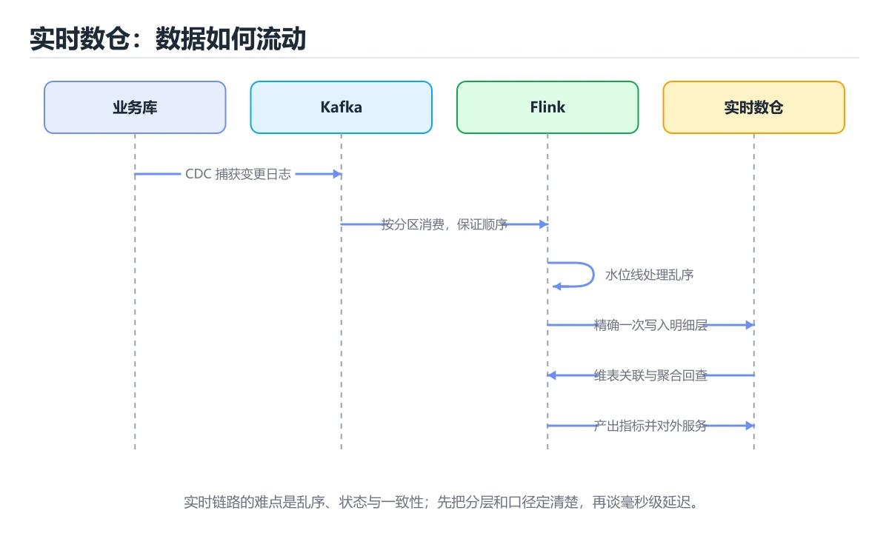
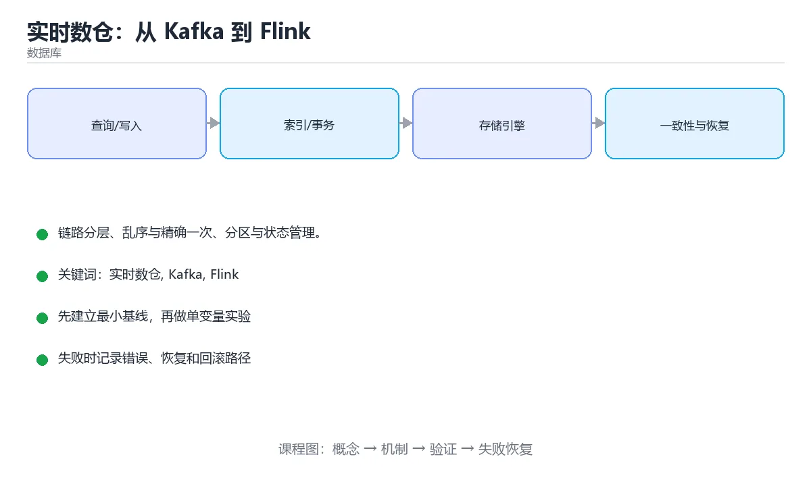

# 本课主题

> 内容更新时间：2026-10-03





## 学习目标

- 能用自己的话解释本课主题解决了什么问题，而不是只背术语。
- 能说清 「实时数仓」、「Kafka」、「Flink」、「水位线」 之间的关系，并分别举出一个例子。
- 能把本课知识放回「数据库」的知识体系，说明它和相邻主题的边界。
- 能完成本课练习，并用验收标准检查自己的结果。

> 一句话摘要：链路分层、乱序与精确一次、分区与状态管理。

## 前置知识

- 先完成上一课《Airflow 调度与数据质量》；如果已经掌握，可以直接用本课练习自测。
- 开始前先复习：实时数仓、Kafka、Flink。
- 如果某一步看不懂，先记录具体卡点，完成练习后再回头读一遍。

## 链路分层

| 层 | 组件 | 职责 |
| --- | --- | --- |
| 采集 | CDC（Debezium）、埋点 SDK、日志采集 | 把变更与事件写入消息队列 |
| 消息 | Kafka / Pulsar | 缓冲削峰、多消费者复用、可回放 |
| 计算 | Flink / Spark Streaming | 清洗、关联、聚合、窗口计算 |
| 存储 | Doris / ClickHouse / HBase / Iceberg | 面向查询与分析的落地层 |
| 服务 | BI、实时大屏、告警、推荐特征 | 消费结果 |

## 三个核心问题

**1. 乱序与迟到数据**：用事件时间 + 水位线（Watermark）定义"何时触发窗口"；对超迟数据可配置允许延迟（allowed lateness）或旁路输出到侧输出流单独处理。

**2. 精确一次（Exactly-Once）**：Flink 靠 checkpoint 保存状态快照 + 两阶段提交（2PC）写入外部系统。前提是 **sink 支持事务或幂等写入**；若下游不支持（如普通 HTTP 接口），就只能做到"至少一次 + 幂等消费"。

**3. 状态与背压**：状态过大会撑爆内存与 checkpoint（用状态后端 + TTL + 定期清理）；消费跟不上时会出现背压，要先定位是算子慢还是下游 sink 慢，再决定扩并行度或优化算子。

## 关键设计选择

| 选择 | 说明 |
| --- | --- |
| Kafka 分区数 | 决定最大并行消费度，只能增不能减，初期按峰值吞吐预留 |
| 消息键 | 同一业务键路由到同一分区以保证局部有序（如 order_id） |
| 窗口类型 | 滚动（不重叠）、滑动（重叠）、会话（按活跃间隔） |
| 维表关联 | 实时流 join 静态维表，用异步 IO 或本地缓存减少外部调用 |
| 结果表更新 | upsert 到支持主键更新的存储，避免重复行 |

## 质量与运维

1. 端到端延迟监控：埋点事件时间与写入时间的差值，按 P95/P99 观察。
2. 数据一致性校验：实时结果与离线 T+1 结果对账，差异超阈值告警。
3. Kafka lag 监控：lag 持续增长说明消费能力不足。
4. checkpoint 成功率与耗时：失败会导致状态回滚与重复处理。
5. 上线策略：先双写（新旧链路并行）比对结果，再切流量。

## 本课小结
实时数仓的本质是**用消息队列解耦、用流计算保证正确性**：事件时间与水位线解决乱序、checkpoint 与幂等解决一致性、分区与状态管理解决吞吐。

## 链路速查

| 环节 | 组件 | 关注点 |
| --- | --- | --- |
| 采集 | Canal / Debezium / Flink CDC | 断点续传、顺序、schema 变更 |
| 消息 | Kafka | 分区数、保留期、副本与幂等生产者 |
| 计算 | Flink | 事件时间、水位线、状态与 checkpoint |
| 存储 | ClickHouse / Doris / Hudi | 写入模式、排序键、分区 |
| 查询 | BI / 应用 | 延迟与并发，物化视图加速 |
| 监控 | 指标 + 告警 | 端到端延迟、积压、失败率 |

## Kafka 关键参数速查

| 参数 | 作用 | 建议 |
| --- | --- | --- |
| `partitions` | 并行度上限 | 按峰值吞吐与消费能力估算，只能增不能减 |
| `replication.factor` | 副本数 | 生产至少 3 |
| `min.insync.replicas` | 最少同步副本 | 与 acks=all 配合保证不丢 |
| `acks` | 写入确认 | 关键数据用 `all` |
| `enable.idempotence` | 幂等生产者 | 开启避免重试重复 |
| `retention.ms` | 保留期 | 支持重放历史，按回溯需求设置 |
| `max.poll.records` | 单次拉取条数 | 控制单批处理时长，避免超时踢出 |

## 端到端精确一次速查

| 环节 | 要求 |
| --- | --- |
| 源端 | 可重放（Kafka 保留 + 消费位点管理） |
| 计算 | 开启 checkpoint，状态后端可靠 |
| 汇端 | 支持事务或幂等写入（两阶段提交 / 主键 upsert） |
| 位点 | 与数据写入在同一事务或同一提交批次内 |

```sql
-- ClickHouse / Doris 风格：实时表按天分区，按查询模式排序
CREATE TABLE dws_user_actions (
    dt          Date,
    user_id     UInt64,
    action_type LowCardinality(String),
    action_cnt  UInt32,
    updated_at  DateTime
) ENGINE = ReplacingMergeTree(updated_at)
PARTITION BY dt
ORDER BY (action_type, user_id);

-- 实时看板：近 5 分钟聚合（配合物化视图或增量表）
SELECT action_type, sum(action_cnt) AS total
FROM dws_user_actions
WHERE dt = today()
GROUP BY action_type
ORDER BY total DESC
LIMIT 10;
```

## 常见错误对照表

| 容易踩的做法 | 实际现象 | 原因与正确做法 |
| --- | --- | --- |
| 按处理时间统计 | 结果随延迟波动 | 用事件时间 + 水位线 |
| Kafka 分区数随意加 | key 顺序被打乱 | 评估后再调，必要时新建 topic |
| 消费者处理过慢 | rebalance 反复发生 | 减少 `max.poll.records` 或提升并行度 |
| 不做维表关联缓存 | 每条记录查一次维表 | 用异步 IO + 本地缓存 + TTL |
| 汇端不支持幂等 | 重启后数据重复 | 主键 upsert 或事务写入 |
| 只监控任务是否存活 | 延迟高但无人知 | 监控端到端延迟与积压量 |
| 状态不设 TTL | 状态爆炸 | 配置状态过期与清理 |
| 大促前不压测 | 峰值积压 | 按峰值 QPS × 冗余系数压测 |
| schema 变更无兼容策略 | 作业崩溃 | 用兼容演进（加字段、默认值） |
| 报表直接查明细表 | 查询超时 | 用预聚合或物化视图 |

## 自测清单

- [ ] 链路各环节都有明确的容错与重放策略。
- [ ] Kafka 副本、确认与幂等生产配置正确。
- [ ] 端到端精确一次需要源、计算、汇三方配合。
- [ ] 维表关联使用异步 IO 与缓存。
- [ ] 监控覆盖端到端延迟、积压与失败率。

## 动手练习

> 本课练习重点：围绕「实时数仓、Kafka、Flink」完成复述、实验和交付，每个结果都要能被别人检查。

先写 schema 与查询，再补边界和失败数据，最后看执行计划与锁等待。

### 练习 1：建立心智模型（10 分钟）

合上教程，用 3～5 句话回答：

1. 本课主题解决了什么问题？
2. 如果没有它，会出现什么具体后果？
3. 它和「Kafka」是什么关系？

**验收标准**：至少出现一个本课关键词，并写出一个反例、边界条件或失效场景。

### 练习 2：做一次可控实验（20 分钟）

从正文中选一个最小示例，完成以下操作：

1. 先预测修改一个参数、输入或步骤后的结果。
2. 再实际执行或逐步推演，记录真实结果。
3. 如果结果与预测不同，写出差异原因。

**验收标准**：留下「原例 → 改动 → 预测 → 结果 → 原因」五步记录。

### 练习 3：交付一个小结果（30 分钟）

在 SQLite 或纸面表结构上写查询，分别验证正常数据、空值和边界数据。

任务要求：

- 结果必须能被别人检查，不能只写“我已经理解了”。
- 至少覆盖「实时数仓」和「Kafka」两个关键词。
- 写出 1 个仍然不确定的问题，以及下一步如何验证。

> 提示：时间有限时优先做练习 1 和练习 2；练习 3 可以拆成两次完成。

## 深入补充：本课主题

前面已经建立了基本概念。这一节换一个角度，把本课主题放进真实工程里，
重点回答三件事：它为什么存在、内部如何运转、什么时候会失效。

### 一、核心模型

实时数仓把消息流持续转换成可查询的明细、聚合和服务层数据，核心是 Kafka 提供事件缓冲、Flink 提供有状态流计算、下游存储提供低延迟查询。

```text
业务事件 → Kafka Topic → Flink 清洗/关联/聚合 → 状态与水位线 → 明细/聚合结果 → OLAP/服务库 → 报表与在线接口
```

### 二、关键机制拆解

1. Kafka 以分区保证单分区内有序，用副本保证可用性；分区键决定同一业务键是否进入同一分区。
2. Flink 用事件时间和水位线处理乱序数据，窗口计算必须明确迟到数据是丢弃、侧输出还是更新结果。
3. 状态后端决定中间状态存内存、文件还是远程存储；状态越大，检查点和恢复时间越长。
4. Exactly-once 通常依赖可重放源、检查点和幂等/事务写入共同实现，单靠计算引擎无法保证端到端。
5. 维度关联需要处理维度变化，常见方案是广播维表、异步查库或维护版本化维度状态。
6. 实时链路要有数据质量监控：延迟、吞吐、积压、迟到率、脏数据率和结果一致性校验。

### 三、对照表：抓住容易混淆的边界

| 维度 | 一侧 | 另一侧 |
| --- | --- | --- |
| 批处理 | 按固定时间窗口处理完整数据集 | 结果稳定但延迟高 |
| 流处理 | 事件到达即持续计算 | 延迟低但要处理乱序和状态 |
| 事件时间 | 以事件发生时间为准 | 需要水位线处理迟到数据 |
| 处理时间 | 以计算节点当前时间为准 | 简单但结果受延迟影响 |

### 四、工作示例

订单实时看板：Kafka 按 order_id 分区，Flink 读取订单创建与支付事件，按事件时间开 1 分钟窗口，关联用户和商品维表，输出到 ClickHouse；迟到超过 2 分钟的事件进入侧输出，稍后做补偿聚合。

### 五、常见误区与失效边界

| 错误做法或假设 | 后果 | 正确做法 |
| --- | --- | --- |
| 只用处理时间做窗口 | 网络延迟导致结果漂移 | 使用事件时间和水位线 |
| 状态无限增长 | 检查点失败、恢复慢 | 设置 TTL、清理策略和状态大小告警 |
| 忽略端到端重复 | 下游重复累计金额 | 使用幂等键和事务写入 |
| 只看吞吐不看延迟 | 积压时报表数据越来越旧 | 同时监控端到端延迟和消费滞后 |

### 六、场景推演

大促期间看板金额突然偏低。排查顺序是：先看 Kafka 消费滞后和 Flink 背压；再检查水位线是否推进、窗口是否关闭；然后核对维表关联失败和迟到事件；最后验证下游写入是否幂等。

### 七、自测问答

**Q1：为什么流处理需要水位线？**

它用来估计事件时间进度，决定窗口何时可以触发并处理迟到数据。

**Q2：Exactly-once 的难点在哪里？**

端到端涉及源、状态、计算和下游写入，需要共同保证。

**Q3：维表变化怎么处理？**

可以广播、异步查询或保存版本化状态，按一致性要求选择。

**Q4：实时数仓最关键的监控指标是什么？**

消费滞后、端到端延迟、状态大小、错误率和结果一致性。

### 八、小项目：把知识变成可检查的产出

搭一条最小实时链路：Kafka 产生订单事件，Flink 计算每分钟销售额并写入 SQLite/ClickHouse，加入迟到事件侧输出和重复事件幂等校验；用压测脚本验证延迟与恢复。

### 九、适用边界

实时数仓不是把所有批处理搬到流上。需要历史全量、复杂回溯或强一致对账时，批流结合通常比纯实时更可靠。

### 十、完成检查清单

- [ ] 能设计 Kafka 分区键和副本策略
- [ ] 能区分事件时间与处理时间
- [ ] 能说明状态、检查点和恢复流程
- [ ] 能设计端到端幂等方案
- [ ] 能监控消费滞后与结果一致性

### 十一、复习顺序

1. 先不看资料复述“核心模型”，确认能说出它解决的三个问题。
2. 再对照表逐行解释容易混淆的概念，每个概念补一个反例。
3. 跟着工作示例做一遍，改变一个条件并预测结果。
4. 用自测问答检查理解，错题回到对应小节重新阅读。
5. 最后完成小项目，把结果、失败记录和复查清单整理成一份可提交产物。

> 复习不是重读一遍，而是离开原文重新产出：复述、改写、验证、复盘。

## 可运行练习

### 任务 1：先跑通，再解释

```sql
-- ClickHouse / Doris 风格：实时表按天分区，按查询模式排序
CREATE TABLE dws_user_actions (
    dt          Date,
    user_id     UInt64,
    action_type LowCardinality(String),
    action_cnt  UInt32,
    updated_at  DateTime
) ENGINE = ReplacingMergeTree(updated_at)
PARTITION BY dt
ORDER BY (action_type, user_id);

-- 实时看板：近 5 分钟聚合（配合物化视图或增量表）
SELECT action_type, sum(action_cnt) AS total
FROM dws_user_actions
WHERE dt = today()
GROUP BY action_type
ORDER BY total DESC
LIMIT 10;
```

### 任务 2：只改一个条件

### 任务 3：迁移到自己的数据

用同一套思路处理一组你自己的数据或场景，保持输出格式与任务 1 一致。

## 故障现场

### 现场 1：本课的 实时数仓 常规用例通过，但边界用例失败

**症状**：在本课的练习或生产场景里出现“本课的 实时数仓 常规用例通过，但边界用例失败”。

**复现**：准备一组最小输入，只保留触发“本课的 实时数仓 常规用例通过，但边界用例失败”的必要条件，连续运行两次确认结果稳定。

**定位**：围绕“实时数仓 的前置条件与取值边界没有写进代码，默认值掩盖了空值和极值”检查调用链、输入数据和环境配置，先验证假设再改代码。

**预防**：把“本课的 实时数仓 常规用例通过，但边界用例失败”写成一条自动化用例，并在本课的验收清单里保留对应检查项。

### 现场 2：本课的 Kafka 结果在两次运行之间不一致

**症状**：在本课的练习或生产场景里出现“本课的 Kafka 结果在两次运行之间不一致”。

**复现**：准备一组最小输入，只保留触发“本课的 Kafka 结果在两次运行之间不一致”的必要条件，连续运行两次确认结果稳定。

**定位**：围绕“Kafka 依赖了当前版本、执行顺序或共享状态，单次运行无法暴露差异”检查调用链、输入数据和环境配置，先验证假设再改代码。

**预防**：把“本课的 Kafka 结果在两次运行之间不一致”写成一条自动化用例，并在本课的验收清单里保留对应检查项。

### 现场 3：同一条 SQL 在数据量变大后突然变慢

**症状**：在本课的练习或生产场景里出现“同一条 SQL 在数据量变大后突然变慢”。

**定位**：围绕“执行计划随统计信息或数据分布改变，实时数仓 的索引没有被用上，回表次数反而增加”检查调用链、输入数据和环境配置，先验证假设再改代码。

## 本课复习清单

离开本课前，逐项确认：

- [ ] 不看解析，能说出「流处理中处理乱序数据的核心机制是？」的判断依据。
- [ ] 不看解析，能说出「Flink 实现端到端精确一次的前提是？」的判断依据。
- [ ] 不看解析，能说出「Kafka 分区数决定了什么？」的判断依据。
- [ ] 不看解析，能说出「Kafka 分区数调整时需要注意什么？」的判断依据。
- [ ] 不看解析，能说出「Flink 中 Checkpoint 与 Savepoint 的区别是？」的判断依据。
- [ ] 不看解析，能说出「补全代码：本课主题示例中，下面这行代码缺少哪…」的判断依据。
- [ ] 至少运行一次本课示例，记录输入、输出和一个边界情况。
- [ ] 把本课最容易混淆的两个概念写成一句话对照。

| 复盘项 | 记录 |
| --- | --- |
| 已经能独立解释的考点 |  |
| 仍然说不清的概念 |  |
| 下一步验证动作 |  |

## 术语速查

| 术语 | 本课语境 |
| --- | --- |
| `partitions` | \| `partitions` \| 并行度上限 \| 按峰值吞吐与消费能力估算，只能增不能减 \| |
| `replication.factor` | \| `replication.factor` \| 副本数 \| 生产至少 3 \| |
| `min.insync.replicas` | \| `min.insync.replicas` \| 最少同步副本 \| 与 acks=all 配合保证不丢 \| |
| `acks` | \| `acks` \| 写入确认 \| 关键数据用 `all` \| |
| `all` | \| `acks` \| 写入确认 \| 关键数据用 `all` \| |
| `enable.idempotence` | \| `enable.idempotence` \| 幂等生产者 \| 开启避免重试重复 \| |
| `retention.ms` | \| `retention.ms` \| 保留期 \| 支持重放历史，按回溯需求设置 \| |
| `max.poll.records` | \| `max.poll.records` \| 单次拉取条数 \| 控制单批处理时长，避免超时踢出 \| |

## 考点精讲

### 考点 1：围绕“实时数仓：从 Kafka 到 Flink”中的 实时数仓、Kafka、Flink，下列哪两项是本课强调的实践判断？

- **判断依据**：正确答案包括「验证 Kafka 时要固定版本并覆盖边界输入，结论才可复现」、「学习 实时数仓 时要同时说明输入、输出和失败路径，不能只看正常流程」。正确答案是验证 Kafka 时要固定版本并覆盖边界输入。本课把本课主题拆成概念、示例与故障现场三部分，因此判断 实时数仓 时必须同时交代输入、输出和失败路径，这使“学习 实时数仓 时要同时说明输入、输出和失败路径，不能只看正常流程”成立。在本课主题里，判断 Kafka 时要固定版本与边界输入，所以“验证 Kafka 时要固定版本并覆盖边界输入，结论才可复现”才可复现。

### 考点 2：Flink 实现端到端精确一次的前提是？

- **判断依据**：本题应选「checkpoint 加支持事务或幂等的 sink」。状态快照保证内部一致，外部 sink 必须支持两阶段提交或幂等写入。解题的关键不是记住孤立术语，而是确认「checkpoint 加支持事务或幂等的 sink」是否完整覆盖题干的输入、输出和失败路径，并排除「单并行度」、「只靠 checkpoint（仅部分场景成立）」这类相邻概念。

### 考点 3：下面这段 Python 代码复现了“实时数仓：从 Kafka 到 Flink”中 实时数仓、Kafka、Flink 相关的一个常见故障，哪一项最准确地解释了问题？

- **判断依据**：结合实时数仓、Kafka来看，符合题干条件的是「total 只在函数内部赋值，函数外访问会抛出 NameError」。符合题干条件的是total 只在函数内部赋值，函数外访问会抛出 NameError（realtimewarehouse 第 3 题）。结合实时数仓、Kafka来看，符合题干条件的是total 只在函数内部赋值。

### 考点 4：Kafka 分区数调整时需要注意什么？

- **判断依据**：key 到分区的映射依赖分区总数，扩容会导致历史与新数据的分布不一致。其他选项：分区数只能增加不能减少，且扩容后同一 key 的分区分布可能改变，影响局部顺序性。这道题要求区分概念与边界，「分区数只能增加不能减少」只有在题干给出的前提下才成立，而「增加分区不影响 key 分布」、「可以随意减少分区」缺少同一组条件。

### 考点 5：Flink 中 Checkpoint 与 Savepoint 的区别是？

- **判断依据**：Savepoint 的格式更稳定，也更适合长期保存与跨版本恢复。其他选项：Checkpoint 由系统周期触发用于故障恢复，两者用途不同。判断这类题时，要把「Checkpoint 由系统周期触发用于故障恢复」放回题干限定的对象、输入和边界，「Checkpoint 不能恢复状态」、「Savepoint 会自动定期生成」 等说法虽然包含相关术语，但范围或前提与本题不一致。

### 考点 6：补全代码：「实时数仓：从 Kafka 到 Flink」示例中，下面这行代码缺少哪个关键字或函数名？请填入 ____。

`-- ____ / Doris 风格：实时表按天分区，按查询模式排序`

- **判断依据**：围绕 补全代码：本课主题示例中，下面这… 作答时，先用实时数仓建立输入与输出的基线，再把ClickHouse 或 clickhouse代入边界条件核对，结论才能复现。解题的关键不是记住孤立术语，而是确认「ClickHouse 或 clickhouse」是否完整覆盖题干的输入、输出和失败路径，并排除这类相邻概念。

## English Overview

**Title:** Realtime Warehouse

**Summary:** Pipeline layers, watermarking, exactly-once and sharding.

**Category:** Database
**Level:** 高级
**Key terms:** 实时数仓, Kafka, Flink, 水位线, checkpoint

## 内容元数据

- 内容版本：v2.0
- 最后更新：2026-10-03
- 学习阶段：高级
- 适用环境：PostgreSQL / MySQL / SQLite 等主流数据库
- 内容来源：内置结构化课程与工程实践整理
- 相关主题：实时数仓、Kafka、Flink、水位线、checkpoint
- 质量版本：P0 测验标准 + P1 覆盖扩展 + P2 体验补全


## 参考资料与复核

- 最后复核：2026-10-04
- 下次复核：2027-04-04
- 复核范围：版本兼容、API 行为、安全建议与工程实践
- 来源性质：官方文档、标准或权威教材；正文为离线教学重组

| 参考资料 | 本课用途 |
| --- | --- |
| [MySQL 文档](https://dev.mysql.com/doc/) | 关系数据库与 InnoDB |
| [PostgreSQL 事务教程](https://www.postgresql.org/docs/current/tutorial-transactions.html) | ACID 与隔离级别 |
| [Use The Index, Luke](https://use-the-index-luke.com/) | SQL 索引与查询优化 |

> 「实时数仓：从 Kafka 到 Flink」的链接用于离线阅读后的延伸核对；App 不会自动联网。
