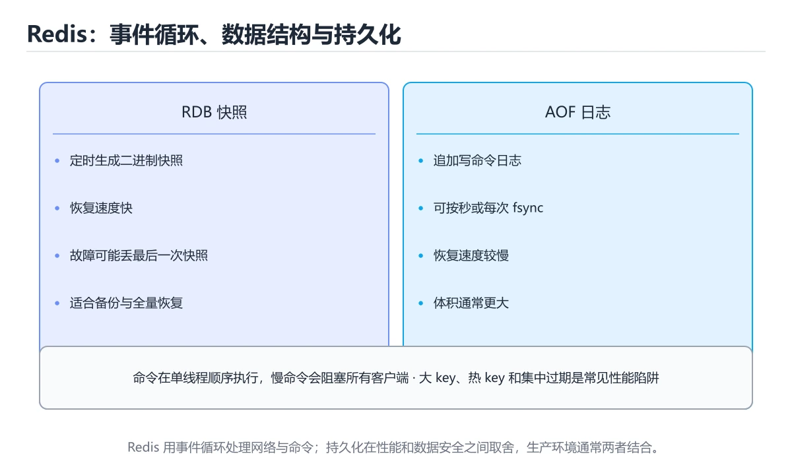
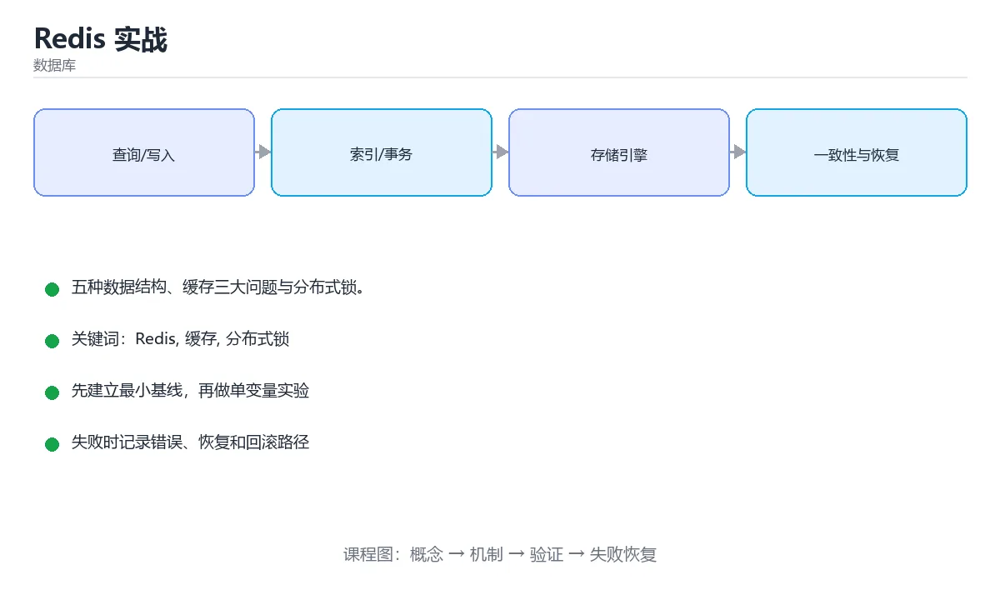

# Redis 实战





> 内容更新时间：2026-10-03 · 学习阶段：高级 · 预计用时：17 分钟

## 学习目标

- 能用自己的话解释「Redis 实战」解决了什么问题，而不是只背术语。
- 能说清 「Redis」、「缓存」、「分布式锁」、「缓存穿透」 之间的关系，并分别举出一个例子。
- 能把本课知识放回「数据库」的知识体系，说明它和相邻主题的边界。
- 能完成本课练习，并用验收标准检查自己的结果。

> 一句话摘要：五种数据结构、缓存三大问题与分布式锁。

## 前置知识

- 先完成上一课《NoSQL 数据库》；如果已经掌握，可以直接用本课练习自测。
- 本课阶段：高级。建议具备同一方向的完整基础，能阅读较长的代码、配置或系统设计说明。
- 开始前先复习：Redis、缓存、分布式锁。
- 如果某一步看不懂，先记录具体卡点，完成练习后再回头读一遍。


## Redis 为什么快

- 数据存在内存中，读写微秒级。
- 单线程处理命令（6.0 后网络 IO 多线程），避免锁竞争。
- 数据结构经过专门优化（跳表、压缩列表、渐进式 rehash）。
- 使用多路复用 IO 模型（epoll）。

代价是内存昂贵、容量有限，因此它通常做缓存与热数据，而不是主存储。

## 五种基础数据结构

```bash
SET user:1:name "小明" EX 3600     # String：缓存、计数器、分布式锁
INCR article:1:views               # 原子自增

HSET user:1 name "小明" age 18     # Hash：对象的字段级读写
HGETALL user:1

LPUSH queue:tasks "job1"           # List：队列 / 栈
BRPOP queue:tasks 5                # 阻塞取任务

SADD article:1:tags redis db       # Set：去重、共同关注
SINTER user:1:follows user:2:follows

ZADD rank 95 "tom" 88 "alice"      # ZSet：排行榜、延时队列
ZREVRANGE rank 0 9 WITHSCORES
```

进阶结构还有 Bitmap（签到）、HyperLogLog（基数统计）、Stream（消息流）、GEO（地理位置）。

## 缓存三大问题

| 问题 | 现象 | 对策 |
| --- | --- | --- |
| 缓存穿透 | 查询不存在的数据，每次都打到数据库 | 空值缓存、布隆过滤器 |
| 缓存击穿 | 热点 key 过期瞬间大量请求涌入 | 互斥锁重建、逻辑过期 |
| 缓存雪崩 | 大量 key 同时过期或 Redis 宕机 | 过期时间加随机、集群限流降级 |

## 缓存更新策略

```text
推荐：先更新数据库，再删除缓存（Cache-Aside）
原因：删除比更新更安全，能避免并发写导致的脏数据
兜底：为缓存设置过期时间，并订阅数据库变更（CDC）做异步补偿
```

## 分布式锁

```bash
SET lock:order:42 "token-abc" NX PX 10000    # NX 保证互斥，PX 防死锁
```

释放锁必须校验 token 并原子删除（Lua 脚本），否则可能误删别人的锁：

```lua
if redis.call("get", KEYS[1]) == ARGV[1] then
  return redis.call("del", KEYS[1])
else
  return 0
end
```

更严格的场景应使用 Redlock 或带租约的协调服务（etcd / ZooKeeper）。

## 持久化与高可用

| 机制 | 说明 | 取舍 |
| --- | --- | --- |
| RDB | 定时快照 | 恢复快，可能丢最后一次快照后的数据 |
| AOF | 追加命令日志 | 更安全，文件更大、恢复更慢 |
| 主从复制 | 读写分离 | 异步复制，可能读到旧数据 |
| Sentinel | 自动故障转移 | 提升可用性 |
| Cluster | 分片 + 槽位 | 水平扩展，运维复杂度上升 |

## 使用建议

1. 大 key（几 MB 的 Hash/List）会阻塞主线程，必须拆分。
2. 避免在生产环境使用 `KEYS *`，改用 `SCAN` 游标遍历。
3. 批量操作用 Pipeline 减少网络往返。
4. 缓存必须设置过期时间，避免内存无限增长。
5. 监控命中率、内存碎片率、慢查询与连接数。

## 缓存三大问题的代码级方案

```text
# 1. 穿透：查不存在的数据时缓存空值（短 TTL），或前置布隆过滤器
value = GET user:999
if value == nil:
    row = DB.query("SELECT * FROM users WHERE id = 999")
    if row == nil:
        SET user:999 "__NULL__" EX 60      # 空值缓存，防止反复打库
    else:
        SET user:999 json(row) EX 3600

# 2. 击穿：热点 key 失效瞬间用互斥锁重建
if value == nil:
    if SET lock:user:1 "1" NX PX 3000:   # 抢到锁的线程负责重建
        value = load_from_db()
        SET user:1 value EX 3600
        DEL lock:user:1
    else:
        sleep(50ms); retry()               # 未抢到锁的短暂等待后重试

# 3. 雪崩：过期时间加随机抖动
ttl = 3600 + random(0, 300)
```

逻辑过期（不设物理 TTL，值里带 expireAt，异步刷新）能彻底避免击穿，代价是短时间内可能返回旧数据——适合能接受最终一致的场景。

## 批量与高效命令

| 场景 | 不要用 | 应该用 |
| --- | --- | --- |
| 遍历大量 key | `KEYS *`（阻塞） | `SCAN` 游标分批 |
| 批量读 | 循环 GET（N 次往返） | `MGET` 或 Pipeline |
| 批量删 | 循环 DEL | `UNLINK` 异步删除大 key |
| 集合去重统计 | `SMEMBERS` 后本地去重 | `SADD` / `SCARD` |
| 计数 | 先 GET 再 SET（有竞态） | `INCR` / `HINCRBY` |
| 分布式限流 | 自己实现计数 | `INCR` + `EXPIRE` 或 Lua 原子脚本 |

## 持久化选型与故障转移

| 维度 | RDB | AOF |
| --- | --- | --- |
| 内容 | 某一时刻的数据快照 | 追加写命令日志 |
| 恢复速度 | 快（直接加载快照） | 慢（重放命令） |
| 数据安全 | 可能丢最后一次快照后的数据 | everysec 最多丢 1 秒 |
| 文件体积 | 小 | 大（可 rewrite 压缩） |
| 适用 | 可接受少量丢失、追求恢复速度 | 要求尽量不丢数据 |

生产推荐组合：**RDB 做定期快照 + AOF（appendfsync everysec）做主持久化**，兼顾恢复速度与数据安全。注意 fork 做快照时的内存放大（COW），内存使用率过高时可能触发 OOM。

故障转移流程：Sentinel 检测主节点不可达（主观下线）→ 多个 Sentinel 确认（客观下线）→ 选举 leader → 选一个从库提升为主 → 通知其他从库切换 → 通知客户端新地址。客户端必须使用 Sentinel 感知的连接池，否则主从切换后仍连旧地址。

## 集群使用的四个注意点

1. Cluster 按 16384 个槽分片，多 key 操作要求这些 key 在同一槽（可用 hash tag `{user}:1` 强制同槽）。
2. 槽迁移期间会返回 MOVED/ASK 重定向，客户端必须支持。
3. 主从复制是异步的，故障切换可能丢少量写入（除非用 WAIT 命令）。
4. 大 key 与热点 key 是集群最大的风险：大 key 用 `--bigkeys` 排查，热点 key 加本地缓存或多级缓存分摊。

## 本课小结
Redis 的核心价值是**用内存换延迟**：缓存、计数、排行榜、队列、分布式锁。用好它的前提是理解数据结构与缓存一致性策略。


## 数据结构选型速查

| 结构 | 典型用途 | 关键命令 | 复杂度 |
| --- | --- | --- | --- |
| String | 缓存对象、计数器、分布式锁 | `SET`、`INCR`、`SETNX`、`SETEX` | O(1) |
| Hash | 存对象字段、可按字段更新 | `HSET`、`HGETALL`、`HINCRBY` | O(1) 单字段 |
| List | 队列、最新列表 | `LPUSH`、`RPOP`、`LRANGE` | 两端 O(1) |
| Set | 去重、共同好友、抽奖 | `SADD`、`SINTER`、`SRANDMEMBER` | 平均 O(1) |
| ZSet | 排行榜、延时队列、限流 | `ZADD`、`ZRANGE`、`ZREVRANGE` | O(log n) |
| Bitmap | 签到、活跃标记 | `SETBIT`、`BITCOUNT` | O(1) / O(n) |
| HyperLogLog | UV 估算（允许误差） | `PFADD`、`PFCOUNT` | O(1) |
| Stream | 消息队列、消费组 | `XADD`、`XREADGROUP`、`XACK` | O(1) |

## 缓存三大问题对照

| 问题 | 触发条件 | 现象 | 常用对策 |
| --- | --- | --- | --- |
| 缓存穿透 | 查询根本不存在的数据 | 每次都打到数据库 | 缓存空值 + 短过期、布隆过滤器前置拦截、参数校验 |
| 缓存击穿 | 单个热点 key 到期 | 瞬间大量请求压到数据库 | 互斥锁重建、逻辑过期 + 异步刷新、热点 key 不过期 |
| 缓存雪崩 | 大量 key 同时到期或 Redis 故障 | 数据库被打垮 | 过期时间加随机抖动、多级缓存、限流降级、集群高可用 |

一致性与更新顺序：

| 策略 | 做法 | 适用与注意 |
| --- | --- | --- |
| Cache-Aside | 读：缓存未命中则查库回填；写：先更新数据库再删除缓存 | 最常用；删除比更新缓存更安全 |
| 延迟双删 | 更新库后删缓存，稍后再删一次 | 适合读写并发高的场景，仍非强一致 |
| Write-Through | 写时同步写缓存与数据库 | 复杂度高，需中间件支持 |
| 先删缓存再更新库 | 并发下容易回填旧值 | 一般不推荐；若使用需配合延迟双删 |

## 常见错误对照表

| 容易写错的做法 | 实际现象 | 原因与正确做法 |
| --- | --- | --- |
| 用 `KEYS *` 排查 | 实例卡住，其他请求全部超时 | `KEYS` 是 O(n) 阻塞命令，改用 `SCAN` 游标遍历 |
| 一个 key 存几十万条的大 Hash / List | 删除、读取都变慢甚至阻塞 | 拆分成多个 key（分片），或用 `UNLINK` 异步删除 |
| 缓存与数据库都写成功才算成功 | 一半成功就出现不一致 | 明确以数据库为准，缓存失败用重试或消息补偿 |
| `SETNX` 加锁后不设过期 | 死锁，锁永远不释放 | `SET key value NX PX 30000`，并校验持有者再删 |
| 删除锁时直接 `DEL` | 可能删掉别人的锁 | 用 Lua 脚本比对 value 再删除 |
| 把 Redis 当唯一数据库 | 重启或淘汰后数据丢失 | 明确它是缓存；需要持久化就用 AOF + RDB 并评估 |
| 所有 key 统一过期时间 | 同一秒大批量失效 | 过期时间加随机偏移（如基础值 ± 10%） |
| 单实例存全部数据 | 内存打满触发淘汰 | 分片集群 + 合理的内存淘汰策略 |
| 用 Redis 事务替代分布式锁 | 无法保证跨 key 的并发互斥 | 事务只是批量执行，不提供回滚；并发控制用锁或 Lua |

## 运维速查

| 关注点 | 命令 / 指标 | 说明 |
| --- | --- | --- |
| 内存使用 | `INFO memory`、`used_memory_human` | 逼近上限会触发淘汰 |
| 命中率 | `keyspace_hits / (hits + misses)` | 命中率骤降通常意味着缓存策略或容量问题 |
| 慢命令 | `SLOWLOG GET 10` | 定位阻塞型命令 |
| 连接数 | `INFO clients`、`connected_clients` | 连接泄漏会耗尽上限 |
| 大 key | `redis-cli --bigkeys` | 定期巡检，避免阻塞 |
| 持久化状态 | `INFO persistence`、`rdb_last_bgsave_status` | 后台保存失败要告警 |

## 自测清单

- [ ] 能按场景选对 String / Hash / ZSet / HyperLogLog。
- [ ] 分得清缓存穿透、击穿、雪崩并说出对应手段。
- [ ] 知道 Cache-Aside 的推荐更新顺序（先库后删缓存）。
- [ ] 加锁用 `SET NX PX`，并用 Lua 校验持有者再释放。
- [ ] 排查时用 `SCAN` 而不是 `KEYS`。

## 动手练习


> 本课练习重点：围绕「Redis、缓存、分布式锁」完成复述、实验和交付，每个结果都要能被别人检查。

先写 schema 与查询，再补边界和失败数据，最后看执行计划与锁等待。

### 练习 1：建立心智模型（10 分钟）

合上教程，用 3～5 句话回答：

1. 「Redis 实战」解决了什么问题？
2. 如果没有它，会出现什么具体后果？
3. 它和「缓存」是什么关系？

**验收标准**：至少出现一个本课关键词，并写出一个反例、边界条件或失效场景。

### 练习 2：做一次可控实验（20 分钟）

从正文中选一个最小示例，完成以下操作：

1. 先预测修改一个参数、输入或步骤后的结果。
2. 再实际执行或逐步推演，记录真实结果。
3. 如果结果与预测不同，写出差异原因。

**验收标准**：留下「原例 → 改动 → 预测 → 结果 → 原因」五步记录。

### 练习 3：交付一个小结果（30 分钟）

在 SQLite 或纸面表结构上写查询，分别验证正常数据、空值和边界数据。

任务要求：

- 结果必须能被别人检查，不能只写“我已经理解了”。
- 至少覆盖「Redis」和「缓存」两个关键词。
- 写出 1 个仍然不确定的问题，以及下一步如何验证。

> 提示：时间有限时优先做练习 1 和练习 2；练习 3 可以拆成两次完成。


## 验证命令与预期输出

项目代码不能只看“能编译”，还要能按固定命令复现结果。下表给出最低验证集：

| 阶段 | 命令 | 预期输出 |
| --- | --- | --- |
| 安装依赖 | `python -m pip install -r requirements.txt` | 依赖安装完成，没有版本冲突 |
| 语法检查 | `python -m compileall .` | 所有模块编译通过 |
| 运行测试 | `python -m pytest -q` | 测试全部通过，失败用例数为 0 |
| 启动示例 | `python main.py` | 服务启动并输出监听地址 |

### 验收证据

- [ ] 保存依赖安装和启动命令的完整输出。
- [ ] 至少运行 3 条测试，其中包含一条非法输入或失败路径。
- [ ] 重复执行同一操作两次，确认没有重复写入或副作用。
- [ ] 记录一次失败状态码、错误日志和恢复步骤。
- [ ] 在 README 中写明环境版本、启动方式和回滚方式。

### 回归与回滚

1. 先在一个可丢弃的目录或临时数据库执行，避免污染真实数据。
2. 修改一处逻辑后重跑全部验证命令，确认没有回归。
3. 若失败，回滚到上一个可运行版本并保留失败日志。
4. 定位原因后补一条自动化测试，再重新执行发布流程。
5. 把教训写入项目复盘或本课笔记，形成下一次的检查项。


## 考点精讲：把测验题还原成判断过程

本课有 6 个判断点。先自己作答，再看「判断依据」；如果结论正确但理由不完整，回到正文对应章节补足概念。

### 考点 1：Redis 快的主要原因是？

- **正确判断**：内存存储 + 单线程处理 + IO 多路复用
- **判断依据**：正确答案是「内存存储 + 单线程处理 + IO 多路复用」，本课在「Redis 为什么快」中说明：单线程处理命令（6.0 后网络 IO 多线程），避免锁竞争。数据在内存且避免了并发锁竞争。本课还在「本课小结」中说明：Redis 的核心价值是用内存换延迟：缓存、计数、排行榜、队列、分布式锁。本课还在「Redis 为什么快」中说明：代价是内存昂贵、容量有限，因此它通常做缓存与热数据，而不是主存储。
- **迁移检查**：如果给某个错误选项去掉一个限定词，它会不会变成正确？说明理由。

### 考点 2：防范缓存穿透的有效手段是？

- **正确判断**：空值缓存或布隆过滤器
- **判断依据**：穿透是查询不存在的数据，需要拦截无效请求。其他选项：穿透防护用空值缓存或布隆过滤器。针对「防范缓存穿透的有效手段是，」，本课在「本课小结」中说明：Redis 的核心价值是用内存换延迟：缓存、计数、排行榜、队列、分布式锁。本课还在「集群使用的四个注意点」中说明：大 key 与热点 key 是集群最大的风险：大 key 用 --bigkeys 排查，热点 key 加本地缓存或多级缓存分摊。本课还在「缓存三大问题的代码级方案」中说明：逻辑过期（不设物理 TTL，值里带 expireAt，异步刷新）能彻底避免击穿，代价是短时间内可能返回旧数据——适合能接受最终一致的场景。
- **迁移检查**：如果给某个错误选项去掉一个限定词，它会不会变成正确？说明理由。

### 考点 3：Cache-Aside 推荐的更新顺序是？

- **正确判断**：先更新数据库再删除缓存
- **判断依据**：先库后删能减少并发写导致的脏数据，并配合过期时间兜底。其他选项：Cache-Aside 推荐先更新数据库再删除缓存，减少并发回填旧值的概率。针对「Cache-Aside 推荐的更新顺序是，」，本课在「持久化选型与故障转移」中说明：生产推荐组合：RDB 做定期快照 + AOF（appendfsync everysec）做主持久化，兼顾恢复速度与数据安全。本课还在「Redis 为什么快」中说明：数据结构经过专门优化（跳表、压缩列表、渐进式 rehash）。
- **迁移检查**：遮住选项，只根据定义复述一次答案，再回来看哪个选项与复述一致。

### 考点 4：缓存雪崩与缓存击穿的区别是？

- **正确判断**：雪崩是大量 key 同时失效
- **判断依据**：雪崩通过随机过期时间缓解，击穿通过互斥重建与逻辑过期缓解。其他选项：雪崩是大量 key 同时失效，击穿是单个热点 key 失效，两者的影响范围与对策都不同。针对「缓存雪崩与缓存击穿的区别是，」，本课在「本课小结」中说明：用好它的前提是理解数据结构与缓存一致性策略。本课还在「使用建议」中说明：大 key（几 MB 的 Hash/List）会阻塞主线程，必须拆分。本课还在「集群使用的四个注意点」中说明：Cluster 按 16384 个槽分片，多 key 操作要求这些 key 在同一槽（可用 hash tag {user}:1 强制同槽）。
- **迁移检查**：如果给某个错误选项去掉一个限定词，它会不会变成正确？说明理由。

### 考点 5：Redis 单线程执行模型下最需要避免的是？

- **正确判断**：慢命令与大 key 操作（如 KEYS、大集合全量遍历）阻塞整个实例
- **判断依据**：正确答案是「慢命令与大 key 操作（如 KEYS、大集合全量遍历）阻塞整个实例」，本课在「Redis 为什么快」中说明：单线程处理命令（6.0 后网络 IO 多线程），避免锁竞争。可用 SCAN 替代 KEYS、拆分大 key，并用 SLOWLOG 定位慢命令。本课还在「集群使用的四个注意点」中说明：大 key 与热点 key 是集群最大的风险：大 key 用 --bigkeys 排查，热点 key 加本地缓存或多级缓存分摊。
- **迁移检查**：把题干里的一个条件换成边界值，原来的结论还成立吗？写出判断过程。

### 考点 6：补全代码：「Redis 实战」示例中，下面这行代码缺少哪个关键字或函数名？请填入 ____。 `____ rank 0 9 WITHSCORES`

- **正确判断**：ZREVRANGE / zrevrange
- **判断依据**：正确答案是「ZREVRANGE」，本课在「持久化选型与故障转移」中说明：注意 fork 做快照时的内存放大（COW），内存使用率过高时可能触发 OOM。本课还在「持久化选型与故障转移」中说明：故障转移流程：Sentinel 检测主节点不可达（主观下线）→ 多个 Sentinel 确认（客观下线）→ 选举 leader → 选一个从库提升为主 → 通知其他从库切换 → 通知客户端新地址。本课还在「持久化选型与故障转移」中说明：客户端必须使用 Sentinel 感知的连接池，否则主从切换后仍连旧地址。
- **迁移检查**：如果填成相近的另一个函数或关键字，程序会在哪一步出错？

## 本课复习清单

离开本课前，逐项确认：

- [ ] 不看解析，能说出「Redis 快的主要原因是？」的判断依据。
- [ ] 不看解析，能说出「防范缓存穿透的有效手段是？」的判断依据。
- [ ] 不看解析，能说出「Cache-Aside 推荐的更新顺序是？」的判断依据。
- [ ] 不看解析，能说出「缓存雪崩与缓存击穿的区别是？」的判断依据。
- [ ] 不看解析，能说出「Redis 单线程执行模型下最需要避免的是？」的判断依据。
- [ ] 不看解析，能说出「补全代码：「Redis 实战」示例中，下面这行代码缺少哪个关键字或函数名？请填入…」的判断依据。
- [ ] 至少运行一次本课示例，记录输入、输出和一个边界情况。
- [ ] 把本课最容易混淆的两个概念写成一句话对照。

| 复盘项 | 记录 |
| --- | --- |
| 已经能独立解释的考点 |  |
| 仍然说不清的概念 |  |
| 下一步验证动作 |  |

## 术语速查

把本课反复出现的术语集中放在一起。复习时先遮住右列，尝试用自己的话解释，再回到正文核对。

| 术语 | 本课语境 |
| --- | --- |
| `KEYS *` | 避免在生产环境使用 `KEYS *`，改用 `SCAN` 游标遍历。 |
| `SCAN` | 避免在生产环境使用 `KEYS *`，改用 `SCAN` 游标遍历。 |
| `MGET` | \| 批量读 \| 循环 GET（N 次往返） \| `MGET` 或 Pipeline \| |
| `UNLINK` | \| 批量删 \| 循环 DEL \| `UNLINK` 异步删除大 key \| |
| `SMEMBERS` | \| 集合去重统计 \| `SMEMBERS` 后本地去重 \| `SADD` / `SCARD` \| |
| `SADD` | \| 集合去重统计 \| `SMEMBERS` 后本地去重 \| `SADD` / `SCARD` \| |
| `SCARD` | \| 集合去重统计 \| `SMEMBERS` 后本地去重 \| `SADD` / `SCARD` \| |
| `INCR` | \| 计数 \| 先 GET 再 SET（有竞态） \| `INCR` / `HINCRBY` \| |
| `HINCRBY` | \| 计数 \| 先 GET 再 SET（有竞态） \| `INCR` / `HINCRBY` \| |
| `EXPIRE` | \| 分布式限流 \| 自己实现计数 \| `INCR` + `EXPIRE` 或 Lua 原子脚本 \| |
| `{user}:1` | Cluster 按 16384 个槽分片，多 key 操作要求这些 key 在同一槽（可用 hash tag `{user}:1` 强制同槽）。 |
| `--bigkeys` | 大 key 与热点 key 是集群最大的风险：大 key 用 `--bigkeys` 排查，热点 key 加本地缓存或多级缓存分摊。 |

## 面试问答与自测

下面把本课考点换成面试追问。先口述自己的答案，
再对照参考回答检查是否遗漏了前提、边界或失败路径。

### 追问 1：Redis 快的主要原因是？

**参考回答**：正确答案是「内存存储 + 单线程处理 + IO 多路复用」，本课在「Redis 为什么快」中说明：单线程处理命令（6.0 后网络 IO 多线程），避免锁竞争。数据在内存且避免了并发锁竞争。本课还在「本课小结」中说明：Redis 的核心价值是用内存换延迟：缓存、计数、排行榜、队列、分布式锁。本课还在「Redis 为什么快」中说明：代价是内存昂贵、容量有限，因此它通常做缓存与热数据，而不是主存储。

### 追问 2：防范缓存穿透的有效手段是？

**参考回答**：穿透是查询不存在的数据，需要拦截无效请求。其他选项：穿透防护用空值缓存或布隆过滤器。针对「防范缓存穿透的有效手段是，」，本课在「本课小结」中说明：Redis 的核心价值是用内存换延迟：缓存、计数、排行榜、队列、分布式锁。本课还在「集群使用的四个注意点」中说明：大 key 与热点 key 是集群最大的风险：大 key 用 --bigkeys 排查，热点 key 加本地缓存或多级缓存分摊。本课还在「缓存三大问题的代码级方案」中说明：逻辑过期（不设物理 TTL，值里带 expireAt，异步刷新）能彻底避免击穿，代价是短时间内可能返回旧数据——适合能接受最终一致的场景。

### 追问 3：Cache-Aside 推荐的更新顺序是？

**参考回答**：先库后删能减少并发写导致的脏数据，并配合过期时间兜底。其他选项：Cache-Aside 推荐先更新数据库再删除缓存，减少并发回填旧值的概率。针对「Cache-Aside 推荐的更新顺序是，」，本课在「持久化选型与故障转移」中说明：生产推荐组合：RDB 做定期快照 + AOF（appendfsync everysec）做主持久化，兼顾恢复速度与数据安全。本课还在「Redis 为什么快」中说明：数据结构经过专门优化（跳表、压缩列表、渐进式 rehash）。

### 追问 4：缓存雪崩与缓存击穿的区别是？

**参考回答**：雪崩通过随机过期时间缓解，击穿通过互斥重建与逻辑过期缓解。其他选项：雪崩是大量 key 同时失效，击穿是单个热点 key 失效，两者的影响范围与对策都不同。针对「缓存雪崩与缓存击穿的区别是，」，本课在「本课小结」中说明：用好它的前提是理解数据结构与缓存一致性策略。本课还在「使用建议」中说明：大 key（几 MB 的 Hash/List）会阻塞主线程，必须拆分。本课还在「集群使用的四个注意点」中说明：Cluster 按 16384 个槽分片，多 key 操作要求这些 key 在同一槽（可用 hash tag {user}:1 强制同槽）。

### 追问 5：Redis 单线程执行模型下最需要避免的是？

**参考回答**：正确答案是「慢命令与大 key 操作（如 KEYS、大集合全量遍历）阻塞整个实例」，本课在「Redis 为什么快」中说明：单线程处理命令（6.0 后网络 IO 多线程），避免锁竞争。可用 SCAN 替代 KEYS、拆分大 key，并用 SLOWLOG 定位慢命令。本课还在「集群使用的四个注意点」中说明：大 key 与热点 key 是集群最大的风险：大 key 用 --bigkeys 排查，热点 key 加本地缓存或多级缓存分摊。

## English Overview

**Title:** Redis in Practice

**Summary:** Data structures, cache pitfalls and locks.

**Category:** Database  
**Level:** 高级  
**Key terms:** Redis, 缓存, 分布式锁, 缓存穿透, ZSet

> The full tutorial is written in Chinese. This bilingual overview helps English readers identify the topic, scope and key terms before studying the detailed examples.

## 内容元数据

- 内容版本：v2.0
- 最后更新：2026-10-03
- 学习阶段：高级
- 适用环境：PostgreSQL / MySQL / SQLite 等主流数据库
- 内容来源：内置结构化课程与工程实践整理
- 相关主题：Redis、缓存、分布式锁、缓存穿透、ZSet
- 质量版本：P0 测验标准 + P1 覆盖扩展 + P2 体验补全

## 项目专属规格：Redis 实战

### 核心场景

五种数据结构、缓存三大问题与分布式锁。 项目目标是把「Redis、缓存、分布式锁、缓存穿透、ZSet」落实为可运行、可测试、可回滚的交付物。

### 架构与数据流

```text
用户/输入 → 接口或命令 → 领域逻辑 → 存储/外部依赖 → 输出与监控
                         ↘ 失败分类 → 重试/补偿 → 回滚
```

### 最小数据模型

| 对象 | 关键字段 | 约束 |
| --- | --- | --- |
| 输入实体 | Redis、时间、来源 | 必填校验、长度限制、幂等键 |
| 任务实体 | 状态、优先级、创建时间 | 状态迁移合法、不可重复执行 |
| 结果实体 | 输出、错误码、耗时 | 可序列化、错误可解释 |
| 审计记录 | 操作者、动作、结果、时间 | 不可篡改、可查询、脱敏 |

### 验收场景

1. 正常路径：最小输入得到预期输出，并留下日志与指标。
2. 边界路径：空值、最大值、重复数据和超长内容得到明确处理。
3. 失败路径：依赖超时或不可用时能快速失败、重试或降级。
4. 幂等路径：同一请求执行两次不会产生重复副作用。
5. 回滚路径：回滚后数据一致，且能说明恢复时间和影响范围。


## 项目交付物

### 建议仓库结构

```text
src/
tests/
docs/
README.md
```

### 测试矩阵

| 层级 | 覆盖内容 | 最低数量 | 通过标准 |
| --- | --- | ---: | --- |
| 单元测试 | 领域规则、边界和错误分类 | 8 | 正常、边界、失败路径全部通过 |
| 集成测试 | 数据库、网络、文件或平台边界 | 3 | 使用真实边界且可重复运行 |
| 端到端测试 | 核心用户路径 | 1 | 从输入到输出完整跑通 |
| 手动验收 | 文档中列出的 5 个场景 | 5 | 有命令、输出和结论记录 |

### 验收数据

```json
{
  "project": "redis",
  "input": {"case": "normal", "value": 5},
  "expected": {"ok": true, "result": 5},
  "failure_case": {"value": -1, "error": "validation_error"},
  "idempotency_key": "demo-001"
}
```

### 复盘模板

| 问题 | 记录 |
| --- | --- |
| 原目标是什么？ | 用一句话描述可验收目标 |
| 实际发生了什么？ | 时间线、指标和关键日志 |
| 哪个假设被推翻？ | 根因与促成因素 |
| 如何回滚？ | 步骤、耗时和数据校验 |
| 下一步做什么？ | 负责人、期限和验证方式 |

> 项目验收围绕「Redis、缓存、分布式锁」：至少完成一次正常路径、一次边界输入、一次失败恢复和一次幂等检查。


## 参考资料与复核

- 最后复核：2026-10-04
- 下次复核：2027-04-04
- 复核范围：版本兼容、API 行为、安全建议与工程实践
- 来源性质：官方文档与标准；本课正文为离线教学重组，不复制原文

| 参考资料 | 本课用途 |
| --- | --- |
| [PostgreSQL 文档](https://www.postgresql.org/docs/) | SQL、索引与事务 |
| [SQLite 文档](https://sqlite.org/docs.html) | 嵌入式数据库与 SQL 行为 |

> 本课主题：五种数据结构、缓存三大问题与分布式锁。

> App 完全离线展示文字链接，不会自动联网；需要延伸阅读时可复制链接到浏览器。
