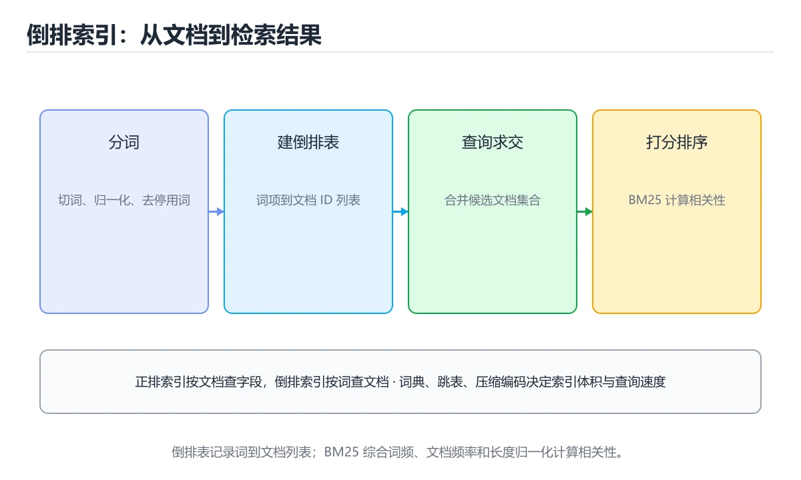

# 倒排索引与搜索

> 内容更新时间：2026-10-06 · 学习阶段：进阶 · 预计用时：45 分钟




## 本节知识框架

**课程定位**：所属分类 `database`（数据库），课程主题 `倒排索引与搜索`，学习阶段 进阶，建议用时 40 分钟。

本课主线：分词建链、BM25、分片副本与近实时刷新。

**学完本课应当能够**
- 说清 `search_after` 与 `倒排索引` 的含义与区别，并各举一个正例和一个反例。
- 用本课示例验证 `分词` 的行为，记录输入、输出与失败条件。
- 遇到「中文按字符切分」这类问题时，能说出触发条件与修复顺序。

### 从概念到验证的学习链条

1. `search_after`：先掌握 深分页**问题：`from + size` 越大越慢，应改用 `search_after` 游标，再用它解释 `倒排索引` 为什么会出现。
2. `倒排索引`：先掌握 倒排索引把词映射到包含它的文档列表，让全文检索从“扫描所有文档”变成“查词后合并列表”，再用它解释 `分词` 为什么会出现。
3. `分词`：先掌握 分词：中文需专门分词器（IK、jieba），英文按空格与词形还原，再用它解释 `BM25` 为什么会出现。
4. `BM25`：先掌握 BM25 是工业界默认打分模型，再用它解释 本课示例的观察结果 为什么会出现。

**先修与衔接**：本课是「数据库」分类的第 14 课。先修内容：《OLAP 与列式存储》。《OLAP 与列式存储》里的 `OLAP`、`列存` 是本课的前提。相关或后续课程：《实战：设计并优化一个订单库》。

### 完成判据

- **定义关**：不看正文也能说明 `search_after` 是 深分页**问题：`from + size` 越大越慢，应改用 `search_after` 游标，并指出一个反例。
- **机制关**：能按“输入 → 转换 → 输出 → 验证”复述 `倒排索引与搜索`，而不是只背结论。
- **示例关**：能运行或推演 `倒排索引与搜索` 的 `text` 示例，并说明一个真实出现的标识符或字面量。
- **证据关**：能指出 `倒排索引与搜索` 示例里的 出现字面量 `settings`，并说明它支持或反驳了本课的哪一条结论。
- **排错关**：能复现 中文按字符切分，记录现象并按 使用分词器或合适的 n-gram 修复。
- **迁移关**：能把 `倒排索引`、`分词`、`BM25`、`分片` 放进一个与 `倒排索引与搜索` 不同的项目场景，并保持输入与验证条件可追踪。
- **复盘关**：学完 `倒排索引与搜索` 后，用一句话写下仍然不确定的结论，并列出下一次验证需要的输入、环境和成功判据。

### 复习清单

- [ ] 能不看正文复述本课核心术语，并指出一个边界或反例。
- [ ] 能运行或推演本课示例，记录输入、输出与失败现象。
- [ ] 能完成一次自测，并把错题对照错误表定位原因。

## 核心概念定义

| 术语 | 操作性定义 | 常见边界与风险 |
| --- | --- | --- |
| search_after | 深分页**问题：from + size 越大越慢，应改用 search_after 游标。 | 易错：内存暴涨、超时；正确做法是用 `search_after` 或滚动查询。 |
| 倒排索引 | 倒排索引把词映射到包含它的文档列表，让全文检索从“扫描所有文档”变成“查词后合并列表”。 | 索引命中与数据分布决定实际开销，判断前先看执行计划而不是只看结果是否正确。 |
| 分词 | 分词：中文需专门分词器（IK、jieba），英文按空格与词形还原。 | 易错：召回差或噪声大；正确做法是使用分词器或合适的 n-gram。 |
| BM25 | BM25 是工业界默认打分模型。 | 结果依赖数据分布、模型版本与算力预算，换数据集或换硬件都要重新评估。 |

## 原理与运行机制

### 机制总览

**教材衔接：索引构建流程**

1. **分词**：中文需专门分词器（IK、jieba），英文按空格与词形还原；这一步决定召回质量。
2. **归一化**：小写、去停用词、同义词扩展。
3. **建链**：记录文档 ID、词频、位置（支持短语查询与高亮）。
4. **压缩**：倒排链用 Delta + 可变长编码压缩；跳表（skip list）支持快速求交。

**教材衔接：相关性打分**

| 模型 | 思路 |
| --- | --- |
| TF-IDF | 词频高且罕见词权重高 |
| BM25 | 在 TF-IDF 上加入文档长度归一与饱和，工业默认 |
| 向量检索 | 语义相似度（embedding + ANN），弥补字面匹配不足 |
| 混合检索 | BM25 + 向量，再重排（Rerank） |

**教材衔接：分布式搜索**

索引按分片（shard）切分，每个分片有副本（replica）提供容错与读扩展。查询流程是「协调节点分发 → 各分片本地检索 → 归并排序 → 返回」。注意：

1. **分片数要提前规划**，过多会让归并成本上升。
2. **近实时（NRT）**：写入先落 translog 与内存缓冲，refresh 后才可被搜索（默认 1 秒）。
3. **深分页**问题：`from + size` 越大越慢，应改用 `search_after` 游标。

**教材衔接：与数据库的分工**

数据库负责事务与权威数据，搜索引擎负责全文检索与聚合；两者通过 CDC 或双写同步，并接受**最终一致**。不要把搜索索引当作唯一数据源。

**教材衔接：倒排索引速查**

| 概念 | 说明 |
| --- | --- |
| 词项（term） | 分词后的最小检索单位 |
| 倒排表 | 词项到文档 ID 列表的映射 |
| 位置信息 | 记录词项在文档中的位置，支持短语查询 |
| 词频 TF | 词在文档中出现次数 |
| 文档频率 DF | 包含该词的文档数 |
| 段（segment） | 索引的最小存储单位，不可变 |
| 合并（merge） | 把多个段合并成大段，回收删除标记 |
| refresh | 让新写入文档可被搜索（默认约 1 秒） |
| flush | 把数据持久化到磁盘 |

### 机制拆解：每一步的输入、动作与输出

#### 1. `search_after`
- 输入：`倒排索引`；本步把 深分页**问题：`from + size` 越大越慢，应改用 `search_after` 游标 当作判断规则。
- 动作：围绕 `search_after` 保留中间状态，并记录它与 `倒排索引` 的对应关系。
- 输出：`倒排索引`，它可以被下一段代码、测试或记录继续使用。
- `search_after` 的失败条件：当深分页用大 `from`时，会出现内存暴涨、超时。

#### 2. `倒排索引`
- 输入：`search_after`；本步把 倒排索引把词映射到包含它的文档列表，让全文检索从“扫描所有文档”变成“查词后合并列表” 当作判断规则。
- 动作：围绕 `倒排索引` 保留中间状态，并记录它与 `分词` 的对应关系。
- 输出：`分词`，它可以被下一段代码、测试或记录继续使用。
- `倒排索引` 的失败条件：索引命中与数据分布决定实际开销，判断前先看执行计划而不是只看结果是否正确。

#### 3. `分词`
- 输入：`倒排索引`；本步把 分词：中文需专门分词器（IK、jieba），英文按空格与词形还原 当作判断规则。
- 动作：围绕 `分词` 保留中间状态，并记录它与 `BM25` 的对应关系。
- 输出：`BM25`，它可以被下一段代码、测试或记录继续使用。
- `分词` 的失败条件：当中文按字符切分时，会出现召回差或噪声大。

#### 4. `BM25`
- 输入：`分词`；本步把 BM25 是工业界默认打分模型 当作判断规则。
- 动作：围绕 `BM25` 保留中间状态，并记录它与 `settings` 的对应关系。
- 输出：`settings`，它可以被下一段代码、测试或记录继续使用。
- `BM25` 的失败条件：结果依赖数据分布、模型版本与算力预算，换数据集或换硬件都要重新评估。

### 示例中的可观察事实

1. 出现字面量 `settings`；它对应的课程主题是 `倒排索引与搜索`。
2. 出现字面量 `number_of_shards`；它对应的课程主题是 `倒排索引与搜索`。
3. 出现字面量 `number_of_replicas`；它对应的课程主题是 `倒排索引与搜索`。
4. 出现字面量 `refresh_interval`；它对应的课程主题是 `倒排索引与搜索`。
5. 出现字面量 `mappings`；它对应的课程主题是 `倒排索引与搜索`。
6. 出现字面量 `properties`；它对应的课程主题是 `倒排索引与搜索`。
7. 出现字面量 `title`；它对应的课程主题是 `倒排索引与搜索`。
8. 出现字面量 `type`；它对应的课程主题是 `倒排索引与搜索`。

### 复现实验记录

- 环境：`倒排索引与搜索` 使用 `text` 示例，固定 `倒排索引`、`分词`、`BM25`、`分片` 作为第一组条件。
- 首轮输入：先确认 出现字面量 `settings`，预测 `search_after` 会怎样变化。
- 基线观察：记录命令、输入、输出和错误原文，不用截图代替可复制的文本。
- 单变量修改：只改变 `倒排索引`，观察 `BM25` 是否仍满足定义。
- 失败注入：复现 中文按字符切分，确认现象是 召回差或噪声大。
- 记录结论：把“修改前、修改后、预期变化、实际变化”写成四列表，这样复盘 `倒排索引与搜索` 时才能区分概念错误与实现错误。

## 典型应用场景

- **中文按字符切分**：典型现象是召回差或噪声大；正确做法是使用分词器或合适的 n-gram。
- **只建索引不更新**：典型现象是新内容搜不到；正确做法是设计增量写入和定期重建。
- **忽略停用词和大小写**：典型现象是查询结果不稳定；正确做法是统一归一化策略。
- **只看召回不看排序**：典型现象是结果相关性差；正确做法是用标注数据评估排序质量。

### 最小验证场景

- 准备：保留 `text` 示例的原始输入，先记录 `倒排索引与搜索` 的基线输出和完整运行命令。
- 观察：先核对 出现字面量 `settings`，再改变一个与 `search_after` 相关的条件。
- 判定：新结果与 `倒排索引与搜索` 的基线不同不等于错误；只有当差异破坏了 `search_after` 的定义或错误表中的约束，才判定为失败。

### 选择与边界

- 使用 `search_after` 时，先满足它的定义：深分页**问题：`from + size` 越大越慢，应改用 `search_after` 游标；易错：内存暴涨、超时；正确做法是用 `search_after` 或滚动查询。
- 使用 `倒排索引` 时，先满足它的定义：倒排索引把词映射到包含它的文档列表，让全文检索从“扫描所有文档”变成“查词后合并列表”；索引命中与数据分布决定实际开销，判断前先看执行计划而不是只看结果是否正确。
- 使用 `分词` 时，先满足它的定义：分词：中文需专门分词器（IK、jieba），英文按空格与词形还原；易错：召回差或噪声大；正确做法是使用分词器或合适的 n-gram。
- 使用 `BM25` 时，先满足它的定义：BM25 是工业界默认打分模型；结果依赖数据分布、模型版本与算力预算，换数据集或换硬件都要重新评估。

## 代码/协议/SQL 示例

### 最小可验证示例

```text
正排：doc1 → [搜索引擎, 原理]
倒排：搜索引擎 → [doc1, doc7, doc9]（带词频与位置）
```

**教材衔接：从正排到倒排**

正排索引是「文档 → 词列表」，倒排索引反过来：**词 → 包含它的文档列表（倒排链）**，因此可以按词快速找到文档而无需扫描全库。

```text
正排：doc1 → [搜索引擎, 原理]
倒排：搜索引擎 → [doc1, doc7, doc9]（带词频与位置）
```

**教材衔接：相关性打分速查**

| 因素 | 影响 |
| --- | --- |
| TF | 词出现越多越相关（有饱和） |
| IDF | 词越稀有越有区分度 |
| 字段长度 | 短字段命中权重更高 |
| 字段权重 | `title^3` 提高标题权重 |
| 协调因子 | 命中查询词越多越相关（BM25 已简化） |

BM25 是工业界默认打分模型；需要语义相似时叠加向量检索，形成混合检索。

```json
// 建索引：显式定义映射，避免动态推断导致类型不符合预期
PUT /articles
{
  "settings": {
    "number_of_shards": 3,
    "number_of_replicas": 1,
    "refresh_interval": "1s"
  },
  "mappings": {
    "properties": {
      "title":   { "type": "text", "analyzer": "ik_max_word" },
      "content": { "type": "text", "analyzer": "ik_max_word" },
      "tags":    { "type": "keyword" },
      "author_id": { "type": "keyword" },
      "created_at": { "type": "date" },
      "embedding": {
        "type": "dense_vector",
        "dims": 768,
        "index": true,
        "similarity": "cosine"
      }
    }
  }
}
```

```json
// 混合检索：关键词打分 + 向量召回 + 元数据过滤
POST /articles/_search
{
  "size": 10,
  "query": {
    "bool": {
      "must": [
        { "multi_match": { "query": "分布式事务", "fields": ["title^3", "content"] } }
      ],
      "filter": [
        { "term":  { "tags": "backend" } },
        { "range": { "created_at": { "gte": "2025-01-01" } } }
      ]
    }
  },
  "sort": [ { "_score": "desc" }, { "created_at": "desc" } ]
}
```

| 操作 | 代价 | 说明 |
| --- | --- | --- |
| `filter` | 便宜且可缓存 | 只做筛选，不参与打分 |
| `must` | 参与打分 | 影响相关性 |
| `should` | 加分 | 满足会提升排序 |
| `must_not` | 排除 | 不参与打分 |
| 深分页 `from + size` | 昂贵（默认上限 10000） | 改用 `search_after` 游标 |
| 聚合 | 昂贵 | 限制桶数与基数 |

**教材衔接：深入补充：倒排索引与搜索**

前面已经建立了基本概念。这一节换一个角度，把倒排索引与搜索放进真实工程里，
重点回答三件事：倒排索引 为什么存在、内部如何运转、什么时候会失效。

### 一、核心模型

倒排索引把词映射到包含它的文档列表，让全文检索从“扫描所有文档”变成“查词后合并列表”；核心是分词、归一化、倒排表、相关性排序和增量更新。

```text
文档采集 → 分词与归一化 → 建立倒排表 → 查询解析 → 候选召回 → 评分排序 → 返回结果与高亮
```

### 二、关键机制拆解

1. 分词决定检索粒度，中文需要专门分词或 n-gram，英文还需词干化和停用词处理。
2. 倒排表记录词出现的文档 ID、位置和词频，位置信息支持短语查询。
3. 布尔检索用 AND/OR/NOT 合并列表，跳表或位图能加速集合运算。
4. TF-IDF 和 BM25 衡量词对文档的重要性，长度归一化避免长文档占优。
5. 短语查询要求词项位置相邻，索引必须保存位置信息。
6. 增量更新需要处理新增、删除和重建，删除通常先标记再定期合并。
7. 搜索质量要通过相关性标注、点击数据和离线指标持续评估。

### 三、对照表：抓住容易混淆的边界

| 维度 | 一侧 | 另一侧 |
| --- | --- | --- |
| 正排索引 | 文档到内容的映射 | 适合存储和展示 |
| 倒排索引 | 词到文档列表的映射 | 适合全文检索 |
| 布尔检索 | 只判断是否匹配 | 结果精确但缺少排序 |
| 相关性排序 | 按匹配程度排序 | 提升用户体验 |

### 四、工作示例

搜索“数据库 索引”时，先查到“数据库”和“索引”的倒排列表，取交集得到候选文档，再用 BM25 按词频、文档长度和稀有度排序，最后高亮命中的词项。

### 五、常见误区与失效边界

| 错误做法或假设 | 后果 | 正确做法 |
| --- | --- | --- |
| 中文按字符切分 | 召回差或噪声大 | 使用分词器或合适的 n-gram |
| 只建索引不更新 | 新内容搜不到 | 设计增量写入和定期重建 |
| 忽略停用词和大小写 | 查询结果不稳定 | 统一归一化策略 |
| 只看召回不看排序 | 结果相关性差 | 用标注数据评估排序质量 |

### 六、场景推演

站内搜索搜不到新发布的文章。排查发现索引更新队列积压，写入失败没有告警。修复后增加索引延迟监控、重试和失败补偿，并定期做全量重建校验。

### 七、自测问答

**Q1：倒排索引为什么快？**

它直接通过词项找到候选文档，避免扫描全部内容。

**Q2：位置信息有什么作用？**

支持短语查询和邻近词匹配。

**Q3：BM25 解决什么问题？**

在词频基础上加入文档长度和稀有度，改善相关性排序。

**Q4：删除文档为什么要延迟合并？**

标记删除比重建整段索引便宜，定期合并可回收空间。

### 八、小项目：把知识变成可检查的产出

为 1000 篇本地文档建立倒排索引，支持单词、短语和 AND/OR 查询；实现 BM25 排序和结果高亮，并测量索引大小、查询延迟和增量更新时间。

### 九、适用边界

倒排索引擅长文本检索，不替代数据库的事务和精确查询。向量检索适合语义相似，但两者通常需要混合使用并做重排序。

### 十、完成检查清单

- [ ] 能解释分词与归一化
- [ ] 能构建倒排表和位置索引
- [ ] 能实现布尔检索与短语查询
- [ ] 能使用 BM25 排序
- [ ] 能设计增量更新和重建

### 十一、复习顺序

1. 用自己的话说明 number_of_replicas 的作用，再说出它不适用的情况。
2. 再对照表逐行解释容易混淆的概念，每个概念补一个反例。
3. 跟着工作示例做一遍，改变一个条件并预测结果。
4. 用自测问答检查理解，错题回到对应小节重新阅读。
5. 最后完成 倒排索引 的小项目，把结果、失败记录和复查清单整理成可提交产物。

> 复习不是重读一遍，而是离开原文重新产出：复述、改写、验证、复盘。

### 示例精读：先找证据，再改一个条件

1. 出现字面量 `settings`；它出现在 `倒排索引与搜索` 的示例中，阅读时先确认它前后各发生了什么。
2. 出现字面量 `number_of_shards`；它出现在 `倒排索引与搜索` 的示例中，阅读时先确认它前后各发生了什么。
3. 出现字面量 `number_of_replicas`；它出现在 `倒排索引与搜索` 的示例中，阅读时先确认它前后各发生了什么。
4. 出现字面量 `refresh_interval`；它出现在 `倒排索引与搜索` 的示例中，阅读时先确认它前后各发生了什么。
5. 出现字面量 `mappings`；它出现在 `倒排索引与搜索` 的示例中，阅读时先确认它前后各发生了什么。
6. 出现字面量 `properties`；它出现在 `倒排索引与搜索` 的示例中，阅读时先确认它前后各发生了什么。
7. 出现字面量 `title`；它出现在 `倒排索引与搜索` 的示例中，阅读时先确认它前后各发生了什么。
8. 出现字面量 `type`；它出现在 `倒排索引与搜索` 的示例中，阅读时先确认它前后各发生了什么。
- 在 `倒排索引与搜索` 中与 `search_after` 对照：示例必须能支持 深分页**问题：`from + size` 越大越慢，应改用 `search_after` 游标，否则说明这一段还缺少实现或验证步骤。
- 在 `倒排索引与搜索` 中与 `倒排索引` 对照：示例必须能支持 倒排索引把词映射到包含它的文档列表，让全文检索从“扫描所有文档”变成“查词后合并列表”，否则说明这一段还缺少实现或验证步骤。
- 在 `倒排索引与搜索` 中与 `分词` 对照：示例必须能支持 分词：中文需专门分词器（IK、jieba），英文按空格与词形还原，否则说明这一段还缺少实现或验证步骤。
- 在 `倒排索引与搜索` 中与 `BM25` 对照：示例必须能支持 BM25 是工业界默认打分模型，否则说明这一段还缺少实现或验证步骤。

## 时间/空间复杂度或性能分析

**性能关注点（倒排索引与搜索）**：扫描行数与索引命中决定开销：记录查询耗时、执行计划与锁等待。

**本课特有开销（倒排索引与搜索 · 倒排索引）**：索引能减少扫描行数，但会增加写入与存储开销，需要同时记录读、写两侧代价。

**测量方法**：以 `倒排索引与搜索` 的 `倒排索引` 场景为对象，固定输入跑一遍记录基线，再把规模或并发度提高一个数量级复测；两次结果的差值与波动范围才是结论依据。

### 需要控制的变量与记录项

- `倒排索引与搜索` 的 `倒排索引`：固定它的版本、输入范围和资源上限，分别记录速度、内存与失败率的变化。
- `倒排索引与搜索` 的 `分词`：固定它的版本、输入范围和资源上限，分别记录速度、内存与失败率的变化。
- `倒排索引与搜索` 的 `BM25`：固定它的版本、输入范围和资源上限，分别记录速度、内存与失败率的变化。
- `倒排索引与搜索` 的 `分片`：固定它的版本、输入范围和资源上限，分别记录速度、内存与失败率的变化。
- `倒排索引与搜索` 的 `向量检索`：固定它的版本、输入范围和资源上限，分别记录速度、内存与失败率的变化。
- `倒排索引与搜索` 中 `search_after` 的边界：易错：内存暴涨、超时；正确做法是用 `search_after` 或滚动查询。达到边界时不要外推，必须重新测量。
- `倒排索引与搜索` 中 `倒排索引` 的边界：索引命中与数据分布决定实际开销，判断前先看执行计划而不是只看结果是否正确。达到边界时不要外推，必须重新测量。
- `倒排索引与搜索` 中 `分词` 的边界：易错：召回差或噪声大；正确做法是使用分词器或合适的 n-gram。达到边界时不要外推，必须重新测量。
- `倒排索引与搜索` 中 `BM25` 的边界：结果依赖数据分布、模型版本与算力预算，换数据集或换硬件都要重新评估。达到边界时不要外推，必须重新测量。
- `倒排索引与搜索` 的代码证据：先验证 出现字面量 `settings`，再记录该路径的输入规模与耗时；只看代码行数不能推出复杂度。

## 常见误区与易错点

| 容易写错的做法 | 实际现象 | 原因与正确做法 |
| --- | --- | --- |
| 中文按字符切分 | 召回差或噪声大 | 使用分词器或合适的 n-gram |
| 只建索引不更新 | 新内容搜不到 | 设计增量写入和定期重建 |
| 忽略停用词和大小写 | 查询结果不稳定 | 统一归一化策略 |
| 只看召回不看排序 | 结果相关性差 | 用标注数据评估排序质量 |
| 把 ES 当唯一数据源 | 数据丢失无法恢复 | 权威数据入库，ES 做索引 |
| 动态映射不做约束 | 字段类型推断错误 | 显式定义 mapping |
| 深分页用大 `from` | 内存暴涨、超时 | 用 `search_after` 或滚动查询 |
| 用 `text` 做精确匹配 | 匹配结果不符合预期 | 精确值用 `keyword` |
| 中文不装分词器 | 分词效果差 | 使用 IK 等中文分词插件 |
| 大量段不合并 | 查询变慢 | 控制 refresh 频率并让后台合并 |
| 一次性重建索引 | 线上查询不可用 | 用别名 + 双写 + 原子切换 |
| 聚合基数不设上限 | OOM | 用 `composite` 分页聚合 |
| 忽略副本与分片规划 | 扩容困难 | 分片数按数据量与增长预估 |
| 索引不设保留策略 | 磁盘被写满 | 按时间滚动索引并配置 ILM |
| 深分页用大 from | 内存暴涨、超时。 | 用 search_after 或滚动查询。 |

### 现场 1：中文按字符切分

**症状**：召回差或噪声大。

**根因与修复**：使用分词器或合适的 n-gram。

**自检**：在本课示例里复现「中文按字符切分」，改成使用分词器或合适的 n-gram后重跑；如果症状消失且失败路径按预期变化，说明定位正确。

### 现场 2：只建索引不更新

**症状**：新内容搜不到。

**根因与修复**：设计增量写入和定期重建。

**自检**：在本课示例里复现「只建索引不更新」，改成设计增量写入和定期重建后重跑；如果症状消失且失败路径按预期变化，说明定位正确。

### 现场 3：忽略停用词和大小写

**症状**：查询结果不稳定。

**根因与修复**：统一归一化策略。

**自检**：在本课示例里复现「忽略停用词和大小写」，改成统一归一化策略后重跑；如果症状消失且失败路径按预期变化，说明定位正确。

### 现场 4：只看召回不看排序

**症状**：结果相关性差。

**根因与修复**：用标注数据评估排序质量。

**自检**：在本课示例里复现「只看召回不看排序」，改成用标注数据评估排序质量后重跑；如果症状消失且失败路径按预期变化，说明定位正确。

### 现场 5：把 ES 当唯一数据源

**症状**：数据丢失无法恢复。

**根因与修复**：权威数据入库，ES 做索引。

**自检**：在本课示例里复现「把 ES 当唯一数据源」，改成权威数据入库，ES 做索引后重跑；如果症状消失且失败路径按预期变化，说明定位正确。

### 现场 6：动态映射不做约束

**症状**：字段类型推断错误。

**根因与修复**：显式定义 mapping。

**自检**：在本课示例里复现「动态映射不做约束」，改成显式定义 mapping后重跑；如果症状消失且失败路径按预期变化，说明定位正确。

### 现场 7：深分页用大 `from`

**症状**：内存暴涨、超时。

**根因与修复**：用 `search_after` 或滚动查询。

**自检**：在本课示例里复现「深分页用大 `from`」，改成用 `search_after` 或滚动查询后重跑；如果症状消失且失败路径按预期变化，说明定位正确。

### 现场 8：用 `text` 做精确匹配

**症状**：匹配结果不符合预期。

**根因与修复**：精确值用 `keyword`。

**自检**：在本课示例里复现「用 `text` 做精确匹配」，改成精确值用 `keyword`后重跑；如果症状消失且失败路径按预期变化，说明定位正确。

### 现场 9：中文不装分词器

**症状**：分词效果差。

**根因与修复**：使用 IK 等中文分词插件。

**自检**：在本课示例里复现「中文不装分词器」，改成使用 IK 等中文分词插件后重跑；如果症状消失且失败路径按预期变化，说明定位正确。

## 与其他知识点的关系

- **先修**：`OLAP 与列式存储`。本课默认这些内容已经掌握。
- **相关或后续**：`实战：设计并优化一个订单库`。本课术语会在这些课程里继续使用。
- **术语归属**：`search_after`、`倒排索引`、`分词` 的定义以本课「核心概念定义」为准，换到其他课程时先确认定义是否被改写。

### 先修与后续术语接口

- `OLAP 与列式存储`：两者通过本分类的学习顺序衔接，阅读时重点比较各自的输入与失败条件。
- `实战：设计并优化一个订单库`：两者通过本分类的学习顺序衔接，阅读时重点比较各自的输入与失败条件。

### 容易混淆的相邻概念

- `search_after` 与 `倒排索引`：前者强调 深分页**问题：`from + size` 越大越慢，应改用 `search_after` 游标；后者强调 倒排索引把词映射到包含它的文档列表，让全文检索从“扫描所有文档”变成“查词后合并列表”。判断时分别检查两条定义的适用范围，不要只看名称相似就互换。
- `倒排索引` 与 `分词`：前者强调 倒排索引把词映射到包含它的文档列表，让全文检索从“扫描所有文档”变成“查词后合并列表”；后者强调 分词：中文需专门分词器（IK、jieba），英文按空格与词形还原。判断时分别检查两条定义的适用范围，不要只看名称相似就互换。
- `分词` 与 `BM25`：前者强调 分词：中文需专门分词器（IK、jieba），英文按空格与词形还原；后者强调 BM25 是工业界默认打分模型。判断时分别检查两条定义的适用范围，不要只看名称相似就互换。

## 自测题与参考答案

> 先独立作答，再对照参考答案；答案都能在本课正文、术语表或错误表里找到依据。

### 自测 1（概念复述）

不看正文，写出 `search_after` 的操作性定义，并说明它与 `倒排索引` 的区别。

**参考答案**：深分页**问题：`from + size` 越大越慢，应改用 `search_after` 游标。

`倒排索引` 的定位是：倒排索引把词映射到包含它的文档列表，让全文检索从“扫描所有文档”变成“查词后合并列表”；两者的差别要从适用对象与失败模式上说明。

### 自测 2（排错）

本课错误表记录了「中文按字符切分」这类做法。请写出它会出现的现象、根因，以及修复顺序。

**参考答案**：现象是召回差或噪声大；正确做法是使用分词器或合适的 n-gram。修复时先复现现象并保留证据，再改动一处假设重跑，确认现象消失。

### 自测 3（动手验证）

运行本课的 `text` 示例，改动其中一个输入后重新运行，记录输出与错误信息。

**参考答案**：正常输入下 `text` 示例应当复现正文给出的结果；改动输入后，如果结果改变或报错，先核对它是否满足 `倒排索引与搜索` 中`search_after` 的适用范围，再检查错误表里是否有同类现象。

### 自测 4（代码阅读）

阅读本课开头的 `text` 示例，说明它体现了`search_after` 的哪一条性质，并指出改动哪个输入会让这条性质不再成立。

**参考答案**：`search_after` 的定义是 深分页**问题：`from + size` 越大越慢，应改用 `search_after` 游标，示例正是在实现这条定义。改动与 `search_after` 有关的一个输入后，如果结果不再符合 `倒排索引与搜索` 的正文描述，就说明该性质只在当前前提成立。

### 自测 5（迁移）

把 `倒排索引与搜索` 的方法迁移到自己的项目：围绕 `search_after` 写出一个与错误表同类的风险点，并说明触发条件和检验方式。

**参考答案**：例如「深分页用大 from」，它会导致内存暴涨、超时；检验方式是按用 search_after 或滚动查询改一处再复现，确认现象消失且没有引入新的失败分支。

### 自测 6（对比）

用一个表格对比 `search_after` 与 `倒排索引`：各写一行适用场景、一行失败表现。

**参考答案**：`search_after` 的定义是深分页**问题：`from + size` 越大越慢，应改用 `search_after` 游标；`倒排索引` 的定义是倒排索引把词映射到包含它的文档列表，让全文检索从“扫描所有文档”变成“查词后合并列表”。两者的失败表现分别对应本课错误表里与本术语相关的行。

### 自测 7（排错顺序）

面对「中文按字符切分」引发的问题，请把“复现 召回差或噪声大 → 保留证据 → 使用分词器或合适的 n-gram → 回归验证”四步写成可执行的检查清单。

**参考答案**：第一步按召回差或噪声大复现；第二步记录输入、版本与完整报错；第三步按使用分词器或合适的 n-gram只改一处；第四步重跑并确认失败路径也按预期变化。

### 自测 8（边界判断）

针对 `BM25`，分别写出“可以使用”的条件和“结论不再成立”的条件。

**参考答案**：结果依赖数据分布、模型版本与算力预算，换数据集或换硬件都要重新评估。 同时要把 `BM25` 的定义 BM25 是工业界默认打分模型 与实际输入逐项对照。

### 自测 9（机制重建）

不看正文，按输入、转换、输出、验证四段重建 `search_after` → `倒排索引` → `分词` → `BM25` 的作用链。

**参考答案**：起点是 `search_after` 的定义 深分页**问题：`from + size` 越大越慢，应改用 `search_after` 游标；中间每一步都保留可观察状态；终点由 `BM25` 检查，失败时回到错误表定位第一个偏离定义的步骤。

### 自测 10（综合排错）

在 `倒排索引与搜索` 中，现象是 内存暴涨、超时。请围绕 深分页用大 from 写出最小复现、关键证据、修复动作和回归验证，并说明为什么不能只凭一次运行下结论。

**参考答案**：先复现 深分页用大 from，记录输入与完整错误；再按 用 search_after 或滚动查询 只改一处。回归时同时跑正常路径和边界路径，只有两次结果都可解释，才把修复视为完成。

### 自测 11（一分钟复述）

用每分钟约 200 字的速度复述 `倒排索引与搜索`：先给主问题，再按顺序说出 `search_after`、`倒排索引`、`分词`、`BM25`，最后给一个失败案例。

**自评标准**：主问题必须对应 分词建链、BM25、分片副本与近实时刷新；每个术语都要能接上一句定义或边界；失败案例必须写成可观察现象，不能用“可能有风险”代替证据。

## 术语速查

| 术语 | 一句话说明 |
| --- | --- |
| `search_after` | 深分页**问题：`from + size` 越大越慢，应改用 `search_after` 游标。 |
| `倒排索引` | 倒排索引把词映射到包含它的文档列表，让全文检索从“扫描所有文档”变成“查词后合并列表”。 |
| `分词` | 分词：中文需专门分词器（IK、jieba），英文按空格与词形还原。 |
| `BM25` | BM25 是工业界默认打分模型。 |

**术语关系**：`search_after`（深分页**问题：`from + size` 越大越慢） → `倒排索引`（倒排索引把词映射到包含它的文档列表） → `分词`（分词：中文需专门分词器（IK、jieba）） → `BM25`（BM25 是工业界默认打分模型）。

## 考点精讲

`倒排索引与搜索` 的题库有 6 道题，下面逐题给出题干、正确项与判断依据：先自己作答，再核对正确项，最后回到正文对应小节复核。

### 考点 1：第 1 题

- **题目**：结合分词建链、BM25、分片副本与近实时刷新。`倒排索引与搜索` 的核心结论是什么？
- **正确项**：倒排索引与搜索：分词建链、BM25、分片副本与近实时刷新
- **判断依据**：这道题落在术语 `倒排索引` 上：倒排索引把词映射到包含它的文档列表，让全文检索从“扫描所有文档”变成“查词后合并列表”。复习时把 `倒排索引` 的定义、适用边界和一个反例一起说清楚，再回到「核心概念定义」核对原文。

### 考点 2：第 2 题

- **题目**：围绕“倒排索引与搜索”中的 倒排索引、分词、BM25，下列哪两项是本课强调的实践判断？
- **正确项**：验证 分词 时要固定版本并覆盖边界输入，结论才可复现；学习 倒排索引 时要同时说明输入、输出和失败路径，不能只看正常流程
- **判断依据**：这道题落在术语 `倒排索引` 上：倒排索引把词映射到包含它的文档列表，让全文检索从“扫描所有文档”变成“查词后合并列表”。复习时把 `倒排索引` 的定义、适用边界和一个反例一起说清楚，再回到「核心概念定义」核对原文。

### 考点 3：第 3 题

- **题目**：深分页（from + size 很大）的性能问题应改用？
- **正确项**：search_after 游标
- **判断依据**：这道题落在术语 `search_after` 上：深分页**问题：`from + size` 越大越慢，应改用 `search_after` 游标。复习时把 `search_after` 的定义、适用边界和一个反例一起说清楚，再回到「核心概念定义」核对原文。

### 考点 4：第 4 题

- **题目**：分词器（analyzer）在全文检索中的作用是？
- **正确项**：把文本切分成词项并做归一化
- **判断依据**：这道题落在术语 `分词` 上：分词：中文需专门分词器（IK、jieba），英文按空格与词形还原。复习时把 `分词` 的定义、适用边界和一个反例一起说清楚，再回到「核心概念定义」核对原文。

### 考点 5：第 5 题

- **题目**：Elasticsearch 的 refresh 操作作用是？
- **正确项**：让新写入的文档对搜索可见（默认约 1 秒一次，故称近实时）
- **判断依据**：这道题检验本课主问题：分词建链、BM25、分片副本与近实时刷新。复习时先复述本课主问题，再举一个会让结论失效的输入。

### 考点 6：第 6 题

- **题目**：把 `倒排索引与搜索` 中与 `search_after` 有关的步骤调整为正确顺序；该课主线是分词建链、BM25、分片副本与近实时刷新。
- **正确项**：分词：中文需专门分词器（IK、jieba），英文按空格与词形还原；这一步决定召回质量 → 归一化：小写、去停用词、同义词扩展 → 建链：记录文档 ID、词频、位置（支持短语查询与高亮） → 压缩：倒排链用 Delta + 可变长编码压缩；跳表（skip list）支持快速求交
- **判断依据**：这道题落在术语 `search_after` 上：深分页**问题：`from + size` 越大越慢，应改用 `search_after` 游标。复习时把 `search_after` 的定义、适用边界和一个反例一起说清楚，再回到「核心概念定义」核对原文。

### 考点 7：`search_after`

- **要点**：深分页**问题：`from + size` 越大越慢，应改用 `search_after` 游标。
- **search_after 的边界**：易错：内存暴涨、超时；正确做法是用 `search_after` 或滚动查询。

### 考点 8：`倒排索引`

- **要点**：倒排索引把词映射到包含它的文档列表，让全文检索从“扫描所有文档”变成“查词后合并列表”。
- **倒排索引 的边界**：索引命中与数据分布决定实际开销，判断前先看执行计划而不是只看结果是否正确。

### 考点 9：`分词`

- **要点**：分词：中文需专门分词器（IK、jieba），英文按空格与词形还原。
- **分词 的边界**：易错：召回差或噪声大；正确做法是使用分词器或合适的 n-gram。

### 考点 10：`BM25`

- **要点**：BM25 是工业界默认打分模型。
- **BM25 的边界**：结果依赖数据分布、模型版本与算力预算，换数据集或换硬件都要重新评估。

### 考点 11：排错——中文按字符切分

- **现象**：召回差或噪声大。
- **处理**：使用分词器或合适的 n-gram。

### 考点 12：排错——只建索引不更新

- **现象**：新内容搜不到。
- **处理**：设计增量写入和定期重建。

### 考点 13：综合辨析——`search_after` 与 `BM25`

- **辨析点**：`search_after` 的定义是 深分页**问题：`from + size` 越大越慢，应改用 `search_after` 游标；`BM25` 的定义是 BM25 是工业界默认打分模型。
- **答题要求**：面对 `倒排索引与搜索` 的题目，先判断描述的是 `search_after` 还是 `BM25`，再归到对应定义，最后写出一个会让该定义失效的边界输入。

### 考点 14：排错评分点

- **现象分**：能写出 召回差或噪声大，而不是只写“程序有错”。
- **证据分**：保留触发 中文按字符切分 的输入、版本和错误原文。
- **修复分**：按 使用分词器或合适的 n-gram 只改一处，并同时回归正常路径与边界路径。

## 内容元数据

- 内容版本：v2.0
- 最后更新：2026-10-06
- 学习阶段：进阶
- 适用环境：PostgreSQL / MySQL / SQLite 等主流数据库；本课聚焦其中的 倒排索引。
- 内容来源：内置结构化课程与工程实践整理
- 相关主题：倒排索引、分词、BM25、分片、向量检索
- 质量版本：P0 测验标准 + P1 覆盖扩展 + P2 体验补全

## 参考资料与复核

- 最后复核：2026-10-04
- 下次复核：2027-06-17
- 复核范围：版本兼容、API 行为、安全建议与工程实践
- 来源性质：官方文档、标准或权威教材；本课核对关键词：倒排索引、分词、BM25、分片、向量检索。

| 参考资料 | 本课用途 |
| --- | --- |
| [MySQL 文档](https://dev.mysql.com/doc/) | 关系数据库与 InnoDB |
| [PostgreSQL 文档](https://www.postgresql.org/docs/) | SQL、索引、事务与并发 |
| [MongoDB 文档](https://www.mongodb.com/docs/) | 文档数据库与聚合 |

| [本课术语索引：倒排索引与搜索](#核心概念定义) | 按本课输入、术语边界和错误表现逐项核对 |
> 「倒排索引与搜索」的链接用于离线阅读后的延伸核对；App 不会自动联网。