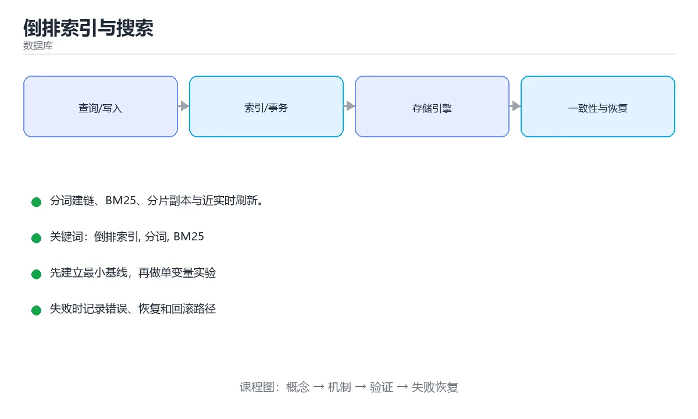

# 倒排索引与搜索



> 内容更新时间：2026-10-03 · 学习阶段：进阶 · 预计用时：16 分钟

## 学习目标

- 能用自己的话解释「倒排索引与搜索」解决了什么问题，而不是只背术语。
- 能说清 「倒排索引」、「分词」、「BM25」、「分片」 之间的关系，并分别举出一个例子。
- 能把本课知识放回「数据库」的知识体系，说明它和相邻主题的边界。
- 能完成本课练习，并用验收标准检查自己的结果。

> 一句话摘要：分词建链、BM25、分片副本与近实时刷新。

## 前置知识

- 先完成上一课《OLAP 与列式存储》；如果已经掌握，可以直接用本课练习自测。
- 本课阶段：进阶。建议先掌握同一分类的基础课程，并能独立运行正文中的最小示例。
- 开始前先复习：倒排索引、分词、BM25。
- 如果某一步看不懂，先记录具体卡点，完成练习后再回头读一遍。


## 从正排到倒排

正排索引是「文档 → 词列表」，倒排索引反过来：**词 → 包含它的文档列表（倒排链）**，因此可以按词快速找到文档而无需扫描全库。

```text
正排：doc1 → [搜索引擎, 原理]
倒排：搜索引擎 → [doc1, doc7, doc9]（带词频与位置）
```

## 索引构建流程

1. **分词**：中文需专门分词器（IK、jieba），英文按空格与词形还原；这一步决定召回质量。
2. **归一化**：小写、去停用词、同义词扩展。
3. **建链**：记录文档 ID、词频、位置（支持短语查询与高亮）。
4. **压缩**：倒排链用 Delta + 可变长编码压缩；跳表（skip list）支持快速求交。

## 相关性打分

| 模型 | 思路 |
| --- | --- |
| TF-IDF | 词频高且罕见词权重高 |
| BM25 | 在 TF-IDF 上加入文档长度归一与饱和，工业默认 |
| 向量检索 | 语义相似度（embedding + ANN），弥补字面匹配不足 |
| 混合检索 | BM25 + 向量，再重排（Rerank） |

## 查询类型

布尔查询（AND/OR/NOT）、短语查询（依赖位置信息）、前缀与通配、范围查询（数值/日期用 BKD 树）、聚合统计。查询执行的核心是**倒排链求交/求并**，跳表与位图能显著加速。

## 分布式搜索

索引按分片（shard）切分，每个分片有副本（replica）提供容错与读扩展。查询流程是「协调节点分发 → 各分片本地检索 → 归并排序 → 返回」。注意：

1. **分片数要提前规划**，过多会让归并成本上升。
2. **近实时（NRT）**：写入先落 translog 与内存缓冲，refresh 后才可被搜索（默认 1 秒）。
3. **深分页**问题：`from + size` 越大越慢，应改用 `search_after` 游标。

## 与数据库的分工

数据库负责事务与权威数据，搜索引擎负责全文检索与聚合；两者通过 CDC 或双写同步，并接受**最终一致**。不要把搜索索引当作唯一数据源。

## 本课小结
搜索 = **分词建倒排 + 打分排序 + 分片副本 + 近实时刷新**；召回靠分词与混合检索，排序靠 BM25 与重排模型，稳定性靠分片规划与游标分页。

<!-- appendix:v1 -->

## 倒排索引速查

| 概念 | 说明 |
| --- | --- |
| 词项（term） | 分词后的最小检索单位 |
| 倒排表 | 词项到文档 ID 列表的映射 |
| 位置信息 | 记录词项在文档中的位置，支持短语查询 |
| 词频 TF | 词在文档中出现次数 |
| 文档频率 DF | 包含该词的文档数 |
| 段（segment） | 索引的最小存储单位，不可变 |
| 合并（merge） | 把多个段合并成大段，回收删除标记 |
| refresh | 让新写入文档可被搜索（默认约 1 秒） |
| flush | 把数据持久化到磁盘 |

## 相关性打分速查

| 因素 | 影响 |
| --- | --- |
| TF | 词出现越多越相关（有饱和） |
| IDF | 词越稀有越有区分度 |
| 字段长度 | 短字段命中权重更高 |
| 字段权重 | `title^3` 提高标题权重 |
| 协调因子 | 命中查询词越多越相关（BM25 已简化） |

BM25 是工业界默认打分模型；需要语义相似时叠加向量检索，形成混合检索。

```json
// 建索引：显式定义映射，避免动态推断导致类型不符合预期
PUT /articles
{
  "settings": {
    "number_of_shards": 3,
    "number_of_replicas": 1,
    "refresh_interval": "1s"
  },
  "mappings": {
    "properties": {
      "title":   { "type": "text", "analyzer": "ik_max_word" },
      "content": { "type": "text", "analyzer": "ik_max_word" },
      "tags":    { "type": "keyword" },
      "author_id": { "type": "keyword" },
      "created_at": { "type": "date" },
      "embedding": {
        "type": "dense_vector",
        "dims": 768,
        "index": true,
        "similarity": "cosine"
      }
    }
  }
}
```

```json
// 混合检索：关键词打分 + 向量召回 + 元数据过滤
POST /articles/_search
{
  "size": 10,
  "query": {
    "bool": {
      "must": [
        { "multi_match": { "query": "分布式事务", "fields": ["title^3", "content"] } }
      ],
      "filter": [
        { "term":  { "tags": "backend" } },
        { "range": { "created_at": { "gte": "2025-01-01" } } }
      ]
    }
  },
  "sort": [ { "_score": "desc" }, { "created_at": "desc" } ]
}
```

| 操作 | 代价 | 说明 |
| --- | --- | --- |
| `filter` | 便宜且可缓存 | 只做筛选，不参与打分 |
| `must` | 参与打分 | 影响相关性 |
| `should` | 加分 | 满足会提升排序 |
| `must_not` | 排除 | 不参与打分 |
| 深分页 `from + size` | 昂贵（默认上限 10000） | 改用 `search_after` 游标 |
| 聚合 | 昂贵 | 限制桶数与基数 |

## 常见错误对照表

| 容易踩的做法 | 实际现象 | 原因与正确做法 |
| --- | --- | --- |
| 把 ES 当唯一数据源 | 数据丢失无法恢复 | 权威数据入库，ES 做索引 |
| 动态映射不做约束 | 字段类型推断错误 | 显式定义 mapping |
| 深分页用大 `from` | 内存暴涨、超时 | 用 `search_after` 或滚动查询 |
| 用 `text` 做精确匹配 | 匹配结果不符合预期 | 精确值用 `keyword` |
| 中文不装分词器 | 分词效果差 | 使用 IK 等中文分词插件 |
| 大量段不合并 | 查询变慢 | 控制 refresh 频率并让后台合并 |
| 一次性重建索引 | 线上查询不可用 | 用别名 + 双写 + 原子切换 |
| 聚合基数不设上限 | OOM | 用 `composite` 分页聚合 |
| 忽略副本与分片规划 | 扩容困难 | 分片数按数据量与增长预估 |
| 索引不设保留策略 | 磁盘被写满 | 按时间滚动索引并配置 ILM |

## 自测清单

- [ ] 能解释倒排索引与 `text` / `keyword` 的差别。
- [ ] 知道 `filter` 比 `must` 便宜且可缓存。
- [ ] 深分页改用 `search_after`。
- [ ] 中文检索配置合适的分词器。
- [ ] 重建索引用别名切换，做到零停机。

## 动手练习

<!-- practice-diversified:v1 -->

> 本课练习重点：围绕「倒排索引、分词、BM25」完成复述、实验和交付，每个结果都要能被别人检查。

先写 schema 与查询，再补边界和失败数据，最后看执行计划与锁等待。

### 练习 1：建立心智模型（10 分钟）

合上教程，用 3～5 句话回答：

1. 「倒排索引与搜索」解决了什么问题？
2. 如果没有它，会出现什么具体后果？
3. 它和「分词」是什么关系？

**验收标准**：至少出现一个本课关键词，并写出一个反例、边界条件或失效场景。

### 练习 2：做一次可控实验（20 分钟）

从正文中选一个最小示例，完成以下操作：

1. 先预测修改一个参数、输入或步骤后的结果。
2. 再实际执行或逐步推演，记录真实结果。
3. 如果结果与预测不同，写出差异原因。

**验收标准**：留下「原例 → 改动 → 预测 → 结果 → 原因」五步记录。

### 练习 3：交付一个小结果（30 分钟）

在 SQLite 或纸面表结构上写查询，分别验证正常数据、空值和边界数据。

任务要求：

- 结果必须能被别人检查，不能只写“我已经理解了”。
- 至少覆盖「倒排索引」和「分词」两个关键词。
- 写出 1 个仍然不确定的问题，以及下一步如何验证。

> 提示：时间有限时优先做练习 1 和练习 2；练习 3 可以拆成两次完成。

<!-- scaffold:v1 -->

<!-- deep-dive:v1 -->

## 深入补充：倒排索引与搜索

前面已经建立了基本概念。这一节换一个角度，把「倒排索引与搜索」放进真实工程里，
重点回答三件事：它为什么存在、内部如何运转、什么时候会失效。

### 一、核心模型

倒排索引把词映射到包含它的文档列表，让全文检索从“扫描所有文档”变成“查词后合并列表”；核心是分词、归一化、倒排表、相关性排序和增量更新。

```text
文档采集 → 分词与归一化 → 建立倒排表 → 查询解析 → 候选召回 → 评分排序 → 返回结果与高亮
```

### 二、关键机制拆解

1. 分词决定检索粒度，中文需要专门分词或 n-gram，英文还需词干化和停用词处理。
2. 倒排表记录词出现的文档 ID、位置和词频，位置信息支持短语查询。
3. 布尔检索用 AND/OR/NOT 合并列表，跳表或位图能加速集合运算。
4. TF-IDF 和 BM25 衡量词对文档的重要性，长度归一化避免长文档占优。
5. 短语查询要求词项位置相邻，索引必须保存位置信息。
6. 增量更新需要处理新增、删除和重建，删除通常先标记再定期合并。
7. 搜索质量要通过相关性标注、点击数据和离线指标持续评估。

### 三、对照表：抓住容易混淆的边界

| 维度 | 一侧 | 另一侧 |
| --- | --- | --- |
| 正排索引 | 文档到内容的映射 | 适合存储和展示 |
| 倒排索引 | 词到文档列表的映射 | 适合全文检索 |
| 布尔检索 | 只判断是否匹配 | 结果精确但缺少排序 |
| 相关性排序 | 按匹配程度排序 | 提升用户体验 |

### 四、工作示例

搜索“数据库 索引”时，先查到“数据库”和“索引”的倒排列表，取交集得到候选文档，再用 BM25 按词频、文档长度和稀有度排序，最后高亮命中的词项。

### 五、常见误区与失效边界

| 错误做法或假设 | 后果 | 正确做法 |
| --- | --- | --- |
| 中文按字符切分 | 召回差或噪声大 | 使用分词器或合适的 n-gram |
| 只建索引不更新 | 新内容搜不到 | 设计增量写入和定期重建 |
| 忽略停用词和大小写 | 查询结果不稳定 | 统一归一化策略 |
| 只看召回不看排序 | 结果相关性差 | 用标注数据评估排序质量 |

### 六、场景推演

站内搜索搜不到新发布的文章。排查发现索引更新队列积压，写入失败没有告警。修复后增加索引延迟监控、重试和失败补偿，并定期做全量重建校验。

### 七、自测问答

**Q1：倒排索引为什么快？**

它直接通过词项找到候选文档，避免扫描全部内容。

**Q2：位置信息有什么作用？**

支持短语查询和邻近词匹配。

**Q3：BM25 解决什么问题？**

在词频基础上加入文档长度和稀有度，改善相关性排序。

**Q4：删除文档为什么要延迟合并？**

标记删除比重建整段索引便宜，定期合并可回收空间。

### 八、小项目：把知识变成可检查的产出

为 1000 篇本地文档建立倒排索引，支持单词、短语和 AND/OR 查询；实现 BM25 排序和结果高亮，并测量索引大小、查询延迟和增量更新时间。

### 九、适用边界

倒排索引擅长文本检索，不替代数据库的事务和精确查询。向量检索适合语义相似，但两者通常需要混合使用并做重排序。

### 十、完成检查清单

- [ ] 能解释分词与归一化
- [ ] 能构建倒排表和位置索引
- [ ] 能实现布尔检索与短语查询
- [ ] 能使用 BM25 排序
- [ ] 能设计增量更新和重建

### 十一、复习顺序

1. 先不看资料复述“核心模型”，确认能说出它解决的三个问题。
2. 再对照表逐行解释容易混淆的概念，每个概念补一个反例。
3. 跟着工作示例做一遍，改变一个条件并预测结果。
4. 用自测问答检查理解，错题回到对应小节重新阅读。
5. 最后完成小项目，把结果、失败记录和复查清单整理成一份可提交产物。

> 复习不是重读一遍，而是离开原文重新产出：复述、改写、验证、复盘。

<!-- p2-enrichment:v1 -->

## English Overview

**Title:** Inverted Index & Search

**Summary:** Tokenization, BM25, shards and near-real-time.

**Category:** Database  
**Level:** 进阶  
**Key terms:** 倒排索引, 分词, BM25, 分片, 向量检索

> The full tutorial is written in Chinese. This bilingual overview helps English readers identify the topic, scope and key terms before studying the detailed examples.

## 内容元数据

- 内容版本：v2.0
- 最后更新：2026-10-03
- 学习阶段：进阶
- 适用环境：PostgreSQL / MySQL / SQLite 等主流数据库
- 内容来源：内置结构化课程与工程实践整理
- 相关主题：倒排索引、分词、BM25、分片、向量检索
- 质量版本：P0 测验标准 + P1 覆盖扩展 + P2 体验补全

<!-- p2-references:v1 -->

## 参考资料与复核

- 最后复核：2026-10-04
- 下次复核：2027-04-04
- 复核范围：版本兼容、API 行为、安全建议与工程实践
- 来源性质：官方文档与标准；本课正文为离线教学重组，不复制原文

| 参考资料 | 本课用途 |
| --- | --- |
| [PostgreSQL 文档](https://www.postgresql.org/docs/) | SQL、索引与事务 |
| [SQLite 文档](https://sqlite.org/docs.html) | 嵌入式数据库与 SQL 行为 |

> 本课主题：分词建链、BM25、分片副本与近实时刷新。

> App 完全离线展示文字链接，不会自动联网；需要延伸阅读时可复制链接到浏览器。

