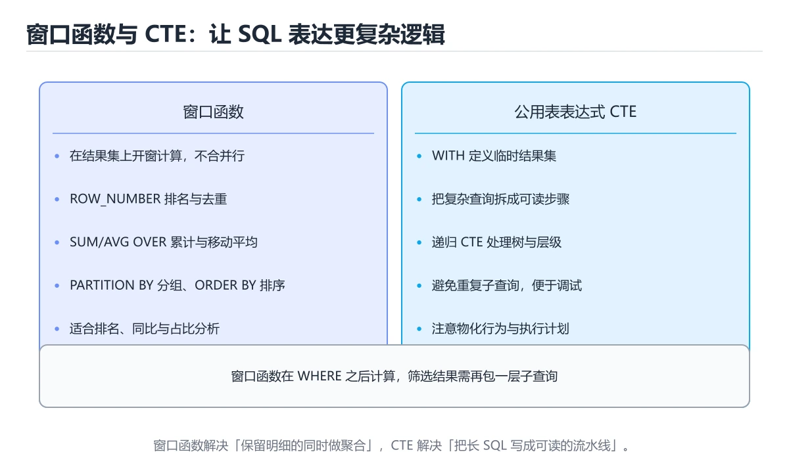

# SQL 高级查询




> 内容更新时间：2026-10-06 · 学习阶段：进阶 · 预计用时：40 分钟

## 本节知识框架

**课程定位**：所属分类 `database`（数据库），课程主题 `SQL 高级查询`，学习阶段 进阶，建议用时 40 分钟。

本课主线：窗口函数、CTE、条件聚合与性能要点。

**学完本课应当能够**
- 说清 `窗口函数` 与 `CTE` 的含义与区别，并各举一个正例和一个反例。
- 用本课示例验证 `条件聚合` 的行为，记录输入、输出与失败条件。
- 遇到「用 `UNION` 合并大数据集」这类问题时，能说出触发条件与修复顺序。

### 从概念到验证的学习链条

1. `窗口函数`：先掌握 窗口函数在不折叠行的前提下做聚合与排名，是分析类查询的主力，再用它解释 `CTE` 为什么会出现。
2. `CTE`：先掌握 高级 SQL 的两个抓手是窗口函数（排名、偏移、累计）与 CTE（拆解复杂逻辑、递归展开层级）；配合条件聚合就能用一条语句产出完整报表，再用它解释 `条件聚合` 为什么会出现。
3. `条件聚合`：先掌握 用 CASE WHEN 配合 SUM / COUNT 实现「一行多指标」的透视：对不同状态分别求和与计数，再按维度分组，即可用一条语句产出汇总表，避免多次扫描，再用它解释 `分析查询` 为什么会出现。
4. `分析查询`：先掌握 面向聚合、窗口和报表的查询，通常扫描大量数据并关注分组与排序代价，再用它解释 `执行计划` 为什么会出现。
5. `执行计划`：先掌握 数据库优化器为查询选出的访问路径、连接顺序和算子组合，再用它解释 本课示例的观察结果 为什么会出现。

**先修与衔接**：本课是「数据库」分类的第 10 课。相关或后续课程：《存储引擎与 B+ 树实现》。

### 完成判据

- **定义关**：不看正文也能说明 `窗口函数` 是 窗口函数在不折叠行的前提下做聚合与排名，是分析类查询的主力，并指出一个反例。
- **机制关**：能按“输入 → 转换 → 输出 → 验证”复述 `SQL 高级查询`，而不是只背结论。
- **示例关**：能运行或推演 `SQL 高级查询` 的 `sql` 示例，并说明一个真实出现的标识符或字面量。
- **证据关**：能指出 `SQL 高级查询` 示例里的 调用了 `FROM()`，并说明它支持或反驳了本课的哪一条结论。
- **排错关**：能复现 用 `UNION` 合并大数据集，记录现象并按 确认无重复需求时用 `UNION ALL` 修复。
- **迁移关**：能把 `窗口函数`、`CTE`、`条件聚合`、`分析查询` 放进一个与 `SQL 高级查询` 不同的项目场景，并保持输入与验证条件可追踪。
- **复盘关**：学完 `SQL 高级查询` 后，用一句话写下仍然不确定的结论，并列出下一次验证需要的输入、环境和成功判据。

### 复习清单

- [ ] 能不看正文复述本课核心术语，并指出一个边界或反例。
- [ ] 能运行或推演本课示例，记录输入、输出与失败现象。
- [ ] 能完成一次自测，并把错题对照错误表定位原因。

## 核心概念定义

| 术语 | 操作性定义 | 常见边界与风险 |
| --- | --- | --- |
| 窗口函数 | 窗口函数在不折叠行的前提下做聚合与排名，是分析类查询的主力。 | 易错：语法错误；正确做法是先用子查询或 CTE 计算，再在外层过滤。 |
| CTE | 高级 SQL 的两个抓手是窗口函数（排名、偏移、累计）与 CTE（拆解复杂逻辑、递归展开层级）；配合条件聚合就能用一条语句产出完整报表。 | 易错：语法错误；正确做法是先用子查询或 CTE 计算，再在外层过滤。 |
| 条件聚合 | 用 CASE WHEN 配合 SUM / COUNT 实现「一行多指标」的透视：对不同状态分别求和与计数，再按维度分组，即可用一条语句产出汇总表，避免多次扫描。 | 索引命中与数据分布决定实际开销，判断前先看执行计划而不是只看结果是否正确。 |
| 分析查询 | 面向聚合、窗口和报表的查询，通常扫描大量数据并关注分组与排序代价。 | 索引命中与数据分布决定实际开销，判断前先看执行计划而不是只看结果是否正确。 |
| 执行计划 | 数据库优化器为查询选出的访问路径、连接顺序和算子组合 | 索引命中与数据分布决定实际开销，判断前先看执行计划而不是只看结果是否正确。 |

## 原理与运行机制

### 机制总览

**教材衔接：窗口函数**

窗口函数在**不折叠行**的前提下做聚合与排名，是分析类查询的主力。

| 函数族 | 示例 | 用途 |
| --- | --- | --- |
| 排名 | ROW_NUMBER、RANK、DENSE_RANK | 分组内排名、去重取最新 |
| 偏移 | LAG、LEAD | 同比环比、相邻行比较 |
| 聚合窗口 | SUM / AVG / COUNT OVER | 累计值、移动平均 |
| 分布 | NTILE、PERCENT_RANK | 分桶、百分位 |

最高频的写法是 `ROW_NUMBER() OVER (PARTITION BY user_id ORDER BY created_at DESC)` 再在外层筛选序号等于 1，即「每个用户的最新一条」。

**教材衔接：公共表表达式 CTE**

CTE（WITH 子句）把复杂查询拆成可读的步骤；递归 CTE 可展开树形结构，如组织架构、评论树、物料清单。写法为 `WITH 名称 AS (查询) SELECT ... FROM 名称`，递归时用 `WITH RECURSIVE` 并在内部包含终止条件。

**教材衔接：集合运算与高级聚合**

UNION 会去重，UNION ALL 保留重复且性能更好（能用就用）；INTERSECT 取交集、EXCEPT 取差集。高级聚合包括 GROUPING SETS、ROLLUP、CUBE，可一次查询产出多层级汇总，适合报表场景。

**教材衔接：条件聚合**

用 CASE WHEN 配合 SUM / COUNT 实现「一行多指标」的透视：对不同状态分别求和与计数，再按维度分组，即可用一条语句产出汇总表，避免多次扫描。

**教材衔接：JSON 与全文检索**

PostgreSQL 的 jsonb、MySQL 的 JSON 类型支持按路径查询与索引；全文检索可用 MATCH AGAINST 或 tsvector。它们适合半结构化数据与站内搜索，但复杂分析仍建议规范化到关系表。

**教材衔接：执行计划对比：窗口函数 vs 自连接**

| 方案 | 计划特征 | 复杂度 | 建议 |
| --- | --- | --- | --- |
| 窗口函数 | 出现 WindowAgg，只扫描一次数据 | O(n log n)（排序） | 首选，可读性与性能都更好 |
| 自连接 | 出现两次扫描或 Nested Loop | O(n²) | 仅在不支持窗口函数的老版本使用 |
| 相关子查询 | 每行执行一次内层查询 | O(n²) | 尽量改写为 JOIN 或窗口函数 |

验证方式：同一份数据分别用两种写法跑 `EXPLAIN ANALYZE`，对比实际执行时间与扫描行数；数据量大时差异通常是一个数量级。

**教材衔接：UNION 与 JOIN 速查**

| 操作 | 方向 | 是否去重 | 说明 |
| --- | --- | --- | --- |
| `UNION` | 纵向合并 | 去重（有排序开销） | 列数与类型必须一致 |
| `UNION ALL` | 纵向合并 | 不去重 | 性能更好，优先使用 |
| `INNER JOIN` | 横向关联 | 只保留匹配行 | 两表都有的数据 |
| `LEFT JOIN` | 横向关联 | 保留左表全部 | 右表缺失为 NULL |
| `RIGHT JOIN` | 横向关联 | 保留右表全部 | 可用 LEFT JOIN 改写 |
| `FULL JOIN` | 横向关联 | 两边都保留 | MySQL 需模拟 |
| `CROSS JOIN` | 笛卡尔积 | 全部组合 | 小心行数爆炸 |

### 机制拆解：每一步的输入、动作与输出

#### 1. `窗口函数`
- 输入：`窗口函数`；本步把 窗口函数在不折叠行的前提下做聚合与排名，是分析类查询的主力 当作判断规则。
- 动作：围绕 `窗口函数` 保留中间状态，并记录它与 `CTE` 的对应关系。
- 输出：`CTE`，它可以被下一段代码、测试或记录继续使用。
- `窗口函数` 的失败条件：当窗口函数写在 `WHERE` 里时，会出现语法错误。

#### 2. `CTE`
- 输入：`窗口函数`；本步把 高级 SQL 的两个抓手是窗口函数（排名、偏移、累计）与 CTE（拆解复杂逻辑、递归展开层级）；配合条件聚合就能用一条语句产出完整报表 当作判断规则。
- 动作：围绕 `CTE` 保留中间状态，并记录它与 `条件聚合` 的对应关系。
- 输出：`条件聚合`，它可以被下一段代码、测试或记录继续使用。
- `CTE` 的失败条件：当窗口函数写在 `WHERE` 里时，会出现语法错误。

#### 3. `条件聚合`
- 输入：`CTE`；本步把 用 CASE WHEN 配合 SUM / COUNT 实现「一行多指标」的透视：对不同状态分别求和与计数，再按维度分组，即可用一条语句产出汇总表，避免多次扫描 当作判断规则。
- 动作：围绕 `条件聚合` 保留中间状态，并记录它与 `分析查询` 的对应关系。
- 输出：`分析查询`，它可以被下一段代码、测试或记录继续使用。
- `条件聚合` 的失败条件：索引命中与数据分布决定实际开销，判断前先看执行计划而不是只看结果是否正确。

#### 4. `分析查询`
- 输入：`条件聚合`；本步把 面向聚合、窗口和报表的查询，通常扫描大量数据并关注分组与排序代价 当作判断规则。
- 动作：围绕 `分析查询` 保留中间状态，并记录它与 `执行计划` 的对应关系。
- 输出：`执行计划`，它可以被下一段代码、测试或记录继续使用。
- `分析查询` 的失败条件：索引命中与数据分布决定实际开销，判断前先看执行计划而不是只看结果是否正确。

#### 5. `执行计划`
- 输入：`分析查询`；本步把 数据库优化器为查询选出的访问路径、连接顺序和算子组合 当作判断规则。
- 动作：围绕 `执行计划` 保留中间状态，并记录它与 `FROM` 的对应关系。
- 输出：`FROM`，它可以被下一段代码、测试或记录继续使用。
- `执行计划` 的失败条件：索引命中与数据分布决定实际开销，判断前先看执行计划而不是只看结果是否正确。

### 示例中的可观察事实

1. 调用了 `FROM()`；它对应的课程主题是 `SQL 高级查询`。
2. 调用了 `ROW_NUMBER()`；它对应的课程主题是 `SQL 高级查询`。
3. 调用了 `OVER()`；它对应的课程主题是 `SQL 高级查询`。
4. 调用了 `LAG()`；它对应的课程主题是 `SQL 高级查询`。
5. 调用了 `AVG()`；它对应的课程主题是 `SQL 高级查询`。

### 复现实验记录

- 环境：`SQL 高级查询` 使用 `sql` 示例，固定 `窗口函数`、`CTE`、`条件聚合`、`分析查询` 作为第一组条件。
- 首轮输入：先确认 调用了 `FROM()`，预测 `窗口函数` 会怎样变化。
- 基线观察：记录命令、输入、输出和错误原文，不用截图代替可复制的文本。
- 单变量修改：只改变 `窗口函数`，观察 `执行计划` 是否仍满足定义。
- 失败注入：复现 用 `UNION` 合并大数据集，确认现象是 比 `UNION ALL` 慢很多。
- 记录结论：把“修改前、修改后、预期变化、实际变化”写成四列表，这样复盘 `SQL 高级查询` 时才能区分概念错误与实现错误。

## 典型应用场景

**教材衔接：窗口函数四个实战场景**

| 场景 | 写法要点 |
| --- | --- |
| 每组取最新一条 | `ROW_NUMBER() OVER (PARTITION BY user_id ORDER BY created_at DESC)` 后外层筛 rn=1 |
| 组内 Top3 | 同上取 rn<=3；注意并列名次用 `RANK()`（并列会跳号）或 `DENSE_RANK()`（不跳号） |
| 同比环比 | `LAG(amount, 1) OVER (ORDER BY month)` 取上月值，再做差值或比值 |
| 累计与移动平均 | `SUM(amount) OVER (ORDER BY day ROWS BETWEEN UNBOUNDED PRECEDING AND CURRENT ROW)`；移动平均用 `ROWS BETWEEN 6 PRECEDING AND CURRENT ROW` |

注意：`ROWS` 按物理行数，`RANGE` 按排序值的范围——有并列值时两者结果不同，做累计统计时要明确选哪个。

- **用 `UNION` 合并大数据集**：典型现象是比 `UNION ALL` 慢很多；正确做法是确认无重复需求时用 `UNION ALL`。
- **在 `WHERE` 里过滤聚合结果**：典型现象是报错或结果不对；正确做法是聚合条件放 `HAVING`。
- **`LEFT JOIN` 后在 `WHERE` 过滤右表字段**：典型现象是退化成内连接；正确做法是把右表条件写进 `ON`，或改判断 `IS NULL`。
- **用 `NOT IN` 且子查询含 NULL**：典型现象是结果为空；正确做法是改用 `NOT EXISTS` 或先过滤 NULL。

### 最小验证场景

- 准备：保留 `sql` 示例的原始输入，先记录 `SQL 高级查询` 的基线输出和完整运行命令。
- 观察：先核对 调用了 `FROM()`，再改变一个与 `窗口函数` 相关的条件。
- 判定：新结果与 `SQL 高级查询` 的基线不同不等于错误；只有当差异破坏了 `窗口函数` 的定义或错误表中的约束，才判定为失败。

### 选择与边界

- 使用 `窗口函数` 时，先满足它的定义：窗口函数在不折叠行的前提下做聚合与排名，是分析类查询的主力；易错：语法错误；正确做法是先用子查询或 CTE 计算，再在外层过滤。
- 使用 `CTE` 时，先满足它的定义：高级 SQL 的两个抓手是窗口函数（排名、偏移、累计）与 CTE（拆解复杂逻辑、递归展开层级）；配合条件聚合就能用一条语句产出完整报表；易错：语法错误；正确做法是先用子查询或 CTE 计算，再在外层过滤。
- 使用 `条件聚合` 时，先满足它的定义：用 CASE WHEN 配合 SUM / COUNT 实现「一行多指标」的透视：对不同状态分别求和与计数，再按维度分组，即可用一条语句产出汇总表，避免多次扫描；索引命中与数据分布决定实际开销，判断前先看执行计划而不是只看结果是否正确。
- 使用 `分析查询` 时，先满足它的定义：面向聚合、窗口和报表的查询，通常扫描大量数据并关注分组与排序代价；索引命中与数据分布决定实际开销，判断前先看执行计划而不是只看结果是否正确。
- 使用 `执行计划` 时，先满足它的定义：数据库优化器为查询选出的访问路径、连接顺序和算子组合；索引命中与数据分布决定实际开销，判断前先看执行计划而不是只看结果是否正确。

## 代码/协议/SQL 示例

### 最小可验证示例

```sql
-- 每个用户最近一笔订单（分组取最新）
SELECT *
FROM (
  SELECT o.*,
         ROW_NUMBER() OVER (PARTITION BY user_id ORDER BY created_at DESC) AS rn
  FROM orders o
) t
WHERE rn = 1;

-- 每日新增与环比
SELECT day,
       amount,
       amount - LAG(amount) OVER (ORDER BY day) AS diff_vs_prev_day
FROM daily_sales
ORDER BY day;

-- 近 7 天滑动平均
SELECT day,
       AVG(amount) OVER (ORDER BY day ROWS BETWEEN 6 PRECEDING AND CURRENT ROW) AS avg_7d
FROM daily_sales;
```

**教材衔接：窗口函数速查**

| 函数 | 作用 | 示例 |
| --- | --- | --- |
| `ROW_NUMBER()` | 组内连续序号，不重 | `ROW_NUMBER() OVER (PARTITION BY user_id ORDER BY created_at DESC)` |
| `RANK()` | 并列同名次，跳号 | `RANK() OVER (ORDER BY score DESC)` |
| `DENSE_RANK()` | 并列同排名，不跳号 | 排行榜常用 |
| `LAG()` / `LEAD()` | 取前一行 / 后一行 | 计算环比、相邻差值 |
| `SUM() OVER` | 累计求和 | `SUM(amount) OVER (ORDER BY day)` |
| `AVG() OVER` | 滑动平均 | `ROWS BETWEEN 6 PRECEDING AND CURRENT ROW` |
| `FIRST_VALUE()` / `LAST_VALUE()` | 组内首尾值 | 注意默认窗口范围 |
| `NTILE(n)` | 分桶 | 用户分层、百分位 |

**运行方式**：运行 `SQL 高级查询` 的示例时，在本地数据库或用 SQLite 命令行执行；先在测试库上跑，确认影响行数。

### 示例精读：先找证据，再改一个条件

1. 调用了 `FROM()`；它出现在 `SQL 高级查询` 的示例中，阅读时先确认它前后各发生了什么。
2. 调用了 `ROW_NUMBER()`；它出现在 `SQL 高级查询` 的示例中，阅读时先确认它前后各发生了什么。
3. 调用了 `OVER()`；它出现在 `SQL 高级查询` 的示例中，阅读时先确认它前后各发生了什么。
4. 调用了 `LAG()`；它出现在 `SQL 高级查询` 的示例中，阅读时先确认它前后各发生了什么。
5. 调用了 `AVG()`；它出现在 `SQL 高级查询` 的示例中，阅读时先确认它前后各发生了什么。
- 在 `SQL 高级查询` 中与 `窗口函数` 对照：示例必须能支持 窗口函数在不折叠行的前提下做聚合与排名，是分析类查询的主力，否则说明这一段还缺少实现或验证步骤。
- 在 `SQL 高级查询` 中与 `CTE` 对照：示例必须能支持 高级 SQL 的两个抓手是窗口函数（排名、偏移、累计）与 CTE（拆解复杂逻辑、递归展开层级）；配合条件聚合就能用一条语句产出完整报表，否则说明这一段还缺少实现或验证步骤。
- 在 `SQL 高级查询` 中与 `条件聚合` 对照：示例必须能支持 用 CASE WHEN 配合 SUM / COUNT 实现「一行多指标」的透视：对不同状态分别求和与计数，再按维度分组，即可用一条语句产出汇总表，避免多次扫描，否则说明这一段还缺少实现或验证步骤。
- 在 `SQL 高级查询` 中与 `分析查询` 对照：示例必须能支持 面向聚合、窗口和报表的查询，通常扫描大量数据并关注分组与排序代价，否则说明这一段还缺少实现或验证步骤。

## 时间/空间复杂度或性能分析

**复杂度证据**：本课正文出现 `O(n log n)`、`O(n²)` 等量级表达式；使用前要同时确认输入规模、最好/平均/最坏情况以及常数项来源。

**测量方法**：以 `SQL 高级查询` 的 `窗口函数` 场景为对象，固定输入跑一遍记录基线，再把规模或并发度提高一个数量级复测；两次结果的差值与波动范围才是结论依据。

### 需要控制的变量与记录项

- `SQL 高级查询` 的 `窗口函数`：固定它的版本、输入范围和资源上限，分别记录速度、内存与失败率的变化。
- `SQL 高级查询` 的 `CTE`：固定它的版本、输入范围和资源上限，分别记录速度、内存与失败率的变化。
- `SQL 高级查询` 的 `条件聚合`：固定它的版本、输入范围和资源上限，分别记录速度、内存与失败率的变化。
- `SQL 高级查询` 的 `分析查询`：固定它的版本、输入范围和资源上限，分别记录速度、内存与失败率的变化。
- `SQL 高级查询` 中 `窗口函数` 的边界：易错：语法错误；正确做法是先用子查询或 CTE 计算，再在外层过滤。达到边界时不要外推，必须重新测量。
- `SQL 高级查询` 中 `CTE` 的边界：易错：语法错误；正确做法是先用子查询或 CTE 计算，再在外层过滤。达到边界时不要外推，必须重新测量。
- `SQL 高级查询` 中 `条件聚合` 的边界：索引命中与数据分布决定实际开销，判断前先看执行计划而不是只看结果是否正确。达到边界时不要外推，必须重新测量。
- `SQL 高级查询` 中 `分析查询` 的边界：索引命中与数据分布决定实际开销，判断前先看执行计划而不是只看结果是否正确。达到边界时不要外推，必须重新测量。
- `SQL 高级查询` 中 `执行计划` 的边界：索引命中与数据分布决定实际开销，判断前先看执行计划而不是只看结果是否正确。达到边界时不要外推，必须重新测量。
- `SQL 高级查询` 的代码证据：先验证 调用了 `FROM()`，再记录该路径的输入规模与耗时；只看代码行数不能推出复杂度。

## 常见误区与易错点

| 容易写错的做法 | 实际现象 | 原因与正确做法 |
| --- | --- | --- |
| 用 `UNION` 合并大数据集 | 比 `UNION ALL` 慢很多 | 确认无重复需求时用 `UNION ALL` |
| 在 `WHERE` 里过滤聚合结果 | 报错或结果不对 | 聚合条件放 `HAVING` |
| `LEFT JOIN` 后在 `WHERE` 过滤右表字段 | 退化成内连接 | 把右表条件写进 `ON`，或改判断 `IS NULL` |
| 用 `NOT IN` 且子查询含 NULL | 结果为空 | 改用 `NOT EXISTS` 或先过滤 NULL |
| 窗口函数写在 `WHERE` 里 | 语法错误 | 先用子查询或 CTE 计算，再在外层过滤 |
| `COUNT(column)` 统计含 NULL 的列 | 数量比预期少 | 统计行数用 `COUNT(*)` |
| `GROUP BY` 选了非聚合列 | 结果不确定或报错 | 只选分组列与聚合列 |
| 用 `LIMIT` 深分页 | 越翻越慢 | 用「上一页最后一条」的游标分页 |
| 隐式连接（逗号 + WHERE） | 可读性差、易漏条件 | 用显式 `JOIN ... ON` |
| 子查询返回多行用于 `=` | `Subquery returns more than 1 row` | 改 `IN` 或加 `LIMIT 1` |
| `ORDER BY` 里用列序号 | 增删列后含义变化 | 明确写列名 |
| 用 UNION 合并大数据集 | 比 UNION ALL 慢很多。 | 确认无重复需求时用 UNION ALL。 |
| 在 WHERE 里过滤聚合结果 | 报错或结果不对。 | 聚合条件放 HAVING。 |
| LEFT JOIN 后在 WHERE 过滤右表字段 | 退化成内连接。 | 把右表条件写进 ON，或改判断 IS NULL。 |

### 现场 1：用 `UNION` 合并大数据集

**症状**：比 `UNION ALL` 慢很多。

**根因与修复**：确认无重复需求时用 `UNION ALL`。

**自检**：在本课示例里复现「用 `UNION` 合并大数据集」，改成确认无重复需求时用 `UNION ALL`后重跑；如果症状消失且失败路径按预期变化，说明定位正确。

### 现场 2：在 `WHERE` 里过滤聚合结果

**症状**：报错或结果不对。

**根因与修复**：聚合条件放 `HAVING`。

**自检**：在本课示例里复现「在 `WHERE` 里过滤聚合结果」，改成聚合条件放 `HAVING`后重跑；如果症状消失且失败路径按预期变化，说明定位正确。

### 现场 3：`LEFT JOIN` 后在 `WHERE` 过滤右表字段

**症状**：退化成内连接。

**根因与修复**：把右表条件写进 `ON`，或改判断 `IS NULL`。

**自检**：在本课示例里复现「`LEFT JOIN` 后在 `WHERE` 过滤右表字段」，改成把右表条件写进 `ON`，或改判断 `IS NULL`后重跑；如果症状消失且失败路径按预期变化，说明定位正确。

### 现场 4：用 `NOT IN` 且子查询含 NULL

**症状**：结果为空。

**根因与修复**：改用 `NOT EXISTS` 或先过滤 NULL。

**自检**：在本课示例里复现「用 `NOT IN` 且子查询含 NULL」，改成改用 `NOT EXISTS` 或先过滤 NULL后重跑；如果症状消失且失败路径按预期变化，说明定位正确。

### 现场 5：窗口函数写在 `WHERE` 里

**症状**：语法错误。

**根因与修复**：先用子查询或 CTE 计算，再在外层过滤。

**自检**：在本课示例里复现「窗口函数写在 `WHERE` 里」，改成先用子查询或 CTE 计算，再在外层过滤后重跑；如果症状消失且失败路径按预期变化，说明定位正确。

### 现场 6：`COUNT(column)` 统计含 NULL 的列

**症状**：数量比预期少。

**根因与修复**：统计行数用 `COUNT(*)`。

**自检**：在本课示例里复现「`COUNT(column)` 统计含 NULL 的列」，改成统计行数用 `COUNT(*)`后重跑；如果症状消失且失败路径按预期变化，说明定位正确。

### 现场 7：`GROUP BY` 选了非聚合列

**症状**：结果不确定或报错。

**根因与修复**：只选分组列与聚合列。

**自检**：在本课示例里复现「`GROUP BY` 选了非聚合列」，改成只选分组列与聚合列后重跑；如果症状消失且失败路径按预期变化，说明定位正确。

### 现场 8：用 `LIMIT` 深分页

**症状**：越翻越慢。

**根因与修复**：用「上一页最后一条」的游标分页。

**自检**：在本课示例里复现「用 `LIMIT` 深分页」，改成用「上一页最后一条」的游标分页后重跑；如果症状消失且失败路径按预期变化，说明定位正确。

### 现场 9：隐式连接（逗号 + WHERE）

**症状**：可读性差、易漏条件。

**根因与修复**：用显式 `JOIN ... ON`。

**自检**：在本课示例里复现「隐式连接（逗号 + WHERE）」，改成用显式 `JOIN ... ON`后重跑；如果症状消失且失败路径按预期变化，说明定位正确。

## 与其他知识点的关系

**教材衔接：复习与迁移**

### 概念复述

- 用一句话说明「SQL 高级查询」解决什么问题：窗口函数、CTE、条件聚合与性能要点。
- 写出窗口函数、CTE、条件聚合之间的关系，并各举一个例子。
- 说出本课最容易混淆的两个概念，以及区分它们的判据。

### 正文逐节复核

- **窗口函数**：窗口函数在**不折叠行**的前提下做聚合与排名，是分析类查询的主力。
- **公共表表达式 CTE**：CTE（WITH 子句）把复杂查询拆成可读的步骤；递归 CTE 可展开树形结构，如组织架构、评论树、物料清单。


### 迁移练习

把「SQL 高级查询」的结论迁移到相邻主题，每次迁移都写清预测与证据：

- **相关或后续**：`存储引擎与 B+ 树实现`。本课术语会在这些课程里继续使用。
- **术语归属**：`窗口函数`、`CTE`、`条件聚合` 的定义以本课「核心概念定义」为准，换到其他课程时先确认定义是否被改写。

### 先修与后续术语接口

- `存储引擎与 B+ 树实现`：两者通过本分类的学习顺序衔接，阅读时重点比较各自的输入与失败条件。

### 容易混淆的相邻概念

- `窗口函数` 与 `CTE`：前者强调 窗口函数在不折叠行的前提下做聚合与排名，是分析类查询的主力；后者强调 高级 SQL 的两个抓手是窗口函数（排名、偏移、累计）与 CTE（拆解复杂逻辑、递归展开层级）；配合条件聚合就能用一条语句产出完整报表。判断时分别检查两条定义的适用范围，不要只看名称相似就互换。
- `CTE` 与 `条件聚合`：前者强调 高级 SQL 的两个抓手是窗口函数（排名、偏移、累计）与 CTE（拆解复杂逻辑、递归展开层级）；配合条件聚合就能用一条语句产出完整报表；后者强调 用 CASE WHEN 配合 SUM / COUNT 实现「一行多指标」的透视：对不同状态分别求和与计数，再按维度分组，即可用一条语句产出汇总表，避免多次扫描。判断时分别检查两条定义的适用范围，不要只看名称相似就互换。
- `条件聚合` 与 `分析查询`：前者强调 用 CASE WHEN 配合 SUM / COUNT 实现「一行多指标」的透视：对不同状态分别求和与计数，再按维度分组，即可用一条语句产出汇总表，避免多次扫描；后者强调 面向聚合、窗口和报表的查询，通常扫描大量数据并关注分组与排序代价。判断时分别检查两条定义的适用范围，不要只看名称相似就互换。
- `分析查询` 与 `执行计划`：前者强调 面向聚合、窗口和报表的查询，通常扫描大量数据并关注分组与排序代价；后者强调 数据库优化器为查询选出的访问路径、连接顺序和算子组合。判断时分别检查两条定义的适用范围，不要只看名称相似就互换。

## 自测题与参考答案

> 先独立作答，再对照参考答案；答案都能在本课正文、术语表或错误表里找到依据。

### 自测 1（概念复述）

不看正文，写出 `窗口函数` 的操作性定义，并说明它与 `CTE` 的区别。

**参考答案**：窗口函数在不折叠行的前提下做聚合与排名，是分析类查询的主力。

`CTE` 的定位是：高级 SQL 的两个抓手是窗口函数（排名、偏移、累计）与 CTE（拆解复杂逻辑、递归展开层级）；配合条件聚合就能用一条语句产出完整报表；两者的差别要从适用对象与失败模式上说明。

### 自测 2（排错）

本课错误表记录了「用 `UNION` 合并大数据集」这类做法。请写出它会出现的现象、根因，以及修复顺序。

**参考答案**：现象是比 `UNION ALL` 慢很多；正确做法是确认无重复需求时用 `UNION ALL`。修复时先复现现象并保留证据，再改动一处假设重跑，确认现象消失。

### 自测 3（动手验证）

运行本课的 `sql` 示例，把其中的 `1` 换成一个边界值后重新运行，记录输出与错误信息。

**参考答案**：正常输入下 `sql` 示例应当复现正文给出的结果；把 `1` 换成边界值后，如果结果改变或报错，先核对它是否满足 `SQL 高级查询` 中`窗口函数` 的适用范围，再检查错误表里是否有同类现象。

### 自测 4（代码阅读）

阅读本课开头的 `sql` 示例，说明它体现了`窗口函数` 的哪一条性质，并指出改动哪个输入会让这条性质不再成立。

**参考答案**：`窗口函数` 的定义是 窗口函数在不折叠行的前提下做聚合与排名，是分析类查询的主力，示例正是在实现这条定义。改动与 `窗口函数` 有关的一个输入后，如果结果不再符合 `SQL 高级查询` 的正文描述，就说明该性质只在当前前提成立。

### 自测 5（迁移）

把 `SQL 高级查询` 的方法迁移到自己的项目：围绕 `窗口函数` 写出一个与错误表同类的风险点，并说明触发条件和检验方式。

**参考答案**：例如「LEFT JOIN 后在 WHERE 过滤右表字段」，它会导致退化成内连接；检验方式是按把右表条件写进 ON，或改判断 IS NULL改一处再复现，确认现象消失且没有引入新的失败分支。

### 自测 6（对比）

用一个表格对比 `窗口函数` 与 `CTE`：各写一行适用场景、一行失败表现。

**参考答案**：`窗口函数` 的定义是窗口函数在不折叠行的前提下做聚合与排名，是分析类查询的主力；`CTE` 的定义是高级 SQL 的两个抓手是窗口函数（排名、偏移、累计）与 CTE（拆解复杂逻辑、递归展开层级）；配合条件聚合就能用一条语句产出完整报表。两者的失败表现分别对应本课错误表里与本术语相关的行。

### 自测 7（排错顺序）

面对「用 `UNION` 合并大数据集」引发的问题，请把“复现 比 `UNION ALL` 慢很多 → 保留证据 → 确认无重复需求时用 `UNION ALL` → 回归验证”四步写成可执行的检查清单。

**参考答案**：第一步按比 `UNION ALL` 慢很多复现；第二步记录输入、版本与完整报错；第三步按确认无重复需求时用 `UNION ALL`只改一处；第四步重跑并确认失败路径也按预期变化。

### 自测 8（边界判断）

针对 `执行计划`，分别写出“可以使用”的条件和“结论不再成立”的条件。

**参考答案**：索引命中与数据分布决定实际开销，判断前先看执行计划而不是只看结果是否正确。 同时要把 `执行计划` 的定义 数据库优化器为查询选出的访问路径、连接顺序和算子组合 与实际输入逐项对照。

### 自测 9（机制重建）

不看正文，按输入、转换、输出、验证四段重建 `窗口函数` → `CTE` → `条件聚合` → `分析查询` 的作用链。

**参考答案**：起点是 `窗口函数` 的定义 窗口函数在不折叠行的前提下做聚合与排名，是分析类查询的主力；中间每一步都保留可观察状态；终点由 `执行计划` 检查，失败时回到错误表定位第一个偏离定义的步骤。

### 自测 10（综合排错）

在 `SQL 高级查询` 中，现象是 退化成内连接。请围绕 LEFT JOIN 后在 WHERE 过滤右表字段 写出最小复现、关键证据、修复动作和回归验证，并说明为什么不能只凭一次运行下结论。

**参考答案**：先复现 LEFT JOIN 后在 WHERE 过滤右表字段，记录输入与完整错误；再按 把右表条件写进 ON，或改判断 IS NULL 只改一处。回归时同时跑正常路径和边界路径，只有两次结果都可解释，才把修复视为完成。

### 自测 11（一分钟复述）

用每分钟约 200 字的速度复述 `SQL 高级查询`：先给主问题，再按顺序说出 `窗口函数`、`CTE`、`条件聚合`、`分析查询`，最后给一个失败案例。

**自评标准**：主问题必须对应 窗口函数、CTE、条件聚合与性能要点；每个术语都要能接上一句定义或边界；失败案例必须写成可观察现象，不能用“可能有风险”代替证据。

## 术语速查

| 术语 | 一句话说明 |
| --- | --- |
| `窗口函数` | 窗口函数在不折叠行的前提下做聚合与排名，是分析类查询的主力。 |
| `CTE` | 高级 SQL 的两个抓手是窗口函数（排名、偏移、累计）与 CTE（拆解复杂逻辑、递归展开层级）；配合条件聚合就能用一条语句产出完整报表。 |
| `条件聚合` | 用 CASE WHEN 配合 SUM / COUNT 实现「一行多指标」的透视：对不同状态分别求和与计数，再按维度分组，即可用一条语句产出汇总表，避免多次扫描。 |
| `分析查询` | 面向聚合、窗口和报表的查询，通常扫描大量数据并关注分组与排序代价。 |
| `执行计划` | 数据库优化器为查询选出的访问路径、连接顺序和算子组合。 |

**术语关系**：`窗口函数`（窗口函数在不折叠行的前提下做聚合与排名） → `CTE`（高级 SQL 的两个抓手是窗口函数（排名、偏移、累计）与 CTE（拆解复杂逻辑、递归展开层级）） → `条件聚合`（用 CASE WHEN 配合 SUM / COUNT 实现「一行多指标」的透视：对不同状态分别求和与计数） → `分析查询`（面向聚合、窗口和报表的查询）。

## 考点精讲

`SQL 高级查询` 的题库有 6 道题，下面逐题给出题干、正确项与判断依据：先自己作答，再核对正确项，最后回到正文对应小节复核。

### 考点 1：第 1 题

- **题目**：窗口函数与 GROUP BY 的关键区别是？
- **正确项**：不折叠行
- **判断依据**：这道题落在术语 `窗口函数` 上：窗口函数在不折叠行的前提下做聚合与排名，是分析类查询的主力。复习时把 `窗口函数` 的定义、适用边界和一个反例一起说清楚，再回到「核心概念定义」核对原文。

### 考点 2：第 2 题

- **题目**：围绕“SQL 高级查询”中的 窗口函数、CTE、条件聚合，下列哪两项是本课强调的实践判断？
- **正确项**：验证 CTE 时要固定版本并覆盖边界输入，结论才可复现；学习 窗口函数 时要同时说明输入、输出和失败路径，不能只看正常流程
- **判断依据**：这道题落在术语 `窗口函数` 上：窗口函数在不折叠行的前提下做聚合与排名，是分析类查询的主力。复习时把 `窗口函数` 的定义、适用边界和一个反例一起说清楚，再回到「核心概念定义」核对原文。

### 考点 3：第 3 题

- **题目**：`SQL 高级查询` 的示例代码用于验证 `窗口函数`，其背景是窗口函数、CTE、条件聚合与性能要点。代码的真实内容是下面哪一项？
- **正确项**：调用了 `AVG()`
- **判断依据**：这道题落在术语 `窗口函数` 上：窗口函数在不折叠行的前提下做聚合与排名，是分析类查询的主力。复习时把 `窗口函数` 的定义、适用边界和一个反例一起说清楚，再回到「核心概念定义」核对原文。

### 考点 4：第 4 题

- **题目**：CTE（WITH 子句）相比嵌套子查询的优势是？
- **正确项**：结构更清晰，可被多次引用
- **判断依据**：这道题落在术语 `CTE` 上：高级 SQL 的两个抓手是窗口函数（排名、偏移、累计）与 CTE（拆解复杂逻辑、递归展开层级），配合条件聚合就能用一条语句产出完整报表。复习时把 `CTE` 的定义、适用边界和一个反例一起说清楚，再回到「核心概念定义」核对原文。

### 考点 5：第 5 题

- **题目**：GROUP BY 之后做条件过滤应使用哪个子句？
- **正确项**：HAVING
- **判断依据**：这道题检验本课主问题：窗口函数、CTE、条件聚合与性能要点。复习时先复述本课主问题，再举一个会让结论失效的输入。

### 考点 6：第 6 题

- **题目**：填空：补齐下面这段术语说明中的空缺。课程 `窗口函数、CTE、条件聚合与性能要点。`，这段说明是：高级 SQL 的两个抓手是窗口函数（排名、偏移、累计）与 `____`（拆解复杂逻辑、递归展开层级）；配合条件聚合就能用一条语句产出完整报表。空缺处应填哪个术语？
- **正确项**：CTE
- **判断依据**：这道题落在术语 `窗口函数` 上：窗口函数在不折叠行的前提下做聚合与排名，是分析类查询的主力。复习时把 `窗口函数` 的定义、适用边界和一个反例一起说清楚，再回到「核心概念定义」核对原文。

### 考点 7：`窗口函数`

- **要点**：窗口函数在不折叠行的前提下做聚合与排名，是分析类查询的主力。
- **窗口函数 的边界**：易错：语法错误；正确做法是先用子查询或 CTE 计算，再在外层过滤。

### 考点 8：`CTE`

- **要点**：高级 SQL 的两个抓手是窗口函数（排名、偏移、累计）与 CTE（拆解复杂逻辑、递归展开层级）；配合条件聚合就能用一条语句产出完整报表。
- **CTE 的边界**：易错：语法错误；正确做法是先用子查询或 CTE 计算，再在外层过滤。

### 考点 9：`条件聚合`

- **要点**：用 CASE WHEN 配合 SUM / COUNT 实现「一行多指标」的透视：对不同状态分别求和与计数，再按维度分组，即可用一条语句产出汇总表，避免多次扫描。
- **条件聚合 的边界**：索引命中与数据分布决定实际开销，判断前先看执行计划而不是只看结果是否正确。

### 考点 10：`分析查询`

- **要点**：面向聚合、窗口和报表的查询，通常扫描大量数据并关注分组与排序代价。
- **分析查询 的边界**：索引命中与数据分布决定实际开销，判断前先看执行计划而不是只看结果是否正确。

### 考点 11：`执行计划`

- **要点**：数据库优化器为查询选出的访问路径、连接顺序和算子组合
- **执行计划 的边界**：索引命中与数据分布决定实际开销，判断前先看执行计划而不是只看结果是否正确。

### 考点 12：排错——用 `UNION` 合并大数据集

- **现象**：比 `UNION ALL` 慢很多。
- **处理**：确认无重复需求时用 `UNION ALL`。

### 考点 13：排错——在 `WHERE` 里过滤聚合结果

- **现象**：报错或结果不对。
- **处理**：聚合条件放 `HAVING`。

### 考点 14：综合辨析——`窗口函数` 与 `执行计划`

- **辨析点**：`窗口函数` 的定义是 窗口函数在不折叠行的前提下做聚合与排名，是分析类查询的主力；`执行计划` 的定义是 数据库优化器为查询选出的访问路径、连接顺序和算子组合。
- **答题要求**：面对 `SQL 高级查询` 的题目，先判断描述的是 `窗口函数` 还是 `执行计划`，再归到对应定义，最后写出一个会让该定义失效的边界输入。

### 考点 15：排错评分点

- **现象分**：能写出 比 `UNION ALL` 慢很多，而不是只写“程序有错”。
- **证据分**：保留触发 用 `UNION` 合并大数据集 的输入、版本和错误原文。
- **修复分**：按 确认无重复需求时用 `UNION ALL` 只改一处，并同时回归正常路径与边界路径。

## 内容元数据

- 内容版本：v2.0
- 最后更新：2026-10-06
- 学习阶段：进阶
- 适用环境：PostgreSQL / MySQL / SQLite 等主流数据库；本课聚焦其中的 窗口函数。
- 内容来源：内置结构化课程与工程实践整理
- 相关主题：窗口函数、CTE、条件聚合、分析查询
- 质量版本：P0 测验标准 + P1 覆盖扩展 + P2 体验补全

## 参考资料与复核

- 最后复核：2026-10-04
- 下次复核：2027-06-17
- 复核范围：版本兼容、API 行为、安全建议与工程实践
- 来源性质：官方文档、标准或权威教材；本课核对关键词：窗口函数、CTE、条件聚合、分析查询。

| 参考资料 | 本课用途 |
| --- | --- |
| [SQLite 文档](https://sqlite.org/docs.html) | 嵌入式 SQL 与事务 |
| [Use The Index, Luke](https://use-the-index-luke.com/) | SQL 索引与查询优化 |
| [PostgreSQL 事务教程](https://www.postgresql.org/docs/current/tutorial-transactions.html) | ACID 与隔离级别 |

| [本课术语索引：SQL 高级查询](#核心概念定义) | 按本课输入、术语边界和错误表现逐项核对 |
> 「SQL 高级查询」的链接用于离线阅读后的延伸核对；App 不会自动联网。