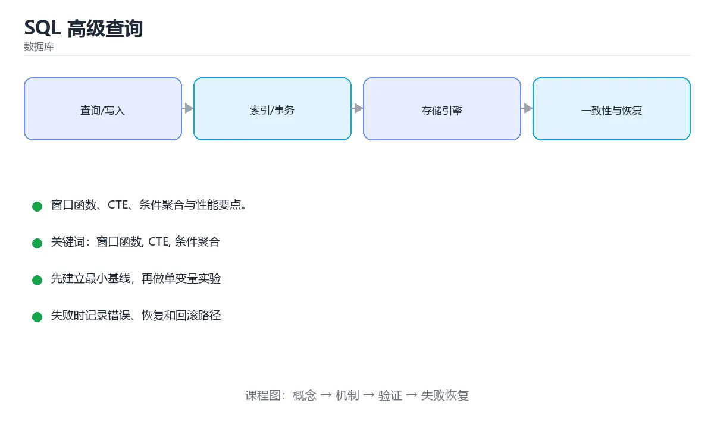

# SQL 高级查询



> 内容更新时间：2026-10-03 · 学习阶段：高级 · 预计用时：15 分钟

## 学习目标

- 能用自己的话解释「SQL 高级查询」解决了什么问题，而不是只背术语。
- 能说清 「窗口函数」、「CTE」、「条件聚合」、「分析查询」 之间的关系，并分别举出一个例子。
- 能把本课知识放回「数据库」的知识体系，说明它和相邻主题的边界。
- 能完成本课练习，并用验收标准检查自己的结果。

> 一句话摘要：窗口函数、CTE、条件聚合与性能要点。

## 前置知识

- 先完成上一课《数据库运维：备份、迁移与分库分表》；如果已经掌握，可以直接用本课练习自测。
- 本课阶段：高级。建议具备同一方向的完整基础，能阅读较长的代码、配置或系统设计说明。
- 开始前先复习：窗口函数、CTE、条件聚合。
- 如果某一步看不懂，先记录具体卡点，完成练习后再回头读一遍。


## 窗口函数

窗口函数在**不折叠行**的前提下做聚合与排名，是分析类查询的主力。

| 函数族 | 示例 | 用途 |
| --- | --- | --- |
| 排名 | ROW_NUMBER、RANK、DENSE_RANK | 分组内排名、去重取最新 |
| 偏移 | LAG、LEAD | 同比环比、相邻行比较 |
| 聚合窗口 | SUM / AVG / COUNT OVER | 累计值、移动平均 |
| 分布 | NTILE、PERCENT_RANK | 分桶、百分位 |

最高频的写法是 `ROW_NUMBER() OVER (PARTITION BY user_id ORDER BY created_at DESC)` 再在外层筛选序号等于 1，即「每个用户的最新一条」。

## 公共表表达式 CTE

CTE（WITH 子句）把复杂查询拆成可读的步骤；递归 CTE 可展开树形结构，如组织架构、评论树、物料清单。写法为 `WITH 名称 AS (查询) SELECT ... FROM 名称`，递归时用 `WITH RECURSIVE` 并在内部包含终止条件。

## 集合运算与高级聚合

UNION 会去重，UNION ALL 保留重复且性能更好（能用就用）；INTERSECT 取交集、EXCEPT 取差集。高级聚合包括 GROUPING SETS、ROLLUP、CUBE，可一次查询产出多层级汇总，适合报表场景。

## 条件聚合

用 CASE WHEN 配合 SUM / COUNT 实现「一行多指标」的透视：对不同状态分别求和与计数，再按维度分组，即可用一条语句产出汇总表，避免多次扫描。

## JSON 与全文检索

PostgreSQL 的 jsonb、MySQL 的 JSON 类型支持按路径查询与索引；全文检索可用 MATCH AGAINST 或 tsvector。它们适合半结构化数据与站内搜索，但复杂分析仍建议规范化到关系表。

## 性能要点

1. 窗口函数在数据量大时开销明显，先用 WHERE 缩小结果集。
2. 避免 SELECT *，只取需要的列以利用覆盖索引。
3. 相关子查询通常可改写成 JOIN 或窗口函数，往往更快。
4. 递归 CTE 必须有终止条件并限制深度，防止失控。
5. 所有优化都用执行计划验证，而不是凭直觉。

## 窗口函数四个实战场景

| 场景 | 写法要点 |
| --- | --- |
| 每组取最新一条 | `ROW_NUMBER() OVER (PARTITION BY user_id ORDER BY created_at DESC)` 后外层筛 rn=1 |
| 组内 Top3 | 同上取 rn<=3；注意并列名次用 `RANK()`（并列会跳号）或 `DENSE_RANK()`（不跳号） |
| 同比环比 | `LAG(amount, 1) OVER (ORDER BY month)` 取上月值，再做差值或比值 |
| 累计与移动平均 | `SUM(amount) OVER (ORDER BY day ROWS BETWEEN UNBOUNDED PRECEDING AND CURRENT ROW)`；移动平均用 `ROWS BETWEEN 6 PRECEDING AND CURRENT ROW` |

注意：`ROWS` 按物理行数，`RANGE` 按排序值的范围——有并列值时两者结果不同，做累计统计时要明确选哪个。

## 执行计划对比：窗口函数 vs 自连接

| 方案 | 计划特征 | 复杂度 | 建议 |
| --- | --- | --- | --- |
| 窗口函数 | 出现 WindowAgg，只扫描一次数据 | O(n log n)（排序） | 首选，可读性与性能都更好 |
| 自连接 | 出现两次扫描或 Nested Loop | O(n²) | 仅在不支持窗口函数的老版本使用 |
| 相关子查询 | 每行执行一次内层查询 | O(n²) | 尽量改写为 JOIN 或窗口函数 |

验证方式：同一份数据分别用两种写法跑 `EXPLAIN ANALYZE`，对比实际执行时间与扫描行数；数据量大时差异通常是一个数量级。

## 本课小结
高级 SQL 的两个抓手是**窗口函数**（排名、偏移、累计）与 **CTE**（拆解复杂逻辑、递归展开层级）；配合条件聚合就能用一条语句产出完整报表。

<!-- appendix:v1 -->

## 窗口函数速查

| 函数 | 作用 | 示例 |
| --- | --- | --- |
| `ROW_NUMBER()` | 组内连续序号，不重 | `ROW_NUMBER() OVER (PARTITION BY user_id ORDER BY created_at DESC)` |
| `RANK()` | 并列同名次，跳号 | `RANK() OVER (ORDER BY score DESC)` |
| `DENSE_RANK()` | 并列同排名，不跳号 | 排行榜常用 |
| `LAG()` / `LEAD()` | 取前一行 / 后一行 | 计算环比、相邻差值 |
| `SUM() OVER` | 累计求和 | `SUM(amount) OVER (ORDER BY day)` |
| `AVG() OVER` | 滑动平均 | `ROWS BETWEEN 6 PRECEDING AND CURRENT ROW` |
| `FIRST_VALUE()` / `LAST_VALUE()` | 组内首尾值 | 注意默认窗口范围 |
| `NTILE(n)` | 分桶 | 用户分层、百分位 |

```sql
-- 每个用户最近一笔订单（分组取最新）
SELECT *
FROM (
  SELECT o.*,
         ROW_NUMBER() OVER (PARTITION BY user_id ORDER BY created_at DESC) AS rn
  FROM orders o
) t
WHERE rn = 1;

-- 每日新增与环比
SELECT day,
       amount,
       amount - LAG(amount) OVER (ORDER BY day) AS diff_vs_prev_day
FROM daily_sales
ORDER BY day;

-- 近 7 天滑动平均
SELECT day,
       AVG(amount) OVER (ORDER BY day ROWS BETWEEN 6 PRECEDING AND CURRENT ROW) AS avg_7d
FROM daily_sales;
```

## UNION 与 JOIN 速查

| 操作 | 方向 | 是否去重 | 说明 |
| --- | --- | --- | --- |
| `UNION` | 纵向合并 | 去重（有排序开销） | 列数与类型必须一致 |
| `UNION ALL` | 纵向合并 | 不去重 | 性能更好，优先使用 |
| `INNER JOIN` | 横向关联 | 只保留匹配行 | 两表都有的数据 |
| `LEFT JOIN` | 横向关联 | 保留左表全部 | 右表缺失为 NULL |
| `RIGHT JOIN` | 横向关联 | 保留右表全部 | 可用 LEFT JOIN 改写 |
| `FULL JOIN` | 横向关联 | 两边都保留 | MySQL 需模拟 |
| `CROSS JOIN` | 笛卡尔积 | 全部组合 | 小心行数爆炸 |

## 常见错误对照表

| 容易写错的做法 | 实际现象 | 原因与正确做法 |
| --- | --- | --- |
| 用 `UNION` 合并大数据集 | 比 `UNION ALL` 慢很多 | 确认无重复需求时用 `UNION ALL` |
| 在 `WHERE` 里过滤聚合结果 | 报错或结果不对 | 聚合条件放 `HAVING` |
| `LEFT JOIN` 后在 `WHERE` 过滤右表字段 | 退化成内连接 | 把右表条件写进 `ON`，或改判断 `IS NULL` |
| 用 `NOT IN` 且子查询含 NULL | 结果为空 | 改用 `NOT EXISTS` 或先过滤 NULL |
| 窗口函数写在 `WHERE` 里 | 语法错误 | 先用子查询或 CTE 计算，再在外层过滤 |
| `COUNT(column)` 统计含 NULL 的列 | 数量比预期少 | 统计行数用 `COUNT(*)` |
| `GROUP BY` 选了非聚合列 | 结果不确定或报错 | 只选分组列与聚合列 |
| 用 `LIMIT` 深分页 | 越翻越慢 | 用「上一页最后一条」的游标分页 |
| 隐式连接（逗号 + WHERE） | 可读性差、易漏条件 | 用显式 `JOIN ... ON` |
| 子查询返回多行用于 `=` | `Subquery returns more than 1 row` | 改 `IN` 或加 `LIMIT 1` |
| `ORDER BY` 里用列序号 | 增删列后含义变化 | 明确写列名 |

## 自测清单

- [ ] 能用 `ROW_NUMBER()` 解决「每组取最新一条」。
- [ ] 会用 `LAG` / `LEAD` 计算环比与差值。
- [ ] 知道窗口函数不能直接写在 `WHERE` 中。
- [ ] 分得清 `UNION` 与 `UNION ALL` 的性能差异。
- [ ] 深分页改用基于游标的分页方式。

## 动手练习

<!-- practice-diversified:v1 -->

> 本课练习重点：围绕「窗口函数、CTE、条件聚合」完成复述、实验和交付，每个结果都要能被别人检查。

先写 schema 与查询，再补边界和失败数据，最后看执行计划与锁等待。

### 练习 1：建立心智模型（10 分钟）

合上教程，用 3～5 句话回答：

1. 「SQL 高级查询」解决了什么问题？
2. 如果没有它，会出现什么具体后果？
3. 它和「CTE」是什么关系？

**验收标准**：至少出现一个本课关键词，并写出一个反例、边界条件或失效场景。

### 练习 2：做一次可控实验（20 分钟）

从正文中选一个最小示例，完成以下操作：

1. 先预测修改一个参数、输入或步骤后的结果。
2. 再实际执行或逐步推演，记录真实结果。
3. 如果结果与预测不同，写出差异原因。

**验收标准**：留下「原例 → 改动 → 预测 → 结果 → 原因」五步记录。

### 练习 3：交付一个小结果（30 分钟）

在 SQLite 或纸面表结构上写查询，分别验证正常数据、空值和边界数据。

任务要求：

- 结果必须能被别人检查，不能只写“我已经理解了”。
- 至少覆盖「窗口函数」和「CTE」两个关键词。
- 写出 1 个仍然不确定的问题，以及下一步如何验证。

> 提示：时间有限时优先做练习 1 和练习 2；练习 3 可以拆成两次完成。

<!-- scaffold:v1 -->

<!-- p2-enrichment:v1 -->

## English Overview

**Title:** Advanced SQL

**Summary:** Window functions, CTEs and conditional aggregation.

**Category:** Database  
**Level:** 高级  
**Key terms:** 窗口函数, CTE, 条件聚合, 分析查询

> The full tutorial is written in Chinese. This bilingual overview helps English readers identify the topic, scope and key terms before studying the detailed examples.

## 内容元数据

- 内容版本：v2.0
- 最后更新：2026-10-03
- 学习阶段：高级
- 适用环境：PostgreSQL / MySQL / SQLite 等主流数据库
- 内容来源：内置结构化课程与工程实践整理
- 相关主题：窗口函数、CTE、条件聚合、分析查询
- 质量版本：P0 测验标准 + P1 覆盖扩展 + P2 体验补全

<!-- top50-rewrite:v1 -->

## 课程专属精读：SQL 高级查询

### 一、知识地图

- **窗口函数**：窗口函数在**不折叠行**的前提下做聚合与排名，是分析类查询的主力。
- **公共表表达式 CTE**：CTE（WITH 子句）把复杂查询拆成可读的步骤；递归 CTE 可展开树形结构，如组织架构、评论树、物料清单。写法为 `WITH 名称 AS (查询) SELECT ... FROM 名称`，递归时用 `WITH RECURSIVE` 并在内部包含终止条件。
- **集合运算与高级聚合**：UNION 会去重，UNION ALL 保留重复且性能更好（能用就用）；INTERSECT 取交集、EXCEPT 取差集。高级聚合包括 GROUPING SETS、ROLLUP、CUBE，可一次查询产出多层级汇总，适合报表场景。
- **条件聚合**：用 CASE WHEN 配合 SUM / COUNT 实现「一行多指标」的透视：对不同状态分别求和与计数，再按维度分组，即可用一条语句产出汇总表，避免多次扫描。
- **JSON 与全文检索**：PostgreSQL 的 jsonb、MySQL 的 JSON 类型支持按路径查询与索引；全文检索可用 MATCH AGAINST 或 tsvector。它们适合半结构化数据与站内搜索，但复杂分析仍建议规范化到关系表。
- **性能要点**：1. 窗口函数在数据量大时开销明显，先用 WHERE 缩小结果集。
- **窗口函数四个实战场景**：理解它的定义、输入、输出和失败边界。
- **执行计划对比：窗口函数 vs 自连接**：理解它的定义、输入、输出和失败边界。

### 二、机制与验证

| 主题 | 需要回答的问题 | 验证方式 |
| --- | --- | --- |
| 窗口函数 | 它解决什么问题，输入和输出是什么？ | 最小示例、边界输入、日志或指标 |
| 公共表表达式 CTE | 它解决什么问题，输入和输出是什么？ | 最小示例、边界输入、日志或指标 |
| 集合运算与高级聚合 | 它解决什么问题，输入和输出是什么？ | 最小示例、边界输入、日志或指标 |
| 条件聚合 | 它解决什么问题，输入和输出是什么？ | 最小示例、边界输入、日志或指标 |
| JSON 与全文检索 | 它解决什么问题，输入和输出是什么？ | 最小示例、边界输入、日志或指标 |
| 性能要点 | 它解决什么问题，输入和输出是什么？ | 最小示例、边界输入、日志或指标 |
| 窗口函数四个实战场景 | 它解决什么问题，输入和输出是什么？ | 最小示例、边界输入、日志或指标 |
| 执行计划对比：窗口函数 vs 自连接 | 它解决什么问题，输入和输出是什么？ | 最小示例、边界输入、日志或指标 |

### 三、专属检查问题

1. 窗口函数 与相邻主题的边界是什么？
2. 公共表表达式 CTE 与相邻主题的边界是什么？
3. 集合运算与高级聚合 与相邻主题的边界是什么？
4. 条件聚合 与相邻主题的边界是什么？
5. JSON 与全文检索 与相邻主题的边界是什么？
6. 性能要点 与相邻主题的边界是什么？
7. 窗口函数四个实战场景 与相邻主题的边界是什么？
8. 执行计划对比：窗口函数 vs 自连接 与相邻主题的边界是什么？

### 四、故障排查

1. 固定输入和环境，确认问题能复现。
2. 找到第一个异常状态，不从最终错误倒猜。
3. 只改变一个变量，记录预测和真实结果。
4. 修复后补边界、失败和重复执行测试。

<!-- p2-references:v1 -->

## 参考资料与复核

- 最后复核：2026-10-04
- 下次复核：2027-04-04
- 复核范围：版本兼容、API 行为、安全建议与工程实践
- 来源性质：官方文档与标准；本课正文为离线教学重组，不复制原文

| 参考资料 | 本课用途 |
| --- | --- |
| [PostgreSQL 文档](https://www.postgresql.org/docs/) | SQL、索引与事务 |
| [SQLite 文档](https://sqlite.org/docs.html) | 嵌入式数据库与 SQL 行为 |

> 本课主题：窗口函数、CTE、条件聚合与性能要点。

> App 完全离线展示文字链接，不会自动联网；需要延伸阅读时可复制链接到浏览器。

