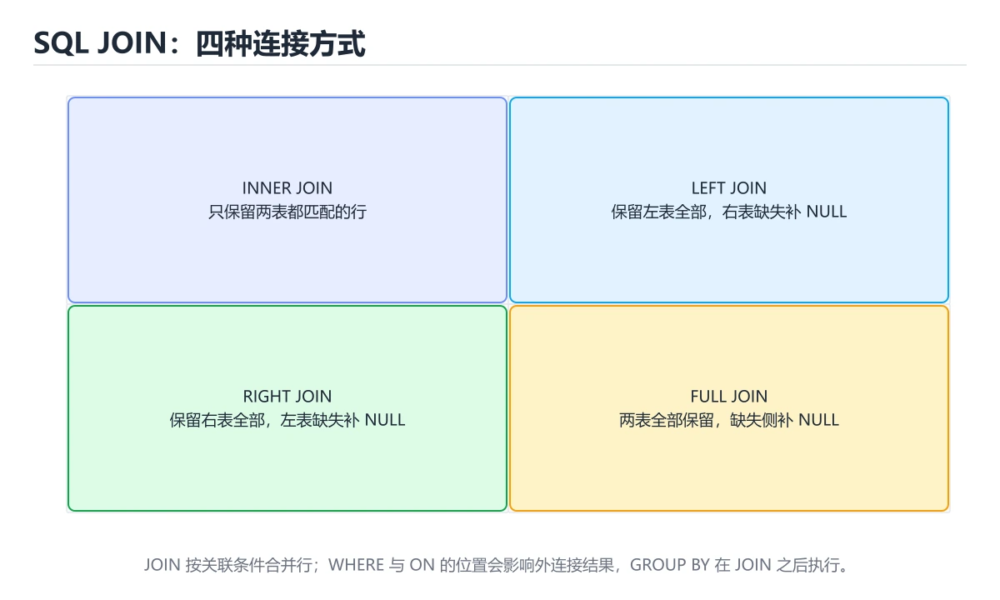

# SQL 基础




> 内容更新时间：2026-10-06 · 学习阶段：基础 · 预计用时：50 分钟

## 本节知识框架

**课程定位**：所属分类 `database`（数据库），课程主题 `SQL 基础`，学习阶段 基础，建议用时 45 分钟。

本课主线：建表、增删改查、聚合分组与连接查询。

**学完本课应当能够**
- 说清 `SQL` 与 `SELECT` 的含义与区别，并各举一个正例和一个反例。
- 用本课示例验证 `INSERT` 的行为，记录输入、输出与失败条件。
- 遇到「`UPDATE` / `DELETE` 不带 `WHERE`」这类问题时，能说出触发条件与修复顺序。

### 从概念到验证的学习链条

1. `SQL`：先掌握 用于查询和修改关系数据库的结构化查询语言，再用它解释 `SELECT` 为什么会出现。
2. `SELECT`：先掌握 理解顺序能解释两个常见疑问：为什么 WHERE 不能用 SELECT 里定义的别名（多数数据库），为什么聚合条件必须写 HAVING，再用它解释 `INSERT` 为什么会出现。
3. `INSERT`：先掌握 SQL 中向表中新增一行或多行数据的语句，再用它解释 `UPDATE` 为什么会出现。
4. `UPDATE`：先掌握 SQL 中修改表中已存在行的语句，再用它解释 `DELETE` 为什么会出现。
5. `DELETE`：先掌握 重要：UPDATE 和 DELETE 一定要写 WHERE，否则会作用到整张表，再用它解释 `JOIN` 为什么会出现。
6. `JOIN`：先掌握 三种写法的选择：IN 适合小结果集，EXISTS 适合大表相关判断，JOIN 适合同时取两张表的字段，再用它解释 本课示例的观察结果 为什么会出现。

**先修与衔接**：本课是「数据库」分类的第 3 课。相关或后续课程：《索引》。

### 完成判据

- **定义关**：不看正文也能说明 `SQL` 是 用于查询和修改关系数据库的结构化查询语言，并指出一个反例。
- **机制关**：能按“输入 → 转换 → 输出 → 验证”复述 `SQL 基础`，而不是只背结论。
- **示例关**：能运行或推演 `SQL 基础` 的 `sql` 示例，并说明一个真实出现的标识符或字面量。
- **证据关**：能指出 `SQL 基础` 示例里的 调用了 `orders()`，并说明它支持或反驳了本课的哪一条结论。
- **排错关**：能复现 `UPDATE` / `DELETE` 不带 `WHERE`，记录现象并按 先 `SELECT` 确认范围，再执行并限制影响行数 修复。
- **迁移关**：能把 `SQL`、`SELECT`、`INSERT`、`UPDATE` 放进一个与 `SQL 基础` 不同的项目场景，并保持输入与验证条件可追踪。
- **复盘关**：学完 `SQL 基础` 后，用一句话写下仍然不确定的结论，并列出下一次验证需要的输入、环境和成功判据。

### 复习清单

- [ ] 能不看正文复述本课核心术语，并指出一个边界或反例。
- [ ] 能运行或推演本课示例，记录输入、输出与失败现象。
- [ ] 能完成一次自测，并把错题对照错误表定位原因。

## 核心概念定义

| 术语 | 操作性定义 | 常见边界与风险 |
| --- | --- | --- |
| SQL | 用于查询和修改关系数据库的结构化查询语言。 | 易错：注入风险；正确做法是使用参数化查询。 |
| SELECT | 理解顺序能解释两个常见疑问：为什么 WHERE 不能用 SELECT 里定义的别名（多数数据库），为什么聚合条件必须写 HAVING。 | 易错：全表被改或被删；正确做法是先 `SELECT` 确认范围，再执行并限制影响行数。 |
| INSERT | SQL 中向表中新增一行或多行数据的语句。 | 索引命中与数据分布决定实际开销，判断前先看执行计划而不是只看结果是否正确。 |
| UPDATE | SQL 中修改表中已存在行的语句。 | 易错：全表被改或被删；正确做法是先 `SELECT` 确认范围，再执行并限制影响行数。 |
| DELETE | 重要：UPDATE 和 DELETE 一定要写 WHERE，否则会作用到整张表。 | 易错：全表被改或被删；正确做法是先 `SELECT` 确认范围，再执行并限制影响行数。 |
| JOIN | 三种写法的选择：IN 适合小结果集，EXISTS 适合大表相关判断，JOIN 适合同时取两张表的字段。 | 只在「三种写法的选择：IN 适合小结果集，EXISTS 适合大表相关判断，JOIN 适合同时取两张表的字段」这一前提下成立，换输入或换环境要重新验证。 |
| INNER JOIN | 只保留匹配行 | 只在「只保留匹配行」这一前提下成立，换输入或换环境要重新验证。 |
| LEFT JOIN | 保留左表全部 | 只在「保留左表全部」这一前提下成立，换输入或换环境要重新验证。 |
| RIGHT JOIN | 保留右表全部 | 只在「保留右表全部」这一前提下成立，换输入或换环境要重新验证。 |
| FULL JOIN | 两边都保留 | 只在「两边都保留」这一前提下成立，换输入或换环境要重新验证。 |
| CROSS JOIN | 笛卡尔积 | 只在「笛卡尔积」这一前提下成立，换输入或换环境要重新验证。 |

## 原理与运行机制

### 机制总览

1. **建立输入**：把「SQL」按本课定义整理成可观察、可重复的输入条件。
2. **执行转换**：围绕「SELECT」执行本课的核心步骤；每一步都记录中间状态，避免只看最终输出。
3. **产生输出**：得到「INSERT」后，用正文示例或协议/SQL 结果核对输出是否符合预期。
4. **改变一个条件**：只替换一个边界条件或环境参数，观察「SQL 基础」的结论是否仍然成立。

**教材衔接：执行顺序的实际影响**

1. `WHERE` 在分组前过滤行，`HAVING` 在分组后过滤组——聚合条件的写法错误是常见报错来源。
2. `SELECT` 中的别名通常不能在 `WHERE` 里使用（因为 WHERE 先执行），但在 `ORDER BY` 中可用。
3. `LIMIT` 最后执行，所以在子查询里做分页要小心与外层排序的配合。
4. 聚合函数不能直接写在 `WHERE` 中（应用 `HAVING`）。

**教材衔接：常用函数速查**

| 类别 | 函数 |
| --- | --- |
| 聚合 | `COUNT`、`SUM`、`AVG`、`MIN`、`MAX`、`GROUP_CONCAT` |
| 字符串 | `CONCAT`、`SUBSTRING`、`TRIM`、`UPPER`、`LIKE` |
| 数值 | `ROUND`、`CEIL`、`FLOOR`、`ABS`、`MOD` |
| 日期 | `NOW`、`CURDATE`、`DATE_ADD`、`DATEDIFF`、`DATE_FORMAT` |
| 条件 | `CASE WHEN`、`IFNULL`、`COALESCE`、`NULLIF` |
| 窗口 | `ROW_NUMBER`、`RANK`、`LAG`、`SUM() OVER` |

### 机制拆解：每一步的输入、动作与输出

#### 1. `SQL`
- 输入：`SQL`；本步把 用于查询和修改关系数据库的结构化查询语言 当作判断规则。
- 动作：围绕 `SQL` 保留中间状态，并记录它与 `SELECT` 的对应关系。
- 输出：`SELECT`，它可以被下一段代码、测试或记录继续使用。
- `SQL` 的失败条件：当用字符串拼接构造 SQL时，会出现注入风险。

#### 2. `SELECT`
- 输入：`SQL`；本步把 理解顺序能解释两个常见疑问：为什么 WHERE 不能用 SELECT 里定义的别名（多数数据库），为什么聚合条件必须写 HAVING 当作判断规则。
- 动作：围绕 `SELECT` 保留中间状态，并记录它与 `INSERT` 的对应关系。
- 输出：`INSERT`，它可以被下一段代码、测试或记录继续使用。
- `SELECT` 的失败条件：当`UPDATE` / `DELETE` 不带 `WHERE`时，会出现全表被改或被删。

#### 3. `INSERT`
- 输入：`SELECT`；本步把 SQL 中向表中新增一行或多行数据的语句 当作判断规则。
- 动作：围绕 `INSERT` 保留中间状态，并记录它与 `UPDATE` 的对应关系。
- 输出：`UPDATE`，它可以被下一段代码、测试或记录继续使用。
- `INSERT` 的失败条件：索引命中与数据分布决定实际开销，判断前先看执行计划而不是只看结果是否正确。

#### 4. `UPDATE`
- 输入：`INSERT`；本步把 SQL 中修改表中已存在行的语句 当作判断规则。
- 动作：围绕 `UPDATE` 保留中间状态，并记录它与 `DELETE` 的对应关系。
- 输出：`DELETE`，它可以被下一段代码、测试或记录继续使用。
- `UPDATE` 的失败条件：当`UPDATE` / `DELETE` 不带 `WHERE`时，会出现全表被改或被删。

#### 5. `DELETE`
- 输入：`UPDATE`；本步把 重要：UPDATE 和 DELETE 一定要写 WHERE，否则会作用到整张表 当作判断规则。
- 动作：围绕 `DELETE` 保留中间状态，并记录它与 `JOIN` 的对应关系。
- 输出：`JOIN`，它可以被下一段代码、测试或记录继续使用。
- `DELETE` 的失败条件：当`UPDATE` / `DELETE` 不带 `WHERE`时，会出现全表被改或被删。

#### 6. `JOIN`
- 输入：`DELETE`；本步把 三种写法的选择：IN 适合小结果集，EXISTS 适合大表相关判断，JOIN 适合同时取两张表的字段 当作判断规则。
- 动作：围绕 `JOIN` 保留中间状态，并记录它与 `orders` 的对应关系。
- 输出：`orders`，它可以被下一段代码、测试或记录继续使用。
- `JOIN` 的失败条件：只在「三种写法的选择：IN 适合小结果集，EXISTS 适合大表相关判断，JOIN 适合同时取两张表的字段」这一前提下成立，换输入或换环境要重新验证。

### 示例中的可观察事实

1. 调用了 `orders()`；它对应的课程主题是 `SQL 基础`。
2. 调用了 `DECIMAL()`；它对应的课程主题是 `SQL 基础`。
3. 调用了 `VARCHAR()`；它对应的课程主题是 `SQL 基础`。
4. 调用了 `DATETIME()`；它对应的课程主题是 `SQL 基础`。
5. 调用了 `CURRENT_TIMESTAMP()`；它对应的课程主题是 `SQL 基础`。
6. 调用了 `idx_user_created()`；它对应的课程主题是 `SQL 基础`。
7. 调用了 `idx_status_created()`；它对应的课程主题是 `SQL 基础`。
8. 调用了 `CHECK()`；它对应的课程主题是 `SQL 基础`。

### 复现实验记录

- 环境：`SQL 基础` 使用 `sql` 示例，固定 `SQL`、`SELECT`、`INSERT`、`UPDATE` 作为第一组条件。
- 首轮输入：先确认 调用了 `orders()`，预测 `SQL` 会怎样变化。
- 基线观察：记录命令、输入、输出和错误原文，不用截图代替可复制的文本。
- 单变量修改：只改变 `SQL`，观察 `JOIN` 是否仍满足定义。
- 失败注入：复现 `UPDATE` / `DELETE` 不带 `WHERE`，确认现象是 全表被改或被删。
- 记录结论：把“修改前、修改后、预期变化、实际变化”写成四列表，这样复盘 `SQL 基础` 时才能区分概念错误与实现错误。

## 典型应用场景

- **`UPDATE` / `DELETE` 不带 `WHERE`**：典型现象是全表被改或被删；正确做法是先 `SELECT` 确认范围，再执行并限制影响行数。
- **用 `SELECT *`**：典型现象是传输冗余、索引失效风险；正确做法是明确列出需要的列。
- **`WHERE amount = NULL`**：典型现象是查不到任何行；正确做法是用 `IS NULL` / `IS NOT NULL`。
- **`COUNT(column)` 统计含 NULL 列**：典型现象是数量偏少；正确做法是统计行数用 `COUNT(*)`。

### 最小验证场景

- 准备：保留 `sql` 示例的原始输入，先记录 `SQL 基础` 的基线输出和完整运行命令。
- 观察：先核对 调用了 `orders()`，再改变一个与 `SQL` 相关的条件。
- 判定：新结果与 `SQL 基础` 的基线不同不等于错误；只有当差异破坏了 `SQL` 的定义或错误表中的约束，才判定为失败。

### 选择与边界

- 使用 `SQL` 时，先满足它的定义：用于查询和修改关系数据库的结构化查询语言；易错：注入风险；正确做法是使用参数化查询。
- 使用 `SELECT` 时，先满足它的定义：理解顺序能解释两个常见疑问：为什么 WHERE 不能用 SELECT 里定义的别名（多数数据库），为什么聚合条件必须写 HAVING；易错：全表被改或被删；正确做法是先 `SELECT` 确认范围，再执行并限制影响行数。
- 使用 `INSERT` 时，先满足它的定义：SQL 中向表中新增一行或多行数据的语句；索引命中与数据分布决定实际开销，判断前先看执行计划而不是只看结果是否正确。
- 使用 `UPDATE` 时，先满足它的定义：SQL 中修改表中已存在行的语句；易错：全表被改或被删；正确做法是先 `SELECT` 确认范围，再执行并限制影响行数。
- 使用 `DELETE` 时，先满足它的定义：重要：UPDATE 和 DELETE 一定要写 WHERE，否则会作用到整张表；易错：全表被改或被删；正确做法是先 `SELECT` 确认范围，再执行并限制影响行数。

## 代码/协议/SQL 示例

### 最小可验证示例

```sql
CREATE TABLE students (
    id      INTEGER PRIMARY KEY AUTOINCREMENT,
    name    TEXT    NOT NULL,
    age     INTEGER CHECK (age >= 0),
    city    TEXT    DEFAULT '未知',
    score   REAL
);
```

**教材衔接：SQL 是什么**

SQL（结构化查询语言）是操作关系型数据库的标准语言。日常使用可以归纳为四类操作，也就是常说的 **CRUD**：

- `INSERT` 新增
- `SELECT` 查询
- `UPDATE` 修改
- `DELETE` 删除

**教材衔接：建表**

常用约束：`PRIMARY KEY` 主键、`NOT NULL` 非空、`UNIQUE` 唯一、`CHECK` 取值检查、`DEFAULT` 默认值。

**教材衔接：增删改**

```sql
INSERT INTO students (name, age, city, score)
VALUES ('小明', 18, '上海', 92.5);

UPDATE students
SET score = 95
WHERE name = '小明';

DELETE FROM students
WHERE id = 1;
```

**重要**：`UPDATE` 和 `DELETE` 一定要写 `WHERE`，否则会作用到整张表。

**教材衔接：查询**

```sql
-- 查询指定列
SELECT name, score FROM students;

-- 条件、排序、分页
SELECT name, score
FROM students
WHERE age >= 18 AND city = '上海'
ORDER BY score DESC
LIMIT 10 OFFSET 20;

-- 聚合与分组
SELECT city, COUNT(*) AS total, AVG(score) AS avg_score
FROM students
GROUP BY city
HAVING COUNT(*) > 5;
```

**教材衔接：连接查询**

```sql
-- 内连接：只保留两边都匹配的行
SELECT s.name, c.title
FROM students AS s
JOIN courses AS c ON s.course_id = c.id;

-- 左连接：保留左表全部行，右表没有匹配则为 NULL
SELECT s.name, c.title
FROM students AS s
LEFT JOIN courses AS c ON s.course_id = c.id;
```

**教材衔接：执行顺序**

SQL 的书写顺序和执行顺序不同，理解它有助于排查问题：

```text
书写：SELECT -> FROM -> WHERE -> GROUP BY -> HAVING -> ORDER BY -> LIMIT
执行：FROM -> WHERE -> GROUP BY -> HAVING -> SELECT -> ORDER BY -> LIMIT
```

**教材衔接：JOIN 与子查询实例**

```sql
-- 每个用户的订单数与总金额（只统计有订单的用户）
SELECT u.id, u.name, COUNT(o.id) AS orders, COALESCE(SUM(o.amount), 0) AS total
FROM users u
LEFT JOIN orders o ON o.user_id = u.id
GROUP BY u.id, u.name;

-- 找出消费最高的用户（子查询写法）
SELECT * FROM users
WHERE id = (SELECT user_id FROM orders GROUP BY user_id ORDER BY SUM(amount) DESC LIMIT 1);

-- 用 EXISTS 判断「下过单的用户」（通常比 IN 更快且不受 NULL 影响）
SELECT * FROM users u WHERE EXISTS (SELECT 1 FROM orders o WHERE o.user_id = u.id);
```

三种写法的选择：**IN** 适合小结果集，**EXISTS** 适合大表相关判断，**JOIN** 适合同时取两张表的字段。`LEFT JOIN` 后统计时注意用 `COUNT(o.id)` 而不是 `COUNT(*)`，否则没有订单的用户也会被算成 1。

**教材衔接：SQL 语句分类速查**

| 类别 | 作用 | 常见语句 |
| --- | --- | --- |
| DDL | 定义结构 | `CREATE`、`ALTER`、`DROP`、`TRUNCATE` |
| DML | 修改数据 | `INSERT`、`UPDATE`、`DELETE` |
| DQL | 查询数据 | `SELECT` |
| DCL | 权限控制 | `GRANT`、`REVOKE` |
| TCL | 事务控制 | `BEGIN`、`COMMIT`、`ROLLBACK`、`SAVEPOINT` |

**教材衔接：查询子句执行顺序**

```text
FROM / JOIN  →  WHERE  →  GROUP BY  →  HAVING  →  SELECT  →  DISTINCT
    →  ORDER BY  →  LIMIT / OFFSET
```

理解顺序能解释两个常见疑问：为什么 `WHERE` 不能用 `SELECT` 里定义的别名（多数数据库），为什么聚合条件必须写 `HAVING`。

**运行方式**：运行 `SQL 基础` 的示例时，在本地数据库或用 SQLite 命令行执行；先在测试库上跑，确认影响行数。

### 示例精读：先找证据，再改一个条件

1. 调用了 `orders()`；它出现在 `SQL 基础` 的示例中，阅读时先确认它前后各发生了什么。
2. 调用了 `DECIMAL()`；它出现在 `SQL 基础` 的示例中，阅读时先确认它前后各发生了什么。
3. 调用了 `VARCHAR()`；它出现在 `SQL 基础` 的示例中，阅读时先确认它前后各发生了什么。
4. 调用了 `DATETIME()`；它出现在 `SQL 基础` 的示例中，阅读时先确认它前后各发生了什么。
5. 调用了 `CURRENT_TIMESTAMP()`；它出现在 `SQL 基础` 的示例中，阅读时先确认它前后各发生了什么。
6. 调用了 `idx_user_created()`；它出现在 `SQL 基础` 的示例中，阅读时先确认它前后各发生了什么。
7. 调用了 `idx_status_created()`；它出现在 `SQL 基础` 的示例中，阅读时先确认它前后各发生了什么。
8. 调用了 `CHECK()`；它出现在 `SQL 基础` 的示例中，阅读时先确认它前后各发生了什么。
- 在 `SQL 基础` 中与 `SQL` 对照：示例必须能支持 用于查询和修改关系数据库的结构化查询语言，否则说明这一段还缺少实现或验证步骤。
- 在 `SQL 基础` 中与 `SELECT` 对照：示例必须能支持 理解顺序能解释两个常见疑问：为什么 WHERE 不能用 SELECT 里定义的别名（多数数据库），为什么聚合条件必须写 HAVING，否则说明这一段还缺少实现或验证步骤。
- 在 `SQL 基础` 中与 `INSERT` 对照：示例必须能支持 SQL 中向表中新增一行或多行数据的语句，否则说明这一段还缺少实现或验证步骤。
- 在 `SQL 基础` 中与 `UPDATE` 对照：示例必须能支持 SQL 中修改表中已存在行的语句，否则说明这一段还缺少实现或验证步骤。

## 时间/空间复杂度或性能分析

**性能关注点（SQL 基础）**：扫描行数与索引命中决定开销：记录查询耗时、执行计划与锁等待。

**本课特有开销（SQL 基础 · SQL）**：索引能减少扫描行数，但会增加写入与存储开销，需要同时记录读、写两侧代价。

**测量方法**：以 `SQL 基础` 的 `SQL` 场景为对象，固定输入跑一遍记录基线，再把规模或并发度提高一个数量级复测；两次结果的差值与波动范围才是结论依据。

### 需要控制的变量与记录项

- `SQL 基础` 的 `SQL`：固定它的版本、输入范围和资源上限，分别记录速度、内存与失败率的变化。
- `SQL 基础` 的 `SELECT`：固定它的版本、输入范围和资源上限，分别记录速度、内存与失败率的变化。
- `SQL 基础` 的 `INSERT`：固定它的版本、输入范围和资源上限，分别记录速度、内存与失败率的变化。
- `SQL 基础` 的 `UPDATE`：固定它的版本、输入范围和资源上限，分别记录速度、内存与失败率的变化。
- `SQL 基础` 的 `DELETE`：固定它的版本、输入范围和资源上限，分别记录速度、内存与失败率的变化。
- `SQL 基础` 中 `SQL` 的边界：易错：注入风险；正确做法是使用参数化查询。达到边界时不要外推，必须重新测量。
- `SQL 基础` 中 `SELECT` 的边界：易错：全表被改或被删；正确做法是先 `SELECT` 确认范围，再执行并限制影响行数。达到边界时不要外推，必须重新测量。
- `SQL 基础` 中 `INSERT` 的边界：索引命中与数据分布决定实际开销，判断前先看执行计划而不是只看结果是否正确。达到边界时不要外推，必须重新测量。
- `SQL 基础` 中 `UPDATE` 的边界：易错：全表被改或被删；正确做法是先 `SELECT` 确认范围，再执行并限制影响行数。达到边界时不要外推，必须重新测量。
- `SQL 基础` 中 `DELETE` 的边界：易错：全表被改或被删；正确做法是先 `SELECT` 确认范围，再执行并限制影响行数。达到边界时不要外推，必须重新测量。
- `SQL 基础` 的代码证据：先验证 调用了 `orders()`，再记录该路径的输入规模与耗时；只看代码行数不能推出复杂度。

## 常见误区与易错点

| 容易写错的做法 | 实际现象 | 原因与正确做法 |
| --- | --- | --- |
| `UPDATE` / `DELETE` 不带 `WHERE` | 全表被改或被删 | 先 `SELECT` 确认范围，再执行并限制影响行数 |
| 用 `SELECT *` | 传输冗余、索引失效风险 | 明确列出需要的列 |
| `WHERE amount = NULL` | 查不到任何行 | 用 `IS NULL` / `IS NOT NULL` |
| `COUNT(column)` 统计含 NULL 列 | 数量偏少 | 统计行数用 `COUNT(*)` |
| 用 `!=` 过滤含 NULL 的列 | NULL 行被排除 | 显式处理 NULL 条件 |
| 字符串日期直接比较 | 结果不准确 | 用日期类型或显式转换 |
| 隐式类型转换 | 索引失效 | 列与参数类型保持一致 |
| `LIMIT` 不配合 `ORDER BY` | 结果顺序不确定 | 分页必须显式排序 |
| 把聚合条件写进 `WHERE` | 语法错误 | 用 `HAVING` |
| 用字符串拼接构造 SQL | 注入风险 | 使用参数化查询 |
| UPDATE / DELETE 不带 WHERE | 全表被改或被删。 | 先 SELECT 确认范围，再执行并限制影响行数。 |
| 用 SELECT * | 传输冗余、索引失效风险。 | 明确列出需要的列。 |
| WHERE amount = NULL | 查不到任何行。 | 用 IS NULL / IS NOT NULL。 |

### 现场 1：`UPDATE` / `DELETE` 不带 `WHERE`

**症状**：全表被改或被删。

**根因与修复**：先 `SELECT` 确认范围，再执行并限制影响行数。

**自检**：在本课示例里复现「`UPDATE` / `DELETE` 不带 `WHERE`」，改成先 `SELECT` 确认范围，再执行并限制影响行数后重跑；如果症状消失且失败路径按预期变化，说明定位正确。

### 现场 2：用 `SELECT *`

**症状**：传输冗余、索引失效风险。

**根因与修复**：明确列出需要的列。

**自检**：在本课示例里复现「用 `SELECT *`」，改成明确列出需要的列后重跑；如果症状消失且失败路径按预期变化，说明定位正确。

### 现场 3：`WHERE amount = NULL`

**症状**：查不到任何行。

**根因与修复**：用 `IS NULL` / `IS NOT NULL`。

**自检**：在本课示例里复现「`WHERE amount = NULL`」，改成用 `IS NULL` / `IS NOT NULL`后重跑；如果症状消失且失败路径按预期变化，说明定位正确。

### 现场 4：`COUNT(column)` 统计含 NULL 列

**症状**：数量偏少。

**根因与修复**：统计行数用 `COUNT(*)`。

**自检**：在本课示例里复现「`COUNT(column)` 统计含 NULL 列」，改成统计行数用 `COUNT(*)`后重跑；如果症状消失且失败路径按预期变化，说明定位正确。

### 现场 5：用 `!=` 过滤含 NULL 的列

**症状**：NULL 行被排除。

**根因与修复**：显式处理 NULL 条件。

**自检**：在本课示例里复现「用 `!=` 过滤含 NULL 的列」，改成显式处理 NULL 条件后重跑；如果症状消失且失败路径按预期变化，说明定位正确。

### 现场 6：字符串日期直接比较

**症状**：结果不准确。

**根因与修复**：用日期类型或显式转换。

**自检**：在本课示例里复现「字符串日期直接比较」，改成用日期类型或显式转换后重跑；如果症状消失且失败路径按预期变化，说明定位正确。

### 现场 7：隐式类型转换

**症状**：索引失效。

**根因与修复**：列与参数类型保持一致。

**自检**：在本课示例里复现「隐式类型转换」，改成列与参数类型保持一致后重跑；如果症状消失且失败路径按预期变化，说明定位正确。

### 现场 8：`LIMIT` 不配合 `ORDER BY`

**症状**：结果顺序不确定。

**根因与修复**：分页必须显式排序。

**自检**：在本课示例里复现「`LIMIT` 不配合 `ORDER BY`」，改成分页必须显式排序后重跑；如果症状消失且失败路径按预期变化，说明定位正确。

### 现场 9：把聚合条件写进 `WHERE`

**症状**：语法错误。

**根因与修复**：用 `HAVING`。

**自检**：在本课示例里复现「把聚合条件写进 `WHERE`」，改成用 `HAVING`后重跑；如果症状消失且失败路径按预期变化，说明定位正确。

## 与其他知识点的关系

- **相关或后续**：`索引`。本课术语会在这些课程里继续使用。
- **术语归属**：`SQL`、`SELECT`、`INSERT` 的定义以本课「核心概念定义」为准，换到其他课程时先确认定义是否被改写。

### 先修与后续术语接口

- `索引`：两者通过本分类的学习顺序衔接，阅读时重点比较各自的输入与失败条件。

### 容易混淆的相邻概念

- `SQL` 与 `SELECT`：前者强调 用于查询和修改关系数据库的结构化查询语言；后者强调 理解顺序能解释两个常见疑问：为什么 WHERE 不能用 SELECT 里定义的别名（多数数据库），为什么聚合条件必须写 HAVING。判断时分别检查两条定义的适用范围，不要只看名称相似就互换。
- `SELECT` 与 `INSERT`：前者强调 理解顺序能解释两个常见疑问：为什么 WHERE 不能用 SELECT 里定义的别名（多数数据库），为什么聚合条件必须写 HAVING；后者强调 SQL 中向表中新增一行或多行数据的语句。判断时分别检查两条定义的适用范围，不要只看名称相似就互换。
- `INSERT` 与 `UPDATE`：前者强调 SQL 中向表中新增一行或多行数据的语句；后者强调 SQL 中修改表中已存在行的语句。判断时分别检查两条定义的适用范围，不要只看名称相似就互换。
- `UPDATE` 与 `DELETE`：前者强调 SQL 中修改表中已存在行的语句；后者强调 重要：UPDATE 和 DELETE 一定要写 WHERE，否则会作用到整张表。判断时分别检查两条定义的适用范围，不要只看名称相似就互换。
- `DELETE` 与 `JOIN`：前者强调 重要：UPDATE 和 DELETE 一定要写 WHERE，否则会作用到整张表；后者强调 三种写法的选择：IN 适合小结果集，EXISTS 适合大表相关判断，JOIN 适合同时取两张表的字段。判断时分别检查两条定义的适用范围，不要只看名称相似就互换。

## 自测题与参考答案

> 先独立作答，再对照参考答案；答案都能在本课正文、术语表或错误表里找到依据。

### 自测 1（概念复述）

不看正文，写出 `SQL` 的操作性定义，并说明它与 `SELECT` 的区别。

**参考答案**：用于查询和修改关系数据库的结构化查询语言。

`SELECT` 的定位是：理解顺序能解释两个常见疑问：为什么 WHERE 不能用 SELECT 里定义的别名（多数数据库），为什么聚合条件必须写 HAVING；两者的差别要从适用对象与失败模式上说明。

### 自测 2（排错）

本课错误表记录了「`UPDATE` / `DELETE` 不带 `WHERE`」这类做法。请写出它会出现的现象、根因，以及修复顺序。

**参考答案**：现象是全表被改或被删；正确做法是先 `SELECT` 确认范围，再执行并限制影响行数。修复时先复现现象并保留证据，再改动一处假设重跑，确认现象消失。

### 自测 3（动手验证）

运行本课的 `sql` 示例，把其中的 `'created'` 换成一个边界值后重新运行，记录输出与错误信息。

**参考答案**：正常输入下 `sql` 示例应当复现正文给出的结果；把 `'created'` 换成边界值后，如果结果改变或报错，先核对它是否满足 `SQL 基础` 中`SQL` 的适用范围，再检查错误表里是否有同类现象。

### 自测 4（代码阅读）

阅读本课开头的 `sql` 示例，说明它体现了`SQL` 的哪一条性质，并指出改动哪个输入会让这条性质不再成立。

**参考答案**：`SQL` 的定义是 用于查询和修改关系数据库的结构化查询语言，示例正是在实现这条定义。改动与 `SQL` 有关的一个输入后，如果结果不再符合 `SQL 基础` 的正文描述，就说明该性质只在当前前提成立。

### 自测 5（迁移）

把 `SQL 基础` 的方法迁移到自己的项目：围绕 `SQL` 写出一个与错误表同类的风险点，并说明触发条件和检验方式。

**参考答案**：例如「WHERE amount = NULL」，它会导致查不到任何行；检验方式是按用 IS NULL / IS NOT NULL改一处再复现，确认现象消失且没有引入新的失败分支。

### 自测 6（对比）

用一个表格对比 `SQL` 与 `SELECT`：各写一行适用场景、一行失败表现。

**参考答案**：`SQL` 的定义是用于查询和修改关系数据库的结构化查询语言；`SELECT` 的定义是理解顺序能解释两个常见疑问：为什么 WHERE 不能用 SELECT 里定义的别名（多数数据库），为什么聚合条件必须写 HAVING。两者的失败表现分别对应本课错误表里与本术语相关的行。

### 自测 7（排错顺序）

面对「`UPDATE` / `DELETE` 不带 `WHERE`」引发的问题，请把“复现 全表被改或被删 → 保留证据 → 先 `SELECT` 确认范围，再执行并限制影响行数 → 回归验证”四步写成可执行的检查清单。

**参考答案**：第一步按全表被改或被删复现；第二步记录输入、版本与完整报错；第三步按先 `SELECT` 确认范围，再执行并限制影响行数只改一处；第四步重跑并确认失败路径也按预期变化。

### 自测 8（边界判断）

针对 `JOIN`，分别写出“可以使用”的条件和“结论不再成立”的条件。

**参考答案**：只在「三种写法的选择：IN 适合小结果集，EXISTS 适合大表相关判断，JOIN 适合同时取两张表的字段」这一前提下成立，换输入或换环境要重新验证。 同时要把 `JOIN` 的定义 三种写法的选择：IN 适合小结果集，EXISTS 适合大表相关判断，JOIN 适合同时取两张表的字段 与实际输入逐项对照。

### 自测 9（机制重建）

不看正文，按输入、转换、输出、验证四段重建 `SQL` → `SELECT` → `INSERT` → `UPDATE` 的作用链。

**参考答案**：起点是 `SQL` 的定义 用于查询和修改关系数据库的结构化查询语言；中间每一步都保留可观察状态；终点由 `JOIN` 检查，失败时回到错误表定位第一个偏离定义的步骤。

### 自测 10（综合排错）

在 `SQL 基础` 中，现象是 查不到任何行。请围绕 WHERE amount = NULL 写出最小复现、关键证据、修复动作和回归验证，并说明为什么不能只凭一次运行下结论。

**参考答案**：先复现 WHERE amount = NULL，记录输入与完整错误；再按 用 IS NULL / IS NOT NULL 只改一处。回归时同时跑正常路径和边界路径，只有两次结果都可解释，才把修复视为完成。

### 自测 11（一分钟复述）

用每分钟约 200 字的速度复述 `SQL 基础`：先给主问题，再按顺序说出 `SQL`、`SELECT`、`INSERT`、`UPDATE`，最后给一个失败案例。

**自评标准**：主问题必须对应 建表、增删改查、聚合分组与连接查询；每个术语都要能接上一句定义或边界；失败案例必须写成可观察现象，不能用“可能有风险”代替证据。

## 术语速查

| 术语 | 一句话说明 |
| --- | --- |
| `SQL` | 用于查询和修改关系数据库的结构化查询语言。 |
| `SELECT` | 理解顺序能解释两个常见疑问：为什么 WHERE 不能用 SELECT 里定义的别名（多数数据库），为什么聚合条件必须写 HAVING。 |
| `INSERT` | SQL 中向表中新增一行或多行数据的语句。 |
| `UPDATE` | SQL 中修改表中已存在行的语句。 |
| `DELETE` | 重要：UPDATE 和 DELETE 一定要写 WHERE，否则会作用到整张表。 |
| `JOIN` | 三种写法的选择：IN 适合小结果集，EXISTS 适合大表相关判断，JOIN 适合同时取两张表的字段。 |

**术语关系**：`SQL`（用于查询和修改关系数据库的结构化查询语言） → `SELECT`（理解顺序能解释两个常见疑问：为什么 WHERE 不能用 SELECT 里定义的别名（多数数据库）） → `INSERT`（SQL 中向表中新增一行或多行数据的语句） → `UPDATE`（SQL 中修改表中已存在行的语句）。

## 考点精讲

`SQL 基础` 的题库有 6 道题，下面逐题给出题干、正确项与判断依据：先自己作答，再核对正确项，最后回到正文对应小节复核。

### 考点 1：第 1 题

- **题目**：要删除表中年龄大于 60 的记录，正确的写法是？
- **正确项**：DELETE FROM students WHERE age > 60;
- **判断依据**：这道题落在术语 `DELETE` 上：重要：UPDATE 和 DELETE 一定要写 WHERE，否则会作用到整张表。复习时把 `DELETE` 的定义、适用边界和一个反例一起说清楚，再回到「核心概念定义」核对原文。

### 考点 2：第 2 题

- **题目**：阅读 `SQL 基础` 的 `SQL` 示例。它服务于建表、增删改查、聚合分组与连接查询。代码中实际包含下列哪一项？
- **正确项**：调用了 `idx_user_created()`
- **判断依据**：这道题落在术语 `SQL` 上：用于查询和修改关系数据库的结构化查询语言。复习时把 `SQL` 的定义、适用边界和一个反例一起说清楚，再回到「核心概念定义」核对原文。

### 考点 3：第 3 题

- **题目**：围绕“SQL 基础”中的 SQL、SELECT、INSERT，下列哪两项是本课强调的实践判断？
- **正确项**：学习 SQL 时要同时说明输入、输出和失败路径，不能只看正常流程；验证 SELECT 时要固定版本并覆盖边界输入，结论才可复现
- **判断依据**：这道题落在术语 `SQL` 上：用于查询和修改关系数据库的结构化查询语言。复习时把 `SQL` 的定义、适用边界和一个反例一起说清楚，再回到「核心概念定义」核对原文。

### 考点 4：第 4 题

- **题目**：COUNT(*) 与 COUNT(列名) 的关键区别是？
- **正确项**：COUNT(列名) 会忽略该列的 NULL 值
- **判断依据**：这道题检验本课主问题：建表、增删改查、聚合分组与连接查询。复习时先复述本课主问题，再举一个会让结论失效的输入。

### 考点 5：第 5 题

- **题目**：LEFT JOIN 后统计右表记录数，应该怎么写？
- **正确项**：COUNT(右表.主键)
- **判断依据**：这道题落在术语 `JOIN` 上：三种写法的选择：IN 适合小结果集，EXISTS 适合大表相关判断，JOIN 适合同时取两张表的字段。复习时把 `JOIN` 的定义、适用边界和一个反例一起说清楚，再回到「核心概念定义」核对原文。

### 考点 6：第 6 题

- **题目**：填空：补齐下面这段术语说明中的空缺。课程 `建表、增删改查、聚合分组与连接查询。`，这段说明是：`____`：SQL 中修改表中已存在行的语句。空缺处应填哪个术语？
- **正确项**：UPDATE
- **判断依据**：这道题落在术语 `SQL` 上：用于查询和修改关系数据库的结构化查询语言。复习时把 `SQL` 的定义、适用边界和一个反例一起说清楚，再回到「核心概念定义」核对原文。

### 考点 7：`SQL`

- **要点**：用于查询和修改关系数据库的结构化查询语言。
- **SQL 的边界**：易错：注入风险；正确做法是使用参数化查询。

### 考点 8：`SELECT`

- **要点**：理解顺序能解释两个常见疑问：为什么 WHERE 不能用 SELECT 里定义的别名（多数数据库），为什么聚合条件必须写 HAVING。
- **SELECT 的边界**：易错：全表被改或被删；正确做法是先 `SELECT` 确认范围，再执行并限制影响行数。

### 考点 9：`INSERT`

- **要点**：SQL 中向表中新增一行或多行数据的语句。
- **INSERT 的边界**：索引命中与数据分布决定实际开销，判断前先看执行计划而不是只看结果是否正确。

### 考点 10：`UPDATE`

- **要点**：SQL 中修改表中已存在行的语句。
- **UPDATE 的边界**：易错：全表被改或被删；正确做法是先 `SELECT` 确认范围，再执行并限制影响行数。

### 考点 11：`DELETE`

- **要点**：重要：UPDATE 和 DELETE 一定要写 WHERE，否则会作用到整张表。
- **DELETE 的边界**：易错：全表被改或被删；正确做法是先 `SELECT` 确认范围，再执行并限制影响行数。

### 考点 12：`JOIN`

- **要点**：三种写法的选择：IN 适合小结果集，EXISTS 适合大表相关判断，JOIN 适合同时取两张表的字段。
- **JOIN 的边界**：只在「三种写法的选择：IN 适合小结果集，EXISTS 适合大表相关判断，JOIN 适合同时取两张表的字段」这一前提下成立，换输入或换环境要重新验证。

### 考点 13：排错——`UPDATE` / `DELETE` 不带 `WHERE`

- **现象**：全表被改或被删。
- **处理**：先 `SELECT` 确认范围，再执行并限制影响行数。

### 考点 14：排错——用 `SELECT *`

- **现象**：传输冗余、索引失效风险。
- **处理**：明确列出需要的列。

### 考点 15：综合辨析——`SQL` 与 `JOIN`

- **辨析点**：`SQL` 的定义是 用于查询和修改关系数据库的结构化查询语言；`JOIN` 的定义是 三种写法的选择：IN 适合小结果集，EXISTS 适合大表相关判断，JOIN 适合同时取两张表的字段。
- **答题要求**：面对 `SQL 基础` 的题目，先判断描述的是 `SQL` 还是 `JOIN`，再归到对应定义，最后写出一个会让该定义失效的边界输入。

### 考点 16：排错评分点

- **现象分**：能写出 全表被改或被删，而不是只写“程序有错”。
- **证据分**：保留触发 `UPDATE` / `DELETE` 不带 `WHERE` 的输入、版本和错误原文。
- **修复分**：按 先 `SELECT` 确认范围，再执行并限制影响行数 只改一处，并同时回归正常路径与边界路径。

## 内容元数据

- 内容版本：v2.0
- 最后更新：2026-10-06
- 学习阶段：基础
- 适用环境：PostgreSQL / MySQL / SQLite 等主流数据库；本课聚焦其中的 SQL。
- 内容来源：内置结构化课程与工程实践整理
- 相关主题：SQL、SELECT、INSERT、UPDATE、DELETE、JOIN
- 质量版本：P0 测验标准 + P1 覆盖扩展 + P2 体验补全

## 参考资料与复核

- 最后复核：2026-10-04
- 下次复核：2027-06-17
- 复核范围：版本兼容、API 行为、安全建议与工程实践
- 来源性质：官方文档、标准或权威教材；本课核对关键词：SQL、SELECT、INSERT、UPDATE、DELETE、JOIN。

| 参考资料 | 本课用途 |
| --- | --- |
| [SQLite 文档](https://sqlite.org/docs.html) | 嵌入式 SQL 与事务 |
| [Use The Index, Luke](https://use-the-index-luke.com/) | SQL 索引与查询优化 |
| [数据库规范化](https://learn.microsoft.com/office/troubleshoot/access/database-normalization-description) | 范式与表设计 |

| [本课术语索引：SQL 基础](#核心概念定义) | 按本课输入、术语边界和错误表现逐项核对 |
> 「SQL 基础」的链接用于离线阅读后的延伸核对；App 不会自动联网。