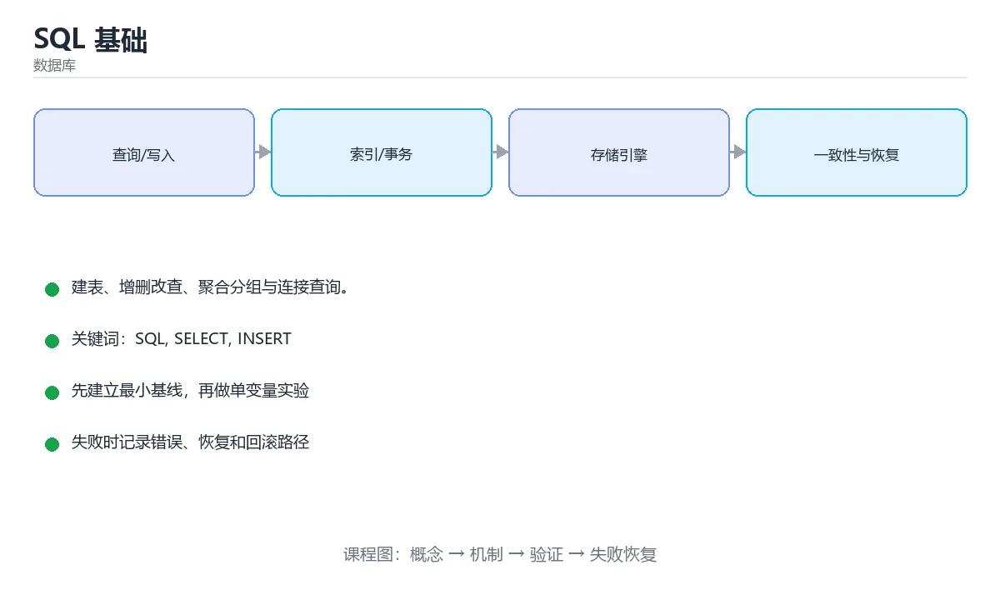

# SQL 基础



> 内容更新时间：2026-10-03 · 学习阶段：基础 · 预计用时：16 分钟

## 学习目标

- 能用自己的话解释「SQL 基础」解决了什么问题，而不是只背术语。
- 能说清 「SQL」、「SELECT」、「INSERT」、「UPDATE」 之间的关系，并分别举出一个例子。
- 能把本课知识放回「数据库」的知识体系，说明它和相邻主题的边界。
- 能完成本课练习，并用验收标准检查自己的结果。

> 一句话摘要：建表、增删改查、聚合分组与连接查询。

## 前置知识

- 会进行基本的文件、命令行或浏览器操作；遇到不熟悉的术语先查本课关键词。
- 本课阶段：基础。建议会读写简单代码或命令，并理解变量、输入输出等基本概念。
- 开始前先复习：SQL、SELECT、INSERT。
- 如果某一步看不懂，先记录具体卡点，完成练习后再回头读一遍。


## SQL 是什么

SQL（结构化查询语言）是操作关系型数据库的标准语言。日常使用可以归纳为四类操作，也就是常说的 **CRUD**：

- `INSERT` 新增
- `SELECT` 查询
- `UPDATE` 修改
- `DELETE` 删除

## 建表

```sql
CREATE TABLE students (
    id      INTEGER PRIMARY KEY AUTOINCREMENT,
    name    TEXT    NOT NULL,
    age     INTEGER CHECK (age >= 0),
    city    TEXT    DEFAULT '未知',
    score   REAL
);
```

常用约束：`PRIMARY KEY` 主键、`NOT NULL` 非空、`UNIQUE` 唯一、`CHECK` 取值检查、`DEFAULT` 默认值。

## 增删改

```sql
INSERT INTO students (name, age, city, score)
VALUES ('小明', 18, '上海', 92.5);

UPDATE students
SET score = 95
WHERE name = '小明';

DELETE FROM students
WHERE id = 1;
```

**重要**：`UPDATE` 和 `DELETE` 一定要写 `WHERE`，否则会作用到整张表。

## 查询

```sql
-- 查询指定列
SELECT name, score FROM students;

-- 条件、排序、分页
SELECT name, score
FROM students
WHERE age >= 18 AND city = '上海'
ORDER BY score DESC
LIMIT 10 OFFSET 20;

-- 聚合与分组
SELECT city, COUNT(*) AS total, AVG(score) AS avg_score
FROM students
GROUP BY city
HAVING COUNT(*) > 5;
```

## 连接查询

```sql
-- 内连接：只保留两边都匹配的行
SELECT s.name, c.title
FROM students AS s
JOIN courses AS c ON s.course_id = c.id;

-- 左连接：保留左表全部行，右表没有匹配则为 NULL
SELECT s.name, c.title
FROM students AS s
LEFT JOIN courses AS c ON s.course_id = c.id;
```

## 执行顺序

SQL 的书写顺序和执行顺序不同，理解它有助于排查问题：

```text
书写：SELECT -> FROM -> WHERE -> GROUP BY -> HAVING -> ORDER BY -> LIMIT
执行：FROM -> WHERE -> GROUP BY -> HAVING -> SELECT -> ORDER BY -> LIMIT
```

## JOIN 与子查询实例

```sql
-- 每个用户的订单数与总金额（只统计有订单的用户）
SELECT u.id, u.name, COUNT(o.id) AS orders, COALESCE(SUM(o.amount), 0) AS total
FROM users u
LEFT JOIN orders o ON o.user_id = u.id
GROUP BY u.id, u.name;

-- 找出消费最高的用户（子查询写法）
SELECT * FROM users
WHERE id = (SELECT user_id FROM orders GROUP BY user_id ORDER BY SUM(amount) DESC LIMIT 1);

-- 用 EXISTS 判断「下过单的用户」（通常比 IN 更快且不受 NULL 影响）
SELECT * FROM users u WHERE EXISTS (SELECT 1 FROM orders o WHERE o.user_id = u.id);
```

三种写法的选择：**IN** 适合小结果集，**EXISTS** 适合大表相关判断，**JOIN** 适合同时取两张表的字段。`LEFT JOIN` 后统计时注意用 `COUNT(o.id)` 而不是 `COUNT(*)`，否则没有订单的用户也会被算成 1。

## 执行顺序的实际影响

1. `WHERE` 在分组前过滤行，`HAVING` 在分组后过滤组——聚合条件的写法错误是常见报错来源。
2. `SELECT` 中的别名通常不能在 `WHERE` 里使用（因为 WHERE 先执行），但在 `ORDER BY` 中可用。
3. `LIMIT` 最后执行，所以在子查询里做分页要小心与外层排序的配合。
4. 聚合函数不能直接写在 `WHERE` 中（应用 `HAVING`）。

## 本课小结
先掌握「单表 CRUD + WHERE 条件 + 聚合分组 + JOIN」，就能覆盖大部分日常需求。


## SQL 语句分类速查

| 类别 | 作用 | 常见语句 |
| --- | --- | --- |
| DDL | 定义结构 | `CREATE`、`ALTER`、`DROP`、`TRUNCATE` |
| DML | 修改数据 | `INSERT`、`UPDATE`、`DELETE` |
| DQL | 查询数据 | `SELECT` |
| DCL | 权限控制 | `GRANT`、`REVOKE` |
| TCL | 事务控制 | `BEGIN`、`COMMIT`、`ROLLBACK`、`SAVEPOINT` |

## 查询子句执行顺序

```text
FROM / JOIN  →  WHERE  →  GROUP BY  →  HAVING  →  SELECT  →  DISTINCT
    →  ORDER BY  →  LIMIT / OFFSET
```

理解顺序能解释两个常见疑问：为什么 `WHERE` 不能用 `SELECT` 里定义的别名（多数数据库），为什么聚合条件必须写 `HAVING`。

## JOIN 类型速查

| 类型 | 结果 | 典型用途 |
| --- | --- | --- |
| `INNER JOIN` | 只保留匹配行 | 有关联的数据 |
| `LEFT JOIN` | 保留左表全部 | 主表 + 可选关联 |
| `RIGHT JOIN` | 保留右表全部 | 少见，可用 LEFT 改写 |
| `FULL JOIN` | 两边都保留 | 找两表差异 |
| `CROSS JOIN` | 笛卡尔积 | 生成组合（慎用） |

```sql
-- 建表：类型、约束与注释一次写全
CREATE TABLE orders (
    id          BIGINT PRIMARY KEY AUTO_INCREMENT,
    user_id     BIGINT       NOT NULL,
    amount      DECIMAL(12, 2) NOT NULL,
    status      VARCHAR(16)  NOT NULL DEFAULT 'created',
    created_at  DATETIME(3)  NOT NULL DEFAULT CURRENT_TIMESTAMP(3),
    updated_at  DATETIME(3)  NOT NULL DEFAULT CURRENT_TIMESTAMP(3)
                             ON UPDATE CURRENT_TIMESTAMP(3),
    KEY idx_user_created (user_id, created_at),
    KEY idx_status_created (status, created_at),
    CONSTRAINT chk_amount CHECK (amount >= 0)
);

-- 分页查询 + 只取需要列 + 明确的排序
SELECT id, user_id, amount, created_at
FROM orders
WHERE user_id = 42 AND status <> 'canceled'
ORDER BY created_at DESC, id DESC
LIMIT 20;

-- 分组统计并用 HAVING 过滤聚合结果
SELECT user_id, COUNT(*) AS order_count, SUM(amount) AS total
FROM orders
WHERE created_at >= '2025-01-01'
GROUP BY user_id
HAVING SUM(amount) > 1000
ORDER BY total DESC
LIMIT 10;

-- 更新务必带 WHERE，并先用 SELECT 验证影响范围
UPDATE orders SET status = 'paid' WHERE id = 1001 AND status = 'created';
```

## 常用函数速查

| 类别 | 函数 |
| --- | --- |
| 聚合 | `COUNT`、`SUM`、`AVG`、`MIN`、`MAX`、`GROUP_CONCAT` |
| 字符串 | `CONCAT`、`SUBSTRING`、`TRIM`、`UPPER`、`LIKE` |
| 数值 | `ROUND`、`CEIL`、`FLOOR`、`ABS`、`MOD` |
| 日期 | `NOW`、`CURDATE`、`DATE_ADD`、`DATEDIFF`、`DATE_FORMAT` |
| 条件 | `CASE WHEN`、`IFNULL`、`COALESCE`、`NULLIF` |
| 窗口 | `ROW_NUMBER`、`RANK`、`LAG`、`SUM() OVER` |

## 常见错误对照表

| 容易写错的做法 | 实际现象 | 原因与正确做法 |
| --- | --- | --- |
| `UPDATE` / `DELETE` 不带 `WHERE` | 全表被改或被删 | 先 `SELECT` 确认范围，再执行并限制影响行数 |
| 用 `SELECT *` | 传输冗余、索引失效风险 | 明确列出需要的列 |
| `WHERE amount = NULL` | 查不到任何行 | 用 `IS NULL` / `IS NOT NULL` |
| `COUNT(column)` 统计含 NULL 列 | 数量偏少 | 统计行数用 `COUNT(*)` |
| 用 `!=` 过滤含 NULL 的列 | NULL 行被排除 | 显式处理 NULL 条件 |
| 字符串日期直接比较 | 结果不准确 | 用日期类型或显式转换 |
| 隐式类型转换 | 索引失效 | 列与参数类型保持一致 |
| `LIMIT` 不配合 `ORDER BY` | 结果顺序不确定 | 分页必须显式排序 |
| 把聚合条件写进 `WHERE` | 语法错误 | 用 `HAVING` |
| 用字符串拼接构造 SQL | 注入风险 | 使用参数化查询 |

## 自测清单

- [ ] 能背出查询子句的执行顺序。
- [ ] 分得清 `WHERE` 与 `HAVING`、`COUNT(*)` 与 `COUNT(col)`。
- [ ] 写 `UPDATE` / `DELETE` 前先用 `SELECT` 验证影响范围。
- [ ] 分页查询带确定性排序。
- [ ] 全部使用参数化查询，不拼接 SQL 字符串。

## 动手练习


> 本课练习重点：围绕「SQL、SELECT、INSERT」完成复述、实验和交付，每个结果都要能被别人检查。

先写 schema 与查询，再补边界和失败数据，最后看执行计划与锁等待。

### 练习 1：建立心智模型（10 分钟）

合上教程，用 3～5 句话回答：

1. 「SQL 基础」解决了什么问题？
2. 如果没有它，会出现什么具体后果？
3. 它和「SELECT」是什么关系？

**验收标准**：至少出现一个本课关键词，并写出一个反例、边界条件或失效场景。

### 练习 2：做一次可控实验（20 分钟）

从正文中选一个最小示例，完成以下操作：

1. 先预测修改一个参数、输入或步骤后的结果。
2. 再实际执行或逐步推演，记录真实结果。
3. 如果结果与预测不同，写出差异原因。

**验收标准**：留下「原例 → 改动 → 预测 → 结果 → 原因」五步记录。

### 练习 3：交付一个小结果（30 分钟）

在 SQLite 或纸面表结构上写查询，分别验证正常数据、空值和边界数据。

任务要求：

- 结果必须能被别人检查，不能只写“我已经理解了”。
- 至少覆盖「SQL」和「SELECT」两个关键词。
- 写出 1 个仍然不确定的问题，以及下一步如何验证。

> 提示：时间有限时优先做练习 1 和练习 2；练习 3 可以拆成两次完成。


## 考点精讲：把测验题还原成判断过程

本课有 5 个判断点。先自己作答，再看「判断依据」；如果结论正确但理由不完整，回到正文对应章节补足概念。

### 考点 1：要删除表中年龄大于 60 的记录，正确的写法是？

- **正确判断**：DELETE FROM students WHERE age > 60;
- **判断依据**：DELETE 配合 WHERE 精确删除；省略 WHERE 会清空整张表，DROP TABLE 则会删除表结构。 其他选项：删除行用 DELETE 加 WHERE；REMOVE 不是 SQL 关键字，DROP TABLE 会删掉整张表，不带 WHERE 会清空所有行。
- **迁移检查**：如果给某个错误选项去掉一个限定词，它会不会变成正确？说明理由。

### 考点 2：对 GROUP BY 的结果做过滤，应该使用哪个关键字？

- **正确判断**：HAVING
- **判断依据**：WHERE 在分组前过滤行，HAVING 在分组后过滤组，可以配合聚合函数。其他选项：对分组结果过滤要用 HAVING。WHERE 在分组前过滤行，ORDER BY 与 LIMIT 负责排序与截断。正确项「HAVING」完整覆盖了题目要求的关键点，没有遗漏前提。把题干「对 GROUP BY 的结果做过滤，应该使用哪个关键字？」放回《SQL 基础》的「建表、增删改查、聚合分组与连接查询」语境，逐项对照定义与边界条件，就能排除其余说法。
- **迁移检查**：遮住选项，只根据定义复述一次答案，再回来看哪个选项与复述一致。

### 考点 3：执行 UPDATE 时忘记写 WHERE 会怎样？

- **正确判断**：更新整张表的所有行
- **判断依据**：没有 WHERE 条件时 UPDATE 会作用于全表，是生产事故的常见原因。其他选项：漏写 WHERE 会更新整张表，这是线上事故高发点。只有语法错误或显式事务回滚才能阻止它。正确项「更新整张表的所有行」描述正确，能够解释题干场景中的现象与结果。错误项「只更新第一行」与课程给出的定义相冲突，不能回答题目所问。错误项「报语法错误」只看到了表面现象，没有解释题干真正考查的机制。错误项「自动回滚」适用于其他场景，但与本题的前提不匹配。把题干「执行 UPDATE 时忘记写 WHERE 会怎样？」放回《SQL 基础》的「建表、增删改查、聚合分组与连接查询」语境，逐项对照定义与边界条件，就能排除其余说法。
- **迁移检查**：把题干里的一个条件换成边界值，原来的结论还成立吗？写出判断过程。

### 考点 4：COUNT(*) 与 COUNT(列名) 的关键区别是？

- **正确判断**：COUNT(列名) 会忽略该列的 NULL 值
- **判断依据**：统计非空值数量时必须用 COUNT(列名)，否则会把 NULL 行也算进去。其他选项：COUNT(列) 会忽略该列的 NULL，COUNT(*) 统计行数。语义差别才是关键，速度差异不是重点。正确项「COUNT(列名) 会忽略该列的 NULL 值」既符合定义也满足题干限定的场景，因此应当选择。错误项「COUNT(列名) 只能用于主键」忽略了题目中的限制条件，因此不成立。错误项「COUNT(*) 更慢」属于相邻主题的说法，范围与本题要求不一致。错误项「没有区别」把不同概念混在一起，缺少题干限定的前提。把题干「COUNT(*) 与 COUNT(列名) 的关键区别是？」放回《SQL 基础》的「建表、增删改查、聚合分组与连接查询」语境，逐项对照定义与边界条件，就能排除其余说法。
- **迁移检查**：如果给某个错误选项去掉一个限定词，它会不会变成正确？说明理由。

### 考点 5：LEFT JOIN 后统计右表记录数，应该怎么写？

- **正确判断**：COUNT(右表.主键)
- **判断依据**：COUNT(*) 会把没有匹配的 NULL 行也计为 1，统计右表要用其主键列。其他选项：LEFT JOIN 后统计右表记录要用 COUNT(右表主键)，因为它忽略 NULL。COUNT(*) 会把未匹配的左表行也计入。正确项「COUNT(右表.主键)」既符合定义也满足题干限定的场景，因此应当选择。错误项「SUM(右表.id)」属于相邻主题的说法，范围与本题要求不一致。错误项「MAX(右表.id)」把不同概念混在一起，缺少题干限定的前提。把题干「LEFT JOIN 后统计右表记录数，应该怎么写？」放回《SQL 基础》的「建表、增删改查、聚合分组与连接查询」语境，逐项对照定义与边界条件，就能排除其余说法。
- **迁移检查**：如果给某个错误选项去掉一个限定词，它会不会变成正确？说明理由。

## 本课复习清单

离开本课前，逐项确认：

- [ ] 不看解析，能说出「要删除表中年龄大于 60 的记录，正确的写法是？」的判断依据。
- [ ] 不看解析，能说出「对 GROUP BY 的结果做过滤，应该使用哪个关键字？」的判断依据。
- [ ] 不看解析，能说出「执行 UPDATE 时忘记写 WHERE 会怎样？」的判断依据。
- [ ] 不看解析，能说出「COUNT(*) 与 COUNT(列名) 的关键区别是？」的判断依据。
- [ ] 不看解析，能说出「LEFT JOIN 后统计右表记录数，应该怎么写？」的判断依据。
- [ ] 至少运行一次本课示例，记录输入、输出和一个边界情况。
- [ ] 把本课最容易混淆的两个概念写成一句话对照。

| 复盘项 | 记录 |
| --- | --- |
| 已经能独立解释的考点 |  |
| 仍然说不清的概念 |  |
| 下一步验证动作 |  |

## English Overview

**Title:** SQL Basics

**Summary:** DDL, CRUD, aggregation, grouping and joins.

**Category:** Database  
**Level:** 基础  
**Key terms:** SQL, SELECT, INSERT, UPDATE, DELETE, JOIN

> The full tutorial is written in Chinese. This bilingual overview helps English readers identify the topic, scope and key terms before studying the detailed examples.

## 内容元数据

- 内容版本：v2.0
- 最后更新：2026-10-03
- 学习阶段：基础
- 适用环境：PostgreSQL / MySQL / SQLite 等主流数据库
- 内容来源：内置结构化课程与工程实践整理
- 相关主题：SQL、SELECT、INSERT、UPDATE、DELETE、JOIN
- 质量版本：P0 测验标准 + P1 覆盖扩展 + P2 体验补全


## Full English Study Guide

### Overview

**SQL Basics** focuses on DDL, CRUD, aggregation, grouping and joins.

### Learning Outcomes

- Explain what **SQL Basics** solves and when it should be used.
- Identify inputs, outputs, state and failure boundaries.
- Build a minimal reproducible example and observe the real result.
- Test normal, boundary and failure paths.
- Measure performance, resource cost or security impact before optimizing.
- Document the decision, rollback path and remaining uncertainty.

### Core Mental Model

1. **Problem first:** define the exact problem before choosing a tool or pattern.
2. **Smallest example:** reduce the system to one input and one observable output.
3. **State and flow:** trace how data, control or responsibility moves through the system.
4. **Boundaries:** identify invalid input, resource limits, timeouts and permission edges.
5. **Evidence:** use tests, logs, metrics or reproductions instead of intuition.
6. **Trade-offs:** compare correctness, latency, cost, complexity and operability.

### Step-by-step Study Plan

1. Read the Chinese lesson once and write down the main problem in one sentence.
2. Run the smallest example and save the exact command and output.
3. Change only one input or parameter and predict the result before running it.
4. Introduce one failure and record how the system detects, reports and recovers.
5. Write one test or checklist item for the normal, boundary and failure paths.
6. Complete the quiz and explain every wrong answer in your own words.

### Practice Tasks

- Rebuild the minimal example from an empty directory.
- Add one boundary test and one failure test.
- Produce a short report containing the baseline, change, result and rollback.

### Common Failure Modes

- Treating a happy-path demo as production readiness.
- Skipping boundary values and invalid inputs.
- Optimizing before establishing a measurable baseline.
- Hiding errors, permissions or resource limits.

### Self-check Questions

1. What is the smallest observable result that proves this lesson works?
2. What input or state is most likely to break it?
3. Which metric or test would reveal a regression?
4. What is the rollback path?
5. What is the cost of using this approach at 10x scale?
6. Which adjacent topic is most often confused with this one?

### Glossary

- Topic: **SQL Basics**
- Related terms: SQL, SELECT, INSERT, UPDATE
- Primary evidence: command output, tests, logs, metrics or reproductions

> This guide is an English study companion for the detailed Chinese lesson. It covers the learning path, mental model and acceptance questions; code examples and engineering details remain in the main tutorial.


## Bilingual Section Outline

| 中文小节 | English section |
| --- | --- |
| 学习目标 | Learning Objectives |
| 前置知识 | Pre-knowledge |
| SQL 是什么 | What is SQL |
| 建表 | Build Table |
| 增删改 | Addition, deletion and modification |
| 查询 | Querying MusicBrainz... |
| 连接查询 | Connection Query |
| 执行顺序 | Execution Order |
| JOIN 与子查询实例 | Join and Subquery Instances |
| 执行顺序的实际影响 | Actual Impact of Execution Order |

> 该大纲把每个中文小节映射为英文标题，配合 Full English Study Guide 使用。


## 参考资料与复核

- 最后复核：2026-10-04
- 下次复核：2027-04-04
- 复核范围：版本兼容、API 行为、安全建议与工程实践
- 来源性质：官方文档与标准；本课正文为离线教学重组，不复制原文

| 参考资料 | 本课用途 |
| --- | --- |
| [PostgreSQL 文档](https://www.postgresql.org/docs/) | SQL、索引与事务 |
| [SQLite 文档](https://sqlite.org/docs.html) | 嵌入式数据库与 SQL 行为 |

> 本课主题：建表、增删改查、聚合分组与连接查询。

> App 完全离线展示文字链接，不会自动联网；需要延伸阅读时可复制链接到浏览器。

