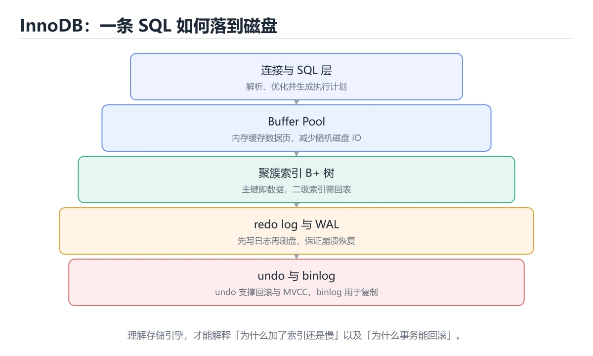
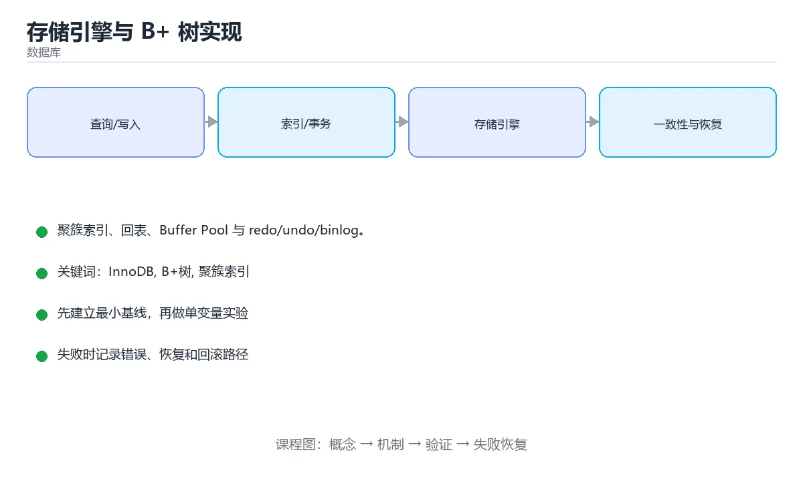

# 存储引擎与 B+ 树实现





> 内容更新时间：2026-10-06 · 学习阶段：进阶 · 预计用时：45 分钟

## 本节知识框架

**课程定位**：所属分类 `database`（数据库），课程主题 `存储引擎与 B+ 树实现`，学习阶段 进阶，建议用时 45 分钟。

本课主线：聚簇索引、回表、Buffer Pool 与 redo/undo/binlog。

**学完本课应当能够**
- 说清 `InnoDB` 与 `B+树` 的含义与区别，并各举一个正例和一个反例。
- 用本课示例验证 `聚簇索引` 的行为，记录输入、输出与失败条件。
- 遇到「认为索引一定加速」这类问题时，能说出触发条件与修复顺序。

### 从概念到验证的学习链条

1. `InnoDB`：先掌握 MySQL 的默认事务存储引擎，支持行锁、MVCC、崩溃恢复和外键，再用它解释 `B+树` 为什么会出现。
2. `B+树`：先掌握 所有键值存放在叶子节点、叶子按链表连接的多路平衡树，适合磁盘索引和范围查询，再用它解释 `聚簇索引` 为什么会出现。
3. `聚簇索引`：先掌握 决定表中数据物理存储顺序的索引，叶子节点直接保存行数据，再用它解释 `Buffer Pool` 为什么会出现。
4. `Buffer Pool`：先掌握 存储引擎的核心是页 + B+ 树 + Buffer Pool + 日志：B+ 树决定查询效率，Buffer Pool 决定内存命中，redo/undo/binlog 决定崩溃恢复与复制，再用它解释 `redo log` 为什么会出现。
5. `redo log`：先掌握 数据库先写日志再落盘的恢复机制，用于崩溃后重放已提交但未写入的数据，再用它解释 本课示例的观察结果 为什么会出现。

**先修与衔接**：本课是「数据库」分类的第 11 课。先修内容：《SQL 高级查询》。《SQL 高级查询》里的 `窗口函数`、`CTE` 是本课的前提。相关或后续课程：《分布式事务与共识》。

### 完成判据

- **定义关**：不看正文也能说明 `InnoDB` 是 MySQL 的默认事务存储引擎，支持行锁、MVCC、崩溃恢复和外键，并指出一个反例。
- **机制关**：能按“输入 → 转换 → 输出 → 验证”复述 `存储引擎与 B+ 树实现`，而不是只背结论。
- **示例关**：能运行或推演 `存储引擎与 B+ 树实现` 的 `sql` 示例，并说明一个真实出现的标识符或字面量。
- **证据关**：能指出 `存储引擎与 B+ 树实现` 示例里的 调用了 `SELECT()`，并说明它支持或反驳了本课的哪一条结论。
- **排错关**：能复现 认为索引一定加速，记录现象并按 按查询模式评估读写比例 修复。
- **迁移关**：能把 `InnoDB`、`B+树`、`聚簇索引`、`Buffer Pool` 放进一个与 `存储引擎与 B+ 树实现` 不同的项目场景，并保持输入与验证条件可追踪。
- **复盘关**：学完 `存储引擎与 B+ 树实现` 后，用一句话写下仍然不确定的结论，并列出下一次验证需要的输入、环境和成功判据。

### 复习清单

- [ ] 能不看正文复述本课核心术语，并指出一个边界或反例。
- [ ] 能运行或推演本课示例，记录输入、输出与失败现象。
- [ ] 能完成一次自测，并把错题对照错误表定位原因。

## 核心概念定义

| 术语 | 操作性定义 | 常见边界与风险 |
| --- | --- | --- |
| InnoDB | MySQL 的默认事务存储引擎，支持行锁、MVCC、崩溃恢复和外键。 | 易错：事务失效、锁粒度混乱；正确做法是统一使用 InnoDB。 |
| B+树 | 所有键值存放在叶子节点、叶子按链表连接的多路平衡树，适合磁盘索引和范围查询。 | 索引命中与数据分布决定实际开销，判断前先看执行计划而不是只看结果是否正确。 |
| 聚簇索引 | 决定表中数据物理存储顺序的索引，叶子节点直接保存行数据。 | 索引命中与数据分布决定实际开销，判断前先看执行计划而不是只看结果是否正确。 |
| Buffer Pool | 存储引擎的核心是页 + B+ 树 + Buffer Pool + 日志：B+ 树决定查询效率，Buffer Pool 决定内存命中，redo/undo/binlog 决定崩溃恢复与复制。 | 索引命中与数据分布决定实际开销，判断前先看执行计划而不是只看结果是否正确。 |
| redo log | 数据库先写日志再落盘的恢复机制，用于崩溃后重放已提交但未写入的数据。 | 隔离级别与并发事务会影响可见性，换级别或换存储引擎后要重新验证。 |

## 原理与运行机制

### 机制总览

**教材衔接：InnoDB 与 MyISAM**

| 对比 | InnoDB | MyISAM |
| --- | --- | --- |
| 事务 | 支持（ACID） | 不支持 |
| 锁粒度 | 行锁 + 间隙锁 | 表锁 |
| 崩溃恢复 | redo/undo 日志 | 容易损坏 |
| 外键 | 支持 | 不支持 |
| 适用 | 通用默认选择 | 只读、以查询为主的历史场景 |

现代 MySQL 应一律使用 InnoDB。

**教材衔接：页与行格式**

InnoDB 以 **16KB 页**为最小 IO 单位，页内组织成「页头 + 槽位数组 + 有序记录 + 页目录」，因此页内是**按主键有序的链表**。行格式（DYNAMIC/COMPACT）决定了变长字段、NULL 位图与溢出页的处理方式，大字段会存到溢出页。

**教材衔接：聚簇索引与二级索引**

InnoDB 的主键索引就是**聚簇索引**：叶子节点直接存整行数据，所以「按主键查」一次即可命中。二级索引叶子存的是主键值，查询非索引列时需要**回表**（再按主键查一次聚簇索引）。

优化含义：

1. 主键应短小且递增（避免页分裂与二级索引膨胀）。
2. **覆盖索引**（查询列都在索引中）可以免回表。
3. 随机主键（如 UUID）会带来页分裂与写放大。

**教材衔接：Buffer Pool 与刷脏**

Buffer Pool 缓存数据页，用改良 LRU（分 young/old 区）避免全表扫描冲掉热数据。修改先在内存中标记为**脏页**，由后台线程按检查点刷盘；这解释了「数据库占用内存大」与「重启后性能下降」。

**教材衔接：三种日志**

| 日志 | 层次 | 作用 |
| --- | --- | --- |
| redo log | InnoDB | 崩溃恢复前滚（WAL：先写日志再写数据页） |
| undo log | InnoDB | 事务回滚与 MVCC 读取旧版本 |
| binlog | MySQL Server | 逻辑日志，用于主从复制与时间点恢复 |

崩溃恢复流程：用 redo 重放已提交的修改，用 undo 回滚未提交事务，保证 ACID 中的持久性与原子性。

**教材衔接：日志分工速查**

| 日志 | 层级 | 作用 | 特点 |
| --- | --- | --- | --- |
| redo log | InnoDB | 崩溃恢复，保证已提交不丢 | 环形写、顺序 IO |
| undo log | InnoDB | 回滚与 MVCC 旧版本 | 逻辑日志，可清理 |
| binlog | MySQL Server | 主从复制、时间点恢复 | 归档型，需妥善保留 |
| relay log | 从库 | 暂存主库 binlog 事件 | 从库专用 |
| 慢查询日志 | Server | 记录慢 SQL | 用于性能分析 |

WAL 思想：**先写日志再写数据页**，把随机写转换为顺序写，同时保证崩溃后可恢复。

**教材衔接：B+ 树设计要点速查**

| 要点 | 说明 |
| --- | --- |
| 页大小 | 默认 16 KB，一个页容纳更多键则树更矮 |
| 聚簇索引 | 叶子节点存整行数据 |
| 二级索引 | 叶子存主键值，需要时回表 |
| 主键选择 | 越短越好，所有二级索引都要存它 |
| 自增主键 | 顺序插入，减少页分裂 |
| 随机主键（UUID） | 页分裂与碎片增加，写入性能下降 |
| 页分裂 | 插入无序数据导致；可用有序主键或预分配缓解 |
| 自适应哈希索引 | InnoDB 自动为热点页建立哈希索引 |

```sql
-- 查看表与索引的物理情况
SHOW TABLE STATUS LIKE 'orders'\G        -- 关注 Data_length、Index_length、Data_free
SHOW INDEX FROM orders;                  -- 关注 Cardinality（区分度估计）

-- 查看 InnoDB 状态：缓冲池命中、页读写、锁等待
SHOW ENGINE INNODB STATUS\G

-- 关键运行指标
SELECT
  (SELECT VARIABLE_VALUE FROM performance_schema.global_status
     WHERE VARIABLE_NAME = 'Innodb_buffer_pool_read_requests') AS read_requests,
  (SELECT VARIABLE_VALUE FROM performance_schema.global_status
     WHERE VARIABLE_NAME = 'Innodb_buffer_pool_reads') AS disk_reads;

-- 缓冲池配置（一般设为物理内存的 50% 到 70%）
SELECT @@innodb_buffer_pool_size / 1024 / 1024 / 1024 AS pool_gb;
```

**教材衔接：深入补充：存储引擎与 B+ 树实现**

前面已经建立了基本概念。这一节换一个角度，把存储引擎与 B+ 树实现放进真实工程里，
重点回答三件事：InnoDB 与 MyISAM 的机制、代价与边界。

### 一、核心模型

存储引擎负责把表和索引映射到磁盘页，管理缓冲池、日志、事务和崩溃恢复；B+ 树是读密集场景的经典索引结构，LSM 树则更适合高写入吞吐。

```text
SQL 请求 → 执行器 → 索引/表访问 → 缓冲池 → 数据页读写 → WAL 日志 → 刷盘 → 崩溃恢复
```

### 二、关键机制拆解

1. 数据以固定大小页读写，页大小影响空间利用率、I/O 次数和缓存效率。
2. B+ 树内部节点只存键和指针，叶子节点存数据或主键并相互连接，适合范围查询。
3. 缓冲池缓存热点页，淘汰策略影响命中率；脏页需要写回但不能破坏事务持久性。
4. WAL 先写日志再写数据页，崩溃后可用重做和回滚恢复一致状态。
5. 事务隔离依赖锁、MVCC 版本链和日志共同实现，存储引擎必须保证原子性和持久性。
6. LSM 树把写操作先写内存表再顺序刷盘，通过合并维持有序，适合写多读少。
7. 列存引擎按列组织数据并压缩，适合分析型扫描，但点更新成本更高。

### 三、对照表：抓住容易混淆的边界

| 维度 | 一侧 | 另一侧 |
| --- | --- | --- |
| B+ 树 | 原地更新，读性能稳定 | 适合点查和范围查询 |
| LSM 树 | 追加写和后台合并 | 适合高写入吞吐 |
| WAL | 先写日志保证持久性 | 恢复时重放或回滚 |
| 缓冲池 | 缓存磁盘页减少 I/O | 必须处理脏页和淘汰 |

### 四、工作示例

订单表按主键查询时走 B+ 树，先读根到叶的少量页；范围查询利用叶子链表顺序扫描。大量写入的日志表则可能适合 LSM 树，因为追加写比随机更新页更高效。

### 五、常见误区与失效边界

| 错误做法或假设 | 后果 | 正确做法 |
| --- | --- | --- |
| 认为索引一定加速 | 写入放大和维护成本被忽略 | 按查询模式评估读写比例 |
| 关闭 WAL 追求性能 | 崩溃后数据丢失或损坏 | 保持持久性配置并进行压测 |
| 缓冲池太小 | 频繁缺页导致 I/O 抖动 | 根据工作集和内存预算调整 |
| 忽略页分裂 | 随机插入导致碎片 | 使用合适主键和填充因子 |

### 六、场景推演

订单库写入延迟升高。排查发现主键使用随机 UUID，导致 B+ 树页频繁分裂和随机写。改为有序 ID 或 ULID 后，插入更集中，页分裂和 I/O 明显下降。

### 七、自测问答

**Q1：B+ 树为什么适合范围查询？**

叶子节点有序并相互连接，定位起点后可顺序扫描。

**Q2：WAL 的作用是什么？**

先记录日志保证崩溃后能重做已提交事务并回滚未完成事务。

**Q3：LSM 树的代价是什么？**

读可能跨多层，合并会带来写放大和空间放大。

**Q4：缓冲池越大越好吗？**

不一定，需要平衡内存、淘汰策略和工作集，盲目扩大会挤占其他资源。

### 八、小项目：把知识变成可检查的产出

用文件实现一个最小的页式存储引擎：支持插入、按主键查找、WAL 记录和崩溃恢复；再分别用顺序键和随机键插入 1 万条记录，比较页分裂次数。

### 九、适用边界

存储引擎决定数据如何落盘和恢复，不负责 SQL 语义和业务规则。数据库整体性能还受查询计划、锁、网络和硬件影响。

### 十、完成检查清单

- [ ] 能解释页、缓冲池和 WAL
- [ ] 能比较 B+ 树与 LSM 树
- [ ] 能说明崩溃恢复流程
- [ ] 能判断索引的读写代价
- [ ] 能设计一个最小持久化存储

### 十一、复习顺序

1. 用自己的话说明 VARIABLE_VALUE 的作用，再说出它不适用的情况。
2. 再对照表逐行解释容易混淆的概念，每个概念补一个反例。
3. 跟着工作示例做一遍，改变一个条件并预测结果。
4. 用自测问答检查理解，错题回到对应小节重新阅读。
5. 用 VARIABLE_VALUE 做一个最小交付，附上运行命令与失败样例。

> 复习不是重读一遍，而是离开原文重新产出：复述、改写、验证、复盘。

### 机制拆解：每一步的输入、动作与输出

#### 1. `InnoDB`
- 输入：`InnoDB`；本步把 MySQL 的默认事务存储引擎，支持行锁、MVCC、崩溃恢复和外键 当作判断规则。
- 动作：围绕 `InnoDB` 保留中间状态，并记录它与 `B+树` 的对应关系。
- 输出：`B+树`，它可以被下一段代码、测试或记录继续使用。
- `InnoDB` 的失败条件：当混用 MyISAM 与 InnoDB时，会出现事务失效、锁粒度混乱。

#### 2. `B+树`
- 输入：`InnoDB`；本步把 所有键值存放在叶子节点、叶子按链表连接的多路平衡树，适合磁盘索引和范围查询 当作判断规则。
- 动作：围绕 `B+树` 保留中间状态，并记录它与 `聚簇索引` 的对应关系。
- 输出：`聚簇索引`，它可以被下一段代码、测试或记录继续使用。
- `B+树` 的失败条件：索引命中与数据分布决定实际开销，判断前先看执行计划而不是只看结果是否正确。

#### 3. `聚簇索引`
- 输入：`B+树`；本步把 决定表中数据物理存储顺序的索引，叶子节点直接保存行数据 当作判断规则。
- 动作：围绕 `聚簇索引` 保留中间状态，并记录它与 `Buffer Pool` 的对应关系。
- 输出：`Buffer Pool`，它可以被下一段代码、测试或记录继续使用。
- `聚簇索引` 的失败条件：索引命中与数据分布决定实际开销，判断前先看执行计划而不是只看结果是否正确。

#### 4. `Buffer Pool`
- 输入：`聚簇索引`；本步把 存储引擎的核心是页 + B+ 树 + Buffer Pool + 日志：B+ 树决定查询效率，Buffer Pool 决定内存命中，redo/undo/binlog 决定崩溃恢复与复制 当作判断规则。
- 动作：围绕 `Buffer Pool` 保留中间状态，并记录它与 `redo log` 的对应关系。
- 输出：`redo log`，它可以被下一段代码、测试或记录继续使用。
- `Buffer Pool` 的失败条件：索引命中与数据分布决定实际开销，判断前先看执行计划而不是只看结果是否正确。

#### 5. `redo log`
- 输入：`Buffer Pool`；本步把 数据库先写日志再落盘的恢复机制，用于崩溃后重放已提交但未写入的数据 当作判断规则。
- 动作：围绕 `redo log` 保留中间状态，并记录它与 `SELECT` 的对应关系。
- 输出：`SELECT`，它可以被下一段代码、测试或记录继续使用。
- `redo log` 的失败条件：隔离级别与并发事务会影响可见性，换级别或换存储引擎后要重新验证。

### 示例中的可观察事实

1. 调用了 `SELECT()`；它对应的课程主题是 `存储引擎与 B+ 树实现`。
2. 出现字面量 `orders`；它对应的课程主题是 `存储引擎与 B+ 树实现`。
3. 出现字面量 `Innodb_buffer_pool_reads`；它对应的课程主题是 `存储引擎与 B+ 树实现`。

### 复现实验记录

- 环境：`存储引擎与 B+ 树实现` 使用 `sql` 示例，固定 `InnoDB`、`B+树`、`聚簇索引`、`Buffer Pool` 作为第一组条件。
- 首轮输入：先确认 调用了 `SELECT()`，预测 `InnoDB` 会怎样变化。
- 基线观察：记录命令、输入、输出和错误原文，不用截图代替可复制的文本。
- 单变量修改：只改变 `InnoDB`，观察 `redo log` 是否仍满足定义。
- 失败注入：复现 认为索引一定加速，确认现象是 写入放大和维护成本被忽略。
- 记录结论：把“修改前、修改后、预期变化、实际变化”写成四列表，这样复盘 `存储引擎与 B+ 树实现` 时才能区分概念错误与实现错误。

## 典型应用场景

- **认为索引一定加速**：典型现象是写入放大和维护成本被忽略；正确做法是按查询模式评估读写比例。
- **关闭 WAL 追求性能**：典型现象是崩溃后数据丢失或损坏；正确做法是保持持久性配置并进行压测。
- **缓冲池太小**：典型现象是频繁缺页导致 I/O 抖动；正确做法是根据工作集和内存预算调整。
- **忽略页分裂**：典型现象是随机插入导致碎片；正确做法是使用合适主键和填充因子。

### 最小验证场景

- 准备：保留 `sql` 示例的原始输入，先记录 `存储引擎与 B+ 树实现` 的基线输出和完整运行命令。
- 观察：先核对 调用了 `SELECT()`，再改变一个与 `InnoDB` 相关的条件。
- 判定：新结果与 `存储引擎与 B+ 树实现` 的基线不同不等于错误；只有当差异破坏了 `InnoDB` 的定义或错误表中的约束，才判定为失败。

### 选择与边界

- 使用 `InnoDB` 时，先满足它的定义：MySQL 的默认事务存储引擎，支持行锁、MVCC、崩溃恢复和外键；易错：事务失效、锁粒度混乱；正确做法是统一使用 InnoDB。
- 使用 `B+树` 时，先满足它的定义：所有键值存放在叶子节点、叶子按链表连接的多路平衡树，适合磁盘索引和范围查询；索引命中与数据分布决定实际开销，判断前先看执行计划而不是只看结果是否正确。
- 使用 `聚簇索引` 时，先满足它的定义：决定表中数据物理存储顺序的索引，叶子节点直接保存行数据；索引命中与数据分布决定实际开销，判断前先看执行计划而不是只看结果是否正确。
- 使用 `Buffer Pool` 时，先满足它的定义：存储引擎的核心是页 + B+ 树 + Buffer Pool + 日志：B+ 树决定查询效率，Buffer Pool 决定内存命中，redo/undo/binlog 决定崩溃恢复与复制；索引命中与数据分布决定实际开销，判断前先看执行计划而不是只看结果是否正确。
- 使用 `redo log` 时，先满足它的定义：数据库先写日志再落盘的恢复机制，用于崩溃后重放已提交但未写入的数据；隔离级别与并发事务会影响可见性，换级别或换存储引擎后要重新验证。

## 代码/协议/SQL 示例

### 最小可验证示例

**教材衔接：原文最小示例**

**运行方式**：运行 `存储引擎与 B+ 树实现` 的示例时，在本地数据库或用 SQLite 命令行执行；先在测试库上跑，确认影响行数。

### 示例精读：先找证据，再改一个条件

1. 调用了 `SELECT()`；它出现在 `存储引擎与 B+ 树实现` 的示例中，阅读时先确认它前后各发生了什么。
2. 出现字面量 `orders`；它出现在 `存储引擎与 B+ 树实现` 的示例中，阅读时先确认它前后各发生了什么。
3. 出现字面量 `Innodb_buffer_pool_reads`；它出现在 `存储引擎与 B+ 树实现` 的示例中，阅读时先确认它前后各发生了什么。
- 在 `存储引擎与 B+ 树实现` 中与 `InnoDB` 对照：示例必须能支持 MySQL 的默认事务存储引擎，支持行锁、MVCC、崩溃恢复和外键，否则说明这一段还缺少实现或验证步骤。
- 在 `存储引擎与 B+ 树实现` 中与 `B+树` 对照：示例必须能支持 所有键值存放在叶子节点、叶子按链表连接的多路平衡树，适合磁盘索引和范围查询，否则说明这一段还缺少实现或验证步骤。
- 在 `存储引擎与 B+ 树实现` 中与 `聚簇索引` 对照：示例必须能支持 决定表中数据物理存储顺序的索引，叶子节点直接保存行数据，否则说明这一段还缺少实现或验证步骤。
- 在 `存储引擎与 B+ 树实现` 中与 `Buffer Pool` 对照：示例必须能支持 存储引擎的核心是页 + B+ 树 + Buffer Pool + 日志：B+ 树决定查询效率，Buffer Pool 决定内存命中，redo/undo/binlog 决定崩溃恢复与复制，否则说明这一段还缺少实现或验证步骤。

## 时间/空间复杂度或性能分析

**性能关注点（存储引擎与 B+ 树实现）**：扫描行数与索引命中决定开销：记录查询耗时、执行计划与锁等待。

**本课特有开销（存储引擎与 B+ 树实现 · InnoDB）**：索引能减少扫描行数，但会增加写入与存储开销，需要同时记录读、写两侧代价。

**测量方法**：以 `存储引擎与 B+ 树实现` 的 `InnoDB` 场景为对象，固定输入跑一遍记录基线，再把规模或并发度提高一个数量级复测；两次结果的差值与波动范围才是结论依据。

### 需要控制的变量与记录项

- `存储引擎与 B+ 树实现` 的 `InnoDB`：固定它的版本、输入范围和资源上限，分别记录速度、内存与失败率的变化。
- `存储引擎与 B+ 树实现` 的 `B+树`：固定它的版本、输入范围和资源上限，分别记录速度、内存与失败率的变化。
- `存储引擎与 B+ 树实现` 的 `聚簇索引`：固定它的版本、输入范围和资源上限，分别记录速度、内存与失败率的变化。
- `存储引擎与 B+ 树实现` 的 `Buffer Pool`：固定它的版本、输入范围和资源上限，分别记录速度、内存与失败率的变化。
- `存储引擎与 B+ 树实现` 的 `redo log`：固定它的版本、输入范围和资源上限，分别记录速度、内存与失败率的变化。
- `存储引擎与 B+ 树实现` 中 `InnoDB` 的边界：易错：事务失效、锁粒度混乱；正确做法是统一使用 InnoDB。达到边界时不要外推，必须重新测量。
- `存储引擎与 B+ 树实现` 中 `B+树` 的边界：索引命中与数据分布决定实际开销，判断前先看执行计划而不是只看结果是否正确。达到边界时不要外推，必须重新测量。
- `存储引擎与 B+ 树实现` 中 `聚簇索引` 的边界：索引命中与数据分布决定实际开销，判断前先看执行计划而不是只看结果是否正确。达到边界时不要外推，必须重新测量。
- `存储引擎与 B+ 树实现` 中 `Buffer Pool` 的边界：索引命中与数据分布决定实际开销，判断前先看执行计划而不是只看结果是否正确。达到边界时不要外推，必须重新测量。
- `存储引擎与 B+ 树实现` 中 `redo log` 的边界：隔离级别与并发事务会影响可见性，换级别或换存储引擎后要重新验证。达到边界时不要外推，必须重新测量。
- `存储引擎与 B+ 树实现` 的代码证据：先验证 调用了 `SELECT()`，再记录该路径的输入规模与耗时；只看代码行数不能推出复杂度。

## 常见误区与易错点

| 容易写错的做法 | 实际现象 | 原因与正确做法 |
| --- | --- | --- |
| 认为索引一定加速 | 写入放大和维护成本被忽略 | 按查询模式评估读写比例 |
| 关闭 WAL 追求性能 | 崩溃后数据丢失或损坏 | 保持持久性配置并进行压测 |
| 缓冲池太小 | 频繁缺页导致 I/O 抖动 | 根据工作集和内存预算调整 |
| 忽略页分裂 | 随机插入导致碎片 | 使用合适主键和填充因子 |
| 用随机 UUID 作聚簇主键 | 写入慢、页分裂多 | 用趋势递增 ID 或有序 UUID 变体 |
| 主键过长（长字符串） | 所有二级索引膨胀 | 用自增或雪花 ID |
| 认为二级索引查询不用回表 | 低估 IO | 需要非索引列时仍要回表，必要时做覆盖索引 |
| 关闭 binlog 省空间 | 无法做时间点恢复与复制 | 保留并定期归档 |
| 忽视缓冲池大小 | 命中率低、磁盘 IO 高 | 按内存比例设置并监控命中率 |
| 频繁大批量删除 | undo 膨胀、磁盘占用高 | 分批删除并关注表空间回收 |
| 认为 delete 立即释放磁盘 | 空间不回收 | 需 `OPTIMIZE TABLE` 或重建 |
| 无视 undo 保留时长 | 长事务导致膨胀 | 监控最长事务并限制时长 |
| 混用 MyISAM 与 InnoDB | 事务失效、锁粒度混乱 | 统一使用 InnoDB |
| 只看 QPS 不看 IO | 掩盖磁盘瓶颈 | 同时监控 IOPS、延迟与命中率 |

### 现场 1：认为索引一定加速

**症状**：写入放大和维护成本被忽略。

**根因与修复**：按查询模式评估读写比例。

**自检**：在本课示例里复现「认为索引一定加速」，改成按查询模式评估读写比例后重跑；如果症状消失且失败路径按预期变化，说明定位正确。

### 现场 2：关闭 WAL 追求性能

**症状**：崩溃后数据丢失或损坏。

**根因与修复**：保持持久性配置并进行压测。

**自检**：在本课示例里复现「关闭 WAL 追求性能」，改成保持持久性配置并进行压测后重跑；如果症状消失且失败路径按预期变化，说明定位正确。

### 现场 3：缓冲池太小

**症状**：频繁缺页导致 I/O 抖动。

**根因与修复**：根据工作集和内存预算调整。

**自检**：在本课示例里复现「缓冲池太小」，改成根据工作集和内存预算调整后重跑；如果症状消失且失败路径按预期变化，说明定位正确。

### 现场 4：忽略页分裂

**症状**：随机插入导致碎片。

**根因与修复**：使用合适主键和填充因子。

**自检**：在本课示例里复现「忽略页分裂」，改成使用合适主键和填充因子后重跑；如果症状消失且失败路径按预期变化，说明定位正确。

### 现场 5：用随机 UUID 作聚簇主键

**症状**：写入慢、页分裂多。

**根因与修复**：用趋势递增 ID 或有序 UUID 变体。

**自检**：在本课示例里复现「用随机 UUID 作聚簇主键」，改成用趋势递增 ID 或有序 UUID 变体后重跑；如果症状消失且失败路径按预期变化，说明定位正确。

### 现场 6：主键过长（长字符串）

**症状**：所有二级索引膨胀。

**根因与修复**：用自增或雪花 ID。

**自检**：在本课示例里复现「主键过长（长字符串）」，改成用自增或雪花 ID后重跑；如果症状消失且失败路径按预期变化，说明定位正确。

### 现场 7：认为二级索引查询不用回表

**症状**：低估 IO。

**根因与修复**：需要非索引列时仍要回表，必要时做覆盖索引。

**自检**：在本课示例里复现「认为二级索引查询不用回表」，改成需要非索引列时仍要回表，必要时做覆盖索引后重跑；如果症状消失且失败路径按预期变化，说明定位正确。

### 现场 8：关闭 binlog 省空间

**症状**：无法做时间点恢复与复制。

**根因与修复**：保留并定期归档。

**自检**：在本课示例里复现「关闭 binlog 省空间」，改成保留并定期归档后重跑；如果症状消失且失败路径按预期变化，说明定位正确。

### 现场 9：忽视缓冲池大小

**症状**：命中率低、磁盘 IO 高。

**根因与修复**：按内存比例设置并监控命中率。

**自检**：在本课示例里复现「忽视缓冲池大小」，改成按内存比例设置并监控命中率后重跑；如果症状消失且失败路径按预期变化，说明定位正确。

## 与其他知识点的关系

**教材衔接：存储引擎对照**

| 维度 | InnoDB | MyISAM |
| --- | --- | --- |
| 事务 | 支持 | 不支持 |
| 锁粒度 | 行锁 | 表锁 |
| 外键 | 支持 | 不支持 |
| 崩溃恢复 | 通过 redo 恢复 | 易损坏 |
| 全文索引 | 支持 | 支持 |
| 适用 | 绝大多数在线业务 | 只读历史数据（已不推荐） |

- **先修**：`SQL 高级查询`。本课默认这些内容已经掌握。
- **相关或后续**：`分布式事务与共识`。本课术语会在这些课程里继续使用。
- **术语归属**：`InnoDB`、`B+树`、`聚簇索引` 的定义以本课「核心概念定义」为准，换到其他课程时先确认定义是否被改写。
- 同一分类的《索引》也涉及 `B+树`；两课衔接时先确认这个术语的定义是否一致。
- 同一分类的《MySQL 锁与 MVCC》也涉及 `InnoDB`；两课衔接时先确认这个术语的定义是否一致。

### 先修与后续术语接口

- `SQL 高级查询`：两者通过本分类的学习顺序衔接，阅读时重点比较各自的输入与失败条件。
- `分布式事务与共识`：两者通过本分类的学习顺序衔接，阅读时重点比较各自的输入与失败条件。

### 容易混淆的相邻概念

- `InnoDB` 与 `B+树`：前者强调 MySQL 的默认事务存储引擎，支持行锁、MVCC、崩溃恢复和外键；后者强调 所有键值存放在叶子节点、叶子按链表连接的多路平衡树，适合磁盘索引和范围查询。判断时分别检查两条定义的适用范围，不要只看名称相似就互换。
- `B+树` 与 `聚簇索引`：前者强调 所有键值存放在叶子节点、叶子按链表连接的多路平衡树，适合磁盘索引和范围查询；后者强调 决定表中数据物理存储顺序的索引，叶子节点直接保存行数据。判断时分别检查两条定义的适用范围，不要只看名称相似就互换。
- `聚簇索引` 与 `Buffer Pool`：前者强调 决定表中数据物理存储顺序的索引，叶子节点直接保存行数据；后者强调 存储引擎的核心是页 + B+ 树 + Buffer Pool + 日志：B+ 树决定查询效率，Buffer Pool 决定内存命中，redo/undo/binlog 决定崩溃恢复与复制。判断时分别检查两条定义的适用范围，不要只看名称相似就互换。
- `Buffer Pool` 与 `redo log`：前者强调 存储引擎的核心是页 + B+ 树 + Buffer Pool + 日志：B+ 树决定查询效率，Buffer Pool 决定内存命中，redo/undo/binlog 决定崩溃恢复与复制；后者强调 数据库先写日志再落盘的恢复机制，用于崩溃后重放已提交但未写入的数据。判断时分别检查两条定义的适用范围，不要只看名称相似就互换。

## 自测题与参考答案

> 先独立作答，再对照参考答案；答案都能在本课正文、术语表或错误表里找到依据。

### 自测 1（概念复述）

不看正文，写出 `InnoDB` 的操作性定义，并说明它与 `B+树` 的区别。

**参考答案**：MySQL 的默认事务存储引擎，支持行锁、MVCC、崩溃恢复和外键。

`B+树` 的定位是：所有键值存放在叶子节点、叶子按链表连接的多路平衡树，适合磁盘索引和范围查询；两者的差别要从适用对象与失败模式上说明。

### 自测 2（排错）

本课错误表记录了「认为索引一定加速」这类做法。请写出它会出现的现象、根因，以及修复顺序。

**参考答案**：现象是写入放大和维护成本被忽略；正确做法是按查询模式评估读写比例。修复时先复现现象并保留证据，再改动一处假设重跑，确认现象消失。

### 自测 3（动手验证）

运行本课的 `sql` 示例，把其中的 `'orders'` 换成一个边界值后重新运行，记录输出与错误信息。

**参考答案**：正常输入下 `sql` 示例应当复现正文给出的结果；把 `'orders'` 换成边界值后，如果结果改变或报错，先核对它是否满足 `存储引擎与 B+ 树实现` 中`InnoDB` 的适用范围，再检查错误表里是否有同类现象。

### 自测 4（代码阅读）

阅读本课开头的 `sql` 示例，说明它体现了`InnoDB` 的哪一条性质，并指出改动哪个输入会让这条性质不再成立。

**参考答案**：`InnoDB` 的定义是 MySQL 的默认事务存储引擎，支持行锁、MVCC、崩溃恢复和外键，示例正是在实现这条定义。改动与 `InnoDB` 有关的一个输入后，如果结果不再符合 `存储引擎与 B+ 树实现` 的正文描述，就说明该性质只在当前前提成立。

### 自测 5（迁移）

把 `存储引擎与 B+ 树实现` 的方法迁移到自己的项目：围绕 `InnoDB` 写出一个与错误表同类的风险点，并说明触发条件和检验方式。

**参考答案**：例如「只看 QPS 不看 IO」，它会导致掩盖磁盘瓶颈；检验方式是按同时监控 IOPS、延迟与命中率改一处再复现，确认现象消失且没有引入新的失败分支。

### 自测 6（对比）

用一个表格对比 `InnoDB` 与 `B+树`：各写一行适用场景、一行失败表现。

**参考答案**：`InnoDB` 的定义是MySQL 的默认事务存储引擎，支持行锁、MVCC、崩溃恢复和外键；`B+树` 的定义是所有键值存放在叶子节点、叶子按链表连接的多路平衡树，适合磁盘索引和范围查询。两者的失败表现分别对应本课错误表里与本术语相关的行。

### 自测 7（排错顺序）

面对「认为索引一定加速」引发的问题，请把“复现 写入放大和维护成本被忽略 → 保留证据 → 按查询模式评估读写比例 → 回归验证”四步写成可执行的检查清单。

**参考答案**：第一步按写入放大和维护成本被忽略复现；第二步记录输入、版本与完整报错；第三步按按查询模式评估读写比例只改一处；第四步重跑并确认失败路径也按预期变化。

### 自测 8（边界判断）

针对 `redo log`，分别写出“可以使用”的条件和“结论不再成立”的条件。

**参考答案**：隔离级别与并发事务会影响可见性，换级别或换存储引擎后要重新验证。 同时要把 `redo log` 的定义 数据库先写日志再落盘的恢复机制，用于崩溃后重放已提交但未写入的数据 与实际输入逐项对照。

### 自测 9（机制重建）

不看正文，按输入、转换、输出、验证四段重建 `InnoDB` → `B+树` → `聚簇索引` → `Buffer Pool` 的作用链。

**参考答案**：起点是 `InnoDB` 的定义 MySQL 的默认事务存储引擎，支持行锁、MVCC、崩溃恢复和外键；中间每一步都保留可观察状态；终点由 `redo log` 检查，失败时回到错误表定位第一个偏离定义的步骤。

### 自测 10（综合排错）

在 `存储引擎与 B+ 树实现` 中，现象是 掩盖磁盘瓶颈。请围绕 只看 QPS 不看 IO 写出最小复现、关键证据、修复动作和回归验证，并说明为什么不能只凭一次运行下结论。

**参考答案**：先复现 只看 QPS 不看 IO，记录输入与完整错误；再按 同时监控 IOPS、延迟与命中率 只改一处。回归时同时跑正常路径和边界路径，只有两次结果都可解释，才把修复视为完成。

### 自测 11（一分钟复述）

用每分钟约 200 字的速度复述 `存储引擎与 B+ 树实现`：先给主问题，再按顺序说出 `InnoDB`、`B+树`、`聚簇索引`、`Buffer Pool`，最后给一个失败案例。

**自评标准**：主问题必须对应 聚簇索引、回表、Buffer Pool 与 redo/undo/binlog；每个术语都要能接上一句定义或边界；失败案例必须写成可观察现象，不能用“可能有风险”代替证据。

## 术语速查

| 术语 | 一句话说明 |
| --- | --- |
| `InnoDB` | MySQL 的默认事务存储引擎，支持行锁、MVCC、崩溃恢复和外键。 |
| `B+树` | 所有键值存放在叶子节点、叶子按链表连接的多路平衡树，适合磁盘索引和范围查询。 |
| `聚簇索引` | 决定表中数据物理存储顺序的索引，叶子节点直接保存行数据。 |
| `Buffer Pool` | 存储引擎的核心是页 + B+ 树 + Buffer Pool + 日志：B+ 树决定查询效率，Buffer Pool 决定内存命中，redo/undo/binlog 决定崩溃恢复与复制。 |
| `redo log` | 数据库先写日志再落盘的恢复机制，用于崩溃后重放已提交但未写入的数据。 |

**术语关系**：`InnoDB`（MySQL 的默认事务存储引擎） → `B+树`（所有键值存放在叶子节点、叶子按链表连接的多路平衡树） → `聚簇索引`（决定表中数据物理存储顺序的索引） → `Buffer Pool`（存储引擎的核心是页 + B+ 树 + Buffer Pool + 日志：B+ 树决定查询效率）。

## 考点精讲

`存储引擎与 B+ 树实现` 的题库有 6 道题，下面逐题给出题干、正确项与判断依据：先自己作答，再核对正确项，最后回到正文对应小节复核。

### 考点 1：第 1 题

- **题目**：InnoDB 二级索引的叶子节点存的是？
- **正确项**：主键值
- **判断依据**：这道题落在术语 `InnoDB` 上：MySQL 的默认事务存储引擎，支持行锁、MVCC、崩溃恢复和外键。复习时把 `InnoDB` 的定义、适用边界和一个反例一起说清楚，再回到「核心概念定义」核对原文。

### 考点 2：第 2 题

- **题目**：按“存储引擎与 B+ 树实现”中 InnoDB、B+树、聚簇索引 的实践顺序，把四个步骤排成从准备到复盘的合理顺序。
- **正确项**：先明确 InnoDB 的输入、输出与约束 → 写出最小示例并核对 B+树 的基线结果 → 只改一个变量，记录边界与失败路径的变化 → 固定版本与证据，把“存储引擎与 B+ 树实现”的结论写成可复现记录
- **判断依据**：这道题落在术语 `InnoDB` 上：MySQL 的默认事务存储引擎，支持行锁、MVCC、崩溃恢复和外键。复习时把 `InnoDB` 的定义、适用边界和一个反例一起说清楚，再回到「核心概念定义」核对原文。

### 考点 3：第 3 题

- **题目**：代码语言为 `sql`，选自 `存储引擎与 B+ 树实现` 的 `InnoDB` 部分。课程问题为聚簇索引、回表、Buffer Pool 与 redo/undo/binlog。哪一项描述与代码一致？
- **正确项**：出现字面量 `Innodb_buffer_pool_reads`
- **判断依据**：这道题落在术语 `InnoDB` 上：MySQL 的默认事务存储引擎，支持行锁、MVCC、崩溃恢复和外键。复习时把 `InnoDB` 的定义、适用边界和一个反例一起说清楚，再回到「核心概念定义」核对原文。

### 考点 4：第 4 题

- **题目**：undo log 的主要作用是？
- **正确项**：支持事务回滚
- **判断依据**：这道题检验本课主问题：聚簇索引、回表、Buffer Pool 与 redo/undo/binlog。复习时先复述本课主问题，再举一个会让结论失效的输入。

### 考点 5：第 5 题

- **题目**：聚簇索引与二级索引的区别是？
- **正确项**：聚簇索引叶子存整行数据
- **判断依据**：这道题落在术语 `聚簇索引` 上：决定表中数据物理存储顺序的索引，叶子节点直接保存行数据。复习时把 `聚簇索引` 的定义、适用边界和一个反例一起说清楚，再回到「核心概念定义」核对原文。

### 考点 6：第 6 题

- **题目**：课程 `聚簇索引、回表、Buffer Pool 与 redo/undo/binlog。`。在 `存储引擎与 B+ 树实现` 里，`InnoDB`、`B+树` 与下面哪些选项属于同一层概念？（多选）
- **正确项**：InnoDB；B+树
- **判断依据**：这道题落在术语 `InnoDB` 上：MySQL 的默认事务存储引擎，支持行锁、MVCC、崩溃恢复和外键。复习时把 `InnoDB` 的定义、适用边界和一个反例一起说清楚，再回到「核心概念定义」核对原文。

### 考点 7：`InnoDB`

- **要点**：MySQL 的默认事务存储引擎，支持行锁、MVCC、崩溃恢复和外键。
- **InnoDB 的边界**：易错：事务失效、锁粒度混乱；正确做法是统一使用 InnoDB。

### 考点 8：`B+树`

- **要点**：所有键值存放在叶子节点、叶子按链表连接的多路平衡树，适合磁盘索引和范围查询。
- **B+树 的边界**：索引命中与数据分布决定实际开销，判断前先看执行计划而不是只看结果是否正确。

### 考点 9：`聚簇索引`

- **要点**：决定表中数据物理存储顺序的索引，叶子节点直接保存行数据。
- **聚簇索引 的边界**：索引命中与数据分布决定实际开销，判断前先看执行计划而不是只看结果是否正确。

### 考点 10：`Buffer Pool`

- **要点**：存储引擎的核心是页 + B+ 树 + Buffer Pool + 日志：B+ 树决定查询效率，Buffer Pool 决定内存命中，redo/undo/binlog 决定崩溃恢复与复制。
- **Buffer Pool 的边界**：索引命中与数据分布决定实际开销，判断前先看执行计划而不是只看结果是否正确。

### 考点 11：`redo log`

- **要点**：数据库先写日志再落盘的恢复机制，用于崩溃后重放已提交但未写入的数据。
- **redo log 的边界**：隔离级别与并发事务会影响可见性，换级别或换存储引擎后要重新验证。

### 考点 12：排错——认为索引一定加速

- **现象**：写入放大和维护成本被忽略。
- **处理**：按查询模式评估读写比例。

### 考点 13：排错——关闭 WAL 追求性能

- **现象**：崩溃后数据丢失或损坏。
- **处理**：保持持久性配置并进行压测。

### 考点 14：综合辨析——`InnoDB` 与 `redo log`

- **辨析点**：`InnoDB` 的定义是 MySQL 的默认事务存储引擎，支持行锁、MVCC、崩溃恢复和外键；`redo log` 的定义是 数据库先写日志再落盘的恢复机制，用于崩溃后重放已提交但未写入的数据。
- **答题要求**：面对 `存储引擎与 B+ 树实现` 的题目，先判断描述的是 `InnoDB` 还是 `redo log`，再归到对应定义，最后写出一个会让该定义失效的边界输入。

### 考点 15：排错评分点

- **现象分**：能写出 写入放大和维护成本被忽略，而不是只写“程序有错”。
- **证据分**：保留触发 认为索引一定加速 的输入、版本和错误原文。
- **修复分**：按 按查询模式评估读写比例 只改一处，并同时回归正常路径与边界路径。

## 内容元数据

- 内容版本：v2.0
- 最后更新：2026-10-06
- 学习阶段：进阶
- 适用环境：PostgreSQL / MySQL / SQLite 等主流数据库；本课聚焦其中的 InnoDB。
- 内容来源：内置结构化课程与工程实践整理
- 相关主题：InnoDB、B+树、聚簇索引、Buffer Pool、redo log
- 质量版本：P0 测验标准 + P1 覆盖扩展 + P2 体验补全

## 参考资料与复核

- 最后复核：2026-10-04
- 下次复核：2027-09-17
- 复核范围：版本兼容、API 行为、安全建议与工程实践
- 来源性质：官方文档、标准或权威教材；本课核对关键词：InnoDB、B+树、聚簇索引、Buffer Pool、redo log。

| 参考资料 | 本课用途 |
| --- | --- |
| [MySQL 文档](https://dev.mysql.com/doc/) | 关系数据库与 InnoDB |
| [Use The Index, Luke](https://use-the-index-luke.com/) | SQL 索引与查询优化 |
| [Redis 文档](https://redis.io/docs/latest/) | 缓存、数据结构与持久化 |

| [本课术语索引：存储引擎与 B+ 树实现](#核心概念定义) | 按本课输入、术语边界和错误表现逐项核对 |
> 「存储引擎与 B+ 树实现」的链接用于离线阅读后的延伸核对；App 不会自动联网。