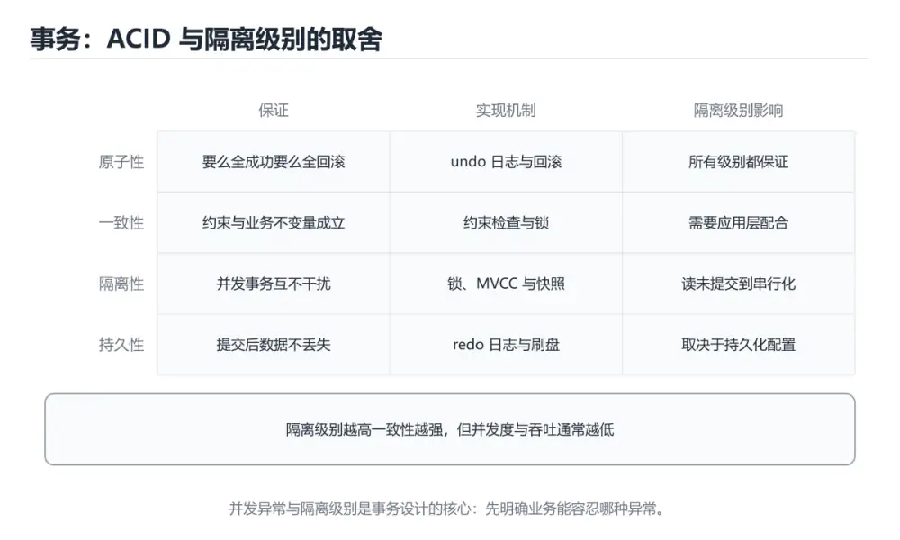
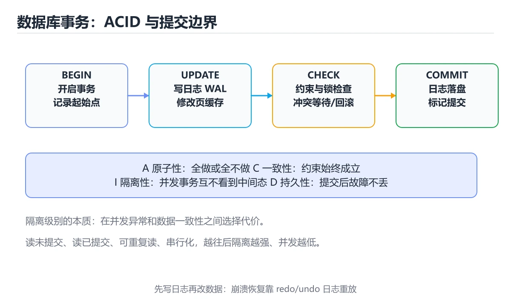
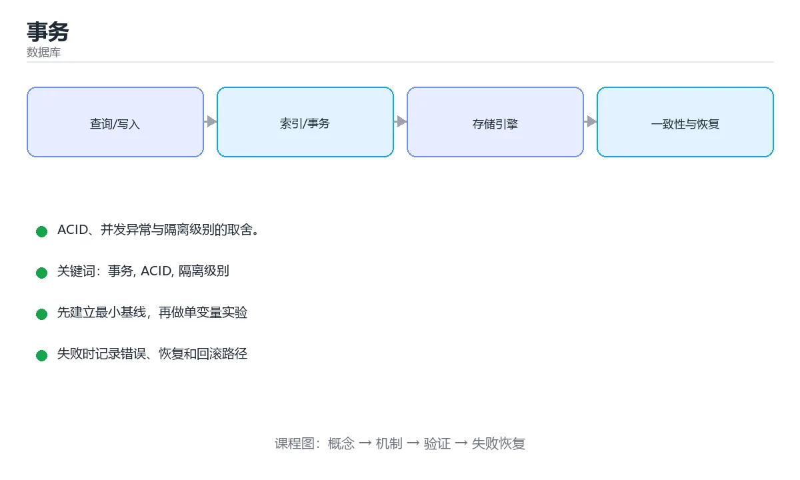

# 事务

> 内容更新时间：2026-10-06 · 学习阶段：进阶 · 预计用时：40 分钟







## 本节知识框架

**课程定位**：所属分类为「数据库」，课程主题为「事务」，学习阶段为「进阶」，建议用时 40 分钟。

**本课要解决的主问题**：ACID、并发异常与隔离级别的取舍。

| 学习层次 | 要回答的问题 | 完成判据 |
| --- | --- | --- |
| 概念层 | 「事务」有哪些必须区分的对象与术语？ | 能用自己的话定义核心术语，并各举一个正例和一个反例。 |
| 机制层 | 这些对象按什么顺序发生作用，输入如何变成输出？ | 能画出或写出机制步骤，并说明每一步的失败条件。 |
| 应用层 | 什么场景适合使用「事务」，什么场景不适合？ | 能给出一个真实场景、一个最小示例和一个边界案例。 |
| 性能层 | 时间、空间、吞吐或延迟受哪些量影响？ | 能说出复杂度或性能瓶颈的证据来源；没有证据时明确写“材料未提供”。 |
| 复习层 | 怎样确认自己不是只记住了结论？ | 能独立完成本课自测，并把错误定位到概念、机制、示例或边界。 |

### 阅读路线

1. 先读「核心概念定义」，建立「事务」等对象的精确定义。
2. 再读「原理与运行机制」，把定义串成可重复的过程。
3. 用「代码/协议/SQL 示例」验证过程，并只改一个条件观察结果变化。
4. 最后检查性能、易错点、知识关系与自测题，形成可复习的证据链。

**前置知识**：《索引》

**学习位置**：本课位于《索引》之后；如果前一课的自测不能通过，应先回补再继续。

**后续衔接**：下一课《数据库设计与范式》会继续使用本课术语，学完后建议立即完成一次自测。

**教材衔接：学习目标**

- 能用自己的话解释事务解决了什么问题，而不是只背术语。
- 能说清 事务、「ACID」、「隔离级别」、「脏读」 之间的关系，并分别举出一个例子。
- 能把 事务 放回「事务」的知识体系，说明它和 ACID 的边界。
- 能完成本课练习，并用验收标准检查自己的结果。

> 一句话摘要：ACID、并发异常与隔离级别的取舍。

**教材衔接：前置知识**

- 先完成上一课《索引》；如果已经掌握，可以直接用本课练习自测。
- 本课阶段：进阶。建议先完成「索引」，或确认自己能独立跑通正文里的 TRANSACTION 示例。
- 开始前先复习：事务、ACID、隔离级别。
- 看不懂就直接缩小例子：只保留 事务 相关的两行输入，跑通后再加回其余部分。

**教材衔接：本课小结**

事务保证数据在并发与故障下仍然正确。记住 **ACID** 和三种并发异常，就能理解隔离级别的取舍。

## 核心概念定义

> 阅读约定：本课先给「事务」相关术语的操作性定义与适用边界；正文里的口语化说法与定义冲突时，以定义和可复现示例为准。

| 术语 | 操作性定义 | 本课中的边界 |
| --- | --- | --- |
| ROLLBACK | 捕获异常后显式 ROLLBACK 并释放连接。 | 仅在「事务」明确给出的输入、版本与资源条件下成立。 |
| SELECT ... FOR UPDATE | 当前读（SELECT ... FOR UPDATE）不受快照影响，会读取最新已提交数据并加锁，因此**同一事务里快照读与当前读可能看到不同结果**，这是排查"读到旧数据"类问题的关键。 | 仅在「事务」明确给出的输入、版本与资源条件下成立。 |
| 事务 | 一组要么全部成功要么全部回滚的数据库操作。 | 仅在「事务」明确给出的输入、版本与资源条件下成立。 |
| 隔离级别 | 隔离级别越高，一致性越好，但并发性能越低。多数数据库默认使用「读已提交」或「可重复读」。 | 仅在「事务」明确给出的输入、版本与资源条件下成立。 |

### 定义如何使用

在「事务」中判断一个说法是否成立，先确认它使用的是哪个对象的定义，再检查输入规模、运行环境与失败路径。定义不是口号，而是后续推导、代码示例和自测题共享的约束。

## 原理与运行机制

### 机制总览

1. **建立输入**：把「ROLLBACK」按本课定义整理成可观察、可重复的输入条件。
2. **执行转换**：围绕「SELECT ... FOR UPDATE」执行本课的核心步骤；每一步都记录中间状态，避免只看最终输出。
3. **产生输出**：得到「事务」后，用正文示例或协议/SQL 结果核对输出是否符合预期。
4. **改变一个条件**：只替换一个边界条件或环境参数，观察「事务」的结论是否仍然成立。

| 阶段 | 关注对象 | 失败时应检查 |
| --- | --- | --- |
| 输入 | ROLLBACK | 类型、范围、编码、版本或前置状态是否满足定义。 |
| 处理 | SELECT ... FOR UPDATE | 顺序、可见性、锁、路由、事务或调度规则是否被破坏。 |
| 输出 | 事务 | 结果是否可复现，错误是否被正确传播而不是被吞掉。 |

本课的机制结论要用「事务」自己的示例验证。「事务」没有给出某个数量级、吞吐或内存数据时，本课把该判断标为“材料未提供”，不从相邻主题外推。

**教材衔接：ACID 四大特性**

| 特性 | 含义 |
| --- | --- |
| 原子性 Atomicity | 事务内操作不可分割，要么全做，要么全不做 |
| 一致性 Consistency | 事务前后数据满足约束与业务规则 |
| 隔离性 Isolation | 并发事务互不干扰 |
| 持久性 Durability | 提交后的数据不会因故障丢失 |

**教材衔接：隔离级别**

| 级别 | 脏读 | 不可重复读 | 幻读 |
| --- | --- | --- | --- |
| 读未提交 | 可能 | 可能 | 可能 |
| 读已提交 | 不会 | 可能 | 可能 |
| 可重复读 | 不会 | 不会 | InnoDB 基本不会 |
| 串行化 | 不会 | 不会 | 不会 |

隔离级别越高，一致性越好，但并发性能越低。多数数据库默认使用「读已提交」或「可重复读」。

**教材衔接：隔离级别速查**

| 隔离级别 | 脏读 | 不可重复读 | 幻读 | 实现要点 |
| --- | --- | --- | --- | --- |
| 读未提交（RU） | 可能 | 可能 | 可能 | 几乎不使用 |
| 读已提交（RC） | 不会 | 可能 | 可能 | 每次查询生成新快照 |
| 可重复读（RR） | 不会 | 不会 | InnoDB 基本不会 | 事务内首次读生成快照 + 间隙锁 |
| 串行化（SERIALIZABLE） | 不会 | 不会 | 不会 | 加锁串行执行，并发最低 |

并发异常对照：

| 异常 | 场景 | 现象 |
| --- | --- | --- |
| 脏读 | 读到别的事务未提交的数据 | 对方回滚后数据消失 |
| 不可重复读 | 同一事务内两次读同一行 | 值变了 |
| 幻读 | 同一事务内两次按条件查询 | 行数变了 |
| 丢失更新 | 两人同时「读、改、写」 | 后写覆盖前写 |

## 典型应用场景

| 场景 | 典型输入或前提 | 期望产物 |
| --- | --- | --- |
| 学习验证 | 使用本课最小示例和 事务、ACID | 能复现正文结论，并解释每一步。 |
| 工程落地 | 把「事务」放入真实模块或服务边界 | 输出可观测、失败可定位、参数可配置。 |
| 故障排查 | 只改一个版本、规模、输入或依赖条件 | 能区分概念错误、实现错误和环境差异。 |

判断「事务」的场景是否成立，标准是能否写出输入、处理、输出和失败路径；材料中没有出现的数据在本课标注为“材料未提供”，不用推测替代证据。

**课程内置实验入口**：`system_database`，用于动手验证《事务》的机制；实验结论不替代概念定义与复杂度分析。

**教材衔接：实战建议**

1. 事务要尽量短，不要在事务里做网络请求或等待用户输入。
2. 统一按固定顺序访问多张表，降低死锁概率。
3. 捕获异常后显式 `ROLLBACK` 并释放连接。

```python
import sqlite3

conn = sqlite3.connect("demo.db")
try:
    with conn:                       # 自动提交或回滚
        conn.execute("UPDATE accounts SET balance = balance - 100 WHERE id = 1")
        conn.execute("UPDATE accounts SET balance = balance + 100 WHERE id = 2")
except sqlite3.Error as error:
    print("事务失败，已回滚：", error)
```

## 代码/协议/SQL 示例

### 最小可验证示例

下面保留《事务》原文中的最小示例。先预测《事务》示例的输出，再按正文步骤运行或推演；示例依赖外部环境时，同时记录版本与输入。

```sql
BEGIN TRANSACTION;

UPDATE accounts SET balance = balance - 100 WHERE id = 1;
UPDATE accounts SET balance = balance + 100 WHERE id = 2;

COMMIT;   -- 成功则提交
-- ROLLBACK;  -- 出错则回滚
```

**教材衔接：事务是什么**

事务是一组**要么全部成功、要么全部失败**的数据库操作。最典型的例子是转账：A 扣钱和 B 加钱必须同时生效。

```sql
BEGIN TRANSACTION;

UPDATE accounts SET balance = balance - 100 WHERE id = 1;
UPDATE accounts SET balance = balance + 100 WHERE id = 2;

COMMIT;   -- 成功则提交
-- ROLLBACK;  -- 出错则回滚
```

## 时间/空间复杂度或性能分析

**复杂度证据**：「事务」的现有材料没有给出渐近时间或空间复杂度的明确结论，本课只做定性检查，不补写未经验证的 $O$ 记号。

| 维度 | 本课关注点 | 判断依据 |
| --- | --- | --- |
| 时间/延迟 | 「事务」的主要步骤是否会随输入规模、并发度或网络往返增长。 | 以正文复杂度、基准数据或可重复测量为准。 |
| 空间/内存 | 中间状态、缓存、副本、连接或索引是否随规模增长。 | 记录峰值内存与数据副本，不只看最终结果。 |
| 吞吐/资源 | 版本、调度、锁、IO、序列化或协议开销是否成为瓶颈。 | 固定环境做对照实验，改变一个变量。 |

评估「事务」时要区分“正确性成立”和“性能达标”两件事；材料没有给出基准时，本课只保留量级来源与测量方法，不写不可验证的绝对数字。

**教材衔接：并发问题**

- **脏读**：读到了别的事务尚未提交的数据。
- **不可重复读**：同一事务内两次读取同一行结果不同。
- **幻读**：同一事务内两次范围查询，第二次多出了新行。

**教材衔接：隔离级别的并发时序演示**

以「事务 A 修改、事务 B 读取」为例（初始 balance = 100）：

| 隔离级别 | 时序 | B 读到 | 现象 |
| --- | --- | --- | --- |
| 读未提交 | A 改成 200（未提交）→ B 读 | 200 | 脏读（A 若回滚，B 读的是假数据） |
| 读已提交 | A 改成 200 → B 读 → A 提交 → B 再读 | 100 → 200 | 不可重复读（同一事务两次结果不同） |
| 可重复读 | A 改成 200 并提交 → B 读 → B 再读 | 100 → 100 | 快照读保持一致（InnoDB 默认） |
| 串行化 | B 读时 A 的写被阻塞 | 100 | 完全串行，性能最低 |

当前读（`SELECT ... FOR UPDATE`）不受快照影响，会读取最新已提交数据并加锁，因此**同一事务里快照读与当前读可能看到不同结果**，这是排查"读到旧数据"类问题的关键。

**教材衔接：加锁与并发控制速查**

| 目的 | 写法 | 说明 |
| --- | --- | --- |
| 读一行并锁住 | `SELECT ... FOR UPDATE` | 排他锁，别的事务不能改 |
| 只禁止别人改 | `SELECT ... FOR SHARE` | 共享锁 |
| 无锁读最新快照 | 普通 `SELECT` | MVCC 快照读 |
| 防超卖 | `UPDATE stock SET n = n - 1 WHERE id = ? AND n >= 1` | 用条件更新避免「先读再写」 |
| 乐观锁 | 版本号字段 + `WHERE version = ?` | 冲突时重试 |
| 悲观锁 | `FOR UPDATE` 先锁再算 | 并发高时容易排队与死锁 |
| 分布式锁 | Redis / ZooKeeper | 跨服务互斥，必须有过期与续期 |

```sql
BEGIN;
-- 悲观锁：锁定账户行，避免并发扣减读到同一个余额
SELECT balance FROM account WHERE id = 1 FOR UPDATE;
UPDATE account SET balance = balance - 100 WHERE id = 1;
COMMIT;
```

## 常见误区与易错点

> 复核《事务》的易错点时，优先保留原文的错误表、故障现场与排错路径；每条修正都要能用本课示例复验。

| 易错点 | 常见表现 | 正确做法 |
| --- | --- | --- |
| 只背结论 | 能复述「事务」的定义，却说不清输入、输出与边界。 | 回到机制步骤，用最小示例逐一验证。 |
| 混淆相邻概念 | 把本课对象与相邻主题的对象当成同一类。 | 先比较定义、资源归属、生命周期和失败模式。 |
| 忽略版本与环境 | 在开发机通过后直接外推到生产环境。 | 固定版本、输入和资源条件，再记录可复现结果。 |

**教材衔接：事务的常见错误写法**

1. 在事务中调用外部 HTTP 接口 → 网络抖动导致长时间持锁，应把外部调用移到事务外。
2. 事务里做大批量操作（几十万行）→ 产生大事务，日志膨胀、锁范围大、回滚代价高，应分批提交。
3. 捕获异常后忘记 `ROLLBACK` → 连接被占用且锁不释放。
4. 依赖默认隔离级别却不清楚其行为 → 至少明确写下并测试预期并发行为。

**教材衔接：常见错误与排查**

| 容易写错的做法 | 实际现象 | 原因与正确做法 |
| --- | --- | --- |
| 事务里包含网络调用或发消息 | 事务变长，锁等待、超时 | 事务只包数据库操作，外部调用放到事务外或用本地消息表 |
| 事务里做大批量导入 | 锁表、主从延迟 | 分批提交，控制事务大小 |
| 忘记 `COMMIT` | 数据没落库、锁不释放 | 用框架管理事务，显式检查提交路径 |
| `try` 里捕获异常后不回滚 | 半成品数据留在库里 | 异常路径必须 `ROLLBACK`，或让框架识别异常类型 |
| 把只读查询放进长事务 | 快照长期持有，undo 膨胀 | 只读事务尽早结束，避免大事务 |
| 用「先查询再更新」实现扣库存 | 并发超卖 | 用条件更新或加锁 |
| 长事务配合 DDL | 阻塞所有人 | DDL 用在线工具，避开业务高峰 |
| 嵌套事务期望独立回滚 | 内层回滚导致外层一起回滚 | 明确传播行为，或用保存点 `SAVEPOINT` |
| 事务里更新顺序不一致 | 死锁 | 固定资源访问顺序，缩短事务，必要时重试 |
| 以为 RR 下完全没有幻读 | 特殊语句仍可能出现 | 范围查询加锁场景要理解间隙锁行为 |

**教材衔接：故障现场**

### 现场 1：事务里包含网络调用或发消息

**症状**：在《事务》的复现场景中，事务变长，锁等待、超时。

**根因**：触发点是把“事务里包含网络调用或发消息”当成安全做法。它没有满足《事务》要求的前提，因此先表现为“事务变长，锁等待、超时”；排查时先完整复现这一段，再核对输入、配置与依赖。

**修复**：针对《事务》的问题，事务只包数据库操作，外部调用放到事务外或用本地消息表。

**验证**：先在《事务》中记录“事务里包含网络调用或发消息”留下的失败证据，再执行“事务只包数据库操作，外部调用放到事务外或用本地消息表”并重放；确认错误路径变为明确结果，且修复没有掩盖同类故障。

### 现场 2：事务里做大批量导入

**症状**：在《事务》的复现场景中，锁表、主从延迟。

**根因**：当出现“事务里做大批量导入”时，执行路径已经绕过了《事务》的关键约束，最终以“锁表、主从延迟”暴露出来；修复前必须先确认约束在哪里失效。

**修复**：针对《事务》的问题，分批提交，控制事务大小。

**验证**：在《事务》中按“分批提交，控制事务大小”调整后，从“事务里做大批量导入”的触发条件重放同一条路径，确认“锁表、主从延迟”不再出现，并补一个相邻边界用例检查没有引入新问题。

### 现场 3：忘记 COMMIT

**症状**：在《事务》的复现场景中，数据没落库、锁不释放。

**根因**：触发点是把“忘记 COMMIT”当成安全做法。它没有满足《事务》要求的前提，因此先表现为“数据没落库、锁不释放”；排查时先完整复现这一段，再核对输入、配置与依赖。

**修复**：针对《事务》的问题，用框架管理事务，显式检查提交路径。

**验证**：保留《事务》里触发“数据没落库、锁不释放”的输入、版本和日志，按“用框架管理事务，显式检查提交路径”完成修改后原样重放；只有失败现象消失且相邻场景仍可解释，才保留改动。

## 与其他知识点的关系

| 关系 | 课程 | 为什么 |
| --- | --- | --- |
| 先修 | 《索引》 | 本课会直接使用它的概念或操作前提。 |
| 关联 | 《数据库设计与范式》 | 用于横向比较或把本课结论迁移到相邻主题。 |
| 关联 | 《图解数据库事务隔离级别》 | 用于横向比较或把本课结论迁移到相邻主题。 |
| 前置顺序 | 《索引》 | 同分类中安排在本课之前，建议先完成其自测。 |
| 后续顺序 | 《数据库设计与范式》 | 同分类中安排在本课之后，会继续使用本课术语。 |

把「事务」放回知识体系时，不只要记住“前面学过什么”，还要说明两个主题在输入、机制、资源边界和失败模式上的差异。这样才能把单课知识迁移到项目、排障和后续课程。

**教材衔接：复习与迁移**

复习目标：把「事务」的判断标准放回可复现的例子里。先自己作答，再对照依据；如果结论正确但理由不完整，回到正文补足前提。

### 概念复述

- 用一句话说明「事务」解决什么问题：ACID、并发异常与隔离级别的取舍。
- 写出事务、ACID、隔离级别之间的关系，并各举一个例子。
- 说出本课最容易混淆的两个概念，以及区分它们的判据。

### 正文逐节复核

- **事务是什么**：事务是一组**要么全部成功、要么全部失败**的数据库操作。
- **隔离级别的并发时序演示**：以「事务 A 修改、事务 B 读取」为例（初始 balance = 100）：。

### 测验回顾

1. ACID 中的 A 指的是？
   - 依据：A 是 Atomicity 原子性，表示事务内的操作要么全部成功，要么全部回滚。其他选项：A 是原子性（全部成功或全部失败）。回到「事务」的正文示例，用“ACID 中的 A 指的是”走一遍事务、ACID、隔离级别的完整流程，能复现的结论才可以保留。回到正文示例，用“ACID”走一遍事务、ACID、隔离级别的完整流程，能复现的结论才可以保留。
2. 围绕“事务”中的 事务、ACID、隔离级别，下列哪两项是本课强调的实践判断？
   - 依据：题干的正确项是学习 事务 时要同时说明输入、输出和失败路径，不能只看正常流程；验证 ACID 时要固定版本并覆盖边界输入，结论才可复现。「事务」要求先交代事务、ACID、隔离级别的前提再下结论，所以“学习 事务 时要同时说明输入”只在题干“围绕事务中的 事务、ACID、隔离级别”给定的条件下成立。
3. 下面这段 SQL 代码摘自「事务」的正文示例。关于这段代码，下面哪一项说法与实际内容相符？
   - 依据：在「事务」里，题干的正确项是这段代码只做静态声明，没有循环、分支或可观察输出，在「事务」里它只能证明事务相关约束存在，不能替代真实运行证据。「事务」要求先交代事务、ACID、隔离级别的前提再下结论，所以“这段代码只做静态声明，没有循环”只在题干“下面这段 SQL 代码摘自事务的正文示例关于这段代码”给定的条件下成立。“下面这段”与术语表相呼应，只有符合事务、ACID、隔离级别约束的“这段代码只做静态声明，没有循环”才是正文支持的结论。
4. 不可重复读与幻读的区别是？
   - 依据：可重复读级别通过 MVCC 解决不可重复读，靠间隙锁抑制幻读。在「事务」里，其他选项：不可重复读是同一行的值被改动，幻读是结果集行数变化。在「事务」里，这道题要求区分概念与边界，「不可重复读是同一行的值被改动」只有在题干给出的前提下才成立，而「不可重复读由插入引起」、「幻读只发生在读已提交级别」缺少同一组条件。
5. MySQL InnoDB 的默认事务隔离级别是？
   - 依据：在「事务」里，题干的正确项是可重复读（REPEATABLE READ）。默认级别配合 MVCC 与间隙锁，在一致性与并发之间取得平衡。这道题的关键在「事务」的事务、ACID、隔离级别：先确认题干“MySQL InnoDB 的默认事务”问的是哪一步，再排除偷换前提的选项。这道题的关键在事务、ACID、隔离级别：先确认题干“MySQL”问的是哪一步，再排除偷换前提的选项。
6. 补全代码：「事务」示例中，下面这行代码缺少哪个关键字或函数名？请填入 ____。

`BEGIN ____;`
   - 依据：把“TRANSACTION”代回「事务」里“事务示例中”的例子核对，条件一旦改变，结论就要用事务、ACID、隔离级别重新推导。回到事务、ACID、隔离级别本身再看一遍：只有“TRANSACTION”与题干“TRANSACTION”的前提一致，结论才成立。“TRANSACTION”与术语表相呼应，只有符合事务、ACID、隔离级别约束的“TRANSACTION”才是正文支持的结论。

### 迁移练习

把「事务」的结论迁移到相邻主题，每次迁移都写清预测与证据：

1. 换输入：用事务处理一组你自己的数据，对比教材示例的结果差异。
2. 换失败条件：制造一个ACID相关的错误，说明如何从错误信息定位根因。
3. 换规模：把数据量或并发度提高一个数量级，说明「事务」的结论是否仍成立。

## 自测题与参考答案

> 先独立作答《事务》的自测题，再对照答案与解析；每处判断都要能在本课正文或示例中找到依据。

### 自测 1

ACID 中的 A 指的是？

A. 持久性
B. 原子性
C. 一致性
D. 隔离性

**参考答案**：原子性

**解析**：A 是 Atomicity 原子性，表示事务内的操作要么全部成功，要么全部回滚。其他选项：A 是原子性（全部成功或全部失败）。回到「事务」的正文示例，用“ACID 中的 A 指的是”走一遍事务、ACID、隔离级别的完整流程，能复现的结论才可以保留。回到正文示例，用“ACID”走一遍事务、ACID、隔离级别的完整流程，能复现的结论才可以保留。

### 自测 2

围绕“事务”中的 事务、ACID、隔离级别，下列哪两项是本课强调的实践判断？

A. 学习 事务 时要同时说明输入、输出和失败路径，不能只看正常流程
B. 只要 事务 的常规示例通过，就可以跳过边界与异常路径
C. 验证 ACID 时要固定版本并覆盖边界输入，结论才可复现
D. 把 ACID 的单次运行结果当成所有版本和规模都成立

**参考答案**：学习 事务 时要同时说明输入、输出和失败路径，不能只看正常流程；验证 ACID 时要固定版本并覆盖边界输入，结论才可复现

**解析**：题干的正确项是学习 事务 时要同时说明输入、输出和失败路径，不能只看正常流程；验证 ACID 时要固定版本并覆盖边界输入，结论才可复现。「事务」要求先交代事务、ACID、隔离级别的前提再下结论，所以“学习 事务 时要同时说明输入”只在题干“围绕事务中的 事务、ACID、隔离级别”给定的条件下成立。

### 自测 3

下面这段 SQL 代码摘自「事务」的正文示例。关于这段代码，下面哪一项说法与实际内容相符？

```sql
BEGIN TRANSACTION;

UPDATE accounts SET balance = balance - 100 WHERE id = 1;
UPDATE accounts SET balance = balance + 100 WHERE id = 2;

COMMIT;   -- 成功则提交
-- ROLLBACK;  -- 出错则回滚
```

A. 这段代码只做静态声明，没有循环、分支或可观察输出。
B. 这段代码包含循环结构，同一段逻辑会被重复执行。
C. 这段代码包含条件分支，不同输入会走不同的执行路径。
D. 这段代码把主要逻辑封装在函数或方法里，需要被调用才会执行。

**参考答案**：这段代码只做静态声明，没有循环、分支或可观察输出。

**解析**：在「事务」里，题干的正确项是这段代码只做静态声明，没有循环、分支或可观察输出，在「事务」里它只能证明事务相关约束存在，不能替代真实运行证据。「事务」要求先交代事务、ACID、隔离级别的前提再下结论，所以“这段代码只做静态声明，没有循环”只在题干“下面这段 SQL 代码摘自事务的正文示例关于这段代码”给定的条件下成立。“下面这段”与术语表相呼应，只有符合事务、ACID、隔离级别约束的“这段代码只做静态声明，没有循环”才是正文支持的结论。

**教材衔接：复习与自测**

- [ ] 能说出四个隔离级别与三类并发异常的关系。
- [ ] 知道 InnoDB 默认是 RR，且靠 MVCC 加间隙锁实现。
- [ ] 事务中只做数据库操作，不掺入网络请求。
- [ ] 扣减类操作使用条件更新或锁，避免丢失更新。
- [ ] 遇到死锁时知道统一加锁顺序并做有限重试。

**教材衔接：动手练习**

> 本课练习重点：围绕「事务、ACID、隔离级别」完成复述、实验和交付，每个结果都要能被别人检查。

为 TRANSACTION 准备正常、空值与边界数据，并用执行计划验证索引是否生效。

### 练习 1：建立心智模型（10 分钟）

合上教程，用 3～5 句话回答：

1. 事务解决了什么问题？
2. 如果没有它，会出现什么具体后果？
3. 它和「ACID」是什么关系？

验收标准：用自己的话解释 事务，并给出一个它不成立的反例。

### 练习 2：做一次可控实验（20 分钟）

从正文中选一个最小示例，完成以下操作：

1. 先预测修改一个参数、输入或步骤后的结果。
2. 再实际执行或逐步推演，记录真实结果。
3. 如果结果与预测不同，写出差异原因。

**验收标准**：把 TRANSACTION 当作原例，改动一次ACID的取值，记录命令、输出与差异原因；五步里缺任意一步都算未完成。

### 练习 3：交付一个小结果（30 分钟）

在 SQLite 或纸面表结构上写 事务 的查询，分别验证正常、空值和边界数据。

任务要求：

- 结果必须能被别人检查，不能只写“我已经理解了”。
- 至少覆盖事务和「ACID」两个关键词。
- 写出 1 个仍然不确定的问题，以及下一步如何验证。

> 提示：时间有限时优先做练习 1 和练习 2；练习 3 可以拆成两次完成。

**教材衔接：可运行练习**

### 任务 1：先跑通，再解释

```python
import sqlite3

conn = sqlite3.connect("demo.db")
try:
    with conn:                       # 自动提交或回滚
        conn.execute("UPDATE accounts SET balance = balance - 100 WHERE id = 1")
        conn.execute("UPDATE accounts SET balance = balance + 100 WHERE id = 2")
except sqlite3.Error as error:
    print("事务失败，已回滚：", error)
```

### 任务 2：只改一个条件

把「事务」的最小示例复制一份，只改一个条件再跑一次：

- 改动点：只调整 TRANSACTION 的一个参数，其余条件一律不动。
- 预测：先写下「事务」在改动后的输出或错误信息，再运行。
- 记录：对照改动前后的结果，指出差异出在哪一步。
- 验收：换回原条件能复现原结果，改动只影响事务。

### 任务 3：迁移到自己的数据

用同一套思路处理一组你自己的 事务 数据，保持输出格式与任务 1 一致。

**教材衔接：本课复习清单**

离开本课前，逐项确认：

- [ ] 不看解析，能说出「ACID 中的 A 指的是？」的判断依据。
- [ ] 不看解析，能说出「脏读指的是什么？」的判断依据。
- [ ] 不看解析，能说出「关于事务的使用，下面哪种做法是推荐的？」的判断依据。
- [ ] 不看解析，能说出「不可重复读与幻读的区别是？」的判断依据。
- [ ] 不看解析，能说出「MySQL InnoDB 的默认事务隔离级别是？」的判断依据。
- [ ] 用 事务 构造一个正常输入和一个边界输入，分别记录输出与判断依据。
- [ ] 把本课最容易混淆的两个概念写成一句话对照。

| 复盘项 | 记录 |
| --- | --- |
| 已经能独立解释的考点 |  |
| 仍然说不清的概念 |  |
| 下一步验证动作 |  |

---

## 术语速查

| 术语 | 一句话说明 |
| --- | --- |
| `ROLLBACK` | 捕获异常后显式 `ROLLBACK` 并释放连接。 |
| `SELECT ... FOR UPDATE` | 当前读（`SELECT ... FOR UPDATE`）不受快照影响，会读取最新已提交数据并加锁，因此**同一事务里快照读与当前读可能看到不同结果**，这是排查"读到旧数据"类问题的关键。 |
| `事务` | 一组要么全部成功要么全部回滚的数据库操作。 |
| `隔离级别` | 隔离级别越高，一致性越好，但并发性能越低。多数数据库默认使用「读已提交」或「可重复读」。 |

## 考点精讲

### 考点 1：概念判断·事务

- **题目**：ACID 中的 A 指的是？
- **判断依据**：A 是 Atomicity 原子性，表示事务内的操作要么全部成功，要么全部回滚。其他选项：A 是原子性（全部成功或全部失败）。回到「事务」的正文示例，用“ACID 中的 A 指的是”走一遍事务、ACID、隔离级别的完整流程，能复现的结论才可以保留。回到正文示例，用“ACID”走一遍事务、ACID、隔离级别的完整流程，能复现的结论才可以保留。

### 考点 2：多选辨析·事务

- **题目**：围绕“事务”中的 事务、ACID、隔离级别，下列哪两项是本课强调的实践判断？
- **判断依据**：题干的正确项是学习 事务 时要同时说明输入、输出和失败路径，不能只看正常流程；验证 ACID 时要固定版本并覆盖边界输入，结论才可复现。「事务」要求先交代事务、ACID、隔离级别的前提再下结论，所以“学习 事务 时要同时说明输入”只在题干“围绕事务中的 事务、ACID、隔离级别”给定的条件下成立。

### 考点 3：代码补全·事务

- **题目**：下面这段 SQL 代码摘自「事务」的正文示例。关于这段代码，下面哪一项说法与实际内容相符？
- **判断依据**：在「事务」里，题干的正确项是这段代码只做静态声明，没有循环、分支或可观察输出，在「事务」里它只能证明事务相关约束存在，不能替代真实运行证据。「事务」要求先交代事务、ACID、隔离级别的前提再下结论，所以“这段代码只做静态声明，没有循环”只在题干“下面这段 SQL 代码摘自事务的正文示例关于这段代码”给定的条件下成立。“下面这段”与术语表相呼应，只有符合事务、ACID、隔离级别约束的“这段代码只做静态声明，没有循环”才是正文支持的结论。

### 考点 4：概念判断·事务

- **题目**：不可重复读与幻读的区别是？
- **判断依据**：可重复读级别通过 MVCC 解决不可重复读，靠间隙锁抑制幻读。在「事务」里，其他选项：不可重复读是同一行的值被改动，幻读是结果集行数变化。在「事务」里，这道题要求区分概念与边界，「不可重复读是同一行的值被改动」只有在题干给出的前提下才成立，而「不可重复读由插入引起」、「幻读只发生在读已提交级别」缺少同一组条件。

### 考点 5：概念判断·事务

- **题目**：MySQL InnoDB 的默认事务隔离级别是？
- **判断依据**：在「事务」里，题干的正确项是可重复读（REPEATABLE READ）。默认级别配合 MVCC 与间隙锁，在一致性与并发之间取得平衡。这道题的关键在「事务」的事务、ACID、隔离级别：先确认题干“MySQL InnoDB 的默认事务”问的是哪一步，再排除偷换前提的选项。这道题的关键在事务、ACID、隔离级别：先确认题干“MySQL”问的是哪一步，再排除偷换前提的选项。

### 考点 6：填空·BEGIN ____;

- **题目**：补全代码：「事务」示例中，下面这行代码缺少哪个关键字或函数名？请填入 ____。 `BEGIN ____;`
- **判断依据**：把“TRANSACTION”代回「事务」里“事务示例中”的例子核对，条件一旦改变，结论就要用事务、ACID、隔离级别重新推导。回到事务、ACID、隔离级别本身再看一遍：只有“TRANSACTION”与题干“TRANSACTION”的前提一致，结论才成立。“TRANSACTION”与术语表相呼应，只有符合事务、ACID、隔离级别约束的“TRANSACTION”才是正文支持的结论。

## English Overview

**Title:** Transactions

**Summary:** ACID, concurrency anomalies and isolation levels.

**Category:** Database
**Level:** 进阶
**Key terms:** 事务, ACID, 隔离级别, 脏读, 幻读, 回滚

## 内容元数据

- 内容版本：v2.0
- 最后更新：2026-10-06
- 学习阶段：进阶
- 适用环境：PostgreSQL / MySQL / SQLite 等主流数据库；本课聚焦其中的 事务。
- 内容来源：内置结构化课程与工程实践整理
- 相关主题：事务、ACID、隔离级别、脏读、幻读、回滚
- 质量版本：P0 测验标准 + P1 覆盖扩展 + P2 体验补全

## 参考资料与复核

- 最后复核：2026-10-04
- 下次复核：2027-09-17
- 复核范围：版本兼容、API 行为、安全建议与工程实践
- 来源性质：官方文档、标准或权威教材；正文为离线教学重组

| 参考资料 | 本课用途 |
| --- | --- |
| [PostgreSQL 事务教程](https://www.postgresql.org/docs/current/tutorial-transactions.html) | ACID 与隔离级别 |
| [JDBC 事务](https://docs.oracle.com/javase/tutorial/jdbc/basics/transactions.html) | 连接事务与回滚 |
| [SQL 标准概览](https://www.iso.org/standard/76583.html) | SQL 标准范围 |

> 「事务」的链接用于离线阅读后的延伸核对；App 不会自动联网。
