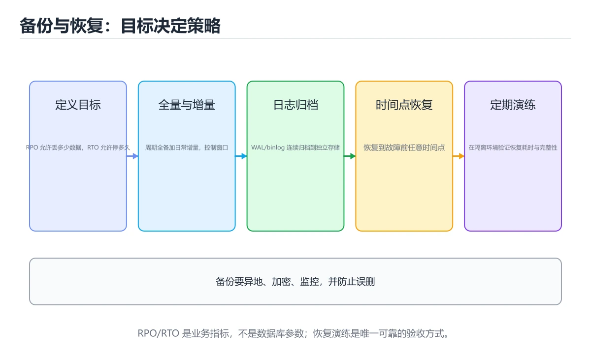
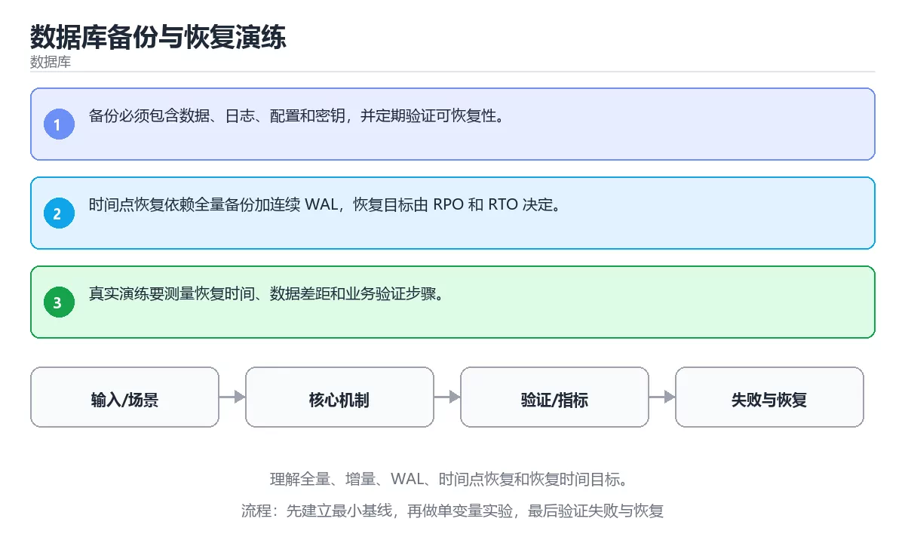

# 数据库备份与恢复演练

> 内容更新时间：2026-10-06 · 学习阶段：高级 · 预计用时：30 分钟





## 学习目标

- 能用自己的话解释：备份必须包含数据、日志、配置和密钥，并定期验证可恢复性。
- 能用自己的话解释：时间点恢复依赖全量备份加连续 WAL，恢复目标由 RPO 和 RTO 决定。
- 能用自己的话解释：真实演练要测量恢复时间、数据差距和业务验证步骤。
- 能把本课知识放回「数据库」，并完成练习与测验。

## 前置知识

- 具备本分类的前置知识，能跑通「数据库备份与恢复演练」的示例并解释输出。
- 本课关键词：备份、恢复、PITR、RTO。
- 遇到不熟悉的术语先记录问题，完成练习后再回读。

## 核心知识

### 1. 备份必须包含数据、日志、配置和密钥，并定期验证可恢复性。

- 关键做法：先让 备份 的最小示例可复现，再加入并发或规模条件。
- 验证标准：last_applied 的输出能被他人复现，边界输入有对应用例。

### 2. 时间点恢复依赖全量备份加连续 WAL，恢复目标由 RPO 和 RTO 决定。

把这条结论放回「数据库备份与恢复演练」的完整流程里展开：

- 正文依据：能用自己的话解释：备份必须包含数据、日志、配置和密钥，并定期验证可恢复性。
- 落地检查：把「2. 时间点恢复依赖全量备份加连续 WAL，恢复目标由 RPO 和 RTO 决定。」改写成一条可执行的核对项，逐条验证输入、超时与失败路径。

### 3. 真实演练要测量恢复时间、数据差距和业务验证步骤。

把这条结论放回「数据库备份与恢复演练」的完整流程里展开：

- 正文依据：能用自己的话解释：时间点恢复依赖全量备份加连续 WAL，恢复目标由 RPO 和 RTO 决定。
- 落地检查：把「3. 真实演练要测量恢复时间、数据差距和业务验证步骤。」改写成一条可执行的核对项，逐条验证输入、超时与失败路径。

## 关键流程

```text
输入 → 校验 → 核心处理 → 验证 → 记录指标 → 失败恢复
```

## 实践路径

1. 用一句话复述本课要解决的问题。
2. 跑通正文中的最小示例并记录基线。
3. 只改变一个输入或参数，预测并验证结果。
4. 补一个失败路径，记录错误、恢复和指标。
5. 把结论写成可复现的笔记或测试。

## 常见错误与排查

> 说明：本表由《数据库备份与恢复演练》的核心知识整理（2026-10-07），人工复核进度见 docs/content_review_batches.md。

| 易错点 | 容易踩的做法 | 正确结论 |
| --- | --- | --- |
| 只做备份不演练恢复 | 真正需要时才发现备份不可用 | 定期在隔离环境完整恢复，并核对关键数据 |
| 备份与日志不配套 | 只能恢复到上一次全量备份点 | 全量加增量日志一起备份，明确恢复点目标 |
| 备份不加密也不校验 | 泄露或损坏都无法及时发现 | 备份加密并记录校验值，定期验证完整性 |

## 动手练习

1. 合上教程，用 3～5 句话解释数据库备份与恢复演练。
2. 从正文选一个例子，改变一个条件并预测结果。
3. 设计一个失败场景，写出止损与恢复步骤。

**验收标准**：留下输入、命令、输出、差异和下一步问题。

## 本课小结

- 本课围绕 备份、恢复、PITR、RTO 展开，复习时重点核对它们的输入、输出和失败路径。
- 把还不确定的 last_applied 行为写成一条可执行验证，再进入下一课。


## 可运行练习

### 任务 1：先跑通，再解释

```sql
WITH wal(lsn, applied) AS (
  VALUES (1, true), (2, true), (3, false)
)
SELECT max(lsn) FILTER (WHERE applied) AS last_applied,
       count(*) FILTER (WHERE NOT applied) AS pending
FROM wal;
```

### 任务 2：只改一个条件

把「数据库备份与恢复演练」的最小示例复制一份，只改一个条件再跑一次：

- 改动点：把 恢复 换成边界值，其他输入保持原样。
- 预测：先写下「数据库备份与恢复演练」在改动后的输出或错误信息，再运行。
- 记录：对照改动前后的结果，指出差异出在哪一步。
- 验收：换回原条件能复现原结果，改动只影响备份。

### 任务 3：迁移到自己的数据

换一个 恢复 场景重做一次，确认结论不是只对示例数据成立。

## 故障现场

### 现场 1：只做备份不演练恢复

**症状**：在《数据库备份与恢复演练》的复现场景中，真正需要时才发现备份不可用。

**根因**：当出现“只做备份不演练恢复”时，执行路径已经绕过了《数据库备份与恢复演练》的关键约束，最终以“真正需要时才发现备份不可用”暴露出来；修复前必须先确认约束在哪里失效。

**修复**：针对《数据库备份与恢复演练》的问题，定期在隔离环境完整恢复，并核对关键数据。

**验证**：保留《数据库备份与恢复演练》里触发“真正需要时才发现备份不可用”的输入、版本和日志，按“定期在隔离环境完整恢复，并核对关键数据”完成修改后原样重放；只有失败现象消失且相邻场景仍可解释，才保留改动。

### 现场 2：备份与日志不配套

**症状**：在《数据库备份与恢复演练》的复现场景中，只能恢复到上一次全量备份点。

**根因**：当出现“备份与日志不配套”时，执行路径已经绕过了《数据库备份与恢复演练》的关键约束，最终以“只能恢复到上一次全量备份点”暴露出来；修复前必须先确认约束在哪里失效。

**修复**：针对《数据库备份与恢复演练》的问题，全量加增量日志一起备份，明确恢复点目标。

**验证**：在《数据库备份与恢复演练》中按“全量加增量日志一起备份，明确恢复点目标”调整后，从“备份与日志不配套”的触发条件重放同一条路径，确认“只能恢复到上一次全量备份点”不再出现，并补一个相邻边界用例检查没有引入新问题。

### 现场 3：备份不加密也不校验

**症状**：在《数据库备份与恢复演练》的复现场景中，泄露或损坏都无法及时发现。

**根因**：触发点是把“备份不加密也不校验”当成安全做法。它没有满足《数据库备份与恢复演练》要求的前提，因此先表现为“泄露或损坏都无法及时发现”；排查时先完整复现这一段，再核对输入、配置与依赖。

**修复**：针对《数据库备份与恢复演练》的问题，备份加密并记录校验值，定期验证完整性。

**验证**：先在《数据库备份与恢复演练》中记录“备份不加密也不校验”留下的失败证据，再执行“备份加密并记录校验值，定期验证完整性”并重放；确认错误路径变为明确结果，且修复没有掩盖同类故障。

## 本课复习清单


离开本课前，逐项确认：

- [ ] 不看解析，能说出「关于「时间点恢复依赖全量备份加连续 WAL，恢复目标由 RPO 和 RTO 决定。」，下列说法正确的是？」的判断依据。
- [ ] 不看解析，能说出「关于「真实演练要测量恢复时间、数据差距和业务验证步骤。」，下列说法正确的是？」的判断依据。
- [ ] 不看解析，能说出「阅读「数据库备份与恢复演练」正文里的这段 SQL 代码，下面哪一项判断是正确的？」的判断依据。
- [ ] 至少运行一次《数据库备份与恢复演练》的示例，记录输入、输出和一个边界情况。
- [ ] 把本课最容易混淆的两个概念写成一句话对照。

| 复盘项 | 记录 |
| --- | --- |
| 已经能独立解释的考点 |  |
| 仍然说不清的概念 |  |
| 下一步验证动作 |  |

## 复习与自测

逐节自检：能说清 备份 的输入、输出与失败路径才算通过，否则回到原文。

### 核心知识

自检：这一节与相邻主题的边界在哪里？

### 动手练习

自检：如果去掉这一节里的一个前提，结论会怎样变化？

### 最小可运行示例

```sql
WITH wal(lsn, applied) AS (
  VALUES (1, true), (2, true), (3, false)
)
SELECT max(lsn) FILTER (WHERE applied) AS last_applied,
       count(*) FILTER (WHERE NOT applied) AS pending
FROM wal;
```

自检：把这一节讲给没学过的人，最需要强调哪一点？

### 预期输出

```text
last_applied | pending
            2 |       1
```

### 验证步骤

制造一次错误输入，记录错误信息与修复方式。

## 术语速查

| 术语 | 一句话说明 |
| --- | --- |
| `备份` | 把数据复制到独立位置，以便原数据损坏或误删后恢复。 |
| `恢复` | 故障后把数据和服务重新带回可用且一致的状态。 |
| `PITR` | Summary: Learn full/incremental backups, WAL, PITR and recovery objectives.。 |
| `RTO` | 把「2. 时间点恢复依赖全量备份加连续 WAL，恢复目标由 RPO 和 RTO 决定。 |

## 深度拓展与实战

这一节把 备份 的定义、last_applied 的代码与常见失败串成一条复习路线。

### 机制拆解

- **1. 备份必须包含数据、日志、配置和密钥，并定期验证可恢复性。**：在「数据库备份与恢复演练」里，「1. 备份必须包含数据、日志、配置和密钥，并定期验证可恢复性。」这一步要先写清输入与预期，再记录实际结果和差异；结果不符时回到对应小节核对前提。
- **2. 时间点恢复依赖全量备份加连续 WAL，恢复目标由 RPO 和 RTO 决定。**：在「数据库备份与恢复演练」里，「2. 时间点恢复依赖全量备份加连续 WAL，恢复目标由 RPO 和 RTO 决定。」这一步要先写清输入与预期，再记录实际结果和差异；结果不符时回到对应小节核对前提。
- **3. 真实演练要测量恢复时间、数据差距和业务验证步骤。**：在「数据库备份与恢复演练」里，「3. 真实演练要测量恢复时间、数据差距和业务验证步骤。」这一步要先写清输入与预期，再记录实际结果和差异；结果不符时回到对应小节核对前提。
- **考点 1：按“数据库备份与恢复演练”中 备份、恢复、PITR 的实践顺序，把四个步骤排成从准备到复盘的合理顺序。**：先独立作答，再回到本课对应小节核对判断依据；答错时记录是哪一个前提被忽略。
- **考点 2：关于「时间点恢复依赖全量备份加连续 WAL，恢复目标由 RPO 和 RTO 决定。」，下列说法正确的是？**：先独立作答，再回到本课对应小节核对判断依据；答错时记录是哪一个前提被忽略。

### 边界条件与常见反例

「数据库备份与恢复演练」的边界不只包括最大最小值，还要覆盖空、重复和失败：

| 条件 | 常见反例 | 处理方式 |
| --- | --- | --- |
| 空输入 | 备份 没有任何取值 | 先判空，给出明确错误而不是继续执行 |
| 边界值 | 恢复 取最小或最大 | 用最小值、最大值和越界值各跑一次 |
| 重复执行 | 同一输入被执行两次 | 保证结果可重复，必要时加锁或去重 |
| 失败路径 | 备份 相关步骤报错 | 保留原始错误，确认回滚或重试行为 |

### 工程检查表

- [ ] 能否用自己的话说明数据库备份与恢复演练解决什么问题，以及它不负责什么？
- [ ] 能否指出 last_applied 最小示例的输入、输出和一条失败路径？
- [ ] 能否解释本课关键词在真实项目中的边界与取舍？
- [ ] 能否把 备份 的方法迁移到相近问题，并说明需要改哪一步？

### 迁移练习

1. 保持正文示例不变，写出它的输入、处理步骤和预期输出。
2. 把 恢复 换成边界值，说明依据后再实际运行。
3. 结合备份、恢复、PITR、RTO，写出一个真实项目中的使用场景。
4. 写下一个反例，说明它在什么条件下会使朴素做法失效。

<!-- p0-depth-v2:start -->

## 零基础精讲：把数据库备份与恢复演练真正讲透

### 先建立一个直觉

把数据库看成一本多人同时改写的账本：先定义事实与约束，再考虑索引、并发和恢复，最后才讨论性能。落到本课，「数据库备份与恢复演练」关心的是 备份 与 恢复 的配合，也就是说这条直觉要在 核心知识 里被具体验证。

本课的摘要可以当作一张地图：理解全量、增量、WAL、时间点恢复和恢复时间目标。

### 逐步拆解

1. 澄清输入与目标。先写清「数据库备份与恢复演练」要解决的问题、合法输入范围和成功标准，再进入后续步骤。
2. 描述处理过程。把「备份、恢复、PITR、RTO」映射到具体步骤，每步都要求能单独验证。
3. 定义输出。明确 备份 与 恢复 各自的产物，以及失败时留下什么证据。
4. 关掉一个看似必要的检查（恢复相关），观察哪个测试或指标先失败，用证据说明它为什么不能省。
5. 用 last_applied 贯穿一次小实验：先预测输出，再运行或逐步推演，最后解释差异来自哪一步。

### 把正文串成一条执行链

- **考点 3：关于「真实演练要测量恢复时间、数据差距和业务验证步骤。」，下列说法正确的是？**：先独立作答，再回到本课对应小节核对判断依据；答错时记录是哪一个前提被忽略。

### 从测验反推易错点

**检查点 1：关于「备份必须包含数据、日志、配置和密钥，并定期验证可恢复性。」，下列说法正确的是？**

- 参考判断：备份必须包含数据、日志、配置和密钥，并定期验证可恢复性。
- 自问：如果去掉题干里的一个限定词，结论还成立吗？

**检查点 2：关于「时间点恢复依赖全量备份加连续 WAL，恢复目标由 RPO 和 RTO 决定。」，下列说法正确的是？**

- 参考判断：时间点恢复依赖全量备份加连续 WAL，恢复目标由 RPO 和 RTO 决定。

**检查点 3：关于「真实演练要测量恢复时间、数据差距和业务验证步骤。」，下列说法正确的是？**

- 参考判断：真实演练要测量恢复时间、数据差距和业务验证步骤。

**检查点 4：本课的核心学习目标是什么？**

- 参考判断：理解全量、增量、WAL、时间点恢复和恢复时间目标。

**检查点 5：以下哪些术语与数据库备份与恢复演练直接相关？（多选）**

- 参考判断：备份、恢复

### 工程排错顺序

| 先查什么 | 要得到的证据 | 判断标准 |
| --- | --- | --- |
| 事务边界是否覆盖全部写操作？ | 日志、输入样例、测试或指标 | 能复现并解释，才算定位 |
| 索引是否匹配真实查询与排序？ | 日志、输入样例、测试或指标 | 能复现并解释，才算定位 |
| 迁移是否可回滚、可灰度、可校验？ | 日志、输入样例、测试或指标 | 能复现并解释，才算定位 |
| 锁等待与慢查询是否有观测？ | 日志、输入样例、测试或指标 | 能复现并解释，才算定位 |

### 变式训练

1. 把 备份 的实现压缩到一个进程内，去掉所有外部依赖后再谈扩展。
2. 把 备份 的输入规模扩大十倍，记录时间、内存和失败路径，找出第一个瓶颈。
3. 制造一次 备份 相关的依赖超时或错误输入，要求错误可解释且不留半完成状态。
5. 减少一个输入字段后重跑 last_applied，记录失败信息出现在哪一层，据此判断这个字段是必填还是可推导。
6. 限制 CPU 与内存上限后重跑 last_applied，观察哪一项参数需要重新设定。

### 本课自测

- [ ] 能用一句话解释「备份」在本课中的角色与边界。
- [ ] 能举出一个正常例子和一个失败例子。
- [ ] 能说出最小验证步骤，以及需要记录的证据。
- [ ] 能用一句话解释「恢复」在本课中的角色与边界。
- [ ] 能用一句话解释「PITR」在本课中的角色与边界。
- [ ] 能用一句话解释「RTO」在本课中的角色与边界。

### 迁移案例库

换一个 恢复 约束重做一次，确认结论在新条件下是否仍然成立。

#### 迁移案例 1：围绕「备份」做一次小实验

**目标**：在不改变课程主体的前提下，验证数据库备份与恢复演练中的一个关键判断。

**步骤**：
1. 复述当前方案对「备份」的假设，写成一句可证伪的话。
2. 设计一个正常输入和一个边界输入，分别预测输出。
3. 运行或逐步演算，记录实际输出、耗时和失败信息。
4. 只调整一个参数，比较前后差异并解释原因。
5. 补充一条测试或复习卡，确保下次能更快复现。

**验收**：至少给出一个反例，说明备份在什么情况下会失效；只写成功案例不算通过。

#### 迁移案例 2：围绕「恢复」做一次小实验

**步骤**：
1. 复述当前方案对「恢复」的假设，写成一句可证伪的话。

#### 迁移案例 3：围绕「PITR」做一次小实验

**步骤**：
1. 复述当前方案对「PITR」的假设，写成一句可证伪的话。

#### 迁移案例 4：围绕「RTO」做一次小实验

**步骤**：
1. 复述当前方案对「RTO」的假设，写成一句可证伪的话。

#### 迁移案例 5：围绕「备份」做一次小实验

**步骤**：

#### 迁移案例 6：围绕「恢复」做一次小实验

**步骤**：

#### 迁移案例 7：围绕「PITR」做一次小实验

**步骤**：

#### 迁移案例 8：围绕「RTO」做一次小实验

**步骤**：

#### 迁移案例 9：围绕「备份」做一次小实验

**步骤**：

#### 迁移案例 10：围绕「恢复」做一次小实验

**步骤**：

#### 迁移案例 11：围绕「PITR」做一次小实验

**步骤**：

#### 迁移案例 12：围绕「RTO」做一次小实验

**步骤**：

#### 迁移案例 13：围绕「备份」做一次小实验

**步骤**：

#### 迁移案例 14：围绕「恢复」做一次小实验

**步骤**：

#### 迁移案例 15：围绕「PITR」做一次小实验

**步骤**：

#### 迁移案例 16：围绕「RTO」做一次小实验

**步骤**：

<!-- p0-depth-v2:end -->

## 考点精讲

### 考点 1：顺序排列·备份

- **题目**：按“数据库备份与恢复演练”中 备份、恢复、PITR 的实践顺序，把四个步骤排成从准备到复盘的合理顺序。
- **判断依据**：在「数据库备份与恢复演练」里，在本课的练习里，顺序应当是：先明确 备份 的输入、输出与约束 → 写出最小示例并核对 恢复 的基线结果 → 只改一个变量，记录边界与失败路径的变化 → 固定版本与证据，把本课的结论写成可复现记录。这个顺序把 备份 的输入、输出和约束放在最前面，在数据库备份与恢复演练里避免概念没对齐就开始调参。第二步用 恢复 建立可核对的基线，在数据库备份与恢复演练里第三步才允许改变一个变量并观察失败路径。

### 考点 2：概念判断·备份

- **题目**：关于「时间点恢复依赖全量备份加连续 WAL，恢复目标由 RPO 和 RTO 决定。」，下列说法正确的是？
- **判断依据**：在「数据库备份与恢复演练」里，时间点恢复依赖全量备份加连续 WAL，恢复目标由 RPO 和 RTO 决定。回到「数据库备份与恢复演练」的正文示例，用“关于时间点恢复依赖全量备份加连续 W”走一遍备份、恢复、PITR的完整流程，能复现的结论才可以保留。

### 考点 3：概念判断·备份

- **题目**：关于「真实演练要测量恢复时间、数据差距和业务验证步骤。」，下列说法正确的是？
- **判断依据**：在「数据库备份与恢复演练」里，真实演练要测量恢复时间、数据差距和业务验证步骤。在「数据库备份与恢复演练」里判断这道题，要把备份、恢复、PITR的条件、过程与失败路径逐项对齐，换成“关于真实演练要测量恢复时间、数据差距”这个场景，只有满足前提的结论才成立。“真实演练要测量恢复时间”与「数据库备份与恢复演练」的术语表相呼应，只有符合备份、恢复、PITR约束的“真实演练要测量恢复时间”才是正文支持的结论。

### 考点 4：代码补全·备份

- **题目**：阅读「数据库备份与恢复演练」正文里的这段 SQL 代码，下面哪一项判断是正确的？
- **判断依据**：在「数据库备份与恢复演练」里，题干的正确项是这段代码只做静态声明，没有循环、分支或可观察输出，在「数据库备份与恢复演练」里它只能证明备份相关约束存在，不能替代真实运行证据。把输入或边界换成空值、极值或失败情况后，结论要以「数据库备份与恢复演练」的实际运行结果为准。「数据库备份与恢复演练」要求先交代备份、恢复、PITR的前提再下结论，所以“这段代码只做静态声明，没有循环”只在题干“阅读数据库备份与恢复演练正文里的这段 SQL 代码”给定的条件下成立。

### 考点 5：多选辨析·备份

- **题目**：以下哪些术语与「数据库备份与恢复演练」直接相关？（多选）
- **判断依据**：恢复。「数据库备份与恢复演练」要求先交代备份、恢复、PITR的前提再下结论，所以“备份”只在题干“以下哪些术语与数据库备份与恢复演练直接相关”给定的条件下成立。回到备份、恢复、PITR本身再看一遍：只有“备份”与题干“以下哪些术语与直接相关（多选）”的前提一致，结论才成立。

## English Overview

**Title:** Database Backup and Recovery Drills

**Summary:** Learn full/incremental backups, WAL, PITR and recovery objectives.

**Category:** Database
**Level:** 高级
**Key terms:** 备份, 恢复, PITR, RTO

## 内容元数据

- 内容版本：v2.0
- 最后更新：2026-10-06
- 学习阶段：高级
- 适用环境：PostgreSQL / MySQL / SQLite 等主流数据库；本课聚焦其中的 备份。
- 内容来源：内置结构化课程与工程实践整理
- 相关主题：备份、恢复、PITR、RTO
- 质量版本：P0 测验标准 + P1 覆盖扩展 + P2 体验补全

## 最小可运行示例

下面示例用于验证 备份 的最小输入、处理和输出。先原样运行，再只修改一个值：

```sql
WITH wal(lsn, applied) AS (
  VALUES (1, true), (2, true), (3, false)
)
SELECT max(lsn) FILTER (WHERE applied) AS last_applied,
       count(*) FILTER (WHERE NOT applied) AS pending
FROM wal;
```

## 预期输出

```text
last_applied | pending
            2 |       1
```

## 验证步骤

1. 记录运行环境、命令和真实输出。
2. 修改一个输入，先写预测再运行。
4. 把结论写回本课笔记或测试用例。

## 参考资料与复核

- 最后复核：2026-10-04
- 下次复核：2027-06-10
- 复核范围：版本兼容、API 行为、安全建议与工程实践
- 来源性质：官方文档、标准或权威教材；正文为离线教学重组

| 参考资料 | 本课用途 |
| --- | --- |
| [JDBC 事务](https://docs.oracle.com/javase/tutorial/jdbc/basics/transactions.html) | 连接事务与回滚 |
| [MySQL 文档](https://dev.mysql.com/doc/) | 关系数据库与 InnoDB |
| [SQL 标准概览](https://www.iso.org/standard/76583.html) | SQL 标准范围 |

> 「数据库备份与恢复演练」的链接用于离线阅读后的延伸核对；App 不会自动联网。

## 复习与迁移

复习目标：把「数据库备份与恢复演练」的判断标准放回可复现的例子里。先自己作答，再对照依据；如果结论正确但理由不完整，回到正文补足前提。

### 概念复述

- 用一句话说明「数据库备份与恢复演练」解决什么问题：理解全量、增量、WAL、时间点恢复和恢复时间目标。
- 写出备份、恢复、PITR之间的关系，并各举一个例子。
- 说出本课最容易混淆的两个概念，以及区分它们的判据。

### 正文逐节复核

- **零基础精讲：把数据库备份与恢复演练真正讲透**：把数据库看成一本多人同时改写的账本：先定义事实与约束，再考虑索引、并发和恢复，最后才讨论性能。

### 测验回顾

1. 按“数据库备份与恢复演练”中 备份、恢复、PITR 的实践顺序，把四个步骤排成从准备到复盘的合理顺序。
   - 依据：在「数据库备份与恢复演练」里，在本课的练习里，顺序应当是：先明确 备份 的输入、输出与约束 → 写出最小示例并核对 恢复 的基线结果 → 只改一个变量，记录边界与失败路径的变化 → 固定版本与证据，把本课的结论写成可复现记录。这个顺序把 备份 的输入、输出和约束放在最前面，在数据库备份与恢复演练里避免概念没对齐就开始调参。第二步用 恢复 建立可核对的基线，在数据库备份与恢复演练里第三步才允许改变一个变量并观察失败路径。
2. 关于「时间点恢复依赖全量备份加连续 WAL，恢复目标由 RPO 和 RTO 决定。」，下列说法正确的是？
   - 依据：在「数据库备份与恢复演练」里，时间点恢复依赖全量备份加连续 WAL，恢复目标由 RPO 和 RTO 决定。回到「数据库备份与恢复演练」的正文示例，用“关于时间点恢复依赖全量备份加连续 W”走一遍备份、恢复、PITR的完整流程，能复现的结论才可以保留。
3. 关于「真实演练要测量恢复时间、数据差距和业务验证步骤。」，下列说法正确的是？
   - 依据：在「数据库备份与恢复演练」里，真实演练要测量恢复时间、数据差距和业务验证步骤。在「数据库备份与恢复演练」里判断这道题，要把备份、恢复、PITR的条件、过程与失败路径逐项对齐，换成“关于真实演练要测量恢复时间、数据差距”这个场景，只有满足前提的结论才成立。“真实演练要测量恢复时间”与「数据库备份与恢复演练」的术语表相呼应，只有符合备份、恢复、PITR约束的“真实演练要测量恢复时间”才是正文支持的结论。
4. 阅读「数据库备份与恢复演练」正文里的这段 SQL 代码，下面哪一项判断是正确的？
   - 依据：在「数据库备份与恢复演练」里，题干的正确项是这段代码只做静态声明，没有循环、分支或可观察输出，在「数据库备份与恢复演练」里它只能证明备份相关约束存在，不能替代真实运行证据。把输入或边界换成空值、极值或失败情况后，结论要以「数据库备份与恢复演练」的实际运行结果为准。「数据库备份与恢复演练」要求先交代备份、恢复、PITR的前提再下结论，所以“这段代码只做静态声明，没有循环”只在题干“阅读数据库备份与恢复演练正文里的这段 SQL 代码”给定的条件下成立。
5. 以下哪些术语与「数据库备份与恢复演练」直接相关？（多选）
   - 依据：恢复。「数据库备份与恢复演练」要求先交代备份、恢复、PITR的前提再下结论，所以“备份”只在题干“以下哪些术语与数据库备份与恢复演练直接相关”给定的条件下成立。回到备份、恢复、PITR本身再看一遍：只有“备份”与题干“以下哪些术语与直接相关（多选）”的前提一致，结论才成立。

### 迁移练习

把「数据库备份与恢复演练」的结论迁移到相邻主题，每次迁移都写清预测与证据：

1. 换输入：用备份处理一组你自己的数据，对比教材示例的结果差异。
2. 换失败条件：制造一个恢复相关的错误，说明如何从错误信息定位根因。
3. 换规模：把数据量或并发度提高一个数量级，说明「数据库备份与恢复演练」的结论是否仍成立。
