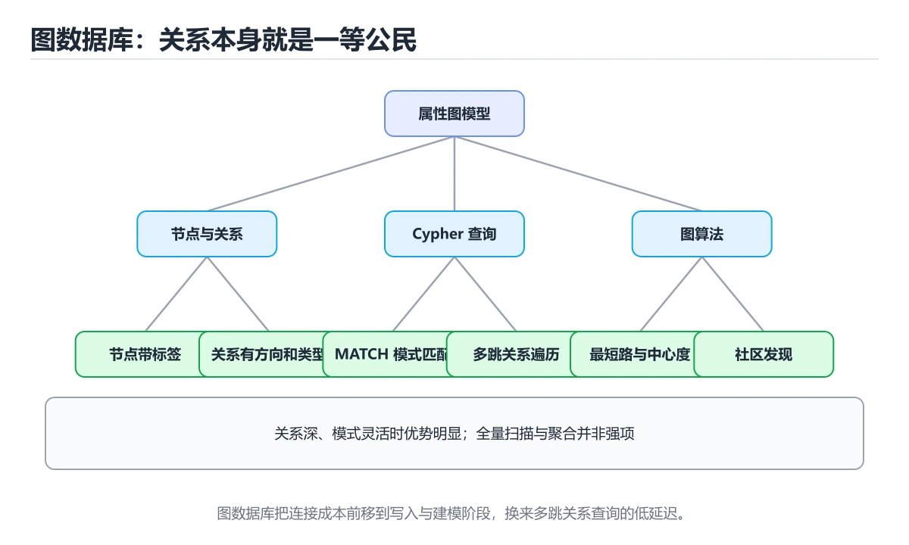
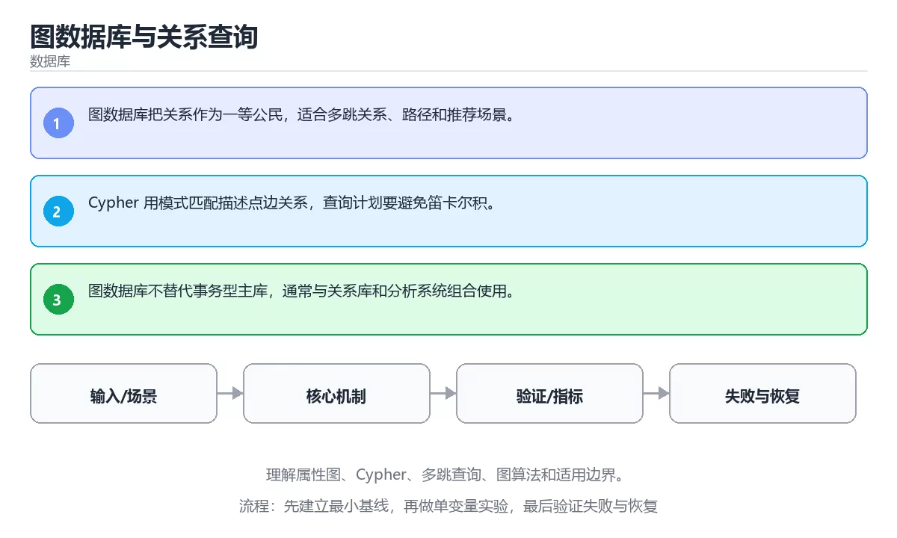

# 图数据库与关系查询

> 内容更新时间：2026-10-06 · 学习阶段：高级 · 预计用时：35 分钟





## 学习目标

- 能用自己的话解释：图数据库把关系作为一等公民，适合多跳关系、路径和推荐场景。
- 能用自己的话解释：Cypher 用模式匹配描述点边关系，查询计划要避免笛卡尔积。
- 能用自己的话解释：图数据库不替代事务型主库，通常与关系库和分析系统组合使用。
- 能把本课知识放回「数据库」，并完成练习与测验。

## 前置知识

- 能运行 RECURSIVE 所在的示例环境，并读懂报错信息。
- 本课关键词：图数据库、Cypher、多跳、关系。
- 遇到不熟悉的术语先记录问题，完成练习后再回读。

## 核心知识

### 1. 图数据库把关系作为一等公民，适合多跳关系、路径和推荐场景。

- 关键做法：先用 RECURSIVE 建立 图数据库 的基线，再逐步加入边界与失败条件。
- 验证标准：RECURSIVE 的输出能被他人复现，边界输入有对应用例。

### 2. Cypher 用模式匹配描述点边关系，查询计划要避免笛卡尔积。

把这条结论放回「图数据库与关系查询」的完整流程里展开：

- 正文依据：能用自己的话解释：图数据库把关系作为一等公民，适合多跳关系、路径和推荐场景。
- 落地检查：把「2. Cypher 用模式匹配描述点边关系，查询计划要避免笛卡尔积。」改写成一条可执行的核对项，逐条验证输入、超时与失败路径。

### 3. 图数据库不替代事务型主库，通常与关系库和分析系统组合使用。

把这条结论放回「图数据库与关系查询」的完整流程里展开：

- 正文依据：能用自己的话解释：Cypher 用模式匹配描述点边关系，查询计划要避免笛卡尔积。
- 落地检查：把「3. 图数据库不替代事务型主库，通常与关系库和分析系统组合使用。」改写成一条可执行的核对项，逐条验证输入、超时与失败路径。

## 关键流程

```text
输入 → 校验 → 核心处理 → 验证 → 记录指标 → 失败恢复
```

## 实践路径

1. 用一句话复述本课要解决的问题。
2. 跑通正文中的最小示例并记录基线。
3. 只改变一个输入或参数，预测并验证结果。
4. 补一个失败路径，记录错误、恢复和指标。
5. 把结论写成可复现的笔记或测试。

## 常见错误与排查

> 说明：本表由《图数据库与关系查询》的核心知识整理（2026-10-07），人工复核进度见 docs/content_review_batches.md。

| 易错点 | 容易踩的做法 | 正确结论 |
| --- | --- | --- |
| 把图查询当多表连接 | 多跳查询性能急剧下降 | 按图模型建模，使用图数据库的多跳与路径语义 |
| 关系没有方向与类型 | 查询语义含糊，结果不可解释 | 为边定义类型与方向，并写清允许的路径模式 |
| 入口属性没有索引 | 每次查询都全表扫描 | 为高频入口属性建立索引并观察命中情况 |

## 动手练习

1. 合上教程，用 3～5 句话解释图数据库与关系查询。
2. 从正文选一个例子，改变一个条件并预测结果。
3. 设计一个失败场景，写出止损与恢复步骤。

**验收标准**：留下输入、命令、输出、差异和下一步问题。

## 本课小结

- 本课围绕 图数据库、Cypher、多跳、关系 展开，复习时重点核对它们的输入、输出和失败路径。
- 把还不确定的 RECURSIVE 行为写成一条可执行验证，再进入下一课。


## 可运行练习

### 任务 1：先跑通，再解释

```sql
WITH RECURSIVE edges(src, dst) AS (
  VALUES ('a', 'b'), ('b', 'c'), ('c', 'd')
), walk(node, depth) AS (
  SELECT 'a', 0
  UNION ALL
  SELECT edges.dst, walk.depth + 1
  FROM edges
  JOIN walk ON edges.src = walk.node
)
SELECT node, depth FROM walk ORDER BY depth;
```

### 任务 2：只改一个条件

把「图数据库与关系查询」的最小示例复制一份，只改一个条件再跑一次：

- 改动点：把 Cypher 换成边界值，其他输入保持原样。
- 预测：先写下「图数据库与关系查询」在改动后的输出或错误信息，再运行。
- 记录：对照改动前后的结果，指出差异出在哪一步。
- 验收：换回原条件能复现原结果，改动只影响图数据库。

### 任务 3：迁移到自己的数据

把 RECURSIVE 换成你自己的输入，先保持步骤不变，再比较输出差异。

## 故障现场

### 现场 1：把图查询当多表连接

**症状**：在《图数据库与关系查询》的复现场景中，多跳查询性能急剧下降。

**根因**：“多跳查询性能急剧下降”只是表层结果。向上追溯会落到“把图查询当多表连接”这一步，因为它省略了《图数据库与关系查询》的约束，使实现行为和预期模型发生了偏离。

**修复**：针对《图数据库与关系查询》的问题，按图模型建模，使用图数据库的多跳与路径语义。

**验证**：先在《图数据库与关系查询》中记录“把图查询当多表连接”留下的失败证据，再执行“按图模型建模，使用图数据库的多跳与路径语义”并重放；确认错误路径变为明确结果，且修复没有掩盖同类故障。

### 现场 2：关系没有方向与类型

**症状**：在《图数据库与关系查询》的复现场景中，查询语义含糊，结果不可解释。

**根因**：触发点是把“关系没有方向与类型”当成安全做法。它没有满足《图数据库与关系查询》要求的前提，因此先表现为“查询语义含糊，结果不可解释”；排查时先完整复现这一段，再核对输入、配置与依赖。

**修复**：针对《图数据库与关系查询》的问题，为边定义类型与方向，并写清允许的路径模式。

**验证**：先在《图数据库与关系查询》中记录“关系没有方向与类型”留下的失败证据，再执行“为边定义类型与方向，并写清允许的路径模式”并重放；确认错误路径变为明确结果，且修复没有掩盖同类故障。

### 现场 3：入口属性没有索引

**症状**：在《图数据库与关系查询》的复现场景中，每次查询都全表扫描。

**根因**：触发点是把“入口属性没有索引”当成安全做法。它没有满足《图数据库与关系查询》要求的前提，因此先表现为“每次查询都全表扫描”；排查时先完整复现这一段，再核对输入、配置与依赖。

**修复**：针对《图数据库与关系查询》的问题，为高频入口属性建立索引并观察命中情况。

**验证**：在《图数据库与关系查询》中按“为高频入口属性建立索引并观察命中情况”调整后，从“入口属性没有索引”的触发条件重放同一条路径，确认“每次查询都全表扫描”不再出现，并补一个相邻边界用例检查没有引入新问题。

## 本课复习清单


离开本课前，逐项确认：

- [ ] 不看解析，能说出「关于「Cypher 用模式匹配描述点边关系，查询计划要避免笛卡尔积。」，下列说法正确的是？」的判断依据。
- [ ] 不看解析，能说出「关于「图数据库不替代事务型主库，通常与关系库和分析系统组合使用。」，下列说法正确的是？」的判断依据。
- [ ] 不看解析，能说出「「图数据库与关系查询」的核心学习目标是什么？」的判断依据。
- [ ] 至少运行一次《图数据库与关系查询》的示例，记录输入、输出和一个边界情况。
- [ ] 把本课最容易混淆的两个概念写成一句话对照。

| 复盘项 | 记录 |
| --- | --- |
| 已经能独立解释的考点 |  |
| 仍然说不清的概念 |  |
| 下一步验证动作 |  |

## 复习与自测

逐节自检：能说清 图数据库 的输入、输出与失败路径才算通过，否则回到原文。

### 核心知识

自检：这一节与相邻主题的边界在哪里？

### 动手练习

自检：如果去掉这一节里的一个前提，结论会怎样变化？

### 最小可运行示例

```sql
WITH RECURSIVE edges(src, dst) AS (
  VALUES ('a', 'b'), ('b', 'c'), ('c', 'd')
), walk(node, depth) AS (
  SELECT 'a', 0
  UNION ALL
  SELECT edges.dst, walk.depth + 1
  FROM edges
  JOIN walk ON edges.src = walk.node
)
SELECT node, depth FROM walk ORDER BY depth;
```

自检：把这一节讲给没学过的人，最需要强调哪一点？

### 预期输出

```text
node | depth
a    |     0
b    |     1
c    |     2
d    |     3
```

### 验证步骤

制造一次错误输入，记录错误信息与修复方式。

## 术语速查

| 术语 | 一句话说明 |
| --- | --- |
| `图数据库` | 图数据库把关系作为一等公民，适合多跳关系、路径和推荐场景。 |
| `Cypher` | 图数据库的声明式查询语言，用 (节点)-[关系]->(节点) 的图形语法描述模式匹配。 |
| `多跳` | 按“图数据库与关系查询”中 图数据库、Cypher、多跳 的实践顺序，把四个步骤排成从准备到复盘的合理顺序。 |
| `关系` | 关系数据库中由行和列组成的表，以及表之间通过键建立的关联。 |

## 深度拓展与实战

这一节把 图数据库 的定义、RECURSIVE 的代码与常见失败串成一条复习路线。

### 机制拆解

- **1. 图数据库把关系作为一等公民，适合多跳关系、路径和推荐场景。**：在「图数据库与关系查询」里，「1. 图数据库把关系作为一等公民，适合多跳关系、路径和推荐场景。」这一步要先写清输入与预期，再记录实际结果和差异；结果不符时回到对应小节核对前提。
- **2. Cypher 用模式匹配描述点边关系，查询计划要避免笛卡尔积。**：在「图数据库与关系查询」里，「2. Cypher 用模式匹配描述点边关系，查询计划要避免笛卡尔积。」这一步要先写清输入与预期，再记录实际结果和差异；结果不符时回到对应小节核对前提。
- **3. 图数据库不替代事务型主库，通常与关系库和分析系统组合使用。**：在「图数据库与关系查询」里，「3. 图数据库不替代事务型主库，通常与关系库和分析系统组合使用。」这一步要先写清输入与预期，再记录实际结果和差异；结果不符时回到对应小节核对前提。
- **考点 1：按“图数据库与关系查询”中 图数据库、Cypher、多跳 的实践顺序，把四个步骤排成从准备到复盘的合理顺序。**：先独立作答，再回到本课对应小节核对判断依据；答错时记录是哪一个前提被忽略。
- **考点 2：关于「Cypher 用模式匹配描述点边关系，查询计划要避免笛卡尔积。」，下列说法正确的是？**：先独立作答，再回到本课对应小节核对判断依据；答错时记录是哪一个前提被忽略。

### 边界条件与常见反例

「图数据库与关系查询」的边界不只包括最大最小值，还要覆盖空、重复和失败：

| 条件 | 常见反例 | 处理方式 |
| --- | --- | --- |
| 空输入 | 图数据库 没有任何取值 | 先判空，给出明确错误而不是继续执行 |
| 边界值 | Cypher 取最小或最大 | 用最小值、最大值和越界值各跑一次 |
| 重复执行 | 同一输入被执行两次 | 保证结果可重复，必要时加锁或去重 |
| 失败路径 | 图数据库 相关步骤报错 | 保留原始错误，确认回滚或重试行为 |

### 工程检查表

- [ ] 能否用自己的话说明图数据库与关系查询解决什么问题，以及它不负责什么？
- [ ] 能否用「图数据库与关系查询」的最小示例复现一次失败并解释原因？
- [ ] 能否解释本课关键词在真实项目中的边界与取舍？
- [ ] 能否把 图数据库 的方法迁移到相近问题，并说明需要改哪一步？

### 迁移练习

1. 保持正文示例不变，写出它的输入、处理步骤和预期输出。
2. 把 Cypher 换成边界值，说明依据后再实际运行。
3. 结合图数据库、Cypher、多跳、关系，写出一个真实项目中的使用场景。
4. 写下一个反例，说明它在什么条件下会使朴素做法失效。

## 考点精讲

### 考点 1：顺序排列·图数据库

- **题目**：按“图数据库与关系查询”中 图数据库、Cypher、多跳 的实践顺序，把四个步骤排成从准备到复盘的合理顺序。
- **判断依据**：在「图数据库与关系查询」里，在本课的练习里，顺序应当是：先明确 图数据库 的输入、输出与约束 → 写出最小示例并核对 Cypher 的基线结果 → 只改一个变量，记录边界与失败路径的变化 → 固定版本与证据，把本课的结论写成可复现记录。这个顺序把 图数据库 的输入、输出和约束放在最前面，在图数据库与关系查询里避免概念没对齐就开始调参。第二步用 Cypher 建立可核对的基线，在图数据库与关系查询里第三步才允许改变一个变量并观察失败路径。

### 考点 2：概念判断·图数据库

- **题目**：关于「Cypher 用模式匹配描述点边关系，查询计划要避免笛卡尔积。」，下列说法正确的是？
- **判断依据**：在「图数据库与关系查询」里，Cypher 用模式匹配描述点边关系，查询计划要避免笛卡尔积。「图数据库与关系查询」要求先交代图数据库、Cypher、多跳的前提再下结论，所以“Cypher 用模式匹配描述点边关系”只在题干“Cypher 用模式匹配描述点边关系”给定的条件下成立。把“Cypher 用模式匹配描述点边关系”代回「图数据库与关系查询」里“Cypher 用模式匹配描述点边关系”的例子核对，条件一旦改变，结论就要用图数据库、Cypher、多跳重新推导。

### 考点 3：概念判断·图数据库

- **题目**：关于「图数据库不替代事务型主库，通常与关系库和分析系统组合使用。」，下列说法正确的是？
- **判断依据**：在「图数据库与关系查询」里，图数据库不替代事务型主库，通常与关系库和分析系统组合使用。在「图数据库与关系查询」里，如果只凭关键词作答，很容易把扩展、分区、逻辑复制和连接池是生产部署的重要组成。回到「图数据库与关系查询」的正文示例，用“关于图数据库不替代事务型主库”走一遍图数据库、Cypher、多跳的完整流程，能复现的结论才可以保留。

### 考点 4：概念判断·图数据库

- **题目**：「图数据库与关系查询」的核心学习目标是什么？
- **判断依据**：在「图数据库与关系查询」里，结论应落在「理解属性图、Cypher、多跳查询、图算法和适用边界」。在「图数据库与关系查询」里，结论应落在理解属性图、Cypher、多跳查询、图算法和适用边界。在「图数据库与关系查询」里，这道题要求区分概念与边界，理解属性图、Cypher、多跳查询、图算法和适用边界。

### 考点 5：多选辨析·图数据库

- **题目**：以下哪些术语与「图数据库与关系查询」直接相关？（多选）
- **判断依据**：在「图数据库与关系查询」里，图数据库；Cypher。回到「图数据库与关系查询」的正文示例，用“以下哪些术语与图数据库与关系查询直接”走一遍图数据库、Cypher、多跳的完整流程，能复现的结论才可以保留。回到正文示例，用“以下哪些术语与直接相关（多选）”走一遍图数据库、Cypher、多跳的完整流程，能复现的结论才可以保留。

### 考点 6：排错·图数据库

- **题目**：阅读「图数据库与关系查询」的代码片段，下面哪项判断是正确的？
- **判断依据**：在「图数据库与关系查询」里，题干的正确项是图数据库把关系作为一等公民，适合多跳关系、路径和推荐场景。“阅读图数据库与关系查询的代码片段”与「图数据库与关系查询」的术语表相呼应，只有符合图数据库、Cypher、多跳约束的“图数据库把关系作为一等公民”才是正文支持的结论。

## English Overview

**Title:** Graph Databases and Relationship Queries

**Summary:** Learn property graphs, Cypher, multi-hop queries, graph algorithms and boundaries.

**Category:** Database
**Level:** 高级
**Key terms:** 图数据库, Cypher, 多跳, 关系

## 内容元数据

- 内容版本：v2.0
- 最后更新：2026-10-06
- 学习阶段：高级
- 适用环境：PostgreSQL / MySQL / SQLite 等主流数据库；本课聚焦其中的 图数据库。
- 内容来源：内置结构化课程与工程实践整理
- 相关主题：图数据库、Cypher、多跳、关系
- 质量版本：P0 测验标准 + P1 覆盖扩展 + P2 体验补全

## 最小可运行示例

先用下面的示例确认 图数据库 的基线，再只改一个与 Cypher 相关的值：

```sql
WITH RECURSIVE edges(src, dst) AS (
  VALUES ('a', 'b'), ('b', 'c'), ('c', 'd')
), walk(node, depth) AS (
  SELECT 'a', 0
  UNION ALL
  SELECT edges.dst, walk.depth + 1
  FROM edges
  JOIN walk ON edges.src = walk.node
)
SELECT node, depth FROM walk ORDER BY depth;
```

## 预期输出

```text
node | depth
a    |     0
b    |     1
c    |     2
d    |     3
```

## 验证步骤

1. 记录运行环境、命令和真实输出。
2. 修改一个输入，先写预测再运行。
4. 把结论写回本课笔记或测试用例。

## 参考资料与复核

- 最后复核：2026-10-04
- 下次复核：2027-06-17
- 复核范围：版本兼容、API 行为、安全建议与工程实践
- 来源性质：官方文档、标准或权威教材；正文为离线教学重组

| 参考资料 | 本课用途 |
| --- | --- |
| [MySQL 文档](https://dev.mysql.com/doc/) | 关系数据库与 InnoDB |
| [PostgreSQL 事务教程](https://www.postgresql.org/docs/current/tutorial-transactions.html) | ACID 与隔离级别 |
| [PostgreSQL 文档](https://www.postgresql.org/docs/) | SQL、索引、事务与并发 |

> 「图数据库与关系查询」的链接用于离线阅读后的延伸核对；App 不会自动联网。

## 复习与迁移

复习目标：把「图数据库与关系查询」的判断标准放回可复现的例子里。先自己作答，再对照依据；如果结论正确但理由不完整，回到正文补足前提。

### 概念复述

- 用一句话说明「图数据库与关系查询」解决什么问题：理解属性图、Cypher、多跳查询、图算法和适用边界。
- 写出图数据库、Cypher、多跳之间的关系，并各举一个例子。
- 说出本课最容易混淆的两个概念，以及区分它们的判据。

### 测验回顾

1. 按“图数据库与关系查询”中 图数据库、Cypher、多跳 的实践顺序，把四个步骤排成从准备到复盘的合理顺序。
   - 依据：在「图数据库与关系查询」里，在本课的练习里，顺序应当是：先明确 图数据库 的输入、输出与约束 → 写出最小示例并核对 Cypher 的基线结果 → 只改一个变量，记录边界与失败路径的变化 → 固定版本与证据，把本课的结论写成可复现记录。这个顺序把 图数据库 的输入、输出和约束放在最前面，在图数据库与关系查询里避免概念没对齐就开始调参。第二步用 Cypher 建立可核对的基线，在图数据库与关系查询里第三步才允许改变一个变量并观察失败路径。
2. 关于「Cypher 用模式匹配描述点边关系，查询计划要避免笛卡尔积。」，下列说法正确的是？
   - 依据：在「图数据库与关系查询」里，Cypher 用模式匹配描述点边关系，查询计划要避免笛卡尔积。「图数据库与关系查询」要求先交代图数据库、Cypher、多跳的前提再下结论，所以“Cypher 用模式匹配描述点边关系”只在题干“Cypher 用模式匹配描述点边关系”给定的条件下成立。把“Cypher 用模式匹配描述点边关系”代回「图数据库与关系查询」里“Cypher 用模式匹配描述点边关系”的例子核对，条件一旦改变，结论就要用图数据库、Cypher、多跳重新推导。
3. 关于「图数据库不替代事务型主库，通常与关系库和分析系统组合使用。」，下列说法正确的是？
   - 依据：在「图数据库与关系查询」里，图数据库不替代事务型主库，通常与关系库和分析系统组合使用。在「图数据库与关系查询」里，如果只凭关键词作答，很容易把扩展、分区、逻辑复制和连接池是生产部署的重要组成。回到「图数据库与关系查询」的正文示例，用“关于图数据库不替代事务型主库”走一遍图数据库、Cypher、多跳的完整流程，能复现的结论才可以保留。
4. 「图数据库与关系查询」的核心学习目标是什么？
   - 依据：在「图数据库与关系查询」里，结论应落在「理解属性图、Cypher、多跳查询、图算法和适用边界」。在「图数据库与关系查询」里，结论应落在理解属性图、Cypher、多跳查询、图算法和适用边界。在「图数据库与关系查询」里，这道题要求区分概念与边界，理解属性图、Cypher、多跳查询、图算法和适用边界。
5. 以下哪些术语与「图数据库与关系查询」直接相关？（多选）
   - 依据：在「图数据库与关系查询」里，图数据库；Cypher。回到「图数据库与关系查询」的正文示例，用“以下哪些术语与图数据库与关系查询直接”走一遍图数据库、Cypher、多跳的完整流程，能复现的结论才可以保留。回到正文示例，用“以下哪些术语与直接相关（多选）”走一遍图数据库、Cypher、多跳的完整流程，能复现的结论才可以保留。
6. 阅读「图数据库与关系查询」的代码片段，下面哪项判断是正确的？
   - 依据：在「图数据库与关系查询」里，题干的正确项是图数据库把关系作为一等公民，适合多跳关系、路径和推荐场景。“阅读图数据库与关系查询的代码片段”与「图数据库与关系查询」的术语表相呼应，只有符合图数据库、Cypher、多跳约束的“图数据库把关系作为一等公民”才是正文支持的结论。

### 迁移练习

把「图数据库与关系查询」的结论迁移到相邻主题，每次迁移都写清预测与证据：

1. 换输入：用图数据库处理一组你自己的数据，对比教材示例的结果差异。
2. 换失败条件：制造一个Cypher相关的错误，说明如何从错误信息定位根因。
3. 换规模：把数据量或并发度提高一个数量级，说明「图数据库与关系查询」的结论是否仍成立。

## 工程化精练：决策、失败与验证

这一章把「图数据库与关系查询」从“看懂”推进到“能判断、能验证、能排错”。所有判断都围绕图数据库、Cypher与多跳展开，并与前文的示例、测验和失败现场互相对照。

### 一、图数据库 的判断算法

| 步骤 | 要回答的问题 | 判断依据 | 记录什么 |
| --- | --- | --- | --- |
| 1. 定目标 | 「图数据库与关系查询」这一步要解决什么问题？ | 把图数据库的目标写成一句可验证的结论 | 输入、约束、成功标准 |
| 2. 找边界 | Cypher在什么条件下失效？ | 先列空值、极值、重复和失败路径 | 反例与触发条件 |
| 3. 跑基线 | 原始示例的真实输出是什么？ | 命令、版本和环境必须可复现 | 命令、输出、耗时 |
| 4. 只改一处 | 把多跳换成另一种取值会怎样？ | 预测写在运行之前 | 预测与实际的差异 |
| 5. 回写结论 | 结论能否被他人复现？ | 把判断写成清单或测试 | 结论、证据、遗留问题 |

这张表的用法不是从上到下浏览，而是每次只填一行：先用「图数据库与关系查询」前文的示例验证第 3 行，再故意破坏一个条件验证第 2 行。当你能在不看解析的情况下说出图数据库的判断依据，才算真正掌握本课。

- 先从图数据库入手：把它写成“输入是什么、输出是什么、哪一步最容易出错”。如果这三句话中有一句说不清，说明对「图数据库与关系查询」的理解还停留在术语层面，需要回到正文的最小示例重新观察一次。

- 再把Cypher当成对照实验的变量：固定其他条件，只改变它的取值，记录输出是否变化。结论“变”或“不变”都要写出理由，并说明这个理由能否被他人独立复现。

- 针对多跳做一次失败演练：故意给出空值、极值或错误类型，观察「图数据库与关系查询」的报错位置和处理方式。错误信息只是入口，真正要定位的是哪一层假设被破坏。

- 把「图数据库与关系查询」的结论压缩成一条可执行清单：先检查输入，再检查版本与环境，然后跑最小用例，最后才扩大规模。顺序颠倒会让排错范围成倍增加。

- 如果结论依赖时间或规模，就把数据量提高一个数量级再跑一次。在「图数据库与关系查询」里，小样本成立不代表大样本成立，复杂度、资源占用和失败率都要重新记录。

- 如果结论依赖并发或共享状态，就固定输入并连续运行多次。结果不一致时，优先怀疑「图数据库与关系查询」中图数据库相关步骤的隐藏状态，而不是先改代码。

- 把「图数据库与关系查询」的判断写成测试：一个正常用例、一个边界用例、一个失败用例。测试通过只是起点，还要确认失败用例确实以预期方式失败。

- 把本课与相邻主题连起来：图数据库解决的是“怎么做”，Cypher回答“什么时候不适用”。两者都答得出来，迁移才算完成。

> 第 2 轮复核「图数据库与关系查询」：把上面的结论逐条改写为可验证的问题，并记录仍不确定的部分。

- 先从图数据库入手：把它写成“输入是什么、输出是什么、哪一步最容易出错”。如果这三句话中有一句说不清，说明对「图数据库与关系查询」的理解还停留在术语层面，需要回到正文的最小示例重新观察一次。

- 再把Cypher当成对照实验的变量：固定其他条件，只改变它的取值，记录输出是否变化。结论“变”或“不变”都要写出理由，并说明这个理由能否被他人独立复现。

### 二、图数据库与关系查询 的机制拆解与自测

把本课考点还原成可回答的问题，再逐题写出依据：

**问题 1**：按“图数据库与关系查询”中 图数据库、Cypher、多跳 的实践顺序，把四个步骤排成从准备到复盘的合理顺序。

- 关联术语：图数据库
- 判断依据：只改一个变量，记录边界与失败路径的变化
- 追问：如果把图数据库的条件换成边界值，这个结论是否仍然成立？

**问题 2**：关于「Cypher 用模式匹配描述点边关系，查询计划要避免笛卡尔积。」，下列说法正确的是？

- 关联术语：Cypher
- 判断依据：Cypher 用模式匹配描述点边关系，查询计划要避免笛卡尔积。
- 追问：如果把Cypher的条件换成边界值，这个结论是否仍然成立？

**问题 3**：关于「图数据库不替代事务型主库，通常与关系库和分析系统组合使用。」，下列说法正确的是？

- 关联术语：多跳
- 判断依据：图数据库不替代事务型主库，通常与关系库和分析系统组合使用。
- 追问：如果把多跳的条件换成边界值，这个结论是否仍然成立？

**问题 4**：「图数据库与关系查询」的核心学习目标是什么？

- 关联术语：关系
- 判断依据：理解属性图、Cypher、多跳查询、图算法和适用边界。
- 追问：如果把关系的条件换成边界值，这个结论是否仍然成立？

**问题 5**：以下哪些术语与「图数据库与关系查询」直接相关？（多选）

- 关联术语：图数据库
- 判断依据：回到「图数据库与关系查询」正文对应小节，先用最小示例验证再下结论。
- 追问：如果把图数据库的条件换成边界值，这个结论是否仍然成立？

**问题 6**：阅读「图数据库与关系查询」的代码片段，下面哪项判断是正确的？

- 关联术语：Cypher
- 判断依据：回到「图数据库与关系查询」正文对应小节，先用最小示例验证再下结论。
- 追问：如果把Cypher的条件换成边界值，这个结论是否仍然成立？

### 三、失败模式与修复顺序

| 失败信号 | 常见根因 | 先做什么 | 修复后如何确认 |
| --- | --- | --- | --- |
| 「图数据库与关系查询」中 图数据库 相关步骤报错 | 输入、版本或前置条件与示例不一致 | 保留第一条错误信息，回到最小输入 | 用只改一个变量，记录边界与失败路径的变化复跑，确认输出可复现 |
| 「图数据库与关系查询」中 Cypher 相关步骤报错 | 输入、版本或前置条件与示例不一致 | 保留第一条错误信息，回到最小输入 | 用Cypher 用模式匹配描述点边关系，查询计划要避免笛卡尔积。复跑，确认输出可复现 |
| 「图数据库与关系查询」中 多跳 相关步骤报错 | 输入、版本或前置条件与示例不一致 | 保留第一条错误信息，回到最小输入 | 用图数据库不替代事务型主库，通常与关系库和分析系统组合使用。复跑，确认输出可复现 |
- 检查点：固定版本与输入重跑《图数据库与关系查询》，记录两次差异并定位不稳定条件。
| 单次结果正确但规模一大就失效 | 只测了正常路径，没有覆盖边界 | 把数据量或并发度提高一个数量级 | 记录边界值、耗时与失败率 |

排错顺序固定为：先复现，再缩小输入，然后只改一个条件，最后把结论写成回归用例。对「图数据库与关系查询」来说，任何不能复现的“修好了”都不算完成。

### 四、离开本课前的验证清单

| 检查项 | 通过标准 | 证据 |
| --- | --- | --- |
| 能复述 | 用三句话说明「图数据库与关系查询」解决什么问题、边界在哪 | 不看解析写出的结论 |
| 能运行 | 最小示例在本机跑通 | 命令、输出与版本 |
| 能改条件 | 只改一个输入并解释差异 | 预测与实际的对照 |
| 能排错 | 至少制造并修复一个失败 | 错误信息与修复步骤 |
| 能迁移 | 把图数据库、Cypher、多跳、关系用到新场景 | 一个自选练习的结论 |

完成标准：能不看解析说清「图数据库与关系查询」全部自测题的依据，并且至少有一条图数据库相关的结论经过真实运行验证。如果某一步只停留在“感觉懂了”，就把它写成下一轮针对「图数据库与关系查询」的最小验证任务。

### 五、把结论写成可检查的证据

学习「图数据库与关系查询」时，最容易出现的情况是“听过、看懂了，但换一个输入就说不清”。下面把图数据库与Cypher放进一条可检查的证据链：每一句结论都要能回答“从哪里来、在什么条件下成立、失败时怎么发现”。

| 证据类型 | 本课要求 | 不合格的表现 |
| --- | --- | --- |
| 概念证据 | 用一句话说明图数据库的定义与适用场景 | 只背术语，说不出它解决什么问题 |
| 运行证据 | 能复现「图数据库与关系查询」的最小示例 | 输出与记录对不上，或换机器就不一致 |
| 对照证据 | 只改一个条件，说明差异来自哪里 | 一次改多个变量，无法归因 |
| 失败证据 | 故意制造错误并记录恢复步骤 | 只测正常路径，失败时靠猜 |
| 迁移证据 | 把Cypher用到自选场景 | 换一个例子就完全套不上 |

举例：只改一个变量，记录边界与失败路径的变化。把这个结论代回「图数据库与关系查询」的正文，找出它对应的输入、处理步骤与输出；再换掉其中一个条件，观察结论是否仍然成立。能完成这一步，才说明这条知识已经从“记忆”变成“可用的判断”。

最后留一个自检问题：如果只能保留三条笔记，你会写下哪三句？把答案限定为「图数据库与关系查询」中的可验证结论，并给每条结论配一个反例。这三句加上对应反例，就是本课最值得带入后续课程的复习材料。
