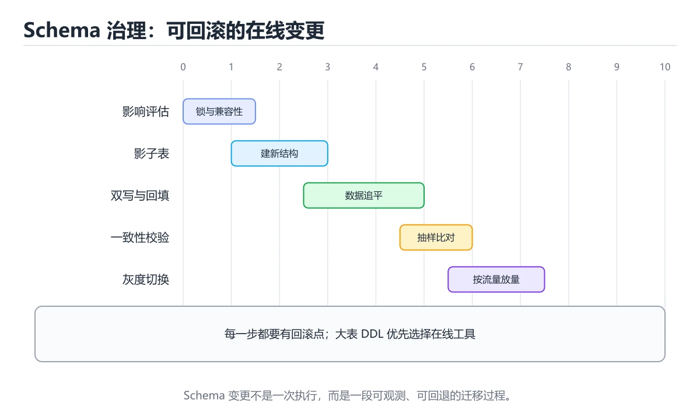
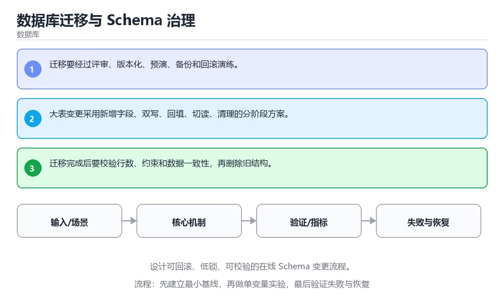

# 数据库迁移与 Schema 治理





> 内容更新时间：2026-10-03 · 学习阶段：高级 · 预计用时：24 分钟

## 学习目标

- 能用自己的话解释：迁移要经过评审、版本化、预演、备份和回滚演练。
- 能用自己的话解释：大表变更采用新增字段、双写、回填、切读、清理的分阶段方案。
- 能用自己的话解释：迁移完成后要校验行数、约束和数据一致性，再删除旧结构。
- 能把本课知识放回「数据库」，并完成练习与测验。

## 前置知识

- 已完成「数据库」的基础课程，能运行正文中的最小示例。
- 本课关键词：迁移、Schema、回滚、锁。
- 遇到不熟悉的术语先记录问题，完成练习后再回读。

## 核心知识

### 1. 迁移要经过评审、版本化、预演、备份和回滚演练。

- 它解决的问题：把「迁移要经过评审、版本化、预演、备份和回滚演练。」放回真实场景，说明不做它会带来什么后果。
- 关键做法：先用最小示例建立基线，再逐步加入边界、失败和性能条件。
- 验证标准：结果可复现、错误可解释、边界有测试、失败能恢复。

### 2. 大表变更采用新增字段、双写、回填、切读、清理的分阶段方案。

- 它解决的问题：把「大表变更采用新增字段、双写、回填、切读、清理的分阶段方案。」放回真实场景，说明不做它会带来什么后果。
- 关键做法：先用最小示例建立基线，再逐步加入边界、失败和性能条件。
- 验证标准：结果可复现、错误可解释、边界有测试、失败能恢复。

### 3. 迁移完成后要校验行数、约束和数据一致性，再删除旧结构。

- 它解决的问题：把「迁移完成后要校验行数、约束和数据一致性，再删除旧结构。」放回真实场景，说明不做它会带来什么后果。
- 关键做法：先用最小示例建立基线，再逐步加入边界、失败和性能条件。
- 验证标准：结果可复现、错误可解释、边界有测试、失败能恢复。

## 关键流程

```text
输入 → 校验 → 核心处理 → 验证 → 记录指标 → 失败恢复
```

## 实践路径

1. 用一句话复述本课要解决的问题。
2. 跑通正文中的最小示例并记录基线。
3. 只改变一个输入或参数，预测并验证结果。
4. 补一个失败路径，记录错误、恢复和指标。
5. 把结论写成可复现的笔记或测试。

## 常见误区

| 误区 | 后果 | 修正 |
| --- | --- | --- |
| 只记术语不做实验 | 遇到真实问题无法判断 | 用最小输入跑通并记录结果 |
| 只测正常路径 | 边界和故障上线才暴露 | 补空值、极值和依赖失败 |
| 没有基线就优化 | 无法证明改进有效 | 先测量再修改 |
| 忽略成本与安全 | 性能和风险失控 | 同时记录资源、权限与失败代价 |

## 动手练习

1. 合上教程，用 3～5 句话解释「数据库迁移与 Schema 治理」。
2. 从正文选一个例子，改变一个条件并预测结果。
3. 设计一个失败场景，写出止损与恢复步骤。

**验收标准**：留下输入、命令、输出、差异和下一步问题。

## 本课小结

- 本课属于「数据库」，核心关键词是 迁移、Schema、回滚、锁。
- 先保证正确与可复现，再讨论性能和扩展。
- 完成练习和测验后，把仍然不确定的问题写成下一轮验证清单。

> 本课由 P1 内容扩展生成，重点补充原有课程缺失的主题与工程边界。


## 实践任务

本节围绕“数据库迁移与 Schema 治理”安排 3 个可交付任务，每个任务都要求留下可以复查的记录。

### 任务 1：用自己的话画出结构

合上教程，用 5 句话说明“数据库迁移与 Schema 治理”解决什么问题、输入是什么、输出是什么、失败时会怎样、与相邻概念的边界在哪里。画一张流程图或状态图，把每个节点标注成“输入 / 处理 / 输出 / 失败路径”之一。

**验收标准**：图里至少有 5 个节点和 1 条失败路径；每个节点都能在正文中找到依据。

### 任务 2：做一次对比实验

从正文里选两个差异最小的方案，列成 4 列表格：方案、前提、代价、适用边界。然后只改变一个条件（数据规模、并发度、精度或资源上限），记录结果变化。

**验收标准**：表格里两个方案的结论不能完全一样；写下“在什么条件下应该换方案”。

### 任务 3：迁移到自己的场景

把“数据库迁移与 Schema 治理”的核心方法用到你熟悉的一个真实场景，写出一份 300 字以内的实施记录：目标、步骤、验证方式、仍然不确定的问题。

**验收标准**：至少有一个可复现的命令、代码片段或数据样例；结论能被别人独立检查。


## 故障现场

这一节把“数据库迁移与 Schema 治理”最常见的失败方式还原成现场记录，练习时按“症状 → 复现 → 定位 → 修复 → 预防”的顺序排查。

### 现场 1：“数据库迁移与 Schema 治理”的 迁移 常规用例通过，但边界用例失败

**症状**：在“数据库迁移与 Schema 治理”的练习或生产场景里出现““数据库迁移与 Schema 治理”的 迁移 常规用例通过，但边界用例失败”。

**复现**：准备一组最小输入，只保留触发““数据库迁移与 Schema 治理”的 迁移 常规用例通过，但边界用例失败”的必要条件，连续运行两次确认结果稳定。

**定位**：围绕“迁移 的前置条件与取值边界没有写进代码，默认值掩盖了空值和极值”检查调用链、输入数据和环境配置，先验证假设再改代码。

**修复**：为“数据库迁移与 Schema 治理”补一条空值或极值用例，把前置条件写成断言，并让失败信息直接指出是哪个输入越界

**预防**：把““数据库迁移与 Schema 治理”的 迁移 常规用例通过，但边界用例失败”写成一条自动化用例，并在“数据库迁移与 Schema 治理”的验收清单里保留对应检查项。


### 现场 2：“数据库迁移与 Schema 治理”的 Schema 结果在两次运行之间不一致

**症状**：在“数据库迁移与 Schema 治理”的练习或生产场景里出现““数据库迁移与 Schema 治理”的 Schema 结果在两次运行之间不一致”。

**复现**：准备一组最小输入，只保留触发““数据库迁移与 Schema 治理”的 Schema 结果在两次运行之间不一致”的必要条件，连续运行两次确认结果稳定。

**定位**：围绕“Schema 依赖了当前版本、执行顺序或共享状态，单次运行无法暴露差异”检查调用链、输入数据和环境配置，先验证假设再改代码。

**修复**：固定“数据库迁移与 Schema 治理”使用的版本与随机种子，记录两次运行的完整输入和输出，再逐项消除非确定性来源

**预防**：把““数据库迁移与 Schema 治理”的 Schema 结果在两次运行之间不一致”写成一条自动化用例，并在“数据库迁移与 Schema 治理”的验收清单里保留对应检查项。


### 现场 3：同一条 SQL 在数据量变大后突然变慢

**症状**：在“数据库迁移与 Schema 治理”的练习或生产场景里出现“同一条 SQL 在数据量变大后突然变慢”。

**复现**：准备一组最小输入，只保留触发“同一条 SQL 在数据量变大后突然变慢”的必要条件，连续运行两次确认结果稳定。

**定位**：围绕“执行计划随统计信息或数据分布改变，迁移 的索引没有被用上，回表次数反而增加”检查调用链、输入数据和环境配置，先验证假设再改代码。

**修复**：保存“数据库迁移与 Schema 治理”的执行计划与样本数据，比较扫描行数、回表次数和排序代价后再决定是否改索引

**预防**：把“同一条 SQL 在数据量变大后突然变慢”写成一条自动化用例，并在“数据库迁移与 Schema 治理”的验收清单里保留对应检查项。


## 考点精讲：把测验题还原成判断过程

本课有 5 个判断点。先自己作答，再看「判断依据」；如果结论正确但理由不完整，回到正文对应章节补足概念。

### 考点 1：关于「迁移要经过评审、版本化、预演、备份和…」，下列说法正确的是？

- **正确判断**：迁移要经过评审、版本化、预演、备份和回滚演练。
- **判断依据**：正确答案是「迁移要经过评审、版本化、预演、备份和回滚演练。」，本课在「本课小结」中说明：本课属于「数据库」，核心关键词是 迁移、Schema、回滚、锁。，本课在「核心知识」中说明：它解决的问题：把迁移要经过评审、版本化、预演、备份和回滚演练。，本课在「核心知识」中说明：它解决的问题：把迁移完成后要校验行数、约束和数据一致性，再删除旧结构。
- **迁移检查**：如果给某个错误选项去掉一个限定词，它会不会变成正确？说明理由。

### 考点 2：关于「大表变更采用新增字段、双写、回填、切…」，下列说法正确的是？

- **正确判断**：大表变更采用新增字段、双写、回填、切读、清理的分阶段方案。
- **判断依据**：正确答案是「大表变更采用新增字段、双写、回填、切读、清理的分阶段方案。」，本课在「本课小结」中说明：本课属于「数据库」，核心关键词是 迁移、Schema、回滚、锁。，本课在「核心知识」中说明：它解决的问题：把大表变更采用新增字段、双写、回填、切读、清理的分阶段方案。，本课在「核心知识」中说明：它解决的问题：把迁移要经过评审、版本化、预演、备份和回滚演练。
- **迁移检查**：把题干里的一个条件换成边界值，原来的结论还成立吗？写出判断过程。

### 考点 3：关于「迁移完成后要校验行数、约束和数据一致…」，下列说法正确的是？

- **正确判断**：迁移完成后要校验行数、约束和数据一致性，再删除旧结构。
- **判断依据**：正确答案是「迁移完成后要校验行数、约束和数据一致性，再删除旧结构。」，本课在「核心知识」中说明：它解决的问题：把大表变更采用新增字段、双写、回填、切读、清理的分阶段方案。，本课在核心知识中说明：它解决的问题：把迁移要经过评审、版本化、预演、备份和回滚演练。，本课在核心知识中说明：它解决的问题：把迁移完成后要校验行数、约束和数据一致性，再删除旧结构。
- **迁移检查**：如果给某个错误选项去掉一个限定词，它会不会变成正确？说明理由。

### 考点 4：「数据库迁移与 Schema 治理」的核心学习目标是什么？

- **正确判断**：设计可回滚、低锁、可校验的在线 Schema 变更流程。
- **判断依据**：正确答案是「设计可回滚、低锁、可校验的在线 Schema 变更流程。」，本课在「核心知识」中说明：它解决的问题：把迁移要经过评审、版本化、预演、备份和回滚演练。，本课在核心知识中说明：它解决的问题：把迁移完成后要校验行数、约束和数据一致性，再删除旧结构。本课还在核心知识中说明：它解决的问题：把大表变更采用新增字段、双写、回填、切读、清理的分阶段方案。
- **迁移检查**：把题干里的一个条件换成边界值，原来的结论还成立吗？写出判断过程。

### 考点 5：以下哪些术语与「数据库迁移与 Schema 治理」直接相关？（多选）

- **正确判断**：迁移、Schema
- **判断依据**：正确答案是「迁移、Schema」，本课在「核心知识」中说明：它解决的问题：把迁移完成后要校验行数、约束和数据一致性，再删除旧结构。本课还在「核心知识」中说明：它解决的问题：把迁移要经过评审、版本化、预演、备份和回滚演练。课程摘要指出设计可回滚，低锁，可校验的在线 Schema 变更流程，本课要判断的正是以下哪些术语与数据库迁移与Schema治理直接相关，（多选）。
- **迁移检查**：每个正确项各自成立的条件是什么？有没有互相依赖。

### 补充考点 1：阅读「数据库迁移与 Schema 治理」的代码片段，下面哪项判断是正确的？

- **正确判断**：迁移要经过评审、版本化、预演、备份和回滚演练。
- **判断依据**：正确答案是「迁移要经过评审、版本化、预演、备份和回滚演练。」。这段代码来自「数据库迁移与 Schema 治理」的示例，判断时先看输入与输出，再检查条件、循环和边界。正确答案是「迁移要经过评审、版本化、预演、备份和回滚演练。」，本课在「核心知识」中说明：它解决的问题：把迁移要经过评审、版本化、预演、备份和回滚演练。，本课在「深度追问与自测」中说明：先写下判断，再对…在「数据库迁移与 Schema 治理」中，如果只改一个条件，输出通常会随之改变，因此不能脱离代码前提作答。

### 补充自测（1 题）

1. 按“数据库迁移与 Schema 治理”中 迁移、Schema、回滚 的实践顺序，把四个步骤排成从准备到复盘的合理顺序。

这些题按“先定位概念、再排除边界错误、最后核对答案”的顺序作答；每题解析都给出了判断依据。


## 本课复习清单

离开本课前，逐项确认：

- [ ] 不看解析，能说出「关于「迁移要经过评审、版本化、预演、备份和…」，下列说法正确的是？」的判断依据。
- [ ] 不看解析，能说出「关于「大表变更采用新增字段、双写、回填、切…」，下列说法正确的是？」的判断依据。
- [ ] 不看解析，能说出「关于「迁移完成后要校验行数、约束和数据一致…」，下列说法正确的是？」的判断依据。
- [ ] 不看解析，能说出「「数据库迁移与 Schema 治理」的核心学习目标是什么？」的判断依据。
- [ ] 不看解析，能说出「以下哪些术语与「数据库迁移与 Schema 治理」直接相关？（多选）」的判断依据。
- [ ] 至少运行一次本课示例，记录输入、输出和一个边界情况。
- [ ] 把本课最容易混淆的两个概念写成一句话对照。

| 复盘项 | 记录 |
| --- | --- |
| 已经能独立解释的考点 |  |
| 仍然说不清的概念 |  |
| 下一步验证动作 |  |

## 逐节复习与自检

下面按正文顺序回顾每一节，并给出一个自检问题；说不清的地方回到原章节补课。

### 核心知识

」放回真实场景，说明不做它会带来什么后果。关键做法：先用最小示例建立基线，再逐步加入边界、失败和性能条件。

自检：这一节与相邻主题的边界在哪里？

### 动手练习

合上教程，用 3～5 句话解释「数据库迁移与 Schema 治理」。从正文选一个例子，改变一个条件并预测结果。

自检：如果去掉这一节里的一个前提，结论会怎样变化？

### 最小可运行示例

```sql
BEGIN;
ALTER TABLE lessons ADD COLUMN reviewed_at date;
COMMENT ON COLUMN lessons.reviewed_at IS '最后复核日期';
COMMIT;
```

自检：把这一节讲给没学过的人，最需要强调哪一点？

### 预期输出

```text
BEGIN
ALTER TABLE
COMMENT
COMMIT
```

自检：这一节与相邻主题的边界在哪里？

### 验证步骤

制造一次错误输入，记录错误信息与修复方式。

自检：如果去掉这一节里的一个前提，结论会怎样变化？

## 易错点回顾

下面把本课最容易判断错的地方集中成一张清单，复习时先自己回答，再对照解析补全理由。

- **关于「迁移要经过评审、版本化、预演、备份和…」，下列说法正确的是？**：正确答案是「迁移要经过评审、版本化、预演、备份和回滚演练。
- **关于「大表变更采用新增字段、双写、回填、切…」，下列说法正确的是？**：正确答案是「大表变更采用新增字段、双写、回填、切读、清理的分阶段方案。
- **关于「迁移完成后要校验行数、约束和数据一致…」，下列说法正确的是？**：正确答案是「迁移完成后要校验行数、约束和数据一致性，再删除旧结构。
- **「数据库迁移与 Schema 治理」的核心学习目标是什么？**：正确答案是「设计可回滚、低锁、可校验的在线 Schema 变更流程。
- **以下哪些术语与「数据库迁移与 Schema 治理」直接相关？（多选）**：正确答案是「迁移、Schema」，本课在「核心知识」中说明：它解决的问题：把迁移完成后要校验行数、约束和数据一致性，再删除旧结构。

## 深度追问与自测

下面把本课考点换一个角度再问一遍。先合上上一节，写出自己的判断，再对照答案与检查点补全理由。

### 追问 1：关于「迁移要经过评审、版本化、预演、备份和…」，下列说法正确的是？

- 先写下判断，再对照：迁移要经过评审、版本化、预演、备份和回滚演练。
- 检查点：如果输入换成边界值，这个结论还需要补充哪个前提？

### 追问 2：关于「大表变更采用新增字段、双写、回填、切…」，下列说法正确的是？

- 先写下判断，再对照：大表变更采用新增字段、双写、回填、切读、清理的分阶段方案。
- 检查点：如果输入换成边界值，这个结论还需要补充哪个前提？

### 追问 3：关于「迁移完成后要校验行数、约束和数据一致…」，下列说法正确的是？

- 先写下判断，再对照：迁移完成后要校验行数、约束和数据一致性，再删除旧结构。
- 检查点：如果输入换成边界值，这个结论还需要补充哪个前提？

### 追问 4：「数据库迁移与 Schema 治理」的核心学习目标是什么？

- 先写下判断，再对照：设计可回滚、低锁、可校验的在线 Schema 变更流程。
- 检查点：如果输入换成边界值，这个结论还需要补充哪个前提？

## 术语速查

把本课反复出现的术语集中放在一起。复习时先遮住右列，尝试用自己的话解释，再回到正文核对。

| 术语 | 本课语境 |
| --- | --- |
| `迁移` | 本课围绕该主题展开，结合正文与代码示例理解它的适用边界。 |
| `Schema` | 本课围绕该主题展开，结合正文与代码示例理解它的适用边界。 |
| `回滚` | 本课围绕该主题展开，结合正文与代码示例理解它的适用边界。 |
| `锁` | 本课围绕该主题展开，结合正文与代码示例理解它的适用边界。 |

## 面试问答与自测

下面把本课考点换成面试追问。先口述自己的答案，
再对照参考回答检查是否遗漏了前提、边界或失败路径。

### 追问 1：关于「迁移要经过评审、版本化、预演、备份和…」，下列说法正确的是？

**参考回答**：正确答案是「迁移要经过评审、版本化、预演、备份和回滚演练。」，本课在「核心知识」中说明：它解决的问题：把迁移要经过评审、版本化、预演、备份和回滚演练。，本课在「深度追问与自测」中说明：先写下判断，再对照：迁移要经过评审、版本化、预演、备份和回滚演练。，本课在「本课小结」中说明：本课属于「数据库」，核心关键词是 迁移、Schema、回滚、锁。

### 追问 2：关于「大表变更采用新增字段、双写、回填、切…」，下列说法正确的是？

**参考回答**：正确答案是「大表变更采用新增字段、双写、回填、切读、清理的分阶段方案。」，本课在「核心知识」中说明：它解决的问题：把大表变更采用新增字段、双写、回填、切读、清理的分阶段方案。，本课在「深度追问与自测」中说明：先写下判断，再对照：大表变更采用新增字段、双写、回填、切读、清理的分阶段方案。，本课在「本课小结」中说明：本课属于「数据库」，核心关键词是 迁移、Schema、回滚、锁。

### 追问 3：关于「迁移完成后要校验行数、约束和数据一致…」，下列说法正确的是？

**参考回答**：正确答案是「迁移完成后要校验行数、约束和数据一致性，再删除旧结构。」，本课在「深度追问与自测」中说明：先写下判断，再对照：迁移完成后要校验行数、约束和数据一致性，再删除旧结构。，本课在「核心知识」中说明：它解决的问题：把迁移完成后要校验行数、约束和数据一致性，再删除旧结构。，本课在「核心知识」中说明：它解决的问题：把大表变更采用新增字段、双写、回填、切读、清理的分阶段方案。本课还在「本课小结」中说明：本课属于「数据库」，核心关键词是 迁移、Schema、回滚、锁。

### 追问 4：「数据库迁移与 Schema 治理」的核心学习目标是什么？

**参考回答**：正确答案是「设计可回滚、低锁、可校验的在线 Schema 变更流程。」，本课在「本课小结」中说明：本课属于「数据库」，核心关键词是 迁移、Schema、回滚、锁。，本课在「深度追问与自测」中说明：先写下判断，再对照：设计可回滚、低锁、可校验的在线 Schema 变更流程。，本课在「核心知识」中说明：它解决的问题：把迁移要经过评审、版本化、预演、备份和回滚演练。本课还在「核心知识」中说明：它解决的问题：把迁移完成后要校验行数、约束和数据一致性，再删除旧结构。

### 追问 5：以下哪些术语与「数据库迁移与 Schema 治理」直接相关？（多选）

**参考回答**：正确答案是「迁移、Schema」，本课在「深度追问与自测」中说明：先写下判断，再对照：迁移要经过评审、版本化、预演、备份和回滚演练。本课还在「深度追问与自测」中说明：先写下判断，再对照：设计可回滚、低锁、可校验的在线 Schema 变更流程。本课还在「核心知识」中说明：它解决的问题：把迁移要经过评审、版本化、预演、备份和回滚演练。

<!-- p0-depth-v2:start -->
## 零基础精讲：把「数据库迁移与 Schema 治理」真正讲透

### 先建立一个直觉

把数据库看成一本多人同时改写的账本：先定义事实与约束，再考虑索引、并发和恢复，最后才讨论性能。

本课的摘要可以当作一张地图：设计可回滚、低锁、可校验的在线 Schema 变更流程。

阅读时不要只记结论，先问三个问题：它解决什么问题？依赖哪些前提？在什么条件下会失效？

### 逐步拆解

1. 识别输入。先写清数据类型、取值范围、空值策略，以及输入来自用户、文件还是另一个服务。
2. 描述处理过程。把「迁移、Schema、回滚、锁」映射到具体步骤，每步都要求能单独验证。
3. 定义输出。输出不仅包括正常结果，还包括错误码、日志、指标和资源释放状态。
4. 找出一条失败路径。让错误尽早暴露，并说明重试、降级、回滚或人工处理的边界。
5. 用一个小例子贯穿全过程。先手算或预测结果，再运行代码或实验，最后解释差异。

### 把正文串成一条执行链

- **1. 迁移要经过评审、版本化、预演、备份和回滚演练。**：1. 迁移要经过评审、版本化、预演、备份和回滚演练
- **2. 大表变更采用新增字段、双写、回填、切读、清理的分阶段方案。**：2. 大表变更采用新增字段、双写、回填、切读、清理的分阶段方案
- **3. 迁移完成后要校验行数、约束和数据一致性，再删除旧结构。**：3. 迁移完成后要校验行数、约束和数据一致性，再删除旧结构
- **考点 1：关于「迁移要经过评审、版本化、预演、备份和…」，下列说法正确的是？**：考点 1：关于「迁移要经过评审、版本化、预演、备份和…」，下列说法正确的是
- **考点 2：关于「大表变更采用新增字段、双写、回填、切…」，下列说法正确的是？**：考点 2：关于「大表变更采用新增字段、双写、回填、切…」，下列说法正确的是
- **考点 3：关于「迁移完成后要校验行数、约束和数据一致…」，下列说法正确的是？**：考点 3：关于「迁移完成后要校验行数、约束和数据一致…」，下列说法正确的是

### 从测验反推易错点

**检查点 1：关于「迁移要经过评审、版本化、预演、备份和…」，下列说法正确的是？**

- 参考判断：迁移要经过评审、版本化、预演、备份和回滚演练。
- 解析：正确答案是「迁移要经过评审、版本化、预演、备份和回滚演练。」，本课在「核心知识」中说明：它解决的问题：把迁移要经过评审、版本化、预演、备份和回滚演练。，本课在「深度追问与自测」中说明：先写下判断，再对照：迁移要经过评审、版本化、预演、备份和回滚演练。，本课在「本课小结」中说明：本课属于「数据库」，核心关键词是 迁移、Schema、回滚、锁。
- 自问：如果去掉题干里的一个限定词，结论还成立吗？

**检查点 2：关于「大表变更采用新增字段、双写、回填、切…」，下列说法正确的是？**

- 参考判断：大表变更采用新增字段、双写、回填、切读、清理的分阶段方案。
- 解析：正确答案是「大表变更采用新增字段、双写、回填、切读、清理的分阶段方案。」，本课在「核心知识」中说明：它解决的问题：把大表变更采用新增字段、双写、回填、切读、清理的分阶段方案。，本课在「深度追问与自测」中说明：先写下判断，再对照：大表变更采用新增字段、双写、回填、切读、清理的分阶段方案。，本课在「本课小结」中说明：本课属于「数据库」，核心关键词是 迁移、Schema、回滚、锁。
- 自问：如果去掉题干里的一个限定词，结论还成立吗？

**检查点 3：关于「迁移完成后要校验行数、约束和数据一致…」，下列说法正确的是？**

- 参考判断：迁移完成后要校验行数、约束和数据一致性，再删除旧结构。
- 解析：正确答案是「迁移完成后要校验行数、约束和数据一致性，再删除旧结构。」，本课在「深度追问与自测」中说明：先写下判断，再对照：迁移完成后要校验行数、约束和数据一致性，再删除旧结构。，本课在「核心知识」中说明：它解决的问题：把迁移完成后要校验行数、约束和数据一致性，再删除旧结构。，本课在「核心知识」中说明：它解决的问题：把大表变更采用新增字段、双写、回填、切读、清理的分阶段方案。本课还在「本课小结」中说明：本课属于「数据库」，核心关键词是 迁移、Schema、回滚、锁。
- 自问：如果去掉题干里的一个限定词，结论还成立吗？

**检查点 4：「数据库迁移与 Schema 治理」的核心学习目标是什么？**

- 参考判断：设计可回滚、低锁、可校验的在线 Schema 变更流程。
- 解析：正确答案是「设计可回滚、低锁、可校验的在线 Schema 变更流程。」，本课在「本课小结」中说明：本课属于「数据库」，核心关键词是 迁移、Schema、回滚、锁。，本课在「深度追问与自测」中说明：先写下判断，再对照：设计可回滚、低锁、可校验的在线 Schema 变更流程。，本课在「核心知识」中说明：它解决的问题：把迁移要经过评审、版本化、预演、备份和回滚演练。本课还在「核心知识」中说明：它解决的问题：把迁移完成后要校验行数、约束和数据一致性，再删除旧结构。
- 自问：如果去掉题干里的一个限定词，结论还成立吗？

**检查点 5：以下哪些术语与「数据库迁移与 Schema 治理」直接相关？（多选）**

- 参考判断：迁移、Schema
- 解析：正确答案是「迁移、Schema」，本课在「深度追问与自测」中说明：先写下判断，再对照：迁移要经过评审、版本化、预演、备份和回滚演练。本课还在「深度追问与自测」中说明：先写下判断，再对照：设计可回滚、低锁、可校验的在线 Schema 变更流程。本课还在「核心知识」中说明：它解决的问题：把迁移要经过评审、版本化、预演、备份和回滚演练。
- 自问：如果去掉题干里的一个限定词，结论还成立吗？

### 工程排错顺序

| 先查什么 | 要得到的证据 | 判断标准 |
| --- | --- | --- |
| 事务边界是否覆盖全部写操作？ | 日志、输入样例、测试或指标 | 能复现并解释，才算定位 |
| 索引是否匹配真实查询与排序？ | 日志、输入样例、测试或指标 | 能复现并解释，才算定位 |
| 迁移是否可回滚、可灰度、可校验？ | 日志、输入样例、测试或指标 | 能复现并解释，才算定位 |
| 锁等待与慢查询是否有观测？ | 日志、输入样例、测试或指标 | 能复现并解释，才算定位 |

排查顺序应遵循「先复现、再缩小范围、再验证假设、最后修改」。不要同时改多个变量，否则即使问题消失，也无法知道真正原因。

### 变式训练

1. 把它放进一个只有单机、没有额外依赖的小项目，先保证正确，再考虑扩展。
2. 把输入规模扩大十倍，记录时间、内存和失败路径，找出第一个真正瓶颈。
3. 制造一次依赖超时或错误输入，要求系统给出可解释错误并且不留下半完成状态。
4. 让另一个同学只读接口说明和测试用例，复现你的结论；无法复现的部分继续补文档或测试。
5. 删掉一个看似必要的步骤，观察哪个测试或指标先失败，用证据说明它为什么必要。
6. 把方案切换到低资源设备，重新评估默认参数、超时和降级策略。

每道变式都写下：预测、实际结果、差异、下一步。没有留下证据的练习，很难迁移到真实项目。

### 本课自测

- [ ] 能用一句话解释「迁移」在本课中的角色与边界。
- [ ] 能举出一个正常例子和一个失败例子。
- [ ] 能说出最小验证步骤，以及需要记录的证据。
- [ ] 能用一句话解释「Schema」在本课中的角色与边界。
- [ ] 能举出一个正常例子和一个失败例子。
- [ ] 能说出最小验证步骤，以及需要记录的证据。
- [ ] 能用一句话解释「回滚」在本课中的角色与边界。
- [ ] 能举出一个正常例子和一个失败例子。
- [ ] 能说出最小验证步骤，以及需要记录的证据。
- [ ] 能用一句话解释「锁」在本课中的角色与边界。
- [ ] 能举出一个正常例子和一个失败例子。
- [ ] 能说出最小验证步骤，以及需要记录的证据。
- [ ] 能用一句话解释「迁移」在本课中的角色与边界。
- [ ] 能举出一个正常例子和一个失败例子。
- [ ] 能说出最小验证步骤，以及需要记录的证据。

### 迁移案例库

下面用不同约束重复同一套方法。每完成一轮，都把结论写进笔记，并只改变一个变量。

#### 迁移案例 1：围绕「迁移」做一次小实验

**目标**：在不改变课程主体的前提下，验证「数据库迁移与 Schema 治理」中的一个关键判断。

**步骤**：
1. 复述当前方案对「迁移」的假设，写成一句可证伪的话。
2. 设计一个正常输入和一个边界输入，分别预测输出。
3. 运行或逐步演算，记录实际输出、耗时和失败信息。
4. 只调整一个参数，比较前后差异并解释原因。
5. 补充一条测试或复习卡，确保下次能更快复现。

**验收**：结论有证据、差异可解释、失败可恢复；如果做不到，说明还需要缩小问题范围。

#### 迁移案例 2：围绕「Schema」做一次小实验

**目标**：在不改变课程主体的前提下，验证「数据库迁移与 Schema 治理」中的一个关键判断。

**步骤**：
1. 复述当前方案对「Schema」的假设，写成一句可证伪的话。
2. 设计一个正常输入和一个边界输入，分别预测输出。
3. 运行或逐步演算，记录实际输出、耗时和失败信息。
4. 只调整一个参数，比较前后差异并解释原因。
5. 补充一条测试或复习卡，确保下次能更快复现。

**验收**：结论有证据、差异可解释、失败可恢复；如果做不到，说明还需要缩小问题范围。

#### 迁移案例 3：围绕「回滚」做一次小实验

**目标**：在不改变课程主体的前提下，验证「数据库迁移与 Schema 治理」中的一个关键判断。

**步骤**：
1. 复述当前方案对「回滚」的假设，写成一句可证伪的话。
2. 设计一个正常输入和一个边界输入，分别预测输出。
3. 运行或逐步演算，记录实际输出、耗时和失败信息。
4. 只调整一个参数，比较前后差异并解释原因。
5. 补充一条测试或复习卡，确保下次能更快复现。

**验收**：结论有证据、差异可解释、失败可恢复；如果做不到，说明还需要缩小问题范围。

#### 迁移案例 4：围绕「锁」做一次小实验

**目标**：在不改变课程主体的前提下，验证「数据库迁移与 Schema 治理」中的一个关键判断。

**步骤**：
1. 复述当前方案对「锁」的假设，写成一句可证伪的话。
2. 设计一个正常输入和一个边界输入，分别预测输出。
3. 运行或逐步演算，记录实际输出、耗时和失败信息。
4. 只调整一个参数，比较前后差异并解释原因。
5. 补充一条测试或复习卡，确保下次能更快复现。

**验收**：结论有证据、差异可解释、失败可恢复；如果做不到，说明还需要缩小问题范围。

#### 迁移案例 5：围绕「迁移」做一次小实验

**目标**：在不改变课程主体的前提下，验证「数据库迁移与 Schema 治理」中的一个关键判断。

**步骤**：
1. 复述当前方案对「迁移」的假设，写成一句可证伪的话。
2. 设计一个正常输入和一个边界输入，分别预测输出。
3. 运行或逐步演算，记录实际输出、耗时和失败信息。
4. 只调整一个参数，比较前后差异并解释原因。
5. 补充一条测试或复习卡，确保下次能更快复现。

**验收**：结论有证据、差异可解释、失败可恢复；如果做不到，说明还需要缩小问题范围。

#### 迁移案例 6：围绕「Schema」做一次小实验

**目标**：在不改变课程主体的前提下，验证「数据库迁移与 Schema 治理」中的一个关键判断。

**步骤**：
1. 复述当前方案对「Schema」的假设，写成一句可证伪的话。
2. 设计一个正常输入和一个边界输入，分别预测输出。
3. 运行或逐步演算，记录实际输出、耗时和失败信息。
4. 只调整一个参数，比较前后差异并解释原因。
5. 补充一条测试或复习卡，确保下次能更快复现。

**验收**：结论有证据、差异可解释、失败可恢复；如果做不到，说明还需要缩小问题范围。

#### 迁移案例 7：围绕「回滚」做一次小实验

**目标**：在不改变课程主体的前提下，验证「数据库迁移与 Schema 治理」中的一个关键判断。

**步骤**：
1. 复述当前方案对「回滚」的假设，写成一句可证伪的话。
2. 设计一个正常输入和一个边界输入，分别预测输出。
3. 运行或逐步演算，记录实际输出、耗时和失败信息。
4. 只调整一个参数，比较前后差异并解释原因。
5. 补充一条测试或复习卡，确保下次能更快复现。

**验收**：结论有证据、差异可解释、失败可恢复；如果做不到，说明还需要缩小问题范围。

#### 迁移案例 8：围绕「锁」做一次小实验

**目标**：在不改变课程主体的前提下，验证「数据库迁移与 Schema 治理」中的一个关键判断。

**步骤**：
1. 复述当前方案对「锁」的假设，写成一句可证伪的话。
2. 设计一个正常输入和一个边界输入，分别预测输出。
3. 运行或逐步演算，记录实际输出、耗时和失败信息。
4. 只调整一个参数，比较前后差异并解释原因。
5. 补充一条测试或复习卡，确保下次能更快复现。

**验收**：结论有证据、差异可解释、失败可恢复；如果做不到，说明还需要缩小问题范围。

#### 迁移案例 9：围绕「迁移」做一次小实验

**目标**：在不改变课程主体的前提下，验证「数据库迁移与 Schema 治理」中的一个关键判断。

**步骤**：
1. 复述当前方案对「迁移」的假设，写成一句可证伪的话。
2. 设计一个正常输入和一个边界输入，分别预测输出。
3. 运行或逐步演算，记录实际输出、耗时和失败信息。
4. 只调整一个参数，比较前后差异并解释原因。
5. 补充一条测试或复习卡，确保下次能更快复现。

**验收**：结论有证据、差异可解释、失败可恢复；如果做不到，说明还需要缩小问题范围。

#### 迁移案例 10：围绕「Schema」做一次小实验

**目标**：在不改变课程主体的前提下，验证「数据库迁移与 Schema 治理」中的一个关键判断。

**步骤**：
1. 复述当前方案对「Schema」的假设，写成一句可证伪的话。
2. 设计一个正常输入和一个边界输入，分别预测输出。
3. 运行或逐步演算，记录实际输出、耗时和失败信息。
4. 只调整一个参数，比较前后差异并解释原因。
5. 补充一条测试或复习卡，确保下次能更快复现。

**验收**：结论有证据、差异可解释、失败可恢复；如果做不到，说明还需要缩小问题范围。

#### 迁移案例 11：围绕「回滚」做一次小实验

**目标**：在不改变课程主体的前提下，验证「数据库迁移与 Schema 治理」中的一个关键判断。

**步骤**：
1. 复述当前方案对「回滚」的假设，写成一句可证伪的话。
2. 设计一个正常输入和一个边界输入，分别预测输出。
3. 运行或逐步演算，记录实际输出、耗时和失败信息。
4. 只调整一个参数，比较前后差异并解释原因。
5. 补充一条测试或复习卡，确保下次能更快复现。

**验收**：结论有证据、差异可解释、失败可恢复；如果做不到，说明还需要缩小问题范围。

#### 迁移案例 12：围绕「锁」做一次小实验

**目标**：在不改变课程主体的前提下，验证「数据库迁移与 Schema 治理」中的一个关键判断。

**步骤**：
1. 复述当前方案对「锁」的假设，写成一句可证伪的话。
2. 设计一个正常输入和一个边界输入，分别预测输出。
3. 运行或逐步演算，记录实际输出、耗时和失败信息。
4. 只调整一个参数，比较前后差异并解释原因。
5. 补充一条测试或复习卡，确保下次能更快复现。

**验收**：结论有证据、差异可解释、失败可恢复；如果做不到，说明还需要缩小问题范围。

#### 迁移案例 13：围绕「迁移」做一次小实验

**目标**：在不改变课程主体的前提下，验证「数据库迁移与 Schema 治理」中的一个关键判断。

**步骤**：
1. 复述当前方案对「迁移」的假设，写成一句可证伪的话。
2. 设计一个正常输入和一个边界输入，分别预测输出。
3. 运行或逐步演算，记录实际输出、耗时和失败信息。
4. 只调整一个参数，比较前后差异并解释原因。
5. 补充一条测试或复习卡，确保下次能更快复现。

**验收**：结论有证据、差异可解释、失败可恢复；如果做不到，说明还需要缩小问题范围。

#### 迁移案例 14：围绕「Schema」做一次小实验

**目标**：在不改变课程主体的前提下，验证「数据库迁移与 Schema 治理」中的一个关键判断。

**步骤**：
1. 复述当前方案对「Schema」的假设，写成一句可证伪的话。
2. 设计一个正常输入和一个边界输入，分别预测输出。
3. 运行或逐步演算，记录实际输出、耗时和失败信息。
4. 只调整一个参数，比较前后差异并解释原因。
5. 补充一条测试或复习卡，确保下次能更快复现。

**验收**：结论有证据、差异可解释、失败可恢复；如果做不到，说明还需要缩小问题范围。

#### 迁移案例 15：围绕「回滚」做一次小实验

**目标**：在不改变课程主体的前提下，验证「数据库迁移与 Schema 治理」中的一个关键判断。

**步骤**：
1. 复述当前方案对「回滚」的假设，写成一句可证伪的话。
2. 设计一个正常输入和一个边界输入，分别预测输出。
3. 运行或逐步演算，记录实际输出、耗时和失败信息。
4. 只调整一个参数，比较前后差异并解释原因。
5. 补充一条测试或复习卡，确保下次能更快复现。

**验收**：结论有证据、差异可解释、失败可恢复；如果做不到，说明还需要缩小问题范围。

#### 迁移案例 16：围绕「锁」做一次小实验

**目标**：在不改变课程主体的前提下，验证「数据库迁移与 Schema 治理」中的一个关键判断。

**步骤**：
1. 复述当前方案对「锁」的假设，写成一句可证伪的话。
2. 设计一个正常输入和一个边界输入，分别预测输出。
3. 运行或逐步演算，记录实际输出、耗时和失败信息。
4. 只调整一个参数，比较前后差异并解释原因。
5. 补充一条测试或复习卡，确保下次能更快复现。

**验收**：结论有证据、差异可解释、失败可恢复；如果做不到，说明还需要缩小问题范围。

<!-- p0-depth-v2:end -->

## English Overview

**Title:** Database Migration and Schema Governance

**Summary:** Design reversible, low-lock and verifiable online schema changes.

**Category:** Database  
**Level:** 高级  
**Key terms:** 迁移, Schema, 回滚, 锁

> The full tutorial is written in Chinese. This bilingual overview helps English readers identify the topic, scope and key terms before studying the detailed examples.

## 内容元数据

- 内容版本：v2.0
- 最后更新：2026-10-03
- 学习阶段：高级
- 适用环境：PostgreSQL / MySQL / SQLite 等主流数据库
- 内容来源：内置结构化课程与工程实践整理
- 相关主题：迁移、Schema、回滚、锁
- 质量版本：P0 测验标准 + P1 覆盖扩展 + P2 体验补全


## 最小可运行示例

下面示例用于验证「数据库迁移与 Schema 治理」的最小输入、处理和输出。先原样运行，再只修改一个值：

```sql
BEGIN;
ALTER TABLE lessons ADD COLUMN reviewed_at date;
COMMENT ON COLUMN lessons.reviewed_at IS '最后复核日期';
COMMIT;
```

## 预期输出

```text
BEGIN
ALTER TABLE
COMMENT
COMMIT
```

## 验证步骤

1. 记录运行环境、命令和真实输出。
2. 修改一个输入，先写预测再运行。
3. 制造一次错误输入，记录错误信息与修复方式。
4. 把结论写回本课笔记或测试用例。


## 参考资料与复核

- 最后复核：2026-10-04
- 下次复核：2027-04-04
- 复核范围：版本兼容、API 行为、安全建议与工程实践
- 来源性质：官方文档与标准；本课正文为离线教学重组，不复制原文

| 参考资料 | 本课用途 |
| --- | --- |
| [PostgreSQL 文档](https://www.postgresql.org/docs/) | SQL、索引与事务 |
| [SQLite 文档](https://sqlite.org/docs.html) | 嵌入式数据库与 SQL 行为 |

> 本课主题：设计可回滚、低锁、可校验的在线 Schema 变更流程。

> App 完全离线展示文字链接，不会自动联网；需要延伸阅读时可复制链接到浏览器。
