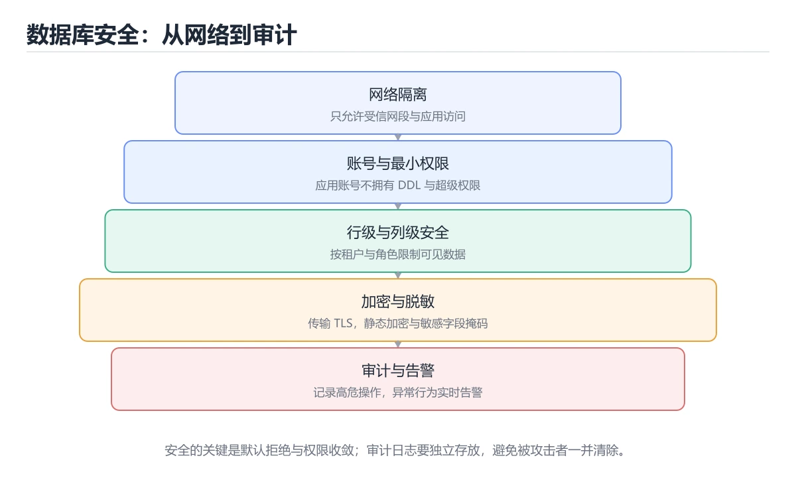
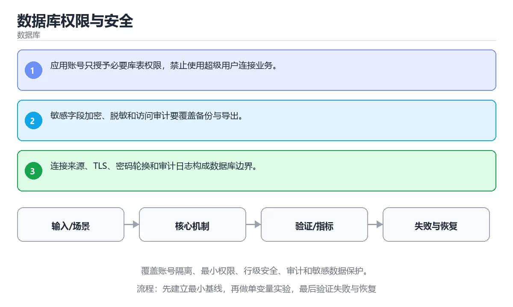

# 数据库权限与安全

> 内容更新时间：2026-10-06 · 学习阶段：高级 · 预计用时：45 分钟





## 本节知识框架

**课程定位**：所属分类为「数据库」，课程主题为「数据库权限与安全」，学习阶段为「高级」，建议用时 45 分钟。

**本课要解决的主问题**：覆盖账号隔离、最小权限、行级安全、审计和敏感数据保护。

| 学习层次 | 要回答的问题 | 完成判据 |
| --- | --- | --- |
| 概念层 | 「数据库权限与安全」有哪些必须区分的对象与术语？ | 能用自己的话定义核心术语，并各举一个正例和一个反例。 |
| 机制层 | 这些对象按什么顺序发生作用，输入如何变成输出？ | 能画出或写出机制步骤，并说明每一步的失败条件。 |
| 应用层 | 什么场景适合使用「数据库权限与安全」，什么场景不适合？ | 能给出一个真实场景、一个最小示例和一个边界案例。 |
| 性能层 | 时间、空间、吞吐或延迟受哪些量影响？ | 能说出复杂度或性能瓶颈的证据来源；没有证据时明确写“材料未提供”。 |
| 复习层 | 怎样确认自己不是只记住了结论？ | 能独立完成本课自测，并把错误定位到概念、机制、示例或边界。 |

### 阅读路线

1. 先读「核心概念定义」，建立「数据库权限」等对象的精确定义。
2. 再读「原理与运行机制」，把定义串成可重复的过程。
3. 用「代码/协议/SQL 示例」验证过程，并只改一个条件观察结果变化。
4. 最后检查性能、易错点、知识关系与自测题，形成可复习的证据链。

**前置知识**：《数据库迁移与 Schema 治理》

**学习位置**：本课位于《数据库迁移与 Schema 治理》之后；如果前一课的自测不能通过，应先回补再继续。

**后续衔接**：下一课《数据库备份与恢复演练》会继续使用本课术语，学完后建议立即完成一次自测。

**教材衔接：学习目标**

- 能用自己的话解释：应用账号只授予必要库表权限，禁止使用超级用户连接业务。
- 能用自己的话解释：敏感字段加密、脱敏和访问审计要覆盖备份与导出。
- 能用自己的话解释：连接来源、TLS、密码轮换和审计日志构成数据库边界。
- 能把本课知识放回「数据库」，并完成练习与测验。

**教材衔接：前置知识**

- 能运行 PASSWORD 所在的示例环境，并读懂报错信息。
- 本课关键词：数据库权限、最小权限、审计、加密。
- 遇到不熟悉的术语先记录问题，完成练习后再回读。

**教材衔接：本课小结**

- 本课围绕 数据库权限、最小权限、审计、加密 展开，复习时重点核对它们的输入、输出和失败路径。
- 做完本课测验后，把答错且解释不清的 最小权限 相关题目记成验证任务。

## 核心概念定义

> 阅读约定：本课先给「数据库权限与安全」相关术语的操作性定义与适用边界；正文里的口语化说法与定义冲突时，以定义和可复现示例为准。

| 术语 | 操作性定义 | 本课中的边界 |
| --- | --- | --- |
| 数据库权限 | 授予账号在特定库、表或操作上的访问能力，并遵循最小权限与职责分离。 | 仅在「数据库权限与安全」明确给出的输入、版本与资源条件下成立。 |
| 最小权限 | 每个账号、进程或服务只获得完成当前任务所需的权限，把泄露影响面降到最低。 | 仅在「数据库权限与安全」明确给出的输入、版本与资源条件下成立。 |
| 审计 | 记录谁在何时对什么资源做了什么，并保证日志可追溯、不可随意篡改。 | 仅在「数据库权限与安全」明确给出的输入、版本与资源条件下成立。 |
| 加密 | 用密钥把明文变换成密文，保证机密性并配合完整性机制抵御篡改。 | 仅在「数据库权限与安全」明确给出的输入、版本与资源条件下成立。 |

### 定义如何使用

在「数据库权限与安全」中判断一个说法是否成立，先确认它使用的是哪个对象的定义，再检查输入规模、运行环境与失败路径。定义不是口号，而是后续推导、代码示例和自测题共享的约束。

## 原理与运行机制

### 机制总览

1. **建立输入**：把「数据库权限」按本课定义整理成可观察、可重复的输入条件。
2. **执行转换**：围绕「最小权限」执行本课的核心步骤；每一步都记录中间状态，避免只看最终输出。
3. **产生输出**：得到「审计」后，用正文示例或协议/SQL 结果核对输出是否符合预期。
4. **改变一个条件**：只替换一个边界条件或环境参数，观察「数据库权限与安全」的结论是否仍然成立。

| 阶段 | 关注对象 | 失败时应检查 |
| --- | --- | --- |
| 输入 | 数据库权限 | 类型、范围、编码、版本或前置状态是否满足定义。 |
| 处理 | 最小权限 | 顺序、可见性、锁、路由、事务或调度规则是否被破坏。 |
| 输出 | 审计 | 结果是否可复现，错误是否被正确传播而不是被吞掉。 |

本课的机制结论要用「数据库权限与安全」自己的示例验证。「数据库权限与安全」没有给出某个数量级、吞吐或内存数据时，本课把该判断标为“材料未提供”，不从相邻主题外推。

**教材衔接：核心知识**

### 1. 应用账号只授予必要库表权限，禁止使用超级用户连接业务。

- 关键做法：基线只保留 最小权限 必需的部分，其余条件一次加一个。
- 验证标准：数据库权限 的结果可复现、错误可解释、失败能恢复。

### 2. 敏感字段加密、脱敏和访问审计要覆盖备份与导出。

把这条结论放回「数据库权限与安全」的完整流程里展开：

- 正文依据：能用自己的话解释：敏感字段加密、脱敏和访问审计要覆盖备份与导出。
- 落地检查：把「2. 敏感字段加密、脱敏和访问审计要覆盖备份与导出。」改写成一条可执行的核对项，逐条验证输入、超时与失败路径。

### 3. 连接来源、TLS、密码轮换和审计日志构成数据库边界。

把这条结论放回「数据库权限与安全」的完整流程里展开：

- 正文依据：能用自己的话解释：连接来源、TLS、密码轮换和审计日志构成数据库边界。
- 落地检查：把「3. 连接来源、TLS、密码轮换和审计日志构成数据库边界。」改写成一条可执行的核对项，逐条验证输入、超时与失败路径。

**教材衔接：关键流程**

```text
输入 → 校验 → 核心处理 → 验证 → 记录指标 → 失败恢复
```

**教材衔接：实践路径**

1. 用一句话复述本课要解决的问题。
2. 跑通正文中的最小示例并记录基线。
3. 只改变一个输入或参数，预测并验证结果。
4. 补一个失败路径，记录错误、恢复和指标。
5. 把结论写成可复现的笔记或测试。

**教材衔接：零基础精讲：把数据库权限与安全真正讲透**

### 先建立一个直觉

把数据库看成一本多人同时改写的账本：先定义事实与约束，再考虑索引、并发和恢复，最后才讨论性能。落到本课，「数据库权限与安全」关心的是 数据库权限 与 最小权限 的配合，也就是说这条直觉要在 核心知识 里被具体验证。

本课的摘要可以当作一张地图：覆盖账号隔离、最小权限、行级安全、审计和敏感数据保护。

### 逐步拆解

1. 澄清输入与目标。先写清「数据库权限与安全」要解决的问题、合法输入范围和成功标准，再进入后续步骤。
2. 描述处理过程。把「数据库权限、最小权限、审计、加密」映射到具体步骤，每步都要求能单独验证。
3. 定义输出。把 PASSWORD 的返回值、日志和失败信号都写清楚，缺一项都不算完整。
4. 先预测数据库权限会怎样失败，再实际触发一次；差异部分就是本课最需要补的前提。
5. 把「核心知识」里的最小示例抄成 PASSWORD 一行的输入，先手算结果再执行，确认两者一致。

### 把正文串成一条执行链

- **考点 3：关于「连接来源、TLS、密码轮换和审计日志构成数据库边界。」，下列说法正确的是？**：先独立作答，再回到本课对应小节核对判断依据；答错时记录是哪一个前提被忽略。

### 从测验反推易错点

**检查点 1：关于「应用账号只授予必要库表权限，禁止使用超级用户连接业务。」，下列说法正确的是？**

- 参考判断：应用账号只授予必要库表权限，禁止使用超级用户连接业务。
- 自问：如果去掉题干里的一个限定词，结论还成立吗？

**检查点 2：关于「敏感字段加密、脱敏和访问审计要覆盖备份与导出。」，下列说法正确的是？**

- 参考判断：敏感字段加密、脱敏和访问审计要覆盖备份与导出。

**检查点 3：关于「连接来源、TLS、密码轮换和审计日志构成数据库边界。」，下列说法正确的是？**

- 参考判断：连接来源、TLS、密码轮换和审计日志构成数据库边界。

**检查点 4：本课的核心学习目标是什么？**

- 参考判断：覆盖账号隔离、最小权限、行级安全、审计和敏感数据保护。

- 参考判断：DATABASE、database

### 工程排错顺序

| 先查什么 | 要得到的证据 | 判断标准 |
| --- | --- | --- |
| 事务边界是否覆盖全部写操作？ | 日志、输入样例、测试或指标 | 能复现并解释，才算定位 |
| 索引是否匹配真实查询与排序？ | 日志、输入样例、测试或指标 | 能复现并解释，才算定位 |
| 迁移是否可回滚、可灰度、可校验？ | 日志、输入样例、测试或指标 | 能复现并解释，才算定位 |
| 锁等待与慢查询是否有观测？ | 日志、输入样例、测试或指标 | 能复现并解释，才算定位 |

### 变式训练

1. 把 数据库权限 的实现压缩到一个进程内，去掉所有外部依赖后再谈扩展。
2. 把 数据库权限 的输入规模扩大十倍，记录时间、内存和失败路径，找出第一个瓶颈。
3. 让 PASSWORD 的外部依赖超时，确认系统能回滚或补偿，而不是留下脏数据。
5. 把「数据库权限与安全」里最容易被省略的一步去掉，用测试或指标证明它不可省略，而不是凭感觉判断。
6. 在低带宽或低算力条件下重跑 最小权限，记录降级路径是否仍然可用。

### 本课自测

- [ ] 能用一句话解释「数据库权限」在本课中的角色与边界。
- [ ] 能举出一个正常例子和一个失败例子。
- [ ] 能说出最小验证步骤，以及需要记录的证据。
- [ ] 能用一句话解释「最小权限」在本课中的角色与边界。
- [ ] 能用一句话解释「审计」在本课中的角色与边界。
- [ ] 能用一句话解释「加密」在本课中的角色与边界。

### 迁移案例库

下面用不同约束重复同一套方法，每轮只改变 数据库权限 的一个取值并记录结论。

#### 迁移案例 1：围绕「数据库权限」做一次小实验

**目标**：在不改变课程主体的前提下，验证数据库权限与安全中的一个关键判断。

**步骤**：
1. 复述当前方案对「数据库权限」的假设，写成一句可证伪的话。
2. 设计一个正常输入和一个边界输入，分别预测输出。
3. 运行或逐步演算，记录实际输出、耗时和失败信息。
4. 只调整一个参数，比较前后差异并解释原因。
5. 补充一条测试或复习卡，确保下次能更快复现。

**验收**：把「数据库权限与安全」的判断依据写成可复现步骤，换一台机器或换一个输入仍能得到同一结论。

#### 迁移案例 2：围绕「最小权限」做一次小实验

**步骤**：
1. 复述当前方案对「最小权限」的假设，写成一句可证伪的话。

#### 迁移案例 3：围绕「审计」做一次小实验

**步骤**：
1. 复述当前方案对「审计」的假设，写成一句可证伪的话。

#### 迁移案例 4：围绕「加密」做一次小实验

**步骤**：
1. 复述当前方案对「加密」的假设，写成一句可证伪的话。

#### 迁移案例 5：围绕「数据库权限」做一次小实验

**步骤**：

#### 迁移案例 6：围绕「最小权限」做一次小实验

**步骤**：

#### 迁移案例 7：围绕「审计」做一次小实验

**步骤**：

#### 迁移案例 8：围绕「加密」做一次小实验

**步骤**：

#### 迁移案例 9：围绕「数据库权限」做一次小实验

**步骤**：

#### 迁移案例 10：围绕「最小权限」做一次小实验

**步骤**：

#### 迁移案例 11：围绕「审计」做一次小实验

**步骤**：

#### 迁移案例 12：围绕「加密」做一次小实验

**步骤**：

#### 迁移案例 13：围绕「数据库权限」做一次小实验

**步骤**：

#### 迁移案例 14：围绕「最小权限」做一次小实验

**步骤**：

#### 迁移案例 15：围绕「审计」做一次小实验

**步骤**：

#### 迁移案例 16：围绕「加密」做一次小实验

**步骤**：

<!-- p0-depth-v2:end -->

**教材衔接：验证步骤**

1. 记录运行环境、命令和真实输出。
2. 修改一个输入，先写预测再运行。
4. 把结论写回本课笔记或测试用例。

## 典型应用场景

| 场景 | 典型输入或前提 | 期望产物 |
| --- | --- | --- |
| 学习验证 | 使用本课最小示例和 数据库权限、最小权限 | 能复现正文结论，并解释每一步。 |
| 工程落地 | 把「数据库权限与安全」放入真实模块或服务边界 | 输出可观测、失败可定位、参数可配置。 |
| 故障排查 | 只改一个版本、规模、输入或依赖条件 | 能区分概念错误、实现错误和环境差异。 |

判断「数据库权限与安全」的场景是否成立，标准是能否写出输入、处理、输出和失败路径；材料中没有出现的数据在本课标注为“材料未提供”，不用推测替代证据。

**课程内置实验入口**：`system_database`，用于动手验证《数据库权限与安全》的机制；实验结论不替代概念定义与复杂度分析。

**教材衔接：深度拓展与实战**

这一节把 数据库权限 的定义、PASSWORD 的代码与常见失败串成一条复习路线。

### 机制拆解

- **1. 应用账号只授予必要库表权限，禁止使用超级用户连接业务。**：在「数据库权限与安全」里，「1. 应用账号只授予必要库表权限，禁止使用超级用户连接业务。」这一步要先写清输入与预期，再记录实际结果和差异；结果不符时回到对应小节核对前提。
- **2. 敏感字段加密、脱敏和访问审计要覆盖备份与导出。**：在「数据库权限与安全」里，「2. 敏感字段加密、脱敏和访问审计要覆盖备份与导出。」这一步要先写清输入与预期，再记录实际结果和差异；结果不符时回到对应小节核对前提。
- **3. 连接来源、TLS、密码轮换和审计日志构成数据库边界。**：在「数据库权限与安全」里，「3. 连接来源、TLS、密码轮换和审计日志构成数据库边界。」这一步要先写清输入与预期，再记录实际结果和差异；结果不符时回到对应小节核对前提。
- **考点 1：核心知识 的代码阅读题**：先独立作答，再回到本课正文核对 PASSWORD 的执行路径；答错时记录是哪一个前提被忽略。
- **考点 2：围绕“数据库权限与安全”中的 数据库权限、最小权限、审计，下列哪两项是本课强调的实践判断？**：先独立作答，再回到本课对应小节核对判断依据；答错时记录是哪一个前提被忽略。

### 边界条件与常见反例

「数据库权限与安全」的边界不只包括最大最小值，还要覆盖空、重复和失败：

| 条件 | 常见反例 | 处理方式 |
| --- | --- | --- |
| 空输入 | 数据库权限 没有任何取值 | 先判空，给出明确错误而不是继续执行 |
| 边界值 | 最小权限 取最小或最大 | 用最小值、最大值和越界值各跑一次 |
| 重复执行 | 同一输入被执行两次 | 保证结果可重复，必要时加锁或去重 |
| 失败路径 | 数据库权限 相关步骤报错 | 保留原始错误，确认回滚或重试行为 |

### 工程检查表

- [ ] 能否用自己的话说明数据库权限与安全解决什么问题，以及它不负责什么？
- [ ] 能否用「数据库权限与安全」的最小示例复现一次失败并解释原因？
- [ ] 能否解释本课关键词在真实项目中的边界与取舍？
- [ ] 能否把 数据库权限 的方法迁移到相近问题，并说明需要改哪一步？

### 迁移练习

1. 保持正文示例不变，写出它的输入、处理步骤和预期输出。
2. 把 最小权限 换成边界值，说明依据后再实际运行。
3. 结合数据库权限、最小权限、审计、加密，写出一个真实项目中的使用场景。
4. 写下一个反例，说明它在什么条件下会使朴素做法失效。

<!-- p0-depth-v2:start -->

## 代码/协议/SQL 示例

### 最小可验证示例

下面保留《数据库权限与安全》原文中的最小示例。先预测《数据库权限与安全》示例的输出，再按正文步骤运行或推演；示例依赖外部环境时，同时记录版本与输入。

```text
输入 → 校验 → 核心处理 → 验证 → 记录指标 → 失败恢复
```

**教材衔接：最小可运行示例**

先用 PASSWORD 跑通最小示例，然后只改一个与 数据库权限 相关的取值：

```sql
CREATE ROLE reader LOGIN PASSWORD 'change-me';
GRANT CONNECT ON DATABASE learn TO reader;
GRANT SELECT ON ALL TABLES IN SCHEMA public TO reader;
REVOKE INSERT, UPDATE, DELETE ON ALL TABLES IN SCHEMA public FROM reader;
```

**教材衔接：预期输出**

```text
CREATE ROLE
GRANT
GRANT
REVOKE
```

## 时间/空间复杂度或性能分析

**复杂度证据**：「数据库权限与安全」的现有材料没有给出渐近时间或空间复杂度的明确结论，本课只做定性检查，不补写未经验证的 $O$ 记号。

| 维度 | 本课关注点 | 判断依据 |
| --- | --- | --- |
| 时间/延迟 | 「数据库权限与安全」的主要步骤是否会随输入规模、并发度或网络往返增长。 | 以正文复杂度、基准数据或可重复测量为准。 |
| 空间/内存 | 中间状态、缓存、副本、连接或索引是否随规模增长。 | 记录峰值内存与数据副本，不只看最终结果。 |
| 吞吐/资源 | 版本、调度、锁、IO、序列化或协议开销是否成为瓶颈。 | 固定环境做对照实验，改变一个变量。 |

评估「数据库权限与安全」时要区分“正确性成立”和“性能达标”两件事；材料没有给出基准时，本课只保留量级来源与测量方法，不写不可验证的绝对数字。

## 常见误区与易错点

> 复核《数据库权限与安全》的易错点时，优先保留原文的错误表、故障现场与排错路径；每条修正都要能用本课示例复验。

| 易错点 | 常见表现 | 正确做法 |
| --- | --- | --- |
| 只背结论 | 能复述「数据库权限与安全」的定义，却说不清输入、输出与边界。 | 回到机制步骤，用最小示例逐一验证。 |
| 混淆相邻概念 | 把本课对象与相邻主题的对象当成同一类。 | 先比较定义、资源归属、生命周期和失败模式。 |
| 忽略版本与环境 | 在开发机通过后直接外推到生产环境。 | 固定版本、输入和资源条件，再记录可复现结果。 |

**教材衔接：常见错误与排查**

> 说明：本表由《数据库权限与安全》的核心知识整理（2026-10-07），人工复核进度见 docs/content_review_batches.md。

| 易错点 | 容易踩的做法 | 正确结论 |
| --- | --- | --- |
| 应用用高权限账号连库 | 一个注入漏洞就能删库 | 应用账号按最小权限授权，只保留必要的库表操作 |
| 权限只授到库级 | 越权访问敏感表无法拦住 | 按表与列授权，敏感字段单独控制 |
| 审计日志不打开 | 出事之后无法追责与复现 | 打开审计，记录登录、授权变更与高危语句 |

**教材衔接：故障现场**

### 现场 1：应用用高权限账号连库

**症状**：在《数据库权限与安全》的复现场景中，一个注入漏洞就能删库。

**根因**：当出现“应用用高权限账号连库”时，执行路径已经绕过了《数据库权限与安全》的关键约束，最终以“一个注入漏洞就能删库”暴露出来；修复前必须先确认约束在哪里失效。

**修复**：针对《数据库权限与安全》的问题，应用账号按最小权限授权，只保留必要的库表操作。

**验证**：先在《数据库权限与安全》中记录“应用用高权限账号连库”留下的失败证据，再执行“应用账号按最小权限授权，只保留必要的库表操作”并重放；确认错误路径变为明确结果，且修复没有掩盖同类故障。

### 现场 2：权限只授到库级

**症状**：在《数据库权限与安全》的复现场景中，越权访问敏感表无法拦住。

**根因**：当出现“权限只授到库级”时，执行路径已经绕过了《数据库权限与安全》的关键约束，最终以“越权访问敏感表无法拦住”暴露出来；修复前必须先确认约束在哪里失效。

**修复**：针对《数据库权限与安全》的问题，按表与列授权，敏感字段单独控制。

**验证**：在《数据库权限与安全》中按“按表与列授权，敏感字段单独控制”调整后，从“权限只授到库级”的触发条件重放同一条路径，确认“越权访问敏感表无法拦住”不再出现，并补一个相邻边界用例检查没有引入新问题。

### 现场 3：审计日志不打开

**症状**：在《数据库权限与安全》的复现场景中，出事之后无法追责与复现。

**根因**：触发点是把“审计日志不打开”当成安全做法。它没有满足《数据库权限与安全》要求的前提，因此先表现为“出事之后无法追责与复现”；排查时先完整复现这一段，再核对输入、配置与依赖。

**修复**：针对《数据库权限与安全》的问题，打开审计，记录登录、授权变更与高危语句。

**验证**：在《数据库权限与安全》中按“打开审计，记录登录、授权变更与高危语句”调整后，从“审计日志不打开”的触发条件重放同一条路径，确认“出事之后无法追责与复现”不再出现，并补一个相邻边界用例检查没有引入新问题。

## 与其他知识点的关系

| 关系 | 课程 | 为什么 |
| --- | --- | --- |
| 先修 | 《数据库迁移与 Schema 治理》 | 本课会直接使用它的概念或操作前提。 |
| 关联 | 《数据库备份与恢复演练》 | 用于横向比较或把本课结论迁移到相邻主题。 |
| 前置顺序 | 《数据库迁移与 Schema 治理》 | 同分类中安排在本课之前，建议先完成其自测。 |
| 后续顺序 | 《数据库备份与恢复演练》 | 同分类中安排在本课之后，会继续使用本课术语。 |

把「数据库权限与安全」放回知识体系时，不只要记住“前面学过什么”，还要说明两个主题在输入、机制、资源边界和失败模式上的差异。这样才能把单课知识迁移到项目、排障和后续课程。

**教材衔接：复习与迁移**

复习目标：把「数据库权限与安全」的判断标准放回可复现的例子里。先自己作答，再对照依据；如果结论正确但理由不完整，回到正文补足前提。

### 概念复述

- 用一句话说明「数据库权限与安全」解决什么问题：覆盖账号隔离、最小权限、行级安全、审计和敏感数据保护。
- 写出数据库权限、最小权限、审计之间的关系，并各举一个例子。
- 说出本课最容易混淆的两个概念，以及区分它们的判据。

### 正文逐节复核

- **零基础精讲：把数据库权限与安全真正讲透**：本课的摘要可以当作一张地图：覆盖账号隔离、最小权限、行级安全、审计和敏感数据保护。

### 测验回顾

1. 下面这段 SQL 代码摘自「数据库权限与安全」的正文示例。关于这段代码，下面哪一项说法与实际内容相符？
   - 依据：在「数据库权限与安全」里，题干的正确项是这段代码只做静态声明，没有循环、分支或可观察输出，在「数据库权限与安全」里它只能证明数据库权限相关约束存在，不能替代真实运行证据。把输入或边界换成空值、极值或失败情况后，结论要以「数据库权限与安全」的实际运行结果为准。把“这段代码只做静态声明，没有循环”代回「数据库权限与安全」里“下面这段 SQL 代码摘自数据库权限与安全的正文示例关于这段”的例子核对，条件一旦改变，结论就要用数据库权限、最小权限、审计重新推导。
2. 围绕“数据库权限与安全”中的 数据库权限、最小权限、审计，下列哪两项是本课强调的实践判断？
   - 依据：本课把数据库权限与安全拆成概念、示例与故障现场三部分，因此判断 数据库权限 时必须同时交代输入、输出和失败路径，这使“学习 数据库权限 时要同时说明输入、输出和失败路径，不能只看正常流程”成立。在数据库权限与安全里，判断 最小权限 时要固定版本与边界输入，所以“验证 最小权限 时要固定版本并覆盖边界输入，结论才可复现”才可复现。
3. 关于「连接来源、TLS、密码轮换和审计日志构成数据库边界。」，下列说法正确的是？
   - 依据：在「数据库权限与安全」里，连接来源、TLS、密码轮换和审计日志构成数据库边界。在「数据库权限与安全」里，如果只凭关键词作答，很容易把扩展、分区、逻辑复制和连接池是生产部署的重要组成。“连接来源”与「数据库权限与安全」的术语表相呼应，只有符合数据库权限、最小权限、审计约束的“连接来源、TLS”才是正文支持的结论。
4. 「数据库权限与安全」的核心学习目标是什么？
   - 依据：在「数据库权限与安全」里，结论应落在「覆盖账号隔离、最小权限、行级安全、审计和敏感数据保护」。在「数据库权限与安全」里，结论应落在覆盖账号隔离、最小权限、行级安全、审计和敏感数据保护。在「数据库权限与安全」里，这道题要求区分概念与边界，覆盖账号隔离、最小权限、行级安全、审计和敏感数据保护。
5. 补全代码：「数据库权限与安全」示例中，下面这行代码缺少哪个关键字或函数名？请填入 ____。

`GRANT CONNECT ON ____ learn TO reader;`
   - 依据：在「数据库权限与安全」里判断这道题，要把数据库权限、最小权限、审计的条件、过程与失败路径逐项对齐，换成“补全代码”这个场景，只有满足前提的结论才成立。“数据库权限与安全示例中”与「数据库权限与安全」的术语表相呼应，只有符合数据库权限、最小权限、审计约束的“DATABASE”才是正文支持的结论。

### 迁移练习

把「数据库权限与安全」的结论迁移到相邻主题，每次迁移都写清预测与证据：

1. 换输入：用数据库权限处理一组你自己的数据，对比教材示例的结果差异。
2. 换失败条件：制造一个最小权限相关的错误，说明如何从错误信息定位根因。
3. 换规模：把数据量或并发度提高一个数量级，说明「数据库权限与安全」的结论是否仍成立。

## 自测题与参考答案

> 先独立作答《数据库权限与安全》的自测题，再对照答案与解析；每处判断都要能在本课正文或示例中找到依据。

### 自测 1

下面这段 SQL 代码摘自「数据库权限与安全」的正文示例。关于这段代码，下面哪一项说法与实际内容相符？

```sql
CREATE ROLE reader LOGIN PASSWORD 'change-me';
GRANT CONNECT ON DATABASE learn TO reader;
GRANT SELECT ON ALL TABLES IN SCHEMA public TO reader;
REVOKE INSERT, UPDATE, DELETE ON ALL TABLES IN SCHEMA public FROM reader;
```

A. 这段代码包含异常处理分支，失败时会走专门的补救路径。
B. 这段代码会读取外部输入，结果依赖传入的数据。
C. 这段代码会产生可观察的输出，运行后能看到结果。
D. 这段代码只做静态声明，没有循环、分支或可观察输出。

**参考答案**：这段代码只做静态声明，没有循环、分支或可观察输出。

**解析**：在「数据库权限与安全」里，题干的正确项是这段代码只做静态声明，没有循环、分支或可观察输出，在「数据库权限与安全」里它只能证明数据库权限相关约束存在，不能替代真实运行证据。把输入或边界换成空值、极值或失败情况后，结论要以「数据库权限与安全」的实际运行结果为准。把“这段代码只做静态声明，没有循环”代回「数据库权限与安全」里“下面这段 SQL 代码摘自数据库权限与安全的正文示例关于这段”的例子核对，条件一旦改变，结论就要用数据库权限、最小权限、审计重新推导。

### 自测 2

围绕“数据库权限与安全”中的 数据库权限、最小权限、审计，下列哪两项是本课强调的实践判断？

A. 验证 最小权限 时要固定版本并覆盖边界输入，结论才可复现
B. 把 最小权限 的单次运行结果当成所有版本和规模都成立
C. 学习 数据库权限 时要同时说明输入、输出和失败路径，不能只看正常流程
D. 只要 数据库权限 的常规示例通过，就可以跳过边界与异常路径

**参考答案**：验证 最小权限 时要固定版本并覆盖边界输入，结论才可复现；学习 数据库权限 时要同时说明输入、输出和失败路径，不能只看正常流程

**解析**：本课把数据库权限与安全拆成概念、示例与故障现场三部分，因此判断 数据库权限 时必须同时交代输入、输出和失败路径，这使“学习 数据库权限 时要同时说明输入、输出和失败路径，不能只看正常流程”成立。在数据库权限与安全里，判断 最小权限 时要固定版本与边界输入，所以“验证 最小权限 时要固定版本并覆盖边界输入，结论才可复现”才可复现。

### 自测 3

关于「连接来源、TLS、密码轮换和审计日志构成数据库边界。」，下列说法正确的是？

A. 乱序、时钟偏差和基数爆炸是常见工程问题。
B. 连接来源、TLS、密码轮换和审计日志构成数据库边界。
C. 扩展、分区、逻辑复制和连接池是生产部署的重要组成。
D. 图数据库不替代事务型主库，通常与关系库和分析系统组合使用。

**参考答案**：连接来源、TLS、密码轮换和审计日志构成数据库边界。

**解析**：在「数据库权限与安全」里，连接来源、TLS、密码轮换和审计日志构成数据库边界。在「数据库权限与安全」里，如果只凭关键词作答，很容易把扩展、分区、逻辑复制和连接池是生产部署的重要组成。“连接来源”与「数据库权限与安全」的术语表相呼应，只有符合数据库权限、最小权限、审计约束的“连接来源、TLS”才是正文支持的结论。

**教材衔接：动手练习**

1. 合上教程，用 3～5 句话解释数据库权限与安全。
2. 从正文选一个例子，改变一个条件并预测结果。
3. 设计一个失败场景，写出止损与恢复步骤。

**验收标准**：留下输入、命令、输出、差异和下一步问题。

**教材衔接：可运行练习**

### 任务 1：先跑通，再解释

```sql
CREATE ROLE reader LOGIN PASSWORD 'change-me';
GRANT CONNECT ON DATABASE learn TO reader;
GRANT SELECT ON ALL TABLES IN SCHEMA public TO reader;
REVOKE INSERT, UPDATE, DELETE ON ALL TABLES IN SCHEMA public FROM reader;
```

### 任务 2：只改一个条件

把「数据库权限与安全」的最小示例复制一份，只改一个条件再跑一次：

- 改动点：把 最小权限 换成边界值，其他输入保持原样。
- 预测：先写下「数据库权限与安全」在改动后的输出或错误信息，再运行。
- 记录：对照改动前后的结果，指出差异出在哪一步。
- 验收：换回原条件能复现原结果，改动只影响数据库权限。

### 任务 3：迁移到自己的数据

用同一套思路处理一组你自己的 数据库权限 数据，保持输出格式与任务 1 一致。

**教材衔接：本课复习清单**

离开本课前，逐项确认：

- [ ] 不看解析，能说出「下面这段 SQL 代码摘自「数据库权限与安全」的正文示例。关于这段代码，下面哪一项说法与实际内容相符？」的判断依据。
- [ ] 不看解析，能说出「围绕“数据库权限与安全”中的 数据库权限、最小权限、审计，下列哪两项是本课强调的实践判断？」的判断依据。
- [ ] 不看解析，能说出「关于「连接来源、TLS、密码轮换和审计日志构成数据库边界。」，下列说法正确的是？」的判断依据。
- [ ] 至少运行一次《数据库权限与安全》的示例，记录输入、输出和一个边界情况。
- [ ] 把本课最容易混淆的两个概念写成一句话对照。

| 复盘项 | 记录 |
| --- | --- |
| 已经能独立解释的考点 |  |
| 仍然说不清的概念 |  |
| 下一步验证动作 |  |

**教材衔接：复习与自测**

下面按正文顺序回顾「数据库权限与安全」的每一节；说不清的地方回到 核心知识 补课。

### 核心知识

自检：这一节与相邻主题的边界在哪里？

### 动手练习

自检：如果去掉这一节里的一个前提，结论会怎样变化？

### 最小可运行示例

```sql
CREATE ROLE reader LOGIN PASSWORD 'change-me';
GRANT CONNECT ON DATABASE learn TO reader;
GRANT SELECT ON ALL TABLES IN SCHEMA public TO reader;
REVOKE INSERT, UPDATE, DELETE ON ALL TABLES IN SCHEMA public FROM reader;
```

自检：把这一节讲给没学过的人，最需要强调哪一点？

### 预期输出

```text
CREATE ROLE
GRANT
GRANT
REVOKE
```

### 验证步骤

制造一次错误输入，记录错误信息与修复方式。

---

## 术语速查

| 术语 | 一句话说明 |
| --- | --- |
| `数据库权限` | 授予账号在特定库、表或操作上的访问能力，并遵循最小权限与职责分离。 |
| `最小权限` | 每个账号、进程或服务只获得完成当前任务所需的权限，把泄露影响面降到最低。 |
| `审计` | 记录谁在何时对什么资源做了什么，并保证日志可追溯、不可随意篡改。 |
| `加密` | 用密钥把明文变换成密文，保证机密性并配合完整性机制抵御篡改。 |

## 考点精讲

### 考点 1：代码补全·数据库权限

- **题目**：下面这段 SQL 代码摘自「数据库权限与安全」的正文示例。关于这段代码，下面哪一项说法与实际内容相符？
- **判断依据**：在「数据库权限与安全」里，题干的正确项是这段代码只做静态声明，没有循环、分支或可观察输出，在「数据库权限与安全」里它只能证明数据库权限相关约束存在，不能替代真实运行证据。把输入或边界换成空值、极值或失败情况后，结论要以「数据库权限与安全」的实际运行结果为准。把“这段代码只做静态声明，没有循环”代回「数据库权限与安全」里“下面这段 SQL 代码摘自数据库权限与安全的正文示例关于这段”的例子核对，条件一旦改变，结论就要用数据库权限、最小权限、审计重新推导。

### 考点 2：多选辨析·数据库权限

- **题目**：围绕“数据库权限与安全”中的 数据库权限、最小权限、审计，下列哪两项是本课强调的实践判断？
- **判断依据**：本课把数据库权限与安全拆成概念、示例与故障现场三部分，因此判断 数据库权限 时必须同时交代输入、输出和失败路径，这使“学习 数据库权限 时要同时说明输入、输出和失败路径，不能只看正常流程”成立。在数据库权限与安全里，判断 最小权限 时要固定版本与边界输入，所以“验证 最小权限 时要固定版本并覆盖边界输入，结论才可复现”才可复现。

### 考点 3：概念判断·数据库权限

- **题目**：关于「连接来源、TLS、密码轮换和审计日志构成数据库边界。」，下列说法正确的是？
- **判断依据**：在「数据库权限与安全」里，连接来源、TLS、密码轮换和审计日志构成数据库边界。在「数据库权限与安全」里，如果只凭关键词作答，很容易把扩展、分区、逻辑复制和连接池是生产部署的重要组成。“连接来源”与「数据库权限与安全」的术语表相呼应，只有符合数据库权限、最小权限、审计约束的“连接来源、TLS”才是正文支持的结论。

### 考点 4：概念判断·数据库权限

- **题目**：「数据库权限与安全」的核心学习目标是什么？
- **判断依据**：在「数据库权限与安全」里，结论应落在「覆盖账号隔离、最小权限、行级安全、审计和敏感数据保护」。在「数据库权限与安全」里，结论应落在覆盖账号隔离、最小权限、行级安全、审计和敏感数据保护。在「数据库权限与安全」里，这道题要求区分概念与边界，覆盖账号隔离、最小权限、行级安全、审计和敏感数据保护。

### 考点 5：填空·数据库权限

- **题目**：补全代码：「数据库权限与安全」示例中，下面这行代码缺少哪个关键字或函数名？请填入 ____。 `GRANT CONNECT ON ____ learn TO reader;`
- **判断依据**：在「数据库权限与安全」里判断这道题，要把数据库权限、最小权限、审计的条件、过程与失败路径逐项对齐，换成“补全代码”这个场景，只有满足前提的结论才成立。“数据库权限与安全示例中”与「数据库权限与安全」的术语表相呼应，只有符合数据库权限、最小权限、审计约束的“DATABASE”才是正文支持的结论。

## English Overview

**Title:** Database Permissions and Security

**Summary:** Cover account isolation, least privilege, row-level security, auditing and data protection.

**Category:** Database
**Level:** 高级
**Key terms:** 数据库权限, 最小权限, 审计, 加密

## 内容元数据

- 内容版本：v2.0
- 最后更新：2026-10-06
- 学习阶段：高级
- 适用环境：PostgreSQL / MySQL / SQLite 等主流数据库；本课聚焦其中的 数据库权限。
- 内容来源：内置结构化课程与工程实践整理
- 相关主题：数据库权限、最小权限、审计、加密
- 质量版本：P0 测验标准 + P1 覆盖扩展 + P2 体验补全

## 参考资料与复核

- 最后复核：2026-10-04
- 下次复核：2027-06-17
- 复核范围：版本兼容、API 行为、安全建议与工程实践
- 来源性质：官方文档、标准或权威教材；正文为离线教学重组

| 参考资料 | 本课用途 |
| --- | --- |
| [SQL 标准概览](https://www.iso.org/standard/76583.html) | SQL 标准范围 |
| [SQLite 文档](https://sqlite.org/docs.html) | 嵌入式 SQL 与事务 |
| [数据库规范化](https://learn.microsoft.com/office/troubleshoot/access/database-normalization-description) | 范式与表设计 |

> 「数据库权限与安全」的链接用于离线阅读后的延伸核对；App 不会自动联网。
