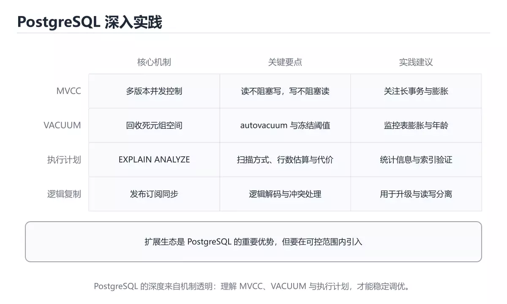
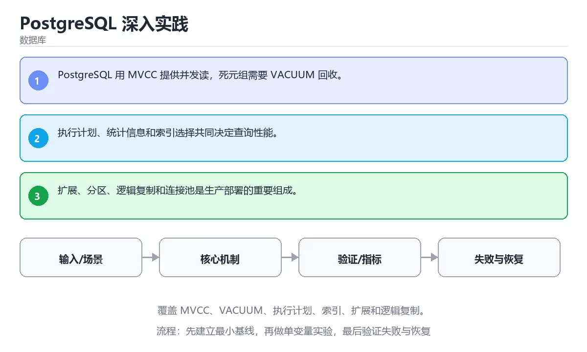

# PostgreSQL 深入实践





> 内容更新时间：2026-10-06 · 学习阶段：进阶 · 预计用时：40 分钟

## 本节知识框架

**课程定位**：所属分类 `database`（数据库），课程主题 `PostgreSQL 深入实践`，学习阶段 进阶，建议用时 45 分钟。

本课主线：覆盖 MVCC、VACUUM、执行计划、索引、扩展和逻辑复制。

**学完本课应当能够**
- 说清 `PostgreSQL` 与 `MVCC` 的含义与区别，并各举一个正例和一个反例。
- 用本课示例验证 `执行计划` 的行为，记录输入、输出与失败条件。
- 遇到「忽视清理与膨胀」这类问题时，能说出触发条件与修复顺序。

### 从概念到验证的学习链条

1. `PostgreSQL`：先掌握 开源关系数据库，以事务、扩展类型和丰富 SQL 能力著称，再用它解释 `MVCC` 为什么会出现。
2. `MVCC`：先掌握 多版本并发控制：写新版本、读旧快照，让读写互不阻塞，代价是版本清理与表膨胀，再用它解释 `执行计划` 为什么会出现。
3. `执行计划`：先掌握 优化器给出的算子树与代价估算（EXPLAIN），用来判断扫描方式、连接顺序与索引是否生效，再用它解释 `VACUUM` 为什么会出现。
4. `VACUUM`：先掌握 回收 MVCC 留下的死元组并更新统计信息，长期不跑会导致表膨胀与执行计划退化，再用它解释 本课示例的观察结果 为什么会出现。

**先修与衔接**：本课是「数据库」分类的第 18 课。相关或后续课程：《图数据库与关系查询》。

### 完成判据

- **定义关**：不看正文也能说明 `PostgreSQL` 是 开源关系数据库，以事务、扩展类型和丰富 SQL 能力著称，并指出一个反例。
- **机制关**：能按“输入 → 转换 → 输出 → 验证”复述 `PostgreSQL 深入实践`，而不是只背结论。
- **示例关**：能运行或推演 `PostgreSQL 深入实践` 的 `text` 示例，并说明一个真实出现的标识符或字面量。
- **证据关**：能指出 `PostgreSQL 深入实践` 示例里的 调用了 `events()`，并说明它支持或反驳了本课的哪一条结论。
- **排错关**：能复现 忽视清理与膨胀，记录现象并按 监控死元组与膨胀率，按需调整自动清理参数 修复。
- **迁移关**：能把 `PostgreSQL`、`MVCC`、`VACUUM`、`执行计划` 放进一个与 `PostgreSQL 深入实践` 不同的项目场景，并保持输入与验证条件可追踪。
- **复盘关**：学完 `PostgreSQL 深入实践` 后，用一句话写下仍然不确定的结论，并列出下一次验证需要的输入、环境和成功判据。

### 复习清单

- [ ] 能不看正文复述本课核心术语，并指出一个边界或反例。
- [ ] 能运行或推演本课示例，记录输入、输出与失败现象。
- [ ] 能完成一次自测，并把错题对照错误表定位原因。

## 核心概念定义

| 术语 | 操作性定义 | 常见边界与风险 |
| --- | --- | --- |
| PostgreSQL | 开源关系数据库，以事务、扩展类型和丰富 SQL 能力著称。 | 隔离级别与并发事务会影响可见性，换级别或换存储引擎后要重新验证。 |
| MVCC | 多版本并发控制：写新版本、读旧快照，让读写互不阻塞，代价是版本清理与表膨胀。 | 不同版本与依赖组合的行为可能不同，升级或换环境前要按官方变更说明重新验证。 |
| 执行计划 | 优化器给出的算子树与代价估算（EXPLAIN），用来判断扫描方式、连接顺序与索引是否生效。 | 易错：优化方向全靠猜；正确做法是用 EXPLAIN ANALYZE 看真实行数与耗时分布。 |
| VACUUM | 回收 MVCC 留下的死元组并更新统计信息，长期不跑会导致表膨胀与执行计划退化。 | 只在「回收 MVCC 留下的死元组并更新统计信息，长期不跑会导致表膨胀与执行计划退化」这一前提下成立，换输入或换环境要重新验证。 |

## 原理与运行机制

### 机制总览

**教材衔接：核心知识**

### 1. PostgreSQL 用 MVCC 提供并发读，死元组需要 VACUUM 回收。

- 关键做法：基线只保留 MVCC 必需的部分，其余条件一次加一个。
- 验证标准：PostgreSQL 的结果可复现、错误可解释、失败能恢复。

### 2. 执行计划、统计信息和索引选择共同决定查询性能。

把这条结论放回「PostgreSQL 深入实践」的完整流程里展开：

- 正文依据：能用自己的话解释：PostgreSQL 用 MVCC 提供并发读，死元组需要 VACUUM 回收。
- 落地检查：把「2. 执行计划、统计信息和索引选择共同决定查询性能。」改写成一条可执行的核对项，逐条验证输入、超时与失败路径。

### 3. 扩展、分区、逻辑复制和连接池是生产部署的重要组成。

把这条结论放回「PostgreSQL 深入实践」的完整流程里展开：

- 正文依据：能用自己的话解释：执行计划、统计信息和索引选择共同决定查询性能。
- 落地检查：把「3. 扩展、分区、逻辑复制和连接池是生产部署的重要组成。」改写成一条可执行的核对项，逐条验证输入、超时与失败路径。

**教材衔接：关键流程**

**教材衔接：实践路径**

**教材衔接：验证步骤**

### 机制拆解：每一步的输入、动作与输出

#### 1. `PostgreSQL`
- 输入：`PostgreSQL`；本步把 开源关系数据库，以事务、扩展类型和丰富 SQL 能力著称 当作判断规则。
- 动作：围绕 `PostgreSQL` 保留中间状态，并记录它与 `MVCC` 的对应关系。
- 输出：`MVCC`，它可以被下一段代码、测试或记录继续使用。
- `PostgreSQL` 的失败条件：隔离级别与并发事务会影响可见性，换级别或换存储引擎后要重新验证。

#### 2. `MVCC`
- 输入：`PostgreSQL`；本步把 多版本并发控制：写新版本、读旧快照，让读写互不阻塞，代价是版本清理与表膨胀 当作判断规则。
- 动作：围绕 `MVCC` 保留中间状态，并记录它与 `执行计划` 的对应关系。
- 输出：`执行计划`，它可以被下一段代码、测试或记录继续使用。
- `MVCC` 的失败条件：不同版本与依赖组合的行为可能不同，升级或换环境前要按官方变更说明重新验证。

#### 3. `执行计划`
- 输入：`MVCC`；本步把 优化器给出的算子树与代价估算（EXPLAIN），用来判断扫描方式、连接顺序与索引是否生效 当作判断规则。
- 动作：围绕 `执行计划` 保留中间状态，并记录它与 `VACUUM` 的对应关系。
- 输出：`VACUUM`，它可以被下一段代码、测试或记录继续使用。
- `执行计划` 的失败条件：当不看执行计划就调优时，会出现优化方向全靠猜。

#### 4. `VACUUM`
- 输入：`执行计划`；本步把 回收 MVCC 留下的死元组并更新统计信息，长期不跑会导致表膨胀与执行计划退化 当作判断规则。
- 动作：围绕 `VACUUM` 保留中间状态，并记录它与 `events` 的对应关系。
- 输出：`events`，它可以被下一段代码、测试或记录继续使用。
- `VACUUM` 的失败条件：只在「回收 MVCC 留下的死元组并更新统计信息，长期不跑会导致表膨胀与执行计划退化」这一前提下成立，换输入或换环境要重新验证。

### 示例中的可观察事实

1. 调用了 `events()`；它对应的课程主题是 `PostgreSQL 深入实践`。
2. 调用了 `VALUES()`；它对应的课程主题是 `PostgreSQL 深入实践`。
3. 调用了 `count()`；它对应的课程主题是 `PostgreSQL 深入实践`。
4. 出现字面量 `2026-10-01`；它对应的课程主题是 `PostgreSQL 深入实践`。
5. 出现字面量 `click`；它对应的课程主题是 `PostgreSQL 深入实践`。
6. 出现字面量 `view`；它对应的课程主题是 `PostgreSQL 深入实践`。
7. 出现字面量 `2026-10-02`；它对应的课程主题是 `PostgreSQL 深入实践`。

### 复现实验记录

- 环境：`PostgreSQL 深入实践` 使用 `text` 示例，固定 `PostgreSQL`、`MVCC`、`VACUUM`、`执行计划` 作为第一组条件。
- 首轮输入：先确认 调用了 `events()`，预测 `PostgreSQL` 会怎样变化。
- 基线观察：记录命令、输入、输出和错误原文，不用截图代替可复制的文本。
- 单变量修改：只改变 `PostgreSQL`，观察 `VACUUM` 是否仍满足定义。
- 失败注入：复现 忽视清理与膨胀，确认现象是 表和索引膨胀，查询逐月变慢。
- 记录结论：把“修改前、修改后、预期变化、实际变化”写成四列表，这样复盘 `PostgreSQL 深入实践` 时才能区分概念错误与实现错误。

## 典型应用场景

**教材衔接：深度拓展与实战**

这一节把 核心知识 中容易混淆的两点写成对照与反例。

### 机制拆解

- **1. PostgreSQL 用 MVCC 提供并发读，死元组需要 VACUUM 回收。**：在「PostgreSQL 深入实践」里，「1. PostgreSQL 用 MVCC 提供并发读，死元组需要 VACUUM 回收。」这一步要先写清输入与预期，再记录实际结果和差异；结果不符时回到对应小节核对前提。
- **2. 执行计划、统计信息和索引选择共同决定查询性能。**：在「PostgreSQL 深入实践」里，「2. 执行计划、统计信息和索引选择共同决定查询性能。」这一步要先写清输入与预期，再记录实际结果和差异；结果不符时回到对应小节核对前提。
- **3. 扩展、分区、逻辑复制和连接池是生产部署的重要组成。**：在「PostgreSQL 深入实践」里，「3. 扩展、分区、逻辑复制和连接池是生产部署的重要组成。」这一步要先写清输入与预期，再记录实际结果和差异；结果不符时回到对应小节核对前提。
- **考点 1：关于「PostgreSQL 用 MVCC 提供并发读」，下列说法正确的是？**：先独立作答，再回到本课对应小节核对判断依据；答错时记录是哪一个前提被忽略。
- **考点 2：核心知识 的代码阅读题**：先独立作答，再回到本课正文核对 VALUES 的执行路径；答错时记录是哪一个前提被忽略。


### 工程检查表

- [ ] 能否用自己的话说明PostgreSQL 深入实践解决什么问题，以及它不负责什么？
- [ ] 能否说明 PostgreSQL 的正常输出，以及失败时留下的错误信息？
- [ ] 能否解释本课关键词在真实项目中的边界与取舍？
- [ ] 能否说明 MVCC 在新场景下需要补充什么前提？

### 迁移练习

1. 保持正文示例不变，写出它的输入、处理步骤和预期输出。
2. 只改变 PostgreSQL 的一个条件，预测结果并说明依据；再运行或手算验证。
3. 结合PostgreSQL、MVCC、VACUUM、执行计划，写出一个真实项目中的使用场景。
4. 写下一个反例，说明它在什么条件下会使朴素做法失效。

<!-- p0-depth-v2:start -->

- **忽视清理与膨胀**：典型现象是表和索引膨胀，查询逐月变慢；正确做法是监控死元组与膨胀率，按需调整自动清理参数。
- **用 OFFSET 深分页**：典型现象是页码越大越慢；正确做法是改用基于游标或键集的分页。
- **不看执行计划就调优**：典型现象是优化方向全靠猜；正确做法是用 EXPLAIN ANALYZE 看真实行数与耗时分布。

### 最小验证场景

- 准备：保留 `text` 示例的原始输入，先记录 `PostgreSQL 深入实践` 的基线输出和完整运行命令。
- 观察：先核对 调用了 `events()`，再改变一个与 `PostgreSQL` 相关的条件。
- 判定：新结果与 `PostgreSQL 深入实践` 的基线不同不等于错误；只有当差异破坏了 `PostgreSQL` 的定义或错误表中的约束，才判定为失败。

### 选择与边界

- 使用 `PostgreSQL` 时，先满足它的定义：开源关系数据库，以事务、扩展类型和丰富 SQL 能力著称；隔离级别与并发事务会影响可见性，换级别或换存储引擎后要重新验证。
- 使用 `MVCC` 时，先满足它的定义：多版本并发控制：写新版本、读旧快照，让读写互不阻塞，代价是版本清理与表膨胀；不同版本与依赖组合的行为可能不同，升级或换环境前要按官方变更说明重新验证。
- 使用 `执行计划` 时，先满足它的定义：优化器给出的算子树与代价估算（EXPLAIN），用来判断扫描方式、连接顺序与索引是否生效；易错：优化方向全靠猜；正确做法是用 EXPLAIN ANALYZE 看真实行数与耗时分布。
- 使用 `VACUUM` 时，先满足它的定义：回收 MVCC 留下的死元组并更新统计信息，长期不跑会导致表膨胀与执行计划退化；只在「回收 MVCC 留下的死元组并更新统计信息，长期不跑会导致表膨胀与执行计划退化」这一前提下成立，换输入或换环境要重新验证。

## 代码/协议/SQL 示例

### 最小可验证示例

**教材衔接：零基础精讲：把PostgreSQL 深入实践真正讲透**

### 先建立一个直觉

把数据库看成一本多人同时改写的账本：先定义事实与约束，再考虑索引、并发和恢复，最后才讨论性能。落到本课，「PostgreSQL 深入实践」关心的是 PostgreSQL 与 MVCC 的配合，也就是说这条直觉要在 核心知识 里被具体验证。

本课的摘要可以当作一张地图：覆盖 MVCC、VACUUM、执行计划、索引、扩展和逻辑复制。

### 逐步拆解

1. 澄清输入与目标。先写清「PostgreSQL 深入实践」要解决的问题、合法输入范围和成功标准，再进入后续步骤。
2. 描述处理过程。把「PostgreSQL、MVCC、VACUUM、执行计划」映射到具体步骤，每步都要求能单独验证。
3. 定义输出。PostgreSQL 的输出不仅包括正常结果，还包括错误码、日志和资源释放状态。
4. 构造一次PostgreSQL越界，记录系统是拒绝、降级还是静默出错；三者对应的修复策略完全不同。
5. 用 VALUES 构造一个最小反例，证明「PostgreSQL 深入实践」的结论有边界。

### 把正文串成一条执行链

- **考点 3：关于「扩展、分区、逻辑复制和连接池是生产部署的重要组成。」，下列说法正确的是？**：先独立作答，再回到本课对应小节核对判断依据；答错时记录是哪一个前提被忽略。

### 从测验反推易错点

- 参考判断：PostgreSQL 用 MVCC 提供并发读
- 自问：如果去掉题干里的一个限定词，结论还成立吗？

- 参考判断：执行计划、统计信息和索引选择共同决定查询性能。

- 参考判断：扩展、分区、逻辑复制和连接池是生产部署的重要组成。

**检查点 4：本课的核心学习目标是什么？**

- 参考判断：覆盖 MVCC、VACUUM、执行计划、索引、扩展和逻辑复制。

- 参考判断：PostgreSQL、MVCC

### 工程排错顺序

| 先查什么 | 要得到的证据 | 判断标准 |
| --- | --- | --- |
| 事务边界是否覆盖全部写操作？ | 日志、输入样例、测试或指标 | 能复现并解释，才算定位 |
| 索引是否匹配真实查询与排序？ | 日志、输入样例、测试或指标 | 能复现并解释，才算定位 |
| 迁移是否可回滚、可灰度、可校验？ | 日志、输入样例、测试或指标 | 能复现并解释，才算定位 |
| 锁等待与慢查询是否有观测？ | 日志、输入样例、测试或指标 | 能复现并解释，才算定位 |

### 变式训练

1. 先用一个单文件示例验证 VALUES，确认正确性后再引入框架或分布式组件。
2. 把 VALUES 的数据量提高一个数量级，观察延迟与内存的变化拐点。
3. 把 MVCC 换成失败输入，记录错误信息与恢复动作。
5. 把「PostgreSQL 深入实践」里最容易被省略的一步去掉，用测试或指标证明它不可省略，而不是凭感觉判断。
6. 在低带宽或低算力条件下重跑 MVCC，记录降级路径是否仍然可用。


### 迁移案例库

下面用不同约束重复同一套方法，每轮只改变 PostgreSQL 的一个取值并记录结论。

#### 迁移案例 1：围绕「PostgreSQL」做一次小实验

**验收**：结论要能追溯到正文的具体小节与代码位置，并记录MVCC相关的指标变化。

#### 迁移案例 2：围绕「MVCC」做一次小实验

**步骤**：
1. 复述当前方案对「MVCC」的假设，写成一句可证伪的话。


#### 迁移案例 4：围绕「执行计划」做一次小实验

**步骤**：
1. 复述当前方案对「执行计划」的假设，写成一句可证伪的话。

#### 迁移案例 5：围绕「PostgreSQL」做一次小实验

**步骤**：

#### 迁移案例 6：围绕「MVCC」做一次小实验

**步骤**：

#### 迁移案例 7：围绕「VACUUM」做一次小实验

**步骤**：

#### 迁移案例 8：围绕「执行计划」做一次小实验

**步骤**：

#### 迁移案例 9：围绕「PostgreSQL」做一次小实验

**步骤**：

#### 迁移案例 10：围绕「MVCC」做一次小实验

**步骤**：

#### 迁移案例 11：围绕「VACUUM」做一次小实验

**步骤**：

#### 迁移案例 12：围绕「执行计划」做一次小实验

**步骤**：

#### 迁移案例 13：围绕「PostgreSQL」做一次小实验

**步骤**：

#### 迁移案例 14：围绕「MVCC」做一次小实验

**步骤**：

#### 迁移案例 15：围绕「VACUUM」做一次小实验

**步骤**：

#### 迁移案例 16：围绕「执行计划」做一次小实验

**步骤**：

<!-- p0-depth-v2:end -->

**教材衔接：最小可运行示例**

先用 VALUES 跑通最小示例，然后只改一个与 PostgreSQL 相关的取值：

```sql
WITH events(day, kind) AS (
  VALUES (DATE '2026-10-01', 'click'),
         (DATE '2026-10-01', 'view'),
         (DATE '2026-10-02', 'click')
)
SELECT day, count(*) AS events
FROM events
GROUP BY day
ORDER BY day;
```

**教材衔接：预期输出**

```text
day        | events
2026-10-01 |      2
2026-10-02 |      1
```

### 示例精读：先找证据，再改一个条件

1. 调用了 `events()`；它出现在 `PostgreSQL 深入实践` 的示例中，阅读时先确认它前后各发生了什么。
2. 调用了 `VALUES()`；它出现在 `PostgreSQL 深入实践` 的示例中，阅读时先确认它前后各发生了什么。
3. 调用了 `count()`；它出现在 `PostgreSQL 深入实践` 的示例中，阅读时先确认它前后各发生了什么。
4. 出现字面量 `2026-10-01`；它出现在 `PostgreSQL 深入实践` 的示例中，阅读时先确认它前后各发生了什么。
5. 出现字面量 `click`；它出现在 `PostgreSQL 深入实践` 的示例中，阅读时先确认它前后各发生了什么。
6. 出现字面量 `view`；它出现在 `PostgreSQL 深入实践` 的示例中，阅读时先确认它前后各发生了什么。
7. 出现字面量 `2026-10-02`；它出现在 `PostgreSQL 深入实践` 的示例中，阅读时先确认它前后各发生了什么。
- 在 `PostgreSQL 深入实践` 中与 `PostgreSQL` 对照：示例必须能支持 开源关系数据库，以事务、扩展类型和丰富 SQL 能力著称，否则说明这一段还缺少实现或验证步骤。
- 在 `PostgreSQL 深入实践` 中与 `MVCC` 对照：示例必须能支持 多版本并发控制：写新版本、读旧快照，让读写互不阻塞，代价是版本清理与表膨胀，否则说明这一段还缺少实现或验证步骤。
- 在 `PostgreSQL 深入实践` 中与 `执行计划` 对照：示例必须能支持 优化器给出的算子树与代价估算（EXPLAIN），用来判断扫描方式、连接顺序与索引是否生效，否则说明这一段还缺少实现或验证步骤。
- 在 `PostgreSQL 深入实践` 中与 `VACUUM` 对照：示例必须能支持 回收 MVCC 留下的死元组并更新统计信息，长期不跑会导致表膨胀与执行计划退化，否则说明这一段还缺少实现或验证步骤。

## 时间/空间复杂度或性能分析

**性能关注点（PostgreSQL 深入实践）**：扫描行数与索引命中决定开销：记录查询耗时、执行计划与锁等待。

**本课特有开销（PostgreSQL 深入实践 · PostgreSQL）**：索引能减少扫描行数，但会增加写入与存储开销，需要同时记录读、写两侧代价。

**测量方法**：以 `PostgreSQL 深入实践` 的 `PostgreSQL` 场景为对象，固定输入跑一遍记录基线，再把规模或并发度提高一个数量级复测；两次结果的差值与波动范围才是结论依据。

### 需要控制的变量与记录项

- `PostgreSQL 深入实践` 的 `PostgreSQL`：固定它的版本、输入范围和资源上限，分别记录速度、内存与失败率的变化。
- `PostgreSQL 深入实践` 的 `MVCC`：固定它的版本、输入范围和资源上限，分别记录速度、内存与失败率的变化。
- `PostgreSQL 深入实践` 的 `VACUUM`：固定它的版本、输入范围和资源上限，分别记录速度、内存与失败率的变化。
- `PostgreSQL 深入实践` 的 `执行计划`：固定它的版本、输入范围和资源上限，分别记录速度、内存与失败率的变化。
- `PostgreSQL 深入实践` 中 `PostgreSQL` 的边界：隔离级别与并发事务会影响可见性，换级别或换存储引擎后要重新验证。达到边界时不要外推，必须重新测量。
- `PostgreSQL 深入实践` 中 `MVCC` 的边界：不同版本与依赖组合的行为可能不同，升级或换环境前要按官方变更说明重新验证。达到边界时不要外推，必须重新测量。
- `PostgreSQL 深入实践` 中 `执行计划` 的边界：易错：优化方向全靠猜；正确做法是用 EXPLAIN ANALYZE 看真实行数与耗时分布。达到边界时不要外推，必须重新测量。
- `PostgreSQL 深入实践` 中 `VACUUM` 的边界：只在「回收 MVCC 留下的死元组并更新统计信息，长期不跑会导致表膨胀与执行计划退化」这一前提下成立，换输入或换环境要重新验证。达到边界时不要外推，必须重新测量。
- `PostgreSQL 深入实践` 的代码证据：先验证 调用了 `events()`，再记录该路径的输入规模与耗时；只看代码行数不能推出复杂度。

## 常见误区与易错点

| 容易写错的做法 | 实际现象 | 原因与正确做法 |
| --- | --- | --- |
| 忽视清理与膨胀 | 表和索引膨胀，查询逐月变慢。 | 监控死元组与膨胀率，按需调整自动清理参数。 |
| 用 OFFSET 深分页 | 页码越大越慢。 | 改用基于游标或键集的分页。 |
| 不看执行计划就调优 | 优化方向全靠猜。 | 用 EXPLAIN ANALYZE 看真实行数与耗时分布。 |

### 现场 1：忽视清理与膨胀

**症状**：表和索引膨胀，查询逐月变慢。

**根因与修复**：监控死元组与膨胀率，按需调整自动清理参数。

**自检**：在本课示例里复现「忽视清理与膨胀」，改成监控死元组与膨胀率，按需调整自动清理参数后重跑；如果症状消失且失败路径按预期变化，说明定位正确。

### 现场 2：用 OFFSET 深分页

**症状**：页码越大越慢。

**根因与修复**：改用基于游标或键集的分页。

**自检**：在本课示例里复现「用 OFFSET 深分页」，改成改用基于游标或键集的分页后重跑；如果症状消失且失败路径按预期变化，说明定位正确。

### 现场 3：不看执行计划就调优

**症状**：优化方向全靠猜。

**根因与修复**：用 EXPLAIN ANALYZE 看真实行数与耗时分布。

**自检**：在本课示例里复现「不看执行计划就调优」，改成用 EXPLAIN ANALYZE 看真实行数与耗时分布后重跑；如果症状消失且失败路径按预期变化，说明定位正确。

## 与其他知识点的关系

**教材衔接：复习与迁移**

### 概念复述

- 用一句话说明「PostgreSQL 深入实践」解决什么问题：覆盖 MVCC、VACUUM、执行计划、索引、扩展和逻辑复制。
- 写出PostgreSQL、MVCC、VACUUM之间的关系，并各举一个例子。
- 说出本课最容易混淆的两个概念，以及区分它们的判据。

### 正文逐节复核

- **零基础精讲：把PostgreSQL 深入实践真正讲透**：本课的摘要可以当作一张地图：覆盖 MVCC、VACUUM、执行计划、索引、扩展和逻辑复制。


### 迁移练习

- **相关或后续**：`图数据库与关系查询`。本课术语会在这些课程里继续使用。
- **术语归属**：`PostgreSQL`、`MVCC`、`执行计划` 的定义以本课「核心概念定义」为准，换到其他课程时先确认定义是否被改写。
- 同一分类的《查询优化与执行计划》也涉及 `执行计划`；两课衔接时先确认这个术语的定义是否一致。
- 同一分类的《MySQL 锁与 MVCC》也涉及 `MVCC`；两课衔接时先确认这个术语的定义是否一致。

### 先修与后续术语接口

- `图数据库与关系查询`：两者通过本分类的学习顺序衔接，阅读时重点比较各自的输入与失败条件。

### 容易混淆的相邻概念

- `PostgreSQL` 与 `MVCC`：前者强调 开源关系数据库，以事务、扩展类型和丰富 SQL 能力著称；后者强调 多版本并发控制：写新版本、读旧快照，让读写互不阻塞，代价是版本清理与表膨胀。判断时分别检查两条定义的适用范围，不要只看名称相似就互换。
- `MVCC` 与 `执行计划`：前者强调 多版本并发控制：写新版本、读旧快照，让读写互不阻塞，代价是版本清理与表膨胀；后者强调 优化器给出的算子树与代价估算（EXPLAIN），用来判断扫描方式、连接顺序与索引是否生效。判断时分别检查两条定义的适用范围，不要只看名称相似就互换。
- `执行计划` 与 `VACUUM`：前者强调 优化器给出的算子树与代价估算（EXPLAIN），用来判断扫描方式、连接顺序与索引是否生效；后者强调 回收 MVCC 留下的死元组并更新统计信息，长期不跑会导致表膨胀与执行计划退化。判断时分别检查两条定义的适用范围，不要只看名称相似就互换。

## 自测题与参考答案

> 先独立作答，再对照参考答案；答案都能在本课正文、术语表或错误表里找到依据。

### 自测 1（概念复述）

不看正文，写出 `PostgreSQL` 的操作性定义，并说明它与 `MVCC` 的区别。

**参考答案**：开源关系数据库，以事务、扩展类型和丰富 SQL 能力著称。

`MVCC` 的定位是：多版本并发控制：写新版本、读旧快照，让读写互不阻塞，代价是版本清理与表膨胀；两者的差别要从适用对象与失败模式上说明。

### 自测 2（排错）

本课错误表记录了「忽视清理与膨胀」这类做法。请写出它会出现的现象、根因，以及修复顺序。

**参考答案**：现象是表和索引膨胀，查询逐月变慢；正确做法是监控死元组与膨胀率，按需调整自动清理参数。修复时先复现现象并保留证据，再改动一处假设重跑，确认现象消失。

### 自测 3（动手验证）

运行本课的 `text` 示例，改动其中一个输入后重新运行，记录输出与错误信息。

**参考答案**：正常输入下 `text` 示例应当复现正文给出的结果；改动输入后，如果结果改变或报错，先核对它是否满足 `PostgreSQL 深入实践` 中`PostgreSQL` 的适用范围，再检查错误表里是否有同类现象。

### 自测 4（代码阅读）

阅读本课开头的 `text` 示例，说明它体现了`PostgreSQL` 的哪一条性质，并指出改动哪个输入会让这条性质不再成立。

**参考答案**：`PostgreSQL` 的定义是 开源关系数据库，以事务、扩展类型和丰富 SQL 能力著称，示例正是在实现这条定义。改动与 `PostgreSQL` 有关的一个输入后，如果结果不再符合 `PostgreSQL 深入实践` 的正文描述，就说明该性质只在当前前提成立。

### 自测 5（迁移）

把 `PostgreSQL 深入实践` 的方法迁移到自己的项目：围绕 `PostgreSQL` 写出一个与错误表同类的风险点，并说明触发条件和检验方式。

**参考答案**：例如「不看执行计划就调优」，它会导致优化方向全靠猜；检验方式是按用 EXPLAIN ANALYZE 看真实行数与耗时分布改一处再复现，确认现象消失且没有引入新的失败分支。

### 自测 6（对比）

用一个表格对比 `PostgreSQL` 与 `MVCC`：各写一行适用场景、一行失败表现。

**参考答案**：`PostgreSQL` 的定义是开源关系数据库，以事务、扩展类型和丰富 SQL 能力著称；`MVCC` 的定义是多版本并发控制：写新版本、读旧快照，让读写互不阻塞，代价是版本清理与表膨胀。两者的失败表现分别对应本课错误表里与本术语相关的行。

### 自测 7（排错顺序）

面对「忽视清理与膨胀」引发的问题，请把“复现 表和索引膨胀，查询逐月变慢 → 保留证据 → 监控死元组与膨胀率，按需调整自动清理参数 → 回归验证”四步写成可执行的检查清单。

**参考答案**：第一步按表和索引膨胀，查询逐月变慢复现；第二步记录输入、版本与完整报错；第三步按监控死元组与膨胀率，按需调整自动清理参数只改一处；第四步重跑并确认失败路径也按预期变化。

### 自测 8（边界判断）

针对 `VACUUM`，分别写出“可以使用”的条件和“结论不再成立”的条件。

**参考答案**：只在「回收 MVCC 留下的死元组并更新统计信息，长期不跑会导致表膨胀与执行计划退化」这一前提下成立，换输入或换环境要重新验证。 同时要把 `VACUUM` 的定义 回收 MVCC 留下的死元组并更新统计信息，长期不跑会导致表膨胀与执行计划退化 与实际输入逐项对照。

### 自测 9（机制重建）

不看正文，按输入、转换、输出、验证四段重建 `PostgreSQL` → `MVCC` → `执行计划` → `VACUUM` 的作用链。

**参考答案**：起点是 `PostgreSQL` 的定义 开源关系数据库，以事务、扩展类型和丰富 SQL 能力著称；中间每一步都保留可观察状态；终点由 `VACUUM` 检查，失败时回到错误表定位第一个偏离定义的步骤。

### 自测 10（综合排错）

在 `PostgreSQL 深入实践` 中，现象是 优化方向全靠猜。请围绕 不看执行计划就调优 写出最小复现、关键证据、修复动作和回归验证，并说明为什么不能只凭一次运行下结论。

**参考答案**：先复现 不看执行计划就调优，记录输入与完整错误；再按 用 EXPLAIN ANALYZE 看真实行数与耗时分布 只改一处。回归时同时跑正常路径和边界路径，只有两次结果都可解释，才把修复视为完成。

### 自测 11（一分钟复述）

用每分钟约 200 字的速度复述 `PostgreSQL 深入实践`：先给主问题，再按顺序说出 `PostgreSQL`、`MVCC`、`执行计划`、`VACUUM`，最后给一个失败案例。

**自评标准**：主问题必须对应 覆盖 MVCC、VACUUM、执行计划、索引、扩展和逻辑复制；每个术语都要能接上一句定义或边界；失败案例必须写成可观察现象，不能用“可能有风险”代替证据。

## 术语速查

| 术语 | 一句话说明 |
| --- | --- |
| `PostgreSQL` | 开源关系数据库，以事务、扩展类型和丰富 SQL 能力著称。 |
| `MVCC` | 多版本并发控制：写新版本、读旧快照，让读写互不阻塞，代价是版本清理与表膨胀。 |
| `执行计划` | 优化器给出的算子树与代价估算（EXPLAIN），用来判断扫描方式、连接顺序与索引是否生效。 |
| `VACUUM` | 回收 MVCC 留下的死元组并更新统计信息，长期不跑会导致表膨胀与执行计划退化。 |

**术语关系**：`PostgreSQL`（开源关系数据库） → `MVCC`（多版本并发控制：写新版本、读旧快照） → `执行计划`（优化器给出的算子树与代价估算（EXPLAIN）） → `VACUUM`（回收 MVCC 留下的死元组并更新统计信息）。

## 考点精讲

`PostgreSQL 深入实践` 的题库有 6 道题，下面逐题给出题干、正确项与判断依据：先自己作答，再核对正确项，最后回到正文对应小节复核。

### 考点 1：第 1 题

- **题目**：在 `PostgreSQL 深入实践` 里，与 `PostgreSQL` 有关的说法中，哪一项最符合覆盖 MVCC、VACUUM、执行计划、索引、扩展和逻辑复制。？
- **正确项**：PostgreSQL 用 MVCC 提供并发读
- **判断依据**：这道题落在术语 `PostgreSQL` 上：开源关系数据库，以事务、扩展类型和丰富 SQL 能力著称。复习时把 `PostgreSQL` 的定义、适用边界和一个反例一起说清楚，再回到「核心概念定义」核对原文。

### 考点 2：第 2 题

- **题目**：代码语言为 `sql`，选自 `PostgreSQL 深入实践` 的 `PostgreSQL` 部分。课程问题为覆盖 MVCC、VACUUM、执行计划、索引、扩展和逻辑复制。哪一项描述与代码一致？
- **正确项**：出现字面量 `click`
- **判断依据**：这道题落在术语 `PostgreSQL` 上：开源关系数据库，以事务、扩展类型和丰富 SQL 能力著称。复习时把 `PostgreSQL` 的定义、适用边界和一个反例一起说清楚，再回到「核心概念定义」核对原文。

### 考点 3：第 3 题

- **题目**：在 `PostgreSQL 深入实践` 里，与 `PostgreSQL` 有关的说法中，哪一项最符合覆盖 MVCC、VACUUM、执行计划、索引、扩展和逻辑复制。？（PostgreSQL 深入实践·数据库 第 3 题）
- **正确项**：扩展、分区、逻辑复制和连接池是生产部署的重要组成。
- **判断依据**：这道题落在术语 `PostgreSQL` 上：开源关系数据库，以事务、扩展类型和丰富 SQL 能力著称。复习时把 `PostgreSQL` 的定义、适用边界和一个反例一起说清楚，再回到「核心概念定义」核对原文。

### 考点 4：第 4 题

- **题目**：`PostgreSQL 深入实践` 的主线是：覆盖 MVCC、VACUUM、执行计划、索引、扩展和逻辑复制。下面哪一项与这条主线一致？
- **正确项**：覆盖 MVCC、VACUUM、执行计划、索引、扩展和逻辑复制。
- **判断依据**：这道题落在术语 `PostgreSQL` 上：开源关系数据库，以事务、扩展类型和丰富 SQL 能力著称。复习时把 `PostgreSQL` 的定义、适用边界和一个反例一起说清楚，再回到「核心概念定义」核对原文。

### 考点 5：第 5 题

- **题目**：课程 `覆盖 MVCC、VACUUM、执行计划、索引、扩展和逻辑复制。`。在 `PostgreSQL 深入实践` 里，`PostgreSQL`、`MVCC` 与下面哪些选项属于同一层概念？（多选）
- **正确项**：PostgreSQL；MVCC
- **判断依据**：这道题落在术语 `PostgreSQL` 上：开源关系数据库，以事务、扩展类型和丰富 SQL 能力著称。复习时把 `PostgreSQL` 的定义、适用边界和一个反例一起说清楚，再回到「核心概念定义」核对原文。

### 考点 6：第 6 题

- **题目**：下面几项都与 `PostgreSQL` 有关，请按 `PostgreSQL 深入实践` 的正文顺序排列；该课主线是覆盖 MVCC、VACUUM、执行计划、索引、扩展和逻辑复制。
- **正确项**：核心知识 → 关键流程 → 实践路径 → 常见误区
- **判断依据**：这道题落在术语 `PostgreSQL` 上：开源关系数据库，以事务、扩展类型和丰富 SQL 能力著称。复习时把 `PostgreSQL` 的定义、适用边界和一个反例一起说清楚，再回到「核心概念定义」核对原文。

### 考点 7：`PostgreSQL`

- **要点**：开源关系数据库，以事务、扩展类型和丰富 SQL 能力著称。
- **PostgreSQL 的边界**：隔离级别与并发事务会影响可见性，换级别或换存储引擎后要重新验证。

### 考点 8：`MVCC`

- **要点**：多版本并发控制：写新版本、读旧快照，让读写互不阻塞，代价是版本清理与表膨胀。
- **MVCC 的边界**：不同版本与依赖组合的行为可能不同，升级或换环境前要按官方变更说明重新验证。

### 考点 9：`执行计划`

- **要点**：优化器给出的算子树与代价估算（EXPLAIN），用来判断扫描方式、连接顺序与索引是否生效。
- **执行计划 的边界**：易错：优化方向全靠猜；正确做法是用 EXPLAIN ANALYZE 看真实行数与耗时分布。

### 考点 10：`VACUUM`

- **要点**：回收 MVCC 留下的死元组并更新统计信息，长期不跑会导致表膨胀与执行计划退化。
- **VACUUM 的边界**：只在「回收 MVCC 留下的死元组并更新统计信息，长期不跑会导致表膨胀与执行计划退化」这一前提下成立，换输入或换环境要重新验证。

### 考点 11：排错——忽视清理与膨胀

- **现象**：表和索引膨胀，查询逐月变慢。
- **处理**：监控死元组与膨胀率，按需调整自动清理参数。

### 考点 12：排错——用 OFFSET 深分页

- **现象**：页码越大越慢。
- **处理**：改用基于游标或键集的分页。

### 考点 13：综合辨析——`PostgreSQL` 与 `VACUUM`

- **辨析点**：`PostgreSQL` 的定义是 开源关系数据库，以事务、扩展类型和丰富 SQL 能力著称；`VACUUM` 的定义是 回收 MVCC 留下的死元组并更新统计信息，长期不跑会导致表膨胀与执行计划退化。
- **答题要求**：面对 `PostgreSQL 深入实践` 的题目，先判断描述的是 `PostgreSQL` 还是 `VACUUM`，再归到对应定义，最后写出一个会让该定义失效的边界输入。

### 考点 14：排错评分点

- **现象分**：能写出 表和索引膨胀，查询逐月变慢，而不是只写“程序有错”。
- **证据分**：保留触发 忽视清理与膨胀 的输入、版本和错误原文。
- **修复分**：按 监控死元组与膨胀率，按需调整自动清理参数 只改一处，并同时回归正常路径与边界路径。

## 内容元数据

- 内容版本：v2.0
- 最后更新：2026-10-06
- 学习阶段：进阶
- 适用环境：PostgreSQL / MySQL / SQLite 等主流数据库；本课聚焦其中的 PostgreSQL。
- 内容来源：内置结构化课程与工程实践整理
- 相关主题：PostgreSQL、MVCC、VACUUM、执行计划
- 质量版本：P0 测验标准 + P1 覆盖扩展 + P2 体验补全

## 参考资料与复核

- 最后复核：2026-10-04
- 下次复核：2027-06-17
- 复核范围：版本兼容、API 行为、安全建议与工程实践
- 来源性质：官方文档、标准或权威教材；本课核对关键词：PostgreSQL、MVCC、VACUUM、执行计划。

| 参考资料 | 本课用途 |
| --- | --- |
| [Use The Index, Luke](https://use-the-index-luke.com/) | SQL 索引与查询优化 |
| [SQLite 文档](https://sqlite.org/docs.html) | 嵌入式 SQL 与事务 |
| [JDBC 事务](https://docs.oracle.com/javase/tutorial/jdbc/basics/transactions.html) | 连接事务与回滚 |

| [本课术语索引：PostgreSQL 深入实践](#核心概念定义) | 按本课输入、术语边界和错误表现逐项核对 |
> 「PostgreSQL 深入实践」的链接用于离线阅读后的延伸核对；App 不会自动联网。