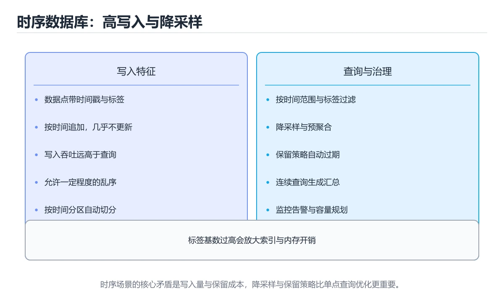
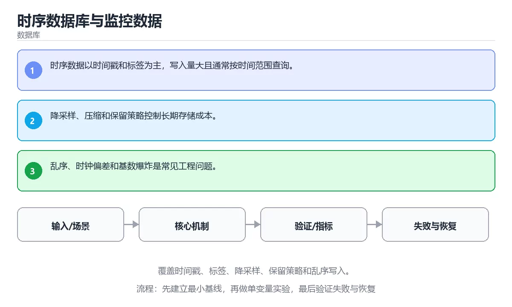

# 时序数据库与监控数据

> 内容更新时间：2026-10-06 · 学习阶段：高级 · 预计用时：35 分钟





## 学习目标

- 能用自己的话解释：时序数据以时间戳和标签为主，写入量大且通常按时间范围查询。
- 能用自己的话解释：降采样、压缩和保留策略控制长期存储成本。
- 能用自己的话解释：乱序、时钟偏差和基数爆炸是常见工程问题。
- 能把本课知识放回「数据库」，并完成练习与测验。

## 前置知识

- 具备本分类的前置知识，能跑通「时序数据库与监控数据」的示例并解释输出。
- 本课关键词：时序数据库、标签、降采样、保留策略。
- 遇到不熟悉的术语先记录问题，完成练习后再回读。

## 核心知识

### 1. 时序数据以时间戳和标签为主，写入量大且通常按时间范围查询。

- 关键做法：先用 date_trunc 建立 时序数据库 的基线，再逐步加入边界与失败条件。
- 验证标准：标签 的异常路径有明确错误信息与恢复动作。

### 2. 降采样、压缩和保留策略控制长期存储成本。

把这条结论放回「时序数据库与监控数据」的完整流程里展开：

- 正文依据：能用自己的话解释：时序数据以时间戳和标签为主，写入量大且通常按时间范围查询。
- 落地检查：把「2. 降采样、压缩和保留策略控制长期存储成本。」改写成一条可执行的核对项，逐条验证输入、超时与失败路径。

### 3. 乱序、时钟偏差和基数爆炸是常见工程问题。

把这条结论放回「时序数据库与监控数据」的完整流程里展开：

- 正文依据：能用自己的话解释：降采样、压缩和保留策略控制长期存储成本。
- 落地检查：把「3. 乱序、时钟偏差和基数爆炸是常见工程问题。」改写成一条可执行的核对项，逐条验证输入、超时与失败路径。

## 关键流程

```text
输入 → 校验 → 核心处理 → 验证 → 记录指标 → 失败恢复
```

## 实践路径

1. 用一句话复述本课要解决的问题。
2. 跑通正文中的最小示例并记录基线。
3. 只改变一个输入或参数，预测并验证结果。
4. 补一个失败路径，记录错误、恢复和指标。
5. 把结论写成可复现的笔记或测试。

## 常见错误与排查

> 说明：本表由《时序数据库与监控数据》的核心知识整理（2026-10-07），人工复核进度见 docs/content_review_batches.md。

| 易错点 | 容易踩的做法 | 正确结论 |
| --- | --- | --- |
| 用普通表存高频时序数据 | 写入与查询都随数据量恶化 | 用时序数据库或分区表，按时间分片并启用压缩 |
| 没有降采样与保留策略 | 存储成本无限增长 | 定义原始、分钟、小时多级保留策略 |
| 查询不带时间范围 | 全表扫描拖垮实例 | 查询必须带时间过滤，并利用时间索引 |

## 动手练习

1. 合上教程，用 3～5 句话解释时序数据库与监控数据。
2. 从正文选一个例子，改变一个条件并预测结果。
3. 设计一个失败场景，写出止损与恢复步骤。

**验收标准**：留下输入、命令、输出、差异和下一步问题。

## 本课小结

- 本课围绕 时序数据库、标签、降采样、保留策略 展开，复习时重点核对它们的输入、输出和失败路径。
- 把还不确定的 date_trunc 行为写成一条可执行验证，再进入下一课。


## 可运行练习

### 任务 1：先跑通，再解释

```sql
WITH samples(ts, value) AS (
  VALUES (TIMESTAMP '2026-10-05 10:00', 12.0),
         (TIMESTAMP '2026-10-05 10:05', 15.0),
         (TIMESTAMP '2026-10-05 10:10', 9.0)
)
SELECT date_trunc('hour', ts) AS bucket, avg(value) AS avg_value
FROM samples
GROUP BY bucket;
```

### 任务 2：只改一个条件

把「时序数据库与监控数据」的最小示例复制一份，只改一个条件再跑一次：

- 改动点：把 标签 换成边界值，其他输入保持原样。
- 预测：先写下「时序数据库与监控数据」在改动后的输出或错误信息，再运行。
- 记录：对照改动前后的结果，指出差异出在哪一步。
- 验收：换回原条件能复现原结果，改动只影响时序数据库。

### 任务 3：迁移到自己的数据

把 date_trunc 换成你自己的输入，先保持步骤不变，再比较输出差异。

## 故障现场

### 现场 1：用普通表存高频时序数据

**症状**：在《时序数据库与监控数据》的复现场景中，写入与查询都随数据量恶化。

**根因**：“写入与查询都随数据量恶化”只是表层结果。向上追溯会落到“用普通表存高频时序数据”这一步，因为它省略了《时序数据库与监控数据》的约束，使实现行为和预期模型发生了偏离。

**修复**：针对《时序数据库与监控数据》的问题，用时序数据库或分区表，按时间分片并启用压缩。

**验证**：保留《时序数据库与监控数据》里触发“写入与查询都随数据量恶化”的输入、版本和日志，按“用时序数据库或分区表，按时间分片并启用压缩”完成修改后原样重放；只有失败现象消失且相邻场景仍可解释，才保留改动。

### 现场 2：没有降采样与保留策略

**症状**：在《时序数据库与监控数据》的复现场景中，存储成本无限增长。

**根因**：触发点是把“没有降采样与保留策略”当成安全做法。它没有满足《时序数据库与监控数据》要求的前提，因此先表现为“存储成本无限增长”；排查时先完整复现这一段，再核对输入、配置与依赖。

**修复**：针对《时序数据库与监控数据》的问题，定义原始、分钟、小时多级保留策略。

**验证**：在《时序数据库与监控数据》中按“定义原始、分钟、小时多级保留策略”调整后，从“没有降采样与保留策略”的触发条件重放同一条路径，确认“存储成本无限增长”不再出现，并补一个相邻边界用例检查没有引入新问题。

### 现场 3：查询不带时间范围

**症状**：在《时序数据库与监控数据》的复现场景中，全表扫描拖垮实例。

**根因**：当出现“查询不带时间范围”时，执行路径已经绕过了《时序数据库与监控数据》的关键约束，最终以“全表扫描拖垮实例”暴露出来；修复前必须先确认约束在哪里失效。

**修复**：针对《时序数据库与监控数据》的问题，查询必须带时间过滤，并利用时间索引。

**验证**：保留《时序数据库与监控数据》里触发“全表扫描拖垮实例”的输入、版本和日志，按“查询必须带时间过滤，并利用时间索引”完成修改后原样重放；只有失败现象消失且相邻场景仍可解释，才保留改动。

## 本课复习清单


离开本课前，逐项确认：

- [ ] 不看解析，能说出「关于「时序数据以时间戳和标签为主，写入量大且通常按时间范围查询。」，下列说法正确的是？」的判断依据。
- [ ] 不看解析，能说出「关于「降采样、压缩和保留策略控制长期存储成本。」，下列说法正确的是？」的判断依据。
- [ ] 不看解析，能说出「关于「乱序、时钟偏差和基数爆炸是常见工程问题。」，下列说法正确的是？」的判断依据。
- [ ] 至少运行一次《时序数据库与监控数据》的示例，记录输入、输出和一个边界情况。
- [ ] 把本课最容易混淆的两个概念写成一句话对照。

| 复盘项 | 记录 |
| --- | --- |
| 已经能独立解释的考点 |  |
| 仍然说不清的概念 |  |
| 下一步验证动作 |  |

## 复习与自测

对照 核心知识 复述本课结论，答不上来的部分回到 date_trunc 的示例重跑一次。

### 核心知识

自检：这一节与相邻主题的边界在哪里？

### 动手练习

自检：如果去掉这一节里的一个前提，结论会怎样变化？

### 最小可运行示例

```sql
WITH samples(ts, value) AS (
  VALUES (TIMESTAMP '2026-10-05 10:00', 12.0),
         (TIMESTAMP '2026-10-05 10:05', 15.0),
         (TIMESTAMP '2026-10-05 10:10', 9.0)
)
SELECT date_trunc('hour', ts) AS bucket, avg(value) AS avg_value
FROM samples
GROUP BY bucket;
```

自检：把这一节讲给没学过的人，最需要强调哪一点？

### 预期输出

```text
bucket              | avg_value
2026-10-05 10:00:00 |      12.0
```

### 验证步骤

制造一次错误输入，记录错误信息与修复方式。

## 术语速查

| 术语 | 一句话说明 |
| --- | --- |
| `时序数据库` | 专门存储按时间到达的数据点，优化时间范围查询、聚合和过期清理。 |
| `标签` | 附加在数据点上的键值维度，用于筛选、聚合和分组，但不应频繁变化。 |
| `降采样` | 用一句话说明「时序数据库与监控数据」解决什么问题：覆盖时间戳、标签、降采样、保留策略和乱序写入。 |
| `保留策略` | 规定数据保存多久、何时归档或删除，并满足审计和合规要求。 |

## 深度拓展与实战

这一节把「时序数据库与监控数据」正文里的定义、代码和失败模式串成一条可操作的复习路线。

### 机制拆解

- **1. 时序数据以时间戳和标签为主，写入量大且通常按时间范围查询。**：在「时序数据库与监控数据」里，「1. 时序数据以时间戳和标签为主，写入量大且通常按时间范围查询。」这一步要先写清输入与预期，再记录实际结果和差异；结果不符时回到对应小节核对前提。
- **2. 降采样、压缩和保留策略控制长期存储成本。**：在「时序数据库与监控数据」里，「2. 降采样、压缩和保留策略控制长期存储成本。」这一步要先写清输入与预期，再记录实际结果和差异；结果不符时回到对应小节核对前提。
- **3. 乱序、时钟偏差和基数爆炸是常见工程问题。**：在「时序数据库与监控数据」里，「3. 乱序、时钟偏差和基数爆炸是常见工程问题。」这一步要先写清输入与预期，再记录实际结果和差异；结果不符时回到对应小节核对前提。
- **考点 1：关于「时序数据以时间戳和标签为主，写入量大且通常按时间范围查询。」，下列说法正确的是？**：先独立作答，再回到本课对应小节核对判断依据；答错时记录是哪一个前提被忽略。
- **考点 2：关于「降采样、压缩和保留策略控制长期存储成本。」，下列说法正确的是？**：先独立作答，再回到本课对应小节核对判断依据；答错时记录是哪一个前提被忽略。

### 边界条件与常见反例

「时序数据库与监控数据」的边界不只包括最大最小值，还要覆盖空、重复和失败：

| 条件 | 常见反例 | 处理方式 |
| --- | --- | --- |
| 空输入 | 时序数据库 没有任何取值 | 先判空，给出明确错误而不是继续执行 |
| 边界值 | 标签 取最小或最大 | 用最小值、最大值和越界值各跑一次 |
| 重复执行 | 同一输入被执行两次 | 保证结果可重复，必要时加锁或去重 |
| 失败路径 | 时序数据库 相关步骤报错 | 保留原始错误，确认回滚或重试行为 |

### 工程检查表

- [ ] 能否用自己的话说明时序数据库与监控数据解决什么问题，以及它不负责什么？
- [ ] 能否说明 时序数据库 的正常输出，以及失败时留下的错误信息？
- [ ] 能否解释本课关键词在真实项目中的边界与取舍？
- [ ] 换一个输入后，date_trunc 的判断依据是否仍然成立？

### 迁移练习

1. 保持正文示例不变，写出它的输入、处理步骤和预期输出。
2. 只改变 时序数据库 的一个条件，预测结果并说明依据；再运行或手算验证。
3. 结合时序数据库、标签、降采样、保留策略，写出一个真实项目中的使用场景。
4. 写下一个反例，说明它在什么条件下会使朴素做法失效。

<!-- p0-depth-v2:start -->

## 零基础精讲：把时序数据库与监控数据真正讲透

### 先建立一个直觉

把数据库看成一本多人同时改写的账本：先定义事实与约束，再考虑索引、并发和恢复，最后才讨论性能。落到本课，「时序数据库与监控数据」关心的是 时序数据库 与 标签 的配合，也就是说这条直觉要在 核心知识 里被具体验证。

本课的摘要可以当作一张地图：覆盖时间戳、标签、降采样、保留策略和乱序写入。

### 逐步拆解

1. 澄清输入与目标。先写清「时序数据库与监控数据」要解决的问题、合法输入范围和成功标准，再进入后续步骤。
2. 描述处理过程。把「时序数据库、标签、降采样、保留策略」映射到具体步骤，每步都要求能单独验证。
3. 定义输出。明确 时序数据库 与 标签 各自的产物，以及失败时留下什么证据。
4. 制造一次标签的失败输入，确认错误出现在「核心知识」的哪一步，并写下恢复后如何验证状态已回到一致。
5. 把「核心知识」里的最小示例抄成 date_trunc 一行的输入，先手算结果再执行，确认两者一致。

### 把正文串成一条执行链

- **考点 3：关于「乱序、时钟偏差和基数爆炸是常见工程问题。」，下列说法正确的是？**：先独立作答，再回到本课对应小节核对判断依据；答错时记录是哪一个前提被忽略。

### 从测验反推易错点

**检查点 1：关于「时序数据以时间戳和标签为主，写入量大且通常按时间范围查询。」，下列说法正确的是？**

- 参考判断：时序数据以时间戳和标签为主，写入量大且通常按时间范围查询。
- 自问：如果去掉题干里的一个限定词，结论还成立吗？

**检查点 2：关于「降采样、压缩和保留策略控制长期存储成本。」，下列说法正确的是？**

- 参考判断：降采样、压缩和保留策略控制长期存储成本。

**检查点 3：关于「乱序、时钟偏差和基数爆炸是常见工程问题。」，下列说法正确的是？**

- 参考判断：乱序、时钟偏差和基数爆炸是常见工程问题。

**检查点 4：本课的核心学习目标是什么？**

- 参考判断：覆盖时间戳、标签、降采样、保留策略和乱序写入。

- 参考判断：TIMESTAMP、timestamp

### 工程排错顺序

| 先查什么 | 要得到的证据 | 判断标准 |
| --- | --- | --- |
| 事务边界是否覆盖全部写操作？ | 日志、输入样例、测试或指标 | 能复现并解释，才算定位 |
| 索引是否匹配真实查询与排序？ | 日志、输入样例、测试或指标 | 能复现并解释，才算定位 |
| 迁移是否可回滚、可灰度、可校验？ | 日志、输入样例、测试或指标 | 能复现并解释，才算定位 |
| 锁等待与慢查询是否有观测？ | 日志、输入样例、测试或指标 | 能复现并解释，才算定位 |

### 变式训练

1. 把 时序数据库 的实现压缩到一个进程内，去掉所有外部依赖后再谈扩展。
2. 把 date_trunc 的数据量提高一个数量级，观察延迟与内存的变化拐点。
3. 让 date_trunc 的外部依赖超时，确认系统能回滚或补偿，而不是留下脏数据。
5. 故意跳过 标签 的检查再运行，比较与正常流程的差异，并说明这个检查挡住的到底是哪一类失败。
6. 把 时序数据库 的方案切换到低资源设备，重新评估默认参数、超时和降级策略。

### 本课自测

- [ ] 能用一句话解释「时序数据库」在本课中的角色与边界。
- [ ] 能举出一个正常例子和一个失败例子。
- [ ] 能说出最小验证步骤，以及需要记录的证据。
- [ ] 能用一句话解释「标签」在本课中的角色与边界。
- [ ] 能用一句话解释「降采样」在本课中的角色与边界。
- [ ] 能用一句话解释「保留策略」在本课中的角色与边界。

### 迁移案例库

下面用不同约束重复同一套方法，每轮只改变 时序数据库 的一个取值并记录结论。

#### 迁移案例 1：围绕「时序数据库」做一次小实验

**目标**：在不改变课程主体的前提下，验证时序数据库与监控数据中的一个关键判断。

**步骤**：
1. 复述当前方案对「时序数据库」的假设，写成一句可证伪的话。
2. 设计一个正常输入和一个边界输入，分别预测输出。
3. 运行或逐步演算，记录实际输出、耗时和失败信息。
4. 只调整一个参数，比较前后差异并解释原因。
5. 补充一条测试或复习卡，确保下次能更快复现。

**验收**：结论要能追溯到正文的具体小节与代码位置，并记录标签相关的指标变化。

#### 迁移案例 2：围绕「标签」做一次小实验

**步骤**：
1. 复述当前方案对「标签」的假设，写成一句可证伪的话。

#### 迁移案例 3：围绕「降采样」做一次小实验

**步骤**：
1. 复述当前方案对「降采样」的假设，写成一句可证伪的话。

#### 迁移案例 4：围绕「保留策略」做一次小实验

**步骤**：
1. 复述当前方案对「保留策略」的假设，写成一句可证伪的话。

#### 迁移案例 5：围绕「时序数据库」做一次小实验

**步骤**：

#### 迁移案例 6：围绕「标签」做一次小实验

**步骤**：

#### 迁移案例 7：围绕「降采样」做一次小实验

**步骤**：

#### 迁移案例 8：围绕「保留策略」做一次小实验

**步骤**：

#### 迁移案例 9：围绕「时序数据库」做一次小实验

**步骤**：

#### 迁移案例 10：围绕「标签」做一次小实验

**步骤**：

#### 迁移案例 11：围绕「降采样」做一次小实验

**步骤**：

#### 迁移案例 12：围绕「保留策略」做一次小实验

**步骤**：

#### 迁移案例 13：围绕「时序数据库」做一次小实验

**步骤**：

#### 迁移案例 14：围绕「标签」做一次小实验

**步骤**：

#### 迁移案例 15：围绕「降采样」做一次小实验

**步骤**：

#### 迁移案例 16：围绕「保留策略」做一次小实验

**步骤**：

<!-- p0-depth-v2:end -->

## 考点精讲

### 考点 1：概念判断·时序数据库

- **题目**：关于「时序数据以时间戳和标签为主，写入量大且通常按时间范围查询。」，下列说法正确的是？
- **判断依据**：在「时序数据库与监控数据」里，时序数据以时间戳和标签为主，写入量大且通常按时间范围查询。回到「时序数据库与监控数据」的正文示例，用“关于时序数据以时间戳和标签为主”走一遍时序数据库、标签、降采样的完整流程，能复现的结论才可以保留。回到时序数据库、标签、降采样本身再看一遍：只有“时序数据以时间戳和标签为主”与题干“时序数据以时间戳和标签为主”的前提一致，结论才成立。

### 考点 2：概念判断·时序数据库

- **题目**：关于「降采样、压缩和保留策略控制长期存储成本。」，下列说法正确的是？
- **判断依据**：在「时序数据库与监控数据」里，降采样、压缩和保留策略控制长期存储成本。」这类相邻概念。在「时序数据库与监控数据」里判断这道题，要把时序数据库、标签、降采样的条件、过程与失败路径逐项对齐，换成“关于降采样、压缩和保留策略控制长期存”这个场景，只有满足前提的结论才成立。“压缩和保留策略控制长期存储成本”与「时序数据库与监控数据」的术语表相呼应，只有符合时序数据库、标签、降采样约束的“降采样、压缩和保留策略控制长期存储成本，”才是正文支持的结论。

### 考点 3：概念判断·时序数据库

- **题目**：关于「乱序、时钟偏差和基数爆炸是常见工程问题。」，下列说法正确的是？
- **判断依据**：在「时序数据库与监控数据」里，乱序、时钟偏差和基数爆炸是常见工程问题。这道题的关键在「时序数据库与监控数据」的时序数据库、标签、降采样：先确认题干“关于乱序、时钟偏差和基数爆炸是常见工”问的是哪一步，再排除偷换前提的选项。在「时序数据库与监控数据」里，回到时序数据库、标签、降采样本身再看一遍：只有“乱序、时钟偏差和基数爆炸是常见工程问题，”与题干“时钟偏差和基数爆炸是常见工程问题”的前提一致，结论才成立。

### 考点 4：多选辨析·时序数据库

- **题目**：围绕“时序数据库与监控数据”中的 时序数据库、标签、降采样，下列哪两项是本课强调的实践判断？
- **判断依据**：结论应落在验证 标签 时要固定版本并覆盖边界输入。本课把时序数据库与监控数据拆成概念、示例与故障现场三部分，因此判断 时序数据库 时必须同时交代输入、输出和失败路径，这使“学习 时序数据库 时要同时说明输入、输出和失败路径，不能只看正常流程”成立。在时序数据库与监控数据里，判断 标签 时要固定版本与边界输入，所以“验证 标签 时要固定版本并覆盖边界输入，结论才可复现”才可复现。

### 考点 5：填空·时序数据库

- **题目**：补全代码：「时序数据库与监控数据」示例中，下面这行代码缺少哪个关键字或函数名？请填入 ____。 `VALUES (____ '2026-10-05 10:00', 12.0),`
- **判断依据**：这道题的关键在「时序数据库与监控数据」的时序数据库、标签、降采样：先确认题干“补全代码”问的是哪一步，再排除偷换前提的选项。把“TIMESTAMP”代回「时序数据库与监控数据」里“时序数据库与监控数据示例中”的例子核对，条件一旦改变，结论就要用时序数据库、标签、降采样重新推导。“TIMESTAMP”是否可用，取决于时序数据库、标签、降采样在题干条件下的表现，不能直接套用相邻结论。

### 考点 6：排错·时序数据库

- **题目**：阅读「时序数据库与监控数据」的代码片段，下面哪项判断是正确的？
- **判断依据**：在「时序数据库与监控数据」里，题干的正确项是时序数据以时间戳和标签为主，写入量大且通常按时间范围查询。回到「时序数据库与监控数据」的正文示例，用“阅读时序数据库与监控数据的代码片段”走一遍时序数据库、标签、降采样的完整流程，能复现的结论才可以保留。在「时序数据库与监控数据」里判断这道题，要把时序数据库、标签、降采样的条件、过程与失败路径逐项对齐，换成“阅读的代码片段”这个场景，只有满足前提的结论才成立。

## English Overview

**Title:** Time-Series Databases and Monitoring Data

**Summary:** Cover timestamps, tags, downsampling, retention and out-of-order writes.

**Category:** Database
**Level:** 高级
**Key terms:** 时序数据库, 标签, 降采样, 保留策略

## 内容元数据

- 内容版本：v2.0
- 最后更新：2026-10-06
- 学习阶段：高级
- 适用环境：PostgreSQL / MySQL / SQLite 等主流数据库；本课聚焦其中的 时序数据库。
- 内容来源：内置结构化课程与工程实践整理
- 相关主题：时序数据库、标签、降采样、保留策略
- 质量版本：P0 测验标准 + P1 覆盖扩展 + P2 体验补全

## 最小可运行示例

下面示例用于验证 时序数据库 的最小输入、处理和输出。先原样运行，再只修改一个值：

```sql
WITH samples(ts, value) AS (
  VALUES (TIMESTAMP '2026-10-05 10:00', 12.0),
         (TIMESTAMP '2026-10-05 10:05', 15.0),
         (TIMESTAMP '2026-10-05 10:10', 9.0)
)
SELECT date_trunc('hour', ts) AS bucket, avg(value) AS avg_value
FROM samples
GROUP BY bucket;
```

## 预期输出

```text
bucket              | avg_value
2026-10-05 10:00:00 |      12.0
```

## 验证步骤

1. 记录运行环境、命令和真实输出。
2. 修改一个输入，先写预测再运行。
4. 把结论写回本课笔记或测试用例。

## 参考资料与复核

- 最后复核：2026-10-04
- 下次复核：2027-06-10
- 复核范围：版本兼容、API 行为、安全建议与工程实践
- 来源性质：官方文档、标准或权威教材；正文为离线教学重组

| 参考资料 | 本课用途 |
| --- | --- |
| [JDBC 事务](https://docs.oracle.com/javase/tutorial/jdbc/basics/transactions.html) | 连接事务与回滚 |
| [MySQL 文档](https://dev.mysql.com/doc/) | 关系数据库与 InnoDB |
| [数据库规范化](https://learn.microsoft.com/office/troubleshoot/access/database-normalization-description) | 范式与表设计 |

> 「时序数据库与监控数据」的链接用于离线阅读后的延伸核对；App 不会自动联网。

## 复习与迁移

复习目标：把「时序数据库与监控数据」的判断标准放回可复现的例子里。先自己作答，再对照依据；如果结论正确但理由不完整，回到正文补足前提。

### 概念复述

- 用一句话说明「时序数据库与监控数据」解决什么问题：覆盖时间戳、标签、降采样、保留策略和乱序写入。
- 写出时序数据库、标签、降采样之间的关系，并各举一个例子。
- 说出本课最容易混淆的两个概念，以及区分它们的判据。

### 正文逐节复核

- **零基础精讲：把时序数据库与监控数据真正讲透**：本课的摘要可以当作一张地图：覆盖时间戳、标签、降采样、保留策略和乱序写入。

### 测验回顾

1. 关于「时序数据以时间戳和标签为主，写入量大且通常按时间范围查询。」，下列说法正确的是？
   - 依据：在「时序数据库与监控数据」里，时序数据以时间戳和标签为主，写入量大且通常按时间范围查询。回到「时序数据库与监控数据」的正文示例，用“关于时序数据以时间戳和标签为主”走一遍时序数据库、标签、降采样的完整流程，能复现的结论才可以保留。回到时序数据库、标签、降采样本身再看一遍：只有“时序数据以时间戳和标签为主”与题干“时序数据以时间戳和标签为主”的前提一致，结论才成立。
2. 关于「降采样、压缩和保留策略控制长期存储成本。」，下列说法正确的是？
   - 依据：在「时序数据库与监控数据」里，降采样、压缩和保留策略控制长期存储成本。」这类相邻概念。在「时序数据库与监控数据」里判断这道题，要把时序数据库、标签、降采样的条件、过程与失败路径逐项对齐，换成“关于降采样、压缩和保留策略控制长期存”这个场景，只有满足前提的结论才成立。“压缩和保留策略控制长期存储成本”与「时序数据库与监控数据」的术语表相呼应，只有符合时序数据库、标签、降采样约束的“降采样、压缩和保留策略控制长期存储成本，”才是正文支持的结论。
3. 关于「乱序、时钟偏差和基数爆炸是常见工程问题。」，下列说法正确的是？
   - 依据：在「时序数据库与监控数据」里，乱序、时钟偏差和基数爆炸是常见工程问题。这道题的关键在「时序数据库与监控数据」的时序数据库、标签、降采样：先确认题干“关于乱序、时钟偏差和基数爆炸是常见工”问的是哪一步，再排除偷换前提的选项。在「时序数据库与监控数据」里，回到时序数据库、标签、降采样本身再看一遍：只有“乱序、时钟偏差和基数爆炸是常见工程问题，”与题干“时钟偏差和基数爆炸是常见工程问题”的前提一致，结论才成立。
4. 围绕“时序数据库与监控数据”中的 时序数据库、标签、降采样，下列哪两项是本课强调的实践判断？
   - 依据：结论应落在验证 标签 时要固定版本并覆盖边界输入。本课把时序数据库与监控数据拆成概念、示例与故障现场三部分，因此判断 时序数据库 时必须同时交代输入、输出和失败路径，这使“学习 时序数据库 时要同时说明输入、输出和失败路径，不能只看正常流程”成立。在时序数据库与监控数据里，判断 标签 时要固定版本与边界输入，所以“验证 标签 时要固定版本并覆盖边界输入，结论才可复现”才可复现。
5. 补全代码：「时序数据库与监控数据」示例中，下面这行代码缺少哪个关键字或函数名？请填入 ____。

`VALUES (____ '2026-10-05 10:00', 12.0),`
   - 依据：这道题的关键在「时序数据库与监控数据」的时序数据库、标签、降采样：先确认题干“补全代码”问的是哪一步，再排除偷换前提的选项。把“TIMESTAMP”代回「时序数据库与监控数据」里“时序数据库与监控数据示例中”的例子核对，条件一旦改变，结论就要用时序数据库、标签、降采样重新推导。“TIMESTAMP”是否可用，取决于时序数据库、标签、降采样在题干条件下的表现，不能直接套用相邻结论。
1. 阅读「时序数据库与监控数据」的代码片段，下面哪项判断是正确的？
   - 依据：在「时序数据库与监控数据」里，题干的正确项是时序数据以时间戳和标签为主，写入量大且通常按时间范围查询。回到「时序数据库与监控数据」的正文示例，用“阅读时序数据库与监控数据的代码片段”走一遍时序数据库、标签、降采样的完整流程，能复现的结论才可以保留。在「时序数据库与监控数据」里判断这道题，要把时序数据库、标签、降采样的条件、过程与失败路径逐项对齐，换成“阅读的代码片段”这个场景，只有满足前提的结论才成立。

### 迁移练习

把「时序数据库与监控数据」的结论迁移到相邻主题，每次迁移都写清预测与证据：

1. 换输入：用时序数据库处理一组你自己的数据，对比教材示例的结果差异。
2. 换失败条件：制造一个标签相关的错误，说明如何从错误信息定位根因。
3. 换规模：把数据量或并发度提高一个数量级，说明「时序数据库与监控数据」的结论是否仍成立。
