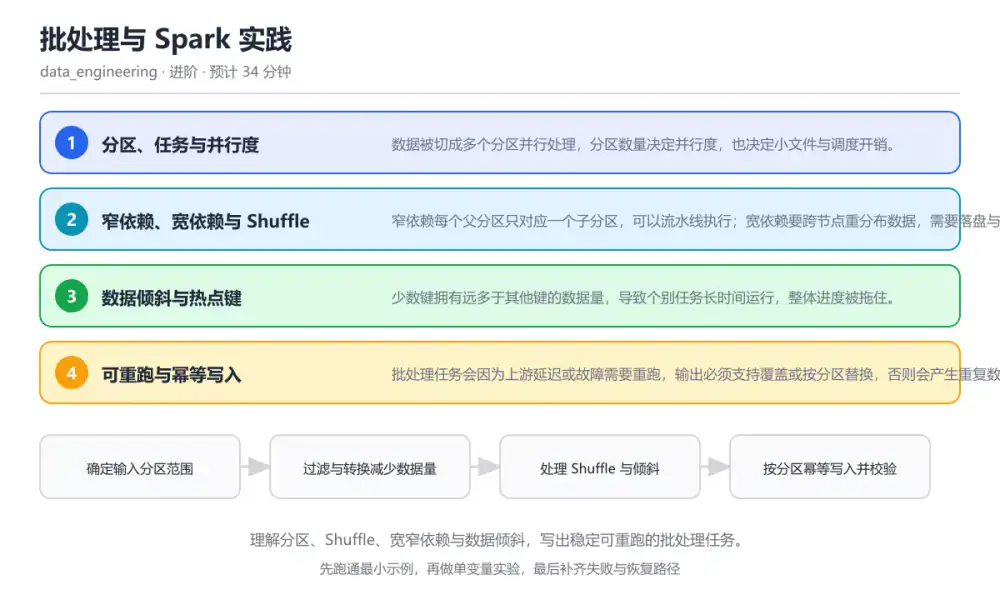
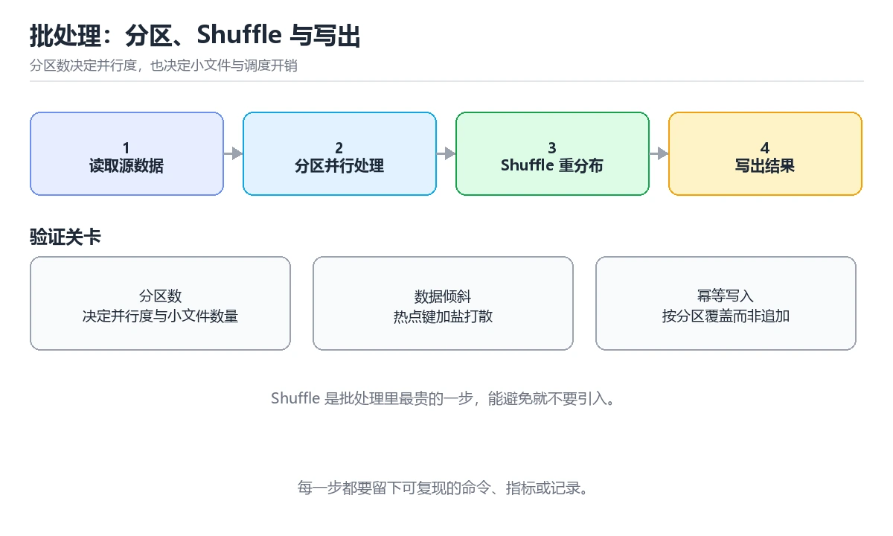

# 批处理与 Spark 实践

> 内容更新时间：2026-10-06 · 学习阶段：进阶 · 预计用时：40 分钟

分类：data_engineering。关键词：Spark、分区、Shuffle、数据倾斜、幂等重跑。理解分区、Shuffle、宽窄依赖与数据倾斜，写出稳定可重跑的批处理任务。

学习建议：先通读《批处理与 Spark 实践》的核心知识与关键流程，再运行可运行练习并完成测验；遇到不确定的结论，回到「故障现场」按症状、根因、修复、验证四步核对。



## 本节知识框架

**课程定位**：所属分类为「数据工程」，课程主题为「批处理与 Spark 实践」，学习阶段为「进阶」，建议用时 40 分钟。

**本课要解决的主问题**：理解分区、Shuffle、宽窄依赖与数据倾斜，写出稳定可重跑的批处理任务。

| 学习层次 | 要回答的问题 | 完成判据 |
| --- | --- | --- |
| 概念层 | 「批处理与 Spark 实践」有哪些必须区分的对象与术语？ | 能用自己的话定义核心术语，并各举一个正例和一个反例。 |
| 机制层 | 这些对象按什么顺序发生作用，输入如何变成输出？ | 能画出或写出机制步骤，并说明每一步的失败条件。 |
| 应用层 | 什么场景适合使用「批处理与 Spark 实践」，什么场景不适合？ | 能给出一个真实场景、一个最小示例和一个边界案例。 |
| 性能层 | 时间、空间、吞吐或延迟受哪些量影响？ | 能说出复杂度或性能瓶颈的证据来源；没有证据时明确写“材料未提供”。 |
| 复习层 | 怎样确认自己不是只记住了结论？ | 能独立完成本课自测，并把错误定位到概念、机制、示例或边界。 |

### 阅读路线

1. 先读「核心概念定义」，建立「Spark」等对象的精确定义。
2. 再读「原理与运行机制」，把定义串成可重复的过程。
3. 用「代码/协议/SQL 示例」验证过程，并只改一个条件观察结果变化。
4. 最后检查性能、易错点、知识关系与自测题，形成可复习的证据链。

**前置知识**：《数据建模与数仓分层》

**学习位置**：本课位于《数据建模与数仓分层》之后；如果前一课的自测不能通过，应先回补再继续。

**后续衔接**：下一课《流处理与 Kafka 实践》会继续使用本课术语，学完后建议立即完成一次自测。

**教材衔接：学习目标**

- 能解释窄依赖与宽依赖对执行计划的影响。
- 能定位数据倾斜并给出两种以上的缓解方案。
- 能设计可重跑、可校验的批处理输出流程。

**教材衔接：前置知识**

- 会写 SQL 聚合与窗口函数。
- 了解分布式计算把数据分片处理的基本思路。
- 知道文件分区与列式存储的常见约定。

**教材衔接：本课小结**

- 批处理与 Spark 实践围绕Spark、分区、Shuffle展开，先建立基线再讨论优化。
- 数据被切成多个分区并行处理，分区数量决定并行度，也决定小文件与调度开销。
- dwd_order_item 出错时先记录症状，再定位根因，最后用一次复跑确认修复。

## 核心概念定义

> 阅读约定：本课先给「批处理与 Spark 实践」相关术语的操作性定义与适用边界；正文里的口语化说法与定义冲突时，以定义和可复现示例为准。

| 术语 | 操作性定义 | 本课中的边界 |
| --- | --- | --- |
| 分区 | 数据被切分成可并行处理的最小单元集合。 | 仅在「批处理与 Spark 实践」明确给出的输入、版本与资源条件下成立。 |
| Shuffle | 跨节点重新分布数据的过程，通常由聚合与连接触发。 | 仅在「批处理与 Spark 实践」明确给出的输入、版本与资源条件下成立。 |
| 窄依赖 | 父分区只对应一个子分区的依赖关系，可流水线执行。 | 仅在「批处理与 Spark 实践」明确给出的输入、版本与资源条件下成立。 |
| 数据倾斜 | 少数键的数据量远大于其他键，导致个别任务成为长尾。 | 仅在「批处理与 Spark 实践」明确给出的输入、版本与资源条件下成立。 |
| 幂等写入 | 重复执行同一次写入不会产生重复或错误结果的写入方式。 | 仅在「批处理与 Spark 实践」明确给出的输入、版本与资源条件下成立。 |

### 定义如何使用

在「批处理与 Spark 实践」中判断一个说法是否成立，先确认它使用的是哪个对象的定义，再检查输入规模、运行环境与失败路径。定义不是口号，而是后续推导、代码示例和自测题共享的约束。

## 原理与运行机制

### 机制总览

1. **建立输入**：把「分区」按本课定义整理成可观察、可重复的输入条件。
2. **执行转换**：围绕「Shuffle」执行本课的核心步骤；每一步都记录中间状态，避免只看最终输出。
3. **产生输出**：得到「窄依赖」后，用正文示例或协议/SQL 结果核对输出是否符合预期。
4. **改变一个条件**：只替换一个边界条件或环境参数，观察「批处理与 Spark 实践」的结论是否仍然成立。

| 阶段 | 关注对象 | 失败时应检查 |
| --- | --- | --- |
| 输入 | 分区 | 类型、范围、编码、版本或前置状态是否满足定义。 |
| 处理 | Shuffle | 顺序、可见性、锁、路由、事务或调度规则是否被破坏。 |
| 输出 | 窄依赖 | 结果是否可复现，错误是否被正确传播而不是被吞掉。 |

本课的机制结论要用「批处理与 Spark 实践」自己的示例验证。「批处理与 Spark 实践」没有给出某个数量级、吞吐或内存数据时，本课把该判断标为“材料未提供”，不从相邻主题外推。

**教材衔接：核心知识**

### 1. 分区、任务与并行度

数据被切成多个分区并行处理，分区数量决定并行度，也决定小文件与调度开销。

读取阶段分区数与文件块数相关，聚合阶段由 Shuffle 决定分区数；分区太少会单点变慢，太多会产生大量调度与小文件。

在批处理与 Spark 实践里可以这样验证：同一份数据分别用 4 个和 400 个分区聚合，比较执行时间与输出文件数量。

边界：增大分区数不是万能解，算子本身有开销；小文件过多还会拖慢下游读取。

工程视角：按数据量与核心数设置分区，写出前做合并控制文件大小，输出分区字段与下游过滤条件对齐。

### 2. 窄依赖、宽依赖与 Shuffle

窄依赖每个父分区只对应一个子分区，可以流水线执行；宽依赖要跨节点重分布数据，需要落盘与网络传输。

groupBy、join 与 distinct 通常触发 Shuffle，Shuffle 数据量决定作业瓶颈；过滤与映射尽量提前以减少参与重分布的数据。

在批处理与 Spark 实践里可以这样验证：先在明细层过滤再聚合，与先聚合再过滤两种写法对比 Shuffle 读写量。

边界：缓存中间结果能加速多次复用，但会占用内存并可能触发落盘，滥用反而变慢。

工程视角：把过滤与列裁剪尽量前移，广播小表避免大表 Shuffle，关注执行计划里的 Exchange 节点。

### 3. 数据倾斜与热点键

少数键拥有远多于其他键的数据量，导致个别任务长时间运行，整体进度被拖住。

按 key 聚合时同一键必定落到同一分区；热点键会把单分区撑大，出现任务长尾与内存溢出。

在批处理与 Spark 实践里可以这样验证：统计每个用户的订单时制造一个超大用户，观察任务耗时分布与失败情况。

边界：加盐打散能缓解倾斜，但会改变语义，需要在二次聚合时还原，还要注意数据量翻倍。

工程视角：先看任务耗时分布确认倾斜，再考虑过滤异常键、拆分热点单独处理、加盐或改用更均匀的分区键。

### 4. 可重跑与幂等写入

批处理任务会因为上游延迟或故障需要重跑，输出必须支持覆盖或按分区替换，否则会产生重复数据。

按日期分区写入时可用覆盖写入替换整个分区；使用动态分区或事务表时按分区提交，失败可回滚。

在批处理与 Spark 实践里可以这样验证：把同一批数据连续跑两遍，检查目标表行数是否翻倍，并改成覆盖写入后再验证。

边界：覆盖写入会短暂删除旧数据，下游同时读取时可能看到空分区，需要版本表或原子替换。

工程视角：任务参数化日期与分区，输出前写临时位置再原子替换；跑完自动做行数与指标校验。

**教材衔接：关键流程**

```text
确定输入分区范围 → 过滤与转换减少数据量 → 处理 Shuffle 与倾斜 → 按分区幂等写入并校验
```

1. 确定输入分区范围
2. 过滤与转换减少数据量
3. 处理 Shuffle 与倾斜
4. 按分区幂等写入并校验

## 典型应用场景

| 场景 | 典型输入或前提 | 期望产物 |
| --- | --- | --- |
| 学习验证 | 使用本课最小示例和 Spark、分区 | 能复现正文结论，并解释每一步。 |
| 工程落地 | 把「批处理与 Spark 实践」放入真实模块或服务边界 | 输出可观测、失败可定位、参数可配置。 |
| 故障排查 | 只改一个版本、规模、输入或依赖条件 | 能区分概念错误、实现错误和环境差异。 |

判断「批处理与 Spark 实践」的场景是否成立，标准是能否写出输入、处理、输出和失败路径；材料中没有出现的数据在本课标注为“材料未提供”，不用推测替代证据。

**教材衔接：深度拓展与实战**

这一节把批处理与 Spark 实践的机制拆开验证：每一步都给出输入、判断标准和失败信号，便于在真实项目里复用。

### 机制拆解 1：分区、任务与并行度

读取阶段分区数与文件块数相关，聚合阶段由 Shuffle 决定分区数；分区太少会单点变慢，太多会产生大量调度与小文件。

落地时先确认前提：增大分区数不是万能解，算子本身有开销；小文件过多还会拖慢下游读取。；再把结论写进检查表，让下一位同学可以按同样的输入复现。

工程做法：按数据量与核心数设置分区，写出前做合并控制文件大小，输出分区字段与下游过滤条件对齐。

### 机制拆解 2：窄依赖、宽依赖与 Shuffle

groupBy、join 与 distinct 通常触发 Shuffle，Shuffle 数据量决定作业瓶颈；过滤与映射尽量提前以减少参与重分布的数据。

落地时先确认前提：缓存中间结果能加速多次复用，但会占用内存并可能触发落盘，滥用反而变慢。；再把结论写进检查表，让下一位同学可以按同样的输入复现。

工程做法：把过滤与列裁剪尽量前移，广播小表避免大表 Shuffle，关注执行计划里的 Exchange 节点。

### 机制拆解 3：数据倾斜与热点键

按 key 聚合时同一键必定落到同一分区；热点键会把单分区撑大，出现任务长尾与内存溢出。

落地时先确认前提：加盐打散能缓解倾斜，但会改变语义，需要在二次聚合时还原，还要注意数据量翻倍。；再把结论写进检查表，让下一位同学可以按同样的输入复现。

工程做法：先看任务耗时分布确认倾斜，再考虑过滤异常键、拆分热点单独处理、加盐或改用更均匀的分区键。

### 机制拆解 4：可重跑与幂等写入

按日期分区写入时可用覆盖写入替换整个分区；使用动态分区或事务表时按分区提交，失败可回滚。

落地时先确认前提：覆盖写入会短暂删除旧数据，下游同时读取时可能看到空分区，需要版本表或原子替换。；再把结论写进检查表，让下一位同学可以按同样的输入复现。

工程做法：任务参数化日期与分区，输出前写临时位置再原子替换；跑完自动做行数与指标校验。

### 机制对照表

| 概念 | 解决什么问题 | 关键前提 | 失败信号 |
| --- | --- | --- | --- |
| 分区、任务与并行度 | 数据被切成多个分区并行处理，分区数量决定并行度，也决定小文件与调度开销。 | 增大分区数不是万能解，算子本身有开销；小文件过多还会拖慢下游读取。 | 按数据量与核心数设置分区，写出前做合并控制文件大小，输出分区字段与下游过 |
| 窄依赖、宽依赖与 Shuffle | 窄依赖每个父分区只对应一个子分区，可以流水线执行；宽依赖要跨节点重分布数据，需要 | 缓存中间结果能加速多次复用，但会占用内存并可能触发落盘，滥用反而变慢。 | 把过滤与列裁剪尽量前移，广播小表避免大表 Shuffle，关注执行计划里 |
| 数据倾斜与热点键 | 少数键拥有远多于其他键的数据量，导致个别任务长时间运行，整体进度被拖住。 | 加盐打散能缓解倾斜，但会改变语义，需要在二次聚合时还原，还要注意数据量翻 | 先看任务耗时分布确认倾斜，再考虑过滤异常键、拆分热点单独处理、加盐或改用 |
| 可重跑与幂等写入 | 批处理任务会因为上游延迟或故障需要重跑，输出必须支持覆盖或按分区替换，否则会产生 | 覆盖写入会短暂删除旧数据，下游同时读取时可能看到空分区，需要版本表或原子 | 任务参数化日期与分区，输出前写临时位置再原子替换；跑完自动做行数与指标校 |

### 自测问答

**问 1**：批处理任务卡在少数几个任务上，最可能的原因是什么？

**答**：数据倾斜导致热点分区。任务耗时分布严重不均通常指向热点键，同一键落在同一分区会把它撑大；分区数、文件格式与重试策略不会造成持续的长尾任务。 正确选项「数据倾斜导致热点分区」对应《批处理与 Spark 实践》的要点「分区、任务与并行度」：数据被切成多个分区并行处理，分区数量决定并行度，也决定小文件与调度开销。判断「分区、任务与并行度」时先确认前提是否成立，再回到《批处理与 Spark 实践》的示例核对一次；把别的语言或框架的默认做法直接搬到分区、任务与并行度上，往往会在本课的边界条件里失效。

**问 2**：减少 Shuffle 数据量最直接的做法是什么？

**答**：把过滤与列裁剪前移到聚合之前。Shuffle 只搬运参与计算的数据，提前过滤与裁剪列能直接减少数据量；调整内存或减少分区只会改变失败方式，不会减少要搬的数据。 正确选项「把过滤与列裁剪前移到聚合之前」对应《批处理与 Spark 实践》的要点「窄依赖、宽依赖与 Shuffle」：窄依赖每个父分区只对应一个子分区，可以流水线执行；宽依赖要跨节点重分布数据，需要落盘与网络传输。判断「窄依赖、宽依赖与 Shuffle」时先确认前提是否成立，再回到《批处理与 Spark 实践》的示例核对一次；借鉴相邻主题的经验之前，先核对窄依赖、宽依赖与 Shuffle的前提是否成立。

**问 3**：以下哪些做法能让批处理任务可安全重跑？（多选）

**答**：按日期分区覆盖写入；输出前写临时位置再原子替换；跑完校验行数与主键唯一性。按分区覆盖、临时目录加原子替换、终态校验都能保证重跑结果一致；追加写入在重跑时会累积重复数据，属于反模式。 正确选项「按日期分区覆盖写入；输出前写临时位置再原子替换；跑完校验行数与主键唯一性」对应《批处理与 Spark 实践》的要点「数据倾斜与热点键」：少数键拥有远多于其他键的数据量，导致个别任务长时间运行，整体进度被拖住。判断「数据倾斜与热点键」时先确认前提是否成立，再回到《批处理与 Spark 实践》的示例核对一次；记住数据倾斜与热点键的结论之外还要记住适用条件，换一个输入往往就不成立了。

**问 4**：请按批处理作业的执行顺序排列步骤。

**答**：Shuffle 聚合与排序。先读入目标分区，再过滤裁剪，然后进行需要跨节点重分布的聚合，最后校验并原子写入；把校验放在写入之后就无法阻止脏数据对外可见。 正确选项「读取目标日期分区数据；过滤与列裁剪；Shuffle 聚合与排序；校验并原子替换目标分区」对应《批处理与 Spark 实践》的要点「可重跑与幂等写入」：批处理任务会因为上游延迟或故障需要重跑，输出必须支持覆盖或按分区替换，否则会产生重复数据。判断「可重跑与幂等写入」时先确认前提是否成立，再回到《批处理与 Spark 实践》的示例核对一次；干扰项常常是相邻主题里成立的结论，只有按可重跑与幂等写入的输入与约束判断才能排除。

**问 5**：阅读查询片段，哪项判断正确？

**答**：过滤条件在聚合之前生效，可减少参与 Shuffle 的数据。时间过滤位于 CTE 内，先于分组聚合执行，因此进入聚合的数据更少；COUNT(DISTINCT) 按订单去重，聚合后再过滤需要用 HAVING。 正确选项「过滤条件在聚合之前生效，可减少参与 Shuffle 的数据」对应《批处理与 Spark 实践》的要点「分区、任务与并行度」：数据被切成多个分区并行处理，分区数量决定并行度，也决定小文件与调度开销。判断「分区、任务与并行度」时先确认前提是否成立，再回到《批处理与 Spark 实践》的示例核对一次；把分区、任务与并行度的做法换到别的约束下未必成立，先确认边界再决定答案。

### 排错速查

- 看到「不做过滤与列裁剪就把所有明细送入聚合」时，先按「把时间与状态过滤前移，只保留参与计算的列，再进入 Shuffle」处理，再用批处理与 Spark 实践的最小示例确认结论是否恢复。
- 看到「按包含超大客户的键聚合，个别任务长时间不结束」时，先按「确认倾斜键后单独处理或加盐打散，二次聚合还原结果」处理，再用批处理与 Spark 实践的最小示例确认结论是否恢复。
- 看到「任务用追加写入，失败后重跑导致行数翻倍」时，先按「按分区覆盖或使用事务写入，落库前做行数与主键唯一性校验」处理，再用批处理与 Spark 实践的最小示例确认结论是否恢复。

### 工程检查表

- [ ] 确定输入分区范围
- [ ] 过滤与转换减少数据量
- [ ] 处理 Shuffle 与倾斜
- [ ] 按分区幂等写入并校验
- [ ] 【分区、任务与并行度】按数据量与核心数设置分区，写出前做合并控制文件大小，输出分区字段与下游过滤条件对齐。
- [ ] 【窄依赖、宽依赖与 Shuffle】把过滤与列裁剪尽量前移，广播小表避免大表 Shuffle，关注执行计划里的 Exchange 节点。
- [ ] 【数据倾斜与热点键】先看任务耗时分布确认倾斜，再考虑过滤异常键、拆分热点单独处理、加盐或改用更均匀的分区键。
- [ ] 【可重跑与幂等写入】任务参数化日期与分区，输出前写临时位置再原子替换；跑完自动做行数与指标校验。

### 迁移练习

把批处理与 Spark 实践的方法用到一个真实场景：写下Spark、分区、Shuffle在你的场景里分别对应什么，再记录一次失败尝试和它的恢复步骤。

### 延伸阅读与下一步

- 复习Spark、分区、Shuffle、数据倾斜、幂等重跑时，优先回看「分区、任务与并行度」与「可重跑与幂等写入」两节。
- 把从「确定输入分区范围」到「按分区幂等写入并校验」的流程画成一张图，放进自己的笔记。
- 一周后重做本课测验，只把答错的题留到下一轮复习。

### 结论与下一步

学完批处理与 Spark 实践，应该能独立完成三件事：先用最小示例确认Spark的行为，再用一个边界输入验证结论，最后把失败路径写成可重复的检查。下一步把本课术语加入复习清单，并在两周内用一次真实任务检验记忆是否牢固。

## 代码/协议/SQL 示例

### 最小可验证示例

下面保留《批处理与 Spark 实践》原文中的最小示例。先预测《批处理与 Spark 实践》示例的输出，再按正文步骤运行或推演；示例依赖外部环境时，同时记录版本与输入。

```text
确定输入分区范围 → 过滤与转换减少数据量 → 处理 Shuffle 与倾斜 → 按分区幂等写入并校验
```

**教材衔接：原文最小示例**

```text
确定输入分区范围 → 过滤与转换减少数据量 → 处理 Shuffle 与倾斜 → 按分区幂等写入并校验
```

## 时间/空间复杂度或性能分析

**复杂度证据**：「批处理与 Spark 实践」的现有材料没有给出渐近时间或空间复杂度的明确结论，本课只做定性检查，不补写未经验证的 $O$ 记号。

| 维度 | 本课关注点 | 判断依据 |
| --- | --- | --- |
| 时间/延迟 | 「批处理与 Spark 实践」的主要步骤是否会随输入规模、并发度或网络往返增长。 | 以正文复杂度、基准数据或可重复测量为准。 |
| 空间/内存 | 中间状态、缓存、副本、连接或索引是否随规模增长。 | 记录峰值内存与数据副本，不只看最终结果。 |
| 吞吐/资源 | 版本、调度、锁、IO、序列化或协议开销是否成为瓶颈。 | 固定环境做对照实验，改变一个变量。 |

评估「批处理与 Spark 实践」时要区分“正确性成立”和“性能达标”两件事；材料没有给出基准时，本课只保留量级来源与测量方法，不写不可验证的绝对数字。

## 常见误区与易错点

> 复核《批处理与 Spark 实践》的易错点时，优先保留原文的错误表、故障现场与排错路径；每条修正都要能用本课示例复验。

| 易错点 | 常见表现 | 正确做法 |
| --- | --- | --- |
| 只背结论 | 能复述「批处理与 Spark 实践」的定义，却说不清输入、输出与边界。 | 回到机制步骤，用最小示例逐一验证。 |
| 混淆相邻概念 | 把本课对象与相邻主题的对象当成同一类。 | 先比较定义、资源归属、生命周期和失败模式。 |
| 忽略版本与环境 | 在开发机通过后直接外推到生产环境。 | 固定版本、输入和资源条件，再记录可复现结果。 |

**教材衔接：常见错误与排查**

> 说明：本表由《批处理与 Spark 实践》的核心知识整理（2026-10-06），人工复核进度见 docs/content_review_batches.md。

| 易错点 | 容易踩的做法 | 正确结论 |
| --- | --- | --- |
| 全量数据直接聚合 | 不做过滤与列裁剪就把所有明细送入聚合 | 把时间与状态过滤前移，只保留参与计算的列，再进入 Shuffle |
| 热点键拖垮任务 | 按包含超大客户的键聚合，个别任务长时间不结束 | 确认倾斜键后单独处理或加盐打散，二次聚合还原结果 |
| 重跑产生重复数据 | 任务用追加写入，失败后重跑导致行数翻倍 | 按分区覆盖或使用事务写入，落库前做行数与主键唯一性校验 |

**教材衔接：故障现场**

### 现场 1：全量数据直接聚合

**症状**：在《批处理与 Spark 实践》的复现场景中，不做过滤与列裁剪就把所有明细送入聚合。

**根因**：触发点是把“全量数据直接聚合”当成安全做法。它没有满足《批处理与 Spark 实践》要求的前提，因此先表现为“不做过滤与列裁剪就把所有明细送入聚合”；排查时先完整复现这一段，再核对输入、配置与依赖。

**修复**：针对《批处理与 Spark 实践》的问题，把时间与状态过滤前移，只保留参与计算的列，再进入 Shuffle。

**验证**：先在《批处理与 Spark 实践》中记录“全量数据直接聚合”留下的失败证据，再执行“把时间与状态过滤前移，只保留参与计算的列，再进入 Shuffle”并重放；确认错误路径变为明确结果，且修复没有掩盖同类故障。

### 现场 2：热点键拖垮任务

**症状**：在《批处理与 Spark 实践》的复现场景中，按包含超大客户的键聚合，个别任务长时间不结束。

**根因**：当出现“热点键拖垮任务”时，执行路径已经绕过了《批处理与 Spark 实践》的关键约束，最终以“按包含超大客户的键聚合，个别任务长时间不结束”暴露出来；修复前必须先确认约束在哪里失效。

**修复**：针对《批处理与 Spark 实践》的问题，确认倾斜键后单独处理或加盐打散，二次聚合还原结果。

**验证**：在《批处理与 Spark 实践》中按“确认倾斜键后单独处理或加盐打散，二次聚合还原结果”调整后，从“热点键拖垮任务”的触发条件重放同一条路径，确认“按包含超大客户的键聚合，个别任务长时间不结束”不再出现，并补一个相邻边界用例检查没有引入新问题。

### 现场 3：重跑产生重复数据

**症状**：在《批处理与 Spark 实践》的复现场景中，任务用追加写入，失败后重跑导致行数翻倍。

**根因**：“任务用追加写入，失败后重跑导致行数翻倍”只是表层结果。向上追溯会落到“重跑产生重复数据”这一步，因为它省略了《批处理与 Spark 实践》的约束，使实现行为和预期模型发生了偏离。

**修复**：针对《批处理与 Spark 实践》的问题，按分区覆盖或使用事务写入，落库前做行数与主键唯一性校验。

**验证**：保留《批处理与 Spark 实践》里触发“任务用追加写入，失败后重跑导致行数翻倍”的输入、版本和日志，按“按分区覆盖或使用事务写入，落库前做行数与主键唯一性校验”完成修改后原样重放；只有失败现象消失且相邻场景仍可解释，才保留改动。

## 与其他知识点的关系

| 关系 | 课程 | 为什么 |
| --- | --- | --- |
| 先修 | 《数据建模与数仓分层》 | 本课会直接使用它的概念或操作前提。 |
| 前置顺序 | 《数据建模与数仓分层》 | 同分类中安排在本课之前，建议先完成其自测。 |
| 后续顺序 | 《流处理与 Kafka 实践》 | 同分类中安排在本课之后，会继续使用本课术语。 |

把「批处理与 Spark 实践」放回知识体系时，不只要记住“前面学过什么”，还要说明两个主题在输入、机制、资源边界和失败模式上的差异。这样才能把单课知识迁移到项目、排障和后续课程。

**教材衔接：复习与迁移**

### 概念复述

不看正文，把批处理与 Spark 实践讲给一个没学过的同事：先讲它解决什么问题，再讲一个最小例子，最后说明一个不适用场景。

### 测验回顾

回到《批处理与 Spark 实践》测验，只重做答错或犹豫的题；对每道题写一句「我为什么改选这个答案」，写不出理由就回到对应小节。

### 迁移练习

把《批处理与 Spark 实践》的方法用到一个你自己的真实场景：说明输入、约束与验证方式，并列出仍然不确定、需要下一次实验回答的问题。

## 自测题与参考答案

> 先独立作答《批处理与 Spark 实践》的自测题，再对照答案与解析；每处判断都要能在本课正文或示例中找到依据。

### 自测 1

批处理任务卡在少数几个任务上，最可能的原因是什么？

A. 分区数量刚好等于核心数
B. 输出文件使用列式格式
C. 任务没有开启自动重试
D. 数据倾斜导致热点分区

**参考答案**：数据倾斜导致热点分区

**解析**：任务耗时分布严重不均通常指向热点键，同一键落在同一分区会把它撑大；分区数、文件格式与重试策略不会造成持续的长尾任务。 正确选项「数据倾斜导致热点分区」对应《批处理与 Spark 实践》的要点「分区、任务与并行度」：数据被切成多个分区并行处理，分区数量决定并行度，也决定小文件与调度开销。判断「分区、任务与并行度」时先确认前提是否成立，再回到《批处理与 Spark 实践》的示例核对一次；把别的语言或框架的默认做法直接搬到分区、任务与并行度上，往往会在本课的边界条件里失效。

### 自测 2

以下哪些做法能让批处理任务可安全重跑？（多选）

A. 按日期分区覆盖写入
B. 输出前写临时位置再原子替换
C. 任务用追加模式每次写入新数据
D. 跑完校验行数与主键唯一性

**参考答案**：按日期分区覆盖写入；输出前写临时位置再原子替换；跑完校验行数与主键唯一性

**解析**：按分区覆盖、临时目录加原子替换、终态校验都能保证重跑结果一致；追加写入在重跑时会累积重复数据，属于反模式。 正确选项「按日期分区覆盖写入；输出前写临时位置再原子替换；跑完校验行数与主键唯一性」对应《批处理与 Spark 实践》的要点「数据倾斜与热点键」：少数键拥有远多于其他键的数据量，导致个别任务长时间运行，整体进度被拖住。判断「数据倾斜与热点键」时先确认前提是否成立，再回到《批处理与 Spark 实践》的示例核对一次；记住数据倾斜与热点键的结论之外还要记住适用条件，换一个输入往往就不成立了。

### 自测 3

请按批处理作业的执行顺序排列步骤。

A. Shuffle 聚合与排序
B. 读取目标日期分区数据
C. 校验并原子替换目标分区
D. 过滤与列裁剪

**参考答案**：读取目标日期分区数据 → 过滤与列裁剪 → Shuffle 聚合与排序 → 校验并原子替换目标分区

**解析**：先读入目标分区，再过滤裁剪，然后进行需要跨节点重分布的聚合，最后校验并原子写入；把校验放在写入之后就无法阻止脏数据对外可见。 正确选项「读取目标日期分区数据；过滤与列裁剪；Shuffle 聚合与排序；校验并原子替换目标分区」对应《批处理与 Spark 实践》的要点「可重跑与幂等写入」：批处理任务会因为上游延迟或故障需要重跑，输出必须支持覆盖或按分区替换，否则会产生重复数据。判断「可重跑与幂等写入」时先确认前提是否成立，再回到《批处理与 Spark 实践》的示例核对一次；干扰项常常是相邻主题里成立的结论，只有按可重跑与幂等写入的输入与约束判断才能排除。

**教材衔接：动手练习**

1. 对比「先过滤再聚合」与「先聚合再过滤」两条查询的执行计划差异。
2. 构造一个热点键，分别用单独处理与加盐两种方式解决并记录耗时。
3. 给一个任务加上分区覆盖写入与行数校验，验证重复执行结果一致。

验收标准：换一个人按记录重跑能得到同一结论。

**教材衔接：可运行练习**

### 任务 1：先跑通，再解释

```sql
-- 先在明细层过滤与列裁剪，再做聚合，减少参与 Shuffle 的数据量
WITH filtered AS (
    SELECT order_id, user_id, amount, order_ts
    FROM dwd_order_item
    WHERE order_ts >= TIMESTAMP '2026-10-01 00:00:00'
      AND order_ts <  TIMESTAMP '2026-10-02 00:00:00'
)
SELECT user_id,
       COUNT(DISTINCT order_id) AS order_cnt,
       SUM(amount)             AS gmv
FROM filtered
GROUP BY user_id
HAVING SUM(amount) > 0;
```

查询先用时间条件与列裁剪把数据缩小，再按用户聚合，避免把全量明细送进 Shuffle；HAVING 过滤异常用户，减少脏数据对结果的影响。

### 任务 2：只改一个条件

复制上面的示例，只改一个输入或参数再跑一次；先写下预测，再和真实输出对照，并说明差异来自批处理与 Spark 实践的哪条机制。

### 任务 3：迁移到自己的数据

把《批处理与 Spark 实践》里的示例换成你自己的一小段数据或场景，保持结构不变；如果换不动，说明还有哪条前提没有理解，回到核心知识对应小节。

**教材衔接：本课复习清单**

离开本课前，逐项确认：

- [ ] 能判断一条查询里哪些算子会触发 Shuffle。
- [ ] 能给出数据倾斜的两种以上缓解方案。
- [ ] 能设计可重跑的分区写入流程。
- [ ] 至少运行一次 dwd_order_item 的示例，记录输入、输出和 Spark 的边界情况。
- [ ] 把本课最容易混淆的两个概念写成一句话对照。

| 复盘项 | 记录 |
| --- | --- |
| 已经能独立解释的考点 |  |
| 仍然说不清的概念 |  |
| 下一步验证动作 |  |

**教材衔接：复习与自测**

### 核心知识

遮住正文回答：批处理与 Spark 实践解决什么问题、依赖哪些前提、失败时先看哪个信号？三问都能答清楚，再进入下一节。

### 动手练习

把《批处理与 Spark 实践》里「只改一个条件」的练习再做一遍，这次先写预测再运行；预测和结果不一致的地方，就是需要回读的章节。

### 最小可运行示例

```sql
-- 先在明细层过滤与列裁剪，再做聚合，减少参与 Shuffle 的数据量
WITH filtered AS (
    SELECT order_id, user_id, amount, order_ts
    FROM dwd_order_item
    WHERE order_ts >= TIMESTAMP '2026-10-01 00:00:00'
      AND order_ts <  TIMESTAMP '2026-10-02 00:00:00'
)
SELECT user_id,
       COUNT(DISTINCT order_id) AS order_cnt,
       SUM(amount)             AS gmv
FROM filtered
GROUP BY user_id
HAVING SUM(amount) > 0;
```

### 预期输出

```text
每个用户一行，order_cnt 为去重后的订单数，gmv 为金额合计；重跑同一分区结果一致，行数不会增加。
```

### 验证步骤

1. 确认输入数据与运行环境和示例一致。
2. 运行示例，记录输出与耗时等可观测指标。
3. 换一个边界输入重跑，确认结论仍然成立。
4. 把两次结果写成一句话结论，注明前提与局限。

---

## 术语速查

先遮住右列，尝试用自己的话解释，再回到正文核对。

| 术语 | 一句话说明 |
| --- | --- |
| `分区` | 数据被切分成可并行处理的最小单元集合。 |
| `Shuffle` | 跨节点重新分布数据的过程，通常由聚合与连接触发。 |
| `窄依赖` | 父分区只对应一个子分区的依赖关系，可流水线执行。 |
| `数据倾斜` | 少数键的数据量远大于其他键，导致个别任务成为长尾。 |
| `幂等写入` | 重复执行同一次写入不会产生重复或错误结果的写入方式。 |

## 考点精讲

### 考点 1：批处理任务卡在少数几个任务上，最可能的原

题型：概念判断。题干：批处理任务卡在少数几个任务上，最可能的原因是什么？

判断要点：数据倾斜导致热点分区。任务耗时分布严重不均通常指向热点键，同一键落在同一分区会把它撑大；分区数、文件格式与重试策略不会造成持续的长尾任务。 正确选项「数据倾斜导致热点分区」对应《批处理与 Spark 实践》的要点「分区、任务与并行度」：数据被切成多个分区并行处理，分区数量决定并行度，也决定小文件与调度开销。判断「分区、任务与并行度」时先确认前提是否成立，再回到《批处理与 Spark 实践》的示例核对一次；把别的语言或框架的默认做法直接搬到分区、任务与并行度上，往往会在本课的边界条件里失效。

### 考点 2：减少 Shuffle 数据量最直接的做法

题型：概念判断。题干：减少 Shuffle 数据量最直接的做法是什么？

判断要点：把过滤与列裁剪前移到聚合之前。Shuffle 只搬运参与计算的数据，提前过滤与裁剪列能直接减少数据量；调整内存或减少分区只会改变失败方式，不会减少要搬的数据。 正确选项「把过滤与列裁剪前移到聚合之前」对应《批处理与 Spark 实践》的要点「窄依赖、宽依赖与 Shuffle」：窄依赖每个父分区只对应一个子分区，可以流水线执行；宽依赖要跨节点重分布数据，需要落盘与网络传输。判断「窄依赖、宽依赖与 Shuffle」时先确认前提是否成立，再回到《批处理与 Spark 实践》的示例核对一次；借鉴相邻主题的经验之前，先核对窄依赖、宽依赖与 Shuffle的前提是否成立。

### 考点 3：以下哪些做法能让批处理任务可安全重跑？（

题型：多选辨析。题干：以下哪些做法能让批处理任务可安全重跑？（多选）

判断要点：按日期分区覆盖写入；输出前写临时位置再原子替换；跑完校验行数与主键唯一性。按分区覆盖、临时目录加原子替换、终态校验都能保证重跑结果一致；追加写入在重跑时会累积重复数据，属于反模式。 正确选项「按日期分区覆盖写入；输出前写临时位置再原子替换；跑完校验行数与主键唯一性」对应《批处理与 Spark 实践》的要点「数据倾斜与热点键」：少数键拥有远多于其他键的数据量，导致个别任务长时间运行，整体进度被拖住。判断「数据倾斜与热点键」时先确认前提是否成立，再回到《批处理与 Spark 实践》的示例核对一次；记住数据倾斜与热点键的结论之外还要记住适用条件，换一个输入往往就不成立了。

### 考点 4：请按批处理作业的执行顺序排列步骤。

题型：顺序排列。题干：请按批处理作业的执行顺序排列步骤。

判断要点：Shuffle 聚合与排序。先读入目标分区，再过滤裁剪，然后进行需要跨节点重分布的聚合，最后校验并原子写入；把校验放在写入之后就无法阻止脏数据对外可见。 正确选项「读取目标日期分区数据；过滤与列裁剪；Shuffle 聚合与排序；校验并原子替换目标分区」对应《批处理与 Spark 实践》的要点「可重跑与幂等写入」：批处理任务会因为上游延迟或故障需要重跑，输出必须支持覆盖或按分区替换，否则会产生重复数据。判断「可重跑与幂等写入」时先确认前提是否成立，再回到《批处理与 Spark 实践》的示例核对一次；干扰项常常是相邻主题里成立的结论，只有按可重跑与幂等写入的输入与约束判断才能排除。

### 考点 5：阅读查询片段，哪项判断正确？

题型：排错。题干：阅读查询片段，哪项判断正确？

判断要点：过滤条件在聚合之前生效，可减少参与 Shuffle 的数据。时间过滤位于 CTE 内，先于分组聚合执行，因此进入聚合的数据更少；COUNT(DISTINCT) 按订单去重，聚合后再过滤需要用 HAVING。 正确选项「过滤条件在聚合之前生效，可减少参与 Shuffle 的数据」对应《批处理与 Spark 实践》的要点「分区、任务与并行度」：数据被切成多个分区并行处理，分区数量决定并行度，也决定小文件与调度开销。判断「分区、任务与并行度」时先确认前提是否成立，再回到《批处理与 Spark 实践》的示例核对一次；把分区、任务与并行度的做法换到别的约束下未必成立，先确认边界再决定答案。

## English Overview

Batch Processing with Spark

Batch jobs fail on data volume, distribution and re-runs. This lesson explains partitions, narrow versus wide dependencies, shuffle cost, skew handling, and how to write idempotent partitions with post-write validation.



## 内容元数据

- 内容版本：v2.0
- 最后更新：2026-10-06
- 学习阶段：进阶

| 字段 | 值 |
| --- | --- |
| 课程 ID | `de_batch_processing` |
| 所属分类 | `data_engineering` |
| 难度 | 进阶 |
| 预计用时 | 34 分钟 |
| 关键词 | Spark、分区、Shuffle、数据倾斜、幂等重跑 |
| 配图 | `images/lesson_de_batch_processing.webp` |
| 参考资料 | 2 条 |
| 内容更新时间 | 2026-10-06 |

## 参考资料与复核

- 最后复核：2026-10-04
- 下次复核：2027-01-10
- 复核范围：版本兼容、API 行为与工程实践

下面列出的资料用于核对本课结论，复习时可以对照阅读：
- [Apache Spark 调优指南](https://spark.apache.org/docs/latest/tuning.html)
- [Apache Spark SQL 性能调优](https://spark.apache.org/docs/latest/sql-performance-tuning.html)

> 复核提示：《批处理与 Spark 实践》的结论如与资料冲突，以资料中的规范文本为准，并在笔记里记录差异与日期。
