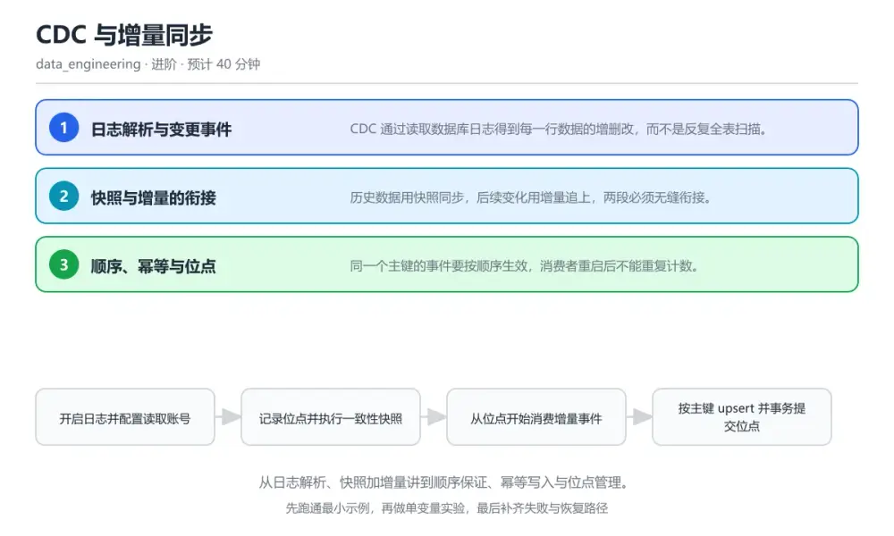
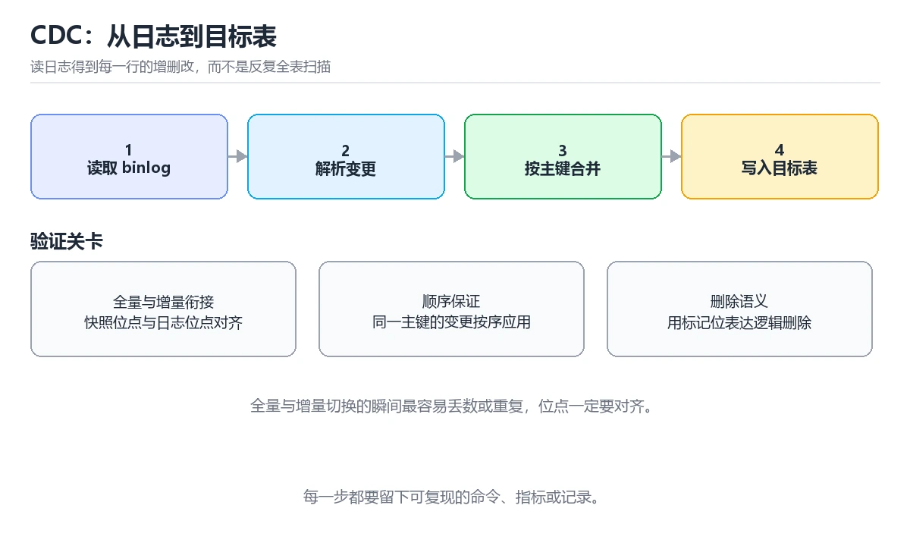

# CDC 与增量同步

> 内容更新时间：2026-10-06 · 学习阶段：进阶 · 预计用时：40 分钟

分类：data_engineering。关键词：CDC、binlog、增量同步、幂等写入、位点。从日志解析、快照加增量讲到顺序保证、幂等写入与位点管理。



## 本节知识框架

**课程定位**：所属分类 `data_engineering`（数据工程），课程主题 `CDC 与增量同步`，学习阶段 进阶，建议用时 40 分钟。

本课主线：从日志解析、快照加增量讲到顺序保证、幂等写入与位点管理。

**学完本课应当能够**
- 说清 `CDC` 与 `快照` 的含义与区别，并各举一个正例和一个反例。
- 用本课示例验证 `位点` 的行为，记录输入、输出与失败条件。
- 遇到「快照与增量之间丢数据」这类问题时，能说出触发条件与修复顺序。

### 从概念到验证的学习链条

1. `CDC`：先掌握 捕获数据库变更并按事件流同步给下游的技术，再用它解释 `快照` 为什么会出现。
2. `快照`：先掌握 某一时刻源表的全量数据副本，再用它解释 `位点` 为什么会出现。
3. `位点`：先掌握 消费进度标识，记录已经处理到哪条事件，再用它解释 `upsert` 为什么会出现。
4. `upsert`：先掌握 存在则更新、不存在则插入的写入方式，再用它解释 `消费延迟` 为什么会出现。
5. `消费延迟`：先掌握 最新事件产生到被下游处理完成的时间差，再用它解释 `日志解析` 为什么会出现。
6. `日志解析`：先掌握 日志解析组件把一条事务日志翻译成带操作类型、主键、前后镜像与时间戳的事件，投递到消息通道供下游消费，再用它解释 本课示例的观察结果 为什么会出现。

**先修与衔接**：本课是「数据工程」分类的第 5 课。当前没有登记显式先修或后续课程；课程主线是从日志解析、快照加增量讲到顺序保证、幂等写入与位点管理。学完后按 `data_engineering` 分类顺序继续。

### 完成判据

- **定义关**：不看正文也能说明 `CDC` 是 捕获数据库变更并按事件流同步给下游的技术，并指出一个反例。
- **机制关**：能按“输入 → 转换 → 输出 → 验证”复述 `CDC 与增量同步`，而不是只背结论。
- **示例关**：能运行或推演 `CDC 与增量同步` 的 `text` 示例，并说明一个真实出现的标识符或字面量。
- **证据关**：能从 `CDC 与增量同步` 的示例写出一个输入、处理、输出三元组，并说明它支持或反驳了本课的哪一条结论。
- **排错关**：能复现 快照与增量之间丢数据，记录现象并按 先记录位点再启动快照，快照结束后从记录的位点开始消费并去重 修复。
- **迁移关**：能把 `CDC`、`binlog`、`增量同步`、`幂等写入` 放进一个与 `CDC 与增量同步` 不同的项目场景，并保持输入与验证条件可追踪。
- **复盘关**：学完 `CDC 与增量同步` 后，用一句话写下仍然不确定的结论，并列出下一次验证需要的输入、环境和成功判据。

### 复习清单

- [ ] 能不看正文复述本课核心术语，并指出一个边界或反例。
- [ ] 能运行或推演本课示例，记录输入、输出与失败现象。
- [ ] 能完成一次自测，并把错题对照错误表定位原因。

**本课配图**



## 核心概念定义

| 术语 | 操作性定义 | 常见边界与风险 |
| --- | --- | --- |
| CDC | 捕获数据库变更并按事件流同步给下游的技术。 | 索引命中与数据分布决定实际开销，判断前先看执行计划而不是只看结果是否正确。 |
| 快照 | 某一时刻源表的全量数据副本。 | 易错：快照完成之后才记录位点再开始消费增量；正确做法是先记录位点再启动快照，快照结束后从记录的位点开始消费并去重。 |
| 位点 | 消费进度标识，记录已经处理到哪条事件。 | 易错：快照完成之后才记录位点再开始消费增量；正确做法是先记录位点再启动快照，快照结束后从记录的位点开始消费并去重。 |
| upsert | 存在则更新、不存在则插入的写入方式。 | 易错：写入成功后单独提交位点，写入与提交不在同一事务；正确做法是位点与数据在同一事务提交，目标表对主键加唯一约束并采用 upsert。 |
| 消费延迟 | 最新事件产生到被下游处理完成的时间差。 | 只在「最新事件产生到被下游处理完成的时间差」这一前提下成立，换输入或换环境要重新验证。 |
| 日志解析 | 日志解析组件把一条事务日志翻译成带操作类型、主键、前后镜像与时间戳的事件，投递到消息通道供下游消费 | 隔离级别与并发事务会影响可见性，换级别或换存储引擎后要重新验证。 |

## 原理与运行机制

### 机制总览

**教材衔接：核心知识**

### 1. 日志解析与变更事件

CDC 通过读取数据库日志得到每一行数据的增删改，而不是反复全表扫描。

日志解析组件把一条事务日志翻译成带操作类型、主键、前后镜像与时间戳的事件，投递到消息通道供下游消费。

在CDC 与增量同步里可以这样验证：在本课示例里执行一条更新语句，观察事件里同时包含更新前后的字段值。

边界：只取更新后的值会丢失对比能力，无法判断字段是否真的发生变化。

工程视角：事件格式固定包含操作类型与前后镜像，解析端与消费端共用同一份格式定义。

### 2. 快照与增量的衔接

历史数据用快照同步，后续变化用增量追上，两段必须无缝衔接。

先记录日志位点再做全量快照，快照完成后从记录位点开始消费增量，这样快照期间产生的变化也能被补上。

在CDC 与增量同步里可以这样验证：在本课示例里边做快照边写入新数据，观察最终结果与源表行数一致。

边界：快照结束后才记录位点会漏掉中间发生的变更，且漏掉的数据很难事后发现。

工程视角：位点先落盘再启动快照，快照与增量衔接处用主键去重，并对比源表与目标表的校验和。

### 3. 顺序、幂等与位点

同一个主键的事件要按顺序生效，消费者重启后不能重复计数。

按主键哈希分区保证同键有序，目标端按主键做 upsert，位点与数据写入在同一事务提交，重启后从上次位点继续。

在CDC 与增量同步里可以这样验证：在本课示例里让消费者处理到一半被杀掉再重启，观察目标表行数与源表保持一致。

边界：先提交位点再写数据会丢事件，先写数据再提交位点会重复，两种顺序都需要幂等兜底。

工程视角：目标表以主键做唯一约束，写入与位点更新放同一事务，并监控消费延迟与重复率。

**教材衔接：关键流程**

```text
开启日志并配置读取账号 → 记录位点并执行一致性快照 → 从位点开始消费增量事件 → 按主键 upsert 并事务提交位点 → 校验行数与校验和并监控延迟
```

1. 开启日志并配置读取账号
2. 记录位点并执行一致性快照
3. 从位点开始消费增量事件
4. 按主键 upsert 并事务提交位点
5. 校验行数与校验和并监控延迟

### 机制拆解：每一步的输入、动作与输出

#### 1. `CDC`
- 输入：`CDC`；本步把 捕获数据库变更并按事件流同步给下游的技术 当作判断规则。
- 动作：围绕 `CDC` 保留中间状态，并记录它与 `快照` 的对应关系。
- 输出：`快照`，它可以被下一段代码、测试或记录继续使用。
- `CDC` 的失败条件：索引命中与数据分布决定实际开销，判断前先看执行计划而不是只看结果是否正确。

#### 2. `快照`
- 输入：`CDC`；本步把 某一时刻源表的全量数据副本 当作判断规则。
- 动作：围绕 `快照` 保留中间状态，并记录它与 `位点` 的对应关系。
- 输出：`位点`，它可以被下一段代码、测试或记录继续使用。
- `快照` 的失败条件：当快照与增量之间丢数据时，会出现快照完成之后才记录位点再开始消费增量。

#### 3. `位点`
- 输入：`快照`；本步把 消费进度标识，记录已经处理到哪条事件 当作判断规则。
- 动作：围绕 `位点` 保留中间状态，并记录它与 `upsert` 的对应关系。
- 输出：`upsert`，它可以被下一段代码、测试或记录继续使用。
- `位点` 的失败条件：当快照与增量之间丢数据时，会出现快照完成之后才记录位点再开始消费增量。

#### 4. `upsert`
- 输入：`位点`；本步把 存在则更新、不存在则插入的写入方式 当作判断规则。
- 动作：围绕 `upsert` 保留中间状态，并记录它与 `消费延迟` 的对应关系。
- 输出：`消费延迟`，它可以被下一段代码、测试或记录继续使用。
- `upsert` 的失败条件：当消费者重启后数据重复时，会出现写入成功后单独提交位点，写入与提交不在同一事务。

#### 5. `消费延迟`
- 输入：`upsert`；本步把 最新事件产生到被下游处理完成的时间差 当作判断规则。
- 动作：围绕 `消费延迟` 保留中间状态，并记录它与 `日志解析` 的对应关系。
- 输出：`日志解析`，它可以被下一段代码、测试或记录继续使用。
- `消费延迟` 的失败条件：只在「最新事件产生到被下游处理完成的时间差」这一前提下成立，换输入或换环境要重新验证。

#### 6. `日志解析`
- 输入：`消费延迟`；本步把 日志解析组件把一条事务日志翻译成带操作类型、主键、前后镜像与时间戳的事件，投递到消息通道供下游消费 当作判断规则。
- 动作：围绕 `日志解析` 保留中间状态，并记录它与 `本课示例的最终结果` 的对应关系。
- 输出：`本课示例的最终结果`，它可以被下一段代码、测试或记录继续使用。
- `日志解析` 的失败条件：隔离级别与并发事务会影响可见性，换级别或换存储引擎后要重新验证。

### 复现实验记录

- 环境：`CDC 与增量同步` 使用 `text` 示例，固定 `CDC`、`binlog`、`增量同步`、`幂等写入` 作为第一组条件。
- 首轮输入：从示例中的第一个输入开始，预测 `CDC` 会怎样变化。
- 基线观察：记录命令、输入、输出和错误原文，不用截图代替可复制的文本。
- 单变量修改：只改变 `CDC`，观察 `日志解析` 是否仍满足定义。
- 失败注入：复现 快照与增量之间丢数据，确认现象是 快照完成之后才记录位点再开始消费增量。
- 记录结论：把“修改前、修改后、预期变化、实际变化”写成四列表，这样复盘 `CDC 与增量同步` 时才能区分概念错误与实现错误。

## 典型应用场景

**教材衔接：深度拓展与实战**

### 机制拆解 1：日志解析与变更事件

日志解析组件把一条事务日志翻译成带操作类型、主键、前后镜像与时间戳的事件，投递到消息通道供下游消费。

落地时先确认前提：只取更新后的值会丢失对比能力，无法判断字段是否真的发生变化。再把结论写进检查表，让下一位同学可以按同样的输入复现。

工程做法：事件格式固定包含操作类型与前后镜像，解析端与消费端共用同一份格式定义。

### 机制拆解 2：快照与增量的衔接

先记录日志位点再做全量快照，快照完成后从记录位点开始消费增量，这样快照期间产生的变化也能被补上。

落地时先确认前提：快照结束后才记录位点会漏掉中间发生的变更，且漏掉的数据很难事后发现。再把结论写进检查表，让下一位同学可以按同样的输入复现。

工程做法：位点先落盘再启动快照，快照与增量衔接处用主键去重，并对比源表与目标表的校验和。

### 机制拆解 3：顺序、幂等与位点

按主键哈希分区保证同键有序，目标端按主键做 upsert，位点与数据写入在同一事务提交，重启后从上次位点继续。

落地时先确认前提：先提交位点再写数据会丢事件，先写数据再提交位点会重复，两种顺序都需要幂等兜底。再把结论写进检查表，让下一位同学可以按同样的输入复现。

工程做法：目标表以主键做唯一约束，写入与位点更新放同一事务，并监控消费延迟与重复率。

### 机制对照表

| 概念 | 解决什么问题 | 关键前提 | 失败信号 |
| --- | --- | --- | --- |
| 日志解析与变更事件 | CDC 通过读取数据库日志得到每一行数据的增删改，而不是反复全表扫描。 | 只取更新后的值会丢失对比能力，无法判断字段是否真的发生变化。 | 事件格式固定包含操作类型与前后镜像，解析端与消费端共用同一份格式定义。 |
| 快照与增量的衔接 | 历史数据用快照同步，后续变化用增量追上，两段必须无缝衔接。 | 快照结束后才记录位点会漏掉中间发生的变更，且漏掉的数据很难事后发现。 | 位点先落盘再启动快照，快照与增量衔接处用主键去重，并对比源表与目标表的校 |
| 顺序、幂等与位点 | 同一个主键的事件要按顺序生效，消费者重启后不能重复计数。 | 先提交位点再写数据会丢事件，先写数据再提交位点会重复，两种顺序都需要幂等 | 目标表以主键做唯一约束，写入与位点更新放同一事务，并监控消费延迟与重复率 |

### 自测问答

**问 1**：快照与增量衔接的正确顺序是？

**答**：先记录位点，再做快照，再从位点开始消费。只有先记录位点，快照期间产生的变化才会包含在随后的增量里，衔接处再用主键去重即可保证不丢不重。 正确选项「先记录位点，再做快照，再从位点开始消费」对应《CDC 与增量同步》的要点「日志解析与变更事件」：CDC 通过读取数据库日志得到每一行数据的增删改，而不是反复全表扫描。判断「日志解析与变更事件」时先确认前提是否成立，再回到《CDC 与增量同步》的示例核对一次；把别的语言或框架的默认做法直接搬到日志解析与变更事件上，往往会在本课的边界条件里失效。

**问 2**：把位点提交与数据写入放在同一事务的目的是？

**答**：避免丢事件或重复应用事件的不一致。两者在同一事务里要么都成功要么都回滚，重启后从一致的起点继续，不会出现数据与进度错位。 正确选项「避免丢事件或重复应用事件的不一致」对应《CDC 与增量同步》的要点「快照与增量的衔接」：历史数据用快照同步，后续变化用增量追上，两段必须无缝衔接。判断「快照与增量的衔接」时先确认前提是否成立，再回到《CDC 与增量同步》的示例核对一次；借鉴相邻主题的经验之前，先核对快照与增量的衔接的前提是否成立。

**问 3**：以下哪些做法有助于保证同步结果的正确性？（多选）

**答**：目标表主键唯一约束；按主键哈希分区保证同键有序；定期对比源表与目标表校验和。唯一约束与有序分区保证写入正确，定期对账能发现隐性偏差；只保留更新后的值会丢失对比与排查依据。 正确选项「目标表主键唯一约束；按主键哈希分区保证同键有序；定期对比源表与目标表校验和」对应《CDC 与增量同步》的要点「顺序、幂等与位点」：同一个主键的事件要按顺序生效，消费者重启后不能重复计数。判断「顺序、幂等与位点」时先确认前提是否成立，再回到《CDC 与增量同步》的示例核对一次；记住顺序、幂等与位点的结论之外还要记住适用条件，换一个输入往往就不成立了。

**问 4**：请按一次完整 CDC 同步的建设顺序排列。

**答**：开启数据库日志并授权。先具备变更来源，再做快照与增量同步，随后用对账确认结果，最后把运行指标纳入长期监控。 正确选项「开启数据库日志并授权；记录位点并做全量快照；消费增量事件并写入目标表；对账行数与校验和；把延迟与重复率接入监控」对应《CDC 与增量同步》的要点「日志解析与变更事件」：CDC 通过读取数据库日志得到每一行数据的增删改，而不是反复全表扫描。判断「日志解析与变更事件」时先确认前提是否成立，再回到《CDC 与增量同步》的示例核对一次；干扰项常常是相邻主题里成立的结论，只有按日志解析与变更事件的输入与约束判断才能排除。

**问 5**：阅读这段消费代码，会带来什么后果？

**答**：先提交位点再写数据，进程崩溃会永久丢事件。位点先落盘，若写入前进程崩溃，重启后会跳过这条事件，缺失的数据不会自动补回；应把写入与位点放进同一事务。 正确选项「先提交位点再写数据，进程崩溃会永久丢事件」对应《CDC 与增量同步》的要点「快照与增量的衔接」：历史数据用快照同步，后续变化用增量追上，两段必须无缝衔接。判断「快照与增量的衔接」时先确认前提是否成立，再回到《CDC 与增量同步》的示例核对一次；把快照与增量的衔接的做法换到别的约束下未必成立，先确认边界再决定答案。


### 工程检查表

- [ ] 开启日志并配置读取账号
- [ ] 记录位点并执行一致性快照
- [ ] 从位点开始消费增量事件
- [ ] 按主键 upsert 并事务提交位点
- [ ] 校验行数与校验和并监控延迟
- [ ] 【日志解析与变更事件】事件格式固定包含操作类型与前后镜像，解析端与消费端共用同一份格式定义。
- [ ] 【快照与增量的衔接】位点先落盘再启动快照，快照与增量衔接处用主键去重，并对比源表与目标表的校验和。
- [ ] 【顺序、幂等与位点】目标表以主键做唯一约束，写入与位点更新放同一事务，并监控消费延迟与重复率。


### 结论与下一步

- **快照与增量之间丢数据**：典型现象是快照完成之后才记录位点再开始消费增量；正确做法是先记录位点再启动快照，快照结束后从记录的位点开始消费并去重。
- **消费者重启后数据重复**：典型现象是写入成功后单独提交位点，写入与提交不在同一事务；正确做法是位点与数据在同一事务提交，目标表对主键加唯一约束并采用 upsert。
- **同一行事件乱序**：典型现象是同一主键的事件分散到多个分区并行消费；正确做法是按主键哈希分区保证同键有序，必要时对同键事件串行处理。

### 最小验证场景

- 准备：保留 `text` 示例的原始输入，先记录 `CDC 与增量同步` 的基线输出和完整运行命令。
- 判定：新结果与 `CDC 与增量同步` 的基线不同不等于错误；只有当差异破坏了 `CDC` 的定义或错误表中的约束，才判定为失败。

### 选择与边界

- 使用 `CDC` 时，先满足它的定义：捕获数据库变更并按事件流同步给下游的技术；索引命中与数据分布决定实际开销，判断前先看执行计划而不是只看结果是否正确。
- 使用 `快照` 时，先满足它的定义：某一时刻源表的全量数据副本；易错：快照完成之后才记录位点再开始消费增量；正确做法是先记录位点再启动快照，快照结束后从记录的位点开始消费并去重。
- 使用 `位点` 时，先满足它的定义：消费进度标识，记录已经处理到哪条事件；易错：快照完成之后才记录位点再开始消费增量；正确做法是先记录位点再启动快照，快照结束后从记录的位点开始消费并去重。
- 使用 `upsert` 时，先满足它的定义：存在则更新、不存在则插入的写入方式；易错：写入成功后单独提交位点，写入与提交不在同一事务；正确做法是位点与数据在同一事务提交，目标表对主键加唯一约束并采用 upsert。
- 使用 `消费延迟` 时，先满足它的定义：最新事件产生到被下游处理完成的时间差；只在「最新事件产生到被下游处理完成的时间差」这一前提下成立，换输入或换环境要重新验证。

## 代码/协议/SQL 示例

### 最小可验证示例

**教材衔接：原文最小示例**

```python
def apply_event(conn, event, offset_store):
    """按主键幂等写入，数据与位点在同一事务提交。"""
    with conn.transaction():
        if event.op in ("insert", "update"):
            conn.execute(
                """INSERT INTO dwd.orders (id, amount, status, updated_at)
                   VALUES (%s, %s, %s, %s)
                   ON CONFLICT (id) DO UPDATE
                   SET amount = EXCLUDED.amount,
                       status = EXCLUDED.status,
                       updated_at = EXCLUDED.updated_at""",
                (event.after["id"], event.after["amount"],
                 event.after["status"], event.ts_ms),
            )
        elif event.op == "delete":
            conn.execute("DELETE FROM dwd.orders WHERE id = %s", (event.before["id"],))
        # 位点和数据一起提交：要么都生效，要么都回滚
        offset_store.save(conn, event.partition, event.offset)

# 消费循环：失败重试也不会产生重复行
for event in consumer.poll():
    apply_event(conn, event, offset_store)
```

### 示例精读：先找证据，再改一个条件

- 在 `CDC 与增量同步` 中与 `CDC` 对照：示例必须能支持 捕获数据库变更并按事件流同步给下游的技术，否则说明这一段还缺少实现或验证步骤。
- 在 `CDC 与增量同步` 中与 `快照` 对照：示例必须能支持 某一时刻源表的全量数据副本，否则说明这一段还缺少实现或验证步骤。
- 在 `CDC 与增量同步` 中与 `位点` 对照：示例必须能支持 消费进度标识，记录已经处理到哪条事件，否则说明这一段还缺少实现或验证步骤。
- 在 `CDC 与增量同步` 中与 `upsert` 对照：示例必须能支持 存在则更新、不存在则插入的写入方式，否则说明这一段还缺少实现或验证步骤。
- `CDC 与增量同步` 的示例没有抽取到函数调用或字面量；按行记录输入、控制流和输出，避免只背代码外形。

## 时间/空间复杂度或性能分析

**性能关注点（CDC 与增量同步）**：批处理看吞吐、流处理看延迟：分别记录端到端延迟、背压情况与资源占用。

**本课特有开销（CDC 与增量同步 · CDC）**：长事务会放大锁等待，记录事务持续时间与锁冲突次数。

**测量方法**：以 `CDC 与增量同步` 的 `CDC` 场景为对象，固定输入跑一遍记录基线，再把规模或并发度提高一个数量级复测；两次结果的差值与波动范围才是结论依据。

### 需要控制的变量与记录项

- `CDC 与增量同步` 的 `CDC`：固定它的版本、输入范围和资源上限，分别记录速度、内存与失败率的变化。
- `CDC 与增量同步` 的 `binlog`：固定它的版本、输入范围和资源上限，分别记录速度、内存与失败率的变化。
- `CDC 与增量同步` 的 `增量同步`：固定它的版本、输入范围和资源上限，分别记录速度、内存与失败率的变化。
- `CDC 与增量同步` 的 `幂等写入`：固定它的版本、输入范围和资源上限，分别记录速度、内存与失败率的变化。
- `CDC 与增量同步` 的 `位点`：固定它的版本、输入范围和资源上限，分别记录速度、内存与失败率的变化。
- `CDC 与增量同步` 中 `CDC` 的边界：索引命中与数据分布决定实际开销，判断前先看执行计划而不是只看结果是否正确。达到边界时不要外推，必须重新测量。
- `CDC 与增量同步` 中 `快照` 的边界：易错：快照完成之后才记录位点再开始消费增量；正确做法是先记录位点再启动快照，快照结束后从记录的位点开始消费并去重。达到边界时不要外推，必须重新测量。
- `CDC 与增量同步` 中 `位点` 的边界：易错：快照完成之后才记录位点再开始消费增量；正确做法是先记录位点再启动快照，快照结束后从记录的位点开始消费并去重。达到边界时不要外推，必须重新测量。
- `CDC 与增量同步` 中 `upsert` 的边界：易错：写入成功后单独提交位点，写入与提交不在同一事务；正确做法是位点与数据在同一事务提交，目标表对主键加唯一约束并采用 upsert。达到边界时不要外推，必须重新测量。
- `CDC 与增量同步` 中 `消费延迟` 的边界：只在「最新事件产生到被下游处理完成的时间差」这一前提下成立，换输入或换环境要重新验证。达到边界时不要外推，必须重新测量。

## 常见误区与易错点

| 容易写错的做法 | 实际现象 | 原因与正确做法 |
| --- | --- | --- |
| 快照与增量之间丢数据 | 快照完成之后才记录位点再开始消费增量。 | 先记录位点再启动快照，快照结束后从记录的位点开始消费并去重。 |
| 消费者重启后数据重复 | 写入成功后单独提交位点，写入与提交不在同一事务。 | 位点与数据在同一事务提交，目标表对主键加唯一约束并采用 upsert。 |
| 同一行事件乱序 | 同一主键的事件分散到多个分区并行消费。 | 按主键哈希分区保证同键有序，必要时对同键事件串行处理。 |

### 现场 1：快照与增量之间丢数据

**症状**：快照完成之后才记录位点再开始消费增量。

**根因与修复**：先记录位点再启动快照，快照结束后从记录的位点开始消费并去重。

**自检**：在本课示例里复现「快照与增量之间丢数据」，改成先记录位点再启动快照，快照结束后从记录的位点开始消费并去重后重跑；如果症状消失且失败路径按预期变化，说明定位正确。

### 现场 2：消费者重启后数据重复

**症状**：写入成功后单独提交位点，写入与提交不在同一事务。

**根因与修复**：位点与数据在同一事务提交，目标表对主键加唯一约束并采用 upsert。

**自检**：在本课示例里复现「消费者重启后数据重复」，改成位点与数据在同一事务提交，目标表对主键加唯一约束并采用 upsert后重跑；如果症状消失且失败路径按预期变化，说明定位正确。

### 现场 3：同一行事件乱序

**症状**：同一主键的事件分散到多个分区并行消费。

**根因与修复**：按主键哈希分区保证同键有序，必要时对同键事件串行处理。

**自检**：在本课示例里复现「同一行事件乱序」，改成按主键哈希分区保证同键有序，必要时对同键事件串行处理后重跑；如果症状消失且失败路径按预期变化，说明定位正确。

## 与其他知识点的关系

**教材衔接：复习与迁移**


### 迁移练习

- **术语归属**：`CDC`、`快照`、`位点` 的定义以本课「核心概念定义」为准，换到其他课程时先确认定义是否被改写。

### 容易混淆的相邻概念

- `CDC` 与 `快照`：前者强调 捕获数据库变更并按事件流同步给下游的技术；后者强调 某一时刻源表的全量数据副本。判断时分别检查两条定义的适用范围，不要只看名称相似就互换。
- `快照` 与 `位点`：前者强调 某一时刻源表的全量数据副本；后者强调 消费进度标识，记录已经处理到哪条事件。判断时分别检查两条定义的适用范围，不要只看名称相似就互换。
- `位点` 与 `upsert`：前者强调 消费进度标识，记录已经处理到哪条事件；后者强调 存在则更新、不存在则插入的写入方式。判断时分别检查两条定义的适用范围，不要只看名称相似就互换。
- `upsert` 与 `消费延迟`：前者强调 存在则更新、不存在则插入的写入方式；后者强调 最新事件产生到被下游处理完成的时间差。判断时分别检查两条定义的适用范围，不要只看名称相似就互换。
- `消费延迟` 与 `日志解析`：前者强调 最新事件产生到被下游处理完成的时间差；后者强调 日志解析组件把一条事务日志翻译成带操作类型、主键、前后镜像与时间戳的事件，投递到消息通道供下游消费。判断时分别检查两条定义的适用范围，不要只看名称相似就互换。

## 自测题与参考答案

> 先独立作答，再对照参考答案；答案都能在本课正文、术语表或错误表里找到依据。

### 自测 1（概念复述）

不看正文，写出 `CDC` 的操作性定义，并说明它与 `快照` 的区别。

**参考答案**：捕获数据库变更并按事件流同步给下游的技术。

`快照` 的定位是：某一时刻源表的全量数据副本；两者的差别要从适用对象与失败模式上说明。

### 自测 2（排错）

本课错误表记录了「快照与增量之间丢数据」这类做法。请写出它会出现的现象、根因，以及修复顺序。

**参考答案**：现象是快照完成之后才记录位点再开始消费增量；正确做法是先记录位点再启动快照，快照结束后从记录的位点开始消费并去重。修复时先复现现象并保留证据，再改动一处假设重跑，确认现象消失。

### 自测 3（动手验证）

运行本课的 `text` 示例，改动其中一个输入后重新运行，记录输出与错误信息。

**参考答案**：正常输入下 `text` 示例应当复现正文给出的结果；改动输入后，如果结果改变或报错，先核对它是否满足 `CDC 与增量同步` 中`CDC` 的适用范围，再检查错误表里是否有同类现象。

### 自测 4（代码阅读）

阅读本课开头的 `text` 示例，说明它体现了`CDC` 的哪一条性质，并指出改动哪个输入会让这条性质不再成立。

**参考答案**：`CDC` 的定义是 捕获数据库变更并按事件流同步给下游的技术，示例正是在实现这条定义。改动与 `CDC` 有关的一个输入后，如果结果不再符合 `CDC 与增量同步` 的正文描述，就说明该性质只在当前前提成立。

### 自测 5（迁移）

把 `CDC 与增量同步` 的方法迁移到自己的项目：围绕 `CDC` 写出一个与错误表同类的风险点，并说明触发条件和检验方式。

**参考答案**：例如「同一行事件乱序」，它会导致同一主键的事件分散到多个分区并行消费；检验方式是按按主键哈希分区保证同键有序，必要时对同键事件串行处理改一处再复现，确认现象消失且没有引入新的失败分支。

### 自测 6（对比）

用一个表格对比 `CDC` 与 `快照`：各写一行适用场景、一行失败表现。

**参考答案**：`CDC` 的定义是捕获数据库变更并按事件流同步给下游的技术；`快照` 的定义是某一时刻源表的全量数据副本。两者的失败表现分别对应本课错误表里与本术语相关的行。

### 自测 7（排错顺序）

面对「快照与增量之间丢数据」引发的问题，请把“复现 快照完成之后才记录位点再开始消费增量 → 保留证据 → 先记录位点再启动快照，快照结束后从记录的位点开始消费并去重 → 回归验证”四步写成可执行的检查清单。

**参考答案**：第一步按快照完成之后才记录位点再开始消费增量复现；第二步记录输入、版本与完整报错；第三步按先记录位点再启动快照，快照结束后从记录的位点开始消费并去重只改一处；第四步重跑并确认失败路径也按预期变化。

### 自测 8（边界判断）

针对 `日志解析`，分别写出“可以使用”的条件和“结论不再成立”的条件。

**参考答案**：隔离级别与并发事务会影响可见性，换级别或换存储引擎后要重新验证。 同时要把 `日志解析` 的定义 日志解析组件把一条事务日志翻译成带操作类型、主键、前后镜像与时间戳的事件，投递到消息通道供下游消费 与实际输入逐项对照。

### 自测 9（机制重建）

不看正文，按输入、转换、输出、验证四段重建 `CDC` → `快照` → `位点` → `upsert` 的作用链。

**参考答案**：起点是 `CDC` 的定义 捕获数据库变更并按事件流同步给下游的技术；中间每一步都保留可观察状态；终点由 `日志解析` 检查，失败时回到错误表定位第一个偏离定义的步骤。

### 自测 10（综合排错）

在 `CDC 与增量同步` 中，现象是 同一主键的事件分散到多个分区并行消费。请围绕 同一行事件乱序 写出最小复现、关键证据、修复动作和回归验证，并说明为什么不能只凭一次运行下结论。

**参考答案**：先复现 同一行事件乱序，记录输入与完整错误；再按 按主键哈希分区保证同键有序，必要时对同键事件串行处理 只改一处。回归时同时跑正常路径和边界路径，只有两次结果都可解释，才把修复视为完成。

### 自测 11（一分钟复述）

用每分钟约 200 字的速度复述 `CDC 与增量同步`：先给主问题，再按顺序说出 `CDC`、`快照`、`位点`、`upsert`，最后给一个失败案例。

**自评标准**：主问题必须对应 从日志解析、快照加增量讲到顺序保证、幂等写入与位点管理；每个术语都要能接上一句定义或边界；失败案例必须写成可观察现象，不能用“可能有风险”代替证据。

## 术语速查

| 术语 | 一句话说明 |
| --- | --- |
| `CDC` | 捕获数据库变更并按事件流同步给下游的技术。 |
| `快照` | 某一时刻源表的全量数据副本。 |
| `位点` | 消费进度标识，记录已经处理到哪条事件。 |
| `upsert` | 存在则更新、不存在则插入的写入方式。 |
| `消费延迟` | 最新事件产生到被下游处理完成的时间差。 |
| `日志解析` | 日志解析组件把一条事务日志翻译成带操作类型、主键、前后镜像与时间戳的事件，投递到消息通道供下游消费。 |

**术语关系**：`CDC`（捕获数据库变更并按事件流同步给下游的技术） → `快照`（某一时刻源表的全量数据副本） → `位点`（消费进度标识） → `upsert`（存在则更新、不存在则插入的写入方式）。

## 考点精讲

`CDC 与增量同步` 的题库有 5 道题，下面逐题给出题干、正确项与判断依据：先自己作答，再核对正确项，最后回到正文对应小节复核。

### 考点 1：第 1 题

- **题目**：快照与增量衔接的正确顺序是？
- **正确项**：先记录位点，再做快照
- **判断依据**：这道题落在术语 `快照` 上：某一时刻源表的全量数据副本。复习时把 `快照` 的定义、适用边界和一个反例一起说清楚，再回到「核心概念定义」核对原文。

### 考点 2：第 2 题

- **题目**：把位点提交与数据写入放在同一事务的目的是？
- **正确项**：避免丢事件或重复应用事件的不一致
- **判断依据**：这道题落在术语 `位点` 上：消费进度标识，记录已经处理到哪条事件。复习时把 `位点` 的定义、适用边界和一个反例一起说清楚，再回到「核心概念定义」核对原文。

### 考点 3：第 3 题

- **题目**：以下哪些做法有助于保证同步结果的正确性？（多选）
- **正确项**：目标表主键唯一约束；按主键哈希分区保证同键有序；定期对比源表与目标表校验和
- **判断依据**：这道题检验本课主问题：从日志解析、快照加增量讲到顺序保证、幂等写入与位点管理。复习时先复述本课主问题，再举一个会让结论失效的输入。

### 考点 4：第 4 题

- **题目**：请按一次完整 CDC 同步的建设顺序排列。
- **正确项**：开启数据库日志并授权 → 记录位点并做全量快照 → 消费增量事件并写入目标表 → 对账行数与校验和 → 把延迟与重复率接入监控
- **判断依据**：这道题落在术语 `CDC` 上：捕获数据库变更并按事件流同步给下游的技术。复习时把 `CDC` 的定义、适用边界和一个反例一起说清楚，再回到「核心概念定义」核对原文。

### 考点 5：第 5 题

- **题目**：阅读这段消费代码，会带来什么后果？
- **正确项**：先提交位点再写数据，进程崩溃会永久丢事件
- **判断依据**：这道题落在术语 `位点` 上：消费进度标识，记录已经处理到哪条事件。复习时把 `位点` 的定义、适用边界和一个反例一起说清楚，再回到「核心概念定义」核对原文。

### 考点 6：`CDC`

- **要点**：捕获数据库变更并按事件流同步给下游的技术。
- **CDC 的边界**：索引命中与数据分布决定实际开销，判断前先看执行计划而不是只看结果是否正确。

### 考点 7：`快照`

- **要点**：某一时刻源表的全量数据副本。
- **快照 的边界**：易错：快照完成之后才记录位点再开始消费增量；正确做法是先记录位点再启动快照，快照结束后从记录的位点开始消费并去重。

### 考点 8：`位点`

- **要点**：消费进度标识，记录已经处理到哪条事件。
- **位点 的边界**：易错：快照完成之后才记录位点再开始消费增量；正确做法是先记录位点再启动快照，快照结束后从记录的位点开始消费并去重。

### 考点 9：`upsert`

- **要点**：存在则更新、不存在则插入的写入方式。
- **upsert 的边界**：易错：写入成功后单独提交位点，写入与提交不在同一事务；正确做法是位点与数据在同一事务提交，目标表对主键加唯一约束并采用 upsert。

### 考点 10：`消费延迟`

- **要点**：最新事件产生到被下游处理完成的时间差。
- **消费延迟 的边界**：只在「最新事件产生到被下游处理完成的时间差」这一前提下成立，换输入或换环境要重新验证。

### 考点 11：`日志解析`

- **要点**：日志解析组件把一条事务日志翻译成带操作类型、主键、前后镜像与时间戳的事件，投递到消息通道供下游消费
- **日志解析 的边界**：隔离级别与并发事务会影响可见性，换级别或换存储引擎后要重新验证。

### 考点 12：排错——快照与增量之间丢数据

- **现象**：快照完成之后才记录位点再开始消费增量。
- **处理**：先记录位点再启动快照，快照结束后从记录的位点开始消费并去重。

### 考点 13：排错——消费者重启后数据重复

- **现象**：写入成功后单独提交位点，写入与提交不在同一事务。
- **处理**：位点与数据在同一事务提交，目标表对主键加唯一约束并采用 upsert。

### 考点 14：综合辨析——`CDC` 与 `日志解析`

- **辨析点**：`CDC` 的定义是 捕获数据库变更并按事件流同步给下游的技术；`日志解析` 的定义是 日志解析组件把一条事务日志翻译成带操作类型、主键、前后镜像与时间戳的事件，投递到消息通道供下游消费。
- **答题要求**：面对 `CDC 与增量同步` 的题目，先判断描述的是 `CDC` 还是 `日志解析`，再归到对应定义，最后写出一个会让该定义失效的边界输入。

### 考点 15：排错评分点

- **现象分**：能写出 快照完成之后才记录位点再开始消费增量，而不是只写“程序有错”。
- **证据分**：保留触发 快照与增量之间丢数据 的输入、版本和错误原文。
- **修复分**：按 先记录位点再启动快照，快照结束后从记录的位点开始消费并去重 只改一处，并同时回归正常路径与边界路径。

## 内容元数据

- 内容版本：v2.0
- 最后更新：2026-10-06
- 学习阶段：进阶

| 字段 | 值 |
| --- | --- |
| 课程 ID | `de_cdc_incremental` |
| 所属分类 | `data_engineering` |
| 难度 | 进阶 |
| 预计用时 | 40 分钟 |
| 关键词 | CDC、binlog、增量同步、幂等写入、位点 |
| 配图 | `images/lesson_de_cdc_incremental.webp` |
| 参考资料 | 2 条 |
| 内容更新时间 | 2026-10-06 |

## 参考资料与复核

- 来源性质：官方文档、标准或权威教材；本课核对关键词：CDC、binlog、增量同步、幂等写入、位点。
- 最后复核：2026-10-04
- 下次复核：2027-01-10
- 复核范围：版本兼容、API 行为与工程实践

下面列出的资料用于核对本课结论，复习时可以对照阅读：
- [Debezium 官方文档：架构与快照](https://debezium.io/documentation/reference/stable/index.html)
- [PostgreSQL 逻辑复制与预写日志文档](https://www.postgresql.org/docs/current/logicaldecoding-explanation.html)

| [本课术语索引：CDC 与增量同步](#核心概念定义) | 按本课输入、术语边界和错误表现逐项核对 |
> 复核提示：《CDC 与增量同步》的结论如与资料冲突，以资料中的规范文本为准，并在笔记里记录差异与日期。