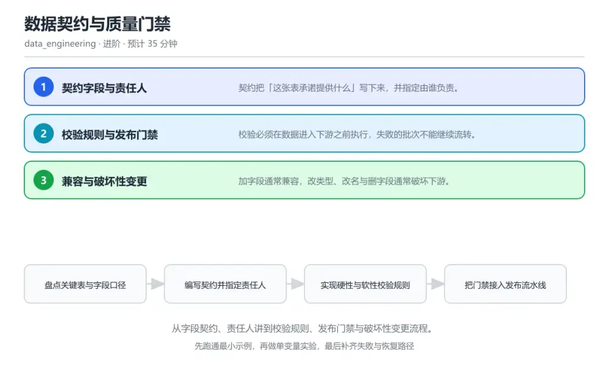
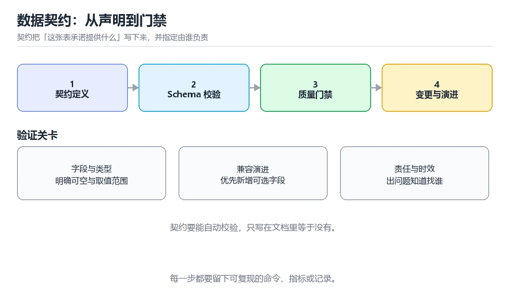

# 数据契约与质量门禁

> 内容更新时间：2026-10-06 · 学习阶段：进阶 · 预计用时：40 分钟

分类：data_engineering。关键词：数据契约、质量门禁、Schema 演进、责任人、破坏性变更。从字段契约、责任人讲到校验规则、发布门禁与破坏性变更流程。



## 本节知识框架

**课程定位**：所属分类 `data_engineering`（数据工程），课程主题 `数据契约与质量门禁`，学习阶段 进阶，建议用时 40 分钟。

本课主线：从字段契约、责任人讲到校验规则、发布门禁与破坏性变更流程。

**学完本课应当能够**
- 说清 `数据契约` 与 `质量门禁` 的含义与区别，并各举一个正例和一个反例。
- 用本课示例验证 `兼容变更` 的行为，记录输入、输出与失败条件。
- 遇到「字段口径悄悄改变」这类问题时，能说出触发条件与修复顺序。

### 从概念到验证的学习链条

1. `数据契约`：先掌握 生产者对字段结构、语义与质量的明确承诺，再用它解释 `质量门禁` 为什么会出现。
2. `质量门禁`：先掌握 数据或代码必须通过校验才能进入下一个环节的卡口，再用它解释 `兼容变更` 为什么会出现。
3. `兼容变更`：先掌握 不破坏既有消费者读取与语义的变更，再用它解释 `破坏性变更` 为什么会出现。
4. `破坏性变更`：先掌握 会让下游读取失败或结果错误的变更，再用它解释 `新鲜度` 为什么会出现。
5. `新鲜度`：先掌握 数据从产生到可用的时间差，再用它解释 `兼容` 为什么会出现。
6. `兼容`：先掌握 兼容变更可直接发布并通知消费者；破坏性变更需要新版本字段或新表并行运行，等消费者迁移完成后再下线旧结构，再用它解释 本课示例的观察结果 为什么会出现。

**先修与衔接**：本课是「数据工程」分类的第 8 课。当前没有登记显式先修或后续课程；课程主线是从字段契约、责任人讲到校验规则、发布门禁与破坏性变更流程。学完后按 `data_engineering` 分类顺序继续。

### 完成判据

- **定义关**：不看正文也能说明 `数据契约` 是 生产者对字段结构、语义与质量的明确承诺，并指出一个反例。
- **机制关**：能按“输入 → 转换 → 输出 → 验证”复述 `数据契约与质量门禁`，而不是只背结论。
- **示例关**：能运行或推演 `数据契约与质量门禁` 的 `text` 示例，并说明一个真实出现的标识符或字面量。
- **证据关**：能从 `数据契约与质量门禁` 的示例写出一个输入、处理、输出三元组，并说明它支持或反驳了本课的哪一条结论。
- **排错关**：能复现 字段口径悄悄改变，记录现象并按 破坏语义的变更必须新建字段或新表并行发布，旧结构保留迁移窗口后再下线 修复。
- **迁移关**：能把 `数据契约`、`质量门禁`、`Schema 演进`、`责任人` 放进一个与 `数据契约与质量门禁` 不同的项目场景，并保持输入与验证条件可追踪。
- **复盘关**：学完 `数据契约与质量门禁` 后，用一句话写下仍然不确定的结论，并列出下一次验证需要的输入、环境和成功判据。

### 复习清单

- [ ] 能不看正文复述本课核心术语，并指出一个边界或反例。
- [ ] 能运行或推演本课示例，记录输入、输出与失败现象。
- [ ] 能完成一次自测，并把错题对照错误表定位原因。

**本课配图**



## 核心概念定义

| 术语 | 操作性定义 | 常见边界与风险 |
| --- | --- | --- |
| 数据契约 | 生产者对字段结构、语义与质量的明确承诺。 | 只在「生产者对字段结构、语义与质量的明确承诺」这一前提下成立，换输入或换环境要重新验证。 |
| 质量门禁 | 数据或代码必须通过校验才能进入下一个环节的卡口。 | 只在「数据或代码必须通过校验才能进入下一个环节的卡口」这一前提下成立，换输入或换环境要重新验证。 |
| 兼容变更 | 不破坏既有消费者读取与语义的变更。 | 只在「不破坏既有消费者读取与语义的变更」这一前提下成立，换输入或换环境要重新验证。 |
| 破坏性变更 | 会让下游读取失败或结果错误的变更。 | 只在「会让下游读取失败或结果错误的变更」这一前提下成立，换输入或换环境要重新验证。 |
| 新鲜度 | 数据从产生到可用的时间差。 | 只在「数据从产生到可用的时间差」这一前提下成立，换输入或换环境要重新验证。 |
| 兼容 | 兼容变更可直接发布并通知消费者；破坏性变更需要新版本字段或新表并行运行，等消费者迁移完成后再下线旧结构 | 不同版本与依赖组合的行为可能不同，升级或换环境前要按官方变更说明重新验证。 |

## 原理与运行机制

### 机制总览

**教材衔接：核心知识**

### 1. 契约字段与责任人

契约把「这张表承诺提供什么」写下来，并指定由谁负责。

契约声明表名、字段类型、可空性、取值范围、更新频率与责任人，登记后作为生产与消费双方共同依据。

在数据契约与质量门禁里可以这样验证：在本课示例里为一列金额字段声明非空与下限约束，观察违反约束的批次被拒绝。

边界：契约没有责任人就是一纸空文，出问题时没人能立即给出修复与止损决定。

工程视角：契约存放在代码仓库并与表结构同源，变更走合并请求评审。

### 2. 校验规则与发布门禁

校验必须在数据进入下游之前执行，失败的批次不能继续流转。

流水线在关键节点运行规则集，覆盖非空、唯一、范围、枚举与跨表一致性，任一硬性规则失败即阻断发布并告警。

在数据契约与质量门禁里可以这样验证：在本课示例里注入一批空值数据，观察流水线在门禁处停止且不下发下游。

边界：把所有规则都设为告警不阻断，等于默认允许坏数据流入，问题会在下游集中爆发。

工程视角：规则分硬性与软性两级，硬性阻断发布，软性记录指标并在阈值超限时升级为阻断。

### 3. 兼容与破坏性变更

加字段通常兼容，改类型、改名与删字段通常破坏下游。

兼容变更可直接发布并通知消费者；破坏性变更需要新版本字段或新表并行运行，等消费者迁移完成后再下线旧结构。

在数据契约与质量门禁里可以这样验证：在本课示例里把字段类型从整数改为字符串，观察门禁与契约校验如何拦下这次变更。

边界：在原有字段上直接改语义，即使类型没变也会让下游统计结果悄悄错掉。

工程视角：变更单标注兼容等级与迁移窗口，下线旧结构前确认消费方已经全部切换。

**教材衔接：关键流程**

```text
盘点关键表与字段口径 → 编写契约并指定责任人 → 实现硬性与软性校验规则 → 把门禁接入发布流水线 → 破坏性变更走双版本并行迁移
```

1. 盘点关键表与字段口径
2. 编写契约并指定责任人
3. 实现硬性与软性校验规则
4. 把门禁接入发布流水线
5. 破坏性变更走双版本并行迁移

### 机制拆解：每一步的输入、动作与输出

#### 1. `数据契约`
- 输入：`数据契约`；本步把 生产者对字段结构、语义与质量的明确承诺 当作判断规则。
- 动作：围绕 `数据契约` 保留中间状态，并记录它与 `质量门禁` 的对应关系。
- 输出：`质量门禁`，它可以被下一段代码、测试或记录继续使用。
- `数据契约` 的失败条件：只在「生产者对字段结构、语义与质量的明确承诺」这一前提下成立，换输入或换环境要重新验证。

#### 2. `质量门禁`
- 输入：`数据契约`；本步把 数据或代码必须通过校验才能进入下一个环节的卡口 当作判断规则。
- 动作：围绕 `质量门禁` 保留中间状态，并记录它与 `兼容变更` 的对应关系。
- 输出：`兼容变更`，它可以被下一段代码、测试或记录继续使用。
- `质量门禁` 的失败条件：只在「数据或代码必须通过校验才能进入下一个环节的卡口」这一前提下成立，换输入或换环境要重新验证。

#### 3. `兼容变更`
- 输入：`质量门禁`；本步把 不破坏既有消费者读取与语义的变更 当作判断规则。
- 动作：围绕 `兼容变更` 保留中间状态，并记录它与 `破坏性变更` 的对应关系。
- 输出：`破坏性变更`，它可以被下一段代码、测试或记录继续使用。
- `兼容变更` 的失败条件：只在「不破坏既有消费者读取与语义的变更」这一前提下成立，换输入或换环境要重新验证。

#### 4. `破坏性变更`
- 输入：`兼容变更`；本步把 会让下游读取失败或结果错误的变更 当作判断规则。
- 动作：围绕 `破坏性变更` 保留中间状态，并记录它与 `新鲜度` 的对应关系。
- 输出：`新鲜度`，它可以被下一段代码、测试或记录继续使用。
- `破坏性变更` 的失败条件：只在「会让下游读取失败或结果错误的变更」这一前提下成立，换输入或换环境要重新验证。

#### 5. `新鲜度`
- 输入：`破坏性变更`；本步把 数据从产生到可用的时间差 当作判断规则。
- 动作：围绕 `新鲜度` 保留中间状态，并记录它与 `兼容` 的对应关系。
- 输出：`兼容`，它可以被下一段代码、测试或记录继续使用。
- `新鲜度` 的失败条件：只在「数据从产生到可用的时间差」这一前提下成立，换输入或换环境要重新验证。

#### 6. `兼容`
- 输入：`新鲜度`；本步把 兼容变更可直接发布并通知消费者；破坏性变更需要新版本字段或新表并行运行，等消费者迁移完成后再下线旧结构 当作判断规则。
- 动作：围绕 `兼容` 保留中间状态，并记录它与 `本课示例的最终结果` 的对应关系。
- 输出：`本课示例的最终结果`，它可以被下一段代码、测试或记录继续使用。
- `兼容` 的失败条件：不同版本与依赖组合的行为可能不同，升级或换环境前要按官方变更说明重新验证。

### 复现实验记录

- 环境：`数据契约与质量门禁` 使用 `text` 示例，固定 `数据契约`、`质量门禁`、`Schema 演进`、`责任人` 作为第一组条件。
- 首轮输入：从示例中的第一个输入开始，预测 `数据契约` 会怎样变化。
- 基线观察：记录命令、输入、输出和错误原文，不用截图代替可复制的文本。
- 单变量修改：只改变 `数据契约`，观察 `兼容` 是否仍满足定义。
- 失败注入：复现 字段口径悄悄改变，确认现象是 在原有字段上直接改含义，类型保持不变。
- 记录结论：把“修改前、修改后、预期变化、实际变化”写成四列表，这样复盘 `数据契约与质量门禁` 时才能区分概念错误与实现错误。

## 典型应用场景

**教材衔接：深度拓展与实战**

### 机制拆解 1：契约字段与责任人

契约声明表名、字段类型、可空性、取值范围、更新频率与责任人，登记后作为生产与消费双方共同依据。

落地时先确认前提：契约没有责任人就是一纸空文，出问题时没人能立即给出修复与止损决定。再把结论写进检查表，让下一位同学可以按同样的输入复现。

工程做法：契约存放在代码仓库并与表结构同源，变更走合并请求评审。

### 机制拆解 2：校验规则与发布门禁

流水线在关键节点运行规则集，覆盖非空、唯一、范围、枚举与跨表一致性，任一硬性规则失败即阻断发布并告警。

落地时先确认前提：把所有规则都设为告警不阻断，等于默认允许坏数据流入，问题会在下游集中爆发。再把结论写进检查表，让下一位同学可以按同样的输入复现。

工程做法：规则分硬性与软性两级，硬性阻断发布，软性记录指标并在阈值超限时升级为阻断。

### 机制拆解 3：兼容与破坏性变更

兼容变更可直接发布并通知消费者；破坏性变更需要新版本字段或新表并行运行，等消费者迁移完成后再下线旧结构。

落地时先确认前提：在原有字段上直接改语义，即使类型没变也会让下游统计结果悄悄错掉。再把结论写进检查表，让下一位同学可以按同样的输入复现。

工程做法：变更单标注兼容等级与迁移窗口，下线旧结构前确认消费方已经全部切换。

### 机制对照表

| 概念 | 解决什么问题 | 关键前提 | 失败信号 |
| --- | --- | --- | --- |
| 契约字段与责任人 | 契约把「这张表承诺提供什么」写下来，并指定由谁负责。 | 契约没有责任人就是一纸空文，出问题时没人能立即给出修复与止损决定。 | 契约存放在代码仓库并与表结构同源，变更走合并请求评审。 |
| 校验规则与发布门禁 | 校验必须在数据进入下游之前执行，失败的批次不能继续流转。 | 把所有规则都设为告警不阻断，等于默认允许坏数据流入，问题会在下游集中爆发 | 规则分硬性与软性两级，硬性阻断发布，软性记录指标并在阈值超限时升级为阻断 |
| 兼容与破坏性变更 | 加字段通常兼容，改类型、改名与删字段通常破坏下游。 | 在原有字段上直接改语义，即使类型没变也会让下游统计结果悄悄错掉。 | 变更单标注兼容等级与迁移窗口，下线旧结构前确认消费方已经全部切换。 |

### 自测问答

**问 1**：以下哪一项属于典型破坏性变更？

**答**：把字段类型从整数改为字符串。类型变化会让下游解析失败或静默变成另一种结果，是典型破坏性变更，需要新版本并行迁移。 正确选项「把字段类型从整数改为字符串」对应《数据契约与质量门禁》的要点「契约字段与责任人」：契约把「这张表承诺提供什么」写下来，并指定由谁负责。判断「契约字段与责任人」时先确认前提是否成立，再回到《数据契约与质量门禁》的示例核对一次；把别的语言或框架的默认做法直接搬到契约字段与责任人上，往往会在本课的边界条件里失效。

**问 2**：硬性规则与软性规则的分工是？

**答**：硬性阻断发布，软性记录指标并可升级为阻断。硬性规则守护不可协商的底线，软性规则给业务波动留空间，但阈值超限后应升级为阻断。 正确选项「硬性阻断发布，软性记录指标并可升级为阻断」对应《数据契约与质量门禁》的要点「校验规则与发布门禁」：校验必须在数据进入下游之前执行，失败的批次不能继续流转。判断「校验规则与发布门禁」时先确认前提是否成立，再回到《数据契约与质量门禁》的示例核对一次；借鉴相邻主题的经验之前，先核对校验规则与发布门禁的前提是否成立。

**问 3**：一份最小可用的数据契约应包含哪些内容？（多选）

**答**：字段类型与可空性；取值范围或枚举；责任人与联系方式。结构、约束与责任人是契约的核心；消费者内部实现细节不属于契约范围。 正确选项「字段类型与可空性；取值范围或枚举；责任人与联系方式」对应《数据契约与质量门禁》的要点「兼容与破坏性变更」：加字段通常兼容，改类型、改名与删字段通常破坏下游。判断「兼容与破坏性变更」时先确认前提是否成立，再回到《数据契约与质量门禁》的示例核对一次；记住兼容与破坏性变更的结论之外还要记住适用条件，换一个输入往往就不成立了。

**问 4**：请按一次破坏性变更的处理顺序排列。

**答**：提交变更单并标注破坏等级。先披露变更，再提供并行结构，通知迁移并双写对比验证，最后确认没有消费方后再安全下线。 正确选项「提交变更单并标注破坏等级；新增并行字段或新表；通知消费者并给出迁移窗口；双写并对比新旧结果；确认无消费后下线旧结构」对应《数据契约与质量门禁》的要点「契约字段与责任人」：契约把「这张表承诺提供什么」写下来，并指定由谁负责。判断「契约字段与责任人」时先确认前提是否成立，再回到《数据契约与质量门禁》的示例核对一次；干扰项常常是相邻主题里成立的结论，只有按契约字段与责任人的输入与约束判断才能排除。

**问 5**：阅读这段校验代码，问题是什么？

**答**：关键约束只打印日志，坏数据仍会继续流入下游。非空约束被打成告警后数据照常流转，下游仍会读到脏数据；关键约束必须阻断发布，或至少在阈值超限时升级为阻断。 正确选项「关键约束只打印日志，坏数据仍会继续流入下游」对应《数据契约与质量门禁》的要点「校验规则与发布门禁」：校验必须在数据进入下游之前执行，失败的批次不能继续流转。判断「校验规则与发布门禁」时先确认前提是否成立，再回到《数据契约与质量门禁》的示例核对一次；把校验规则与发布门禁的做法换到别的约束下未必成立，先确认边界再决定答案。


### 工程检查表

- [ ] 盘点关键表与字段口径
- [ ] 编写契约并指定责任人
- [ ] 实现硬性与软性校验规则
- [ ] 把门禁接入发布流水线
- [ ] 破坏性变更走双版本并行迁移
- [ ] 【契约字段与责任人】契约存放在代码仓库并与表结构同源，变更走合并请求评审。
- [ ] 【校验规则与发布门禁】规则分硬性与软性两级，硬性阻断发布，软性记录指标并在阈值超限时升级为阻断。
- [ ] 【兼容与破坏性变更】变更单标注兼容等级与迁移窗口，下线旧结构前确认消费方已经全部切换。


### 结论与下一步

- **字段口径悄悄改变**：典型现象是在原有字段上直接改含义，类型保持不变；正确做法是破坏语义的变更必须新建字段或新表并行发布，旧结构保留迁移窗口后再下线。
- **坏数据流到下游才被发现**：典型现象是校验规则只在报表层做提示不阻断；正确做法是把硬性规则前移到数据入口并阻断发布，软性规则用指标监控并设置升级阈值。
- **契约无人维护**：典型现象是契约文档没有责任人，变更也没有评审；正确做法是契约与表结构同源存放并指定责任人，变更通过合并请求评审留痕。

### 最小验证场景

- 准备：保留 `text` 示例的原始输入，先记录 `数据契约与质量门禁` 的基线输出和完整运行命令。
- 判定：新结果与 `数据契约与质量门禁` 的基线不同不等于错误；只有当差异破坏了 `数据契约` 的定义或错误表中的约束，才判定为失败。

### 选择与边界

- 使用 `数据契约` 时，先满足它的定义：生产者对字段结构、语义与质量的明确承诺；只在「生产者对字段结构、语义与质量的明确承诺」这一前提下成立，换输入或换环境要重新验证。
- 使用 `质量门禁` 时，先满足它的定义：数据或代码必须通过校验才能进入下一个环节的卡口；只在「数据或代码必须通过校验才能进入下一个环节的卡口」这一前提下成立，换输入或换环境要重新验证。
- 使用 `兼容变更` 时，先满足它的定义：不破坏既有消费者读取与语义的变更；只在「不破坏既有消费者读取与语义的变更」这一前提下成立，换输入或换环境要重新验证。
- 使用 `破坏性变更` 时，先满足它的定义：会让下游读取失败或结果错误的变更；只在「会让下游读取失败或结果错误的变更」这一前提下成立，换输入或换环境要重新验证。
- 使用 `新鲜度` 时，先满足它的定义：数据从产生到可用的时间差；只在「数据从产生到可用的时间差」这一前提下成立，换输入或换环境要重新验证。

## 代码/协议/SQL 示例

### 最小可验证示例

```text
盘点关键表与字段口径 → 编写契约并指定责任人 → 实现硬性与软性校验规则 → 把门禁接入发布流水线 → 破坏性变更走双版本并行迁移
```

**教材衔接：原文最小示例**

```text
盘点关键表与字段口径 → 编写契约并指定责任人 → 实现硬性与软性校验规则 → 把门禁接入发布流水线 → 破坏性变更走双版本并行迁移
```

```python
# 契约片段：字段类型、约束与责任人
CONTRACT = {
    "table": "dwd.orders",
    "owner": "data-platform@example.com",
    "fields": {
        "order_id": {"type": "string", "nullable": False, "unique": True},
        "amount":   {"type": "decimal", "nullable": False, "min": 0, "max": 1_000_000},
        "status":   {"type": "enum", "values": ["created", "paid", "shipped", "closed"]},
        "dt":       {"type": "date", "nullable": False},
    },
    "freshness_minutes": 30,
}

HARD_RULES = ["not_null", "type_match", "enum_membership"]  # 不通过直接阻断
def validate(df, contract):
    failures = []
    for name, spec in contract["fields"].items():
        if not spec["nullable"] and df.filter(df[name].isNull()).count() > 0:
            failures.append(("not_null", name))
        if spec.get("type") == "enum":
            bad = df.filter(~df[name].isin(spec["values"])).count()
            if bad:
                failures.append(("enum_membership", name))
    hard = [f for f in failures if f[0] in HARD_RULES]
    if hard:
        raise ValueError(f"质量门禁未通过：{hard}")   # 阻断发布
    return failures
```

### 示例精读：先找证据，再改一个条件

- 在 `数据契约与质量门禁` 中与 `数据契约` 对照：示例必须能支持 生产者对字段结构、语义与质量的明确承诺，否则说明这一段还缺少实现或验证步骤。
- 在 `数据契约与质量门禁` 中与 `质量门禁` 对照：示例必须能支持 数据或代码必须通过校验才能进入下一个环节的卡口，否则说明这一段还缺少实现或验证步骤。
- 在 `数据契约与质量门禁` 中与 `兼容变更` 对照：示例必须能支持 不破坏既有消费者读取与语义的变更，否则说明这一段还缺少实现或验证步骤。
- 在 `数据契约与质量门禁` 中与 `破坏性变更` 对照：示例必须能支持 会让下游读取失败或结果错误的变更，否则说明这一段还缺少实现或验证步骤。
- `数据契约与质量门禁` 的示例没有抽取到函数调用或字面量；按行记录输入、控制流和输出，避免只背代码外形。

## 时间/空间复杂度或性能分析

**性能关注点（数据契约与质量门禁）**：批处理看吞吐、流处理看延迟：分别记录端到端延迟、背压情况与资源占用。

**测量方法**：以 `数据契约与质量门禁` 的 `数据契约` 场景为对象，固定输入跑一遍记录基线，再把规模或并发度提高一个数量级复测；两次结果的差值与波动范围才是结论依据。

### 需要控制的变量与记录项

- `数据契约与质量门禁` 的 `数据契约`：固定它的版本、输入范围和资源上限，分别记录速度、内存与失败率的变化。
- `数据契约与质量门禁` 的 `质量门禁`：固定它的版本、输入范围和资源上限，分别记录速度、内存与失败率的变化。
- `数据契约与质量门禁` 的 `Schema 演进`：固定它的版本、输入范围和资源上限，分别记录速度、内存与失败率的变化。
- `数据契约与质量门禁` 的 `责任人`：固定它的版本、输入范围和资源上限，分别记录速度、内存与失败率的变化。
- `数据契约与质量门禁` 的 `破坏性变更`：固定它的版本、输入范围和资源上限，分别记录速度、内存与失败率的变化。
- `数据契约与质量门禁` 中 `数据契约` 的边界：只在「生产者对字段结构、语义与质量的明确承诺」这一前提下成立，换输入或换环境要重新验证。达到边界时不要外推，必须重新测量。
- `数据契约与质量门禁` 中 `质量门禁` 的边界：只在「数据或代码必须通过校验才能进入下一个环节的卡口」这一前提下成立，换输入或换环境要重新验证。达到边界时不要外推，必须重新测量。
- `数据契约与质量门禁` 中 `兼容变更` 的边界：只在「不破坏既有消费者读取与语义的变更」这一前提下成立，换输入或换环境要重新验证。达到边界时不要外推，必须重新测量。
- `数据契约与质量门禁` 中 `破坏性变更` 的边界：只在「会让下游读取失败或结果错误的变更」这一前提下成立，换输入或换环境要重新验证。达到边界时不要外推，必须重新测量。
- `数据契约与质量门禁` 中 `新鲜度` 的边界：只在「数据从产生到可用的时间差」这一前提下成立，换输入或换环境要重新验证。达到边界时不要外推，必须重新测量。

## 常见误区与易错点

| 容易写错的做法 | 实际现象 | 原因与正确做法 |
| --- | --- | --- |
| 字段口径悄悄改变 | 在原有字段上直接改含义，类型保持不变。 | 破坏语义的变更必须新建字段或新表并行发布，旧结构保留迁移窗口后再下线。 |
| 坏数据流到下游才被发现 | 校验规则只在报表层做提示不阻断。 | 把硬性规则前移到数据入口并阻断发布，软性规则用指标监控并设置升级阈值。 |
| 契约无人维护 | 契约文档没有责任人，变更也没有评审。 | 契约与表结构同源存放并指定责任人，变更通过合并请求评审留痕。 |

### 现场 1：字段口径悄悄改变

**症状**：在原有字段上直接改含义，类型保持不变。

**根因与修复**：破坏语义的变更必须新建字段或新表并行发布，旧结构保留迁移窗口后再下线。

**自检**：在本课示例里复现「字段口径悄悄改变」，改成破坏语义的变更必须新建字段或新表并行发布，旧结构保留迁移窗口后再下线后重跑；如果症状消失且失败路径按预期变化，说明定位正确。

### 现场 2：坏数据流到下游才被发现

**症状**：校验规则只在报表层做提示不阻断。

**根因与修复**：把硬性规则前移到数据入口并阻断发布，软性规则用指标监控并设置升级阈值。

**自检**：在本课示例里复现「坏数据流到下游才被发现」，改成把硬性规则前移到数据入口并阻断发布，软性规则用指标监控并设置升级阈值后重跑；如果症状消失且失败路径按预期变化，说明定位正确。

### 现场 3：契约无人维护

**症状**：契约文档没有责任人，变更也没有评审。

**根因与修复**：契约与表结构同源存放并指定责任人，变更通过合并请求评审留痕。

**自检**：在本课示例里复现「契约无人维护」，改成契约与表结构同源存放并指定责任人，变更通过合并请求评审留痕后重跑；如果症状消失且失败路径按预期变化，说明定位正确。

## 与其他知识点的关系

**教材衔接：复习与迁移**


### 迁移练习

- **术语归属**：`数据契约`、`质量门禁`、`兼容变更` 的定义以本课「核心概念定义」为准，换到其他课程时先确认定义是否被改写。
- 同一分类的《数据质量与数据治理》也涉及 `数据契约`；两课衔接时先确认这个术语的定义是否一致。

### 容易混淆的相邻概念

- `数据契约` 与 `质量门禁`：前者强调 生产者对字段结构、语义与质量的明确承诺；后者强调 数据或代码必须通过校验才能进入下一个环节的卡口。判断时分别检查两条定义的适用范围，不要只看名称相似就互换。
- `质量门禁` 与 `兼容变更`：前者强调 数据或代码必须通过校验才能进入下一个环节的卡口；后者强调 不破坏既有消费者读取与语义的变更。判断时分别检查两条定义的适用范围，不要只看名称相似就互换。
- `兼容变更` 与 `破坏性变更`：前者强调 不破坏既有消费者读取与语义的变更；后者强调 会让下游读取失败或结果错误的变更。判断时分别检查两条定义的适用范围，不要只看名称相似就互换。
- `破坏性变更` 与 `新鲜度`：前者强调 会让下游读取失败或结果错误的变更；后者强调 数据从产生到可用的时间差。判断时分别检查两条定义的适用范围，不要只看名称相似就互换。
- `新鲜度` 与 `兼容`：前者强调 数据从产生到可用的时间差；后者强调 兼容变更可直接发布并通知消费者；破坏性变更需要新版本字段或新表并行运行，等消费者迁移完成后再下线旧结构。判断时分别检查两条定义的适用范围，不要只看名称相似就互换。

## 自测题与参考答案

> 先独立作答，再对照参考答案；答案都能在本课正文、术语表或错误表里找到依据。

### 自测 1（概念复述）

不看正文，写出 `数据契约` 的操作性定义，并说明它与 `质量门禁` 的区别。

**参考答案**：生产者对字段结构、语义与质量的明确承诺。

`质量门禁` 的定位是：数据或代码必须通过校验才能进入下一个环节的卡口；两者的差别要从适用对象与失败模式上说明。

### 自测 2（排错）

本课错误表记录了「字段口径悄悄改变」这类做法。请写出它会出现的现象、根因，以及修复顺序。

**参考答案**：现象是在原有字段上直接改含义，类型保持不变；正确做法是破坏语义的变更必须新建字段或新表并行发布，旧结构保留迁移窗口后再下线。修复时先复现现象并保留证据，再改动一处假设重跑，确认现象消失。

### 自测 3（动手验证）

运行本课的 `text` 示例，改动其中一个输入后重新运行，记录输出与错误信息。

**参考答案**：正常输入下 `text` 示例应当复现正文给出的结果；改动输入后，如果结果改变或报错，先核对它是否满足 `数据契约与质量门禁` 中`数据契约` 的适用范围，再检查错误表里是否有同类现象。

### 自测 4（代码阅读）

阅读本课开头的 `text` 示例，说明它体现了`数据契约` 的哪一条性质，并指出改动哪个输入会让这条性质不再成立。

**参考答案**：`数据契约` 的定义是 生产者对字段结构、语义与质量的明确承诺，示例正是在实现这条定义。改动与 `数据契约` 有关的一个输入后，如果结果不再符合 `数据契约与质量门禁` 的正文描述，就说明该性质只在当前前提成立。

### 自测 5（迁移）

把 `数据契约与质量门禁` 的方法迁移到自己的项目：围绕 `数据契约` 写出一个与错误表同类的风险点，并说明触发条件和检验方式。

**参考答案**：例如「契约无人维护」，它会导致契约文档没有责任人，变更也没有评审；检验方式是按契约与表结构同源存放并指定责任人，变更通过合并请求评审留痕改一处再复现，确认现象消失且没有引入新的失败分支。

### 自测 6（对比）

用一个表格对比 `数据契约` 与 `质量门禁`：各写一行适用场景、一行失败表现。

**参考答案**：`数据契约` 的定义是生产者对字段结构、语义与质量的明确承诺；`质量门禁` 的定义是数据或代码必须通过校验才能进入下一个环节的卡口。两者的失败表现分别对应本课错误表里与本术语相关的行。

### 自测 7（排错顺序）

面对「字段口径悄悄改变」引发的问题，请把“复现 在原有字段上直接改含义，类型保持不变 → 保留证据 → 破坏语义的变更必须新建字段或新表并行发布，旧结构保留迁移窗口后再下线 → 回归验证”四步写成可执行的检查清单。

**参考答案**：第一步按在原有字段上直接改含义，类型保持不变复现；第二步记录输入、版本与完整报错；第三步按破坏语义的变更必须新建字段或新表并行发布，旧结构保留迁移窗口后再下线只改一处；第四步重跑并确认失败路径也按预期变化。

### 自测 8（边界判断）

针对 `兼容`，分别写出“可以使用”的条件和“结论不再成立”的条件。

**参考答案**：不同版本与依赖组合的行为可能不同，升级或换环境前要按官方变更说明重新验证。 同时要把 `兼容` 的定义 兼容变更可直接发布并通知消费者；破坏性变更需要新版本字段或新表并行运行，等消费者迁移完成后再下线旧结构 与实际输入逐项对照。

### 自测 9（机制重建）

不看正文，按输入、转换、输出、验证四段重建 `数据契约` → `质量门禁` → `兼容变更` → `破坏性变更` 的作用链。

**参考答案**：起点是 `数据契约` 的定义 生产者对字段结构、语义与质量的明确承诺；中间每一步都保留可观察状态；终点由 `兼容` 检查，失败时回到错误表定位第一个偏离定义的步骤。

### 自测 10（综合排错）

在 `数据契约与质量门禁` 中，现象是 契约文档没有责任人，变更也没有评审。请围绕 契约无人维护 写出最小复现、关键证据、修复动作和回归验证，并说明为什么不能只凭一次运行下结论。

**参考答案**：先复现 契约无人维护，记录输入与完整错误；再按 契约与表结构同源存放并指定责任人，变更通过合并请求评审留痕 只改一处。回归时同时跑正常路径和边界路径，只有两次结果都可解释，才把修复视为完成。

### 自测 11（一分钟复述）

用每分钟约 200 字的速度复述 `数据契约与质量门禁`：先给主问题，再按顺序说出 `数据契约`、`质量门禁`、`兼容变更`、`破坏性变更`，最后给一个失败案例。

**自评标准**：主问题必须对应 从字段契约、责任人讲到校验规则、发布门禁与破坏性变更流程；每个术语都要能接上一句定义或边界；失败案例必须写成可观察现象，不能用“可能有风险”代替证据。

## 术语速查

| 术语 | 一句话说明 |
| --- | --- |
| `数据契约` | 生产者对字段结构、语义与质量的明确承诺。 |
| `质量门禁` | 数据或代码必须通过校验才能进入下一个环节的卡口。 |
| `兼容变更` | 不破坏既有消费者读取与语义的变更。 |
| `破坏性变更` | 会让下游读取失败或结果错误的变更。 |
| `新鲜度` | 数据从产生到可用的时间差。 |
| `兼容` | 兼容变更可直接发布并通知消费者；破坏性变更需要新版本字段或新表并行运行，等消费者迁移完成后再下线旧结构。 |

**术语关系**：`数据契约`（生产者对字段结构、语义与质量的明确承诺） → `质量门禁`（数据或代码必须通过校验才能进入下一个环节的卡口） → `兼容变更`（不破坏既有消费者读取与语义的变更） → `破坏性变更`（会让下游读取失败或结果错误的变更）。

## 考点精讲

`数据契约与质量门禁` 的题库有 5 道题，下面逐题给出题干、正确项与判断依据：先自己作答，再核对正确项，最后回到正文对应小节复核。

### 考点 1：第 1 题

- **题目**：以下哪一项属于典型破坏性变更？
- **正确项**：把字段类型从整数改为字符串
- **判断依据**：这道题落在术语 `破坏性变更` 上：会让下游读取失败或结果错误的变更。复习时把 `破坏性变更` 的定义、适用边界和一个反例一起说清楚，再回到「核心概念定义」核对原文。

### 考点 2：第 2 题

- **题目**：硬性规则与软性规则的分工是？
- **正确项**：硬性阻断发布，软性记录指标并可升级为阻断
- **判断依据**：这道题检验本课主问题：从字段契约、责任人讲到校验规则、发布门禁与破坏性变更流程。复习时先复述本课主问题，再举一个会让结论失效的输入。

### 考点 3：第 3 题

- **题目**：一份最小可用的数据契约应包含哪些内容？（多选）
- **正确项**：字段类型与可空性；取值范围或枚举；责任人与联系方式
- **判断依据**：这道题落在术语 `数据契约` 上：生产者对字段结构、语义与质量的明确承诺。复习时把 `数据契约` 的定义、适用边界和一个反例一起说清楚，再回到「核心概念定义」核对原文。

### 考点 4：第 4 题

- **题目**：请按一次破坏性变更的处理顺序排列。
- **正确项**：提交变更单并标注破坏等级 → 新增并行字段或新表 → 通知消费者并给出迁移窗口 → 双写并对比新旧结果 → 确认无消费后下线旧结构
- **判断依据**：这道题落在术语 `破坏性变更` 上：会让下游读取失败或结果错误的变更。复习时把 `破坏性变更` 的定义、适用边界和一个反例一起说清楚，再回到「核心概念定义」核对原文。

### 考点 5：第 5 题

- **题目**：阅读这段校验代码，问题是什么？
- **正确项**：关键约束只打印日志，坏数据仍会继续流入下游
- **判断依据**：这道题检验本课主问题：从字段契约、责任人讲到校验规则、发布门禁与破坏性变更流程。复习时先复述本课主问题，再举一个会让结论失效的输入。

### 考点 6：`数据契约`

- **要点**：生产者对字段结构、语义与质量的明确承诺。
- **数据契约 的边界**：只在「生产者对字段结构、语义与质量的明确承诺」这一前提下成立，换输入或换环境要重新验证。

### 考点 7：`质量门禁`

- **要点**：数据或代码必须通过校验才能进入下一个环节的卡口。
- **质量门禁 的边界**：只在「数据或代码必须通过校验才能进入下一个环节的卡口」这一前提下成立，换输入或换环境要重新验证。

### 考点 8：`兼容变更`

- **要点**：不破坏既有消费者读取与语义的变更。
- **兼容变更 的边界**：只在「不破坏既有消费者读取与语义的变更」这一前提下成立，换输入或换环境要重新验证。

### 考点 9：`破坏性变更`

- **要点**：会让下游读取失败或结果错误的变更。
- **破坏性变更 的边界**：只在「会让下游读取失败或结果错误的变更」这一前提下成立，换输入或换环境要重新验证。

### 考点 10：`新鲜度`

- **要点**：数据从产生到可用的时间差。
- **新鲜度 的边界**：只在「数据从产生到可用的时间差」这一前提下成立，换输入或换环境要重新验证。

### 考点 11：`兼容`

- **要点**：兼容变更可直接发布并通知消费者；破坏性变更需要新版本字段或新表并行运行，等消费者迁移完成后再下线旧结构
- **兼容 的边界**：不同版本与依赖组合的行为可能不同，升级或换环境前要按官方变更说明重新验证。

### 考点 12：排错——字段口径悄悄改变

- **现象**：在原有字段上直接改含义，类型保持不变。
- **处理**：破坏语义的变更必须新建字段或新表并行发布，旧结构保留迁移窗口后再下线。

### 考点 13：排错——坏数据流到下游才被发现

- **现象**：校验规则只在报表层做提示不阻断。
- **处理**：把硬性规则前移到数据入口并阻断发布，软性规则用指标监控并设置升级阈值。

### 考点 14：综合辨析——`数据契约` 与 `兼容`

- **辨析点**：`数据契约` 的定义是 生产者对字段结构、语义与质量的明确承诺；`兼容` 的定义是 兼容变更可直接发布并通知消费者；破坏性变更需要新版本字段或新表并行运行，等消费者迁移完成后再下线旧结构。
- **答题要求**：面对 `数据契约与质量门禁` 的题目，先判断描述的是 `数据契约` 还是 `兼容`，再归到对应定义，最后写出一个会让该定义失效的边界输入。

### 考点 15：排错评分点

- **现象分**：能写出 在原有字段上直接改含义，类型保持不变，而不是只写“程序有错”。
- **证据分**：保留触发 字段口径悄悄改变 的输入、版本和错误原文。
- **修复分**：按 破坏语义的变更必须新建字段或新表并行发布，旧结构保留迁移窗口后再下线 只改一处，并同时回归正常路径与边界路径。

## 内容元数据

- 内容版本：v2.0
- 最后更新：2026-10-06
- 学习阶段：进阶

| 字段 | 值 |
| --- | --- |
| 课程 ID | `de_data_contract` |
| 所属分类 | `data_engineering` |
| 难度 | 进阶 |
| 预计用时 | 35 分钟 |
| 关键词 | 数据契约、质量门禁、Schema 演进、责任人、破坏性变更 |
| 配图 | `images/lesson_de_data_contract.webp` |
| 参考资料 | 2 条 |
| 内容更新时间 | 2026-10-06 |

## 参考资料与复核

- 来源性质：官方文档、标准或权威教材；本课核对关键词：数据契约、质量门禁、Schema 演进、责任人、破坏性变更。
- 最后复核：2026-10-04
- 下次复核：2027-01-10
- 复核范围：版本兼容、API 行为与工程实践

下面列出的资料用于核对本课结论，复习时可以对照阅读：
- [Apache Avro 官方文档：Schema 演进](https://avro.apache.org/docs/1.11.1/specification/)
- [Great Expectations 数据质量文档](https://docs.greatexpectations.io/docs/)

| [本课术语索引：数据契约与质量门禁](#核心概念定义) | 按本课输入、术语边界和错误表现逐项核对 |
> 复核提示：《数据契约与质量门禁》的结论如与资料冲突，以资料中的规范文本为准，并在笔记里记录差异与日期。