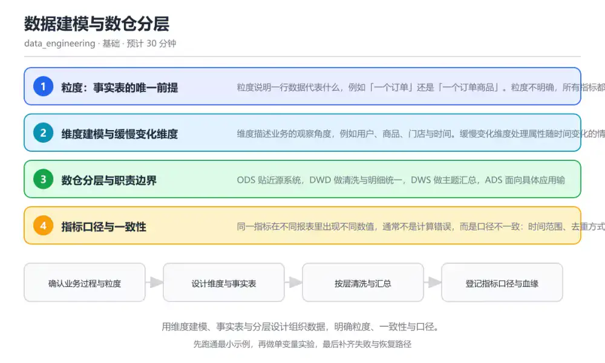
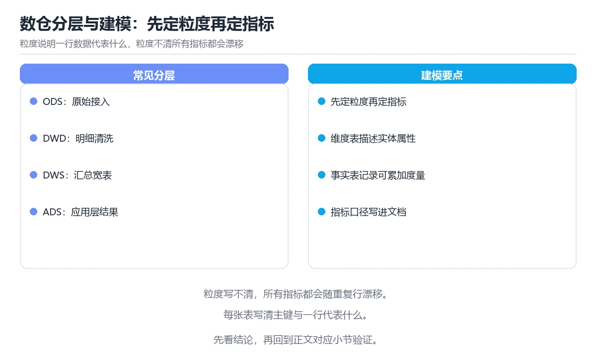

# 数据建模与数仓分层

> 内容更新时间：2026-10-06 · 学习阶段：基础 · 预计用时：30 分钟

分类：data_engineering。关键词：维度建模、事实表、数仓分层、粒度、数据口径。用维度建模、事实表与分层设计组织数据，明确粒度、一致性与口径。

学习建议：先通读《数据建模与数仓分层》的核心知识与关键流程，再运行可运行练习并完成测验；遇到不确定的结论，回到「故障现场」按症状、根因、修复、验证四步核对。



## 学习目标

- 能用粒度、维度与度量描述一张事实表。
- 能说明 ODS、DWD、DWS 与 ADS 各层职责。
- 能为一个指标写清口径、时间范围与数据来源。

## 前置知识

- 会写基础 SQL 查询与聚合语句。
- 知道主键、外键与表连接的含义。
- 了解业务里常见的实体与流程概念。

## 核心知识

### 1. 粒度：事实表的唯一前提

粒度说明一行数据代表什么，例如「一个订单」还是「一个订单商品」。粒度不明确，所有指标都会随重复行数漂移。

事实表以粒度为单位记录度量，维度表提供属性；粒度越细可汇总的空间越大，但存储与查询成本也越高。

在数据建模与数仓分层里可以这样验证：把订单表按订单与按订单商品两种粒度各建一张事实表，比较统计订单数时的差异。

边界：同一张表混放不同粒度会产生重复计数，必须在建模阶段把粒度写进表注释与数据字典。

工程视角：在 DDL 注释里写清粒度与唯一键，配合数据质量校验断言行唯一性。

### 2. 维度建模与缓慢变化维度

维度描述业务的观察角度，例如用户、商品、门店与时间。缓慢变化维度处理属性随时间变化的情况。

类型 1 直接覆盖属性，类型 2 新增一行并记录生效区间，类型 3 增加历史列；选择取决于是否需要按历史属性回溯分析。

在数据建模与数仓分层里可以这样验证：把用户等级从普通升级为高级，分别用类型 1 与类型 2 处理，再查询升级前的订单归属哪一等级。

边界：类型 2 会让维度表增长并增加关联复杂度，但不保留历史就无法解释历史报表。

工程视角：维度表保留代理键与业务键，生效与失效时间要可靠；回溯分析前先确认业务是否接受历史重述。

### 3. 数仓分层与职责边界

ODS 贴近源系统，DWD 做清洗与明细统一，DWS 做主题汇总，ADS 面向具体应用输出结果。

分层让变更影响局部：源系统字段变化只在 ODS 与 DWD 处理，指标口径变化在 DWS 与 ADS 调整。

在数据建模与数仓分层里可以这样验证：追踪一个指标从源表到报表的血缘，标出每一层做了哪些清洗、补全与聚合动作。

边界：层数不是越多越好，小团队可以合并分层，但必须保证原始数据可追溯、指标口径唯一。

工程视角：每层建表规范统一命名与分区策略，关键表注册血缘与负责人，避免出现无主的中间表。

### 4. 指标口径与一致性

同一指标在不同报表里出现不同数值，通常不是计算错误，而是口径不一致：时间范围、去重方式或过滤条件不同。

把指标拆成「度量 + 统计口径 + 过滤条件 + 时间窗口」，集中定义并在各层复用，才能保证跨报表一致。

在数据建模与数仓分层里可以这样验证：对比两个报表的活跃用户数，找出一个按登录事件去重、另一个按设备去重的差异。

边界：口径统一不等于永远不变，业务调整时应记录版本与生效时间，避免历史数据被静默重算。

工程视角：建立指标字典，记录定义、负责人、来源表与变更历史；对外发布前用相同输入交叉验证。

## 关键流程

```text
确认业务过程与粒度 → 设计维度与事实表 → 按层清洗与汇总 → 登记指标口径与血缘
```

1. 确认业务过程与粒度
2. 设计维度与事实表
3. 按层清洗与汇总
4. 登记指标口径与血缘

## 动手练习

1. 为一个你熟悉的业务设计事实表，写清粒度、维度与度量三项要素。
2. 把两个口径不一致的指标写进口径卡片，注明差异来源。
3. 为一张明细表补上粒度注释与唯一键约束，并写一条校验语句。

**验收标准**：记录 维度建模 的输入、实际输出与差异解释，缺一项都不算完成。

## 常见错误与排查

> 说明：本表由《数据建模与数仓分层》的核心知识整理（2026-10-06），人工复核进度见 docs/content_review_batches.md。

| 易错点 | 容易踩的做法 | 正确结论 |
| --- | --- | --- |
| 粒度混放导致重复计数 | 同一张表既存订单行又存订单商品行 | 按粒度拆表，用唯一键约束与质量断言保证一行一个业务实体 |
| 直接覆盖历史属性 | 用户等级直接更新，历史报表按新等级回溯 | 需要历史分析时采用类型 2 慢变维度，记录生效区间 |
| 指标口径散落在脚本里 | 每个报表各写一份过滤条件，数值互相对不上 | 集中维护指标字典并在公共层实现，输出前做交叉校验 |

## 可运行练习

### 任务 1：先跑通，再解释

```sql
-- 订单商品粒度的事实表：一行代表一个订单中的一件商品
CREATE TABLE dwd_order_item (
    order_id      BIGINT      NOT NULL,
    item_id       BIGINT      NOT NULL,
    user_sk       BIGINT      NOT NULL,
    order_ts      TIMESTAMP   NOT NULL,
    quantity      INT         NOT NULL,
    amount        DECIMAL(12, 2) NOT NULL,
    PRIMARY KEY (order_id, item_id)
) COMMENT '粒度：订单商品；唯一键 order_id + item_id';

-- 指标口径：订单商品销售额 = SUM(amount)，按 order_ts 的自然日统计
SELECT date(order_ts) AS stat_date, SUM(amount) AS gmv
FROM dwd_order_item
WHERE order_ts >= TIMESTAMP '2026-10-01 00:00:00'
GROUP BY 1
ORDER BY 1;
```

建表语句在注释里写清粒度与唯一键，主键约束保证不会重复计数；统计语句固定时间字段与聚合口径，输出的指标可以直接被下游复用。

### 任务 2：只改一个条件

复制上面的示例，只改一个输入或参数再跑一次；先写下预测，再和真实输出对照，并说明差异来自数据建模与数仓分层的哪条机制。

### 任务 3：迁移到自己的数据

把《数据建模与数仓分层》里的示例换成你自己的一小段数据或场景，保持结构不变；如果换不动，说明还有哪条前提没有理解，回到核心知识对应小节。

## 故障现场

### 现场 1：粒度混放导致重复计数

**症状**：在《数据建模与数仓分层》的复现场景中，同一张表既存订单行又存订单商品行。

**根因**：当出现“粒度混放导致重复计数”时，执行路径已经绕过了《数据建模与数仓分层》的关键约束，最终以“同一张表既存订单行又存订单商品行”暴露出来；修复前必须先确认约束在哪里失效。

**修复**：针对《数据建模与数仓分层》的问题，按粒度拆表，用唯一键约束与质量断言保证一行一个业务实体。

**验证**：先在《数据建模与数仓分层》中记录“粒度混放导致重复计数”留下的失败证据，再执行“按粒度拆表，用唯一键约束与质量断言保证一行一个业务实体”并重放；确认错误路径变为明确结果，且修复没有掩盖同类故障。

### 现场 2：直接覆盖历史属性

**症状**：在《数据建模与数仓分层》的复现场景中，用户等级直接更新，历史报表按新等级回溯。

**根因**：触发点是把“直接覆盖历史属性”当成安全做法。它没有满足《数据建模与数仓分层》要求的前提，因此先表现为“用户等级直接更新，历史报表按新等级回溯”；排查时先完整复现这一段，再核对输入、配置与依赖。

**修复**：针对《数据建模与数仓分层》的问题，需要历史分析时采用类型 2 慢变维度，记录生效区间。

**验证**：在《数据建模与数仓分层》中按“需要历史分析时采用类型 2 慢变维度，记录生效区间”调整后，从“直接覆盖历史属性”的触发条件重放同一条路径，确认“用户等级直接更新，历史报表按新等级回溯”不再出现，并补一个相邻边界用例检查没有引入新问题。

### 现场 3：指标口径散落在脚本里

**症状**：在《数据建模与数仓分层》的复现场景中，每个报表各写一份过滤条件，数值互相对不上。

**根因**：“每个报表各写一份过滤条件，数值互相对不上”只是表层结果。向上追溯会落到“指标口径散落在脚本里”这一步，因为它省略了《数据建模与数仓分层》的约束，使实现行为和预期模型发生了偏离。

**修复**：针对《数据建模与数仓分层》的问题，集中维护指标字典并在公共层实现，输出前做交叉校验。

**验证**：在《数据建模与数仓分层》中按“集中维护指标字典并在公共层实现，输出前做交叉校验”调整后，从“指标口径散落在脚本里”的触发条件重放同一条路径，确认“每个报表各写一份过滤条件，数值互相对不上”不再出现，并补一个相邻边界用例检查没有引入新问题。

## 本课复习清单

离开本课前，逐项确认：

- [ ] 能用粒度、维度与度量描述事实表。
- [ ] 能说明四层数仓各自的职责。
- [ ] 能写出可复算的指标口径说明。
- [ ] 用 维度建模 构造一个正常输入和一个边界输入，分别记录输出与判断依据。
- [ ] 把本课最容易混淆的两个概念写成一句话对照。

| 复盘项 | 记录 |
| --- | --- |
| 已经能独立解释的考点 |  |
| 仍然说不清的概念 |  |
| 下一步验证动作 |  |

## 复习与自测

### 核心知识

遮住正文回答：数据建模与数仓分层解决什么问题、依赖哪些前提、失败时先看哪个信号？三问都能答清楚，再进入下一节。

### 动手练习

把《数据建模与数仓分层》里「只改一个条件」的练习再做一遍，这次先写预测再运行；预测和结果不一致的地方，就是需要回读的章节。

### 最小可运行示例

```sql
-- 订单商品粒度的事实表：一行代表一个订单中的一件商品
CREATE TABLE dwd_order_item (
    order_id      BIGINT      NOT NULL,
    item_id       BIGINT      NOT NULL,
    user_sk       BIGINT      NOT NULL,
    order_ts      TIMESTAMP   NOT NULL,
    quantity      INT         NOT NULL,
    amount        DECIMAL(12, 2) NOT NULL,
    PRIMARY KEY (order_id, item_id)
) COMMENT '粒度：订单商品；唯一键 order_id + item_id';

-- 指标口径：订单商品销售额 = SUM(amount)，按 order_ts 的自然日统计
SELECT date(order_ts) AS stat_date, SUM(amount) AS gmv
FROM dwd_order_item
WHERE order_ts >= TIMESTAMP '2026-10-01 00:00:00'
GROUP BY 1
ORDER BY 1;
```

### 预期输出

```text
查询按天返回 gmv，每个日期一行；同一订单商品只计一次，重复导入不会让金额翻倍。
```

### 验证步骤

1. 确认输入数据与运行环境和示例一致。
2. 运行示例，记录输出与耗时等可观测指标。
3. 换一个边界输入重跑，确认结论仍然成立。
4. 把两次结果写成一句话结论，注明前提与局限。

## 术语速查

先遮住右列，尝试用自己的话解释，再回到正文核对。

| 术语 | 一句话说明 |
| --- | --- |
| `粒度` | 事实表一行所代表的业务实体层级，是所有指标计算的前提。 |
| `事实表` | 记录业务过程度量的表，通常包含外键与数值指标。 |
| `维度表` | 描述观察角度的属性表，例如用户、商品与时间维度。 |
| `缓慢变化维度` | 处理维度属性随时间变化的建模方法，常见有类型 1 与类型 2。 |
| `血缘` | 数据从来源到产物的流转关系，用于追踪口径与影响范围。 |

## 考点精讲

### 考点 1：统计订单数时出现翻倍，最可能的原因是什么

题型：概念判断。题干：统计订单数时出现翻倍，最可能的原因是什么？

判断要点：事实表混放了订单商品级别数据。订单商品粒度下同一订单会出现多行，直接计数就会把订单数放大；这类问题要从粒度与唯一键入手，索引或字段类型不会造成成倍偏差。 正确选项「事实表混放了订单商品级别数据」对应《数据建模与数仓分层》的要点「粒度：事实表的唯一前提」：粒度说明一行数据代表什么，例如「一个订单」还是「一个订单商品」。粒度不明确，所有指标都会随重复行数漂移。判断「粒度：事实表的唯一前提」时先确认前提是否成立，再回到《数据建模与数仓分层》的示例核对一次；把别的语言或框架的默认做法直接搬到粒度：事实表的唯一前提上，往往会在本课的边界条件里失效。

### 考点 2：需要按历史属性回溯分析时，应采用哪种慢变

题型：概念判断。题干：需要按历史属性回溯分析时，应采用哪种慢变维度处理？

判断要点：类型 2：新增行并记录生效区间。类型 2 保留每次变化的行与生效时间，才能把历史事实关联到当时的属性；直接覆盖会丢失历史，把属性放到事实表会破坏建模规范。 正确选项「类型 2：新增行并记录生效区间」对应《数据建模与数仓分层》的要点「维度建模与缓慢变化维度」：维度描述业务的观察角度，例如用户、商品、门店与时间。缓慢变化维度处理属性随时间变化的情况。判断「维度建模与缓慢变化维度」时先确认前提是否成立，再回到《数据建模与数仓分层》的示例核对一次；借鉴相邻主题的经验之前，先核对维度建模与缓慢变化维度的前提是否成立。

### 考点 3：以下哪些内容属于指标口径的必要说明？（多

题型：多选辨析。题干：以下哪些内容属于指标口径的必要说明？（多选）

判断要点：统计的时间字段与窗口；去重方式与主键选择；过滤条件与排除规则。口径要能让人独立复算出同一结果，因此时间窗口、去重主键与过滤条件必须写清；配色属于展示问题，与研究结论无关。 正确选项「统计的时间字段与窗口；去重方式与主键选择；过滤条件与排除规则」对应《数据建模与数仓分层》的要点「数仓分层与职责边界」：ODS 贴近源系统，DWD 做清洗与明细统一，DWS 做主题汇总，ADS 面向具体应用输出结果。判断「数仓分层与职责边界」时先确认前提是否成立，再回到《数据建模与数仓分层》的示例核对一次；记住数仓分层与职责边界的结论之外还要记住适用条件，换一个输入往往就不成立了。

### 考点 4：请按数据从源系统到报表的顺序排列分层。

题型：顺序排列。题干：请按数据从源系统到报表的顺序排列分层。

判断要点：ADS 面向应用的结果层。数据依次经过贴源、明细清洗、主题汇总与应用结果四层；顺序整体前移或后移都会让下游读到未清洗或未汇总的数据。 正确选项「ODS 贴源层；DWD 明细清洗层；DWS 主题汇总层；ADS 面向应用的结果层」对应《数据建模与数仓分层》的要点「指标口径与一致性」：同一指标在不同报表里出现不同数值，通常不是计算错误，而是口径不一致：时间范围、去重方式或过滤条件不同。判断「指标口径与一致性」时先确认前提是否成立，再回到《数据建模与数仓分层》的示例核对一次；干扰项常常是相邻主题里成立的结论，只有按指标口径与一致性的输入与约束判断才能排除。

### 考点 5：阅读建表与查询片段，哪项判断正确？

题型：排错。题干：阅读建表与查询片段，哪项判断正确？

判断要点：表的主键保证订单商品不会重复计数。主键由订单与商品共同组成，保证一行代表一个订单商品，因此按行汇总不会重复；粒度注释是口径的一部分，直接决定下游能否正确聚合。 正确选项「表的主键保证订单商品不会重复计数」对应《数据建模与数仓分层》的要点「粒度：事实表的唯一前提」：粒度说明一行数据代表什么，例如「一个订单」还是「一个订单商品」。粒度不明确，所有指标都会随重复行数漂移。判断「粒度：事实表的唯一前提」时先确认前提是否成立，再回到《数据建模与数仓分层》的示例核对一次；把粒度：事实表的唯一前提的做法换到别的约束下未必成立，先确认边界再决定答案。

## English Overview

Data Modeling and Warehouse Layering

Warehouse modeling starts with granularity: what one row means. This lesson covers dimensional modeling, slowly changing dimensions, the ODS to ADS layering, and how to write a metric definition that two teams can compute identically.



## 本课小结

- 数据建模与数仓分层围绕维度建模、事实表、数仓分层展开，先建立基线再讨论优化。
- 粒度说明一行数据代表什么，例如「一个订单」还是「一个订单商品」。粒度不明确，所有指标都会随重复行数漂移。
- 排查 事实表 时保留原始错误信息，不要先改代码。

## 内容元数据

- 内容版本：v2.0
- 最后更新：2026-10-06
- 学习阶段：基础

| 字段 | 值 |
| --- | --- |
| 课程 ID | `de_data_modeling` |
| 所属分类 | `data_engineering` |
| 难度 | 基础 |
| 预计用时 | 30 分钟 |
| 关键词 | 维度建模、事实表、数仓分层、粒度、数据口径 |
| 配图 | `images/lesson_de_data_modeling.webp` |
| 参考资料 | 2 条 |
| 内容更新时间 | 2026-10-06 |

## 参考资料与复核

- 最后复核：2026-10-04
- 下次复核：2027-01-17
- 复核范围：版本兼容、API 行为与工程实践

下面列出的资料用于核对本课结论，复习时可以对照阅读：
- [Kimball 维度建模技术说明](https://www.kimballgroup.com/data-warehouse-business-intelligence-resources/kimball-techniques/)
- [dbt 数据建模最佳实践](https://docs.getdbt.com/best-practices)

> 复核提示：《数据建模与数仓分层》的结论如与资料冲突，以资料中的规范文本为准，并在笔记里记录差异与日期。

## 复习与迁移

### 概念复述

不看正文，把数据建模与数仓分层讲给一个没学过的同事：先讲它解决什么问题，再讲一个最小例子，最后说明一个不适用场景。

### 测验回顾

回到《数据建模与数仓分层》测验，只重做答错或犹豫的题；对每道题写一句「我为什么改选这个答案」，写不出理由就回到对应小节。

### 迁移练习

把《数据建模与数仓分层》的方法用到一个你自己的真实场景：说明输入、约束与验证方式，并列出仍然不确定、需要下一次实验回答的问题。

## 深度拓展与实战

这一节把数据建模与数仓分层的机制拆开验证：每一步都给出输入、判断标准和失败信号，便于在真实项目里复用。

### 机制拆解 1：粒度：事实表的唯一前提

事实表以粒度为单位记录度量，维度表提供属性；粒度越细可汇总的空间越大，但存储与查询成本也越高。

落地时先确认前提：同一张表混放不同粒度会产生重复计数，必须在建模阶段把粒度写进表注释与数据字典。；再把结论写进检查表，让下一位同学可以按同样的输入复现。

工程做法：在 DDL 注释里写清粒度与唯一键，配合数据质量校验断言行唯一性。

### 机制拆解 2：维度建模与缓慢变化维度

类型 1 直接覆盖属性，类型 2 新增一行并记录生效区间，类型 3 增加历史列；选择取决于是否需要按历史属性回溯分析。

落地时先确认前提：类型 2 会让维度表增长并增加关联复杂度，但不保留历史就无法解释历史报表。；再把结论写进检查表，让下一位同学可以按同样的输入复现。

工程做法：维度表保留代理键与业务键，生效与失效时间要可靠；回溯分析前先确认业务是否接受历史重述。

### 机制拆解 3：数仓分层与职责边界

分层让变更影响局部：源系统字段变化只在 ODS 与 DWD 处理，指标口径变化在 DWS 与 ADS 调整。

落地时先确认前提：层数不是越多越好，小团队可以合并分层，但必须保证原始数据可追溯、指标口径唯一。；再把结论写进检查表，让下一位同学可以按同样的输入复现。

工程做法：每层建表规范统一命名与分区策略，关键表注册血缘与负责人，避免出现无主的中间表。

### 机制拆解 4：指标口径与一致性

把指标拆成「度量 + 统计口径 + 过滤条件 + 时间窗口」，集中定义并在各层复用，才能保证跨报表一致。

落地时先确认前提：口径统一不等于永远不变，业务调整时应记录版本与生效时间，避免历史数据被静默重算。；再把结论写进检查表，让下一位同学可以按同样的输入复现。

工程做法：建立指标字典，记录定义、负责人、来源表与变更历史；对外发布前用相同输入交叉验证。

### 机制对照表

| 概念 | 解决什么问题 | 关键前提 | 失败信号 |
| --- | --- | --- | --- |
| 粒度：事实表的唯一前提 | 粒度说明一行数据代表什么，例如「一个订单」还是「一个订单商品」。粒度不明确，所有 | 同一张表混放不同粒度会产生重复计数，必须在建模阶段把粒度写进表注释与数据 | 在 DDL 注释里写清粒度与唯一键，配合数据质量校验断言行唯一性。 |
| 维度建模与缓慢变化维度 | 维度描述业务的观察角度，例如用户、商品、门店与时间。缓慢变化维度处理属性随时间变 | 类型 2 会让维度表增长并增加关联复杂度，但不保留历史就无法解释历史报表 | 维度表保留代理键与业务键，生效与失效时间要可靠；回溯分析前先确认业务是否 |
| 数仓分层与职责边界 | ODS 贴近源系统，DWD 做清洗与明细统一，DWS 做主题汇总，ADS 面向具 | 层数不是越多越好，小团队可以合并分层，但必须保证原始数据可追溯、指标口径 | 每层建表规范统一命名与分区策略，关键表注册血缘与负责人，避免出现无主的中 |
| 指标口径与一致性 | 同一指标在不同报表里出现不同数值，通常不是计算错误，而是口径不一致：时间范围、去 | 口径统一不等于永远不变，业务调整时应记录版本与生效时间，避免历史数据被静 | 建立指标字典，记录定义、负责人、来源表与变更历史；对外发布前用相同输入交 |

### 自测问答

**问 1**：统计订单数时出现翻倍，最可能的原因是什么？

**答**：事实表混放了订单商品级别数据。订单商品粒度下同一订单会出现多行，直接计数就会把订单数放大；这类问题要从粒度与唯一键入手，索引或字段类型不会造成成倍偏差。 正确选项「事实表混放了订单商品级别数据」对应《数据建模与数仓分层》的要点「粒度：事实表的唯一前提」：粒度说明一行数据代表什么，例如「一个订单」还是「一个订单商品」。粒度不明确，所有指标都会随重复行数漂移。判断「粒度：事实表的唯一前提」时先确认前提是否成立，再回到《数据建模与数仓分层》的示例核对一次；把别的语言或框架的默认做法直接搬到粒度：事实表的唯一前提上，往往会在本课的边界条件里失效。

**问 2**：需要按历史属性回溯分析时，应采用哪种慢变维度处理？

**答**：类型 2：新增行并记录生效区间。类型 2 保留每次变化的行与生效时间，才能把历史事实关联到当时的属性；直接覆盖会丢失历史，把属性放到事实表会破坏建模规范。 正确选项「类型 2：新增行并记录生效区间」对应《数据建模与数仓分层》的要点「维度建模与缓慢变化维度」：维度描述业务的观察角度，例如用户、商品、门店与时间。缓慢变化维度处理属性随时间变化的情况。判断「维度建模与缓慢变化维度」时先确认前提是否成立，再回到《数据建模与数仓分层》的示例核对一次；借鉴相邻主题的经验之前，先核对维度建模与缓慢变化维度的前提是否成立。

**问 3**：以下哪些内容属于指标口径的必要说明？（多选）

**答**：统计的时间字段与窗口；去重方式与主键选择；过滤条件与排除规则。口径要能让人独立复算出同一结果，因此时间窗口、去重主键与过滤条件必须写清；配色属于展示问题，与研究结论无关。 正确选项「统计的时间字段与窗口；去重方式与主键选择；过滤条件与排除规则」对应《数据建模与数仓分层》的要点「数仓分层与职责边界」：ODS 贴近源系统，DWD 做清洗与明细统一，DWS 做主题汇总，ADS 面向具体应用输出结果。判断「数仓分层与职责边界」时先确认前提是否成立，再回到《数据建模与数仓分层》的示例核对一次；记住数仓分层与职责边界的结论之外还要记住适用条件，换一个输入往往就不成立了。

**问 4**：请按数据从源系统到报表的顺序排列分层。

**答**：ADS 面向应用的结果层。数据依次经过贴源、明细清洗、主题汇总与应用结果四层；顺序整体前移或后移都会让下游读到未清洗或未汇总的数据。 正确选项「ODS 贴源层；DWD 明细清洗层；DWS 主题汇总层；ADS 面向应用的结果层」对应《数据建模与数仓分层》的要点「指标口径与一致性」：同一指标在不同报表里出现不同数值，通常不是计算错误，而是口径不一致：时间范围、去重方式或过滤条件不同。判断「指标口径与一致性」时先确认前提是否成立，再回到《数据建模与数仓分层》的示例核对一次；干扰项常常是相邻主题里成立的结论，只有按指标口径与一致性的输入与约束判断才能排除。

**问 5**：阅读建表与查询片段，哪项判断正确？

**答**：表的主键保证订单商品不会重复计数。主键由订单与商品共同组成，保证一行代表一个订单商品，因此按行汇总不会重复；粒度注释是口径的一部分，直接决定下游能否正确聚合。 正确选项「表的主键保证订单商品不会重复计数」对应《数据建模与数仓分层》的要点「粒度：事实表的唯一前提」：粒度说明一行数据代表什么，例如「一个订单」还是「一个订单商品」。粒度不明确，所有指标都会随重复行数漂移。判断「粒度：事实表的唯一前提」时先确认前提是否成立，再回到《数据建模与数仓分层》的示例核对一次；把粒度：事实表的唯一前提的做法换到别的约束下未必成立，先确认边界再决定答案。

### 排错速查

- 看到「同一张表既存订单行又存订单商品行」时，先按「按粒度拆表，用唯一键约束与质量断言保证一行一个业务实体」处理，再用数据建模与数仓分层的最小示例确认结论是否恢复。
- 看到「用户等级直接更新，历史报表按新等级回溯」时，先按「需要历史分析时采用类型 2 慢变维度，记录生效区间」处理，再用数据建模与数仓分层的最小示例确认结论是否恢复。
- 看到「每个报表各写一份过滤条件，数值互相对不上」时，先按「集中维护指标字典并在公共层实现，输出前做交叉校验」处理，再用数据建模与数仓分层的最小示例确认结论是否恢复。

### 工程检查表

- [ ] 确认业务过程与粒度
- [ ] 设计维度与事实表
- [ ] 按层清洗与汇总
- [ ] 登记指标口径与血缘
- [ ] 【粒度：事实表的唯一前提】在 DDL 注释里写清粒度与唯一键，配合数据质量校验断言行唯一性。
- [ ] 【维度建模与缓慢变化维度】维度表保留代理键与业务键，生效与失效时间要可靠；回溯分析前先确认业务是否接受历史重述。
- [ ] 【数仓分层与职责边界】每层建表规范统一命名与分区策略，关键表注册血缘与负责人，避免出现无主的中间表。
- [ ] 【指标口径与一致性】建立指标字典，记录定义、负责人、来源表与变更历史；对外发布前用相同输入交叉验证。

### 迁移练习

把数据建模与数仓分层的方法用到一个真实场景：写下维度建模、事实表、数仓分层在你的场景里分别对应什么，再记录一次失败尝试和它的恢复步骤。

### 延伸阅读与下一步

- 复习维度建模、事实表、数仓分层、粒度、数据口径时，优先回看「粒度：事实表的唯一前提」与「指标口径与一致性」两节。
- 把从「确认业务过程与粒度」到「登记指标口径与血缘」的流程画成一张图，放进自己的笔记。
- 一周后重做本课测验，只把答错的题留到下一轮复习。

### 结论与下一步

学完数据建模与数仓分层，应该能独立完成三件事：先用最小示例确认维度建模的行为，再用一个边界输入验证结论，最后把失败路径写成可重复的检查。下一步把本课术语加入复习清单，并在两周内用一次真实任务检验记忆是否牢固。
