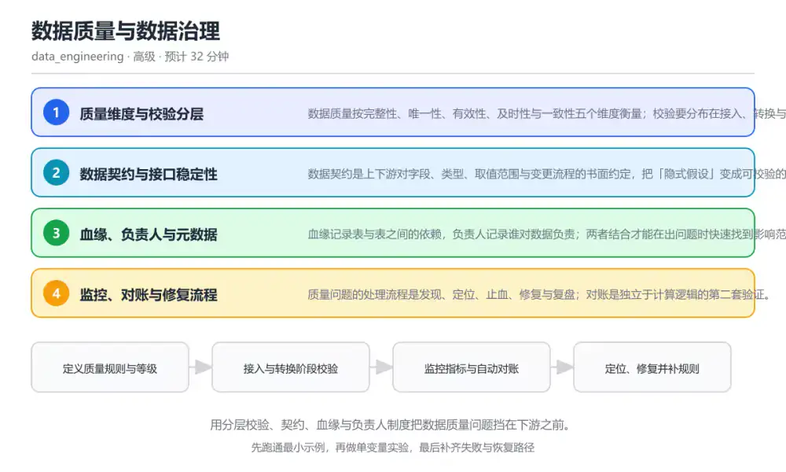
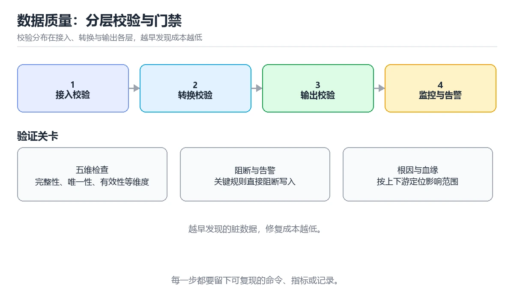

# 数据质量与数据治理

> 内容更新时间：2026-10-06 · 学习阶段：高级 · 预计用时：40 分钟

分类：data_engineering。关键词：数据质量、数据契约、血缘、负责人、对账。用分层校验、契约、血缘与负责人制度把数据质量问题挡在下游之前。

学习建议：先通读《数据质量与数据治理》的核心知识与关键流程，再运行可运行练习并完成测验；遇到不确定的结论，回到「故障现场」按症状、根因、修复、验证四步核对。



## 本节知识框架

**课程定位**：所属分类为「数据工程」，课程主题为「数据质量与数据治理」，学习阶段为「高级」，建议用时 40 分钟。

**本课要解决的主问题**：用分层校验、契约、血缘与负责人制度把数据质量问题挡在下游之前。

| 学习层次 | 要回答的问题 | 完成判据 |
| --- | --- | --- |
| 概念层 | 「数据质量与数据治理」有哪些必须区分的对象与术语？ | 能用自己的话定义核心术语，并各举一个正例和一个反例。 |
| 机制层 | 这些对象按什么顺序发生作用，输入如何变成输出？ | 能画出或写出机制步骤，并说明每一步的失败条件。 |
| 应用层 | 什么场景适合使用「数据质量与数据治理」，什么场景不适合？ | 能给出一个真实场景、一个最小示例和一个边界案例。 |
| 性能层 | 时间、空间、吞吐或延迟受哪些量影响？ | 能说出复杂度或性能瓶颈的证据来源；没有证据时明确写“材料未提供”。 |
| 复习层 | 怎样确认自己不是只记住了结论？ | 能独立完成本课自测，并把错误定位到概念、机制、示例或边界。 |

### 阅读路线

1. 先读「核心概念定义」，建立「数据质量」等对象的精确定义。
2. 再读「原理与运行机制」，把定义串成可重复的过程。
3. 用「代码/协议/SQL 示例」验证过程，并只改一个条件观察结果变化。
4. 最后检查性能、易错点、知识关系与自测题，形成可复习的证据链。

**前置知识**：《流处理与 Kafka 实践》

**学习位置**：本课位于《湖仓治理与表维护》之后；如果前一课的自测不能通过，应先回补再继续。

**后续衔接**：本课之后可进入项目实战或综合复习，把本课结论用于一个完整任务。

**教材衔接：学习目标**

- 能按完整性、唯一性、及时性与一致性设计校验规则。
- 能说明数据契约对上下游协作的价值。
- 能设计一次数据问题的定位与修复流程。

**教材衔接：前置知识**

- 了解数仓分层与指标口径的基本概念。
- 会写 SQL 校验查询。
- 知道调度系统如何编排任务依赖。

**教材衔接：本课小结**

- 数据质量与数据治理围绕数据质量、数据契约、血缘展开，先建立基线再讨论优化。
- 数据质量按完整性、唯一性、有效性、及时性与一致性五个维度衡量；校验要分布在接入、转换与输出各层，越早发现成本越低。
- 处理 数据质量 的问题时按「症状 → 根因 → 修复 → 验证」的顺序推进，不跳过验证。

## 核心概念定义

> 阅读约定：本课先给「数据质量与数据治理」相关术语的操作性定义与适用边界；正文里的口语化说法与定义冲突时，以定义和可复现示例为准。

| 术语 | 操作性定义 | 本课中的边界 |
| --- | --- | --- |
| 数据质量维度 | 衡量数据优劣的维度集合，如完整性、唯一性、有效性与一致性。 | 仅在「数据质量与数据治理」明确给出的输入、版本与资源条件下成立。 |
| 数据契约 | 上下游对数据结构、取值范围与变更流程的书面约定。 | 仅在「数据质量与数据治理」明确给出的输入、版本与资源条件下成立。 |
| 血缘 | 表与任务之间的输入输出依赖关系，用于评估影响范围。 | 仅在「数据质量与数据治理」明确给出的输入、版本与资源条件下成立。 |
| 对账 | 用独立来源或独立实现交叉验证数据结果的过程。 | 仅在「数据质量与数据治理」明确给出的输入、版本与资源条件下成立。 |
| 无主表 | 没有明确负责人与质量等级登记的数据资产。 | 仅在「数据质量与数据治理」明确给出的输入、版本与资源条件下成立。 |

### 定义如何使用

在「数据质量与数据治理」中判断一个说法是否成立，先确认它使用的是哪个对象的定义，再检查输入规模、运行环境与失败路径。定义不是口号，而是后续推导、代码示例和自测题共享的约束。

## 原理与运行机制

### 机制总览

1. **建立输入**：把「数据质量维度」按本课定义整理成可观察、可重复的输入条件。
2. **执行转换**：围绕「数据契约」执行本课的核心步骤；每一步都记录中间状态，避免只看最终输出。
3. **产生输出**：得到「血缘」后，用正文示例或协议/SQL 结果核对输出是否符合预期。
4. **改变一个条件**：只替换一个边界条件或环境参数，观察「数据质量与数据治理」的结论是否仍然成立。

| 阶段 | 关注对象 | 失败时应检查 |
| --- | --- | --- |
| 输入 | 数据质量维度 | 类型、范围、编码、版本或前置状态是否满足定义。 |
| 处理 | 数据契约 | 顺序、可见性、锁、路由、事务或调度规则是否被破坏。 |
| 输出 | 血缘 | 结果是否可复现，错误是否被正确传播而不是被吞掉。 |

本课的机制结论要用「数据质量与数据治理」自己的示例验证。「数据质量与数据治理」没有给出某个数量级、吞吐或内存数据时，本课把该判断标为“材料未提供”，不从相邻主题外推。

**教材衔接：核心知识**

### 1. 质量维度与校验分层

数据质量按完整性、唯一性、有效性、及时性与一致性五个维度衡量；校验要分布在接入、转换与输出各层，越早发现成本越低。

接入层校验格式与枚举，转换层校验主键与引用完整，输出层校验指标波动与对账；每层失败都阻断下游并告警。

在数据质量与数据治理里可以这样验证：为一张订单表写五条校验：非空、主键唯一、金额非负、状态枚举合法、日行数波动不超过阈值。

边界：校验过多会拖慢任务并产生噪声告警，过少会让脏数据流入报表，规则要按影响面分级。

工程视角：规则与任务同仓管理，按严重级别区分阻断与告警；对关键表保留失败样本便于回溯。

### 2. 数据契约与接口稳定性

数据契约是上下游对字段、类型、取值范围与变更流程的书面约定，把「隐式假设」变成可校验的接口。

生产方发布结构变更前先提交兼容版本，消费方按契约校验；破坏性变更需要版本号与过渡期。

在数据质量与数据治理里可以这样验证：把一个字段从可选改成必填，用契约校验提前发现下游任务失败，而不是等到报表出错。

边界：契约定得越严格，变更成本越高；要在稳定性与迭代速度之间找到可持续的级别。

工程视角：契约纳入版本控制与 CI 校验，变更走评审；关键字段保留默认值与兼容期。

### 3. 血缘、负责人与元数据

血缘记录表与表之间的依赖，负责人记录谁对数据负责；两者结合才能在出问题时快速找到影响范围与处理人。

任务运行时自动采集输入输出关系生成血缘，元数据登记负责人、更新频率与质量等级。

在数据质量与数据治理里可以这样验证：从一张异常的源表出发，用血缘列出受影响的指标与报表，估算需要回溯的时间范围。

边界：血缘不完整会误导排查，手工维护的文档很快过期，必须与调度和查询日志联动。

工程视角：关键表强制登记负责人与质量等级，血缘随任务发布自动更新，定期检查无主表。

### 4. 监控、对账与修复流程

质量问题的处理流程是发现、定位、止血、修复与复盘；对账是独立于计算逻辑的第二套验证。

监控关注行数、金额、分布等指标的异常波动，对账用独立来源或独立实现交叉验证结果。

在数据质量与数据治理里可以这样验证：日终对账发现金额差额，先冻结下游报表，再用明细抽样定位到重复导入的数据。

边界：对账依赖第二数据源，成本较高，通常只覆盖关键指标；把所有指标都对账会拖慢交付。

工程视角：关键指标配置自动对账与差额告警，修复脚本可重放；复盘记录根因与防止复发的规则。

**教材衔接：关键流程**

```text
定义质量规则与等级 → 接入与转换阶段校验 → 监控指标与自动对账 → 定位、修复并补规则
```

1. 定义质量规则与等级
2. 接入与转换阶段校验
3. 监控指标与自动对账
4. 定位、修复并补规则

## 典型应用场景

| 场景 | 典型输入或前提 | 期望产物 |
| --- | --- | --- |
| 学习验证 | 使用本课最小示例和 数据质量、数据契约 | 能复现正文结论，并解释每一步。 |
| 工程落地 | 把「数据质量与数据治理」放入真实模块或服务边界 | 输出可观测、失败可定位、参数可配置。 |
| 故障排查 | 只改一个版本、规模、输入或依赖条件 | 能区分概念错误、实现错误和环境差异。 |

判断「数据质量与数据治理」的场景是否成立，标准是能否写出输入、处理、输出和失败路径；材料中没有出现的数据在本课标注为“材料未提供”，不用推测替代证据。

**教材衔接：深度拓展与实战**

这一节把数据质量与数据治理的机制拆开验证：每一步都给出输入、判断标准和失败信号，便于在真实项目里复用。

### 机制拆解 1：质量维度与校验分层

接入层校验格式与枚举，转换层校验主键与引用完整，输出层校验指标波动与对账；每层失败都阻断下游并告警。

落地时先确认前提：校验过多会拖慢任务并产生噪声告警，过少会让脏数据流入报表，规则要按影响面分级。；再把结论写进检查表，让下一位同学可以按同样的输入复现。

工程做法：规则与任务同仓管理，按严重级别区分阻断与告警；对关键表保留失败样本便于回溯。

### 机制拆解 2：数据契约与接口稳定性

生产方发布结构变更前先提交兼容版本，消费方按契约校验；破坏性变更需要版本号与过渡期。

落地时先确认前提：契约定得越严格，变更成本越高；要在稳定性与迭代速度之间找到可持续的级别。；再把结论写进检查表，让下一位同学可以按同样的输入复现。

工程做法：契约纳入版本控制与 CI 校验，变更走评审；关键字段保留默认值与兼容期。

### 机制拆解 3：血缘、负责人与元数据

任务运行时自动采集输入输出关系生成血缘，元数据登记负责人、更新频率与质量等级。

落地时先确认前提：血缘不完整会误导排查，手工维护的文档很快过期，必须与调度和查询日志联动。；再把结论写进检查表，让下一位同学可以按同样的输入复现。

工程做法：关键表强制登记负责人与质量等级，血缘随任务发布自动更新，定期检查无主表。

### 机制拆解 4：监控、对账与修复流程

监控关注行数、金额、分布等指标的异常波动，对账用独立来源或独立实现交叉验证结果。

落地时先确认前提：对账依赖第二数据源，成本较高，通常只覆盖关键指标；把所有指标都对账会拖慢交付。；再把结论写进检查表，让下一位同学可以按同样的输入复现。

工程做法：关键指标配置自动对账与差额告警，修复脚本可重放；复盘记录根因与防止复发的规则。

### 机制对照表

| 概念 | 解决什么问题 | 关键前提 | 失败信号 |
| --- | --- | --- | --- |
| 质量维度与校验分层 | 数据质量按完整性、唯一性、有效性、及时性与一致性五个维度衡量；校验要分布在接入、 | 校验过多会拖慢任务并产生噪声告警，过少会让脏数据流入报表，规则要按影响面 | 规则与任务同仓管理，按严重级别区分阻断与告警；对关键表保留失败样本便于回 |
| 数据契约与接口稳定性 | 数据契约是上下游对字段、类型、取值范围与变更流程的书面约定，把「隐式假设」变成可 | 契约定得越严格，变更成本越高；要在稳定性与迭代速度之间找到可持续的级别。 | 契约纳入版本控制与 CI 校验，变更走评审；关键字段保留默认值与兼容期。 |
| 血缘、负责人与元数据 | 血缘记录表与表之间的依赖，负责人记录谁对数据负责；两者结合才能在出问题时快速找到 | 血缘不完整会误导排查，手工维护的文档很快过期，必须与调度和查询日志联动。 | 关键表强制登记负责人与质量等级，血缘随任务发布自动更新，定期检查无主表。 |
| 监控、对账与修复流程 | 质量问题的处理流程是发现、定位、止血、修复与复盘；对账是独立于计算逻辑的第二套验 | 对账依赖第二数据源，成本较高，通常只覆盖关键指标；把所有指标都对账会拖慢 | 关键指标配置自动对账与差额告警，修复脚本可重放；复盘记录根因与防止复发的 |

### 自测问答

**问 1**：发现源数据格式错误时，最理想的校验位置在哪里？

**答**：接入阶段，进入数仓之前。越靠前发现，修复成本越低，影响面也越小；等到报表或审计阶段才发现，需要回溯的范围与沟通成本都会成倍增加。 正确选项「接入阶段，进入数仓之前」对应《数据质量与数据治理》的要点「质量维度与校验分层」：数据质量按完整性、唯一性、有效性、及时性与一致性五个维度衡量；校验要分布在接入、转换与输出各层，越早发现成本越低。判断「质量维度与校验分层」时先确认前提是否成立，再回到《数据质量与数据治理》的示例核对一次；把别的语言或框架的默认做法直接搬到质量维度与校验分层上，往往会在本课的边界条件里失效。

**问 2**：血缘信息最主要的用途是什么？

**答**：评估异常数据影响的下游范围。血缘回答的是「这张表影响谁」，用于划定排查与回溯范围；它不会自动修复逻辑错误，也不负责备份或提速。 正确选项「评估异常数据影响的下游范围」对应《数据质量与数据治理》的要点「数据契约与接口稳定性」：数据契约是上下游对字段、类型、取值范围与变更流程的书面约定，把「隐式假设」变成可校验的接口。判断「数据契约与接口稳定性」时先确认前提是否成立，再回到《数据质量与数据治理》的示例核对一次；借鉴相邻主题的经验之前，先核对数据契约与接口稳定性的前提是否成立。

**问 3**：以下哪些属于数据质量校验的常见维度？（多选）

**答**：唯一性；有效性；及时性。唯一性、有效性与及时性都是数据质量的衡量维度；服务器品牌属于基础设施信息，与数据本身的正确性无关。 正确选项「唯一性；有效性；及时性」对应《数据质量与数据治理》的要点「血缘、负责人与元数据」：血缘记录表与表之间的依赖，负责人记录谁对数据负责；两者结合才能在出问题时快速找到影响范围与处理人。判断「血缘、负责人与元数据」时先确认前提是否成立，再回到《数据质量与数据治理》的示例核对一次；记住血缘、负责人与元数据的结论之外还要记住适用条件，换一个输入往往就不成立了。

**问 4**：请按数据质量问题处理的顺序排列步骤。

**答**：复盘并补充质量规则。先冻结下游避免脏数据继续扩散，再定位范围，修复重跑后补充规则防止复发；跳过冻结会让错误结果继续进入报表。 正确选项「发现异常并冻结下游；按血缘定位影响范围；修复数据并重跑任务；复盘并补充质量规则」对应《数据质量与数据治理》的要点「监控、对账与修复流程」：质量问题的处理流程是发现、定位、止血、修复与复盘；对账是独立于计算逻辑的第二套验证。判断「监控、对账与修复流程」时先确认前提是否成立，再回到《数据质量与数据治理》的示例核对一次；干扰项常常是相邻主题里成立的结论，只有按监控、对账与修复流程的输入与约束判断才能排除。

**问 5**：阅读质量校验语句，哪项判断正确？

**答**：重复主键校验返回非零时应阻断下游任务。子查询按业务主键分组并筛出重复组，返回非零说明存在重复数据，应阻断下游并保留现场；这类校验必须在数据对外发布前执行。 正确选项「重复主键校验返回非零时应阻断下游任务」对应《数据质量与数据治理》的要点「质量维度与校验分层」：数据质量按完整性、唯一性、有效性、及时性与一致性五个维度衡量；校验要分布在接入、转换与输出各层，越早发现成本越低。判断「质量维度与校验分层」时先确认前提是否成立，再回到《数据质量与数据治理》的示例核对一次；把质量维度与校验分层的做法换到别的约束下未必成立，先确认边界再决定答案。

### 排错速查

- 看到「等报表任务跑完才发现源数据格式错误」时，先按「在接入与转换阶段就校验格式与主键，输出层只做波动与对账校验」处理，再用数据质量与数据治理的最小示例确认结论是否恢复。
- 看到「源表异常后凭记忆列出下游，遗漏关键报表」时，先按「用调度与查询日志自动生成血缘，异常时按血缘评估影响范围」处理，再用数据质量与数据治理的最小示例确认结论是否恢复。
- 看到「手工改数后不记录原因与范围，下次同样问题重复发生」时，先按「修复脚本版本化并记录影响行数、原因与补充的质量规则」处理，再用数据质量与数据治理的最小示例确认结论是否恢复。

### 工程检查表

- [ ] 定义质量规则与等级
- [ ] 接入与转换阶段校验
- [ ] 监控指标与自动对账
- [ ] 定位、修复并补规则
- [ ] 【质量维度与校验分层】规则与任务同仓管理，按严重级别区分阻断与告警；对关键表保留失败样本便于回溯。
- [ ] 【数据契约与接口稳定性】契约纳入版本控制与 CI 校验，变更走评审；关键字段保留默认值与兼容期。
- [ ] 【血缘、负责人与元数据】关键表强制登记负责人与质量等级，血缘随任务发布自动更新，定期检查无主表。
- [ ] 【监控、对账与修复流程】关键指标配置自动对账与差额告警，修复脚本可重放；复盘记录根因与防止复发的规则。

### 迁移练习

把数据质量与数据治理的方法用到一个真实场景：写下数据质量、数据契约、血缘在你的场景里分别对应什么，再记录一次失败尝试和它的恢复步骤。

### 延伸阅读与下一步

- 复习数据质量、数据契约、血缘、负责人、对账时，优先回看「质量维度与校验分层」与「监控、对账与修复流程」两节。
- 把从「定义质量规则与等级」到「定位、修复并补规则」的流程画成一张图，放进自己的笔记。
- 一周后重做本课测验，只把答错的题留到下一轮复习。

### 结论与下一步

学完数据质量与数据治理，应该能独立完成三件事：先用最小示例确认数据质量的行为，再用一个边界输入验证结论，最后把失败路径写成可重复的检查。下一步把本课术语加入复习清单，并在两周内用一次真实任务检验记忆是否牢固。

## 代码/协议/SQL 示例

### 最小可验证示例

下面保留《数据质量与数据治理》原文中的最小示例。先预测《数据质量与数据治理》示例的输出，再按正文步骤运行或推演；示例依赖外部环境时，同时记录版本与输入。

```text
定义质量规则与等级 → 接入与转换阶段校验 → 监控指标与自动对账 → 定位、修复并补规则
```

**教材衔接：原文最小示例**

```text
定义质量规则与等级 → 接入与转换阶段校验 → 监控指标与自动对账 → 定位、修复并补规则
```

## 时间/空间复杂度或性能分析

**复杂度证据**：「数据质量与数据治理」的现有材料没有给出渐近时间或空间复杂度的明确结论，本课只做定性检查，不补写未经验证的 $O$ 记号。

| 维度 | 本课关注点 | 判断依据 |
| --- | --- | --- |
| 时间/延迟 | 「数据质量与数据治理」的主要步骤是否会随输入规模、并发度或网络往返增长。 | 以正文复杂度、基准数据或可重复测量为准。 |
| 空间/内存 | 中间状态、缓存、副本、连接或索引是否随规模增长。 | 记录峰值内存与数据副本，不只看最终结果。 |
| 吞吐/资源 | 版本、调度、锁、IO、序列化或协议开销是否成为瓶颈。 | 固定环境做对照实验，改变一个变量。 |

评估「数据质量与数据治理」时要区分“正确性成立”和“性能达标”两件事；材料没有给出基准时，本课只保留量级来源与测量方法，不写不可验证的绝对数字。

## 常见误区与易错点

> 复核《数据质量与数据治理》的易错点时，优先保留原文的错误表、故障现场与排错路径；每条修正都要能用本课示例复验。

| 易错点 | 常见表现 | 正确做法 |
| --- | --- | --- |
| 只背结论 | 能复述「数据质量与数据治理」的定义，却说不清输入、输出与边界。 | 回到机制步骤，用最小示例逐一验证。 |
| 混淆相邻概念 | 把本课对象与相邻主题的对象当成同一类。 | 先比较定义、资源归属、生命周期和失败模式。 |
| 忽略版本与环境 | 在开发机通过后直接外推到生产环境。 | 固定版本、输入和资源条件，再记录可复现结果。 |

**教材衔接：常见错误与排查**

> 说明：本表由《数据质量与数据治理》的核心知识整理（2026-10-06），人工复核进度见 docs/content_review_batches.md。

| 易错点 | 容易踩的做法 | 正确结论 |
| --- | --- | --- |
| 只在输出层做校验 | 等报表任务跑完才发现源数据格式错误 | 在接入与转换阶段就校验格式与主键，输出层只做波动与对账校验 |
| 血缘缺失导致误判影响面 | 源表异常后凭记忆列出下游，遗漏关键报表 | 用调度与查询日志自动生成血缘，异常时按血缘评估影响范围 |
| 修复不留记录 | 手工改数后不记录原因与范围，下次同样问题重复发生 | 修复脚本版本化并记录影响行数、原因与补充的质量规则 |

**教材衔接：故障现场**

### 现场 1：只在输出层做校验

**症状**：在《数据质量与数据治理》的复现场景中，等报表任务跑完才发现源数据格式错误。

**根因**：当出现“只在输出层做校验”时，执行路径已经绕过了《数据质量与数据治理》的关键约束，最终以“等报表任务跑完才发现源数据格式错误”暴露出来；修复前必须先确认约束在哪里失效。

**修复**：针对《数据质量与数据治理》的问题，在接入与转换阶段就校验格式与主键，输出层只做波动与对账校验。

**验证**：保留《数据质量与数据治理》里触发“等报表任务跑完才发现源数据格式错误”的输入、版本和日志，按“在接入与转换阶段就校验格式与主键，输出层只做波动与对账校验”完成修改后原样重放；只有失败现象消失且相邻场景仍可解释，才保留改动。

### 现场 2：血缘缺失导致误判影响面

**症状**：在《数据质量与数据治理》的复现场景中，源表异常后凭记忆列出下游，遗漏关键报表。

**根因**：“源表异常后凭记忆列出下游，遗漏关键报表”只是表层结果。向上追溯会落到“血缘缺失导致误判影响面”这一步，因为它省略了《数据质量与数据治理》的约束，使实现行为和预期模型发生了偏离。

**修复**：针对《数据质量与数据治理》的问题，用调度与查询日志自动生成血缘，异常时按血缘评估影响范围。

**验证**：保留《数据质量与数据治理》里触发“源表异常后凭记忆列出下游，遗漏关键报表”的输入、版本和日志，按“用调度与查询日志自动生成血缘，异常时按血缘评估影响范围”完成修改后原样重放；只有失败现象消失且相邻场景仍可解释，才保留改动。

### 现场 3：修复不留记录

**症状**：在《数据质量与数据治理》的复现场景中，手工改数后不记录原因与范围，下次同样问题重复发生。

**根因**：“手工改数后不记录原因与范围，下次同样问题重复发生”只是表层结果。向上追溯会落到“修复不留记录”这一步，因为它省略了《数据质量与数据治理》的约束，使实现行为和预期模型发生了偏离。

**修复**：针对《数据质量与数据治理》的问题，修复脚本版本化并记录影响行数、原因与补充的质量规则。

**验证**：先在《数据质量与数据治理》中记录“修复不留记录”留下的失败证据，再执行“修复脚本版本化并记录影响行数、原因与补充的质量规则”并重放；确认错误路径变为明确结果，且修复没有掩盖同类故障。

## 与其他知识点的关系

| 关系 | 课程 | 为什么 |
| --- | --- | --- |
| 先修 | 《流处理与 Kafka 实践》 | 本课会直接使用它的概念或操作前提。 |
| 前置顺序 | 《湖仓治理与表维护》 | 同分类中安排在本课之前，建议先完成其自测。 |

把「数据质量与数据治理」放回知识体系时，不只要记住“前面学过什么”，还要说明两个主题在输入、机制、资源边界和失败模式上的差异。这样才能把单课知识迁移到项目、排障和后续课程。

**教材衔接：复习与迁移**

### 概念复述

不看正文，把数据质量与数据治理讲给一个没学过的同事：先讲它解决什么问题，再讲一个最小例子，最后说明一个不适用场景。

### 测验回顾

回到《数据质量与数据治理》测验，只重做答错或犹豫的题；对每道题写一句「我为什么改选这个答案」，写不出理由就回到对应小节。

### 迁移练习

把《数据质量与数据治理》的方法用到一个你自己的真实场景：说明输入、约束与验证方式，并列出仍然不确定、需要下一次实验回答的问题。

## 自测题与参考答案

> 先独立作答《数据质量与数据治理》的自测题，再对照答案与解析；每处判断都要能在本课正文或示例中找到依据。

### 自测 1

发现源数据格式错误时，最理想的校验位置在哪里？

A. 用户反馈之后
B. 仅仅在年报审计时
C. 接入阶段，进入数仓之前
D. 报表发布之后

**参考答案**：接入阶段，进入数仓之前

**解析**：越靠前发现，修复成本越低，影响面也越小；等到报表或审计阶段才发现，需要回溯的范围与沟通成本都会成倍增加。 正确选项「接入阶段，进入数仓之前」对应《数据质量与数据治理》的要点「质量维度与校验分层」：数据质量按完整性、唯一性、有效性、及时性与一致性五个维度衡量；校验要分布在接入、转换与输出各层，越早发现成本越低。判断「质量维度与校验分层」时先确认前提是否成立，再回到《数据质量与数据治理》的示例核对一次；把别的语言或框架的默认做法直接搬到质量维度与校验分层上，往往会在本课的边界条件里失效。

### 自测 2

以下哪些属于数据质量校验的常见维度？（多选）

A. 唯一性
B. 有效性
C. 及时性
D. 服务器品牌

**参考答案**：唯一性；有效性；及时性

**解析**：唯一性、有效性与及时性都是数据质量的衡量维度；服务器品牌属于基础设施信息，与数据本身的正确性无关。 正确选项「唯一性；有效性；及时性」对应《数据质量与数据治理》的要点「血缘、负责人与元数据」：血缘记录表与表之间的依赖，负责人记录谁对数据负责；两者结合才能在出问题时快速找到影响范围与处理人。判断「血缘、负责人与元数据」时先确认前提是否成立，再回到《数据质量与数据治理》的示例核对一次；记住血缘、负责人与元数据的结论之外还要记住适用条件，换一个输入往往就不成立了。

### 自测 3

请按数据质量问题处理的顺序排列步骤。

A. 复盘并补充质量规则
B. 发现异常并冻结下游
C. 按血缘定位影响范围
D. 修复数据并重跑任务

**参考答案**：发现异常并冻结下游 → 按血缘定位影响范围 → 修复数据并重跑任务 → 复盘并补充质量规则

**解析**：先冻结下游避免脏数据继续扩散，再定位范围，修复重跑后补充规则防止复发；跳过冻结会让错误结果继续进入报表。 正确选项「发现异常并冻结下游；按血缘定位影响范围；修复数据并重跑任务；复盘并补充质量规则」对应《数据质量与数据治理》的要点「监控、对账与修复流程」：质量问题的处理流程是发现、定位、止血、修复与复盘；对账是独立于计算逻辑的第二套验证。判断「监控、对账与修复流程」时先确认前提是否成立，再回到《数据质量与数据治理》的示例核对一次；干扰项常常是相邻主题里成立的结论，只有按监控、对账与修复流程的输入与约束判断才能排除。

**教材衔接：动手练习**

1. 为一张关键表写五条质量校验，标注哪些是阻断级、哪些是告警级。
2. 画出一张表的血缘图，标出异常时受影响的两个指标与负责人。
3. 写一份数据问题修复记录模板，包含影响范围、原因、处理与新增规则。

验收标准：negative_amount 的运行记录包含输入、命令与输出三部分。

**教材衔接：可运行练习**

### 任务 1：先跑通，再解释

```sql
-- 关键订单表的四条质量校验：任何一条返回非零即阻断下游
-- 1. 主键唯一
SELECT COUNT(*) AS duplicate_keys FROM (
    SELECT order_id, item_id FROM dwd_order_item
    GROUP BY order_id, item_id HAVING COUNT(*) > 1
) t;

-- 2. 金额非负
SELECT COUNT(*) AS negative_amount FROM dwd_order_item WHERE amount < 0;

-- 3. 状态枚举合法
SELECT COUNT(*) AS invalid_status FROM dwd_order_item
WHERE status NOT IN ('created', 'paid', 'shipped', 'closed');

-- 4. 日行数波动（与过去七天均值对比）
WITH daily AS (
    SELECT date(order_ts) AS stat_date, COUNT(*) AS rows_cnt
    FROM dwd_order_item GROUP BY 1
)
SELECT stat_date, rows_cnt FROM daily
WHERE rows_cnt < 0.5 * (SELECT AVG(rows_cnt) FROM daily);
```

四条校验分别覆盖唯一性、有效性、枚举范围与波动异常；把校验放在任务产出之后、对外发布之前，任一非零结果都应阻断下游并触发告警。

### 任务 2：只改一个条件

复制上面的示例，只改一个输入或参数再跑一次；先写下预测，再和真实输出对照，并说明差异来自数据质量与数据治理的哪条机制。

### 任务 3：迁移到自己的数据

把《数据质量与数据治理》里的示例换成你自己的一小段数据或场景，保持结构不变；如果换不动，说明还有哪条前提没有理解，回到核心知识对应小节。

**教材衔接：本课复习清单**

离开本课前，逐项确认：

- [ ] 能列出数据质量的五个维度并各举一例。
- [ ] 能说明数据契约对上下游变更的价值。
- [ ] 能按发现、冻结、定位、修复、复盘组织处理流程。
- [ ] 跑通「数据质量与数据治理」的最小示例，并记录一次失败输入的处理方式。
- [ ] 把本课最容易混淆的两个概念写成一句话对照。

| 复盘项 | 记录 |
| --- | --- |
| 已经能独立解释的考点 |  |
| 仍然说不清的概念 |  |
| 下一步验证动作 |  |

**教材衔接：复习与自测**

### 核心知识

遮住正文回答：数据质量与数据治理解决什么问题、依赖哪些前提、失败时先看哪个信号？三问都能答清楚，再进入下一节。

### 动手练习

把《数据质量与数据治理》里「只改一个条件」的练习再做一遍，这次先写预测再运行；预测和结果不一致的地方，就是需要回读的章节。

### 最小可运行示例

```sql
-- 关键订单表的四条质量校验：任何一条返回非零即阻断下游
-- 1. 主键唯一
SELECT COUNT(*) AS duplicate_keys FROM (
    SELECT order_id, item_id FROM dwd_order_item
    GROUP BY order_id, item_id HAVING COUNT(*) > 1
) t;

-- 2. 金额非负
SELECT COUNT(*) AS negative_amount FROM dwd_order_item WHERE amount < 0;

-- 3. 状态枚举合法
SELECT COUNT(*) AS invalid_status FROM dwd_order_item
WHERE status NOT IN ('created', 'paid', 'shipped', 'closed');

-- 4. 日行数波动（与过去七天均值对比）
WITH daily AS (
    SELECT date(order_ts) AS stat_date, COUNT(*) AS rows_cnt
    FROM dwd_order_item GROUP BY 1
)
SELECT stat_date, rows_cnt FROM daily
WHERE rows_cnt < 0.5 * (SELECT AVG(rows_cnt) FROM daily);
```

### 预期输出

```text
正常数据下四条查询都返回 0 行或计数为 0；一旦出现重复主键或负金额，对应校验返回非零，任务应停止并保留现场。
```

### 验证步骤

1. 确认输入数据与运行环境和示例一致。
2. 运行示例，记录输出与耗时等可观测指标。
3. 换一个边界输入重跑，确认结论仍然成立。
4. 把两次结果写成一句话结论，注明前提与局限。

---

## 术语速查

先遮住右列，尝试用自己的话解释，再回到正文核对。

| 术语 | 一句话说明 |
| --- | --- |
| `数据质量维度` | 衡量数据优劣的维度集合，如完整性、唯一性、有效性与一致性。 |
| `数据契约` | 上下游对数据结构、取值范围与变更流程的书面约定。 |
| `血缘` | 表与任务之间的输入输出依赖关系，用于评估影响范围。 |
| `对账` | 用独立来源或独立实现交叉验证数据结果的过程。 |
| `无主表` | 没有明确负责人与质量等级登记的数据资产。 |

## 考点精讲

### 考点 1：发现源数据格式错误时，最理想的校验位置在

题型：概念判断。题干：发现源数据格式错误时，最理想的校验位置在哪里？

判断要点：接入阶段，进入数仓之前。越靠前发现，修复成本越低，影响面也越小；等到报表或审计阶段才发现，需要回溯的范围与沟通成本都会成倍增加。 正确选项「接入阶段，进入数仓之前」对应《数据质量与数据治理》的要点「质量维度与校验分层」：数据质量按完整性、唯一性、有效性、及时性与一致性五个维度衡量；校验要分布在接入、转换与输出各层，越早发现成本越低。判断「质量维度与校验分层」时先确认前提是否成立，再回到《数据质量与数据治理》的示例核对一次；把别的语言或框架的默认做法直接搬到质量维度与校验分层上，往往会在本课的边界条件里失效。

### 考点 2：血缘信息最主要的用途是什么？

题型：概念判断。题干：血缘信息最主要的用途是什么？

判断要点：评估异常数据影响的下游范围。血缘回答的是「这张表影响谁」，用于划定排查与回溯范围；它不会自动修复逻辑错误，也不负责备份或提速。 正确选项「评估异常数据影响的下游范围」对应《数据质量与数据治理》的要点「数据契约与接口稳定性」：数据契约是上下游对字段、类型、取值范围与变更流程的书面约定，把「隐式假设」变成可校验的接口。判断「数据契约与接口稳定性」时先确认前提是否成立，再回到《数据质量与数据治理》的示例核对一次；借鉴相邻主题的经验之前，先核对数据契约与接口稳定性的前提是否成立。

### 考点 3：以下哪些属于数据质量校验的常见维度？（多

题型：多选辨析。题干：以下哪些属于数据质量校验的常见维度？（多选）

判断要点：唯一性；有效性；及时性。唯一性、有效性与及时性都是数据质量的衡量维度；服务器品牌属于基础设施信息，与数据本身的正确性无关。 正确选项「唯一性；有效性；及时性」对应《数据质量与数据治理》的要点「血缘、负责人与元数据」：血缘记录表与表之间的依赖，负责人记录谁对数据负责；两者结合才能在出问题时快速找到影响范围与处理人。判断「血缘、负责人与元数据」时先确认前提是否成立，再回到《数据质量与数据治理》的示例核对一次；记住血缘、负责人与元数据的结论之外还要记住适用条件，换一个输入往往就不成立了。

### 考点 4：请按数据质量问题处理的顺序排列步骤。

题型：顺序排列。题干：请按数据质量问题处理的顺序排列步骤。

判断要点：复盘并补充质量规则。先冻结下游避免脏数据继续扩散，再定位范围，修复重跑后补充规则防止复发；跳过冻结会让错误结果继续进入报表。 正确选项「发现异常并冻结下游；按血缘定位影响范围；修复数据并重跑任务；复盘并补充质量规则」对应《数据质量与数据治理》的要点「监控、对账与修复流程」：质量问题的处理流程是发现、定位、止血、修复与复盘；对账是独立于计算逻辑的第二套验证。判断「监控、对账与修复流程」时先确认前提是否成立，再回到《数据质量与数据治理》的示例核对一次；干扰项常常是相邻主题里成立的结论，只有按监控、对账与修复流程的输入与约束判断才能排除。

### 考点 5：阅读质量校验语句，哪项判断正确？

题型：排错。题干：阅读质量校验语句，哪项判断正确？

判断要点：重复主键校验返回非零时应阻断下游任务。子查询按业务主键分组并筛出重复组，返回非零说明存在重复数据，应阻断下游并保留现场；这类校验必须在数据对外发布前执行。 正确选项「重复主键校验返回非零时应阻断下游任务」对应《数据质量与数据治理》的要点「质量维度与校验分层」：数据质量按完整性、唯一性、有效性、及时性与一致性五个维度衡量；校验要分布在接入、转换与输出各层，越早发现成本越低。判断「质量维度与校验分层」时先确认前提是否成立，再回到《数据质量与数据治理》的示例核对一次；把质量维度与校验分层的做法换到别的约束下未必成立，先确认边界再决定答案。

## English Overview

Data Quality and Governance

Data quality is engineered, not hoped for. This lesson defines quality dimensions, writes layered validation, introduces data contracts and lineage, and closes the loop with reconciliation, repair records and new rules that prevent recurrence.



## 内容元数据

- 内容版本：v2.0
- 最后更新：2026-10-06
- 学习阶段：高级

| 字段 | 值 |
| --- | --- |
| 课程 ID | `de_data_quality` |
| 所属分类 | `data_engineering` |
| 难度 | 高级 |
| 预计用时 | 32 分钟 |
| 关键词 | 数据质量、数据契约、血缘、负责人、对账 |
| 配图 | `images/lesson_de_data_quality.webp` |
| 参考资料 | 2 条 |
| 内容更新时间 | 2026-10-06 |

## 参考资料与复核

- 最后复核：2026-10-04
- 下次复核：2027-01-10
- 复核范围：版本兼容、API 行为与工程实践

下面列出的资料用于核对本课结论，复习时可以对照阅读：
- [DAMA 数据管理知识体系概述](https://www.dama.org/cpages/body-of-knowledge)
- [Great Expectations 数据质量文档](https://docs.greatexpectations.io/docs/)

> 复核提示：《数据质量与数据治理》的结论如与资料冲突，以资料中的规范文本为准，并在笔记里记录差异与日期。
