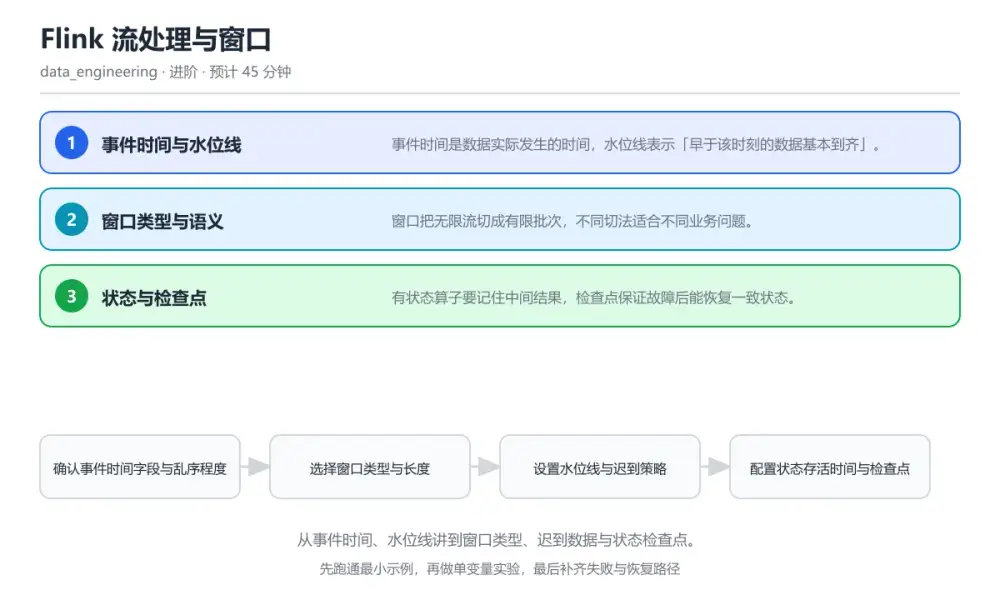
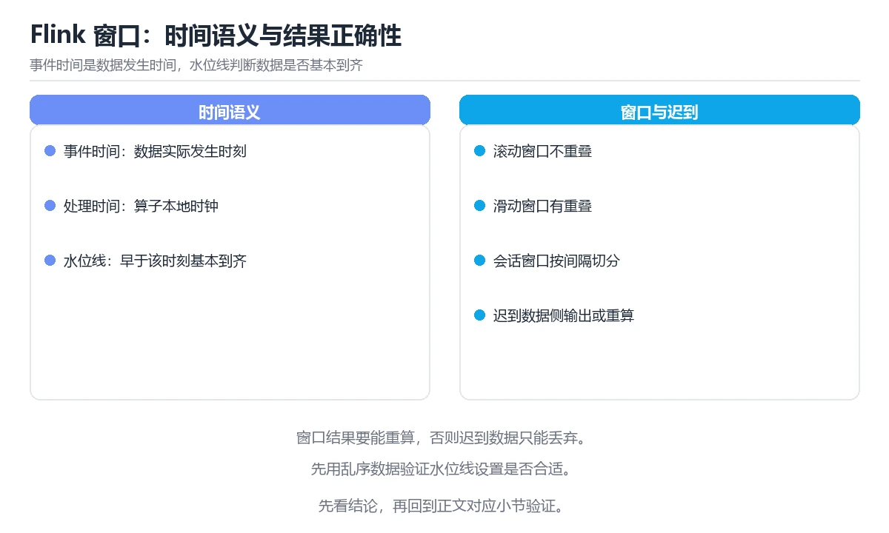

# Flink 流处理与窗口

> 内容更新时间：2026-10-06 · 学习阶段：进阶 · 预计用时：30 分钟

分类：data_engineering。关键词：Flink、事件时间、水位线、窗口、检查点。从事件时间、水位线讲到窗口类型、迟到数据与状态检查点。

学习建议：先通读《Flink 流处理与窗口》的核心知识与关键流程，再运行可运行练习并完成测验；遇到不确定的结论，回到「故障现场」按症状、根因、修复、验证四步核对。



## 学习目标

- 能区分事件时间与处理时间并说明各自适用场景。
- 能按业务语义选择滚动、滑动或会话窗口。
- 能配置迟到数据与检查点，兼顾准确性与可用性。

## 前置知识

- 知道消息队列的分区与消费位点概念。
- 会写分组聚合类算子。
- 了解有状态计算的基本含义。

## 核心知识

### 1. 事件时间与水位线

事件时间是数据实际发生的时间，水位线表示「早于该时刻的数据基本到齐」。

算子从事件中提取时间戳并周期产生水位线，水位线推进到一个窗口结束时间时才触发该窗口计算，允许乱序但有限度。

在Flink 流处理与窗口里可以这样验证：在本课示例里让事件乱序到达，观察水位线推进后窗口才输出结果。

边界：水位线设置得过于激进会过早触发窗口，迟到数据只能被丢弃或走旁路。

工程视角：按数据源乱序程度设置最大延迟并监控迟到比例，把它作为流水线健康指标。

### 2. 窗口类型与语义

窗口把无限流切成有限批次，不同切法适合不同业务问题。

滚动窗口不重叠，滑动窗口按步长重叠，会话窗口按活跃间隔切分，计数窗口按条数触发。

在Flink 流处理与窗口里可以这样验证：在本课示例里同一份数据分别用滚动与滑动窗口聚合，对比输出条数与含义差异。

边界：滑动窗口步长过小会让下游输出量成倍放大，形成写放大问题。

工程视角：窗口长度与步长由业务口径决定并写入指标定义，变更时同步下游说明。

### 3. 状态与检查点

有状态算子要记住中间结果，检查点保证故障后能恢复一致状态。

框架周期性把算子状态与数据源位点一起快照，故障后从最近一次检查点恢复并重放，配合幂等写入实现端到端一致性。

在Flink 流处理与窗口里可以这样验证：在本课示例里杀掉任务再恢复，观察聚合结果与位点从检查点继续。

边界：状态无限增长最终会拖垮任务，必须为状态设置存活时间或改用可清理的结构。

工程视角：为每个状态设置存活时间并监控状态大小，检查点间隔在恢复时间与开销间权衡。

## 关键流程

```text
确认事件时间字段与乱序程度 → 选择窗口类型与长度 → 设置水位线与迟到策略 → 配置状态存活时间与检查点 → 验证故障恢复后结果一致
```

1. 确认事件时间字段与乱序程度
2. 选择窗口类型与长度
3. 设置水位线与迟到策略
4. 配置状态存活时间与检查点
5. 验证故障恢复后结果一致

## 动手练习

1. 用同一份数据分别跑滚动与滑动窗口，记录输出条数与业务含义差异。
2. 把水位线最大延迟从 5 秒改成 1 秒，观察迟到数据数量变化。
3. 杀掉任务后从检查点恢复，对比恢复前后的聚合结果是否一致。

验收标准：把 Flink 的变量、命令和结果写在一起，使他人可以复现同一结论。

## 常见错误与排查

> 说明：本表由《Flink 流处理与窗口》的核心知识整理（2026-10-06），人工复核进度见 docs/content_review_batches.md。

| 易错点 | 容易踩的做法 | 正确结论 |
| --- | --- | --- |
| 窗口结果偏小 | 水位线最大延迟设置过小，乱序数据到得晚被丢弃 | 按数据源实测乱序分布调大最大延迟，并把迟到数据走旁路统计而不是静默丢弃 |
| 任务运行数天后变慢 | 状态没有任何存活时间，键数量持续增长 | 为状态配置存活时间或改用可清理的聚合结构，并监控状态大小 |
| 故障恢复后重复计数 | 只依赖框架恢复，目标端写入无幂等键 | 按窗口与键构造唯一主键，在目标端做幂等写入以吸收重放 |

## 可运行练习

### 任务 1：先跑通，再解释

```java
StreamExecutionEnvironment env = StreamExecutionEnvironment.getExecutionEnvironment();
// 每 30 秒做一次检查点，故障后从最近一次恢复
env.enableCheckpointing(30_000);

DataStream<Order> orders = env
    .addSource(new FlinkKafkaConsumer<>("orders", new OrderSchema(), props))
    .assignTimestampsAndWatermarks(
        WatermarkStrategy.<Order>forBoundedOutOfOrderness(Duration.ofSeconds(5))
            .withTimestampAssigner((order, ts) -> order.eventTimeMs));

SingleOutputStreamOperator<CityStat> stats = orders
    .keyBy(Order::getCity)
    .window(TumblingEventTimeWindows.of(Time.minutes(1)))
    .allowedLateness(Time.seconds(30))       // 允许迟到 30 秒，窗口会重新计算
    .sideOutputLateData(lateTag)            // 更晚的数据进旁路，单独统计
    .aggregate(new OrderAggregate(), new CityStatWindow());

stats.addSink(new IdempotentJdbcSink());     // 目标端按窗口主键幂等写入

```

水位线按最大乱序 5 秒推进，一分钟滚动窗口在完整后触发；迟到 30 秒内的数据会更新结果，更晚的走旁路输出避免静默丢弃，检查点保证故障后从一致状态恢复，幂等写入兜住重复计算。

### 任务 2：只改一个条件

复制上面的示例，只改一个输入或参数再跑一次；先写下预测，再和真实输出对照，并说明差异来自Flink 流处理与窗口的哪条机制。

### 任务 3：迁移到自己的数据

把《Flink 流处理与窗口》里的示例换成你自己的一小段数据或场景，保持结构不变；如果换不动，说明还有哪条前提没有理解，回到核心知识对应小节。

## 故障现场

### 现场 1：窗口结果偏小

**症状**：在《Flink 流处理与窗口》的复现场景中，水位线最大延迟设置过小，乱序数据到得晚被丢弃。

**根因**：当出现“窗口结果偏小”时，执行路径已经绕过了《Flink 流处理与窗口》的关键约束，最终以“水位线最大延迟设置过小，乱序数据到得晚被丢弃”暴露出来；修复前必须先确认约束在哪里失效。

**修复**：针对《Flink 流处理与窗口》的问题，按数据源实测乱序分布调大最大延迟，并把迟到数据走旁路统计而不是静默丢弃。

**验证**：先在《Flink 流处理与窗口》中记录“窗口结果偏小”留下的失败证据，再执行“按数据源实测乱序分布调大最大延迟，并把迟到数据走旁路统计而不是静默丢弃”并重放；确认错误路径变为明确结果，且修复没有掩盖同类故障。

### 现场 2：任务运行数天后变慢

**症状**：在《Flink 流处理与窗口》的复现场景中，状态没有任何存活时间，键数量持续增长。

**根因**：“状态没有任何存活时间，键数量持续增长”只是表层结果。向上追溯会落到“任务运行数天后变慢”这一步，因为它省略了《Flink 流处理与窗口》的约束，使实现行为和预期模型发生了偏离。

**修复**：针对《Flink 流处理与窗口》的问题，为状态配置存活时间或改用可清理的聚合结构，并监控状态大小。

**验证**：先在《Flink 流处理与窗口》中记录“任务运行数天后变慢”留下的失败证据，再执行“为状态配置存活时间或改用可清理的聚合结构，并监控状态大小”并重放；确认错误路径变为明确结果，且修复没有掩盖同类故障。

### 现场 3：故障恢复后重复计数

**症状**：在《Flink 流处理与窗口》的复现场景中，只依赖框架恢复，目标端写入无幂等键。

**根因**：“只依赖框架恢复，目标端写入无幂等键”只是表层结果。向上追溯会落到“故障恢复后重复计数”这一步，因为它省略了《Flink 流处理与窗口》的约束，使实现行为和预期模型发生了偏离。

**修复**：针对《Flink 流处理与窗口》的问题，按窗口与键构造唯一主键，在目标端做幂等写入以吸收重放。

**验证**：在《Flink 流处理与窗口》中按“按窗口与键构造唯一主键，在目标端做幂等写入以吸收重放”调整后，从“故障恢复后重复计数”的触发条件重放同一条路径，确认“只依赖框架恢复，目标端写入无幂等键”不再出现，并补一个相邻边界用例检查没有引入新问题。

## 本课复习清单

离开本课前，逐项确认：

- [ ] 能解释水位线如何触发窗口以及它带来什么取舍。
- [ ] 能按业务问题选择滚动、滑动或会话窗口。
- [ ] 能说出控制状态规模的两个手段。
- [ ] 至少运行一次 assignTimestampsAndWatermarks 的示例，记录输入、输出和 Flink 的边界情况。
- [ ] 把本课最容易混淆的两个概念写成一句话对照。

| 复盘项 | 记录 |
| --- | --- |
| 已经能独立解释的考点 |  |
| 仍然说不清的概念 |  |
| 下一步验证动作 |  |

## 复习与自测

### 核心知识

遮住正文回答：Flink 流处理与窗口解决什么问题、依赖哪些前提、失败时先看哪个信号？三问都能答清楚，再进入下一节。

### 动手练习

把《Flink 流处理与窗口》里「只改一个条件」的练习再做一遍，这次先写预测再运行；预测和结果不一致的地方，就是需要回读的章节。

### 最小可运行示例

```java
StreamExecutionEnvironment env = StreamExecutionEnvironment.getExecutionEnvironment();
// 每 30 秒做一次检查点，故障后从最近一次恢复
env.enableCheckpointing(30_000);

DataStream<Order> orders = env
    .addSource(new FlinkKafkaConsumer<>("orders", new OrderSchema(), props))
    .assignTimestampsAndWatermarks(
        WatermarkStrategy.<Order>forBoundedOutOfOrderness(Duration.ofSeconds(5))
            .withTimestampAssigner((order, ts) -> order.eventTimeMs));

SingleOutputStreamOperator<CityStat> stats = orders
    .keyBy(Order::getCity)
    .window(TumblingEventTimeWindows.of(Time.minutes(1)))
    .allowedLateness(Time.seconds(30))       // 允许迟到 30 秒，窗口会重新计算
    .sideOutputLateData(lateTag)            // 更晚的数据进旁路，单独统计
    .aggregate(new OrderAggregate(), new CityStatWindow());

stats.addSink(new IdempotentJdbcSink());     // 目标端按窗口主键幂等写入

```

### 预期输出

```text
window [10:00,10:01) emitted 42 records，late side-output 3 records，checkpoint 17 ok in 1.2 s
```

### 验证步骤

1. 确认输入数据与运行环境和示例一致。
2. 运行示例，记录输出与耗时等可观测指标。
3. 换一个边界输入重跑，确认结论仍然成立。
4. 把两次结果写成一句话结论，注明前提与局限。

## 术语速查

先遮住右列，尝试用自己的话解释，再回到正文核对。

| 术语 | 一句话说明 |
| --- | --- |
| `事件时间` | 事件自身携带的发生时刻，与处理时刻无关。 |
| `水位线` | 表示某时刻之前数据基本到齐的进度标记。 |
| `滚动窗口` | 长度固定且互不重叠的时间窗口。 |
| `允许迟到` | 窗口触发后仍接受一段时间内迟到数据的设置。 |
| `检查点` | 周期性保存状态与位点，用于故障恢复。 |
| `窗口` | 窗口长度与步长由业务口径决定并写入指标定义，变更时同步下游说明 |

## 考点精讲

### 考点 1：事件时间与处理时间的关键区别是？

题型：概念判断。题干：事件时间与处理时间的关键区别是？

判断要点：事件时间来自数据本身。事件时间反映业务发生顺序，能在乱序与延迟下保持结果正确；处理时间跟随节点时钟，简单但结果依赖到达顺序。 正确选项「事件时间来自数据本身」对应《Flink 流处理与窗口》的要点「事件时间与水位线」：事件时间是数据实际发生的时间，水位线表示「早于该时刻的数据基本到齐」。判断「事件时间与水位线」时先确认前提是否成立，再回到《Flink 流处理与窗口》的示例核对一次；把别的语言或框架的默认做法直接搬到事件时间与水位线上，往往会在本课的边界条件里失效。

### 考点 2：允许迟到参数的作用是？

题型：概念判断。题干：允许迟到参数的作用是？

判断要点：窗口触发后仍接受一段时间内的迟到数据。允许迟到让窗口在触发后仍能吸收少量迟到数据并更新结果，超过该时限的数据走旁路输出。 正确选项「窗口触发后仍接受一段时间内的迟到数据」对应《Flink 流处理与窗口》的要点「窗口类型与语义」：窗口把无限流切成有限批次，不同切法适合不同业务问题。判断「窗口类型与语义」时先确认前提是否成立，再回到《Flink 流处理与窗口》的示例核对一次；借鉴相邻主题的经验之前，先核对窗口类型与语义的前提是否成立。

### 考点 3：以下哪些做法有助于控制有状态任务的风险？

题型：多选辨析。题干：以下哪些做法有助于控制有状态任务的风险？（多选）

判断要点：为状态配置存活时间；监控状态大小与检查点时长；把更晚的迟到数据写入旁路统计。状态存活时间、监控与旁路统计共同保证任务长期稳定；状态无限保留最终会让恢复时间不可接受。 正确选项「为状态配置存活时间；监控状态大小与检查点时长；把更晚的迟到数据写入旁路统计」对应《Flink 流处理与窗口》的要点「状态与检查点」：有状态算子要记住中间结果，检查点保证故障后能恢复一致状态。判断「状态与检查点」时先确认前提是否成立，再回到《Flink 流处理与窗口》的示例核对一次；记住状态与检查点的结论之外还要记住适用条件，换一个输入往往就不成立了。

### 考点 4：请按一次事件在窗口里被处理的顺序排列。

题型：顺序排列。题干：请按一次事件在窗口里被处理的顺序排列。

判断要点：事件带时间戳进入算子。事件先入状态，水位线完整后触发计算，迟到数据在允许范围内更新，超出范围则进入旁路以便单独分析。 正确选项「事件带时间戳进入算子；水位线推进到窗口结束；窗口触发并输出聚合结果；迟到数据在允许范围内更新结果；超期数据写入旁路输出」对应《Flink 流处理与窗口》的要点「事件时间与水位线」：事件时间是数据实际发生的时间，水位线表示「早于该时刻的数据基本到齐」。判断「事件时间与水位线」时先确认前提是否成立，再回到《Flink 流处理与窗口》的示例核对一次；干扰项常常是相邻主题里成立的结论，只有按事件时间与水位线的输入与约束判断才能排除。

### 考点 5：阅读这段窗口配置，最可能出现什么问题？

题型：排错。题干：阅读这段窗口配置，最可能出现什么问题？

判断要点：步长远小于窗口长度，输出量被成倍放大。一小时窗口每秒滑动一次，同一条事件会被计入 3600 个窗口，输出量与状态压力成倍增长，应按业务需要的更新频率选择步长。 正确选项「步长远小于窗口长度，输出量被成倍放大」对应《Flink 流处理与窗口》的要点「窗口类型与语义」：窗口把无限流切成有限批次，不同切法适合不同业务问题。判断「窗口类型与语义」时先确认前提是否成立，再回到《Flink 流处理与窗口》的示例核对一次；把窗口类型与语义的做法换到别的约束下未必成立，先确认边界再决定答案。

## English Overview

Flink Streaming and Windowing

Streaming aggregations need a time semantics. Event time follows the data, and a watermark declares that earlier events have mostly arrived, which is when a window fires. Rolling, sliding and session windows answer different questions. State must be bounded with a time-to-live, and checkpoints let a job resume from a consistent snapshot, with idempotent sinks absorbing replays.



## 本课小结

- Flink 流处理与窗口围绕Flink、事件时间、水位线展开，先建立基线再讨论优化。
- 事件时间是数据实际发生的时间，水位线表示「早于该时刻的数据基本到齐」。
- assignTimestampsAndWatermarks 出错时先记录症状，再定位根因，最后用一次复跑确认修复。

## 内容元数据

- 内容版本：v2.0
- 最后更新：2026-10-06
- 学习阶段：进阶

| 字段 | 值 |
| --- | --- |
| 课程 ID | `de_flink_windowing` |
| 所属分类 | `data_engineering` |
| 难度 | 进阶 |
| 预计用时 | 45 分钟 |
| 关键词 | Flink、事件时间、水位线、窗口、检查点 |
| 配图 | `images/lesson_de_flink_windowing.webp` |
| 参考资料 | 2 条 |
| 内容更新时间 | 2026-10-06 |

## 参考资料与复核

- 最后复核：2026-10-04
- 下次复核：2027-01-17
- 复核范围：版本兼容、API 行为与工程实践

下面列出的资料用于核对本课结论，复习时可以对照阅读：
- [Apache Flink 官方文档：窗口](https://nightlies.apache.org/flink/flink-docs-stable/docs/dev/datastream/operators/windows/)
- [Apache Flink 官方文档：检查点与状态](https://nightlies.apache.org/flink/flink-docs-stable/docs/dev/datastream/fault-tolerance/checkpointing/)

> 复核提示：《Flink 流处理与窗口》的结论如与资料冲突，以资料中的规范文本为准，并在笔记里记录差异与日期。

## 复习与迁移

### 概念复述

不看正文，把Flink 流处理与窗口讲给一个没学过的同事：先讲它解决什么问题，再讲一个最小例子，最后说明一个不适用场景。

### 测验回顾

回到《Flink 流处理与窗口》测验，只重做答错或犹豫的题；对每道题写一句「我为什么改选这个答案」，写不出理由就回到对应小节。

### 迁移练习

把《Flink 流处理与窗口》的方法用到一个你自己的真实场景：说明输入、约束与验证方式，并列出仍然不确定、需要下一次实验回答的问题。

## 深度拓展与实战

这一节把Flink 流处理与窗口的机制拆开验证：每一步都给出输入、判断标准和失败信号，便于在真实项目里复用。

### 机制拆解 1：事件时间与水位线

算子从事件中提取时间戳并周期产生水位线，水位线推进到一个窗口结束时间时才触发该窗口计算，允许乱序但有限度。

落地时先确认前提：水位线设置得过于激进会过早触发窗口，迟到数据只能被丢弃或走旁路。；再把结论写进检查表，让下一位同学可以按同样的输入复现。

工程做法：按数据源乱序程度设置最大延迟并监控迟到比例，把它作为流水线健康指标。

### 机制拆解 2：窗口类型与语义

滚动窗口不重叠，滑动窗口按步长重叠，会话窗口按活跃间隔切分，计数窗口按条数触发。

落地时先确认前提：滑动窗口步长过小会让下游输出量成倍放大，形成写放大问题。；再把结论写进检查表，让下一位同学可以按同样的输入复现。

工程做法：窗口长度与步长由业务口径决定并写入指标定义，变更时同步下游说明。

### 机制拆解 3：状态与检查点

框架周期性把算子状态与数据源位点一起快照，故障后从最近一次检查点恢复并重放，配合幂等写入实现端到端一致性。

落地时先确认前提：状态无限增长最终会拖垮任务，必须为状态设置存活时间或改用可清理的结构。；再把结论写进检查表，让下一位同学可以按同样的输入复现。

工程做法：为每个状态设置存活时间并监控状态大小，检查点间隔在恢复时间与开销间权衡。

### 机制对照表

| 概念 | 解决什么问题 | 关键前提 | 失败信号 |
| --- | --- | --- | --- |
| 事件时间与水位线 | 事件时间是数据实际发生的时间，水位线表示「早于该时刻的数据基本到齐」。 | 水位线设置得过于激进会过早触发窗口，迟到数据只能被丢弃或走旁路。 | 按数据源乱序程度设置最大延迟并监控迟到比例，把它作为流水线健康指标。 |
| 窗口类型与语义 | 窗口把无限流切成有限批次，不同切法适合不同业务问题。 | 滑动窗口步长过小会让下游输出量成倍放大，形成写放大问题。 | 窗口长度与步长由业务口径决定并写入指标定义，变更时同步下游说明。 |
| 状态与检查点 | 有状态算子要记住中间结果，检查点保证故障后能恢复一致状态。 | 状态无限增长最终会拖垮任务，必须为状态设置存活时间或改用可清理的结构。 | 为每个状态设置存活时间并监控状态大小，检查点间隔在恢复时间与开销间权衡。 |

### 自测问答

**问 1**：事件时间与处理时间的关键区别是？

**答**：事件时间来自数据本身，处理时间来自处理节点时钟。事件时间反映业务发生顺序，能在乱序与延迟下保持结果正确；处理时间跟随节点时钟，简单但结果依赖到达顺序。 正确选项「事件时间来自数据本身，处理时间来自处理节点时钟」对应《Flink 流处理与窗口》的要点「事件时间与水位线」：事件时间是数据实际发生的时间，水位线表示「早于该时刻的数据基本到齐」。判断「事件时间与水位线」时先确认前提是否成立，再回到《Flink 流处理与窗口》的示例核对一次；把别的语言或框架的默认做法直接搬到事件时间与水位线上，往往会在本课的边界条件里失效。

**问 2**：允许迟到参数的作用是？

**答**：窗口触发后仍接受一段时间内的迟到数据。允许迟到让窗口在触发后仍能吸收少量迟到数据并更新结果，超过该时限的数据走旁路输出。 正确选项「窗口触发后仍接受一段时间内的迟到数据」对应《Flink 流处理与窗口》的要点「窗口类型与语义」：窗口把无限流切成有限批次，不同切法适合不同业务问题。判断「窗口类型与语义」时先确认前提是否成立，再回到《Flink 流处理与窗口》的示例核对一次；借鉴相邻主题的经验之前，先核对窗口类型与语义的前提是否成立。

**问 3**：以下哪些做法有助于控制有状态任务的风险？（多选）

**答**：为状态配置存活时间；监控状态大小与检查点时长；把更晚的迟到数据写入旁路统计。状态存活时间、监控与旁路统计共同保证任务长期稳定；状态无限保留最终会让恢复时间不可接受。 正确选项「为状态配置存活时间；监控状态大小与检查点时长；把更晚的迟到数据写入旁路统计」对应《Flink 流处理与窗口》的要点「状态与检查点」：有状态算子要记住中间结果，检查点保证故障后能恢复一致状态。判断「状态与检查点」时先确认前提是否成立，再回到《Flink 流处理与窗口》的示例核对一次；记住状态与检查点的结论之外还要记住适用条件，换一个输入往往就不成立了。

**问 4**：请按一次事件在窗口里被处理的顺序排列。

**答**：事件带时间戳进入算子。事件先入状态，水位线完整后触发计算，迟到数据在允许范围内更新，超出范围则进入旁路以便单独分析。 正确选项「事件带时间戳进入算子；水位线推进到窗口结束；窗口触发并输出聚合结果；迟到数据在允许范围内更新结果；超期数据写入旁路输出」对应《Flink 流处理与窗口》的要点「事件时间与水位线」：事件时间是数据实际发生的时间，水位线表示「早于该时刻的数据基本到齐」。判断「事件时间与水位线」时先确认前提是否成立，再回到《Flink 流处理与窗口》的示例核对一次；干扰项常常是相邻主题里成立的结论，只有按事件时间与水位线的输入与约束判断才能排除。

**问 5**：阅读这段窗口配置，最可能出现什么问题？

**答**：步长远小于窗口长度，输出量被成倍放大。一小时窗口每秒滑动一次，同一条事件会被计入 3600 个窗口，输出量与状态压力成倍增长，应按业务需要的更新频率选择步长。 正确选项「步长远小于窗口长度，输出量被成倍放大」对应《Flink 流处理与窗口》的要点「窗口类型与语义」：窗口把无限流切成有限批次，不同切法适合不同业务问题。判断「窗口类型与语义」时先确认前提是否成立，再回到《Flink 流处理与窗口》的示例核对一次；把窗口类型与语义的做法换到别的约束下未必成立，先确认边界再决定答案。

### 排错速查

- 看到「水位线最大延迟设置过小，乱序数据到得晚被丢弃」时，先按「按数据源实测乱序分布调大最大延迟，并把迟到数据走旁路统计而不是静默丢弃」处理，再用Flink 流处理与窗口的最小示例确认结论是否恢复。
- 看到「状态没有任何存活时间，键数量持续增长」时，先按「为状态配置存活时间或改用可清理的聚合结构，并监控状态大小」处理，再用Flink 流处理与窗口的最小示例确认结论是否恢复。
- 看到「只依赖框架恢复，目标端写入无幂等键」时，先按「按窗口与键构造唯一主键，在目标端做幂等写入以吸收重放」处理，再用Flink 流处理与窗口的最小示例确认结论是否恢复。

### 工程检查表

- [ ] 确认事件时间字段与乱序程度
- [ ] 选择窗口类型与长度
- [ ] 设置水位线与迟到策略
- [ ] 配置状态存活时间与检查点
- [ ] 验证故障恢复后结果一致
- [ ] 【事件时间与水位线】按数据源乱序程度设置最大延迟并监控迟到比例，把它作为流水线健康指标。
- [ ] 【窗口类型与语义】窗口长度与步长由业务口径决定并写入指标定义，变更时同步下游说明。
- [ ] 【状态与检查点】为每个状态设置存活时间并监控状态大小，检查点间隔在恢复时间与开销间权衡。

### 迁移练习

把Flink 流处理与窗口的方法用到一个真实场景：写下Flink、事件时间、水位线在你的场景里分别对应什么，再记录一次失败尝试和它的恢复步骤。

### 延伸阅读与下一步

- 复习Flink、事件时间、水位线、窗口、检查点时，优先回看「事件时间与水位线」与「状态与检查点」两节。
- 把从「确认事件时间字段与乱序程度」到「验证故障恢复后结果一致」的流程画成一张图，放进自己的笔记。
- 一周后重做本课测验，只把答错的题留到下一轮复习。

### 结论与下一步

学完Flink 流处理与窗口，应该能独立完成三件事：先用最小示例确认Flink的行为，再用一个边界输入验证结论，最后把失败路径写成可重复的检查。下一步把本课术语加入复习清单，并在两周内用一次真实任务检验记忆是否牢固。

