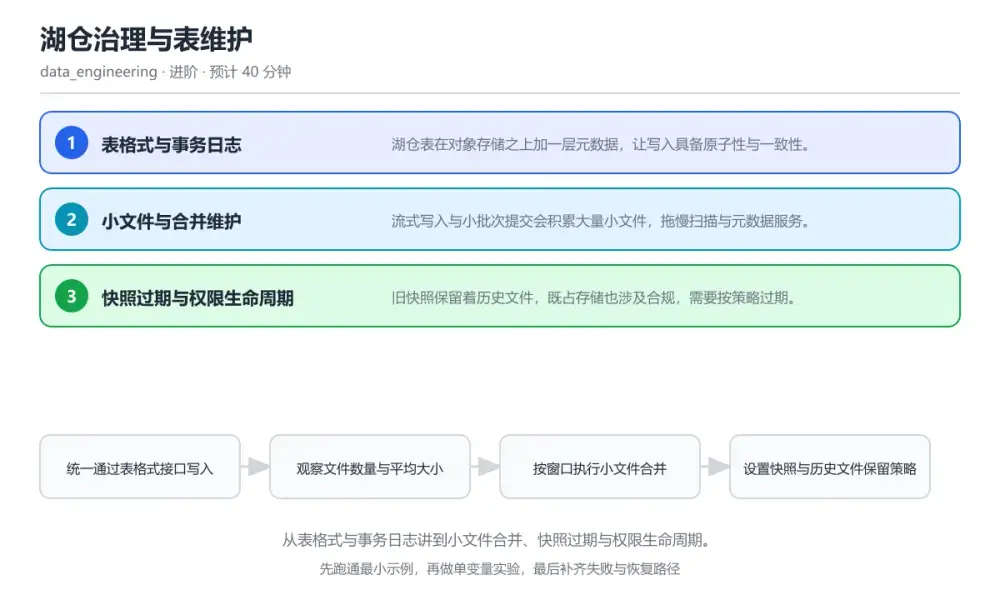
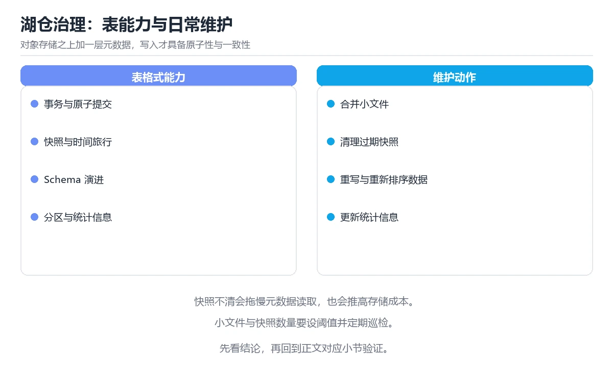

# 湖仓治理与表维护

> 内容更新时间：2026-10-06 · 学习阶段：进阶 · 预计用时：30 分钟

分类：data_engineering。关键词：湖仓、表格式、小文件合并、快照过期、权限。从表格式与事务日志讲到小文件合并、快照过期与权限生命周期。

学习建议：先通读《湖仓治理与表维护》的核心知识与关键流程，再运行可运行练习并完成测验；遇到不确定的结论，回到「故障现场」按症状、根因、修复、验证四步核对。



## 学习目标

- 能说明表格式如何用元数据提供事务与时间旅行能力。
- 能制定小文件合并与快照过期的维护节奏。
- 能按最小权限与生命周期要求治理表访问。

## 前置知识

- 知道对象存储的目录与文件组织方式。
- 会写基本的建表与查询语句。
- 了解分区裁剪与列式存储的基本原理。

## 核心知识

### 1. 表格式与事务日志

湖仓表在对象存储之上加一层元数据，让写入具备原子性与一致性。

每次提交生成新的元数据快照，指向本次有效的数据文件集合，读取方以快照为单位看到一致的数据版本。

在湖仓治理与表维护里可以这样验证：在本课示例里并发执行两次写入，观察两边提交后读取方仍看到一致快照。

边界：绕过表格式直接写目录会破坏元数据与实际文件的一致性，后续读取直接失败。

工程视角：所有写入统一走表格式接口，禁止直接操作底层目录，元数据提交纳入变更审计。

### 2. 小文件与合并维护

流式写入与小批次提交会积累大量小文件，拖慢扫描与元数据服务。

定期重写小文件为更大的目标尺寸，并在写入侧调整提交间隔或分区粒度，减少后续扫描的文件数量。

在湖仓治理与表维护里可以这样验证：在本课示例里合并一个分区的小文件，对比合并前后的查询耗时。

边界：并发执行合并与写入会产生冲突，触发重试甚至提交失败。

工程视角：把合并任务排进固定维护窗口，监控平均文件大小与文件数量作为治理指标。

### 3. 快照过期与权限生命周期

旧快照保留着历史文件，既占存储也涉及合规，需要按策略过期。

按保留窗口清理过期快照及其引用文件，同时按最小权限配置行列级访问控制，并按数据保留要求设置生命周删除。

在湖仓治理与表维护里可以这样验证：在本课示例里为一张表设置七天快照保留，观察过期后存储量与时间旅行范围的变化。

边界：快照清理过激会让依赖时间旅行的回滚与审计无法执行，保留窗口必须与业务约定对齐。

工程视角：保留窗口与权限矩阵写入治理清单，定期核对实际配置与清单是否一致。

## 关键流程

```text
统一通过表格式接口写入 → 观察文件数量与平均大小 → 按窗口执行小文件合并 → 设置快照与历史文件保留策略 → 核对权限与生命周期配置
```

1. 统一通过表格式接口写入
2. 观察文件数量与平均大小
3. 按窗口执行小文件合并
4. 设置快照与历史文件保留策略
5. 核对权限与生命周期配置

## 动手练习

1. 统计一张表分区内的文件数量与平均大小，写出合并前后的查询耗时对比。
2. 为示例表设置七天快照保留，验证时间旅行范围的变化。
3. 对照治理清单核对一张表的权限与生命周期配置，记录不一致项。

**验收标准**：留下 file_size_in_bytes 的输入、命令、输出和结论，让别人能按记录复现。

## 常见错误与排查

> 说明：本表由《湖仓治理与表维护》的核心知识整理（2026-10-06），人工复核进度见 docs/content_review_batches.md。

| 易错点 | 容易踩的做法 | 正确结论 |
| --- | --- | --- |
| 查询越跑越慢 | 流式小批次持续写入且从不合并小文件 | 按维护窗口重写小文件到目标尺寸，并在写入侧调整提交间隔与分区粒度 |
| 元数据与文件不一致 | 绕过表格式直接写对象存储目录 | 所有写入走表格式提交接口，禁止直接操作底层文件 |
| 回滚能力突然失效 | 快照保留窗口设置过短，历史快照被提前清理 | 保留窗口与业务回滚审计要求对齐，过期与孤儿文件清理分批谨慎执行 |

## 可运行练习

### 任务 1：先跑通，再解释

```sql
-- 查看表当前的文件与快照概况
SELECT count(*) AS file_count, avg(file_size_in_bytes) / 1024 / 1024 AS avg_mb
FROM table_files('lake.dwd_orders') WHERE partition.dt = '2026-10-01';

-- 合并小文件：目标文件控制在 128 MB 左右
CALL catalog.system.rewrite_data_files(
    table => 'lake.dwd_orders',
    options => map('target-file-size-bytes', '134217728', 'min-input-files', '5')
);

-- 过期旧快照，保留最近 7 天用于回滚与审计
CALL catalog.system.expire_snapshots(
    table => 'lake.dwd_orders',
    older_than => TIMESTAMP '2026-09-24 00:00:00',
    retain_last => 5
);

-- 只删除已过期快照不再引用的文件，避免误删正在使用的数据
CALL catalog.system.remove_orphan_files(
    table => 'lake.dwd_orders',
    older_than => TIMESTAMP '2026-09-20 00:00:00'
);

```

先查看分区文件数量与平均大小定位问题，再按目标尺寸重写小文件；快照过期只清理元数据引用，孤儿文件清理有独立的时间门槛，避免删除仍被引用的数据。三步配合形成可回滚的维护节奏。

### 任务 2：只改一个条件

复制上面的示例，只改一个输入或参数再跑一次；先写下预测，再和真实输出对照，并说明差异来自湖仓治理与表维护的哪条机制。

### 任务 3：迁移到自己的数据

把《湖仓治理与表维护》里的示例换成你自己的一小段数据或场景，保持结构不变；如果换不动，说明还有哪条前提没有理解，回到核心知识对应小节。

## 故障现场

### 现场 1：查询越跑越慢

**症状**：在《湖仓治理与表维护》的复现场景中，流式小批次持续写入且从不合并小文件。

**根因**：当出现“查询越跑越慢”时，执行路径已经绕过了《湖仓治理与表维护》的关键约束，最终以“流式小批次持续写入且从不合并小文件”暴露出来；修复前必须先确认约束在哪里失效。

**修复**：针对《湖仓治理与表维护》的问题，按维护窗口重写小文件到目标尺寸，并在写入侧调整提交间隔与分区粒度。

**验证**：保留《湖仓治理与表维护》里触发“流式小批次持续写入且从不合并小文件”的输入、版本和日志，按“按维护窗口重写小文件到目标尺寸，并在写入侧调整提交间隔与分区粒度”完成修改后原样重放；只有失败现象消失且相邻场景仍可解释，才保留改动。

### 现场 2：元数据与文件不一致

**症状**：在《湖仓治理与表维护》的复现场景中，绕过表格式直接写对象存储目录。

**根因**：当出现“元数据与文件不一致”时，执行路径已经绕过了《湖仓治理与表维护》的关键约束，最终以“绕过表格式直接写对象存储目录”暴露出来；修复前必须先确认约束在哪里失效。

**修复**：针对《湖仓治理与表维护》的问题，所有写入走表格式提交接口，禁止直接操作底层文件。

**验证**：保留《湖仓治理与表维护》里触发“绕过表格式直接写对象存储目录”的输入、版本和日志，按“所有写入走表格式提交接口，禁止直接操作底层文件”完成修改后原样重放；只有失败现象消失且相邻场景仍可解释，才保留改动。

### 现场 3：回滚能力突然失效

**症状**：在《湖仓治理与表维护》的复现场景中，快照保留窗口设置过短，历史快照被提前清理。

**根因**：当出现“回滚能力突然失效”时，执行路径已经绕过了《湖仓治理与表维护》的关键约束，最终以“快照保留窗口设置过短，历史快照被提前清理”暴露出来；修复前必须先确认约束在哪里失效。

**修复**：针对《湖仓治理与表维护》的问题，保留窗口与业务回滚审计要求对齐，过期与孤儿文件清理分批谨慎执行。

**验证**：保留《湖仓治理与表维护》里触发“快照保留窗口设置过短，历史快照被提前清理”的输入、版本和日志，按“保留窗口与业务回滚审计要求对齐，过期与孤儿文件清理分批谨慎执行”完成修改后原样重放；只有失败现象消失且相邻场景仍可解释，才保留改动。

## 本课复习清单

离开本课前，逐项确认：

- [ ] 能解释表格式如何提供事务一致性。
- [ ] 能说出小文件治理的两个观察指标。
- [ ] 能说明快照过期与回滚能力之间的取舍。
- [ ] 至少运行一次 file_size_in_bytes 的示例，记录输入、输出和 湖仓 的边界情况。
- [ ] 把本课最容易混淆的两个概念写成一句话对照。

| 复盘项 | 记录 |
| --- | --- |
| 已经能独立解释的考点 |  |
| 仍然说不清的概念 |  |
| 下一步验证动作 |  |

## 复习与自测

### 核心知识

遮住正文回答：湖仓治理与表维护解决什么问题、依赖哪些前提、失败时先看哪个信号？三问都能答清楚，再进入下一节。

### 动手练习

把《湖仓治理与表维护》里「只改一个条件」的练习再做一遍，这次先写预测再运行；预测和结果不一致的地方，就是需要回读的章节。

### 最小可运行示例

```sql
-- 查看表当前的文件与快照概况
SELECT count(*) AS file_count, avg(file_size_in_bytes) / 1024 / 1024 AS avg_mb
FROM table_files('lake.dwd_orders') WHERE partition.dt = '2026-10-01';

-- 合并小文件：目标文件控制在 128 MB 左右
CALL catalog.system.rewrite_data_files(
    table => 'lake.dwd_orders',
    options => map('target-file-size-bytes', '134217728', 'min-input-files', '5')
);

-- 过期旧快照，保留最近 7 天用于回滚与审计
CALL catalog.system.expire_snapshots(
    table => 'lake.dwd_orders',
    older_than => TIMESTAMP '2026-09-24 00:00:00',
    retain_last => 5
);

-- 只删除已过期快照不再引用的文件，避免误删正在使用的数据
CALL catalog.system.remove_orphan_files(
    table => 'lake.dwd_orders',
    older_than => TIMESTAMP '2026-09-20 00:00:00'
);

```

### 预期输出

```text
file_count 2140 -> 168，avg_mb 3.1 -> 127.6，query p95 46 s -> 9 s，snapshots 213 -> 6
```

### 验证步骤

1. 确认输入数据与运行环境和示例一致。
2. 运行示例，记录输出与耗时等可观测指标。
3. 换一个边界输入重跑，确认结论仍然成立。
4. 把两次结果写成一句话结论，注明前提与局限。

## 术语速查

先遮住右列，尝试用自己的话解释，再回到正文核对。

| 术语 | 一句话说明 |
| --- | --- |
| `表格式` | 在对象存储之上提供事务、快照与演进的元数据层。 |
| `快照` | 某个提交点上的完整数据视图。 |
| `小文件合并` | 把大量小文件重写为更大的文件以提升扫描效率。 |
| `孤儿文件` | 不再被任何快照引用但仍占用存储的文件。 |
| `生命周期策略` | 按时间或条件自动迁移与删除数据的规则。 |

## 考点精讲

### 考点 1：湖仓表的原子性主要靠什么保证？

题型：概念判断。题干：湖仓表的原子性主要靠什么保证？

判断要点：元数据快照的原子提交。每次提交生成一致的新快照，读取方以快照为单位获取数据，因此即使底层文件很多也能看到一致版本。 正确选项「元数据快照的原子提交」对应《湖仓治理与表维护》的要点「表格式与事务日志」：湖仓表在对象存储之上加一层元数据，让写入具备原子性与一致性。判断「表格式与事务日志」时先确认前提是否成立，再回到《湖仓治理与表维护》的示例核对一次；把别的语言或框架的默认做法直接搬到表格式与事务日志上，往往会在本课的边界条件里失效。

### 考点 2：快照保留窗口设置过短的主要风险是？

题型：概念判断。题干：快照保留窗口设置过短的主要风险是？

判断要点：回滚与审计依赖的历史版本不可用。过期快照对应的历史文件会被清理，时间旅行与回滚能力随之消失，保留窗口必须与业务要求对齐。 正确选项「回滚与审计依赖的历史版本不可用」对应《湖仓治理与表维护》的要点「小文件与合并维护」：流式写入与小批次提交会积累大量小文件，拖慢扫描与元数据服务。判断「小文件与合并维护」时先确认前提是否成立，再回到《湖仓治理与表维护》的示例核对一次；借鉴相邻主题的经验之前，先核对小文件与合并维护的前提是否成立。

### 考点 3：湖仓日常维护应包含哪些动作？（多选）

题型：多选辨析。题干：湖仓日常维护应包含哪些动作？（多选）

判断要点：小文件合并；快照过期与孤儿文件清理；权限与生命周期配置核对。合并、过期与权限核对构成治理闭环；直接删除元数据目录会破坏整张表，属于高危操作。 正确选项「小文件合并；快照过期与孤儿文件清理；权限与生命周期配置核对」对应《湖仓治理与表维护》的要点「快照过期与权限生命周期」：旧快照保留着历史文件，既占存储也涉及合规，需要按策略过期。判断「快照过期与权限生命周期」时先确认前提是否成立，再回到《湖仓治理与表维护》的示例核对一次；记住快照过期与权限生命周期的结论之外还要记住适用条件，换一个输入往往就不成立了。

### 考点 4：请按一次表维护的顺序排列。

题型：顺序排列。题干：请按一次表维护的顺序排列。

判断要点：统计文件数量与平均大小。先诊断再合并，随后处理快照与孤儿文件，最后用指标确认治理效果并归档结论。 正确选项「统计文件数量与平均大小；重写小文件到目标尺寸；过期超出保留窗口的快照；清理不再被引用的孤儿文件；复查查询耗时与存储占用」对应《湖仓治理与表维护》的要点「表格式与事务日志」：湖仓表在对象存储之上加一层元数据，让写入具备原子性与一致性。判断「表格式与事务日志」时先确认前提是否成立，再回到《湖仓治理与表维护》的示例核对一次；干扰项常常是相邻主题里成立的结论，只有按表格式与事务日志的输入与约束判断才能排除。

### 考点 5：阅读这段维护脚本，风险是什么？

题型：排错。题干：阅读这段维护脚本，风险是什么？

判断要点：孤儿文件清理时间门槛过短，可能删除正在写入的文件。长任务写入的文件在规定提交完成前可能仍未被元数据引用，门槛过短会把它当成孤儿删除，导致正在进行的写入损坏。 正确选项「孤儿文件清理时间门槛过短，可能删除正在写入的文件」对应《湖仓治理与表维护》的要点「小文件与合并维护」：流式写入与小批次提交会积累大量小文件，拖慢扫描与元数据服务。判断「小文件与合并维护」时先确认前提是否成立，再回到《湖仓治理与表维护》的示例核对一次；把小文件与合并维护的做法换到别的约束下未必成立，先确认边界再决定答案。

## English Overview

Lakehouse Governance and Table Maintenance

A lakehouse table adds a metadata layer over object storage, so each commit publishes a consistent snapshot and readers always see one version. Streaming writers accumulate small files, so scheduled compaction rewrites them to a target size. Snapshot expiry and orphan-file cleanup reclaim storage, but their time thresholds must stay aligned with rollback and audit requirements.



## 本课小结

- 湖仓治理与表维护围绕湖仓、表格式、小文件合并展开，先建立基线再讨论优化。
- 湖仓表在对象存储之上加一层元数据，让写入具备原子性与一致性。
- 排查 表格式 时保留原始错误信息，不要先改代码。

## 内容元数据

- 内容版本：v2.0
- 最后更新：2026-10-06
- 学习阶段：进阶

| 字段 | 值 |
| --- | --- |
| 课程 ID | `de_lakehouse_governance` |
| 所属分类 | `data_engineering` |
| 难度 | 进阶 |
| 预计用时 | 40 分钟 |
| 关键词 | 湖仓、表格式、小文件合并、快照过期、权限 |
| 配图 | `images/lesson_de_lakehouse_governance.webp` |
| 参考资料 | 2 条 |
| 内容更新时间 | 2026-10-06 |

## 参考资料与复核

- 最后复核：2026-10-04
- 下次复核：2027-01-17
- 复核范围：版本兼容、API 行为与工程实践

下面列出的资料用于核对本课结论，复习时可以对照阅读：
- [Apache Iceberg 官方文档：维护与快照](https://iceberg.apache.org/docs/latest/maintenance/)
- [Delta Lake 官方文档：表维护](https://docs.delta.io/latest/best-practices.html)

> 复核提示：《湖仓治理与表维护》的结论如与资料冲突，以资料中的规范文本为准，并在笔记里记录差异与日期。

## 复习与迁移

### 概念复述

不看正文，把湖仓治理与表维护讲给一个没学过的同事：先讲它解决什么问题，再讲一个最小例子，最后说明一个不适用场景。

### 测验回顾

回到《湖仓治理与表维护》测验，只重做答错或犹豫的题；对每道题写一句「我为什么改选这个答案」，写不出理由就回到对应小节。

### 迁移练习

把《湖仓治理与表维护》的方法用到一个你自己的真实场景：说明输入、约束与验证方式，并列出仍然不确定、需要下一次实验回答的问题。

## 深度拓展与实战

这一节把湖仓治理与表维护的机制拆开验证：每一步都给出输入、判断标准和失败信号，便于在真实项目里复用。

### 机制拆解 1：表格式与事务日志

每次提交生成新的元数据快照，指向本次有效的数据文件集合，读取方以快照为单位看到一致的数据版本。

落地时先确认前提：绕过表格式直接写目录会破坏元数据与实际文件的一致性，后续读取直接失败。；再把结论写进检查表，让下一位同学可以按同样的输入复现。

工程做法：所有写入统一走表格式接口，禁止直接操作底层目录，元数据提交纳入变更审计。

### 机制拆解 2：小文件与合并维护

定期重写小文件为更大的目标尺寸，并在写入侧调整提交间隔或分区粒度，减少后续扫描的文件数量。

落地时先确认前提：并发执行合并与写入会产生冲突，触发重试甚至提交失败。；再把结论写进检查表，让下一位同学可以按同样的输入复现。

工程做法：把合并任务排进固定维护窗口，监控平均文件大小与文件数量作为治理指标。

### 机制拆解 3：快照过期与权限生命周期

按保留窗口清理过期快照及其引用文件，同时按最小权限配置行列级访问控制，并按数据保留要求设置生命周删除。

落地时先确认前提：快照清理过激会让依赖时间旅行的回滚与审计无法执行，保留窗口必须与业务约定对齐。；再把结论写进检查表，让下一位同学可以按同样的输入复现。

工程做法：保留窗口与权限矩阵写入治理清单，定期核对实际配置与清单是否一致。

### 机制对照表

| 概念 | 解决什么问题 | 关键前提 | 失败信号 |
| --- | --- | --- | --- |
| 表格式与事务日志 | 湖仓表在对象存储之上加一层元数据，让写入具备原子性与一致性。 | 绕过表格式直接写目录会破坏元数据与实际文件的一致性，后续读取直接失败。 | 所有写入统一走表格式接口，禁止直接操作底层目录，元数据提交纳入变更审计。 |
| 小文件与合并维护 | 流式写入与小批次提交会积累大量小文件，拖慢扫描与元数据服务。 | 并发执行合并与写入会产生冲突，触发重试甚至提交失败。 | 把合并任务排进固定维护窗口，监控平均文件大小与文件数量作为治理指标。 |
| 快照过期与权限生命周期 | 旧快照保留着历史文件，既占存储也涉及合规，需要按策略过期。 | 快照清理过激会让依赖时间旅行的回滚与审计无法执行，保留窗口必须与业务约定 | 保留窗口与权限矩阵写入治理清单，定期核对实际配置与清单是否一致。 |

### 自测问答

**问 1**：湖仓表的原子性主要靠什么保证？

**答**：元数据快照的原子提交。每次提交生成一致的新快照，读取方以快照为单位获取数据，因此即使底层文件很多也能看到一致版本。 正确选项「元数据快照的原子提交」对应《湖仓治理与表维护》的要点「表格式与事务日志」：湖仓表在对象存储之上加一层元数据，让写入具备原子性与一致性。判断「表格式与事务日志」时先确认前提是否成立，再回到《湖仓治理与表维护》的示例核对一次；把别的语言或框架的默认做法直接搬到表格式与事务日志上，往往会在本课的边界条件里失效。

**问 2**：快照保留窗口设置过短的主要风险是？

**答**：回滚与审计依赖的历史版本不可用。过期快照对应的历史文件会被清理，时间旅行与回滚能力随之消失，保留窗口必须与业务要求对齐。 正确选项「回滚与审计依赖的历史版本不可用」对应《湖仓治理与表维护》的要点「小文件与合并维护」：流式写入与小批次提交会积累大量小文件，拖慢扫描与元数据服务。判断「小文件与合并维护」时先确认前提是否成立，再回到《湖仓治理与表维护》的示例核对一次；借鉴相邻主题的经验之前，先核对小文件与合并维护的前提是否成立。

**问 3**：湖仓日常维护应包含哪些动作？（多选）

**答**：小文件合并；快照过期与孤儿文件清理；权限与生命周期配置核对。合并、过期与权限核对构成治理闭环；直接删除元数据目录会破坏整张表，属于高危操作。 正确选项「小文件合并；快照过期与孤儿文件清理；权限与生命周期配置核对」对应《湖仓治理与表维护》的要点「快照过期与权限生命周期」：旧快照保留着历史文件，既占存储也涉及合规，需要按策略过期。判断「快照过期与权限生命周期」时先确认前提是否成立，再回到《湖仓治理与表维护》的示例核对一次；记住快照过期与权限生命周期的结论之外还要记住适用条件，换一个输入往往就不成立了。

**问 4**：请按一次表维护的顺序排列。

**答**：统计文件数量与平均大小。先诊断再合并，随后处理快照与孤儿文件，最后用指标确认治理效果并归档结论。 正确选项「统计文件数量与平均大小；重写小文件到目标尺寸；过期超出保留窗口的快照；清理不再被引用的孤儿文件；复查查询耗时与存储占用」对应《湖仓治理与表维护》的要点「表格式与事务日志」：湖仓表在对象存储之上加一层元数据，让写入具备原子性与一致性。判断「表格式与事务日志」时先确认前提是否成立，再回到《湖仓治理与表维护》的示例核对一次；干扰项常常是相邻主题里成立的结论，只有按表格式与事务日志的输入与约束判断才能排除。

**问 5**：阅读这段维护脚本，风险是什么？

**答**：孤儿文件清理时间门槛过短，可能删除正在写入的文件。长任务写入的文件在规定提交完成前可能仍未被元数据引用，门槛过短会把它当成孤儿删除，导致正在进行的写入损坏。 正确选项「孤儿文件清理时间门槛过短，可能删除正在写入的文件」对应《湖仓治理与表维护》的要点「小文件与合并维护」：流式写入与小批次提交会积累大量小文件，拖慢扫描与元数据服务。判断「小文件与合并维护」时先确认前提是否成立，再回到《湖仓治理与表维护》的示例核对一次；把小文件与合并维护的做法换到别的约束下未必成立，先确认边界再决定答案。

### 排错速查

- 看到「流式小批次持续写入且从不合并小文件」时，先按「按维护窗口重写小文件到目标尺寸，并在写入侧调整提交间隔与分区粒度」处理，再用湖仓治理与表维护的最小示例确认结论是否恢复。
- 看到「绕过表格式直接写对象存储目录」时，先按「所有写入走表格式提交接口，禁止直接操作底层文件」处理，再用湖仓治理与表维护的最小示例确认结论是否恢复。
- 看到「快照保留窗口设置过短，历史快照被提前清理」时，先按「保留窗口与业务回滚审计要求对齐，过期与孤儿文件清理分批谨慎执行」处理，再用湖仓治理与表维护的最小示例确认结论是否恢复。

### 工程检查表

- [ ] 统一通过表格式接口写入
- [ ] 观察文件数量与平均大小
- [ ] 按窗口执行小文件合并
- [ ] 设置快照与历史文件保留策略
- [ ] 核对权限与生命周期配置
- [ ] 【表格式与事务日志】所有写入统一走表格式接口，禁止直接操作底层目录，元数据提交纳入变更审计。
- [ ] 【小文件与合并维护】把合并任务排进固定维护窗口，监控平均文件大小与文件数量作为治理指标。
- [ ] 【快照过期与权限生命周期】保留窗口与权限矩阵写入治理清单，定期核对实际配置与清单是否一致。

### 迁移练习

把湖仓治理与表维护的方法用到一个真实场景：写下湖仓、表格式、小文件合并在你的场景里分别对应什么，再记录一次失败尝试和它的恢复步骤。

### 延伸阅读与下一步

- 复习湖仓、表格式、小文件合并、快照过期、权限时，优先回看「表格式与事务日志」与「快照过期与权限生命周期」两节。
- 把从「统一通过表格式接口写入」到「核对权限与生命周期配置」的流程画成一张图，放进自己的笔记。
- 一周后重做本课测验，只把答错的题留到下一轮复习。

### 结论与下一步

学完湖仓治理与表维护，应该能独立完成三件事：先用最小示例确认湖仓的行为，再用一个边界输入验证结论，最后把失败路径写成可重复的检查。下一步把本课术语加入复习清单，并在两周内用一次真实任务检验记忆是否牢固。
