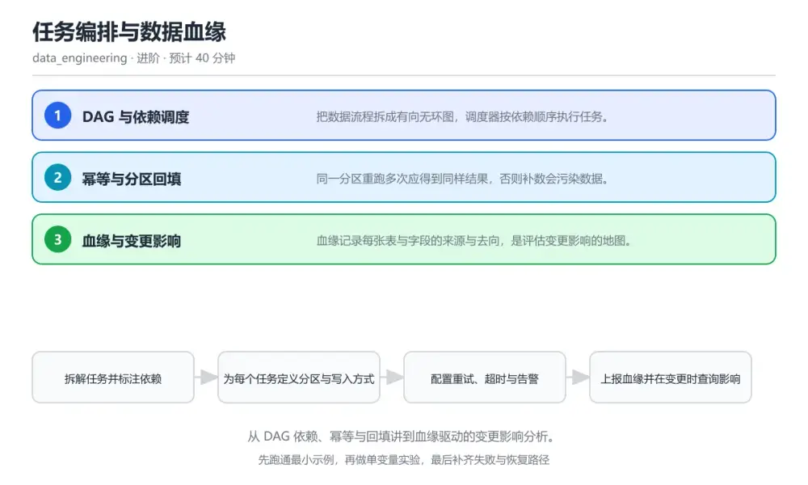
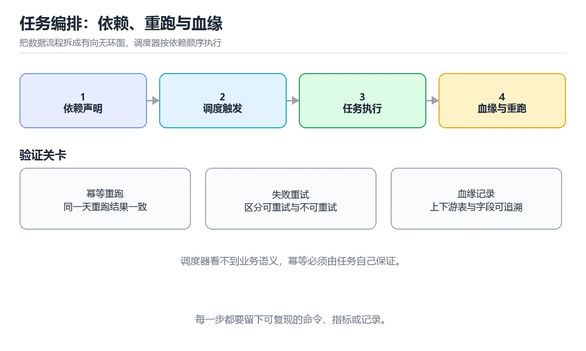

# 任务编排与数据血缘

> 内容更新时间：2026-10-06 · 学习阶段：进阶 · 预计用时：40 分钟

分类：data_engineering。关键词：调度、DAG、幂等、回填、数据血缘。从 DAG 依赖、幂等与回填讲到血缘驱动的变更影响分析。



## 本节知识框架

**课程定位**：所属分类 `data_engineering`（数据工程），课程主题 `任务编排与数据血缘`，学习阶段 进阶，建议用时 40 分钟。

本课主线：从 DAG 依赖、幂等与回填讲到血缘驱动的变更影响分析。

**学完本课应当能够**
- 说清 `DAG` 与 `幂等` 的含义与区别，并各举一个正例和一个反例。
- 用本课示例验证 `回填` 的行为，记录输入、输出与失败条件。
- 遇到「重跑后指标翻倍」这类问题时，能说出触发条件与修复顺序。

### 从概念到验证的学习链条

1. `DAG`：先掌握 有向无环图，描述任务与依赖关系，再用它解释 `幂等` 为什么会出现。
2. `幂等`：先掌握 同一任务重跑多次结果保持一致，再用它解释 `回填` 为什么会出现。
3. `回填`：先掌握 对历史分区重新执行任务以补齐数据，再用它解释 `血缘` 为什么会出现。
4. `血缘`：先掌握 记录数据来源与流向的关系图谱，再用它解释 `分区` 为什么会出现。
5. `分区`：先掌握 按时间或维度切分的数据集合，是重跑的最小单位，再用它解释 本课示例的观察结果 为什么会出现。

**先修与衔接**：本课是「数据工程」分类的第 4 课。当前没有登记显式先修或后续课程；课程主线是从 DAG 依赖、幂等与回填讲到血缘驱动的变更影响分析。学完后按 `data_engineering` 分类顺序继续。

### 完成判据

- **定义关**：不看正文也能说明 `DAG` 是 有向无环图，描述任务与依赖关系，并指出一个反例。
- **机制关**：能按“输入 → 转换 → 输出 → 验证”复述 `任务编排与数据血缘`，而不是只背结论。
- **示例关**：能运行或推演 `任务编排与数据血缘` 的 `text` 示例，并说明一个真实出现的标识符或字面量。
- **证据关**：能从 `任务编排与数据血缘` 的示例写出一个输入、处理、输出三元组，并说明它支持或反驳了本课的哪一条结论。
- **排错关**：能复现 重跑后指标翻倍，记录现象并按 改为按分区覆盖写或按主键合并，重跑前校验行数与主键唯一性 修复。
- **迁移关**：能把 `调度`、`DAG`、`幂等`、`回填` 放进一个与 `任务编排与数据血缘` 不同的项目场景，并保持输入与验证条件可追踪。
- **复盘关**：学完 `任务编排与数据血缘` 后，用一句话写下仍然不确定的结论，并列出下一次验证需要的输入、环境和成功判据。

### 复习清单

- [ ] 能不看正文复述本课核心术语，并指出一个边界或反例。
- [ ] 能运行或推演本课示例，记录输入、输出与失败现象。
- [ ] 能完成一次自测，并把错题对照错误表定位原因。

**本课配图**



## 核心概念定义

| 术语 | 操作性定义 | 常见边界与风险 |
| --- | --- | --- |
| DAG | 有向无环图，描述任务与依赖关系。 | 不同版本与依赖组合的行为可能不同，升级或换环境前要按官方变更说明重新验证。 |
| 幂等 | 同一任务重跑多次结果保持一致。 | 隔离级别与并发事务会影响可见性，换级别或换存储引擎后要重新验证。 |
| 回填 | 对历史分区重新执行任务以补齐数据。 | 只在「对历史分区重新执行任务以补齐数据」这一前提下成立，换输入或换环境要重新验证。 |
| 血缘 | 记录数据来源与流向的关系图谱。 | 易错：血缘只在文档里手工维护，早已过期；正确做法是由任务运行自动上报血缘，变更单附上下游影响清单一起评审。 |
| 分区 | 按时间或维度切分的数据集合，是重跑的最小单位。 | 易错：任务用追加方式写入且没有去重键；正确做法是改为按分区覆盖写或按主键合并，重跑前校验行数与主键唯一性。 |

## 原理与运行机制

### 机制总览

| 阶段 | 关注对象 | 失败时应检查 |
| --- | --- | --- |
| 输入 | DAG | 类型、范围、编码、版本或前置状态是否满足定义。 |
| 处理 | 幂等 | 顺序、可见性、锁、路由、事务或调度规则是否被破坏。 |
| 输出 | 回填 | 结果是否可复现，错误是否被正确传播而不是被吞掉。 |

**教材衔接：核心知识**

### 1. DAG 与依赖调度

把数据流程拆成有向无环图，调度器按依赖顺序执行任务。

每个任务声明上游依赖与调度周期，调度器在依赖全部成功后触发下游，失败按策略重试并记录状态。

在任务编排与数据血缘里可以这样验证：在本课示例里把抽取、清洗、汇总串成三条依赖，观察上游失败时下游保持等待。

边界：任务之间通过时间隐式对齐而不是显式依赖，上游延迟时下游会读到不完整数据。

工程视角：依赖写成显式边，任务声明数据分区参数，避免用「跑成功了」代替「数据齐了」。

### 2. 幂等与分区回填

同一分区重跑多次应得到同样结果，否则补数会污染数据。

任务以分区为单位写入，写入前覆盖或按主键合并该分区，天然可重入；回填时按历史分区逐个重跑。

在任务编排与数据血缘里可以这样验证：在本课示例里对同一天分区连续执行两次，观察行数与聚合值保持一致。

边界：追加写入且没有去重键的任务重跑会翻倍，指标随时间单调虚高。

工程视角：所有写入任务声明覆盖键或合并键，并在提交前做行数与主键唯一性校验。

### 3. 血缘与变更影响

血缘记录每张表与字段的来源与去向，是评估变更影响的地图。

任务运行时上报输入输出表与字段映射，血缘服务据此构建图谱，字段级血缘还能回答某一列的来源。

在任务编排与数据血缘里可以这样验证：在本课示例里修改一个上游字段类型，用血缘列出受影响的下游任务清单。

边界：只在文档里维护血缘会迅速过期，与实际运行脱节的说明比没有更危险。

工程视角：血缘由任务运行自动上报，并把每次变更的下游清单附在变更单里一起评审。

**教材衔接：关键流程**

```text
拆解任务并标注依赖 → 为每个任务定义分区与写入方式 → 配置重试、超时与告警 → 上报血缘并在变更时查询影响 → 用一次回填验证幂等
```

1. 拆解任务并标注依赖
2. 为每个任务定义分区与写入方式
3. 配置重试、超时与告警
4. 上报血缘并在变更时查询影响
5. 用一次回填验证幂等

### 机制拆解：每一步的输入、动作与输出

#### 1. `DAG`
- 输入：`调度`；本步把 有向无环图，描述任务与依赖关系 当作判断规则。
- 动作：围绕 `DAG` 保留中间状态，并记录它与 `幂等` 的对应关系。
- 输出：`幂等`，它可以被下一段代码、测试或记录继续使用。
- `DAG` 的失败条件：不同版本与依赖组合的行为可能不同，升级或换环境前要按官方变更说明重新验证。

#### 2. `幂等`
- 输入：`DAG`；本步把 同一任务重跑多次结果保持一致 当作判断规则。
- 动作：围绕 `幂等` 保留中间状态，并记录它与 `回填` 的对应关系。
- 输出：`回填`，它可以被下一段代码、测试或记录继续使用。
- `幂等` 的失败条件：隔离级别与并发事务会影响可见性，换级别或换存储引擎后要重新验证。

#### 3. `回填`
- 输入：`幂等`；本步把 对历史分区重新执行任务以补齐数据 当作判断规则。
- 动作：围绕 `回填` 保留中间状态，并记录它与 `血缘` 的对应关系。
- 输出：`血缘`，它可以被下一段代码、测试或记录继续使用。
- `回填` 的失败条件：只在「对历史分区重新执行任务以补齐数据」这一前提下成立，换输入或换环境要重新验证。

#### 4. `血缘`
- 输入：`回填`；本步把 记录数据来源与流向的关系图谱 当作判断规则。
- 动作：围绕 `血缘` 保留中间状态，并记录它与 `分区` 的对应关系。
- 输出：`分区`，它可以被下一段代码、测试或记录继续使用。
- `血缘` 的失败条件：当变更影响无法评估时，会出现血缘只在文档里手工维护，早已过期。

#### 5. `分区`
- 输入：`血缘`；本步把 按时间或维度切分的数据集合，是重跑的最小单位 当作判断规则。
- 动作：围绕 `分区` 保留中间状态，并记录它与 `本课示例的最终结果` 的对应关系。
- 输出：`本课示例的最终结果`，它可以被下一段代码、测试或记录继续使用。
- `分区` 的失败条件：当重跑后指标翻倍时，会出现任务用追加方式写入且没有去重键。

### 复现实验记录

- 环境：`任务编排与数据血缘` 使用 `text` 示例，固定 `调度`、`DAG`、`幂等`、`回填` 作为第一组条件。
- 首轮输入：从示例中的第一个输入开始，预测 `DAG` 会怎样变化。
- 基线观察：记录命令、输入、输出和错误原文，不用截图代替可复制的文本。
- 单变量修改：只改变 `调度`，观察 `分区` 是否仍满足定义。
- 失败注入：复现 重跑后指标翻倍，确认现象是 任务用追加方式写入且没有去重键。
- 记录结论：把“修改前、修改后、预期变化、实际变化”写成四列表，这样复盘 `任务编排与数据血缘` 时才能区分概念错误与实现错误。

## 典型应用场景

**教材衔接：深度拓展与实战**

### 机制拆解 1：DAG 与依赖调度

每个任务声明上游依赖与调度周期，调度器在依赖全部成功后触发下游，失败按策略重试并记录状态。

落地时先确认前提：任务之间通过时间隐式对齐而不是显式依赖，上游延迟时下游会读到不完整数据。再把结论写进检查表，让下一位同学可以按同样的输入复现。

工程做法：依赖写成显式边，任务声明数据分区参数，避免用「跑成功了」代替「数据齐了」。

### 机制拆解 2：幂等与分区回填

任务以分区为单位写入，写入前覆盖或按主键合并该分区，天然可重入；回填时按历史分区逐个重跑。

落地时先确认前提：追加写入且没有去重键的任务重跑会翻倍，指标随时间单调虚高。再把结论写进检查表，让下一位同学可以按同样的输入复现。

工程做法：所有写入任务声明覆盖键或合并键，并在提交前做行数与主键唯一性校验。

### 机制拆解 3：血缘与变更影响

任务运行时上报输入输出表与字段映射，血缘服务据此构建图谱，字段级血缘还能回答某一列的来源。

落地时先确认前提：只在文档里维护血缘会迅速过期，与实际运行脱节的说明比没有更危险。再把结论写进检查表，让下一位同学可以按同样的输入复现。

工程做法：血缘由任务运行自动上报，并把每次变更的下游清单附在变更单里一起评审。

### 机制对照表

| 概念 | 解决什么问题 | 关键前提 | 失败信号 |
| --- | --- | --- | --- |
| DAG 与依赖调度 | 把数据流程拆成有向无环图，调度器按依赖顺序执行任务。 | 任务之间通过时间隐式对齐而不是显式依赖，上游延迟时下游会读到不完整数据。 | 依赖写成显式边，任务声明数据分区参数，避免用「跑成功了」代替「数据齐了」 |
| 幂等与分区回填 | 同一分区重跑多次应得到同样结果，否则补数会污染数据。 | 追加写入且没有去重键的任务重跑会翻倍，指标随时间单调虚高。 | 所有写入任务声明覆盖键或合并键，并在提交前做行数与主键唯一性校验。 |
| 血缘与变更影响 | 血缘记录每张表与字段的来源与去向，是评估变更影响的地图。 | 只在文档里维护血缘会迅速过期，与实际运行脱节的说明比没有更危险。 | 血缘由任务运行自动上报，并把每次变更的下游清单附在变更单里一起评审。 |

### 自测问答

**问 1**：回填历史数据前最重要的前置条件是？

**答**：任务对同一分区可重复执行且结果一致。回填本质是对历史分区重跑，任务必须幂等，否则每补一天就把数据重复一遍，后续修复成本极高。 正确选项「任务对同一分区可重复执行且结果一致」对应《任务编排与数据血缘》的要点「DAG 与依赖调度」：把数据流程拆成有向无环图，调度器按依赖顺序执行任务。判断「DAG 与依赖调度」时先确认前提是否成立，再回到《任务编排与数据血缘》的示例核对一次；把别的语言或框架的默认做法直接搬到DAG 与依赖调度上，往往会在本课的边界条件里失效。

**问 2**：用时间对齐而不是显式依赖连接任务，最典型的后果是？

**答**：上游延迟时下游读到不完整数据。时间对齐假设上游总能按时完成，一旦延迟，下游照常启动就会读到不完整的分区数据。 正确选项「上游延迟时下游读到不完整数据」对应《任务编排与数据血缘》的要点「幂等与分区回填」：同一分区重跑多次应得到同样结果，否则补数会污染数据。判断「幂等与分区回填」时先确认前提是否成立，再回到《任务编排与数据血缘》的示例核对一次；借鉴相邻主题的经验之前，先核对幂等与分区回填的前提是否成立。

**问 3**：一套可运营的调度系统应该具备哪些能力？（多选）

**答**：失败重试与超时控制；分区级重跑；血缘与影响分析。重试、分区重跑与血缘是排障与变更的基础；静默跳过失败任务只会把问题推迟到更靠后的环节。 正确选项「失败重试与超时控制；分区级重跑；血缘与影响分析」对应《任务编排与数据血缘》的要点「血缘与变更影响」：血缘记录每张表与字段的来源与去向，是评估变更影响的地图。判断「血缘与变更影响」时先确认前提是否成立，再回到《任务编排与数据血缘》的示例核对一次；记住血缘与变更影响的结论之外还要记住适用条件，换一个输入往往就不成立了。

**问 4**：请按一次上游字段变更的处理顺序排列。

**答**：在变更单里描述字段变更。先描述变更，再用血缘锁定影响面，逐项验证兼容后灰度发布，最后把确认过的结论写回契约与文档。 正确选项「在变更单里描述字段变更；查询血缘得到下游清单；逐个下游验证兼容性；灰度发布并观察指标；更新文档与契约」对应《任务编排与数据血缘》的要点「DAG 与依赖调度」：把数据流程拆成有向无环图，调度器按依赖顺序执行任务。判断「DAG 与依赖调度」时先确认前提是否成立，再回到《任务编排与数据血缘》的示例核对一次；干扰项常常是相邻主题里成立的结论，只有按DAG 与依赖调度的输入与约束判断才能排除。

**问 5**：阅读这段任务代码，主要风险是什么？

**答**：追加写且无去重，重跑将产生重复行。追加写使任务不具备幂等性，任何一次重跑都会把同一批数据再写一遍，应改为覆盖写或按主键合并。 正确选项「追加写且无去重，重跑将产生重复行」对应《任务编排与数据血缘》的要点「幂等与分区回填」：同一分区重跑多次应得到同样结果，否则补数会污染数据。判断「幂等与分区回填」时先确认前提是否成立，再回到《任务编排与数据血缘》的示例核对一次；把幂等与分区回填的做法换到别的约束下未必成立，先确认边界再决定答案。


### 工程检查表

- [ ] 拆解任务并标注依赖
- [ ] 为每个任务定义分区与写入方式
- [ ] 配置重试、超时与告警
- [ ] 上报血缘并在变更时查询影响
- [ ] 用一次回填验证幂等
- [ ] 【DAG 与依赖调度】依赖写成显式边，任务声明数据分区参数，避免用「跑成功了」代替「数据齐了」。
- [ ] 【幂等与分区回填】所有写入任务声明覆盖键或合并键，并在提交前做行数与主键唯一性校验。
- [ ] 【血缘与变更影响】血缘由任务运行自动上报，并把每次变更的下游清单附在变更单里一起评审。


### 结论与下一步

- **重跑后指标翻倍**：典型现象是任务用追加方式写入且没有去重键；正确做法是改为按分区覆盖写或按主键合并，重跑前校验行数与主键唯一性。
- **下游读到半成品**：典型现象是任务之间靠时间隐式对齐，上游延迟下游照常启动；正确做法是依赖改成显式边并校验输入分区完整性，不完整就等待或失败。
- **变更影响无法评估**：典型现象是血缘只在文档里手工维护，早已过期；正确做法是由任务运行自动上报血缘，变更单附上下游影响清单一起评审。

### 最小验证场景

- 准备：保留 `text` 示例的原始输入，先记录 `任务编排与数据血缘` 的基线输出和完整运行命令。
- 判定：新结果与 `任务编排与数据血缘` 的基线不同不等于错误；只有当差异破坏了 `DAG` 的定义或错误表中的约束，才判定为失败。

### 选择与边界

- 使用 `DAG` 时，先满足它的定义：有向无环图，描述任务与依赖关系；不同版本与依赖组合的行为可能不同，升级或换环境前要按官方变更说明重新验证。
- 使用 `幂等` 时，先满足它的定义：同一任务重跑多次结果保持一致；隔离级别与并发事务会影响可见性，换级别或换存储引擎后要重新验证。
- 使用 `回填` 时，先满足它的定义：对历史分区重新执行任务以补齐数据；只在「对历史分区重新执行任务以补齐数据」这一前提下成立，换输入或换环境要重新验证。
- 使用 `血缘` 时，先满足它的定义：记录数据来源与流向的关系图谱；易错：血缘只在文档里手工维护，早已过期；正确做法是由任务运行自动上报血缘，变更单附上下游影响清单一起评审。
- 使用 `分区` 时，先满足它的定义：按时间或维度切分的数据集合，是重跑的最小单位；易错：任务用追加方式写入且没有去重键；正确做法是改为按分区覆盖写或按主键合并，重跑前校验行数与主键唯一性。

## 代码/协议/SQL 示例

### 最小可验证示例

```text
拆解任务并标注依赖 → 为每个任务定义分区与写入方式 → 配置重试、超时与告警 → 上报血缘并在变更时查询影响 → 用一次回填验证幂等
```

**教材衔接：原文最小示例**

```text
拆解任务并标注依赖 → 为每个任务定义分区与写入方式 → 配置重试、超时与告警 → 上报血缘并在变更时查询影响 → 用一次回填验证幂等
```

```python
from datetime import timedelta
from airflow import DAG
from airflow.operators.python import PythonOperator

with DAG(
    dag_id="orders_daily",
    schedule="0 2 * * *",
    start_date=None,
    catchup=True,
    default_args={"retries": 2, "retry_delay": timedelta(minutes=5)},
    tags=["orders", "daily"],
) as dag:
    def extract(ds: str):
        # 按分区抽取：同一个 ds 重跑会覆盖同一份输出
        write_partition(f"raw/orders/dt={ds}", read_source(ds))

    def transform(ds: str):
        # 覆盖写目标分区，保证幂等
        rows = dedup_by_order_id(read_partition(f"raw/orders/dt={ds}"))
        write_partition(f"dwd/orders/dt={ds}", rows, mode="overwrite")

    def publish(ds: str):
        rows = read_partition(f"dwd/orders/dt={ds}")
        assert row_count(rows) > 0, "空分区不允许发布"
        write_partition(f"ads/orders_daily/dt={ds}", aggregate(rows), mode="overwrite")

    t1 = PythonOperator(task_id="extract", python_callable=extract, op_args=["{{ ds }}"])
    t2 = PythonOperator(task_id="transform", python_callable=transform, op_args=["{{ ds }}"])
    t3 = PythonOperator(task_id="publish", python_callable=publish, op_args=["{{ ds }}"])
    t1 >> t2 >> t3
```

### 示例精读：先找证据，再改一个条件

- 在 `任务编排与数据血缘` 中与 `DAG` 对照：示例必须能支持 有向无环图，描述任务与依赖关系，否则说明这一段还缺少实现或验证步骤。
- 在 `任务编排与数据血缘` 中与 `幂等` 对照：示例必须能支持 同一任务重跑多次结果保持一致，否则说明这一段还缺少实现或验证步骤。
- 在 `任务编排与数据血缘` 中与 `回填` 对照：示例必须能支持 对历史分区重新执行任务以补齐数据，否则说明这一段还缺少实现或验证步骤。
- 在 `任务编排与数据血缘` 中与 `血缘` 对照：示例必须能支持 记录数据来源与流向的关系图谱，否则说明这一段还缺少实现或验证步骤。
- `任务编排与数据血缘` 的示例没有抽取到函数调用或字面量；按行记录输入、控制流和输出，避免只背代码外形。

## 时间/空间复杂度或性能分析

**性能关注点（任务编排与数据血缘）**：批处理看吞吐、流处理看延迟：分别记录端到端延迟、背压情况与资源占用。

**测量方法**：以 `任务编排与数据血缘` 的 `调度` 场景为对象，固定输入跑一遍记录基线，再把规模或并发度提高一个数量级复测；两次结果的差值与波动范围才是结论依据。

### 需要控制的变量与记录项

- `任务编排与数据血缘` 的 `调度`：固定它的版本、输入范围和资源上限，分别记录速度、内存与失败率的变化。
- `任务编排与数据血缘` 的 `DAG`：固定它的版本、输入范围和资源上限，分别记录速度、内存与失败率的变化。
- `任务编排与数据血缘` 的 `幂等`：固定它的版本、输入范围和资源上限，分别记录速度、内存与失败率的变化。
- `任务编排与数据血缘` 的 `回填`：固定它的版本、输入范围和资源上限，分别记录速度、内存与失败率的变化。
- `任务编排与数据血缘` 的 `数据血缘`：固定它的版本、输入范围和资源上限，分别记录速度、内存与失败率的变化。
- `任务编排与数据血缘` 中 `DAG` 的边界：不同版本与依赖组合的行为可能不同，升级或换环境前要按官方变更说明重新验证。达到边界时不要外推，必须重新测量。
- `任务编排与数据血缘` 中 `幂等` 的边界：隔离级别与并发事务会影响可见性，换级别或换存储引擎后要重新验证。达到边界时不要外推，必须重新测量。
- `任务编排与数据血缘` 中 `回填` 的边界：只在「对历史分区重新执行任务以补齐数据」这一前提下成立，换输入或换环境要重新验证。达到边界时不要外推，必须重新测量。
- `任务编排与数据血缘` 中 `血缘` 的边界：易错：血缘只在文档里手工维护，早已过期；正确做法是由任务运行自动上报血缘，变更单附上下游影响清单一起评审。达到边界时不要外推，必须重新测量。
- `任务编排与数据血缘` 中 `分区` 的边界：易错：任务用追加方式写入且没有去重键；正确做法是改为按分区覆盖写或按主键合并，重跑前校验行数与主键唯一性。达到边界时不要外推，必须重新测量。

## 常见误区与易错点

| 容易写错的做法 | 实际现象 | 原因与正确做法 |
| --- | --- | --- |
| 重跑后指标翻倍 | 任务用追加方式写入且没有去重键。 | 改为按分区覆盖写或按主键合并，重跑前校验行数与主键唯一性。 |
| 下游读到半成品 | 任务之间靠时间隐式对齐，上游延迟下游照常启动。 | 依赖改成显式边并校验输入分区完整性，不完整就等待或失败。 |
| 变更影响无法评估 | 血缘只在文档里手工维护，早已过期。 | 由任务运行自动上报血缘，变更单附上下游影响清单一起评审。 |

### 现场 1：重跑后指标翻倍

**症状**：任务用追加方式写入且没有去重键。

**根因与修复**：改为按分区覆盖写或按主键合并，重跑前校验行数与主键唯一性。

**自检**：在本课示例里复现「重跑后指标翻倍」，改成改为按分区覆盖写或按主键合并，重跑前校验行数与主键唯一性后重跑；如果症状消失且失败路径按预期变化，说明定位正确。

### 现场 2：下游读到半成品

**症状**：任务之间靠时间隐式对齐，上游延迟下游照常启动。

**根因与修复**：依赖改成显式边并校验输入分区完整性，不完整就等待或失败。

**自检**：在本课示例里复现「下游读到半成品」，改成依赖改成显式边并校验输入分区完整性，不完整就等待或失败后重跑；如果症状消失且失败路径按预期变化，说明定位正确。

### 现场 3：变更影响无法评估

**症状**：血缘只在文档里手工维护，早已过期。

**根因与修复**：由任务运行自动上报血缘，变更单附上下游影响清单一起评审。

**自检**：在本课示例里复现「变更影响无法评估」，改成由任务运行自动上报血缘，变更单附上下游影响清单一起评审后重跑；如果症状消失且失败路径按预期变化，说明定位正确。

## 与其他知识点的关系

**教材衔接：复习与迁移**


### 迁移练习

- **术语归属**：`DAG`、`幂等`、`回填` 的定义以本课「核心概念定义」为准，换到其他课程时先确认定义是否被改写。

### 容易混淆的相邻概念

- `DAG` 与 `幂等`：前者强调 有向无环图，描述任务与依赖关系；后者强调 同一任务重跑多次结果保持一致。判断时分别检查两条定义的适用范围，不要只看名称相似就互换。
- `幂等` 与 `回填`：前者强调 同一任务重跑多次结果保持一致；后者强调 对历史分区重新执行任务以补齐数据。判断时分别检查两条定义的适用范围，不要只看名称相似就互换。
- `回填` 与 `血缘`：前者强调 对历史分区重新执行任务以补齐数据；后者强调 记录数据来源与流向的关系图谱。判断时分别检查两条定义的适用范围，不要只看名称相似就互换。
- `血缘` 与 `分区`：前者强调 记录数据来源与流向的关系图谱；后者强调 按时间或维度切分的数据集合，是重跑的最小单位。判断时分别检查两条定义的适用范围，不要只看名称相似就互换。

## 自测题与参考答案

> 先独立作答，再对照参考答案；答案都能在本课正文、术语表或错误表里找到依据。

### 自测 1（概念复述）

不看正文，写出 `DAG` 的操作性定义，并说明它与 `幂等` 的区别。

**参考答案**：有向无环图，描述任务与依赖关系。

`幂等` 的定位是：同一任务重跑多次结果保持一致；两者的差别要从适用对象与失败模式上说明。

### 自测 2（排错）

本课错误表记录了「重跑后指标翻倍」这类做法。请写出它会出现的现象、根因，以及修复顺序。

**参考答案**：现象是任务用追加方式写入且没有去重键；正确做法是改为按分区覆盖写或按主键合并，重跑前校验行数与主键唯一性。修复时先复现现象并保留证据，再改动一处假设重跑，确认现象消失。

### 自测 3（动手验证）

运行本课的 `text` 示例，改动其中一个输入后重新运行，记录输出与错误信息。

**参考答案**：正常输入下 `text` 示例应当复现正文给出的结果；改动输入后，如果结果改变或报错，先核对它是否满足 `任务编排与数据血缘` 中`DAG` 的适用范围，再检查错误表里是否有同类现象。

### 自测 4（代码阅读）

阅读本课开头的 `text` 示例，说明它体现了`DAG` 的哪一条性质，并指出改动哪个输入会让这条性质不再成立。

**参考答案**：`DAG` 的定义是 有向无环图，描述任务与依赖关系，示例正是在实现这条定义。改动与 `DAG` 有关的一个输入后，如果结果不再符合 `任务编排与数据血缘` 的正文描述，就说明该性质只在当前前提成立。

### 自测 5（迁移）

把 `任务编排与数据血缘` 的方法迁移到自己的项目：围绕 `DAG` 写出一个与错误表同类的风险点，并说明触发条件和检验方式。

**参考答案**：例如「变更影响无法评估」，它会导致血缘只在文档里手工维护，早已过期；检验方式是按由任务运行自动上报血缘，变更单附上下游影响清单一起评审改一处再复现，确认现象消失且没有引入新的失败分支。

### 自测 6（对比）

用一个表格对比 `DAG` 与 `幂等`：各写一行适用场景、一行失败表现。

**参考答案**：`DAG` 的定义是有向无环图，描述任务与依赖关系；`幂等` 的定义是同一任务重跑多次结果保持一致。两者的失败表现分别对应本课错误表里与本术语相关的行。

### 自测 7（排错顺序）

面对「重跑后指标翻倍」引发的问题，请把“复现 任务用追加方式写入且没有去重键 → 保留证据 → 改为按分区覆盖写或按主键合并，重跑前校验行数与主键唯一性 → 回归验证”四步写成可执行的检查清单。

**参考答案**：第一步按任务用追加方式写入且没有去重键复现；第二步记录输入、版本与完整报错；第三步按改为按分区覆盖写或按主键合并，重跑前校验行数与主键唯一性只改一处；第四步重跑并确认失败路径也按预期变化。

### 自测 8（边界判断）

针对 `分区`，分别写出“可以使用”的条件和“结论不再成立”的条件。

**参考答案**：易错：任务用追加方式写入且没有去重键；正确做法是改为按分区覆盖写或按主键合并，重跑前校验行数与主键唯一性。 同时要把 `分区` 的定义 按时间或维度切分的数据集合，是重跑的最小单位 与实际输入逐项对照。

### 自测 9（机制重建）

不看正文，按输入、转换、输出、验证四段重建 `DAG` → `幂等` → `回填` → `血缘` 的作用链。

**参考答案**：起点是 `DAG` 的定义 有向无环图，描述任务与依赖关系；中间每一步都保留可观察状态；终点由 `分区` 检查，失败时回到错误表定位第一个偏离定义的步骤。

### 自测 10（综合排错）

在 `任务编排与数据血缘` 中，现象是 血缘只在文档里手工维护，早已过期。请围绕 变更影响无法评估 写出最小复现、关键证据、修复动作和回归验证，并说明为什么不能只凭一次运行下结论。

**参考答案**：先复现 变更影响无法评估，记录输入与完整错误；再按 由任务运行自动上报血缘，变更单附上下游影响清单一起评审 只改一处。回归时同时跑正常路径和边界路径，只有两次结果都可解释，才把修复视为完成。

### 自测 11（一分钟复述）

用每分钟约 200 字的速度复述 `任务编排与数据血缘`：先给主问题，再按顺序说出 `DAG`、`幂等`、`回填`、`血缘`，最后给一个失败案例。

**自评标准**：主问题必须对应 从 DAG 依赖、幂等与回填讲到血缘驱动的变更影响分析；每个术语都要能接上一句定义或边界；失败案例必须写成可观察现象，不能用“可能有风险”代替证据。

## 术语速查

| 术语 | 一句话说明 |
| --- | --- |
| `DAG` | 有向无环图，描述任务与依赖关系。 |
| `幂等` | 同一任务重跑多次结果保持一致。 |
| `回填` | 对历史分区重新执行任务以补齐数据。 |
| `血缘` | 记录数据来源与流向的关系图谱。 |
| `分区` | 按时间或维度切分的数据集合，是重跑的最小单位。 |

**术语关系**：`DAG`（有向无环图） → `幂等`（同一任务重跑多次结果保持一致） → `回填`（对历史分区重新执行任务以补齐数据） → `血缘`（记录数据来源与流向的关系图谱）。

## 考点精讲

`任务编排与数据血缘` 的题库有 5 道题，下面逐题给出题干、正确项与判断依据：先自己作答，再核对正确项，最后回到正文对应小节复核。

### 考点 1：第 1 题

- **题目**：回填历史数据前最重要的前置条件是？
- **正确项**：任务对同一分区可重复执行且结果一致
- **判断依据**：这道题落在术语 `回填` 上：对历史分区重新执行任务以补齐数据。复习时把 `回填` 的定义、适用边界和一个反例一起说清楚，再回到「核心概念定义」核对原文。

### 考点 2：第 2 题

- **题目**：用时间对齐而不是显式依赖连接任务，最典型的后果是？
- **正确项**：上游延迟时下游读到不完整数据
- **判断依据**：这道题检验本课主问题：从 DAG 依赖、幂等与回填讲到血缘驱动的变更影响分析。复习时先复述本课主问题，再举一个会让结论失效的输入。

### 考点 3：第 3 题

- **题目**：一套可运营的调度系统应该具备哪些能力？（多选）
- **正确项**：失败重试与超时控制；分区级重跑；血缘与影响分析
- **判断依据**：这道题落在术语 `血缘` 上：记录数据来源与流向的关系图谱。复习时把 `血缘` 的定义、适用边界和一个反例一起说清楚，再回到「核心概念定义」核对原文。

### 考点 4：第 4 题

- **题目**：请按一次上游字段变更的处理顺序排列。
- **正确项**：在变更单里描述字段变更 → 查询血缘得到下游清单 → 逐个下游验证兼容性 → 灰度发布并观察指标 → 更新文档与契约
- **判断依据**：这道题落在术语 `血缘` 上：记录数据来源与流向的关系图谱。复习时把 `血缘` 的定义、适用边界和一个反例一起说清楚，再回到「核心概念定义」核对原文。

### 考点 5：第 5 题

- **题目**：阅读这段任务代码，主要风险是什么？
- **正确项**：追加写且无去重，重跑将产生重复行
- **判断依据**：这道题检验本课主问题：从 DAG 依赖、幂等与回填讲到血缘驱动的变更影响分析。复习时先复述本课主问题，再举一个会让结论失效的输入。

### 考点 6：`DAG`

- **要点**：有向无环图，描述任务与依赖关系。
- **DAG 的边界**：不同版本与依赖组合的行为可能不同，升级或换环境前要按官方变更说明重新验证。

### 考点 7：`幂等`

- **要点**：同一任务重跑多次结果保持一致。
- **幂等 的边界**：隔离级别与并发事务会影响可见性，换级别或换存储引擎后要重新验证。

### 考点 8：`回填`

- **要点**：对历史分区重新执行任务以补齐数据。
- **回填 的边界**：只在「对历史分区重新执行任务以补齐数据」这一前提下成立，换输入或换环境要重新验证。

### 考点 9：`血缘`

- **要点**：记录数据来源与流向的关系图谱。
- **血缘 的边界**：易错：血缘只在文档里手工维护，早已过期；正确做法是由任务运行自动上报血缘，变更单附上下游影响清单一起评审。

### 考点 10：`分区`

- **要点**：按时间或维度切分的数据集合，是重跑的最小单位。
- **分区 的边界**：易错：任务用追加方式写入且没有去重键；正确做法是改为按分区覆盖写或按主键合并，重跑前校验行数与主键唯一性。

### 考点 11：排错——重跑后指标翻倍

- **现象**：任务用追加方式写入且没有去重键。
- **处理**：改为按分区覆盖写或按主键合并，重跑前校验行数与主键唯一性。

### 考点 12：排错——下游读到半成品

- **现象**：任务之间靠时间隐式对齐，上游延迟下游照常启动。
- **处理**：依赖改成显式边并校验输入分区完整性，不完整就等待或失败。

### 考点 13：综合辨析——`DAG` 与 `分区`

- **辨析点**：`DAG` 的定义是 有向无环图，描述任务与依赖关系；`分区` 的定义是 按时间或维度切分的数据集合，是重跑的最小单位。
- **答题要求**：面对 `任务编排与数据血缘` 的题目，先判断描述的是 `DAG` 还是 `分区`，再归到对应定义，最后写出一个会让该定义失效的边界输入。

### 考点 14：排错评分点

- **现象分**：能写出 任务用追加方式写入且没有去重键，而不是只写“程序有错”。
- **证据分**：保留触发 重跑后指标翻倍 的输入、版本和错误原文。
- **修复分**：按 改为按分区覆盖写或按主键合并，重跑前校验行数与主键唯一性 只改一处，并同时回归正常路径与边界路径。

## 内容元数据

- 内容版本：v2.0
- 最后更新：2026-10-06
- 学习阶段：进阶

| 字段 | 值 |
| --- | --- |
| 课程 ID | `de_orchestration_lineage` |
| 所属分类 | `data_engineering` |
| 难度 | 进阶 |
| 预计用时 | 40 分钟 |
| 关键词 | 调度、DAG、幂等、回填、数据血缘 |
| 配图 | `images/lesson_de_orchestration_lineage.webp` |
| 参考资料 | 2 条 |
| 内容更新时间 | 2026-10-06 |

## 参考资料与复核

- 来源性质：官方文档、标准或权威教材；本课核对关键词：调度、DAG、幂等、回填、数据血缘。
- 最后复核：2026-10-04
- 下次复核：2027-01-10
- 复核范围：版本兼容、API 行为与工程实践

下面列出的资料用于核对本课结论，复习时可以对照阅读：
- [Apache Airflow 官方文档：DAG 与调度](https://airflow.apache.org/docs/apache-airflow/stable/core-concepts/dags.html)
- [OpenLineage 开放血缘标准](https://openlineage.io/docs/)

| [本课术语索引：任务编排与数据血缘](#核心概念定义) | 按本课输入、术语边界和错误表现逐项核对 |
> 复核提示：《任务编排与数据血缘》的结论如与资料冲突，以资料中的规范文本为准，并在笔记里记录差异与日期。