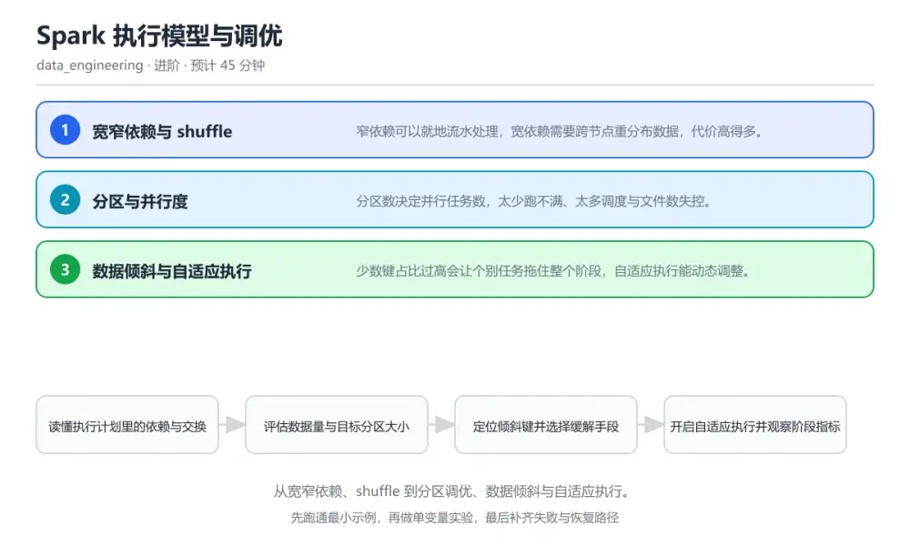
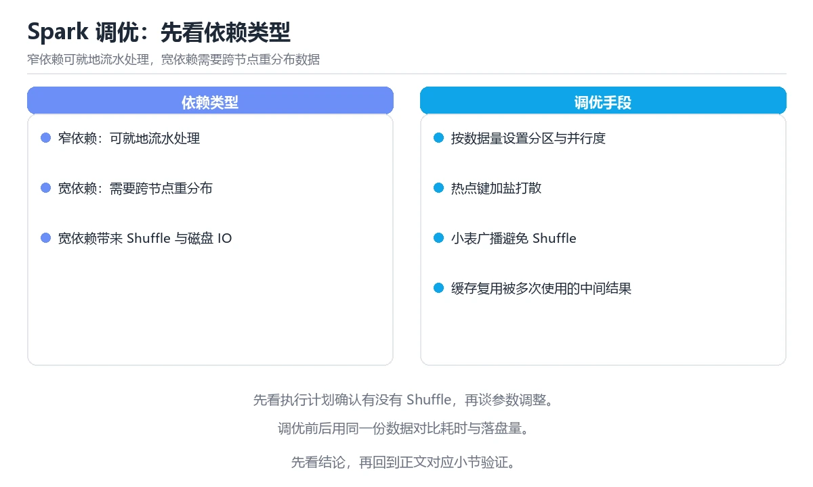

# Spark 执行模型与调优

> 内容更新时间：2026-10-06 · 学习阶段：进阶 · 预计用时：40 分钟

分类：data_engineering。关键词：Spark、shuffle、数据倾斜、分区、自适应执行。从宽窄依赖、shuffle 到分区调优、数据倾斜与自适应执行。



## 本节知识框架

**课程定位**：所属分类 `data_engineering`（数据工程），课程主题 `Spark 执行模型与调优`，学习阶段 进阶，建议用时 45 分钟。

本课主线：从宽窄依赖、shuffle 到分区调优、数据倾斜与自适应执行。

**学完本课应当能够**
- 说清 `窄依赖` 与 `宽依赖` 的含义与区别，并各举一个正例和一个反例。
- 用本课示例验证 `数据倾斜` 的行为，记录输入、输出与失败条件。
- 遇到「作业长时间卡在最后几个任务」这类问题时，能说出触发条件与修复顺序。

### 从概念到验证的学习链条

1. `窄依赖`：先掌握 子分区只依赖一个父分区，可流水执行，再用它解释 `宽依赖` 为什么会出现。
2. `宽依赖`：先掌握 子分区依赖多个父分区，需要 shuffle，再用它解释 `数据倾斜` 为什么会出现。
3. `数据倾斜`：先掌握 少数键的数据量远超其他键，导致任务时长不均，再用它解释 `自适应执行` 为什么会出现。
4. `自适应执行`：先掌握 运行期按实际数据量调整分区与关联策略，再用它解释 `广播关联` 为什么会出现。
5. `广播关联`：先掌握 把小表分发到每个任务本地，避免跨节点重分布，再用它解释 `分区` 为什么会出现。
6. `分区`：先掌握 分区数决定并行任务数，太少跑不满、太多调度与文件数失控，再用它解释 本课示例的观察结果 为什么会出现。

**先修与衔接**：本课是「数据工程」分类的第 6 课。当前没有登记显式先修或后续课程；课程主线是从宽窄依赖、shuffle 到分区调优、数据倾斜与自适应执行。学完后按 `data_engineering` 分类顺序继续。

### 完成判据

- **定义关**：不看正文也能说明 `窄依赖` 是 子分区只依赖一个父分区，可流水执行，并指出一个反例。
- **机制关**：能按“输入 → 转换 → 输出 → 验证”复述 `Spark 执行模型与调优`，而不是只背结论。
- **示例关**：能运行或推演 `Spark 执行模型与调优` 的 `text` 示例，并说明一个真实出现的标识符或字面量。
- **证据关**：能从 `Spark 执行模型与调优` 的示例写出一个输入、处理、输出三元组，并说明它支持或反驳了本课的哪一条结论。
- **排错关**：能复现 作业长时间卡在最后几个任务，记录现象并按 先统计分区大小找出热点键，开启自适应倾斜处理或对热点键加盐后再聚合 修复。
- **迁移关**：能把 `Spark`、`shuffle`、`数据倾斜`、`分区` 放进一个与 `Spark 执行模型与调优` 不同的项目场景，并保持输入与验证条件可追踪。
- **复盘关**：学完 `Spark 执行模型与调优` 后，用一句话写下仍然不确定的结论，并列出下一次验证需要的输入、环境和成功判据。

### 复习清单

- [ ] 能不看正文复述本课核心术语，并指出一个边界或反例。
- [ ] 能运行或推演本课示例，记录输入、输出与失败现象。
- [ ] 能完成一次自测，并把错题对照错误表定位原因。

**本课配图**



## 核心概念定义

| 术语 | 操作性定义 | 常见边界与风险 |
| --- | --- | --- |
| 窄依赖 | 子分区只依赖一个父分区，可流水执行。 | 易错：大表与小表按普通 join 关联；正确做法是确认小表可放入内存后使用广播关联，把宽依赖转成窄依赖。 |
| 宽依赖 | 子分区依赖多个父分区，需要 shuffle。 | 易错：大表与小表按普通 join 关联；正确做法是确认小表可放入内存后使用广播关联，把宽依赖转成窄依赖。 |
| 数据倾斜 | 少数键的数据量远超其他键，导致任务时长不均。 | 只在「少数键的数据量远超其他键，导致任务时长不均」这一前提下成立，换输入或换环境要重新验证。 |
| 自适应执行 | 运行期按实际数据量调整分区与关联策略。 | 只在「运行期按实际数据量调整分区与关联策略」这一前提下成立，换输入或换环境要重新验证。 |
| 广播关联 | 把小表分发到每个任务本地，避免跨节点重分布。 | 易错：大表与小表按普通 join 关联；正确做法是确认小表可放入内存后使用广播关联，把宽依赖转成窄依赖。 |
| 分区 | 分区数决定并行任务数，太少跑不满、太多调度与文件数失控 | 易错：按默认并行度执行且未处理热点键；正确做法是先统计分区大小找出热点键，开启自适应倾斜处理或对热点键加盐后再聚合。 |

## 原理与运行机制

### 机制总览

**教材衔接：核心知识**

### 1. 宽窄依赖与 shuffle

窄依赖可以就地流水处理，宽依赖需要跨节点重分布数据，代价高得多。

map、filter 等窄依赖在分区内完成；join、groupBy 等宽依赖先写 shuffle 文件，下游再按新分区拉取，磁盘与网络开销集中在这里。

在Spark 执行模型与调优里可以这样验证：在本课示例里分别执行一个 filter 和一个 groupBy，对比执行计划里是否出现 exchange。

边界：宽依赖不会因为数据量小就自动消失，小表也可能因为分区数过多产生大量调度开销。

工程视角：尽量把过滤与列裁剪下推到 shuffle 之前，减少参与重分布的数据量。

### 2. 分区与并行度

分区数决定并行任务数，太少跑不满、太多调度与文件数失控。

每个分区对应一个任务，任务大小与分区数共同决定总时长；输出文件数通常等于分区数，直接影响下游读取效率。

在Spark 执行模型与调优里可以这样验证：在本课示例里把分区数从 8 调到 400，观察任务时长、文件数与元数据开销的变化。

边界：盲目提高并行度会生成海量小文件，让下游读取与元数据服务承压。

工程视角：按数据量与单任务目标时长估算分区数，写出后按需合并小文件。

### 3. 数据倾斜与自适应执行

少数键占比过高会让个别任务拖住整个阶段，自适应执行能动态调整。

自适应执行在 shuffle 后按分区大小合并小分区并拆分超大分区，必要时对热点键加盐打散再聚合。

在Spark 执行模型与调优里可以这样验证：在本课示例里构造一个占比极高的键，对比开启自适应执行前后的阶段时长。

边界：加盐会改变输出键值，必须在二次聚合里还原，否则结果错误。

工程视角：把倾斜键清单纳入数据质量监控，长期存在的热点应在建模阶段处理。

**教材衔接：关键流程**

```text
读懂执行计划里的依赖与交换 → 评估数据量与目标分区大小 → 定位倾斜键并选择缓解手段 → 开启自适应执行并观察阶段指标 → 对比调整前后的时长与文件数
```

1. 读懂执行计划里的依赖与交换
2. 评估数据量与目标分区大小
3. 定位倾斜键并选择缓解手段
4. 开启自适应执行并观察阶段指标
5. 对比调整前后的时长与文件数

### 机制拆解：每一步的输入、动作与输出

#### 1. `窄依赖`
- 输入：`Spark`；本步把 子分区只依赖一个父分区，可流水执行 当作判断规则。
- 动作：围绕 `窄依赖` 保留中间状态，并记录它与 `宽依赖` 的对应关系。
- 输出：`宽依赖`，它可以被下一段代码、测试或记录继续使用。
- `窄依赖` 的失败条件：当小表关联也出现长 shuffle时，会出现大表与小表按普通 join 关联。

#### 2. `宽依赖`
- 输入：`窄依赖`；本步把 子分区依赖多个父分区，需要 shuffle 当作判断规则。
- 动作：围绕 `宽依赖` 保留中间状态，并记录它与 `数据倾斜` 的对应关系。
- 输出：`数据倾斜`，它可以被下一段代码、测试或记录继续使用。
- `宽依赖` 的失败条件：当小表关联也出现长 shuffle时，会出现大表与小表按普通 join 关联。

#### 3. `数据倾斜`
- 输入：`宽依赖`；本步把 少数键的数据量远超其他键，导致任务时长不均 当作判断规则。
- 动作：围绕 `数据倾斜` 保留中间状态，并记录它与 `自适应执行` 的对应关系。
- 输出：`自适应执行`，它可以被下一段代码、测试或记录继续使用。
- `数据倾斜` 的失败条件：只在「少数键的数据量远超其他键，导致任务时长不均」这一前提下成立，换输入或换环境要重新验证。

#### 4. `自适应执行`
- 输入：`数据倾斜`；本步把 运行期按实际数据量调整分区与关联策略 当作判断规则。
- 动作：围绕 `自适应执行` 保留中间状态，并记录它与 `广播关联` 的对应关系。
- 输出：`广播关联`，它可以被下一段代码、测试或记录继续使用。
- `自适应执行` 的失败条件：只在「运行期按实际数据量调整分区与关联策略」这一前提下成立，换输入或换环境要重新验证。

#### 5. `广播关联`
- 输入：`自适应执行`；本步把 把小表分发到每个任务本地，避免跨节点重分布 当作判断规则。
- 动作：围绕 `广播关联` 保留中间状态，并记录它与 `分区` 的对应关系。
- 输出：`分区`，它可以被下一段代码、测试或记录继续使用。
- `广播关联` 的失败条件：当小表关联也出现长 shuffle时，会出现大表与小表按普通 join 关联。

#### 6. `分区`
- 输入：`广播关联`；本步把 分区数决定并行任务数，太少跑不满、太多调度与文件数失控 当作判断规则。
- 动作：围绕 `分区` 保留中间状态，并记录它与 `本课示例的最终结果` 的对应关系。
- 输出：`本课示例的最终结果`，它可以被下一段代码、测试或记录继续使用。
- `分区` 的失败条件：当作业长时间卡在最后几个任务时，会出现按默认并行度执行且未处理热点键。

### 复现实验记录

- 环境：`Spark 执行模型与调优` 使用 `text` 示例，固定 `Spark`、`shuffle`、`数据倾斜`、`分区` 作为第一组条件。
- 首轮输入：从示例中的第一个输入开始，预测 `窄依赖` 会怎样变化。
- 基线观察：记录命令、输入、输出和错误原文，不用截图代替可复制的文本。
- 单变量修改：只改变 `Spark`，观察 `分区` 是否仍满足定义。
- 失败注入：复现 作业长时间卡在最后几个任务，确认现象是 按默认并行度执行且未处理热点键。
- 记录结论：把“修改前、修改后、预期变化、实际变化”写成四列表，这样复盘 `Spark 执行模型与调优` 时才能区分概念错误与实现错误。

## 典型应用场景

**教材衔接：深度拓展与实战**

### 机制拆解 1：宽窄依赖与 shuffle

map、filter 等窄依赖在分区内完成；join、groupBy 等宽依赖先写 shuffle 文件，下游再按新分区拉取，磁盘与网络开销集中在这里。

落地时先确认前提：宽依赖不会因为数据量小就自动消失，小表也可能因为分区数过多产生大量调度开销。再把结论写进检查表，让下一位同学可以按同样的输入复现。

工程做法：尽量把过滤与列裁剪下推到 shuffle 之前，减少参与重分布的数据量。

### 机制拆解 2：分区与并行度

每个分区对应一个任务，任务大小与分区数共同决定总时长；输出文件数通常等于分区数，直接影响下游读取效率。

落地时先确认前提：盲目提高并行度会生成海量小文件，让下游读取与元数据服务承压。再把结论写进检查表，让下一位同学可以按同样的输入复现。

工程做法：按数据量与单任务目标时长估算分区数，写出后按需合并小文件。

### 机制拆解 3：数据倾斜与自适应执行

自适应执行在 shuffle 后按分区大小合并小分区并拆分超大分区，必要时对热点键加盐打散再聚合。

落地时先确认前提：加盐会改变输出键值，必须在二次聚合里还原，否则结果错误。再把结论写进检查表，让下一位同学可以按同样的输入复现。

工程做法：把倾斜键清单纳入数据质量监控，长期存在的热点应在建模阶段处理。

### 机制对照表

| 概念 | 解决什么问题 | 关键前提 | 失败信号 |
| --- | --- | --- | --- |
| 宽窄依赖与 shuffle | 窄依赖可以就地流水处理，宽依赖需要跨节点重分布数据，代价高得多。 | 宽依赖不会因为数据量小就自动消失，小表也可能因为分区数过多产生大量调度开 | 尽量把过滤与列裁剪下推到 shuffle 之前，减少参与重分布的数据量。 |
| 分区与并行度 | 分区数决定并行任务数，太少跑不满、太多调度与文件数失控。 | 盲目提高并行度会生成海量小文件，让下游读取与元数据服务承压。 | 按数据量与单任务目标时长估算分区数，写出后按需合并小文件。 |
| 数据倾斜与自适应执行 | 少数键占比过高会让个别任务拖住整个阶段，自适应执行能动态调整。 | 加盐会改变输出键值，必须在二次聚合里还原，否则结果错误。 | 把倾斜键清单纳入数据质量监控，长期存在的热点应在建模阶段处理。 |

### 自测问答

**问 1**：执行计划里出现 exchange 通常意味着什么？

**答**：触发了跨节点数据重分布。exchange 表示 shuffle，数据需要按新分区跨节点重分布，是作业中最昂贵的环节之一。 正确选项「触发了跨节点数据重分布」对应《Spark 执行模型与调优》的要点「宽窄依赖与 shuffle」：窄依赖可以就地流水处理，宽依赖需要跨节点重分布数据，代价高得多。判断「宽窄依赖与 shuffle」时先确认前提是否成立，再回到《Spark 执行模型与调优》的示例核对一次；把别的语言或框架的默认做法直接搬到宽窄依赖与 shuffle上，往往会在本课的边界条件里失效。

**问 2**：少数任务明显慢于其他任务，最先应该检查的是？

**答**：是否存在数据倾斜的热点键。阶段里个别任务拖尾最常见的原因就是热点键导致分区大小悬殊，应先统计分区大小确认再优化。 正确选项「是否存在数据倾斜的热点键」对应《Spark 执行模型与调优》的要点「分区与并行度」：分区数决定并行任务数，太少跑不满、太多调度与文件数失控。判断「分区与并行度」时先确认前提是否成立，再回到《Spark 执行模型与调优》的示例核对一次；借鉴相邻主题的经验之前，先核对分区与并行度的前提是否成立。

**问 3**：降低 shuffle 成本的可行手段有哪些？（多选）

**答**：过滤与列裁剪下推到 shuffle 之前；小表使用广播关联；先聚合再关联。减少参与重分布的数据量、避免不必要的宽依赖、提前聚合都是有效手段；全量关联只会放大成本。 正确选项「过滤与列裁剪下推到 shuffle 之前；小表使用广播关联；先聚合再关联」对应《Spark 执行模型与调优》的要点「数据倾斜与自适应执行」：少数键占比过高会让个别任务拖住整个阶段，自适应执行能动态调整。判断「数据倾斜与自适应执行」时先确认前提是否成立，再回到《Spark 执行模型与调优》的示例核对一次；记住数据倾斜与自适应执行的结论之外还要记住适用条件，换一个输入往往就不成立了。

**问 4**：请按一次倾斜调优的实验顺序排列。

**答**：复现并记录阶段时长。先拿到可比基线，再定位热点，选择手段后重跑对比，最后把结论固化，避免同样的优化被反复讨论。 正确选项「复现并记录阶段时长；统计分区大小定位热点键；选择加盐或自适应策略；重跑并对比关键指标；把结论写入调优记录」对应《Spark 执行模型与调优》的要点「宽窄依赖与 shuffle」：窄依赖可以就地流水处理，宽依赖需要跨节点重分布数据，代价高得多。判断「宽窄依赖与 shuffle」时先确认前提是否成立，再回到《Spark 执行模型与调优》的示例核对一次；干扰项常常是相邻主题里成立的结论，只有按宽窄依赖与 shuffle的输入与约束判断才能排除。

**问 5**：阅读这段代码，输出的关联结果有什么风险？

**答**：加盐后没有二次聚合，同一键会产生多行。加盐把同一键拆成多行，若不在后续步骤按原键再次聚合，输出里同一业务键会出现多行，统计结果随之偏大。 正确选项「加盐后没有二次聚合，同一键会产生多行」对应《Spark 执行模型与调优》的要点「分区与并行度」：分区数决定并行任务数，太少跑不满、太多调度与文件数失控。判断「分区与并行度」时先确认前提是否成立，再回到《Spark 执行模型与调优》的示例核对一次；把分区与并行度的做法换到别的约束下未必成立，先确认边界再决定答案。


### 工程检查表

- [ ] 读懂执行计划里的依赖与交换
- [ ] 评估数据量与目标分区大小
- [ ] 定位倾斜键并选择缓解手段
- [ ] 开启自适应执行并观察阶段指标
- [ ] 对比调整前后的时长与文件数
- [ ] 【宽窄依赖与 shuffle】尽量把过滤与列裁剪下推到 shuffle 之前，减少参与重分布的数据量。
- [ ] 【分区与并行度】按数据量与单任务目标时长估算分区数，写出后按需合并小文件。
- [ ] 【数据倾斜与自适应执行】把倾斜键清单纳入数据质量监控，长期存在的热点应在建模阶段处理。


### 结论与下一步

- **作业长时间卡在最后几个任务**：典型现象是按默认并行度执行且未处理热点键；正确做法是先统计分区大小找出热点键，开启自适应倾斜处理或对热点键加盐后再聚合。
- **输出产生大量小文件**：典型现象是分区数设置过大且没有写入前合并；正确做法是按数据量估算合理分区数，写出前合并小文件或按目标文件大小重分区。
- **小表关联也出现长 shuffle**：典型现象是大表与小表按普通 join 关联；正确做法是确认小表可放入内存后使用广播关联，把宽依赖转成窄依赖。

### 最小验证场景

- 准备：保留 `text` 示例的原始输入，先记录 `Spark 执行模型与调优` 的基线输出和完整运行命令。
- 判定：新结果与 `Spark 执行模型与调优` 的基线不同不等于错误；只有当差异破坏了 `窄依赖` 的定义或错误表中的约束，才判定为失败。

### 选择与边界

- 使用 `窄依赖` 时，先满足它的定义：子分区只依赖一个父分区，可流水执行；易错：大表与小表按普通 join 关联；正确做法是确认小表可放入内存后使用广播关联，把宽依赖转成窄依赖。
- 使用 `宽依赖` 时，先满足它的定义：子分区依赖多个父分区，需要 shuffle；易错：大表与小表按普通 join 关联；正确做法是确认小表可放入内存后使用广播关联，把宽依赖转成窄依赖。
- 使用 `数据倾斜` 时，先满足它的定义：少数键的数据量远超其他键，导致任务时长不均；只在「少数键的数据量远超其他键，导致任务时长不均」这一前提下成立，换输入或换环境要重新验证。
- 使用 `自适应执行` 时，先满足它的定义：运行期按实际数据量调整分区与关联策略；只在「运行期按实际数据量调整分区与关联策略」这一前提下成立，换输入或换环境要重新验证。
- 使用 `广播关联` 时，先满足它的定义：把小表分发到每个任务本地，避免跨节点重分布；易错：大表与小表按普通 join 关联；正确做法是确认小表可放入内存后使用广播关联，把宽依赖转成窄依赖。

## 代码/协议/SQL 示例

### 最小可验证示例

**教材衔接：原文最小示例**

```python
from pyspark.sql import SparkSession, functions as F

spark = (
    SparkSession.builder
    .appName("orders_tuning")
    # 自适应执行：shuffle 后自动合并小分区、拆分倾斜分区
    .config("spark.sql.adaptive.enabled", "true")
    .config("spark.sql.adaptive.coalescePartitions.enabled", "true")
    .config("spark.sql.adaptive.skewJoin.enabled", "true")
    .config("spark.sql.shuffle.partitions", "200")
    .getOrCreate()
)

orders = spark.read.parquet("s3://dw/orders").filter(F.col("dt") == "2026-10-01")
users = spark.read.parquet("s3://dw/users").select("user_id", "city")

# 小表广播，避免宽依赖 shuffle
enriched = orders.join(F.broadcast(users), on="user_id", how="left")

# 先聚合再关联，把参与 shuffle 的数据量降下来
agg = enriched.groupBy("city", "dt").agg(
    F.countDistinct("order_id").alias("orders"),
    F.sum("amount").alias("gmv"),
)
agg.write.mode("overwrite").partitionBy("dt").parquet("s3://dw/ads/city_daily")
print(agg.explain(mode="formatted"))
```

### 示例精读：先找证据，再改一个条件

- 在 `Spark 执行模型与调优` 中与 `窄依赖` 对照：示例必须能支持 子分区只依赖一个父分区，可流水执行，否则说明这一段还缺少实现或验证步骤。
- 在 `Spark 执行模型与调优` 中与 `宽依赖` 对照：示例必须能支持 子分区依赖多个父分区，需要 shuffle，否则说明这一段还缺少实现或验证步骤。
- 在 `Spark 执行模型与调优` 中与 `数据倾斜` 对照：示例必须能支持 少数键的数据量远超其他键，导致任务时长不均，否则说明这一段还缺少实现或验证步骤。
- 在 `Spark 执行模型与调优` 中与 `自适应执行` 对照：示例必须能支持 运行期按实际数据量调整分区与关联策略，否则说明这一段还缺少实现或验证步骤。
- `Spark 执行模型与调优` 的示例没有抽取到函数调用或字面量；按行记录输入、控制流和输出，避免只背代码外形。

## 时间/空间复杂度或性能分析

**性能关注点（Spark 执行模型与调优）**：批处理看吞吐、流处理看延迟：分别记录端到端延迟、背压情况与资源占用。

**本课特有开销（Spark 执行模型与调优 · Spark）**：小文件看元数据开销，大文件看吞吐，两者要分别测量。

**测量方法**：以 `Spark 执行模型与调优` 的 `Spark` 场景为对象，固定输入跑一遍记录基线，再把规模或并发度提高一个数量级复测；两次结果的差值与波动范围才是结论依据。

### 需要控制的变量与记录项

- `Spark 执行模型与调优` 的 `Spark`：固定它的版本、输入范围和资源上限，分别记录速度、内存与失败率的变化。
- `Spark 执行模型与调优` 的 `shuffle`：固定它的版本、输入范围和资源上限，分别记录速度、内存与失败率的变化。
- `Spark 执行模型与调优` 的 `数据倾斜`：固定它的版本、输入范围和资源上限，分别记录速度、内存与失败率的变化。
- `Spark 执行模型与调优` 的 `分区`：固定它的版本、输入范围和资源上限，分别记录速度、内存与失败率的变化。
- `Spark 执行模型与调优` 的 `自适应执行`：固定它的版本、输入范围和资源上限，分别记录速度、内存与失败率的变化。
- `Spark 执行模型与调优` 中 `窄依赖` 的边界：易错：大表与小表按普通 join 关联；正确做法是确认小表可放入内存后使用广播关联，把宽依赖转成窄依赖。达到边界时不要外推，必须重新测量。
- `Spark 执行模型与调优` 中 `宽依赖` 的边界：易错：大表与小表按普通 join 关联；正确做法是确认小表可放入内存后使用广播关联，把宽依赖转成窄依赖。达到边界时不要外推，必须重新测量。
- `Spark 执行模型与调优` 中 `数据倾斜` 的边界：只在「少数键的数据量远超其他键，导致任务时长不均」这一前提下成立，换输入或换环境要重新验证。达到边界时不要外推，必须重新测量。
- `Spark 执行模型与调优` 中 `自适应执行` 的边界：只在「运行期按实际数据量调整分区与关联策略」这一前提下成立，换输入或换环境要重新验证。达到边界时不要外推，必须重新测量。
- `Spark 执行模型与调优` 中 `广播关联` 的边界：易错：大表与小表按普通 join 关联；正确做法是确认小表可放入内存后使用广播关联，把宽依赖转成窄依赖。达到边界时不要外推，必须重新测量。

## 常见误区与易错点

| 容易写错的做法 | 实际现象 | 原因与正确做法 |
| --- | --- | --- |
| 作业长时间卡在最后几个任务 | 按默认并行度执行且未处理热点键。 | 先统计分区大小找出热点键，开启自适应倾斜处理或对热点键加盐后再聚合。 |
| 输出产生大量小文件 | 分区数设置过大且没有写入前合并。 | 按数据量估算合理分区数，写出前合并小文件或按目标文件大小重分区。 |
| 小表关联也出现长 shuffle | 大表与小表按普通 join 关联。 | 确认小表可放入内存后使用广播关联，把宽依赖转成窄依赖。 |

### 现场 1：作业长时间卡在最后几个任务

**症状**：按默认并行度执行且未处理热点键。

**根因与修复**：先统计分区大小找出热点键，开启自适应倾斜处理或对热点键加盐后再聚合。

**自检**：在本课示例里复现「作业长时间卡在最后几个任务」，改成先统计分区大小找出热点键，开启自适应倾斜处理或对热点键加盐后再聚合后重跑；如果症状消失且失败路径按预期变化，说明定位正确。

### 现场 2：输出产生大量小文件

**症状**：分区数设置过大且没有写入前合并。

**根因与修复**：按数据量估算合理分区数，写出前合并小文件或按目标文件大小重分区。

**自检**：在本课示例里复现「输出产生大量小文件」，改成按数据量估算合理分区数，写出前合并小文件或按目标文件大小重分区后重跑；如果症状消失且失败路径按预期变化，说明定位正确。

### 现场 3：小表关联也出现长 shuffle

**症状**：大表与小表按普通 join 关联。

**根因与修复**：确认小表可放入内存后使用广播关联，把宽依赖转成窄依赖。

**自检**：在本课示例里复现「小表关联也出现长 shuffle」，改成确认小表可放入内存后使用广播关联，把宽依赖转成窄依赖后重跑；如果症状消失且失败路径按预期变化，说明定位正确。

## 与其他知识点的关系

**教材衔接：复习与迁移**


### 迁移练习

- **术语归属**：`窄依赖`、`宽依赖`、`数据倾斜` 的定义以本课「核心概念定义」为准，换到其他课程时先确认定义是否被改写。
- 同一分类的《批处理与 Spark 实践》也涉及 `Spark`；两课衔接时先确认这个术语的定义是否一致。
- 同一分类的《流处理与 Kafka 实践》也涉及 `分区`；两课衔接时先确认这个术语的定义是否一致。

### 容易混淆的相邻概念

- `窄依赖` 与 `宽依赖`：前者强调 子分区只依赖一个父分区，可流水执行；后者强调 子分区依赖多个父分区，需要 shuffle。判断时分别检查两条定义的适用范围，不要只看名称相似就互换。
- `宽依赖` 与 `数据倾斜`：前者强调 子分区依赖多个父分区，需要 shuffle；后者强调 少数键的数据量远超其他键，导致任务时长不均。判断时分别检查两条定义的适用范围，不要只看名称相似就互换。
- `数据倾斜` 与 `自适应执行`：前者强调 少数键的数据量远超其他键，导致任务时长不均；后者强调 运行期按实际数据量调整分区与关联策略。判断时分别检查两条定义的适用范围，不要只看名称相似就互换。
- `自适应执行` 与 `广播关联`：前者强调 运行期按实际数据量调整分区与关联策略；后者强调 把小表分发到每个任务本地，避免跨节点重分布。判断时分别检查两条定义的适用范围，不要只看名称相似就互换。
- `广播关联` 与 `分区`：前者强调 把小表分发到每个任务本地，避免跨节点重分布；后者强调 分区数决定并行任务数，太少跑不满、太多调度与文件数失控。判断时分别检查两条定义的适用范围，不要只看名称相似就互换。

## 自测题与参考答案

> 先独立作答，再对照参考答案；答案都能在本课正文、术语表或错误表里找到依据。

### 自测 1（概念复述）

不看正文，写出 `窄依赖` 的操作性定义，并说明它与 `宽依赖` 的区别。

**参考答案**：子分区只依赖一个父分区，可流水执行。

`宽依赖` 的定位是：子分区依赖多个父分区，需要 shuffle；两者的差别要从适用对象与失败模式上说明。

### 自测 2（排错）

本课错误表记录了「作业长时间卡在最后几个任务」这类做法。请写出它会出现的现象、根因，以及修复顺序。

**参考答案**：现象是按默认并行度执行且未处理热点键；正确做法是先统计分区大小找出热点键，开启自适应倾斜处理或对热点键加盐后再聚合。修复时先复现现象并保留证据，再改动一处假设重跑，确认现象消失。

### 自测 3（动手验证）

运行本课的 `text` 示例，改动其中一个输入后重新运行，记录输出与错误信息。

**参考答案**：正常输入下 `text` 示例应当复现正文给出的结果；改动输入后，如果结果改变或报错，先核对它是否满足 `Spark 执行模型与调优` 中`窄依赖` 的适用范围，再检查错误表里是否有同类现象。

### 自测 4（代码阅读）

阅读本课开头的 `text` 示例，说明它体现了`窄依赖` 的哪一条性质，并指出改动哪个输入会让这条性质不再成立。

**参考答案**：`窄依赖` 的定义是 子分区只依赖一个父分区，可流水执行，示例正是在实现这条定义。改动与 `窄依赖` 有关的一个输入后，如果结果不再符合 `Spark 执行模型与调优` 的正文描述，就说明该性质只在当前前提成立。

### 自测 5（迁移）

把 `Spark 执行模型与调优` 的方法迁移到自己的项目：围绕 `窄依赖` 写出一个与错误表同类的风险点，并说明触发条件和检验方式。

**参考答案**：例如「小表关联也出现长 shuffle」，它会导致大表与小表按普通 join 关联；检验方式是按确认小表可放入内存后使用广播关联，把宽依赖转成窄依赖改一处再复现，确认现象消失且没有引入新的失败分支。

### 自测 6（对比）

用一个表格对比 `窄依赖` 与 `宽依赖`：各写一行适用场景、一行失败表现。

**参考答案**：`窄依赖` 的定义是子分区只依赖一个父分区，可流水执行；`宽依赖` 的定义是子分区依赖多个父分区，需要 shuffle。两者的失败表现分别对应本课错误表里与本术语相关的行。

### 自测 7（排错顺序）

面对「作业长时间卡在最后几个任务」引发的问题，请把“复现 按默认并行度执行且未处理热点键 → 保留证据 → 先统计分区大小找出热点键，开启自适应倾斜处理或对热点键加盐后再聚合 → 回归验证”四步写成可执行的检查清单。

**参考答案**：第一步按按默认并行度执行且未处理热点键复现；第二步记录输入、版本与完整报错；第三步按先统计分区大小找出热点键，开启自适应倾斜处理或对热点键加盐后再聚合只改一处；第四步重跑并确认失败路径也按预期变化。

### 自测 8（边界判断）

针对 `分区`，分别写出“可以使用”的条件和“结论不再成立”的条件。

**参考答案**：易错：按默认并行度执行且未处理热点键；正确做法是先统计分区大小找出热点键，开启自适应倾斜处理或对热点键加盐后再聚合。 同时要把 `分区` 的定义 分区数决定并行任务数，太少跑不满、太多调度与文件数失控 与实际输入逐项对照。

### 自测 9（机制重建）

不看正文，按输入、转换、输出、验证四段重建 `窄依赖` → `宽依赖` → `数据倾斜` → `自适应执行` 的作用链。

**参考答案**：起点是 `窄依赖` 的定义 子分区只依赖一个父分区，可流水执行；中间每一步都保留可观察状态；终点由 `分区` 检查，失败时回到错误表定位第一个偏离定义的步骤。

### 自测 10（综合排错）

在 `Spark 执行模型与调优` 中，现象是 大表与小表按普通 join 关联。请围绕 小表关联也出现长 shuffle 写出最小复现、关键证据、修复动作和回归验证，并说明为什么不能只凭一次运行下结论。

**参考答案**：先复现 小表关联也出现长 shuffle，记录输入与完整错误；再按 确认小表可放入内存后使用广播关联，把宽依赖转成窄依赖 只改一处。回归时同时跑正常路径和边界路径，只有两次结果都可解释，才把修复视为完成。

### 自测 11（一分钟复述）

用每分钟约 200 字的速度复述 `Spark 执行模型与调优`：先给主问题，再按顺序说出 `窄依赖`、`宽依赖`、`数据倾斜`、`自适应执行`，最后给一个失败案例。

**自评标准**：主问题必须对应 从宽窄依赖、shuffle 到分区调优、数据倾斜与自适应执行；每个术语都要能接上一句定义或边界；失败案例必须写成可观察现象，不能用“可能有风险”代替证据。

## 术语速查

| 术语 | 一句话说明 |
| --- | --- |
| `窄依赖` | 子分区只依赖一个父分区，可流水执行。 |
| `宽依赖` | 子分区依赖多个父分区，需要 shuffle。 |
| `数据倾斜` | 少数键的数据量远超其他键，导致任务时长不均。 |
| `自适应执行` | 运行期按实际数据量调整分区与关联策略。 |
| `广播关联` | 把小表分发到每个任务本地，避免跨节点重分布。 |
| `分区` | 分区数决定并行任务数，太少跑不满、太多调度与文件数失控。 |

**术语关系**：`窄依赖`（子分区只依赖一个父分区） → `宽依赖`（子分区依赖多个父分区） → `数据倾斜`（少数键的数据量远超其他键） → `自适应执行`（运行期按实际数据量调整分区与关联策略）。

## 考点精讲

`Spark 执行模型与调优` 的题库有 5 道题，下面逐题给出题干、正确项与判断依据：先自己作答，再核对正确项，最后回到正文对应小节复核。

### 考点 1：第 1 题

- **题目**：执行计划里出现 exchange 通常意味着什么？
- **正确项**：触发了跨节点数据重分布
- **判断依据**：这道题检验本课主问题：从宽窄依赖、shuffle 到分区调优、数据倾斜与自适应执行。复习时先复述本课主问题，再举一个会让结论失效的输入。

### 考点 2：第 2 题

- **题目**：少数任务明显慢于其他任务，最先应该检查的是？
- **正确项**：是否存在数据倾斜的热点键
- **判断依据**：这道题落在术语 `数据倾斜` 上：少数键的数据量远超其他键，导致任务时长不均。复习时把 `数据倾斜` 的定义、适用边界和一个反例一起说清楚，再回到「核心概念定义」核对原文。

### 考点 3：第 3 题

- **题目**：降低 shuffle 成本的可行手段有哪些？（多选）
- **正确项**：过滤与列裁剪下推到 shuffle 之前；小表使用广播关联；先聚合再关联
- **判断依据**：这道题落在术语 `广播关联` 上：把小表分发到每个任务本地，避免跨节点重分布。复习时把 `广播关联` 的定义、适用边界和一个反例一起说清楚，再回到「核心概念定义」核对原文。

### 考点 4：第 4 题

- **题目**：请按一次倾斜调优的实验顺序排列。
- **正确项**：复现并记录阶段时长 → 统计分区大小定位热点键 → 选择加盐或自适应策略 → 重跑并对比关键指标 → 把结论写入调优记录
- **判断依据**：这道题落在术语 `分区` 上：分区数决定并行任务数，太少跑不满、太多调度与文件数失控。复习时把 `分区` 的定义、适用边界和一个反例一起说清楚，再回到「核心概念定义」核对原文。

### 考点 5：第 5 题

- **题目**：阅读这段代码，输出的关联结果有什么风险？
- **正确项**：加盐后没有二次聚合，同一键会产生多行
- **判断依据**：这道题检验本课主问题：从宽窄依赖、shuffle 到分区调优、数据倾斜与自适应执行。复习时先复述本课主问题，再举一个会让结论失效的输入。

### 考点 6：`窄依赖`

- **要点**：子分区只依赖一个父分区，可流水执行。
- **窄依赖 的边界**：易错：大表与小表按普通 join 关联；正确做法是确认小表可放入内存后使用广播关联，把宽依赖转成窄依赖。

### 考点 7：`宽依赖`

- **要点**：子分区依赖多个父分区，需要 shuffle。
- **宽依赖 的边界**：易错：大表与小表按普通 join 关联；正确做法是确认小表可放入内存后使用广播关联，把宽依赖转成窄依赖。

### 考点 8：`数据倾斜`

- **要点**：少数键的数据量远超其他键，导致任务时长不均。
- **数据倾斜 的边界**：只在「少数键的数据量远超其他键，导致任务时长不均」这一前提下成立，换输入或换环境要重新验证。

### 考点 9：`自适应执行`

- **要点**：运行期按实际数据量调整分区与关联策略。
- **自适应执行 的边界**：只在「运行期按实际数据量调整分区与关联策略」这一前提下成立，换输入或换环境要重新验证。

### 考点 10：`广播关联`

- **要点**：把小表分发到每个任务本地，避免跨节点重分布。
- **广播关联 的边界**：易错：大表与小表按普通 join 关联；正确做法是确认小表可放入内存后使用广播关联，把宽依赖转成窄依赖。

### 考点 11：`分区`

- **要点**：分区数决定并行任务数，太少跑不满、太多调度与文件数失控
- **分区 的边界**：易错：按默认并行度执行且未处理热点键；正确做法是先统计分区大小找出热点键，开启自适应倾斜处理或对热点键加盐后再聚合。

### 考点 12：排错——作业长时间卡在最后几个任务

- **现象**：按默认并行度执行且未处理热点键。
- **处理**：先统计分区大小找出热点键，开启自适应倾斜处理或对热点键加盐后再聚合。

### 考点 13：排错——输出产生大量小文件

- **现象**：分区数设置过大且没有写入前合并。
- **处理**：按数据量估算合理分区数，写出前合并小文件或按目标文件大小重分区。

### 考点 14：综合辨析——`窄依赖` 与 `分区`

- **辨析点**：`窄依赖` 的定义是 子分区只依赖一个父分区，可流水执行；`分区` 的定义是 分区数决定并行任务数，太少跑不满、太多调度与文件数失控。
- **答题要求**：面对 `Spark 执行模型与调优` 的题目，先判断描述的是 `窄依赖` 还是 `分区`，再归到对应定义，最后写出一个会让该定义失效的边界输入。

### 考点 15：排错评分点

- **现象分**：能写出 按默认并行度执行且未处理热点键，而不是只写“程序有错”。
- **证据分**：保留触发 作业长时间卡在最后几个任务 的输入、版本和错误原文。
- **修复分**：按 先统计分区大小找出热点键，开启自适应倾斜处理或对热点键加盐后再聚合 只改一处，并同时回归正常路径与边界路径。

## 内容元数据

- 内容版本：v2.0
- 最后更新：2026-10-06
- 学习阶段：进阶

| 字段 | 值 |
| --- | --- |
| 课程 ID | `de_spark_tuning` |
| 所属分类 | `data_engineering` |
| 难度 | 进阶 |
| 预计用时 | 45 分钟 |
| 关键词 | Spark、shuffle、数据倾斜、分区、自适应执行 |
| 配图 | `images/lesson_de_spark_tuning.webp` |
| 参考资料 | 2 条 |
| 内容更新时间 | 2026-10-06 |

## 参考资料与复核

- 来源性质：官方文档、标准或权威教材；本课核对关键词：Spark、shuffle、数据倾斜、分区、自适应执行。
- 最后复核：2026-10-04
- 下次复核：2027-01-10
- 复核范围：版本兼容、API 行为与工程实践

下面列出的资料用于核对本课结论，复习时可以对照阅读：
- [Spark 官方文档：性能调优](https://spark.apache.org/docs/latest/sql-performance-tuning.html)
- [Spark 官方文档：自适应查询执行](https://spark.apache.org/docs/latest/sql-performance-tuning.html#adaptive-query-execution)

| [本课术语索引：Spark 执行模型与调优](#核心概念定义) | 按本课输入、术语边界和错误表现逐项核对 |
> 复核提示：《Spark 执行模型与调优》的结论如与资料冲突，以资料中的规范文本为准，并在笔记里记录差异与日期。