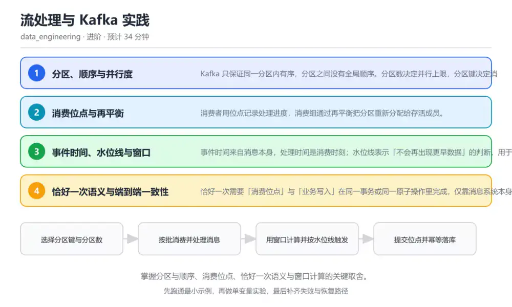
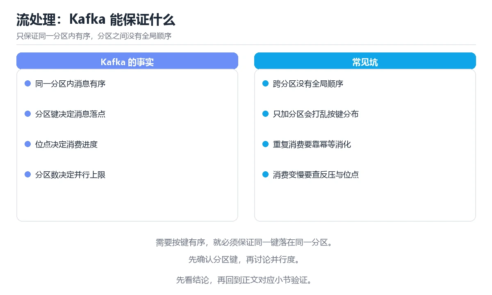

# 流处理与 Kafka 实践

> 内容更新时间：2026-10-06 · 学习阶段：进阶 · 预计用时：45 分钟

分类：data_engineering。关键词：Kafka、分区、消费位点、窗口、水位线。掌握分区与顺序、消费位点、恰好一次语义与窗口计算的关键取舍。



## 本节知识框架

**课程定位**：所属分类 `data_engineering`（数据工程），课程主题 `流处理与 Kafka 实践`，学习阶段 进阶，建议用时 45 分钟。

本课主线：掌握分区与顺序、消费位点、恰好一次语义与窗口计算的关键取舍。

**学完本课应当能够**
- 说清 `分区` 与 `消费位点` 的含义与区别，并各举一个正例和一个反例。
- 用本课示例验证 `再平衡` 的行为，记录输入、输出与失败条件。
- 遇到「把分区数当成全局有序」这类问题时，能说出触发条件与修复顺序。

### 从概念到验证的学习链条

1. `分区`：先掌握 消息的并行单元，同一分区内保证顺序，再用它解释 `消费位点` 为什么会出现。
2. `消费位点`：先掌握 消费者记录的处理进度位置，用于故障恢复，再用它解释 `再平衡` 为什么会出现。
3. `再平衡`：先掌握 消费组成员变化时重新分配分区的过程，再用它解释 `水位线` 为什么会出现。
4. `水位线`：先掌握 流处理系统对「不会再有更早数据」的判断，用于触发窗口计算，再用它解释 `幂等写入` 为什么会出现。
5. `幂等写入`：先掌握 重复执行同一条写入不会产生额外效果的写入方式，再用它解释 `事件时间` 为什么会出现。
6. `事件时间`：先掌握 事件时间来自消息本身，处理时间是消费时刻；水位线表示「不会再出现更早数据」的判断，用于决定窗口何时触发，再用它解释 本课示例的观察结果 为什么会出现。

**先修与衔接**：本课是「数据工程」分类的第 3 课。先修内容：《批处理与 Spark 实践》。《批处理与 Spark 实践》里的 `分区`、`Shuffle` 是本课的前提。

### 完成判据

- **定义关**：不看正文也能说明 `分区` 是 消息的并行单元，同一分区内保证顺序，并指出一个反例。
- **机制关**：能按“输入 → 转换 → 输出 → 验证”复述 `流处理与 Kafka 实践`，而不是只背结论。
- **示例关**：能运行或推演 `流处理与 Kafka 实践` 的 `text` 示例，并说明一个真实出现的标识符或字面量。
- **证据关**：能从 `流处理与 Kafka 实践` 的示例写出一个输入、处理、输出三元组，并说明它支持或反驳了本课的哪一条结论。
- **排错关**：能复现 把分区数当成全局有序，记录现象并按 明确顺序范围只到分区级，需要全局有序时用单分区或按业务键聚合后再排序 修复。
- **迁移关**：能把 `Kafka`、`分区`、`消费位点`、`窗口` 放进一个与 `流处理与 Kafka 实践` 不同的项目场景，并保持输入与验证条件可追踪。
- **复盘关**：学完 `流处理与 Kafka 实践` 后，用一句话写下仍然不确定的结论，并列出下一次验证需要的输入、环境和成功判据。

### 复习清单

- [ ] 能不看正文复述本课核心术语，并指出一个边界或反例。
- [ ] 能运行或推演本课示例，记录输入、输出与失败现象。
- [ ] 能完成一次自测，并把错题对照错误表定位原因。

**本课配图**



## 核心概念定义

| 术语 | 操作性定义 | 常见边界与风险 |
| --- | --- | --- |
| 分区 | 消息的并行单元，同一分区内保证顺序。 | 易错：消费端按分区并行处理，却假设消息按全局时间有序；正确做法是明确顺序范围只到分区级，需要全局有序时用单分区或按业务键聚合后再排序。 |
| 消费位点 | 消费者记录的处理进度位置，用于故障恢复。 | 只在「消费者记录的处理进度位置，用于故障恢复」这一前提下成立，换输入或换环境要重新验证。 |
| 再平衡 | 消费组成员变化时重新分配分区的过程。 | 只在「消费组成员变化时重新分配分区的过程」这一前提下成立，换输入或换环境要重新验证。 |
| 水位线 | 流处理系统对「不会再有更早数据」的判断，用于触发窗口计算。 | 只在「流处理系统对「不会再有更早数据」的判断，用于触发窗口计算」这一前提下成立，换输入或换环境要重新验证。 |
| 幂等写入 | 重复执行同一条写入不会产生额外效果的写入方式。 | 易错：先提交位点再执行业务逻辑，失败后消息被跳过；正确做法是处理成功后再提交位点，并用幂等写入吸收重复处理。 |
| 事件时间 | 事件时间来自消息本身，处理时间是消费时刻；水位线表示「不会再出现更早数据」的判断，用于决定窗口何时触发 | 易错：窗口只按处理时间计算，迟到数据被静默丢弃；正确做法是按事件时间划分窗口并设置允许迟到范围，迟到数据单独收集对账。 |

## 原理与运行机制

### 机制总览

**教材衔接：核心知识**

### 1. 分区、顺序与并行度

Kafka 只保证同一分区内有序，分区之间没有全局顺序。分区数决定并行上限，分区键决定消息落在哪个分区。

相同键通过哈希落到同一分区，因此同一实体的操作能保持顺序；分区数增加后同一键的映射可能变化，需要新的分区策略。

在流处理与 Kafka 实践里可以这样验证：用订单号作分区键写入两批消息，确认同一订单的事件进入同一分区并按顺序被消费。

边界：把分区数调大能提升吞吐，但会降低单分区顺序覆盖范围；消费端不能再假设全局有序。

工程视角：分区键选择业务实体 ID，分区数按峰值吞吐预留；扩容时评估键分布与消费者再平衡影响。

### 2. 消费位点与再平衡

消费者用位点记录处理进度，消费组通过再平衡把分区重新分配给存活成员。

位点提交时机决定重复或丢失的范围：先处理再提交可能重复，先提交再处理可能丢失。再平衡期间分区归属变化，未提交的进度会重放。

在流处理与 Kafka 实践里可以这样验证：在消费逻辑里先处理再提交位点，模拟消费者中途退出，观察重启后重复处理多少消息。

边界：延长会话超时能减少误判，但会让真正的故障成员更晚被替换，影响整体吞吐。

工程视角：处理与提交分离，用幂等写入吸收重复；控制单批处理时间，避免超出会话超时触发再平衡。

### 3. 事件时间、水位线与窗口

事件时间来自消息本身，处理时间是消费时刻；水位线表示「不会再出现更早数据」的判断，用于决定窗口何时触发。

窗口按事件时间划分，水位线推进触发计算并允许一定迟到；超过允许迟到范围的数据进入旁路输出。

在流处理与 Kafka 实践里可以这样验证：模拟一条迟到三分钟的事件，比较允许迟到前后窗口结果的变化与旁路记录。

边界：水位线是启发式判断，等待越久延迟越高；对延迟敏感的场景要接受结果可能被修正。

工程视角：按业务可接受的延迟设置允许迟到范围，把迟到数据单独收集并定期对账。

### 4. 恰好一次语义与端到端一致性

恰好一次需要「消费位点」与「业务写入」在同一事务或同一原子操作里完成，仅靠消息系统本身不足以覆盖外部数据库。

常见实现是事务写入或两阶段提交，另一种更简单可靠的做法是至少一次投递加幂等写入，把重复变成无害操作。

在流处理与 Kafka 实践里可以这样验证：用幂等表把重复消息吸收，验证重复投递后目标表行数与金额都不变。

边界：跨系统事务会带来性能与耦合成本，很多场景选择幂等而非强事务，需要在成本与复杂度之间取舍。

工程视角：优先设计幂等写入，其次才考虑事务；监控重复率与位点滞后，作为容量扩容的依据。

**教材衔接：关键流程**

```text
选择分区键与分区数 → 按批消费并处理消息 → 用窗口计算并按水位线触发 → 提交位点并幂等落库
```

1. 选择分区键与分区数
2. 按批消费并处理消息
3. 用窗口计算并按水位线触发
4. 提交位点并幂等落库

### 机制拆解：每一步的输入、动作与输出

#### 1. `分区`
- 输入：`Kafka`；本步把 消息的并行单元，同一分区内保证顺序 当作判断规则。
- 动作：围绕 `分区` 保留中间状态，并记录它与 `消费位点` 的对应关系。
- 输出：`消费位点`，它可以被下一段代码、测试或记录继续使用。
- `分区` 的失败条件：当把分区数当成全局有序时，会出现消费端按分区并行处理，却假设消息按全局时间有序。

#### 2. `消费位点`
- 输入：`分区`；本步把 消费者记录的处理进度位置，用于故障恢复 当作判断规则。
- 动作：围绕 `消费位点` 保留中间状态，并记录它与 `再平衡` 的对应关系。
- 输出：`再平衡`，它可以被下一段代码、测试或记录继续使用。
- `消费位点` 的失败条件：只在「消费者记录的处理进度位置，用于故障恢复」这一前提下成立，换输入或换环境要重新验证。

#### 3. `再平衡`
- 输入：`消费位点`；本步把 消费组成员变化时重新分配分区的过程 当作判断规则。
- 动作：围绕 `再平衡` 保留中间状态，并记录它与 `水位线` 的对应关系。
- 输出：`水位线`，它可以被下一段代码、测试或记录继续使用。
- `再平衡` 的失败条件：只在「消费组成员变化时重新分配分区的过程」这一前提下成立，换输入或换环境要重新验证。

#### 4. `水位线`
- 输入：`再平衡`；本步把 流处理系统对「不会再有更早数据」的判断，用于触发窗口计算 当作判断规则。
- 动作：围绕 `水位线` 保留中间状态，并记录它与 `幂等写入` 的对应关系。
- 输出：`幂等写入`，它可以被下一段代码、测试或记录继续使用。
- `水位线` 的失败条件：只在「流处理系统对「不会再有更早数据」的判断，用于触发窗口计算」这一前提下成立，换输入或换环境要重新验证。

#### 5. `幂等写入`
- 输入：`水位线`；本步把 重复执行同一条写入不会产生额外效果的写入方式 当作判断规则。
- 动作：围绕 `幂等写入` 保留中间状态，并记录它与 `事件时间` 的对应关系。
- 输出：`事件时间`，它可以被下一段代码、测试或记录继续使用。
- `幂等写入` 的失败条件：当处理前提交位点时，会出现先提交位点再执行业务逻辑，失败后消息被跳过。

#### 6. `事件时间`
- 输入：`幂等写入`；本步把 事件时间来自消息本身，处理时间是消费时刻；水位线表示「不会再出现更早数据」的判断，用于决定窗口何时触发 当作判断规则。
- 动作：围绕 `事件时间` 保留中间状态，并记录它与 `本课示例的最终结果` 的对应关系。
- 输出：`本课示例的最终结果`，它可以被下一段代码、测试或记录继续使用。
- `事件时间` 的失败条件：当忽略迟到数据时，会出现窗口只按处理时间计算，迟到数据被静默丢弃。

### 复现实验记录

- 环境：`流处理与 Kafka 实践` 使用 `text` 示例，固定 `Kafka`、`分区`、`消费位点`、`窗口` 作为第一组条件。
- 首轮输入：从示例中的第一个输入开始，预测 `分区` 会怎样变化。
- 基线观察：记录命令、输入、输出和错误原文，不用截图代替可复制的文本。
- 单变量修改：只改变 `Kafka`，观察 `事件时间` 是否仍满足定义。
- 失败注入：复现 把分区数当成全局有序，确认现象是 消费端按分区并行处理，却假设消息按全局时间有序。
- 记录结论：把“修改前、修改后、预期变化、实际变化”写成四列表，这样复盘 `流处理与 Kafka 实践` 时才能区分概念错误与实现错误。

## 典型应用场景

**教材衔接：深度拓展与实战**

### 机制拆解 1：分区、顺序与并行度

相同键通过哈希落到同一分区，因此同一实体的操作能保持顺序；分区数增加后同一键的映射可能变化，需要新的分区策略。

落地时先确认前提：把分区数调大能提升吞吐，但会降低单分区顺序覆盖范围；消费端不能再假设全局有序。再把结论写进检查表，让下一位同学可以按同样的输入复现。

工程做法：分区键选择业务实体 ID，分区数按峰值吞吐预留；扩容时评估键分布与消费者再平衡影响。

### 机制拆解 2：消费位点与再平衡

位点提交时机决定重复或丢失的范围：先处理再提交可能重复，先提交再处理可能丢失。再平衡期间分区归属变化，未提交的进度会重放。

落地时先确认前提：延长会话超时能减少误判，但会让真正的故障成员更晚被替换，影响整体吞吐。再把结论写进检查表，让下一位同学可以按同样的输入复现。

工程做法：处理与提交分离，用幂等写入吸收重复；控制单批处理时间，避免超出会话超时触发再平衡。

### 机制拆解 3：事件时间、水位线与窗口

窗口按事件时间划分，水位线推进触发计算并允许一定迟到；超过允许迟到范围的数据进入旁路输出。

落地时先确认前提：水位线是启发式判断，等待越久延迟越高；对延迟敏感的场景要接受结果可能被修正。再把结论写进检查表，让下一位同学可以按同样的输入复现。

工程做法：按业务可接受的延迟设置允许迟到范围，把迟到数据单独收集并定期对账。

### 机制拆解 4：恰好一次语义与端到端一致性

常见实现是事务写入或两阶段提交，另一种更简单可靠的做法是至少一次投递加幂等写入，把重复变成无害操作。

落地时先确认前提：跨系统事务会带来性能与耦合成本，很多场景选择幂等而非强事务，需要在成本与复杂度之间取舍。再把结论写进检查表，让下一位同学可以按同样的输入复现。

工程做法：优先设计幂等写入，其次才考虑事务；监控重复率与位点滞后，作为容量扩容的依据。

### 机制对照表

| 概念 | 解决什么问题 | 关键前提 | 失败信号 |
| --- | --- | --- | --- |
| 分区、顺序与并行度 | Kafka 只保证同一分区内有序，分区之间没有全局顺序。分区数决定并行上限，分区 | 把分区数调大能提升吞吐，但会降低单分区顺序覆盖范围；消费端不能再假设全局 | 分区键选择业务实体 ID，分区数按峰值吞吐预留；扩容时评估键分布与消费者 |
| 消费位点与再平衡 | 消费者用位点记录处理进度，消费组通过再平衡把分区重新分配给存活成员。 | 延长会话超时能减少误判，但会让真正的故障成员更晚被替换，影响整体吞吐。 | 处理与提交分离，用幂等写入吸收重复；控制单批处理时间，避免超出会话超时触 |
| 事件时间、水位线与窗口 | 事件时间来自消息本身，处理时间是消费时刻；水位线表示「不会再出现更早数据」的判断 | 水位线是启发式判断，等待越久延迟越高；对延迟敏感的场景要接受结果可能被修 | 按业务可接受的延迟设置允许迟到范围，把迟到数据单独收集并定期对账。 |
| 恰好一次语义与端到端一致性 | 恰好一次需要「消费位点」与「业务写入」在同一事务或同一原子操作里完成，仅靠消息系 | 跨系统事务会带来性能与耦合成本，很多场景选择幂等而非强事务，需要在成本与 | 优先设计幂等写入，其次才考虑事务；监控重复率与位点滞后，作为容量扩容的依 |

### 自测问答

**问 1**：希望同一订单的事件严格有序，应如何设置分区键？

**答**：用订单号作为分区键。相同分区键会落到同一分区，分区内有序即可保证同一订单的事件顺序；随机或按时间分区都会把同一订单的消息拆散到不同分区。 正确选项「用订单号作为分区键」对应《流处理与 Kafka 实践》的要点「分区、顺序与并行度」：Kafka 只保证同一分区内有序，分区之间没有全局顺序。分区数决定并行上限，分区键决定消息落在哪个分区。判断「分区、顺序与并行度」时先确认前提是否成立，再回到《流处理与 Kafka 实践》的示例核对一次；把别的语言或框架的默认做法直接搬到分区、顺序与并行度上，往往会在本课的边界条件里失效。

**问 2**：消费者崩溃后出现重复处理，最直接的原因是什么？

**答**：位点提交发生在处理成功之后。先处理再提交会在崩溃时重放未提交的批次，这属于至少一次语义的正常表现；处理方式是用幂等写入吸收重复，而不是避免提交策略。 正确选项「位点提交发生在处理成功之后」对应《流处理与 Kafka 实践》的要点「消费位点与再平衡」：消费者用位点记录处理进度，消费组通过再平衡把分区重新分配给存活成员。判断「消费位点与再平衡」时先确认前提是否成立，再回到《流处理与 Kafka 实践》的示例核对一次；借鉴相邻主题的经验之前，先核对消费位点与再平衡的前提是否成立。

**问 3**：关于水位线与窗口，下列说法正确的是？（多选）

**答**：水位线推进后窗口可以触发计算；允许迟到范围决定等待多久；超过允许迟到的事件应单独处理。水位线是触发窗口的启发式标记，允许迟到范围决定等待时长，超期数据需要旁路处理；而流处理结果仍可能被后续修正，不存在绝对不可修正的说法。 正确选项「水位线推进后窗口可以触发计算；允许迟到范围决定等待多久；超过允许迟到的事件应单独处理」对应《流处理与 Kafka 实践》的要点「事件时间、水位线与窗口」：事件时间来自消息本身，处理时间是消费时刻；水位线表示「不会再出现更早数据」的判断，用于决定窗口何时触发。判断「事件时间、水位线与窗口」时先确认前提是否成立，再回到《流处理与 Kafka 实践》的示例核对一次；记住事件时间、水位线与窗口的结论之外还要记住适用条件，换一个输入往往就不成立了。

**问 4**：请按一条消息在流处理中的生命周期排列步骤。

**答**：提交位点。消息先由生产者写入分区，消费者处理后做窗口计算与幂等落库，最后提交位点；位点必须先于处理提交才能避免丢消息的说法恰好相反。 正确选项「生产者写入分区；消费并幂等落库；窗口按事件时间计算；提交位点」对应《流处理与 Kafka 实践》的要点「恰好一次语义与端到端一致性」：恰好一次需要「消费位点」与「业务写入」在同一事务或同一原子操作里完成，仅靠消息系统本身不足以覆盖外部数据库。判断「恰好一次语义与端到端一致性」时先确认前提是否成立，再回到《流处理与 Kafka 实践》的示例核对一次；干扰项常常是相邻主题里成立的结论，只有按恰好一次语义与端到端一致性的输入与约束判断才能排除。

**问 5**：阅读消费代码，哪项判断正确？

**答**：条件写入保证重复消息只生效一次，位点在批次结束后提交。代码用条件写入实现幂等，重复消息直接返回 duplicate；位点在整批处理完成后统一提交，崩溃重放时由幂等逻辑吸收重复。 正确选项「条件写入保证重复消息只生效一次，位点在批次结束后提交」对应《流处理与 Kafka 实践》的要点「分区、顺序与并行度」：Kafka 只保证同一分区内有序，分区之间没有全局顺序。分区数决定并行上限，分区键决定消息落在哪个分区。判断「分区、顺序与并行度」时先确认前提是否成立，再回到《流处理与 Kafka 实践》的示例核对一次；把分区、顺序与并行度的做法换到别的约束下未必成立，先确认边界再决定答案。


### 工程检查表

- [ ] 选择分区键与分区数
- [ ] 按批消费并处理消息
- [ ] 用窗口计算并按水位线触发
- [ ] 提交位点并幂等落库
- [ ] 【分区、顺序与并行度】分区键选择业务实体 ID，分区数按峰值吞吐预留；扩容时评估键分布与消费者再平衡影响。
- [ ] 【消费位点与再平衡】处理与提交分离，用幂等写入吸收重复；控制单批处理时间，避免超出会话超时触发再平衡。
- [ ] 【事件时间、水位线与窗口】按业务可接受的延迟设置允许迟到范围，把迟到数据单独收集并定期对账。
- [ ] 【恰好一次语义与端到端一致性】优先设计幂等写入，其次才考虑事务；监控重复率与位点滞后，作为容量扩容的依据。


### 结论与下一步

- **把分区数当成全局有序**：典型现象是消费端按分区并行处理，却假设消息按全局时间有序；正确做法是明确顺序范围只到分区级，需要全局有序时用单分区或按业务键聚合后再排序。
- **处理前提交位点**：典型现象是先提交位点再执行业务逻辑，失败后消息被跳过；正确做法是处理成功后再提交位点，并用幂等写入吸收重复处理。
- **忽略迟到数据**：典型现象是窗口只按处理时间计算，迟到数据被静默丢弃；正确做法是按事件时间划分窗口并设置允许迟到范围，迟到数据单独收集对账。

### 最小验证场景

- 准备：保留 `text` 示例的原始输入，先记录 `流处理与 Kafka 实践` 的基线输出和完整运行命令。
- 判定：新结果与 `流处理与 Kafka 实践` 的基线不同不等于错误；只有当差异破坏了 `分区` 的定义或错误表中的约束，才判定为失败。

### 选择与边界

- 使用 `分区` 时，先满足它的定义：消息的并行单元，同一分区内保证顺序；易错：消费端按分区并行处理，却假设消息按全局时间有序；正确做法是明确顺序范围只到分区级，需要全局有序时用单分区或按业务键聚合后再排序。
- 使用 `消费位点` 时，先满足它的定义：消费者记录的处理进度位置，用于故障恢复；只在「消费者记录的处理进度位置，用于故障恢复」这一前提下成立，换输入或换环境要重新验证。
- 使用 `再平衡` 时，先满足它的定义：消费组成员变化时重新分配分区的过程；只在「消费组成员变化时重新分配分区的过程」这一前提下成立，换输入或换环境要重新验证。
- 使用 `水位线` 时，先满足它的定义：流处理系统对「不会再有更早数据」的判断，用于触发窗口计算；只在「流处理系统对「不会再有更早数据」的判断，用于触发窗口计算」这一前提下成立，换输入或换环境要重新验证。
- 使用 `幂等写入` 时，先满足它的定义：重复执行同一条写入不会产生额外效果的写入方式；易错：先提交位点再执行业务逻辑，失败后消息被跳过；正确做法是处理成功后再提交位点，并用幂等写入吸收重复处理。

## 代码/协议/SQL 示例

### 最小可验证示例

```text
选择分区键与分区数 → 按批消费并处理消息 → 用窗口计算并按水位线触发 → 提交位点并幂等落库
```

**教材衔接：原文最小示例**

```text
选择分区键与分区数 → 按批消费并处理消息 → 用窗口计算并按水位线触发 → 提交位点并幂等落库
```

```javascript
// 幂等消费：同一条消息重复处理时只生效一次
async function consume(message, store) {
  const key = message.orderId;
  const result = await store.insertIfAbsent(key, {
    amount: message.amount,
    eventTime: message.eventTime,
  });
  if (!result.inserted) {
    return { status: 'duplicate', key };
  }
  await store.markWindow(key, message.eventTime);
  return { status: 'applied', key };
}

// 位点提交应发生在处理成功之后，且使用同一批次边界
async function runBatch(messages, store, commit) {
  for (const message of messages) {
    await consume(message, store);
  }
  await commit(messages[messages.length - 1].offset + 1);
}
```

### 示例精读：先找证据，再改一个条件

- 在 `流处理与 Kafka 实践` 中与 `分区` 对照：示例必须能支持 消息的并行单元，同一分区内保证顺序，否则说明这一段还缺少实现或验证步骤。
- 在 `流处理与 Kafka 实践` 中与 `消费位点` 对照：示例必须能支持 消费者记录的处理进度位置，用于故障恢复，否则说明这一段还缺少实现或验证步骤。
- 在 `流处理与 Kafka 实践` 中与 `再平衡` 对照：示例必须能支持 消费组成员变化时重新分配分区的过程，否则说明这一段还缺少实现或验证步骤。
- 在 `流处理与 Kafka 实践` 中与 `水位线` 对照：示例必须能支持 流处理系统对「不会再有更早数据」的判断，用于触发窗口计算，否则说明这一段还缺少实现或验证步骤。
- `流处理与 Kafka 实践` 的示例没有抽取到函数调用或字面量；按行记录输入、控制流和输出，避免只背代码外形。

## 时间/空间复杂度或性能分析

**性能关注点（流处理与 Kafka 实践）**：批处理看吞吐、流处理看延迟：分别记录端到端延迟、背压情况与资源占用。

**测量方法**：以 `流处理与 Kafka 实践` 的 `Kafka` 场景为对象，固定输入跑一遍记录基线，再把规模或并发度提高一个数量级复测；两次结果的差值与波动范围才是结论依据。

### 需要控制的变量与记录项

- `流处理与 Kafka 实践` 的 `Kafka`：固定它的版本、输入范围和资源上限，分别记录速度、内存与失败率的变化。
- `流处理与 Kafka 实践` 的 `分区`：固定它的版本、输入范围和资源上限，分别记录速度、内存与失败率的变化。
- `流处理与 Kafka 实践` 的 `消费位点`：固定它的版本、输入范围和资源上限，分别记录速度、内存与失败率的变化。
- `流处理与 Kafka 实践` 的 `窗口`：固定它的版本、输入范围和资源上限，分别记录速度、内存与失败率的变化。
- `流处理与 Kafka 实践` 的 `水位线`：固定它的版本、输入范围和资源上限，分别记录速度、内存与失败率的变化。
- `流处理与 Kafka 实践` 中 `分区` 的边界：易错：消费端按分区并行处理，却假设消息按全局时间有序；正确做法是明确顺序范围只到分区级，需要全局有序时用单分区或按业务键聚合后再排序。达到边界时不要外推，必须重新测量。
- `流处理与 Kafka 实践` 中 `消费位点` 的边界：只在「消费者记录的处理进度位置，用于故障恢复」这一前提下成立，换输入或换环境要重新验证。达到边界时不要外推，必须重新测量。
- `流处理与 Kafka 实践` 中 `再平衡` 的边界：只在「消费组成员变化时重新分配分区的过程」这一前提下成立，换输入或换环境要重新验证。达到边界时不要外推，必须重新测量。
- `流处理与 Kafka 实践` 中 `水位线` 的边界：只在「流处理系统对「不会再有更早数据」的判断，用于触发窗口计算」这一前提下成立，换输入或换环境要重新验证。达到边界时不要外推，必须重新测量。
- `流处理与 Kafka 实践` 中 `幂等写入` 的边界：易错：先提交位点再执行业务逻辑，失败后消息被跳过；正确做法是处理成功后再提交位点，并用幂等写入吸收重复处理。达到边界时不要外推，必须重新测量。

## 常见误区与易错点

| 容易写错的做法 | 实际现象 | 原因与正确做法 |
| --- | --- | --- |
| 把分区数当成全局有序 | 消费端按分区并行处理，却假设消息按全局时间有序。 | 明确顺序范围只到分区级，需要全局有序时用单分区或按业务键聚合后再排序。 |
| 处理前提交位点 | 先提交位点再执行业务逻辑，失败后消息被跳过。 | 处理成功后再提交位点，并用幂等写入吸收重复处理。 |
| 忽略迟到数据 | 窗口只按处理时间计算，迟到数据被静默丢弃。 | 按事件时间划分窗口并设置允许迟到范围，迟到数据单独收集对账。 |

### 现场 1：把分区数当成全局有序

**症状**：消费端按分区并行处理，却假设消息按全局时间有序。

**根因与修复**：明确顺序范围只到分区级，需要全局有序时用单分区或按业务键聚合后再排序。

**自检**：在本课示例里复现「把分区数当成全局有序」，改成明确顺序范围只到分区级，需要全局有序时用单分区或按业务键聚合后再排序后重跑；如果症状消失且失败路径按预期变化，说明定位正确。

### 现场 2：处理前提交位点

**症状**：先提交位点再执行业务逻辑，失败后消息被跳过。

**根因与修复**：处理成功后再提交位点，并用幂等写入吸收重复处理。

**自检**：在本课示例里复现「处理前提交位点」，改成处理成功后再提交位点，并用幂等写入吸收重复处理后重跑；如果症状消失且失败路径按预期变化，说明定位正确。

### 现场 3：忽略迟到数据

**症状**：窗口只按处理时间计算，迟到数据被静默丢弃。

**根因与修复**：按事件时间划分窗口并设置允许迟到范围，迟到数据单独收集对账。

**自检**：在本课示例里复现「忽略迟到数据」，改成按事件时间划分窗口并设置允许迟到范围，迟到数据单独收集对账后重跑；如果症状消失且失败路径按预期变化，说明定位正确。

## 与其他知识点的关系

**教材衔接：复习与迁移**


### 迁移练习

- **先修**：`批处理与 Spark 实践`。本课默认这些内容已经掌握。
- **术语归属**：`分区`、`消费位点`、`再平衡` 的定义以本课「核心概念定义」为准，换到其他课程时先确认定义是否被改写。
- 同一分类的《批处理与 Spark 实践》也涉及 `分区`；两课衔接时先确认这个术语的定义是否一致。
- 同一分类的《Spark 执行模型与调优》也涉及 `分区`；两课衔接时先确认这个术语的定义是否一致。

### 先修与后续术语接口

- `批处理与 Spark 实践`：共享术语 `分区`、`幂等写入`，共同关键词 `分区`。

### 容易混淆的相邻概念

- `分区` 与 `消费位点`：前者强调 消息的并行单元，同一分区内保证顺序；后者强调 消费者记录的处理进度位置，用于故障恢复。判断时分别检查两条定义的适用范围，不要只看名称相似就互换。
- `消费位点` 与 `再平衡`：前者强调 消费者记录的处理进度位置，用于故障恢复；后者强调 消费组成员变化时重新分配分区的过程。判断时分别检查两条定义的适用范围，不要只看名称相似就互换。
- `再平衡` 与 `水位线`：前者强调 消费组成员变化时重新分配分区的过程；后者强调 流处理系统对「不会再有更早数据」的判断，用于触发窗口计算。判断时分别检查两条定义的适用范围，不要只看名称相似就互换。
- `水位线` 与 `幂等写入`：前者强调 流处理系统对「不会再有更早数据」的判断，用于触发窗口计算；后者强调 重复执行同一条写入不会产生额外效果的写入方式。判断时分别检查两条定义的适用范围，不要只看名称相似就互换。
- `幂等写入` 与 `事件时间`：前者强调 重复执行同一条写入不会产生额外效果的写入方式；后者强调 事件时间来自消息本身，处理时间是消费时刻；水位线表示「不会再出现更早数据」的判断，用于决定窗口何时触发。判断时分别检查两条定义的适用范围，不要只看名称相似就互换。

## 自测题与参考答案

> 先独立作答，再对照参考答案；答案都能在本课正文、术语表或错误表里找到依据。

### 自测 1（概念复述）

不看正文，写出 `分区` 的操作性定义，并说明它与 `消费位点` 的区别。

**参考答案**：消息的并行单元，同一分区内保证顺序。

`消费位点` 的定位是：消费者记录的处理进度位置，用于故障恢复；两者的差别要从适用对象与失败模式上说明。

### 自测 2（排错）

本课错误表记录了「把分区数当成全局有序」这类做法。请写出它会出现的现象、根因，以及修复顺序。

**参考答案**：现象是消费端按分区并行处理，却假设消息按全局时间有序；正确做法是明确顺序范围只到分区级，需要全局有序时用单分区或按业务键聚合后再排序。修复时先复现现象并保留证据，再改动一处假设重跑，确认现象消失。

### 自测 3（动手验证）

运行本课的 `text` 示例，改动其中一个输入后重新运行，记录输出与错误信息。

**参考答案**：正常输入下 `text` 示例应当复现正文给出的结果；改动输入后，如果结果改变或报错，先核对它是否满足 `流处理与 Kafka 实践` 中`分区` 的适用范围，再检查错误表里是否有同类现象。

### 自测 4（代码阅读）

阅读本课开头的 `text` 示例，说明它体现了`分区` 的哪一条性质，并指出改动哪个输入会让这条性质不再成立。

**参考答案**：`分区` 的定义是 消息的并行单元，同一分区内保证顺序，示例正是在实现这条定义。改动与 `分区` 有关的一个输入后，如果结果不再符合 `流处理与 Kafka 实践` 的正文描述，就说明该性质只在当前前提成立。

### 自测 5（迁移）

把 `流处理与 Kafka 实践` 的方法迁移到自己的项目：围绕 `分区` 写出一个与错误表同类的风险点，并说明触发条件和检验方式。

**参考答案**：例如「忽略迟到数据」，它会导致窗口只按处理时间计算，迟到数据被静默丢弃；检验方式是按按事件时间划分窗口并设置允许迟到范围，迟到数据单独收集对账改一处再复现，确认现象消失且没有引入新的失败分支。

### 自测 6（对比）

用一个表格对比 `分区` 与 `消费位点`：各写一行适用场景、一行失败表现。

**参考答案**：`分区` 的定义是消息的并行单元，同一分区内保证顺序；`消费位点` 的定义是消费者记录的处理进度位置，用于故障恢复。两者的失败表现分别对应本课错误表里与本术语相关的行。

### 自测 7（排错顺序）

面对「把分区数当成全局有序」引发的问题，请把“复现 消费端按分区并行处理，却假设消息按全局时间有序 → 保留证据 → 明确顺序范围只到分区级，需要全局有序时用单分区或按业务键聚合后再排序 → 回归验证”四步写成可执行的检查清单。

**参考答案**：第一步按消费端按分区并行处理，却假设消息按全局时间有序复现；第二步记录输入、版本与完整报错；第三步按明确顺序范围只到分区级，需要全局有序时用单分区或按业务键聚合后再排序只改一处；第四步重跑并确认失败路径也按预期变化。

### 自测 8（边界判断）

针对 `事件时间`，分别写出“可以使用”的条件和“结论不再成立”的条件。

**参考答案**：易错：窗口只按处理时间计算，迟到数据被静默丢弃；正确做法是按事件时间划分窗口并设置允许迟到范围，迟到数据单独收集对账。 同时要把 `事件时间` 的定义 事件时间来自消息本身，处理时间是消费时刻；水位线表示「不会再出现更早数据」的判断，用于决定窗口何时触发 与实际输入逐项对照。

### 自测 9（机制重建）

不看正文，按输入、转换、输出、验证四段重建 `分区` → `消费位点` → `再平衡` → `水位线` 的作用链。

**参考答案**：起点是 `分区` 的定义 消息的并行单元，同一分区内保证顺序；中间每一步都保留可观察状态；终点由 `事件时间` 检查，失败时回到错误表定位第一个偏离定义的步骤。

### 自测 10（综合排错）

在 `流处理与 Kafka 实践` 中，现象是 窗口只按处理时间计算，迟到数据被静默丢弃。请围绕 忽略迟到数据 写出最小复现、关键证据、修复动作和回归验证，并说明为什么不能只凭一次运行下结论。

**参考答案**：先复现 忽略迟到数据，记录输入与完整错误；再按 按事件时间划分窗口并设置允许迟到范围，迟到数据单独收集对账 只改一处。回归时同时跑正常路径和边界路径，只有两次结果都可解释，才把修复视为完成。

### 自测 11（一分钟复述）

用每分钟约 200 字的速度复述 `流处理与 Kafka 实践`：先给主问题，再按顺序说出 `分区`、`消费位点`、`再平衡`、`水位线`，最后给一个失败案例。

**自评标准**：主问题必须对应 掌握分区与顺序、消费位点、恰好一次语义与窗口计算的关键取舍；每个术语都要能接上一句定义或边界；失败案例必须写成可观察现象，不能用“可能有风险”代替证据。

## 术语速查

| 术语 | 一句话说明 |
| --- | --- |
| `分区` | 消息的并行单元，同一分区内保证顺序。 |
| `消费位点` | 消费者记录的处理进度位置，用于故障恢复。 |
| `再平衡` | 消费组成员变化时重新分配分区的过程。 |
| `水位线` | 流处理系统对「不会再有更早数据」的判断，用于触发窗口计算。 |
| `幂等写入` | 重复执行同一条写入不会产生额外效果的写入方式。 |
| `事件时间` | 事件时间来自消息本身，处理时间是消费时刻；水位线表示「不会再出现更早数据」的判断，用于决定窗口何时触发。 |

**术语关系**：`分区`（消息的并行单元） → `消费位点`（消费者记录的处理进度位置） → `再平衡`（消费组成员变化时重新分配分区的过程） → `水位线`（流处理系统对「不会再有更早数据」的判断）。

## 考点精讲

`流处理与 Kafka 实践` 的题库有 5 道题，下面逐题给出题干、正确项与判断依据：先自己作答，再核对正确项，最后回到正文对应小节复核。

### 考点 1：第 1 题

- **题目**：希望同一订单的事件严格有序，应如何设置分区键？
- **正确项**：用订单号作为分区键
- **判断依据**：这道题落在术语 `分区` 上：消息的并行单元，同一分区内保证顺序。复习时把 `分区` 的定义、适用边界和一个反例一起说清楚，再回到「核心概念定义」核对原文。

### 考点 2：第 2 题

- **题目**：消费者崩溃后出现重复处理，最直接的原因是什么？
- **正确项**：位点提交发生在处理成功之后
- **判断依据**：这道题检验本课主问题：掌握分区与顺序、消费位点、恰好一次语义与窗口计算的关键取舍。复习时先复述本课主问题，再举一个会让结论失效的输入。

### 考点 3：第 3 题

- **题目**：关于水位线与窗口，下列说法正确的是？（多选）
- **正确项**：水位线推进后窗口可以触发计算；允许迟到范围决定等待多久；超过允许迟到的事件应单独处理
- **判断依据**：这道题落在术语 `水位线` 上：流处理系统对「不会再有更早数据」的判断，用于触发窗口计算。复习时把 `水位线` 的定义、适用边界和一个反例一起说清楚，再回到「核心概念定义」核对原文。

### 考点 4：第 4 题

- **题目**：请按一条消息在流处理中的生命周期排列步骤。
- **正确项**：生产者写入分区 → 消费并幂等落库 → 窗口按事件时间计算 → 提交位点
- **判断依据**：这道题落在术语 `分区` 上：消息的并行单元，同一分区内保证顺序。复习时把 `分区` 的定义、适用边界和一个反例一起说清楚，再回到「核心概念定义」核对原文。

### 考点 5：第 5 题

- **题目**：阅读消费代码，哪项判断正确？
- **正确项**：条件写入保证重复消息只生效一次，位点在批次结束后提交
- **判断依据**：这道题检验本课主问题：掌握分区与顺序、消费位点、恰好一次语义与窗口计算的关键取舍。复习时先复述本课主问题，再举一个会让结论失效的输入。

### 考点 6：`分区`

- **要点**：消息的并行单元，同一分区内保证顺序。
- **分区 的边界**：易错：消费端按分区并行处理，却假设消息按全局时间有序；正确做法是明确顺序范围只到分区级，需要全局有序时用单分区或按业务键聚合后再排序。

### 考点 7：`消费位点`

- **要点**：消费者记录的处理进度位置，用于故障恢复。
- **消费位点 的边界**：只在「消费者记录的处理进度位置，用于故障恢复」这一前提下成立，换输入或换环境要重新验证。

### 考点 8：`再平衡`

- **要点**：消费组成员变化时重新分配分区的过程。
- **再平衡 的边界**：只在「消费组成员变化时重新分配分区的过程」这一前提下成立，换输入或换环境要重新验证。

### 考点 9：`水位线`

- **要点**：流处理系统对「不会再有更早数据」的判断，用于触发窗口计算。
- **水位线 的边界**：只在「流处理系统对「不会再有更早数据」的判断，用于触发窗口计算」这一前提下成立，换输入或换环境要重新验证。

### 考点 10：`幂等写入`

- **要点**：重复执行同一条写入不会产生额外效果的写入方式。
- **幂等写入 的边界**：易错：先提交位点再执行业务逻辑，失败后消息被跳过；正确做法是处理成功后再提交位点，并用幂等写入吸收重复处理。

### 考点 11：`事件时间`

- **要点**：事件时间来自消息本身，处理时间是消费时刻；水位线表示「不会再出现更早数据」的判断，用于决定窗口何时触发
- **事件时间 的边界**：易错：窗口只按处理时间计算，迟到数据被静默丢弃；正确做法是按事件时间划分窗口并设置允许迟到范围，迟到数据单独收集对账。

### 考点 12：排错——把分区数当成全局有序

- **现象**：消费端按分区并行处理，却假设消息按全局时间有序。
- **处理**：明确顺序范围只到分区级，需要全局有序时用单分区或按业务键聚合后再排序。

### 考点 13：排错——处理前提交位点

- **现象**：先提交位点再执行业务逻辑，失败后消息被跳过。
- **处理**：处理成功后再提交位点，并用幂等写入吸收重复处理。

### 考点 14：综合辨析——`分区` 与 `事件时间`

- **辨析点**：`分区` 的定义是 消息的并行单元，同一分区内保证顺序；`事件时间` 的定义是 事件时间来自消息本身，处理时间是消费时刻；水位线表示「不会再出现更早数据」的判断，用于决定窗口何时触发。
- **答题要求**：面对 `流处理与 Kafka 实践` 的题目，先判断描述的是 `分区` 还是 `事件时间`，再归到对应定义，最后写出一个会让该定义失效的边界输入。

### 考点 15：排错评分点

- **现象分**：能写出 消费端按分区并行处理，却假设消息按全局时间有序，而不是只写“程序有错”。
- **证据分**：保留触发 把分区数当成全局有序 的输入、版本和错误原文。
- **修复分**：按 明确顺序范围只到分区级，需要全局有序时用单分区或按业务键聚合后再排序 只改一处，并同时回归正常路径与边界路径。

## 内容元数据

- 内容版本：v2.0
- 最后更新：2026-10-06
- 学习阶段：进阶

| 字段 | 值 |
| --- | --- |
| 课程 ID | `de_stream_processing` |
| 所属分类 | `data_engineering` |
| 难度 | 进阶 |
| 预计用时 | 34 分钟 |
| 关键词 | Kafka、分区、消费位点、窗口、水位线 |
| 配图 | `images/lesson_de_stream_processing.webp` |
| 参考资料 | 2 条 |
| 内容更新时间 | 2026-10-06 |

## 参考资料与复核

- 来源性质：官方文档、标准或权威教材；本课核对关键词：Kafka、分区、消费位点、窗口、水位线。
- 最后复核：2026-10-04
- 下次复核：2027-01-10
- 复核范围：版本兼容、API 行为与工程实践

下面列出的资料用于核对本课结论，复习时可以对照阅读：
- [Apache Kafka 官方文档：设计与语义](https://kafka.apache.org/documentation/)
- [Kafka 消费者组与再平衡协议](https://kafka.apache.org/39/design/design/)

| [本课术语索引：流处理与 Kafka 实践](#核心概念定义) | 按本课输入、术语边界和错误表现逐项核对 |
> 复核提示：《流处理与 Kafka 实践》的结论如与资料冲突，以资料中的规范文本为准，并在笔记里记录差异与日期。