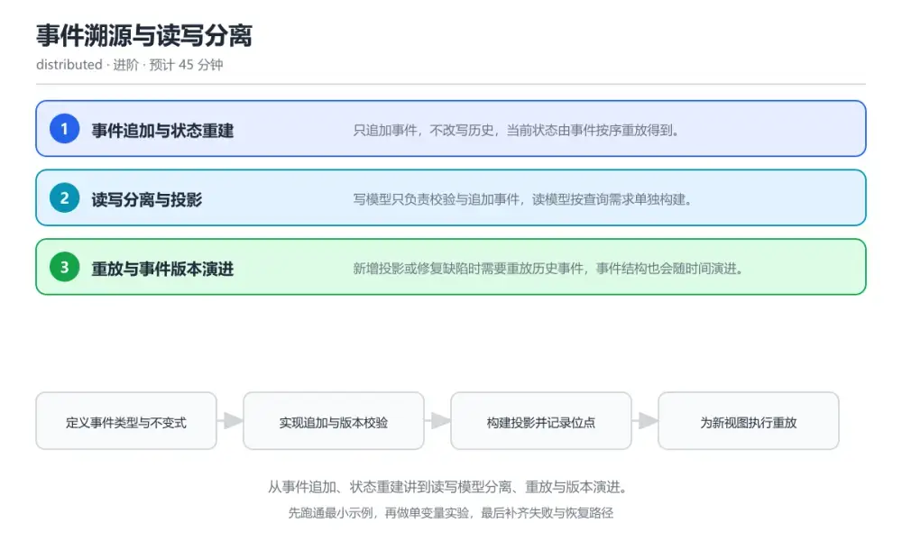
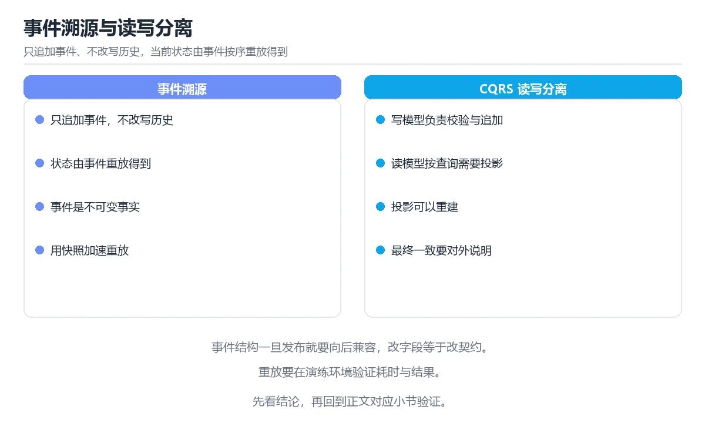

# 事件溯源与读写分离

> 内容更新时间：2026-10-06 · 学习阶段：进阶 · 预计用时：40 分钟

分类：distributed。关键词：事件溯源、CQRS、事件重放、投影、版本演进。从事件追加、状态重建讲到读写模型分离、重放与版本演进。

学习建议：先通读《事件溯源与读写分离》的核心知识与关键流程，再运行可运行练习并完成测验；遇到不确定的结论，回到「故障现场」按症状、根因、修复、验证四步核对。



## 本节知识框架

**课程定位**：所属分类为「分布式与架构」，课程主题为「事件溯源与读写分离」，学习阶段为「进阶」，建议用时 40 分钟。

**本课要解决的主问题**：从事件追加、状态重建讲到读写模型分离、重放与版本演进。

| 学习层次 | 要回答的问题 | 完成判据 |
| --- | --- | --- |
| 概念层 | 「事件溯源与读写分离」有哪些必须区分的对象与术语？ | 能用自己的话定义核心术语，并各举一个正例和一个反例。 |
| 机制层 | 这些对象按什么顺序发生作用，输入如何变成输出？ | 能画出或写出机制步骤，并说明每一步的失败条件。 |
| 应用层 | 什么场景适合使用「事件溯源与读写分离」，什么场景不适合？ | 能给出一个真实场景、一个最小示例和一个边界案例。 |
| 性能层 | 时间、空间、吞吐或延迟受哪些量影响？ | 能说出复杂度或性能瓶颈的证据来源；没有证据时明确写“材料未提供”。 |
| 复习层 | 怎样确认自己不是只记住了结论？ | 能独立完成本课自测，并把错误定位到概念、机制、示例或边界。 |

### 阅读路线

1. 先读「核心概念定义」，建立「事件溯源」等对象的精确定义。
2. 再读「原理与运行机制」，把定义串成可重复的过程。
3. 用「代码/协议/SQL 示例」验证过程，并只改一个条件观察结果变化。
4. 最后检查性能、易错点、知识关系与自测题，形成可复习的证据链。

**前置知识**：没有硬性先修课；仍建议先具备本分类的基础阅读与操作能力。

**学习位置**：本课位于《分布式事务与一致性》之后；如果前一课的自测不能通过，应先回补再继续。

**后续衔接**：下一课《实战：设计一个短链服务》会继续使用本课术语，学完后建议立即完成一次自测。

**教材衔接：学习目标**

- 能说明事件溯源与只保存当前状态的区别。
- 能实现一个从事件流重建状态的聚合。
- 能设计投影重建与事件版本演进方案。

**教材衔接：前置知识**

- 完成消息队列与事件驱动课程。
- 了解数据库事务与乐观锁的基本用法。
- 能编写按顺序消费消息的处理逻辑。

**教材衔接：本课小结**

- 事件溯源与读写分离围绕事件溯源、CQRS、事件重放展开，先建立基线再讨论优化。
- 只追加事件，不改写历史，当前状态由事件按序重放得到。
- ValueError 出错时先记录症状，再定位根因，最后用一次复跑确认修复。

## 核心概念定义

> 在阅读《事件溯源与读写分离》时，术语第一次出现先给操作性定义，再给边界；正文说法与这里冲突时，以定义和可复现示例为准。

| 术语 | 操作性定义 | 本课中的边界 |
| --- | --- | --- |
| 事件溯源 | 只追加事件并由事件重放得到状态的方式。 | 仅在「事件溯源与读写分离」明确给出的输入、版本与资源条件下成立。 |
| 聚合 | 一致性边界内的一组相关对象与事件。 | 仅在「事件溯源与读写分离」明确给出的输入、版本与资源条件下成立。 |
| 投影 | 把事件流转换为面向查询视图的处理器。 | 仅在「事件溯源与读写分离」明确给出的输入、版本与资源条件下成立。 |
| 乐观锁 | 用版本号检测并发冲突而不长期加锁。 | 仅在「事件溯源与读写分离」明确给出的输入、版本与资源条件下成立。 |
| 重放 | 从头或从快照重新处理事件以重建状态。 | 仅在「事件溯源与读写分离」明确给出的输入、版本与资源条件下成立。 |

### 定义如何使用

在「事件溯源与读写分离」中判断一个说法是否成立，先确认它使用的是哪个对象的定义，再检查输入规模、运行环境与失败路径。定义不是口号，而是后续推导、代码示例和自测题共享的约束。

## 原理与运行机制

### 机制总览

1. **建立输入**：把「事件溯源」按本课定义整理成可观察、可重复的输入条件。
2. **执行转换**：围绕「聚合」执行本课的核心步骤；每一步都记录中间状态，避免只看最终输出。
3. **产生输出**：得到「投影」后，用正文示例或协议/SQL 结果核对输出是否符合预期。
4. **改变一个条件**：只替换一个边界条件或环境参数，观察「事件溯源与读写分离」的结论是否仍然成立。

| 阶段 | 关注对象 | 失败时应检查 |
| --- | --- | --- |
| 输入 | 事件溯源 | 类型、范围、编码、版本或前置状态是否满足定义。 |
| 处理 | 聚合 | 顺序、可见性、锁、路由、事务或调度规则是否被破坏。 |
| 输出 | 投影 | 结果是否可复现，错误是否被正确传播而不是被吞掉。 |

本课的机制结论要用「事件溯源与读写分离」自己的示例验证。「事件溯源与读写分离」没有给出某个数量级、吞吐或内存数据时，本课把该判断标为“材料未提供”，不从相邻主题外推。

**教材衔接：核心知识**

### 1. 事件追加与状态重建

只追加事件，不改写历史，当前状态由事件按序重放得到。

聚合按版本号追加事件，读取时从头或从快照开始重放事件流，得到当前状态；并发写入用版本号做乐观锁校验。

在事件溯源与读写分离里可以这样验证：在本课示例里重放一段订单事件流，观察状态与快照加增量的结果一致。

边界：事件含义被修改会让历史事件的解释随之改变，历史数据的可信度被破坏。

工程视角：事件定义为不可变的事实，语义变更通过新增事件类型实现，重放逻辑支持多版本共存。

### 2. 读写分离与投影

写模型只负责校验与追加事件，读模型按查询需求单独构建。

投影器订阅事件并更新面向查询的视图，读模型可以是表、搜索索引或缓存，允许为不同查询建多个投影。

在事件溯源与读写分离里可以这样验证：在本课示例里为同一事件流构建两个不同结构的读模型。

边界：投影落后于事件流时读取到旧数据，必须明确可接受的延迟并向用户体现。

工程视角：投影记录处理位点并支持从任意位置重建，延迟作为监控指标对业务可见。

### 3. 重放与事件版本演进

新增投影或修复缺陷时需要重放历史事件，事件结构也会随时间演进。

重放按位点从头处理事件并可并行写入新视图；事件新增字段时保持向后兼容，重命名或拆分通过升级函数在读取时转换。

在事件溯源与读写分离里可以这样验证：在本课示例里为一个新投影重放三个月的历史事件并核对结果。

边界：重放未考虑副作用会在重放时重复发送通知或扣款，必须把外部副作用与内部计算分开。

工程视角：重放前关闭外部副作用开关，重放完成后比对总量指标确认一致性。

## 典型应用场景

| 场景 | 典型输入或前提 | 期望产物 |
| --- | --- | --- |
| 学习验证 | 使用本课最小示例和 事件溯源、CQRS | 能复现正文结论，并解释每一步。 |
| 工程落地 | 把「事件溯源与读写分离」放入真实模块或服务边界 | 输出可观测、失败可定位、参数可配置。 |
| 故障排查 | 只改一个版本、规模、输入或依赖条件 | 能区分概念错误、实现错误和环境差异。 |

判断「事件溯源与读写分离」的场景是否成立，标准是能否写出输入、处理、输出和失败路径；材料中没有出现的数据在本课标注为“材料未提供”，不用推测替代证据。

**教材衔接：深度拓展与实战**

这一节把事件溯源与读写分离的机制拆开验证：每一步都给出输入、判断标准和失败信号，便于在真实项目里复用。

### 机制拆解 1：事件追加与状态重建

聚合按版本号追加事件，读取时从头或从快照开始重放事件流，得到当前状态；并发写入用版本号做乐观锁校验。

落地时先确认前提：事件含义被修改会让历史事件的解释随之改变，历史数据的可信度被破坏。；再把结论写进检查表，让下一位同学可以按同样的输入复现。

工程做法：事件定义为不可变的事实，语义变更通过新增事件类型实现，重放逻辑支持多版本共存。

### 机制拆解 2：读写分离与投影

投影器订阅事件并更新面向查询的视图，读模型可以是表、搜索索引或缓存，允许为不同查询建多个投影。

落地时先确认前提：投影落后于事件流时读取到旧数据，必须明确可接受的延迟并向用户体现。；再把结论写进检查表，让下一位同学可以按同样的输入复现。

工程做法：投影记录处理位点并支持从任意位置重建，延迟作为监控指标对业务可见。

### 机制拆解 3：重放与事件版本演进

重放按位点从头处理事件并可并行写入新视图；事件新增字段时保持向后兼容，重命名或拆分通过升级函数在读取时转换。

落地时先确认前提：重放未考虑副作用会在重放时重复发送通知或扣款，必须把外部副作用与内部计算分开。；再把结论写进检查表，让下一位同学可以按同样的输入复现。

工程做法：重放前关闭外部副作用开关，重放完成后比对总量指标确认一致性。

### 机制对照表

| 概念 | 解决什么问题 | 关键前提 | 失败信号 |
| --- | --- | --- | --- |
| 事件追加与状态重建 | 只追加事件，不改写历史，当前状态由事件按序重放得到。 | 事件含义被修改会让历史事件的解释随之改变，历史数据的可信度被破坏。 | 事件定义为不可变的事实，语义变更通过新增事件类型实现，重放逻辑支持多版本 |
| 读写分离与投影 | 写模型只负责校验与追加事件，读模型按查询需求单独构建。 | 投影落后于事件流时读取到旧数据，必须明确可接受的延迟并向用户体现。 | 投影记录处理位点并支持从任意位置重建，延迟作为监控指标对业务可见。 |
| 重放与事件版本演进 | 新增投影或修复缺陷时需要重放历史事件，事件结构也会随时间演进。 | 重放未考虑副作用会在重放时重复发送通知或扣款，必须把外部副作用与内部计算 | 重放前关闭外部副作用开关，重放完成后比对总量指标确认一致性。 |

### 自测问答

**问 1**：事件溯源中修改历史事件的含义会带来什么后果？

**答**：历史数据的解释被改变，重放结果不再可信。事件是已发生事实的记录，修改含义相当于改写历史，重放与审计都会得到与当时不一致的结论。 正确选项「历史数据的解释被改变，重放结果不再可信」对应《事件溯源与读写分离》的要点「事件追加与状态重建」：只追加事件，不改写历史，当前状态由事件按序重放得到。判断「事件追加与状态重建」时先确认前提是否成立，再回到《事件溯源与读写分离》的示例核对一次；把别的语言或框架的默认做法直接搬到事件追加与状态重建上，往往会在本课的边界条件里失效。

**问 2**：并发追加事件时最常用的保护手段是？

**答**：用聚合版本号做乐观锁校验。版本号校验让冲突的写入失败并重试，避免两个命令基于同一旧状态各自追加事件造成状态分叉。 正确选项「用聚合版本号做乐观锁校验」对应《事件溯源与读写分离》的要点「读写分离与投影」：写模型只负责校验与追加事件，读模型按查询需求单独构建。判断「读写分离与投影」时先确认前提是否成立，再回到《事件溯源与读写分离》的示例核对一次；借鉴相邻主题的经验之前，先核对读写分离与投影的前提是否成立。

**问 3**：为新的读模型执行重放前应准备什么？（多选）

**答**：关闭外部副作用开关；记录起始位点；准备重建后的比对指标。关闭副作用避免重复通知，位点决定重放范围，比对指标用于验证重建结果；原始事件流是唯一事实来源，不能删除。 正确选项「关闭外部副作用开关；记录起始位点；准备重建后的比对指标」对应《事件溯源与读写分离》的要点「重放与事件版本演进」：新增投影或修复缺陷时需要重放历史事件，事件结构也会随时间演进。判断「重放与事件版本演进」时先确认前提是否成立，再回到《事件溯源与读写分离》的示例核对一次；记住重放与事件版本演进的结论之外还要记住适用条件，换一个输入往往就不成立了。

**问 4**：请按一次命令处理的顺序排列。

**答**：加载聚合并校验业务规则。写侧校验后追加事件，读侧投影异步更新，查询走读模型，需要时通过重放重建视图。 正确选项「加载聚合并校验业务规则；追加事件并递增版本；投影器订阅事件更新读模型；查询服务返回读模型结果；按需重放重建视图」对应《事件溯源与读写分离》的要点「事件追加与状态重建」：只追加事件，不改写历史，当前状态由事件按序重放得到。判断「事件追加与状态重建」时先确认前提是否成立，再回到《事件溯源与读写分离》的示例核对一次；干扰项常常是相邻主题里成立的结论，只有按事件追加与状态重建的输入与约束判断才能排除。

**问 5**：阅读这段投影代码，风险是什么？

**答**：重放时重复调用发货接口，产生重复副作用。投影被重放时会再次调用发货接口，造成重复发货；外部副作用应移出投影，由独立的命令或补偿流程负责。 正确选项「重放时重复调用发货接口，产生重复副作用」对应《事件溯源与读写分离》的要点「读写分离与投影」：写模型只负责校验与追加事件，读模型按查询需求单独构建。判断「读写分离与投影」时先确认前提是否成立，再回到《事件溯源与读写分离》的示例核对一次；把读写分离与投影的做法换到别的约束下未必成立，先确认边界再决定答案。

### 排错速查

- 看到「投影里同时执行外部副作用且没有开关」时，先按「把外部副作用与内部计算分离，重放时关闭副作用开关，结束后单独补发」处理，再用事件溯源与读写分离的最小示例确认结论是否恢复。
- 看到「直接修改事件字段含义或沿用同名事件」时，先按「新增事件类型或字段并通过升级函数转换旧事件，保持历史事件不可变」处理，再用事件溯源与读写分离的最小示例确认结论是否恢复。
- 看到「追加事件时不做版本校验」时，先按「用聚合版本号做乐观锁，冲突时重新加载事件并重试命令」处理，再用事件溯源与读写分离的最小示例确认结论是否恢复。

### 工程检查表

- [ ] 定义事件类型与不变式
- [ ] 实现追加与版本校验
- [ ] 构建投影并记录位点
- [ ] 为新视图执行重放
- [ ] 管理事件版本与副作用开关
- [ ] 【事件追加与状态重建】事件定义为不可变的事实，语义变更通过新增事件类型实现，重放逻辑支持多版本共存。
- [ ] 【读写分离与投影】投影记录处理位点并支持从任意位置重建，延迟作为监控指标对业务可见。
- [ ] 【重放与事件版本演进】重放前关闭外部副作用开关，重放完成后比对总量指标确认一致性。

### 迁移练习

把事件溯源与读写分离的方法用到一个真实场景：写下事件溯源、CQRS、事件重放在你的场景里分别对应什么，再记录一次失败尝试和它的恢复步骤。

### 延伸阅读与下一步

- 复习事件溯源、CQRS、事件重放、投影、版本演进时，优先回看「事件追加与状态重建」与「重放与事件版本演进」两节。
- 把从「定义事件类型与不变式」到「管理事件版本与副作用开关」的流程画成一张图，放进自己的笔记。
- 一周后重做本课测验，只把答错的题留到下一轮复习。

### 结论与下一步

学完事件溯源与读写分离，应该能独立完成三件事：先用最小示例确认事件溯源的行为，再用一个边界输入验证结论，最后把失败路径写成可重复的检查。下一步把本课术语加入复习清单，并在两周内用一次真实任务检验记忆是否牢固。

## 代码/协议/SQL 示例

以下代码、协议或 SQL 片段来自《事件溯源与读写分离》原文，保留原有语言标记与上下文；先预测《事件溯源与读写分离》示例的输出，再按正文步骤运行或推演，示例依赖外部环境时同时记录版本与输入。

**教材衔接：关键流程**

```text
定义事件类型与不变式 → 实现追加与版本校验 → 构建投影并记录位点 → 为新视图执行重放 → 管理事件版本与副作用开关
```

1. 定义事件类型与不变式
2. 实现追加与版本校验
3. 构建投影并记录位点
4. 为新视图执行重放
5. 管理事件版本与副作用开关

## 时间/空间复杂度或性能分析

**复杂度证据**：「事件溯源与读写分离」的现有材料没有给出渐近时间或空间复杂度的明确结论，本课只做定性检查，不补写未经验证的 $O$ 记号。

| 维度 | 本课关注点 | 判断依据 |
| --- | --- | --- |
| 时间/延迟 | 「事件溯源与读写分离」的主要步骤是否会随输入规模、并发度或网络往返增长。 | 以正文复杂度、基准数据或可重复测量为准。 |
| 空间/内存 | 中间状态、缓存、副本、连接或索引是否随规模增长。 | 记录峰值内存与数据副本，不只看最终结果。 |
| 吞吐/资源 | 版本、调度、锁、IO、序列化或协议开销是否成为瓶颈。 | 固定环境做对照实验，改变一个变量。 |

评估「事件溯源与读写分离」时要区分“正确性成立”和“性能达标”两件事；材料没有给出基准时，本课只保留量级来源与测量方法，不写不可验证的绝对数字。

## 常见误区与易错点

> 复核《事件溯源与读写分离》的易错点时，优先保留原文的错误表、故障现场与排错路径；每条修正都要能用本课示例复验。

| 易错点 | 常见表现 | 正确做法 |
| --- | --- | --- |
| 只背结论 | 能复述「事件溯源与读写分离」的定义，却说不清输入、输出与边界。 | 回到机制步骤，用最小示例逐一验证。 |
| 混淆相邻概念 | 把本课对象与相邻主题的对象当成同一类。 | 先比较定义、资源归属、生命周期和失败模式。 |
| 忽略版本与环境 | 在开发机通过后直接外推到生产环境。 | 固定版本、输入和资源条件，再记录可复现结果。 |

**教材衔接：常见错误与排查**

> 说明：本表由《事件溯源与读写分离》的核心知识整理（2026-10-06），人工复核进度见 docs/content_review_batches.md。

| 易错点 | 容易踩的做法 | 正确结论 |
| --- | --- | --- |
| 重放时重复发送通知 | 投影里同时执行外部副作用且没有开关 | 把外部副作用与内部计算分离，重放时关闭副作用开关，结束后单独补发 |
| 事件含义变更导致历史不可读 | 直接修改事件字段含义或沿用同名事件 | 新增事件类型或字段并通过升级函数转换旧事件，保持历史事件不可变 |
| 并发写入丢事件 | 追加事件时不做版本校验 | 用聚合版本号做乐观锁，冲突时重新加载事件并重试命令 |

**教材衔接：故障现场**

### 现场 1：重放时重复发送通知

**症状**：在《事件溯源与读写分离》的复现场景中，投影里同时执行外部副作用且没有开关。

**根因**：“投影里同时执行外部副作用且没有开关”只是表层结果。向上追溯会落到“重放时重复发送通知”这一步，因为它省略了《事件溯源与读写分离》的约束，使实现行为和预期模型发生了偏离。

**修复**：针对《事件溯源与读写分离》的问题，把外部副作用与内部计算分离，重放时关闭副作用开关，结束后单独补发。

**验证**：先在《事件溯源与读写分离》中记录“重放时重复发送通知”留下的失败证据，再执行“把外部副作用与内部计算分离，重放时关闭副作用开关，结束后单独补发”并重放；确认错误路径变为明确结果，且修复没有掩盖同类故障。

### 现场 2：事件含义变更导致历史不可读

**症状**：在《事件溯源与读写分离》的复现场景中，直接修改事件字段含义或沿用同名事件。

**根因**：触发点是把“事件含义变更导致历史不可读”当成安全做法。它没有满足《事件溯源与读写分离》要求的前提，因此先表现为“直接修改事件字段含义或沿用同名事件”；排查时先完整复现这一段，再核对输入、配置与依赖。

**修复**：针对《事件溯源与读写分离》的问题，新增事件类型或字段并通过升级函数转换旧事件，保持历史事件不可变。

**验证**：在《事件溯源与读写分离》中按“新增事件类型或字段并通过升级函数转换旧事件，保持历史事件不可变”调整后，从“事件含义变更导致历史不可读”的触发条件重放同一条路径，确认“直接修改事件字段含义或沿用同名事件”不再出现，并补一个相邻边界用例检查没有引入新问题。

### 现场 3：并发写入丢事件

**症状**：在《事件溯源与读写分离》的复现场景中，追加事件时不做版本校验。

**根因**：当出现“并发写入丢事件”时，执行路径已经绕过了《事件溯源与读写分离》的关键约束，最终以“追加事件时不做版本校验”暴露出来；修复前必须先确认约束在哪里失效。

**修复**：针对《事件溯源与读写分离》的问题，用聚合版本号做乐观锁，冲突时重新加载事件并重试命令。

**验证**：保留《事件溯源与读写分离》里触发“追加事件时不做版本校验”的输入、版本和日志，按“用聚合版本号做乐观锁，冲突时重新加载事件并重试命令”完成修改后原样重放；只有失败现象消失且相邻场景仍可解释，才保留改动。

## 与其他知识点的关系

| 关系 | 课程 | 为什么 |
| --- | --- | --- |
| 前置顺序 | 《分布式事务与一致性》 | 同分类中安排在本课之前，建议先完成其自测。 |
| 后续顺序 | 《实战：设计一个短链服务》 | 同分类中安排在本课之后，会继续使用本课术语。 |

把「事件溯源与读写分离」放回知识体系时，不只要记住“前面学过什么”，还要说明两个主题在输入、机制、资源边界和失败模式上的差异。这样才能把单课知识迁移到项目、排障和后续课程。

**教材衔接：复习与迁移**

### 概念复述

不看正文，把事件溯源与读写分离讲给一个没学过的同事：先讲它解决什么问题，再讲一个最小例子，最后说明一个不适用场景。

### 测验回顾

回到《事件溯源与读写分离》测验，只重做答错或犹豫的题；对每道题写一句「我为什么改选这个答案」，写不出理由就回到对应小节。

### 迁移练习

把《事件溯源与读写分离》的方法用到一个你自己的真实场景：说明输入、约束与验证方式，并列出仍然不确定、需要下一次实验回答的问题。

## 自测题与参考答案

> 先独立完成《事件溯源与读写分离》的自测，再核对答案与解析。答案必须能在本课正文或示例中找到依据，不能只凭语感。

### 自测 1

事件溯源中修改历史事件的含义会带来什么后果？

A. 存储空间增加，但这会带来额外的维护成本
B. 查询速度变慢
C. 事件数量减少
D. 历史数据的解释被改变，重放结果不再可信

**参考答案**：历史数据的解释被改变，重放结果不再可信

**解析**：事件是已发生事实的记录，修改含义相当于改写历史，重放与审计都会得到与当时不一致的结论。 正确选项「历史数据的解释被改变，重放结果不再可信」对应《事件溯源与读写分离》的要点「事件追加与状态重建」：只追加事件，不改写历史，当前状态由事件按序重放得到。判断「事件追加与状态重建」时先确认前提是否成立，再回到《事件溯源与读写分离》的示例核对一次；把别的语言或框架的默认做法直接搬到事件追加与状态重建上，往往会在本课的边界条件里失效。

### 自测 2

为新的读模型执行重放前应准备什么？（多选）

A. 关闭外部副作用开关
B. 记录起始位点
C. 准备重建后的比对指标
D. 删除原始事件流

**参考答案**：关闭外部副作用开关；记录起始位点；准备重建后的比对指标

**解析**：关闭副作用避免重复通知，位点决定重放范围，比对指标用于验证重建结果；原始事件流是唯一事实来源，不能删除。 正确选项「关闭外部副作用开关；记录起始位点；准备重建后的比对指标」对应《事件溯源与读写分离》的要点「重放与事件版本演进」：新增投影或修复缺陷时需要重放历史事件，事件结构也会随时间演进。判断「重放与事件版本演进」时先确认前提是否成立，再回到《事件溯源与读写分离》的示例核对一次；记住重放与事件版本演进的结论之外还要记住适用条件，换一个输入往往就不成立了。

### 自测 3

请按一次命令处理的顺序排列。

A. 加载聚合并校验业务规则
B. 追加事件并递增版本
C. 投影器订阅事件更新读模型
D. 查询服务返回读模型结果
E. 按需重放重建视图

**参考答案**：加载聚合并校验业务规则 → 追加事件并递增版本 → 投影器订阅事件更新读模型 → 查询服务返回读模型结果 → 按需重放重建视图

**解析**：写侧校验后追加事件，读侧投影异步更新，查询走读模型，需要时通过重放重建视图。 正确选项「加载聚合并校验业务规则；追加事件并递增版本；投影器订阅事件更新读模型；查询服务返回读模型结果；按需重放重建视图」对应《事件溯源与读写分离》的要点「事件追加与状态重建」：只追加事件，不改写历史，当前状态由事件按序重放得到。判断「事件追加与状态重建」时先确认前提是否成立，再回到《事件溯源与读写分离》的示例核对一次；干扰项常常是相邻主题里成立的结论，只有按事件追加与状态重建的输入与约束判断才能排除。

**教材衔接：动手练习**

1. 实现一个聚合，从事件流重建状态并与快照加增量结果对比。
2. 为同一事件流构建两个不同结构的读模型并记录位点。
3. 执行一次投影重建，验证关闭副作用开关后不会重复调用外部服务。

验收标准：把 事件溯源 的变量、命令和结果写在一起，使他人可以复现同一结论。

**教材衔接：可运行练习**

### 任务 1：先跑通，再解释

```python
class OrderAggregate:
    """从事件流重建状态：重放顺序与写入顺序一致。"""
    def __init__(self):
        self.version = 0
        self.status = None
        self.total = 0

    def load(self, events):
        for event in events:                 # 按版本升序重放
            self.apply(event)
            self.version = event["version"]

    def apply(self, event):
        kind = event["type"]
        if kind == "OrderCreated":
            self.status, self.total = "created", event["total"]
        elif kind == "OrderPaid":
            self.status = "paid"
        elif kind == "OrderShipped":
            self.status = "shipped"
        elif kind == "OrderCancelled":
            self.status = "cancelled"
        # 未知类型必须显式处理，避免静默丢失语义
        elif not kind.startswith("OrderV1"):
            raise ValueError(f"unsupported event: {kind}")

    def append(self, store, kind, payload):
        # 乐观锁：版本号不一致说明有并发写入，需要重试
        store.append(order_id, expected_version=self.version, type=kind, payload=payload)
        self.version += 1
        self.apply({"type": kind, "version": self.version, **payload})

```

聚合通过按序重放事件得到状态，version 同时作为并发控制依据；追加事件时携带期望版本号，冲突则重试。未知事件类型显式报错，避免新事件被静默忽略导致状态错误。

### 任务 2：只改一个条件

复制上面的示例，只改一个输入或参数再跑一次；先写下预测，再和真实输出对照，并说明差异来自事件溯源与读写分离的哪条机制。

### 任务 3：迁移到自己的数据

把《事件溯源与读写分离》里的示例换成你自己的一小段数据或场景，保持结构不变；如果换不动，说明还有哪条前提没有理解，回到核心知识对应小节。

**教材衔接：本课复习清单**

离开本课前，逐项确认：

- [ ] 能说明事件溯源与只存当前状态的区别。
- [ ] 能解释聚合版本号在并发写入中的作用。
- [ ] 能说出安全重放必须准备的三件事。
- [ ] 至少运行一次 ValueError 的示例，记录输入、输出和 事件溯源 的边界情况。
- [ ] 把本课最容易混淆的两个概念写成一句话对照。

| 复盘项 | 记录 |
| --- | --- |
| 已经能独立解释的考点 |  |
| 仍然说不清的概念 |  |
| 下一步验证动作 |  |

**教材衔接：复习与自测**

### 核心知识

遮住正文回答：事件溯源与读写分离解决什么问题、依赖哪些前提、失败时先看哪个信号？三问都能答清楚，再进入下一节。

### 动手练习

把《事件溯源与读写分离》里「只改一个条件」的练习再做一遍，这次先写预测再运行；预测和结果不一致的地方，就是需要回读的章节。

### 最小可运行示例

```python
class OrderAggregate:
    """从事件流重建状态：重放顺序与写入顺序一致。"""
    def __init__(self):
        self.version = 0
        self.status = None
        self.total = 0

    def load(self, events):
        for event in events:                 # 按版本升序重放
            self.apply(event)
            self.version = event["version"]

    def apply(self, event):
        kind = event["type"]
        if kind == "OrderCreated":
            self.status, self.total = "created", event["total"]
        elif kind == "OrderPaid":
            self.status = "paid"
        elif kind == "OrderShipped":
            self.status = "shipped"
        elif kind == "OrderCancelled":
            self.status = "cancelled"
        # 未知类型必须显式处理，避免静默丢失语义
        elif not kind.startswith("OrderV1"):
            raise ValueError(f"unsupported event: {kind}")

    def append(self, store, kind, payload):
        # 乐观锁：版本号不一致说明有并发写入，需要重试
        store.append(order_id, expected_version=self.version, type=kind, payload=payload)
        self.version += 1
        self.apply({"type": kind, "version": self.version, **payload})

```

### 预期输出

```text
replay 4 events -> status=shipped total=299，concurrent append with stale version -> conflict, retry ok，rebuild projection from version 0 in 12 s
```

### 验证步骤

1. 确认输入数据与运行环境和示例一致。
2. 运行示例，记录输出与耗时等可观测指标。
3. 换一个边界输入重跑，确认结论仍然成立。
4. 把两次结果写成一句话结论，注明前提与局限。

---

## 术语速查

先遮住右列，尝试用自己的话解释，再回到正文核对。

| 术语 | 一句话说明 |
| --- | --- |
| `事件溯源` | 只追加事件并由事件重放得到状态的方式。 |
| `聚合` | 一致性边界内的一组相关对象与事件。 |
| `投影` | 把事件流转换为面向查询视图的处理器。 |
| `乐观锁` | 用版本号检测并发冲突而不长期加锁。 |
| `重放` | 从头或从快照重新处理事件以重建状态。 |

## 考点精讲

### 考点 1：事件溯源中修改历史事件的含义会带来什么后

题型：概念判断。题干：事件溯源中修改历史事件的含义会带来什么后果？

判断要点：历史数据的解释被改变，重放结果不再可信。事件是已发生事实的记录，修改含义相当于改写历史，重放与审计都会得到与当时不一致的结论。 正确选项「历史数据的解释被改变，重放结果不再可信」对应《事件溯源与读写分离》的要点「事件追加与状态重建」：只追加事件，不改写历史，当前状态由事件按序重放得到。判断「事件追加与状态重建」时先确认前提是否成立，再回到《事件溯源与读写分离》的示例核对一次；把别的语言或框架的默认做法直接搬到事件追加与状态重建上，往往会在本课的边界条件里失效。

### 考点 2：并发追加事件时最常用的保护手段是？

题型：概念判断。题干：并发追加事件时最常用的保护手段是？

判断要点：用聚合版本号做乐观锁校验。版本号校验让冲突的写入失败并重试，避免两个命令基于同一旧状态各自追加事件造成状态分叉。 正确选项「用聚合版本号做乐观锁校验」对应《事件溯源与读写分离》的要点「读写分离与投影」：写模型只负责校验与追加事件，读模型按查询需求单独构建。判断「读写分离与投影」时先确认前提是否成立，再回到《事件溯源与读写分离》的示例核对一次；借鉴相邻主题的经验之前，先核对读写分离与投影的前提是否成立。

### 考点 3：为新的读模型执行重放前应准备什么？（多选

题型：多选辨析。题干：为新的读模型执行重放前应准备什么？（多选）

判断要点：关闭外部副作用开关；记录起始位点；准备重建后的比对指标。关闭副作用避免重复通知，位点决定重放范围，比对指标用于验证重建结果；原始事件流是唯一事实来源，不能删除。 正确选项「关闭外部副作用开关；记录起始位点；准备重建后的比对指标」对应《事件溯源与读写分离》的要点「重放与事件版本演进」：新增投影或修复缺陷时需要重放历史事件，事件结构也会随时间演进。判断「重放与事件版本演进」时先确认前提是否成立，再回到《事件溯源与读写分离》的示例核对一次；记住重放与事件版本演进的结论之外还要记住适用条件，换一个输入往往就不成立了。

### 考点 4：请按一次命令处理的顺序排列。

题型：顺序排列。题干：请按一次命令处理的顺序排列。

判断要点：加载聚合并校验业务规则。写侧校验后追加事件，读侧投影异步更新，查询走读模型，需要时通过重放重建视图。 正确选项「加载聚合并校验业务规则；追加事件并递增版本；投影器订阅事件更新读模型；查询服务返回读模型结果；按需重放重建视图」对应《事件溯源与读写分离》的要点「事件追加与状态重建」：只追加事件，不改写历史，当前状态由事件按序重放得到。判断「事件追加与状态重建」时先确认前提是否成立，再回到《事件溯源与读写分离》的示例核对一次；干扰项常常是相邻主题里成立的结论，只有按事件追加与状态重建的输入与约束判断才能排除。

### 考点 5：阅读这段投影代码，风险是什么？

题型：排错。题干：阅读这段投影代码，风险是什么？

判断要点：重放时重复调用发货接口，产生重复副作用。投影被重放时会再次调用发货接口，造成重复发货；外部副作用应移出投影，由独立的命令或补偿流程负责。 正确选项「重放时重复调用发货接口，产生重复副作用」对应《事件溯源与读写分离》的要点「读写分离与投影」：写模型只负责校验与追加事件，读模型按查询需求单独构建。判断「读写分离与投影」时先确认前提是否成立，再回到《事件溯源与读写分离》的示例核对一次；把读写分离与投影的做法换到别的约束下未必成立，先确认边界再决定答案。

## English Overview

Event Sourcing and CQRS

Event sourcing stores facts as an append-only stream and rebuilds state by replaying them in order, with an aggregate version guarding concurrent writes. CQRS separates the write model from query-optimised projections that track their own position. Rebuilding a projection means replaying history with external side effects switched off, and event semantics stay immutable.



## 内容元数据

- 内容版本：v2.0
- 最后更新：2026-10-06
- 学习阶段：进阶

| 字段 | 值 |
| --- | --- |
| 课程 ID | `dist_event_sourcing` |
| 所属分类 | `distributed` |
| 难度 | 进阶 |
| 预计用时 | 45 分钟 |
| 关键词 | 事件溯源、CQRS、事件重放、投影、版本演进 |
| 配图 | `images/lesson_dist_event_sourcing.webp` |
| 参考资料 | 2 条 |
| 内容更新时间 | 2026-10-06 |

## 参考资料与复核

- 最后复核：2026-10-04
- 下次复核：2027-07-24
- 复核范围：版本兼容、API 行为与工程实践

下面列出的资料用于核对本课结论，复习时可以对照阅读：
- [Martin Fowler：事件溯源](https://martinfowler.com/eaaDev/EventSourcing.html)
- [Microsoft 文档：CQRS 模式](https://learn.microsoft.com/en-us/azure/architecture/patterns/cqrs)

> 复核提示：《事件溯源与读写分离》的结论如与资料冲突，以资料中的规范文本为准，并在笔记里记录差异与日期。
