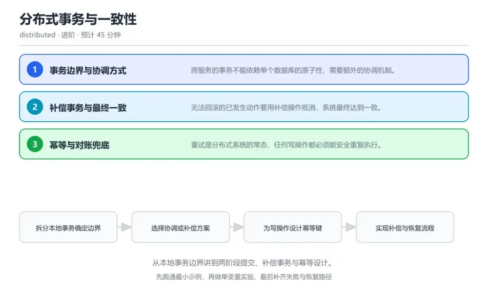
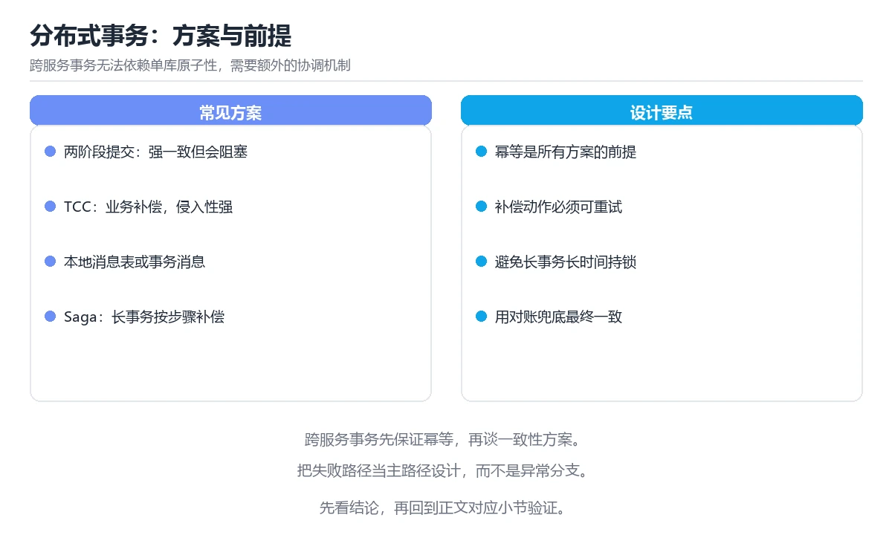

# 分布式事务与一致性

> 内容更新时间：2026-10-06 · 学习阶段：进阶 · 预计用时：40 分钟

分类：distributed。关键词：分布式事务、两阶段提交、补偿、幂等、最终一致。从本地事务边界讲到两阶段提交、补偿事务与幂等设计。



## 本节知识框架

**课程定位**：所属分类 `distributed`（分布式与架构），课程主题 `分布式事务与一致性`，学习阶段 进阶，建议用时 40 分钟。

本课主线：从本地事务边界讲到两阶段提交、补偿事务与幂等设计。

**学完本课应当能够**
- 说清 `本地事务` 与 `两阶段提交` 的含义与区别，并各举一个正例和一个反例。
- 用本课示例验证 `补偿事务` 的行为，记录输入、输出与失败条件。
- 遇到「重试导致重复扣款」这类问题时，能说出触发条件与修复顺序。

### 从概念到验证的学习链条

1. `本地事务`：先掌握 在单个数据库内保证原子性的操作集合，再用它解释 `两阶段提交` 为什么会出现。
2. `两阶段提交`：先掌握 先准备后提交的分布式协调协议，再用它解释 `补偿事务` 为什么会出现。
3. `补偿事务`：先掌握 用反向操作抵消已生效动作的方案，再用它解释 `幂等键` 为什么会出现。
4. `幂等键`：先掌握 标识一次业务请求的唯一值，用于去重，再用它解释 `对账` 为什么会出现。
5. `对账`：先掌握 比对双方记录以发现并修正差异，再用它解释 本课示例的观察结果 为什么会出现。

**先修与衔接**：本课是「分布式与架构」分类的第 8 课。当前没有登记显式先修或后续课程；课程主线是从本地事务边界讲到两阶段提交、补偿事务与幂等设计。学完后按 `distributed` 分类顺序继续。

### 完成判据

- **定义关**：不看正文也能说明 `本地事务` 是 在单个数据库内保证原子性的操作集合，并指出一个反例。
- **机制关**：能按“输入 → 转换 → 输出 → 验证”复述 `分布式事务与一致性`，而不是只背结论。
- **示例关**：能运行或推演 `分布式事务与一致性` 的 `text` 示例，并说明一个真实出现的标识符或字面量。
- **证据关**：能指出 `分布式事务与一致性` 示例里的 调用了 `place_order()`，并说明它支持或反驳了本课的哪一条结论。
- **排错关**：能复现 重试导致重复扣款，记录现象并按 为每次业务请求分配唯一键并加数据库唯一约束，重复请求返回上一次结果 修复。
- **迁移关**：能把 `分布式事务`、`两阶段提交`、`补偿`、`幂等` 放进一个与 `分布式事务与一致性` 不同的项目场景，并保持输入与验证条件可追踪。
- **复盘关**：学完 `分布式事务与一致性` 后，用一句话写下仍然不确定的结论，并列出下一次验证需要的输入、环境和成功判据。

### 复习清单

- [ ] 能不看正文复述本课核心术语，并指出一个边界或反例。
- [ ] 能运行或推演本课示例，记录输入、输出与失败现象。
- [ ] 能完成一次自测，并把错题对照错误表定位原因。

**本课配图**



## 核心概念定义

| 术语 | 操作性定义 | 常见边界与风险 |
| --- | --- | --- |
| 本地事务 | 在单个数据库内保证原子性的操作集合。 | 索引命中与数据分布决定实际开销，判断前先看执行计划而不是只看结果是否正确。 |
| 两阶段提交 | 先准备后提交的分布式协调协议。 | 隔离级别与并发事务会影响可见性，换级别或换存储引擎后要重新验证。 |
| 补偿事务 | 用反向操作抵消已生效动作的方案。 | 只在「用反向操作抵消已生效动作的方案」这一前提下成立，换输入或换环境要重新验证。 |
| 幂等键 | 标识一次业务请求的唯一值，用于去重。 | 易错：写接口没有幂等键，超时后直接重试；正确做法是为每次业务请求分配唯一键并加数据库唯一约束，重复请求返回上一次结果。 |
| 对账 | 比对双方记录以发现并修正差异。 | 只在「比对双方记录以发现并修正差异」这一前提下成立，换输入或换环境要重新验证。 |

## 原理与运行机制

### 机制总览

**教材衔接：核心知识**

### 1. 事务边界与协调方式

跨服务的事务不能依赖单个数据库的原子性，需要额外的协调机制。

把业务拆成若干本地事务，由协调者推进各参与方的提交或回滚，协调者记录全局状态以便故障恢复。

在分布式事务与一致性里可以这样验证：在本课示例里让一个参与方在第一阶段成功后失败，观察协调者发起回滚。

边界：协调者本身故障且状态未持久化时，参与方会长期处于不确定状态。

工程视角：协调者状态先落盘再下发指令，参与方保留超时与查询接口以便恢复时确认结果。

### 2. 补偿事务与最终一致

无法回滚的已发生动作要用补偿操作抵消，系统最终达到一致。

每个步骤定义正向操作与补偿操作，失败时按相反顺序执行补偿；补偿操作本身也必须幂等，允许重试。

在分布式事务与一致性里可以这样验证：在本课示例里让扣款成功而发货失败，观察退款补偿把资金恢复。

边界：补偿不等于回滚，外部已产生的副作用可能无法完全抵消，需要在业务上设计可接受的止损方式。

工程视角：补偿动作与正向动作同时评审，记录补偿执行原因与结果并对账。

### 3. 幂等与对账兜底

重试是分布式系统的常态，任何写操作都必须能安全重复执行。

用业务唯一号加唯一约束，重复请求直接返回上一次结果；定期对账比较双方记录，发现差异后触发补单或冲正。

在分布式事务与一致性里可以这样验证：在本课示例里重复提交同一笔请求，观察只有一条记录生效并返回相同结果。

边界：依赖调用方保证不重复提交是不可靠的，网络超时后的重试无法避免。

工程视角：所有跨服务写接口都要求幂等键，对账任务按日运行并把差异量作为核心指标。

### 机制拆解：每一步的输入、动作与输出

#### 1. `本地事务`
- 输入：`分布式事务`；本步把 在单个数据库内保证原子性的操作集合 当作判断规则。
- 动作：围绕 `本地事务` 保留中间状态，并记录它与 `两阶段提交` 的对应关系。
- 输出：`两阶段提交`，它可以被下一段代码、测试或记录继续使用。
- `本地事务` 的失败条件：索引命中与数据分布决定实际开销，判断前先看执行计划而不是只看结果是否正确。

#### 2. `两阶段提交`
- 输入：`本地事务`；本步把 先准备后提交的分布式协调协议 当作判断规则。
- 动作：围绕 `两阶段提交` 保留中间状态，并记录它与 `补偿事务` 的对应关系。
- 输出：`补偿事务`，它可以被下一段代码、测试或记录继续使用。
- `两阶段提交` 的失败条件：隔离级别与并发事务会影响可见性，换级别或换存储引擎后要重新验证。

#### 3. `补偿事务`
- 输入：`两阶段提交`；本步把 用反向操作抵消已生效动作的方案 当作判断规则。
- 动作：围绕 `补偿事务` 保留中间状态，并记录它与 `幂等键` 的对应关系。
- 输出：`幂等键`，它可以被下一段代码、测试或记录继续使用。
- `补偿事务` 的失败条件：只在「用反向操作抵消已生效动作的方案」这一前提下成立，换输入或换环境要重新验证。

#### 4. `幂等键`
- 输入：`补偿事务`；本步把 标识一次业务请求的唯一值，用于去重 当作判断规则。
- 动作：围绕 `幂等键` 保留中间状态，并记录它与 `对账` 的对应关系。
- 输出：`对账`，它可以被下一段代码、测试或记录继续使用。
- `幂等键` 的失败条件：当重试导致重复扣款时，会出现写接口没有幂等键，超时后直接重试。

#### 5. `对账`
- 输入：`幂等键`；本步把 比对双方记录以发现并修正差异 当作判断规则。
- 动作：围绕 `对账` 保留中间状态，并记录它与 `place_order` 的对应关系。
- 输出：`place_order`，它可以被下一段代码、测试或记录继续使用。
- `对账` 的失败条件：只在「比对双方记录以发现并修正差异」这一前提下成立，换输入或换环境要重新验证。

### 示例中的可观察事实

1. 调用了 `place_order()`；它对应的课程主题是 `分布式事务与一致性`。
2. 调用了 `insert_if_absent()`；它对应的课程主题是 `分布式事务与一致性`。
3. 调用了 `get_order()`；它对应的课程主题是 `分布式事务与一致性`。
4. 调用了 `charge()`；它对应的课程主题是 `分布式事务与一致性`。
5. 调用了 `update_status()`；它对应的课程主题是 `分布式事务与一致性`。
6. 调用了 `create()`；它对应的课程主题是 `分布式事务与一致性`。
7. 调用了 `refund()`；它对应的课程主题是 `分布式事务与一致性`。
8. 出现字面量 `orders`；它对应的课程主题是 `分布式事务与一致性`。

### 复现实验记录

- 环境：`分布式事务与一致性` 使用 `text` 示例，固定 `分布式事务`、`两阶段提交`、`补偿`、`幂等` 作为第一组条件。
- 首轮输入：先确认 调用了 `place_order()`，预测 `本地事务` 会怎样变化。
- 基线观察：记录命令、输入、输出和错误原文，不用截图代替可复制的文本。
- 单变量修改：只改变 `分布式事务`，观察 `对账` 是否仍满足定义。
- 失败注入：复现 重试导致重复扣款，确认现象是 写接口没有幂等键，超时后直接重试。
- 记录结论：把“修改前、修改后、预期变化、实际变化”写成四列表，这样复盘 `分布式事务与一致性` 时才能区分概念错误与实现错误。

## 典型应用场景

**教材衔接：深度拓展与实战**

### 机制拆解 1：事务边界与协调方式

把业务拆成若干本地事务，由协调者推进各参与方的提交或回滚，协调者记录全局状态以便故障恢复。

落地时先确认前提：协调者本身故障且状态未持久化时，参与方会长期处于不确定状态。再把结论写进检查表，让下一位同学可以按同样的输入复现。

工程做法：协调者状态先落盘再下发指令，参与方保留超时与查询接口以便恢复时确认结果。

### 机制拆解 2：补偿事务与最终一致

每个步骤定义正向操作与补偿操作，失败时按相反顺序执行补偿；补偿操作本身也必须幂等，允许重试。

落地时先确认前提：补偿不等于回滚，外部已产生的副作用可能无法完全抵消，需要在业务上设计可接受的止损方式。再把结论写进检查表，让下一位同学可以按同样的输入复现。

工程做法：补偿动作与正向动作同时评审，记录补偿执行原因与结果并对账。

### 机制拆解 3：幂等与对账兜底

用业务唯一号加唯一约束，重复请求直接返回上一次结果；定期对账比较双方记录，发现差异后触发补单或冲正。

落地时先确认前提：依赖调用方保证不重复提交是不可靠的，网络超时后的重试无法避免。再把结论写进检查表，让下一位同学可以按同样的输入复现。

工程做法：所有跨服务写接口都要求幂等键，对账任务按日运行并把差异量作为核心指标。

### 机制对照表

| 概念 | 解决什么问题 | 关键前提 | 失败信号 |
| --- | --- | --- | --- |
| 事务边界与协调方式 | 跨服务的事务不能依赖单个数据库的原子性，需要额外的协调机制。 | 协调者本身故障且状态未持久化时，参与方会长期处于不确定状态。 | 协调者状态先落盘再下发指令，参与方保留超时与查询接口以便恢复时确认结果。 |
| 补偿事务与最终一致 | 无法回滚的已发生动作要用补偿操作抵消，系统最终达到一致。 | 补偿不等于回滚，外部已产生的副作用可能无法完全抵消，需要在业务上设计可接 | 补偿动作与正向动作同时评审，记录补偿执行原因与结果并对账。 |
| 幂等与对账兜底 | 重试是分布式系统的常态，任何写操作都必须能安全重复执行。 | 依赖调用方保证不重复提交是不可靠的，网络超时后的重试无法避免。 | 所有跨服务写接口都要求幂等键，对账任务按日运行并把差异量作为核心指标。 |

### 自测问答

**问 1**：为什么跨服务写操作必须支持幂等？

**答**：网络超时后的重试无法避免，重复请求必须安全。超时无法区分「对方没收到」与「对方已处理但回包丢失」，重试是必要手段，只有幂等才能保证结果正确。 正确选项「网络超时后的重试无法避免，重复请求必须安全」对应《分布式事务与一致性》的要点「事务边界与协调方式」：跨服务的事务不能依赖单个数据库的原子性，需要额外的协调机制。判断「事务边界与协调方式」时先确认前提是否成立，再回到《分布式事务与一致性》的示例核对一次；把别的语言或框架的默认做法直接搬到事务边界与协调方式上，往往会在本课的边界条件里失效。

**问 2**：两阶段提交的主要代价是？

**答**：协调期间资源被锁定，协调者故障会影响可用性。参与方在准备后要持有资源等待最终决定，期间延迟上升，协调者故障还会让参与方长时间处于不确定状态。 正确选项「协调期间资源被锁定，协调者故障会影响可用性」对应《分布式事务与一致性》的要点「补偿事务与最终一致」：无法回滚的已发生动作要用补偿操作抵消，系统最终达到一致。判断「补偿事务与最终一致」时先确认前提是否成立，再回到《分布式事务与一致性》的示例核对一次；借鉴相邻主题的经验之前，先核对补偿事务与最终一致的前提是否成立。

**问 3**：设计补偿事务时需要注意哪些点？（多选）

**答**：补偿操作本身要幂等；补偿顺序与正向操作相反；记录补偿原因与结果。补偿需要可重试、顺序正确且可追溯；外部副作用可能无法完全抵消，必须准备业务层面的止损方案。 正确选项「补偿操作本身要幂等；补偿顺序与正向操作相反；记录补偿原因与结果」对应《分布式事务与一致性》的要点「幂等与对账兜底」：重试是分布式系统的常态，任何写操作都必须能安全重复执行。判断「幂等与对账兜底」时先确认前提是否成立，再回到《分布式事务与一致性》的示例核对一次；记住幂等与对账兜底的结论之外还要记住适用条件，换一个输入往往就不成立了。

**问 4**：请按一次带补偿的下单流程排列。

**答**：写入本地状态并校验幂等键。先落状态保证幂等，再按顺序调用参与方，失败时执行补偿，最后更新状态并通过对账确认一致性。 正确选项「写入本地状态并校验幂等键；调用扣款并记录结果；调用发货服务；发货失败时执行退款补偿；更新状态并纳入对账」对应《分布式事务与一致性》的要点「事务边界与协调方式」：跨服务的事务不能依赖单个数据库的原子性，需要额外的协调机制。判断「事务边界与协调方式」时先确认前提是否成立，再回到《分布式事务与一致性》的示例核对一次；干扰项常常是相邻主题里成立的结论，只有按事务边界与协调方式的输入与约束判断才能排除。

**问 5**：阅读这段代码，风险是什么？

**答**：退款补偿不幂等，重试会造成多次退款。补偿逻辑被重试时可能重复退款，造成资金损失；补偿必须带幂等键或先检查状态，确保同一笔业务最多退款一次。 正确选项「退款补偿不幂等，重试会造成多次退款」对应《分布式事务与一致性》的要点「补偿事务与最终一致」：无法回滚的已发生动作要用补偿操作抵消，系统最终达到一致。判断「补偿事务与最终一致」时先确认前提是否成立，再回到《分布式事务与一致性》的示例核对一次；把补偿事务与最终一致的做法换到别的约束下未必成立，先确认边界再决定答案。


### 工程检查表

- [ ] 拆分本地事务确定边界
- [ ] 选择协调或补偿方案
- [ ] 为写操作设计幂等键
- [ ] 实现补偿与恢复流程
- [ ] 对账确认最终一致
- [ ] 【事务边界与协调方式】协调者状态先落盘再下发指令，参与方保留超时与查询接口以便恢复时确认结果。
- [ ] 【补偿事务与最终一致】补偿动作与正向动作同时评审，记录补偿执行原因与结果并对账。
- [ ] 【幂等与对账兜底】所有跨服务写接口都要求幂等键，对账任务按日运行并把差异量作为核心指标。


### 结论与下一步

- **重试导致重复扣款**：典型现象是写接口没有幂等键，超时后直接重试；正确做法是为每次业务请求分配唯一键并加数据库唯一约束，重复请求返回上一次结果。
- **协调者崩溃后状态不明**：典型现象是协调者只在内存中维护事务状态；正确做法是协调状态先持久化再下发指令，参与方提供查询接口供恢复时确认结果。
- **补偿操作无法重试**：典型现象是退款逻辑不幂等，重试产生多次退款；正确做法是补偿操作同样使用幂等键，重复执行返回同一结果并记录每次尝试。

### 最小验证场景

- 准备：保留 `text` 示例的原始输入，先记录 `分布式事务与一致性` 的基线输出和完整运行命令。
- 观察：先核对 调用了 `place_order()`，再改变一个与 `本地事务` 相关的条件。
- 判定：新结果与 `分布式事务与一致性` 的基线不同不等于错误；只有当差异破坏了 `本地事务` 的定义或错误表中的约束，才判定为失败。

### 选择与边界

- 使用 `本地事务` 时，先满足它的定义：在单个数据库内保证原子性的操作集合；索引命中与数据分布决定实际开销，判断前先看执行计划而不是只看结果是否正确。
- 使用 `两阶段提交` 时，先满足它的定义：先准备后提交的分布式协调协议；隔离级别与并发事务会影响可见性，换级别或换存储引擎后要重新验证。
- 使用 `补偿事务` 时，先满足它的定义：用反向操作抵消已生效动作的方案；只在「用反向操作抵消已生效动作的方案」这一前提下成立，换输入或换环境要重新验证。
- 使用 `幂等键` 时，先满足它的定义：标识一次业务请求的唯一值，用于去重；易错：写接口没有幂等键，超时后直接重试；正确做法是为每次业务请求分配唯一键并加数据库唯一约束，重复请求返回上一次结果。
- 使用 `对账` 时，先满足它的定义：比对双方记录以发现并修正差异；只在「比对双方记录以发现并修正差异」这一前提下成立，换输入或换环境要重新验证。

## 代码/协议/SQL 示例

**教材衔接：关键流程**

```text
拆分本地事务确定边界 → 选择协调或补偿方案 → 为写操作设计幂等键 → 实现补偿与恢复流程 → 对账确认最终一致
```

1. 拆分本地事务确定边界
2. 选择协调或补偿方案
3. 为写操作设计幂等键
4. 实现补偿与恢复流程
5. 对账确认最终一致

```python
def place_order(request_id, user_id, amount):
    """跨服务下单：本地事务记录状态，失败走补偿，重复请求返回原结果。"""
    # 1. 幂等键唯一约束：同一 request_id 只处理一次
    if not db.insert_if_absent("orders", request_id, user_id, amount, status="pending"):
        return db.get_order(request_id)          # 重复请求直接返回已有结果

    # 2. 扣款：带幂等键，超时重试不会重复扣
    paid = payment.charge(idempotency_key=request_id, user=user_id, amount=amount)
    if not paid.ok:
        db.update_status(request_id, "failed")
        return {"status": "failed", "reason": paid.reason}

    # 3. 发货失败则执行补偿：退款并记录补偿原因
    shipped = shipping.create(request_id, user_id)
    if not shipped.ok:
        payment.refund(idempotency_key=request_id)   # 补偿操作同样幂等
        db.update_status(request_id, "compensated")
        return {"status": "compensated", "reason": shipped.reason}

    db.update_status(request_id, "completed")
    return {"status": "completed"}
```

### 示例精读：先找证据，再改一个条件

1. 调用了 `place_order()`；它出现在 `分布式事务与一致性` 的示例中，阅读时先确认它前后各发生了什么。
2. 调用了 `insert_if_absent()`；它出现在 `分布式事务与一致性` 的示例中，阅读时先确认它前后各发生了什么。
3. 调用了 `get_order()`；它出现在 `分布式事务与一致性` 的示例中，阅读时先确认它前后各发生了什么。
4. 调用了 `charge()`；它出现在 `分布式事务与一致性` 的示例中，阅读时先确认它前后各发生了什么。
5. 调用了 `update_status()`；它出现在 `分布式事务与一致性` 的示例中，阅读时先确认它前后各发生了什么。
6. 调用了 `create()`；它出现在 `分布式事务与一致性` 的示例中，阅读时先确认它前后各发生了什么。
7. 调用了 `refund()`；它出现在 `分布式事务与一致性` 的示例中，阅读时先确认它前后各发生了什么。
8. 出现字面量 `orders`；它出现在 `分布式事务与一致性` 的示例中，阅读时先确认它前后各发生了什么。
- 在 `分布式事务与一致性` 中与 `本地事务` 对照：示例必须能支持 在单个数据库内保证原子性的操作集合，否则说明这一段还缺少实现或验证步骤。
- 在 `分布式事务与一致性` 中与 `两阶段提交` 对照：示例必须能支持 先准备后提交的分布式协调协议，否则说明这一段还缺少实现或验证步骤。
- 在 `分布式事务与一致性` 中与 `补偿事务` 对照：示例必须能支持 用反向操作抵消已生效动作的方案，否则说明这一段还缺少实现或验证步骤。
- 在 `分布式事务与一致性` 中与 `幂等键` 对照：示例必须能支持 标识一次业务请求的唯一值，用于去重，否则说明这一段还缺少实现或验证步骤。

## 时间/空间复杂度或性能分析

**性能关注点（分布式事务与一致性）**：一致性与可用性存在权衡：记录 P99 延迟、副本同步延迟与故障恢复时间。

**本课特有开销（分布式事务与一致性 · 分布式事务）**：缓存命中率比缓存实现本身更关键，先记录命中率与失效策略再谈优化。

**测量方法**：以 `分布式事务与一致性` 的 `分布式事务` 场景为对象，固定输入跑一遍记录基线，再把规模或并发度提高一个数量级复测；两次结果的差值与波动范围才是结论依据。

### 需要控制的变量与记录项

- `分布式事务与一致性` 的 `分布式事务`：固定它的版本、输入范围和资源上限，分别记录速度、内存与失败率的变化。
- `分布式事务与一致性` 的 `两阶段提交`：固定它的版本、输入范围和资源上限，分别记录速度、内存与失败率的变化。
- `分布式事务与一致性` 的 `补偿`：固定它的版本、输入范围和资源上限，分别记录速度、内存与失败率的变化。
- `分布式事务与一致性` 的 `幂等`：固定它的版本、输入范围和资源上限，分别记录速度、内存与失败率的变化。
- `分布式事务与一致性` 的 `最终一致`：固定它的版本、输入范围和资源上限，分别记录速度、内存与失败率的变化。
- `分布式事务与一致性` 中 `本地事务` 的边界：索引命中与数据分布决定实际开销，判断前先看执行计划而不是只看结果是否正确。达到边界时不要外推，必须重新测量。
- `分布式事务与一致性` 中 `两阶段提交` 的边界：隔离级别与并发事务会影响可见性，换级别或换存储引擎后要重新验证。达到边界时不要外推，必须重新测量。
- `分布式事务与一致性` 中 `补偿事务` 的边界：只在「用反向操作抵消已生效动作的方案」这一前提下成立，换输入或换环境要重新验证。达到边界时不要外推，必须重新测量。
- `分布式事务与一致性` 中 `幂等键` 的边界：易错：写接口没有幂等键，超时后直接重试；正确做法是为每次业务请求分配唯一键并加数据库唯一约束，重复请求返回上一次结果。达到边界时不要外推，必须重新测量。
- `分布式事务与一致性` 中 `对账` 的边界：只在「比对双方记录以发现并修正差异」这一前提下成立，换输入或换环境要重新验证。达到边界时不要外推，必须重新测量。
- `分布式事务与一致性` 的代码证据：先验证 调用了 `place_order()`，再记录该路径的输入规模与耗时；只看代码行数不能推出复杂度。

## 常见误区与易错点

| 容易写错的做法 | 实际现象 | 原因与正确做法 |
| --- | --- | --- |
| 重试导致重复扣款 | 写接口没有幂等键，超时后直接重试。 | 为每次业务请求分配唯一键并加数据库唯一约束，重复请求返回上一次结果。 |
| 协调者崩溃后状态不明 | 协调者只在内存中维护事务状态。 | 协调状态先持久化再下发指令，参与方提供查询接口供恢复时确认结果。 |
| 补偿操作无法重试 | 退款逻辑不幂等，重试产生多次退款。 | 补偿操作同样使用幂等键，重复执行返回同一结果并记录每次尝试。 |

### 现场 1：重试导致重复扣款

**症状**：写接口没有幂等键，超时后直接重试。

**根因与修复**：为每次业务请求分配唯一键并加数据库唯一约束，重复请求返回上一次结果。

**自检**：在本课示例里复现「重试导致重复扣款」，改成为每次业务请求分配唯一键并加数据库唯一约束，重复请求返回上一次结果后重跑；如果症状消失且失败路径按预期变化，说明定位正确。

### 现场 2：协调者崩溃后状态不明

**症状**：协调者只在内存中维护事务状态。

**根因与修复**：协调状态先持久化再下发指令，参与方提供查询接口供恢复时确认结果。

**自检**：在本课示例里复现「协调者崩溃后状态不明」，改成协调状态先持久化再下发指令，参与方提供查询接口供恢复时确认结果后重跑；如果症状消失且失败路径按预期变化，说明定位正确。

### 现场 3：补偿操作无法重试

**症状**：退款逻辑不幂等，重试产生多次退款。

**根因与修复**：补偿操作同样使用幂等键，重复执行返回同一结果并记录每次尝试。

**自检**：在本课示例里复现「补偿操作无法重试」，改成补偿操作同样使用幂等键，重复执行返回同一结果并记录每次尝试后重跑；如果症状消失且失败路径按预期变化，说明定位正确。

## 与其他知识点的关系

**教材衔接：复习与迁移**


### 迁移练习

- **术语归属**：`本地事务`、`两阶段提交`、`补偿事务` 的定义以本课「核心概念定义」为准，换到其他课程时先确认定义是否被改写。
- 同一分类的《分布式系统原理》也涉及 `幂等`；两课衔接时先确认这个术语的定义是否一致。
- 同一分类的《消息队列与事件驱动》也涉及 `幂等`；两课衔接时先确认这个术语的定义是否一致。

### 容易混淆的相邻概念

- `本地事务` 与 `两阶段提交`：前者强调 在单个数据库内保证原子性的操作集合；后者强调 先准备后提交的分布式协调协议。判断时分别检查两条定义的适用范围，不要只看名称相似就互换。
- `两阶段提交` 与 `补偿事务`：前者强调 先准备后提交的分布式协调协议；后者强调 用反向操作抵消已生效动作的方案。判断时分别检查两条定义的适用范围，不要只看名称相似就互换。
- `补偿事务` 与 `幂等键`：前者强调 用反向操作抵消已生效动作的方案；后者强调 标识一次业务请求的唯一值，用于去重。判断时分别检查两条定义的适用范围，不要只看名称相似就互换。
- `幂等键` 与 `对账`：前者强调 标识一次业务请求的唯一值，用于去重；后者强调 比对双方记录以发现并修正差异。判断时分别检查两条定义的适用范围，不要只看名称相似就互换。

## 自测题与参考答案

> 先独立作答，再对照参考答案；答案都能在本课正文、术语表或错误表里找到依据。

### 自测 1（概念复述）

不看正文，写出 `本地事务` 的操作性定义，并说明它与 `两阶段提交` 的区别。

**参考答案**：在单个数据库内保证原子性的操作集合。

`两阶段提交` 的定位是：先准备后提交的分布式协调协议；两者的差别要从适用对象与失败模式上说明。

### 自测 2（排错）

本课错误表记录了「重试导致重复扣款」这类做法。请写出它会出现的现象、根因，以及修复顺序。

**参考答案**：现象是写接口没有幂等键，超时后直接重试；正确做法是为每次业务请求分配唯一键并加数据库唯一约束，重复请求返回上一次结果。修复时先复现现象并保留证据，再改动一处假设重跑，确认现象消失。

### 自测 3（动手验证）

运行本课的 `text` 示例，改动其中一个输入后重新运行，记录输出与错误信息。

**参考答案**：正常输入下 `text` 示例应当复现正文给出的结果；改动输入后，如果结果改变或报错，先核对它是否满足 `分布式事务与一致性` 中`本地事务` 的适用范围，再检查错误表里是否有同类现象。

### 自测 4（代码阅读）

阅读本课开头的 `text` 示例，说明它体现了`本地事务` 的哪一条性质，并指出改动哪个输入会让这条性质不再成立。

**参考答案**：`本地事务` 的定义是 在单个数据库内保证原子性的操作集合，示例正是在实现这条定义。改动与 `本地事务` 有关的一个输入后，如果结果不再符合 `分布式事务与一致性` 的正文描述，就说明该性质只在当前前提成立。

### 自测 5（迁移）

把 `分布式事务与一致性` 的方法迁移到自己的项目：围绕 `本地事务` 写出一个与错误表同类的风险点，并说明触发条件和检验方式。

**参考答案**：例如「补偿操作无法重试」，它会导致退款逻辑不幂等，重试产生多次退款；检验方式是按补偿操作同样使用幂等键，重复执行返回同一结果并记录每次尝试改一处再复现，确认现象消失且没有引入新的失败分支。

### 自测 6（对比）

用一个表格对比 `本地事务` 与 `两阶段提交`：各写一行适用场景、一行失败表现。

**参考答案**：`本地事务` 的定义是在单个数据库内保证原子性的操作集合；`两阶段提交` 的定义是先准备后提交的分布式协调协议。两者的失败表现分别对应本课错误表里与本术语相关的行。

### 自测 7（排错顺序）

面对「重试导致重复扣款」引发的问题，请把“复现 写接口没有幂等键，超时后直接重试 → 保留证据 → 为每次业务请求分配唯一键并加数据库唯一约束，重复请求返回上一次结果 → 回归验证”四步写成可执行的检查清单。

**参考答案**：第一步按写接口没有幂等键，超时后直接重试复现；第二步记录输入、版本与完整报错；第三步按为每次业务请求分配唯一键并加数据库唯一约束，重复请求返回上一次结果只改一处；第四步重跑并确认失败路径也按预期变化。

### 自测 8（边界判断）

针对 `对账`，分别写出“可以使用”的条件和“结论不再成立”的条件。

**参考答案**：只在「比对双方记录以发现并修正差异」这一前提下成立，换输入或换环境要重新验证。 同时要把 `对账` 的定义 比对双方记录以发现并修正差异 与实际输入逐项对照。

### 自测 9（机制重建）

不看正文，按输入、转换、输出、验证四段重建 `本地事务` → `两阶段提交` → `补偿事务` → `幂等键` 的作用链。

**参考答案**：起点是 `本地事务` 的定义 在单个数据库内保证原子性的操作集合；中间每一步都保留可观察状态；终点由 `对账` 检查，失败时回到错误表定位第一个偏离定义的步骤。

### 自测 10（综合排错）

在 `分布式事务与一致性` 中，现象是 退款逻辑不幂等，重试产生多次退款。请围绕 补偿操作无法重试 写出最小复现、关键证据、修复动作和回归验证，并说明为什么不能只凭一次运行下结论。

**参考答案**：先复现 补偿操作无法重试，记录输入与完整错误；再按 补偿操作同样使用幂等键，重复执行返回同一结果并记录每次尝试 只改一处。回归时同时跑正常路径和边界路径，只有两次结果都可解释，才把修复视为完成。

### 自测 11（一分钟复述）

用每分钟约 200 字的速度复述 `分布式事务与一致性`：先给主问题，再按顺序说出 `本地事务`、`两阶段提交`、`补偿事务`、`幂等键`，最后给一个失败案例。

**自评标准**：主问题必须对应 从本地事务边界讲到两阶段提交、补偿事务与幂等设计；每个术语都要能接上一句定义或边界；失败案例必须写成可观察现象，不能用“可能有风险”代替证据。

## 术语速查

| 术语 | 一句话说明 |
| --- | --- |
| `本地事务` | 在单个数据库内保证原子性的操作集合。 |
| `两阶段提交` | 先准备后提交的分布式协调协议。 |
| `补偿事务` | 用反向操作抵消已生效动作的方案。 |
| `幂等键` | 标识一次业务请求的唯一值，用于去重。 |
| `对账` | 比对双方记录以发现并修正差异。 |

**术语关系**：`本地事务`（在单个数据库内保证原子性的操作集合） → `两阶段提交`（先准备后提交的分布式协调协议） → `补偿事务`（用反向操作抵消已生效动作的方案） → `幂等键`（标识一次业务请求的唯一值）。

## 考点精讲

`分布式事务与一致性` 的题库有 5 道题，下面逐题给出题干、正确项与判断依据：先自己作答，再核对正确项，最后回到正文对应小节复核。

### 考点 1：第 1 题

- **题目**：为什么跨服务写操作必须支持幂等？
- **正确项**：网络超时后的重试无法避免，重复请求必须安全
- **判断依据**：这道题检验本课主问题：从本地事务边界讲到两阶段提交、补偿事务与幂等设计。复习时先复述本课主问题，再举一个会让结论失效的输入。

### 考点 2：第 2 题

- **题目**：两阶段提交的主要代价是？
- **正确项**：协调期间资源被锁定，协调者故障会影响可用性
- **判断依据**：这道题落在术语 `两阶段提交` 上：先准备后提交的分布式协调协议。复习时把 `两阶段提交` 的定义、适用边界和一个反例一起说清楚，再回到「核心概念定义」核对原文。

### 考点 3：第 3 题

- **题目**：设计补偿事务时需要注意哪些点？（多选）
- **正确项**：补偿操作本身要幂等；补偿顺序与正向操作相反；记录补偿原因与结果
- **判断依据**：这道题落在术语 `补偿事务` 上：用反向操作抵消已生效动作的方案。复习时把 `补偿事务` 的定义、适用边界和一个反例一起说清楚，再回到「核心概念定义」核对原文。

### 考点 4：第 4 题

- **题目**：请按一次带补偿的下单流程排列。
- **正确项**：写入本地状态并校验幂等键 → 调用扣款并记录结果 → 调用发货服务 → 发货失败时执行退款补偿 → 更新状态并纳入对账
- **判断依据**：这道题落在术语 `幂等键` 上：标识一次业务请求的唯一值，用于去重。复习时把 `幂等键` 的定义、适用边界和一个反例一起说清楚，再回到「核心概念定义」核对原文。

### 考点 5：第 5 题

- **题目**：阅读这段代码，风险是什么？
- **正确项**：退款补偿不幂等，重试会造成多次退款
- **判断依据**：这道题检验本课主问题：从本地事务边界讲到两阶段提交、补偿事务与幂等设计。复习时先复述本课主问题，再举一个会让结论失效的输入。

### 考点 6：`本地事务`

- **要点**：在单个数据库内保证原子性的操作集合。
- **本地事务 的边界**：索引命中与数据分布决定实际开销，判断前先看执行计划而不是只看结果是否正确。

### 考点 7：`两阶段提交`

- **要点**：先准备后提交的分布式协调协议。
- **两阶段提交 的边界**：隔离级别与并发事务会影响可见性，换级别或换存储引擎后要重新验证。

### 考点 8：`补偿事务`

- **要点**：用反向操作抵消已生效动作的方案。
- **补偿事务 的边界**：只在「用反向操作抵消已生效动作的方案」这一前提下成立，换输入或换环境要重新验证。

### 考点 9：`幂等键`

- **要点**：标识一次业务请求的唯一值，用于去重。
- **幂等键 的边界**：易错：写接口没有幂等键，超时后直接重试；正确做法是为每次业务请求分配唯一键并加数据库唯一约束，重复请求返回上一次结果。

### 考点 10：`对账`

- **要点**：比对双方记录以发现并修正差异。
- **对账 的边界**：只在「比对双方记录以发现并修正差异」这一前提下成立，换输入或换环境要重新验证。

### 考点 11：排错——重试导致重复扣款

- **现象**：写接口没有幂等键，超时后直接重试。
- **处理**：为每次业务请求分配唯一键并加数据库唯一约束，重复请求返回上一次结果。

### 考点 12：排错——协调者崩溃后状态不明

- **现象**：协调者只在内存中维护事务状态。
- **处理**：协调状态先持久化再下发指令，参与方提供查询接口供恢复时确认结果。

### 考点 13：综合辨析——`本地事务` 与 `对账`

- **辨析点**：`本地事务` 的定义是 在单个数据库内保证原子性的操作集合；`对账` 的定义是 比对双方记录以发现并修正差异。
- **答题要求**：面对 `分布式事务与一致性` 的题目，先判断描述的是 `本地事务` 还是 `对账`，再归到对应定义，最后写出一个会让该定义失效的边界输入。

### 考点 14：排错评分点

- **现象分**：能写出 写接口没有幂等键，超时后直接重试，而不是只写“程序有错”。
- **证据分**：保留触发 重试导致重复扣款 的输入、版本和错误原文。
- **修复分**：按 为每次业务请求分配唯一键并加数据库唯一约束，重复请求返回上一次结果 只改一处，并同时回归正常路径与边界路径。

## 内容元数据

- 内容版本：v2.0
- 最后更新：2026-10-06
- 学习阶段：进阶

| 字段 | 值 |
| --- | --- |
| 课程 ID | `dist_transaction` |
| 所属分类 | `distributed` |
| 难度 | 进阶 |
| 预计用时 | 45 分钟 |
| 关键词 | 分布式事务、两阶段提交、补偿、幂等、最终一致 |
| 配图 | `images/lesson_dist_transaction.webp` |
| 参考资料 | 2 条 |
| 内容更新时间 | 2026-10-06 |

## 参考资料与复核

- 来源性质：官方文档、标准或权威教材；本课核对关键词：分布式事务、两阶段提交、补偿、幂等、最终一致。
- 最后复核：2026-10-04
- 下次复核：2027-07-24
- 复核范围：版本兼容、API 行为与工程实践

下面列出的资料用于核对本课结论，复习时可以对照阅读：
- [Microservices.io：Saga 模式](https://microservices.io/patterns/data/saga.html)
- [Martin Fowler：事务与一致性模式](https://martinfowler.com/articles/patterns-of-distributed-systems/)

| [本课术语索引：分布式事务与一致性](#核心概念定义) | 按本课输入、术语边界和错误表现逐项核对 |
> 复核提示：《分布式事务与一致性》的结论如与资料冲突，以资料中的规范文本为准，并在笔记里记录差异与日期。