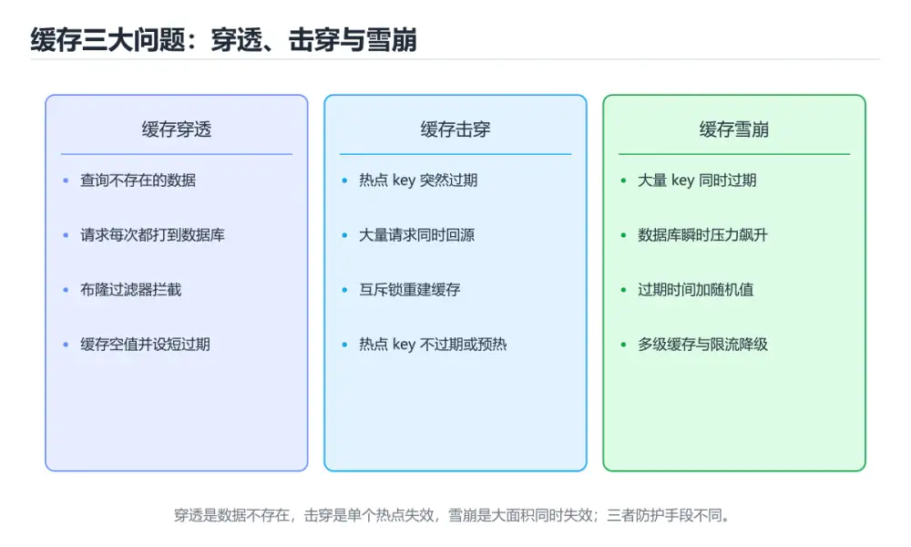
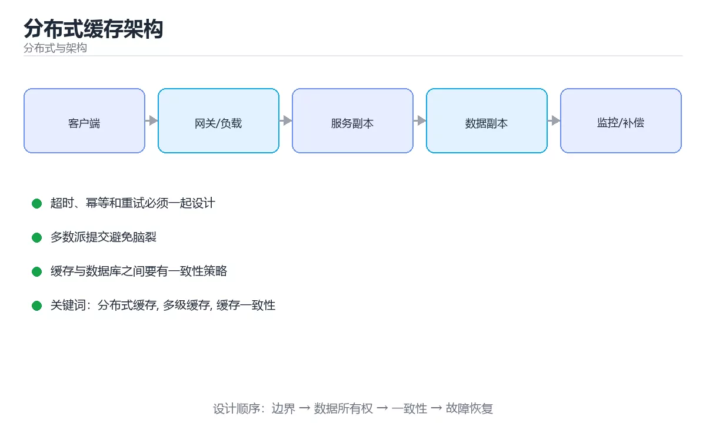

# 分布式缓存架构

> 内容更新时间：2026-10-06 · 学习阶段：进阶 · 预计用时：25 分钟





## 学习目标

- 能用自己的话解释分布式缓存架构解决了什么问题，而不是只背术语。
- 能说清 「分布式缓存」、「多级缓存」、「缓存一致性」、「热点key」 之间的关系，并分别举出一个例子。
- 能把本课知识放回「分布式与架构」的知识体系，说明它和相邻主题的边界。
- 能完成本课练习，并用验收标准检查自己的结果。

> 一句话摘要：多级缓存分工、一致性策略与击穿雪崩治理。

## 前置知识

- 先完成上一课《限流与熔断算法专题》；如果已经掌握，可以直接用本课练习自测。
- 本课阶段：进阶。建议先掌握同一分类的基础课程，并能独立运行正文中的最小示例。
- 开始前先复习：分布式缓存、多级缓存、缓存一致性。
- 如果某一步看不懂，先记录具体卡点，完成练习后再回头读一遍。

## 分层与职责

| 层 | 位置 | 延迟 | 容量 | 失效方式 |
| --- | --- | --- | --- | --- |
| 本地缓存 | 应用进程内 | 纳秒到微秒 | 最小 | 进程内 TTL、广播失效 |
| 分布式缓存 | Redis / Memcached | 亚毫秒 | 大 | TTL、主动删除 |
| 数据库缓存 | 数据库缓冲池 | 微秒 | 中 | 由数据库管理 |
| CDN 边缘 | 离用户最近 | 毫秒 | 很大 | 过期与主动刷新 |

分层的价值：本地缓存挡住热点，分布式缓存挡住回源，CDN 挡住网络往返。

## 一致性策略速查

| 策略 | 做法 | 优点 | 风险 |
| --- | --- | --- | --- |
| Cache-Aside | 读未命中查库回填；写先更库再删缓存 | 简单可靠 | 短时不一致 |
| 延迟双删 | 更新库后删缓存，短暂延时再删一次 | 缓解并发回填旧值 | 仍有窗口期 |
| Write-Through | 写缓存同时写库 | 一致性好 | 写延迟高 |
| Write-Behind | 先写缓存异步落库 | 写性能高 | 宕机可能丢数据 |
| 逻辑过期 | 值内带过期时间，过期后异步刷新 | 无缓存击穿 | 需要后台刷新任务 |

```python
import random
import threading
import time
from dataclasses import dataclass, field

@dataclass
class LocalCache:
    """本地 LRU 缓存：容量固定，命中后更新访问顺序。"""

    capacity: int = 128
    ttl_seconds: float = 30.0
    store: dict = field(default_factory=dict)
    lock: threading.Lock = field(default_factory=threading.Lock)

    def get(self, key: str):
        with self.lock:
            item = self.store.get(key)
            if item is None:
                return None
            value, expire_at = item
            if expire_at < time.monotonic():
                self.store.pop(key, None)
                return None
            self.store.pop(key)               # 重新插入以保持 LRU 顺序
            self.store[key] = item
            return value

    def set(self, key: str, value) -> None:
        with self.lock:
            self.store.pop(key, None)
            self.store[key] = (value, time.monotonic() + self.ttl_seconds)
            while len(self.store) > self.capacity:
                self.store.pop(next(iter(self.store)))

    def invalidate(self, key: str) -> None:
        with self.lock:
            self.store.pop(key, None)

def ttl_with_jitter(base_seconds: int, ratio: float = 0.2) -> float:
    """过期时间加抖动：避免大批 key 同时失效引发雪崩。"""
    delta = base_seconds * ratio
    return round(base_seconds + random.uniform(-delta, delta), 2)

def read_through(cache: LocalCache, remote, db, key: str):
    """三级读取：本地缓存、分布式缓存、数据库回填。"""
    value = cache.get(key)
    if value is not None:
        return value, "local"
    value = remote.get(key)
    if value is not None:
        cache.set(key, value)
        return value, "remote"
    value = db(key)
    remote.set(key, value, ex=int(ttl_with_jitter(300)))
    cache.set(key, value)
    return value, "db"

cache = LocalCache(capacity=2)
cache.set("a", 1)
print(cache.get("a"), cache.get("missing"))
print(ttl_with_jitter(300))
```

## 高可用与容量速查

| 主题 | 做法 |
| --- | --- |
| 缓存故障 | 集群模式或哨兵，避免单点 |
| 热点 key | 本地缓存 + key 打散（加随机后缀分片） |
| 大 key | 拆分结构，避免单次操作阻塞 |
| 缓存穿透 | 缓存空值、布隆过滤器、参数校验 |
| 缓存击穿 | 互斥重建、逻辑过期、热点不过期 |
| 缓存雪崩 | 过期加抖动、多级缓存、限流降级 |
| 缓存与库不一致 | 先更库再删缓存 + 重试 + 对账 |
| 一致性要求高 | 直接读主库并接受性能代价 |

## 常见错误与排查

| 容易踩的做法 | 实际现象 | 原因与正确做法 |
| --- | --- | --- |
| 先删缓存再更新数据库 | 并发下回填旧值 | 改为先更库再删缓存（可加延迟双删） |
| 所有 key 固定 TTL | 到点集体失效 | 加随机抖动 |
| 本地缓存不做失效广播 | 多实例数据不一致 | 用发布订阅广播失效或缩短 TTL |
| 缓存当作唯一数据源 | 清缓存或重启后数据丢失 | 数据库为权威存储 |
| 用 `KEYS` 清理 | 实例阻塞 | 用 `SCAN` 或按前缀索引清理 |
| 缓存里存可变对象引用 | 外部修改污染缓存 | 存副本或不可变对象 |
| 不做命中率监控 | 优化无依据 | 记录命中率、回源率、淘汰数 |

## 复习与自测

- [ ] 能画出本地、分布式、CDN 三层缓存的分工。
- [ ] 写路径采用「先更库再删缓存」并说明理由。
- [ ] TTL 加抖动，热点 key 有专门策略。
- [ ] 缓存穿透、击穿、雪崩三类问题都有对策。
- [ ] 有命中率与回源率监控。

## 动手练习

> 本课练习重点：围绕「分布式缓存、多级缓存、缓存一致性」完成复述、实验和交付，每个结果都要能被别人检查。

先画拓扑与数据流，再注入节点或网络故障，最后验证恢复与一致性。

### 练习 1：建立心智模型（10 分钟）

合上教程，用 3～5 句话回答：

1. 分布式缓存架构解决了什么问题？
2. 如果没有它，会出现什么具体后果？
3. 它和「多级缓存」是什么关系？

**验收标准**：至少出现一个本课关键词，并写出一个反例、边界条件或失效场景。

### 练习 2：做一次可控实验（20 分钟）

从正文中选一个最小示例，完成以下操作：

1. 先预测修改一个参数、输入或步骤后的结果。
2. 再实际执行或逐步推演，记录真实结果。
3. 如果结果与预测不同，写出差异原因。

**验收标准**：留下「原例 → 改动 → 预测 → 结果 → 原因」五步记录。

### 练习 3：交付一个小结果（30 分钟）

画出系统拓扑，设计一次节点宕机或网络延迟演练，并写出恢复步骤。

任务要求：

- 结果必须能被别人检查，不能只写“我已经理解了”。
- 至少覆盖「分布式缓存」和「多级缓存」两个关键词。
- 写出 1 个仍然不确定的问题，以及下一步如何验证。

> 提示：时间有限时优先做练习 1 和练习 2；练习 3 可以拆成两次完成。

## 本课小结

- 核心问题：分布式缓存架构不是孤立术语，而是在「分布式与架构」中解决一类具体问题。
- 关键关系：先分清「分布式缓存」与「多级缓存」的职责，再理解「缓存一致性」的适用边界。
- 判断标准：能解释正常场景、边界条件和失败场景，才算真正掌握。
- 下一步：完成练习后，用自己的话写下 3 条要点，再去做本课测验。

## 深入补充：分布式缓存架构

前面已经建立了基本概念。这一节换一个角度，把分布式缓存架构放进真实工程里，
重点回答三件事：它为什么存在、内部如何运转、什么时候会失效。

### 一、核心模型

分布式缓存把热点数据分散到多个节点，用分片扩展容量和吞吐，用副本提高可用性；难点是一致性、淘汰、热点、失效和故障转移。

```text
客户端请求 → 路由到分片 → 命中返回/未命中回源 → 写入缓存 → 副本同步 → 节点故障 → 重新分片或故障转移
```

### 二、关键机制拆解

1. 分片键决定数据分布，一致性哈希或虚拟槽能减少扩缩容时的数据迁移。
2. 副本提高可用性和读吞吐，但要处理同步延迟、故障检测和一致性策略。
3. 缓存一致性常见策略包括先更新数据库再删除缓存、延迟双删和版本号校验。
4. 热点键会压垮单个分片，需要本地缓存、键拆分、读副本或限流。
5. 缓存穿透用空值缓存或布隆过滤器缓解，击穿用互斥重建，雪崩用 TTL 抖动和预热。
6. 故障转移要避免惊群：客户端退避重连、限制回源并发并保留降级策略。
7. 跨机房缓存要考虑复制延迟和一致性，强一致场景可能需要把缓存当作加速层而非真相来源。

### 三、对照表：抓住容易混淆的边界

| 维度 | 一侧 | 另一侧 |
| --- | --- | --- |
| 本地缓存 | 进程内，延迟最低 | 容量小且多实例不一致 |
| 分布式缓存 | 跨节点共享，容量大 | 网络延迟和一致性更复杂 |
| 一致性哈希 | 节点变化只迁移部分键 | 需要处理虚拟节点和倾斜 |
| 固定分片 | 映射简单 | 扩缩容迁移量大 |

### 四、工作示例

电商商品缓存按商品 ID 分片，热点商品加本地二级缓存；更新时先写数据库再删除缓存，并用版本号防止旧值回填。节点宕机时，客户端对剩余节点回源限流，避免数据库被打穿。

### 五、常见误区与失效边界

| 错误做法或假设 | 后果 | 正确做法 |
| --- | --- | --- |
| 先删缓存再写数据库 | 并发读把旧值写回 | 先写库再删缓存并加版本校验 |
| 缓存没有 TTL | 数据永久不一致且内存膨胀 | 按业务设置 TTL 和主动失效 |
| 节点故障后全部回源 | 数据库雪崩 | 限流、降级和保底数据 |
| 只按平均值分片 | 热点键集中 | 监控热点并做键拆分或本地缓存 |

### 六、场景推演

缓存节点扩容后大量请求超时。原因是固定哈希导致几乎所有键重新映射，缓存集体失效。改用一致性哈希或虚拟槽后，扩容只迁移部分键，命中率平滑下降再恢复。

### 七、自测问答

**Q1：一致性哈希解决什么问题？**

节点增减时只迁移少量键，减少缓存集体失效。

**Q2：缓存击穿和穿透有什么区别？**

击穿是热点键失效后并发回源，穿透是查询根本不存在的数据。

**Q3：为什么先写库再删缓存？**

它降低并发读把旧值写回缓存的概率，并可配合版本号进一步校验。

**Q4：缓存节点故障如何防止雪崩？**

限流、退避、降级、预热和保留可接受的旧值。

### 八、小项目：把知识变成可检查的产出

实现三个缓存节点的分片路由，分别用固定哈希和一致性哈希做扩容实验；模拟热点键、节点故障和缓存雪崩，记录命中率、回源量和数据库 QPS。

### 九、适用边界

分布式缓存提升读性能和扩展性，但不能解决数据一致性本身。缓存必须被视为可丢失的加速层，真相仍应在可靠存储中。

### 十、完成检查清单

- [ ] 能设计分片键与副本策略
- [ ] 能比较一致性与失效策略
- [ ] 能处理热点、穿透、击穿和雪崩
- [ ] 能设计故障转移和限流降级
- [ ] 能监控命中率、回源量和延迟

### 十一、复习顺序

1. 先不看资料复述“核心模型”，确认能说出它解决的三个问题。
2. 再对照表逐行解释容易混淆的概念，每个概念补一个反例。
3. 跟着工作示例做一遍，改变一个条件并预测结果。
4. 用自测问答检查理解，错题回到对应小节重新阅读。
5. 最后完成小项目，把结果、失败记录和复查清单整理成一份可提交产物。

> 复习不是重读一遍，而是离开原文重新产出：复述、改写、验证、复盘。

## 可运行练习

本节围绕分布式缓存架构安排 3 个可交付任务，每个任务都要求留下可以复查的记录。

### 任务 1：用自己的话画出结构

不看书，用一张图说清「分布式缓存架构」的结构，画完再对照骨架：

- 主干：分层与职责 → 一致性策略速查 → 高可用与容量速查 → 深入补充：分布式缓存架构
- 连接线：在每条边上标出输入、输出与失败路径。
- 自检：能否用一句话说明分布式缓存与多级缓存的关系？

### 任务 2：做一次对比实验

**验收标准**：表格里两个方案的结论不能完全一样；写下“在什么条件下应该换方案”。

### 任务 3：迁移到自己的场景

**验收标准**：至少有一个可复现的命令、代码片段或数据样例；结论能被别人独立检查。

## 故障现场

### 现场 1：本课的 分布式缓存 常规用例通过，但边界用例失败

**症状**：在本课的练习或生产场景里出现“本课的 分布式缓存 常规用例通过，但边界用例失败”。

**复现**：准备一组最小输入，只保留触发“本课的 分布式缓存 常规用例通过，但边界用例失败”的必要条件，连续运行两次确认结果稳定。

**定位**：围绕“分布式缓存 的前置条件与取值边界没有写进代码，默认值掩盖了空值和极值”检查调用链、输入数据和环境配置，先验证假设再改代码。

**预防**：把“本课的 分布式缓存 常规用例通过，但边界用例失败”写成一条自动化用例，并在本课的验收清单里保留对应检查项。

### 现场 2：本课的 多级缓存 结果在两次运行之间不一致

**症状**：在本课的练习或生产场景里出现“本课的 多级缓存 结果在两次运行之间不一致”。

**复现**：准备一组最小输入，只保留触发“本课的 多级缓存 结果在两次运行之间不一致”的必要条件，连续运行两次确认结果稳定。

**定位**：围绕“多级缓存 依赖了当前版本、执行顺序或共享状态，单次运行无法暴露差异”检查调用链、输入数据和环境配置，先验证假设再改代码。

**预防**：把“本课的 多级缓存 结果在两次运行之间不一致”写成一条自动化用例，并在本课的验收清单里保留对应检查项。

### 现场 3：本课的验证只在开发机通过

**症状**：在本课的练习或生产场景里出现“本课的验证只在开发机通过”。

**定位**：围绕“环境版本、配置和输入规模与目标环境不同，分布式缓存 缺少可重复的验证记录”检查调用链、输入数据和环境配置，先验证假设再改代码。

## 本课复习清单

离开本课前，逐项确认：

- [ ] 不看解析，能说出「Cache-Aside 模式推荐的写路径是？」的判断依据。
- [ ] 不看解析，能说出「缓存穿透指的是？」的判断依据。
- [ ] 不看解析，能说出「为什么给缓存过期时间加随机抖动？」的判断依据。
- [ ] 不看解析，能说出「本地缓存多实例部署时，最大的风险是？」的判断依据。
- [ ] 不看解析，能说出「Redis 中清理大量键时，为什么不用 KEYS 命令？」的判断依据。
- [ ] 至少运行一次本课示例，记录输入、输出和一个边界情况。
- [ ] 把本课最容易混淆的两个概念写成一句话对照。

| 复盘项 | 记录 |
| --- | --- |
| 已经能独立解释的考点 |  |
| 仍然说不清的概念 |  |
| 下一步验证动作 |  |

## 术语速查

| 术语 | 一句话说明 |
| --- | --- |
| `KEYS` | \| 用 `KEYS` 清理 \| 实例阻塞 \| 用 `SCAN` 或按前缀索引清理 \| |
| `SCAN` | \| 用 `KEYS` 清理 \| 实例阻塞 \| 用 `SCAN` 或按前缀索引清理 \| |
| `分布式缓存` | 围绕“环境版本、配置和输入规模与目标环境不同，分布式缓存 缺少可重复的验证记录”检查调用链、输入数据和环境配置，先验证假设再改代码。 |
| `多级缓存` | 围绕“多级缓存 依赖了当前版本、执行顺序或共享状态，单次运行无法暴露差异”检查调用链、输入数据和环境配置，先验证假设再改代码。 |
| `缓存一致性` | 关键关系：先分清「分布式缓存」与「多级缓存」的职责，再理解「缓存一致性」的适用边界。 |
| `热点key` | 它在「分布式缓存架构」里是理解「热点key」的关键术语，用来解释定义、适用条件与失败路径；它与分布式缓存、多级缓存共同决定这一节的判断边界。复习时回到正文示例核对输入、输出和验证方式。 |

## 考点精讲

### 考点 1：多选辨析·分布式缓存

- **题目**：围绕“分布式缓存架构”中的 分布式缓存、多级缓存、缓存一致性，下列哪两项是本课强调的实践判断？
- **判断依据**：本课把分布式缓存架构拆成概念、示例与故障现场三部分，因此判断 分布式缓存 时必须同时交代输入、输出和失败路径，这使“学习 分布式缓存 时要同时说明输入、输出和失败路径，不能只看正常流程”成立。在分布式缓存架构里，判断 多级缓存 时要固定版本与边界输入，所以“验证 多级缓存 时要固定版本并覆盖边界输入，结论才可复现”才可复现。

### 考点 2：顺序排列·分布式缓存

- **题目**：按“分布式缓存架构”中 分布式缓存、多级缓存、缓存一致性 的实践顺序，把四个步骤排成从准备到复盘的合理顺序。
- **判断依据**：在「分布式缓存架构」里，在本课的练习里，顺序应当是：先明确 分布式缓存 的输入、输出与约束 → 写出最小示例并核对 多级缓存 的基线结果 → 只改一个变量，记录边界与失败路径的变化 → 固定版本与证据，把本课的结论写成可复现记录。这个顺序把 分布式缓存 的输入、输出和约束放在最前面，在分布式缓存架构里避免概念没对齐就开始调参。第二步用 多级缓存 建立可核对的基线，在分布式缓存架构里第三步才允许改变一个变量并观察失败路径。

### 考点 3：概念判断·分布式缓存

- **题目**：为什么给缓存过期时间加随机抖动？
- **判断依据**：在「分布式缓存架构」里，避免大量 key 同时失效造成雪崩。批量写入的 key 如果 TTL 相同会同时过期，瞬间把压力全部转移到数据库。回到「分布式缓存架构」的正文示例，用“为什么给缓存过期时间加随机抖动”走一遍分布式缓存、多级缓存、缓存一致性的完整流程，能复现的结论才可以保留。

### 考点 4：概念判断·分布式缓存

- **题目**：本地缓存多实例部署时，最大的风险是？
- **判断依据**：在「分布式缓存架构」里，结论应落在「各实例缓存不一致」。本地缓存各自独立，更新后必须通过发布订阅广播失效或使用极短 TTL，否则不同实例返回不同数据。在「分布式缓存架构」里，这道题要求区分概念与边界，「各实例缓存不一致」只有在题干给出的前提下才成立，而「不支持 TTL」、「内存占用过高」缺少同一组条件。

### 考点 5：概念判断·分布式缓存

- **题目**：Redis 中清理大量键时，为什么不用 KEYS 命令？
- **判断依据**：在「分布式缓存架构」里，KEYS 是 O(n) 阻塞命令。Redis 单线程执行命令，KEYS 会遍历全库并阻塞其他请求，应改用 SCAN 游标分批处理。回到「分布式缓存架构」的正文示例，用“Redis 中清理大量键时”走一遍分布式缓存、多级缓存、缓存一致性的完整流程，能复现的结论才可以保留。

### 考点 6：排错·分布式缓存

- **题目**：阅读「分布式缓存架构」的代码片段，下面哪项判断是正确的？
- **判断依据**：“阅读分布式缓存架构的代码片段”与「分布式缓存架构」的术语表相呼应，只有符合分布式缓存、多级缓存、缓存一致性约束的“先更新数据库再删缓存”才是正文支持的结论。在「分布式缓存架构」里，回到分布式缓存、多级缓存、缓存一致性本身再看一遍：只有“先更新数据库再删缓存”与题干“阅读的代码片段”的前提一致，结论才成立。

## English Overview

**Title:** Distributed Cache Architecture

**Summary:** Multi-tier cache, consistency strategies and failure modes.

**Category:** Distributed Systems
**Level:** 进阶
**Key terms:** 分布式缓存, 多级缓存, 缓存一致性, 热点key, 缓存雪崩

## 内容元数据

- 内容版本：v2.0
- 最后更新：2026-10-06
- 学习阶段：进阶
- 适用环境：分布式系统与云原生基础设施
- 内容来源：内置结构化课程与工程实践整理
- 相关主题：分布式缓存、多级缓存、缓存一致性、热点key、缓存雪崩
- 质量版本：P0 测验标准 + P1 覆盖扩展 + P2 体验补全

## 参考资料与复核

- 最后复核：2026-10-04
- 下次复核：2027-04-04
- 复核范围：版本兼容、API 行为、安全建议与工程实践
- 来源性质：官方文档、标准或权威教材；正文为离线教学重组

| 参考资料 | 本课用途 |
| --- | --- |
| [AWS 架构中心](https://aws.amazon.com/architecture/) | 高可用与云架构模式 |
| [Martin Fowler 事件驱动](https://martinfowler.com/articles/201701-event-driven.html) | 事件、消息与一致性 |
| [Google SRE 书](https://sre.google/books/) | 可靠性、容量与事故响应 |

> 「分布式缓存架构」的链接用于离线阅读后的延伸核对；App 不会自动联网。
