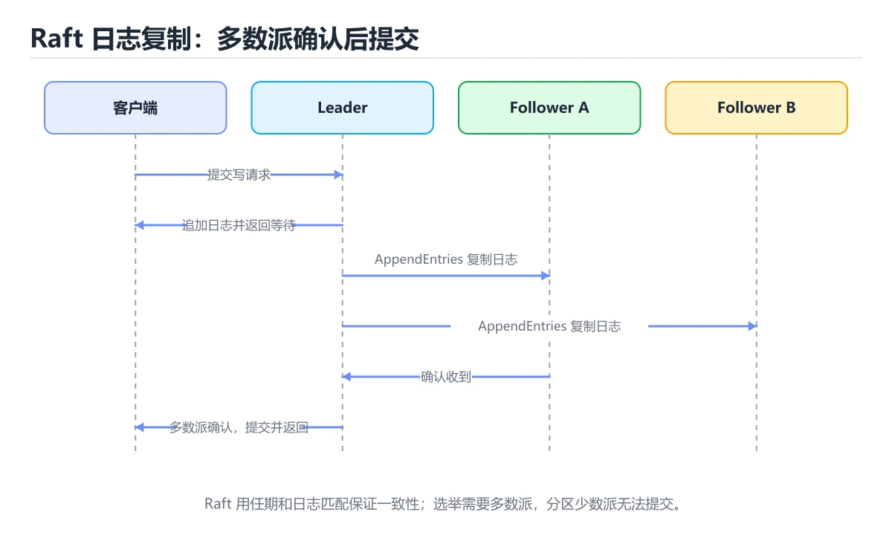

# 共识与复制：Raft 实战要点




> 内容更新时间：2026-10-06 · 学习阶段：高级 · 预计用时：60 分钟

## 本节知识框架

**课程定位**：所属分类 `distributed`（分布式与架构），课程主题 `共识与复制：Raft 实战要点`，学习阶段 高级，建议用时 60 分钟。

本课主线：Leader 选举、日志复制、安全性约束与工程参数。

**学完本课应当能够**
- 说清 `Raft` 与 `共识` 的含义与区别，并各举一个正例和一个反例。
- 用本课示例验证 `选主` 的行为，记录输入、输出与失败条件。
- 遇到「把单节点写入当成提交」这类问题时，能说出触发条件与修复顺序。

### 从概念到验证的学习链条

1. `Raft`：先掌握 用伪代码或简化程序实现三节点 Raft 的选举和日志复制，模拟 Leader 宕机、网络分区、日志冲突和节点恢复四种场景，输出每一步任期、角色和日志状态，再用它解释 `共识` 为什么会出现。
2. `共识`：先掌握 多个节点在存在故障或延迟时对同一个值或日志顺序达成一致，再用它解释 `选主` 为什么会出现。
3. `选主`：先掌握 关键关系：先分清「Raft」与「共识」的职责，再理解「选主」的适用边界，再用它解释 `日志复制` 为什么会出现。
4. `日志复制`：先掌握 leader 把日志条目同步给多数派之后才提交，保证各副本按同一顺序推进状态，再用它解释 本课示例的观察结果 为什么会出现。

**先修与衔接**：本课是「分布式与架构」分类的第 11 课。先修内容：《实战：设计一个短链服务》。《实战：设计一个短链服务》里的 `实战`、`短链` 是本课的前提。相关或后续课程：《分布式 ID 与发号器》。

### 完成判据

- **定义关**：不看正文也能说明 `Raft` 是 用伪代码或简化程序实现三节点 Raft 的选举和日志复制，模拟 Leader 宕机、网络分区、日志冲突和节点恢复四种场景，输出每一步任期、角色和日志状态，并指出一个反例。
- **机制关**：能按“输入 → 转换 → 输出 → 验证”复述 `共识与复制：Raft 实战要点`，而不是只背结论。
- **示例关**：能运行或推演 `共识与复制：Raft 实战要点` 的 `text` 示例，并说明一个真实出现的标识符或字面量。
- **证据关**：能从 `共识与复制：Raft 实战要点` 的示例写出一个输入、处理、输出三元组，并说明它支持或反驳了本课的哪一条结论。
- **排错关**：能复现 把单节点写入当成提交，记录现象并按 必须等待多数节点确认 修复。
- **迁移关**：能把 `Raft`、`共识`、`选主`、`日志复制` 放进一个与 `共识与复制：Raft 实战要点` 不同的项目场景，并保持输入与验证条件可追踪。
- **复盘关**：学完 `共识与复制：Raft 实战要点` 后，用一句话写下仍然不确定的结论，并列出下一次验证需要的输入、环境和成功判据。

### 复习清单

- [ ] 能不看正文复述本课核心术语，并指出一个边界或反例。
- [ ] 能运行或推演本课示例，记录输入、输出与失败现象。
- [ ] 能完成一次自测，并把错题对照错误表定位原因。

## 核心概念定义

| 术语 | 操作性定义 | 常见边界与风险 |
| --- | --- | --- |
| Raft | 用伪代码或简化程序实现三节点 Raft 的选举和日志复制，模拟 Leader 宕机、网络分区、日志冲突和节点恢复四种场景，输出每一步任期、角色和日志状态。 | 网络延迟、超时与版本协商会改变行为，只在真实链路或多版本客户端上验证才算数。 |
| 共识 | 多个节点在存在故障或延迟时对同一个值或日志顺序达成一致。 | 易错：可能同时出现两个多数派；正确做法是使用联合共识或一次只变更一个节点。 |
| 选主 | 关键关系：先分清「Raft」与「共识」的职责，再理解「选主」的适用边界。 | 易错：选主反复失败；正确做法是使用随机化超时。 |
| 日志复制 | leader 把日志条目同步给多数派之后才提交，保证各副本按同一顺序推进状态。 | 隔离级别与并发事务会影响可见性，换级别或换存储引擎后要重新验证。 |

## 原理与运行机制

### 机制总览

**教材衔接：要解决什么问题**

多副本系统里，只要允许网络分区与节点故障，「谁说了算」就必须有明确规则。共识算法的目标是：**在多数节点存活时，系统仍能就同一个值达成一致，并且已提交的值不会丢失。**

| 概念 | 含义 |
| --- | --- |
| Leader | 当前处理写请求的节点 |
| Follower | 被动接收日志的节点 |
| Candidate | 发起选举的节点 |
| Term | 任期编号，逻辑时钟，用于识别过期信息 |
| Log Index | 日志位置编号 |
| Commit Index | 已复制到多数派并可对外可见的位置 |
| Quorum | 多数派，n 个节点需 ⌊n/2⌋+1 |

**教材衔接：工程要点速查**

| 主题 | 建议 |
| --- | --- |
| 节点数 | 生产用 3 或 5；偶数不增加容错只增加成本 |
| 选举超时 | 随机化（如 150 到 300ms），避免同时选举 |
| 心跳间隔 | 明显小于选举超时，通常为其 1/3 到 1/5 |
| 日志持久化 | 先落盘再回复，否则崩溃后可能丢已确认日志 |
| 快照 | 定期压缩日志，避免无限增长与恢复变慢 |
| 成员变更 | 用单节点变更或联合共识，禁止一次性替换多数 |
| 只读请求 | 用 ReadIndex 或租约机制避免读到过期数据 |
| 监控 | 任期变化、选举次数、复制延迟、提交延迟 |

**教材衔接：交付评审：评分表、决策记录与证据链**


### 二、需要写下来的决策（ADR）

| 决策点 | 本课给出的做法 | 备选方案 | 代价与回滚 |
| --- | --- | --- | --- |
| 一、核心模型 | 共识协议让多个节点在部分故障下对同一日志顺序达成一致；Raft 把问题拆成领导者选举、日志复制和安全性三条主线，便于理解和工程实现。 | 不做「一、核心模型」，沿用最朴素的实现（需要额外补一次对照实验） | 若「一、核心模型」出问题，回到上一版本并按本课验收场景重跑 |
| 九、适用边界 | 共识解决的是复制日志顺序和安全提交，不自动解决业务幂等、跨地域延迟和吞吐扩展。 | 不做「九、适用边界」，沿用最朴素的实现（需要额外补一次对照实验） | 若「九、适用边界」出问题，回到上一版本并按本课验收场景重跑 |
| 架构与数据流 | 用户/输入 → 接口或命令 → 领域逻辑 → 存储/外部依赖 → 输出与监控 | 不做「架构与数据流」，沿用最朴素的实现（需要额外补一次对照实验） | 若「架构与数据流」出问题，回到上一版本并按本课验收场景重跑 |

### 三、「共识与复制：Raft 实战要点」的交付证据链

本课未给出可执行命令，用下面的最小证据集代替：

### 四、「共识与复制：Raft 实战要点」的验收指标

| 指标 | 目标值 | 测量方式 | 不达标时的动作 |
| --- | --- | --- | --- |
| | 节点数 | 生产用 3 或 5；偶数不增加容错只增加成本 | | 用本课正文给出的阈值，没有就写实测基线 | 固定环境重复三次取中位数 | 回到对应小节定位，先修原因再重测 |

### 五、评审记录模板

| 记录项 | 填写要求 |
| --- | --- |
| 项目标识 | `distributed_consensus` |
| 本次范围 | 说明这一轮交付了「共识与复制：Raft 实战要点」的哪些部分 |
| 未完成项 | 列出与 Raft 相关但本轮未做的内容 |
| 证据位置 | 指向 evidence/ 目录下的具体文件 |
| 风险与回滚 | 写清剩余风险、回滚步骤和验证方式 |
| 结论 | 通过 / 有条件通过 / 不通过，三者选一 |

### 机制拆解：每一步的输入、动作与输出

#### 1. `Raft`
- 输入：`Raft`；本步把 用伪代码或简化程序实现三节点 Raft 的选举和日志复制，模拟 Leader 宕机、网络分区、日志冲突和节点恢复四种场景，输出每一步任期、角色和日志状态 当作判断规则。
- 动作：围绕 `Raft` 保留中间状态，并记录它与 `共识` 的对应关系。
- 输出：`共识`，它可以被下一段代码、测试或记录继续使用。
- `Raft` 的失败条件：网络延迟、超时与版本协商会改变行为，只在真实链路或多版本客户端上验证才算数。

#### 2. `共识`
- 输入：`Raft`；本步把 多个节点在存在故障或延迟时对同一个值或日志顺序达成一致 当作判断规则。
- 动作：围绕 `共识` 保留中间状态，并记录它与 `选主` 的对应关系。
- 输出：`选主`，它可以被下一段代码、测试或记录继续使用。
- `共识` 的失败条件：当成员变更随意加节点时，会出现可能同时出现两个多数派。

#### 3. `选主`
- 输入：`共识`；本步把 关键关系：先分清「Raft」与「共识」的职责，再理解「选主」的适用边界 当作判断规则。
- 动作：围绕 `选主` 保留中间状态，并记录它与 `日志复制` 的对应关系。
- 输出：`日志复制`，它可以被下一段代码、测试或记录继续使用。
- `选主` 的失败条件：当选举超时固定时，会出现选主反复失败。

#### 4. `日志复制`
- 输入：`选主`；本步把 leader 把日志条目同步给多数派之后才提交，保证各副本按同一顺序推进状态 当作判断规则。
- 动作：围绕 `日志复制` 保留中间状态，并记录它与 `本课示例的最终结果` 的对应关系。
- 输出：`本课示例的最终结果`，它可以被下一段代码、测试或记录继续使用。
- `日志复制` 的失败条件：隔离级别与并发事务会影响可见性，换级别或换存储引擎后要重新验证。

### 复现实验记录

- 环境：`共识与复制：Raft 实战要点` 使用 `text` 示例，固定 `Raft`、`共识`、`选主`、`日志复制` 作为第一组条件。
- 首轮输入：从示例中的第一个输入开始，预测 `Raft` 会怎样变化。
- 基线观察：记录命令、输入、输出和错误原文，不用截图代替可复制的文本。
- 单变量修改：只改变 `Raft`，观察 `日志复制` 是否仍满足定义。
- 失败注入：复现 把单节点写入当成提交，确认现象是 Leader 宕机后数据丢失。
- 记录结论：把“修改前、修改后、预期变化、实际变化”写成四列表，这样复盘 `共识与复制：Raft 实战要点` 时才能区分概念错误与实现错误。

## 典型应用场景

**教材衔接：深入补充：共识与复制：Raft 实战要点**

前面已经建立了基本概念。这一节换一个角度，把共识与复制：Raft 实战要点放进真实工程里，
重点回答三件事：Raft 为什么存在、内部如何运转、什么时候会失效。

### 一、核心模型

共识协议让多个节点在部分故障下对同一日志顺序达成一致；Raft 把问题拆成领导者选举、日志复制和安全性三条主线，便于理解和工程实现。

```text
节点启动为 Follower → 选举超时 → 成为 Candidate 拉票 → 获得多数票成为 Leader → 接收客户端请求 → 复制日志 → 多数确认后提交 → 应用到状态机
```

### 二、关键机制拆解

1. 任何时刻最多只有一个 Leader 能获得多数票，因为多数集合之间必然相交。
2. 任期号单调递增，节点收到更高任期会立即更新并退回 Follower。
3. 日志条目包含索引和任期，只有包含全部已提交条目的候选人才可能当选。
4. 提交要求日志写入多数节点，单节点确认不代表安全。
5. Leader 通过心跳维持权威，Follower 在选举超时后发起新一轮选举。
6. 网络分区时少数派无法提交新日志，恢复后通过日志匹配和冲突覆盖回到一致状态。
7. 成员变更必须使用联合共识或单节点变更，避免同时出现两个多数集合。

### 三、对照表：抓住容易混淆的边界

| 维度 | 一侧 | 另一侧 |
| --- | --- | --- |
| Leader 选举 | 解决谁负责接收写入 | 不直接保证日志已提交 |
| 日志复制 | 把条目同步到多数节点 | 保证已提交日志不丢失 |
| 多数派 | 超过一半节点 | 任意两个多数派必然相交 |
| 状态机应用 | 把已提交日志变成业务状态 | 必须保证幂等或可重放 |

### 四、工作示例

三节点集群中 Leader A 将日志复制到 B，但 C 未收到。此时日志已获得多数确认，可以提交；若 A 宕机，B 因日志更完整而优先当选，C 恢复后会从 B 补齐缺失条目。

### 五、常见误区与失效边界

| 错误做法或假设 | 后果 | 正确做法 |
| --- | --- | --- |
| 把单节点写入当成提交 | Leader 宕机后数据丢失 | 必须等待多数节点确认 |
| 选举超时设置过短 | 频繁选举导致服务抖动 | 根据网络延迟设置随机化超时 |
| 日志冲突时直接覆盖已提交条目 | 破坏安全性 | 只允许覆盖未提交的冲突日志 |
| 成员变更随意加节点 | 可能同时出现两个多数派 | 使用联合共识或一次只变更一个节点 |

### 六、场景推演

跨机房部署三节点 Raft，主机房到备机房延迟 40ms。写入延迟由多数派往返决定；若把超时设成 50ms，网络抖动就会频繁触发选举。正确做法是测量 P99 延迟，设置更宽松且带随机抖动的选举超时。

### 七、自测问答

**Q1：为什么多数派之间必然相交？**

两个超过一半的集合不可能完全不相交，这保证了新 Leader 能看到已提交日志。

**Q2：Leader 宕机后为什么不会丢已提交数据？**

已提交日志至少存在于多数节点，新 Leader 必然来自包含该日志的多数集合。

**Q3：心跳的作用是什么？**

维持 Leader 权威并阻止 Follower 发起选举。

**Q4：成员变更为什么危险？**

旧配置和新配置可能各自形成多数派，导致双 Leader。

### 八、小项目：把知识变成可检查的产出

用伪代码或简化程序实现三节点 Raft 的选举和日志复制，模拟 Leader 宕机、网络分区、日志冲突和节点恢复四种场景，输出每一步任期、角色和日志状态。

### 九、适用边界

共识解决的是复制日志顺序和安全提交，不自动解决业务幂等、跨地域延迟和吞吐扩展。真正的分布式数据库还需要分片、事务、快照和运维工具。

### 十、完成检查清单

- [ ] 能解释 Leader 选举与多数派原理
- [ ] 能说明日志提交的安全条件
- [ ] 能处理日志冲突和节点恢复
- [ ] 能设计选举超时与心跳参数
- [ ] 能说明成员变更的安全流程

### 十一、复习顺序

1. 不看资料讲清「共识与复制：Raft 实战要点」的核心模型，并各举一个正例和反例。
2. 再对照表逐行解释容易混淆的概念，每个概念补一个反例。
3. 跟着工作示例做一遍，改变一个条件并预测结果。
4. 用自测问答检查理解，错题回到对应小节重新阅读。
5. 最后完成 Raft 的小项目，把结果、失败记录和复查清单整理成可提交产物。

> 复习不是重读一遍，而是离开原文重新产出：复述、改写、验证、复盘。

**教材衔接：项目专属规格：共识与复制：Raft 实战要点**

### 核心场景

Leader 选举、日志复制、安全性约束与工程参数。 项目目标是把「Raft、共识、选主、日志复制、多数派、Quorum」落实为可运行、可测试、可回滚的交付物。


### 验收场景

1. 正常路径：最小输入得到预期输出，并留下日志与指标。
2. 边界路径：Raft 的空值、最大值、重复数据和超长内容都得到明确处理。
3. 失败路径：依赖超时或不可用时能快速失败、重试或降级。
4. 幂等路径：同一请求执行两次不会产生重复副作用。
5. 回滚路径：Raft 回滚后数据一致，且能说明恢复时间和影响范围。

**教材衔接：项目交付物**

### 建议仓库结构

```text
src/
tests/
docs/
README.md
```


### 验收数据

```json
{
  "project": "distributed_consensus",
  "scenario": "Raft的正常路径",
  "input": {"case": "normal", "value": "default_factory"},
  "expected": {"ok": true, "checks": ["Raft可复现", "共识有记录"]},
  "failure_case": {"case": "共识越界或缺失", "error": "validation_error"},
  "idempotency_key": "distributed_consensus-001"
}
```

### 复盘模板

- **把单节点写入当成提交**：典型现象是Leader 宕机后数据丢失；正确做法是必须等待多数节点确认。
- **选举超时设置过短**：典型现象是频繁选举导致服务抖动；正确做法是根据网络延迟设置随机化超时。
- **日志冲突时直接覆盖已提交条目**：典型现象是破坏安全性；正确做法是只允许覆盖未提交的冲突日志。
- **成员变更随意加节点**：典型现象是可能同时出现两个多数派；正确做法是使用联合共识或一次只变更一个节点。

### 最小验证场景

- 准备：保留 `text` 示例的原始输入，先记录 `共识与复制：Raft 实战要点` 的基线输出和完整运行命令。
- 判定：新结果与 `共识与复制：Raft 实战要点` 的基线不同不等于错误；只有当差异破坏了 `Raft` 的定义或错误表中的约束，才判定为失败。

### 选择与边界

- 使用 `Raft` 时，先满足它的定义：用伪代码或简化程序实现三节点 Raft 的选举和日志复制，模拟 Leader 宕机、网络分区、日志冲突和节点恢复四种场景，输出每一步任期、角色和日志状态；网络延迟、超时与版本协商会改变行为，只在真实链路或多版本客户端上验证才算数。
- 使用 `共识` 时，先满足它的定义：多个节点在存在故障或延迟时对同一个值或日志顺序达成一致；易错：可能同时出现两个多数派；正确做法是使用联合共识或一次只变更一个节点。
- 使用 `选主` 时，先满足它的定义：关键关系：先分清「Raft」与「共识」的职责，再理解「选主」的适用边界；易错：选主反复失败；正确做法是使用随机化超时。
- 使用 `日志复制` 时，先满足它的定义：leader 把日志条目同步给多数派之后才提交，保证各副本按同一顺序推进状态；隔离级别与并发事务会影响可见性，换级别或换存储引擎后要重新验证。

## 代码/协议/SQL 示例

**教材衔接：Raft 两个子问题**

| 子问题 | 规则 |
| --- | --- |
| 选主 | 随机超时触发选举；获得多数票即成为 Leader；候选人日志不够新则拒绝投票 |
| 日志复制 | Leader 追加日志并并行发送；多数派确认后提交；Follower 冲突时回退覆盖 |

安全性约束（必须记住）：

1. **选举限制**：只投票给日志至少和自己一样新的候选人，保证已提交日志不会丢。
2. **提交规则**：只有当前任期的日志通过多数派复制后才能提交，不能仅凭计数提交旧任期日志。
3. **日志匹配**：相同 Index 与 Term 的日志内容必然相同。

```python
from dataclasses import dataclass, field

@dataclass
class LogEntry:
    index: int
    term: int
    command: str

@dataclass
class RaftNode:
    """极简 Raft 状态机：演示选举与多数派提交的判定逻辑。"""

    node_id: str
    peers: list
    current_term: int = 0
    voted_for: str | None = None
    log: list = field(default_factory=list)
    commit_index: int = 0

    def quorum(self) -> int:
        return len(self.peers) // 2 + 1

    def last_log(self) -> LogEntry | None:
        return self.log[-1] if self.log else None

    def can_vote_for(self, candidate_id: str, candidate_last: LogEntry | None) -> bool:
        """选举限制：候选人日志必须不落后，否则拒绝投票。"""
        if self.voted_for not in (None, candidate_id):
            return False
        own = self.last_log()
        if candidate_last is None:
            return own is None
        if own is None:
            return True
        return (candidate_last.term, candidate_last.index) >= (own.term, own.index)

    def append(self, entries: list) -> None:
        self.log.extend(entries)

    def advance_commit(self, matched_indexes: dict) -> int:
        """按多数派已匹配的最大下标推进 commit_index。"""
        indexes = sorted(matched_indexes.values(), reverse=True)
        candidate = indexes[self.quorum() - 1]
        if candidate > self.commit_index:
            self.commit_index = candidate
        return self.commit_index

node = RaftNode("n1", ["n1", "n2", "n3"])
print(node.quorum(), node.can_vote_for("n2", LogEntry(1, 1, "set x=1")))
node.append([LogEntry(1, 1, "set x=1"), LogEntry(2, 1, "set y=2")])
print(node.advance_commit({"n1": 2, "n2": 2, "n3": 1}))
```

**教材衔接：验证命令与预期输出**

「共识与复制：Raft 实战要点」不能只看「能编译」，还要能按固定命令复现结果。下表给出最低验证集：

### 验收证据

- [ ] 保存依赖安装和启动命令的完整输出。
- [ ] 为 default_factory 补三条测试：正常、边界、失败各一条。
- [ ] 连续两次触发 共识，检查数据与计数是否被重复累加。
- [ ] 记录一次失败状态码、错误日志和恢复步骤。
- [ ] 写清 default_factory 的运行前提、启动命令与失败回退方式。

### 回归与回滚

1. 先在副本上执行 共识，并记录前后差异。
2. 修改一处逻辑后重跑全部验证命令，确认没有回归。
3. 若失败，回滚到上一个可运行版本并保留失败日志。
4. 定位原因后补一条自动化测试，再重新执行发布流程。
5. 把教训写入项目复盘或本课笔记，形成下一次的检查项。

### 示例精读：先找证据，再改一个条件

- 在 `共识与复制：Raft 实战要点` 中与 `Raft` 对照：示例必须能支持 用伪代码或简化程序实现三节点 Raft 的选举和日志复制，模拟 Leader 宕机、网络分区、日志冲突和节点恢复四种场景，输出每一步任期、角色和日志状态，否则说明这一段还缺少实现或验证步骤。
- 在 `共识与复制：Raft 实战要点` 中与 `共识` 对照：示例必须能支持 多个节点在存在故障或延迟时对同一个值或日志顺序达成一致，否则说明这一段还缺少实现或验证步骤。
- 在 `共识与复制：Raft 实战要点` 中与 `选主` 对照：示例必须能支持 关键关系：先分清「Raft」与「共识」的职责，再理解「选主」的适用边界，否则说明这一段还缺少实现或验证步骤。
- 在 `共识与复制：Raft 实战要点` 中与 `日志复制` 对照：示例必须能支持 leader 把日志条目同步给多数派之后才提交，保证各副本按同一顺序推进状态，否则说明这一段还缺少实现或验证步骤。
- `共识与复制：Raft 实战要点` 的示例没有抽取到函数调用或字面量；按行记录输入、控制流和输出，避免只背代码外形。

## 时间/空间复杂度或性能分析

**性能关注点（共识与复制：Raft 实战要点）**：一致性与可用性存在权衡：记录 P99 延迟、副本同步延迟与故障恢复时间。

**本课特有开销（共识与复制：Raft 实战要点 · Raft）**：重试与超时会成倍放大尾延迟，记录 P99 而不是平均值。

**测量方法**：以 `共识与复制：Raft 实战要点` 的 `Raft` 场景为对象，固定输入跑一遍记录基线，再把规模或并发度提高一个数量级复测；两次结果的差值与波动范围才是结论依据。

### 需要控制的变量与记录项

- `共识与复制：Raft 实战要点` 的 `Raft`：固定它的版本、输入范围和资源上限，分别记录速度、内存与失败率的变化。
- `共识与复制：Raft 实战要点` 的 `共识`：固定它的版本、输入范围和资源上限，分别记录速度、内存与失败率的变化。
- `共识与复制：Raft 实战要点` 的 `选主`：固定它的版本、输入范围和资源上限，分别记录速度、内存与失败率的变化。
- `共识与复制：Raft 实战要点` 的 `日志复制`：固定它的版本、输入范围和资源上限，分别记录速度、内存与失败率的变化。
- `共识与复制：Raft 实战要点` 的 `多数派`：固定它的版本、输入范围和资源上限，分别记录速度、内存与失败率的变化。
- `共识与复制：Raft 实战要点` 中 `Raft` 的边界：网络延迟、超时与版本协商会改变行为，只在真实链路或多版本客户端上验证才算数。达到边界时不要外推，必须重新测量。
- `共识与复制：Raft 实战要点` 中 `共识` 的边界：易错：可能同时出现两个多数派；正确做法是使用联合共识或一次只变更一个节点。达到边界时不要外推，必须重新测量。
- `共识与复制：Raft 实战要点` 中 `选主` 的边界：易错：选主反复失败；正确做法是使用随机化超时。达到边界时不要外推，必须重新测量。
- `共识与复制：Raft 实战要点` 中 `日志复制` 的边界：隔离级别与并发事务会影响可见性，换级别或换存储引擎后要重新验证。达到边界时不要外推，必须重新测量。

## 常见误区与易错点

| 容易写错的做法 | 实际现象 | 原因与正确做法 |
| --- | --- | --- |
| 把单节点写入当成提交 | Leader 宕机后数据丢失 | 必须等待多数节点确认 |
| 选举超时设置过短 | 频繁选举导致服务抖动 | 根据网络延迟设置随机化超时 |
| 日志冲突时直接覆盖已提交条目 | 破坏安全性 | 只允许覆盖未提交的冲突日志 |
| 成员变更随意加节点 | 可能同时出现两个多数派 | 使用联合共识或一次只变更一个节点 |
| 用 2 个节点做高可用 | 挂一台就不可写 | 多数派需要 2/2，应使用 3 或 5 节点 |
| 日志未落盘就回复成功 | 断电后已确认数据丢失 | 先持久化再确认 |
| 提交旧任期日志只看数量 | 可能违反安全约束 | 只提交当前任期日志并随新日志推进 |
| 选举超时固定 | 选主反复失败 | 使用随机化超时 |
| 成员一次性全换 | 出现双主或不可用 | 单节点变更或联合共识 |
| 直接读 Follower | 可能读到过期数据 | 用 ReadIndex/租约，或接受线性一致读代价 |
| 不做日志压缩 | 启动恢复极慢 | 定期打快照并截断日志 |
| 认为共识等于高性能 | 写入延迟受多数派往返限制 | 跨机房部署要评估 RTT 与批量提交 |

### 现场 1：把单节点写入当成提交

**症状**：Leader 宕机后数据丢失。

**根因与修复**：必须等待多数节点确认。

**自检**：在本课示例里复现「把单节点写入当成提交」，改成必须等待多数节点确认后重跑；如果症状消失且失败路径按预期变化，说明定位正确。

### 现场 2：选举超时设置过短

**症状**：频繁选举导致服务抖动。

**根因与修复**：根据网络延迟设置随机化超时。

**自检**：在本课示例里复现「选举超时设置过短」，改成根据网络延迟设置随机化超时后重跑；如果症状消失且失败路径按预期变化，说明定位正确。

### 现场 3：日志冲突时直接覆盖已提交条目

**症状**：破坏安全性。

**根因与修复**：只允许覆盖未提交的冲突日志。

**自检**：在本课示例里复现「日志冲突时直接覆盖已提交条目」，改成只允许覆盖未提交的冲突日志后重跑；如果症状消失且失败路径按预期变化，说明定位正确。

### 现场 4：成员变更随意加节点

**症状**：可能同时出现两个多数派。

**根因与修复**：使用联合共识或一次只变更一个节点。

**自检**：在本课示例里复现「成员变更随意加节点」，改成使用联合共识或一次只变更一个节点后重跑；如果症状消失且失败路径按预期变化，说明定位正确。

### 现场 5：用 2 个节点做高可用

**症状**：挂一台就不可写。

**根因与修复**：多数派需要 2/2，应使用 3 或 5 节点。

**自检**：在本课示例里复现「用 2 个节点做高可用」，改成多数派需要 2/2，应使用 3 或 5 节点后重跑；如果症状消失且失败路径按预期变化，说明定位正确。

### 现场 6：日志未落盘就回复成功

**症状**：断电后已确认数据丢失。

**根因与修复**：先持久化再确认。

**自检**：在本课示例里复现「日志未落盘就回复成功」，改成先持久化再确认后重跑；如果症状消失且失败路径按预期变化，说明定位正确。

### 现场 7：提交旧任期日志只看数量

**症状**：可能违反安全约束。

**根因与修复**：只提交当前任期日志并随新日志推进。

**自检**：在本课示例里复现「提交旧任期日志只看数量」，改成只提交当前任期日志并随新日志推进后重跑；如果症状消失且失败路径按预期变化，说明定位正确。

### 现场 8：选举超时固定

**症状**：选主反复失败。

**根因与修复**：使用随机化超时。

**自检**：在本课示例里复现「选举超时固定」，改成使用随机化超时后重跑；如果症状消失且失败路径按预期变化，说明定位正确。

### 现场 9：成员一次性全换

**症状**：出现双主或不可用。

**根因与修复**：单节点变更或联合共识。

**自检**：在本课示例里复现「成员一次性全换」，改成单节点变更或联合共识后重跑；如果症状消失且失败路径按预期变化，说明定位正确。

## 与其他知识点的关系

- **先修**：`实战：设计一个短链服务`。本课默认这些内容已经掌握。
- **相关或后续**：`分布式 ID 与发号器`。本课术语会在这些课程里继续使用。
- **术语归属**：`Raft`、`共识`、`选主` 的定义以本课「核心概念定义」为准，换到其他课程时先确认定义是否被改写。

### 先修与后续术语接口

- `分布式 ID 与发号器`：两者通过本分类的学习顺序衔接，阅读时重点比较各自的输入与失败条件。
- `实战：设计一个短链服务`：两者通过本分类的学习顺序衔接，阅读时重点比较各自的输入与失败条件。

### 容易混淆的相邻概念

- `Raft` 与 `共识`：前者强调 用伪代码或简化程序实现三节点 Raft 的选举和日志复制，模拟 Leader 宕机、网络分区、日志冲突和节点恢复四种场景，输出每一步任期、角色和日志状态；后者强调 多个节点在存在故障或延迟时对同一个值或日志顺序达成一致。判断时分别检查两条定义的适用范围，不要只看名称相似就互换。
- `共识` 与 `选主`：前者强调 多个节点在存在故障或延迟时对同一个值或日志顺序达成一致；后者强调 关键关系：先分清「Raft」与「共识」的职责，再理解「选主」的适用边界。判断时分别检查两条定义的适用范围，不要只看名称相似就互换。
- `选主` 与 `日志复制`：前者强调 关键关系：先分清「Raft」与「共识」的职责，再理解「选主」的适用边界；后者强调 leader 把日志条目同步给多数派之后才提交，保证各副本按同一顺序推进状态。判断时分别检查两条定义的适用范围，不要只看名称相似就互换。

## 自测题与参考答案

> 先独立作答，再对照参考答案；答案都能在本课正文、术语表或错误表里找到依据。

### 自测 1（概念复述）

不看正文，写出 `Raft` 的操作性定义，并说明它与 `共识` 的区别。

**参考答案**：用伪代码或简化程序实现三节点 Raft 的选举和日志复制，模拟 Leader 宕机、网络分区、日志冲突和节点恢复四种场景，输出每一步任期、角色和日志状态。

`共识` 的定位是：多个节点在存在故障或延迟时对同一个值或日志顺序达成一致；两者的差别要从适用对象与失败模式上说明。

### 自测 2（排错）

本课错误表记录了「把单节点写入当成提交」这类做法。请写出它会出现的现象、根因，以及修复顺序。

**参考答案**：现象是Leader 宕机后数据丢失；正确做法是必须等待多数节点确认。修复时先复现现象并保留证据，再改动一处假设重跑，确认现象消失。

### 自测 3（动手验证）

运行本课的 `text` 示例，改动其中一个输入后重新运行，记录输出与错误信息。

**参考答案**：正常输入下 `text` 示例应当复现正文给出的结果；改动输入后，如果结果改变或报错，先核对它是否满足 `共识与复制：Raft 实战要点` 中`Raft` 的适用范围，再检查错误表里是否有同类现象。

### 自测 4（代码阅读）

阅读本课开头的 `text` 示例，说明它体现了`Raft` 的哪一条性质，并指出改动哪个输入会让这条性质不再成立。

**参考答案**：`Raft` 的定义是 用伪代码或简化程序实现三节点 Raft 的选举和日志复制，模拟 Leader 宕机、网络分区、日志冲突和节点恢复四种场景，输出每一步任期、角色和日志状态，示例正是在实现这条定义。改动与 `Raft` 有关的一个输入后，如果结果不再符合 `共识与复制：Raft 实战要点` 的正文描述，就说明该性质只在当前前提成立。

### 自测 5（迁移）

把 `共识与复制：Raft 实战要点` 的方法迁移到自己的项目：围绕 `Raft` 写出一个与错误表同类的风险点，并说明触发条件和检验方式。

**参考答案**：例如「认为共识等于高性能」，它会导致写入延迟受多数派往返限制；检验方式是按跨机房部署要评估 RTT 与批量提交改一处再复现，确认现象消失且没有引入新的失败分支。

### 自测 6（对比）

用一个表格对比 `Raft` 与 `共识`：各写一行适用场景、一行失败表现。

**参考答案**：`Raft` 的定义是用伪代码或简化程序实现三节点 Raft 的选举和日志复制，模拟 Leader 宕机、网络分区、日志冲突和节点恢复四种场景，输出每一步任期、角色和日志状态；`共识` 的定义是多个节点在存在故障或延迟时对同一个值或日志顺序达成一致。两者的失败表现分别对应本课错误表里与本术语相关的行。

### 自测 7（排错顺序）

面对「把单节点写入当成提交」引发的问题，请把“复现 Leader 宕机后数据丢失 → 保留证据 → 必须等待多数节点确认 → 回归验证”四步写成可执行的检查清单。

**参考答案**：第一步按Leader 宕机后数据丢失复现；第二步记录输入、版本与完整报错；第三步按必须等待多数节点确认只改一处；第四步重跑并确认失败路径也按预期变化。

### 自测 8（边界判断）

针对 `日志复制`，分别写出“可以使用”的条件和“结论不再成立”的条件。

**参考答案**：隔离级别与并发事务会影响可见性，换级别或换存储引擎后要重新验证。 同时要把 `日志复制` 的定义 leader 把日志条目同步给多数派之后才提交，保证各副本按同一顺序推进状态 与实际输入逐项对照。

### 自测 9（机制重建）

不看正文，按输入、转换、输出、验证四段重建 `Raft` → `共识` → `选主` → `日志复制` 的作用链。

**参考答案**：起点是 `Raft` 的定义 用伪代码或简化程序实现三节点 Raft 的选举和日志复制，模拟 Leader 宕机、网络分区、日志冲突和节点恢复四种场景，输出每一步任期、角色和日志状态；中间每一步都保留可观察状态；终点由 `日志复制` 检查，失败时回到错误表定位第一个偏离定义的步骤。

### 自测 10（综合排错）

在 `共识与复制：Raft 实战要点` 中，现象是 写入延迟受多数派往返限制。请围绕 认为共识等于高性能 写出最小复现、关键证据、修复动作和回归验证，并说明为什么不能只凭一次运行下结论。

**参考答案**：先复现 认为共识等于高性能，记录输入与完整错误；再按 跨机房部署要评估 RTT 与批量提交 只改一处。回归时同时跑正常路径和边界路径，只有两次结果都可解释，才把修复视为完成。

### 自测 11（一分钟复述）

用每分钟约 200 字的速度复述 `共识与复制：Raft 实战要点`：先给主问题，再按顺序说出 `Raft`、`共识`、`选主`、`日志复制`，最后给一个失败案例。

**自评标准**：主问题必须对应 Leader 选举、日志复制、安全性约束与工程参数；每个术语都要能接上一句定义或边界；失败案例必须写成可观察现象，不能用“可能有风险”代替证据。

## 术语速查

| 术语 | 一句话说明 |
| --- | --- |
| `Raft` | 用伪代码或简化程序实现三节点 Raft 的选举和日志复制，模拟 Leader 宕机、网络分区、日志冲突和节点恢复四种场景，输出每一步任期、角色和日志状态。 |
| `共识` | 多个节点在存在故障或延迟时对同一个值或日志顺序达成一致。 |
| `选主` | 关键关系：先分清「Raft」与「共识」的职责，再理解「选主」的适用边界。 |
| `日志复制` | leader 把日志条目同步给多数派之后才提交，保证各副本按同一顺序推进状态。 |

**术语关系**：`Raft`（用伪代码或简化程序实现三节点 Raft 的选举和日志复制） → `共识`（多个节点在存在故障或延迟时对同一个值或日志顺序达成一致） → `选主`（关键关系：先分清「Raft」与「共识」的职责） → `日志复制`（leader 把日志条目同步给多数派之后才提交）。

## 考点精讲

`共识与复制：Raft 实战要点` 的题库有 6 道题，下面逐题给出题干、正确项与判断依据：先自己作答，再核对正确项，最后回到正文对应小节复核。

### 考点 1：第 1 题

- **题目**：生产环境部署 Raft 集群，推荐节点数是？
- **正确项**：3 个或 5 个
- **判断依据**：这道题落在术语 `Raft` 上：用伪代码或简化程序实现三节点 Raft 的选举和日志复制，模拟 Leader 宕机、网络分区、日志冲突和节点恢复四种场景，输出每一步任期、角色和日志状态。复习时把 `Raft` 的定义、适用边界和一个反例一起说清楚，再回到「核心概念定义」核对原文。

### 考点 2：第 2 题

- **题目**：结合Leader 选举、日志复制、安全性约束与工程参数。`共识与复制：Raft 实战要点` 的核心结论是什么？
- **正确项**：共识与复制：Raft 实战要点：Leader 选举、日志复制、安全性约束与工程参数
- **判断依据**：这道题落在术语 `Raft` 上：用伪代码或简化程序实现三节点 Raft 的选举和日志复制，模拟 Leader 宕机、网络分区、日志冲突和节点恢复四种场景，输出每一步任期、角色和日志状态。复习时把 `Raft` 的定义、适用边界和一个反例一起说清楚，再回到「核心概念定义」核对原文。

### 考点 3：第 3 题

- **题目**：关于日志提交规则，正确的说法是？
- **正确项**：只有当前任期的日志通过多数派复制后才能提交
- **判断依据**：这道题检验本课主问题：Leader 选举、日志复制、安全性约束与工程参数。复习时先复述本课主问题，再举一个会让结论失效的输入。

### 考点 4：第 4 题

- **题目**：为避免选主反复失败，常见做法是？
- **正确项**：使用随机化的选举超时
- **判断依据**：这道题落在术语 `选主` 上：关键关系：先分清「Raft」与「共识」的职责，再理解「选主」的适用边界。复习时把 `选主` 的定义、适用边界和一个反例一起说清楚，再回到「核心概念定义」核对原文。

### 考点 5：第 5 题

- **题目**：围绕“共识与复制：Raft 实战要点”中的 Raft、共识、选主，下列哪两项是本课强调的实践判断？
- **正确项**：验证 共识 时要固定版本并覆盖边界输入，结论才可复现；学习 Raft 时要同时说明输入、输出和失败路径，不能只看正常流程
- **判断依据**：这道题落在术语 `Raft` 上：用伪代码或简化程序实现三节点 Raft 的选举和日志复制，模拟 Leader 宕机、网络分区、日志冲突和节点恢复四种场景，输出每一步任期、角色和日志状态。复习时把 `Raft` 的定义、适用边界和一个反例一起说清楚，再回到「核心概念定义」核对原文。

### 考点 6：第 6 题

- **题目**：下面几项都与 `Raft` 有关，请按 `共识与复制：Raft 实战要点` 的正文顺序排列；该课主线是Leader 选举、日志复制、安全性约束与工程参数。
- **正确项**：要解决什么问题 → Raft 两个子问题 → 工程要点速查 → 常见错误对照表
- **判断依据**：这道题落在术语 `Raft` 上：用伪代码或简化程序实现三节点 Raft 的选举和日志复制，模拟 Leader 宕机、网络分区、日志冲突和节点恢复四种场景，输出每一步任期、角色和日志状态。复习时把 `Raft` 的定义、适用边界和一个反例一起说清楚，再回到「核心概念定义」核对原文。

### 考点 7：`Raft`

- **要点**：用伪代码或简化程序实现三节点 Raft 的选举和日志复制，模拟 Leader 宕机、网络分区、日志冲突和节点恢复四种场景，输出每一步任期、角色和日志状态。
- **Raft 的边界**：网络延迟、超时与版本协商会改变行为，只在真实链路或多版本客户端上验证才算数。

### 考点 8：`共识`

- **要点**：多个节点在存在故障或延迟时对同一个值或日志顺序达成一致。
- **共识 的边界**：易错：可能同时出现两个多数派；正确做法是使用联合共识或一次只变更一个节点。

### 考点 9：`选主`

- **要点**：关键关系：先分清「Raft」与「共识」的职责，再理解「选主」的适用边界。
- **选主 的边界**：易错：选主反复失败；正确做法是使用随机化超时。

### 考点 10：`日志复制`

- **要点**：leader 把日志条目同步给多数派之后才提交，保证各副本按同一顺序推进状态。
- **日志复制 的边界**：隔离级别与并发事务会影响可见性，换级别或换存储引擎后要重新验证。

### 考点 11：排错——把单节点写入当成提交

- **现象**：Leader 宕机后数据丢失。
- **处理**：必须等待多数节点确认。

### 考点 12：排错——选举超时设置过短

- **现象**：频繁选举导致服务抖动。
- **处理**：根据网络延迟设置随机化超时。

### 考点 13：综合辨析——`Raft` 与 `日志复制`

- **辨析点**：`Raft` 的定义是 用伪代码或简化程序实现三节点 Raft 的选举和日志复制，模拟 Leader 宕机、网络分区、日志冲突和节点恢复四种场景，输出每一步任期、角色和日志状态；`日志复制` 的定义是 leader 把日志条目同步给多数派之后才提交，保证各副本按同一顺序推进状态。
- **答题要求**：面对 `共识与复制：Raft 实战要点` 的题目，先判断描述的是 `Raft` 还是 `日志复制`，再归到对应定义，最后写出一个会让该定义失效的边界输入。

### 考点 14：排错评分点

- **现象分**：能写出 Leader 宕机后数据丢失，而不是只写“程序有错”。
- **证据分**：保留触发 把单节点写入当成提交 的输入、版本和错误原文。
- **修复分**：按 必须等待多数节点确认 只改一处，并同时回归正常路径与边界路径。

## 内容元数据

- 内容版本：v2.0
- 最后更新：2026-10-06
- 学习阶段：高级
- 适用环境：分布式系统与云原生基础设施；本课聚焦 Raft。
- 内容来源：内置结构化课程与工程实践整理
- 相关主题：Raft、共识、选主、日志复制、多数派、Quorum
- 质量版本：P0 测验标准 + P1 覆盖扩展 + P2 体验补全

## 参考资料与复核

- 最后复核：2026-10-04
- 下次复核：2027-07-24
- 复核范围：版本兼容、API 行为、安全建议与工程实践
- 来源性质：官方文档、标准或权威教材；本课核对关键词：Raft、共识、选主、日志复制、多数派、Quorum。

| 参考资料 | 本课用途 |
| --- | --- |
| [Google 分布式系统论文](https://research.google/pubs/) | 共识、存储与调度论文 |
| [AWS 架构中心](https://aws.amazon.com/architecture/) | 高可用与云架构模式 |
| [Google SRE 书](https://sre.google/books/) | 可靠性、容量与事故响应 |

| [本课术语索引：共识与复制：Raft 实战要点](#核心概念定义) | 按本课输入、术语边界和错误表现逐项核对 |
> 「共识与复制：Raft 实战要点」的链接用于离线阅读后的延伸核对；App 不会自动联网。

<!-- p1-project-review:start -->