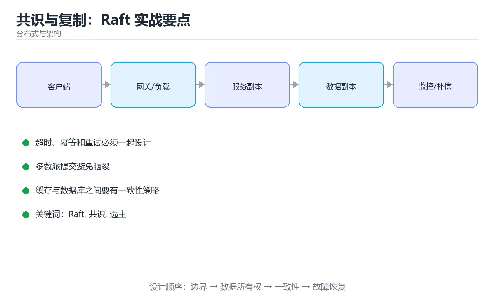

# 共识与复制：Raft 实战要点



> 内容更新时间：2026-10-03 · 学习阶段：高级 · 预计用时：18 分钟

## 学习目标

- 能用自己的话解释「共识与复制：Raft 实战要点」解决了什么问题，而不是只背术语。
- 能说清 「Raft」、「共识」、「选主」、「日志复制」 之间的关系，并分别举出一个例子。
- 能把本课知识放回「分布式与架构」的知识体系，说明它和相邻主题的边界。
- 能完成本课练习，并用验收标准检查自己的结果。

> 一句话摘要：Leader 选举、日志复制、安全性约束与工程参数。

## 前置知识

- 先完成上一课《实战：设计一个短链服务》；如果已经掌握，可以直接用本课练习自测。
- 本课阶段：高级。建议具备同一方向的完整基础，能阅读较长的代码、配置或系统设计说明。
- 开始前先复习：Raft、共识、选主。
- 如果某一步看不懂，先记录具体卡点，完成练习后再回头读一遍。


## 要解决什么问题

多副本系统里，只要允许网络分区与节点故障，「谁说了算」就必须有明确规则。共识算法的目标是：**在多数节点存活时，系统仍能就同一个值达成一致，并且已提交的值不会丢失。**

| 概念 | 含义 |
| --- | --- |
| Leader | 当前处理写请求的节点 |
| Follower | 被动接收日志的节点 |
| Candidate | 发起选举的节点 |
| Term | 任期编号，逻辑时钟，用于识别过期信息 |
| Log Index | 日志位置编号 |
| Commit Index | 已复制到多数派并可对外可见的位置 |
| Quorum | 多数派，n 个节点需 ⌊n/2⌋+1 |

## Raft 两个子问题

| 子问题 | 规则 |
| --- | --- |
| 选主 | 随机超时触发选举；获得多数票即成为 Leader；候选人日志不够新则拒绝投票 |
| 日志复制 | Leader 追加日志并并行发送；多数派确认后提交；Follower 冲突时回退覆盖 |

安全性约束（必须记住）：

1. **选举限制**：只投票给日志至少和自己一样新的候选人，保证已提交日志不会丢。
2. **提交规则**：只有当前任期的日志通过多数派复制后才能提交，不能仅凭计数提交旧任期日志。
3. **日志匹配**：相同 Index 与 Term 的日志内容必然相同。

```python
from dataclasses import dataclass, field

@dataclass
class LogEntry:
    index: int
    term: int
    command: str

@dataclass
class RaftNode:
    """极简 Raft 状态机：演示选举与多数派提交的判定逻辑。"""

    node_id: str
    peers: list
    current_term: int = 0
    voted_for: str | None = None
    log: list = field(default_factory=list)
    commit_index: int = 0

    def quorum(self) -> int:
        return len(self.peers) // 2 + 1

    def last_log(self) -> LogEntry | None:
        return self.log[-1] if self.log else None

    def can_vote_for(self, candidate_id: str, candidate_last: LogEntry | None) -> bool:
        """选举限制：候选人日志必须不落后，否则拒绝投票。"""
        if self.voted_for not in (None, candidate_id):
            return False
        own = self.last_log()
        if candidate_last is None:
            return own is None
        if own is None:
            return True
        return (candidate_last.term, candidate_last.index) >= (own.term, own.index)

    def append(self, entries: list) -> None:
        self.log.extend(entries)

    def advance_commit(self, matched_indexes: dict) -> int:
        """按多数派已匹配的最大下标推进 commit_index。"""
        indexes = sorted(matched_indexes.values(), reverse=True)
        candidate = indexes[self.quorum() - 1]
        if candidate > self.commit_index:
            self.commit_index = candidate
        return self.commit_index

node = RaftNode("n1", ["n1", "n2", "n3"])
print(node.quorum(), node.can_vote_for("n2", LogEntry(1, 1, "set x=1")))
node.append([LogEntry(1, 1, "set x=1"), LogEntry(2, 1, "set y=2")])
print(node.advance_commit({"n1": 2, "n2": 2, "n3": 1}))
```

## 工程要点速查

| 主题 | 建议 |
| --- | --- |
| 节点数 | 生产用 3 或 5；偶数不增加容错只增加成本 |
| 选举超时 | 随机化（如 150 到 300ms），避免同时选举 |
| 心跳间隔 | 明显小于选举超时，通常为其 1/3 到 1/5 |
| 日志持久化 | 先落盘再回复，否则崩溃后可能丢已确认日志 |
| 快照 | 定期压缩日志，避免无限增长与恢复变慢 |
| 成员变更 | 用单节点变更或联合共识，禁止一次性替换多数 |
| 只读请求 | 用 ReadIndex 或租约机制避免读到过期数据 |
| 监控 | 任期变化、选举次数、复制延迟、提交延迟 |

## 常见错误对照表

| 容易踩的做法 | 实际现象 | 原因与正确做法 |
| --- | --- | --- |
| 用 2 个节点做高可用 | 挂一台就不可写 | 多数派需要 2/2，应使用 3 或 5 节点 |
| 日志未落盘就回复成功 | 断电后已确认数据丢失 | 先持久化再确认 |
| 提交旧任期日志只看数量 | 可能违反安全约束 | 只提交当前任期日志并随新日志推进 |
| 选举超时固定 | 选主反复失败 | 使用随机化超时 |
| 成员一次性全换 | 出现双主或不可用 | 单节点变更或联合共识 |
| 直接读 Follower | 可能读到过期数据 | 用 ReadIndex/租约，或接受线性一致读代价 |
| 不做日志压缩 | 启动恢复极慢 | 定期打快照并截断日志 |
| 认为共识等于高性能 | 写入延迟受多数派往返限制 | 跨机房部署要评估 RTT 与批量提交 |

## 自测清单

- [ ] 能解释 Leader、Term、Commit Index 与 Quorum。
- [ ] 记得选举限制与只提交当前任期日志两条安全规则。
- [ ] 知道生产环境用 3 或 5 节点而非偶数。
- [ ] 日志先落盘再确认成功。
- [ ] 有日志压缩、成员变更与只读请求的正确方案。

## 动手练习


> 本课练习重点：围绕「Raft、共识、选主」完成复述、实验和交付，每个结果都要能被别人检查。

先画拓扑与数据流，再注入节点或网络故障，最后验证恢复与一致性。

### 练习 1：建立心智模型（10 分钟）

合上教程，用 3～5 句话回答：

1. 「共识与复制：Raft 实战要点」解决了什么问题？
2. 如果没有它，会出现什么具体后果？
3. 它和「共识」是什么关系？

**验收标准**：至少出现一个本课关键词，并写出一个反例、边界条件或失效场景。

### 练习 2：做一次可控实验（20 分钟）

从正文中选一个最小示例，完成以下操作：

1. 先预测修改一个参数、输入或步骤后的结果。
2. 再实际执行或逐步推演，记录真实结果。
3. 如果结果与预测不同，写出差异原因。

**验收标准**：留下「原例 → 改动 → 预测 → 结果 → 原因」五步记录。

### 练习 3：交付一个小结果（30 分钟）

画出系统拓扑，设计一次节点宕机或网络延迟演练，并写出恢复步骤。

任务要求：

- 结果必须能被别人检查，不能只写“我已经理解了”。
- 至少覆盖「Raft」和「共识」两个关键词。
- 写出 1 个仍然不确定的问题，以及下一步如何验证。

> 提示：时间有限时优先做练习 1 和练习 2；练习 3 可以拆成两次完成。

## 本课小结

- 核心问题：「共识与复制：Raft 实战要点」不是孤立术语，而是在「分布式与架构」中解决一类具体问题。
- 关键关系：先分清「Raft」与「共识」的职责，再理解「选主」的适用边界。
- 判断标准：能解释正常场景、边界条件和失败场景，才算真正掌握。
- 下一步：完成练习后，用自己的话写下 3 条要点，再去做本课测验。


## 深入补充：共识与复制：Raft 实战要点

前面已经建立了基本概念。这一节换一个角度，把「共识与复制：Raft 实战要点」放进真实工程里，
重点回答三件事：它为什么存在、内部如何运转、什么时候会失效。

### 一、核心模型

共识协议让多个节点在部分故障下对同一日志顺序达成一致；Raft 把问题拆成领导者选举、日志复制和安全性三条主线，便于理解和工程实现。

```text
节点启动为 Follower → 选举超时 → 成为 Candidate 拉票 → 获得多数票成为 Leader → 接收客户端请求 → 复制日志 → 多数确认后提交 → 应用到状态机
```

### 二、关键机制拆解

1. 任何时刻最多只有一个 Leader 能获得多数票，因为多数集合之间必然相交。
2. 任期号单调递增，节点收到更高任期会立即更新并退回 Follower。
3. 日志条目包含索引和任期，只有包含全部已提交条目的候选人才可能当选。
4. 提交要求日志写入多数节点，单节点确认不代表安全。
5. Leader 通过心跳维持权威，Follower 在选举超时后发起新一轮选举。
6. 网络分区时少数派无法提交新日志，恢复后通过日志匹配和冲突覆盖回到一致状态。
7. 成员变更必须使用联合共识或单节点变更，避免同时出现两个多数集合。

### 三、对照表：抓住容易混淆的边界

| 维度 | 一侧 | 另一侧 |
| --- | --- | --- |
| Leader 选举 | 解决谁负责接收写入 | 不直接保证日志已提交 |
| 日志复制 | 把条目同步到多数节点 | 保证已提交日志不丢失 |
| 多数派 | 超过一半节点 | 任意两个多数派必然相交 |
| 状态机应用 | 把已提交日志变成业务状态 | 必须保证幂等或可重放 |

### 四、工作示例

三节点集群中 Leader A 将日志复制到 B，但 C 未收到。此时日志已获得多数确认，可以提交；若 A 宕机，B 因日志更完整而优先当选，C 恢复后会从 B 补齐缺失条目。

### 五、常见误区与失效边界

| 错误做法或假设 | 后果 | 正确做法 |
| --- | --- | --- |
| 把单节点写入当成提交 | Leader 宕机后数据丢失 | 必须等待多数节点确认 |
| 选举超时设置过短 | 频繁选举导致服务抖动 | 根据网络延迟设置随机化超时 |
| 日志冲突时直接覆盖已提交条目 | 破坏安全性 | 只允许覆盖未提交的冲突日志 |
| 成员变更随意加节点 | 可能同时出现两个多数派 | 使用联合共识或一次只变更一个节点 |

### 六、场景推演

跨机房部署三节点 Raft，主机房到备机房延迟 40ms。写入延迟由多数派往返决定；若把超时设成 50ms，网络抖动就会频繁触发选举。正确做法是测量 P99 延迟，设置更宽松且带随机抖动的选举超时。

### 七、自测问答

**Q1：为什么多数派之间必然相交？**

两个超过一半的集合不可能完全不相交，这保证了新 Leader 能看到已提交日志。

**Q2：Leader 宕机后为什么不会丢已提交数据？**

已提交日志至少存在于多数节点，新 Leader 必然来自包含该日志的多数集合。

**Q3：心跳的作用是什么？**

维持 Leader 权威并阻止 Follower 发起选举。

**Q4：成员变更为什么危险？**

旧配置和新配置可能各自形成多数派，导致双 Leader。

### 八、小项目：把知识变成可检查的产出

用伪代码或简化程序实现三节点 Raft 的选举和日志复制，模拟 Leader 宕机、网络分区、日志冲突和节点恢复四种场景，输出每一步任期、角色和日志状态。

### 九、适用边界

共识解决的是复制日志顺序和安全提交，不自动解决业务幂等、跨地域延迟和吞吐扩展。真正的分布式数据库还需要分片、事务、快照和运维工具。

### 十、完成检查清单

- [ ] 能解释 Leader 选举与多数派原理
- [ ] 能说明日志提交的安全条件
- [ ] 能处理日志冲突和节点恢复
- [ ] 能设计选举超时与心跳参数
- [ ] 能说明成员变更的安全流程

### 十一、复习顺序

1. 先不看资料复述“核心模型”，确认能说出它解决的三个问题。
2. 再对照表逐行解释容易混淆的概念，每个概念补一个反例。
3. 跟着工作示例做一遍，改变一个条件并预测结果。
4. 用自测问答检查理解，错题回到对应小节重新阅读。
5. 最后完成小项目，把结果、失败记录和复查清单整理成一份可提交产物。

> 复习不是重读一遍，而是离开原文重新产出：复述、改写、验证、复盘。


## 验证命令与预期输出

项目代码不能只看“能编译”，还要能按固定命令复现结果。下表给出最低验证集：

| 阶段 | 命令 | 预期输出 |
| --- | --- | --- |
| 安装依赖 | `python -m pip install -r requirements.txt` | 依赖安装完成，没有版本冲突 |
| 语法检查 | `python -m compileall .` | 所有模块编译通过 |
| 运行测试 | `python -m pytest -q` | 测试全部通过，失败用例数为 0 |
| 启动示例 | `python main.py` | 服务启动并输出监听地址 |

### 验收证据

- [ ] 保存依赖安装和启动命令的完整输出。
- [ ] 至少运行 3 条测试，其中包含一条非法输入或失败路径。
- [ ] 重复执行同一操作两次，确认没有重复写入或副作用。
- [ ] 记录一次失败状态码、错误日志和恢复步骤。
- [ ] 在 README 中写明环境版本、启动方式和回滚方式。

### 回归与回滚

1. 先在一个可丢弃的目录或临时数据库执行，避免污染真实数据。
2. 修改一处逻辑后重跑全部验证命令，确认没有回归。
3. 若失败，回滚到上一个可运行版本并保留失败日志。
4. 定位原因后补一条自动化测试，再重新执行发布流程。
5. 把教训写入项目复盘或本课笔记，形成下一次的检查项。


## 考点精讲：把测验题还原成判断过程

本课有 5 个判断点。先自己作答，再看「判断依据」；如果结论正确但理由不完整，回到正文对应章节补足概念。

### 考点 1：生产环境部署 Raft 集群，推荐节点数是？

- **正确判断**：3 个或 5 个
- **判断依据**：多数派要求 ⌊n/2⌋+1，3 节点可容 1 台故障，5 节点可容 2 台。4 节点的容错与 3 节点相同却多一份成本。选项一挂一台就无法形成多数派。正确项「3 个或 5 个」描述正确，能够解释题干场景中的现象与结果。错误项「任意偶数个」与课程给出的定义相冲突，不能回答题目所问。错误项「2 个即可，节省成本」只看到了表面现象，没有解释题干真正考查的机制。错误项「4 个以获得更强容错」适用于其他场景，但与本题的前提不匹配。把题干「生产环境部署 Raft 集群，推荐节点数是？」放回《共识与复制：Raft 实战要点》的「Leader 选举、日志复制、安全性约束与工程参数」语境，逐项对照定义与边界条件，就能排除其余说法。
- **迁移检查**：如果给某个错误选项去掉一个限定词，它会不会变成正确？说明理由。

### 考点 2：Raft 中「选举限制」的作用是？

- **正确判断**：只投票给日志至少和自己一样新的候选人，保证已提交日志不丢
- **判断依据**：如果日志落后的节点当选 Leader，已提交的日志可能被覆盖，因此投票时必须比较最后一条日志的任期与下标。选项一、三都不是该机制的目的。选项四与事实相反，Follower 正是通过选举成为 Leader。正确项「只投票给日志至少和自己一样新的候选人，保证已提交日志不丢」完整覆盖了题目要求的关键点，没有遗漏前提。错误项「限制每个任期内只能选举一次」适用于其他场景，但与本题的前提不匹配。错误项「防止 Follower 变成 Leader」把因果关系颠倒了，不能作为正确结论。错误项「限制候选人数量以加快选举」忽略了题目中的限制条件，因此不成立。把题干「Raft 中「选举限制」的作用是？」放回《共识与复制：Raft 实战要点》的「Leader 选举、日志复制、安全性约束与工程参数」语境，逐项对照定义与边界条件，就能排除其余说法。
- **迁移检查**：遮住选项，只根据定义复述一次答案，再回来看哪个选项与复述一致。

### 考点 3：关于日志提交规则，正确的说法是？

- **正确判断**：只有当前任期的日志通过多数派复制后才能提交
- **判断依据**：Raft 规定只能通过「当前任期的日志被多数派复制」来推进 commit index，否则历史任期日志可能被错误提交。选项三、四都不是 Raft 的机制：提交由 Leader 判定并广播。正确项「只有当前任期的日志通过多数派复制后才能提交」描述正确，能够解释题干场景中的现象与结果。错误项「只要日志复制到多数派就能立即提交」与课程给出的定义相冲突，不能回答题目所问。错误项「Leader 单独写入即可提交」在边界或失败路径上会得出错误结果。错误项「Follower 确认后可自行提交」适用于其他场景，但与本题的前提不匹配。把题干「关于日志提交规则，正确的说法是？」放回《共识与复制：Raft 实战要点》的「Leader 选举、日志复制、安全性约束与工程参数」语境，逐项对照定义与边界条件，就能排除其余说法。
- **迁移检查**：遮住选项，只根据定义复述一次答案，再回来看哪个选项与复述一致。

### 考点 4：为避免选主反复失败，常见做法是？

- **正确判断**：使用随机化的选举超时
- **判断依据**：随机化超时让某个节点先超时并发起选举，避免多人同时竞选导致票数分散。选项一正是导致反复选举的原因。选项三会让 Leader 无法维持权威。正确项「使用随机化的选举超时」正面回答了题目所问，符合课程给出的定义与适用范围。错误项「把超时设为 0」属于相邻主题的说法，范围与本题要求不一致。错误项「所有节点使用相同的固定超时」把不同概念混在一起，缺少题干限定的前提。错误项「取消心跳机制」只看到了表面现象，没有解释题干真正考查的机制。把题干「为避免选主反复失败，常见做法是？」放回《共识与复制：Raft 实战要点》的「Leader 选举、日志复制、安全性约束与工程参数」语境，逐项对照定义与边界条件，就能排除其余说法。
- **迁移检查**：如果给某个错误选项去掉一个限定词，它会不会变成正确？说明理由。

### 考点 5：为避免 Follower 读到过期数据，只读请求应该？

- **正确判断**：通过 ReadIndex 或租约机制保证读到已提交数据
- **判断依据**：Follower 可能落后于 Leader，ReadIndex（向 Leader 确认提交位点）或租约读能在保证线性一致的前提下提供只读服务。正确项「通过 ReadIndex 或租约机制保证读到已提交数据」与题干要求一致，是本课知识点的准确定义。错误项「关闭日志复制后读取」忽略了题目中的限制条件，因此不成立。错误项「把读请求也走一遍完整选举」属于相邻主题的说法，范围与本题要求不一致。错误项「直接读任意 Follower（仅部分场景成立）」把不同概念混在一起，缺少题干限定的前提。把题干「为避免 Follower 读到过期数据，只读请求应该？」放回《共识与复制：Raft 实战要点》的「Leader 选举、日志复制、安全性约束与工程参数」语境，逐项对照定义与边界条件，就能排除其余说法。
- **迁移检查**：如果给某个错误选项去掉一个限定词，它会不会变成正确？说明理由。

## 本课复习清单

离开本课前，逐项确认：

- [ ] 不看解析，能说出「生产环境部署 Raft 集群，推荐节点数是？」的判断依据。
- [ ] 不看解析，能说出「Raft 中「选举限制」的作用是？」的判断依据。
- [ ] 不看解析，能说出「关于日志提交规则，正确的说法是？」的判断依据。
- [ ] 不看解析，能说出「为避免选主反复失败，常见做法是？」的判断依据。
- [ ] 不看解析，能说出「为避免 Follower 读到过期数据，只读请求应该？」的判断依据。
- [ ] 至少运行一次本课示例，记录输入、输出和一个边界情况。
- [ ] 把本课最容易混淆的两个概念写成一句话对照。

| 复盘项 | 记录 |
| --- | --- |
| 已经能独立解释的考点 |  |
| 仍然说不清的概念 |  |
| 下一步验证动作 |  |

## English Overview

**Title:** Consensus & Replication

**Summary:** Leader election, log replication and safety rules.

**Category:** Distributed Systems  
**Level:** 高级  
**Key terms:** Raft, 共识, 选主, 日志复制, 多数派, Quorum

> The full tutorial is written in Chinese. This bilingual overview helps English readers identify the topic, scope and key terms before studying the detailed examples.

## 内容元数据

- 内容版本：v2.0
- 最后更新：2026-10-03
- 学习阶段：高级
- 适用环境：分布式系统与云原生基础设施
- 内容来源：内置结构化课程与工程实践整理
- 相关主题：Raft、共识、选主、日志复制、多数派、Quorum
- 质量版本：P0 测验标准 + P1 覆盖扩展 + P2 体验补全

## 项目专属规格：共识与复制：Raft 实战要点

### 核心场景

Leader 选举、日志复制、安全性约束与工程参数。 项目目标是把「Raft、共识、选主、日志复制、多数派、Quorum」落实为可运行、可测试、可回滚的交付物。

### 架构与数据流

```text
用户/输入 → 接口或命令 → 领域逻辑 → 存储/外部依赖 → 输出与监控
                         ↘ 失败分类 → 重试/补偿 → 回滚
```

### 最小数据模型

| 对象 | 关键字段 | 约束 |
| --- | --- | --- |
| 输入实体 | Raft、时间、来源 | 必填校验、长度限制、幂等键 |
| 任务实体 | 状态、优先级、创建时间 | 状态迁移合法、不可重复执行 |
| 结果实体 | 输出、错误码、耗时 | 可序列化、错误可解释 |
| 审计记录 | 操作者、动作、结果、时间 | 不可篡改、可查询、脱敏 |

### 验收场景

1. 正常路径：最小输入得到预期输出，并留下日志与指标。
2. 边界路径：空值、最大值、重复数据和超长内容得到明确处理。
3. 失败路径：依赖超时或不可用时能快速失败、重试或降级。
4. 幂等路径：同一请求执行两次不会产生重复副作用。
5. 回滚路径：回滚后数据一致，且能说明恢复时间和影响范围。


## 项目交付物

### 建议仓库结构

```text
src/
tests/
docs/
README.md
```

### 测试矩阵

| 层级 | 覆盖内容 | 最低数量 | 通过标准 |
| --- | --- | ---: | --- |
| 单元测试 | 领域规则、边界和错误分类 | 8 | 正常、边界、失败路径全部通过 |
| 集成测试 | 数据库、网络、文件或平台边界 | 3 | 使用真实边界且可重复运行 |
| 端到端测试 | 核心用户路径 | 1 | 从输入到输出完整跑通 |
| 手动验收 | 文档中列出的 5 个场景 | 5 | 有命令、输出和结论记录 |

### 验收数据

```json
{
  "project": "distributed_consensus",
  "input": {"case": "normal", "value": 5},
  "expected": {"ok": true, "result": 5},
  "failure_case": {"value": -1, "error": "validation_error"},
  "idempotency_key": "demo-001"
}
```

### 复盘模板

| 问题 | 记录 |
| --- | --- |
| 原目标是什么？ | 用一句话描述可验收目标 |
| 实际发生了什么？ | 时间线、指标和关键日志 |
| 哪个假设被推翻？ | 根因与促成因素 |
| 如何回滚？ | 步骤、耗时和数据校验 |
| 下一步做什么？ | 负责人、期限和验证方式 |

> 项目验收围绕「Raft、共识、选主」：至少完成一次正常路径、一次边界输入、一次失败恢复和一次幂等检查。


## 参考资料与复核

- 最后复核：2026-10-04
- 下次复核：2027-04-04
- 复核范围：版本兼容、API 行为、安全建议与工程实践
- 来源性质：官方文档与标准；本课正文为离线教学重组，不复制原文

| 参考资料 | 本课用途 |
| --- | --- |
| [CNCF Landscape](https://landscape.cncf.io/) | 云原生技术地图 |
| [Google SRE Books](https://sre.google/books/) | 可靠性、容量与事故响应 |

> 本课主题：Leader 选举、日志复制、安全性约束与工程参数。

> App 完全离线展示文字链接，不会自动联网；需要延伸阅读时可复制链接到浏览器。

