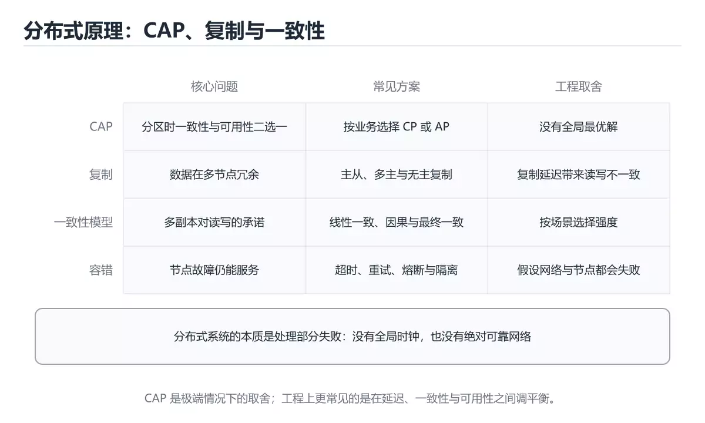
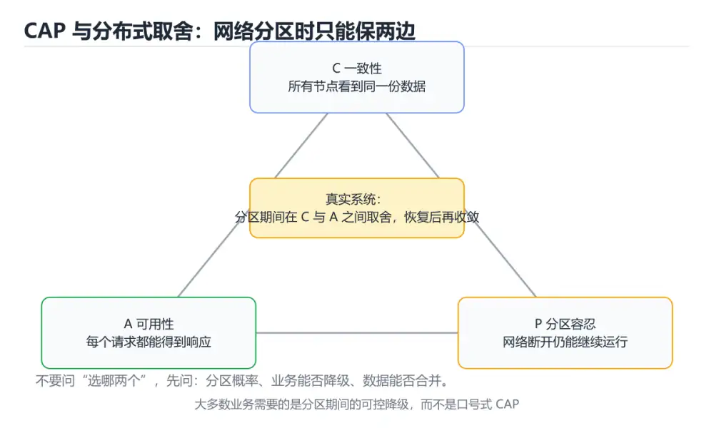
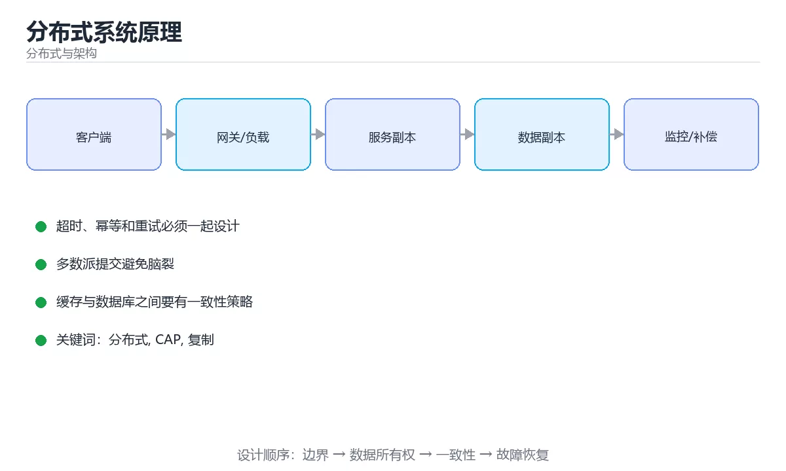

# 分布式系统原理







> 内容更新时间：2026-10-03 · 学习阶段：进阶 · 预计用时：17 分钟

## 学习目标

- 能用自己的话解释分布式系统原理解决了什么问题，而不是只背术语。
- 能说清 「分布式」、「CAP」、「复制」、「一致性」 之间的关系，并分别举出一个例子。
- 能把本课知识放回「分布式与架构」的知识体系，说明它和相邻主题的边界。
- 能完成本课练习，并用验收标准检查自己的结果。

> 一句话摘要：CAP/复制/一致性模型与容错设计。

## 前置知识

- 会进行基本的文件、命令行或浏览器操作；遇到不熟悉的术语先查本课关键词。
- 本课阶段：进阶。建议先掌握同一分类的基础课程，并能独立运行正文中的最小示例。
- 开始前先复习：分布式、CAP、复制。
- 如果某一步看不懂，先记录具体卡点，完成练习后再回头读一遍。

## CAP 与 BASE

CAP：一致性、可用性、分区容错三者不可同时满足；网络分区必然发生，实际是在 CP 与 AP 之间取舍。BASE（基本可用、软状态、最终一致）是对高可用系统的宽松承诺，也是多数互联网架构的选择。

## 复制

| 模式 | 说明 | 取舍 |
| --- | --- | --- |
| 主从复制 | 主写从读 | 简单，但有复制延迟 |
| 多主复制 | 多节点可写 | 需冲突解决（LWW/向量时钟） |
| 无主复制 | 读写多个副本（quorum） | 依赖读修复与反熵 |

同步复制强一致但延迟高，异步复制快但可能丢数据，半同步是常见折中。

## 一致性模型

由强到弱：线性一致 → 顺序一致 → 因果一致 → 最终一致。线性一致需要共识协议，成本高；多数业务只需**读己之写**与会话一致性（同一用户路由到同一副本）。

## 分区与再平衡

分片后要处理：分片键选择（均匀 + 查询局部性）、再平衡（一致性哈希减少迁移量）、热点分裂（大 key 拆小）。迁移期间用双写 + 校验 + 切流保证不中断。

## 容错设计要点

1. **幂等**：可重试的写操作必须幂等（请求 ID + 去重表）。
2. **超时与重试预算**：有限重试、指数退避、加抖动，避免重试风暴。
3. **熔断与降级**：下游故障时快速失败，返回缓存或默认值保核心链路。
4. **隔离**：线程池、连接池、队列按依赖隔离，防止级联雪崩。
5. **背压**：队列有界，满了就拒绝，而不是无限堆积到 OOM。

## 典型故障模式

脑裂（分区两侧都自认主，用 quorum/租约避免）、惊群（缓存失效瞬间并发重建）、雪崩（大量节点同时故障或超时）、延迟放大（一次请求扇出过多下游）。

## 可观测与演练

trace_id 贯穿全链路，指标看 P95/P99 与错误率，日志带请求上下文；定期做混沌工程演练（杀节点、注入延迟、断网），验证故障转移与告警是否真的有效。

## 一致性模型的选择实例

| 业务场景 | 需要的一致性 | 实现手段 |
| --- | --- | --- |
| 用户修改昵称后刷新 | 读己之写 | 写后短时间走主库，或客户端带回版本号 |
| 商品库存扣减 | 线性一致（强） | 单库事务 + 行锁，或分布式锁 + 唯一约束兜底 |
| 点赞数、浏览量 | 最终一致 | 缓存累加 + 定时回写，允许短暂偏差 |
| 好友列表 | 会话一致性 | 同一用户路由到同一副本，保证自己看到稳定视图 |
| 支付结果通知 | 最终一致 + 幂等 | 消息重试 + 对账 + 唯一业务号去重 |

选择方法：先问"**用户能否感知不一致**"与"**不一致会带来资损吗**"。能感知或涉及钱的场景必须强一致；统计类、展示类可用最终一致换取可用性与性能。

## 故障模式与对策速查

| 故障 | 表现 | 对策 |
| --- | --- | --- |
| 脑裂 | 分区两侧都认为自己是主，双写冲突 | quorum/租约选举，Fencing Token 拒绝旧主写入 |
| 惊群 | 缓存或锁失效瞬间大量并发重建 | 互斥重建 + 随机退避 + 单飞（singleflight） |
| 雪崩 | 大量节点同时超时或故障 | 超时分级、熔断、降级、队列隔离 |
| 延迟放大 | 一次请求扇出多个下游，尾延迟叠加 | 限制扇出、并行改串行、给下游设独立超时 |
| 重试风暴 | 失败后所有客户端同时重试 | 指数退避 + 抖动 + 重试预算 |

## 本课小结
分布式系统的三条主线：一致性与可用性的取舍（CAP）、复制与共识（Raft）、容错设计（幂等 + 超时 + 熔断 + 隔离 + 背压）。

## 核心定理速查

| 定理 | 结论 | 实践含义 |
| --- | --- | --- |
| CAP | 分区发生时只能在一致性与可用性之间取舍 | 网络分区必然发生，先决定 CP 还是 AP |
| BASE | 基本可用、软状态、最终一致 | 放弃强一致换可用与扩展 |
| 利特尔法则 | 并发 = 吞吐 × 延迟 | 容量与延迟互相约束 |
| 拜占庭容错 | 容忍恶意节点需 3f+1 个节点 | 区块链类场景 |
| 多数派 | 需要 ⌊n/2⌋+1 确认 | 保证已提交数据不丢 |

## 一致性与复制速查

| 模式 | 特点 | 适用 |
| --- | --- | --- |
| 同步复制 | 主从都确认才返回 | 强一致、延迟高 |
| 半同步复制 | 至少一个从库确认 | 平衡方案 |
| 异步复制 | 主库返回后异步同步 | 延迟低、可能丢数据 |
| 读己之写 | 保证用户看到自己的写入 | 用户体验关键路径 |
| 单调读 | 不会读到更旧的数据 | 避免时间倒流 |
| 因果一致 | 保持因果关系 | 评论与回复场景 |

```python
import time
from dataclasses import dataclass, field

def quorum(n: int, level: str = "majority") -> int:
    """多数派数量：n 个副本需要多少确认。"""
    if level == "majority":
        return n // 2 + 1
    if level == "all":
        return n
    if level == "one":
        return 1
    raise ValueError("不支持的级别")

def read_your_writes_ok(write_quorum: int, read_quorum: int, replicas: int) -> bool:
    """读写法定人数有交集才能读到最新写入。"""
    return write_quorum + read_quorum > replicas

@dataclass
class RetryPolicy:
    """重试策略：指数退避 + 抖动 + 上限，避免重试风暴。"""

    base: float = 0.05
    factor: float = 2.0
    max_attempts: int = 5
    max_delay: float = 3.0
    attempts: int = 0

    def can_retry(self) -> bool:
        return self.attempts < self.max_attempts

    def next_delay(self) -> float:
        delay = min(self.max_delay, self.base * (self.factor ** self.attempts))
        self.attempts += 1
        jitter = 0.5 + (self.attempts % 3) * 0.25      # 简单抖动
        return round(delay * jitter, 4)

def idempotency_key(user_id: str, request_id: str) -> str:
    """幂等键：同一业务请求重试时保持稳定，用于服务端去重。"""
    return f"{user_id}:{request_id}"

print(quorum(3), read_your_writes_ok(2, 2, 3))
policy = RetryPolicy()
print([policy.next_delay() for _ in range(3)])
```

## 常见错误对照表

| 容易踩的做法 | 实际现象 | 原因与正确做法 |
| --- | --- | --- |
| 假设网络可靠 | 偶发超时导致状态不一致 | 一切远程调用都要超时、重试与幂等 |
| 假设时钟同步 | 事件顺序错乱 | 用逻辑时钟或服务端序号 |
| 用本地事务处理跨服务写入 | 部分成功 | 用 Saga、TCC 或本地消息表 |
| 无限重试 | 故障放大 | 退避 + 上限 + 熔断 |
| 重试非幂等写操作 | 重复下单扣款 | 幂等键 + 唯一索引 |
| 只做读写分离不做延迟处理 | 读到自己刚写的数据缺失 | 关键路径读主库或加等待 |
| 认为最终一致不需要设计 | 用户看到中间态异常 | 前端状态提示 + 补偿任务 |
| 无对账机制 | 差异长期存在 | 定期对账 + 自动修复 |
| 单点协调者 | 协调者故障流程卡住 | 协调者高可用 + 状态持久化 |
| 不做压测与故障演练 | 真故障时手忙脚乱 | 混沌演练 + 定期故障注入 |

## 自测清单

- [ ] 能解释 CAP 与 BASE 的取舍及对业务的影响。
- [ ] 远程调用一律有超时、重试上限与幂等保证。
- [ ] 跨服务一致性方案明确（Saga/TCC/本地消息表）。
- [ ] 有对账与补偿机制处理最终一致。
- [ ] 定期做故障演练验证假设。

## 动手练习

> 本课练习重点：围绕「分布式、CAP、复制」完成复述、实验和交付，每个结果都要能被别人检查。

先画拓扑与数据流，再注入节点或网络故障，最后验证恢复与一致性。

### 练习 1：建立心智模型（10 分钟）

合上教程，用 3～5 句话回答：

1. 分布式系统原理解决了什么问题？
2. 如果没有它，会出现什么具体后果？
3. 它和「CAP」是什么关系？

**验收标准**：至少出现一个本课关键词，并写出一个反例、边界条件或失效场景。

### 练习 2：做一次可控实验（20 分钟）

从正文中选一个最小示例，完成以下操作：

1. 先预测修改一个参数、输入或步骤后的结果。
2. 再实际执行或逐步推演，记录真实结果。
3. 如果结果与预测不同，写出差异原因。

**验收标准**：留下「原例 → 改动 → 预测 → 结果 → 原因」五步记录。

### 练习 3：交付一个小结果（30 分钟）

画出系统拓扑，设计一次节点宕机或网络延迟演练，并写出恢复步骤。

任务要求：

- 结果必须能被别人检查，不能只写“我已经理解了”。
- 至少覆盖「分布式」和「CAP」两个关键词。
- 写出 1 个仍然不确定的问题，以及下一步如何验证。

> 提示：时间有限时优先做练习 1 和练习 2；练习 3 可以拆成两次完成。

## 实践任务

本节围绕分布式系统原理安排 3 个可交付任务，每个任务都要求留下可以复查的记录。

### 任务 1：用自己的话画出结构

不看书，用一张图说清「分布式系统原理」的结构，画完再对照骨架：

- 主干：CAP 与 BASE → 复制 → 一致性模型 → 分区与再平衡
- 连接线：在每条边上标出输入、输出与失败路径。
- 自检：能否用一句话说明分布式与CAP的关系？

### 任务 2：做一次对比实验

**验收标准**：表格里两个方案的结论不能完全一样；写下“在什么条件下应该换方案”。

### 任务 3：迁移到自己的场景

**验收标准**：至少有一个可复现的命令、代码片段或数据样例；结论能被别人独立检查。

## 故障现场

### 现场 1：本课的 分布式 常规用例通过，但边界用例失败

**症状**：在本课的练习或生产场景里出现“本课的 分布式 常规用例通过，但边界用例失败”。

**复现**：准备一组最小输入，只保留触发“本课的 分布式 常规用例通过，但边界用例失败”的必要条件，连续运行两次确认结果稳定。

**定位**：围绕“分布式 的前置条件与取值边界没有写进代码，默认值掩盖了空值和极值”检查调用链、输入数据和环境配置，先验证假设再改代码。

**预防**：把“本课的 分布式 常规用例通过，但边界用例失败”写成一条自动化用例，并在本课的验收清单里保留对应检查项。

### 现场 2：本课的 CAP 结果在两次运行之间不一致

**症状**：在本课的练习或生产场景里出现“本课的 CAP 结果在两次运行之间不一致”。

**复现**：准备一组最小输入，只保留触发“本课的 CAP 结果在两次运行之间不一致”的必要条件，连续运行两次确认结果稳定。

**定位**：围绕“CAP 依赖了当前版本、执行顺序或共享状态，单次运行无法暴露差异”检查调用链、输入数据和环境配置，先验证假设再改代码。

**预防**：把“本课的 CAP 结果在两次运行之间不一致”写成一条自动化用例，并在本课的验收清单里保留对应检查项。

### 现场 3：本课的验证只在开发机通过

**症状**：在本课的练习或生产场景里出现“本课的验证只在开发机通过”。

**定位**：围绕“环境版本、配置和输入规模与目标环境不同，分布式 缺少可重复的验证记录”检查调用链、输入数据和环境配置，先验证假设再改代码。

## 本课复习清单

离开本课前，逐项确认：

- [ ] 不看解析，能说出「发生网络分区时 CAP 中的取舍是？」的判断依据。
- [ ] 不看解析，能说出「半同步复制的含义是？」的判断依据。
- [ ] 不看解析，能说出「设计可重试接口时必须保证？」的判断依据。
- [ ] 不看解析，能说出「BASE 与 ACID 的主要区别是？」的判断依据。
- [ ] 不看解析，能说出「物理时钟漂移给分布式系统带来的主要困难是？」的判断依据。
- [ ] 至少运行一次本课示例，记录输入、输出和一个边界情况。
- [ ] 把本课最容易混淆的两个概念写成一句话对照。

| 复盘项 | 记录 |
| --- | --- |
| 已经能独立解释的考点 |  |
| 仍然说不清的概念 |  |
| 下一步验证动作 |  |

## 术语速查

| 术语 | 本课语境 |
| --- | --- |
| `分布式` | 围绕“环境版本、配置和输入规模与目标环境不同，分布式 缺少可重复的验证记录”检查调用链、输入数据和环境配置，先验证假设再改代码。 |
| `CAP` | 分布式系统的三条主线：一致性与可用性的取舍（CAP）、复制与共识（Raft）、容错设计（幂等 + 超时 + 熔断 + 隔离 + 背压）。 |
| `复制` | 按“分布式系统原理”中 分布式、CAP、复制 的实践顺序，把四个步骤排成从准备到复盘的合理顺序。 |
| `一致性` | CAP：一致性、可用性、分区容错三者不可同时满足；网络分区必然发生，实际是在 CP 与 AP 之间取舍。 |
| `幂等` | 分布式系统的三条主线：一致性与可用性的取舍（CAP）、复制与共识（Raft）、容错设计（幂等 + 超时 + 熔断 + 隔离 + 背压）。 |
| `混沌工程` | 它在「分布式系统原理」里是理解「混沌工程」的关键术语，用来解释定义、适用条件与失败路径；它与分布式、CAP共同决定这一节的判断边界。复习时回到正文示例核对输入、输出和验证方式。 |

## 考点精讲

### 考点 1：概念判断·分布式

- **题目**：发生网络分区时 CAP 中的取舍是？
- **判断依据**：在「分布式系统原理」里，只能在一致性与可用性之间选一个。分区必然存在，因此实际是在 CP 与 AP 之间取舍。「分布式系统原理」要求先交代分布式、CAP、复制的前提再下结论，所以“只能在一致性与可用性之间选一个”只在题干“发生网络分区时 CAP 中的取舍是”给定的条件下成立。把“只能在一致性与可用性之间选一个”代回「分布式系统原理」里“发生网络分区时 CAP 中的取舍是”的例子核对，条件一旦改变，结论就要用分布式、CAP、复制重新推导。

### 考点 2：概念判断·分布式

- **题目**：半同步复制的含义是？
- **判断依据**：在「分布式系统原理」里，至少一个副本确认即返回。在一致性与延迟之间取得折中，降低丢数据概率。这道题的关键在「分布式系统原理」的分布式、CAP、复制：先确认题干“半同步复制的含义是”问的是哪一步，再排除偷换前提的选项。把“至少一个副本确认即返回”代回「分布式系统原理」里“半同步复制的含义是”的例子核对，条件一旦改变，结论就要用分布式、CAP、复制重新推导。

### 考点 3：概念判断·分布式

- **题目**：「分布式系统原理」的核心结论是什么？
- **判断依据**：题干的正确项是分布式系统原理：CAP/复制/一致性模型与容错设计。在「分布式系统原理」里，把分布式、CAP、复制放进最小示例验证，换成空值或极值后结论仍要成立。在「分布式系统原理」里判断这道题，要把分布式、CAP、复制的条件、过程与失败路径逐项对齐，换成“分布式系统原理的核心结论是什么”这个场景，只有满足前提的结论才成立。

### 考点 4：顺序排列·分布式

- **题目**：按“分布式系统原理”中 分布式、CAP、复制 的实践顺序，把四个步骤排成从准备到复盘的合理顺序。
- **判断依据**：题干的正确项是固定版本与证据，把“分布式系统原理”的结论写成可复现记录。在「分布式系统原理」里，在本课的练习里，顺序应当是：先明确 分布式 的输入、输出与约束 → 写出最小示例并核对 CAP 的基线结果 → 只改一个变量，记录边界与失败路径的变化 → 固定版本与证据，把本课的结论写成可复现记录。这个顺序把 分布式 的输入、输出和约束放在最前面，在分布式系统原理里避免概念没对齐就开始调参。第二步用 CAP 建立可核对的基线，在分布式系统原理里第三步才允许改变一个变量并观察失败路径。

### 考点 5：概念判断·分布式

- **题目**：物理时钟漂移给分布式系统带来的主要困难是？
- **判断依据**：在「分布式系统原理」里，无法用本地时间可靠判断事件的先后顺序，需要逻辑时钟或因果序。Lamport 时钟与向量时钟用来刻画因果关系。「分布式系统原理」要求先交代分布式、CAP、复制的前提再下结论，所以“无法用本地时间可靠判断事件的先后顺序”只在题干“物理时钟漂移给分布式系统带来的主要困难是”给定的条件下成立。

### 考点 6：多选辨析·分布式

- **题目**：关于「分布式系统原理」，下列哪些说法是正确的？（多选）
- **判断依据**：在「分布式系统原理」里，至少一个副本确认即返回」是否完整覆盖题干的输入、输出和失败路径，并排除「只能在一致性与可用性之间选一个」、「只要记住术语，不需要理解输入和边界条件」这类相邻概念。回到「分布式系统原理」的正文示例，用“关于分布式系统原理”走一遍分布式、CAP、复制的完整流程，能复现的结论才可以保留。

## English Overview

**Title:** Distributed Systems

**Summary:** CAP, replication, consistency and fault tolerance.

**Category:** Distributed Systems
**Level:** 进阶
**Key terms:** 分布式, CAP, 复制, 一致性, 幂等, 混沌工程

## 内容元数据

- 内容版本：v2.0
- 最后更新：2026-10-03
- 学习阶段：进阶
- 适用环境：分布式系统与云原生基础设施
- 内容来源：内置结构化课程与工程实践整理
- 相关主题：分布式、CAP、复制、一致性、幂等、混沌工程
- 质量版本：P0 测验标准 + P1 覆盖扩展 + P2 体验补全

## 参考资料与复核

- 最后复核：2026-10-04
- 下次复核：2027-04-04
- 复核范围：版本兼容、API 行为、安全建议与工程实践
- 来源性质：官方文档、标准或权威教材；正文为离线教学重组

| 参考资料 | 本课用途 |
| --- | --- |
| [CAP 定理资料](https://www.cs.princeton.edu/courses/archive/fall20/cos418/papers/brew.pdf) | 一致性、可用性与分区 |
| [Martin Fowler 事件驱动](https://martinfowler.com/articles/201701-event-driven.html) | 事件、消息与一致性 |
| [AWS 架构中心](https://aws.amazon.com/architecture/) | 高可用与云架构模式 |

> 「分布式系统原理」的链接用于离线阅读后的延伸核对；App 不会自动联网。

## 复习与迁移

复习目标：把「分布式系统原理」的判断标准放回可复现的例子里。先自己作答，再对照依据；如果结论正确但理由不完整，回到正文补足前提。

### 概念复述

- 用一句话说明「分布式系统原理」解决什么问题：CAP/复制/一致性模型与容错设计。
- 写出分布式、CAP、复制之间的关系，并各举一个例子。
- 说出本课最容易混淆的两个概念，以及区分它们的判据。

### 正文逐节复核

- **CAP 与 BASE**：CAP：一致性、可用性、分区容错三者不可同时满足；网络分区必然发生，实际是在 CP 与 AP 之间取舍。
- **复制**：同步复制强一致但延迟高，异步复制快但可能丢数据，半同步是常见折中。
- **分区与再平衡**：分片后要处理：分片键选择（均匀 + 查询局部性）、再平衡（一致性哈希减少迁移量）、热点分裂（大 key 拆小）。
- **可观测与演练**：trace_id 贯穿全链路，指标看 P95/P99 与错误率，日志带请求上下文；定期做混沌工程演练（杀节点、注入延迟、断网），验证故障转移与告警是否真的有效。
- **实践任务**：本节围绕分布式系统原理安排 3 个可交付任务，每个任务都要求留下可以复查的记录。

### 测验回顾

1. 发生网络分区时 CAP 中的取舍是？
   - 依据：在「分布式系统原理」里，只能在一致性与可用性之间选一个。分区必然存在，因此实际是在 CP 与 AP 之间取舍。「分布式系统原理」要求先交代分布式、CAP、复制的前提再下结论，所以“只能在一致性与可用性之间选一个”只在题干“发生网络分区时 CAP 中的取舍是”给定的条件下成立。把“只能在一致性与可用性之间选一个”代回「分布式系统原理」里“发生网络分区时 CAP 中的取舍是”的例子核对，条件一旦改变，结论就要用分布式、CAP、复制重新推导。
2. 半同步复制的含义是？
   - 依据：在「分布式系统原理」里，至少一个副本确认即返回。在一致性与延迟之间取得折中，降低丢数据概率。这道题的关键在「分布式系统原理」的分布式、CAP、复制：先确认题干“半同步复制的含义是”问的是哪一步，再排除偷换前提的选项。把“至少一个副本确认即返回”代回「分布式系统原理」里“半同步复制的含义是”的例子核对，条件一旦改变，结论就要用分布式、CAP、复制重新推导。
3. 「分布式系统原理」的核心结论是什么？
   - 依据：题干的正确项是分布式系统原理：CAP/复制/一致性模型与容错设计。在「分布式系统原理」里，把分布式、CAP、复制放进最小示例验证，换成空值或极值后结论仍要成立。在「分布式系统原理」里判断这道题，要把分布式、CAP、复制的条件、过程与失败路径逐项对齐，换成“分布式系统原理的核心结论是什么”这个场景，只有满足前提的结论才成立。
4. 按“分布式系统原理”中 分布式、CAP、复制 的实践顺序，把四个步骤排成从准备到复盘的合理顺序。
   - 依据：题干的正确项是固定版本与证据，把“分布式系统原理”的结论写成可复现记录。在「分布式系统原理」里，在本课的练习里，顺序应当是：先明确 分布式 的输入、输出与约束 → 写出最小示例并核对 CAP 的基线结果 → 只改一个变量，记录边界与失败路径的变化 → 固定版本与证据，把本课的结论写成可复现记录。这个顺序把 分布式 的输入、输出和约束放在最前面，在分布式系统原理里避免概念没对齐就开始调参。第二步用 CAP 建立可核对的基线，在分布式系统原理里第三步才允许改变一个变量并观察失败路径。
5. 物理时钟漂移给分布式系统带来的主要困难是？
   - 依据：在「分布式系统原理」里，无法用本地时间可靠判断事件的先后顺序，需要逻辑时钟或因果序。Lamport 时钟与向量时钟用来刻画因果关系。「分布式系统原理」要求先交代分布式、CAP、复制的前提再下结论，所以“无法用本地时间可靠判断事件的先后顺序”只在题干“物理时钟漂移给分布式系统带来的主要困难是”给定的条件下成立。
6. 关于「分布式系统原理」，下列哪些说法是正确的？（多选）
   - 依据：在「分布式系统原理」里，至少一个副本确认即返回」是否完整覆盖题干的输入、输出和失败路径，并排除「只能在一致性与可用性之间选一个」、「只要记住术语，不需要理解输入和边界条件」这类相邻概念。回到「分布式系统原理」的正文示例，用“关于分布式系统原理”走一遍分布式、CAP、复制的完整流程，能复现的结论才可以保留。

### 迁移练习

把「分布式系统原理」的结论迁移到相邻主题，每次迁移都写清预测与证据：

1. 换输入：用分布式处理一组你自己的数据，对比教材示例的结果差异。
2. 换失败条件：制造一个CAP相关的错误，说明如何从错误信息定位根因。
3. 换规模：把数据量或并发度提高一个数量级，说明「分布式系统原理」的结论是否仍成立。
