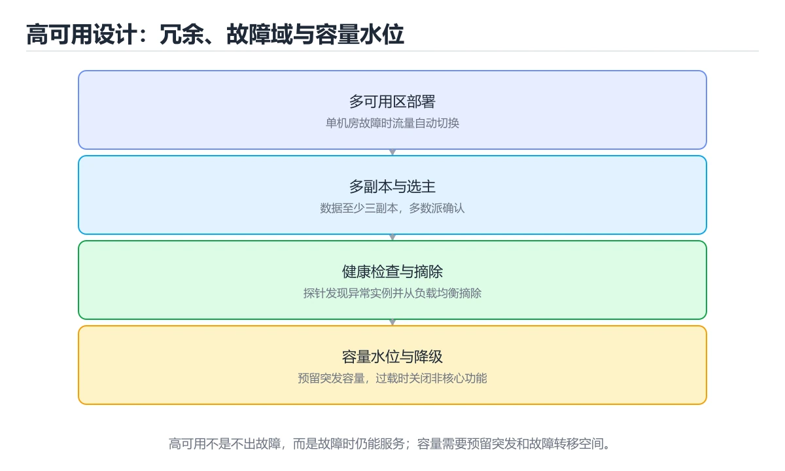
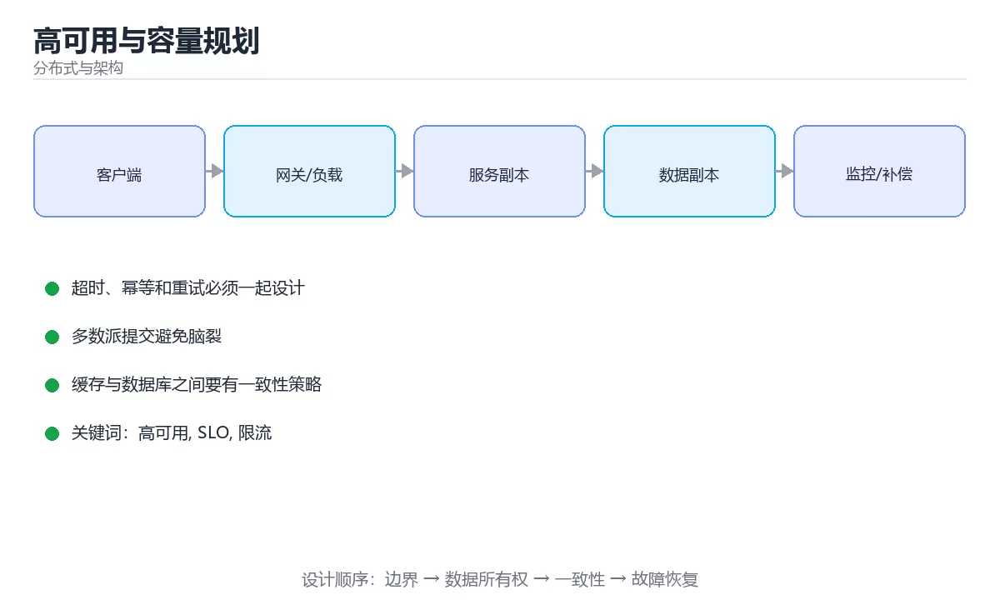

# 高可用与容量规划





> 内容更新时间：2026-10-06 · 学习阶段：基础 · 预计用时：40 分钟

## 本节知识框架

**课程定位**：所属分类为「分布式与架构」，课程主题为「高可用与容量规划」，学习阶段为「基础」，建议用时 40 分钟。

**本课要解决的主问题**：SLO 与错误预算、限流熔断降级隔离、利特尔法则与演练。

| 学习层次 | 要回答的问题 | 完成判据 |
| --- | --- | --- |
| 概念层 | 「高可用与容量规划」有哪些必须区分的对象与术语？ | 能用自己的话定义核心术语，并各举一个正例和一个反例。 |
| 机制层 | 这些对象按什么顺序发生作用，输入如何变成输出？ | 能画出或写出机制步骤，并说明每一步的失败条件。 |
| 应用层 | 什么场景适合使用「高可用与容量规划」，什么场景不适合？ | 能给出一个真实场景、一个最小示例和一个边界案例。 |
| 性能层 | 时间、空间、吞吐或延迟受哪些量影响？ | 能说出复杂度或性能瓶颈的证据来源；没有证据时明确写“材料未提供”。 |
| 复习层 | 怎样确认自己不是只记住了结论？ | 能独立完成本课自测，并把错误定位到概念、机制、示例或边界。 |

### 阅读路线

1. 先读「核心概念定义」，建立「高可用」等对象的精确定义。
2. 再读「原理与运行机制」，把定义串成可重复的过程。
3. 用「代码/协议/SQL 示例」验证过程，并只改一个条件观察结果变化。
4. 最后检查性能、易错点、知识关系与自测题，形成可复习的证据链。

**前置知识**：《消息队列与事件驱动》

**学习位置**：本课位于《消息队列与事件驱动》之后；如果前一课的自测不能通过，应先回补再继续。

**后续衔接**：下一课《分布式 ID 与发号器》会继续使用本课术语，学完后建议立即完成一次自测。

**教材衔接：学习目标**

- 能用自己的话解释高可用与容量规划解决了什么问题，而不是只背术语。
- 能说清 「高可用」、「SLO」、「限流」、「熔断」 之间的关系，并分别举出一个例子。
- 能把 高可用 放回「高可用与容量规划」的知识体系，说明它和 SLO 的边界。
- 能完成本课练习，并用验收标准检查自己的结果。

> 一句话摘要：SLO 与错误预算、限流熔断降级隔离、利特尔法则与演练。

**教材衔接：前置知识**

- 先完成上一课《消息队列与事件驱动》；如果已经掌握，可以直接用本课练习自测。
- 本课阶段：基础。建议先完成「消息队列与事件驱动」，或确认自己能独立跑通正文里的 availability_parallel 示例。
- 开始前先复习：高可用、SLO、限流。
- 卡在 高可用 上时不要跳过：把输入、预期和实际输出写成三行，再回头读正文。

**教材衔接：本课小结**

高可用 = **消除单点 + 限流熔断降级隔离 + 容量余量 + 演练验证**；容量规划用利特尔法则估算，用压测校准，用监控自动扩缩容。

## 核心概念定义

> 在阅读《高可用与容量规划》时，术语第一次出现先给操作性定义，再给边界；正文说法与这里冲突时，以定义和可复现示例为准。

| 术语 | 操作性定义 | 本课中的边界 |
| --- | --- | --- |
| 高可用 | 高可用 = 消除单点 + 限流熔断降级隔离 + 容量余量 + 演练验证；容量规划用利特尔法则估算，用压测校准，用监控自动扩缩容。 | 仅在「高可用与容量规划」明确给出的输入、版本与资源条件下成立。 |
| SLO | 服务级目标，用可量化指标和窗口定义用户可接受的可靠性水平。 | 仅在「高可用与容量规划」明确给出的输入、版本与资源条件下成立。 |
| 限流 | 按“高可用与容量规划”中 高可用、SLO、限流 的实践顺序，把四个步骤排成从准备到复盘的合理顺序。 | 仅在「高可用与容量规划」明确给出的输入、版本与资源条件下成立。 |
| 熔断 | 依赖连续失败达到阈值后暂时停止调用并快速失败，给下游恢复时间并防止雪崩。 | 仅在「高可用与容量规划」明确给出的输入、版本与资源条件下成立。 |

### 定义如何使用

在「高可用与容量规划」中判断一个说法是否成立，先确认它使用的是哪个对象的定义，再检查输入规模、运行环境与失败路径。定义不是口号，而是后续推导、代码示例和自测题共享的约束。

## 原理与运行机制

### 机制总览

1. **建立输入**：把「高可用」按本课定义整理成可观察、可重复的输入条件。
2. **执行转换**：围绕「SLO」执行本课的核心步骤；每一步都记录中间状态，避免只看最终输出。
3. **产生输出**：得到「限流」后，用正文示例或协议/SQL 结果核对输出是否符合预期。
4. **改变一个条件**：只替换一个边界条件或环境参数，观察「高可用与容量规划」的结论是否仍然成立。

| 阶段 | 关注对象 | 失败时应检查 |
| --- | --- | --- |
| 输入 | 高可用 | 类型、范围、编码、版本或前置状态是否满足定义。 |
| 处理 | SLO | 顺序、可见性、锁、路由、事务或调度规则是否被破坏。 |
| 输出 | 限流 | 结果是否可复现，错误是否被正确传播而不是被吞掉。 |

本课的机制结论要用「高可用与容量规划」自己的示例验证。「高可用与容量规划」没有给出某个数量级、吞吐或内存数据时，本课把该判断标为“材料未提供”，不从相邻主题外推。

**教材衔接：SLA、SLO 与错误预算**

SLA 是对外承诺（99.9% 可用），SLO 是内部目标，错误预算是 1 − SLO。预算用完后应**冻结新功能、优先修稳定性**。可用性换算：99.9% 每月约 43 分钟不可用，99.99% 约 4.3 分钟。

**教材衔接：稳定性四件套**

| 手段 | 作用 |
| --- | --- |
| 限流 | 保护系统不被突发流量击垮（令牌桶/漏桶、按用户与接口维度） |
| 熔断 | 下游持续失败时快速失败，避免线程耗尽 |
| 降级 | 关闭非核心功能，保下单/支付等核心链路 |
| 隔离 | 线程池/连接池/队列按依赖隔离，防止级联雪崩 |

**教材衔接：容量规划**

**利特尔法则**：并发数 ≈ QPS × 平均响应时间。若单实例 QPS 500、RT 100ms，则并发约 50；要支撑 5000 QPS 就需约 10 个实例（再留 30%~50% 余量）。

压测方法：明确目标（峰值 QPS、P99 延迟）、按真实流量模型（读写比例、热点分布）逐步加压找拐点，观察 CPU/内存/连接数/GC/慢查询，最后定容量水位与扩容阈值（如 60% 触发扩容）。

**教材衔接：容灾与演练**

定义 RTO（恢复时间）与 RPO（数据丢失容忍），据此选择同城双活、异地多活或冷备。比方案更重要的是**演练**：主从切换、断网、依赖故障、区域级故障，验证切换时间与数据一致性。

**教材衔接：应急响应**

值班与升级路径、一键降级开关、故障通告模板、事后复盘（无指责文化，聚焦改进项与责任人）。预案要能被执行者在高压下照做，因此需要**明确的判断条件与操作步骤**。

**教材衔接：可用性速查**

| 可用性 | 年停机时间 | 说明 |
| --- | --- | --- |
| 99% | 约 3.65 天 | 不可用于核心业务 |
| 99.9% | 约 8.76 小时 | 基础要求 |
| 99.95% | 约 4.38 小时 | 常见生产目标 |
| 99.99% | 约 52.6 分钟 | 高可用要求 |
| 99.999% | 约 5.26 分钟 | 极高要求、成本陡增 |

串行依赖的可用性相乘：`A_total = A1 × A2 × ... × An`。三个 99.9% 串起来只有约 99.7%，这就是**必须缩短同步链路**的原因。

## 典型应用场景

| 场景 | 典型输入或前提 | 期望产物 |
| --- | --- | --- |
| 学习验证 | 使用本课最小示例和 高可用、SLO | 能复现正文结论，并解释每一步。 |
| 工程落地 | 把「高可用与容量规划」放入真实模块或服务边界 | 输出可观测、失败可定位、参数可配置。 |
| 故障排查 | 只改一个版本、规模、输入或依赖条件 | 能区分概念错误、实现错误和环境差异。 |

判断「高可用与容量规划」的场景是否成立，标准是能否写出输入、处理、输出和失败路径；材料中没有出现的数据在本课标注为“材料未提供”，不用推测替代证据。

## 代码/协议/SQL 示例

以下代码、协议或 SQL 片段来自《高可用与容量规划》原文，保留原有语言标记与上下文；先预测《高可用与容量规划》示例的输出，再按正文步骤运行或推演，示例依赖外部环境时同时记录版本与输入。

**教材衔接：容错手段速查**

| 手段 | 作用 | 代价 |
| --- | --- | --- |
| 冗余部署 | 单实例故障不影响 | 资源成本 |
| 无状态化 | 便于水平扩展 | 状态需外置 |
| 限流 | 保护自身与下游 | 部分请求被拒 |
| 熔断 | 快速失败避免堆积 | 功能降级 |
| 降级 | 保核心功能 | 体验下降 |
| 隔离 | 故障不扩散 | 资源利用率下降 |
| 重试加幂等 | 处理瞬时故障 | 需幂等设计 |
| 多活与多机房 | 抗机房级故障 | 数据一致性复杂 |
| 混沌演练 | 验证假设 | 需要安全边界 |

```python
from dataclasses import dataclass, field
import math

def availability_chain(availabilities: list) -> float:
    """串行依赖的总体可用性。"""
    result = 1.0
    for value in availabilities:
        result = result * value
    return round(result, 6)

def availability_parallel(availabilities: list) -> float:
    """并行冗余的可用性：1 减去全部同时故障的概率。"""
    failure = 1.0
    for value in availabilities:
        failure = failure * (1 - value)
    return round(1 - failure, 6)

@dataclass
class CapacityPlan:
    """容量规划：峰值流量加冗余系数，估算所需实例数。"""

    peak_qps: float
    qps_per_instance: float
    redundancy: float = 1.5      # 预留突发、故障摘除与发布余量

    def instances(self) -> int:
        required = self.peak_qps * self.redundancy / self.qps_per_instance
        return max(2, math.ceil(required))     # 至少 2 个避免单点

    def fault_tolerance(self) -> int:
        """按 N+1 冗余，可容忍同时故障的实例数。"""
        return max(0, self.instances() - 1)

@dataclass
class ErrorBudget:
    """错误预算：耗尽即冻结变更。"""

    slo: float = 0.999
    total_requests: int = 0
    bad_requests: int = 0
    events: list = field(default_factory=list)

    def record(self, bad: bool) -> None:
        self.total_requests += 1
        if bad:
            self.bad_requests += 1

    def remaining_ratio(self) -> float:
        allowed = 1 - self.slo
        used = self.bad_requests / self.total_requests if self.total_requests else 0.0
        return round(max(0.0, 1 - used / allowed), 4)

    def policy(self) -> str:
        remaining = self.remaining_ratio()
        if remaining <= 0:
            return "冻结变更，优先恢复可靠性"
        if remaining < 0.25:
            return "仅允许修复类变更"
        return "正常运行"

print(availability_chain([0.999, 0.999, 0.999]))
print(availability_parallel([0.99, 0.99]))
print(CapacityPlan(peak_qps=1200, qps_per_instance=150).instances())
budget = ErrorBudget()
for i in range(1000):
    budget.record(bad=i < 3)
print(budget.remaining_ratio(), budget.policy())
```

## 时间/空间复杂度或性能分析

**复杂度证据**：「高可用与容量规划」的现有材料没有给出渐近时间或空间复杂度的明确结论，本课只做定性检查，不补写未经验证的 $O$ 记号。

| 维度 | 本课关注点 | 判断依据 |
| --- | --- | --- |
| 时间/延迟 | 「高可用与容量规划」的主要步骤是否会随输入规模、并发度或网络往返增长。 | 以正文复杂度、基准数据或可重复测量为准。 |
| 空间/内存 | 中间状态、缓存、副本、连接或索引是否随规模增长。 | 记录峰值内存与数据副本，不只看最终结果。 |
| 吞吐/资源 | 版本、调度、锁、IO、序列化或协议开销是否成为瓶颈。 | 固定环境做对照实验，改变一个变量。 |

评估「高可用与容量规划」时要区分“正确性成立”和“性能达标”两件事；材料没有给出基准时，本课只保留量级来源与测量方法，不写不可验证的绝对数字。

## 常见误区与易错点

> 复核《高可用与容量规划》的易错点时，优先保留原文的错误表、故障现场与排错路径；每条修正都要能用本课示例复验。

| 易错点 | 常见表现 | 正确做法 |
| --- | --- | --- |
| 只背结论 | 能复述「高可用与容量规划」的定义，却说不清输入、输出与边界。 | 回到机制步骤，用最小示例逐一验证。 |
| 混淆相邻概念 | 把本课对象与相邻主题的对象当成同一类。 | 先比较定义、资源归属、生命周期和失败模式。 |
| 忽略版本与环境 | 在开发机通过后直接外推到生产环境。 | 固定版本、输入和资源条件，再记录可复现结果。 |

**教材衔接：冗余与故障域**

消除单点：多实例 + 负载均衡、多可用区部署、数据库主从 + 自动切换、依赖去单点。关键是识别**故障域**（同一机架、同一可用区、同一网络设备），避免「冗余」部署在同一故障域而同时失效。

**教材衔接：常见错误与排查**

| 容易踩的做法 | 实际现象 | 原因与正确做法 |
| --- | --- | --- |
| 把可用性目标写在文档里 | 无实际作用 | 定义 SLO 与错误预算并执行策略 |
| 忽略串行依赖相乘 | 高估整体可用性 | 缩短链路、并行化、加缓存 |
| 只做冗余不做演练 | 故障切换失败 | 定期故障注入验证 |
| 无状态服务存本地状态 | 扩容后行为不一致 | 状态外置到共享存储 |
| 无限流与熔断 | 雪崩 | 全链路限流与熔断 |
| 单实例数据库 | 单点故障 | 主从或集群加备份 |
| 只规划平均流量 | 峰值被打垮 | 按峰值加冗余系数规划 |
| 重试无退避 | 重试风暴 | 指数退避加抖动 |
| 多活不做冲突方案 | 数据错乱 | 明确冲突解决策略 |
| 不做容量压测 | 上线后发现容量不足 | 按峰值压测并留余量 |

**教材衔接：故障现场**

### 现场 1：忽略串行依赖相乘

**症状**：在《高可用与容量规划》的复现场景中，高估整体可用性。

**根因**：“高估整体可用性”只是表层结果。向上追溯会落到“忽略串行依赖相乘”这一步，因为它省略了《高可用与容量规划》的约束，使实现行为和预期模型发生了偏离。

**修复**：针对《高可用与容量规划》的问题，缩短链路、并行化、加缓存。

**验证**：先在《高可用与容量规划》中记录“忽略串行依赖相乘”留下的失败证据，再执行“缩短链路、并行化、加缓存”并重放；确认错误路径变为明确结果，且修复没有掩盖同类故障。

### 现场 2：只做冗余不做演练

**症状**：在《高可用与容量规划》的复现场景中，故障切换失败。

**根因**：当出现“只做冗余不做演练”时，执行路径已经绕过了《高可用与容量规划》的关键约束，最终以“故障切换失败”暴露出来；修复前必须先确认约束在哪里失效。

**修复**：针对《高可用与容量规划》的问题，定期故障注入验证。

**验证**：先在《高可用与容量规划》中记录“只做冗余不做演练”留下的失败证据，再执行“定期故障注入验证”并重放；确认错误路径变为明确结果，且修复没有掩盖同类故障。

### 现场 3：无状态服务存本地状态

**症状**：在《高可用与容量规划》的复现场景中，扩容后行为不一致。

**根因**：触发点是把“无状态服务存本地状态”当成安全做法。它没有满足《高可用与容量规划》要求的前提，因此先表现为“扩容后行为不一致”；排查时先完整复现这一段，再核对输入、配置与依赖。

**修复**：针对《高可用与容量规划》的问题，状态外置到共享存储。

**验证**：先在《高可用与容量规划》中记录“无状态服务存本地状态”留下的失败证据，再执行“状态外置到共享存储”并重放；确认错误路径变为明确结果，且修复没有掩盖同类故障。

## 与其他知识点的关系

| 关系 | 课程 | 为什么 |
| --- | --- | --- |
| 先修 | 《消息队列与事件驱动》 | 本课会直接使用它的概念或操作前提。 |
| 关联 | 《实战：设计一个短链服务》 | 用于横向比较或把本课结论迁移到相邻主题。 |
| 关联 | 《API 网关与负载均衡》 | 用于横向比较或把本课结论迁移到相邻主题。 |
| 关联 | 《图解限流、熔断与降级》 | 用于横向比较或把本课结论迁移到相邻主题。 |
| 前置顺序 | 《消息队列与事件驱动》 | 同分类中安排在本课之前，建议先完成其自测。 |
| 后续顺序 | 《分布式 ID 与发号器》 | 同分类中安排在本课之后，会继续使用本课术语。 |

把「高可用与容量规划」放回知识体系时，不只要记住“前面学过什么”，还要说明两个主题在输入、机制、资源边界和失败模式上的差异。这样才能把单课知识迁移到项目、排障和后续课程。

**教材衔接：代码对照与验证**

这一节把冗余、健康检查与故障切换串成一条可演练的链路。

### 对照一：健康检查与就绪判断

```python
import time

class Health:
    def __init__(self):
        self.last_success = time.time()

    def mark_success(self):
        self.last_success = time.time()

    def is_ready(self, timeout=3.0):
        return time.time() - self.last_success < timeout

health = Health()
health.mark_success()
print(health.is_ready())
print(health.is_ready(timeout=-1))
```

存活检查回答「进程要不要重启」，就绪检查回答「能不能接流量」。把两者混用会导致
依赖抖动时所有实例同时被摘除。

### 对照二：故障切换时序

```text
主节点心跳正常       主节点失联              新主节点选出
  |--------------------X----------------------|
  检测窗口           选举窗口             流量恢复
  （秒级）           （秒级）             （需要客户端重连）
```

切换时间等于检测加选举加上层重连，评估可用性时要把三段都算进去。

### 对照三：单点排查清单

| 层次 | 常见单点 | 冗余方式 |
| --- | --- | --- |
| 接入 | 单个网关或 VIP | 多实例 + 健康探测 |
| 应用 | 单副本部署 | 多副本 + 反亲和调度 |
| 数据 | 单主库 | 主从/多副本 + 自动切换 |
| 依赖 | 单可用区 | 跨可用区部署 |

### 验证清单

- 至少做过一次真实的主节点故障演练，而不只是理论推演。
- 切换期间客户端有重试与退避，不会雪崩。
- 演练后有记录：检测耗时、切换耗时、影响范围。

**教材衔接：复习与迁移**

复习目标：把「高可用与容量规划」的判断标准放回可复现的例子里。先自己作答，再对照依据；如果结论正确但理由不完整，回到正文补足前提。

### 概念复述

- 用一句话说明「高可用与容量规划」解决什么问题：SLO 与错误预算、限流熔断降级隔离、利特尔法则与演练。
- 写出高可用、SLO、限流之间的关系，并各举一个例子。
- 说出本课最容易混淆的两个概念，以及区分它们的判据。

### 正文逐节复核

- **SLA、SLO 与错误预算**：SLA 是对外承诺（99.9% 可用），SLO 是内部目标，错误预算是 1 − SLO。
- **实践任务**：本节围绕高可用与容量规划安排 3 个可交付任务，每个任务都要求留下可以复查的记录。

### 测验回顾

1. 「高可用与容量规划」的核心结论是什么？
   - 依据：题干的正确项是高可用与容量规划：SLO 与错误预算、限流熔断降级隔离、利特尔法则与演练。在「高可用与容量规划」里，把高可用、SLO、限流放进最小示例验证，换成空值或极值后结论仍要成立。回到「高可用与容量规划」的正文示例，用“高可用与容量规划的核心结论是什么”走一遍高可用、SLO、限流的完整流程，能复现的结论才可以保留。
2. 错误预算用完之后应该？
   - 依据：错误预算是稳定性与迭代速度之间的约束机制。在「高可用与容量规划」里，作答时，先用高可用建立输入与输出的基线，再把冻结新功能，优先修复稳定性代入边界条件核对，结论才能复现。回到「高可用与容量规划」的正文示例，用“错误预算用完之后应该”走一遍高可用、SLO、限流的完整流程，能复现的结论才可以保留。
3. 按“高可用与容量规划”中 高可用、SLO、限流 的实践顺序，把四个步骤排成从准备到复盘的合理顺序。
   - 依据：题干的正确项是固定版本与证据，把“高可用与容量规划”的结论写成可复现记录。在「高可用与容量规划」里，在本课的练习里，顺序应当是：先明确 高可用 的输入、输出与约束 → 写出最小示例并核对 SLO 的基线结果 → 只改一个变量，记录边界与失败路径的变化 → 固定版本与证据，把本课的结论写成可复现记录。这个顺序把 高可用 的输入、输出和约束放在最前面，在高可用与容量规划里避免概念没对齐就开始调参。第二步用 SLO 建立可核对的基线，在高可用与容量规划里第三步才允许改变一个变量并观察失败路径。
4. SLO 与 SLA 的区别是？
   - 依据：在「高可用与容量规划」里，结论应落在「SLO 是团队内部的可靠性目标」。SLO 通常比 SLA 更严格，用来给自己留出缓冲空间。在「高可用与容量规划」里，这道题要求区分概念与边界，「SLO 是团队内部的可靠性目标」只有在题干给出的前提下才成立，而「两者完全相同」、「SLA 由开发团队内部制定」缺少同一组条件。
5. 容量规划中冗余系数大于 1 的原因是？
   - 依据：常见做法是做 N+1 冗余，并定期用压测校准单机容量。作答时，先用高可用建立输入与输出的基线，再把为突发流量代入边界条件核对，结论才能复现。这道题的关键在「高可用与容量规划」的高可用、SLO、限流：先确认题干“容量规划中冗余系数大于 1 的原因是”问的是哪一步，再排除偷换前提的选项。
6. 以下哪些术语与「高可用与容量规划」直接相关？（多选）
   - 依据：SLO是否完整覆盖题干的输入、输出和失败路径，并排除高可用、关键路径这类相邻概念。把“高可用”代回「高可用与容量规划」里“以下哪些术语与高可用与容量规划直接相关”的例子核对，条件一旦改变，结论就要用高可用、SLO、限流重新推导。回到高可用、SLO、限流本身再看一遍：只有“高可用”与题干“以下哪些术语与直接相关（多选）”的前提一致，结论才成立。

### 迁移练习

把「高可用与容量规划」的结论迁移到相邻主题，每次迁移都写清预测与证据：

1. 换输入：用高可用处理一组你自己的数据，对比教材示例的结果差异。
2. 换失败条件：制造一个SLO相关的错误，说明如何从错误信息定位根因。
3. 换规模：把数据量或并发度提高一个数量级，说明「高可用与容量规划」的结论是否仍成立。

## 自测题与参考答案

> 先独立完成《高可用与容量规划》的自测，再核对答案与解析。答案必须能在本课正文或示例中找到依据，不能只凭语感。

### 自测 1

阅读这段可用性计算代码，下面哪项判断是正确的？

```python
def availability_chain(values):
    result = 1.0
    for value in values:
        result *= value           # 串行依赖：可用性相乘
    return round(result, 6)

def availability_parallel(values):
    failure = 1.0
    for value in values:
        failure *= (1 - value)
    return round(1 - failure, 6)  # 冗余并联：1 减去同时故障概率
```

A. 串行依赖会放大不可用，冗余并行能提升可用性，前提是故障不能同时发生
B. 串联的服务越多整体可用性越高，因为每个服务都有独立冗余
C. 单机可用性达到 99.99%，整条链路就一定满足 99.99% 的 SLO
D. 容量规划只看平均 QPS，峰值与突发余量不必预留

**参考答案**：串行依赖会放大不可用，冗余并行能提升可用性，前提是故障不能同时发生

**解析**：正确判断是串行依赖会放大不可用，冗余并行能提升可用性，前提是故障不能同时发生。高可用与容量规划要先用可用性相乘算清链路：三个 99.9% 的服务串起来只剩约 99.7%，每月多出成倍的不可用时间；并联冗余按 1 减去同时故障概率计算，但如果冗余节点共享电源、交换机或同一份配置，故障就变成相关的，冗余不再生效。容量还要按峰值与突发的余量规划。

### 自测 2

错误预算用完之后应该？

A. 冻结新功能，优先修复稳定性
B. 先把 SLO 降低，但它只覆盖了部分情况
C. 继续加功能
D. 忽略告警

**参考答案**：冻结新功能，优先修复稳定性

**解析**：错误预算是稳定性与迭代速度之间的约束机制。在「高可用与容量规划」里，作答时，先用高可用建立输入与输出的基线，再把冻结新功能，优先修复稳定性代入边界条件核对，结论才能复现。回到「高可用与容量规划」的正文示例，用“错误预算用完之后应该”走一遍高可用、SLO、限流的完整流程，能复现的结论才可以保留。

### 自测 3

按“高可用与容量规划”中 高可用、SLO、限流 的实践顺序，把四个步骤排成从准备到复盘的合理顺序。

A. 固定版本与证据，把“高可用与容量规划”的结论写成可复现记录
B. 先明确 高可用 的输入、输出与约束
C. 写出最小示例并核对 SLO 的基线结果
D. 只改一个变量，记录边界与失败路径的变化

**参考答案**：先明确 高可用 的输入、输出与约束 → 写出最小示例并核对 SLO 的基线结果 → 只改一个变量，记录边界与失败路径的变化 → 固定版本与证据，把“高可用与容量规划”的结论写成可复现记录

**解析**：题干的正确项是固定版本与证据，把“高可用与容量规划”的结论写成可复现记录。在「高可用与容量规划」里，在本课的练习里，顺序应当是：先明确 高可用 的输入、输出与约束 → 写出最小示例并核对 SLO 的基线结果 → 只改一个变量，记录边界与失败路径的变化 → 固定版本与证据，把本课的结论写成可复现记录。这个顺序把 高可用 的输入、输出和约束放在最前面，在高可用与容量规划里避免概念没对齐就开始调参。第二步用 SLO 建立可核对的基线，在高可用与容量规划里第三步才允许改变一个变量并观察失败路径。

**教材衔接：复习与自测**

- [ ] 有明确 SLO 与错误预算策略。
- [ ] 知道串行依赖会放大故障率，并尽量缩短链路。
- [ ] 容量按峰值与冗余系数规划，至少 N+1。
- [ ] 全链路有限流、熔断、降级与隔离。
- [ ] 定期做故障注入与切换演练。

**教材衔接：动手练习**

> 本课练习重点：围绕「高可用、SLO、限流」完成复述、实验和交付，每个结果都要能被别人检查。

先画 高可用 的拓扑与数据流，再注入故障，最后验证恢复与一致性。

### 练习 1：建立心智模型（10 分钟）

合上教程，用 3～5 句话回答：

1. 高可用与容量规划解决了什么问题？
2. 如果没有它，会出现什么具体后果？
3. 它和「SLO」是什么关系？

验收标准：说明 高可用 与 SLO 的分工，并写出一个失效场景。

### 练习 2：做一次可控实验（20 分钟）

从正文中选一个最小示例，完成以下操作：

1. 先预测修改一个参数、输入或步骤后的结果。
2. 再实际执行或逐步推演，记录真实结果。
3. 如果结果与预测不同，写出差异原因。

**验收标准**：先原样跑通正文里的 `availability_parallel`，再只改高可用相关的输入，按「原例 → 改动 → 预测 → 结果 → 原因」记录；预测必须写在实际运行之前。

### 练习 3：交付一个小结果（30 分钟）

为 availability_parallel 设计一次网络延迟注入实验，记录系统行为与恢复时间。

任务要求：

- 结果必须能被别人检查，不能只写“我已经理解了”。
- 至少覆盖「高可用」和「SLO」两个关键词。
- 写出 1 个仍然不确定的问题，以及下一步如何验证。

> 提示：时间有限时优先做练习 1 和练习 2；练习 3 可以拆成两次完成。

**教材衔接：可运行练习**

本节围绕高可用与容量规划安排 3 个可交付任务，每个任务都要求留下可以复查的记录。

### 任务 1：用自己的话画出结构

不看书，用一张图说清「高可用与容量规划」的结构，画完再对照骨架：

- 主干：SLA、SLO 与错误预算 → 冗余与故障域 → 稳定性四件套 → 容量规划
- 连接线：在每条边上标出输入、输出与失败路径。
- 自检：能否用一句话说明高可用与SLO的关系？

### 任务 2：做一次对比实验

**验收标准**：两个方案至少在一个输入上给出不同结果；把差异归因到高可用，而不是笼统地写「性能更好」。

### 任务 3：迁移到自己的场景

**验收标准**：结论要能追溯到「SLA、SLO 与错误预算」的具体段落，并说明它和 SLO 的边界。

**教材衔接：本课复习清单**

离开本课前，逐项确认：

- [ ] 不看解析，能说出「利特尔法则的表达式是？」的判断依据。
- [ ] 不看解析，能说出「错误预算用完之后应该？」的判断依据。
- [ ] 不看解析，能说出「熔断器的作用是？」的判断依据。
- [ ] 不看解析，能说出「SLO 与 SLA 的区别是？」的判断依据。
- [ ] 不看解析，能说出「容量规划中冗余系数大于 1 的原因是？」的判断依据。
- [ ] 至少运行一次 availability_parallel 的示例，记录输入、输出和 高可用 的边界情况。
- [ ] 把本课最容易混淆的两个概念写成一句话对照。

| 复盘项 | 记录 |
| --- | --- |
| 已经能独立解释的考点 |  |
| 仍然说不清的概念 |  |
| 下一步验证动作 |  |

---

## 术语速查

| 术语 | 一句话说明 |
| --- | --- |
| `高可用` | 高可用 = 消除单点 + 限流熔断降级隔离 + 容量余量 + 演练验证；容量规划用利特尔法则估算，用压测校准，用监控自动扩缩容。 |
| `SLO` | 服务级目标，用可量化指标和窗口定义用户可接受的可靠性水平。 |
| `限流` | 按“高可用与容量规划”中 高可用、SLO、限流 的实践顺序，把四个步骤排成从准备到复盘的合理顺序。 |
| `熔断` | 依赖连续失败达到阈值后暂时停止调用并快速失败，给下游恢复时间并防止雪崩。 |

## 考点精讲

### 考点 1：代码阅读·可用性计算

- **题目**：阅读这段可用性计算代码，下面哪项判断是正确的？
- **正确判断**：串行依赖会放大不可用，冗余并行能提升可用性，前提是故障不能同时发生
- **判断依据**：正确判断是串行依赖会放大不可用，冗余并行能提升可用性，前提是故障不能同时发生。高可用与容量规划要先用可用性相乘算清链路：三个 99.9% 的服务串起来只剩约 99.7%，每月多出成倍的不可用时间；并联冗余按 1 减去同时故障概率计算，但如果冗余节点共享电源、交换机或同一份配置，故障就变成相关的，冗余不再生效。容量还要按峰值与突发的余量规划。

### 考点 2：概念判断·高可用

- **题目**：错误预算用完之后应该？
- **判断依据**：错误预算是稳定性与迭代速度之间的约束机制。在「高可用与容量规划」里，作答时，先用高可用建立输入与输出的基线，再把冻结新功能，优先修复稳定性代入边界条件核对，结论才能复现。回到「高可用与容量规划」的正文示例，用“错误预算用完之后应该”走一遍高可用、SLO、限流的完整流程，能复现的结论才可以保留。

### 考点 3：顺序排列·高可用

- **题目**：按“高可用与容量规划”中 高可用、SLO、限流 的实践顺序，把四个步骤排成从准备到复盘的合理顺序。
- **判断依据**：题干的正确项是固定版本与证据，把“高可用与容量规划”的结论写成可复现记录。在「高可用与容量规划」里，在本课的练习里，顺序应当是：先明确 高可用 的输入、输出与约束 → 写出最小示例并核对 SLO 的基线结果 → 只改一个变量，记录边界与失败路径的变化 → 固定版本与证据，把本课的结论写成可复现记录。这个顺序把 高可用 的输入、输出和约束放在最前面，在高可用与容量规划里避免概念没对齐就开始调参。第二步用 SLO 建立可核对的基线，在高可用与容量规划里第三步才允许改变一个变量并观察失败路径。

### 考点 4：概念判断·高可用

- **题目**：SLO 与 SLA 的区别是？
- **判断依据**：在「高可用与容量规划」里，结论应落在「SLO 是团队内部的可靠性目标」。SLO 通常比 SLA 更严格，用来给自己留出缓冲空间。在「高可用与容量规划」里，这道题要求区分概念与边界，「SLO 是团队内部的可靠性目标」只有在题干给出的前提下才成立，而「两者完全相同」、「SLA 由开发团队内部制定」缺少同一组条件。

### 考点 5：概念判断·高可用

- **题目**：容量规划中冗余系数大于 1 的原因是？
- **判断依据**：常见做法是做 N+1 冗余，并定期用压测校准单机容量。作答时，先用高可用建立输入与输出的基线，再把为突发流量代入边界条件核对，结论才能复现。这道题的关键在「高可用与容量规划」的高可用、SLO、限流：先确认题干“容量规划中冗余系数大于 1 的原因是”问的是哪一步，再排除偷换前提的选项。

### 考点 6：多选辨析·高可用

- **题目**：以下哪些术语与「高可用与容量规划」直接相关？（多选）
- **判断依据**：SLO是否完整覆盖题干的输入、输出和失败路径，并排除高可用、关键路径这类相邻概念。把“高可用”代回「高可用与容量规划」里“以下哪些术语与高可用与容量规划直接相关”的例子核对，条件一旦改变，结论就要用高可用、SLO、限流重新推导。回到高可用、SLO、限流本身再看一遍：只有“高可用”与题干“以下哪些术语与直接相关（多选）”的前提一致，结论才成立。

## English Overview

**Title:** High Availability & Capacity

**Summary:** SLOs, stability patterns, Little's Law and drills.

**Category:** Distributed Systems
**Level:** 基础
**Key terms:** 高可用, SLO, 限流, 熔断, 容量规划, 利特尔法则

## 内容元数据

- 内容版本：v2.0
- 最后更新：2026-10-06
- 学习阶段：基础
- 适用环境：分布式系统与云原生基础设施；本课聚焦 高可用。
- 内容来源：内置结构化课程与工程实践整理
- 相关主题：高可用、SLO、限流、熔断、容量规划、利特尔法则
- 质量版本：P0 测验标准 + P1 覆盖扩展 + P2 体验补全

## 参考资料与复核

- 最后复核：2026-10-04
- 下次复核：2027-07-24
- 复核范围：版本兼容、API 行为、安全建议与工程实践
- 来源性质：官方文档、标准或权威教材；正文为离线教学重组

| 参考资料 | 本课用途 |
| --- | --- |
| [CAP 定理资料](https://www.cs.princeton.edu/courses/archive/fall20/cos418/papers/brew.pdf) | 一致性、可用性与分区 |
| [Google SRE 书](https://sre.google/books/) | 可靠性、容量与事故响应 |
| [Microsoft 云设计模式](https://learn.microsoft.com/azure/architecture/patterns/) | 重试、熔断与队列模式 |

> 「高可用与容量规划」的链接用于离线阅读后的延伸核对；App 不会自动联网。
