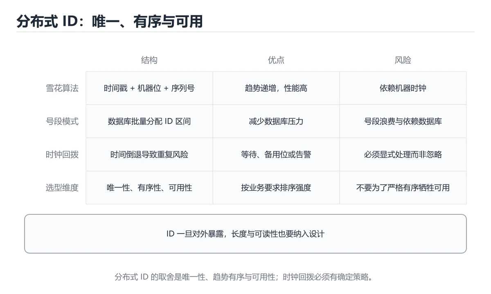

# 分布式 ID 与发号器

> 内容更新时间：2026-10-06 · 学习阶段：进阶 · 预计用时：45 分钟




## 本节知识框架

**课程定位**：所属分类 `distributed`（分布式与架构），课程主题 `分布式 ID 与发号器`，学习阶段 进阶，建议用时 40 分钟。

本课主线：雪花算法位结构、时钟回拨处理与号段模式选型。

**学完本课应当能够**
- 说清 `分布式ID` 与 `雪花算法` 的含义与区别，并各举一个正例和一个反例。
- 用本课示例验证 `号段模式` 的行为，记录输入、输出与失败条件。
- 遇到「机器 ID 重复」这类问题时，能说出触发条件与修复顺序。

### 从概念到验证的学习链条

1. `分布式ID`：先掌握 在多个节点上生成全局唯一且大致有序的标识，常用雪花算法或号段模式，再用它解释 `雪花算法` 为什么会出现。
2. `雪花算法`：先掌握 用时间、机器号和序列号生成趋势递增的分布式唯一 ID，再用它解释 `号段模式` 为什么会出现。
3. `号段模式`：先掌握 关键关系：先分清「分布式ID」与「雪花算法」的职责，再理解「号段模式」的适用边界，再用它解释 `时钟回拨` 为什么会出现。
4. `时钟回拨`：先掌握 机器时间倒退会让基于时间戳的 ID 生成器重复或乱序，需要检测并等待或切换到备用位，再用它解释 本课示例的观察结果 为什么会出现。

**先修与衔接**：本课是「分布式与架构」分类的第 5 课。相关或后续课程：《限流与熔断算法专题》。

### 完成判据

- **定义关**：不看正文也能说明 `分布式ID` 是 在多个节点上生成全局唯一且大致有序的标识，常用雪花算法或号段模式，并指出一个反例。
- **机制关**：能按“输入 → 转换 → 输出 → 验证”复述 `分布式 ID 与发号器`，而不是只背结论。
- **示例关**：能运行或推演 `分布式 ID 与发号器` 的 `python` 示例，并说明一个真实出现的标识符或字面量。
- **证据关**：能指出 `分布式 ID 与发号器` 示例里的 调用了 `__init__()`，并说明它支持或反驳了本课的哪一条结论。
- **排错关**：能复现 机器 ID 重复，记录现象并按 建立集中分配与回收机制 修复。
- **迁移关**：能把 `分布式ID`、`雪花算法`、`号段模式`、`时钟回拨` 放进一个与 `分布式 ID 与发号器` 不同的项目场景，并保持输入与验证条件可追踪。
- **复盘关**：学完 `分布式 ID 与发号器` 后，用一句话写下仍然不确定的结论，并列出下一次验证需要的输入、环境和成功判据。

### 复习清单

- [ ] 能不看正文复述本课核心术语，并指出一个边界或反例。
- [ ] 能运行或推演本课示例，记录输入、输出与失败现象。
- [ ] 能完成一次自测，并把错题对照错误表定位原因。

## 核心概念定义

| 术语 | 操作性定义 | 常见边界与风险 |
| --- | --- | --- |
| 分布式ID | 在多个节点上生成全局唯一且大致有序的标识，常用雪花算法或号段模式。 | 只在「在多个节点上生成全局唯一且大致有序的标识，常用雪花算法或号段模式」这一前提下成立，换输入或换环境要重新验证。 |
| 雪花算法 | 用时间、机器号和序列号生成趋势递增的分布式唯一 ID。 | 只在「用时间、机器号和序列号生成趋势递增的分布式唯一 ID」这一前提下成立，换输入或换环境要重新验证。 |
| 号段模式 | 关键关系：先分清「分布式ID」与「雪花算法」的职责，再理解「号段模式」的适用边界。 | 易错：发号器故障全站不可写；正确做法是号段模式或去中心化方案。 |
| 时钟回拨 | 机器时间倒退会让基于时间戳的 ID 生成器重复或乱序，需要检测并等待或切换到备用位。 | 易错：出现重复或倒退 ID；正确做法是检测回拨并等待或拒绝生成。 |

## 原理与运行机制

### 机制总览

**教材衔接：选型与设计要点**

| 需求 | 建议 |
| --- | --- |
| 数据库主键 | 雪花或号段（趋势递增，减少页分裂） |
| 对外暴露的订单号 | 加业务前缀 + 校验位，避免被枚举与猜量 |
| 幂等键 | UUID v4 或 ULID，无需中心依赖 |
| 严格递增（如账务流水） | Redis INCR 或数据库序列，接受性能上限 |
| 多机房 | 机器 ID 分配包含机房位，避免跨机房冲突 |
| 时钟同步 | 部署 NTP，并保留回拨保护逻辑 |

**教材衔接：零基础精讲：把分布式 ID 与发号器真正讲透**

### 先建立一个直觉

把分布式系统看成多人协作：没有全局时钟，消息可能延迟或丢失，因此必须定义一致性目标、重试边界和故障后的收敛方式。落到本课，「分布式 ID 与发号器」关心的是 分布式ID 与 雪花算法 的配合，也就是说这条直觉要在 方案对照速查 里被具体验证。

本课的摘要可以当作一张地图：雪花算法位结构、时钟回拨处理与号段模式选型。

### 逐步拆解

1. 澄清输入与目标。先写清「分布式 ID 与发号器」要解决的问题、合法输入范围和成功标准，再进入后续步骤。
2. 描述处理过程。把「分布式ID、雪花算法、号段模式、时钟回拨、发号器」映射到具体步骤，每步都要求能单独验证。
3. 定义输出。把 SEQUENCE_BITS 的返回值、日志和失败信号都写清楚，缺一项都不算完整。
4. 关掉一个看似必要的检查（雪花算法相关），观察哪个测试或指标先失败，用证据说明它为什么不能省。
5. 选一个只有两三步的分布式ID例子，先写出预期输出，再运行确认；不一致时先怀疑前提而不是代码。

### 把正文串成一条执行链

- **练习 1：建立心智模型（10 分钟）**：在「分布式 ID 与发号器」里，「练习 1：建立心智模型（10 分钟）」这一步要先写清输入与预期，再记录实际结果和差异；结果不符时回到对应小节核对前提。
- **练习 2：做一次可控实验（20 分钟）**：在「分布式 ID 与发号器」里，「练习 2：做一次可控实验（20 分钟）」这一步要先写清输入与预期，再记录实际结果和差异；结果不符时回到对应小节核对前提。
- **练习 3：交付一个小结果（30 分钟）**：在「分布式 ID 与发号器」里，「练习 3：交付一个小结果（30 分钟）」这一步要先写清输入与预期，再记录实际结果和差异；结果不符时回到对应小节核对前提。
- **考点 1：雪花算法中 10 位机器 ID 最多支持多少个节点？**：针对「分布式 ID 与发号器」，先自问「雪花算法中 10 位机器 ID 最多支持多少个节点」；作答后回到对应考点核对判断依据。
- **考点 2：发生时钟回拨时，若不处理会有什么后果？**：针对「分布式 ID 与发号器」，先自问「发生时钟回拨时，若不处理会有什么后果」；作答后回到对应考点核对判断依据。
- **考点 3：为什么推荐用趋势递增 ID 而不是随机 UUID 作数据库主键？**：针对「分布式 ID 与发号器」，先自问「为什么推荐用趋势递增 ID 而不是随机 UUID 作数据库主键」；作答后回到对应考点核对判断依据。

### 从测验反推易错点

**检查点 1：雪花算法中 10 位机器 ID 最多支持多少个节点？**

- 参考判断：1024
- 自问：如果去掉题干里的一个限定词，结论还成立吗？

**检查点 2：发生时钟回拨时，若不处理会有什么后果？**

- 参考判断：可能生成重复 ID

**检查点 3：为什么推荐用趋势递增 ID 而不是随机 UUID 作数据库主键？**

- 参考判断：随机写入会导致 B+ 树页分裂与索引碎片

**检查点 4：对外暴露的订单号不建议直接使用自增 ID，主要原因是？**

- 参考判断：容易被枚举，暴露业务量并带来爬取风险

**检查点 5：号段模式相比数据库自增的优势是？**

- 参考判断：一次取一批 ID 缓存在本地

### 工程排错顺序

| 先查什么 | 要得到的证据 | 判断标准 |
| --- | --- | --- |
| 一致性目标与可接受延迟是什么？ | 日志、输入样例、测试或指标 | 能复现并解释，才算定位 |
| 重试是否幂等，过期请求如何处理？ | 日志、输入样例、测试或指标 | 能复现并解释，才算定位 |
| 分区、时钟漂移和消息重复是否覆盖？ | 日志、输入样例、测试或指标 | 能复现并解释，才算定位 |
| 故障后如何观测并自动收敛？ | 日志、输入样例、测试或指标 | 能复现并解释，才算定位 |

### 变式训练

1. 先用一个单文件示例验证 SEQUENCE_BITS，确认正确性后再引入框架或分布式组件。
2. 把 分布式ID 的输入规模扩大十倍，记录时间、内存和失败路径，找出第一个瓶颈。
3. 制造一次 分布式ID 相关的依赖超时或错误输入，要求错误可解释且不留半完成状态。
5. 删掉一个看似必要的步骤（例如 分布式ID 相关的校验），观察哪个测试或指标先失败，用证据说明它为什么不能省。
6. 把 分布式ID 的方案切换到低资源设备，重新评估默认参数、超时和降级策略。


### 迁移案例库

下面用不同约束重复同一套方法，每轮只改变 分布式ID 的一个取值并记录结论。

#### 迁移案例 1：围绕「分布式ID」做一次小实验

**验收**：分布式ID 的正常、边界、失败三条路径都要有结论；失败路径要写清恢复动作与「分布式 ID 与发号器」里仍然存在的剩余风险。

#### 迁移案例 2：围绕「雪花算法」做一次小实验

**步骤**：
1. 复述当前方案对「雪花算法」的假设，写成一句可证伪的话。

#### 迁移案例 3：围绕「号段模式」做一次小实验

**步骤**：
1. 复述当前方案对「号段模式」的假设，写成一句可证伪的话。

#### 迁移案例 4：围绕「时钟回拨」做一次小实验

**步骤**：
1. 复述当前方案对「时钟回拨」的假设，写成一句可证伪的话。

#### 迁移案例 5：围绕「发号器」做一次小实验

**步骤**：
1. 复述当前方案对「发号器」的假设，写成一句可证伪的话。

#### 迁移案例 6：围绕「分布式ID」做一次小实验

**步骤**：

#### 迁移案例 7：围绕「雪花算法」做一次小实验

**步骤**：

#### 迁移案例 8：围绕「号段模式」做一次小实验

**步骤**：

#### 迁移案例 9：围绕「时钟回拨」做一次小实验

**步骤**：

#### 迁移案例 10：围绕「发号器」做一次小实验

**步骤**：

#### 迁移案例 11：围绕「分布式ID」做一次小实验

**步骤**：

#### 迁移案例 12：围绕「雪花算法」做一次小实验

**步骤**：

#### 迁移案例 13：围绕「号段模式」做一次小实验

**步骤**：

#### 迁移案例 14：围绕「时钟回拨」做一次小实验

**步骤**：

#### 迁移案例 15：围绕「发号器」做一次小实验

**步骤**：

#### 迁移案例 16：围绕「分布式ID」做一次小实验

**步骤**：

<!-- p0-depth-v2:end -->

### 机制拆解：每一步的输入、动作与输出

#### 1. `分布式ID`
- 输入：`分布式ID`；本步把 在多个节点上生成全局唯一且大致有序的标识，常用雪花算法或号段模式 当作判断规则。
- 动作：围绕 `分布式ID` 保留中间状态，并记录它与 `雪花算法` 的对应关系。
- 输出：`雪花算法`，它可以被下一段代码、测试或记录继续使用。
- `分布式ID` 的失败条件：只在「在多个节点上生成全局唯一且大致有序的标识，常用雪花算法或号段模式」这一前提下成立，换输入或换环境要重新验证。

#### 2. `雪花算法`
- 输入：`分布式ID`；本步把 用时间、机器号和序列号生成趋势递增的分布式唯一 ID 当作判断规则。
- 动作：围绕 `雪花算法` 保留中间状态，并记录它与 `号段模式` 的对应关系。
- 输出：`号段模式`，它可以被下一段代码、测试或记录继续使用。
- `雪花算法` 的失败条件：只在「用时间、机器号和序列号生成趋势递增的分布式唯一 ID」这一前提下成立，换输入或换环境要重新验证。

#### 3. `号段模式`
- 输入：`雪花算法`；本步把 关键关系：先分清「分布式ID」与「雪花算法」的职责，再理解「号段模式」的适用边界 当作判断规则。
- 动作：围绕 `号段模式` 保留中间状态，并记录它与 `时钟回拨` 的对应关系。
- 输出：`时钟回拨`，它可以被下一段代码、测试或记录继续使用。
- `号段模式` 的失败条件：当依赖单点发号器时，会出现发号器故障全站不可写。

#### 4. `时钟回拨`
- 输入：`号段模式`；本步把 机器时间倒退会让基于时间戳的 ID 生成器重复或乱序，需要检测并等待或切换到备用位 当作判断规则。
- 动作：围绕 `时钟回拨` 保留中间状态，并记录它与 `__init__` 的对应关系。
- 输出：`__init__`，它可以被下一段代码、测试或记录继续使用。
- `时钟回拨` 的失败条件：当忽略时钟回拨时，会出现出现重复或倒退 ID。

### 示例中的可观察事实

1. 调用了 `__init__()`；它对应的课程主题是 `分布式 ID 与发号器`。
2. 调用了 `ValueError()`；它对应的课程主题是 `分布式 ID 与发号器`。
3. 调用了 `Lock()`；它对应的课程主题是 `分布式 ID 与发号器`。
4. 调用了 `_wait_clock()`；它对应的课程主题是 `分布式 ID 与发号器`。
5. 调用了 `RuntimeError()`；它对应的课程主题是 `分布式 ID 与发号器`。
6. 调用了 `sleep()`；它对应的课程主题是 `分布式 ID 与发号器`。
7. 调用了 `next_id()`；它对应的课程主题是 `分布式 ID 与发号器`。
8. 调用了 `int()`；它对应的课程主题是 `分布式 ID 与发号器`。

### 复现实验记录

- 环境：`分布式 ID 与发号器` 使用 `python` 示例，固定 `分布式ID`、`雪花算法`、`号段模式`、`时钟回拨` 作为第一组条件。
- 首轮输入：先确认 调用了 `__init__()`，预测 `分布式ID` 会怎样变化。
- 基线观察：记录命令、输入、输出和错误原文，不用截图代替可复制的文本。
- 单变量修改：只改变 `分布式ID`，观察 `时钟回拨` 是否仍满足定义。
- 失败注入：复现 机器 ID 重复，确认现象是 生成重复 ID。
- 记录结论：把“修改前、修改后、预期变化、实际变化”写成四列表，这样复盘 `分布式 ID 与发号器` 时才能区分概念错误与实现错误。

## 典型应用场景

- **机器 ID 重复**：典型现象是生成重复 ID；正确做法是建立集中分配与回收机制。
- **忽略时钟回拨**：典型现象是出现重复或倒退 ID；正确做法是检测回拨并等待或拒绝生成。
- **用 UUID 做主键**：典型现象是写入变慢、索引膨胀；正确做法是用趋势递增 ID 或有序 UUID 变体。
- **用自增 ID 直接对外**：典型现象是被枚举、暴露业务量；正确做法是加前缀与校验位或改用不可预测 ID。

### 最小验证场景

- 准备：保留 `python` 示例的原始输入，先记录 `分布式 ID 与发号器` 的基线输出和完整运行命令。
- 观察：先核对 调用了 `__init__()`，再改变一个与 `分布式ID` 相关的条件。
- 判定：新结果与 `分布式 ID 与发号器` 的基线不同不等于错误；只有当差异破坏了 `分布式ID` 的定义或错误表中的约束，才判定为失败。

### 选择与边界

- 使用 `分布式ID` 时，先满足它的定义：在多个节点上生成全局唯一且大致有序的标识，常用雪花算法或号段模式；只在「在多个节点上生成全局唯一且大致有序的标识，常用雪花算法或号段模式」这一前提下成立，换输入或换环境要重新验证。
- 使用 `雪花算法` 时，先满足它的定义：用时间、机器号和序列号生成趋势递增的分布式唯一 ID；只在「用时间、机器号和序列号生成趋势递增的分布式唯一 ID」这一前提下成立，换输入或换环境要重新验证。
- 使用 `号段模式` 时，先满足它的定义：关键关系：先分清「分布式ID」与「雪花算法」的职责，再理解「号段模式」的适用边界；易错：发号器故障全站不可写；正确做法是号段模式或去中心化方案。
- 使用 `时钟回拨` 时，先满足它的定义：机器时间倒退会让基于时间戳的 ID 生成器重复或乱序，需要检测并等待或切换到备用位；易错：出现重复或倒退 ID；正确做法是检测回拨并等待或拒绝生成。

## 代码/协议/SQL 示例

**教材衔接：雪花算法位结构**

| 部分 | 位数 | 作用 |
| --- | --- | --- |
| 符号位 | 1 | 恒为 0，保持正数 |
| 时间戳 | 41 | 毫秒级，可用约 69 年 |
| 机器 ID | 10 | 最多 1024 个节点 |
| 序列号 | 12 | 同一毫秒内最多 4096 个 ID |

单节点理论峰值：4096 × 1000 ≈ 409 万 ID/秒。

**关键约束**：机器 ID 不能重复；时钟回拨必须处理，否则可能生成重复 ID。

```python
import threading
import time

class Snowflake:
    """雪花算法：线程安全，支持检测并等待时钟回拨。"""

    EPOCH = 1_700_000_000_000        # 自定义起始时间，缩短时间戳位数占用
    MACHINE_BITS = 10
    SEQUENCE_BITS = 12
    MAX_MACHINE = (1 << MACHINE_BITS) - 1
    MAX_SEQUENCE = (1 << SEQUENCE_BITS) - 1

    def __init__(self, machine_id: int, max_backward_ms: int = 5):
        if not 0 <= machine_id <= self.MAX_MACHINE:
            raise ValueError("机器 ID 超出范围")
        self.machine_id = machine_id
        self.max_backward_ms = max_backward_ms
        self.sequence = 0
        self.last_timestamp = -1
        self.lock = threading.Lock()

    def _wait_clock(self, timestamp: int) -> int:
        """时钟回拨处理：小幅回拨等待追平，大幅回拨直接报错。"""
        if timestamp >= self.last_timestamp:
            return timestamp
        backward = self.last_timestamp - timestamp
        if backward > self.max_backward_ms:
            raise RuntimeError(f"时钟回拨过多：{backward}ms，拒绝生成 ID")
        time.sleep(backward / 1000)
        return self.last_timestamp

    def next_id(self) -> int:
        with self.lock:
            timestamp = self._wait_clock(int(time.time() * 1000))
            if timestamp == self.last_timestamp:
                self.sequence = (self.sequence + 1) & self.MAX_SEQUENCE
                if self.sequence == 0:              # 当前毫秒用尽，等下一毫秒
                    while timestamp <= self.last_timestamp:
                        timestamp = int(time.time() * 1000)
            else:
                self.sequence = 0
            self.last_timestamp = timestamp
            return (
                ((timestamp - self.EPOCH) << (self.MACHINE_BITS + self.SEQUENCE_BITS))
                | (self.machine_id << self.SEQUENCE_BITS)
                | self.sequence
            )

def parse_snowflake(snowflake_id: int, epoch: int = Snowflake.EPOCH) -> dict:
    """从 ID 反解时间与机器号，便于排查问题。"""
    sequence = snowflake_id & Snowflake.MAX_SEQUENCE
    machine = (snowflake_id >> Snowflake.SEQUENCE_BITS) & Snowflake.MAX_MACHINE
    timestamp = (snowflake_id >> (Snowflake.MACHINE_BITS + Snowflake.SEQUENCE_BITS)) + epoch
    return {"timestamp_ms": timestamp, "machine_id": machine, "sequence": sequence}

generator = Snowflake(machine_id=7)
first = generator.next_id()
print(first, parse_snowflake(first))
print(generator.next_id() > first)      # 趋势递增
```

**运行方式**：运行 `分布式 ID 与发号器` 的示例时，保存为 `.py` 文件后用 `python 文件名.py` 运行；第三方依赖先在虚拟环境里安装。

### 示例精读：先找证据，再改一个条件

1. 调用了 `__init__()`；它出现在 `分布式 ID 与发号器` 的示例中，阅读时先确认它前后各发生了什么。
2. 调用了 `ValueError()`；它出现在 `分布式 ID 与发号器` 的示例中，阅读时先确认它前后各发生了什么。
3. 调用了 `Lock()`；它出现在 `分布式 ID 与发号器` 的示例中，阅读时先确认它前后各发生了什么。
4. 调用了 `_wait_clock()`；它出现在 `分布式 ID 与发号器` 的示例中，阅读时先确认它前后各发生了什么。
5. 调用了 `RuntimeError()`；它出现在 `分布式 ID 与发号器` 的示例中，阅读时先确认它前后各发生了什么。
6. 调用了 `sleep()`；它出现在 `分布式 ID 与发号器` 的示例中，阅读时先确认它前后各发生了什么。
7. 调用了 `next_id()`；它出现在 `分布式 ID 与发号器` 的示例中，阅读时先确认它前后各发生了什么。
8. 调用了 `int()`；它出现在 `分布式 ID 与发号器` 的示例中，阅读时先确认它前后各发生了什么。
- 在 `分布式 ID 与发号器` 中与 `分布式ID` 对照：示例必须能支持 在多个节点上生成全局唯一且大致有序的标识，常用雪花算法或号段模式，否则说明这一段还缺少实现或验证步骤。
- 在 `分布式 ID 与发号器` 中与 `雪花算法` 对照：示例必须能支持 用时间、机器号和序列号生成趋势递增的分布式唯一 ID，否则说明这一段还缺少实现或验证步骤。
- 在 `分布式 ID 与发号器` 中与 `号段模式` 对照：示例必须能支持 关键关系：先分清「分布式ID」与「雪花算法」的职责，再理解「号段模式」的适用边界，否则说明这一段还缺少实现或验证步骤。
- 在 `分布式 ID 与发号器` 中与 `时钟回拨` 对照：示例必须能支持 机器时间倒退会让基于时间戳的 ID 生成器重复或乱序，需要检测并等待或切换到备用位，否则说明这一段还缺少实现或验证步骤。

## 时间/空间复杂度或性能分析

**性能关注点（分布式 ID 与发号器）**：一致性与可用性存在权衡：记录 P99 延迟、副本同步延迟与故障恢复时间。

**测量方法**：以 `分布式 ID 与发号器` 的 `分布式ID` 场景为对象，固定输入跑一遍记录基线，再把规模或并发度提高一个数量级复测；两次结果的差值与波动范围才是结论依据。

### 需要控制的变量与记录项

- `分布式 ID 与发号器` 的 `分布式ID`：固定它的版本、输入范围和资源上限，分别记录速度、内存与失败率的变化。
- `分布式 ID 与发号器` 的 `雪花算法`：固定它的版本、输入范围和资源上限，分别记录速度、内存与失败率的变化。
- `分布式 ID 与发号器` 的 `号段模式`：固定它的版本、输入范围和资源上限，分别记录速度、内存与失败率的变化。
- `分布式 ID 与发号器` 的 `时钟回拨`：固定它的版本、输入范围和资源上限，分别记录速度、内存与失败率的变化。
- `分布式 ID 与发号器` 的 `发号器`：固定它的版本、输入范围和资源上限，分别记录速度、内存与失败率的变化。
- `分布式 ID 与发号器` 中 `分布式ID` 的边界：只在「在多个节点上生成全局唯一且大致有序的标识，常用雪花算法或号段模式」这一前提下成立，换输入或换环境要重新验证。达到边界时不要外推，必须重新测量。
- `分布式 ID 与发号器` 中 `雪花算法` 的边界：只在「用时间、机器号和序列号生成趋势递增的分布式唯一 ID」这一前提下成立，换输入或换环境要重新验证。达到边界时不要外推，必须重新测量。
- `分布式 ID 与发号器` 中 `号段模式` 的边界：易错：发号器故障全站不可写；正确做法是号段模式或去中心化方案。达到边界时不要外推，必须重新测量。
- `分布式 ID 与发号器` 中 `时钟回拨` 的边界：易错：出现重复或倒退 ID；正确做法是检测回拨并等待或拒绝生成。达到边界时不要外推，必须重新测量。
- `分布式 ID 与发号器` 的代码证据：先验证 调用了 `__init__()`，再记录该路径的输入规模与耗时；只看代码行数不能推出复杂度。

## 常见误区与易错点

| 容易写错的做法 | 实际现象 | 原因与正确做法 |
| --- | --- | --- |
| 机器 ID 重复 | 生成重复 ID | 建立集中分配与回收机制 |
| 忽略时钟回拨 | 出现重复或倒退 ID | 检测回拨并等待或拒绝生成 |
| 用 UUID 做主键 | 写入变慢、索引膨胀 | 用趋势递增 ID 或有序 UUID 变体 |
| 用自增 ID 直接对外 | 被枚举、暴露业务量 | 加前缀与校验位或改用不可预测 ID |
| 依赖单点发号器 | 发号器故障全站不可写 | 号段模式或去中心化方案 |
| 序列号不重置 | 同毫秒内溢出重复 | 每毫秒重置序列并在用尽时等待 |
| 直接比较不同方案 ID | 排序结果混乱 | 明确有序语义与时间基准 |

### 现场 1：机器 ID 重复

**症状**：生成重复 ID。

**根因与修复**：建立集中分配与回收机制。

**自检**：在本课示例里复现「机器 ID 重复」，改成建立集中分配与回收机制后重跑；如果症状消失且失败路径按预期变化，说明定位正确。

### 现场 2：忽略时钟回拨

**症状**：出现重复或倒退 ID。

**根因与修复**：检测回拨并等待或拒绝生成。

**自检**：在本课示例里复现「忽略时钟回拨」，改成检测回拨并等待或拒绝生成后重跑；如果症状消失且失败路径按预期变化，说明定位正确。

### 现场 3：用 UUID 做主键

**症状**：写入变慢、索引膨胀。

**根因与修复**：用趋势递增 ID 或有序 UUID 变体。

**自检**：在本课示例里复现「用 UUID 做主键」，改成用趋势递增 ID 或有序 UUID 变体后重跑；如果症状消失且失败路径按预期变化，说明定位正确。

### 现场 4：用自增 ID 直接对外

**症状**：被枚举、暴露业务量。

**根因与修复**：加前缀与校验位或改用不可预测 ID。

**自检**：在本课示例里复现「用自增 ID 直接对外」，改成加前缀与校验位或改用不可预测 ID后重跑；如果症状消失且失败路径按预期变化，说明定位正确。

### 现场 5：依赖单点发号器

**症状**：发号器故障全站不可写。

**根因与修复**：号段模式或去中心化方案。

**自检**：在本课示例里复现「依赖单点发号器」，改成号段模式或去中心化方案后重跑；如果症状消失且失败路径按预期变化，说明定位正确。

### 现场 6：序列号不重置

**症状**：同毫秒内溢出重复。

**根因与修复**：每毫秒重置序列并在用尽时等待。

**自检**：在本课示例里复现「序列号不重置」，改成每毫秒重置序列并在用尽时等待后重跑；如果症状消失且失败路径按预期变化，说明定位正确。

### 现场 7：直接比较不同方案 ID

**症状**：排序结果混乱。

**根因与修复**：明确有序语义与时间基准。

**自检**：在本课示例里复现「直接比较不同方案 ID」，改成明确有序语义与时间基准后重跑；如果症状消失且失败路径按预期变化，说明定位正确。

## 与其他知识点的关系

**教材衔接：方案对照速查**

| 方案 | 有序性 | 性能 | 依赖 | 适用 |
| --- | --- | --- | --- | --- |
| 数据库自增 | 严格递增 | 受单库限制 | 数据库 | 小规模、单库 |
| 号段模式 | 趋势递增 | 高 | 数据库（批量取号） | 中大型业务 |
| 雪花算法 | 趋势递增 | 极高 | 时钟 | 通用首选 |
| Redis INCR | 严格递增 | 高 | Redis | 需要严格递增 |
| UUID v4 | 无序 | 高 | 无 | 幂等键、请求 ID |
| ULID | 时间有序 | 高 | 无 | 需要有序且无中心依赖 |

**教材衔接：代码对照与验证**

这一节对比常见 ID 方案，并给出可运行的生成与校验代码。

### 对照一：UUID 与自增 ID 的取舍

```python
import uuid

generated = uuid.uuid4()
print(generated)
print(len(str(generated).replace("-", "")))
```

UUID 无需中心协调，适合分库分表；代价是占用空间大、索引局部性差。

### 对照二：雪花号的结构

```text
64 位 = 1 位符号 + 41 位时间戳 + 10 位机器号 + 12 位序列号
                    |             |            |
                    |             |            +-- 同一毫秒内最多 4096 个
                    |             +-- 最多 1024 个节点
                    +-- 毫秒级，可用约 69 年
```

趋势递增让 B+ 树索引写入更友好，但时钟回拨必须显式处理，否则会生成重复 ID。

### 对照三：常见方案对照

| 方案 | 有序性 | 依赖 | 适用场景 |
| --- | --- | --- | --- |
| 数据库自增 | 强 | 单库或号段服务 | 单库、中小规模 |
| 号段模式 | 趋势递增 | 中心号段服务 | 高并发且需要有序 |
| UUID v4 | 无序 | 无 | 分布式无协调生成 |
| 雪花号 | 趋势递增 | 机器号分配 | 大规模分片表 |

### 验证清单

- 生成器在时钟回拨时有明确策略（等待、报错或降级）。
- ID 长度与索引类型匹配，不会因过长拖慢写入。
- 机器号分配有唯一性保障并记录在案。

- **相关或后续**：`限流与熔断算法专题`。本课术语会在这些课程里继续使用。
- **术语归属**：`分布式ID`、`雪花算法`、`号段模式` 的定义以本课「核心概念定义」为准，换到其他课程时先确认定义是否被改写。
- 同一分类的《实战：设计一个短链服务》也涉及 `发号器`；两课衔接时先确认这个术语的定义是否一致。

### 先修与后续术语接口

- `限流与熔断算法专题`：两者通过本分类的学习顺序衔接，阅读时重点比较各自的输入与失败条件。

### 容易混淆的相邻概念

- `分布式ID` 与 `雪花算法`：前者强调 在多个节点上生成全局唯一且大致有序的标识，常用雪花算法或号段模式；后者强调 用时间、机器号和序列号生成趋势递增的分布式唯一 ID。判断时分别检查两条定义的适用范围，不要只看名称相似就互换。
- `雪花算法` 与 `号段模式`：前者强调 用时间、机器号和序列号生成趋势递增的分布式唯一 ID；后者强调 关键关系：先分清「分布式ID」与「雪花算法」的职责，再理解「号段模式」的适用边界。判断时分别检查两条定义的适用范围，不要只看名称相似就互换。
- `号段模式` 与 `时钟回拨`：前者强调 关键关系：先分清「分布式ID」与「雪花算法」的职责，再理解「号段模式」的适用边界；后者强调 机器时间倒退会让基于时间戳的 ID 生成器重复或乱序，需要检测并等待或切换到备用位。判断时分别检查两条定义的适用范围，不要只看名称相似就互换。

## 自测题与参考答案

> 先独立作答，再对照参考答案；答案都能在本课正文、术语表或错误表里找到依据。

### 自测 1（概念复述）

不看正文，写出 `分布式ID` 的操作性定义，并说明它与 `雪花算法` 的区别。

**参考答案**：在多个节点上生成全局唯一且大致有序的标识，常用雪花算法或号段模式。

`雪花算法` 的定位是：用时间、机器号和序列号生成趋势递增的分布式唯一 ID；两者的差别要从适用对象与失败模式上说明。

### 自测 2（排错）

本课错误表记录了「机器 ID 重复」这类做法。请写出它会出现的现象、根因，以及修复顺序。

**参考答案**：现象是生成重复 ID；正确做法是建立集中分配与回收机制。修复时先复现现象并保留证据，再改动一处假设重跑，确认现象消失。

### 自测 3（动手验证）

运行本课的 `python` 示例，把其中的 `"雪花算法：线程安全，支持检测并等待时钟回拨。"` 换成一个边界值后重新运行，记录输出与错误信息。

**参考答案**：正常输入下 `python` 示例应当复现正文给出的结果；把 `"雪花算法：线程安全，支持检测并等待时钟回拨。"` 换成边界值后，如果结果改变或报错，先核对它是否满足 `分布式 ID 与发号器` 中`分布式ID` 的适用范围，再检查错误表里是否有同类现象。

### 自测 4（代码阅读）

阅读本课开头的 `python` 示例，说明它体现了`分布式ID` 的哪一条性质，并指出改动哪个输入会让这条性质不再成立。

**参考答案**：`分布式ID` 的定义是 在多个节点上生成全局唯一且大致有序的标识，常用雪花算法或号段模式，示例正是在实现这条定义。改动与 `分布式ID` 有关的一个输入后，如果结果不再符合 `分布式 ID 与发号器` 的正文描述，就说明该性质只在当前前提成立。

### 自测 5（迁移）

把 `分布式 ID 与发号器` 的方法迁移到自己的项目：围绕 `分布式ID` 写出一个与错误表同类的风险点，并说明触发条件和检验方式。

**参考答案**：例如「直接比较不同方案 ID」，它会导致排序结果混乱；检验方式是按明确有序语义与时间基准改一处再复现，确认现象消失且没有引入新的失败分支。

### 自测 6（对比）

用一个表格对比 `分布式ID` 与 `雪花算法`：各写一行适用场景、一行失败表现。

**参考答案**：`分布式ID` 的定义是在多个节点上生成全局唯一且大致有序的标识，常用雪花算法或号段模式；`雪花算法` 的定义是用时间、机器号和序列号生成趋势递增的分布式唯一 ID。两者的失败表现分别对应本课错误表里与本术语相关的行。

### 自测 7（排错顺序）

面对「机器 ID 重复」引发的问题，请把“复现 生成重复 ID → 保留证据 → 建立集中分配与回收机制 → 回归验证”四步写成可执行的检查清单。

**参考答案**：第一步按生成重复 ID复现；第二步记录输入、版本与完整报错；第三步按建立集中分配与回收机制只改一处；第四步重跑并确认失败路径也按预期变化。

### 自测 8（边界判断）

针对 `时钟回拨`，分别写出“可以使用”的条件和“结论不再成立”的条件。

**参考答案**：易错：出现重复或倒退 ID；正确做法是检测回拨并等待或拒绝生成。 同时要把 `时钟回拨` 的定义 机器时间倒退会让基于时间戳的 ID 生成器重复或乱序，需要检测并等待或切换到备用位 与实际输入逐项对照。

### 自测 9（机制重建）

不看正文，按输入、转换、输出、验证四段重建 `分布式ID` → `雪花算法` → `号段模式` → `时钟回拨` 的作用链。

**参考答案**：起点是 `分布式ID` 的定义 在多个节点上生成全局唯一且大致有序的标识，常用雪花算法或号段模式；中间每一步都保留可观察状态；终点由 `时钟回拨` 检查，失败时回到错误表定位第一个偏离定义的步骤。

### 自测 10（综合排错）

在 `分布式 ID 与发号器` 中，现象是 排序结果混乱。请围绕 直接比较不同方案 ID 写出最小复现、关键证据、修复动作和回归验证，并说明为什么不能只凭一次运行下结论。

**参考答案**：先复现 直接比较不同方案 ID，记录输入与完整错误；再按 明确有序语义与时间基准 只改一处。回归时同时跑正常路径和边界路径，只有两次结果都可解释，才把修复视为完成。

### 自测 11（一分钟复述）

用每分钟约 200 字的速度复述 `分布式 ID 与发号器`：先给主问题，再按顺序说出 `分布式ID`、`雪花算法`、`号段模式`、`时钟回拨`，最后给一个失败案例。

**自评标准**：主问题必须对应 雪花算法位结构、时钟回拨处理与号段模式选型；每个术语都要能接上一句定义或边界；失败案例必须写成可观察现象，不能用“可能有风险”代替证据。

## 术语速查

| 术语 | 一句话说明 |
| --- | --- |
| `分布式ID` | 在多个节点上生成全局唯一且大致有序的标识，常用雪花算法或号段模式。 |
| `雪花算法` | 用时间、机器号和序列号生成趋势递增的分布式唯一 ID。 |
| `号段模式` | 关键关系：先分清「分布式ID」与「雪花算法」的职责，再理解「号段模式」的适用边界。 |
| `时钟回拨` | 机器时间倒退会让基于时间戳的 ID 生成器重复或乱序，需要检测并等待或切换到备用位。 |

**术语关系**：`分布式ID`（在多个节点上生成全局唯一且大致有序的标识） → `雪花算法`（用时间、机器号和序列号生成趋势递增的分布式唯一 ID） → `号段模式`（关键关系：先分清「分布式ID」与「雪花算法」的职责） → `时钟回拨`（机器时间倒退会让基于时间戳的 ID 生成器重复或乱序）。

## 考点精讲

`分布式 ID 与发号器` 的题库有 6 道题，下面逐题给出题干、正确项与判断依据：先自己作答，再核对正确项，最后回到正文对应小节复核。

### 考点 1：第 1 题

- **题目**：围绕“分布式 ID 与发号器”中的 分布式ID、雪花算法、号段模式，下列哪两项是本课强调的实践判断？
- **正确项**：验证 雪花算法 时要固定版本并覆盖边界输入，结论才可复现；学习 分布式ID 时要同时说明输入、输出和失败路径，不能只看正常流程
- **判断依据**：这道题落在术语 `分布式ID` 上：在多个节点上生成全局唯一且大致有序的标识，常用雪花算法或号段模式。复习时把 `分布式ID` 的定义、适用边界和一个反例一起说清楚，再回到「核心概念定义」核对原文。

### 考点 2：第 2 题

- **题目**：发生时钟回拨时，若不处理会有什么后果？
- **正确项**：可能生成重复 ID
- **判断依据**：这道题落在术语 `时钟回拨` 上：机器时间倒退会让基于时间戳的 ID 生成器重复或乱序，需要检测并等待或切换到备用位。复习时把 `时钟回拨` 的定义、适用边界和一个反例一起说清楚，再回到「核心概念定义」核对原文。

### 考点 3：第 3 题

- **题目**：阅读雪花 ID 的生成逻辑，下面哪项判断是正确的？
- **正确项**：时间戳、机器号与序列号拼成有序 ID，机器号必须唯一，还要处理时钟回拨
- **判断依据**：这道题落在术语 `时钟回拨` 上：机器时间倒退会让基于时间戳的 ID 生成器重复或乱序，需要检测并等待或切换到备用位。复习时把 `时钟回拨` 的定义、适用边界和一个反例一起说清楚，再回到「核心概念定义」核对原文。

### 考点 4：第 4 题

- **题目**：对外暴露的订单号不建议直接使用自增 ID，主要原因是？
- **正确项**：容易被枚举，暴露业务量并带来爬取风险
- **判断依据**：这道题检验本课主问题：雪花算法位结构、时钟回拨处理与号段模式选型。复习时先复述本课主问题，再举一个会让结论失效的输入。

### 考点 5：第 5 题

- **题目**：号段模式相比数据库自增的优势是？
- **正确项**：一次取一批 ID 缓存在本地
- **判断依据**：这道题落在术语 `号段模式` 上：关键关系：先分清「分布式ID」与「雪花算法」的职责，再理解「号段模式」的适用边界。复习时把 `号段模式` 的定义、适用边界和一个反例一起说清楚，再回到「核心概念定义」核对原文。

### 考点 6：第 6 题

- **题目**：填空：补齐下面这段术语说明中的空缺。课程 `雪花算法位结构、时钟回拨处理与号段模式选型。`，这段说明是：`____`：在多个节点上生成全局唯一且大致有序的标识，常用雪花算法或号段模式。空缺处应填哪个术语？
- **正确项**：分布式ID
- **判断依据**：这道题落在术语 `分布式ID` 上：在多个节点上生成全局唯一且大致有序的标识，常用雪花算法或号段模式。复习时把 `分布式ID` 的定义、适用边界和一个反例一起说清楚，再回到「核心概念定义」核对原文。

### 考点 7：`分布式ID`

- **要点**：在多个节点上生成全局唯一且大致有序的标识，常用雪花算法或号段模式。
- **分布式ID 的边界**：只在「在多个节点上生成全局唯一且大致有序的标识，常用雪花算法或号段模式」这一前提下成立，换输入或换环境要重新验证。

### 考点 8：`雪花算法`

- **要点**：用时间、机器号和序列号生成趋势递增的分布式唯一 ID。
- **雪花算法 的边界**：只在「用时间、机器号和序列号生成趋势递增的分布式唯一 ID」这一前提下成立，换输入或换环境要重新验证。

### 考点 9：`号段模式`

- **要点**：关键关系：先分清「分布式ID」与「雪花算法」的职责，再理解「号段模式」的适用边界。
- **号段模式 的边界**：易错：发号器故障全站不可写；正确做法是号段模式或去中心化方案。

### 考点 10：`时钟回拨`

- **要点**：机器时间倒退会让基于时间戳的 ID 生成器重复或乱序，需要检测并等待或切换到备用位。
- **时钟回拨 的边界**：易错：出现重复或倒退 ID；正确做法是检测回拨并等待或拒绝生成。

### 考点 11：排错——机器 ID 重复

- **现象**：生成重复 ID。
- **处理**：建立集中分配与回收机制。

### 考点 12：排错——忽略时钟回拨

- **现象**：出现重复或倒退 ID。
- **处理**：检测回拨并等待或拒绝生成。

### 考点 13：综合辨析——`分布式ID` 与 `时钟回拨`

- **辨析点**：`分布式ID` 的定义是 在多个节点上生成全局唯一且大致有序的标识，常用雪花算法或号段模式；`时钟回拨` 的定义是 机器时间倒退会让基于时间戳的 ID 生成器重复或乱序，需要检测并等待或切换到备用位。
- **答题要求**：面对 `分布式 ID 与发号器` 的题目，先判断描述的是 `分布式ID` 还是 `时钟回拨`，再归到对应定义，最后写出一个会让该定义失效的边界输入。

### 考点 14：排错评分点

- **现象分**：能写出 生成重复 ID，而不是只写“程序有错”。
- **证据分**：保留触发 机器 ID 重复 的输入、版本和错误原文。
- **修复分**：按 建立集中分配与回收机制 只改一处，并同时回归正常路径与边界路径。

## 内容元数据

- 内容版本：v2.0
- 最后更新：2026-10-06
- 学习阶段：进阶
- 适用环境：分布式系统与云原生基础设施；本课聚焦 分布式ID。
- 内容来源：内置结构化课程与工程实践整理
- 相关主题：分布式ID、雪花算法、号段模式、时钟回拨、发号器
- 质量版本：P0 测验标准 + P1 覆盖扩展 + P2 体验补全

## 参考资料与复核

- 最后复核：2026-10-04
- 下次复核：2027-07-24
- 复核范围：版本兼容、API 行为、安全建议与工程实践
- 来源性质：官方文档、标准或权威教材；本课核对关键词：分布式ID、雪花算法、号段模式、时钟回拨、发号器。

| 参考资料 | 本课用途 |
| --- | --- |
| [AWS 架构中心](https://aws.amazon.com/architecture/) | 高可用与云架构模式 |
| [Apache Kafka 文档](https://kafka.apache.org/documentation/) | 日志、分区与消费组 |
| [CAP 定理资料](https://www.cs.princeton.edu/courses/archive/fall20/cos418/papers/brew.pdf) | 一致性、可用性与分区 |

| [本课术语索引：分布式 ID 与发号器](#核心概念定义) | 按本课输入、术语边界和错误表现逐项核对 |
> 「分布式 ID 与发号器」的链接用于离线阅读后的延伸核对；App 不会自动联网。