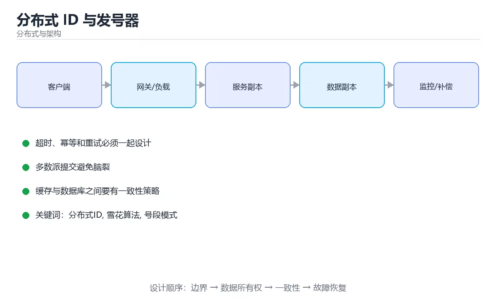

# 分布式 ID 与发号器



> 内容更新时间：2026-10-03 · 学习阶段：进阶 · 预计用时：16 分钟

## 学习目标

- 能用自己的话解释「分布式 ID 与发号器」解决了什么问题，而不是只背术语。
- 能说清 「分布式ID」、「雪花算法」、「号段模式」、「时钟回拨」 之间的关系，并分别举出一个例子。
- 能把本课知识放回「分布式与架构」的知识体系，说明它和相邻主题的边界。
- 能完成本课练习，并用验收标准检查自己的结果。

> 一句话摘要：雪花算法位结构、时钟回拨处理与号段模式选型。

## 前置知识

- 先完成上一课《共识与复制：Raft 实战要点》；如果已经掌握，可以直接用本课练习自测。
- 本课阶段：进阶。建议先掌握同一分类的基础课程，并能独立运行正文中的最小示例。
- 开始前先复习：分布式ID、雪花算法、号段模式。
- 如果某一步看不懂，先记录具体卡点，完成练习后再回头读一遍。


## 方案对照速查

| 方案 | 有序性 | 性能 | 依赖 | 适用 |
| --- | --- | --- | --- | --- |
| 数据库自增 | 严格递增 | 受单库限制 | 数据库 | 小规模、单库 |
| 号段模式 | 趋势递增 | 高 | 数据库（批量取号） | 中大型业务 |
| 雪花算法 | 趋势递增 | 极高 | 时钟 | 通用首选 |
| Redis INCR | 严格递增 | 高 | Redis | 需要严格递增 |
| UUID v4 | 无序 | 高 | 无 | 幂等键、请求 ID |
| ULID | 时间有序 | 高 | 无 | 需要有序且无中心依赖 |

## 雪花算法位结构

| 部分 | 位数 | 作用 |
| --- | --- | --- |
| 符号位 | 1 | 恒为 0，保持正数 |
| 时间戳 | 41 | 毫秒级，可用约 69 年 |
| 机器 ID | 10 | 最多 1024 个节点 |
| 序列号 | 12 | 同一毫秒内最多 4096 个 ID |

单节点理论峰值：4096 × 1000 ≈ 409 万 ID/秒。

**关键约束**：机器 ID 不能重复；时钟回拨必须处理，否则可能生成重复 ID。

```python
import threading
import time

class Snowflake:
    """雪花算法：线程安全，支持检测并等待时钟回拨。"""

    EPOCH = 1_700_000_000_000        # 自定义起始时间，缩短时间戳位数占用
    MACHINE_BITS = 10
    SEQUENCE_BITS = 12
    MAX_MACHINE = (1 << MACHINE_BITS) - 1
    MAX_SEQUENCE = (1 << SEQUENCE_BITS) - 1

    def __init__(self, machine_id: int, max_backward_ms: int = 5):
        if not 0 <= machine_id <= self.MAX_MACHINE:
            raise ValueError("机器 ID 超出范围")
        self.machine_id = machine_id
        self.max_backward_ms = max_backward_ms
        self.sequence = 0
        self.last_timestamp = -1
        self.lock = threading.Lock()

    def _wait_clock(self, timestamp: int) -> int:
        """时钟回拨处理：小幅回拨等待追平，大幅回拨直接报错。"""
        if timestamp >= self.last_timestamp:
            return timestamp
        backward = self.last_timestamp - timestamp
        if backward > self.max_backward_ms:
            raise RuntimeError(f"时钟回拨过多：{backward}ms，拒绝生成 ID")
        time.sleep(backward / 1000)
        return self.last_timestamp

    def next_id(self) -> int:
        with self.lock:
            timestamp = self._wait_clock(int(time.time() * 1000))
            if timestamp == self.last_timestamp:
                self.sequence = (self.sequence + 1) & self.MAX_SEQUENCE
                if self.sequence == 0:              # 当前毫秒用尽，等下一毫秒
                    while timestamp <= self.last_timestamp:
                        timestamp = int(time.time() * 1000)
            else:
                self.sequence = 0
            self.last_timestamp = timestamp
            return (
                ((timestamp - self.EPOCH) << (self.MACHINE_BITS + self.SEQUENCE_BITS))
                | (self.machine_id << self.SEQUENCE_BITS)
                | self.sequence
            )

def parse_snowflake(snowflake_id: int, epoch: int = Snowflake.EPOCH) -> dict:
    """从 ID 反解时间与机器号，便于排查问题。"""
    sequence = snowflake_id & Snowflake.MAX_SEQUENCE
    machine = (snowflake_id >> Snowflake.SEQUENCE_BITS) & Snowflake.MAX_MACHINE
    timestamp = (snowflake_id >> (Snowflake.MACHINE_BITS + Snowflake.SEQUENCE_BITS)) + epoch
    return {"timestamp_ms": timestamp, "machine_id": machine, "sequence": sequence}

generator = Snowflake(machine_id=7)
first = generator.next_id()
print(first, parse_snowflake(first))
print(generator.next_id() > first)      # 趋势递增
```

## 选型与设计要点

| 需求 | 建议 |
| --- | --- |
| 数据库主键 | 雪花或号段（趋势递增，减少页分裂） |
| 对外暴露的订单号 | 加业务前缀 + 校验位，避免被枚举与猜量 |
| 幂等键 | UUID v4 或 ULID，无需中心依赖 |
| 严格递增（如账务流水） | Redis INCR 或数据库序列，接受性能上限 |
| 多机房 | 机器 ID 分配包含机房位，避免跨机房冲突 |
| 时钟同步 | 部署 NTP，并保留回拨保护逻辑 |

## 常见错误对照表

| 容易踩的做法 | 实际现象 | 原因与正确做法 |
| --- | --- | --- |
| 机器 ID 重复 | 生成重复 ID | 建立集中分配与回收机制 |
| 忽略时钟回拨 | 出现重复或倒退 ID | 检测回拨并等待或拒绝生成 |
| 用 UUID 做主键 | 写入变慢、索引膨胀 | 用趋势递增 ID 或有序 UUID 变体 |
| 用自增 ID 直接对外 | 被枚举、暴露业务量 | 加前缀与校验位或改用不可预测 ID |
| 依赖单点发号器 | 发号器故障全站不可写 | 号段模式或去中心化方案 |
| 序列号不重置 | 同毫秒内溢出重复 | 每毫秒重置序列并在用尽时等待 |
| 直接比较不同方案 ID | 排序结果混乱 | 明确有序语义与时间基准 |

## 自测清单

- [ ] 能说出至少四种发号方案的取舍。
- [ ] 记得雪花算法三段的位宽与单机峰值。
- [ ] 知道时钟回拨的危害与处理策略。
- [ ] 对外 ID 有防枚举设计。
- [ ] 机器 ID 有集中分配机制且不重复。

## 动手练习

<!-- practice-diversified:v1 -->

> 本课练习重点：围绕「分布式ID、雪花算法、号段模式」完成复述、实验和交付，每个结果都要能被别人检查。

先画拓扑与数据流，再注入节点或网络故障，最后验证恢复与一致性。

### 练习 1：建立心智模型（10 分钟）

合上教程，用 3～5 句话回答：

1. 「分布式 ID 与发号器」解决了什么问题？
2. 如果没有它，会出现什么具体后果？
3. 它和「雪花算法」是什么关系？

**验收标准**：至少出现一个本课关键词，并写出一个反例、边界条件或失效场景。

### 练习 2：做一次可控实验（20 分钟）

从正文中选一个最小示例，完成以下操作：

1. 先预测修改一个参数、输入或步骤后的结果。
2. 再实际执行或逐步推演，记录真实结果。
3. 如果结果与预测不同，写出差异原因。

**验收标准**：留下「原例 → 改动 → 预测 → 结果 → 原因」五步记录。

### 练习 3：交付一个小结果（30 分钟）

画出系统拓扑，设计一次节点宕机或网络延迟演练，并写出恢复步骤。

任务要求：

- 结果必须能被别人检查，不能只写“我已经理解了”。
- 至少覆盖「分布式ID」和「雪花算法」两个关键词。
- 写出 1 个仍然不确定的问题，以及下一步如何验证。

> 提示：时间有限时优先做练习 1 和练习 2；练习 3 可以拆成两次完成。

## 本课小结

- 核心问题：「分布式 ID 与发号器」不是孤立术语，而是在「分布式与架构」中解决一类具体问题。
- 关键关系：先分清「分布式ID」与「雪花算法」的职责，再理解「号段模式」的适用边界。
- 判断标准：能解释正常场景、边界条件和失败场景，才算真正掌握。
- 下一步：完成练习后，用自己的话写下 3 条要点，再去做本课测验。

<!-- scaffold:v1 -->

<!-- p2-enrichment:v1 -->

## English Overview

**Title:** Distributed ID Generation

**Summary:** Snowflake layout, clock drift handling and segment mode.

**Category:** Distributed Systems  
**Level:** 进阶  
**Key terms:** 分布式ID, 雪花算法, 号段模式, 时钟回拨, 发号器

> The full tutorial is written in Chinese. This bilingual overview helps English readers identify the topic, scope and key terms before studying the detailed examples.

## 内容元数据

- 内容版本：v2.0
- 最后更新：2026-10-03
- 学习阶段：进阶
- 适用环境：分布式系统与云原生基础设施
- 内容来源：内置结构化课程与工程实践整理
- 相关主题：分布式ID、雪花算法、号段模式、时钟回拨、发号器
- 质量版本：P0 测验标准 + P1 覆盖扩展 + P2 体验补全

<!-- top50-rewrite:v1 -->

## 课程专属精读：分布式 ID 与发号器

### 一、知识地图

| 主题 | 核心要点 | 验证方式 |
| --- | --- | --- |
| 方案对照速查 | 方案：数据库自增；有序性：严格递增；性能：受单库限制 | 复述要点 + 举一个反例 |
| 雪花算法位结构 | 单节点理论峰值：4096 × 1000 ≈ 409 万 ID/秒。 | 运行示例 + 换一个边界输入 |
| 选型与设计要点 | 需求：数据库主键；建议：雪花或号段（趋势递增，减少页分裂） | 复述要点 + 举一个反例 |

### 二、机制与验证

1. **方案对照速查**：方案：数据库自增；有序性：严格递增；性能：受单库限制 验证方式：先复述要点，再举一个反例说明边界。
2. **雪花算法位结构**：单节点理论峰值：4096 × 1000 ≈ 409 万 ID/秒。 验证方式：先原样运行示例，再把输入换成边界值，对照输出差异。
3. **选型与设计要点**：需求：数据库主键；建议：雪花或号段（趋势递增，减少页分裂） 验证方式：先复述要点，再举一个反例说明边界。

### 三、专属检查问题

1. 「方案对照速查」要解决什么问题？请用一句话说明，并给出一个具体例子。
2. 「雪花算法位结构」的输入和输出分别是什么？
3. 「选型与设计要点」最常见的失败方式是什么？如何定位？

### 四、故障排查

1. 固定输入和环境，确认问题能稳定复现。
2. 找到第一个异常状态，不从最终错误倒推。
3. 每次只改一个变量，记录预测和真实结果。
4. 修复后补边界、失败与重复执行三类测试。

## 专属复习题库

**问：方案对照速查的核心要点是什么？**

答：方案：数据库自增；有序性：严格递增；性能：受单库限制

**问：雪花算法位结构的核心要点是什么？**

答：单节点理论峰值：4096 × 1000 ≈ 409 万 ID/秒。

**问：选型与设计要点的核心要点是什么？**

答：需求：数据库主键；建议：雪花或号段（趋势递增，减少页分裂）

## 逐步练习：分布式 ID 与发号器

### 练习 1：方案对照速查

1. 不看原文，用自己的话复述：方案：数据库自增；有序性：严格递增；性能：受单库限制
2. 举一个正例和一个反例，说明边界在哪里。
3. 把结论写成两行笔记：一行结论，一行验证方式。

### 练习 2：雪花算法位结构

1. 不看原文，用自己的话复述：单节点理论峰值：4096 × 1000 ≈ 409 万 ID/秒。
2. 跑通本课示例，再把其中一个输入换成边界值，记录输出差异。
3. 把结论写成两行笔记：一行结论，一行验证方式。

### 练习 3：选型与设计要点

1. 不看原文，用自己的话复述：需求：数据库主键；建议：雪花或号段（趋势递增，减少页分裂）
2. 举一个正例和一个反例，说明边界在哪里。
3. 把结论写成两行笔记：一行结论，一行验证方式。

## 故障排查手册：分布式 ID 与发号器

| 现象 | 优先检查 | 修复动作 |
| --- | --- | --- |
| 「方案对照速查」的结果与预期不符 | 输入、环境、依赖版本、日志里的第一条错误 | 固定最小复现，只改一个变量并回归 |
| 「雪花算法位结构」的结果与预期不符 | 输入、环境、依赖版本、日志里的第一条错误 | 固定最小复现，只改一个变量并回归 |
| 「选型与设计要点」的结果与预期不符 | 输入、环境、依赖版本、日志里的第一条错误 | 固定最小复现，只改一个变量并回归 |

## 自测与面试：分布式 ID 与发号器

1. 「方案对照速查」的输入和输出分别是什么？
2. 「雪花算法位结构」最常见的失败方式是什么？如何定位？
3. 「选型与设计要点」的适用边界在哪里？什么情况下不该使用？

## 专属进阶任务 5：分布式 ID 与发号器

把本课 3 个主题串成一个小练习：选其中一个主题做出可运行的例子，再为另外两个主题各写一条边界用例，最后用一句话说明你的验证结论。

### 验收标准

- 例子可以独立运行，输出与预期一致。
- 两条边界用例都说清了输入、预期与实际结果。
- 验证结论用一句话写清，不依赖“感觉正确”。

<!-- p2-references:v1 -->
## 参考资料与复核

- 最后复核：2026-10-04
- 下次复核：2027-04-04
- 复核范围：版本兼容、API 行为、安全建议与工程实践
- 来源性质：官方文档与标准；本课正文为离线教学重组，不复制原文

| 参考资料 | 本课用途 |
| --- | --- |
| [CNCF Landscape](https://landscape.cncf.io/) | 云原生技术地图 |
| [Google SRE Books](https://sre.google/books/) | 可靠性、容量与事故响应 |

> 本课主题：雪花算法位结构、时钟回拨处理与号段模式选型。

> App 完全离线展示文字链接，不会自动联网；需要延伸阅读时可复制链接到浏览器。

