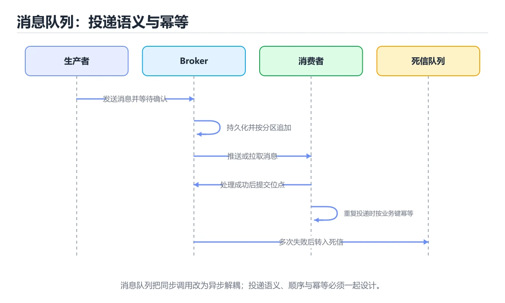
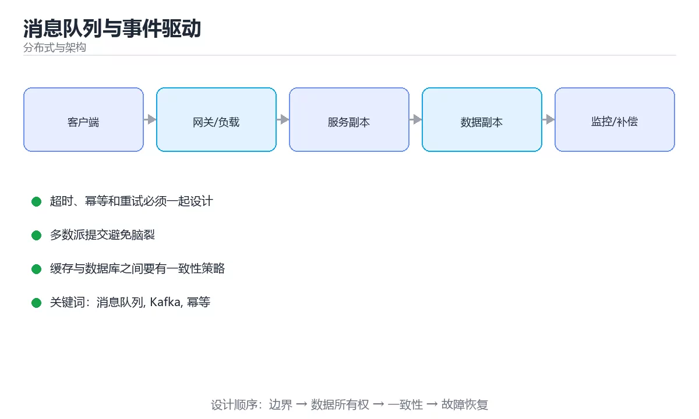

# 消息队列与事件驱动





> 内容更新时间：2026-10-06 · 学习阶段：入门 · 预计用时：40 分钟

## 本节知识框架

**课程定位**：所属分类 `distributed`（分布式与架构），课程主题 `消息队列与事件驱动`，学习阶段 入门，建议用时 40 分钟。

本课主线：投递语义、幂等消费、顺序消息与死信队列。

**学完本课应当能够**
- 说清 `消息队列` 与 `Kafka` 的含义与区别，并各举一个正例和一个反例。
- 用本课示例验证 `事务消息` 的行为，记录输入、输出与失败条件。
- 遇到「消费者不幂等」这类问题时，能说出触发条件与修复顺序。

### 从概念到验证的学习链条

1. `消息队列`：先掌握 在生产者与消费者之间异步缓冲、持久化和投递消息的系统，再用它解释 `Kafka` 为什么会出现。
2. `Kafka`：先掌握 分布式追加日志与消息系统，用分区保存有序事件并支持多消费者扩展，再用它解释 `事务消息` 为什么会出现。
3. `事务消息`：先掌握 事务消息 / Outbox：先写本地库（含消息表），再由后台投递，保证「业务成功则消息必达」，再用它解释 `死信队列` 为什么会出现。
4. `死信队列`：先掌握 重试多次仍然处理失败的消息转存到的地方，避免坏消息阻塞消费并方便人工排查，再用它解释 本课示例的观察结果 为什么会出现。

**先修与衔接**：本课是「分布式与架构」分类的第 3 课。先修内容：《微服务拆分与治理》。《微服务拆分与治理》里的 `微服务`、`DDD` 是本课的前提。相关或后续课程：《高可用与容量规划》、《图解消息队列投递语义》。

### 完成判据

- **定义关**：不看正文也能说明 `消息队列` 是 在生产者与消费者之间异步缓冲、持久化和投递消息的系统，并指出一个反例。
- **机制关**：能按“输入 → 转换 → 输出 → 验证”复述 `消息队列与事件驱动`，而不是只背结论。
- **示例关**：能运行或推演 `消息队列与事件驱动` 的 `python` 示例，并说明一个真实出现的标识符或字面量。
- **证据关**：能指出 `消息队列与事件驱动` 示例里的 调用了 `partition_for()`，并说明它支持或反驳了本课的哪一条结论。
- **排错关**：能复现 消费者不幂等，记录现象并按 幂等键加去重表或唯一索引 修复。
- **迁移关**：能把 `消息队列`、`Kafka`、`幂等`、`死信队列` 放进一个与 `消息队列与事件驱动` 不同的项目场景，并保持输入与验证条件可追踪。
- **复盘关**：学完 `消息队列与事件驱动` 后，用一句话写下仍然不确定的结论，并列出下一次验证需要的输入、环境和成功判据。

### 复习清单

- [ ] 能不看正文复述本课核心术语，并指出一个边界或反例。
- [ ] 能运行或推演本课示例，记录输入、输出与失败现象。
- [ ] 能完成一次自测，并把错题对照错误表定位原因。

## 核心概念定义

| 术语 | 操作性定义 | 常见边界与风险 |
| --- | --- | --- |
| 消息队列 | 在生产者与消费者之间异步缓冲、持久化和投递消息的系统。 | 只在「在生产者与消费者之间异步缓冲、持久化和投递消息的系统」这一前提下成立，换输入或换环境要重新验证。 |
| Kafka | 分布式追加日志与消息系统，用分区保存有序事件并支持多消费者扩展。 | 只在「分布式追加日志与消息系统，用分区保存有序事件并支持多消费者扩展」这一前提下成立，换输入或换环境要重新验证。 |
| 事务消息 | 事务消息 / Outbox：先写本地库（含消息表），再由后台投递，保证「业务成功则消息必达」。 | 隔离级别与并发事务会影响可见性，换级别或换存储引擎后要重新验证。 |
| 死信队列 | 重试多次仍然处理失败的消息转存到的地方，避免坏消息阻塞消费并方便人工排查。 | 只在「重试多次仍然处理失败的消息转存到的地方，避免坏消息阻塞消费并方便人工排查」这一前提下成立，换输入或换环境要重新验证。 |

## 原理与运行机制

### 机制总览

**教材衔接：队列与发布订阅**

点对点队列是「一条消息只被一个消费者处理」，适合任务分发与削峰；发布订阅是「一条消息被多个订阅者各处理一次」，适合事件广播（订单创建后通知库存、积分、风控）。

**教材衔接：投递语义**

| 语义 | 含义 | 实现代价 |
| --- | --- | --- |
| 至多一次 | 可能丢，不重复 | 最低 |
| 至少一次 | 不丢，可能重复 | 最常见 |
| 恰好一次 | 不丢不重 | 需要事务与去重，近似实现 |

**「至少一次投递 + 幂等消费」是工程上的主流组合**：消息带唯一 ID，消费者用去重表或业务唯一键保证重复消费无副作用。

**教材衔接：关键能力**

1. **顺序消息**：同一业务键路由到同一分区/队列，才能保证局部有序（全局有序代价极高）。
2. **重试与死信队列**：失败自动重试若干次后进入 DLQ，人工或定时任务处理，避免无限重试堵塞。
3. **事务消息 / Outbox**：先写本地库（含消息表），再由后台投递，保证「业务成功则消息必达」。
4. **积压处理**：监控堆积量，临时扩容消费者、跳过非关键消息或降级。
5. **消息幂等与去重的存储**：用 Redis 或唯一索引表，设置合理 TTL。

**教材衔接：主流产品对比**

| 产品 | 特点 | 适用 |
| --- | --- | --- |
| Kafka | 高吞吐、持久化日志、分区有序、可回放 | 日志、流处理、事件总线 |
| RabbitMQ | 路由灵活、延迟低、协议成熟 | 任务队列、业务解耦 |
| RocketMQ | 事务消息、延时消息、顺序消息完善 | 电商交易场景 |
| Pulsar | 存算分离、多租户 | 云原生大规模场景 |

**教材衔接：使用建议**

1. 生产者的发送确认机制要开启，避免静默丢失。
2. 消费者要控制并发与批量大小，避免把下游打垮。
3. 消息体尽量小，大对象走对象存储传引用。
4. 消息格式要版本化，兼容旧消费者（新增字段用可选）。
5. 端到端要有可观测：生产速率、消费延迟（lag）、失败率与 DLQ 数量。

**教材衔接：投递语义速查**

| 语义 | 说明 | 消费者要求 |
| --- | --- | --- |
| 至多一次 | 可能丢消息，不重复 | 可接受丢失 |
| 至少一次 | 不丢，但可能重复 | 必须幂等 |
| 精确一次 | 端到端不丢不重 | 需要事务或幂等加去重 |

实践结论：**默认按至少一次设计，消费端保证幂等**，这是成本最低的可靠方案。

**教材衔接：事件设计速查**

| 要点 | 做法 |
| --- | --- |
| 事件命名 | 用过去式描述已发生事实（`OrderPaid`） |
| 载荷 | 包含事件 ID、时间、业务键与必要字段 |
| 版本 | 事件结构带版本，向后兼容演进 |
| 大小 | 大对象存对象存储，消息只带引用 |
| 幂等键 | 事件 ID 或业务唯一键 |
| 顺序键 | 聚合根 ID 作为分区键 |
| 保留期 | 支持重放，按补数需求设置 |
| 死信 | 失败超限进入死信队列并告警 |

**教材衔接：零基础精讲：把消息队列与事件驱动真正讲透**

### 先建立一个直觉

把分布式系统看成多人协作：没有全局时钟，消息可能延迟或丢失，因此必须定义一致性目标、重试边界和故障后的收敛方式。落到本课，「消息队列与事件驱动」关心的是 消息队列 与 Kafka 的配合，也就是说这条直觉要在 队列与发布订阅 里被具体验证。

本课的摘要可以当作一张地图：投递语义、幂等消费、顺序消息与死信队列。

### 逐步拆解

1. 澄清输入与目标。先写清「消息队列与事件驱动」要解决的问题、合法输入范围和成功标准，再进入后续步骤。
2. 描述处理过程。把「消息队列、Kafka、幂等、死信队列、事务消息」映射到具体步骤，每步都要求能单独验证。
3. 定义输出。把 IdempotentConsumer 的返回值、日志和失败信号都写清楚，缺一项都不算完整。
4. 构造一次消息队列越界，记录系统是拒绝、降级还是静默出错；三者对应的修复策略完全不同。
5. 把「队列与发布订阅」里的最小示例抄成 IdempotentConsumer 一行的输入，先手算结果再执行，确认两者一致。

### 把正文串成一条执行链

- **练习 1：建立心智模型（10 分钟）**：在「消息队列与事件驱动」里，「练习 1：建立心智模型（10 分钟）」这一步要先写清输入与预期，再记录实际结果和差异；结果不符时回到对应小节核对前提。
- **练习 2：做一次可控实验（20 分钟）**：在「消息队列与事件驱动」里，「练习 2：做一次可控实验（20 分钟）」这一步要先写清输入与预期，再记录实际结果和差异；结果不符时回到对应小节核对前提。
- **练习 3：交付一个小结果（30 分钟）**：在「消息队列与事件驱动」里，「练习 3：交付一个小结果（30 分钟）」这一步要先写清输入与预期，再记录实际结果和差异；结果不符时回到对应小节核对前提。
- **考点 1：采用「至少一次」投递时，消费者必须？**：针对「消息队列与事件驱动」，先自问「采用「至少一次」投递时，消费者必须」；作答后回到对应考点核对判断依据。
- **考点 2：要保证同一业务的消息局部有序，应该？**：针对「消息队列与事件驱动」，先自问「要保证同一业务的消息局部有序，应该」；作答后回到对应考点核对判断依据。
- **考点 3：消息反复消费失败的最终去处是？**：针对「消息队列与事件驱动」，先自问「消息反复消费失败的最终去处是」；作答后回到对应考点核对判断依据。

### 从测验反推易错点

**检查点 1：采用「至少一次」投递时，消费者必须？**

- 参考判断：实现幂等消费
- 自问：如果去掉题干里的一个限定词，结论还成立吗？

**检查点 2：要保证同一业务的消息局部有序，应该？**

- 参考判断：把同一业务键路由到同一分区或队列

**检查点 3：消息反复消费失败的最终去处是？**

- 参考判断：死信队列（DLQ）

**检查点 4：消息堆积的常见原因是？**

- 参考判断：消费能力不足

**检查点 5：事件（Event）与命令（Command）的区别是？**

- 参考判断：事件描述已经发生的事实（过去时）

### 工程排错顺序

| 先查什么 | 要得到的证据 | 判断标准 |
| --- | --- | --- |
| 一致性目标与可接受延迟是什么？ | 日志、输入样例、测试或指标 | 能复现并解释，才算定位 |
| 重试是否幂等，过期请求如何处理？ | 日志、输入样例、测试或指标 | 能复现并解释，才算定位 |
| 分区、时钟漂移和消息重复是否覆盖？ | 日志、输入样例、测试或指标 | 能复现并解释，才算定位 |
| 故障后如何观测并自动收敛？ | 日志、输入样例、测试或指标 | 能复现并解释，才算定位 |

### 变式训练

1. 把 消息队列 放进一个只有单机、没有额外依赖的小项目，先保证正确再扩展。
2. 扩大 Kafka 的规模，记录本课结论在哪一个量级开始不成立。
3. 把 Kafka 换成失败输入，记录错误信息与恢复动作。
5. 把「消息队列与事件驱动」里最容易被省略的一步去掉，用测试或指标证明它不可省略，而不是凭感觉判断。
6. 限制 CPU 与内存上限后重跑 IdempotentConsumer，观察哪一项参数需要重新设定。


### 迁移案例库

围绕 IdempotentConsumer 重复同一套方法，每完成一轮就把差异写进笔记。


#### 迁移案例 2：围绕「Kafka」做一次小实验

**步骤**：
1. 复述当前方案对「Kafka」的假设，写成一句可证伪的话。

#### 迁移案例 3：围绕「幂等」做一次小实验

**步骤**：
1. 复述当前方案对「幂等」的假设，写成一句可证伪的话。

#### 迁移案例 4：围绕「死信队列」做一次小实验

**步骤**：
1. 复述当前方案对「死信队列」的假设，写成一句可证伪的话。

#### 迁移案例 5：围绕「事务消息」做一次小实验

**步骤**：
1. 复述当前方案对「事务消息」的假设，写成一句可证伪的话。

#### 迁移案例 6：围绕「消息队列」做一次小实验

**步骤**：

#### 迁移案例 7：围绕「Kafka」做一次小实验

**步骤**：

#### 迁移案例 8：围绕「幂等」做一次小实验

**步骤**：

#### 迁移案例 9：围绕「死信队列」做一次小实验

**步骤**：

#### 迁移案例 10：围绕「事务消息」做一次小实验

**步骤**：

#### 迁移案例 11：围绕「消息队列」做一次小实验

**步骤**：

#### 迁移案例 12：围绕「Kafka」做一次小实验

**步骤**：

#### 迁移案例 13：围绕「幂等」做一次小实验

**步骤**：

#### 迁移案例 14：围绕「死信队列」做一次小实验

**步骤**：

#### 迁移案例 15：围绕「事务消息」做一次小实验

**步骤**：

#### 迁移案例 16：围绕「消息队列」做一次小实验

**步骤**：

<!-- p0-depth-v2:end -->

### 机制拆解：每一步的输入、动作与输出

#### 1. `消息队列`
- 输入：`消息队列`；本步把 在生产者与消费者之间异步缓冲、持久化和投递消息的系统 当作判断规则。
- 动作：围绕 `消息队列` 保留中间状态，并记录它与 `Kafka` 的对应关系。
- 输出：`Kafka`，它可以被下一段代码、测试或记录继续使用。
- `消息队列` 的失败条件：只在「在生产者与消费者之间异步缓冲、持久化和投递消息的系统」这一前提下成立，换输入或换环境要重新验证。

#### 2. `Kafka`
- 输入：`消息队列`；本步把 分布式追加日志与消息系统，用分区保存有序事件并支持多消费者扩展 当作判断规则。
- 动作：围绕 `Kafka` 保留中间状态，并记录它与 `事务消息` 的对应关系。
- 输出：`事务消息`，它可以被下一段代码、测试或记录继续使用。
- `Kafka` 的失败条件：只在「分布式追加日志与消息系统，用分区保存有序事件并支持多消费者扩展」这一前提下成立，换输入或换环境要重新验证。

#### 3. `事务消息`
- 输入：`Kafka`；本步把 事务消息 / Outbox：先写本地库（含消息表），再由后台投递，保证「业务成功则消息必达」 当作判断规则。
- 动作：围绕 `事务消息` 保留中间状态，并记录它与 `死信队列` 的对应关系。
- 输出：`死信队列`，它可以被下一段代码、测试或记录继续使用。
- `事务消息` 的失败条件：隔离级别与并发事务会影响可见性，换级别或换存储引擎后要重新验证。

#### 4. `死信队列`
- 输入：`事务消息`；本步把 重试多次仍然处理失败的消息转存到的地方，避免坏消息阻塞消费并方便人工排查 当作判断规则。
- 动作：围绕 `死信队列` 保留中间状态，并记录它与 `partition_for` 的对应关系。
- 输出：`partition_for`，它可以被下一段代码、测试或记录继续使用。
- `死信队列` 的失败条件：只在「重试多次仍然处理失败的消息转存到的地方，避免坏消息阻塞消费并方便人工排查」这一前提下成立，换输入或换环境要重新验证。

### 示例中的可观察事实

1. 调用了 `partition_for()`；它对应的课程主题是 `消息队列与事件驱动`。
2. 调用了 `md5()`；它对应的课程主题是 `消息队列与事件驱动`。
3. 调用了 `encode()`；它对应的课程主题是 `消息队列与事件驱动`。
4. 调用了 `hexdigest()`；它对应的课程主题是 `消息队列与事件驱动`。
5. 调用了 `int()`；它对应的课程主题是 `消息队列与事件驱动`。
6. 调用了 `field()`；它对应的课程主题是 `消息队列与事件驱动`。
7. 调用了 `handle()`；它对应的课程主题是 `消息队列与事件驱动`。
8. 调用了 `append()`；它对应的课程主题是 `消息队列与事件驱动`。

### 复现实验记录

- 环境：`消息队列与事件驱动` 使用 `python` 示例，固定 `消息队列`、`Kafka`、`幂等`、`死信队列` 作为第一组条件。
- 首轮输入：先确认 调用了 `partition_for()`，预测 `消息队列` 会怎样变化。
- 基线观察：记录命令、输入、输出和错误原文，不用截图代替可复制的文本。
- 单变量修改：只改变 `消息队列`，观察 `死信队列` 是否仍满足定义。
- 失败注入：复现 消费者不幂等，确认现象是 重试导致重复扣款。
- 记录结论：把“修改前、修改后、预期变化、实际变化”写成四列表，这样复盘 `消息队列与事件驱动` 时才能区分概念错误与实现错误。

## 典型应用场景

- **消费者不幂等**：典型现象是重试导致重复扣款；正确做法是幂等键加去重表或唯一索引。
- **位点先提交再处理**：典型现象是处理失败丢消息；正确做法是处理成功后再提交位点。
- **分区键随机**：典型现象是同一业务消息乱序；正确做法是用业务键作分区键。
- **无限重试**：典型现象是毒消息阻塞队列；正确做法是限制次数并转死信。

### 最小验证场景

- 准备：保留 `python` 示例的原始输入，先记录 `消息队列与事件驱动` 的基线输出和完整运行命令。
- 观察：先核对 调用了 `partition_for()`，再改变一个与 `消息队列` 相关的条件。
- 判定：新结果与 `消息队列与事件驱动` 的基线不同不等于错误；只有当差异破坏了 `消息队列` 的定义或错误表中的约束，才判定为失败。

### 选择与边界

- 使用 `消息队列` 时，先满足它的定义：在生产者与消费者之间异步缓冲、持久化和投递消息的系统；只在「在生产者与消费者之间异步缓冲、持久化和投递消息的系统」这一前提下成立，换输入或换环境要重新验证。
- 使用 `Kafka` 时，先满足它的定义：分布式追加日志与消息系统，用分区保存有序事件并支持多消费者扩展；只在「分布式追加日志与消息系统，用分区保存有序事件并支持多消费者扩展」这一前提下成立，换输入或换环境要重新验证。
- 使用 `事务消息` 时，先满足它的定义：事务消息 / Outbox：先写本地库（含消息表），再由后台投递，保证「业务成功则消息必达」；隔离级别与并发事务会影响可见性，换级别或换存储引擎后要重新验证。
- 使用 `死信队列` 时，先满足它的定义：重试多次仍然处理失败的消息转存到的地方，避免坏消息阻塞消费并方便人工排查；只在「重试多次仍然处理失败的消息转存到的地方，避免坏消息阻塞消费并方便人工排查」这一前提下成立，换输入或换环境要重新验证。

## 代码/协议/SQL 示例

**教材衔接：顺序与分区速查**

| 需求 | 做法 |
| --- | --- |
| 同一业务顺序 | 用业务键作为分区键，保证同分区有序 |
| 全局顺序 | 代价极高，通常不需要 |
| 并发消费 | 分区数决定并行度上限 |
| 顺序与吞吐取舍 | 增大分区提升吞吐，但跨分区无序 |
| 重复消费 | 用业务唯一键去重 |
| 消息堆积 | 提升消费能力、增加分区、优化单条处理 |

```python
import hashlib
from collections import defaultdict
from dataclasses import dataclass, field

def partition_for(key: str, partitions: int) -> int:
    """按业务键分区：同一键永远落在同一分区，保证局部有序。"""
    digest = hashlib.md5(key.encode()).hexdigest()
    return int(digest, 16) % partitions

@dataclass
class IdempotentConsumer:
    """幂等消费者：用去重表保证重复消息不产生副作用。"""

    processed: set = field(default_factory=set)
    applied: list = field(default_factory=list)

    def handle(self, message_id: str, payload: dict) -> bool:
        if message_id in self.processed:
            return False                     # 重复消息直接跳过
        # 业务处理与去重记录应在同一事务中提交
        self.applied.append(payload)
        self.processed.add(message_id)
        return True

@dataclass
class RetryQueue:
    """重试与死信：超过次数进入死信队列并告警。"""

    max_attempts: int = 3
    counters: dict = field(default_factory=lambda: defaultdict(int))
    dead_letters: list = field(default_factory=list)

    def fail(self, message_id: str) -> str:
        self.counters[message_id] += 1
        if self.counters[message_id] >= self.max_attempts:
            self.dead_letters.append(message_id)
            return "dead_letter"
        return "retry"

consumer = IdempotentConsumer()
print(consumer.handle("m1", {"amount": 10}), consumer.handle("m1", {"amount": 10}))
print([partition_for(k, 4) for k in ["user-1", "user-1", "user-2"]])
queue = RetryQueue()
print([queue.fail("m2") for _ in range(3)])
```

**运行方式**：运行 `消息队列与事件驱动` 的示例时，保存为 `.py` 文件后用 `python 文件名.py` 运行；第三方依赖先在虚拟环境里安装。

### 示例精读：先找证据，再改一个条件

1. 调用了 `partition_for()`；它出现在 `消息队列与事件驱动` 的示例中，阅读时先确认它前后各发生了什么。
2. 调用了 `md5()`；它出现在 `消息队列与事件驱动` 的示例中，阅读时先确认它前后各发生了什么。
3. 调用了 `encode()`；它出现在 `消息队列与事件驱动` 的示例中，阅读时先确认它前后各发生了什么。
4. 调用了 `hexdigest()`；它出现在 `消息队列与事件驱动` 的示例中，阅读时先确认它前后各发生了什么。
5. 调用了 `int()`；它出现在 `消息队列与事件驱动` 的示例中，阅读时先确认它前后各发生了什么。
6. 调用了 `field()`；它出现在 `消息队列与事件驱动` 的示例中，阅读时先确认它前后各发生了什么。
7. 调用了 `handle()`；它出现在 `消息队列与事件驱动` 的示例中，阅读时先确认它前后各发生了什么。
8. 调用了 `append()`；它出现在 `消息队列与事件驱动` 的示例中，阅读时先确认它前后各发生了什么。
- 在 `消息队列与事件驱动` 中与 `消息队列` 对照：示例必须能支持 在生产者与消费者之间异步缓冲、持久化和投递消息的系统，否则说明这一段还缺少实现或验证步骤。
- 在 `消息队列与事件驱动` 中与 `Kafka` 对照：示例必须能支持 分布式追加日志与消息系统，用分区保存有序事件并支持多消费者扩展，否则说明这一段还缺少实现或验证步骤。
- 在 `消息队列与事件驱动` 中与 `事务消息` 对照：示例必须能支持 事务消息 / Outbox：先写本地库（含消息表），再由后台投递，保证「业务成功则消息必达」，否则说明这一段还缺少实现或验证步骤。
- 在 `消息队列与事件驱动` 中与 `死信队列` 对照：示例必须能支持 重试多次仍然处理失败的消息转存到的地方，避免坏消息阻塞消费并方便人工排查，否则说明这一段还缺少实现或验证步骤。

## 时间/空间复杂度或性能分析

**性能关注点（消息队列与事件驱动）**：一致性与可用性存在权衡：记录 P99 延迟、副本同步延迟与故障恢复时间。

**本课特有开销（消息队列与事件驱动 · 消息队列）**：长事务会放大锁等待，记录事务持续时间与锁冲突次数。

**测量方法**：以 `消息队列与事件驱动` 的 `消息队列` 场景为对象，固定输入跑一遍记录基线，再把规模或并发度提高一个数量级复测；两次结果的差值与波动范围才是结论依据。

### 需要控制的变量与记录项

- `消息队列与事件驱动` 的 `消息队列`：固定它的版本、输入范围和资源上限，分别记录速度、内存与失败率的变化。
- `消息队列与事件驱动` 的 `Kafka`：固定它的版本、输入范围和资源上限，分别记录速度、内存与失败率的变化。
- `消息队列与事件驱动` 的 `幂等`：固定它的版本、输入范围和资源上限，分别记录速度、内存与失败率的变化。
- `消息队列与事件驱动` 的 `死信队列`：固定它的版本、输入范围和资源上限，分别记录速度、内存与失败率的变化。
- `消息队列与事件驱动` 的 `事务消息`：固定它的版本、输入范围和资源上限，分别记录速度、内存与失败率的变化。
- `消息队列与事件驱动` 中 `消息队列` 的边界：只在「在生产者与消费者之间异步缓冲、持久化和投递消息的系统」这一前提下成立，换输入或换环境要重新验证。达到边界时不要外推，必须重新测量。
- `消息队列与事件驱动` 中 `Kafka` 的边界：只在「分布式追加日志与消息系统，用分区保存有序事件并支持多消费者扩展」这一前提下成立，换输入或换环境要重新验证。达到边界时不要外推，必须重新测量。
- `消息队列与事件驱动` 中 `事务消息` 的边界：隔离级别与并发事务会影响可见性，换级别或换存储引擎后要重新验证。达到边界时不要外推，必须重新测量。
- `消息队列与事件驱动` 中 `死信队列` 的边界：只在「重试多次仍然处理失败的消息转存到的地方，避免坏消息阻塞消费并方便人工排查」这一前提下成立，换输入或换环境要重新验证。达到边界时不要外推，必须重新测量。
- `消息队列与事件驱动` 的代码证据：先验证 调用了 `partition_for()`，再记录该路径的输入规模与耗时；只看代码行数不能推出复杂度。

## 常见误区与易错点

| 容易写错的做法 | 实际现象 | 原因与正确做法 |
| --- | --- | --- |
| 消费者不幂等 | 重试导致重复扣款 | 幂等键加去重表或唯一索引 |
| 位点先提交再处理 | 处理失败丢消息 | 处理成功后再提交位点 |
| 分区键随机 | 同一业务消息乱序 | 用业务键作分区键 |
| 无限重试 | 毒消息阻塞队列 | 限制次数并转死信 |
| 消息体过大 | 吞吐下降、超限失败 | 存对象存储，消息传引用 |
| 无死信告警 | 失败消息无人发现 | 死信监控与人工处理流程 |
| 事件用命令式命名 | 语义混乱 | 用过去式描述事实 |
| 无版本字段 | 演进时解析失败 | 事件带版本并保持兼容 |
| 消费无监控 | 积压不可见 | 监控积压、处理速率与失败率 |
| 依赖全局顺序 | 无法水平扩展 | 只保证同一聚合根有序 |

### 现场 1：消费者不幂等

**症状**：重试导致重复扣款。

**根因与修复**：幂等键加去重表或唯一索引。

**自检**：在本课示例里复现「消费者不幂等」，改成幂等键加去重表或唯一索引后重跑；如果症状消失且失败路径按预期变化，说明定位正确。

### 现场 2：位点先提交再处理

**症状**：处理失败丢消息。

**根因与修复**：处理成功后再提交位点。

**自检**：在本课示例里复现「位点先提交再处理」，改成处理成功后再提交位点后重跑；如果症状消失且失败路径按预期变化，说明定位正确。

### 现场 3：分区键随机

**症状**：同一业务消息乱序。

**根因与修复**：用业务键作分区键。

**自检**：在本课示例里复现「分区键随机」，改成用业务键作分区键后重跑；如果症状消失且失败路径按预期变化，说明定位正确。

### 现场 4：无限重试

**症状**：毒消息阻塞队列。

**根因与修复**：限制次数并转死信。

**自检**：在本课示例里复现「无限重试」，改成限制次数并转死信后重跑；如果症状消失且失败路径按预期变化，说明定位正确。

### 现场 5：消息体过大

**症状**：吞吐下降、超限失败。

**根因与修复**：存对象存储，消息传引用。

**自检**：在本课示例里复现「消息体过大」，改成存对象存储，消息传引用后重跑；如果症状消失且失败路径按预期变化，说明定位正确。

### 现场 6：无死信告警

**症状**：失败消息无人发现。

**根因与修复**：死信监控与人工处理流程。

**自检**：在本课示例里复现「无死信告警」，改成死信监控与人工处理流程后重跑；如果症状消失且失败路径按预期变化，说明定位正确。

### 现场 7：事件用命令式命名

**症状**：语义混乱。

**根因与修复**：用过去式描述事实。

**自检**：在本课示例里复现「事件用命令式命名」，改成用过去式描述事实后重跑；如果症状消失且失败路径按预期变化，说明定位正确。

### 现场 8：无版本字段

**症状**：演进时解析失败。

**根因与修复**：事件带版本并保持兼容。

**自检**：在本课示例里复现「无版本字段」，改成事件带版本并保持兼容后重跑；如果症状消失且失败路径按预期变化，说明定位正确。

### 现场 9：消费无监控

**症状**：积压不可见。

**根因与修复**：监控积压、处理速率与失败率。

**自检**：在本课示例里复现「消费无监控」，改成监控积压、处理速率与失败率后重跑；如果症状消失且失败路径按预期变化，说明定位正确。

## 与其他知识点的关系

- **先修**：`微服务拆分与治理`。本课默认这些内容已经掌握。
- **相关或后续**：`高可用与容量规划`、`图解消息队列投递语义`。本课术语会在这些课程里继续使用。
- **术语归属**：`消息队列`、`Kafka`、`事务消息` 的定义以本课「核心概念定义」为准，换到其他课程时先确认定义是否被改写。
- 同一分类的《分布式系统原理》也涉及 `幂等`；两课衔接时先确认这个术语的定义是否一致。
- 同一分类的《分布式事务与一致性》也涉及 `幂等`；两课衔接时先确认这个术语的定义是否一致。

### 先修与后续术语接口

- `微服务拆分与治理`：两者通过本分类的学习顺序衔接，阅读时重点比较各自的输入与失败条件。
- `高可用与容量规划`：两者通过本分类的学习顺序衔接，阅读时重点比较各自的输入与失败条件。
- `图解消息队列投递语义`：共享术语 `消息队列`、`死信队列`，共同关键词 `消息队列`、`幂等`、`死信队列`。

### 容易混淆的相邻概念

- `消息队列` 与 `Kafka`：前者强调 在生产者与消费者之间异步缓冲、持久化和投递消息的系统；后者强调 分布式追加日志与消息系统，用分区保存有序事件并支持多消费者扩展。判断时分别检查两条定义的适用范围，不要只看名称相似就互换。
- `Kafka` 与 `事务消息`：前者强调 分布式追加日志与消息系统，用分区保存有序事件并支持多消费者扩展；后者强调 事务消息 / Outbox：先写本地库（含消息表），再由后台投递，保证「业务成功则消息必达」。判断时分别检查两条定义的适用范围，不要只看名称相似就互换。
- `事务消息` 与 `死信队列`：前者强调 事务消息 / Outbox：先写本地库（含消息表），再由后台投递，保证「业务成功则消息必达」；后者强调 重试多次仍然处理失败的消息转存到的地方，避免坏消息阻塞消费并方便人工排查。判断时分别检查两条定义的适用范围，不要只看名称相似就互换。

## 自测题与参考答案

> 先独立作答，再对照参考答案；答案都能在本课正文、术语表或错误表里找到依据。

### 自测 1（概念复述）

不看正文，写出 `消息队列` 的操作性定义，并说明它与 `Kafka` 的区别。

**参考答案**：在生产者与消费者之间异步缓冲、持久化和投递消息的系统。

`Kafka` 的定位是：分布式追加日志与消息系统，用分区保存有序事件并支持多消费者扩展；两者的差别要从适用对象与失败模式上说明。

### 自测 2（排错）

本课错误表记录了「消费者不幂等」这类做法。请写出它会出现的现象、根因，以及修复顺序。

**参考答案**：现象是重试导致重复扣款；正确做法是幂等键加去重表或唯一索引。修复时先复现现象并保留证据，再改动一处假设重跑，确认现象消失。

### 自测 3（动手验证）

运行本课的 `python` 示例，把其中的 `"按业务键分区：同一键永远落在同一分区，保证局部有序。"` 换成一个边界值后重新运行，记录输出与错误信息。

**参考答案**：正常输入下 `python` 示例应当复现正文给出的结果；把 `"按业务键分区：同一键永远落在同一分区，保证局部有序。"` 换成边界值后，如果结果改变或报错，先核对它是否满足 `消息队列与事件驱动` 中`消息队列` 的适用范围，再检查错误表里是否有同类现象。

### 自测 4（代码阅读）

阅读本课开头的 `python` 示例，说明它体现了`消息队列` 的哪一条性质，并指出改动哪个输入会让这条性质不再成立。

**参考答案**：`消息队列` 的定义是 在生产者与消费者之间异步缓冲、持久化和投递消息的系统，示例正是在实现这条定义。改动与 `消息队列` 有关的一个输入后，如果结果不再符合 `消息队列与事件驱动` 的正文描述，就说明该性质只在当前前提成立。

### 自测 5（迁移）

把 `消息队列与事件驱动` 的方法迁移到自己的项目：围绕 `消息队列` 写出一个与错误表同类的风险点，并说明触发条件和检验方式。

**参考答案**：例如「依赖全局顺序」，它会导致无法水平扩展；检验方式是按只保证同一聚合根有序改一处再复现，确认现象消失且没有引入新的失败分支。

### 自测 6（对比）

用一个表格对比 `消息队列` 与 `Kafka`：各写一行适用场景、一行失败表现。

**参考答案**：`消息队列` 的定义是在生产者与消费者之间异步缓冲、持久化和投递消息的系统；`Kafka` 的定义是分布式追加日志与消息系统，用分区保存有序事件并支持多消费者扩展。两者的失败表现分别对应本课错误表里与本术语相关的行。

### 自测 7（排错顺序）

面对「消费者不幂等」引发的问题，请把“复现 重试导致重复扣款 → 保留证据 → 幂等键加去重表或唯一索引 → 回归验证”四步写成可执行的检查清单。

**参考答案**：第一步按重试导致重复扣款复现；第二步记录输入、版本与完整报错；第三步按幂等键加去重表或唯一索引只改一处；第四步重跑并确认失败路径也按预期变化。

### 自测 8（边界判断）

针对 `死信队列`，分别写出“可以使用”的条件和“结论不再成立”的条件。

**参考答案**：只在「重试多次仍然处理失败的消息转存到的地方，避免坏消息阻塞消费并方便人工排查」这一前提下成立，换输入或换环境要重新验证。 同时要把 `死信队列` 的定义 重试多次仍然处理失败的消息转存到的地方，避免坏消息阻塞消费并方便人工排查 与实际输入逐项对照。

### 自测 9（机制重建）

不看正文，按输入、转换、输出、验证四段重建 `消息队列` → `Kafka` → `事务消息` → `死信队列` 的作用链。

**参考答案**：起点是 `消息队列` 的定义 在生产者与消费者之间异步缓冲、持久化和投递消息的系统；中间每一步都保留可观察状态；终点由 `死信队列` 检查，失败时回到错误表定位第一个偏离定义的步骤。

### 自测 10（综合排错）

在 `消息队列与事件驱动` 中，现象是 无法水平扩展。请围绕 依赖全局顺序 写出最小复现、关键证据、修复动作和回归验证，并说明为什么不能只凭一次运行下结论。

**参考答案**：先复现 依赖全局顺序，记录输入与完整错误；再按 只保证同一聚合根有序 只改一处。回归时同时跑正常路径和边界路径，只有两次结果都可解释，才把修复视为完成。

### 自测 11（一分钟复述）

用每分钟约 200 字的速度复述 `消息队列与事件驱动`：先给主问题，再按顺序说出 `消息队列`、`Kafka`、`事务消息`、`死信队列`，最后给一个失败案例。

**自评标准**：主问题必须对应 投递语义、幂等消费、顺序消息与死信队列；每个术语都要能接上一句定义或边界；失败案例必须写成可观察现象，不能用“可能有风险”代替证据。

## 术语速查

| 术语 | 一句话说明 |
| --- | --- |
| `消息队列` | 在生产者与消费者之间异步缓冲、持久化和投递消息的系统。 |
| `Kafka` | 分布式追加日志与消息系统，用分区保存有序事件并支持多消费者扩展。 |
| `事务消息` | 事务消息 / Outbox：先写本地库（含消息表），再由后台投递，保证「业务成功则消息必达」。 |
| `死信队列` | 重试多次仍然处理失败的消息转存到的地方，避免坏消息阻塞消费并方便人工排查。 |

**术语关系**：`消息队列`（在生产者与消费者之间异步缓冲、持久化和投递消息的系统） → `Kafka`（分布式追加日志与消息系统） → `事务消息`（事务消息 / Outbox：先写本地库（含消息表）） → `死信队列`（重试多次仍然处理失败的消息转存到的地方）。

## 考点精讲

`消息队列与事件驱动` 的题库有 6 道题，下面逐题给出题干、正确项与判断依据：先自己作答，再核对正确项，最后回到正文对应小节复核。

### 考点 1：第 1 题

- **题目**：采用「至少一次」投递时，消费者必须？
- **正确项**：实现幂等消费
- **判断依据**：这道题检验本课主问题：投递语义、幂等消费、顺序消息与死信队列。复习时先复述本课主问题，再举一个会让结论失效的输入。

### 考点 2：第 2 题

- **题目**：要保证同一业务的消息局部有序，应该？
- **正确项**：把同一业务键路由到同一分区或队列
- **判断依据**：这道题检验本课主问题：投递语义、幂等消费、顺序消息与死信队列。复习时先复述本课主问题，再举一个会让结论失效的输入。

### 考点 3：第 3 题

- **题目**：按“消息队列与事件驱动”中 消息队列、Kafka、幂等 的实践顺序，把四个步骤排成从准备到复盘的合理顺序。
- **正确项**：先明确 消息队列 的输入、输出与约束 → 写出最小示例并核对 Kafka 的基线结果 → 只改一个变量，记录边界与失败路径的变化 → 固定版本与证据，把“消息队列与事件驱动”的结论写成可复现记录
- **判断依据**：这道题落在术语 `消息队列` 上：在生产者与消费者之间异步缓冲、持久化和投递消息的系统。复习时把 `消息队列` 的定义、适用边界和一个反例一起说清楚，再回到「核心概念定义」核对原文。

### 考点 4：第 4 题

- **题目**：阅读这段消息消费逻辑，下面哪项判断是正确的？
- **正确项**：同一业务键落到同一分区保证局部有序，去重标记要与业务写入放在同一事务
- **判断依据**：这道题检验本课主问题：投递语义、幂等消费、顺序消息与死信队列。复习时先复述本课主问题，再举一个会让结论失效的输入。

### 考点 5：第 5 题

- **题目**：事件（Event）与命令（Command）的区别是？
- **正确项**：事件描述已经发生的事实（过去时）
- **判断依据**：这道题检验本课主问题：投递语义、幂等消费、顺序消息与死信队列。复习时先复述本课主问题，再举一个会让结论失效的输入。

### 考点 6：第 6 题

- **题目**：课程 `投递语义、幂等消费、顺序消息与死信队列。`。在 `消息队列与事件驱动` 里，`消息队列`、`Kafka` 与下面哪些选项属于同一层概念？（多选）
- **正确项**：消息队列；Kafka
- **判断依据**：这道题落在术语 `消息队列` 上：在生产者与消费者之间异步缓冲、持久化和投递消息的系统。复习时把 `消息队列` 的定义、适用边界和一个反例一起说清楚，再回到「核心概念定义」核对原文。

### 考点 7：`消息队列`

- **要点**：在生产者与消费者之间异步缓冲、持久化和投递消息的系统。
- **消息队列 的边界**：只在「在生产者与消费者之间异步缓冲、持久化和投递消息的系统」这一前提下成立，换输入或换环境要重新验证。

### 考点 8：`Kafka`

- **要点**：分布式追加日志与消息系统，用分区保存有序事件并支持多消费者扩展。
- **Kafka 的边界**：只在「分布式追加日志与消息系统，用分区保存有序事件并支持多消费者扩展」这一前提下成立，换输入或换环境要重新验证。

### 考点 9：`事务消息`

- **要点**：事务消息 / Outbox：先写本地库（含消息表），再由后台投递，保证「业务成功则消息必达」。
- **事务消息 的边界**：隔离级别与并发事务会影响可见性，换级别或换存储引擎后要重新验证。

### 考点 10：`死信队列`

- **要点**：重试多次仍然处理失败的消息转存到的地方，避免坏消息阻塞消费并方便人工排查。
- **死信队列 的边界**：只在「重试多次仍然处理失败的消息转存到的地方，避免坏消息阻塞消费并方便人工排查」这一前提下成立，换输入或换环境要重新验证。

### 考点 11：排错——消费者不幂等

- **现象**：重试导致重复扣款。
- **处理**：幂等键加去重表或唯一索引。

### 考点 12：排错——位点先提交再处理

- **现象**：处理失败丢消息。
- **处理**：处理成功后再提交位点。

### 考点 13：综合辨析——`消息队列` 与 `死信队列`

- **辨析点**：`消息队列` 的定义是 在生产者与消费者之间异步缓冲、持久化和投递消息的系统；`死信队列` 的定义是 重试多次仍然处理失败的消息转存到的地方，避免坏消息阻塞消费并方便人工排查。
- **答题要求**：面对 `消息队列与事件驱动` 的题目，先判断描述的是 `消息队列` 还是 `死信队列`，再归到对应定义，最后写出一个会让该定义失效的边界输入。

### 考点 14：排错评分点

- **现象分**：能写出 重试导致重复扣款，而不是只写“程序有错”。
- **证据分**：保留触发 消费者不幂等 的输入、版本和错误原文。
- **修复分**：按 幂等键加去重表或唯一索引 只改一处，并同时回归正常路径与边界路径。

## 内容元数据

- 内容版本：v2.0
- 最后更新：2026-10-06
- 学习阶段：入门
- 适用环境：分布式系统与云原生基础设施；本课聚焦 消息队列。
- 内容来源：内置结构化课程与工程实践整理
- 相关主题：消息队列、Kafka、幂等、死信队列、事务消息
- 质量版本：P0 测验标准 + P1 覆盖扩展 + P2 体验补全

## 参考资料与复核

- 最后复核：2026-10-04
- 下次复核：2027-07-24
- 复核范围：版本兼容、API 行为、安全建议与工程实践
- 来源性质：官方文档、标准或权威教材；本课核对关键词：消息队列、Kafka、幂等、死信队列、事务消息。

| 参考资料 | 本课用途 |
| --- | --- |
| [Apache Kafka 文档](https://kafka.apache.org/documentation/) | 日志、分区与消费组 |
| [Martin Fowler 事件驱动](https://martinfowler.com/articles/201701-event-driven.html) | 事件、消息与一致性 |
| [CNCF 技术地图](https://landscape.cncf.io/) | 云原生技术生态 |

| [本课术语索引：消息队列与事件驱动](#核心概念定义) | 按本课输入、术语边界和错误表现逐项核对 |
> 「消息队列与事件驱动」的链接用于离线阅读后的延伸核对；App 不会自动联网。