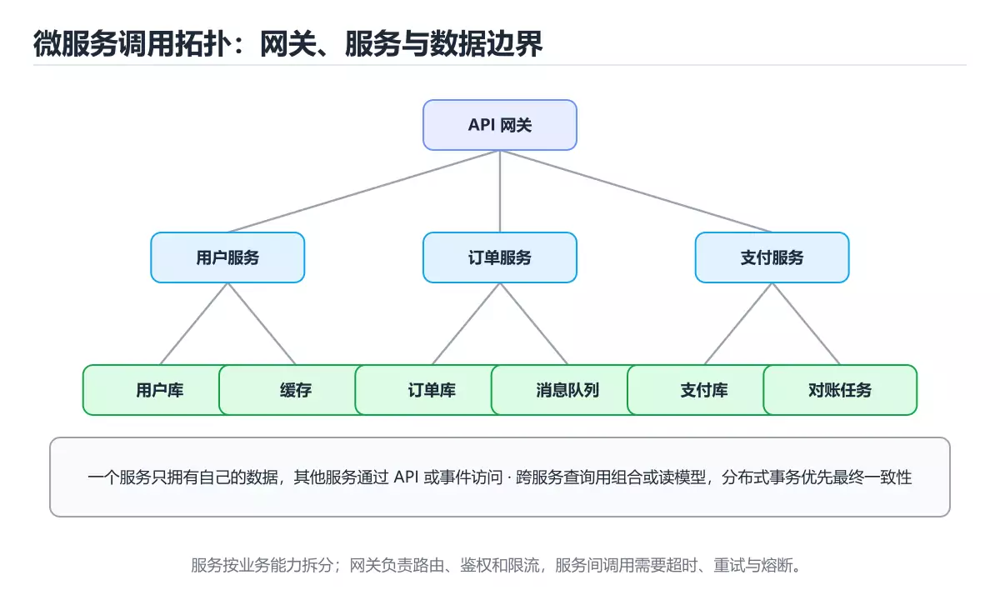
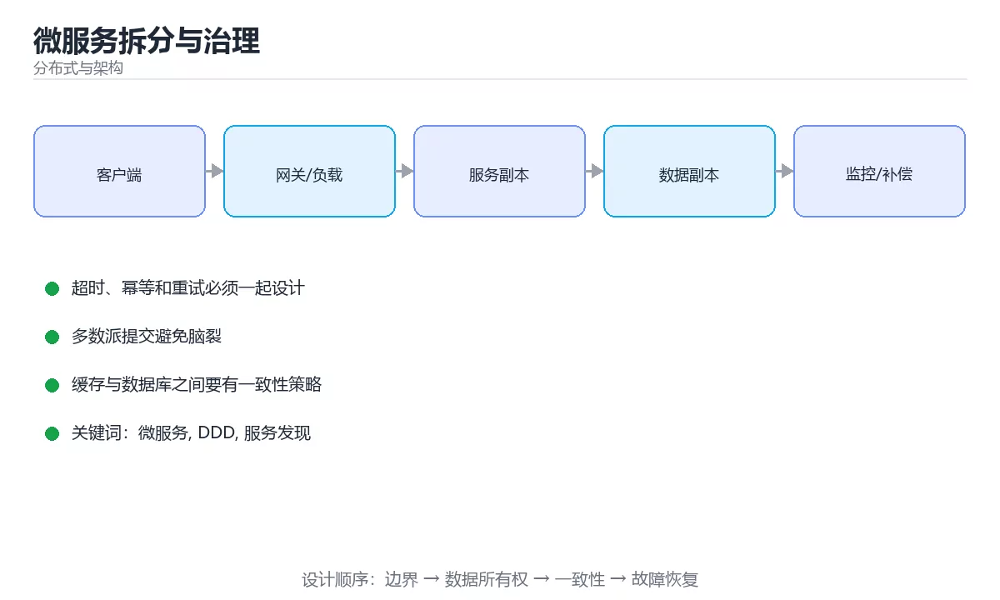

# 微服务拆分与治理





> 内容更新时间：2026-10-03 · 学习阶段：入门 · 预计用时：16 分钟

## 学习目标

- 能用自己的话解释微服务拆分与治理解决了什么问题，而不是只背术语。
- 能说清 「微服务」、「DDD」、「服务发现」、「网关」 之间的关系，并分别举出一个例子。
- 能把本课知识放回「分布式与架构」的知识体系，说明它和相邻主题的边界。
- 能完成本课练习，并用验收标准检查自己的结果。

> 一句话摘要：拆分依据、通信方式、数据自治与治理组件。

## 前置知识

- 先完成上一课《分布式系统原理》；如果已经掌握，可以直接用本课练习自测。
- 本课阶段：入门。只需要基本计算机操作，不要求编程经验。
- 开始前先复习：微服务、DDD、服务发现。
- 如果某一步看不懂，先记录具体卡点，完成练习后再回头读一遍。

## 拆分的依据

按**业务能力**或 DDD 限界上下文拆分，而不是按技术分层（不要拆成「Controller 服务」「DAO 服务」）。判断边界是否合理：能否独立发布、是否拥有自己的数据、改动是否常同时发生（常同时改的应该在一起）。

## 拆分前的提醒

微服务的收益是独立部署与独立扩缩容，代价是分布式复杂度（网络、事务、运维、排障）。**单体优先**：团队小、业务未稳定时，模块化单体往往更高效；只有当组织与流量真的需要时才拆。

## 服务间通信

| 方式 | 特点 | 适用 |
| --- | --- | --- |
| 同步 RPC（HTTP/gRPC） | 简单直观，有强耦合与级联故障风险 | 查询类、强依赖 |
| 异步消息 | 解耦、削峰，最终一致 | 事件通知、长流程 |

原则：**能不调用就不调用**（数据冗余或本地缓存），必须调用时要有超时、重试（幂等）、熔断与降级。

## 基础设施组件

服务注册与发现（Consul、Nacos、K8s Service）、配置中心（动态配置与灰度）、API 网关（路由、鉴权、限流）、分布式追踪（trace_id 贯穿）、集中日志与指标。这些能力可以由服务网格（Istio）下沉，也可由框架承担。

## 数据一致性

每个服务拥有自己的数据，禁止跨服务直连数据库。跨服务一致性用 Saga/本地消息表 + 幂等消费，配合对账任务兜底（详见分布式事务一篇）。

## 常见失败模式

服务过细导致调用链过长（延迟放大）、共享数据库形成隐式耦合、缺少幂等导致重试重复扣款、没有统一超时与重试预算造成重试风暴、只做拆不做治理（没有监控与追踪）。

## 本课小结
微服务的核心不是「拆得多」，而是**边界清晰 + 数据自治 + 治理到位**；拆之前先问：独立部署是否带来真实收益？

## 拆分原则速查

| 依据 | 说明 | 反例 |
| --- | --- | --- |
| 业务能力 | 按领域边界拆分 | 按技术分层拆（所有 DAO 一个服务） |
| 变更频率 | 改动频繁的独立 | 每次改都要同时发布多个服务 |
| 数据所有权 | 每个服务独占自己的库 | 多服务直连同一个库 |
| 团队边界 | 与团队结构对齐 | 一个服务跨多个团队 |
| 扩展需求 | 不同负载分别扩容 | 全部拆成小服务增加运维成本 |

## 通信与治理速查

| 主题 | 做法 |
| --- | --- |
| 同步调用 | 只用于必须即时返回的场景，链路尽量短 |
| 异步消息 | 解耦与削峰，事件驱动 |
| 超时与重试 | 明确超时、退避与重试上限 |
| 熔断与降级 | 快速失败，保核心功能 |
| 幂等 | 所有写接口支持幂等键 |
| 服务发现 | 注册中心或 DNS，避免硬编码地址 |
| 配置管理 | 集中配置 + 变更审计 |
| 版本兼容 | 只做向后兼容变更，字段先加后用 |
| 数据一致性 | 避免跨服务事务，用事件与补偿 |

```python
from dataclasses import dataclass, field

@dataclass
class ServiceContract:
    """服务契约：显式声明依赖与 SLO，便于容量与故障分析。"""

    name: str
    dependencies: list
    timeout_ms: int = 800
    retries: int = 1
    slo_availability: float = 0.999

    def worst_case_latency_ms(self) -> int:
        """最坏路径：自身耗时 + 依赖超时 ×（重试次数 + 1）。"""
        per_dep = self.timeout_ms * (self.retries + 1)
        return self.timeout_ms + per_dep * len(self.dependencies)

    def availability_estimate(self, dep_availability: list) -> float:
        """串行依赖下可用性相乘，用于识别级联失败风险。"""
        value = self.slo_availability
        for dep in dep_availability:
            value *= dep
        return round(value, 6)

@dataclass
class CallChain:
    """调用链健康检查：识别过长链路与单点依赖。"""

    services: list = field(default_factory=list)

    def depth(self) -> int:
        return len(self.services)

    def risk(self) -> str:
        if self.depth() >= 5:
            return "链路过长：考虑合并、缓存或异步化"
        if self.depth() >= 3:
            return "链路偏长：评估降级策略"
        return "链路健康"

contract = ServiceContract("order", ["user", "inventory", "payment"])
print(contract.worst_case_latency_ms())
print(contract.availability_estimate([0.999, 0.995, 0.999]))
print(CallChain(["gateway", "order", "user", "inventory", "payment"]).risk())
```

## 常见错误对照表

| 容易踩的做法 | 实际现象 | 原因与正确做法 |
| --- | --- | --- |
| 过早微服务化 | 复杂度暴涨、交付变慢 | 先用单体 + 模块化，必要时再拆 |
| 服务共享数据库 | 耦合无法独立演进 | 每个服务独占数据，通过 API 交换 |
| 同步调用链过长 | 延迟叠加、级联失败 | 缩短链路、异步化、加缓存 |
| 无超时 | 线程被拖死 | 每层都设超时 |
| 服务数量爆炸 | 运维与排障成本高 | 按业务边界合并过细服务 |
| 无契约测试 | 接口变更导致线上故障 | 消费方契约测试 |
| 日志分散无追踪 | 排障困难 | 全链路 trace ID |
| 配置硬编码 | 换环境要重新构建 | 集中配置 + 注入 |
| 没有降级方案 | 依赖故障全站不可用 | 设计降级与兜底数据 |
| 忽略服务等级 | 核心与非核心同等对待 | 明确 SLO 与优先级 |

## 自测清单

- [ ] 拆分依据以业务边界为主，而非技术分层。
- [ ] 每个服务独占数据，通过接口交换。
- [ ] 调用链有超时、重试上限、熔断与降级。
- [ ] 有契约测试与全链路追踪。
- [ ] 明确各服务 SLO 与优先级。

## 动手练习

> 本课练习重点：围绕「微服务、DDD、服务发现」完成复述、实验和交付，每个结果都要能被别人检查。

先画拓扑与数据流，再注入节点或网络故障，最后验证恢复与一致性。

### 练习 1：建立心智模型（10 分钟）

合上教程，用 3～5 句话回答：

1. 微服务拆分与治理解决了什么问题？
2. 如果没有它，会出现什么具体后果？
3. 它和「DDD」是什么关系？

**验收标准**：至少出现一个本课关键词，并写出一个反例、边界条件或失效场景。

### 练习 2：做一次可控实验（20 分钟）

从正文中选一个最小示例，完成以下操作：

1. 先预测修改一个参数、输入或步骤后的结果。
2. 再实际执行或逐步推演，记录真实结果。
3. 如果结果与预测不同，写出差异原因。

**验收标准**：留下「原例 → 改动 → 预测 → 结果 → 原因」五步记录。

### 练习 3：交付一个小结果（30 分钟）

画出系统拓扑，设计一次节点宕机或网络延迟演练，并写出恢复步骤。

任务要求：

- 结果必须能被别人检查，不能只写“我已经理解了”。
- 至少覆盖「微服务」和「DDD」两个关键词。
- 写出 1 个仍然不确定的问题，以及下一步如何验证。

> 提示：时间有限时优先做练习 1 和练习 2；练习 3 可以拆成两次完成。

## 深入补充：微服务拆分与治理

前面已经建立了基本概念。这一节换一个角度，把微服务拆分与治理放进真实工程里，
重点回答三件事：它为什么存在、内部如何运转、什么时候会失效。

### 一、核心模型

微服务把系统按业务能力拆成独立部署的服务，换来团队自治和独立扩展，同时引入网络、数据一致性、可观测性和运维复杂度；拆不拆取决于组织边界与变更节奏。

```text
识别业务边界 → 定义服务契约 → 独立数据存储 → 同步/异步通信 → 网关与治理 → 可观测性 → 灰度与回滚
```

### 二、关键机制拆解

1. 服务边界应围绕业务能力和数据所有权，而不是按技术分层或团队人数机械拆分。
2. 每个服务拥有自己的数据存储，跨服务共享数据库会重新形成隐式耦合。
3. 同步调用简单直观，但会放大故障；异步消息能解耦，但需要处理重复、顺序和延迟。
4. 服务发现、负载均衡、超时、重试、熔断和降级是跨服务通信的基础治理能力。
5. 分布式事务代价高，常用 Saga、Outbox、幂等和补偿替代强两阶段提交。
6. 可观测性至少包含日志、指标和链路追踪，并要能按请求串联跨服务路径。
7. 版本兼容、契约测试和灰度发布决定服务能否独立演进。

### 三、对照表：抓住容易混淆的边界

| 维度 | 一侧 | 另一侧 |
| --- | --- | --- |
| 单体 | 一个部署单元，调用在进程内 | 简单但耦合和发布互相影响 |
| 微服务 | 按业务边界独立部署 | 自治但网络和运维复杂 |
| 同步调用 | 调用方等待结果 | 链路清晰但故障会传播 |
| 异步消息 | 通过事件解耦 | 削峰但一致性更复杂 |

### 四、工作示例

下单流程拆成订单、库存、支付三个服务：订单服务先写本地订单和 Outbox，再发事件；库存和支付订阅事件并幂等处理；若支付失败，通过补偿事件释放库存。整个流程可追踪、可重试、可对账。

### 五、常见误区与失效边界

| 错误做法或假设 | 后果 | 正确做法 |
| --- | --- | --- |
| 拆得过细 | 一次请求跨十几个服务，延迟和排障成本上升 | 围绕业务能力合并高内聚操作 |
| 共享数据库 | 服务无法独立演进 | 明确数据所有权并使用契约通信 |
| 无脑重试 | 故障时放大流量 | 设置超时、退避、熔断和幂等键 |
| 缺少统一追踪 | 跨服务问题无法定位 | 注入请求 ID 并采集完整链路 |

### 六、场景推演

大促时支付服务超时，订单服务不断重试导致支付雪崩。正确方案是设置短超时、指数退避、熔断和最大重试次数，并把失败订单放入补偿队列；同时通过链路追踪确认瓶颈在支付下游。

### 七、自测问答

**Q1：微服务拆分的第一原则是什么？**

围绕业务能力和数据所有权，而不是技术分层。

**Q2：为什么共享数据库是反模式？**

它让服务无法独立修改 schema 和发布，重新形成强耦合。

**Q3：Saga 解决什么问题？**

用本地事务加补偿动作实现跨服务最终一致性。

**Q4：重试为什么必须配合幂等？**

同一请求可能被重复执行，幂等保证结果不会被重复计算。

### 八、小项目：把知识变成可检查的产出

把一个小型电商拆成订单、库存、支付三个服务，画出调用与事件流；实现一个下单成功和一个支付失败补偿场景，记录每个服务的本地事务、事件和幂等键。

### 九、适用边界

微服务不是性能银弹，也不是组织问题的自动解药。团队规模小、边界不清或运维能力不足时，模块化单体往往更合适。

### 十、完成检查清单

- [ ] 能按业务能力识别服务边界
- [ ] 能设计服务数据所有权
- [ ] 能选择同步或异步通信
- [ ] 能实现超时、重试、熔断和幂等
- [ ] 能搭建日志、指标和链路追踪

### 十一、复习顺序

1. 先不看资料复述“核心模型”，确认能说出它解决的三个问题。
2. 再对照表逐行解释容易混淆的概念，每个概念补一个反例。
3. 跟着工作示例做一遍，改变一个条件并预测结果。
4. 用自测问答检查理解，错题回到对应小节重新阅读。
5. 最后完成小项目，把结果、失败记录和复查清单整理成一份可提交产物。

> 复习不是重读一遍，而是离开原文重新产出：复述、改写、验证、复盘。

## 可运行练习

### 任务 1：先跑通，再解释

```python
from dataclasses import dataclass, field

@dataclass
class ServiceContract:
    """服务契约：显式声明依赖与 SLO，便于容量与故障分析。"""

    name: str
    dependencies: list
    timeout_ms: int = 800
    retries: int = 1
    slo_availability: float = 0.999

    def worst_case_latency_ms(self) -> int:
        """最坏路径：自身耗时 + 依赖超时 ×（重试次数 + 1）。"""
        per_dep = self.timeout_ms * (self.retries + 1)
        return self.timeout_ms + per_dep * len(self.dependencies)

    def availability_estimate(self, dep_availability: list) -> float:
        """串行依赖下可用性相乘，用于识别级联失败风险。"""
        value = self.slo_availability
        for dep in dep_availability:
            value *= dep
        return round(value, 6)

@dataclass
class CallChain:
    """调用链健康检查：识别过长链路与单点依赖。"""

    services: list = field(default_factory=list)

    def depth(self) -> int:
        return len(self.services)

    def risk(self) -> str:
        if self.depth() >= 5:
            return "链路过长：考虑合并、缓存或异步化"
        if self.depth() >= 3:
            return "链路偏长：评估降级策略"
        return "链路健康"

contract = ServiceContract("order", ["user", "inventory", "payment"])
print(contract.worst_case_latency_ms())
print(contract.availability_estimate([0.999, 0.995, 0.999]))
print(CallChain(["gateway", "order", "user", "inventory", "payment"]).risk())
```

### 任务 2：只改一个条件

### 任务 3：迁移到自己的数据

用同一套思路处理一组你自己的数据或场景，保持输出格式与任务 1 一致。

## 故障现场

### 现场 1：本课的 微服务 常规用例通过，但边界用例失败

**症状**：在本课的练习或生产场景里出现“本课的 微服务 常规用例通过，但边界用例失败”。

**复现**：准备一组最小输入，只保留触发“本课的 微服务 常规用例通过，但边界用例失败”的必要条件，连续运行两次确认结果稳定。

**定位**：围绕“微服务 的前置条件与取值边界没有写进代码，默认值掩盖了空值和极值”检查调用链、输入数据和环境配置，先验证假设再改代码。

**预防**：把“本课的 微服务 常规用例通过，但边界用例失败”写成一条自动化用例，并在本课的验收清单里保留对应检查项。

### 现场 2：本课的 DDD 结果在两次运行之间不一致

**症状**：在本课的练习或生产场景里出现“本课的 DDD 结果在两次运行之间不一致”。

**复现**：准备一组最小输入，只保留触发“本课的 DDD 结果在两次运行之间不一致”的必要条件，连续运行两次确认结果稳定。

**定位**：围绕“DDD 依赖了当前版本、执行顺序或共享状态，单次运行无法暴露差异”检查调用链、输入数据和环境配置，先验证假设再改代码。

**预防**：把“本课的 DDD 结果在两次运行之间不一致”写成一条自动化用例，并在本课的验收清单里保留对应检查项。

### 现场 3：本课的验证只在开发机通过

**症状**：在本课的练习或生产场景里出现“本课的验证只在开发机通过”。

**定位**：围绕“环境版本、配置和输入规模与目标环境不同，微服务 缺少可重复的验证记录”检查调用链、输入数据和环境配置，先验证假设再改代码。

## 本课复习清单

离开本课前，逐项确认：

- [ ] 不看解析，能说出「微服务拆分的合理依据是？」的判断依据。
- [ ] 不看解析，能说出「微服务的数据原则是？」的判断依据。
- [ ] 不看解析，能说出「下面哪种情况应优先选择单体？」的判断依据。
- [ ] 不看解析，能说出「服务间同步调用链过长会带来什么风险？」的判断依据。
- [ ] 不看解析，能说出「BFF（Backend for Frontend）的作用是？」的判断依据。
- [ ] 至少运行一次本课示例，记录输入、输出和一个边界情况。
- [ ] 把本课最容易混淆的两个概念写成一句话对照。

| 复盘项 | 记录 |
| --- | --- |
| 已经能独立解释的考点 |  |
| 仍然说不清的概念 |  |
| 下一步验证动作 |  |

## 术语速查

| 术语 | 本课语境 |
| --- | --- |
| `微服务` | 本课围绕该主题展开，结合正文与代码示例理解它的适用边界。 |
| `DDD` | 本课围绕该主题展开，结合正文与代码示例理解它的适用边界。 |
| `服务发现` | 本课围绕该主题展开，结合正文与代码示例理解它的适用边界。 |
| `网关` | 本课围绕该主题展开，结合正文与代码示例理解它的适用边界。 |
| `服务网格` | 本课围绕该主题展开，结合正文与代码示例理解它的适用边界。 |

## 考点精讲

### 考点 1：微服务拆分的合理依据是？

- **判断依据**：按技术分层拆会带来大量无意义的跨服务调用。在「微服务拆分与治理」里，作答时，先用微服务建立输入与输出的基线，再把按业务能力或限界上下文代入边界条件核对，结论才能复现。这道题的关键在「微服务拆分与治理」的微服务、DDD、服务发现：先确认题干“微服务拆分的合理依据是”问的是哪一步，再排除偷换前提的选项。

### 考点 2：「微服务拆分与治理」的核心结论是什么？

- **判断依据**：微服务拆分与治理：拆分依据、通信方式、数据自治与治理组件。在「微服务拆分与治理」里，把微服务、DDD、服务发现放进最小示例验证，换成空值或极值后结论仍要成立。把“微服务拆分与治理：拆分依据、通信方式”代回「微服务拆分与治理」里“微服务拆分与治理的核心结论是什么”的例子核对，条件一旦改变，结论就要用微服务、DDD、服务发现重新推导。

### 考点 3：围绕“微服务拆分与治理”中的 微服务、DDD、服务发现，下列哪两项是本课强调的实践判断？

- **判断依据**：本课把微服务拆分与治理拆成概念、示例与故障现场三部分，因此判断 微服务 时必须同时交代输入、输出和失败路径，这使“学习 微服务 时要同时说明输入、输出和失败路径，不能只看正常流程”成立。在微服务拆分与治理里，判断 DDD 时要固定版本与边界输入，所以“验证 DDD 时要固定版本并覆盖边界输入，结论才可复现”才可复现。

### 考点 4：服务间同步调用链过长会带来什么风险？

- **判断依据**：一次用户请求经过 N 个服务，可用性会相乘下降，这是级联失败的根本原因。围绕 服务间同步调用链过长会带来什么风险。在「微服务拆分与治理」里，作答时，先用微服务建立输入与输出的基线，再把延迟放大与级联失败代入边界条件核对，结论才能复现。在「微服务拆分与治理」里，这道题要求区分概念与边界，「延迟放大与级联失败」只有在题干给出的前提下才成立，而「减少依赖」、「降低复杂度」缺少同一组条件。

### 考点 5：BFF（Backend for Frontend）的作用是？

- **判断依据**：在「微服务拆分与治理」里，为不同前端定制聚合与裁剪接口。多端（App、小程序、Web）形态差异大时，BFF 能显著降低端上复杂度。这道题的关键在「微服务拆分与治理」的微服务、DDD、服务发现：先确认题干“BFF（Backend for Fr”问的是哪一步，再排除偷换前提的选项。把“为不同前端定制聚合与裁剪接口”代回「微服务拆分与治理」里“BFF（Backend for Frontend）的作用是”的例子核对，条件一旦改变，结论就要用微服务、DDD、服务发现重新推导。

### 考点 6：按照「微服务拆分与治理」从概念到实践的讲解顺序排列下列主题。

- **判断依据**：正确的执行顺序是「拆分的依据」 → 「拆分前的提醒」 → 「服务间通信」 → 「基础设施组件」。在本课中，正确顺序是：1. 拆分的依据 → 2. 拆分前的提醒 → 3. 服务间通信 → 4. 基础设施组件。“按照微服务拆分与治理从概念到实践的讲解顺序排列下列主题”与「微服务拆分与治理」的术语表相呼应，只有符合微服务、DDD、服务发现约束的“拆分的依据”才是正文支持的结论。

## English Overview

**Title:** Microservices

**Summary:** Decomposition, communication, data ownership and governance.

**Category:** Distributed Systems
**Level:** 入门
**Key terms:** 微服务, DDD, 服务发现, 网关, 服务网格

## 内容元数据

- 内容版本：v2.0
- 最后更新：2026-10-03
- 学习阶段：入门
- 适用环境：分布式系统与云原生基础设施
- 内容来源：内置结构化课程与工程实践整理
- 相关主题：微服务、DDD、服务发现、网关、服务网格
- 质量版本：P0 测验标准 + P1 覆盖扩展 + P2 体验补全

## 参考资料与复核

- 最后复核：2026-10-04
- 下次复核：2027-04-04
- 复核范围：版本兼容、API 行为、安全建议与工程实践
- 来源性质：官方文档、标准或权威教材；正文为离线教学重组

| 参考资料 | 本课用途 |
| --- | --- |
| [Martin Fowler 微服务](https://martinfowler.com/articles/microservices.html) | 服务边界与演进 |
| [AWS 架构中心](https://aws.amazon.com/architecture/) | 高可用与云架构模式 |
| [CNCF 技术地图](https://landscape.cncf.io/) | 云原生技术生态 |

> 「微服务拆分与治理」的链接用于离线阅读后的延伸核对；App 不会自动联网。
