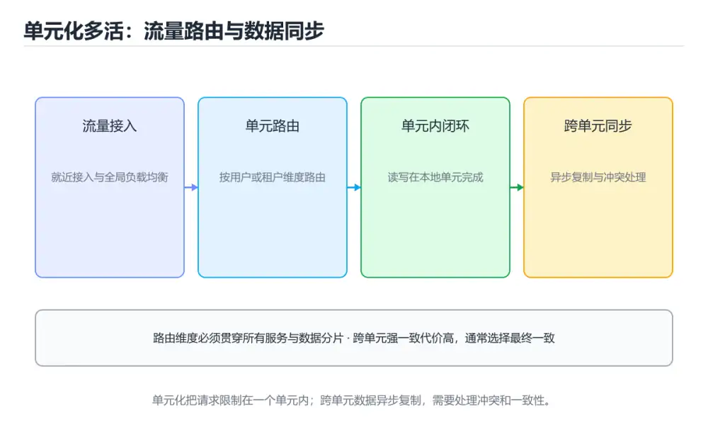
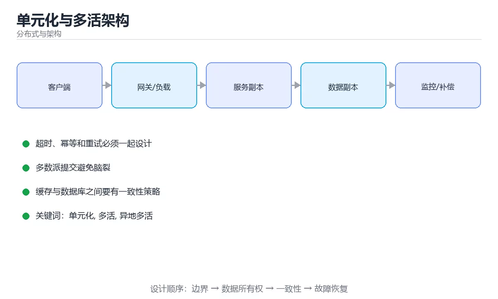

# 单元化与多活架构





> 内容更新时间：2026-10-06 · 学习阶段：高级 · 预计用时：40 分钟

## 本节知识框架

**课程定位**：所属分类为「分布式与架构」，课程主题为「单元化与多活架构」，学习阶段为「高级」，建议用时 40 分钟。

**本课要解决的主问题**：单元划分、容量接管规划与切换演练要点。

| 学习层次 | 要回答的问题 | 完成判据 |
| --- | --- | --- |
| 概念层 | 「单元化与多活架构」有哪些必须区分的对象与术语？ | 能用自己的话定义核心术语，并各举一个正例和一个反例。 |
| 机制层 | 这些对象按什么顺序发生作用，输入如何变成输出？ | 能画出或写出机制步骤，并说明每一步的失败条件。 |
| 应用层 | 什么场景适合使用「单元化与多活架构」，什么场景不适合？ | 能给出一个真实场景、一个最小示例和一个边界案例。 |
| 性能层 | 时间、空间、吞吐或延迟受哪些量影响？ | 能说出复杂度或性能瓶颈的证据来源；没有证据时明确写“材料未提供”。 |
| 复习层 | 怎样确认自己不是只记住了结论？ | 能独立完成本课自测，并把错误定位到概念、机制、示例或边界。 |

### 阅读路线

1. 先读「核心概念定义」，建立「单元化」等对象的精确定义。
2. 再读「原理与运行机制」，把定义串成可重复的过程。
3. 用「代码/协议/SQL 示例」验证过程，并只改一个条件观察结果变化。
4. 最后检查性能、易错点、知识关系与自测题，形成可复习的证据链。

**前置知识**：《分布式缓存架构》

**学习位置**：本课位于《共识与复制：Raft 实战要点》之后；如果前一课的自测不能通过，应先回补再继续。

**后续衔接**：本课之后可进入项目实战或综合复习，把本课结论用于一个完整任务。

**教材衔接：学习目标**

- 能用自己的话解释单元化与多活架构解决了什么问题，而不是只背术语。
- 能说清 「单元化」、「多活」、「异地多活」、「容灾」 之间的关系，并分别举出一个例子。
- 能把 单元化 放回「单元化与多活架构」的知识体系，说明它和 多活 的边界。
- 能完成本课练习，并用验收标准检查自己的结果。

> 一句话摘要：单元划分、容量接管规划与切换演练要点。

**教材衔接：前置知识**

- 先完成上一课《分布式缓存架构》；如果已经掌握，可以直接用本课练习自测。
- 开始前先复习：单元化、多活、异地多活。
- 看不懂就直接缩小例子：只保留 单元化 相关的两行输入，跑通后再加回其余部分。

**教材衔接：本课小结**

- 核心问题：单元化与多活架构不是孤立术语，而是在「分布式与架构」中解决一类具体问题。
- 关键关系：先分清「单元化」与「多活」的职责，再理解「异地多活」的适用边界。
- 判断标准：能解释 单元化 的正常场景、边界条件和失败场景，才算真正掌握。
- 下一步：先复述 多活 的边界，再开始本课测验。

## 核心概念定义

> 在阅读《单元化与多活架构》时，术语第一次出现先给操作性定义，再给边界；正文说法与这里冲突时，以定义和可复现示例为准。

| 术语 | 操作性定义 | 本课中的边界 |
| --- | --- | --- |
| 单元化 | 把系统按用户或数据分片部署到独立单元，以限制故障影响范围。 | 仅在「单元化与多活架构」明确给出的输入、版本与资源条件下成立。 |
| 多活 | 多个站点同时承载流量并具备故障接管能力。 | 仅在「单元化与多活架构」明确给出的输入、版本与资源条件下成立。 |
| 异地多活 | 关键关系：先分清「单元化」与「多活」的职责，再理解「异地多活」的适用边界。 | 仅在「单元化与多活架构」明确给出的输入、版本与资源条件下成立。 |
| 容灾 | 在机房、区域或核心依赖故障时维持业务可用并满足恢复目标。 | 仅在「单元化与多活架构」明确给出的输入、版本与资源条件下成立。 |
| 切换演练 | 模拟主节点或机房故障并按预案执行流量切换，验证恢复时间与数据一致性。 | 仅在「单元化与多活架构」明确给出的输入、版本与资源条件下成立。 |
| RTO | 灾难发生后恢复服务所需的最长时间目标。 | 仅在「单元化与多活架构」明确给出的输入、版本与资源条件下成立。 |

### 定义如何使用

在「单元化与多活架构」中判断一个说法是否成立，先确认它使用的是哪个对象的定义，再检查输入规模、运行环境与失败路径。定义不是口号，而是后续推导、代码示例和自测题共享的约束。

## 原理与运行机制

### 机制总览

1. **建立输入**：把「单元化」按本课定义整理成可观察、可重复的输入条件。
2. **执行转换**：围绕「多活」执行本课的核心步骤；每一步都记录中间状态，避免只看最终输出。
3. **产生输出**：得到「异地多活」后，用正文示例或协议/SQL 结果核对输出是否符合预期。
4. **改变一个条件**：只替换一个边界条件或环境参数，观察「单元化与多活架构」的结论是否仍然成立。

| 阶段 | 关注对象 | 失败时应检查 |
| --- | --- | --- |
| 输入 | 单元化 | 类型、范围、编码、版本或前置状态是否满足定义。 |
| 处理 | 多活 | 顺序、可见性、锁、路由、事务或调度规则是否被破坏。 |
| 输出 | 异地多活 | 结果是否可复现，错误是否被正确传播而不是被吞掉。 |

本课的机制结论要用「单元化与多活架构」自己的示例验证。「单元化与多活架构」没有给出某个数量级、吞吐或内存数据时，本课把该判断标为“材料未提供”，不从相邻主题外推。

**教材衔接：三种多机房形态**

| 形态 | 流量分布 | 数据 | 恢复目标 | 复杂度 |
| --- | --- | --- | --- | --- |
| 同城主备 | 单机房承接 | 主库单写 | RTO 分钟级 | 低 |
| 同城双活 | 两机房分担 | 主库单写或双写 | RTO 秒级 | 中 |
| 异地多活 | 多地分担 | 分片多写 | 单机房故障不中断 | 高 |

关键概念：

| 概念 | 含义 |
| --- | --- |
| 单元（Cell） | 能独立承接一部分用户流量的完整闭环 |
| 单元化 | 按用户维度把流量与数据切分到不同单元 |
| 单元内闭环 | 单元内完成读、写、缓存、异步任务，不跨单元同步调用 |
| 异地多活 | 多单元同时对外服务，任一单元故障可被接管 |
| RTO / RPO | 恢复时间目标 / 数据丢失容忍量 |

**教材衔接：单元化设计要点**

| 主题 | 做法 |
| --- | --- |
| 分片键 | 用户 ID 或租户 ID，保证同一用户数据落在同一单元 |
| 路由 | 接入层按分片键计算单元，避开跨单元调用 |
| 数据同步 | 异步复制用于容灾；不可变数据可多写 |
| 全局数据 | 配置、字典等小数据全量复制到各单元 |
| 跨单元场景 | 转账、全局唯一 ID 等用异步补偿或专门服务 |
| 容量规划 | 每个单元按「接管全量流量」的降级容量规划 |
| 灰度与切换 | 支持按分片比例切流与一键回切 |

```python
import hashlib
from dataclasses import dataclass, field

def cell_for(user_id: str, cells: list) -> str:
    """按用户稳定映射到单元：同一用户永远落在同一单元。"""
    if not cells:
        raise ValueError("单元列表为空")
    digest = hashlib.md5(user_id.encode()).hexdigest()
    return cells[int(digest, 16) % len(cells)]

@dataclass
class UnitPlan:
    """单元容量规划：每个单元要能接管其他单元的流量。"""

    name: str
    base_qps: float                 # 本单元日常承载流量
    total_qps: float                # 全部单元合计流量
    headroom: float = 0.3           # 预留余量

    def take_over_qps(self, failed_units: int, unit_count: int) -> float:
        """故障接管：剩余单元分摊总流量。"""
        survivors = max(1, unit_count - failed_units)
        return round(self.total_qps / survivors, 2)

    def can_take_over(self, failed_units: int, unit_count: int, capacity_qps: float) -> bool:
        need = self.take_over_qps(failed_units, unit_count)
        return need <= capacity_qps * (1 - self.headroom)

@dataclass
class FailoverPlan:
    """切换演练：记录步骤与验证项，确保可回滚。"""

    steps: list = field(default_factory=list)

    def add(self, action: str, verify: str) -> None:
        self.steps.append((action, verify))

    def dry_run_checklist(self) -> list:
        return [f"{action} → 验证：{verify}" for action, verify in self.steps]

plan = UnitPlan("cell-a", base_qps=800, total_qps=2400)
print(cell_for("user-12345", ["cell-a", "cell-b", "cell-c"]))
print(plan.take_over_qps(1, 3), plan.can_take_over(1, 3, capacity_qps=1200))

drill = FailoverPlan()
drill.add("停掉 cell-a 的入口流量", "剩余单元错误率小于 1%")
drill.add("确认数据补齐", "各单元数据行数一致")
print(drill.dry_run_checklist())
```

**教材衔接：数据一致性策略速查**

| 数据类型 | 策略 |
| --- | --- |
| 用户分片数据 | 单元内单写，跨单元异步复制 |
| 全局配置 | 全量复制 + 版本号校验 |
| 全局唯一 ID | 单元前缀 + 本地发号，避免全局竞争 |
| 计数与余额 | 归属单元单写，跨单元用补偿事务 |
| 消息 | 按分片键分区，保证同用户消息有序 |
| 缓存 | 单元内独立缓存，避免跨单元读取 |

## 典型应用场景

| 场景 | 典型输入或前提 | 期望产物 |
| --- | --- | --- |
| 学习验证 | 使用本课最小示例和 单元化、多活 | 能复现正文结论，并解释每一步。 |
| 工程落地 | 把「单元化与多活架构」放入真实模块或服务边界 | 输出可观测、失败可定位、参数可配置。 |
| 故障排查 | 只改一个版本、规模、输入或依赖条件 | 能区分概念错误、实现错误和环境差异。 |

判断「单元化与多活架构」的场景是否成立，标准是能否写出输入、处理、输出和失败路径；材料中没有出现的数据在本课标注为“材料未提供”，不用推测替代证据。

## 代码/协议/SQL 示例

以下代码、协议或 SQL 片段来自《单元化与多活架构》原文，保留原有语言标记与上下文；先预测《单元化与多活架构》示例的输出，再按正文步骤运行或推演，示例依赖外部环境时同时记录版本与输入。

**教材衔接：补充：单元化路由、冲突解决与切换验收**

### 单元化的分片路由

```text
目标：让同一用户的数据与流量始终落在同一个单元（机房切片）

  ┌──────── 单元 A ────────┐   ┌──────── 单元 B ────────┐
  │ 用户 hash % 2 == 0      │   │ 用户 hash % 2 == 1      │
  │ 应用 + 缓存 + 数据库    │   │ 应用 + 缓存 + 数据库    │
  └─────────────────────────┘   └─────────────────────────┘
              │                              │
              └──────── 全局路由表 ──────────┘
                   （用户 → 单元映射）
```

| 路由方式 | 说明 | 变更代价 |
| --- | --- | --- |
| 取模分片 | `hash(uid) % N` | 扩缩容要搬大量数据 |
| 一致性哈希 | 单元环形分布 | 迁移量约 1/N |
| 显式路由表 | 元数据服务记录映射 | 可精确控制，但需中心化 |

```text
单元化的三条纪律
  ① 单元内闭环：一次请求只在本单元内完成，不跨机房调用
  ② 路由信息透传：入口定好路由后，整条链路都按同一单元走
  ③ 全局数据最小化：只有真正需要全局的唯一键、配置才集中存放
```

### 多活的三种形态

| 形态 | 数据写入 | 特点 | 典型场景 |
| --- | --- | --- | --- |
| 主备 | 只写主 | 简单，切换有 RTO | 传统容灾 |
| 双活（同城） | 双机房都写 | 延迟低，冲突少 | 同城容灾 |
| 多活（异地） | 多地都写 | 就近接入，冲突需处理 | 全国/全球业务 |

```text
同城双活 vs 异地多活
  同城：RTT < 3ms，可用同步复制，强一致可行
  异地：RTT 数十毫秒，同步复制代价高，通常选最终一致
```

### 冲突解决的五种策略

| 策略 | 做法 | 适用 |
| --- | --- | --- |
| 最后写入获胜（LWW） | 按时间戳取最新 | 用户资料等可覆盖数据 |
| 版本号比较 | 只接受更高版本 | 计数器、状态字段 |
| 业务合并 | 按业务规则合并（如取较大值） | 库存、积分 |
| 冲突上报 | 标记冲突交人工处理 | 金额、合同 |
| CRDT | 用可交换的数据结构自动合并 | 协同编辑、集合 |

```text
时间戳不可靠的原因
  · 各机房时钟存在漂移（即使有 NTP，也可能差几十毫秒）
  · 因此 LWW 在「同一秒内并发写」时结果不确定

更稳妥的做法
  · 使用逻辑时钟（如版本号 + 机房标识）而不是物理时间
  · 或者把冲突交给业务层合并
```

### 流量调度与故障切换

```text
三层调度
  ① DNS / GSLB：按地理与健康状态解析到最近可用单元
  ② 接入层：按用户路由规则转发到对应单元
  ③ 应用层：单元内负载均衡

切换策略
  · 单元故障：把该单元的用户整体切到备用单元（需要数据已同步）
  · 单元降级：只读可用，写请求转发到主单元
  · 全局降级：关闭非核心功能，保住登录与支付
```

```text
切换前必须确认的三件事
  · 备用单元的数据延迟（复制 lag）在可接受范围内
  · 备用单元的容量能承载「故障单元 + 自身」的总流量
  · 切换过程幂等，重复执行不会造成双写混乱
```

### 多活的验收标准

| 验收项 | 目标 |
| --- | --- |
| 单元内调用比例 | ≥ 99%（跨单元调用极少） |
| 数据复制延迟 | 同城 < 10ms，异地 < 1s |
| 单单元故障影响 | 仅影响该单元用户，其他单元无感 |
| 切换耗时 | 分钟级（自动）到秒级（DNS 预置） |
| 冲突处理 | 有明确策略且可回溯 |

### 自查清单

- [ ] 路由信息在整条链路透传，单元内闭环
- [ ] 冲突解决策略明确，且不单纯依赖物理时间戳
- [ ] 备用单元容量可承接故障单元的流量
- [ ] 切换流程可重复执行且幂等
- [ ] 有跨单元调用比例、复制延迟等验收指标

## 时间/空间复杂度或性能分析

**复杂度证据**：「单元化与多活架构」的现有材料没有给出渐近时间或空间复杂度的明确结论，本课只做定性检查，不补写未经验证的 $O$ 记号。

| 维度 | 本课关注点 | 判断依据 |
| --- | --- | --- |
| 时间/延迟 | 「单元化与多活架构」的主要步骤是否会随输入规模、并发度或网络往返增长。 | 以正文复杂度、基准数据或可重复测量为准。 |
| 空间/内存 | 中间状态、缓存、副本、连接或索引是否随规模增长。 | 记录峰值内存与数据副本，不只看最终结果。 |
| 吞吐/资源 | 版本、调度、锁、IO、序列化或协议开销是否成为瓶颈。 | 固定环境做对照实验，改变一个变量。 |

评估「单元化与多活架构」时要区分“正确性成立”和“性能达标”两件事；材料没有给出基准时，本课只保留量级来源与测量方法，不写不可验证的绝对数字。

## 常见误区与易错点

> 复核《单元化与多活架构》的易错点时，优先保留原文的错误表、故障现场与排错路径；每条修正都要能用本课示例复验。

| 易错点 | 常见表现 | 正确做法 |
| --- | --- | --- |
| 只背结论 | 能复述「单元化与多活架构」的定义，却说不清输入、输出与边界。 | 回到机制步骤，用最小示例逐一验证。 |
| 混淆相邻概念 | 把本课对象与相邻主题的对象当成同一类。 | 先比较定义、资源归属、生命周期和失败模式。 |
| 忽略版本与环境 | 在开发机通过后直接外推到生产环境。 | 固定版本、输入和资源条件，再记录可复现结果。 |

**教材衔接：常见错误与排查**

| 容易踩的做法 | 实际现象 | 原因与正确做法 |
| --- | --- | --- |
| 单元内还要跨单元同步调用 | 一个机房故障整体不可用 | 单元必须闭环，跨单元走异步补偿 |
| 分片键选错 | 高频查询跨全部单元 | 按最常用查询维度选分片键 |
| 双写不做冲突解决 | 数据互相覆盖 | 明确「谁为准」或使用不可变数据 |
| 按平均流量规划单元容量 | 故障接管时被打垮 | 按接管全量流量规划容量 |
| 只做数据同步不做演练 | 真切换时失败 | 定期故障注入与切换演练 |
| 全局数据库单点 | 多活形同虚设 | 消除单点或降级为只读 |
| 忽略数据回传延迟 | 切换后读到旧数据 | 监控复制延迟并设置切流条件 |
| 无回切方案 | 故障恢复后无法回归 | 设计一键回切与数据核对 |

**教材衔接：故障现场**

### 现场 1：单元内还要跨单元同步调用

**症状**：在《单元化与多活架构》的复现场景中，一个机房故障整体不可用。

**根因**：当出现“单元内还要跨单元同步调用”时，执行路径已经绕过了《单元化与多活架构》的关键约束，最终以“一个机房故障整体不可用”暴露出来；修复前必须先确认约束在哪里失效。

**修复**：针对《单元化与多活架构》的问题，单元必须闭环，跨单元走异步补偿。

**验证**：先在《单元化与多活架构》中记录“单元内还要跨单元同步调用”留下的失败证据，再执行“单元必须闭环，跨单元走异步补偿”并重放；确认错误路径变为明确结果，且修复没有掩盖同类故障。

### 现场 2：双写不做冲突解决

**症状**：在《单元化与多活架构》的复现场景中，数据互相覆盖。

**根因**：当出现“双写不做冲突解决”时，执行路径已经绕过了《单元化与多活架构》的关键约束，最终以“数据互相覆盖”暴露出来；修复前必须先确认约束在哪里失效。

**修复**：针对《单元化与多活架构》的问题，明确「谁为准」或使用不可变数据。

**验证**：先在《单元化与多活架构》中记录“双写不做冲突解决”留下的失败证据，再执行“明确「谁为准」或使用不可变数据”并重放；确认错误路径变为明确结果，且修复没有掩盖同类故障。

### 现场 3：按平均流量规划单元容量

**症状**：在《单元化与多活架构》的复现场景中，故障接管时被打垮。

**根因**：当出现“按平均流量规划单元容量”时，执行路径已经绕过了《单元化与多活架构》的关键约束，最终以“故障接管时被打垮”暴露出来；修复前必须先确认约束在哪里失效。

**修复**：针对《单元化与多活架构》的问题，按接管全量流量规划容量。

**验证**：在《单元化与多活架构》中按“按接管全量流量规划容量”调整后，从“按平均流量规划单元容量”的触发条件重放同一条路径，确认“故障接管时被打垮”不再出现，并补一个相邻边界用例检查没有引入新问题。

## 与其他知识点的关系

| 关系 | 课程 | 为什么 |
| --- | --- | --- |
| 先修 | 《分布式缓存架构》 | 本课会直接使用它的概念或操作前提。 |
| 前置顺序 | 《共识与复制：Raft 实战要点》 | 同分类中安排在本课之前，建议先完成其自测。 |

把「单元化与多活架构」放回知识体系时，不只要记住“前面学过什么”，还要说明两个主题在输入、机制、资源边界和失败模式上的差异。这样才能把单课知识迁移到项目、排障和后续课程。

## 自测题与参考答案

> 先独立完成《单元化与多活架构》的自测，再核对答案与解析。答案必须能在本课正文或示例中找到依据，不能只凭语感。

### 自测 1

围绕“单元化与多活架构”中的 单元化、多活、异地多活，下列哪两项是本课强调的实践判断？

A. 验证 多活 时要固定版本并覆盖边界输入，结论才可复现
B. 把 多活 的单次运行结果当成所有版本和规模都成立
C. 学习 单元化 时要同时说明输入、输出和失败路径，不能只看正常流程
D. 只要 单元化 的常规示例通过，就可以跳过边界与异常路径

**参考答案**：验证 多活 时要固定版本并覆盖边界输入，结论才可复现；学习 单元化 时要同时说明输入、输出和失败路径，不能只看正常流程

**解析**：本课把单元化与多活架构拆成概念、示例与故障现场三部分，因此判断 单元化 时必须同时交代输入、输出和失败路径，这使“学习 单元化 时要同时说明输入、输出和失败路径，不能只看正常流程”成立。在单元化与多活架构里，判断 多活 时要固定版本与边界输入，所以“验证 多活 时要固定版本并覆盖边界输入，结论才可复现”才可复现。

### 自测 2

按“单元化与多活架构”中 单元化、多活、异地多活 的实践顺序，把四个步骤排成从准备到复盘的合理顺序。

A. 固定版本与证据，把“单元化与多活架构”的结论写成可复现记录
B. 先明确 单元化 的输入、输出与约束
C. 写出最小示例并核对 多活 的基线结果
D. 只改一个变量，记录边界与失败路径的变化

**参考答案**：先明确 单元化 的输入、输出与约束 → 写出最小示例并核对 多活 的基线结果 → 只改一个变量，记录边界与失败路径的变化 → 固定版本与证据，把“单元化与多活架构”的结论写成可复现记录

**解析**：题干的正确项是固定版本与证据，把“单元化与多活架构”的结论写成可复现记录。在「单元化与多活架构」里，在本课的练习里，顺序应当是：先明确 单元化 的输入、输出与约束 → 写出最小示例并核对 多活 的基线结果 → 只改一个变量，记录边界与失败路径的变化 → 固定版本与证据，把本课的结论写成可复现记录。这个顺序把 单元化 的输入、输出和约束放在最前面，在单元化与多活架构里避免概念没对齐就开始调参。第二步用 多活 建立可核对的基线，在单元化与多活架构里第三步才允许改变一个变量并观察失败路径。

### 自测 3

规划单元容量时，应该按什么标准？

A. 能接管全量流量
B. 历史最小值
C. 只按当前用户量
D. 日常平均流量

**参考答案**：能接管全量流量

**解析**：在「单元化与多活架构」里，能接管全量流量。多活的意义在于故障时其他单元能顶上来，因此容量要按接管后的分摊流量规划并留余量。“规划单元容量时”与「单元化与多活架构」的术语表相呼应，只有符合单元化、多活、异地多活约束的“能接管全量流量（或按预期故障数分摊后的流”才是正文支持的结论。

**教材衔接：复习与自测**

- [ ] 能区分同城主备、同城双活与异地多活的目标差异。
- [ ] 单元按分片键划分且内部闭环。
- [ ] 容量按「接管全量流量」规划并留余量。
- [ ] 有跨单元一致性方案与补偿机制。
- [ ] 定期做故障注入与切换演练，且有回切方案。

**教材衔接：动手练习**

> 本课练习重点：围绕「单元化、多活、异地多活」完成复述、实验和交付，每个结果都要能被别人检查。

先定义 多活 的一致性目标，再设计故障演练。

### 练习 1：建立心智模型（10 分钟）

合上教程，用 3～5 句话回答：

1. 单元化与多活架构解决了什么问题？
2. 如果没有它，会出现什么具体后果？
3. 它和「多活」是什么关系？

验收标准：说明 单元化 与 多活 的分工，并写出一个失效场景。

### 练习 2：做一次可控实验（20 分钟）

从正文中选一个最小示例，完成以下操作：

1. 先预测修改一个参数、输入或步骤后的结果。
2. 再实际执行或逐步推演，记录真实结果。
3. 如果结果与预测不同，写出差异原因。

**验收标准**：先在「三种多机房形态」里找一个可运行的最小输入，再按五步法记录单元化的影响；预测与结果不一致时补写被忽略的前提。

### 练习 3：交付一个小结果（30 分钟）

标出 多活 的单点，说明故障时的降级与恢复顺序。

任务要求：

- 结果必须能被别人检查，不能只写“我已经理解了”。
- 至少覆盖「单元化」和「多活」两个关键词。
- 写出 1 个仍然不确定的问题，以及下一步如何验证。

> 提示：时间有限时优先做练习 1 和练习 2；练习 3 可以拆成两次完成。

**教材衔接：可运行练习**

### 任务 1：先跑通，再解释

```python
import hashlib
from dataclasses import dataclass, field

def cell_for(user_id: str, cells: list) -> str:
    """按用户稳定映射到单元：同一用户永远落在同一单元。"""
    if not cells:
        raise ValueError("单元列表为空")
    digest = hashlib.md5(user_id.encode()).hexdigest()
    return cells[int(digest, 16) % len(cells)]

@dataclass
class UnitPlan:
    """单元容量规划：每个单元要能接管其他单元的流量。"""

    name: str
    base_qps: float                 # 本单元日常承载流量
    total_qps: float                # 全部单元合计流量
    headroom: float = 0.3           # 预留余量

    def take_over_qps(self, failed_units: int, unit_count: int) -> float:
        """故障接管：剩余单元分摊总流量。"""
        survivors = max(1, unit_count - failed_units)
        return round(self.total_qps / survivors, 2)

    def can_take_over(self, failed_units: int, unit_count: int, capacity_qps: float) -> bool:
        need = self.take_over_qps(failed_units, unit_count)
        return need <= capacity_qps * (1 - self.headroom)

@dataclass
class FailoverPlan:
    """切换演练：记录步骤与验证项，确保可回滚。"""

    steps: list = field(default_factory=list)

    def add(self, action: str, verify: str) -> None:
        self.steps.append((action, verify))

    def dry_run_checklist(self) -> list:
        return [f"{action} → 验证：{verify}" for action, verify in self.steps]

plan = UnitPlan("cell-a", base_qps=800, total_qps=2400)
print(cell_for("user-12345", ["cell-a", "cell-b", "cell-c"]))
print(plan.take_over_qps(1, 3), plan.can_take_over(1, 3, capacity_qps=1200))

drill = FailoverPlan()
drill.add("停掉 cell-a 的入口流量", "剩余单元错误率小于 1%")
drill.add("确认数据补齐", "各单元数据行数一致")
print(drill.dry_run_checklist())
```

### 任务 2：只改一个条件

把「单元化与多活架构」的最小示例复制一份，只改一个条件再跑一次：

- 改动点：把 多活 换成边界值，其他输入保持原样。
- 预测：先写下「单元化与多活架构」在改动后的输出或错误信息，再运行。
- 记录：对照改动前后的结果，指出差异出在哪一步。
- 验收：换回原条件能复现原结果，改动只影响单元化。

### 任务 3：迁移到自己的数据

用同一套思路处理一组你自己的 单元化 数据，保持输出格式与任务 1 一致。

**教材衔接：本课复习清单**

离开本课前，逐项确认：

- [ ] 不看解析，能说出「异地多活架构中「单元」的核心要求是？」的判断依据。
- [ ] 不看解析，能说出「单元化的分片键通常选什么？」的判断依据。
- [ ] 不看解析，能说出「规划单元容量时，应该按什么标准？」的判断依据。
- [ ] 不看解析，能说出「跨单元的数据一致性，通常采用什么方式？」的判断依据。
- [ ] 不看解析，能说出「多活架构上线后最重要的验证手段是？」的判断依据。
- [ ] 至少运行一次 ValueError 的示例，记录输入、输出和 单元化 的边界情况。
- [ ] 把本课最容易混淆的两个概念写成一句话对照。

| 复盘项 | 记录 |
| --- | --- |
| 已经能独立解释的考点 |  |
| 仍然说不清的概念 |  |
| 下一步验证动作 |  |

---

## 术语速查

把「单元化与多活架构」里反复出现的术语集中放在一起。复习时先遮住右列，尝试用自己的话解释，再回到正文核对。

| 术语 | 一句话说明 |
| --- | --- |
| `单元化` | 把系统按用户或数据分片部署到独立单元，以限制故障影响范围。 |
| `多活` | 多个站点同时承载流量并具备故障接管能力。 |
| `异地多活` | 关键关系：先分清「单元化」与「多活」的职责，再理解「异地多活」的适用边界。 |
| `容灾` | 在机房、区域或核心依赖故障时维持业务可用并满足恢复目标。 |
| `切换演练` | 模拟主节点或机房故障并按预案执行流量切换，验证恢复时间与数据一致性。 |
| `RTO` | 灾难发生后恢复服务所需的最长时间目标。 |

## 考点精讲

### 考点 1：多选辨析·单元化

- **题目**：围绕“单元化与多活架构”中的 单元化、多活、异地多活，下列哪两项是本课强调的实践判断？
- **判断依据**：本课把单元化与多活架构拆成概念、示例与故障现场三部分，因此判断 单元化 时必须同时交代输入、输出和失败路径，这使“学习 单元化 时要同时说明输入、输出和失败路径，不能只看正常流程”成立。在单元化与多活架构里，判断 多活 时要固定版本与边界输入，所以“验证 多活 时要固定版本并覆盖边界输入，结论才可复现”才可复现。

### 考点 2：顺序排列·单元化

- **题目**：按“单元化与多活架构”中 单元化、多活、异地多活 的实践顺序，把四个步骤排成从准备到复盘的合理顺序。
- **判断依据**：题干的正确项是固定版本与证据，把“单元化与多活架构”的结论写成可复现记录。在「单元化与多活架构」里，在本课的练习里，顺序应当是：先明确 单元化 的输入、输出与约束 → 写出最小示例并核对 多活 的基线结果 → 只改一个变量，记录边界与失败路径的变化 → 固定版本与证据，把本课的结论写成可复现记录。这个顺序把 单元化 的输入、输出和约束放在最前面，在单元化与多活架构里避免概念没对齐就开始调参。第二步用 多活 建立可核对的基线，在单元化与多活架构里第三步才允许改变一个变量并观察失败路径。

### 考点 3：概念判断·单元化

- **题目**：规划单元容量时，应该按什么标准？
- **判断依据**：在「单元化与多活架构」里，能接管全量流量。多活的意义在于故障时其他单元能顶上来，因此容量要按接管后的分摊流量规划并留余量。“规划单元容量时”与「单元化与多活架构」的术语表相呼应，只有符合单元化、多活、异地多活约束的“能接管全量流量（或按预期故障数分摊后的流”才是正文支持的结论。

### 考点 4：概念判断·单元化

- **题目**：跨单元的数据一致性，通常采用什么方式？
- **判断依据**：在「单元化与多活架构」里，结论应落在「按分片键单写归属单元」。单元化追求本地闭环，强一致的跨单元事务代价极高，因此主流做法是归属单元单写加异步补偿，配合对账。在「单元化与多活架构」里，这道题要求区分概念与边界，「按分片键单写归属单元」只有在题干给出的前提下才成立，而「跨单元两阶段提交保证强一致」、「所有单元共享同一主库」缺少同一组条件。

### 考点 5：概念判断·单元化

- **题目**：多活架构上线后最重要的验证手段是？
- **判断依据**：在「单元化与多活架构」里，定期做故障注入与切换演练。多活的假设只能靠演练验证：切流是否成功、数据是否补齐、能否一键回切。在「单元化与多活架构」里判断这道题，要把单元化、多活、异地多活的条件、过程与失败路径逐项对齐，换成“多活架构上线后最重要的验证手段是”这个场景，只有满足前提的结论才成立。

### 考点 6：排错·单元化

- **题目**：阅读「单元化与多活架构」的代码片段，下面哪项判断是正确的？
- **判断依据**：把“单元内部闭环，能独立承接自己那部分流量”代回「单元化与多活架构」里“阅读单元化与多活架构的代码片段”的例子核对，条件一旦改变，结论就要用单元化、多活、异地多活重新推导。在「单元化与多活架构」里，回到单元化、多活、异地多活本身再看一遍：只有“单元内部闭环，能独立承接自己那部分流量”与题干“阅读的代码片段”的前提一致，结论才成立。

## English Overview

**Title:** Cell-Based Multi-Site Architecture

**Summary:** Cell design, capacity takeover and failover drills.

**Category:** Distributed Systems
**Level:** 高级
**Key terms:** 单元化, 多活, 异地多活, 容灾, 切换演练, RTO

## 内容元数据

- 内容版本：v2.0
- 最后更新：2026-10-06
- 学习阶段：高级
- 适用环境：分布式系统与云原生基础设施；本课聚焦 单元化。
- 内容来源：内置结构化课程与工程实践整理
- 相关主题：单元化、多活、异地多活、容灾、切换演练、RTO
- 质量版本：P0 测验标准 + P1 覆盖扩展 + P2 体验补全

## 参考资料与复核

- 最后复核：2026-10-04
- 下次复核：2027-07-24
- 复核范围：版本兼容、API 行为、安全建议与工程实践
- 来源性质：官方文档、标准或权威教材；正文为离线教学重组

| 参考资料 | 本课用途 |
| --- | --- |
| [AWS 架构中心](https://aws.amazon.com/architecture/) | 高可用与云架构模式 |
| [Google SRE 书](https://sre.google/books/) | 可靠性、容量与事故响应 |
| [Apache Kafka 文档](https://kafka.apache.org/documentation/) | 日志、分区与消费组 |

> 「单元化与多活架构」的链接用于离线阅读后的延伸核对；App 不会自动联网。
