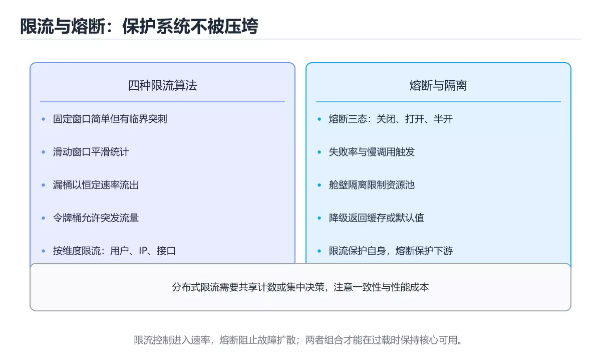
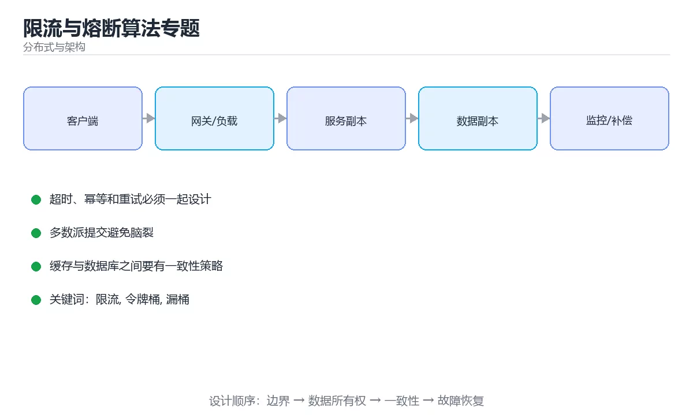

# 限流与熔断算法专题

> 内容更新时间：2026-10-06 · 学习阶段：进阶 · 预计用时：35 分钟





## 学习目标

- 能用自己的话解释限流与熔断算法专题解决了什么问题，而不是只背术语。
- 能说清 「限流」、「令牌桶」、「漏桶」、「滑动窗口」 之间的关系，并分别举出一个例子。
- 能把 限流 放回「限流与熔断算法专题」的知识体系，说明它和 令牌桶 的边界。
- 能完成本课练习，并用验收标准检查自己的结果。

> 一句话摘要：四种限流算法对比、令牌桶实现与熔断隔离组合。

## 前置知识

- 先完成上一课《分布式 ID 与发号器》；如果已经掌握，可以直接用本课练习自测。
- 本课阶段：进阶。建议先完成「分布式 ID 与发号器」，或确认自己能独立跑通正文里的 ValueError 示例。
- 开始前先复习：限流、令牌桶、漏桶。
- 看不懂就直接缩小例子：只保留 限流 相关的两行输入，跑通后再加回其余部分。

## 四种限流算法对照

| 算法 | 允许突发 | 平滑度 | 实现成本 | 适用 |
| --- | --- | --- | --- | --- |
| 固定窗口计数 | 边界处可能双倍 | 差 | 最低 | 粗粒度保护 |
| 滑动窗口 | 有限 | 较好 | 中 | 通用接口限流 |
| 漏桶 | 不允许 | 最平滑 | 中 | 需要恒定输出速率 |
| 令牌桶 | 允许（桶容量决定） | 好 | 中 | 大多数业务首选 |

固定窗口的经典缺陷：限制「每分钟 100 次」时，用户在 00:59 发 100 次、01:00 再发 100 次，瞬间 200 次穿透。

## 令牌桶实现

```python
import threading
import time

class TokenBucket:
    """令牌桶：按恒定速率补充令牌，桶容量决定可容忍的突发量。"""

    def __init__(self, rate_per_second: float, capacity: float):
        if rate_per_second <= 0 or capacity <= 0:
            raise ValueError("速率与容量必须为正")
        self.rate = rate_per_second
        self.capacity = capacity
        self.tokens = capacity
        self.updated_at = time.monotonic()
        self.lock = threading.Lock()

    def _refill(self, now: float) -> None:
        elapsed = max(0.0, now - self.updated_at)
        self.tokens = min(self.capacity, self.tokens + elapsed * self.rate)
        self.updated_at = now

    def try_acquire(self, cost: float = 1.0) -> bool:
        with self.lock:
            now = time.monotonic()
            self._refill(now)
            if self.tokens >= cost:
                self.tokens -= cost
                return True
            return False

    def wait_time(self, cost: float = 1.0) -> float:
        """需要等多久才能拿到令牌，用于返回 Retry-After。"""
        with self.lock:
            now = time.monotonic()
            self._refill(now)
            if self.tokens >= cost:
                return 0.0
            return round((cost - self.tokens) / self.rate, 3)

def client_key(user_id: str, api: str, ip: str) -> str:
    """限流维度：优先按用户与接口组合，未登录时退回 IP。"""
    return f"{user_id or 'anon'}:{api}" if user_id else f"ip:{ip}:{api}"

bucket = TokenBucket(rate_per_second=5, capacity=10)   # 平均 5 QPS，可突发 10
print([bucket.try_acquire() for _ in range(12)].count(True))
print(bucket.wait_time())
print(client_key("u1", "/api/orders", "1.2.3.4"))
```

## 分布式限流要点

| 主题 | 做法 |
| --- | --- |
| 共享计数 | Redis + Lua 脚本保证原子性 |
| 时钟一致 | 用 Redis 时间或服务端统一时间，避免各节点时钟差 |
| 精度与性能 | 本地预取配额（如每次取 100 个），用精度换吞吐 |
| 多维度 | 用户、接口、租户、IP 组合限流，按业务定优先级 |
| 反馈 | 返回 429 与 `Retry-After`，让客户端退避 |
| 降级 | 限流组件故障时按预设策略（放行或拒绝） |
| 监控 | 限流触发次数、被限用户分布、误伤比例 |

## 熔断与隔离速查

| 机制 | 作用 | 关键参数 |
| --- | --- | --- |
| 熔断 | 下游故障时快速失败 | 错误率阈值、窗口、半开探测数 |
| 隔离 | 防止故障扩散 | 线程池或信号量隔离 |
| 超时 | 避免无限等待 | 连接、读写分别设置 |
| 重试 | 处理瞬时抖动 | 仅幂等、指数退避、上限 |
| 降级 | 保核心功能 | 返回缓存或默认值 |
| 背压 | 保护自身 | 有界队列 + 拒绝策略 |

## 常见错误与排查

| 容易踩的做法 | 实际现象 | 原因与正确做法 |
| --- | --- | --- |
| 只用固定窗口 | 边界处流量翻倍 | 改用滑动窗口或令牌桶 |
| 限流只按 IP | NAT 后整栋楼被误伤 | 叠加用户与租户维度 |
| 每请求都访问 Redis | 限流组件成为瓶颈 | 本地预取配额并批量上报 |
| 用 `INCR` 加 `EXPIRE` 两步 | 中间失败导致键永不过期 | 用 Lua 脚本保证原子性 |
| 重试不考虑限流 | 重试风暴加剧故障 | 退避 + 上限 + 熔断 |
| 熔断后没有半开探测 | 下游恢复也不可用 | 冷却后放少量请求探测 |
| 无限流监控 | 误伤无人发现 | 监控触发次数与影响面 |
| 限流阈值凭感觉设定 | 要么误伤要么无保护 | 基于压测与容量规划设定 |

## 复习与自测

- [ ] 能对比四种限流算法并说明固定窗口的缺陷。
- [ ] 会实现令牌桶并计算等待时间。
- [ ] 分布式限流使用原子脚本且考虑本地预取。
- [ ] 限流返回 429 与 `Retry-After`。
- [ ] 熔断、隔离、超时、重试、降级组合使用。

## 补充：四种算法实现与配额分配

### 四种算法的伪代码与对照

```text
① 固定窗口
  key = f"{user}:{now // window}"
  count = INCR(key)
  if count == 1: EXPIRE(key, window)
  return count <= limit
  缺点：窗口边界处可能放过 2 倍流量

② 滑动窗口（用两个窗口加权）
  cur = GET(cur_key); prev = GET(prev_key)
  ratio = (window - elapsed) / window
  approx = cur + prev * ratio
  return approx < limit
  优点：平滑，内存只需两个计数器

③ 漏桶：请求入队，按固定速率流出
  适合严格平滑输出，不允许突发

④ 令牌桶：按速率补令牌，桶内容量即突发上限
  允许突发，最常用
```

| 算法 | 允许突发 | 内存 | 精度 | 推荐场景 |
| --- | --- | --- | --- | --- |
| 固定窗口 | 边界处会 | 1 个计数 | 低 | 粗粒度保护 |
| 滑动窗口 | 轻微 | 2 个计数 | 中 | 通用限流 |
| 漏桶 | 不允许 | 队列长度 | 高 | 保护脆弱下游 |
| 令牌桶 | 允许（有上限） | 桶状态 | 高 | **默认选择** |

### 分布式令牌桶（Redis + Lua）

```lua
-- KEYS[1]=桶 key  ARGV: rate（每秒补充）, capacity, now（秒，含小数）, cost
local data = redis.call('HMGET', KEYS[1], 'tokens', 'ts')
local tokens = tonumber(data[1]) or tonumber(ARGV[2])
local ts = tonumber(data[2]) or tonumber(ARGV[3])

local delta = math.max(0, tonumber(ARGV[3]) - ts)
tokens = math.min(tonumber(ARGV[2]), tokens + delta * tonumber(ARGV[1]))

local allowed = 0
if tokens >= tonumber(ARGV[4]) then
  tokens = tokens - tonumber(ARGV[4])
  allowed = 1
end

redis.call('HMSET', KEYS[1], 'tokens', tokens, 'ts', ARGV[3])
redis.call('EXPIRE', KEYS[1], math.ceil(tonumber(ARGV[2]) / tonumber(ARGV[1]) * 2))
return allowed
```

```text
为什么必须用 Lua
  · 读取令牌数 → 计算 → 写回 三步若分开执行，并发下会互相覆盖
  · Lua 在 Redis 中原子执行，保证「检查并扣减」不可分割
  · 同时设置过期时间，避免冷 key 永久占内存
```

### 配额怎么在实例之间分配

| 方式 | 做法 | 问题 |
| --- | --- | --- |
| 全局限流 | 所有实例共用一个 Redis 计数 | Redis 成为瓶颈与单点 |
| 本地限流 | 每实例各自限额 | 总量随实例数放大 |
| 混合（推荐） | 本地挡突发 + 全局控总量 | 实现稍复杂 |

```text
混合方案示例（目标：全局 10000 QPS，10 个实例）
  ① 本地令牌桶：每实例 1200 QPS（留 20% 余量吸收突发）
  ② 全局令牌桶：Redis 中 10000 QPS
  ③ Redis 不可用时：降级为纯本地限流（宁可放过也不打垮自身）
```

### 多维度限流的组合

```text
按优先级从外到内
  ① 全局总配额（保护整个系统）
  ② 接口维度（保护单个热点接口）
  ③ 用户 / 租户维度（防单用户刷爆）
  ④ IP 维度（对未登录请求兜底）

提示：维度越多，Redis 的 key 越多，注意内存与热点问题。
大租户可单独配额，避免「一个租户吃掉全部额度」。
```

### 限流返回什么

| 响应 | 说明 |
| --- | --- |
| HTTP 429 | 标准状态码，明确表示限流 |
| `Retry-After` 头 | 告诉客户端多久后重试，避免立刻重试 |
| 明确的错误码 | 让客户端区分「限流」与「服务异常」 |

```text
与熔断的区别
  限流：保护自己（入口流量控制）
  熔断：保护调用方（下游故障时快速失败）
  二者组合，再加降级，才构成完整保护网
```

### 自查清单

- [ ] 默认使用令牌桶，允许有上限的突发
- [ ] 分布式限流用 Lua 保证原子性
- [ ] 有本地兜底，Redis 不可用时不至于全站拒绝
- [ ] 按用户与接口双维度限流，大租户单独配额
- [ ] 限流返回 429 并带 `Retry-After`

## 动手练习

> 本课练习重点：围绕「限流、令牌桶、漏桶」完成复述、实验和交付，每个结果都要能被别人检查。

先定义 令牌桶 的一致性目标，再设计故障演练。

### 练习 1：建立心智模型（10 分钟）

合上教程，用 3～5 句话回答：

1. 限流与熔断算法专题解决了什么问题？
2. 如果没有它，会出现什么具体后果？
3. 它和「令牌桶」是什么关系？

验收标准：用自己的话解释 限流，并给出一个它不成立的反例。

### 练习 2：做一次可控实验（20 分钟）

从正文中选一个最小示例，完成以下操作：

1. 先预测修改一个参数、输入或步骤后的结果。
2. 再实际执行或逐步推演，记录真实结果。
3. 如果结果与预测不同，写出差异原因。

**验收标准**：先原样跑通正文里的 `ValueError`，再只改限流相关的输入，按「原例 → 改动 → 预测 → 结果 → 原因」记录；预测必须写在实际运行之前。

### 练习 3：交付一个小结果（30 分钟）

标出 令牌桶 的单点，说明故障时的降级与恢复顺序。

任务要求：

- 结果必须能被别人检查，不能只写“我已经理解了”。
- 至少覆盖「限流」和「令牌桶」两个关键词。
- 写出 1 个仍然不确定的问题，以及下一步如何验证。

> 提示：时间有限时优先做练习 1 和练习 2；练习 3 可以拆成两次完成。

## 本课小结

- 核心问题：限流与熔断算法专题不是孤立术语，而是在「分布式与架构」中解决一类具体问题。
- 关键关系：先分清「限流」与「令牌桶」的职责，再理解「漏桶」的适用边界。
- 判断标准：能解释 限流 的正常场景、边界条件和失败场景，才算真正掌握。
- 下一步：先复述 令牌桶 的边界，再开始本课测验。

## 可运行练习

### 任务 1：先跑通，再解释

```python
import threading
import time

class TokenBucket:
    """令牌桶：按恒定速率补充令牌，桶容量决定可容忍的突发量。"""

    def __init__(self, rate_per_second: float, capacity: float):
        if rate_per_second <= 0 or capacity <= 0:
            raise ValueError("速率与容量必须为正")
        self.rate = rate_per_second
        self.capacity = capacity
        self.tokens = capacity
        self.updated_at = time.monotonic()
        self.lock = threading.Lock()

    def _refill(self, now: float) -> None:
        elapsed = max(0.0, now - self.updated_at)
        self.tokens = min(self.capacity, self.tokens + elapsed * self.rate)
        self.updated_at = now

    def try_acquire(self, cost: float = 1.0) -> bool:
        with self.lock:
            now = time.monotonic()
            self._refill(now)
            if self.tokens >= cost:
                self.tokens -= cost
                return True
            return False

    def wait_time(self, cost: float = 1.0) -> float:
        """需要等多久才能拿到令牌，用于返回 Retry-After。"""
        with self.lock:
            now = time.monotonic()
            self._refill(now)
            if self.tokens >= cost:
                return 0.0
            return round((cost - self.tokens) / self.rate, 3)

def client_key(user_id: str, api: str, ip: str) -> str:
    """限流维度：优先按用户与接口组合，未登录时退回 IP。"""
    return f"{user_id or 'anon'}:{api}" if user_id else f"ip:{ip}:{api}"

bucket = TokenBucket(rate_per_second=5, capacity=10)   # 平均 5 QPS，可突发 10
print([bucket.try_acquire() for _ in range(12)].count(True))
print(bucket.wait_time())
print(client_key("u1", "/api/orders", "1.2.3.4"))
```

### 任务 2：只改一个条件

把「限流与熔断算法专题」的最小示例复制一份，只改一个条件再跑一次：

- 改动点：只调整 ValueError 的一个参数，其余条件一律不动。
- 预测：先写下「限流与熔断算法专题」在改动后的输出或错误信息，再运行。
- 记录：对照改动前后的结果，指出差异出在哪一步。
- 验收：换回原条件能复现原结果，改动只影响限流。

### 任务 3：迁移到自己的数据

用同一套思路处理一组你自己的 限流 数据，保持输出格式与任务 1 一致。

## 故障现场

### 现场 1：只用固定窗口

**症状**：在《限流与熔断算法专题》的复现场景中，边界处流量翻倍。

**根因**：“边界处流量翻倍”只是表层结果。向上追溯会落到“只用固定窗口”这一步，因为它省略了《限流与熔断算法专题》的约束，使实现行为和预期模型发生了偏离。

**修复**：针对《限流与熔断算法专题》的问题，改用滑动窗口或令牌桶。

**验证**：先在《限流与熔断算法专题》中记录“只用固定窗口”留下的失败证据，再执行“改用滑动窗口或令牌桶”并重放；确认错误路径变为明确结果，且修复没有掩盖同类故障。

### 现场 2：限流只按 IP

**症状**：在《限流与熔断算法专题》的复现场景中，NAT 后整栋楼被误伤。

**根因**：当出现“限流只按 IP”时，执行路径已经绕过了《限流与熔断算法专题》的关键约束，最终以“NAT 后整栋楼被误伤”暴露出来；修复前必须先确认约束在哪里失效。

**修复**：针对《限流与熔断算法专题》的问题，叠加用户与租户维度。

**验证**：先在《限流与熔断算法专题》中记录“限流只按 IP”留下的失败证据，再执行“叠加用户与租户维度”并重放；确认错误路径变为明确结果，且修复没有掩盖同类故障。

### 现场 3：每请求都访问 Redis

**症状**：在《限流与熔断算法专题》的复现场景中，限流组件成为瓶颈。

**根因**：当出现“每请求都访问 Redis”时，执行路径已经绕过了《限流与熔断算法专题》的关键约束，最终以“限流组件成为瓶颈”暴露出来；修复前必须先确认约束在哪里失效。

**修复**：针对《限流与熔断算法专题》的问题，本地预取配额并批量上报。

**验证**：先在《限流与熔断算法专题》中记录“每请求都访问 Redis”留下的失败证据，再执行“本地预取配额并批量上报”并重放；确认错误路径变为明确结果，且修复没有掩盖同类故障。

## 本课复习清单

离开本课前，逐项确认：

- [ ] 不看解析，能说出「固定窗口限流的典型缺陷是？」的判断依据。
- [ ] 不看解析，能说出「令牌桶相比漏桶的关键区别是？」的判断依据。
- [ ] 不看解析，能说出「分布式限流中用 INCR 后再 EXPIRE 的两步写法有什么风险？」的判断依据。
- [ ] 不看解析，能说出「限流触发时，服务端应该返回什么？」的判断依据。
- [ ] 不看解析，能说出「熔断器进入打开状态后，还需要什么机制才能恢复？」的判断依据。
- [ ] 用 限流 构造一个正常输入和一个边界输入，分别记录输出与判断依据。
- [ ] 把本课最容易混淆的两个概念写成一句话对照。

| 复盘项 | 记录 |
| --- | --- |
| 已经能独立解释的考点 |  |
| 仍然说不清的概念 |  |
| 下一步验证动作 |  |

## 术语速查

把「限流与熔断算法专题」里反复出现的术语集中放在一起。复习时先遮住右列，尝试用自己的话解释，再回到正文核对。

| 术语 | 一句话说明 |
| --- | --- |
| `限流` | 限流：保护自己（入口流量控制）。 |
| `令牌桶` | ④ 令牌桶：按速率补令牌，桶内容量即突发上限。 |
| `漏桶` | 关键关系：先分清「限流」与「令牌桶」的职责，再理解「漏桶」的适用边界。 |
| `滑动窗口` | 在时间轴上只统计最近一段窗口内的请求或事件，用平滑突发并限制瞬时速率。 |
| `熔断` | 依赖连续失败达到阈值后暂时停止调用并快速失败，给下游恢复时间并防止雪崩。 |
| `退避` | 请求失败后按延迟逐步重试，避免大量客户端同时重试造成二次拥塞。 |

## 考点精讲

### 考点 1：概念判断·限流

- **题目**：固定窗口限流的典型缺陷是？
- **判断依据**：在「限流与熔断算法专题」里，窗口边界处可能出现瞬时双倍流量。在 00:59 用满额度、01:00 再用满额度，就形成跨边界的双倍突发。「限流与熔断算法专题」要求先交代限流、令牌桶、漏桶的前提再下结论，所以“窗口边界处可能出现瞬时双倍流量”只在题干“固定窗口限流的典型缺陷是”给定的条件下成立。

### 考点 2：多选辨析·限流

- **题目**：围绕“限流与熔断算法专题”中的 限流、令牌桶、漏桶，下列哪两项是本课强调的实践判断？
- **判断依据**：本课把限流与熔断算法专题拆成概念、示例与故障现场三部分，因此判断 限流 时必须同时交代输入、输出和失败路径，这使“学习 限流 时要同时说明输入、输出和失败路径，不能只看正常流程”成立。在限流与熔断算法专题里，判断 令牌桶 时要固定版本与边界输入，所以“验证 令牌桶 时要固定版本并覆盖边界输入，结论才可复现”才可复现。

### 考点 3：顺序排列·限流

- **题目**：按“限流与熔断算法专题”中 限流、令牌桶、漏桶 的实践顺序，把四个步骤排成从准备到复盘的合理顺序。
- **判断依据**：在「限流与熔断算法专题」里，在本课的练习里，顺序应当是：先明确 限流 的输入、输出与约束 → 写出最小示例并核对 令牌桶 的基线结果 → 只改一个变量，记录边界与失败路径的变化 → 固定版本与证据，把本课的结论写成可复现记录。这个顺序把 限流 的输入、输出和约束放在最前面，在限流与熔断算法专题里避免概念没对齐就开始调参。第二步用 令牌桶 建立可核对的基线，在限流与熔断算法专题里第三步才允许改变一个变量并观察失败路径。

### 考点 4：概念判断·限流

- **题目**：限流触发时，服务端应该返回什么？
- **判断依据**：在「限流与熔断算法专题」里，结论应落在「429 并带上 Retry-After」。429 表示请求过多，配合 Retry-After 告知客户端何时重试，能有效减少重试风暴。在「限流与熔断算法专题」里，这道题要求区分概念与边界，「429 并带上 Retry-After」只有在题干给出的前提下才成立，而「500 内部错误，需要额外的验证与维护」、「直接关闭连接」缺少同一组条件。

### 考点 5：概念判断·限流

- **题目**：熔断器进入打开状态后，还需要什么机制才能恢复？
- **判断依据**：在「限流与熔断算法专题」里，冷却后进入半开状态放少量探测请求。半开状态用少量请求试探下游是否恢复，成功则关闭熔断、失败则继续打开，避免恢复瞬间再次被打垮。把“冷却后进入半开状态放少量探测请求”代回「限流与熔断算法专题」里“熔断器进入打开状态后”的例子核对，条件一旦改变，结论就要用限流、令牌桶、漏桶重新推导。

### 考点 6：排错·限流

- **题目**：阅读「限流与熔断算法专题」的代码片段，下面哪项判断是正确的？
- **判断依据**：在「限流与熔断算法专题」里，作答时，先用限流建立输入与输出的基线，再把窗口边界处可能出现瞬时双倍流量代入边界条件核对，结论才能复现。“阅读限流与熔断算法专题的代码片段”与「限流与熔断算法专题」的术语表相呼应，只有符合限流、令牌桶、漏桶约束的“窗口边界处可能出现瞬时双倍流量”才是正文支持的结论。

## English Overview

**Title:** Rate Limiting & Circuit Breaking

**Summary:** Token bucket, sliding window, circuit breaker and isolation.

**Category:** Distributed Systems
**Level:** 进阶
**Key terms:** 限流, 令牌桶, 漏桶, 滑动窗口, 熔断, 退避

## 内容元数据

- 内容版本：v2.0
- 最后更新：2026-10-06
- 学习阶段：进阶
- 适用环境：分布式系统与云原生基础设施；本课聚焦 限流。
- 内容来源：内置结构化课程与工程实践整理
- 相关主题：限流、令牌桶、漏桶、滑动窗口、熔断、退避
- 质量版本：P0 测验标准 + P1 覆盖扩展 + P2 体验补全

## 参考资料与复核

- 最后复核：2026-10-04
- 下次复核：2027-07-24
- 复核范围：版本兼容、API 行为、安全建议与工程实践
- 来源性质：官方文档、标准或权威教材；正文为离线教学重组

| 参考资料 | 本课用途 |
| --- | --- |
| [Microsoft 云设计模式](https://learn.microsoft.com/azure/architecture/patterns/) | 重试、熔断与队列模式 |
| [Apache Kafka 文档](https://kafka.apache.org/documentation/) | 日志、分区与消费组 |
| [CNCF 技术地图](https://landscape.cncf.io/) | 云原生技术生态 |

> 「限流与熔断算法专题」的链接用于离线阅读后的延伸核对；App 不会自动联网。
