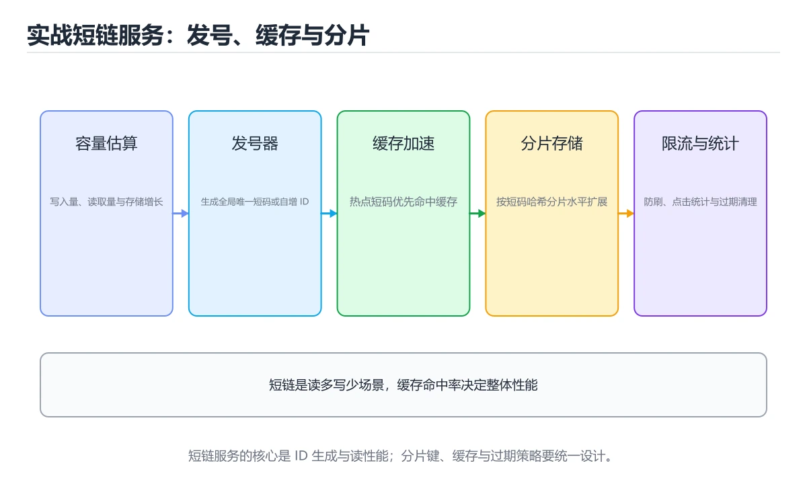
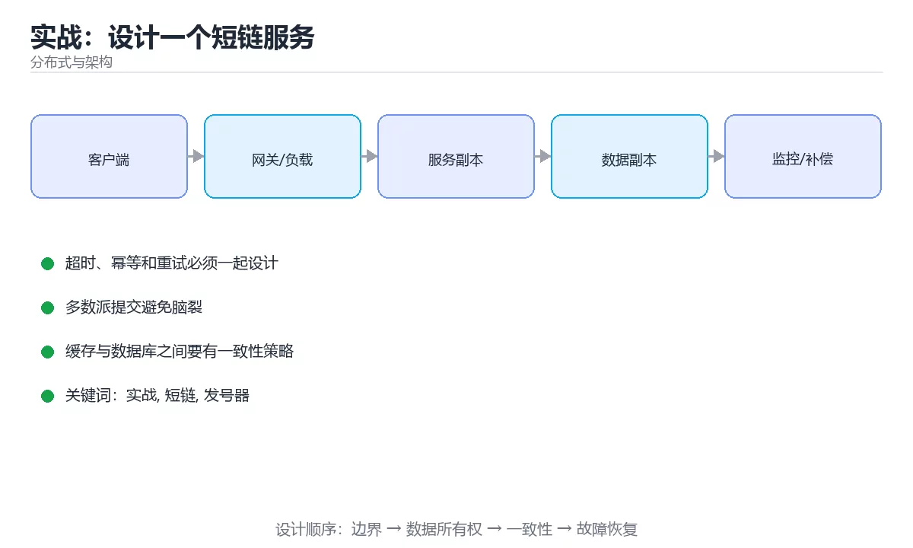

# 实战：设计一个短链服务





> 内容更新时间：2026-10-06 · 学习阶段：高级 · 预计用时：60 分钟

## 学习目标

- 能用自己的话解释实战：设计一个短链服务解决了什么问题，而不是只背术语。
- 能说清 「实战」、「短链」、「发号器」、「缓存」 之间的关系，并分别举出一个例子。
- 能把本课知识放回「分布式与架构」的知识体系，说明它和相邻主题的边界。
- 能完成本课练习，并用验收标准检查自己的结果。

> 一句话摘要：发号器、缓存、分片、限流与容量估算。

## 前置知识

- 先完成上一课《高可用与容量规划》；如果已经掌握，可以直接用本课练习自测。
- 开始前先复习：实战、短链、发号器。
- 如果某一步看不懂，先记录具体卡点，完成练习后再回头读一遍。

## 需求与约束

把长链接转成短码（如 `https://s.example/aB3xK9`），访问短链时 302 跳转；要求读多写少（读 QPS 是写的百倍）、可用性优先、99.9% 以上、短码不可枚举。

## 关键设计点

| 问题 | 方案 |
| --- | --- |
| 短码生成 | 发号器（雪花 ID）+ 62 进制转换；或随机码 + 唯一索引冲突重试 |
| 不可枚举 | 随机码或对自增 ID 加盐混淆，避免顺序可猜 |
| 存储 | 关系库存映射（id、短码、长链、创建时间、过期时间），短码建唯一索引 |
| 读性能 | Redis 缓存短码→长链，读多写少命中率极高 |
| 分片 | 按短码哈希分库分表，避免单表膨胀 |
| 过期清理 | 到期时间 + 定时归档，或 Redis TTL 兜底 |

## 高并发与防护

1. 跳转接口限流（按 IP 与短码），防刷。
2. 恶意长链校验（协议白名单、黑名单域名），防被当作钓鱼跳板。
3. 缓存穿透：不存在的短码缓存空值；缓存击穿：热点短码用逻辑过期。
4. 写路径削峰：发号器与写库异步化，或用消息队列缓冲。

## 一致性与容灾

写库成功后删缓存（Cache-Aside）；多副本读从库时接受秒级延迟，但**用户创建后立刻访问自己的短链**要能读到——用"创建后短时间走主库"或写入时直接回填缓存解决。

## 可观测与容量

指标：QPS、P95/P99 延迟、缓存命中率、发号器耗时、错误率；用利特尔法则估算实例数（QPS × RT = 并发），再留 30%~50% 余量。压测要按真实读写比例（如 100:1）并制造热点短码。

## 验收标准

1. 能画出架构图并解释每个组件为什么需要。
2. 能回答"短码冲突怎么办""缓存与库不一致怎么办""如何防刷"。
3. 给出容量估算（存储、QPS、实例数）与降级方案。

## 表结构与接口设计

**核心表**（三张即可支撑）：短链表（id 主键、code 唯一索引、long_url、created_at、expire_at、creator_id、status）；访问统计表（code、date、pv、uv，按日聚合，避免每次跳转写库）；黑名单表（域名或 URL 特征，用于拦截恶意跳转）。

**接口设计**：

| 接口 | 方法 | 关键设计 |
| --- | --- | --- |
| 创建短链 | POST /links | 校验 URL 合法性（协议白名单 + 长度上限）；返回短码与二维码地址；幂等键防重复创建 |
| 跳转 | GET /{code} | 302 而非 301（便于统计与后续改指向）；先查缓存再查库；未命中缓存空值 |
| 查询统计 | GET /links/{code}/stats | 读聚合表，支持按日区间；不要实时扫明细 |
| 删除/停用 | DELETE /links/{code} | 软删除（status），保留审计；同步清缓存 |

**短码长度选择**：62 进制下 6 位可容纳约 568 亿个组合，足够大多数业务；若担心枚举，可用 7~8 位随机码（空间更大但冲突概率略升，靠唯一索引重试解决）。

## 交付物与评分标准

**交付物**：架构图、建表 SQL、核心接口定义（创建/跳转/统计/删除）、发号器与短码生成实现、缓存与限流配置、容量估算表（存储/QPS/实例数）。

**评分标准**：设计完整 30%（覆盖发号、缓存、分片、限流、防枚举）、一致性说明 25%（能解释缓存与库不一致的处理）、容量估算 25%（用利特尔法则给出实例数与余量）、可演进 20%（说明单机到分片的演进路径）。

**常见失败案例**：① 用自增 ID 直接暴露导致可枚举遍历；② 跳转时既不缓存也不限流，被刷爆数据库；③ 只说"用 Redis"却说不清缓存失效与一致性策略；④ 没有容量估算，无法回答"能扛多少 QPS"。

## 本课小结

短链服务是分布式系统的"hello world"：它同时涉及**发号器、缓存、分片、限流、一致性与容量规划**，把这一题讲透，分布式面试基本就过关了。

## 短码生成方案速查

| 方案 | 做法 | 优点 | 缺点 |
| --- | --- | --- | --- |
| 发号器 + 进制转换 | 全局自增 ID 转 62 进制 | 无冲突、实现简单 | 短码可枚举 |
| 哈希 + 冲突检测 | 长链哈希取前几位 | 相同长链可复用 | 需查重、冲突重试 |
| 预生成短码池 | 提前生成写入池 | 写入快、可打乱 | 需要池管理 |
| 随机字符串 | 随机生成后查重 | 不可枚举 | 冲突概率与重试 |

推荐组合：**发号器（趋势递增）＋ 打乱映射 ＋ 校验位**，既难枚举又便于排查。

## 关键设计速查

| 主题 | 做法 |
| --- | --- |
| 跳转码 | 用 302 保留统计与改链能力（301 会被长期缓存） |
| 读多写少 | 多级缓存：本地缓存 + Redis + 数据库 |
| 缓存穿透 | 短码不存在时缓存空值，防刷 |
| 数据量 | 按年新增量估算存储与短码长度 |
| 分片 | 按短码哈希分片，尽量让查询命中单分片 |
| 统计 | 跳转埋点异步写入，避免拖慢重定向 |
| 风控 | 长链校验、域名黑名单、频率限制 |
| 过期 | 支持 TTL 与回收，过期后返回 410 |

```python
import hashlib
import string
from dataclasses import dataclass, field

ALPHABET = string.digits + string.ascii_lowercase + string.ascii_uppercase

def encode_base62(number: int, min_length: int = 6) -> str:
    """自增 ID 转 62 进制短码。"""
    if number < 0:
        raise ValueError("ID 必须非负")
    chars = []
    base = len(ALPHABET)
    while number > 0:
        number, remainder = divmod(number, base)
        chars.append(ALPHABET[remainder])
    code = "".join(reversed(chars)) or ALPHABET[0]
    return code.rjust(min_length, ALPHABET[0])

def checksum(code: str) -> str:
    """追加校验位，用于快速识别非法或伪造短码。"""
    value = int(hashlib.sha256(code.encode()).hexdigest(), 16)
    return ALPHABET[value % len(ALPHABET)]

def make_short_code(sequence: int, min_length: int = 6) -> str:
    base = encode_base62(sequence, min_length)
    return f"{base}{checksum(base)}"

@dataclass
class CapacityEstimate:
    """容量估算：按年新增量决定短码长度与分片数。"""

    writes_per_day: int
    years: int = 5
    shards: int = 16

    def total_keys(self) -> int:
        return self.writes_per_day * 365 * self.years

    def code_space(self, length: int) -> int:
        return len(ALPHABET) ** length

    def required_length(self) -> int:
        length = 1
        while self.code_space(length) < self.total_keys() * 10:   # 留 10 倍余量
            length += 1
        return length

    def keys_per_shard(self) -> int:
        return self.total_keys() // self.shards

@dataclass
class ClickStats:
    """跳转统计：异步聚合，避免阻塞重定向路径。"""

    counters: dict = field(default_factory=dict)

    def record(self, code: str) -> None:
        self.counters[code] = self.counters.get(code, 0) + 1

    def top(self, limit: int = 3) -> list:
        ordered = sorted(self.counters.items(), key=lambda item: -item[1])
        return ordered[:limit]

estimate = CapacityEstimate(writes_per_day=200_000)
print(estimate.total_keys(), estimate.required_length(), estimate.keys_per_shard())
print(make_short_code(1_000_000), encode_base62(62))
stats = ClickStats()
for code in ["a1", "a1", "b2"]:
    stats.record(code)
print(stats.top())
```

## 常见错误与排查

| 容易踩的做法 | 实际现象 | 原因与正确做法 |
| --- | --- | --- |
| 用随机短码且查重缺失 | 出现冲突覆盖 | 唯一索引兜底并重试 |
| 短码可枚举 | 被批量爬取数据 | 打乱映射或用不可预测随机码 |
| 跳转用 301 | 改链后用户仍访问旧地址 | 用 302 或 307 |
| 重定向路径写数据库 | 延迟高、易被打垮 | 多级缓存优先 |
| 统计同步写库 | 跳转变慢 | 异步埋点与批量写入 |
| 短码长度估算不足 | 提前耗尽码空间 | 按年增量预留至少 10 倍余量 |
| 分片键设计不当 | 查询跨所有分片 | 按短码哈希分片并保证查询带短码 |
| 无限速与风控 | 被批量刷接口 | 按 IP 与用户限流，域名黑名单 |
| 不做过期回收 | 存储无限增长 | 支持 TTL 与归档 |
| 只压测跳转不压测写入 | 生成瓶颈上线才暴露 | 读写路径都压测 |

## 复习与自测

- [ ] 短码方案兼顾唯一性、不可枚举与可扩展。
- [ ] 跳转走多级缓存，302 保留统计与改链能力。
- [ ] 统计埋点异步化，不阻塞跳转。
- [ ] 容量估算包含年增量与码空间余量。
- [ ] 有风控、限流与过期回收策略。

## 动手练习

> 本课练习重点：围绕「实战、短链、发号器」完成复述、实验和交付，每个结果都要能被别人检查。

先画拓扑与数据流，再注入节点或网络故障，最后验证恢复与一致性。

### 练习 1：建立心智模型（10 分钟）

合上教程，用 3～5 句话回答：

1. 实战：设计一个短链服务解决了什么问题？
2. 如果没有它，会出现什么具体后果？
3. 它和「短链」是什么关系？

**验收标准**：至少出现一个本课关键词，并写出一个反例、边界条件或失效场景。

### 练习 2：做一次可控实验（20 分钟）

从正文中选一个最小示例，完成以下操作：

1. 先预测修改一个参数、输入或步骤后的结果。
2. 再实际执行或逐步推演，记录真实结果。
3. 如果结果与预测不同，写出差异原因。

**验收标准**：留下「原例 → 改动 → 预测 → 结果 → 原因」五步记录。

### 练习 3：交付一个小结果（30 分钟）

画出系统拓扑，设计一次节点宕机或网络延迟演练，并写出恢复步骤。

任务要求：

- 结果必须能被别人检查，不能只写“我已经理解了”。
- 至少覆盖「实战」和「短链」两个关键词。
- 写出 1 个仍然不确定的问题，以及下一步如何验证。

> 提示：时间有限时优先做练习 1 和练习 2；练习 3 可以拆成两次完成。

## 验证命令与预期输出

项目代码不能只看“能编译”，还要能按固定命令复现结果。下表给出最低验证集：

| 阶段 | 命令 | 预期输出 |
| --- | --- | --- |
| 安装依赖 | `python -m pip install -r requirements.txt` | 依赖安装完成，没有版本冲突 |
| 语法检查 | `python -m compileall .` | 所有模块编译通过 |
| 运行测试 | `python -m pytest -q` | 测试全部通过，失败用例数为 0 |
| 启动示例 | `python main.py` | 服务启动并输出监听地址 |

### 验收证据

- [ ] 保存依赖安装和启动命令的完整输出。
- [ ] 至少运行 3 条测试，其中包含一条非法输入或失败路径。
- [ ] 重复执行同一操作两次，确认没有重复写入或副作用。
- [ ] 记录一次失败状态码、错误日志和恢复步骤。
- [ ] 在 README 中写明环境版本、启动方式和回滚方式。

### 回归与回滚

1. 先在一个可丢弃的目录或临时数据库执行，避免污染真实数据。
2. 修改一处逻辑后重跑全部验证命令，确认没有回归。
3. 若失败，回滚到上一个可运行版本并保留失败日志。
4. 定位原因后补一条自动化测试，再重新执行发布流程。
5. 把教训写入项目复盘或本课笔记，形成下一次的检查项。

## 可运行练习

### 任务 1：先跑通，再解释

```json
{
  "project": "distributed_short_url_project",
  "input": {"case": "normal", "value": 5},
  "expected": {"ok": true, "result": 5},
  "failure_case": {"value": -1, "error": "validation_error"},
  "idempotency_key": "demo-001"
}
```

### 任务 2：只改一个条件

把「实战：设计一个短链服务」的最小示例复制一份，只改一个条件再跑一次：

- 改动点：只把实战的输入换成空值、极值或错误输入，其余保持不变。
- 预测：先写下「实战：设计一个短链服务」在改动后的输出或错误信息，再运行。
- 记录：对照改动前后的结果，指出差异出在哪一步。
- 验收：换回原条件能复现原结果，改动只影响实战。

### 任务 3：迁移到自己的数据

用同一套思路处理一组你自己的数据或场景，保持输出格式与任务 1 一致。

## 故障现场

### 现场 1：本课的 实战 常规用例通过，但边界用例失败

**症状**：在本课的练习或生产场景里出现“本课的 实战 常规用例通过，但边界用例失败”。

**复现**：准备一组最小输入，只保留触发“本课的 实战 常规用例通过，但边界用例失败”的必要条件，连续运行两次确认结果稳定。

**定位**：围绕“实战 的前置条件与取值边界没有写进代码，默认值掩盖了空值和极值”检查调用链、输入数据和环境配置，先验证假设再改代码。

**预防**：把“本课的 实战 常规用例通过，但边界用例失败”写成一条自动化用例，并在本课的验收清单里保留对应检查项。

### 现场 2：本课的 短链 结果在两次运行之间不一致

**症状**：在本课的练习或生产场景里出现“本课的 短链 结果在两次运行之间不一致”。

**复现**：准备一组最小输入，只保留触发“本课的 短链 结果在两次运行之间不一致”的必要条件，连续运行两次确认结果稳定。

**定位**：围绕“短链 依赖了当前版本、执行顺序或共享状态，单次运行无法暴露差异”检查调用链、输入数据和环境配置，先验证假设再改代码。

**预防**：把“本课的 短链 结果在两次运行之间不一致”写成一条自动化用例，并在本课的验收清单里保留对应检查项。

### 现场 3：本课的验证只在开发机通过

**症状**：在本课的练习或生产场景里出现“本课的验证只在开发机通过”。

**定位**：围绕“环境版本、配置和输入规模与目标环境不同，实战 缺少可重复的验证记录”检查调用链、输入数据和环境配置，先验证假设再改代码。

## 本课复习清单

离开本课前，逐项确认：

- [ ] 不看解析，能说出「短码生成的常见两种方案是？」的判断依据。
- [ ] 不看解析，能说出「读多写少的短链服务，性能关键在于？」的判断依据。
- [ ] 不看解析，能说出「估算实例数应使用？」的判断依据。
- [ ] 不看解析，能说出「短链跳转使用 301 还是 302 的取舍是？」的判断依据。
- [ ] 不看解析，能说出「短码生成对 ID 的要求是？」的判断依据。
- [ ] 至少运行一次本课示例，记录输入、输出和一个边界情况。
- [ ] 把本课最容易混淆的两个概念写成一句话对照。

| 复盘项 | 记录 |
| --- | --- |
| 已经能独立解释的考点 |  |
| 仍然说不清的概念 |  |
| 下一步验证动作 |  |

## 术语速查

| 术语 | 本课语境 |
| --- | --- |
| `python -m compileall .` | \| 语法检查 \| `python -m compileall .` \| 所有模块编译通过 \| |
| `python -m pytest -q` | \| 运行测试 \| `python -m pytest -q` \| 测试全部通过，失败用例数为 0 \| |
| `python main.py` | \| 启动示例 \| `python main.py` \| 服务启动并输出监听地址 \| |
| `实战` | 围绕“环境版本、配置和输入规模与目标环境不同，实战 缺少可重复的验证记录”检查调用链、输入数据和环境配置，先验证假设再改代码。 |
| `短链` | 围绕“短链 依赖了当前版本、执行顺序或共享状态，单次运行无法暴露差异”检查调用链、输入数据和环境配置，先验证假设再改代码。 |
| `发号器` | 推荐组合：发号器（趋势递增）＋ 打乱映射 ＋ 校验位，既难枚举又便于排查。 |

## 考点精讲

### 考点 1：多选辨析·实战

- **题目**：围绕“实战：设计一个短链服务”中的 实战、短链、发号器，下列哪两项是本课强调的实践判断？
- **判断依据**：在「实战：设计一个短链服务」里，学习 实战 时要同时说明输入、输出和失败路径，不能只看正常流程。在实战：设计一个短链服务里，判断 短链 时要固定版本与边界输入，所以“验证 短链 时要固定版本并覆盖边界输入，结论才可复现”才可复现。“围绕实战”与「实战：设计一个短链服务」的术语表相呼应，只有符合实战、短链、发号器约束的“学习 实战 时要同时说明输入”才是正文支持的结论。

### 考点 2：概念判断·实战

- **题目**：读多写少的短链服务，性能关键在于？
- **判断依据**：在「实战：设计一个短链服务」里，用 Redis 缓存短码到长链的映射。极高的缓存命中率能让数据库几乎只承担写入。在「实战：设计一个短链服务」里判断这道题，要把实战、短链、发号器的条件、过程与失败路径逐项对齐，换成“读多写少的短链服务”这个场景，只有满足前提的结论才成立。“读多写少的短链服务”与「实战：设计一个短链服务」的术语表相呼应，只有符合实战、短链、发号器约束的“用 Redis 缓存短码到长链的映射”才是正文支持的结论。

### 考点 3：概念判断·实战

- **题目**：估算实例数应使用？
- **判断依据**：在「实战：设计一个短链服务」里，利特尔法则：并发约等于 QPS 乘平均响应时间，再留 30% 到 50% 余量。它是容量规划的基本工具，配合压测校准。回到「实战：设计一个短链服务」的正文示例，用“估算实例数应使用”走一遍实战、短链、发号器的完整流程，能复现的结论才可以保留。

### 考点 4：概念判断·实战

- **题目**：「实战：设计一个短链服务」的核心结论是什么？
- **判断依据**：实战：设计一个短链服务：发号器、缓存、分片、限流与容量估算。在「实战：设计一个短链服务」里，把实战、短链、发号器放进最小示例验证，换成空值或极值后结论仍要成立。在「实战：设计一个短链服务」里判断这道题，要把实战、短链、发号器的条件、过程与失败路径逐项对齐，换成“实战”这个场景，只有满足前提的结论才成立。

### 考点 5：概念判断·实战

- **题目**：短码生成对 ID 的要求是？
- **判断依据**：在「实战：设计一个短链服务」里，全局唯一。可用发号器 + 进制转换，或哈希 + 冲突检测两种方案，各自有取舍。在「实战：设计一个短链服务」里判断这道题，要把实战、短链、发号器的条件、过程与失败路径逐项对齐，换成“短码生成对 ID 的要求是”这个场景，只有满足前提的结论才成立。“短码生成对”与「实战：设计一个短链服务」的术语表相呼应，只有符合实战、短链、发号器约束的“全局唯一”才是正文支持的结论。

### 考点 6：顺序排列·实战

- **题目**：按照「实战：设计一个短链服务」从概念到实践的讲解顺序排列下列主题。
- **判断依据**：正确的执行顺序是「需求与约束」 → 「关键设计点」 → 「高并发与防护」 → 「一致性与容灾」。在本课中，正确顺序是：1. 需求与约束 → 2. 关键设计点 → 3. 高并发与防护 → 4. 一致性与容灾。「实战：设计一个短链服务」要求先交代实战、短链、发号器的前提再下结论，所以“需求与约束”只在题干“按照实战”给定的条件下成立。

## English Overview

**Title:** Project: URL Shortener

**Summary:** ID generation, caching, sharding, rate limiting and capacity.

**Category:** Distributed Systems
**Level:** 高级
**Key terms:** 实战, 短链, 发号器, 缓存, 分片, 容量规划

## 内容元数据

- 内容版本：v2.0
- 最后更新：2026-10-06
- 学习阶段：高级
- 适用环境：分布式系统与云原生基础设施
- 内容来源：内置结构化课程与工程实践整理
- 相关主题：实战、短链、发号器、缓存、分片、容量规划
- 质量版本：P0 测验标准 + P1 覆盖扩展 + P2 体验补全

## 项目专属规格：实战：设计一个短链服务

### 核心场景

发号器、缓存、分片、限流与容量估算。 项目目标是把「实战、短链、发号器、缓存、分片、容量规划」落实为可运行、可测试、可回滚的交付物。

### 架构与数据流

```text
用户/输入 → 接口或命令 → 领域逻辑 → 存储/外部依赖 → 输出与监控
                         ↘ 失败分类 → 重试/补偿 → 回滚
```

### 最小数据模型

| 对象 | 关键字段 | 约束 |
| --- | --- | --- |
| 输入实体 | 实战、时间、来源 | 必填校验、长度限制、幂等键 |
| 任务实体 | 状态、优先级、创建时间 | 状态迁移合法、不可重复执行 |
| 结果实体 | 输出、错误码、耗时 | 可序列化、错误可解释 |
| 审计记录 | 操作者、动作、结果、时间 | 不可篡改、可查询、脱敏 |

### 验收场景

1. 正常路径：最小输入得到预期输出，并留下日志与指标。
2. 边界路径：空值、最大值、重复数据和超长内容得到明确处理。
3. 失败路径：依赖超时或不可用时能快速失败、重试或降级。
4. 幂等路径：同一请求执行两次不会产生重复副作用。
5. 回滚路径：回滚后数据一致，且能说明恢复时间和影响范围。

## 项目交付物

### 建议仓库结构

```text
src/
tests/
docs/
README.md
```

### 测试矩阵

| 层级 | 覆盖内容 | 最低数量 | 通过标准 |
| --- | --- | ---: | --- |
| 单元测试 | 领域规则、边界和错误分类 | 8 | 正常、边界、失败路径全部通过 |
| 集成测试 | 数据库、网络、文件或平台边界 | 3 | 使用真实边界且可重复运行 |
| 端到端测试 | 核心用户路径 | 1 | 从输入到输出完整跑通 |
| 手动验收 | 文档中列出的 5 个场景 | 5 | 有命令、输出和结论记录 |

### 验收数据

```json
{
  "project": "distributed_short_url_project",
  "input": {"case": "normal", "value": 5},
  "expected": {"ok": true, "result": 5},
  "failure_case": {"value": -1, "error": "validation_error"},
  "idempotency_key": "demo-001"
}
```

### 复盘模板

| 问题 | 记录 |
| --- | --- |
| 原目标是什么？ | 用一句话描述可验收目标 |
| 实际发生了什么？ | 时间线、指标和关键日志 |
| 哪个假设被推翻？ | 根因与促成因素 |
| 如何回滚？ | 步骤、耗时和数据校验 |
| 下一步做什么？ | 负责人、期限和验证方式 |

> 项目验收围绕「实战、短链、发号器」：至少完成一次正常路径、一次边界输入、一次失败恢复和一次幂等检查。

## 参考资料与复核

- 最后复核：2026-10-04
- 下次复核：2027-04-04
- 复核范围：版本兼容、API 行为、安全建议与工程实践
- 来源性质：官方文档、标准或权威教材；正文为离线教学重组

| 参考资料 | 本课用途 |
| --- | --- |
| [Google SRE 书](https://sre.google/books/) | 可靠性、容量与事故响应 |
| [Martin Fowler 微服务](https://martinfowler.com/articles/microservices.html) | 服务边界与演进 |
| [Microsoft 云设计模式](https://learn.microsoft.com/azure/architecture/patterns/) | 重试、熔断与队列模式 |

> 「实战：设计一个短链服务」的链接用于离线阅读后的延伸核对；App 不会自动联网。
