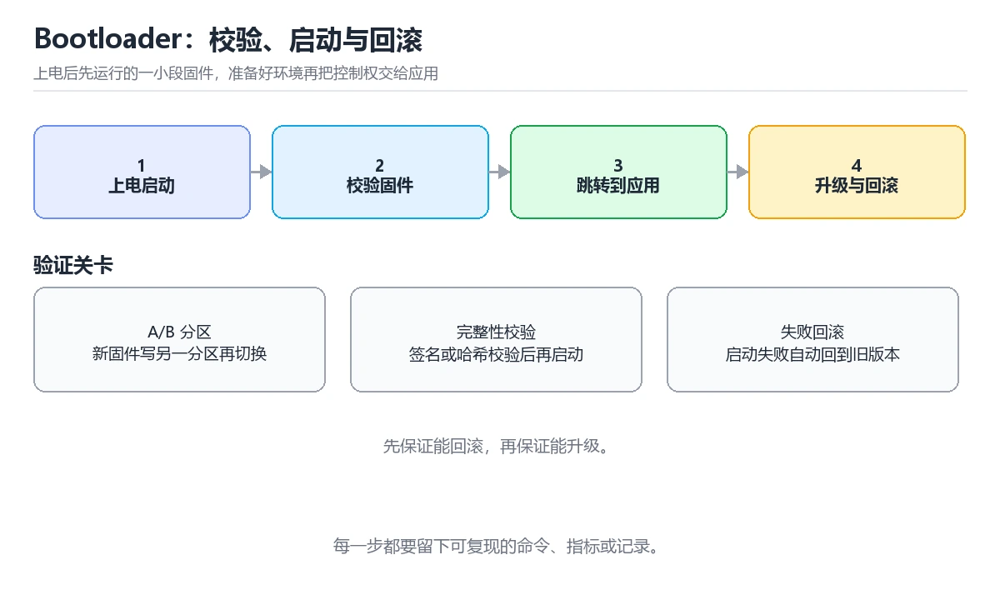

# Bootloader 与固件升级

> 内容更新时间：2026-10-06 · 学习阶段：进阶 · 预计用时：35 分钟

分类：embedded。关键词：Bootloader、固件升级、A/B 分区、镜像校验、回滚。从启动链、向量表重映射讲到镜像校验、A/B 分区与断电回滚。

学习建议：先通读《Bootloader 与固件升级》的核心知识与关键流程，再运行可运行练习并完成测验；遇到不确定的结论，回到「故障现场」按症状、根因、修复、验证四步核对。


## 学习目标

- 能画出从上电复位到应用入口的启动顺序。
- 能说明镜像校验为什么必须覆盖内容而不只是长度。
- 能设计带断电保护的 A/B 升级状态机。

## 前置知识

- 了解 Cortex-M 的中断向量表与复位流程。
- 能用 C 操作结构体与指针做内存映射访问。
- 知道 Flash 的擦写粒度与寿命限制。

## 核心知识

### 1. 启动链与跳转

Bootloader 是上电后先运行的一小段固件，它准备好环境再把控制权交给应用程序。

复位后 CPU 从向量表取初始栈指针与复位向量，Bootloader 完成时钟与 Flash 初始化、校验应用镜像、重定位向量表，最后用函数指针跳到应用入口。

在Bootloader 与固件升级里可以这样验证：在本课示例里打印当前分区与镜像版本，再从 Bootloader 跳到应用，观察串口输出的变化。

边界：跳转前必须关闭仍在工作的中断并重定向向量表，否则应用里发生的中断会落在 Bootloader 的旧表上。

工程视角：把跳转前的收尾动作写成固定顺序的一个函数，并在跳转点打印一条可追踪日志。

### 2. 镜像格式与校验

升级镜像除代码外还要带头部信息，Bootloader 靠这些信息判断能不能升级、怎么升级。

头部记录魔数、版本、长度、目标分区与 CRC 或签名，Bootloader 逐段读取并校验，全部通过后才擦除目标分区写入。

在Bootloader 与固件升级里可以这样验证：在本课示例里故意篡改镜像中的一个字节，观察校验失败并拒绝写入的完整过程。

边界：只校验长度不校验内容会放进损坏镜像，设备可能启动失败，也可能反复重启。

工程视角：把校验覆盖范围写进格式文档，签名与哈希算法版本一并记录，避免升级工具与设备实现不一致。

### 3. A/B 分区与回滚

设备保留两个可运行分区，升级写备用分区，启动成功后才把新分区标记为有效。

升级流程先写入备用槽位并标记为待验证，重启后新固件上报健康状态，确认成功才切换启动标记，失败则回到旧槽位。

在Bootloader 与固件升级里可以这样验证：在示例里模拟升级后自检失败，观察启动标记保持旧版本、设备仍然可用。

边界：没有待验证状态就直接切换启动标记，新固件启动失败后设备会停在不完整镜像上。

工程视角：把升级状态与尝试次数写进独立存储区，每次尝试记录原因码，便于现场排查。

### 4. 断电保护与升级原子性

升级中随时可能断电，状态机要保证任何时刻断电都不会让设备变砖。

把升级拆成可重入阶段，每阶段完成后落盘状态，重启后按状态继续或回退，写目标分区前不破坏当前可运行镜像。

在Bootloader 与固件升级里可以这样验证：在写镜像中途断电再上电，观察设备回到旧版本并重新发起升级。

边界：把擦除当前分区作为第一步，会让一次断电直接失去可运行镜像。

工程视角：状态写入与擦除都做掉电安全设计，关键状态存两份并带校验，读取时取有效的一份。

## 关键流程

```text
确认复位与向量表布局 → 设计镜像头部与校验字段 → 实现校验、写入与状态机 → 加入待验证与回滚标记 → 用断电注入测试验证
```

1. 确认复位与向量表布局
2. 设计镜像头部与校验字段
3. 实现校验、写入与状态机
4. 加入待验证与回滚标记
5. 用断电注入测试验证

## 动手练习

1. 画出从上电到应用入口的启动时序图，标出每一步失败时的回退目标。
2. 运行本课最小示例，篡改镜像一个字节，记录校验失败后的完整输出。
3. 把示例的 CRC 校验换成签名校验，说明多出来的密钥分发问题如何解决。

**验收标准**：记录 Bootloader 的输入、实际输出与差异解释，缺一项都不算完成。

## 常见错误与排查

> 说明：本表由《Bootloader 与固件升级》的核心知识整理（2026-10-06），人工复核进度见 docs/content_review_batches.md。

| 易错点 | 容易踩的做法 | 正确结论 |
| --- | --- | --- |
| 升级中断电变砖 | 先把当前运行分区擦掉，再写入新镜像 | 改为 A/B 或双槽位：升级只写备用槽位，启动确认后再切换启动标记 |
| 跳转后中断跑飞 | 直接跳到应用入口，既不关中断也不重定向向量表 | 跳转前关闭中断、把 VTOR 指向应用向量表，再装载栈指针跳转 |
| 损坏镜像被写入 | 只检查镜像长度是否符合预期 | 对镜像内容做 CRC 或签名校验，通过后才擦除并写入目标分区 |

## 可运行练习

### 任务 1：先跑通，再解释

```c
typedef struct {
    uint32_t magic;    // 魔数，用来快速识别合法镜像
    uint32_t version;  // 版本号，便于回滚与诊断
    uint32_t length;   // 负载长度，校验范围由它决定
    uint32_t crc;      // 负载校验值
} image_header_t;

static bool verify_image(uint32_t slot_addr, image_header_t *out) {
    const image_header_t *header = (const image_header_t *)slot_addr;
    if (header->magic != IMAGE_MAGIC || header->length == 0) return false;
    const uint8_t *payload = (const uint8_t *)(slot_addr + sizeof(image_header_t));
    if (crc32(payload, header->length) != header->crc) return false;  // 内容不一致就拒绝写入
    *out = *header;
    return true;
}

static void jump_to_app(uint32_t app_addr) {
    __disable_irq();                                  // 跳转前先关中断
    SCB->VTOR = app_addr;                             // 向量表指向应用
    uint32_t stack = *(volatile uint32_t *)app_addr;
    uint32_t entry = *(volatile uint32_t *)(app_addr + 4);
    __set_MSP(stack);
    ((void (*)(void))entry)();                        // 跳到应用复位入口
}

```

verify_image 先检查魔数与长度，再对负载算 CRC，任何一步失败都返回 false，调用方据此保持旧分区不变。jump_to_app 先关中断再重定向向量表，然后装载应用栈指针并跳转，避免应用中断落到 Bootloader 的旧向量表。

### 任务 2：只改一个条件

复制上面的示例，只改一个输入或参数再跑一次；先写下预测，再和真实输出对照，并说明差异来自Bootloader 与固件升级的哪条机制。

### 任务 3：迁移到自己的数据

把《Bootloader 与固件升级》里的示例换成你自己的一小段数据或场景，保持结构不变；如果换不动，说明还有哪条前提没有理解，回到核心知识对应小节。

## 故障现场

### 现场 1：升级中断电变砖

**症状**：在《Bootloader 与固件升级》的复现场景中，先把当前运行分区擦掉，再写入新镜像。

**根因**：当出现“升级中断电变砖”时，执行路径已经绕过了《Bootloader 与固件升级》的关键约束，最终以“先把当前运行分区擦掉，再写入新镜像”暴露出来；修复前必须先确认约束在哪里失效。

**修复**：针对《Bootloader 与固件升级》的问题，改为 A/B 或双槽位：升级只写备用槽位，启动确认后再切换启动标记。

**验证**：在《Bootloader 与固件升级》中按“改为 A/B 或双槽位：升级只写备用槽位，启动确认后再切换启动标记”调整后，从“升级中断电变砖”的触发条件重放同一条路径，确认“先把当前运行分区擦掉，再写入新镜像”不再出现，并补一个相邻边界用例检查没有引入新问题。

### 现场 2：跳转后中断跑飞

**症状**：在《Bootloader 与固件升级》的复现场景中，直接跳到应用入口，既不关中断也不重定向向量表。

**根因**：触发点是把“跳转后中断跑飞”当成安全做法。它没有满足《Bootloader 与固件升级》要求的前提，因此先表现为“直接跳到应用入口，既不关中断也不重定向向量表”；排查时先完整复现这一段，再核对输入、配置与依赖。

**修复**：针对《Bootloader 与固件升级》的问题，跳转前关闭中断、把 VTOR 指向应用向量表，再装载栈指针跳转。

**验证**：在《Bootloader 与固件升级》中按“跳转前关闭中断、把 VTOR 指向应用向量表，再装载栈指针跳转”调整后，从“跳转后中断跑飞”的触发条件重放同一条路径，确认“直接跳到应用入口，既不关中断也不重定向向量表”不再出现，并补一个相邻边界用例检查没有引入新问题。

### 现场 3：损坏镜像被写入

**症状**：在《Bootloader 与固件升级》的复现场景中，只检查镜像长度是否符合预期。

**根因**：当出现“损坏镜像被写入”时，执行路径已经绕过了《Bootloader 与固件升级》的关键约束，最终以“只检查镜像长度是否符合预期”暴露出来；修复前必须先确认约束在哪里失效。

**修复**：针对《Bootloader 与固件升级》的问题，对镜像内容做 CRC 或签名校验，通过后才擦除并写入目标分区。

**验证**：保留《Bootloader 与固件升级》里触发“只检查镜像长度是否符合预期”的输入、版本和日志，按“对镜像内容做 CRC 或签名校验，通过后才擦除并写入目标分区”完成修改后原样重放；只有失败现象消失且相邻场景仍可解释，才保留改动。

## 本课复习清单

离开本课前，逐项确认：

- [ ] 能说出跳转前必须完成的三件事：关中断、设 VTOR、装载栈指针。
- [ ] 能解释 A/B 分区为什么能抵御升级断电。
- [ ] 能写出镜像头的四个必备字段及各自作用。
- [ ] 至少运行一次 IMAGE_MAGIC 的示例，记录输入、输出和 Bootloader 的边界情况。
- [ ] 把本课最容易混淆的两个概念写成一句话对照。

| 复盘项 | 记录 |
| --- | --- |
| 已经能独立解释的考点 |  |
| 仍然说不清的概念 |  |
| 下一步验证动作 |  |

## 复习与自测

### 核心知识

遮住正文回答：Bootloader 与固件升级解决什么问题、依赖哪些前提、失败时先看哪个信号？三问都能答清楚，再进入下一节。

### 动手练习

把《Bootloader 与固件升级》里「只改一个条件」的练习再做一遍，这次先写预测再运行；预测和结果不一致的地方，就是需要回读的章节。

### 最小可运行示例

```c
typedef struct {
    uint32_t magic;    // 魔数，用来快速识别合法镜像
    uint32_t version;  // 版本号，便于回滚与诊断
    uint32_t length;   // 负载长度，校验范围由它决定
    uint32_t crc;      // 负载校验值
} image_header_t;

static bool verify_image(uint32_t slot_addr, image_header_t *out) {
    const image_header_t *header = (const image_header_t *)slot_addr;
    if (header->magic != IMAGE_MAGIC || header->length == 0) return false;
    const uint8_t *payload = (const uint8_t *)(slot_addr + sizeof(image_header_t));
    if (crc32(payload, header->length) != header->crc) return false;  // 内容不一致就拒绝写入
    *out = *header;
    return true;
}

static void jump_to_app(uint32_t app_addr) {
    __disable_irq();                                  // 跳转前先关中断
    SCB->VTOR = app_addr;                             // 向量表指向应用
    uint32_t stack = *(volatile uint32_t *)app_addr;
    uint32_t entry = *(volatile uint32_t *)(app_addr + 4);
    __set_MSP(stack);
    ((void (*)(void))entry)();                        // 跳到应用复位入口
}

```

### 预期输出

```text
verify slot A: ok version=3，verify slot B: crc mismatch，boot from slot A
```

### 验证步骤

1. 确认输入数据与运行环境和示例一致。
2. 运行示例，记录输出与耗时等可观测指标。
3. 换一个边界输入重跑，确认结论仍然成立。
4. 把两次结果写成一句话结论，注明前提与局限。

## 术语速查

先遮住右列，尝试用自己的话解释，再回到正文核对。

| 术语 | 一句话说明 |
| --- | --- |
| `Bootloader` | 上电后先执行的一小段固件，负责初始化、校验并跳转到应用。 |
| `向量表重映射` | 把异常入口表从默认地址改到应用自己的表上。 |
| `A/B 分区` | 保留两个可运行槽位，升级写备用槽位，失败可回滚。 |
| `待验证状态` | 新固件首次启动时标记为未确认，健康上报后才转正。 |
| `掉电安全` | 任何时刻断电都不破坏可运行镜像与状态的设计。 |
| `跳转` | 跳转前必须关闭仍在工作的中断并重定向向量表，否则应用里发生的中断会落在 Bootloader 的旧表上 |

## 考点精讲

### 考点 1：Bootloader 在跳转到应用前为什

题型：概念判断。题干：Bootloader 在跳转到应用前为什么必须重定向向量表？

判断要点：让应用自己的中断入口生效。向量表决定异常与中断入口地址，不重定向的话应用运行期间发生的中断会进入 Bootloader 的旧入口，典型现象是跳转后一开中断就跑飞。 正确选项「让应用自己的中断入口生效」对应《Bootloader 与固件升级》的要点「启动链与跳转」：Bootloader 是上电后先运行的一小段固件，它准备好环境再把控制权交给应用程序。判断「启动链与跳转」时先确认前提是否成立，再回到《Bootloader 与固件升级》的示例核对一次；把别的语言或框架的默认做法直接搬到启动链与跳转上，往往会在本课的边界条件里失效。

### 考点 2：镜像校验只比对长度会留下什么风险？

题型：概念判断。题干：镜像校验只比对长度会留下什么风险？

判断要点：损坏内容被当作合法镜像写入。长度相同而内容损坏的镜像可以轻松通过长度检查，只有对内容做 CRC 或签名校验才能拦住这类错误。 正确选项「损坏内容被当作合法镜像写入」对应《Bootloader 与固件升级》的要点「镜像格式与校验」：升级镜像除代码外还要带头部信息，Bootloader 靠这些信息判断能不能升级、怎么升级。判断「镜像格式与校验」时先确认前提是否成立，再回到《Bootloader 与固件升级》的示例核对一次；借鉴相邻主题的经验之前，先核对镜像格式与校验的前提是否成立。

### 考点 3：以下哪些做法能提升固件升级的可靠性？（多

题型：多选辨析。题干：以下哪些做法能提升固件升级的可靠性？（多选）

判断要点：升级只写备用槽位；写入前校验完整镜像；新固件首次启动标记为待验证。写备用槽位、先校验再写、待验证确认是可靠升级的三块基石；擦除当前运行分区会让断电直接失去可启动镜像。 正确选项「升级只写备用槽位；写入前校验完整镜像；新固件首次启动标记为待验证」对应《Bootloader 与固件升级》的要点「A/B 分区与回滚」：设备保留两个可运行分区，升级写备用分区，启动成功后才把新分区标记为有效。判断「A/B 分区与回滚」时先确认前提是否成立，再回到《Bootloader 与固件升级》的示例核对一次；记住A/B 分区与回滚的结论之外还要记住适用条件，换一个输入往往就不成立了。

### 考点 4：请按一次成功升级的典型顺序排列。

题型：顺序排列。题干：请按一次成功升级的典型顺序排列。

判断要点：接收并暂存新镜像。先把镜像收全并校验，再写备用槽位；重启由新固件自证健康后才切换启动标记，旧版本始终保留作为回滚点。 正确选项「接收并暂存新镜像；校验镜像头与内容；写入备用槽位；重启并上报健康状态；切换启动标记并保留回滚点」对应《Bootloader 与固件升级》的要点「断电保护与升级原子性」：升级中随时可能断电，状态机要保证任何时刻断电都不会让设备变砖。判断「断电保护与升级原子性」时先确认前提是否成立，再回到《Bootloader 与固件升级》的示例核对一次；干扰项常常是相邻主题里成立的结论，只有按断电保护与升级原子性的输入与约束判断才能排除。

### 考点 5：阅读这段升级状态机代码，下面哪项判断是正

题型：排错。题干：阅读这段升级状态机代码，下面哪项判断是正确的？

判断要点：状态先落盘再执行动作，重启后可以按状态继续。这段代码把状态先落盘再推进动作，任何一步断电后重启都能按状态继续或回退，且校验失败不会触碰启动标记。 正确选项「状态先落盘再执行动作，重启后可以按状态继续」对应《Bootloader 与固件升级》的要点「启动链与跳转」：Bootloader 是上电后先运行的一小段固件，它准备好环境再把控制权交给应用程序。判断「启动链与跳转」时先确认前提是否成立，再回到《Bootloader 与固件升级》的示例核对一次；把启动链与跳转的做法换到别的约束下未必成立，先确认边界再决定答案。

## English Overview

Bootloader and Firmware Update

A bootloader verifies a firmware image before handing control to the application. It checks a header with magic, version, length and checksum, remaps the vector table, and jumps with a function pointer. Reliable field updates use two slots: the new image goes to the spare slot, boots as unverified, and is confirmed only after a health report. Any power loss must leave one runnable image.



## 本课小结

- Bootloader 与固件升级围绕Bootloader、固件升级、A/B 分区展开，先建立基线再讨论优化。
- Bootloader 是上电后先运行的一小段固件，它准备好环境再把控制权交给应用程序。
- 处理 Bootloader 的问题时按「症状 → 根因 → 修复 → 验证」的顺序推进，不跳过验证。

## 内容元数据

- 内容版本：v2.0
- 最后更新：2026-10-06
- 学习阶段：进阶

| 字段 | 值 |
| --- | --- |
| 课程 ID | `embedded_bootloader` |
| 所属分类 | `embedded` |
| 难度 | 进阶 |
| 预计用时 | 40 分钟 |
| 关键词 | Bootloader、固件升级、A/B 分区、镜像校验、回滚 |
| 配图 | `images/lesson_embedded_bootloader.webp` |
| 参考资料 | 2 条 |
| 内容更新时间 | 2026-10-06 |

## 参考资料与复核

- 最后复核：2026-10-04
- 下次复核：2027-01-24
- 复核范围：版本兼容、API 行为与工程实践

下面列出的资料用于核对本课结论，复习时可以对照阅读：
- [MCUboot 官方文档](https://docs.mcuboot.com/)
- [Zephyr 设备管理（DFU）文档](https://docs.zephyrproject.org/latest/services/device_mgmt/index.html)

> 复核提示：《Bootloader 与固件升级》的结论如与资料冲突，以资料中的规范文本为准，并在笔记里记录差异与日期。

## 复习与迁移

### 概念复述

不看正文，把Bootloader 与固件升级讲给一个没学过的同事：先讲它解决什么问题，再讲一个最小例子，最后说明一个不适用场景。

### 测验回顾

回到《Bootloader 与固件升级》测验，只重做答错或犹豫的题；对每道题写一句「我为什么改选这个答案」，写不出理由就回到对应小节。

### 迁移练习

把《Bootloader 与固件升级》的方法用到一个你自己的真实场景：说明输入、约束与验证方式，并列出仍然不确定、需要下一次实验回答的问题。

## 深度拓展与实战

这一节把Bootloader 与固件升级的机制拆开验证：每一步都给出输入、判断标准和失败信号，便于在真实项目里复用。

### 机制拆解 1：启动链与跳转

复位后 CPU 从向量表取初始栈指针与复位向量，Bootloader 完成时钟与 Flash 初始化、校验应用镜像、重定位向量表，最后用函数指针跳到应用入口。

落地时先确认前提：跳转前必须关闭仍在工作的中断并重定向向量表，否则应用里发生的中断会落在 Bootloader 的旧表上。；再把结论写进检查表，让下一位同学可以按同样的输入复现。

工程做法：把跳转前的收尾动作写成固定顺序的一个函数，并在跳转点打印一条可追踪日志。

### 机制拆解 2：镜像格式与校验

头部记录魔数、版本、长度、目标分区与 CRC 或签名，Bootloader 逐段读取并校验，全部通过后才擦除目标分区写入。

落地时先确认前提：只校验长度不校验内容会放进损坏镜像，设备可能启动失败，也可能反复重启。；再把结论写进检查表，让下一位同学可以按同样的输入复现。

工程做法：把校验覆盖范围写进格式文档，签名与哈希算法版本一并记录，避免升级工具与设备实现不一致。

### 机制拆解 3：A/B 分区与回滚

升级流程先写入备用槽位并标记为待验证，重启后新固件上报健康状态，确认成功才切换启动标记，失败则回到旧槽位。

落地时先确认前提：没有待验证状态就直接切换启动标记，新固件启动失败后设备会停在不完整镜像上。；再把结论写进检查表，让下一位同学可以按同样的输入复现。

工程做法：把升级状态与尝试次数写进独立存储区，每次尝试记录原因码，便于现场排查。

### 机制拆解 4：断电保护与升级原子性

把升级拆成可重入阶段，每阶段完成后落盘状态，重启后按状态继续或回退，写目标分区前不破坏当前可运行镜像。

落地时先确认前提：把擦除当前分区作为第一步，会让一次断电直接失去可运行镜像。；再把结论写进检查表，让下一位同学可以按同样的输入复现。

工程做法：状态写入与擦除都做掉电安全设计，关键状态存两份并带校验，读取时取有效的一份。

### 机制对照表

| 概念 | 解决什么问题 | 关键前提 | 失败信号 |
| --- | --- | --- | --- |
| 启动链与跳转 | Bootloader 是上电后先运行的一小段固件，它准备好环境再把控制权交给应用 | 跳转前必须关闭仍在工作的中断并重定向向量表，否则应用里发生的中断会落在  | 把跳转前的收尾动作写成固定顺序的一个函数，并在跳转点打印一条可追踪日志。 |
| 镜像格式与校验 | 升级镜像除代码外还要带头部信息，Bootloader 靠这些信息判断能不能升级、 | 只校验长度不校验内容会放进损坏镜像，设备可能启动失败，也可能反复重启。 | 把校验覆盖范围写进格式文档，签名与哈希算法版本一并记录，避免升级工具与设 |
| A/B 分区与回滚 | 设备保留两个可运行分区，升级写备用分区，启动成功后才把新分区标记为有效。 | 没有待验证状态就直接切换启动标记，新固件启动失败后设备会停在不完整镜像上 | 把升级状态与尝试次数写进独立存储区，每次尝试记录原因码，便于现场排查。 |
| 断电保护与升级原子性 | 升级中随时可能断电，状态机要保证任何时刻断电都不会让设备变砖。 | 把擦除当前分区作为第一步，会让一次断电直接失去可运行镜像。 | 状态写入与擦除都做掉电安全设计，关键状态存两份并带校验，读取时取有效的一 |

### 自测问答

**问 1**：Bootloader 在跳转到应用前为什么必须重定向向量表？

**答**：让应用自己的中断入口生效。向量表决定异常与中断入口地址，不重定向的话应用运行期间发生的中断会进入 Bootloader 的旧入口，典型现象是跳转后一开中断就跑飞。 正确选项「让应用自己的中断入口生效」对应《Bootloader 与固件升级》的要点「启动链与跳转」：Bootloader 是上电后先运行的一小段固件，它准备好环境再把控制权交给应用程序。判断「启动链与跳转」时先确认前提是否成立，再回到《Bootloader 与固件升级》的示例核对一次；把别的语言或框架的默认做法直接搬到启动链与跳转上，往往会在本课的边界条件里失效。

**问 2**：镜像校验只比对长度会留下什么风险？

**答**：损坏内容被当作合法镜像写入。长度相同而内容损坏的镜像可以轻松通过长度检查，只有对内容做 CRC 或签名校验才能拦住这类错误。 正确选项「损坏内容被当作合法镜像写入」对应《Bootloader 与固件升级》的要点「镜像格式与校验」：升级镜像除代码外还要带头部信息，Bootloader 靠这些信息判断能不能升级、怎么升级。判断「镜像格式与校验」时先确认前提是否成立，再回到《Bootloader 与固件升级》的示例核对一次；借鉴相邻主题的经验之前，先核对镜像格式与校验的前提是否成立。

**问 3**：以下哪些做法能提升固件升级的可靠性？（多选）

**答**：升级只写备用槽位；写入前校验完整镜像；新固件首次启动标记为待验证。写备用槽位、先校验再写、待验证确认是可靠升级的三块基石；擦除当前运行分区会让断电直接失去可启动镜像。 正确选项「升级只写备用槽位；写入前校验完整镜像；新固件首次启动标记为待验证」对应《Bootloader 与固件升级》的要点「A/B 分区与回滚」：设备保留两个可运行分区，升级写备用分区，启动成功后才把新分区标记为有效。判断「A/B 分区与回滚」时先确认前提是否成立，再回到《Bootloader 与固件升级》的示例核对一次；记住A/B 分区与回滚的结论之外还要记住适用条件，换一个输入往往就不成立了。

**问 4**：请按一次成功升级的典型顺序排列。

**答**：接收并暂存新镜像。先把镜像收全并校验，再写备用槽位；重启由新固件自证健康后才切换启动标记，旧版本始终保留作为回滚点。 正确选项「接收并暂存新镜像；校验镜像头与内容；写入备用槽位；重启并上报健康状态；切换启动标记并保留回滚点」对应《Bootloader 与固件升级》的要点「断电保护与升级原子性」：升级中随时可能断电，状态机要保证任何时刻断电都不会让设备变砖。判断「断电保护与升级原子性」时先确认前提是否成立，再回到《Bootloader 与固件升级》的示例核对一次；干扰项常常是相邻主题里成立的结论，只有按断电保护与升级原子性的输入与约束判断才能排除。

**问 5**：阅读这段升级状态机代码，下面哪项判断是正确的？

**答**：状态先落盘再执行动作，重启后可以按状态继续。这段代码把状态先落盘再推进动作，任何一步断电后重启都能按状态继续或回退，且校验失败不会触碰启动标记。 正确选项「状态先落盘再执行动作，重启后可以按状态继续」对应《Bootloader 与固件升级》的要点「启动链与跳转」：Bootloader 是上电后先运行的一小段固件，它准备好环境再把控制权交给应用程序。判断「启动链与跳转」时先确认前提是否成立，再回到《Bootloader 与固件升级》的示例核对一次；把启动链与跳转的做法换到别的约束下未必成立，先确认边界再决定答案。

### 排错速查

- 看到「先把当前运行分区擦掉，再写入新镜像」时，先按「改为 A/B 或双槽位：升级只写备用槽位，启动确认后再切换启动标记」处理，再用Bootloader 与固件升级的最小示例确认结论是否恢复。
- 看到「直接跳到应用入口，既不关中断也不重定向向量表」时，先按「跳转前关闭中断、把 VTOR 指向应用向量表，再装载栈指针跳转」处理，再用Bootloader 与固件升级的最小示例确认结论是否恢复。
- 看到「只检查镜像长度是否符合预期」时，先按「对镜像内容做 CRC 或签名校验，通过后才擦除并写入目标分区」处理，再用Bootloader 与固件升级的最小示例确认结论是否恢复。

### 工程检查表

- [ ] 确认复位与向量表布局
- [ ] 设计镜像头部与校验字段
- [ ] 实现校验、写入与状态机
- [ ] 加入待验证与回滚标记
- [ ] 用断电注入测试验证
- [ ] 【启动链与跳转】把跳转前的收尾动作写成固定顺序的一个函数，并在跳转点打印一条可追踪日志。
- [ ] 【镜像格式与校验】把校验覆盖范围写进格式文档，签名与哈希算法版本一并记录，避免升级工具与设备实现不一致。
- [ ] 【A/B 分区与回滚】把升级状态与尝试次数写进独立存储区，每次尝试记录原因码，便于现场排查。
- [ ] 【断电保护与升级原子性】状态写入与擦除都做掉电安全设计，关键状态存两份并带校验，读取时取有效的一份。

### 迁移练习

把Bootloader 与固件升级的方法用到一个真实场景：写下Bootloader、固件升级、A/B 分区在你的场景里分别对应什么，再记录一次失败尝试和它的恢复步骤。

### 延伸阅读与下一步

- 复习Bootloader、固件升级、A/B 分区、镜像校验、回滚时，优先回看「启动链与跳转」与「断电保护与升级原子性」两节。
- 把从「确认复位与向量表布局」到「用断电注入测试验证」的流程画成一张图，放进自己的笔记。
- 一周后重做本课测验，只把答错的题留到下一轮复习。

### 结论与下一步

学完Bootloader 与固件升级，应该能独立完成三件事：先用最小示例确认Bootloader的行为，再用一个边界输入验证结论，最后把失败路径写成可重复的检查。下一步把本课术语加入复习清单，并在两周内用一次真实任务检验记忆是否牢固。

