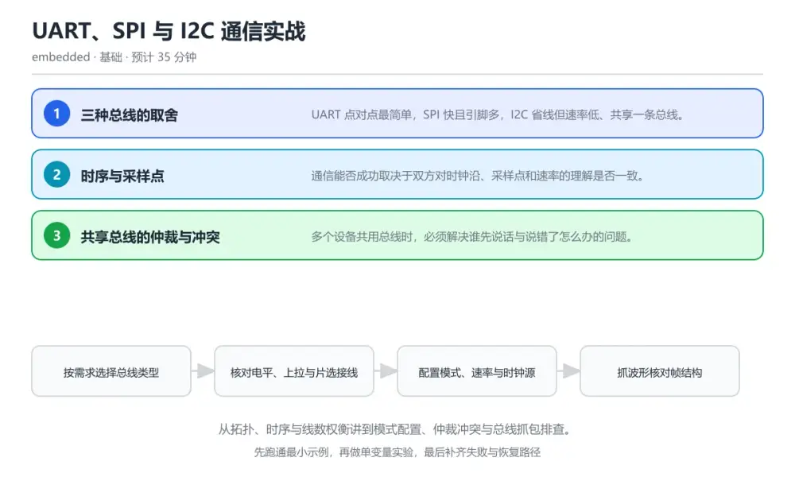
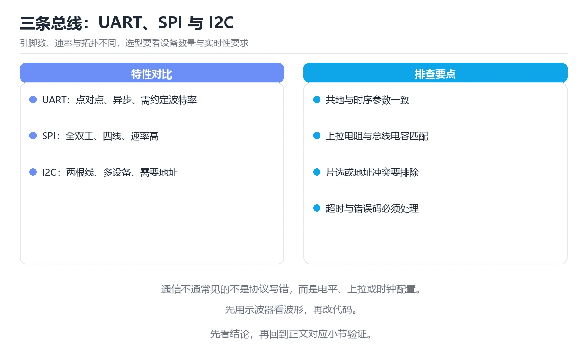

# UART、SPI 与 I2C 通信实战

> 内容更新时间：2026-10-06 · 学习阶段：基础 · 预计用时：60 分钟

分类：embedded。关键词：UART、SPI、I2C、时序、总线抓包。从拓扑、时序与线数权衡讲到模式配置、仲裁冲突与总线抓包排查。

学习建议：先通读《UART、SPI 与 I2C 通信实战》的核心知识与关键流程，再运行可运行练习并完成测验；遇到不确定的结论，回到「故障现场」按症状、根因、修复、验证四步核对。



## 学习目标

- 能按距离、速率与引脚数在 UART、SPI、I2C 之间做出选择。
- 能解释波特率误差、CPOL/CPHA 与开漏上拉对通信的影响。
- 能用逻辑分析仪定位一次真实的通信失败。

## 前置知识

- 知道数字电平、上拉电阻与推挽输出的大致含义。
- 能看懂寄存器时序图里的时钟沿与采样点。
- 会用示波器或逻辑分析仪抓一段波形。

## 核心知识

### 1. 三种总线的取舍

UART 点对点最简单，SPI 快且引脚多，I2C 省线但速率低、共享一条总线。

UART 用起始位与波特率对齐双方，SPI 用时钟与片选同步移位，I2C 用两根线与地址区分从机，靠开漏加外部上拉实现线与。

在UART、SPI 与 I2C 通信实战里可以这样验证：在本课示例里用同一块板子分别接串口模块、Flash 与传感器，记录三种连线与实测速率。

边界：I2C 速率受上拉电阻与总线电容限制，线拉长或上拉过大时波形上升沿变缓，通信随机失败。

工程视角：选型时把速率、线数、距离与从机数量列成表，把最终选择与理由写进硬件说明。

### 2. 时序与采样点

通信能否成功取决于双方对时钟沿、采样点和速率的理解是否一致。

SPI 用 CPOL 与 CPHA 定义空闲电平与采样沿，I2C 在时钟高电平期间数据必须稳定，UART 在起始位下降沿后按约定节拍逐位采样。

在UART、SPI 与 I2C 通信实战里可以这样验证：在本课示例里把 SPI 模式从 0 改到 3，观察从机读回的数据变成全 0 或全 1。

边界：UART 波特率误差超过约百分之二到三就可能错位，内部 RC 时钟在温度变化时会进一步放大误差。

工程视角：把每条总线的模式、速率与时钟源写进配置表，抓包时先核对配置再怀疑硬件。

### 3. 共享总线的仲裁与冲突

多个设备共用总线时，必须解决谁先说话与说错了怎么办的问题。

I2C 通过线与检测实现仲裁与时钟同步，SPI 靠独立片选避免冲突，UART 多机场景需要协议层加地址或令牌。

在UART、SPI 与 I2C 通信实战里可以这样验证：在本课示例里让两个主机同时发起 I2C 传输，观察仲裁失败一方自动退出并重试。

边界：SPI 忘记拉低片选或片选接错，会让两个从机同时驱动数据线，读出不可预测的数据。

工程视角：给每个从机分配固定片选与地址表，把总线占用与错误计数做成日志指标。

## 关键流程

```text
按需求选择总线类型 → 核对电平、上拉与片选接线 → 配置模式、速率与时钟源 → 抓波形核对帧结构 → 把失败案例归档进排查表
```

1. 按需求选择总线类型
2. 核对电平、上拉与片选接线
3. 配置模式、速率与时钟源
4. 抓波形核对帧结构
5. 把失败案例归档进排查表

## 动手练习

1. 用逻辑分析仪抓一段 UART 波形，按起始位与波特率手工解出一个字节。
2. 把 SPI 模式从 0 改到 3，记录从机返回值变化并解释原因。
3. 给 I2C 总线换上不同阻值的上拉，记录通信成功率与波形上升时间。

**验收标准**：留下 HAL_I2C_Master_Transmit 的输入、命令、输出和结论，让别人能按记录复现。

## 常见错误与排查

> 说明：本表由《UART、SPI 与 I2C 通信实战》的核心知识整理（2026-10-06），人工复核进度见 docs/content_review_batches.md。

| 易错点 | 容易踩的做法 | 正确结论 |
| --- | --- | --- |
| I2C 随机通信失败 | 总线上没有上拉电阻，或上拉阻值过大 | 按速率与总线电容选 2.2k 到 10k 的上拉，抓波形确认上升时间满足时序要求 |
| SPI 读出全 0 或全 1 | 主机与从机的 CPOL、CPHA 组合不一致 | 对照从机手册设置 SPI 模式与位序，用逻辑分析仪核对采样沿上的数据 |
| 串口出现帧错误 | 双方波特率误差累计超过容限 | 核对双方波特率与时钟源，优先使用晶振或带校准的时钟，必要时降低速率 |

## 可运行练习

### 任务 1：先跑通，再解释

```c
#define SENSOR_ADDR 0x48

// I2C 读寄存器：先写寄存器号，再重启传输读回数据
static bool sensor_read_reg(uint8_t reg, uint8_t *value) {
    if (HAL_I2C_Master_Transmit(&hi2c1, SENSOR_ADDR << 1, &reg, 1, 20) != HAL_OK) {
        log_error("i2c write addr failed");
        return false;
    }
    if (HAL_I2C_Master_Receive(&hi2c1, (SENSOR_ADDR << 1) | 1, value, 1, 20) != HAL_OK) {
        log_error("i2c read addr failed");
        return false;
    }
    return true;
}

// SPI 读 ID：片选拉低期间收发，结束必须拉高
static uint8_t flash_read_id(void) {
    uint8_t cmd = 0x9F, id = 0;
    HAL_GPIO_WritePin(FLASH_CS_GPIO_Port, FLASH_CS_Pin, GPIO_PIN_RESET);
    HAL_SPI_TransmitReceive(&hspi1, &cmd, &id, 1, 50);
    HAL_GPIO_WritePin(FLASH_CS_GPIO_Port, FLASH_CS_Pin, GPIO_PIN_SET);
    return id;
}

```

sensor_read_reg 用「写寄存器地址再读数据」的两段式访问，每段都设置了超时，失败时记录是写还是读阶段出错。flash_read_id 在片选有效期间收发一个字节，结束后立即释放片选，避免与其它从机冲突。

### 任务 2：只改一个条件

复制上面的示例，只改一个输入或参数再跑一次；先写下预测，再和真实输出对照，并说明差异来自UART、SPI 与 I2C 通信实战的哪条机制。

### 任务 3：迁移到自己的数据

把《UART、SPI 与 I2C 通信实战》里的示例换成你自己的一小段数据或场景，保持结构不变；如果换不动，说明还有哪条前提没有理解，回到核心知识对应小节。

## 项目专属规格

### 交付目标

从拓扑、时序与线数权衡讲到模式配置、仲裁冲突与总线抓包排查。

### 里程碑

1. 按需求选择总线类型
2. 核对电平、上拉与片选接线
3. 配置模式、速率与时钟源
4. 抓波形核对帧结构
5. 把失败案例归档进排查表

### 输入与约束

- 输入：用逻辑分析仪抓一段 UART 波形，按起始位与波特率手工解出一个字节。
- 约束：I2C 速率受上拉电阻与总线电容限制，线拉长或上拉过大时波形上升沿变缓，通信随机失败。
- 失败预算：按速率与总线电容选 2.2k 到 10k 的上拉，抓波形确认上升时间满足时序要求

### 验收场景

1. 正常路径：跑通「可运行练习」里的最小示例并保存输出。
2. 边界路径：在本课示例里用同一块板子分别接串口模块、Flash 与传感器，记录三种连线与实测速率。
3. 失败路径：出现「总线上没有上拉电阻，或上拉阻值过大」时按上面的失败预算恢复。

## 项目交付物

- 可运行代码：包含c源文件、依赖说明与启动入口。
- README：环境版本、启动命令、目录结构与已知限制。
- 测试记录：UART 的正常、边界与失败路径各至少一条，附命令与输出。
- 复盘记录：记录 UART 与 SPI 的对比结论，并给出下一步验证动作。

### 交付验收清单

- [ ] 能按距离、速率与引脚数在 UART、SPI、I2C 之间做出选择。
- [ ] 能解释波特率误差、CPOL/CPHA 与开漏上拉对通信的影响。
- [ ] 能用逻辑分析仪定位一次真实的通信失败。

## 验证命令与预期输出

| 步骤 | 命令 | 预期输出 |
| --- | --- | --- |
| 准备环境 | 按 README 安装依赖 | 依赖安装完成且没有版本冲突 |
| 运行示例 | 运行「可运行练习」中的入口 | i2c write addr failed（拔掉上拉时），flash id = 0xEF |
| 边界输入 | 替换一个输入后重跑 | 结果仍能被正文机制解释 |
| 失败演练 | 按「故障现场」制造一次失败 | 能定位根因并恢复到正常输出 |

### 验收证据

- [ ] 保存一次成功运行的完整输出。
- [ ] 保存一次边界输入的输出与解释。
- [ ] 记录一次失败现象、根因与修复动作。

> 项目目标：UART、SPI 与 I2C 通信实战 的每一步都要能复现，做不到复现就先缩小范围。

## 故障现场

### 现场 1：I2C 随机通信失败

**症状**：在《UART、SPI 与 I2C 通信实战》的复现场景中，总线上没有上拉电阻，或上拉阻值过大。

**根因**：触发点是把“I2C 随机通信失败”当成安全做法。它没有满足《UART、SPI 与 I2C 通信实战》要求的前提，因此先表现为“总线上没有上拉电阻，或上拉阻值过大”；排查时先完整复现这一段，再核对输入、配置与依赖。

**修复**：针对《UART、SPI 与 I2C 通信实战》的问题，按速率与总线电容选 2.2k 到 10k 的上拉，抓波形确认上升时间满足时序要求。

**验证**：先在《UART、SPI 与 I2C 通信实战》中记录“I2C 随机通信失败”留下的失败证据，再执行“按速率与总线电容选 2.2k 到 10k 的上拉，抓波形确认上升时间满足时序要求”并重放；确认错误路径变为明确结果，且修复没有掩盖同类故障。

### 现场 2：SPI 读出全 0 或全 1

**症状**：在《UART、SPI 与 I2C 通信实战》的复现场景中，主机与从机的 CPOL、CPHA 组合不一致。

**根因**：“主机与从机的 CPOL、CPHA 组合不一致”只是表层结果。向上追溯会落到“SPI 读出全 0 或全 1”这一步，因为它省略了《UART、SPI 与 I2C 通信实战》的约束，使实现行为和预期模型发生了偏离。

**修复**：针对《UART、SPI 与 I2C 通信实战》的问题，对照从机手册设置 SPI 模式与位序，用逻辑分析仪核对采样沿上的数据。

**验证**：先在《UART、SPI 与 I2C 通信实战》中记录“SPI 读出全 0 或全 1”留下的失败证据，再执行“对照从机手册设置 SPI 模式与位序，用逻辑分析仪核对采样沿上的数据”并重放；确认错误路径变为明确结果，且修复没有掩盖同类故障。

### 现场 3：串口出现帧错误

**症状**：在《UART、SPI 与 I2C 通信实战》的复现场景中，双方波特率误差累计超过容限。

**根因**：触发点是把“串口出现帧错误”当成安全做法。它没有满足《UART、SPI 与 I2C 通信实战》要求的前提，因此先表现为“双方波特率误差累计超过容限”；排查时先完整复现这一段，再核对输入、配置与依赖。

**修复**：针对《UART、SPI 与 I2C 通信实战》的问题，核对双方波特率与时钟源，优先使用晶振或带校准的时钟，必要时降低速率。

**验证**：在《UART、SPI 与 I2C 通信实战》中按“核对双方波特率与时钟源，优先使用晶振或带校准的时钟，必要时降低速率”调整后，从“串口出现帧错误”的触发条件重放同一条路径，确认“双方波特率误差累计超过容限”不再出现，并补一个相邻边界用例检查没有引入新问题。

## 本课复习清单

离开本课前，逐项确认：

- [ ] 能根据距离、速率与从机数量说出三种总线的取舍。
- [ ] 能解释波特率误差与 CPOL/CPHA 不匹配分别导致什么现象。
- [ ] 能列出一次总线抓包要看的三件事：电平、时序、帧结构。
- [ ] 用 UART 构造一个正常输入和一个边界输入，分别记录输出与判断依据。
- [ ] 把本课最容易混淆的两个概念写成一句话对照。

| 复盘项 | 记录 |
| --- | --- |
| 已经能独立解释的考点 |  |
| 仍然说不清的概念 |  |
| 下一步验证动作 |  |

## 复习与自测

### 核心知识

遮住正文回答：UART、SPI 与 I2C 通信实战解决什么问题、依赖哪些前提、失败时先看哪个信号？三问都能答清楚，再进入下一节。

### 动手练习

把《UART、SPI 与 I2C 通信实战》里「只改一个条件」的练习再做一遍，这次先写预测再运行；预测和结果不一致的地方，就是需要回读的章节。

### 最小可运行示例

```c
#define SENSOR_ADDR 0x48

// I2C 读寄存器：先写寄存器号，再重启传输读回数据
static bool sensor_read_reg(uint8_t reg, uint8_t *value) {
    if (HAL_I2C_Master_Transmit(&hi2c1, SENSOR_ADDR << 1, &reg, 1, 20) != HAL_OK) {
        log_error("i2c write addr failed");
        return false;
    }
    if (HAL_I2C_Master_Receive(&hi2c1, (SENSOR_ADDR << 1) | 1, value, 1, 20) != HAL_OK) {
        log_error("i2c read addr failed");
        return false;
    }
    return true;
}

// SPI 读 ID：片选拉低期间收发，结束必须拉高
static uint8_t flash_read_id(void) {
    uint8_t cmd = 0x9F, id = 0;
    HAL_GPIO_WritePin(FLASH_CS_GPIO_Port, FLASH_CS_Pin, GPIO_PIN_RESET);
    HAL_SPI_TransmitReceive(&hspi1, &cmd, &id, 1, 50);
    HAL_GPIO_WritePin(FLASH_CS_GPIO_Port, FLASH_CS_Pin, GPIO_PIN_SET);
    return id;
}

```

### 预期输出

```text
i2c write addr failed（拔掉上拉时），flash id = 0xEF
```

### 验证步骤

1. 确认输入数据与运行环境和示例一致。
2. 运行示例，记录输出与耗时等可观测指标。
3. 换一个边界输入重跑，确认结论仍然成立。
4. 把两次结果写成一句话结论，注明前提与局限。

## 术语速查

先遮住右列，尝试用自己的话解释，再回到正文核对。

| 术语 | 一句话说明 |
| --- | --- |
| `波特率` | 串口每秒传输的符号数，双方必须在容差内一致。 |
| `CPOL/CPHA` | SPI 时钟空闲电平与采样沿的四种组合。 |
| `开漏输出` | 引脚只能拉低不能拉高，需要外部上拉形成高电平。 |
| `线与` | 多设备共享一根线，任一设备拉低整线即为低。 |
| `片选` | SPI 用来指定当前通信从机的专用信号。 |

## 考点精讲

### 考点 1：在长排线、多从机、速率要求不高的场景里更

题型：概念判断。题干：在长排线、多从机、速率要求不高的场景里更合适的总线是？

判断要点：I2C。I2C 只用两根线就能挂多个从机，代价是速率与总线电容受限，适合速度不高、设备较多的场合。 正确选项「I2C」对应《UART、SPI 与 I2C 通信实战》的要点「三种总线的取舍」：UART 点对点最简单，SPI 快且引脚多，I2C 省线但速率低、共享一条总线。判断「三种总线的取舍」时先确认前提是否成立，再回到《UART、SPI 与 I2C 通信实战》的示例核对一次；把别的语言或框架的默认做法直接搬到三种总线的取舍上，往往会在本课的边界条件里失效。

### 考点 2：SPI 通信中片选信号的作用是？

题型：概念判断。题干：SPI 通信中片选信号的作用是？

判断要点：指定当前与主机通信的从机。SPI 没有地址概念，靠每个从机独立的片选信号决定谁响应时钟，片选接错或忘记拉高就会与其它从机冲突。 正确选项「指定当前与主机通信的从机」对应《UART、SPI 与 I2C 通信实战》的要点「时序与采样点」：通信能否成功取决于双方对时钟沿、采样点和速率的理解是否一致。判断「时序与采样点」时先确认前提是否成立，再回到《UART、SPI 与 I2C 通信实战》的示例核对一次；借鉴相邻主题的经验之前，先核对时序与采样点的前提是否成立。

### 考点 3：以下哪些现象提示需要检查 I2C 上拉电

题型：多选辨析。题干：以下哪些现象提示需要检查 I2C 上拉电阻？（多选）

判断要点：波形上升沿明显变缓；通信在固定地址处随机失败；空载时总线高电平正常但接上设备就异常。上升沿变缓、负载增加后失败都是总线电容与上拉不匹配的典型症状；SPI 返回全 0 与 I2C 上拉无关。 正确选项「波形上升沿明显变缓；通信在固定地址处随机失败；空载时总线高电平正常但接上设备就异常」对应《UART、SPI 与 I2C 通信实战》的要点「共享总线的仲裁与冲突」：多个设备共用总线时，必须解决谁先说话与说错了怎么办的问题。判断「共享总线的仲裁与冲突」时先确认前提是否成立，再回到《UART、SPI 与 I2C 通信实战》的示例核对一次；记住共享总线的仲裁与冲突的结论之外还要记住适用条件，换一个输入往往就不成立了。

### 考点 4：请按一次 I2C 寄存器读取的顺序排列。

题型：顺序排列。题干：请按一次 I2C 寄存器读取的顺序排列。

判断要点：发起起始条件并发送从机地址加写位。两段式访问先以写方向定位寄存器，再用重启条件切到读方向收数据，最后以非应答加停止条件结束，顺序错了会读到错误寄存器。 正确选项「发起起始条件并发送从机地址加写位；发送寄存器地址并等待应答；重启传输并发送地址加读位；接收数据并回送非应答；产生停止条件释放总线」对应《UART、SPI 与 I2C 通信实战》的要点「三种总线的取舍」：UART 点对点最简单，SPI 快且引脚多，I2C 省线但速率低、共享一条总线。判断「三种总线的取舍」时先确认前提是否成立，再回到《UART、SPI 与 I2C 通信实战》的示例核对一次；干扰项常常是相邻主题里成立的结论，只有按三种总线的取舍的输入与约束判断才能排除。

### 考点 5：阅读这段总线初始化代码，主要问题是什么？

题型：排错。题干：阅读这段总线初始化代码，主要问题是什么？

判断要点：SPI 从机片选与 I2C 复用同一引脚，容易互相干扰。同一引脚既参与 I2C 又充当 SPI 片选，两条总线同时工作时会互相把线拉低，表现为随机通信失败；应先从引脚分配上把它们分开。 正确选项「SPI 从机片选与 I2C 复用同一引脚，容易互相干扰」对应《UART、SPI 与 I2C 通信实战》的要点「时序与采样点」：通信能否成功取决于双方对时钟沿、采样点和速率的理解是否一致。判断「时序与采样点」时先确认前提是否成立，再回到《UART、SPI 与 I2C 通信实战》的示例核对一次；把时序与采样点的做法换到别的约束下未必成立，先确认边界再决定答案。

## English Overview

UART, SPI and I2C in Practice

UART, SPI and I2C trade wiring, speed and complexity differently. UART aligns two peers with a start bit and a baud rate. SPI shifts bits against a clock and selects a slave with a chip-select line. I2C shares two open-drain wires with pull-up resistors, so bus capacitance and rise time limit speed. Most field failures trace back to a wrong mode, a missing pull-up or a mis-wired chip select.



## 本课小结

- UART、SPI 与 I2C 通信实战围绕UART、SPI、I2C展开，先建立基线再讨论优化。
- UART 点对点最简单，SPI 快且引脚多，I2C 省线但速率低、共享一条总线。
- HAL_I2C_Master_Transmit 出错时先记录症状，再定位根因，最后用一次复跑确认修复。

## 内容元数据

- 内容版本：v2.0
- 最后更新：2026-10-06
- 学习阶段：基础

| 字段 | 值 |
| --- | --- |
| 课程 ID | `embedded_bus_protocols` |
| 所属分类 | `embedded` |
| 难度 | 基础 |
| 预计用时 | 35 分钟 |
| 关键词 | UART、SPI、I2C、时序、总线抓包 |
| 配图 | `images/lesson_embedded_bus_protocols.webp` |
| 参考资料 | 2 条 |
| 内容更新时间 | 2026-10-06 |

## 参考资料与复核

- 最后复核：2026-10-04
- 下次复核：2027-02-17
- 复核范围：版本兼容、API 行为与工程实践

下面列出的资料用于核对本课结论，复习时可以对照阅读：
- [NXP I2C 总线规范与用户手册](https://www.nxp.com/docs/en/user-guide/UM10204.pdf)
- [TI 串行通信协议对比应用笔记](https://www.ti.com/lit/an/sbaa565/sbaa565.pdf)

> 复核提示：《UART、SPI 与 I2C 通信实战》的结论如与资料冲突，以资料中的规范文本为准，并在笔记里记录差异与日期。

## 复习与迁移

### 概念复述

不看正文，把UART、SPI 与 I2C 通信实战讲给一个没学过的同事：先讲它解决什么问题，再讲一个最小例子，最后说明一个不适用场景。

### 测验回顾

回到《UART、SPI 与 I2C 通信实战》测验，只重做答错或犹豫的题；对每道题写一句「我为什么改选这个答案」，写不出理由就回到对应小节。

### 迁移练习

把《UART、SPI 与 I2C 通信实战》的方法用到一个你自己的真实场景：说明输入、约束与验证方式，并列出仍然不确定、需要下一次实验回答的问题。

## 深度拓展与实战

这一节把UART、SPI 与 I2C 通信实战的机制拆开验证：每一步都给出输入、判断标准和失败信号，便于在真实项目里复用。

### 机制拆解 1：三种总线的取舍

UART 用起始位与波特率对齐双方，SPI 用时钟与片选同步移位，I2C 用两根线与地址区分从机，靠开漏加外部上拉实现线与。

落地时先确认前提：I2C 速率受上拉电阻与总线电容限制，线拉长或上拉过大时波形上升沿变缓，通信随机失败。；再把结论写进检查表，让下一位同学可以按同样的输入复现。

工程做法：选型时把速率、线数、距离与从机数量列成表，把最终选择与理由写进硬件说明。

### 机制拆解 2：时序与采样点

SPI 用 CPOL 与 CPHA 定义空闲电平与采样沿，I2C 在时钟高电平期间数据必须稳定，UART 在起始位下降沿后按约定节拍逐位采样。

落地时先确认前提：UART 波特率误差超过约百分之二到三就可能错位，内部 RC 时钟在温度变化时会进一步放大误差。；再把结论写进检查表，让下一位同学可以按同样的输入复现。

工程做法：把每条总线的模式、速率与时钟源写进配置表，抓包时先核对配置再怀疑硬件。

### 机制拆解 3：共享总线的仲裁与冲突

I2C 通过线与检测实现仲裁与时钟同步，SPI 靠独立片选避免冲突，UART 多机场景需要协议层加地址或令牌。

落地时先确认前提：SPI 忘记拉低片选或片选接错，会让两个从机同时驱动数据线，读出不可预测的数据。；再把结论写进检查表，让下一位同学可以按同样的输入复现。

工程做法：给每个从机分配固定片选与地址表，把总线占用与错误计数做成日志指标。

### 机制对照表

| 概念 | 解决什么问题 | 关键前提 | 失败信号 |
| --- | --- | --- | --- |
| 三种总线的取舍 | UART 点对点最简单，SPI 快且引脚多，I2C 省线但速率低、共享一条总线。 | I2C 速率受上拉电阻与总线电容限制，线拉长或上拉过大时波形上升沿变缓， | 选型时把速率、线数、距离与从机数量列成表，把最终选择与理由写进硬件说明。 |
| 时序与采样点 | 通信能否成功取决于双方对时钟沿、采样点和速率的理解是否一致。 | UART 波特率误差超过约百分之二到三就可能错位，内部 RC 时钟在温度 | 把每条总线的模式、速率与时钟源写进配置表，抓包时先核对配置再怀疑硬件。 |
| 共享总线的仲裁与冲突 | 多个设备共用总线时，必须解决谁先说话与说错了怎么办的问题。 | SPI 忘记拉低片选或片选接错，会让两个从机同时驱动数据线，读出不可预测 | 给每个从机分配固定片选与地址表，把总线占用与错误计数做成日志指标。 |

### 自测问答

**问 1**：在长排线、多从机、速率要求不高的场景里更合适的总线是？

**答**：I2C。I2C 只用两根线就能挂多个从机，代价是速率与总线电容受限，适合速度不高、设备较多的场合。 正确选项「I2C」对应《UART、SPI 与 I2C 通信实战》的要点「三种总线的取舍」：UART 点对点最简单，SPI 快且引脚多，I2C 省线但速率低、共享一条总线。判断「三种总线的取舍」时先确认前提是否成立，再回到《UART、SPI 与 I2C 通信实战》的示例核对一次；把别的语言或框架的默认做法直接搬到三种总线的取舍上，往往会在本课的边界条件里失效。

**问 2**：SPI 通信中片选信号的作用是？

**答**：指定当前与主机通信的从机。SPI 没有地址概念，靠每个从机独立的片选信号决定谁响应时钟，片选接错或忘记拉高就会与其它从机冲突。 正确选项「指定当前与主机通信的从机」对应《UART、SPI 与 I2C 通信实战》的要点「时序与采样点」：通信能否成功取决于双方对时钟沿、采样点和速率的理解是否一致。判断「时序与采样点」时先确认前提是否成立，再回到《UART、SPI 与 I2C 通信实战》的示例核对一次；借鉴相邻主题的经验之前，先核对时序与采样点的前提是否成立。

**问 3**：以下哪些现象提示需要检查 I2C 上拉电阻？（多选）

**答**：波形上升沿明显变缓；通信在固定地址处随机失败；空载时总线高电平正常但接上设备就异常。上升沿变缓、负载增加后失败都是总线电容与上拉不匹配的典型症状；SPI 返回全 0 与 I2C 上拉无关。 正确选项「波形上升沿明显变缓；通信在固定地址处随机失败；空载时总线高电平正常但接上设备就异常」对应《UART、SPI 与 I2C 通信实战》的要点「共享总线的仲裁与冲突」：多个设备共用总线时，必须解决谁先说话与说错了怎么办的问题。判断「共享总线的仲裁与冲突」时先确认前提是否成立，再回到《UART、SPI 与 I2C 通信实战》的示例核对一次；记住共享总线的仲裁与冲突的结论之外还要记住适用条件，换一个输入往往就不成立了。

**问 4**：请按一次 I2C 寄存器读取的顺序排列。

**答**：发起起始条件并发送从机地址加写位。两段式访问先以写方向定位寄存器，再用重启条件切到读方向收数据，最后以非应答加停止条件结束，顺序错了会读到错误寄存器。 正确选项「发起起始条件并发送从机地址加写位；发送寄存器地址并等待应答；重启传输并发送地址加读位；接收数据并回送非应答；产生停止条件释放总线」对应《UART、SPI 与 I2C 通信实战》的要点「三种总线的取舍」：UART 点对点最简单，SPI 快且引脚多，I2C 省线但速率低、共享一条总线。判断「三种总线的取舍」时先确认前提是否成立，再回到《UART、SPI 与 I2C 通信实战》的示例核对一次；干扰项常常是相邻主题里成立的结论，只有按三种总线的取舍的输入与约束判断才能排除。

**问 5**：阅读这段总线初始化代码，主要问题是什么？

**答**：SPI 从机片选与 I2C 复用同一引脚，容易互相干扰。同一引脚既参与 I2C 又充当 SPI 片选，两条总线同时工作时会互相把线拉低，表现为随机通信失败；应先从引脚分配上把它们分开。 正确选项「SPI 从机片选与 I2C 复用同一引脚，容易互相干扰」对应《UART、SPI 与 I2C 通信实战》的要点「时序与采样点」：通信能否成功取决于双方对时钟沿、采样点和速率的理解是否一致。判断「时序与采样点」时先确认前提是否成立，再回到《UART、SPI 与 I2C 通信实战》的示例核对一次；把时序与采样点的做法换到别的约束下未必成立，先确认边界再决定答案。

### 排错速查

- 看到「总线上没有上拉电阻，或上拉阻值过大」时，先按「按速率与总线电容选 2.2k 到 10k 的上拉，抓波形确认上升时间满足时序要求」处理，再用UART、SPI 与 I2C 通信实战的最小示例确认结论是否恢复。
- 看到「主机与从机的 CPOL、CPHA 组合不一致」时，先按「对照从机手册设置 SPI 模式与位序，用逻辑分析仪核对采样沿上的数据」处理，再用UART、SPI 与 I2C 通信实战的最小示例确认结论是否恢复。
- 看到「双方波特率误差累计超过容限」时，先按「核对双方波特率与时钟源，优先使用晶振或带校准的时钟，必要时降低速率」处理，再用UART、SPI 与 I2C 通信实战的最小示例确认结论是否恢复。

### 工程检查表

- [ ] 按需求选择总线类型
- [ ] 核对电平、上拉与片选接线
- [ ] 配置模式、速率与时钟源
- [ ] 抓波形核对帧结构
- [ ] 把失败案例归档进排查表
- [ ] 【三种总线的取舍】选型时把速率、线数、距离与从机数量列成表，把最终选择与理由写进硬件说明。
- [ ] 【时序与采样点】把每条总线的模式、速率与时钟源写进配置表，抓包时先核对配置再怀疑硬件。
- [ ] 【共享总线的仲裁与冲突】给每个从机分配固定片选与地址表，把总线占用与错误计数做成日志指标。

### 迁移练习

把UART、SPI 与 I2C 通信实战的方法用到一个真实场景：写下UART、SPI、I2C在你的场景里分别对应什么，再记录一次失败尝试和它的恢复步骤。

### 延伸阅读与下一步

- 复习UART、SPI、I2C、时序、总线抓包时，优先回看「三种总线的取舍」与「共享总线的仲裁与冲突」两节。
- 把从「按需求选择总线类型」到「把失败案例归档进排查表」的流程画成一张图，放进自己的笔记。
- 一周后重做本课测验，只把答错的题留到下一轮复习。

### 结论与下一步

学完UART、SPI 与 I2C 通信实战，应该能独立完成三件事：先用最小示例确认UART的行为，再用一个边界输入验证结论，最后把失败路径写成可重复的检查。下一步把本课术语加入复习清单，并在两周内用一次真实任务检验记忆是否牢固。

<!-- p1-project-review:start -->
## 交付评审：评分表、决策记录与证据链

「UART、SPI 与 I2C 通信实战」的验收不能只看功能能不能跑通。下面把正文里的交付物、验证命令和关键设计点整理成一张评审表，按表逐项留下证据即可。

### 一、「UART、SPI 与 I2C 通信实战」的交付物评分表

| 交付物 | 权重 | 合格线 | 需要的证据 |
| --- | ---: | --- | --- |
| 可运行代码：包含c源文件、依赖说明与启动入口。 | 25% | 能在干净环境复现，且失败路径有明确处理 | 命令与输出、对应测试、一次失败与恢复记录 |
| README：环境版本、启动命令、目录结构与已知限制。 | 25% | 能在干净环境复现，且失败路径有明确处理 | 命令与输出、对应测试、一次失败与恢复记录 |
| 测试记录：正常、边界与失败路径各至少一条，附命令与输出。 | 25% | 能在干净环境复现，且失败路径有明确处理 | 命令与输出、对应测试、一次失败与恢复记录 |
| 复盘记录：本次实现推翻了哪个假设，下一步验证动作是什么。 | 25% | 能在干净环境复现，且失败路径有明确处理 | 命令与输出、对应测试、一次失败与恢复记录 |

「UART、SPI 与 I2C 通信实战」的评分先看证据再打分：任意一项只要拿不出可复现的命令或测试，该项按 0 分计，不允许用「基本完成」代替。

### 二、需要写下来的决策（ADR）

| 决策点 | 本课给出的做法 | 备选方案 | 代价与回滚 |
| --- | --- | --- | --- |
| 里程碑 | 1. 按需求选择总线类型 | 不做「里程碑」，沿用最朴素的实现（需要额外补一次对照实验） | 若「里程碑」出问题，回到上一版本并按本课验收场景重跑 |

ADR 不需要长：每个决策三行就够——选了什么、放弃了什么、出问题怎么退。评审时只检查这三行是否和「UART、SPI 与 I2C 通信实战」的实际代码一致。

### 三、「UART、SPI 与 I2C 通信实战」的交付证据链

本课未给出可执行命令，用下面的最小证据集代替：

1. 一条从零开始的环境准备命令。
2. 一条跑通核心链路的命令及其完整输出。
3. 一条触发失败的命令，以及恢复后的验证结果。

把「UART、SPI 与 I2C 通信实战」的上表整理成一个 evidence/ 目录：每条命令一个文件，文件名带日期，内容包含版本、命令与输出。评审时直接按目录核对，不再口头确认。

### 四、「UART、SPI 与 I2C 通信实战」的验收指标

| 指标 | 目标值 | 测量方式 | 不达标时的动作 |
| --- | --- | --- | --- |
| 失败预算：按速率与总线电容选 2.2k 到 10k 的上拉，抓波形确认上升时间满足时序要求 | 用本课正文给出的阈值，没有就写实测基线 | 固定环境重复三次取中位数 | 回到对应小节定位，先修原因再重测 |
| 失败路径：出现「总线上没有上拉电阻，或上拉阻值过大」时按上面的失败预算恢复。 | 用本课正文给出的阈值，没有就写实测基线 | 固定环境重复三次取中位数 | 回到对应小节定位，先修原因再重测 |

指标必须能用一条命令或一次操作测出来；写不出测量方式的指标，在「UART、SPI 与 I2C 通信实战」的评审里一律视为未定义。

### 五、评审记录模板

| 记录项 | 填写要求 |
| --- | --- |
| 项目标识 | `embedded_bus_protocols` |
| 本次范围 | 说明这一轮交付了「UART、SPI 与 I2C 通信实战」的哪些部分 |
| 未完成项 | 列出与 UART 相关但本轮未做的内容 |
| 证据位置 | 指向 evidence/ 目录下的具体文件 |
| 风险与回滚 | 写清剩余风险、回滚步骤和验证方式 |
| 结论 | 通过 / 有条件通过 / 不通过，三者选一 |

「UART、SPI 与 I2C 通信实战」评审结束后把这张表填完并归档；下一轮迭代直接读上一次的「未完成项」与「风险与回滚」，避免重复讨论同一个问题。
<!-- p1-project-review:end -->
