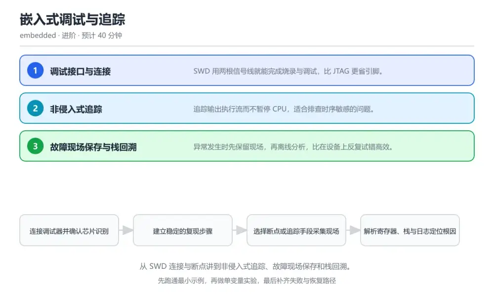
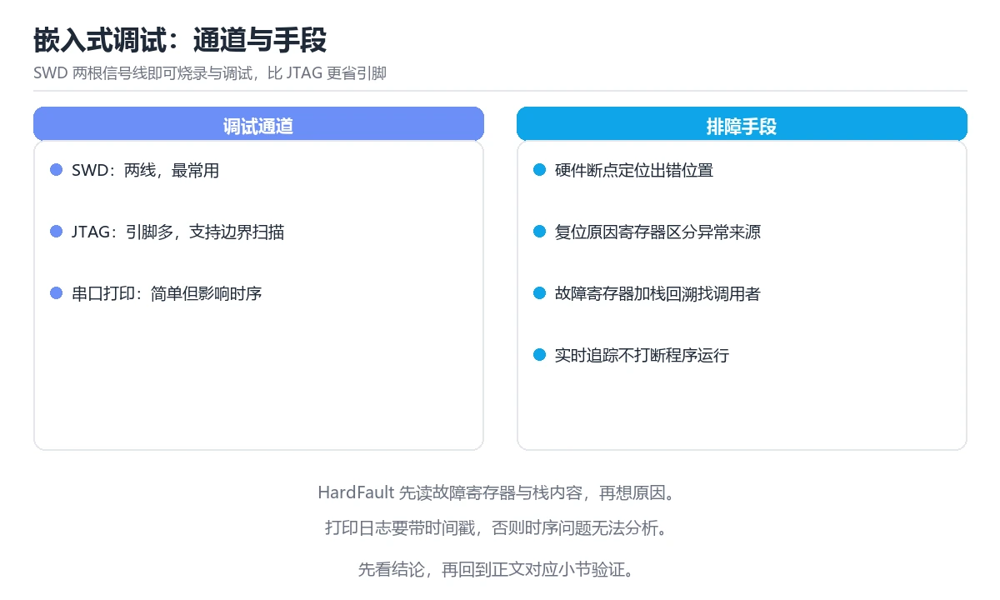

# 嵌入式调试与追踪

> 内容更新时间：2026-10-06 · 学习阶段：进阶 · 预计用时：30 分钟

分类：embedded。关键词：SWD、JTAG、硬件断点、SWO 追踪、HardFault。从 SWD 连接与断点讲到非侵入式追踪、故障现场保存和栈回溯。

学习建议：先通读《嵌入式调试与追踪》的核心知识与关键流程，再运行可运行练习并完成测验；遇到不确定的结论，回到「故障现场」按症状、根因、修复、验证四步核对。



## 学习目标

- 能正确连接 SWD 并在调试器里识别目标芯片。
- 能在不打断实时性的前提下使用追踪获取执行流。
- 能从 HardFault 现场恢复出出错位置。

## 前置知识

- 知道复位、时钟与烧录接口的基本原理。
- 能读懂寄存器与内存地址的对应关系。
- 用过至少一种集成开发环境下的调试器。

## 核心知识

### 1. 调试接口与连接

SWD 用两根信号线就能完成烧录与调试，比 JTAG 更省引脚。

调试器通过 SWDIO 与 SWCLK 访问芯片的调试访问口，读取内核寄存器与内存，断点由硬件比较器或软件指令实现。

在嵌入式调试与追踪里可以这样验证：在本课示例里用调试器读取栈指针与 PC，确认芯片停在预期的位置。

边界：低功耗模式下调试逻辑被关闭会断开连接，调低功耗问题前要明确调试口是否保持供电。

工程视角：把调试接口保留在测试点上并标注引脚顺序，量产固件提供一次性解锁或关闭调试的配置。

### 2. 非侵入式追踪

追踪输出执行流而不暂停 CPU，适合排查时序敏感的问题。

内核把程序计数采样或事件数据从 SWO、ETM 等通道送出，调试器收集后还原调用序列与时间关系。

在嵌入式调试与追踪里可以这样验证：在本课示例里用追踪记录中断服务程序的进入次数，观察中断密度与任务响应时间的对应关系。

边界：追踪带宽有限，全量输出会造成丢包，只应打开关心的通道与事件。

工程视角：把追踪配置写成脚本，让每次复现使用同一组通道与触发条件，便于对比。

### 3. 故障现场保存与栈回溯

异常发生时先保留现场，再离线分析，比在设备上反复试错高效。

异常入口把关键寄存器压入指定内存区并写入异常原因寄存器，重启后由上位机解析栈内容与调用返回地址。

在嵌入式调试与追踪里可以这样验证：在本课示例里手动触发一次除零异常，读出压栈寄存器并还原到出错函数。

边界：栈被破坏后回溯会得到错误地址，此时应以异常原因寄存器与最近一次正常日志为准。

工程视角：给故障区加魔数与版本号，固件升级后仍能解析旧故障记录。

## 关键流程

```text
连接调试器并确认芯片识别 → 建立稳定的复现步骤 → 选择断点或追踪手段采集现场 → 解析寄存器、栈与日志定位根因 → 修复后补一个可回归的测试
```

1. 连接调试器并确认芯片识别
2. 建立稳定的复现步骤
3. 选择断点或追踪手段采集现场
4. 解析寄存器、栈与日志定位根因
5. 修复后补一个可回归的测试

## 动手练习

1. 连接调试器读取当前栈指针与程序计数器，写下两个寄存器的含义。
2. 手动触发一次除零异常，用故障记录还原出错地址。
3. 用 SWO 统计一段时间内的中断次数，与逻辑分析仪结果对照。

验收标准：SWD 的输入、命令与输出齐全，任何人按记录都能复现同一结论。

## 常见错误与排查

> 说明：本表由《嵌入式调试与追踪》的核心知识整理（2026-10-06），人工复核进度见 docs/content_review_batches.md。

| 易错点 | 容易踩的做法 | 正确结论 |
| --- | --- | --- |
| 调试器连不上目标 | 只接了 SWDIO 与 SWCLK，没有共地与参考电压 | 确认共地、参考电压与复位线连接，降低调试时钟后重试并对目标做复位连接 |
| 加了日志后故障消失 | 用串口打印调试时序敏感问题 | 改用缓冲日志或 SWO 追踪等非阻塞方式采集，避免打印改变时序 |
| 栈回溯得到错误函数 | 栈已经被越界写坏仍按返回地址回溯 | 先看故障原因寄存器与最后一次有效日志，再对照内存保护单元配置缩小范围 |

## 可运行练习

### 任务 1：先跑通，再解释

```c
// 精简的故障现场结构：把异常瞬间的寄存器保存到不掉电的内存区
typedef struct {
    uint32_t r0, r1, r2, r3, r12, lr, pc, psr;
    uint32_t cfsr;   // 可配置故障状态寄存器
    uint32_t hfsr;   // 硬件故障状态寄存器
    uint32_t magic;  // 魔数，供上位机判断记录是否有效
} fault_record_t;

__attribute__((section(".noinit"))) static fault_record_t g_fault;

void HardFault_Handler(void) {
    __asm volatile (
        "tst lr, #4      \n"   // 判断异常使用的是 MSP 还是 PSP
        "ite eq         \n"
        "mrseq r0, msp  \n"
        "mrsne r0, psp  \n"
        "b capture_fault\n");
}

void capture_fault(uint32_t *stack) {
    g_fault.r0 = stack[0]; g_fault.pc = stack[6];  // 压栈顺序固定，pc 在第 7 个位置
    g_fault.cfsr = SCB->CFSR;
    g_fault.magic = 0xFA017E5A;
    NVIC_SystemReset();                            // 保存后立即复位，避免带故障运行
}

```

异常入口通过 LR 的值判断使用哪个栈指针，把栈地址交给 capture_fault；后者按固定压栈顺序取出寄存器与出错 PC，连同故障原因寄存器写入不掉电区，然后复位。上位机读取魔数有效的记录即可还原出错位置。

### 任务 2：只改一个条件

复制上面的示例，只改一个输入或参数再跑一次；先写下预测，再和真实输出对照，并说明差异来自嵌入式调试与追踪的哪条机制。

### 任务 3：迁移到自己的数据

把《嵌入式调试与追踪》里的示例换成你自己的一小段数据或场景，保持结构不变；如果换不动，说明还有哪条前提没有理解，回到核心知识对应小节。

## 故障现场

### 现场 1：调试器连不上目标

**症状**：在《嵌入式调试与追踪》的复现场景中，只接了 SWDIO 与 SWCLK，没有共地与参考电压。

**根因**：触发点是把“调试器连不上目标”当成安全做法。它没有满足《嵌入式调试与追踪》要求的前提，因此先表现为“只接了 SWDIO 与 SWCLK，没有共地与参考电压”；排查时先完整复现这一段，再核对输入、配置与依赖。

**修复**：针对《嵌入式调试与追踪》的问题，确认共地、参考电压与复位线连接，降低调试时钟后重试并对目标做复位连接。

**验证**：在《嵌入式调试与追踪》中按“确认共地、参考电压与复位线连接，降低调试时钟后重试并对目标做复位连接”调整后，从“调试器连不上目标”的触发条件重放同一条路径，确认“只接了 SWDIO 与 SWCLK，没有共地与参考电压”不再出现，并补一个相邻边界用例检查没有引入新问题。

### 现场 2：加了日志后故障消失

**症状**：在《嵌入式调试与追踪》的复现场景中，用串口打印调试时序敏感问题。

**根因**：当出现“加了日志后故障消失”时，执行路径已经绕过了《嵌入式调试与追踪》的关键约束，最终以“用串口打印调试时序敏感问题”暴露出来；修复前必须先确认约束在哪里失效。

**修复**：针对《嵌入式调试与追踪》的问题，改用缓冲日志或 SWO 追踪等非阻塞方式采集，避免打印改变时序。

**验证**：先在《嵌入式调试与追踪》中记录“加了日志后故障消失”留下的失败证据，再执行“改用缓冲日志或 SWO 追踪等非阻塞方式采集，避免打印改变时序”并重放；确认错误路径变为明确结果，且修复没有掩盖同类故障。

### 现场 3：栈回溯得到错误函数

**症状**：在《嵌入式调试与追踪》的复现场景中，栈已经被越界写坏仍按返回地址回溯。

**根因**：当出现“栈回溯得到错误函数”时，执行路径已经绕过了《嵌入式调试与追踪》的关键约束，最终以“栈已经被越界写坏仍按返回地址回溯”暴露出来；修复前必须先确认约束在哪里失效。

**修复**：针对《嵌入式调试与追踪》的问题，先看故障原因寄存器与最后一次有效日志，再对照内存保护单元配置缩小范围。

**验证**：先在《嵌入式调试与追踪》中记录“栈回溯得到错误函数”留下的失败证据，再执行“先看故障原因寄存器与最后一次有效日志，再对照内存保护单元配置缩小范围”并重放；确认错误路径变为明确结果，且修复没有掩盖同类故障。

## 本课复习清单

离开本课前，逐项确认：

- [ ] 能说出 SWD 连接必须确认的四件事。
- [ ] 能区分断点、打印与追踪对时序的影响。
- [ ] 能从故障状态寄存器与压栈 PC 还原出错位置。
- [ ] 跑通「嵌入式调试与追踪」的最小示例，并记录一次失败输入的处理方式。
- [ ] 把本课最容易混淆的两个概念写成一句话对照。

| 复盘项 | 记录 |
| --- | --- |
| 已经能独立解释的考点 |  |
| 仍然说不清的概念 |  |
| 下一步验证动作 |  |

## 复习与自测

### 核心知识

遮住正文回答：嵌入式调试与追踪解决什么问题、依赖哪些前提、失败时先看哪个信号？三问都能答清楚，再进入下一节。

### 动手练习

把《嵌入式调试与追踪》里「只改一个条件」的练习再做一遍，这次先写预测再运行；预测和结果不一致的地方，就是需要回读的章节。

### 最小可运行示例

```c
// 精简的故障现场结构：把异常瞬间的寄存器保存到不掉电的内存区
typedef struct {
    uint32_t r0, r1, r2, r3, r12, lr, pc, psr;
    uint32_t cfsr;   // 可配置故障状态寄存器
    uint32_t hfsr;   // 硬件故障状态寄存器
    uint32_t magic;  // 魔数，供上位机判断记录是否有效
} fault_record_t;

__attribute__((section(".noinit"))) static fault_record_t g_fault;

void HardFault_Handler(void) {
    __asm volatile (
        "tst lr, #4      \n"   // 判断异常使用的是 MSP 还是 PSP
        "ite eq         \n"
        "mrseq r0, msp  \n"
        "mrsne r0, psp  \n"
        "b capture_fault\n");
}

void capture_fault(uint32_t *stack) {
    g_fault.r0 = stack[0]; g_fault.pc = stack[6];  // 压栈顺序固定，pc 在第 7 个位置
    g_fault.cfsr = SCB->CFSR;
    g_fault.magic = 0xFA017E5A;
    NVIC_SystemReset();                            // 保存后立即复位，避免带故障运行
}

```

### 预期输出

```text
fault record magic ok，pc=0x08001a2c，cfsr=0x00020000（除零），复位后日志显示 fault captured
```

### 验证步骤

1. 确认输入数据与运行环境和示例一致。
2. 运行示例，记录输出与耗时等可观测指标。
3. 换一个边界输入重跑，确认结论仍然成立。
4. 把两次结果写成一句话结论，注明前提与局限。

## 术语速查

先遮住右列，尝试用自己的话解释，再回到正文核对。

| 术语 | 一句话说明 |
| --- | --- |
| `SWD` | ARM 的两线调试接口，用 SWDIO 与 SWCLK 访问内核。 |
| `硬件断点` | 由内核比较器实现的断点，不修改程序内容。 |
| `SWO` | 单线追踪输出通道，可输出事件与采样数据。 |
| `CFSR` | 可配置故障状态寄存器，记录异常的具体原因位。 |
| `栈回溯` | 按栈中返回地址还原函数调用链的过程。 |

## 考点精讲

### 考点 1：排查时序敏感的偶发问题时，优先选择的调试

题型：概念判断。题干：排查时序敏感的偶发问题时，优先选择的调试手段是？

判断要点：非侵入式追踪。打印与断点都会改变时序，非侵入式追踪在不暂停内核的前提下采集执行流，更适合偶发时序问题。 正确选项「非侵入式追踪」对应《嵌入式调试与追踪》的要点「调试接口与连接」：SWD 用两根信号线就能完成烧录与调试，比 JTAG 更省引脚。判断「调试接口与连接」时先确认前提是否成立，再回到《嵌入式调试与追踪》的示例核对一次；把别的语言或框架的默认做法直接搬到调试接口与连接上，往往会在本课的边界条件里失效。

### 考点 2：异常处理里先把 LR 与栈指针保存下来的

题型：概念判断。题干：异常处理里先把 LR 与栈指针保存下来的目的是？

判断要点：确定使用哪个栈并还原出错现场。异常可能使用主栈或进程栈，只有先判断栈指针来源，才能正确取出压栈的寄存器与出错地址。 正确选项「确定使用哪个栈并还原出错现场」对应《嵌入式调试与追踪》的要点「非侵入式追踪」：追踪输出执行流而不暂停 CPU，适合排查时序敏感的问题。判断「非侵入式追踪」时先确认前提是否成立，再回到《嵌入式调试与追踪》的示例核对一次；借鉴相邻主题的经验之前，先核对非侵入式追踪的前提是否成立。

### 考点 3：以下哪些信息有助于定位一次硬件异常？（多

题型：多选辨析。题干：以下哪些信息有助于定位一次硬件异常？（多选）

判断要点：故障状态寄存器的原因位；压栈保存的出错 PC；异常发生前的最后一段日志。原因位说明异常类型，出错 PC 指向指令位置，之前的日志提供上下文，三者结合能快速缩小范围。 正确选项「故障状态寄存器的原因位；压栈保存的出错 PC；异常发生前的最后一段日志」对应《嵌入式调试与追踪》的要点「故障现场保存与栈回溯」：异常发生时先保留现场，再离线分析，比在设备上反复试错高效。判断「故障现场保存与栈回溯」时先确认前提是否成立，再回到《嵌入式调试与追踪》的示例核对一次；记住故障现场保存与栈回溯的结论之外还要记住适用条件，换一个输入往往就不成立了。

### 考点 4：请按一次完整调试流程的顺序排列。

题型：顺序排列。题干：请按一次完整调试流程的顺序排列。

判断要点：稳定复现问题。先能稳定复现，才有可对比的现场；定位到根因后再修改，最后用回归测试确认问题不再出现。 正确选项「稳定复现问题；采集现场数据；解析寄存器与调用链；修改代码修复根因；补回归测试并验证」对应《嵌入式调试与追踪》的要点「调试接口与连接」：SWD 用两根信号线就能完成烧录与调试，比 JTAG 更省引脚。判断「调试接口与连接」时先确认前提是否成立，再回到《嵌入式调试与追踪》的示例核对一次；干扰项常常是相邻主题里成立的结论，只有按调试接口与连接的输入与约束判断才能排除。

### 考点 5：阅读这段故障采集代码，能得出什么结论？

题型：排错。题干：阅读这段故障采集代码，能得出什么结论？

判断要点：出错位置在 pc 指向的指令，原因是除零。CFSR 的对应位说明发生了除零类型的使用故障，pc 指向当时执行的指令，据此可以直接定位到具体运算语句。 正确选项「出错位置在 pc 指向的指令，原因是除零」对应《嵌入式调试与追踪》的要点「非侵入式追踪」：追踪输出执行流而不暂停 CPU，适合排查时序敏感的问题。判断「非侵入式追踪」时先确认前提是否成立，再回到《嵌入式调试与追踪》的示例核对一次；把非侵入式追踪的做法换到别的约束下未必成立，先确认边界再决定答案。

## English Overview

Embedded Debugging and Tracing

SWD needs only two signal wires to program and debug a Cortex-M device. Breakpoints stop the core, while SWO and ETM trace it without pausing. For field failures, save the stacked registers and the fault status register into a no-init memory region, reset, and analyse offline. Always confirm a stable reproduction before changing code.



## 本课小结

- 嵌入式调试与追踪围绕SWD、JTAG、硬件断点展开，先建立基线再讨论优化。
- SWD 用两根信号线就能完成烧录与调试，比 JTAG 更省引脚。
- HardFault_Handler 出错时先记录症状，再定位根因，最后用一次复跑确认修复。

## 内容元数据

- 内容版本：v2.0
- 最后更新：2026-10-06
- 学习阶段：进阶

| 字段 | 值 |
| --- | --- |
| 课程 ID | `embedded_debug_trace` |
| 所属分类 | `embedded` |
| 难度 | 进阶 |
| 预计用时 | 40 分钟 |
| 关键词 | SWD、JTAG、硬件断点、SWO 追踪、HardFault |
| 配图 | `images/lesson_embedded_debug_trace.webp` |
| 参考资料 | 2 条 |
| 内容更新时间 | 2026-10-06 |

## 参考资料与复核

- 最后复核：2026-10-04
- 下次复核：2027-02-17
- 复核范围：版本兼容、API 行为与工程实践

下面列出的资料用于核对本课结论，复习时可以对照阅读：
- [ARM CoreSight 调试与追踪文档](https://developer.arm.com/documentation/102520/latest/)
- [FreeRTOS 官方文档：调试与追踪](https://www.freertos.org/Documentation/02-Kernel/03-Supported-devices/04-Demos/01-Demo-Applications-Overview)

> 复核提示：《嵌入式调试与追踪》的结论如与资料冲突，以资料中的规范文本为准，并在笔记里记录差异与日期。

## 复习与迁移

### 概念复述

不看正文，把嵌入式调试与追踪讲给一个没学过的同事：先讲它解决什么问题，再讲一个最小例子，最后说明一个不适用场景。

### 测验回顾

回到《嵌入式调试与追踪》测验，只重做答错或犹豫的题；对每道题写一句「我为什么改选这个答案」，写不出理由就回到对应小节。

### 迁移练习

把《嵌入式调试与追踪》的方法用到一个你自己的真实场景：说明输入、约束与验证方式，并列出仍然不确定、需要下一次实验回答的问题。

## 深度拓展与实战

这一节把嵌入式调试与追踪的机制拆开验证：每一步都给出输入、判断标准和失败信号，便于在真实项目里复用。

### 机制拆解 1：调试接口与连接

调试器通过 SWDIO 与 SWCLK 访问芯片的调试访问口，读取内核寄存器与内存，断点由硬件比较器或软件指令实现。

落地时先确认前提：低功耗模式下调试逻辑被关闭会断开连接，调低功耗问题前要明确调试口是否保持供电。；再把结论写进检查表，让下一位同学可以按同样的输入复现。

工程做法：把调试接口保留在测试点上并标注引脚顺序，量产固件提供一次性解锁或关闭调试的配置。

### 机制拆解 2：非侵入式追踪

内核把程序计数采样或事件数据从 SWO、ETM 等通道送出，调试器收集后还原调用序列与时间关系。

落地时先确认前提：追踪带宽有限，全量输出会造成丢包，只应打开关心的通道与事件。；再把结论写进检查表，让下一位同学可以按同样的输入复现。

工程做法：把追踪配置写成脚本，让每次复现使用同一组通道与触发条件，便于对比。

### 机制拆解 3：故障现场保存与栈回溯

异常入口把关键寄存器压入指定内存区并写入异常原因寄存器，重启后由上位机解析栈内容与调用返回地址。

落地时先确认前提：栈被破坏后回溯会得到错误地址，此时应以异常原因寄存器与最近一次正常日志为准。；再把结论写进检查表，让下一位同学可以按同样的输入复现。

工程做法：给故障区加魔数与版本号，固件升级后仍能解析旧故障记录。

### 机制对照表

| 概念 | 解决什么问题 | 关键前提 | 失败信号 |
| --- | --- | --- | --- |
| 调试接口与连接 | SWD 用两根信号线就能完成烧录与调试，比 JTAG 更省引脚。 | 低功耗模式下调试逻辑被关闭会断开连接，调低功耗问题前要明确调试口是否保持 | 把调试接口保留在测试点上并标注引脚顺序，量产固件提供一次性解锁或关闭调试 |
| 非侵入式追踪 | 追踪输出执行流而不暂停 CPU，适合排查时序敏感的问题。 | 追踪带宽有限，全量输出会造成丢包，只应打开关心的通道与事件。 | 把追踪配置写成脚本，让每次复现使用同一组通道与触发条件，便于对比。 |
| 故障现场保存与栈回溯 | 异常发生时先保留现场，再离线分析，比在设备上反复试错高效。 | 栈被破坏后回溯会得到错误地址，此时应以异常原因寄存器与最近一次正常日志为 | 给故障区加魔数与版本号，固件升级后仍能解析旧故障记录。 |

### 自测问答

**问 1**：排查时序敏感的偶发问题时，优先选择的调试手段是？

**答**：非侵入式追踪。打印与断点都会改变时序，非侵入式追踪在不暂停内核的前提下采集执行流，更适合偶发时序问题。 正确选项「非侵入式追踪」对应《嵌入式调试与追踪》的要点「调试接口与连接」：SWD 用两根信号线就能完成烧录与调试，比 JTAG 更省引脚。判断「调试接口与连接」时先确认前提是否成立，再回到《嵌入式调试与追踪》的示例核对一次；把别的语言或框架的默认做法直接搬到调试接口与连接上，往往会在本课的边界条件里失效。

**问 2**：异常处理里先把 LR 与栈指针保存下来的目的是？

**答**：确定使用哪个栈并还原出错现场。异常可能使用主栈或进程栈，只有先判断栈指针来源，才能正确取出压栈的寄存器与出错地址。 正确选项「确定使用哪个栈并还原出错现场」对应《嵌入式调试与追踪》的要点「非侵入式追踪」：追踪输出执行流而不暂停 CPU，适合排查时序敏感的问题。判断「非侵入式追踪」时先确认前提是否成立，再回到《嵌入式调试与追踪》的示例核对一次；借鉴相邻主题的经验之前，先核对非侵入式追踪的前提是否成立。

**问 3**：以下哪些信息有助于定位一次硬件异常？（多选）

**答**：故障状态寄存器的原因位；压栈保存的出错 PC；异常发生前的最后一段日志。原因位说明异常类型，出错 PC 指向指令位置，之前的日志提供上下文，三者结合能快速缩小范围。 正确选项「故障状态寄存器的原因位；压栈保存的出错 PC；异常发生前的最后一段日志」对应《嵌入式调试与追踪》的要点「故障现场保存与栈回溯」：异常发生时先保留现场，再离线分析，比在设备上反复试错高效。判断「故障现场保存与栈回溯」时先确认前提是否成立，再回到《嵌入式调试与追踪》的示例核对一次；记住故障现场保存与栈回溯的结论之外还要记住适用条件，换一个输入往往就不成立了。

**问 4**：请按一次完整调试流程的顺序排列。

**答**：稳定复现问题。先能稳定复现，才有可对比的现场；定位到根因后再修改，最后用回归测试确认问题不再出现。 正确选项「稳定复现问题；采集现场数据；解析寄存器与调用链；修改代码修复根因；补回归测试并验证」对应《嵌入式调试与追踪》的要点「调试接口与连接」：SWD 用两根信号线就能完成烧录与调试，比 JTAG 更省引脚。判断「调试接口与连接」时先确认前提是否成立，再回到《嵌入式调试与追踪》的示例核对一次；干扰项常常是相邻主题里成立的结论，只有按调试接口与连接的输入与约束判断才能排除。

**问 5**：阅读这段故障采集代码，能得出什么结论？

**答**：出错位置在 pc 指向的指令，原因是除零。CFSR 的对应位说明发生了除零类型的使用故障，pc 指向当时执行的指令，据此可以直接定位到具体运算语句。 正确选项「出错位置在 pc 指向的指令，原因是除零」对应《嵌入式调试与追踪》的要点「非侵入式追踪」：追踪输出执行流而不暂停 CPU，适合排查时序敏感的问题。判断「非侵入式追踪」时先确认前提是否成立，再回到《嵌入式调试与追踪》的示例核对一次；把非侵入式追踪的做法换到别的约束下未必成立，先确认边界再决定答案。

### 排错速查

- 看到「只接了 SWDIO 与 SWCLK，没有共地与参考电压」时，先按「确认共地、参考电压与复位线连接，降低调试时钟后重试并对目标做复位连接」处理，再用嵌入式调试与追踪的最小示例确认结论是否恢复。
- 看到「用串口打印调试时序敏感问题」时，先按「改用缓冲日志或 SWO 追踪等非阻塞方式采集，避免打印改变时序」处理，再用嵌入式调试与追踪的最小示例确认结论是否恢复。
- 看到「栈已经被越界写坏仍按返回地址回溯」时，先按「先看故障原因寄存器与最后一次有效日志，再对照内存保护单元配置缩小范围」处理，再用嵌入式调试与追踪的最小示例确认结论是否恢复。

### 工程检查表

- [ ] 连接调试器并确认芯片识别
- [ ] 建立稳定的复现步骤
- [ ] 选择断点或追踪手段采集现场
- [ ] 解析寄存器、栈与日志定位根因
- [ ] 修复后补一个可回归的测试
- [ ] 【调试接口与连接】把调试接口保留在测试点上并标注引脚顺序，量产固件提供一次性解锁或关闭调试的配置。
- [ ] 【非侵入式追踪】把追踪配置写成脚本，让每次复现使用同一组通道与触发条件，便于对比。
- [ ] 【故障现场保存与栈回溯】给故障区加魔数与版本号，固件升级后仍能解析旧故障记录。

### 迁移练习

把嵌入式调试与追踪的方法用到一个真实场景：写下SWD、JTAG、硬件断点在你的场景里分别对应什么，再记录一次失败尝试和它的恢复步骤。

### 延伸阅读与下一步

- 复习SWD、JTAG、硬件断点、SWO 追踪、HardFault时，优先回看「调试接口与连接」与「故障现场保存与栈回溯」两节。
- 把从「连接调试器并确认芯片识别」到「修复后补一个可回归的测试」的流程画成一张图，放进自己的笔记。
- 一周后重做本课测验，只把答错的题留到下一轮复习。

### 结论与下一步

学完嵌入式调试与追踪，应该能独立完成三件事：先用最小示例确认SWD的行为，再用一个边界输入验证结论，最后把失败路径写成可重复的检查。下一步把本课术语加入复习清单，并在两周内用一次真实任务检验记忆是否牢固。
