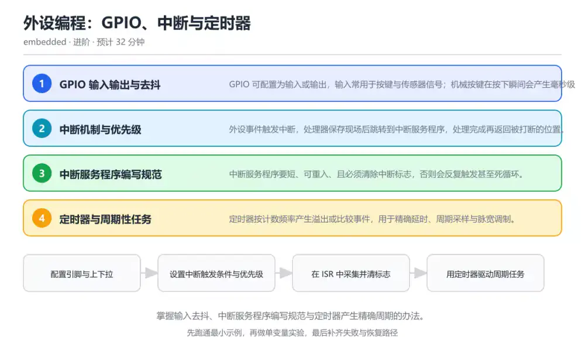
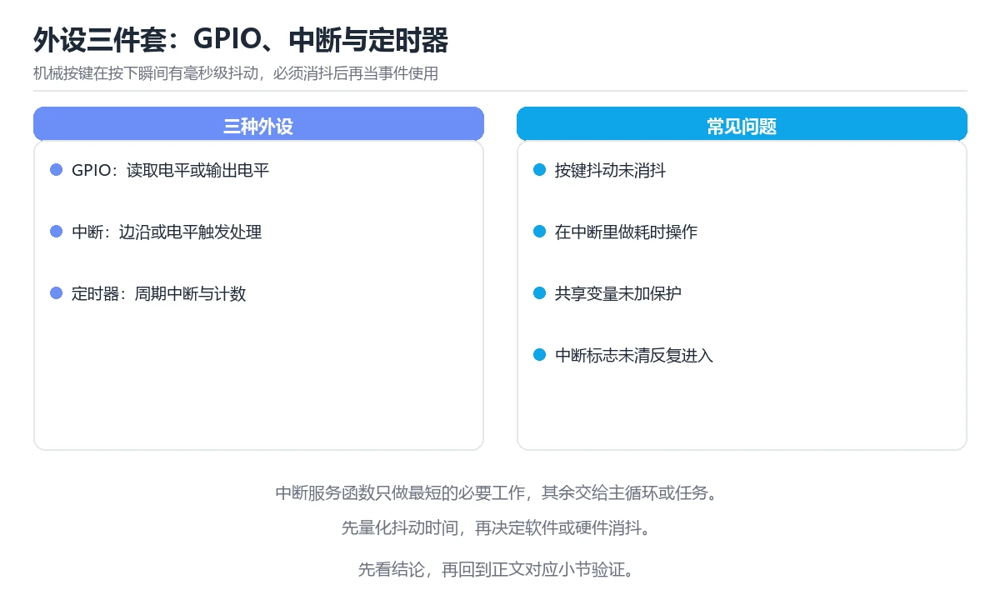

# 外设编程：GPIO、中断与定时器

> 内容更新时间：2026-10-06 · 学习阶段：进阶 · 预计用时：35 分钟

分类：embedded。关键词：GPIO、中断、定时器、去抖、中断优先级。掌握输入去抖、中断服务程序编写规范与定时器产生精确周期的办法。

学习建议：先通读《外设编程：GPIO、中断与定时器》的核心知识与关键流程，再运行可运行练习并完成测验；遇到不确定的结论，回到「故障现场」按症状、根因、修复、验证四步核对。



## 学习目标

- 能区分轮询与中断两种输入处理方式。
- 能写出简短、无阻塞的中断服务程序。
- 能用定时器实现稳定的周期性任务与测量。

## 前置知识

- 已理解寄存器访问与时钟初始化。
- 知道函数调用与栈的关系。
- 了解按键抖动与电平变化的物理现象。

## 核心知识

### 1. GPIO 输入输出与去抖

GPIO 可配置为输入或输出，输入常用于按键与传感器信号；机械按键在按下瞬间会产生毫秒级抖动。

上拉或下拉电阻确定空闲电平，去抖通过延时重采样或软件计数确认稳定状态。

在外设编程：GPIO、中断与定时器里可以这样验证：以 1 毫秒周期采样按键电平，连续 20 次相同才认定为一次有效动作。

边界：纯延时去抖会阻塞主循环，长按与连击需要状态机而不是一次判断。

工程视角：把按键处理写成状态机并在固定周期调用，硬件上配电容滤波降低软件负担。

### 2. 中断机制与优先级

外设事件触发中断，处理器保存现场后跳转到中断服务程序，处理完成再返回被打断的位置。

中断控制器按优先级决定同时到达时先响应谁，高优先级可以嵌套打断低优先级。

在外设编程：GPIO、中断与定时器里可以这样验证：为按键与串口各配置一个中断，用不同优先级观察同时触发时的处理顺序。

边界：在中断里长时间阻塞会推迟其他中断，导致数据丢失；优先级反转会让关键任务被间接拖慢。

工程视角：中断只做采集与置标志，复杂处理放到主循环；共享变量加 volatile 或用临界区保护。

### 3. 中断服务程序编写规范

中断服务程序要短、可重入、且必须清除中断标志，否则会反复触发甚至死循环。

ISR 读取外设状态、处理最小必要逻辑、清除标志并返回；耗时操作通过队列或标志交给主循环。

在外设编程：GPIO、中断与定时器里可以这样验证：在串口接收中断里只把字节放入环形缓冲区，主循环再解析协议。

边界：在 ISR 里调用非可重入函数（例如动态分配或阻塞式打印）会导致难以复现的崩溃。

工程视角：为每个 ISR 明确输入输出与最大执行时间，环形缓冲区大小按峰值速率估算。

### 4. 定时器与周期性任务

定时器按计数频率产生溢出或比较事件，用于精确延时、周期采样与脉宽调制。

预分频把时钟降到计数频率，自动重载值决定周期；比较通道输出可生成方波与占空比。

在外设编程：GPIO、中断与定时器里可以这样验证：用定时器每 1 毫秒触发一次采样，累计 1000 次得到一秒的软件计时。

边界：软件延时精度受中断与优化影响，长周期计时要注意计数溢出与时钟漂移。

工程视角：统一使用一个系统滴答作为时间基准，所有周期任务按滴答调度，避免多个定时器互相干扰。

## 关键流程

```text
配置引脚与上下拉 → 设置中断触发条件与优先级 → 在 ISR 中采集并清标志 → 用定时器驱动周期任务
```

1. 配置引脚与上下拉
2. 设置中断触发条件与优先级
3. 在 ISR 中采集并清标志
4. 用定时器驱动周期任务

## 动手练习

1. 为按键实现一个支持短按与长按的状态机，并说明消抖参数如何选择。
2. 用定时器实现 1 赫兹闪烁与 50% 占空比输出，测量实际频率。
3. 写一个环形缓冲区，把串口接收中断与主循环解析连接起来。

**验收标准**：记录 GPIO 的输入、实际输出与差异解释，缺一项都不算完成。

## 常见错误与排查

> 说明：本表由《外设编程：GPIO、中断与定时器》的核心知识整理（2026-10-06），人工复核进度见 docs/content_review_batches.md。

| 易错点 | 容易踩的做法 | 正确结论 |
| --- | --- | --- |
| 中断里执行耗时逻辑 | 在 ISR 里直接打印日志或做协议解析 | ISR 只采集与置标志，耗时处理移到主循环或任务中 |
| 忘记清除中断标志 | 退出中断后同一条件反复触发，主循环几乎无法执行 | 在 ISR 内按数据手册要求清除挂起标志，并验证不重复触发 |
| 共享变量缺少保护 | 主循环与中断同时读写计数器，出现丢失更新 | 共享变量加 volatile，必要时用临界区或原子操作保护读改写序列 |

## 可运行练习

### 任务 1：先跑通，再解释

```c
#include <stdint.h>
#include <stdbool.h>

#define GPIOA_IDR (*(volatile uint32_t *)0x48000004u)
#define TICK_MS   1000u

static volatile uint32_t g_ms_tick = 0;
static volatile bool g_button_pressed = false;

// 1 毫秒定时器中断：只做计数，不执行耗时逻辑
void SysTick_Handler(void) {
    g_ms_tick++;
}

// 按键中断：置标志并清除外设标志，交由主循环处理
void EXTI0_IRQHandler(void) {
    g_button_pressed = true;
    // 实际项目中在此清除对应的中断挂起标志
}

bool button_take(void) {
    if (!g_button_pressed) return false;
    g_button_pressed = false;
    return true;
}

int main(void) {
    uint32_t last = g_ms_tick;
    while (true) {
        if (button_take()) {
            // 处理按键业务，这里可以安全地做耗时操作
        }
        if (g_ms_tick - last >= 500) {  // 每 500 毫秒采样一次输入
            last = g_ms_tick;
            (void)GPIOA_IDR;
        }
    }
}
```

定时器中断只累加毫秒计数，按键中断只置标志；主循环读取标志处理业务，并用无符号差值计算经过时间，避免计数溢出带来的比较错误。

### 任务 2：只改一个条件

复制上面的示例，只改一个输入或参数再跑一次；先写下预测，再和真实输出对照，并说明差异来自外设编程：GPIO、中断与定时器的哪条机制。

### 任务 3：迁移到自己的数据

把《外设编程：GPIO、中断与定时器》里的示例换成你自己的一小段数据或场景，保持结构不变；如果换不动，说明还有哪条前提没有理解，回到核心知识对应小节。

## 故障现场

### 现场 1：中断里执行耗时逻辑

**症状**：在《外设编程：GPIO、中断与定时器》的复现场景中，在 ISR 里直接打印日志或做协议解析。

**根因**：触发点是把“中断里执行耗时逻辑”当成安全做法。它没有满足《外设编程：GPIO、中断与定时器》要求的前提，因此先表现为“在 ISR 里直接打印日志或做协议解析”；排查时先完整复现这一段，再核对输入、配置与依赖。

**修复**：针对《外设编程：GPIO、中断与定时器》的问题，ISR 只采集与置标志，耗时处理移到主循环或任务中。

**验证**：保留《外设编程：GPIO、中断与定时器》里触发“在 ISR 里直接打印日志或做协议解析”的输入、版本和日志，按“ISR 只采集与置标志，耗时处理移到主循环或任务中”完成修改后原样重放；只有失败现象消失且相邻场景仍可解释，才保留改动。

### 现场 2：忘记清除中断标志

**症状**：在《外设编程：GPIO、中断与定时器》的复现场景中，退出中断后同一条件反复触发，主循环几乎无法执行。

**根因**：触发点是把“忘记清除中断标志”当成安全做法。它没有满足《外设编程：GPIO、中断与定时器》要求的前提，因此先表现为“退出中断后同一条件反复触发，主循环几乎无法执行”；排查时先完整复现这一段，再核对输入、配置与依赖。

**修复**：针对《外设编程：GPIO、中断与定时器》的问题，在 ISR 内按数据手册要求清除挂起标志，并验证不重复触发。

**验证**：在《外设编程：GPIO、中断与定时器》中按“在 ISR 内按数据手册要求清除挂起标志，并验证不重复触发”调整后，从“忘记清除中断标志”的触发条件重放同一条路径，确认“退出中断后同一条件反复触发，主循环几乎无法执行”不再出现，并补一个相邻边界用例检查没有引入新问题。

### 现场 3：共享变量缺少保护

**症状**：在《外设编程：GPIO、中断与定时器》的复现场景中，主循环与中断同时读写计数器，出现丢失更新。

**根因**：“主循环与中断同时读写计数器，出现丢失更新”只是表层结果。向上追溯会落到“共享变量缺少保护”这一步，因为它省略了《外设编程：GPIO、中断与定时器》的约束，使实现行为和预期模型发生了偏离。

**修复**：针对《外设编程：GPIO、中断与定时器》的问题，共享变量加 volatile，必要时用临界区或原子操作保护读改写序列。

**验证**：保留《外设编程：GPIO、中断与定时器》里触发“主循环与中断同时读写计数器，出现丢失更新”的输入、版本和日志，按“共享变量加 volatile，必要时用临界区或原子操作保护读改写序列”完成修改后原样重放；只有失败现象消失且相邻场景仍可解释，才保留改动。

## 本课复习清单

离开本课前，逐项确认：

- [ ] 能说明轮询与中断的适用场景。
- [ ] 能写出短小、无阻塞的中断服务程序。
- [ ] 能用定时器实现稳定的周期任务。
- [ ] 至少运行一次 EXTI0_IRQHandler 的示例，记录输入、输出和 GPIO 的边界情况。
- [ ] 把本课最容易混淆的两个概念写成一句话对照。

| 复盘项 | 记录 |
| --- | --- |
| 已经能独立解释的考点 |  |
| 仍然说不清的概念 |  |
| 下一步验证动作 |  |

## 复习与自测

### 核心知识

遮住正文回答：外设编程：GPIO、中断与定时器解决什么问题、依赖哪些前提、失败时先看哪个信号？三问都能答清楚，再进入下一节。

### 动手练习

把《外设编程：GPIO、中断与定时器》里「只改一个条件」的练习再做一遍，这次先写预测再运行；预测和结果不一致的地方，就是需要回读的章节。

### 最小可运行示例

```c
#include <stdint.h>
#include <stdbool.h>

#define GPIOA_IDR (*(volatile uint32_t *)0x48000004u)
#define TICK_MS   1000u

static volatile uint32_t g_ms_tick = 0;
static volatile bool g_button_pressed = false;

// 1 毫秒定时器中断：只做计数，不执行耗时逻辑
void SysTick_Handler(void) {
    g_ms_tick++;
}

// 按键中断：置标志并清除外设标志，交由主循环处理
void EXTI0_IRQHandler(void) {
    g_button_pressed = true;
    // 实际项目中在此清除对应的中断挂起标志
}

bool button_take(void) {
    if (!g_button_pressed) return false;
    g_button_pressed = false;
    return true;
}

int main(void) {
    uint32_t last = g_ms_tick;
    while (true) {
        if (button_take()) {
            // 处理按键业务，这里可以安全地做耗时操作
        }
        if (g_ms_tick - last >= 500) {  // 每 500 毫秒采样一次输入
            last = g_ms_tick;
            (void)GPIOA_IDR;
        }
    }
}
```

### 预期输出

```text
每 500 毫秒执行一次采样；按键触发后主循环读取标志并处理一次，重复按下不会丢失（若需要连击可改为计数）。
```

### 验证步骤

1. 确认输入数据与运行环境和示例一致。
2. 运行示例，记录输出与耗时等可观测指标。
3. 换一个边界输入重跑，确认结论仍然成立。
4. 把两次结果写成一句话结论，注明前提与局限。

## 术语速查

先遮住右列，尝试用自己的话解释，再回到正文核对。

| 术语 | 一句话说明 |
| --- | --- |
| `GPIO` | 通用输入输出引脚，可配置方向与电平特性。 |
| `中断服务程序` | 外设事件触发后执行的短小处理函数。 |
| `中断优先级` | 决定多个中断同时到达时响应顺序的等级设置。 |
| `去抖` | 消除机械触点抖动、只保留一次有效动作的处理。 |
| `自动重载值` | 定时器计数达到后重新装载的数值，决定周期长度。 |
| `中断` | 中断控制器按优先级决定同时到达时先响应谁，高优先级可以嵌套打断低优先级 |

## 考点精讲

### 考点 1：按键一次按下却被识别成多次，最可能的原因

题型：概念判断。题干：按键一次按下却被识别成多次，最可能的原因是什么？

判断要点：触点抖动没有做去抖处理。机械触点在闭合瞬间会产生毫秒级抖动，不做去抖就会被读成多次动作；时钟未使能表现为完全无响应，与连击现象不同。 正确选项「触点抖动没有做去抖处理」对应《外设编程：GPIO、中断与定时器》的要点「GPIO 输入输出与去抖」：GPIO 可配置为输入或输出，输入常用于按键与传感器信号；机械按键在按下瞬间会产生毫秒级抖动。判断「GPIO 输入输出与去抖」时先确认前提是否成立，再回到《外设编程：GPIO、中断与定时器》的示例核对一次；把别的语言或框架的默认做法直接搬到GPIO 输入输出与去抖上，往往会在本课的边界条件里失效。

### 考点 2：中断服务程序里最不应该出现的做法是什么？

题型：概念判断。题干：中断服务程序里最不应该出现的做法是什么？

判断要点：执行阻塞式等待或耗时打印。ISR 会推迟其他中断与主循环执行，阻塞等待与耗时打印必须移出；读取状态、置标志与清标志都是 ISR 的典型工作。 正确选项「执行阻塞式等待或耗时打印」对应《外设编程：GPIO、中断与定时器》的要点「中断机制与优先级」：外设事件触发中断，处理器保存现场后跳转到中断服务程序，处理完成再返回被打断的位置。判断「中断机制与优先级」时先确认前提是否成立，再回到《外设编程：GPIO、中断与定时器》的示例核对一次；借鉴相邻主题的经验之前，先核对中断机制与优先级的前提是否成立。

### 考点 3：使用定时器实现周期任务时需要注意哪些问题

题型：多选辨析。题干：使用定时器实现周期任务时需要注意哪些问题？（多选）

判断要点：计数溢出与无符号差值比较；预分频与自动重载值决定的实际周期；系统时钟变化导致周期漂移。周期任务要正确处理溢出、按实际时钟计算周期并关注漂移；把耗时逻辑放进中断会阻塞系统，属于反模式。 正确选项「计数溢出与无符号差值比较；预分频与自动重载值决定的实际周期；系统时钟变化导致周期漂移」对应《外设编程：GPIO、中断与定时器》的要点「中断服务程序编写规范」：中断服务程序要短、可重入、且必须清除中断标志，否则会反复触发甚至死循环。判断「中断服务程序编写规范」时先确认前提是否成立，再回到《外设编程：GPIO、中断与定时器》的示例核对一次；记住中断服务程序编写规范的结论之外还要记住适用条件，换一个输入往往就不成立了。

### 考点 4：请按一次按键中断的处理顺序排列步骤。

题型：顺序排列。题干：请按一次按键中断的处理顺序排列步骤。

判断要点：主循环读取标志并处理业务。先由硬件触发中断，ISR 置标志并清挂起标志，最后主循环取走标志处理业务；标志不清会反复进入中断，业务写入 ISR 则会拉长中断时间。 正确选项「按键触发中断；ISR 置位按键标志；清除中断挂起标志；主循环读取标志并处理业务」对应《外设编程：GPIO、中断与定时器》的要点「定时器与周期性任务」：定时器按计数频率产生溢出或比较事件，用于精确延时、周期采样与脉宽调制。判断「定时器与周期性任务」时先确认前提是否成立，再回到《外设编程：GPIO、中断与定时器》的示例核对一次；干扰项常常是相邻主题里成立的结论，只有按定时器与周期性任务的输入与约束判断才能排除。

### 考点 5：阅读中断与主循环代码，哪项判断正确？

题型：排错。题干：阅读中断与主循环代码，哪项判断正确？

判断要点：用无符号差值比较时间可以正确处理计数溢出。无符号减法在溢出回绕后仍能得到正确的时间差，这是嵌入式计时常见写法；g_ms_tick 被中断与主循环共享，必须加 volatile 防止优化。 正确选项「用无符号差值比较时间可以正确处理计数溢出」对应《外设编程：GPIO、中断与定时器》的要点「GPIO 输入输出与去抖」：GPIO 可配置为输入或输出，输入常用于按键与传感器信号；机械按键在按下瞬间会产生毫秒级抖动。判断「GPIO 输入输出与去抖」时先确认前提是否成立，再回到《外设编程：GPIO、中断与定时器》的示例核对一次；把GPIO 输入输出与去抖的做法换到别的约束下未必成立，先确认边界再决定答案。

## English Overview

Peripherals: GPIO, Interrupts and Timers

Peripherals turn electrical events into software signals. This lesson covers GPIO input with debouncing, interrupt priorities, short ISR rules, and timer-driven periodic work, including the unsigned-difference trick for tick counters that wrap around.



## 本课小结

- 外设编程：GPIO、中断与定时器围绕GPIO、中断、定时器展开，先建立基线再讨论优化。
- GPIO 可配置为输入或输出，输入常用于按键与传感器信号；机械按键在按下瞬间会产生毫秒级抖动。
- 处理 GPIO 的问题时按「症状 → 根因 → 修复 → 验证」的顺序推进，不跳过验证。

## 内容元数据

- 内容版本：v2.0
- 最后更新：2026-10-06
- 学习阶段：进阶

| 字段 | 值 |
| --- | --- |
| 课程 ID | `embedded_gpio_interrupt` |
| 所属分类 | `embedded` |
| 难度 | 进阶 |
| 预计用时 | 32 分钟 |
| 关键词 | GPIO、中断、定时器、去抖、中断优先级 |
| 配图 | `images/lesson_embedded_gpio_interrupt.webp` |
| 参考资料 | 2 条 |
| 内容更新时间 | 2026-10-06 |

## 参考资料与复核

- 最后复核：2026-10-04
- 下次复核：2027-02-17
- 复核范围：版本兼容、API 行为与工程实践

下面列出的资料用于核对本课结论，复习时可以对照阅读：
- [STM32 参考手册（中断与定时器章节）](https://www.st.com/en/microcontrollers-microprocessors/stm32-32-bit-arm-cortex-mcus.html)
- [FreeRTOS 中断与临界区说明](https://www.freertos.org/Documentation/02-Kernel/02-Kernel-basics/03-Tasks)

> 复核提示：《外设编程：GPIO、中断与定时器》的结论如与资料冲突，以资料中的规范文本为准，并在笔记里记录差异与日期。

## 复习与迁移

### 概念复述

不看正文，把外设编程：GPIO、中断与定时器讲给一个没学过的同事：先讲它解决什么问题，再讲一个最小例子，最后说明一个不适用场景。

### 测验回顾

回到《外设编程：GPIO、中断与定时器》测验，只重做答错或犹豫的题；对每道题写一句「我为什么改选这个答案」，写不出理由就回到对应小节。

### 迁移练习

把《外设编程：GPIO、中断与定时器》的方法用到一个你自己的真实场景：说明输入、约束与验证方式，并列出仍然不确定、需要下一次实验回答的问题。

## 深度拓展与实战

这一节把外设编程：GPIO、中断与定时器的机制拆开验证：每一步都给出输入、判断标准和失败信号，便于在真实项目里复用。

### 机制拆解 1：GPIO 输入输出与去抖

上拉或下拉电阻确定空闲电平，去抖通过延时重采样或软件计数确认稳定状态。

落地时先确认前提：纯延时去抖会阻塞主循环，长按与连击需要状态机而不是一次判断。；再把结论写进检查表，让下一位同学可以按同样的输入复现。

工程做法：把按键处理写成状态机并在固定周期调用，硬件上配电容滤波降低软件负担。

### 机制拆解 2：中断机制与优先级

中断控制器按优先级决定同时到达时先响应谁，高优先级可以嵌套打断低优先级。

落地时先确认前提：在中断里长时间阻塞会推迟其他中断，导致数据丢失；优先级反转会让关键任务被间接拖慢。；再把结论写进检查表，让下一位同学可以按同样的输入复现。

工程做法：中断只做采集与置标志，复杂处理放到主循环；共享变量加 volatile 或用临界区保护。

### 机制拆解 3：中断服务程序编写规范

ISR 读取外设状态、处理最小必要逻辑、清除标志并返回；耗时操作通过队列或标志交给主循环。

落地时先确认前提：在 ISR 里调用非可重入函数（例如动态分配或阻塞式打印）会导致难以复现的崩溃。；再把结论写进检查表，让下一位同学可以按同样的输入复现。

工程做法：为每个 ISR 明确输入输出与最大执行时间，环形缓冲区大小按峰值速率估算。

### 机制拆解 4：定时器与周期性任务

预分频把时钟降到计数频率，自动重载值决定周期；比较通道输出可生成方波与占空比。

落地时先确认前提：软件延时精度受中断与优化影响，长周期计时要注意计数溢出与时钟漂移。；再把结论写进检查表，让下一位同学可以按同样的输入复现。

工程做法：统一使用一个系统滴答作为时间基准，所有周期任务按滴答调度，避免多个定时器互相干扰。

### 机制对照表

| 概念 | 解决什么问题 | 关键前提 | 失败信号 |
| --- | --- | --- | --- |
| GPIO 输入输出与去抖 | GPIO 可配置为输入或输出，输入常用于按键与传感器信号；机械按键在按下瞬间会产 | 纯延时去抖会阻塞主循环，长按与连击需要状态机而不是一次判断。 | 把按键处理写成状态机并在固定周期调用，硬件上配电容滤波降低软件负担。 |
| 中断机制与优先级 | 外设事件触发中断，处理器保存现场后跳转到中断服务程序，处理完成再返回被打断的位置 | 在中断里长时间阻塞会推迟其他中断，导致数据丢失；优先级反转会让关键任务被 | 中断只做采集与置标志，复杂处理放到主循环；共享变量加 volatile  |
| 中断服务程序编写规范 | 中断服务程序要短、可重入、且必须清除中断标志，否则会反复触发甚至死循环。 | 在 ISR 里调用非可重入函数（例如动态分配或阻塞式打印）会导致难以复现 | 为每个 ISR 明确输入输出与最大执行时间，环形缓冲区大小按峰值速率估算 |
| 定时器与周期性任务 | 定时器按计数频率产生溢出或比较事件，用于精确延时、周期采样与脉宽调制。 | 软件延时精度受中断与优化影响，长周期计时要注意计数溢出与时钟漂移。 | 统一使用一个系统滴答作为时间基准，所有周期任务按滴答调度，避免多个定时器 |

### 自测问答

**问 1**：按键一次按下却被识别成多次，最可能的原因是什么？

**答**：触点抖动没有做去抖处理。机械触点在闭合瞬间会产生毫秒级抖动，不做去抖就会被读成多次动作；时钟未使能表现为完全无响应，与连击现象不同。 正确选项「触点抖动没有做去抖处理」对应《外设编程：GPIO、中断与定时器》的要点「GPIO 输入输出与去抖」：GPIO 可配置为输入或输出，输入常用于按键与传感器信号；机械按键在按下瞬间会产生毫秒级抖动。判断「GPIO 输入输出与去抖」时先确认前提是否成立，再回到《外设编程：GPIO、中断与定时器》的示例核对一次；把别的语言或框架的默认做法直接搬到GPIO 输入输出与去抖上，往往会在本课的边界条件里失效。

**问 2**：中断服务程序里最不应该出现的做法是什么？

**答**：执行阻塞式等待或耗时打印。ISR 会推迟其他中断与主循环执行，阻塞等待与耗时打印必须移出；读取状态、置标志与清标志都是 ISR 的典型工作。 正确选项「执行阻塞式等待或耗时打印」对应《外设编程：GPIO、中断与定时器》的要点「中断机制与优先级」：外设事件触发中断，处理器保存现场后跳转到中断服务程序，处理完成再返回被打断的位置。判断「中断机制与优先级」时先确认前提是否成立，再回到《外设编程：GPIO、中断与定时器》的示例核对一次；借鉴相邻主题的经验之前，先核对中断机制与优先级的前提是否成立。

**问 3**：使用定时器实现周期任务时需要注意哪些问题？（多选）

**答**：计数溢出与无符号差值比较；预分频与自动重载值决定的实际周期；系统时钟变化导致周期漂移。周期任务要正确处理溢出、按实际时钟计算周期并关注漂移；把耗时逻辑放进中断会阻塞系统，属于反模式。 正确选项「计数溢出与无符号差值比较；预分频与自动重载值决定的实际周期；系统时钟变化导致周期漂移」对应《外设编程：GPIO、中断与定时器》的要点「中断服务程序编写规范」：中断服务程序要短、可重入、且必须清除中断标志，否则会反复触发甚至死循环。判断「中断服务程序编写规范」时先确认前提是否成立，再回到《外设编程：GPIO、中断与定时器》的示例核对一次；记住中断服务程序编写规范的结论之外还要记住适用条件，换一个输入往往就不成立了。

**问 4**：请按一次按键中断的处理顺序排列步骤。

**答**：主循环读取标志并处理业务。先由硬件触发中断，ISR 置标志并清挂起标志，最后主循环取走标志处理业务；标志不清会反复进入中断，业务写入 ISR 则会拉长中断时间。 正确选项「按键触发中断；ISR 置位按键标志；清除中断挂起标志；主循环读取标志并处理业务」对应《外设编程：GPIO、中断与定时器》的要点「定时器与周期性任务」：定时器按计数频率产生溢出或比较事件，用于精确延时、周期采样与脉宽调制。判断「定时器与周期性任务」时先确认前提是否成立，再回到《外设编程：GPIO、中断与定时器》的示例核对一次；干扰项常常是相邻主题里成立的结论，只有按定时器与周期性任务的输入与约束判断才能排除。

**问 5**：阅读中断与主循环代码，哪项判断正确？

**答**：用无符号差值比较时间可以正确处理计数溢出。无符号减法在溢出回绕后仍能得到正确的时间差，这是嵌入式计时常见写法；g_ms_tick 被中断与主循环共享，必须加 volatile 防止优化。 正确选项「用无符号差值比较时间可以正确处理计数溢出」对应《外设编程：GPIO、中断与定时器》的要点「GPIO 输入输出与去抖」：GPIO 可配置为输入或输出，输入常用于按键与传感器信号；机械按键在按下瞬间会产生毫秒级抖动。判断「GPIO 输入输出与去抖」时先确认前提是否成立，再回到《外设编程：GPIO、中断与定时器》的示例核对一次；把GPIO 输入输出与去抖的做法换到别的约束下未必成立，先确认边界再决定答案。

### 排错速查

- 看到「在 ISR 里直接打印日志或做协议解析」时，先按「ISR 只采集与置标志，耗时处理移到主循环或任务中」处理，再用外设编程：GPIO、中断与定时器的最小示例确认结论是否恢复。
- 看到「退出中断后同一条件反复触发，主循环几乎无法执行」时，先按「在 ISR 内按数据手册要求清除挂起标志，并验证不重复触发」处理，再用外设编程：GPIO、中断与定时器的最小示例确认结论是否恢复。
- 看到「主循环与中断同时读写计数器，出现丢失更新」时，先按「共享变量加 volatile，必要时用临界区或原子操作保护读改写序列」处理，再用外设编程：GPIO、中断与定时器的最小示例确认结论是否恢复。

### 工程检查表

- [ ] 配置引脚与上下拉
- [ ] 设置中断触发条件与优先级
- [ ] 在 ISR 中采集并清标志
- [ ] 用定时器驱动周期任务
- [ ] 【GPIO 输入输出与去抖】把按键处理写成状态机并在固定周期调用，硬件上配电容滤波降低软件负担。
- [ ] 【中断机制与优先级】中断只做采集与置标志，复杂处理放到主循环；共享变量加 volatile 或用临界区保护。
- [ ] 【中断服务程序编写规范】为每个 ISR 明确输入输出与最大执行时间，环形缓冲区大小按峰值速率估算。
- [ ] 【定时器与周期性任务】统一使用一个系统滴答作为时间基准，所有周期任务按滴答调度，避免多个定时器互相干扰。

### 迁移练习

把外设编程：GPIO、中断与定时器的方法用到一个真实场景：写下GPIO、中断、定时器在你的场景里分别对应什么，再记录一次失败尝试和它的恢复步骤。

### 延伸阅读与下一步

- 复习GPIO、中断、定时器、去抖、中断优先级时，优先回看「GPIO 输入输出与去抖」与「定时器与周期性任务」两节。
- 把从「配置引脚与上下拉」到「用定时器驱动周期任务」的流程画成一张图，放进自己的笔记。
- 一周后重做本课测验，只把答错的题留到下一轮复习。

### 结论与下一步

学完外设编程：GPIO、中断与定时器，应该能独立完成三件事：先用最小示例确认GPIO的行为，再用一个边界输入验证结论，最后把失败路径写成可重复的检查。下一步把本课术语加入复习清单，并在两周内用一次真实任务检验记忆是否牢固。

