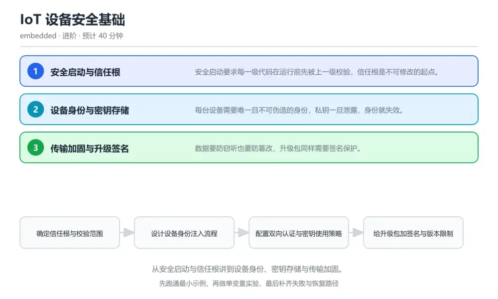
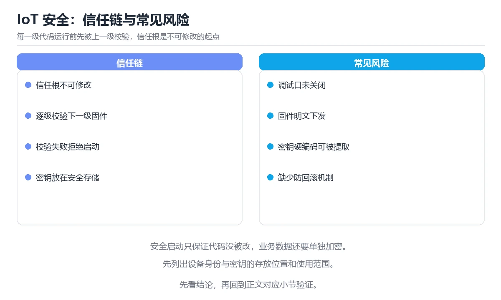

# IoT 设备安全基础

> 内容更新时间：2026-10-06 · 学习阶段：进阶 · 预计用时：40 分钟

分类：embedded。关键词：安全启动、信任根、设备身份、密钥存储、TLS。从安全启动与信任根讲到设备身份、密钥存储与传输加固。

学习建议：先通读《IoT 设备安全基础》的核心知识与关键流程，再运行可运行练习并完成测验；遇到不确定的结论，回到「故障现场」按症状、根因、修复、验证四步核对。



## 本节知识框架

**课程定位**：所属分类为「嵌入式与物联网」，课程主题为「IoT 设备安全基础」，学习阶段为「进阶」，建议用时 40 分钟。

**本课要解决的主问题**：从安全启动与信任根讲到设备身份、密钥存储与传输加固。

| 学习层次 | 要回答的问题 | 完成判据 |
| --- | --- | --- |
| 概念层 | 「IoT 设备安全基础」有哪些必须区分的对象与术语？ | 能用自己的话定义核心术语，并各举一个正例和一个反例。 |
| 机制层 | 这些对象按什么顺序发生作用，输入如何变成输出？ | 能画出或写出机制步骤，并说明每一步的失败条件。 |
| 应用层 | 什么场景适合使用「IoT 设备安全基础」，什么场景不适合？ | 能给出一个真实场景、一个最小示例和一个边界案例。 |
| 性能层 | 时间、空间、吞吐或延迟受哪些量影响？ | 能说出复杂度或性能瓶颈的证据来源；没有证据时明确写“材料未提供”。 |
| 复习层 | 怎样确认自己不是只记住了结论？ | 能独立完成本课自测，并把错误定位到概念、机制、示例或边界。 |

### 阅读路线

1. 先读「核心概念定义」，建立「安全启动」等对象的精确定义。
2. 再读「原理与运行机制」，把定义串成可重复的过程。
3. 用「代码/协议/SQL 示例」验证过程，并只改一个条件观察结果变化。
4. 最后检查性能、易错点、知识关系与自测题，形成可复习的证据链。

**前置知识**：没有硬性先修课；仍建议先具备本分类的基础阅读与操作能力。

**学习位置**：本课位于《嵌入式调试与追踪》之后；如果前一课的自测不能通过，应先回补再继续。

**后续衔接**：下一课《项目：环境监测节点》会继续使用本课术语，学完后建议立即完成一次自测。

**教材衔接：学习目标**

- 能说明信任根如何逐级校验到应用固件。
- 能为设备身份与密钥选择合理的存储方案。
- 能识别固件升级链路里最容易失守的环节。

**教材衔接：前置知识**

- 了解对称加密、非对称加密与哈希的基本用途。
- 知道 Flash 读保护与安全存储区的作用。
- 理解 TLS 握手中证书与密钥的分工。

**教材衔接：本课小结**

- IoT 设备安全基础围绕安全启动、信任根、设备身份展开，先建立基线再讨论优化。
- 安全启动要求每一级代码在运行前先被上一级校验，信任根是不可修改的起点。
- KEY_ID_DEVICE 出错时先记录症状，再定位根因，最后用一次复跑确认修复。

## 核心概念定义

> 在阅读《IoT 设备安全基础》时，术语第一次出现先给操作性定义，再给边界；正文说法与这里冲突时，以定义和可复现示例为准。

| 术语 | 操作性定义 | 本课中的边界 |
| --- | --- | --- |
| 信任根 | 不可修改的起点，后续每一级都由它校验。 | 仅在「IoT 设备安全基础」明确给出的输入、版本与资源条件下成立。 |
| 安全存储 | 受保护区域，私钥在其中生成或使用而不外泄。 | 仅在「IoT 设备安全基础」明确给出的输入、版本与资源条件下成立。 |
| 挑战应答 | 服务端发随机数，设备用私钥签名以证明身份。 | 仅在「IoT 设备安全基础」明确给出的输入、版本与资源条件下成立。 |
| 双向认证 | 客户端与服务端互相验证对方证书的 TLS 模式。 | 仅在「IoT 设备安全基础」明确给出的输入、版本与资源条件下成立。 |
| 签名校验 | 用公钥验证数据确实由对应私钥签发且未被改动。 | 仅在「IoT 设备安全基础」明确给出的输入、版本与资源条件下成立。 |
| 安全启动 | 安全启动要求每一级代码在运行前先被上一级校验，信任根是不可修改的起点 | 仅在「IoT 设备安全基础」明确给出的输入、版本与资源条件下成立。 |

### 定义如何使用

在「IoT 设备安全基础」中判断一个说法是否成立，先确认它使用的是哪个对象的定义，再检查输入规模、运行环境与失败路径。定义不是口号，而是后续推导、代码示例和自测题共享的约束。

## 原理与运行机制

### 机制总览

1. **建立输入**：把「信任根」按本课定义整理成可观察、可重复的输入条件。
2. **执行转换**：围绕「安全存储」执行本课的核心步骤；每一步都记录中间状态，避免只看最终输出。
3. **产生输出**：得到「挑战应答」后，用正文示例或协议/SQL 结果核对输出是否符合预期。
4. **改变一个条件**：只替换一个边界条件或环境参数，观察「IoT 设备安全基础」的结论是否仍然成立。

| 阶段 | 关注对象 | 失败时应检查 |
| --- | --- | --- |
| 输入 | 信任根 | 类型、范围、编码、版本或前置状态是否满足定义。 |
| 处理 | 安全存储 | 顺序、可见性、锁、路由、事务或调度规则是否被破坏。 |
| 输出 | 挑战应答 | 结果是否可复现，错误是否被正确传播而不是被吞掉。 |

本课的机制结论要用「IoT 设备安全基础」自己的示例验证。「IoT 设备安全基础」没有给出某个数量级、吞吐或内存数据时，本课把该判断标为“材料未提供”，不从相邻主题外推。

**教材衔接：核心知识**

### 1. 安全启动与信任根

安全启动要求每一级代码在运行前先被上一级校验，信任根是不可修改的起点。

只读引导区保存公钥或哈希，逐级校验下一级镜像的签名，校验失败时拒绝运行并进入安全状态。

在IoT 设备安全基础里可以这样验证：在本课示例里修改应用镜像的一个字节，观察签名校验失败后设备停在引导区并上报事件。

边界：签名校验放在可被改写的位置就等于没有校验，攻击者只需替换校验逻辑本身。

工程视角：把公钥或哈希固化在受保护的只读区，并把启动校验结果上报云端作为设备健康依据。

### 2. 设备身份与密钥存储

每台设备需要唯一且不可伪造的身份，私钥一旦泄露，身份就失效。

出厂时在安全存储区写入设备私钥与证书，运行时通过受控接口使用私钥签名，私钥本身不出安全边界。

在IoT 设备安全基础里可以这样验证：在本课示例里用安全存储中的私钥完成一次挑战应答，观察私钥明文始终不出现在内存日志里。

边界：把私钥明文直接写进固件或普通 Flash，读出固件即可复制整批设备身份。

工程视角：生产环节一机一密，密钥注入与报废都有记录，固件里只保留引用标识。

### 3. 传输加固与升级签名

数据要防窃听也要防篡改，升级包同样需要签名保护。

传输层用双向证书认证与协商出的会话密钥加密数据，升级包除校验和外还要带签名，设备验证签名后才允许写入。

在IoT 设备安全基础里可以这样验证：在本课示例里用自签证书完成一次双向认证连接，再故意替换升级包内容观察被拒绝。

边界：只校验升级包的哈希而不验签，攻击者可以连哈希一起替换。

工程视角：固定证书校验与最小权限策略写进设备配置，升级链路与业务链路使用不同密钥。

## 典型应用场景

| 场景 | 典型输入或前提 | 期望产物 |
| --- | --- | --- |
| 学习验证 | 使用本课最小示例和 安全启动、信任根 | 能复现正文结论，并解释每一步。 |
| 工程落地 | 把「IoT 设备安全基础」放入真实模块或服务边界 | 输出可观测、失败可定位、参数可配置。 |
| 故障排查 | 只改一个版本、规模、输入或依赖条件 | 能区分概念错误、实现错误和环境差异。 |

判断「IoT 设备安全基础」的场景是否成立，标准是能否写出输入、处理、输出和失败路径；材料中没有出现的数据在本课标注为“材料未提供”，不用推测替代证据。

**教材衔接：深度拓展与实战**

这一节把IoT 设备安全基础的机制拆开验证：每一步都给出输入、判断标准和失败信号，便于在真实项目里复用。

### 机制拆解 1：安全启动与信任根

只读引导区保存公钥或哈希，逐级校验下一级镜像的签名，校验失败时拒绝运行并进入安全状态。

落地时先确认前提：签名校验放在可被改写的位置就等于没有校验，攻击者只需替换校验逻辑本身。；再把结论写进检查表，让下一位同学可以按同样的输入复现。

工程做法：把公钥或哈希固化在受保护的只读区，并把启动校验结果上报云端作为设备健康依据。

### 机制拆解 2：设备身份与密钥存储

出厂时在安全存储区写入设备私钥与证书，运行时通过受控接口使用私钥签名，私钥本身不出安全边界。

落地时先确认前提：把私钥明文直接写进固件或普通 Flash，读出固件即可复制整批设备身份。；再把结论写进检查表，让下一位同学可以按同样的输入复现。

工程做法：生产环节一机一密，密钥注入与报废都有记录，固件里只保留引用标识。

### 机制拆解 3：传输加固与升级签名

传输层用双向证书认证与协商出的会话密钥加密数据，升级包除校验和外还要带签名，设备验证签名后才允许写入。

落地时先确认前提：只校验升级包的哈希而不验签，攻击者可以连哈希一起替换。；再把结论写进检查表，让下一位同学可以按同样的输入复现。

工程做法：固定证书校验与最小权限策略写进设备配置，升级链路与业务链路使用不同密钥。

### 机制对照表

| 概念 | 解决什么问题 | 关键前提 | 失败信号 |
| --- | --- | --- | --- |
| 安全启动与信任根 | 安全启动要求每一级代码在运行前先被上一级校验，信任根是不可修改的起点。 | 签名校验放在可被改写的位置就等于没有校验，攻击者只需替换校验逻辑本身。 | 把公钥或哈希固化在受保护的只读区，并把启动校验结果上报云端作为设备健康依 |
| 设备身份与密钥存储 | 每台设备需要唯一且不可伪造的身份，私钥一旦泄露，身份就失效。 | 把私钥明文直接写进固件或普通 Flash，读出固件即可复制整批设备身份。 | 生产环节一机一密，密钥注入与报废都有记录，固件里只保留引用标识。 |
| 传输加固与升级签名 | 数据要防窃听也要防篡改，升级包同样需要签名保护。 | 只校验升级包的哈希而不验签，攻击者可以连哈希一起替换。 | 固定证书校验与最小权限策略写进设备配置，升级链路与业务链路使用不同密钥。 |

### 自测问答

**问 1**：安全启动中信任根最基本的要求是？

**答**：不可被设备自身的软件修改。信任根是整条校验链的起点，如果它可被改写，后续所有校验都失去意义，因此必须固化在受保护的只读区域。 正确选项「不可被设备自身的软件修改」对应《IoT 设备安全基础》的要点「安全启动与信任根」：安全启动要求每一级代码在运行前先被上一级校验，信任根是不可修改的起点。判断「安全启动与信任根」时先确认前提是否成立，再回到《IoT 设备安全基础》的示例核对一次；把别的语言或框架的默认做法直接搬到安全启动与信任根上，往往会在本课的边界条件里失效。

**问 2**：设备私钥明文写进固件的主要风险是？

**答**：读出固件即可复制设备身份。固件通常可以从外部读取，私钥明文一旦随之暴露，攻击者能伪装成合法设备，且影响的是整批设备。 正确选项「读出固件即可复制设备身份」对应《IoT 设备安全基础》的要点「设备身份与密钥存储」：每台设备需要唯一且不可伪造的身份，私钥一旦泄露，身份就失效。判断「设备身份与密钥存储」时先确认前提是否成立，再回到《IoT 设备安全基础》的示例核对一次；借鉴相邻主题的经验之前，先核对设备身份与密钥存储的前提是否成立。

**问 3**：以下哪些属于设备侧应承担的加固动作？（多选）

**答**：校验升级包签名；把私钥放入安全存储；使用双向证书认证。验签、安全存储与双向认证是设备侧加固的核心手段；把私钥写入日志等于主动泄露。 正确选项「校验升级包签名；把私钥放入安全存储；使用双向证书认证」对应《IoT 设备安全基础》的要点「传输加固与升级签名」：数据要防窃听也要防篡改，升级包同样需要签名保护。判断「传输加固与升级签名」时先确认前提是否成立，再回到《IoT 设备安全基础》的示例核对一次；记住传输加固与升级签名的结论之外还要记住适用条件，换一个输入往往就不成立了。

**问 4**：请按设备入云的信任建立顺序排列。

**答**：安全启动校验各级固件。先自证固件可信，再用设备身份与云端互认，随后保护业务数据并把启动校验结果上报，形成完整信任链。 正确选项「安全启动校验各级固件；从安全存储取出设备身份；与云端完成双向认证；用会话密钥保护业务数据；上报设备健康与校验结果」对应《IoT 设备安全基础》的要点「安全启动与信任根」：安全启动要求每一级代码在运行前先被上一级校验，信任根是不可修改的起点。判断「安全启动与信任根」时先确认前提是否成立，再回到《IoT 设备安全基础》的示例核对一次；干扰项常常是相邻主题里成立的结论，只有按安全启动与信任根的输入与约束判断才能排除。

**问 5**：阅读这段升级校验代码，问题出在哪里？

**答**：只比对哈希，攻击者可同时替换包与哈希。声明的哈希与被校验的数据来自同一个包，攻击者替换内容时同步替换哈希即可通过；必须用设备固化的公钥验证包的签名，才能确认来源。 正确选项「只比对哈希，攻击者可同时替换包与哈希」对应《IoT 设备安全基础》的要点「设备身份与密钥存储」：每台设备需要唯一且不可伪造的身份，私钥一旦泄露，身份就失效。判断「设备身份与密钥存储」时先确认前提是否成立，再回到《IoT 设备安全基础》的示例核对一次；把设备身份与密钥存储的做法换到别的约束下未必成立，先确认边界再决定答案。

### 排错速查

- 看到「把设备私钥明文写进固件常量或普通 Flash」时，先按「改为在安全存储中一机一密注入，固件只保留句柄或标识」处理，再用IoT 设备安全基础的最小示例确认结论是否恢复。
- 看到「只校验大小与哈希，哈希随包一起提供」时，先按「对升级包做数字签名校验，签名验证通过后才允许写入分区」处理，再用IoT 设备安全基础的最小示例确认结论是否恢复。
- 看到「把校验逻辑放在可改写的应用分区里」时，先按「把信任根固化在受保护的只读区，逐级校验下一级镜像」处理，再用IoT 设备安全基础的最小示例确认结论是否恢复。

### 工程检查表

- [ ] 确定信任根与校验范围
- [ ] 设计设备身份注入流程
- [ ] 配置双向认证与密钥使用策略
- [ ] 给升级包加签名与版本限制
- [ ] 做一次攻击面检查并归档结论
- [ ] 【安全启动与信任根】把公钥或哈希固化在受保护的只读区，并把启动校验结果上报云端作为设备健康依据。
- [ ] 【设备身份与密钥存储】生产环节一机一密，密钥注入与报废都有记录，固件里只保留引用标识。
- [ ] 【传输加固与升级签名】固定证书校验与最小权限策略写进设备配置，升级链路与业务链路使用不同密钥。

### 迁移练习

把IoT 设备安全基础的方法用到一个真实场景：写下安全启动、信任根、设备身份在你的场景里分别对应什么，再记录一次失败尝试和它的恢复步骤。

### 延伸阅读与下一步

- 复习安全启动、信任根、设备身份、密钥存储、TLS时，优先回看「安全启动与信任根」与「传输加固与升级签名」两节。
- 把从「确定信任根与校验范围」到「做一次攻击面检查并归档结论」的流程画成一张图，放进自己的笔记。
- 一周后重做本课测验，只把答错的题留到下一轮复习。

### 结论与下一步

学完IoT 设备安全基础，应该能独立完成三件事：先用最小示例确认安全启动的行为，再用一个边界输入验证结论，最后把失败路径写成可重复的检查。下一步把本课术语加入复习清单，并在两周内用一次真实任务检验记忆是否牢固。

## 代码/协议/SQL 示例

以下代码、协议或 SQL 片段来自《IoT 设备安全基础》原文，保留原有语言标记与上下文；先预测《IoT 设备安全基础》示例的输出，再按正文步骤运行或推演，示例依赖外部环境时同时记录版本与输入。

**教材衔接：关键流程**

```text
确定信任根与校验范围 → 设计设备身份注入流程 → 配置双向认证与密钥使用策略 → 给升级包加签名与版本限制 → 做一次攻击面检查并归档结论
```

1. 确定信任根与校验范围
2. 设计设备身份注入流程
3. 配置双向认证与密钥使用策略
4. 给升级包加签名与版本限制
5. 做一次攻击面检查并归档结论

## 时间/空间复杂度或性能分析

**复杂度证据**：「IoT 设备安全基础」的现有材料没有给出渐近时间或空间复杂度的明确结论，本课只做定性检查，不补写未经验证的 $O$ 记号。

| 维度 | 本课关注点 | 判断依据 |
| --- | --- | --- |
| 时间/延迟 | 「IoT 设备安全基础」的主要步骤是否会随输入规模、并发度或网络往返增长。 | 以正文复杂度、基准数据或可重复测量为准。 |
| 空间/内存 | 中间状态、缓存、副本、连接或索引是否随规模增长。 | 记录峰值内存与数据副本，不只看最终结果。 |
| 吞吐/资源 | 版本、调度、锁、IO、序列化或协议开销是否成为瓶颈。 | 固定环境做对照实验，改变一个变量。 |

评估「IoT 设备安全基础」时要区分“正确性成立”和“性能达标”两件事；材料没有给出基准时，本课只保留量级来源与测量方法，不写不可验证的绝对数字。

## 常见误区与易错点

> 复核《IoT 设备安全基础》的易错点时，优先保留原文的错误表、故障现场与排错路径；每条修正都要能用本课示例复验。

| 易错点 | 常见表现 | 正确做法 |
| --- | --- | --- |
| 只背结论 | 能复述「IoT 设备安全基础」的定义，却说不清输入、输出与边界。 | 回到机制步骤，用最小示例逐一验证。 |
| 混淆相邻概念 | 把本课对象与相邻主题的对象当成同一类。 | 先比较定义、资源归属、生命周期和失败模式。 |
| 忽略版本与环境 | 在开发机通过后直接外推到生产环境。 | 固定版本、输入和资源条件，再记录可复现结果。 |

**教材衔接：常见错误与排查**

> 说明：本表由《IoT 设备安全基础》的核心知识整理（2026-10-06），人工复核进度见 docs/content_review_batches.md。

| 易错点 | 容易踩的做法 | 正确结论 |
| --- | --- | --- |
| 固件被读出复制身份 | 把设备私钥明文写进固件常量或普通 Flash | 改为在安全存储中一机一密注入，固件只保留句柄或标识 |
| 升级包被替换 | 只校验大小与哈希，哈希随包一起提供 | 对升级包做数字签名校验，签名验证通过后才允许写入分区 |
| 安全启动形同虚设 | 把校验逻辑放在可改写的应用分区里 | 把信任根固化在受保护的只读区，逐级校验下一级镜像 |

**教材衔接：故障现场**

### 现场 1：固件被读出复制身份

**症状**：在《IoT 设备安全基础》的复现场景中，把设备私钥明文写进固件常量或普通 Flash。

**根因**：“把设备私钥明文写进固件常量或普通 Flash”只是表层结果。向上追溯会落到“固件被读出复制身份”这一步，因为它省略了《IoT 设备安全基础》的约束，使实现行为和预期模型发生了偏离。

**修复**：针对《IoT 设备安全基础》的问题，改为在安全存储中一机一密注入，固件只保留句柄或标识。

**验证**：先在《IoT 设备安全基础》中记录“固件被读出复制身份”留下的失败证据，再执行“改为在安全存储中一机一密注入，固件只保留句柄或标识”并重放；确认错误路径变为明确结果，且修复没有掩盖同类故障。

### 现场 2：升级包被替换

**症状**：在《IoT 设备安全基础》的复现场景中，只校验大小与哈希，哈希随包一起提供。

**根因**：触发点是把“升级包被替换”当成安全做法。它没有满足《IoT 设备安全基础》要求的前提，因此先表现为“只校验大小与哈希，哈希随包一起提供”；排查时先完整复现这一段，再核对输入、配置与依赖。

**修复**：针对《IoT 设备安全基础》的问题，对升级包做数字签名校验，签名验证通过后才允许写入分区。

**验证**：先在《IoT 设备安全基础》中记录“升级包被替换”留下的失败证据，再执行“对升级包做数字签名校验，签名验证通过后才允许写入分区”并重放；确认错误路径变为明确结果，且修复没有掩盖同类故障。

### 现场 3：安全启动形同虚设

**症状**：在《IoT 设备安全基础》的复现场景中，把校验逻辑放在可改写的应用分区里。

**根因**：触发点是把“安全启动形同虚设”当成安全做法。它没有满足《IoT 设备安全基础》要求的前提，因此先表现为“把校验逻辑放在可改写的应用分区里”；排查时先完整复现这一段，再核对输入、配置与依赖。

**修复**：针对《IoT 设备安全基础》的问题，把信任根固化在受保护的只读区，逐级校验下一级镜像。

**验证**：先在《IoT 设备安全基础》中记录“安全启动形同虚设”留下的失败证据，再执行“把信任根固化在受保护的只读区，逐级校验下一级镜像”并重放；确认错误路径变为明确结果，且修复没有掩盖同类故障。

## 与其他知识点的关系

| 关系 | 课程 | 为什么 |
| --- | --- | --- |
| 前置顺序 | 《嵌入式调试与追踪》 | 同分类中安排在本课之前，建议先完成其自测。 |
| 后续顺序 | 《项目：环境监测节点》 | 同分类中安排在本课之后，会继续使用本课术语。 |

把「IoT 设备安全基础」放回知识体系时，不只要记住“前面学过什么”，还要说明两个主题在输入、机制、资源边界和失败模式上的差异。这样才能把单课知识迁移到项目、排障和后续课程。

**教材衔接：复习与迁移**

### 概念复述

不看正文，把IoT 设备安全基础讲给一个没学过的同事：先讲它解决什么问题，再讲一个最小例子，最后说明一个不适用场景。

### 测验回顾

回到《IoT 设备安全基础》测验，只重做答错或犹豫的题；对每道题写一句「我为什么改选这个答案」，写不出理由就回到对应小节。

### 迁移练习

把《IoT 设备安全基础》的方法用到一个你自己的真实场景：说明输入、约束与验证方式，并列出仍然不确定、需要下一次实验回答的问题。

## 自测题与参考答案

> 先独立完成《IoT 设备安全基础》的自测，再核对答案与解析。答案必须能在本课正文或示例中找到依据，不能只凭语感。

### 自测 1

安全启动中信任根最基本的要求是？

A. 体积尽可能小
B. 启动速度最快
C. 使用最新版本的算法
D. 不可被设备自身的软件修改

**参考答案**：不可被设备自身的软件修改

**解析**：信任根是整条校验链的起点，如果它可被改写，后续所有校验都失去意义，因此必须固化在受保护的只读区域。 正确选项「不可被设备自身的软件修改」对应《IoT 设备安全基础》的要点「安全启动与信任根」：安全启动要求每一级代码在运行前先被上一级校验，信任根是不可修改的起点。判断「安全启动与信任根」时先确认前提是否成立，再回到《IoT 设备安全基础》的示例核对一次；把别的语言或框架的默认做法直接搬到安全启动与信任根上，往往会在本课的边界条件里失效。

### 自测 2

以下哪些属于设备侧应承担的加固动作？（多选）

A. 校验升级包签名
B. 把私钥放入安全存储
C. 使用双向证书认证
D. 在日志中打印完整私钥便于排障

**参考答案**：校验升级包签名；把私钥放入安全存储；使用双向证书认证

**解析**：验签、安全存储与双向认证是设备侧加固的核心手段；把私钥写入日志等于主动泄露。 正确选项「校验升级包签名；把私钥放入安全存储；使用双向证书认证」对应《IoT 设备安全基础》的要点「传输加固与升级签名」：数据要防窃听也要防篡改，升级包同样需要签名保护。判断「传输加固与升级签名」时先确认前提是否成立，再回到《IoT 设备安全基础》的示例核对一次；记住传输加固与升级签名的结论之外还要记住适用条件，换一个输入往往就不成立了。

### 自测 3

请按设备入云的信任建立顺序排列。

A. 安全启动校验各级固件
B. 从安全存储取出设备身份
C. 与云端完成双向认证
D. 用会话密钥保护业务数据
E. 上报设备健康与校验结果

**参考答案**：安全启动校验各级固件 → 从安全存储取出设备身份 → 与云端完成双向认证 → 用会话密钥保护业务数据 → 上报设备健康与校验结果

**解析**：先自证固件可信，再用设备身份与云端互认，随后保护业务数据并把启动校验结果上报，形成完整信任链。 正确选项「安全启动校验各级固件；从安全存储取出设备身份；与云端完成双向认证；用会话密钥保护业务数据；上报设备健康与校验结果」对应《IoT 设备安全基础》的要点「安全启动与信任根」：安全启动要求每一级代码在运行前先被上一级校验，信任根是不可修改的起点。判断「安全启动与信任根」时先确认前提是否成立，再回到《IoT 设备安全基础》的示例核对一次；干扰项常常是相邻主题里成立的结论，只有按安全启动与信任根的输入与约束判断才能排除。

**教材衔接：动手练习**

1. 用自签证书完成一次双向认证，记录握手失败时设备端能看到的错误。
2. 给升级包加签名校验，再篡改一个字节验证被拒绝。
3. 列出你的设备上私钥可能出现的三个位置，逐个说明风险与改法。

**验收标准**：记录 安全启动 的输入、实际输出与差异解释，缺一项都不算完成。

**教材衔接：可运行练习**

### 任务 1：先跑通，再解释

```c
// 设备侧：用安全存储中的私钥完成挑战应答，私钥不离开安全边界
static bool device_attest(const uint8_t *challenge, size_t len, uint8_t *signature) {
    sec_key_handle_t key;
    if (sec_store_open(KEY_ID_DEVICE, &key) != SEC_OK) {
        return false;                       // 打不开安全存储就不继续认证
    }
    sec_digest_t digest;
    sec_hash_sha256(challenge, len, &digest);
    // 用句柄签名，函数内部完成运算，调用方拿不到私钥明文
    bool ok = sec_store_sign(key, &digest, signature) == SEC_OK;
    sec_store_close(key);
    return ok;
}

// 云端侧：用设备证书里的公钥验证应答，防止伪造设备
bool verify_attest(const uint8_t *challenge, size_t len,
                   const uint8_t *signature, const sec_pubkey_t *pubkey) {
    sec_digest_t digest;
    sec_hash_sha256(challenge, len, &digest);
    return sec_verify(pubkey, &digest, signature) == SEC_OK;
}

```

设备侧只通过句柄使用私钥，签名运算在安全存储内部完成；云端用设备证书的公钥验证应答。整条链路里私钥明文从未出现在普通内存或日志中，即使固件被读出也无法复制身份。

### 任务 2：只改一个条件

复制上面的示例，只改一个输入或参数再跑一次；先写下预测，再和真实输出对照，并说明差异来自IoT 设备安全基础的哪条机制。

### 任务 3：迁移到自己的数据

把《IoT 设备安全基础》里的示例换成你自己的一小段数据或场景，保持结构不变；如果换不动，说明还有哪条前提没有理解，回到核心知识对应小节。

**教材衔接：本课复习清单**

离开本课前，逐项确认：

- [ ] 能画出信任根到应用固件的逐级校验链。
- [ ] 能说明私钥为什么必须以句柄方式使用。
- [ ] 能解释只校验哈希为什么挡不住替换升级包。
- [ ] 用 安全启动 构造一个正常输入和一个边界输入，分别记录输出与判断依据。
- [ ] 把本课最容易混淆的两个概念写成一句话对照。

| 复盘项 | 记录 |
| --- | --- |
| 已经能独立解释的考点 |  |
| 仍然说不清的概念 |  |
| 下一步验证动作 |  |

**教材衔接：复习与自测**

### 核心知识

遮住正文回答：IoT 设备安全基础解决什么问题、依赖哪些前提、失败时先看哪个信号？三问都能答清楚，再进入下一节。

### 动手练习

把《IoT 设备安全基础》里「只改一个条件」的练习再做一遍，这次先写预测再运行；预测和结果不一致的地方，就是需要回读的章节。

### 最小可运行示例

```c
// 设备侧：用安全存储中的私钥完成挑战应答，私钥不离开安全边界
static bool device_attest(const uint8_t *challenge, size_t len, uint8_t *signature) {
    sec_key_handle_t key;
    if (sec_store_open(KEY_ID_DEVICE, &key) != SEC_OK) {
        return false;                       // 打不开安全存储就不继续认证
    }
    sec_digest_t digest;
    sec_hash_sha256(challenge, len, &digest);
    // 用句柄签名，函数内部完成运算，调用方拿不到私钥明文
    bool ok = sec_store_sign(key, &digest, signature) == SEC_OK;
    sec_store_close(key);
    return ok;
}

// 云端侧：用设备证书里的公钥验证应答，防止伪造设备
bool verify_attest(const uint8_t *challenge, size_t len,
                   const uint8_t *signature, const sec_pubkey_t *pubkey) {
    sec_digest_t digest;
    sec_hash_sha256(challenge, len, &digest);
    return sec_verify(pubkey, &digest, signature) == SEC_OK;
}

```

### 预期输出

```text
attest ok: device 0x3f2a verified，tampered package rejected: signature mismatch
```

### 验证步骤

1. 确认输入数据与运行环境和示例一致。
2. 运行示例，记录输出与耗时等可观测指标。
3. 换一个边界输入重跑，确认结论仍然成立。
4. 把两次结果写成一句话结论，注明前提与局限。

---

## 术语速查

先遮住右列，尝试用自己的话解释，再回到正文核对。

| 术语 | 一句话说明 |
| --- | --- |
| `信任根` | 不可修改的起点，后续每一级都由它校验。 |
| `安全存储` | 受保护区域，私钥在其中生成或使用而不外泄。 |
| `挑战应答` | 服务端发随机数，设备用私钥签名以证明身份。 |
| `双向认证` | 客户端与服务端互相验证对方证书的 TLS 模式。 |
| `签名校验` | 用公钥验证数据确实由对应私钥签发且未被改动。 |
| `安全启动` | 安全启动要求每一级代码在运行前先被上一级校验，信任根是不可修改的起点 |

## 考点精讲

### 考点 1：安全启动中信任根最基本的要求是？

题型：概念判断。题干：安全启动中信任根最基本的要求是？

判断要点：不可被设备自身的软件修改。信任根是整条校验链的起点，如果它可被改写，后续所有校验都失去意义，因此必须固化在受保护的只读区域。 正确选项「不可被设备自身的软件修改」对应《IoT 设备安全基础》的要点「安全启动与信任根」：安全启动要求每一级代码在运行前先被上一级校验，信任根是不可修改的起点。判断「安全启动与信任根」时先确认前提是否成立，再回到《IoT 设备安全基础》的示例核对一次；把别的语言或框架的默认做法直接搬到安全启动与信任根上，往往会在本课的边界条件里失效。

### 考点 2：设备私钥明文写进固件的主要风险是？

题型：概念判断。题干：设备私钥明文写进固件的主要风险是？

判断要点：读出固件即可复制设备身份。固件通常可以从外部读取，私钥明文一旦随之暴露，攻击者能伪装成合法设备，且影响的是整批设备。 正确选项「读出固件即可复制设备身份」对应《IoT 设备安全基础》的要点「设备身份与密钥存储」：每台设备需要唯一且不可伪造的身份，私钥一旦泄露，身份就失效。判断「设备身份与密钥存储」时先确认前提是否成立，再回到《IoT 设备安全基础》的示例核对一次；借鉴相邻主题的经验之前，先核对设备身份与密钥存储的前提是否成立。

### 考点 3：以下哪些属于设备侧应承担的加固动作？（多

题型：多选辨析。题干：以下哪些属于设备侧应承担的加固动作？（多选）

判断要点：校验升级包签名；把私钥放入安全存储；使用双向证书认证。验签、安全存储与双向认证是设备侧加固的核心手段；把私钥写入日志等于主动泄露。 正确选项「校验升级包签名；把私钥放入安全存储；使用双向证书认证」对应《IoT 设备安全基础》的要点「传输加固与升级签名」：数据要防窃听也要防篡改，升级包同样需要签名保护。判断「传输加固与升级签名」时先确认前提是否成立，再回到《IoT 设备安全基础》的示例核对一次；记住传输加固与升级签名的结论之外还要记住适用条件，换一个输入往往就不成立了。

### 考点 4：请按设备入云的信任建立顺序排列。

题型：顺序排列。题干：请按设备入云的信任建立顺序排列。

判断要点：安全启动校验各级固件。先自证固件可信，再用设备身份与云端互认，随后保护业务数据并把启动校验结果上报，形成完整信任链。 正确选项「安全启动校验各级固件；从安全存储取出设备身份；与云端完成双向认证；用会话密钥保护业务数据；上报设备健康与校验结果」对应《IoT 设备安全基础》的要点「安全启动与信任根」：安全启动要求每一级代码在运行前先被上一级校验，信任根是不可修改的起点。判断「安全启动与信任根」时先确认前提是否成立，再回到《IoT 设备安全基础》的示例核对一次；干扰项常常是相邻主题里成立的结论，只有按安全启动与信任根的输入与约束判断才能排除。

### 考点 5：阅读这段升级校验代码，问题出在哪里？

题型：排错。题干：阅读这段升级校验代码，问题出在哪里？

判断要点：只比对哈希，攻击者可同时替换包与哈希。声明的哈希与被校验的数据来自同一个包，攻击者替换内容时同步替换哈希即可通过；必须用设备固化的公钥验证包的签名，才能确认来源。 正确选项「只比对哈希，攻击者可同时替换包与哈希」对应《IoT 设备安全基础》的要点「设备身份与密钥存储」：每台设备需要唯一且不可伪造的身份，私钥一旦泄露，身份就失效。判断「设备身份与密钥存储」时先确认前提是否成立，再回到《IoT 设备安全基础》的示例核对一次；把设备身份与密钥存储的做法换到别的约束下未必成立，先确认边界再决定答案。

## English Overview

IoT Device Security Basics

Secure boot builds a chain of trust: an immutable root verifies the next stage, which verifies the one after it. Each device needs a unique identity whose private key stays inside protected storage and never leaves as plaintext. Transport uses mutual authentication, and firmware packages must be signature-verified, not just hashed, before they are written.



## 内容元数据

- 内容版本：v2.0
- 最后更新：2026-10-06
- 学习阶段：进阶

| 字段 | 值 |
| --- | --- |
| 课程 ID | `embedded_iot_security` |
| 所属分类 | `embedded` |
| 难度 | 进阶 |
| 预计用时 | 40 分钟 |
| 关键词 | 安全启动、信任根、设备身份、密钥存储、TLS |
| 配图 | `images/lesson_embedded_iot_security.webp` |
| 参考资料 | 2 条 |
| 内容更新时间 | 2026-10-06 |

## 参考资料与复核

- 最后复核：2026-10-04
- 下次复核：2027-02-17
- 复核范围：版本兼容、API 行为与工程实践

下面列出的资料用于核对本课结论，复习时可以对照阅读：
- [OWASP IoT 安全测试指南](https://owasp.org/www-project-internet-of-things/)
- [NIST 物联网设备安全指南](https://csrc.nist.gov/pubs/sp/800/213a/final)

> 复核提示：《IoT 设备安全基础》的结论如与资料冲突，以资料中的规范文本为准，并在笔记里记录差异与日期。
