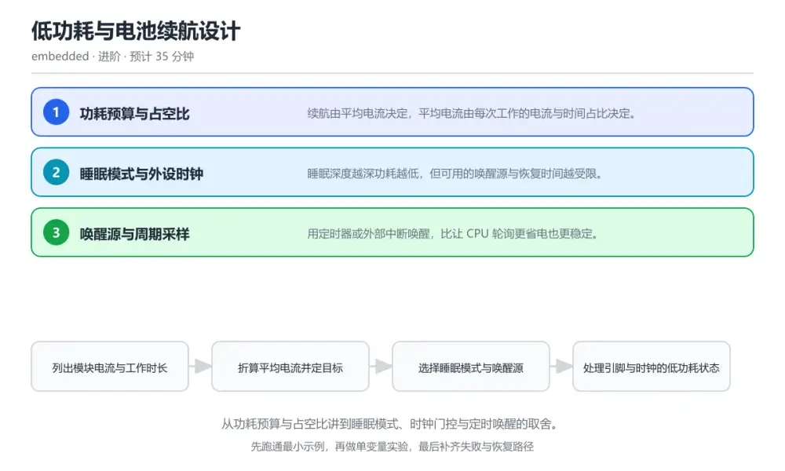

# 低功耗与电池续航设计

> 内容更新时间：2026-10-06 · 学习阶段：进阶 · 预计用时：40 分钟

分类：embedded。关键词：低功耗、睡眠模式、占空比、时钟门控、唤醒源。从功耗预算与占空比讲到睡眠模式、时钟门控与定时唤醒的取舍。



## 本节知识框架

**课程定位**：所属分类 `embedded`（嵌入式与物联网），课程主题 `低功耗与电池续航设计`，学习阶段 进阶，建议用时 40 分钟。

本课主线：从功耗预算与占空比讲到睡眠模式、时钟门控与定时唤醒的取舍。

**学完本课应当能够**
- 说清 `占空比` 与 `停止模式` 的含义与区别，并各举一个正例和一个反例。
- 用本课示例验证 `待机模式` 的行为，记录输入、输出与失败条件。
- 遇到「睡眠电流远高于手册值」这类问题时，能说出触发条件与修复顺序。

### 从概念到验证的学习链条

1. `占空比`：先掌握 设备处于工作状态的时间占总时间的比例，再用它解释 `停止模式` 为什么会出现。
2. `停止模式`：先掌握 关闭主时钟保留部分电源域的低功耗状态，可被中断唤醒，再用它解释 `待机模式` 为什么会出现。
3. `待机模式`：先掌握 更深睡眠状态，唤醒后通常从头开始执行程序，再用它解释 `时钟门控` 为什么会出现。
4. `时钟门控`：先掌握 关闭不使用外设的时钟以消除其动态功耗，再用它解释 `漏电流` 为什么会出现。
5. `漏电流`：先掌握 器件在非活动状态下仍持续消耗的电流，再用它解释 本课示例的观察结果 为什么会出现。

**先修与衔接**：本课是「嵌入式与物联网」分类的第 7 课。当前没有登记显式先修或后续课程；课程主线是从功耗预算与占空比讲到睡眠模式、时钟门控与定时唤醒的取舍。学完后按 `embedded` 分类顺序继续。

### 完成判据

- **定义关**：不看正文也能说明 `占空比` 是 设备处于工作状态的时间占总时间的比例，并指出一个反例。
- **机制关**：能按“输入 → 转换 → 输出 → 验证”复述 `低功耗与电池续航设计`，而不是只背结论。
- **示例关**：能运行或推演 `低功耗与电池续航设计` 的 `text` 示例，并说明一个真实出现的标识符或字面量。
- **证据关**：能指出 `低功耗与电池续航设计` 示例里的 调用了 `enter_stop_mode_until_rtc()`，并说明它支持或反驳了本课的哪一条结论。
- **排错关**：能复现 睡眠电流远高于手册值，记录现象并按 睡眠前把未用引脚设为模拟输入或输出低电平，关闭调试引脚并断开不用的上拉 修复。
- **迁移关**：能把 `低功耗`、`睡眠模式`、`占空比`、`时钟门控` 放进一个与 `低功耗与电池续航设计` 不同的项目场景，并保持输入与验证条件可追踪。
- **复盘关**：学完 `低功耗与电池续航设计` 后，用一句话写下仍然不确定的结论，并列出下一次验证需要的输入、环境和成功判据。

### 复习清单

- [ ] 能不看正文复述本课核心术语，并指出一个边界或反例。
- [ ] 能运行或推演本课示例，记录输入、输出与失败现象。
- [ ] 能完成一次自测，并把错题对照错误表定位原因。

**本课配图**


## 核心概念定义

| 术语 | 操作性定义 | 常见边界与风险 |
| --- | --- | --- |
| 占空比 | 设备处于工作状态的时间占总时间的比例。 | 缓存与状态残留会让结果过期，先明确失效策略再判断正确性。 |
| 停止模式 | 关闭主时钟保留部分电源域的低功耗状态，可被中断唤醒。 | 缓存与状态残留会让结果过期，先明确失效策略再判断正确性。 |
| 待机模式 | 更深睡眠状态，唤醒后通常从头开始执行程序。 | 缓存与状态残留会让结果过期，先明确失效策略再判断正确性。 |
| 时钟门控 | 关闭不使用外设的时钟以消除其动态功耗。 | 只在「关闭不使用外设的时钟以消除其动态功耗」这一前提下成立，换输入或换环境要重新验证。 |
| 漏电流 | 器件在非活动状态下仍持续消耗的电流。 | 缓存与状态残留会让结果过期，先明确失效策略再判断正确性。 |

## 原理与运行机制

### 机制总览

**教材衔接：核心知识**

### 1. 功耗预算与占空比

续航由平均电流决定，平均电流由每次工作的电流与时间占比决定。

把运行、接收、发送与睡眠四个状态的电流乘以各自时长占比后相加，得到平均电流，再用电池容量除以平均电流估算续航。

在低功耗与电池续航设计里可以这样验证：在本课示例里改采样周期从一秒到一分钟，观察平均电流与续航天数的变化。

边界：只测睡眠电流不看唤醒时间，会低估唤醒瞬间的功耗，短周期场景误差尤其大。

工程视角：把每个状态的电流与时长写进表格，用实测值替换手册典型值，续航估算才可信。

### 2. 睡眠模式与外设时钟

睡眠深度越深功耗越低，但可用的唤醒源与恢复时间越受限。

进入睡眠前关闭不用的外设时钟与分频器，把引脚设为确定的低功耗状态，按需要选择停止模式或待机模式并配置唤醒通道。

在低功耗与电池续航设计里可以这样验证：在本课示例里分别在运行、停止与待机模式下测电流，记录唤醒所需时间。

边界：悬空引脚与外部上拉在睡眠时会持续漏电流，走线残留与电平不确定的引脚常常是漏电主因。

工程视角：把睡眠前的收尾动作写成统一函数，保证时钟、引脚与调试接口状态一致，避免漏配。

### 3. 唤醒源与周期采样

用定时器或外部中断唤醒，比让 CPU 轮询更省电也更稳定。

RTC 按周期产生唤醒事件，中断服务程序只做必要的抓取与入队，主循环处理完成后立刻回到睡眠，形成事件驱动的节奏。

在低功耗与电池续航设计里可以这样验证：在本课示例里用 RTC 每十秒唤醒采集一次温度，其余时间保持停止模式。

边界：唤醒过于频繁会让平均电流被唤醒开销主导，收益被吞掉。

工程视角：把唤醒周期做成可配置参数，并在固件里统计每日唤醒次数用于核对功耗模型。

### 机制拆解：每一步的输入、动作与输出

#### 1. `占空比`
- 输入：`低功耗`；本步把 设备处于工作状态的时间占总时间的比例 当作判断规则。
- 动作：围绕 `占空比` 保留中间状态，并记录它与 `停止模式` 的对应关系。
- 输出：`停止模式`，它可以被下一段代码、测试或记录继续使用。
- `占空比` 的失败条件：缓存与状态残留会让结果过期，先明确失效策略再判断正确性。

#### 2. `停止模式`
- 输入：`占空比`；本步把 关闭主时钟保留部分电源域的低功耗状态，可被中断唤醒 当作判断规则。
- 动作：围绕 `停止模式` 保留中间状态，并记录它与 `待机模式` 的对应关系。
- 输出：`待机模式`，它可以被下一段代码、测试或记录继续使用。
- `停止模式` 的失败条件：缓存与状态残留会让结果过期，先明确失效策略再判断正确性。

#### 3. `待机模式`
- 输入：`停止模式`；本步把 更深睡眠状态，唤醒后通常从头开始执行程序 当作判断规则。
- 动作：围绕 `待机模式` 保留中间状态，并记录它与 `时钟门控` 的对应关系。
- 输出：`时钟门控`，它可以被下一段代码、测试或记录继续使用。
- `待机模式` 的失败条件：缓存与状态残留会让结果过期，先明确失效策略再判断正确性。

#### 4. `时钟门控`
- 输入：`待机模式`；本步把 关闭不使用外设的时钟以消除其动态功耗 当作判断规则。
- 动作：围绕 `时钟门控` 保留中间状态，并记录它与 `漏电流` 的对应关系。
- 输出：`漏电流`，它可以被下一段代码、测试或记录继续使用。
- `时钟门控` 的失败条件：只在「关闭不使用外设的时钟以消除其动态功耗」这一前提下成立，换输入或换环境要重新验证。

#### 5. `漏电流`
- 输入：`时钟门控`；本步把 器件在非活动状态下仍持续消耗的电流 当作判断规则。
- 动作：围绕 `漏电流` 保留中间状态，并记录它与 `enter_stop_mode_until_rtc` 的对应关系。
- 输出：`enter_stop_mode_until_rtc`，它可以被下一段代码、测试或记录继续使用。
- `漏电流` 的失败条件：缓存与状态残留会让结果过期，先明确失效策略再判断正确性。

### 示例中的可观察事实

1. 调用了 `enter_stop_mode_until_rtc()`；它对应的课程主题是 `低功耗与电池续航设计`。
2. 调用了 `__HAL_RCC_ADC1_CLK_DISABLE()`；它对应的课程主题是 `低功耗与电池续航设计`。
3. 调用了 `__HAL_RCC_USART2_CLK_DISABLE()`；它对应的课程主题是 `低功耗与电池续航设计`。
4. 调用了 `low_power_gpio_config()`；它对应的课程主题是 `低功耗与电池续航设计`。
5. 调用了 `HAL_RTCEx_DeactivateWakeUpTimer()`；它对应的课程主题是 `低功耗与电池续航设计`。
6. 调用了 `HAL_RTCEx_SetWakeUpTimer_IT()`；它对应的课程主题是 `低功耗与电池续航设计`。
7. 调用了 `HAL_PWR_EnterSTOPMode()`；它对应的课程主题是 `低功耗与电池续航设计`。
8. 调用了 `SystemClock_Config()`；它对应的课程主题是 `低功耗与电池续航设计`。

### 复现实验记录

- 环境：`低功耗与电池续航设计` 使用 `text` 示例，固定 `低功耗`、`睡眠模式`、`占空比`、`时钟门控` 作为第一组条件。
- 首轮输入：先确认 调用了 `enter_stop_mode_until_rtc()`，预测 `占空比` 会怎样变化。
- 基线观察：记录命令、输入、输出和错误原文，不用截图代替可复制的文本。
- 单变量修改：只改变 `低功耗`，观察 `漏电流` 是否仍满足定义。
- 失败注入：复现 睡眠电流远高于手册值，确认现象是 引脚保持悬空输入，调试接口与外部上拉继续耗电。
- 记录结论：把“修改前、修改后、预期变化、实际变化”写成四列表，这样复盘 `低功耗与电池续航设计` 时才能区分概念错误与实现错误。

## 典型应用场景

**教材衔接：深度拓展与实战**

### 机制拆解 1：功耗预算与占空比

把运行、接收、发送与睡眠四个状态的电流乘以各自时长占比后相加，得到平均电流，再用电池容量除以平均电流估算续航。

落地时先确认前提：只测睡眠电流不看唤醒时间，会低估唤醒瞬间的功耗，短周期场景误差尤其大。再把结论写进检查表，让下一位同学可以按同样的输入复现。

工程做法：把每个状态的电流与时长写进表格，用实测值替换手册典型值，续航估算才可信。

### 机制拆解 2：睡眠模式与外设时钟

进入睡眠前关闭不用的外设时钟与分频器，把引脚设为确定的低功耗状态，按需要选择停止模式或待机模式并配置唤醒通道。

落地时先确认前提：悬空引脚与外部上拉在睡眠时会持续漏电流，走线残留与电平不确定的引脚常常是漏电主因。再把结论写进检查表，让下一位同学可以按同样的输入复现。

工程做法：把睡眠前的收尾动作写成统一函数，保证时钟、引脚与调试接口状态一致，避免漏配。

### 机制拆解 3：唤醒源与周期采样

RTC 按周期产生唤醒事件，中断服务程序只做必要的抓取与入队，主循环处理完成后立刻回到睡眠，形成事件驱动的节奏。

落地时先确认前提：唤醒过于频繁会让平均电流被唤醒开销主导，收益被吞掉。再把结论写进检查表，让下一位同学可以按同样的输入复现。

工程做法：把唤醒周期做成可配置参数，并在固件里统计每日唤醒次数用于核对功耗模型。

### 机制对照表

| 概念 | 解决什么问题 | 关键前提 | 失败信号 |
| --- | --- | --- | --- |
| 功耗预算与占空比 | 续航由平均电流决定，平均电流由每次工作的电流与时间占比决定。 | 只测睡眠电流不看唤醒时间，会低估唤醒瞬间的功耗，短周期场景误差尤其大。 | 把每个状态的电流与时长写进表格，用实测值替换手册典型值，续航估算才可信。 |
| 睡眠模式与外设时钟 | 睡眠深度越深功耗越低，但可用的唤醒源与恢复时间越受限。 | 悬空引脚与外部上拉在睡眠时会持续漏电流，走线残留与电平不确定的引脚常常是 | 把睡眠前的收尾动作写成统一函数，保证时钟、引脚与调试接口状态一致，避免漏 |
| 唤醒源与周期采样 | 用定时器或外部中断唤醒，比让 CPU 轮询更省电也更稳定。 | 唤醒过于频繁会让平均电流被唤醒开销主导，收益被吞掉。 | 把唤醒周期做成可配置参数，并在固件里统计每日唤醒次数用于核对功耗模型。 |

### 自测问答

**问 1**：把采样周期从 1 秒拉长到 60 秒，平均电流通常会怎样变化？

**答**：明显下降，因为睡眠时间占比更高。平均电流由工作与睡眠的时间占比加权得到，唤醒间隔拉长后睡眠占比提高，平均电流随之下降。 正确选项「明显下降，因为睡眠时间占比更高」对应《低功耗与电池续航设计》的要点「功耗预算与占空比」：续航由平均电流决定，平均电流由每次工作的电流与时间占比决定。判断「功耗预算与占空比」时先确认前提是否成立，再回到《低功耗与电池续航设计》的示例核对一次；把别的语言或框架的默认做法直接搬到功耗预算与占空比上，往往会在本课的边界条件里失效。

**问 2**：睡眠前把未用引脚设为悬空输入，最可能的后果是？

**答**：引脚电平不定带来额外漏电。悬空输入的电平不定，输入缓冲会因中间电平产生额外电流，低功耗设计中应把未用引脚固定为确定状态。 正确选项「引脚电平不定带来额外漏电」对应《低功耗与电池续航设计》的要点「睡眠模式与外设时钟」：睡眠深度越深功耗越低，但可用的唤醒源与恢复时间越受限。判断「睡眠模式与外设时钟」时先确认前提是否成立，再回到《低功耗与电池续航设计》的示例核对一次；借鉴相邻主题的经验之前，先核对睡眠模式与外设时钟的前提是否成立。

**问 3**：降低平均电流可以采取哪些做法？（多选）

**答**：拉长采样与上报周期；睡眠前关闭不用的外设时钟；用中断唤醒代替主循环轮询。拉长周期、关闭时钟、事件驱动唤醒都能降低平均电流；调试接口与外部上拉常在睡眠期间持续耗电，应一并处理。 正确选项「拉长采样与上报周期；睡眠前关闭不用的外设时钟；用中断唤醒代替主循环轮询」对应《低功耗与电池续航设计》的要点「唤醒源与周期采样」：用定时器或外部中断唤醒，比让 CPU 轮询更省电也更稳定。判断「唤醒源与周期采样」时先确认前提是否成立，再回到《低功耗与电池续航设计》的示例核对一次；记住唤醒源与周期采样的结论之外还要记住适用条件，换一个输入往往就不成立了。

**问 4**：请按一次低功耗采集循环的顺序排列。

**答**：RTC 定时到达唤醒 CPU。唤醒后先恢复时钟与外设，再采集处理，结束前完成收尾动作回到睡眠，形成稳定的低功耗循环。 正确选项「RTC 定时到达唤醒 CPU；恢复时钟并初始化外设；采集并处理一次数据；关闭外设与引脚并准备睡眠；再次进入停止模式」对应《低功耗与电池续航设计》的要点「功耗预算与占空比」：续航由平均电流决定，平均电流由每次工作的电流与时间占比决定。判断「功耗预算与占空比」时先确认前提是否成立，再回到《低功耗与电池续航设计》的示例核对一次；干扰项常常是相邻主题里成立的结论，只有按功耗预算与占空比的输入与约束判断才能排除。

**问 5**：阅读这段低功耗切换代码，主要缺陷是什么？

**答**：进入睡眠前没有重配引脚，悬空引脚会持续漏电。代码只停了 ADC 就直接进入停止模式，未用引脚与外设时钟仍保持原状，实测电流会明显高于模型；应先执行统一的低功耗收尾函数。 正确选项「进入睡眠前没有重配引脚，悬空引脚会持续漏电」对应《低功耗与电池续航设计》的要点「睡眠模式与外设时钟」：睡眠深度越深功耗越低，但可用的唤醒源与恢复时间越受限。判断「睡眠模式与外设时钟」时先确认前提是否成立，再回到《低功耗与电池续航设计》的示例核对一次；把睡眠模式与外设时钟的做法换到别的约束下未必成立，先确认边界再决定答案。


### 工程检查表

- [ ] 列出模块电流与工作时长
- [ ] 折算平均电流并定目标
- [ ] 选择睡眠模式与唤醒源
- [ ] 处理引脚与时钟的低功耗状态
- [ ] 实测电流并校准模型
- [ ] 【功耗预算与占空比】把每个状态的电流与时长写进表格，用实测值替换手册典型值，续航估算才可信。
- [ ] 【睡眠模式与外设时钟】把睡眠前的收尾动作写成统一函数，保证时钟、引脚与调试接口状态一致，避免漏配。
- [ ] 【唤醒源与周期采样】把唤醒周期做成可配置参数，并在固件里统计每日唤醒次数用于核对功耗模型。


### 结论与下一步

- **睡眠电流远高于手册值**：典型现象是引脚保持悬空输入，调试接口与外部上拉继续耗电；正确做法是睡眠前把未用引脚设为模拟输入或输出低电平，关闭调试引脚并断开不用的上拉。
- **唤醒一次没有采集到数据**：典型现象是唤醒后没有重新初始化外设就直接读取；正确做法是唤醒后按固定顺序恢复时钟并重新初始化 ADC、串口等外设，再开始采集。
- **续航估算与实测差很多**：典型现象是用典型值估算且忽略每次唤醒的开销；正确做法是用实测电流替换手册值，把唤醒一次的耗时与电流计入平均电流模型。

### 最小验证场景

- 准备：保留 `text` 示例的原始输入，先记录 `低功耗与电池续航设计` 的基线输出和完整运行命令。
- 观察：先核对 调用了 `enter_stop_mode_until_rtc()`，再改变一个与 `占空比` 相关的条件。
- 判定：新结果与 `低功耗与电池续航设计` 的基线不同不等于错误；只有当差异破坏了 `占空比` 的定义或错误表中的约束，才判定为失败。

### 选择与边界

- 使用 `占空比` 时，先满足它的定义：设备处于工作状态的时间占总时间的比例；缓存与状态残留会让结果过期，先明确失效策略再判断正确性。
- 使用 `停止模式` 时，先满足它的定义：关闭主时钟保留部分电源域的低功耗状态，可被中断唤醒；缓存与状态残留会让结果过期，先明确失效策略再判断正确性。
- 使用 `待机模式` 时，先满足它的定义：更深睡眠状态，唤醒后通常从头开始执行程序；缓存与状态残留会让结果过期，先明确失效策略再判断正确性。
- 使用 `时钟门控` 时，先满足它的定义：关闭不使用外设的时钟以消除其动态功耗；只在「关闭不使用外设的时钟以消除其动态功耗」这一前提下成立，换输入或换环境要重新验证。
- 使用 `漏电流` 时，先满足它的定义：器件在非活动状态下仍持续消耗的电流；缓存与状态残留会让结果过期，先明确失效策略再判断正确性。

## 代码/协议/SQL 示例

**教材衔接：关键流程**

```text
列出模块电流与工作时长 → 折算平均电流并定目标 → 选择睡眠模式与唤醒源 → 处理引脚与时钟的低功耗状态 → 实测电流并校准模型
```

1. 列出模块电流与工作时长
2. 折算平均电流并定目标
3. 选择睡眠模式与唤醒源
4. 处理引脚与时钟的低功耗状态
5. 实测电流并校准模型

```c
static void enter_stop_mode_until_rtc(void) {
    // 1. 关闭不用外设的时钟，减少静态功耗
    __HAL_RCC_ADC1_CLK_DISABLE();
    __HAL_RCC_USART2_CLK_DISABLE();

    // 2. 把所有 GPIO 设为模拟输入，消除悬空漏电
    low_power_gpio_config();

    // 3. 清除并开启 RTC 唤醒中断，再进入停止模式
    HAL_RTCEx_DeactivateWakeUpTimer(&hrtc);
    HAL_RTCEx_SetWakeUpTimer_IT(&hrtc, WAKEUP_TICKS, RTC_WAKEUPCLOCK_RTCCLK_DIV16);
    HAL_PWR_EnterSTOPMode(PWR_LOWPOWERREGULATOR_ON, PWR_STOPENTRY_WFI);

    // 4. 唤醒后恢复时钟，重新初始化外设
    SystemClock_Config();
    MX_ADC1_Init();
}
```

### 示例精读：先找证据，再改一个条件

1. 调用了 `enter_stop_mode_until_rtc()`；它出现在 `低功耗与电池续航设计` 的示例中，阅读时先确认它前后各发生了什么。
2. 调用了 `__HAL_RCC_ADC1_CLK_DISABLE()`；它出现在 `低功耗与电池续航设计` 的示例中，阅读时先确认它前后各发生了什么。
3. 调用了 `__HAL_RCC_USART2_CLK_DISABLE()`；它出现在 `低功耗与电池续航设计` 的示例中，阅读时先确认它前后各发生了什么。
4. 调用了 `low_power_gpio_config()`；它出现在 `低功耗与电池续航设计` 的示例中，阅读时先确认它前后各发生了什么。
5. 调用了 `HAL_RTCEx_DeactivateWakeUpTimer()`；它出现在 `低功耗与电池续航设计` 的示例中，阅读时先确认它前后各发生了什么。
6. 调用了 `HAL_RTCEx_SetWakeUpTimer_IT()`；它出现在 `低功耗与电池续航设计` 的示例中，阅读时先确认它前后各发生了什么。
7. 调用了 `HAL_PWR_EnterSTOPMode()`；它出现在 `低功耗与电池续航设计` 的示例中，阅读时先确认它前后各发生了什么。
8. 调用了 `SystemClock_Config()`；它出现在 `低功耗与电池续航设计` 的示例中，阅读时先确认它前后各发生了什么。
- 在 `低功耗与电池续航设计` 中与 `占空比` 对照：示例必须能支持 设备处于工作状态的时间占总时间的比例，否则说明这一段还缺少实现或验证步骤。
- 在 `低功耗与电池续航设计` 中与 `停止模式` 对照：示例必须能支持 关闭主时钟保留部分电源域的低功耗状态，可被中断唤醒，否则说明这一段还缺少实现或验证步骤。
- 在 `低功耗与电池续航设计` 中与 `待机模式` 对照：示例必须能支持 更深睡眠状态，唤醒后通常从头开始执行程序，否则说明这一段还缺少实现或验证步骤。
- 在 `低功耗与电池续航设计` 中与 `时钟门控` 对照：示例必须能支持 关闭不使用外设的时钟以消除其动态功耗，否则说明这一段还缺少实现或验证步骤。

## 时间/空间复杂度或性能分析

**性能关注点（低功耗与电池续航设计）**：资源受限是前提：记录 Flash/RAM 占用、中断延迟与功耗。

**测量方法**：以 `低功耗与电池续航设计` 的 `低功耗` 场景为对象，固定输入跑一遍记录基线，再把规模或并发度提高一个数量级复测；两次结果的差值与波动范围才是结论依据。

### 需要控制的变量与记录项

- `低功耗与电池续航设计` 的 `低功耗`：固定它的版本、输入范围和资源上限，分别记录速度、内存与失败率的变化。
- `低功耗与电池续航设计` 的 `睡眠模式`：固定它的版本、输入范围和资源上限，分别记录速度、内存与失败率的变化。
- `低功耗与电池续航设计` 的 `占空比`：固定它的版本、输入范围和资源上限，分别记录速度、内存与失败率的变化。
- `低功耗与电池续航设计` 的 `时钟门控`：固定它的版本、输入范围和资源上限，分别记录速度、内存与失败率的变化。
- `低功耗与电池续航设计` 的 `唤醒源`：固定它的版本、输入范围和资源上限，分别记录速度、内存与失败率的变化。
- `低功耗与电池续航设计` 中 `占空比` 的边界：缓存与状态残留会让结果过期，先明确失效策略再判断正确性。达到边界时不要外推，必须重新测量。
- `低功耗与电池续航设计` 中 `停止模式` 的边界：缓存与状态残留会让结果过期，先明确失效策略再判断正确性。达到边界时不要外推，必须重新测量。
- `低功耗与电池续航设计` 中 `待机模式` 的边界：缓存与状态残留会让结果过期，先明确失效策略再判断正确性。达到边界时不要外推，必须重新测量。
- `低功耗与电池续航设计` 中 `时钟门控` 的边界：只在「关闭不使用外设的时钟以消除其动态功耗」这一前提下成立，换输入或换环境要重新验证。达到边界时不要外推，必须重新测量。
- `低功耗与电池续航设计` 中 `漏电流` 的边界：缓存与状态残留会让结果过期，先明确失效策略再判断正确性。达到边界时不要外推，必须重新测量。
- `低功耗与电池续航设计` 的代码证据：先验证 调用了 `enter_stop_mode_until_rtc()`，再记录该路径的输入规模与耗时；只看代码行数不能推出复杂度。

## 常见误区与易错点

| 容易写错的做法 | 实际现象 | 原因与正确做法 |
| --- | --- | --- |
| 睡眠电流远高于手册值 | 引脚保持悬空输入，调试接口与外部上拉继续耗电。 | 睡眠前把未用引脚设为模拟输入或输出低电平，关闭调试引脚并断开不用的上拉。 |
| 唤醒一次没有采集到数据 | 唤醒后没有重新初始化外设就直接读取。 | 唤醒后按固定顺序恢复时钟并重新初始化 ADC、串口等外设，再开始采集。 |
| 续航估算与实测差很多 | 用典型值估算且忽略每次唤醒的开销。 | 用实测电流替换手册值，把唤醒一次的耗时与电流计入平均电流模型。 |

### 现场 1：睡眠电流远高于手册值

**症状**：引脚保持悬空输入，调试接口与外部上拉继续耗电。

**根因与修复**：睡眠前把未用引脚设为模拟输入或输出低电平，关闭调试引脚并断开不用的上拉。

**自检**：在本课示例里复现「睡眠电流远高于手册值」，改成睡眠前把未用引脚设为模拟输入或输出低电平，关闭调试引脚并断开不用的上拉后重跑；如果症状消失且失败路径按预期变化，说明定位正确。

### 现场 2：唤醒一次没有采集到数据

**症状**：唤醒后没有重新初始化外设就直接读取。

**根因与修复**：唤醒后按固定顺序恢复时钟并重新初始化 ADC、串口等外设，再开始采集。

**自检**：在本课示例里复现「唤醒一次没有采集到数据」，改成唤醒后按固定顺序恢复时钟并重新初始化 ADC、串口等外设，再开始采集后重跑；如果症状消失且失败路径按预期变化，说明定位正确。

### 现场 3：续航估算与实测差很多

**症状**：用典型值估算且忽略每次唤醒的开销。

**根因与修复**：用实测电流替换手册值，把唤醒一次的耗时与电流计入平均电流模型。

**自检**：在本课示例里复现「续航估算与实测差很多」，改成用实测电流替换手册值，把唤醒一次的耗时与电流计入平均电流模型后重跑；如果症状消失且失败路径按预期变化，说明定位正确。

## 与其他知识点的关系

**教材衔接：复习与迁移**


### 迁移练习

- **术语归属**：`占空比`、`停止模式`、`待机模式` 的定义以本课「核心概念定义」为准，换到其他课程时先确认定义是否被改写。

### 容易混淆的相邻概念

- `占空比` 与 `停止模式`：前者强调 设备处于工作状态的时间占总时间的比例；后者强调 关闭主时钟保留部分电源域的低功耗状态，可被中断唤醒。判断时分别检查两条定义的适用范围，不要只看名称相似就互换。
- `停止模式` 与 `待机模式`：前者强调 关闭主时钟保留部分电源域的低功耗状态，可被中断唤醒；后者强调 更深睡眠状态，唤醒后通常从头开始执行程序。判断时分别检查两条定义的适用范围，不要只看名称相似就互换。
- `待机模式` 与 `时钟门控`：前者强调 更深睡眠状态，唤醒后通常从头开始执行程序；后者强调 关闭不使用外设的时钟以消除其动态功耗。判断时分别检查两条定义的适用范围，不要只看名称相似就互换。
- `时钟门控` 与 `漏电流`：前者强调 关闭不使用外设的时钟以消除其动态功耗；后者强调 器件在非活动状态下仍持续消耗的电流。判断时分别检查两条定义的适用范围，不要只看名称相似就互换。

## 自测题与参考答案

> 先独立作答，再对照参考答案；答案都能在本课正文、术语表或错误表里找到依据。

### 自测 1（概念复述）

不看正文，写出 `占空比` 的操作性定义，并说明它与 `停止模式` 的区别。

**参考答案**：设备处于工作状态的时间占总时间的比例。

`停止模式` 的定位是：关闭主时钟保留部分电源域的低功耗状态，可被中断唤醒；两者的差别要从适用对象与失败模式上说明。

### 自测 2（排错）

本课错误表记录了「睡眠电流远高于手册值」这类做法。请写出它会出现的现象、根因，以及修复顺序。

**参考答案**：现象是引脚保持悬空输入，调试接口与外部上拉继续耗电；正确做法是睡眠前把未用引脚设为模拟输入或输出低电平，关闭调试引脚并断开不用的上拉。修复时先复现现象并保留证据，再改动一处假设重跑，确认现象消失。

### 自测 3（动手验证）

运行本课的 `text` 示例，改动其中一个输入后重新运行，记录输出与错误信息。

**参考答案**：正常输入下 `text` 示例应当复现正文给出的结果；改动输入后，如果结果改变或报错，先核对它是否满足 `低功耗与电池续航设计` 中`占空比` 的适用范围，再检查错误表里是否有同类现象。

### 自测 4（代码阅读）

阅读本课开头的 `text` 示例，说明它体现了`占空比` 的哪一条性质，并指出改动哪个输入会让这条性质不再成立。

**参考答案**：`占空比` 的定义是 设备处于工作状态的时间占总时间的比例，示例正是在实现这条定义。改动与 `占空比` 有关的一个输入后，如果结果不再符合 `低功耗与电池续航设计` 的正文描述，就说明该性质只在当前前提成立。

### 自测 5（迁移）

把 `低功耗与电池续航设计` 的方法迁移到自己的项目：围绕 `占空比` 写出一个与错误表同类的风险点，并说明触发条件和检验方式。

**参考答案**：例如「续航估算与实测差很多」，它会导致用典型值估算且忽略每次唤醒的开销；检验方式是按用实测电流替换手册值，把唤醒一次的耗时与电流计入平均电流模型改一处再复现，确认现象消失且没有引入新的失败分支。

### 自测 6（对比）

用一个表格对比 `占空比` 与 `停止模式`：各写一行适用场景、一行失败表现。

**参考答案**：`占空比` 的定义是设备处于工作状态的时间占总时间的比例；`停止模式` 的定义是关闭主时钟保留部分电源域的低功耗状态，可被中断唤醒。两者的失败表现分别对应本课错误表里与本术语相关的行。

### 自测 7（排错顺序）

面对「睡眠电流远高于手册值」引发的问题，请把“复现 引脚保持悬空输入，调试接口与外部上拉继续耗电 → 保留证据 → 睡眠前把未用引脚设为模拟输入或输出低电平，关闭调试引脚并断开不用的上拉 → 回归验证”四步写成可执行的检查清单。

**参考答案**：第一步按引脚保持悬空输入，调试接口与外部上拉继续耗电复现；第二步记录输入、版本与完整报错；第三步按睡眠前把未用引脚设为模拟输入或输出低电平，关闭调试引脚并断开不用的上拉只改一处；第四步重跑并确认失败路径也按预期变化。

### 自测 8（边界判断）

针对 `漏电流`，分别写出“可以使用”的条件和“结论不再成立”的条件。

**参考答案**：缓存与状态残留会让结果过期，先明确失效策略再判断正确性。 同时要把 `漏电流` 的定义 器件在非活动状态下仍持续消耗的电流 与实际输入逐项对照。

### 自测 9（机制重建）

不看正文，按输入、转换、输出、验证四段重建 `占空比` → `停止模式` → `待机模式` → `时钟门控` 的作用链。

**参考答案**：起点是 `占空比` 的定义 设备处于工作状态的时间占总时间的比例；中间每一步都保留可观察状态；终点由 `漏电流` 检查，失败时回到错误表定位第一个偏离定义的步骤。

### 自测 10（综合排错）

在 `低功耗与电池续航设计` 中，现象是 用典型值估算且忽略每次唤醒的开销。请围绕 续航估算与实测差很多 写出最小复现、关键证据、修复动作和回归验证，并说明为什么不能只凭一次运行下结论。

**参考答案**：先复现 续航估算与实测差很多，记录输入与完整错误；再按 用实测电流替换手册值，把唤醒一次的耗时与电流计入平均电流模型 只改一处。回归时同时跑正常路径和边界路径，只有两次结果都可解释，才把修复视为完成。

### 自测 11（一分钟复述）

用每分钟约 200 字的速度复述 `低功耗与电池续航设计`：先给主问题，再按顺序说出 `占空比`、`停止模式`、`待机模式`、`时钟门控`，最后给一个失败案例。

**自评标准**：主问题必须对应 从功耗预算与占空比讲到睡眠模式、时钟门控与定时唤醒的取舍；每个术语都要能接上一句定义或边界；失败案例必须写成可观察现象，不能用“可能有风险”代替证据。

## 术语速查

| 术语 | 一句话说明 |
| --- | --- |
| `占空比` | 设备处于工作状态的时间占总时间的比例。 |
| `停止模式` | 关闭主时钟保留部分电源域的低功耗状态，可被中断唤醒。 |
| `待机模式` | 更深睡眠状态，唤醒后通常从头开始执行程序。 |
| `时钟门控` | 关闭不使用外设的时钟以消除其动态功耗。 |
| `漏电流` | 器件在非活动状态下仍持续消耗的电流。 |

**术语关系**：`占空比`（设备处于工作状态的时间占总时间的比例） → `停止模式`（关闭主时钟保留部分电源域的低功耗状态） → `待机模式`（更深睡眠状态） → `时钟门控`（关闭不使用外设的时钟以消除其动态功耗）。

## 考点精讲

`低功耗与电池续航设计` 的题库有 5 道题，下面逐题给出题干、正确项与判断依据：先自己作答，再核对正确项，最后回到正文对应小节复核。

### 考点 1：第 1 题

- **题目**：把采样周期从 1 秒拉长到 60 秒，平均电流通常会怎样变化？
- **正确项**：明显下降，因为睡眠时间占比更高
- **判断依据**：这道题检验本课主问题：从功耗预算与占空比讲到睡眠模式、时钟门控与定时唤醒的取舍。复习时先复述本课主问题，再举一个会让结论失效的输入。

### 考点 2：第 2 题

- **题目**：睡眠前把未用引脚设为悬空输入，最可能的后果是？
- **正确项**：引脚电平不定带来额外漏电
- **判断依据**：这道题检验本课主问题：从功耗预算与占空比讲到睡眠模式、时钟门控与定时唤醒的取舍。复习时先复述本课主问题，再举一个会让结论失效的输入。

### 考点 3：第 3 题

- **题目**：降低平均电流可以采取哪些做法？（多选）
- **正确项**：拉长采样与上报周期；睡眠前关闭不用的外设时钟；用中断唤醒代替主循环轮询
- **判断依据**：这道题检验本课主问题：从功耗预算与占空比讲到睡眠模式、时钟门控与定时唤醒的取舍。复习时先复述本课主问题，再举一个会让结论失效的输入。

### 考点 4：第 4 题

- **题目**：请按一次低功耗采集循环的顺序排列。
- **正确项**：RTC 定时到达唤醒 CPU → 恢复时钟并初始化外设 → 采集并处理一次数据 → 关闭外设与引脚并准备睡眠 → 再次进入停止模式
- **判断依据**：这道题落在术语 `停止模式` 上：关闭主时钟保留部分电源域的低功耗状态，可被中断唤醒。复习时把 `停止模式` 的定义、适用边界和一个反例一起说清楚，再回到「核心概念定义」核对原文。

### 考点 5：第 5 题

- **题目**：阅读这段低功耗切换代码，主要缺陷是什么？
- **正确项**：进入睡眠前没有重配引脚，悬空引脚会持续漏电
- **判断依据**：这道题检验本课主问题：从功耗预算与占空比讲到睡眠模式、时钟门控与定时唤醒的取舍。复习时先复述本课主问题，再举一个会让结论失效的输入。

### 考点 6：`占空比`

- **要点**：设备处于工作状态的时间占总时间的比例。
- **占空比 的边界**：缓存与状态残留会让结果过期，先明确失效策略再判断正确性。

### 考点 7：`停止模式`

- **要点**：关闭主时钟保留部分电源域的低功耗状态，可被中断唤醒。
- **停止模式 的边界**：缓存与状态残留会让结果过期，先明确失效策略再判断正确性。

### 考点 8：`待机模式`

- **要点**：更深睡眠状态，唤醒后通常从头开始执行程序。
- **待机模式 的边界**：缓存与状态残留会让结果过期，先明确失效策略再判断正确性。

### 考点 9：`时钟门控`

- **要点**：关闭不使用外设的时钟以消除其动态功耗。
- **时钟门控 的边界**：只在「关闭不使用外设的时钟以消除其动态功耗」这一前提下成立，换输入或换环境要重新验证。

### 考点 10：`漏电流`

- **要点**：器件在非活动状态下仍持续消耗的电流。
- **漏电流 的边界**：缓存与状态残留会让结果过期，先明确失效策略再判断正确性。

### 考点 11：排错——睡眠电流远高于手册值

- **现象**：引脚保持悬空输入，调试接口与外部上拉继续耗电。
- **处理**：睡眠前把未用引脚设为模拟输入或输出低电平，关闭调试引脚并断开不用的上拉。

### 考点 12：排错——唤醒一次没有采集到数据

- **现象**：唤醒后没有重新初始化外设就直接读取。
- **处理**：唤醒后按固定顺序恢复时钟并重新初始化 ADC、串口等外设，再开始采集。

### 考点 13：综合辨析——`占空比` 与 `漏电流`

- **辨析点**：`占空比` 的定义是 设备处于工作状态的时间占总时间的比例；`漏电流` 的定义是 器件在非活动状态下仍持续消耗的电流。
- **答题要求**：面对 `低功耗与电池续航设计` 的题目，先判断描述的是 `占空比` 还是 `漏电流`，再归到对应定义，最后写出一个会让该定义失效的边界输入。

### 考点 14：排错评分点

- **现象分**：能写出 引脚保持悬空输入，调试接口与外部上拉继续耗电，而不是只写“程序有错”。
- **证据分**：保留触发 睡眠电流远高于手册值 的输入、版本和错误原文。
- **修复分**：按 睡眠前把未用引脚设为模拟输入或输出低电平，关闭调试引脚并断开不用的上拉 只改一处，并同时回归正常路径与边界路径。

## 内容元数据

- 内容版本：v2.0
- 最后更新：2026-10-06
- 学习阶段：进阶

| 字段 | 值 |
| --- | --- |
| 课程 ID | `embedded_low_power` |
| 所属分类 | `embedded` |
| 难度 | 进阶 |
| 预计用时 | 35 分钟 |
| 关键词 | 低功耗、睡眠模式、占空比、时钟门控、唤醒源 |
| 配图 | `images/lesson_embedded_low_power.webp` |
| 参考资料 | 2 条 |
| 内容更新时间 | 2026-10-06 |

## 参考资料与复核

- 来源性质：官方文档、标准或权威教材；本课核对关键词：低功耗、睡眠模式、占空比、时钟门控、唤醒源。
- 最后复核：2026-10-04
- 下次复核：2027-02-17
- 复核范围：版本兼容、API 行为与工程实践

下面列出的资料用于核对本课结论，复习时可以对照阅读：
- [STM32 低功耗模式应用笔记](https://www.st.com/resource/en/application_note/an3194-using-the-hardware-rtc-and-low-power-modes-of-the-stm32f0xx-microcontrollers-stmicroelectronics.pdf)
- [ARM Cortex-M 低功耗设计指南](https://developer.arm.com/documentation/100166/latest/)

| [本课术语索引：低功耗与电池续航设计](#核心概念定义) | 按本课输入、术语边界和错误表现逐项核对 |
> 复核提示：《低功耗与电池续航设计》的结论如与资料冲突，以资料中的规范文本为准，并在笔记里记录差异与日期。