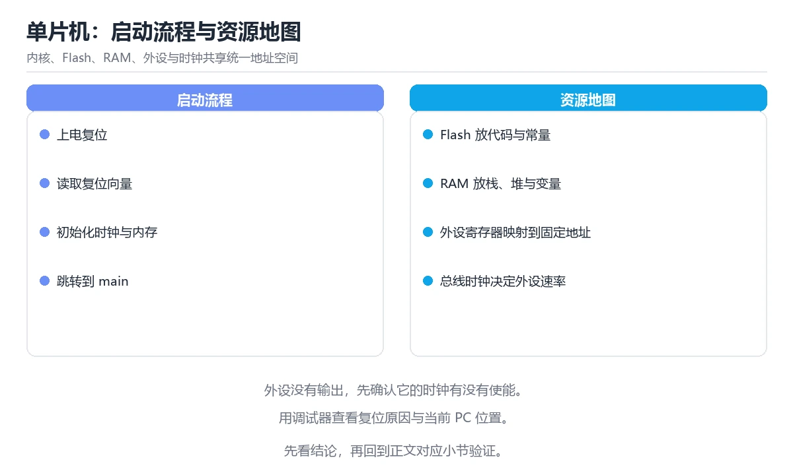

# 单片机与嵌入式系统基础

> 内容更新时间：2026-10-06 · 学习阶段：基础 · 预计用时：30 分钟

分类：embedded。关键词：MCU、时钟、启动流程、内存布局、交叉编译。从 MCU 组成、时钟与复位讲到启动流程、内存布局与交叉编译调试。

学习建议：先通读《单片机与嵌入式系统基础》的核心知识与关键流程，再运行可运行练习并完成测验；遇到不确定的结论，回到「故障现场」按症状、根因、修复、验证四步核对。


## 学习目标

- 能画出 MCU 内部主要模块并说明各自作用。
- 能解释复位后从哪条指令开始执行、时钟如何配置。
- 能区分 Flash、RAM 与外设寄存器的用途。

## 前置知识

- 了解二进制、寄存器与内存地址的概念。
- 能用 C 语言写函数与位运算。
- 知道编译是把源码转换成目标平台指令的过程。

## 核心知识

### 1. MCU 组成与地址空间

单片机把处理器核、Flash、RAM、外设与时钟电路集成在一颗芯片上，它们共享统一地址空间。

程序从 Flash 取指执行，变量放在 RAM，外设通过映射到特定地址的寄存器控制；读写这些寄存器等于配置硬件。

在单片机与嵌入式系统基础里可以这样验证：查阅数据手册，找出 Flash、RAM 与某个外设寄存器的地址范围，标注哪些区域可写。

边界：外设寄存器读写有副作用，重复写入可能触发状态变化，不能像普通变量那样随意访问。

工程视角：用 volatile 修饰寄存器访问，封装硬件操作并提供统一初始化函数，避免散落的魔数。

### 2. 时钟、复位与启动流程

上电后芯片从固定地址取第一条指令，启动代码设置栈指针、初始化时钟与内存，然后跳转到主函数。

复位向量指向启动文件，启动文件按段复制初值、清零未初始化数据，再调用时钟与外设初始化。

在单片机与嵌入式系统基础里可以这样验证：在启动文件与主函数入口各打断点，观察执行顺序与时钟配置前后的寄存器值。

边界：时钟配置错误会导致外设无响应或通信速率错乱，且现象常表现为「代码没错但设备不动」。

工程视角：把时钟树配置写成显式表格并核对频率，初始化失败时用状态灯或日志输出定位。

### 3. 内存布局与段

程序分为代码段、只读数据、已初始化数据、未初始化数据与栈堆区域，各自位于不同内存区域。

已初始化数据的初值存在 Flash，启动时复制到 RAM；未初始化数据在启动时清零；栈与堆在运行时生长。

在单片机与嵌入式系统基础里可以这样验证：在链接脚本里给变量指定段，观察 map 文件中的地址与大小变化。

边界：栈溢出会破坏相邻内存并产生难以复现的异常，堆碎片则会让长期运行设备慢慢失效。

工程视角：开启栈使用量检查或填充标记，限制动态分配，必要时把关键缓冲区放到静态区。

### 4. 交叉编译与在线调试

开发机架构与目标芯片不同，需要交叉编译工具链生成目标指令，再通过调试器下载与单步执行。

工具链包含编译器、链接器与调试服务器；调试接口提供读写内存、断点与寄存器查看能力。

在单片机与嵌入式系统基础里可以这样验证：用工具链编译一个点灯程序，通过调试器下载并单步执行到点亮语句。

边界：优化会改变指令与变量的可见性，调试时通常先关优化，定位问题后再恢复正式构建。

工程视角：固定工具链版本与编译参数，构建产物附带 map 文件，方便比对内存占用变化。

## 关键流程

```text
核对芯片与数据手册 → 配置时钟与内存 → 初始化外设并编写主循环 → 下载调试并记录内存占用
```

1. 核对芯片与数据手册
2. 配置时钟与内存
3. 初始化外设并编写主循环
4. 下载调试并记录内存占用

## 动手练习

1. 查阅你所使用芯片的数据手册，写出时钟使能与引脚配置的寄存器操作顺序。
2. 为一个工程生成 map 文件，记录 Flash 与 RAM 占用，再换一种优化级别对比。
3. 把点灯程序改成呼吸灯，说明你用什么方式调整占空比。

**验收标准**：留下 RCC_AHB2ENR 的输入、命令、输出和结论，让别人能按记录复现。

## 常见错误与排查

> 说明：本表由《单片机与嵌入式系统基础》的核心知识整理（2026-10-06），人工复核进度见 docs/content_review_batches.md。

| 易错点 | 容易踩的做法 | 正确结论 |
| --- | --- | --- |
| 外设操作前忘记开时钟 | 直接配置 GPIO 寄存器，引脚毫无反应 | 按「先开时钟、再配外设、最后使能输出」的顺序初始化，并在文档中固定下来 |
| 栈溢出无感知 | 递归或大数组占满栈，运行一段时间后出现随机异常 | 开启栈使用检查并限制递归，大缓冲区改为静态分配或限制大小 |
| 调试时开着最高优化 | 变量被优化掉，单步跳转与源码对不上 | 调试构建关闭优化并保留调试信息，正式构建再启用优化 |

## 可运行练习

### 任务 1：先跑通，再解释

```c
#include <stdint.h>
#include <stdbool.h>

// 以常见 Cortex-M 风格为例：寄存器地址来自数据手册
#define RCC_BASE      0x40021000u
#define GPIOA_BASE    0x48000000u
#define RCC_AHB2ENR   (*(volatile uint32_t *)(RCC_BASE + 0x4Cu))
#define GPIOA_MODER   (*(volatile uint32_t *)(GPIOA_BASE + 0x00u))
#define GPIOA_ODR     (*(volatile uint32_t *)(GPIOA_BASE + 0x14u))

static void delay(volatile uint32_t cycles) {
    while (cycles--) {
        __asm__ volatile("nop");
    }
}

int main(void) {
    RCC_AHB2ENR |= (1u << 0);          // 打开 GPIOA 时钟
    GPIOA_MODER &= ~(3u << (5 * 2));   // PA5 设为输出
    GPIOA_MODER |=  (1u << (5 * 2));

    while (true) {
        GPIOA_ODR ^= (1u << 5);        // 翻转 PA5
        delay(400000);
    }
}
```

代码先把外设寄存器定义为 volatile 指针，再依次开启时钟、配置引脚模式并在主循环里翻转电平；顺序体现了「先时钟后外设」的硬件要求。

### 任务 2：只改一个条件

复制上面的示例，只改一个输入或参数再跑一次；先写下预测，再和真实输出对照，并说明差异来自单片机与嵌入式系统基础的哪条机制。

### 任务 3：迁移到自己的数据

把《单片机与嵌入式系统基础》里的示例换成你自己的一小段数据或场景，保持结构不变；如果换不动，说明还有哪条前提没有理解，回到核心知识对应小节。

## 故障现场

### 现场 1：外设操作前忘记开时钟

**症状**：在《单片机与嵌入式系统基础》的复现场景中，直接配置 GPIO 寄存器，引脚毫无反应。

**根因**：当出现“外设操作前忘记开时钟”时，执行路径已经绕过了《单片机与嵌入式系统基础》的关键约束，最终以“直接配置 GPIO 寄存器，引脚毫无反应”暴露出来；修复前必须先确认约束在哪里失效。

**修复**：针对《单片机与嵌入式系统基础》的问题，按「先开时钟、再配外设、最后使能输出」的顺序初始化，并在文档中固定下来。

**验证**：先在《单片机与嵌入式系统基础》中记录“外设操作前忘记开时钟”留下的失败证据，再执行“按「先开时钟、再配外设、最后使能输出」的顺序初始化，并在文档中固定下来”并重放；确认错误路径变为明确结果，且修复没有掩盖同类故障。

### 现场 2：栈溢出无感知

**症状**：在《单片机与嵌入式系统基础》的复现场景中，递归或大数组占满栈，运行一段时间后出现随机异常。

**根因**：触发点是把“栈溢出无感知”当成安全做法。它没有满足《单片机与嵌入式系统基础》要求的前提，因此先表现为“递归或大数组占满栈，运行一段时间后出现随机异常”；排查时先完整复现这一段，再核对输入、配置与依赖。

**修复**：针对《单片机与嵌入式系统基础》的问题，开启栈使用检查并限制递归，大缓冲区改为静态分配或限制大小。

**验证**：在《单片机与嵌入式系统基础》中按“开启栈使用检查并限制递归，大缓冲区改为静态分配或限制大小”调整后，从“栈溢出无感知”的触发条件重放同一条路径，确认“递归或大数组占满栈，运行一段时间后出现随机异常”不再出现，并补一个相邻边界用例检查没有引入新问题。

### 现场 3：调试时开着最高优化

**症状**：在《单片机与嵌入式系统基础》的复现场景中，变量被优化掉，单步跳转与源码对不上。

**根因**：当出现“调试时开着最高优化”时，执行路径已经绕过了《单片机与嵌入式系统基础》的关键约束，最终以“变量被优化掉，单步跳转与源码对不上”暴露出来；修复前必须先确认约束在哪里失效。

**修复**：针对《单片机与嵌入式系统基础》的问题，调试构建关闭优化并保留调试信息，正式构建再启用优化。

**验证**：在《单片机与嵌入式系统基础》中按“调试构建关闭优化并保留调试信息，正式构建再启用优化”调整后，从“调试时开着最高优化”的触发条件重放同一条路径，确认“变量被优化掉，单步跳转与源码对不上”不再出现，并补一个相邻边界用例检查没有引入新问题。

## 本课复习清单

离开本课前，逐项确认：

- [ ] 能说出 MCU 主要模块与地址空间划分。
- [ ] 能按顺序完成时钟与外设初始化。
- [ ] 能解释 volatile 与内存段的作用。
- [ ] 跑通「单片机与嵌入式系统基础」的最小示例，并记录一次失败输入的处理方式。
- [ ] 把本课最容易混淆的两个概念写成一句话对照。

| 复盘项 | 记录 |
| --- | --- |
| 已经能独立解释的考点 |  |
| 仍然说不清的概念 |  |
| 下一步验证动作 |  |

## 复习与自测

### 核心知识

遮住正文回答：单片机与嵌入式系统基础解决什么问题、依赖哪些前提、失败时先看哪个信号？三问都能答清楚，再进入下一节。

### 动手练习

把《单片机与嵌入式系统基础》里「只改一个条件」的练习再做一遍，这次先写预测再运行；预测和结果不一致的地方，就是需要回读的章节。

### 最小可运行示例

```c
#include <stdint.h>
#include <stdbool.h>

// 以常见 Cortex-M 风格为例：寄存器地址来自数据手册
#define RCC_BASE      0x40021000u
#define GPIOA_BASE    0x48000000u
#define RCC_AHB2ENR   (*(volatile uint32_t *)(RCC_BASE + 0x4Cu))
#define GPIOA_MODER   (*(volatile uint32_t *)(GPIOA_BASE + 0x00u))
#define GPIOA_ODR     (*(volatile uint32_t *)(GPIOA_BASE + 0x14u))

static void delay(volatile uint32_t cycles) {
    while (cycles--) {
        __asm__ volatile("nop");
    }
}

int main(void) {
    RCC_AHB2ENR |= (1u << 0);          // 打开 GPIOA 时钟
    GPIOA_MODER &= ~(3u << (5 * 2));   // PA5 设为输出
    GPIOA_MODER |=  (1u << (5 * 2));

    while (true) {
        GPIOA_ODR ^= (1u << 5);        // 翻转 PA5
        delay(400000);
    }
}
```

### 预期输出

```text
下载运行后 PA5 引脚按延时周期交替输出高低电平；若忘记开启时钟，引脚电平不会变化。
```

### 验证步骤

1. 确认输入数据与运行环境和示例一致。
2. 运行示例，记录输出与耗时等可观测指标。
3. 换一个边界输入重跑，确认结论仍然成立。
4. 把两次结果写成一句话结论，注明前提与局限。

## 术语速查

先遮住右列，尝试用自己的话解释，再回到正文核对。

| 术语 | 一句话说明 |
| --- | --- |
| `MCU` | 集成处理器核、存储器与外设的单片微控制器。 |
| `复位向量` | 上电后处理器取第一条指令的固定地址入口。 |
| `内存映射寄存器` | 映射到地址空间的外设控制寄存器，读写即操作硬件。 |
| `链接脚本` | 描述各段如何放入目标内存区域的配置文件。 |
| `交叉编译` | 在一种平台上生成另一种平台可执行代码的编译方式。 |
| `复位` | 复位向量指向启动文件，启动文件按段复制初值、清零未初始化数据，再调用时钟与外设初始化 |

## 考点精讲

### 考点 1：配置 GPIO 前必须先做哪一步？

题型：概念判断。题干：配置 GPIO 前必须先做哪一步？

判断要点：打开该外设的时钟。外设时钟未开启时寄存器写入不会生效，引脚自然没有反应；这是新手最常见的「代码看起来没错但设备不动」的原因。 正确选项「打开该外设的时钟」对应《单片机与嵌入式系统基础》的要点「MCU 组成与地址空间」：单片机把处理器核、Flash、RAM、外设与时钟电路集成在一颗芯片上，它们共享统一地址空间。判断「MCU 组成与地址空间」时先确认前提是否成立，再回到《单片机与嵌入式系统基础》的示例核对一次；把别的语言或框架的默认做法直接搬到MCU 组成与地址空间上，往往会在本课的边界条件里失效。

### 考点 2：已初始化全局变量的初值在上电时存放在哪里

题型：概念判断。题干：已初始化全局变量的初值在上电时存放在哪里？

判断要点：先存在 Flash。掉电后 RAM 内容不可保留，因此初值必须存在 Flash 中，由启动代码复制到 RAM；未初始化数据则在启动阶段被清零。 正确选项「先存在 Flash」对应《单片机与嵌入式系统基础》的要点「时钟、复位与启动流程」：上电后芯片从固定地址取第一条指令，启动代码设置栈指针、初始化时钟与内存，然后跳转到主函数。判断「时钟、复位与启动流程」时先确认前提是否成立，再回到《单片机与嵌入式系统基础》的示例核对一次；借鉴相邻主题的经验之前，先核对时钟、复位与启动流程的前提是否成立。

### 考点 3：以下哪些是嵌入式项目常见的工程做法？（多

题型：多选辨析。题干：以下哪些是嵌入式项目常见的工程做法？（多选）

判断要点：用 volatile 修饰寄存器访问；固定工具链版本并保留 map 文件；限制动态内存分配。寄存器访问需要 volatile，工具链与 map 文件保证可复现，限制动态分配可避免碎片；把大缓冲区放在栈上容易溢出，属于危险做法。 正确选项「用 volatile 修饰寄存器访问；固定工具链版本并保留 map 文件；限制动态内存分配」对应《单片机与嵌入式系统基础》的要点「内存布局与段」：程序分为代码段、只读数据、已初始化数据、未初始化数据与栈堆区域，各自位于不同内存区域。判断「内存布局与段」时先确认前提是否成立，再回到《单片机与嵌入式系统基础》的示例核对一次；记住内存布局与段的结论之外还要记住适用条件，换一个输入往往就不成立了。

### 考点 4：请按芯片上电后的执行顺序排列步骤。

题型：顺序排列。题干：请按芯片上电后的执行顺序排列步骤。

判断要点：跳转到主函数执行应用逻辑。复位后先执行启动代码准备内存，再配置时钟与外设，最后进入主函数；顺序颠倒会出现变量初值未就绪或外设无时钟的情况。 正确选项「上电复位并取复位向量；启动代码复制数据段并清零 BSS；初始化时钟与外设；跳转到主函数执行应用逻辑」对应《单片机与嵌入式系统基础》的要点「交叉编译与在线调试」：开发机架构与目标芯片不同，需要交叉编译工具链生成目标指令，再通过调试器下载与单步执行。判断「交叉编译与在线调试」时先确认前提是否成立，再回到《单片机与嵌入式系统基础》的示例核对一次；干扰项常常是相邻主题里成立的结论，只有按交叉编译与在线调试的输入与约束判断才能排除。

### 考点 5：阅读点灯代码，哪项判断正确？

题型：排错。题干：阅读点灯代码，哪项判断正确？

判断要点：必须先打开 GPIOA 时钟，否则翻转电平无效。外设寄存器只有在时钟开启后才能写入生效，因此第一步必须使能时钟；volatile 防止编译器优化掉访问，空循环延时则会被优化改变。 正确选项「必须先打开 GPIOA 时钟，否则翻转电平无效」对应《单片机与嵌入式系统基础》的要点「MCU 组成与地址空间」：单片机把处理器核、Flash、RAM、外设与时钟电路集成在一颗芯片上，它们共享统一地址空间。判断「MCU 组成与地址空间」时先确认前提是否成立，再回到《单片机与嵌入式系统基础》的示例核对一次；把MCU 组成与地址空间的做法换到别的约束下未必成立，先确认边界再决定答案。

## English Overview

Microcontrollers and Embedded Fundamentals

Embedded development starts with the silicon: cores, flash, RAM, mapped peripherals, clocks and reset vectors. This lesson traces the startup flow, configures a GPIO with volatile register access, and shows how to read a linker map to keep stack and heap bounded.



## 本课小结

- 单片机与嵌入式系统基础围绕MCU、时钟、启动流程展开，先建立基线再讨论优化。
- 单片机把处理器核、Flash、RAM、外设与时钟电路集成在一颗芯片上，它们共享统一地址空间。
- 排查 时钟 时保留原始错误信息，不要先改代码。

## 内容元数据

- 内容版本：v2.0
- 最后更新：2026-10-06
- 学习阶段：基础

| 字段 | 值 |
| --- | --- |
| 课程 ID | `embedded_mcu_basics` |
| 所属分类 | `embedded` |
| 难度 | 基础 |
| 预计用时 | 30 分钟 |
| 关键词 | MCU、时钟、启动流程、内存布局、交叉编译 |
| 配图 | `images/lesson_embedded_mcu_basics.webp` |
| 参考资料 | 2 条 |
| 内容更新时间 | 2026-10-06 |

## 参考资料与复核

- 最后复核：2026-10-04
- 下次复核：2027-01-24
- 复核范围：版本兼容、API 行为与工程实践

下面列出的资料用于核对本课结论，复习时可以对照阅读：
- [ARM Cortex-M 处理器文档](https://developer.arm.com/documentation/100166/latest/)
- [FreeRTOS 官方文档](https://www.freertos.org/Documentation/RTOS_book.html)

> 复核提示：《单片机与嵌入式系统基础》的结论如与资料冲突，以资料中的规范文本为准，并在笔记里记录差异与日期。

## 复习与迁移

### 概念复述

不看正文，把单片机与嵌入式系统基础讲给一个没学过的同事：先讲它解决什么问题，再讲一个最小例子，最后说明一个不适用场景。

### 测验回顾

回到《单片机与嵌入式系统基础》测验，只重做答错或犹豫的题；对每道题写一句「我为什么改选这个答案」，写不出理由就回到对应小节。

### 迁移练习

把《单片机与嵌入式系统基础》的方法用到一个你自己的真实场景：说明输入、约束与验证方式，并列出仍然不确定、需要下一次实验回答的问题。

## 深度拓展与实战

这一节把单片机与嵌入式系统基础的机制拆开验证：每一步都给出输入、判断标准和失败信号，便于在真实项目里复用。

### 机制拆解 1：MCU 组成与地址空间

程序从 Flash 取指执行，变量放在 RAM，外设通过映射到特定地址的寄存器控制；读写这些寄存器等于配置硬件。

落地时先确认前提：外设寄存器读写有副作用，重复写入可能触发状态变化，不能像普通变量那样随意访问。；再把结论写进检查表，让下一位同学可以按同样的输入复现。

工程做法：用 volatile 修饰寄存器访问，封装硬件操作并提供统一初始化函数，避免散落的魔数。

### 机制拆解 2：时钟、复位与启动流程

复位向量指向启动文件，启动文件按段复制初值、清零未初始化数据，再调用时钟与外设初始化。

落地时先确认前提：时钟配置错误会导致外设无响应或通信速率错乱，且现象常表现为「代码没错但设备不动」。；再把结论写进检查表，让下一位同学可以按同样的输入复现。

工程做法：把时钟树配置写成显式表格并核对频率，初始化失败时用状态灯或日志输出定位。

### 机制拆解 3：内存布局与段

已初始化数据的初值存在 Flash，启动时复制到 RAM；未初始化数据在启动时清零；栈与堆在运行时生长。

落地时先确认前提：栈溢出会破坏相邻内存并产生难以复现的异常，堆碎片则会让长期运行设备慢慢失效。；再把结论写进检查表，让下一位同学可以按同样的输入复现。

工程做法：开启栈使用量检查或填充标记，限制动态分配，必要时把关键缓冲区放到静态区。

### 机制拆解 4：交叉编译与在线调试

工具链包含编译器、链接器与调试服务器；调试接口提供读写内存、断点与寄存器查看能力。

落地时先确认前提：优化会改变指令与变量的可见性，调试时通常先关优化，定位问题后再恢复正式构建。；再把结论写进检查表，让下一位同学可以按同样的输入复现。

工程做法：固定工具链版本与编译参数，构建产物附带 map 文件，方便比对内存占用变化。

### 机制对照表

| 概念 | 解决什么问题 | 关键前提 | 失败信号 |
| --- | --- | --- | --- |
| MCU 组成与地址空间 | 单片机把处理器核、Flash、RAM、外设与时钟电路集成在一颗芯片上，它们共享统 | 外设寄存器读写有副作用，重复写入可能触发状态变化，不能像普通变量那样随意 | 用 volatile 修饰寄存器访问，封装硬件操作并提供统一初始化函数， |
| 时钟、复位与启动流程 | 上电后芯片从固定地址取第一条指令，启动代码设置栈指针、初始化时钟与内存，然后跳转 | 时钟配置错误会导致外设无响应或通信速率错乱，且现象常表现为「代码没错但设 | 把时钟树配置写成显式表格并核对频率，初始化失败时用状态灯或日志输出定位。 |
| 内存布局与段 | 程序分为代码段、只读数据、已初始化数据、未初始化数据与栈堆区域，各自位于不同内存 | 栈溢出会破坏相邻内存并产生难以复现的异常，堆碎片则会让长期运行设备慢慢失 | 开启栈使用量检查或填充标记，限制动态分配，必要时把关键缓冲区放到静态区。 |
| 交叉编译与在线调试 | 开发机架构与目标芯片不同，需要交叉编译工具链生成目标指令，再通过调试器下载与单步 | 优化会改变指令与变量的可见性，调试时通常先关优化，定位问题后再恢复正式构 | 固定工具链版本与编译参数，构建产物附带 map 文件，方便比对内存占用变 |

### 自测问答

**问 1**：配置 GPIO 前必须先做哪一步？

**答**：打开该外设的时钟。外设时钟未开启时寄存器写入不会生效，引脚自然没有反应；这是新手最常见的「代码看起来没错但设备不动」的原因。 正确选项「打开该外设的时钟」对应《单片机与嵌入式系统基础》的要点「MCU 组成与地址空间」：单片机把处理器核、Flash、RAM、外设与时钟电路集成在一颗芯片上，它们共享统一地址空间。判断「MCU 组成与地址空间」时先确认前提是否成立，再回到《单片机与嵌入式系统基础》的示例核对一次；把别的语言或框架的默认做法直接搬到MCU 组成与地址空间上，往往会在本课的边界条件里失效。

**问 2**：已初始化全局变量的初值在上电时存放在哪里？

**答**：先存在 Flash，启动时复制到 RAM。掉电后 RAM 内容不可保留，因此初值必须存在 Flash 中，由启动代码复制到 RAM；未初始化数据则在启动阶段被清零。 正确选项「先存在 Flash，启动时复制到 RAM」对应《单片机与嵌入式系统基础》的要点「时钟、复位与启动流程」：上电后芯片从固定地址取第一条指令，启动代码设置栈指针、初始化时钟与内存，然后跳转到主函数。判断「时钟、复位与启动流程」时先确认前提是否成立，再回到《单片机与嵌入式系统基础》的示例核对一次；借鉴相邻主题的经验之前，先核对时钟、复位与启动流程的前提是否成立。

**问 3**：以下哪些是嵌入式项目常见的工程做法？（多选）

**答**：用 volatile 修饰寄存器访问；固定工具链版本并保留 map 文件；限制动态内存分配。寄存器访问需要 volatile，工具链与 map 文件保证可复现，限制动态分配可避免碎片；把大缓冲区放在栈上容易溢出，属于危险做法。 正确选项「用 volatile 修饰寄存器访问；固定工具链版本并保留 map 文件；限制动态内存分配」对应《单片机与嵌入式系统基础》的要点「内存布局与段」：程序分为代码段、只读数据、已初始化数据、未初始化数据与栈堆区域，各自位于不同内存区域。判断「内存布局与段」时先确认前提是否成立，再回到《单片机与嵌入式系统基础》的示例核对一次；记住内存布局与段的结论之外还要记住适用条件，换一个输入往往就不成立了。

**问 4**：请按芯片上电后的执行顺序排列步骤。

**答**：跳转到主函数执行应用逻辑。复位后先执行启动代码准备内存，再配置时钟与外设，最后进入主函数；顺序颠倒会出现变量初值未就绪或外设无时钟的情况。 正确选项「上电复位并取复位向量；启动代码复制数据段并清零 BSS；初始化时钟与外设；跳转到主函数执行应用逻辑」对应《单片机与嵌入式系统基础》的要点「交叉编译与在线调试」：开发机架构与目标芯片不同，需要交叉编译工具链生成目标指令，再通过调试器下载与单步执行。判断「交叉编译与在线调试」时先确认前提是否成立，再回到《单片机与嵌入式系统基础》的示例核对一次；干扰项常常是相邻主题里成立的结论，只有按交叉编译与在线调试的输入与约束判断才能排除。

**问 5**：阅读点灯代码，哪项判断正确？

**答**：必须先打开 GPIOA 时钟，否则翻转电平无效。外设寄存器只有在时钟开启后才能写入生效，因此第一步必须使能时钟；volatile 防止编译器优化掉访问，空循环延时则会被优化改变。 正确选项「必须先打开 GPIOA 时钟，否则翻转电平无效」对应《单片机与嵌入式系统基础》的要点「MCU 组成与地址空间」：单片机把处理器核、Flash、RAM、外设与时钟电路集成在一颗芯片上，它们共享统一地址空间。判断「MCU 组成与地址空间」时先确认前提是否成立，再回到《单片机与嵌入式系统基础》的示例核对一次；把MCU 组成与地址空间的做法换到别的约束下未必成立，先确认边界再决定答案。

### 排错速查

- 看到「直接配置 GPIO 寄存器，引脚毫无反应」时，先按「按「先开时钟、再配外设、最后使能输出」的顺序初始化，并在文档中固定下来」处理，再用单片机与嵌入式系统基础的最小示例确认结论是否恢复。
- 看到「递归或大数组占满栈，运行一段时间后出现随机异常」时，先按「开启栈使用检查并限制递归，大缓冲区改为静态分配或限制大小」处理，再用单片机与嵌入式系统基础的最小示例确认结论是否恢复。
- 看到「变量被优化掉，单步跳转与源码对不上」时，先按「调试构建关闭优化并保留调试信息，正式构建再启用优化」处理，再用单片机与嵌入式系统基础的最小示例确认结论是否恢复。

### 工程检查表

- [ ] 核对芯片与数据手册
- [ ] 配置时钟与内存
- [ ] 初始化外设并编写主循环
- [ ] 下载调试并记录内存占用
- [ ] 【MCU 组成与地址空间】用 volatile 修饰寄存器访问，封装硬件操作并提供统一初始化函数，避免散落的魔数。
- [ ] 【时钟、复位与启动流程】把时钟树配置写成显式表格并核对频率，初始化失败时用状态灯或日志输出定位。
- [ ] 【内存布局与段】开启栈使用量检查或填充标记，限制动态分配，必要时把关键缓冲区放到静态区。
- [ ] 【交叉编译与在线调试】固定工具链版本与编译参数，构建产物附带 map 文件，方便比对内存占用变化。

### 迁移练习

把单片机与嵌入式系统基础的方法用到一个真实场景：写下MCU、时钟、启动流程在你的场景里分别对应什么，再记录一次失败尝试和它的恢复步骤。

### 延伸阅读与下一步

- 复习MCU、时钟、启动流程、内存布局、交叉编译时，优先回看「MCU 组成与地址空间」与「交叉编译与在线调试」两节。
- 把从「核对芯片与数据手册」到「下载调试并记录内存占用」的流程画成一张图，放进自己的笔记。
- 一周后重做本课测验，只把答错的题留到下一轮复习。

### 结论与下一步

学完单片机与嵌入式系统基础，应该能独立完成三件事：先用最小示例确认MCU的行为，再用一个边界输入验证结论，最后把失败路径写成可重复的检查。下一步把本课术语加入复习清单，并在两周内用一次真实任务检验记忆是否牢固。

