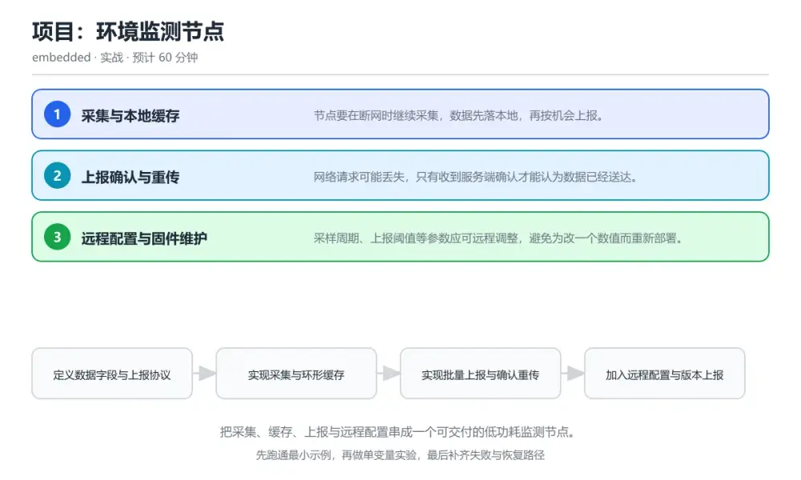
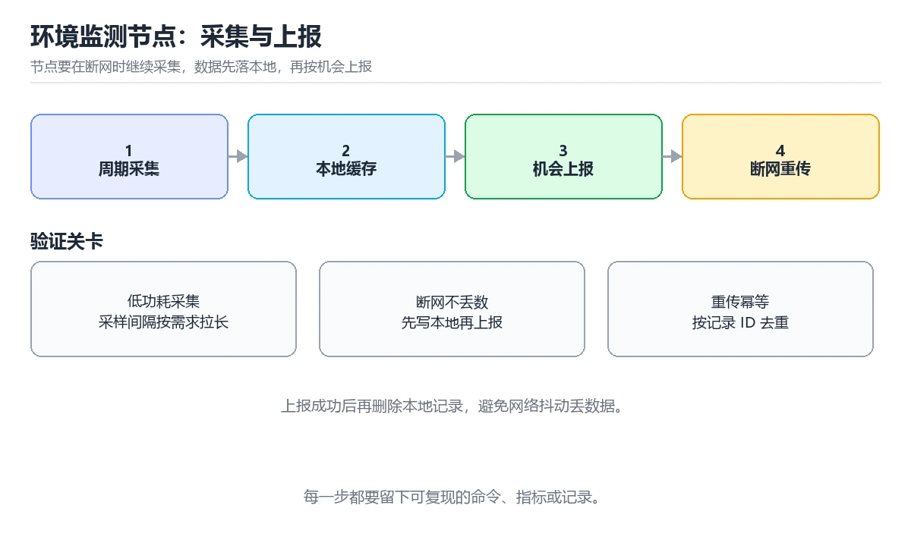

# 项目：环境监测节点

> 内容更新时间：2026-10-06 · 学习阶段：高级 · 预计用时：60 分钟

分类：embedded。关键词：环境监测、低功耗采集、断网重传、远程配置、交付。把采集、缓存、上报与远程配置串成一个可交付的低功耗监测节点。



## 本节知识框架

**课程定位**：所属分类 `embedded`（嵌入式与物联网），课程主题 `项目：环境监测节点`，学习阶段 高级，建议用时 60 分钟。

本课主线：把采集、缓存、上报与远程配置串成一个可交付的低功耗监测节点。

**学完本课应当能够**
- 说清 `环形缓存` 与 `批次号` 的含义与区别，并各举一个正例和一个反例。
- 用本课示例验证 `幂等` 的行为，记录输入、输出与失败条件。
- 遇到「恢复联网后数据重复」这类问题时，能说出触发条件与修复顺序。

### 从概念到验证的学习链条

1. `环形缓存`：先掌握 固定容量、按下标循环复用的本地存储结构，再用它解释 `批次号` 为什么会出现。
2. `批次号`：先掌握 一次批量上报的唯一标识，用于服务端去重，再用它解释 `幂等` 为什么会出现。
3. `幂等`：先掌握 同一请求重复执行多次与执行一次的结果相同，再用它解释 `检查点` 为什么会出现。
4. `检查点`：先掌握 落盘记录的进度位置，重启后从这里继续，再用它解释 `配置回滚` 为什么会出现。
5. `配置回滚`：先掌握 新配置导致异常时恢复上一份可用配置，再用它解释 `采集` 为什么会出现。
6. `采集`：先掌握 采集结果带时间戳写入环形缓存，写满后按策略覆盖最旧记录；上报成功收到确认后才推进读指针，再用它解释 本课示例的观察结果 为什么会出现。

**先修与衔接**：本课是「嵌入式与物联网」分类的第 10 课。当前没有登记显式先修或后续课程；课程主线是把采集、缓存、上报与远程配置串成一个可交付的低功耗监测节点。学完后按 `embedded` 分类顺序继续。

### 完成判据

- **定义关**：不看正文也能说明 `环形缓存` 是 固定容量、按下标循环复用的本地存储结构，并指出一个反例。
- **机制关**：能按“输入 → 转换 → 输出 → 验证”复述 `项目：环境监测节点`，而不是只背结论。
- **示例关**：能运行或推演 `项目：环境监测节点` 的 `text` 示例，并说明一个真实出现的标识符或字面量。
- **证据关**：能指出 `项目：环境监测节点` 示例里的 调用了 `buffer_push()`，并说明它支持或反驳了本课的哪一条结论。
- **排错关**：能复现 恢复联网后数据重复，记录现象并按 设备为每批数据生成唯一批次号，服务端按批次号幂等入库 修复。
- **迁移关**：能把 `环境监测`、`低功耗采集`、`断网重传`、`远程配置` 放进一个与 `项目：环境监测节点` 不同的项目场景，并保持输入与验证条件可追踪。
- **复盘关**：学完 `项目：环境监测节点` 后，用一句话写下仍然不确定的结论，并列出下一次验证需要的输入、环境和成功判据。

### 复习清单

- [ ] 能不看正文复述本课核心术语，并指出一个边界或反例。
- [ ] 能运行或推演本课示例，记录输入、输出与失败现象。
- [ ] 能完成一次自测，并把错题对照错误表定位原因。

**本课配图**



## 核心概念定义

| 术语 | 操作性定义 | 常见边界与风险 |
| --- | --- | --- |
| 环形缓存 | 固定容量、按下标循环复用的本地存储结构。 | 只在「固定容量、按下标循环复用的本地存储结构」这一前提下成立，换输入或换环境要重新验证。 |
| 批次号 | 一次批量上报的唯一标识，用于服务端去重。 | 易错：重传时不带批次号，服务端也无去重逻辑；正确做法是设备为每批数据生成唯一批次号，服务端按批次号幂等入库。 |
| 幂等 | 同一请求重复执行多次与执行一次的结果相同。 | 易错：重传时不带批次号，服务端也无去重逻辑；正确做法是设备为每批数据生成唯一批次号，服务端按批次号幂等入库。 |
| 检查点 | 落盘记录的进度位置，重启后从这里继续。 | 只在「落盘记录的进度位置，重启后从这里继续」这一前提下成立，换输入或换环境要重新验证。 |
| 配置回滚 | 新配置导致异常时恢复上一份可用配置。 | 只在「新配置导致异常时恢复上一份可用配置」这一前提下成立，换输入或换环境要重新验证。 |
| 采集 | 采集结果带时间戳写入环形缓存，写满后按策略覆盖最旧记录；上报成功收到确认后才推进读指针 | 越界、悬垂引用与释放顺序会破坏结论，必须在边界输入下复验。 |

## 原理与运行机制

### 机制总览

**教材衔接：核心知识**

### 1. 采集与本地缓存

节点要在断网时继续采集，数据先落本地，再按机会上报。

采集结果带时间戳写入环形缓存，写满后按策略覆盖最旧记录；上报成功收到确认后才推进读指针。

在项目：环境监测节点里可以这样验证：在本课示例里拔掉网络一段时间，观察缓存条数增长，恢复后按顺序补齐上报。

边界：缓存写满后静默覆盖未上报数据会造成不可恢复的丢失，必须在覆盖前给出告警指标。

工程视角：给每条记录加序号与校验，重启后从最后一条有效记录继续，缓存水位作为健康指标上报。

### 2. 上报确认与重传

网络请求可能丢失，只有收到服务端确认才能认为数据已经送达。

批量上报带批次号，服务端按批次号去重并返回确认，设备收到确认后推进读指针，超时则退避重传。

在项目：环境监测节点里可以这样验证：在本课示例里模拟一次确认丢失，观察设备重传同一批次而服务端只入库一次。

边界：没有幂等键的重传会在服务端产生重复记录，把统计结果整体拉高。

工程视角：设备与服务端约定批次号与去重窗口，把重传次数与时延纳入监控。

### 3. 远程配置与固件维护

采样周期、上报阈值等参数应可远程调整，避免为改一个数值而重新部署。

设备在联网时拉取配置版本，校验合法范围后写入并立即生效，同时上报当前生效版本供运维核对。

在项目：环境监测节点里可以这样验证：在本课示例里下发一组新采样参数，观察设备上报的配置版本变化与生效时间。

边界：不校验范围的远程配置可能让设备进入不可用状态，例如把采样周期设为 0。

工程视角：配置项带版本号与合法区间，保留上一份可用配置用于回滚，变更记录写入运维日志。

**教材衔接：交付评审：评分表、决策记录与证据链**

「项目：环境监测节点」的验收不能只看功能能不能跑通。下面把正文里的交付物、验证命令和关键设计点整理成一张评审表，按表逐项留下证据即可。

### 一、「项目：环境监测节点」的交付物评分表

| 交付物 | 权重 | 合格线 | 需要的证据 |
| --- | ---: | --- | --- |
| 可运行代码：包含c源文件、依赖说明与启动入口。 | 25% | 能在干净环境复现，且失败路径有明确处理 | 命令与输出、对应测试、一次失败与恢复记录 |
| README：环境版本、启动命令、目录结构与已知限制。 | 25% | 能在干净环境复现，且失败路径有明确处理 | 命令与输出、对应测试、一次失败与恢复记录 |
| 测试记录：正常、边界与失败路径各至少一条，附命令与输出。 | 25% | 能在干净环境复现，且失败路径有明确处理 | 命令与输出、对应测试、一次失败与恢复记录 |
| 复盘记录：本次实现推翻了哪个假设，下一步验证动作是什么。 | 25% | 能在干净环境复现，且失败路径有明确处理 | 命令与输出、对应测试、一次失败与恢复记录 |

### 二、需要写下来的决策（ADR）

| 决策点 | 本课给出的做法 | 备选方案 | 代价与回滚 |
| --- | --- | --- | --- |
| 里程碑 | 1. 定义数据字段与上报协议 | 不做「里程碑」，沿用最朴素的实现（需要额外补一次对照实验） | 若「里程碑」出问题，回到上一版本并按本课验收场景重跑 |

### 三、「项目：环境监测节点」的交付证据链

本课未给出可执行命令，用下面的最小证据集代替：

### 四、「项目：环境监测节点」的验收指标

| 指标 | 目标值 | 测量方式 | 不达标时的动作 |
| --- | --- | --- | --- |
| 失败路径：出现「重传时不带批次号，服务端也无去重逻辑」时按上面的失败预算恢复。 | 用本课正文给出的阈值，没有就写实测基线 | 固定环境重复三次取中位数 | 回到对应小节定位，先修原因再重测 |

### 五、评审记录模板

| 记录项 | 填写要求 |
| --- | --- |
| 项目标识 | `embedded_project_env_monitor` |
| 本次范围 | 说明这一轮交付了「项目：环境监测节点」的哪些部分 |
| 未完成项 | 列出与 环境监测 相关但本轮未做的内容 |
| 证据位置 | 指向 evidence/ 目录下的具体文件 |
| 风险与回滚 | 写清剩余风险、回滚步骤和验证方式 |
| 结论 | 通过 / 有条件通过 / 不通过，三者选一 |

### 机制拆解：每一步的输入、动作与输出

#### 1. `环形缓存`
- 输入：`环境监测`；本步把 固定容量、按下标循环复用的本地存储结构 当作判断规则。
- 动作：围绕 `环形缓存` 保留中间状态，并记录它与 `批次号` 的对应关系。
- 输出：`批次号`，它可以被下一段代码、测试或记录继续使用。
- `环形缓存` 的失败条件：只在「固定容量、按下标循环复用的本地存储结构」这一前提下成立，换输入或换环境要重新验证。

#### 2. `批次号`
- 输入：`环形缓存`；本步把 一次批量上报的唯一标识，用于服务端去重 当作判断规则。
- 动作：围绕 `批次号` 保留中间状态，并记录它与 `幂等` 的对应关系。
- 输出：`幂等`，它可以被下一段代码、测试或记录继续使用。
- `批次号` 的失败条件：当恢复联网后数据重复时，会出现重传时不带批次号，服务端也无去重逻辑。

#### 3. `幂等`
- 输入：`批次号`；本步把 同一请求重复执行多次与执行一次的结果相同 当作判断规则。
- 动作：围绕 `幂等` 保留中间状态，并记录它与 `检查点` 的对应关系。
- 输出：`检查点`，它可以被下一段代码、测试或记录继续使用。
- `幂等` 的失败条件：当恢复联网后数据重复时，会出现重传时不带批次号，服务端也无去重逻辑。

#### 4. `检查点`
- 输入：`幂等`；本步把 落盘记录的进度位置，重启后从这里继续 当作判断规则。
- 动作：围绕 `检查点` 保留中间状态，并记录它与 `配置回滚` 的对应关系。
- 输出：`配置回滚`，它可以被下一段代码、测试或记录继续使用。
- `检查点` 的失败条件：只在「落盘记录的进度位置，重启后从这里继续」这一前提下成立，换输入或换环境要重新验证。

#### 5. `配置回滚`
- 输入：`检查点`；本步把 新配置导致异常时恢复上一份可用配置 当作判断规则。
- 动作：围绕 `配置回滚` 保留中间状态，并记录它与 `采集` 的对应关系。
- 输出：`采集`，它可以被下一段代码、测试或记录继续使用。
- `配置回滚` 的失败条件：只在「新配置导致异常时恢复上一份可用配置」这一前提下成立，换输入或换环境要重新验证。

#### 6. `采集`
- 输入：`配置回滚`；本步把 采集结果带时间戳写入环形缓存，写满后按策略覆盖最旧记录；上报成功收到确认后才推进读指针 当作判断规则。
- 动作：围绕 `采集` 保留中间状态，并记录它与 `buffer_push` 的对应关系。
- 输出：`buffer_push`，它可以被下一段代码、测试或记录继续使用。
- `采集` 的失败条件：越界、悬垂引用与释放顺序会破坏结论，必须在边界输入下复验。

### 示例中的可观察事实

1. 调用了 `buffer_push()`；它对应的课程主题是 `项目：环境监测节点`。
2. 调用了 `upload_pending()`；它对应的课程主题是 `项目：环境监测节点`。
3. 调用了 `collect_batch()`；它对应的课程主题是 `项目：环境监测节点`。
4. 调用了 `http_post_batch()`；它对应的课程主题是 `项目：环境监测节点`。
5. 调用了 `backoff_and_retry()`；它对应的课程主题是 `项目：环境监测节点`。
6. 调用了 `persist_checkpoint()`；它对应的课程主题是 `项目：环境监测节点`。

### 复现实验记录

- 环境：`项目：环境监测节点` 使用 `text` 示例，固定 `环境监测`、`低功耗采集`、`断网重传`、`远程配置` 作为第一组条件。
- 首轮输入：先确认 调用了 `buffer_push()`，预测 `环形缓存` 会怎样变化。
- 基线观察：记录命令、输入、输出和错误原文，不用截图代替可复制的文本。
- 单变量修改：只改变 `环境监测`，观察 `采集` 是否仍满足定义。
- 失败注入：复现 恢复联网后数据重复，确认现象是 重传时不带批次号，服务端也无去重逻辑。
- 记录结论：把“修改前、修改后、预期变化、实际变化”写成四列表，这样复盘 `项目：环境监测节点` 时才能区分概念错误与实现错误。

## 典型应用场景

**教材衔接：项目专属规格**

### 交付目标

把采集、缓存、上报与远程配置串成一个可交付的低功耗监测节点。

### 里程碑

1. 定义数据字段与上报协议
2. 实现采集与环形缓存
3. 实现批量上报与确认重传
4. 加入远程配置与版本上报
5. 完成断网断电与长稳测试

### 输入与约束

- 输入：配齐采集、缓存、上报、配置四项功能，并给出一次断网十分钟的补传日志。
- 约束：缓存写满后静默覆盖未上报数据会造成不可恢复的丢失，必须在覆盖前给出告警指标。
- 失败预算：设备为每批数据生成唯一批次号，服务端按批次号幂等入库

### 验收场景

1. 正常路径：跑通「可运行练习」里的最小示例并保存输出。
2. 边界路径：在本课示例里拔掉网络一段时间，观察缓存条数增长，恢复后按顺序补齐上报。
3. 失败路径：出现「重传时不带批次号，服务端也无去重逻辑」时按上面的失败预算恢复。

**教材衔接：项目交付物**

- 可运行代码：包含c源文件、依赖说明与启动入口。
- README：环境版本、启动命令、目录结构与已知限制。
- 测试记录：覆盖 环境监测 与 低功耗采集 的正常、边界与失败路径，附命令与输出。
- 复盘记录：本轮 环境监测 的实现推翻了哪个假设，下一步验证动作是什么。

### 交付验收清单

- [ ] 能交付一个可在断网与断电条件下自恢复的采集节点。
- [ ] 能设计上报确认与重传机制，保证数据不丢不乱。
- [ ] 能把功耗、存储与上报周期的参数做成可配置项。

**教材衔接：深度拓展与实战**

### 机制拆解 1：采集与本地缓存

采集结果带时间戳写入环形缓存，写满后按策略覆盖最旧记录；上报成功收到确认后才推进读指针。

落地时先确认前提：缓存写满后静默覆盖未上报数据会造成不可恢复的丢失，必须在覆盖前给出告警指标。再把结论写进检查表，让下一位同学可以按同样的输入复现。

工程做法：给每条记录加序号与校验，重启后从最后一条有效记录继续，缓存水位作为健康指标上报。

### 机制拆解 2：上报确认与重传

批量上报带批次号，服务端按批次号去重并返回确认，设备收到确认后推进读指针，超时则退避重传。

落地时先确认前提：没有幂等键的重传会在服务端产生重复记录，把统计结果整体拉高。再把结论写进检查表，让下一位同学可以按同样的输入复现。

工程做法：设备与服务端约定批次号与去重窗口，把重传次数与时延纳入监控。

### 机制拆解 3：远程配置与固件维护

设备在联网时拉取配置版本，校验合法范围后写入并立即生效，同时上报当前生效版本供运维核对。

落地时先确认前提：不校验范围的远程配置可能让设备进入不可用状态，例如把采样周期设为 0。再把结论写进检查表，让下一位同学可以按同样的输入复现。

工程做法：配置项带版本号与合法区间，保留上一份可用配置用于回滚，变更记录写入运维日志。

### 机制对照表

| 概念 | 解决什么问题 | 关键前提 | 失败信号 |
| --- | --- | --- | --- |
| 采集与本地缓存 | 节点要在断网时继续采集，数据先落本地，再按机会上报。 | 缓存写满后静默覆盖未上报数据会造成不可恢复的丢失，必须在覆盖前给出告警指 | 给每条记录加序号与校验，重启后从最后一条有效记录继续，缓存水位作为健康指 |
| 上报确认与重传 | 网络请求可能丢失，只有收到服务端确认才能认为数据已经送达。 | 没有幂等键的重传会在服务端产生重复记录，把统计结果整体拉高。 | 设备与服务端约定批次号与去重窗口，把重传次数与时延纳入监控。 |
| 远程配置与固件维护 | 采样周期、上报阈值等参数应可远程调整，避免为改一个数值而重新部署。 | 不校验范围的远程配置可能让设备进入不可用状态，例如把采样周期设为 0。 | 配置项带版本号与合法区间，保留上一份可用配置用于回滚，变更记录写入运维日 |

### 自测问答

**问 1**：设备上报后为什么要等服务端确认才推进读指针？

**答**：确认到达才代表数据真正入库。网络发送成功不等于服务端入库成功，只有收到确认才推进读指针，才能在断网或丢包后补传缺失数据。 正确选项「确认到达才代表数据真正入库」对应《项目：环境监测节点》的要点「采集与本地缓存」：节点要在断网时继续采集，数据先落本地，再按机会上报。判断「采集与本地缓存」时先确认前提是否成立，再回到《项目：环境监测节点》的示例核对一次；把别的语言或框架的默认做法直接搬到采集与本地缓存上，往往会在本课的边界条件里失效。

**问 2**：远程下发采样周期前必须做的一件事是？

**答**：校验取值范围是否合法。不校验范围的配置可能让设备进入不可用状态，例如把周期设为 0 或超大值，因此必须限定合法区间并支持回滚。 正确选项「校验取值范围是否合法」对应《项目：环境监测节点》的要点「上报确认与重传」：网络请求可能丢失，只有收到服务端确认才能认为数据已经送达。判断「上报确认与重传」时先确认前提是否成立，再回到《项目：环境监测节点》的示例核对一次；借鉴相邻主题的经验之前，先核对上报确认与重传的前提是否成立。

**问 3**：交付一个监测节点时需要准备哪些证据？（多选）

**答**：断网与恢复的完整日志；缓存水位与重传次数统计；功耗与续航实测记录。日志、指标与实测数据是可复现的交付证据；口头结论无法让他人验证，也无法在出问题时对比。 正确选项「断网与恢复的完整日志；缓存水位与重传次数统计；功耗与续航实测记录」对应《项目：环境监测节点》的要点「远程配置与固件维护」：采样周期、上报阈值等参数应可远程调整，避免为改一个数值而重新部署。判断「远程配置与固件维护」时先确认前提是否成立，再回到《项目：环境监测节点》的示例核对一次；记住远程配置与固件维护的结论之外还要记住适用条件，换一个输入往往就不成立了。

**问 4**：请按一次采集上报闭环排列。

**答**：定时唤醒并采集。采集先落本地保证不丢，上报由服务端幂等处理，收到确认后才推进进度，任何一步断电都能按检查点续传。 正确选项「定时唤醒并采集；带时间戳写入缓存；联网批量上报；服务端去重并返回确认；推进读指针并落盘检查点」对应《项目：环境监测节点》的要点「采集与本地缓存」：节点要在断网时继续采集，数据先落本地，再按机会上报。判断「采集与本地缓存」时先确认前提是否成立，再回到《项目：环境监测节点》的示例核对一次；干扰项常常是相邻主题里成立的结论，只有按采集与本地缓存的输入与约束判断才能排除。

**问 5**：阅读这段恢复逻辑，问题是什么？

**答**：重启后读指针没有按检查点恢复，会重复上报已确认数据。重启后把读指针清零会让所有历史数据重新上报，服务端虽有去重但流量与功耗都被浪费；应从非易失存储恢复检查点后再继续。 正确选项「重启后读指针没有按检查点恢复，会重复上报已确认数据」对应《项目：环境监测节点》的要点「上报确认与重传」：网络请求可能丢失，只有收到服务端确认才能认为数据已经送达。判断「上报确认与重传」时先确认前提是否成立，再回到《项目：环境监测节点》的示例核对一次；把上报确认与重传的做法换到别的约束下未必成立，先确认边界再决定答案。


### 工程检查表

- [ ] 定义数据字段与上报协议
- [ ] 实现采集与环形缓存
- [ ] 实现批量上报与确认重传
- [ ] 加入远程配置与版本上报
- [ ] 完成断网断电与长稳测试
- [ ] 【采集与本地缓存】给每条记录加序号与校验，重启后从最后一条有效记录继续，缓存水位作为健康指标上报。
- [ ] 【上报确认与重传】设备与服务端约定批次号与去重窗口，把重传次数与时延纳入监控。
- [ ] 【远程配置与固件维护】配置项带版本号与合法区间，保留上一份可用配置用于回滚，变更记录写入运维日志。


### 结论与下一步

<!-- p1-project-review:start -->

- **恢复联网后数据重复**：典型现象是重传时不带批次号，服务端也无去重逻辑；正确做法是设备为每批数据生成唯一批次号，服务端按批次号幂等入库。
- **断网期间数据丢失**：典型现象是缓存满后直接覆盖最早的数据且无告警；正确做法是覆盖前计数并上报缓存水位，必要时扩容或降低采样频率。
- **远程改参后设备失联**：典型现象是配置不做范围校验直接生效；正确做法是对每个配置项校验合法区间并保留上一份可用配置，异常时自动回滚。

### 最小验证场景

- 准备：保留 `text` 示例的原始输入，先记录 `项目：环境监测节点` 的基线输出和完整运行命令。
- 观察：先核对 调用了 `buffer_push()`，再改变一个与 `环形缓存` 相关的条件。
- 判定：新结果与 `项目：环境监测节点` 的基线不同不等于错误；只有当差异破坏了 `环形缓存` 的定义或错误表中的约束，才判定为失败。

### 选择与边界

- 使用 `环形缓存` 时，先满足它的定义：固定容量、按下标循环复用的本地存储结构；只在「固定容量、按下标循环复用的本地存储结构」这一前提下成立，换输入或换环境要重新验证。
- 使用 `批次号` 时，先满足它的定义：一次批量上报的唯一标识，用于服务端去重；易错：重传时不带批次号，服务端也无去重逻辑；正确做法是设备为每批数据生成唯一批次号，服务端按批次号幂等入库。
- 使用 `幂等` 时，先满足它的定义：同一请求重复执行多次与执行一次的结果相同；易错：重传时不带批次号，服务端也无去重逻辑；正确做法是设备为每批数据生成唯一批次号，服务端按批次号幂等入库。
- 使用 `检查点` 时，先满足它的定义：落盘记录的进度位置，重启后从这里继续；只在「落盘记录的进度位置，重启后从这里继续」这一前提下成立，换输入或换环境要重新验证。
- 使用 `配置回滚` 时，先满足它的定义：新配置导致异常时恢复上一份可用配置；只在「新配置导致异常时恢复上一份可用配置」这一前提下成立，换输入或换环境要重新验证。

## 代码/协议/SQL 示例

**教材衔接：关键流程**

```text
定义数据字段与上报协议 → 实现采集与环形缓存 → 实现批量上报与确认重传 → 加入远程配置与版本上报 → 完成断网断电与长稳测试
```

1. 定义数据字段与上报协议
2. 实现采集与环形缓存
3. 实现批量上报与确认重传
4. 加入远程配置与版本上报
5. 完成断网断电与长稳测试

**教材衔接：验证命令与预期输出**

| 步骤 | 命令 | 预期输出 |
| --- | --- | --- |
| 准备环境 | 按 README 安装依赖 | 依赖安装完成且没有版本冲突 |
| 运行示例 | 运行「可运行练习」中的入口 | offline 12 samples buffered，batch 7 upload ok (dedup=1)，confirmed index persisted |
| 边界输入 | 替换一个输入后重跑 | 结果仍能被正文机制解释 |
| 失败演练 | 按「故障现场」制造一次失败 | 能定位根因并恢复到正常输出 |

### 验收证据

- [ ] 保存一次成功运行的完整输出。
- [ ] 保存一次边界输入的输出与解释。
- [ ] 记录一次失败现象、根因与修复动作。

> 项目目标：项目：环境监测节点 的每一步都要能复现，做不到复现就先缩小范围。

```c
// 环形缓存：写指针推进，未确认的数据不覆盖
static bool buffer_push(const env_record_t *record) {
    uint32_t next = (g_write + 1) % CACHE_CAPACITY;
    if (next == g_confirmed) {
        g_cache_overflow++;               // 覆盖前先计数并告警
        return false;
    }
    g_cache[g_write] = *record;
    g_write = next;
    return true;
}

// 批量上报：服务端按 batch_id 幂等去重，收到确认才推进读指针
static void upload_pending(void) {
    while (g_confirmed != g_write) {
        uint32_t count = collect_batch(g_batch, CACHE_CAPACITY, g_confirmed);
        if (!http_post_batch(g_batch, count, g_batch_id, 3000)) {
            backoff_and_retry();           // 失败退避，下个周期继续
            return;
        }
        g_confirmed = (g_confirmed + count) % CACHE_CAPACITY;
        persist_checkpoint(g_confirmed);   // 落盘，断电后不重复也不丢
    }
}
```

### 示例精读：先找证据，再改一个条件

1. 调用了 `buffer_push()`；它出现在 `项目：环境监测节点` 的示例中，阅读时先确认它前后各发生了什么。
2. 调用了 `upload_pending()`；它出现在 `项目：环境监测节点` 的示例中，阅读时先确认它前后各发生了什么。
3. 调用了 `collect_batch()`；它出现在 `项目：环境监测节点` 的示例中，阅读时先确认它前后各发生了什么。
4. 调用了 `http_post_batch()`；它出现在 `项目：环境监测节点` 的示例中，阅读时先确认它前后各发生了什么。
5. 调用了 `backoff_and_retry()`；它出现在 `项目：环境监测节点` 的示例中，阅读时先确认它前后各发生了什么。
6. 调用了 `persist_checkpoint()`；它出现在 `项目：环境监测节点` 的示例中，阅读时先确认它前后各发生了什么。
- 在 `项目：环境监测节点` 中与 `环形缓存` 对照：示例必须能支持 固定容量、按下标循环复用的本地存储结构，否则说明这一段还缺少实现或验证步骤。
- 在 `项目：环境监测节点` 中与 `批次号` 对照：示例必须能支持 一次批量上报的唯一标识，用于服务端去重，否则说明这一段还缺少实现或验证步骤。
- 在 `项目：环境监测节点` 中与 `幂等` 对照：示例必须能支持 同一请求重复执行多次与执行一次的结果相同，否则说明这一段还缺少实现或验证步骤。
- 在 `项目：环境监测节点` 中与 `检查点` 对照：示例必须能支持 落盘记录的进度位置，重启后从这里继续，否则说明这一段还缺少实现或验证步骤。

## 时间/空间复杂度或性能分析

**性能关注点（项目：环境监测节点）**：资源受限是前提：记录 Flash/RAM 占用、中断延迟与功耗。

**本课特有开销（项目：环境监测节点 · 环境监测）**：缓存命中率比缓存实现本身更关键，先记录命中率与失效策略再谈优化。

**测量方法**：以 `项目：环境监测节点` 的 `环境监测` 场景为对象，固定输入跑一遍记录基线，再把规模或并发度提高一个数量级复测；两次结果的差值与波动范围才是结论依据。

### 需要控制的变量与记录项

- `项目：环境监测节点` 的 `环境监测`：固定它的版本、输入范围和资源上限，分别记录速度、内存与失败率的变化。
- `项目：环境监测节点` 的 `低功耗采集`：固定它的版本、输入范围和资源上限，分别记录速度、内存与失败率的变化。
- `项目：环境监测节点` 的 `断网重传`：固定它的版本、输入范围和资源上限，分别记录速度、内存与失败率的变化。
- `项目：环境监测节点` 的 `远程配置`：固定它的版本、输入范围和资源上限，分别记录速度、内存与失败率的变化。
- `项目：环境监测节点` 的 `交付`：固定它的版本、输入范围和资源上限，分别记录速度、内存与失败率的变化。
- `项目：环境监测节点` 中 `环形缓存` 的边界：只在「固定容量、按下标循环复用的本地存储结构」这一前提下成立，换输入或换环境要重新验证。达到边界时不要外推，必须重新测量。
- `项目：环境监测节点` 中 `批次号` 的边界：易错：重传时不带批次号，服务端也无去重逻辑；正确做法是设备为每批数据生成唯一批次号，服务端按批次号幂等入库。达到边界时不要外推，必须重新测量。
- `项目：环境监测节点` 中 `幂等` 的边界：易错：重传时不带批次号，服务端也无去重逻辑；正确做法是设备为每批数据生成唯一批次号，服务端按批次号幂等入库。达到边界时不要外推，必须重新测量。
- `项目：环境监测节点` 中 `检查点` 的边界：只在「落盘记录的进度位置，重启后从这里继续」这一前提下成立，换输入或换环境要重新验证。达到边界时不要外推，必须重新测量。
- `项目：环境监测节点` 中 `配置回滚` 的边界：只在「新配置导致异常时恢复上一份可用配置」这一前提下成立，换输入或换环境要重新验证。达到边界时不要外推，必须重新测量。
- `项目：环境监测节点` 的代码证据：先验证 调用了 `buffer_push()`，再记录该路径的输入规模与耗时；只看代码行数不能推出复杂度。

## 常见误区与易错点

| 容易写错的做法 | 实际现象 | 原因与正确做法 |
| --- | --- | --- |
| 恢复联网后数据重复 | 重传时不带批次号，服务端也无去重逻辑。 | 设备为每批数据生成唯一批次号，服务端按批次号幂等入库。 |
| 断网期间数据丢失 | 缓存满后直接覆盖最早的数据且无告警。 | 覆盖前计数并上报缓存水位，必要时扩容或降低采样频率。 |
| 远程改参后设备失联 | 配置不做范围校验直接生效。 | 对每个配置项校验合法区间并保留上一份可用配置，异常时自动回滚。 |

### 现场 1：恢复联网后数据重复

**症状**：重传时不带批次号，服务端也无去重逻辑。

**根因与修复**：设备为每批数据生成唯一批次号，服务端按批次号幂等入库。

**自检**：在本课示例里复现「恢复联网后数据重复」，改成设备为每批数据生成唯一批次号，服务端按批次号幂等入库后重跑；如果症状消失且失败路径按预期变化，说明定位正确。

### 现场 2：断网期间数据丢失

**症状**：缓存满后直接覆盖最早的数据且无告警。

**根因与修复**：覆盖前计数并上报缓存水位，必要时扩容或降低采样频率。

**自检**：在本课示例里复现「断网期间数据丢失」，改成覆盖前计数并上报缓存水位，必要时扩容或降低采样频率后重跑；如果症状消失且失败路径按预期变化，说明定位正确。

### 现场 3：远程改参后设备失联

**症状**：配置不做范围校验直接生效。

**根因与修复**：对每个配置项校验合法区间并保留上一份可用配置，异常时自动回滚。

**自检**：在本课示例里复现「远程改参后设备失联」，改成对每个配置项校验合法区间并保留上一份可用配置，异常时自动回滚后重跑；如果症状消失且失败路径按预期变化，说明定位正确。

## 与其他知识点的关系

| 关系 | 课程 | 为什么 |
| --- | --- | --- |
| 前置顺序 | 《IoT 设备安全基础》 | 同分类中安排在本课之前，建议先完成其自测。 |

**教材衔接：复习与迁移**


### 迁移练习

- **术语归属**：`环形缓存`、`批次号`、`幂等` 的定义以本课「核心概念定义」为准，换到其他课程时先确认定义是否被改写。

### 容易混淆的相邻概念

- `环形缓存` 与 `批次号`：前者强调 固定容量、按下标循环复用的本地存储结构；后者强调 一次批量上报的唯一标识，用于服务端去重。判断时分别检查两条定义的适用范围，不要只看名称相似就互换。
- `批次号` 与 `幂等`：前者强调 一次批量上报的唯一标识，用于服务端去重；后者强调 同一请求重复执行多次与执行一次的结果相同。判断时分别检查两条定义的适用范围，不要只看名称相似就互换。
- `幂等` 与 `检查点`：前者强调 同一请求重复执行多次与执行一次的结果相同；后者强调 落盘记录的进度位置，重启后从这里继续。判断时分别检查两条定义的适用范围，不要只看名称相似就互换。
- `检查点` 与 `配置回滚`：前者强调 落盘记录的进度位置，重启后从这里继续；后者强调 新配置导致异常时恢复上一份可用配置。判断时分别检查两条定义的适用范围，不要只看名称相似就互换。
- `配置回滚` 与 `采集`：前者强调 新配置导致异常时恢复上一份可用配置；后者强调 采集结果带时间戳写入环形缓存，写满后按策略覆盖最旧记录；上报成功收到确认后才推进读指针。判断时分别检查两条定义的适用范围，不要只看名称相似就互换。

## 自测题与参考答案

> 先独立作答，再对照参考答案；答案都能在本课正文、术语表或错误表里找到依据。

### 自测 1（概念复述）

不看正文，写出 `环形缓存` 的操作性定义，并说明它与 `批次号` 的区别。

**参考答案**：固定容量、按下标循环复用的本地存储结构。

`批次号` 的定位是：一次批量上报的唯一标识，用于服务端去重；两者的差别要从适用对象与失败模式上说明。

### 自测 2（排错）

本课错误表记录了「恢复联网后数据重复」这类做法。请写出它会出现的现象、根因，以及修复顺序。

**参考答案**：现象是重传时不带批次号，服务端也无去重逻辑；正确做法是设备为每批数据生成唯一批次号，服务端按批次号幂等入库。修复时先复现现象并保留证据，再改动一处假设重跑，确认现象消失。

### 自测 3（动手验证）

运行本课的 `text` 示例，改动其中一个输入后重新运行，记录输出与错误信息。

**参考答案**：正常输入下 `text` 示例应当复现正文给出的结果；改动输入后，如果结果改变或报错，先核对它是否满足 `项目：环境监测节点` 中`环形缓存` 的适用范围，再检查错误表里是否有同类现象。

### 自测 4（代码阅读）

阅读本课开头的 `text` 示例，说明它体现了`环形缓存` 的哪一条性质，并指出改动哪个输入会让这条性质不再成立。

**参考答案**：`环形缓存` 的定义是 固定容量、按下标循环复用的本地存储结构，示例正是在实现这条定义。改动与 `环形缓存` 有关的一个输入后，如果结果不再符合 `项目：环境监测节点` 的正文描述，就说明该性质只在当前前提成立。

### 自测 5（迁移）

把 `项目：环境监测节点` 的方法迁移到自己的项目：围绕 `环形缓存` 写出一个与错误表同类的风险点，并说明触发条件和检验方式。

**参考答案**：例如「远程改参后设备失联」，它会导致配置不做范围校验直接生效；检验方式是按对每个配置项校验合法区间并保留上一份可用配置，异常时自动回滚改一处再复现，确认现象消失且没有引入新的失败分支。

### 自测 6（对比）

用一个表格对比 `环形缓存` 与 `批次号`：各写一行适用场景、一行失败表现。

**参考答案**：`环形缓存` 的定义是固定容量、按下标循环复用的本地存储结构；`批次号` 的定义是一次批量上报的唯一标识，用于服务端去重。两者的失败表现分别对应本课错误表里与本术语相关的行。

### 自测 7（排错顺序）

面对「恢复联网后数据重复」引发的问题，请把“复现 重传时不带批次号，服务端也无去重逻辑 → 保留证据 → 设备为每批数据生成唯一批次号，服务端按批次号幂等入库 → 回归验证”四步写成可执行的检查清单。

**参考答案**：第一步按重传时不带批次号，服务端也无去重逻辑复现；第二步记录输入、版本与完整报错；第三步按设备为每批数据生成唯一批次号，服务端按批次号幂等入库只改一处；第四步重跑并确认失败路径也按预期变化。

### 自测 8（边界判断）

针对 `采集`，分别写出“可以使用”的条件和“结论不再成立”的条件。

**参考答案**：越界、悬垂引用与释放顺序会破坏结论，必须在边界输入下复验。 同时要把 `采集` 的定义 采集结果带时间戳写入环形缓存，写满后按策略覆盖最旧记录；上报成功收到确认后才推进读指针 与实际输入逐项对照。

### 自测 9（机制重建）

不看正文，按输入、转换、输出、验证四段重建 `环形缓存` → `批次号` → `幂等` → `检查点` 的作用链。

**参考答案**：起点是 `环形缓存` 的定义 固定容量、按下标循环复用的本地存储结构；中间每一步都保留可观察状态；终点由 `采集` 检查，失败时回到错误表定位第一个偏离定义的步骤。

### 自测 10（综合排错）

在 `项目：环境监测节点` 中，现象是 配置不做范围校验直接生效。请围绕 远程改参后设备失联 写出最小复现、关键证据、修复动作和回归验证，并说明为什么不能只凭一次运行下结论。

**参考答案**：先复现 远程改参后设备失联，记录输入与完整错误；再按 对每个配置项校验合法区间并保留上一份可用配置，异常时自动回滚 只改一处。回归时同时跑正常路径和边界路径，只有两次结果都可解释，才把修复视为完成。

### 自测 11（一分钟复述）

用每分钟约 200 字的速度复述 `项目：环境监测节点`：先给主问题，再按顺序说出 `环形缓存`、`批次号`、`幂等`、`检查点`，最后给一个失败案例。

**自评标准**：主问题必须对应 把采集、缓存、上报与远程配置串成一个可交付的低功耗监测节点；每个术语都要能接上一句定义或边界；失败案例必须写成可观察现象，不能用“可能有风险”代替证据。

## 术语速查

| 术语 | 一句话说明 |
| --- | --- |
| `环形缓存` | 固定容量、按下标循环复用的本地存储结构。 |
| `批次号` | 一次批量上报的唯一标识，用于服务端去重。 |
| `幂等` | 同一请求重复执行多次与执行一次的结果相同。 |
| `检查点` | 落盘记录的进度位置，重启后从这里继续。 |
| `配置回滚` | 新配置导致异常时恢复上一份可用配置。 |
| `采集` | 采集结果带时间戳写入环形缓存，写满后按策略覆盖最旧记录；上报成功收到确认后才推进读指针。 |

**术语关系**：`环形缓存`（固定容量、按下标循环复用的本地存储结构） → `批次号`（一次批量上报的唯一标识） → `幂等`（同一请求重复执行多次与执行一次的结果相同） → `检查点`（落盘记录的进度位置）。

## 考点精讲

`项目：环境监测节点` 的题库有 5 道题，下面逐题给出题干、正确项与判断依据：先自己作答，再核对正确项，最后回到正文对应小节复核。

### 考点 1：第 1 题

- **题目**：设备上报后为什么要等服务端确认才推进读指针？
- **正确项**：确认到达才代表数据真正入库
- **判断依据**：这道题检验本课主问题：把采集、缓存、上报与远程配置串成一个可交付的低功耗监测节点。复习时先复述本课主问题，再举一个会让结论失效的输入。

### 考点 2：第 2 题

- **题目**：远程下发采样周期前必须做的一件事是？
- **正确项**：校验取值范围是否合法
- **判断依据**：这道题检验本课主问题：把采集、缓存、上报与远程配置串成一个可交付的低功耗监测节点。复习时先复述本课主问题，再举一个会让结论失效的输入。

### 考点 3：第 3 题

- **题目**：交付一个监测节点时需要准备哪些证据？（多选）
- **正确项**：断网与恢复的完整日志；缓存水位与重传次数统计；功耗与续航实测记录
- **判断依据**：这道题检验本课主问题：把采集、缓存、上报与远程配置串成一个可交付的低功耗监测节点。复习时先复述本课主问题，再举一个会让结论失效的输入。

### 考点 4：第 4 题

- **题目**：请按一次采集上报闭环排列。
- **正确项**：定时唤醒并采集 → 带时间戳写入缓存 → 联网批量上报 → 服务端去重并返回确认 → 推进读指针并落盘检查点
- **判断依据**：这道题落在术语 `检查点` 上：落盘记录的进度位置，重启后从这里继续。复习时把 `检查点` 的定义、适用边界和一个反例一起说清楚，再回到「核心概念定义」核对原文。

### 考点 5：第 5 题

- **题目**：阅读这段恢复逻辑，问题是什么？
- **正确项**：重启后读指针没有按检查点恢复，会重复上报已确认数据
- **判断依据**：这道题落在术语 `检查点` 上：落盘记录的进度位置，重启后从这里继续。复习时把 `检查点` 的定义、适用边界和一个反例一起说清楚，再回到「核心概念定义」核对原文。

### 考点 6：`环形缓存`

- **要点**：固定容量、按下标循环复用的本地存储结构。
- **环形缓存 的边界**：只在「固定容量、按下标循环复用的本地存储结构」这一前提下成立，换输入或换环境要重新验证。

### 考点 7：`批次号`

- **要点**：一次批量上报的唯一标识，用于服务端去重。
- **批次号 的边界**：易错：重传时不带批次号，服务端也无去重逻辑；正确做法是设备为每批数据生成唯一批次号，服务端按批次号幂等入库。

### 考点 8：`幂等`

- **要点**：同一请求重复执行多次与执行一次的结果相同。
- **幂等 的边界**：易错：重传时不带批次号，服务端也无去重逻辑；正确做法是设备为每批数据生成唯一批次号，服务端按批次号幂等入库。

### 考点 9：`检查点`

- **要点**：落盘记录的进度位置，重启后从这里继续。
- **检查点 的边界**：只在「落盘记录的进度位置，重启后从这里继续」这一前提下成立，换输入或换环境要重新验证。

### 考点 10：`配置回滚`

- **要点**：新配置导致异常时恢复上一份可用配置。
- **配置回滚 的边界**：只在「新配置导致异常时恢复上一份可用配置」这一前提下成立，换输入或换环境要重新验证。

### 考点 11：`采集`

- **要点**：采集结果带时间戳写入环形缓存，写满后按策略覆盖最旧记录；上报成功收到确认后才推进读指针
- **采集 的边界**：越界、悬垂引用与释放顺序会破坏结论，必须在边界输入下复验。

### 考点 12：排错——恢复联网后数据重复

- **现象**：重传时不带批次号，服务端也无去重逻辑。
- **处理**：设备为每批数据生成唯一批次号，服务端按批次号幂等入库。

### 考点 13：排错——断网期间数据丢失

- **现象**：缓存满后直接覆盖最早的数据且无告警。
- **处理**：覆盖前计数并上报缓存水位，必要时扩容或降低采样频率。

### 考点 14：综合辨析——`环形缓存` 与 `采集`

- **辨析点**：`环形缓存` 的定义是 固定容量、按下标循环复用的本地存储结构；`采集` 的定义是 采集结果带时间戳写入环形缓存，写满后按策略覆盖最旧记录；上报成功收到确认后才推进读指针。
- **答题要求**：面对 `项目：环境监测节点` 的题目，先判断描述的是 `环形缓存` 还是 `采集`，再归到对应定义，最后写出一个会让该定义失效的边界输入。

### 考点 15：排错评分点

- **现象分**：能写出 重传时不带批次号，服务端也无去重逻辑，而不是只写“程序有错”。
- **证据分**：保留触发 恢复联网后数据重复 的输入、版本和错误原文。
- **修复分**：按 设备为每批数据生成唯一批次号，服务端按批次号幂等入库 只改一处，并同时回归正常路径与边界路径。

## 内容元数据

- 内容版本：v2.0
- 最后更新：2026-10-06
- 学习阶段：高级

| 字段 | 值 |
| --- | --- |
| 课程 ID | `embedded_project_env_monitor` |
| 所属分类 | `embedded` |
| 难度 | 高级 |
| 预计用时 | 60 分钟 |
| 关键词 | 环境监测、低功耗采集、断网重传、远程配置、交付 |
| 配图 | `images/lesson_embedded_project_env_monitor.webp` |
| 参考资料 | 2 条 |
| 内容更新时间 | 2026-10-06 |

## 参考资料与复核

- 来源性质：官方文档、标准或权威教材；本课核对关键词：环境监测、低功耗采集、断网重传、远程配置、交付。
- 最后复核：2026-10-04
- 下次复核：2027-02-17
- 复核范围：版本兼容、API 行为与工程实践

下面列出的资料用于核对本课结论，复习时可以对照阅读：
- [Eclipse Mosquitto 文档（MQTT 参考实现）](https://mosquitto.org/documentation/)
- [The Things Network 设备接入指南](https://www.thethingsnetwork.org/docs/devices/)

| [本课术语索引：项目：环境监测节点](#核心概念定义) | 按本课输入、术语边界和错误表现逐项核对 |
> 复核提示：《项目：环境监测节点》的结论如与资料冲突，以资料中的规范文本为准，并在笔记里记录差异与日期。